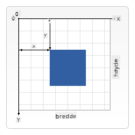

<!--
CO_OP_TRANSLATOR_METADATA:
{
  "original_hash": "056641280211e52fd0adb81b6058ec55",
  "translation_date": "2025-08-29T08:35:12+00:00",
  "source_file": "6-space-game/2-drawing-to-canvas/README.md",
  "language_code": "no"
}
-->
# Bygg et romspill del 2: Tegn helten og monstre på lerretet

## Quiz før forelesning

[Quiz før forelesning](https://ff-quizzes.netlify.app/web/quiz/31)

## Lerretet

Lerretet er et HTML-element som som standard ikke har noe innhold; det er en blank flate. Du må legge til innhold ved å tegne på det.

✅ Les [mer om Canvas API](https://developer.mozilla.org/docs/Web/API/Canvas_API) på MDN.

Slik blir det vanligvis deklarert som en del av sidens body:

```html
<canvas id="myCanvas" width="200" height="100"></canvas>
```

Ovenfor setter vi `id`, `width` og `height`.

- `id`: sett dette slik at du kan få en referanse når du trenger å interagere med det.
- `width`: dette er bredden på elementet.
- `height`: dette er høyden på elementet.

## Tegne enkel geometri

Lerretet bruker et kartesisk koordinatsystem for å tegne ting. Det bruker derfor en x-akse og y-akse for å uttrykke hvor noe er plassert. Plasseringen `0,0` er øverst til venstre, og nederst til høyre er det du har angitt som lerretets BREDDE og HØYDE.


> Bilde fra [MDN](https://developer.mozilla.org/docs/Web/API/Canvas_API/Tutorial/Drawing_shapes)

For å tegne på lerretet må du gå gjennom følgende steg:

1. **Få en referanse** til lerret-elementet.
1. **Få en referanse** til Context-elementet som ligger på lerret-elementet.
1. **Utfør en tegneoperasjon** ved hjelp av Context-elementet.

Kode for de ovennevnte stegene ser vanligvis slik ut:

```javascript
// draws a red rectangle
//1. get the canvas reference
canvas = document.getElementById("myCanvas");

//2. set the context to 2D to draw basic shapes
ctx = canvas.getContext("2d");

//3. fill it with the color red
ctx.fillStyle = 'red';

//4. and draw a rectangle with these parameters, setting location and size
ctx.fillRect(0,0, 200, 200) // x,y,width, height
```

✅ Canvas API fokuserer mest på 2D-former, men du kan også tegne 3D-elementer på en nettside; for dette kan du bruke [WebGL API](https://developer.mozilla.org/docs/Web/API/WebGL_API).

Du kan tegne mange forskjellige ting med Canvas API, som:

- **Geometriske former**, vi har allerede vist hvordan man tegner et rektangel, men det er mye mer du kan tegne.
- **Tekst**, du kan tegne tekst med hvilken som helst font og farge du ønsker.
- **Bilder**, du kan tegne et bilde basert på en bildefil som f.eks. en .jpg eller .png.

✅ Prøv det! Du vet hvordan du tegner et rektangel, kan du tegne en sirkel på en side? Ta en titt på noen interessante Canvas-tegninger på CodePen. Her er et [særlig imponerende eksempel](https://codepen.io/dissimulate/pen/KrAwx).

## Last inn og tegn et bilde

Du laster inn et bilde ved å opprette et `Image`-objekt og sette `src`-egenskapen. Deretter lytter du til `load`-hendelsen for å vite når det er klart til bruk. Koden ser slik ut:

### Last inn bilde

```javascript
const img = new Image();
img.src = 'path/to/my/image.png';
img.onload = () => {
  // image loaded and ready to be used
}
```

### Mønster for bildeinnlasting

Det anbefales å pakke det ovennevnte inn i en konstruksjon som denne, slik at det er enklere å bruke og du kun prøver å manipulere det når det er fullstendig lastet inn:

```javascript
function loadAsset(path) {
  return new Promise((resolve) => {
    const img = new Image();
    img.src = path;
    img.onload = () => {
      // image loaded and ready to be used
      resolve(img);
    }
  })
}

// use like so

async function run() {
  const heroImg = await loadAsset('hero.png')
  const monsterImg = await loadAsset('monster.png')
}

```

For å tegne spillressurser på en skjerm, vil koden din se slik ut:

```javascript
async function run() {
  const heroImg = await loadAsset('hero.png')
  const monsterImg = await loadAsset('monster.png')

  canvas = document.getElementById("myCanvas");
  ctx = canvas.getContext("2d");
  ctx.drawImage(heroImg, canvas.width/2,canvas.height/2);
  ctx.drawImage(monsterImg, 0,0);
}
```

## Nå er det på tide å begynne å bygge spillet ditt

### Hva du skal bygge

Du skal lage en nettside med et lerret-element. Det skal vise en svart skjerm `1024*768`. Vi har gitt deg to bilder:

- Helteskip

   

- 5*5 monster

   

### Anbefalte steg for å starte utviklingen

Finn filene som er opprettet for deg i undermappen `your-work`. Den skal inneholde følgende:

```bash
-| assets
  -| enemyShip.png
  -| player.png
-| index.html
-| app.js
-| package.json
```

Åpne en kopi av denne mappen i Visual Studio Code. Du må ha et lokalt utviklingsmiljø satt opp, helst med Visual Studio Code med NPM og Node installert. Hvis du ikke har `npm` satt opp på datamaskinen din, [slik gjør du det](https://www.npmjs.com/get-npm).

Start prosjektet ditt ved å navigere til `your_work`-mappen:

```bash
cd your-work
npm start
```

Ovennevnte vil starte en HTTP-server på adressen `http://localhost:5000`. Åpne en nettleser og skriv inn den adressen. Det er en tom side akkurat nå, men det vil endre seg.

> Merk: for å se endringer på skjermen, oppdater nettleseren din.

### Legg til kode

Legg til nødvendig kode i `your-work/app.js` for å løse følgende:

1. **Tegn** et lerret med svart bakgrunn
   > tips: legg til to linjer under den passende TODO i `/app.js`, og sett `ctx`-elementet til å være svart med topp/venstre koordinater på 0,0 og høyde og bredde lik lerretet.
2. **Last inn** teksturer
   > tips: legg til spiller- og fiendebildene ved å bruke `await loadTexture` og sende inn bildefilen. Du vil ikke se dem på skjermen ennå!
3. **Tegn** helten i midten av skjermen i den nederste halvdelen
   > tips: bruk `drawImage`-APIet for å tegne heroImg på skjermen, og sett `canvas.width / 2 - 45` og `canvas.height - canvas.height / 4)`;
4. **Tegn** 5*5 monstre
   > tips: Nå kan du fjerne kommentaren på koden for å tegne fiender på skjermen. Deretter går du til `createEnemies`-funksjonen og bygger den ut.

   Først, sett opp noen konstanter:

    ```javascript
    const MONSTER_TOTAL = 5;
    const MONSTER_WIDTH = MONSTER_TOTAL * 98;
    const START_X = (canvas.width - MONSTER_WIDTH) / 2;
    const STOP_X = START_X + MONSTER_WIDTH;
    ```

    deretter, opprett en løkke for å tegne arrayet av monstre på skjermen:

    ```javascript
    for (let x = START_X; x < STOP_X; x += 98) {
        for (let y = 0; y < 50 * 5; y += 50) {
          ctx.drawImage(enemyImg, x, y);
        }
      }
    ```

## Resultat

Det ferdige resultatet skal se slik ut:


## Løsning

Prøv å løse det selv først, men hvis du står fast, ta en titt på en [løsning](../../../../6-space-game/2-drawing-to-canvas/solution/app.js).

---

## 🚀 Utfordring

Du har lært om tegning med det 2D-fokuserte Canvas API; ta en titt på [WebGL API](https://developer.mozilla.org/docs/Web/API/WebGL_API), og prøv å tegne et 3D-objekt.

## Quiz etter forelesning

[Quiz etter forelesning](https://ff-quizzes.netlify.app/web/quiz/32)

## Gjennomgang og selvstudium

Lær mer om Canvas API ved å [lese om det](https://developer.mozilla.org/docs/Web/API/Canvas_API).

## Oppgave

[Lek med Canvas API](assignment.md)

---

**Ansvarsfraskrivelse**:  
Dette dokumentet er oversatt ved hjelp av AI-oversettelsestjenesten [Co-op Translator](https://github.com/Azure/co-op-translator). Selv om vi tilstreber nøyaktighet, vennligst vær oppmerksom på at automatiske oversettelser kan inneholde feil eller unøyaktigheter. Det originale dokumentet på sitt opprinnelige språk bør anses som den autoritative kilden. For kritisk informasjon anbefales profesjonell menneskelig oversettelse. Vi er ikke ansvarlige for eventuelle misforståelser eller feiltolkninger som oppstår ved bruk av denne oversettelsen.