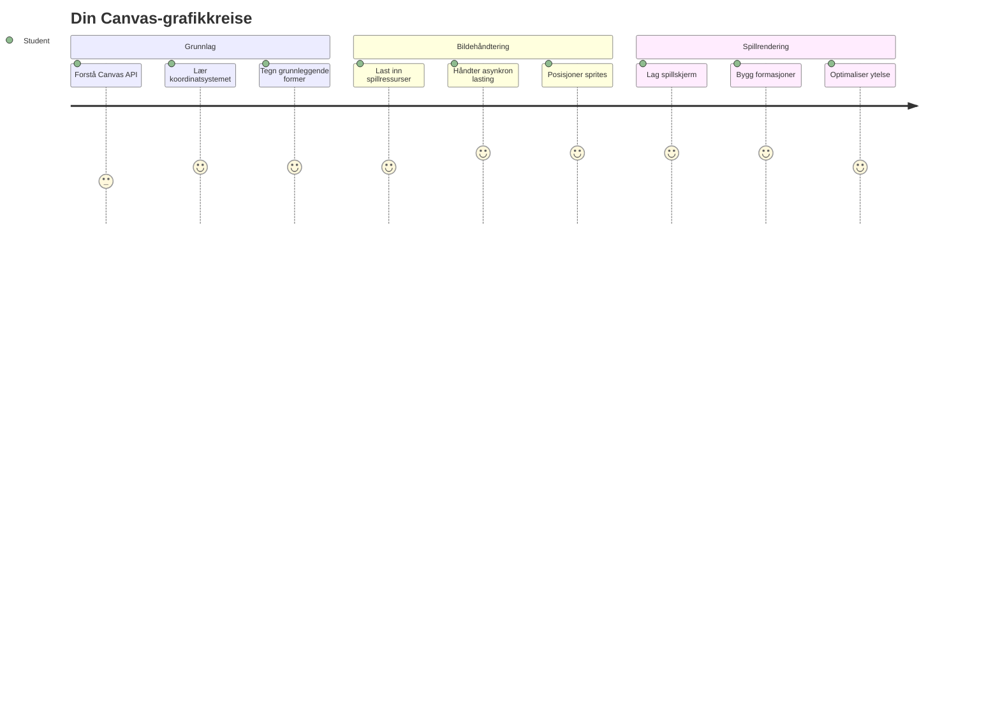
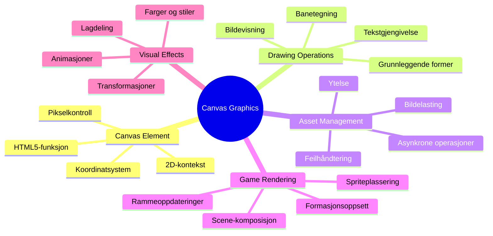
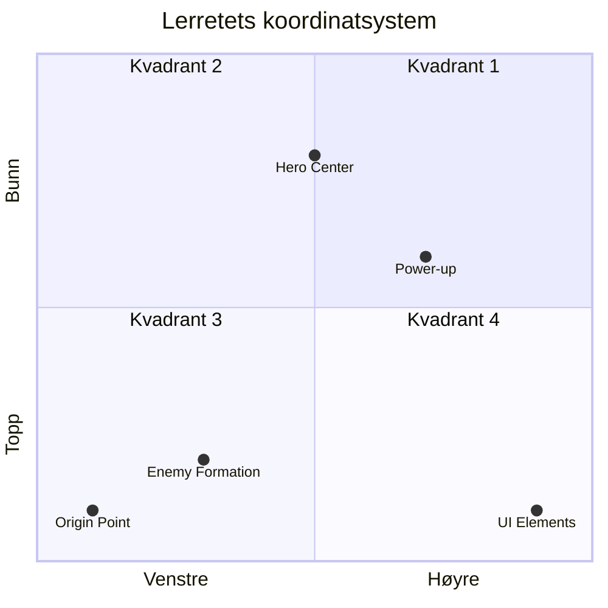
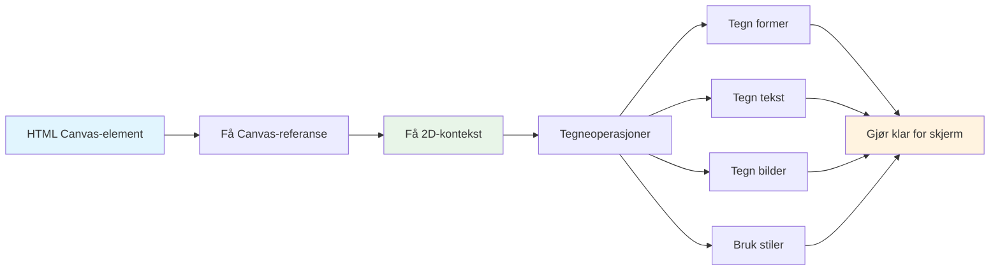
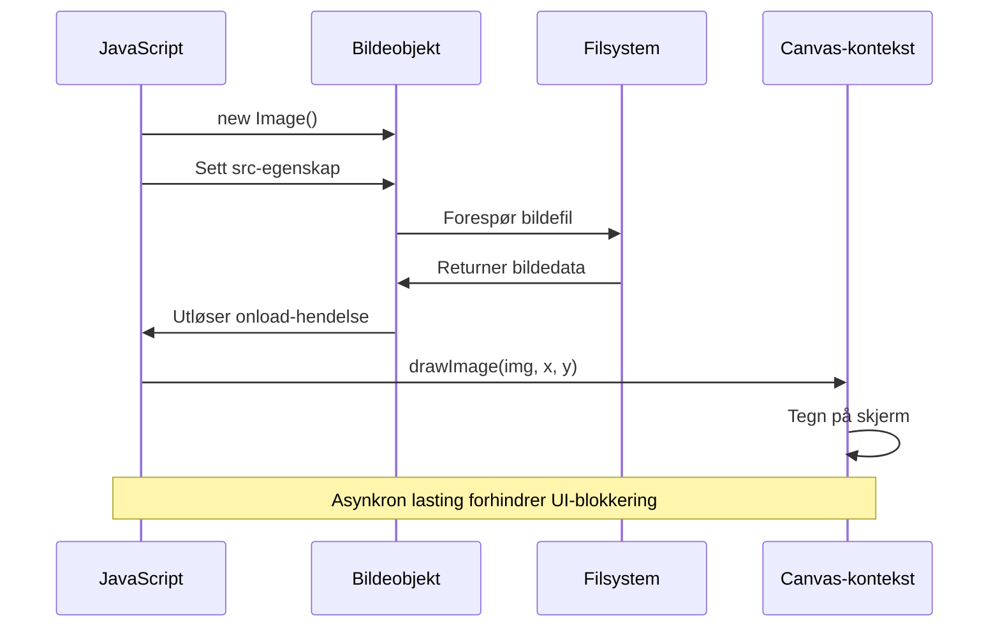
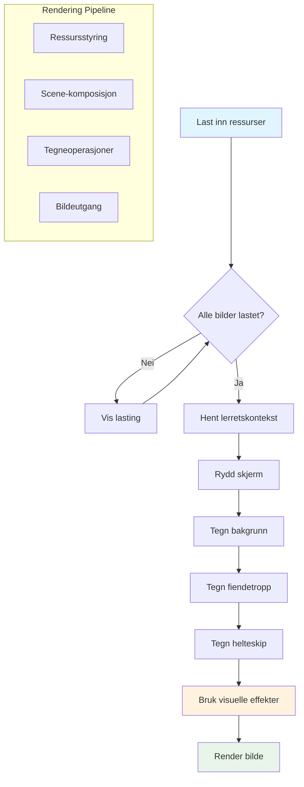
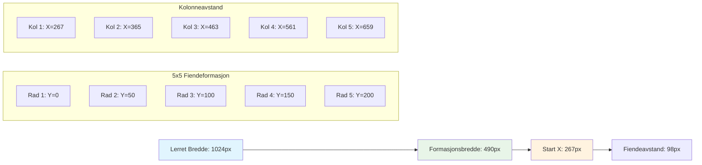
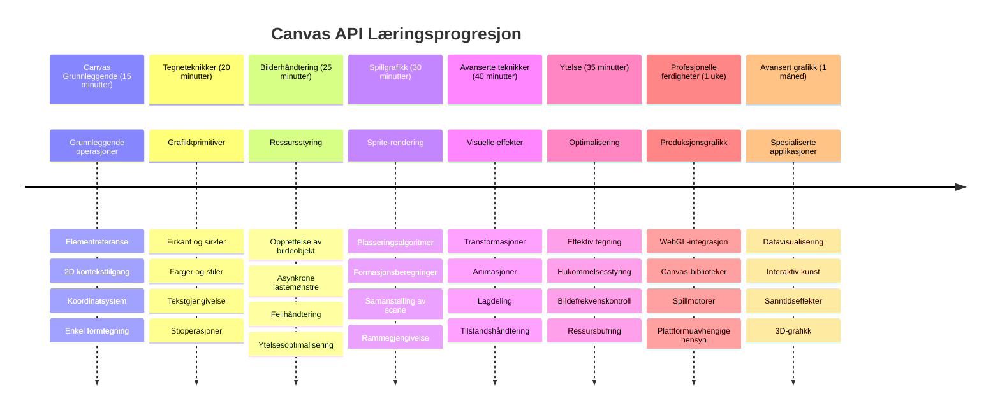

<!--
CO_OP_TRANSLATOR_METADATA:
{
  "original_hash": "7994743c5b21fdcceb36307916ef249a",
  "translation_date": "2026-01-07T00:27:28+00:00",
  "source_file": "6-space-game/2-drawing-to-canvas/README.md",
  "language_code": "no"
}
-->
# Bygg et romspill del 2: Tegn helt og monstre på lerretet


Canvas API er en av nettutviklingens mest kraftfulle funksjoner for å lage dynamisk, interaktiv grafikk rett i nettleseren din. I denne leksjonen vil vi forvandle det tomme HTML `<canvas>`-elementet til en spillverden fylt med helter og monstre. Tenk på lerretet som ditt digitale tegnebrett der kode blir til visuelle bilder.

Vi bygger videre på det du lærte i forrige leksjon, og nå skal vi dykke ned i de visuelle aspektene. Du vil lære hvordan du laster og viser spill-sprites, plasserer elementer nøyaktig, og skaper det visuelle grunnlaget for romspillet ditt. Dette bygger bro mellom statiske nettsider og dynamiske, interaktive opplevelser.

Når du er ferdig med denne leksjonen, vil du ha en komplett spillscene med helteskipet plassert korrekt og fiendeformasjoner klare for kamp. Du vil forstå hvordan moderne spill gjengir grafikk i nettlesere og få ferdigheter til å lage dine egne interaktive visuelle opplevelser. La oss utforske lerret-grafikk og bringe romspillet ditt til liv!


## Forkunnskapsquiz

[Forkunnskapsquiz](https://ff-quizzes.netlify.app/web/quiz/31)

## Lerretet

Så hva er egentlig `<canvas>`-elementet? Det er HTML5s løsning for å lage dynamisk grafikk og animasjoner i nettlesere. I motsetning til vanlige bilder eller videoer som er statiske, gir lerretet deg pikselkontroll over alt som vises på skjermen. Dette gjør det perfekt for spill, datavisualisering og interaktiv kunst. Tenk på det som en programmerbar tegneflate der JavaScript blir penselen din.

Som standard ser et canvas-element ut som et tomt, gjennomsiktig rektangel på siden din. Men det er her potensialet ligger! Den virkelige kraften dukker opp når du bruker JavaScript til å tegne former, laste bilder, lage animasjoner, og gjøre ting responsive til brukerinteraksjoner. Det ligner på hvordan tidlige datagrafikkpionerer ved Bell Labs på 1960-tallet måtte programmere hver piksel for å lage de første digitale animasjonene.

✅ Les [mer om Canvas API](https://developer.mozilla.org/docs/Web/API/Canvas_API) på MDN.

Slik deklareres det vanligvis, som en del av sidens innhold:

```html
<canvas id="myCanvas" width="200" height="100"></canvas>
```

**Dette gjør koden:**
- **Setter** `id`-attributtet slik at du kan referere til dette spesifikke canvas-elementet i JavaScript
- **Definerer** `width` i piksler for å kontrollere det horisontale lerretsmålet
- **Fastsetter** `height` i piksler for å bestemme lerrets vertikale dimensjoner

## Tegne enkel geometri

Nå som du vet hva canvas-elementet er, la oss utforske hvordan man faktisk tegner på det! Lerretet bruker et koordinatsystem som kan føles kjent fra mattetimen, men det er én viktig forskjell som er spesifikk for datagrafikk.

Lerretet bruker kartesiske koordinater med en x-akse (horisontal) og y-akse (vertikal) for å posisjonere alt du tegner. Men her er forskjellen: i motsetning til koordinatsystemet fra mattetimen, starter origo `(0,0)` øverst til venstre, med x-verdier som øker mot høyre og y-verdier som øker nedover. Denne tilnærmingen stammer fra tidlige dataskjermer der elektronstråler skannet fra topp til bunn, noe som gjorde øverst til venstre til det naturlige startpunktet.



> Bilde fra [MDN](https://developer.mozilla.org/docs/Web/API/Canvas_API/Tutorial/Drawing_shapes)

For å tegne på canvas-elementet følger du den samme tre-trinns prosessen som danner grunnlaget for all lerretgrafikk. Når du gjør dette noen ganger, blir det helt naturlig:


1. **Hent en referanse** til Canvas-elementet ditt fra DOM (akkurat som med andre HTML-elementer)
2. **Hent 2D-renderingskonteksten** – dette gir deg alle tegnemetodene
3. **Begynn å tegne!** Bruk kontekstens innebygde metoder for å lage grafikken din

Slik ser det ut i kode:

```javascript
// Trinn 1: Hent canvas-elementet
const canvas = document.getElementById("myCanvas");

// Trinn 2: Hent 2D-renderingskonteksten
const ctx = canvas.getContext("2d");

// Trinn 3: Sett fyllfarge og tegn et rektangel
ctx.fillStyle = 'red';
ctx.fillRect(0, 0, 200, 200); // x, y, bredde, høyde
```

**La oss gå gjennom dette steg for steg:**
- Vi **tar tak** i canvas-elementet vårt ved hjelp av ID og lagrer det i en variabel
- Vi **henter** 2D-renderingskonteksten – dette er verktøykassen vår full av tegnemetoder
- Vi **forteller** canvas at vi vil fylle ting med rødt ved å sette `fillStyle`-egenskapen
- Vi **tegner** et rektangel som starter øverst til venstre (0,0) og som er 200 piksler bredt og høyt

✅ Canvas API fokuserer hovedsakelig på 2D-former, men du kan også tegne 3D-elementer på en nettside; for dette kan du bruke [WebGL API](https://developer.mozilla.org/docs/Web/API/WebGL_API).

Du kan tegne alle slags ting med Canvas API som:

- **Geometriske former**, vi har allerede vist hvordan man tegner et rektangel, men det er mye mer du kan tegne.
- **Tekst**, du kan tegne tekst med hvilken som helst skrift og farge du vil.
- **Bilder**, du kan tegne et bilde basert på bildeassets som for eksempel .jpg eller .png.

✅ Prøv det! Du vet hvordan du tegner et rektangel, kan du tegne en sirkel på en side? Ta en titt på noen interessante Canvas-tegninger på CodePen. Her er et [spesielt imponerende eksempel](https://codepen.io/dissimulate/pen/KrAwx).

### 🔄 **Pedagogisk sjekk**
**Forståelse av lerretets grunnprinsipper**: Før du går over til bildelasting, sørg for at du kan:
- ✅ Forklare hvordan lerretets koordinatsystem skiller seg fra matematiske koordinater
- ✅ Forstå tre-trinnsprosessen for tegneoperasjoner på lerretet
- ✅ Identifisere hva 2D-renderingskonteksten gir deg
- ✅ Beskrive hvordan fillStyle og fillRect fungerer sammen

**Rask selvtest**: Hvordan ville du tegne en blå sirkel på posisjon (100, 50) med radius 25?
```javascript
ctx.fillStyle = 'blue';
ctx.beginPath();
ctx.arc(100, 50, 25, 0, 2 * Math.PI);
ctx.fill();
```

**Canvas-tegnemetoder du nå kan:**
- **fillRect()**: Tegner fylte rektangler
- **fillStyle**: Setter farger og mønstre
- **beginPath()**: Starter nye tegnestier
- **arc()**: Lager sirkler og kurver

## Last inn og tegn et bilde

Å tegne grunnleggende former er nyttig for å komme i gang, men de fleste spill trenger faktiske bilder! Sprites, bakgrunner og teksturer gir spillene deres visuelle appell. Å laste og vise bilder på canvas fungerer annerledes enn å tegne geometriske former, men det er enkelt når du først forstår prosessen.

Vi må lage et `Image`-objekt, laste bilde-filen vår (dette skjer asynkront, altså "i bakgrunnen"), og så tegne det på lerretet når det er klart. Denne tilnærmingen sikrer at bildene dine vises riktig uten å blokkere applikasjonen mens de lastes.


### Enkel bildelasting

```javascript
const img = new Image();
img.src = 'path/to/my/image.png';
img.onload = () => {
  // Bilde lastet og klart til bruk
  console.log('Image loaded successfully!');
};
```

**Dette skjer i koden:**
- Vi **lager** et helt nytt Image-objekt for å holde vår sprite eller tekstur
- Vi **forteller** det hvilken bildefil som skal lastes ved å sette kilde-stien
- Vi **lytter** etter load-eventet slik at vi vet akkurat når bildet er klart til bruk

### En bedre måte å laste bilder på

Her er en mer robust måte å håndtere bildelasting på som profesjonelle utviklere ofte bruker. Vi pakker bildelastingen inn i en Promise-basert funksjon – denne tilnærmingen, som ble populær da JavaScript Promises ble standard i ES6, gjør koden din mer ryddig og håndterer feil på en god måte:

```javascript
function loadAsset(path) {
  return new Promise((resolve, reject) => {
    const img = new Image();
    img.src = path;
    img.onload = () => {
      resolve(img);
    };
    img.onerror = () => {
      reject(new Error(`Failed to load image: ${path}`));
    };
  });
}

// Moderne bruk med async/await
async function initializeGame() {
  try {
    const heroImg = await loadAsset('hero.png');
    const monsterImg = await loadAsset('monster.png');
    // Bilder er nå klare til bruk
  } catch (error) {
    console.error('Failed to load game assets:', error);
  }
}
```

**Dette har vi gjort:**
- **Pakket** all den bildekodelasten inn i en Promise for bedre kontroll
- **Lagt til** feilhåndtering som faktisk sier ifra når noe går galt
- **Brukt** moderne async/await-syntaks fordi det er så mye mer lesbart
- **Inkludert** try/catch-blokker for å håndtere eventuelle feil på en pen måte

Når bildene dine er lastet, er det faktisk ganske enkelt å tegne dem på lerretet:

```javascript
async function renderGameScreen() {
  try {
    // Last inn spillressurser
    const heroImg = await loadAsset('hero.png');
    const monsterImg = await loadAsset('monster.png');

    // Hent lerret og kontekst
    const canvas = document.getElementById("myCanvas");
    const ctx = canvas.getContext("2d");

    // Tegn bilder til bestemte posisjoner
    ctx.drawImage(heroImg, canvas.width / 2, canvas.height / 2);
    ctx.drawImage(monsterImg, 0, 0);
  } catch (error) {
    console.error('Failed to render game screen:', error);
  }
}
```

**La oss gå gjennom dette steg for steg:**
- Vi **laster** både helte- og monsterbildene i bakgrunnen med await
- Vi **tar tak** i canvas-elementet og henter den 2D-renderingskonteksten vi trenger
- Vi **posisjonerer** heltebildet midt i senteret ved hjelp av litt rask koordinatmatematikk
- Vi **plasserer** monsterbildet øverst til venstre for å starte fiendeformasjonen vår
- Vi **fanger** opp eventuelle feil som kan skje under lasting eller visning


## Nå er det på tide å begynne å bygge ditt spill

Nå skal vi sette alt sammen for å skape det visuelle grunnlaget for romspillet ditt. Du har nå en solid forståelse av lerretets grunnleggende konsepter og bildelastingsteknikker, så denne praktiske delen vil lede deg gjennom å bygge en komplett spillskjerm med riktig plasserte sprites.

### Hva du skal bygge

Du skal lage en nettside med et Canvas-element. Den skal vise en svart skjerm `1024*768`. Vi har gitt deg to bilder:

- Helteskip

   

- 5*5 monstre

   

### Anbefalte steg for å starte utvikling

Finn startfilene som er laget for deg i undermappen `your-work`. Prosjektstrukturen din skal inneholde:

```bash
your-work/
├── assets/
│   ├── enemyShip.png
│   └── player.png
├── index.html
├── app.js
└── package.json
```

**Dette jobber du med:**
- **Spill-sprites** ligger i `assets/`-mappen slik at alt holder seg organisert
- **Hoved-HTML-filen** setter opp canvas-elementet og gjør alt klart
- **En JavaScript-fil** hvor du skriver all spill-grafikkmagien din
- **En package.json** som setter opp en utviklingsserver slik at du kan teste lokalt

Åpne denne mappen i Visual Studio Code for å begynne utviklingen. Du trenger et lokalt utviklingsmiljø med Visual Studio Code, NPM og Node.js installert. Hvis du ikke har `npm` satt opp på datamaskinen din, [her er hvordan du installerer det](https://www.npmjs.com/get-npm).

Start utviklingsserveren din ved å navigere til `your-work`-mappen:

```bash
cd your-work
npm start
```

**Denne kommandoen gjør noen ganske kule ting:**
- **Starter** en lokal server på `http://localhost:5000` slik at du kan teste spillet ditt
- **Serverer** alle filene dine skikkelig slik at nettleseren kan laste dem riktig
- **Overvåker** filene dine for endringer så du kan utvikle smidig
- **Gir deg** et profesjonelt utviklingsmiljø for testing

> 💡 **Merk**: Nettleseren din vil vise en blank side i starten – det er som forventet! Når du legger til kode, oppdater nettsiden for å se endringene dine. Denne iterative utviklingsmetoden ligner på hvordan NASA bygde Apollo-veiledningscomputeren – ved å teste hver komponent før man integrerte den i det større systemet.

### Legg til kode

Legg til den nødvendige koden i `your-work/app.js` for å fullføre følgende oppgaver:

1. **Tegn et lerret med svart bakgrunn**
   > 💡 **Slik gjør du det**: Finn TODO-kommentaren i `/app.js` og legg til bare to linjer. Sett `ctx.fillStyle` til svart, deretter bruk `ctx.fillRect()` som starter på (0,0) med lerretsdimensjonene dine. Enkelt!

2. **Last spillteksturer**
   > 💡 **Slik gjør du det**: Bruk `await loadAsset()` for å laste inn spiller- og fiendebildene dine. Lagre dem i variabler slik at du kan bruke dem senere. Husk – de vises ikke før du faktisk tegner dem!

3. **Tegn helteskipet midt nederst på skjermen**
   > 💡 **Slik gjør du det**: Bruk `ctx.drawImage()` til å plassere helten. For x-koordinaten prøv `canvas.width / 2 - 45` for å sentrere, og for y-koordinaten bruk `canvas.height - canvas.height / 4` for å plassere det i bunnområdet.

4. **Tegn en 5×5-formation av fiendeskip**
   > 💡 **Slik gjør du det**: Finn funksjonen `createEnemies` og sett opp en nestet løkke. Du må gjøre litt matematikk for avstand og posisjon, men ikke bekymre deg – jeg skal vise deg nøyaktig hvordan!

Først definer konstanter for korrekt oppsett av fiendeformasjonen:

```javascript
const ENEMY_TOTAL = 5;
const ENEMY_SPACING = 98;
const FORMATION_WIDTH = ENEMY_TOTAL * ENEMY_SPACING;
const START_X = (canvas.width - FORMATION_WIDTH) / 2;
const STOP_X = START_X + FORMATION_WIDTH;
```

**La oss se på hva disse konstantene gjør:**
- Vi **setter** 5 fiender per rad og kolonne (et fint 5×5 rutenett)
- Vi **definerer** hvor mye plass som skal være mellom fiendene slik at de ikke blir for tett
- Vi **regner ut** hvor bred hele formasjonen vil bli
- Vi **finner** ut hvor vi skal starte og stoppe slik at formasjonen ser sentrert ut


Deretter oppretter du nestede løkker for å tegne fiendeformasjonen:

```javascript
for (let x = START_X; x < STOP_X; x += ENEMY_SPACING) {
  for (let y = 0; y < 50 * 5; y += 50) {
    ctx.drawImage(enemyImg, x, y);
  }
}
```

**Dette gjør den nestede løkken:**
- Ytre løkke **beveger** seg fra venstre mot høyre over formasjonen
- Indre løkke **går** fra topp til bunn for å lage pene rader
- Vi **tegner** hver fiendesprite på nøyaktig de x,y-koordinatene vi har regnet ut
- Alt er **jevnt fordelt** slik at det ser profesjonelt og ryddig ut

### 🔄 **Pedagogisk sjekk**
**Mestre spillrendering**: Bekreft at du forstår det komplette gjengivelsessystemet:
- ✅ Hvordan hindrer asynkron bildelasting UI-blokkering under oppstart av spillet?
- ✅ Hvorfor beregner vi fiendeformasjonens posisjoner ved hjelp av konstanter i stedet for hardkodet?
- ✅ Hvilken rolle spiller 2D-renderingskonteksten i tegneoperasjoner?
- ✅ Hvordan lager nestede løkker organiserte spriteformasjoner?

**Ytelseshensyn**: Spillet ditt demonstrerer nå:
- **Effektiv lasting av assets**: Promise-basert bildegjenkjenning
- **Organisert rendering**: Strukturerte tegneoperasjoner
- **Matematisk posisjonering**: Kalkulert plassering av sprites
- **Feilhåndtering**: Pen håndtering av feil

**Konsepter innen visuell programmering**: Du har lært:
- **Koordinatsystemer**: Oversette matematikk til skjermposisjoner
- **Sprite-håndtering**: Laste og vise spillgrafikk
- **Formasjonsalgoritmer**: Matematiske mønstre for organiserte oppsett
- **Asynkrone operasjoner**: Moderne JavaScript for jevn brukeropplevelse

## Resultat

Det ferdige resultatet skal se slik ut:


## Løsning

Vennligst prøv å løse det selv først, men hvis du setter fast, ta en titt på en [løsning](../../../../6-space-game/2-drawing-to-canvas/solution/app.js)

---

## GitHub Copilot Agent Challenge 🚀

Bruk Agent-modusen for å fullføre følgende utfordring:

**Beskrivelse:** Forbedre romspillet ditt ved å legge til visuelle effekter og interaktive elementer ved hjelp av Canvas API-teknikker du har lært.

**Prompt:** Lag en ny fil kalt `enhanced-canvas.html` med et canvas som viser animerte stjerner i bakgrunnen, en pulserende helseindikator for helteskipet, og fiendtlige skip som langsomt beveger seg nedover. Inkluder JavaScript-kode som tegner blinkende stjerner med tilfeldige posisjoner og opasitet, implementerer en helseindikator som endrer farge basert på helsenivå (grønn > gul > rød), og animerer fiendeshipene til å bevege seg nedover skjermen i forskjellige hastigheter.

Lær mer om [agent mode](https://code.visualstudio.com/blogs/2025/02/24/introducing-copilot-agent-mode) her.

## 🚀 Utfordring

Du har lært om tegning med den 2D-fokuserte Canvas API; ta en titt på [WebGL API](https://developer.mozilla.org/docs/Web/API/WebGL_API), og forsøk å tegne et 3D-objekt.

## Post-forelesning Quiz

[Post-forelesning quiz](https://ff-quizzes.netlify.app/web/quiz/32)

## Gjennomgang & Selvstudium

Lær mer om Canvas API ved å [lese om det](https://developer.mozilla.org/docs/Web/API/Canvas_API).

### ⚡ **Hva du kan gjøre de neste 5 minuttene**
- [ ] Åpne nettleserkonsollen og lag et canvas-element med `document.createElement('canvas')`
- [ ] Prøv å tegne et rektangel ved hjelp av `fillRect()` på et canvas-kontekst
- [ ] Eksperimenter med forskjellige farger ved bruk av `fillStyle`-egenskapen
- [ ] Tegn en enkel sirkel ved hjelp av `arc()`-metoden

### 🎯 **Hva du kan oppnå denne timen**
- [ ] Fullfør post-leksjonsquiz og forstå canvas-grunnleggende
- [ ] Lag et tegneprogram med canvas med flere former og farger
- [ ] Implementer bildeinnlasting og sprite-rendering for ditt spill
- [ ] Bygg en enkel animasjon som flytter objekter over canvas
- [ ] Øv på canvas-transformasjoner som skalering, rotasjon og translasjon

### 📅 **Din ukelange Canvas-reise**
- [ ] Fullfør romspillet med polerte grafikker og sprite-animasjoner
- [ ] Mestre avanserte canvas-teknikker som gradienter, mønstre og komposisjon
- [ ] Lag interaktive visualiseringer ved bruk av canvas til datavisualisering
- [ ] Lær om canvas-optimaliseringsteknikker for jevn ytelse
- [ ] Bygg et tegne- eller maleprogram med flere verktøy
- [ ] Utforsk kreative kodingsmønstre og generativ kunst med canvas

### 🌟 **Din månedslange grafikkmestring**
- [ ] Bygg komplekse visuelle applikasjoner med Canvas 2D og WebGL
- [ ] Lær grafikkprogrammeringskonsepter og shader-grunnlag
- [ ] Bidra til open source grafikkbiblioteker og visualiseringsverktøy
- [ ] Mestre ytelsesoptimalisering for grafikk-intensive applikasjoner
- [ ] Lag pedagogisk innhold om canvas-programmering og datagrafikk
- [ ] Bli en ekspert i grafikkprogrammering som hjelper andre å lage visuelle opplevelser

## 🎯 Din tidslinje for Canvas-grafikkmestring


### 🛠️ Oppsummering av ditt Canvas-grafikkverktøy

Etter å ha fullført denne leksjonen har du nå:
- **Canvas API-mestring**: Fullstendig forståelse av 2D-grafikkprogrammering
- **Koordinatmatematikk**: Presis posisjonering og layoutalgoritmer
- **Ressurshåndtering**: Profesjonell bildeinnlasting og feilhåndtering
- **Rendering-pipeline**: Strukturert tilnærming til scene-sammensetning
- **Spillgrafikk**: Sprite-posisjonering og formasjonberegninger
- **Asynkron programmering**: Moderne JavaScript-mønstre for jevn ytelse
- **Visuell programmering**: Oversetting av matematiske konsepter til skjermgrafikk

**Reelle bruksområder**: Dine Canvas-ferdigheter gjelder direkte for:
- **Datavisualisering**: Diagrammer, grafer og interaktive dashbord
- **Spillutvikling**: 2D-spill, simuleringer og interaktive opplevelser
- **Digital kunst**: Kreativ koding og generative kunstprosjekter
- **UI/UX Design**: Tilpasset grafikk og interaktive elementer
- **Pedagogisk programvare**: Visuelle læringsverktøy og simuleringer
- **Nettapplikasjoner**: Dynamisk grafikk og sanntidsvisualiseringer

**Profesjonelle ferdigheter oppnådd**: Du kan nå:
- **Bygge** skreddersydde grafikk-løsninger uten eksterne biblioteker
- **Optimalisere** rendering-ytelsen for jevn brukeropplevelse
- **Feilsøke** komplekse visuelle problemer med nettleserens utviklerverktøy
- **Designe** skalerbare grafikk-systemer ved hjelp av matematiske prinsipper
- **Integrere** Canvas-grafikk med moderne webapplikasjonsrammeverk

**Canvas API-metoder du har mestret**:
- **Elementhåndtering**: getElementById, getContext
- **Tegneoperasjoner**: fillRect, drawImage, fillStyle
- **Ressursinnlasting**: Image-objekter, Promise-mønstre
- **Matematisk posisjonering**: Koordinatberegninger, formasjonalgoritmer

**Neste nivå**: Du er klar for å legge til animasjon, brukerinteraksjon, kollisjonsdeteksjon, eller utforske WebGL for 3D-grafikk!

🌟 **Oppnåelse låst opp**: Du har bygget et komplett spillrenderingssystem ved bruk av grunnleggende Canvas API-teknikker!

## Oppgave

[Lek med Canvas API](assignment.md)

---

<!-- CO-OP TRANSLATOR DISCLAIMER START -->
**Ansvarsfraskrivelse**:
Dette dokumentet er oversatt ved hjelp av AI-oversettelsestjenesten [Co-op Translator](https://github.com/Azure/co-op-translator). Selv om vi streber etter nøyaktighet, vennligst vær oppmerksom på at automatiske oversettelser kan inneholde feil eller unøyaktigheter. Det opprinnelige dokumentet på originalspråket bør betraktes som den autoritative kilden. For kritisk informasjon anbefales profesjonell menneskelig oversettelse. Vi er ikke ansvarlige for eventuelle misforståelser eller feiltolkninger som oppstår ved bruk av denne oversettelsen.
<!-- CO-OP TRANSLATOR DISCLAIMER END -->