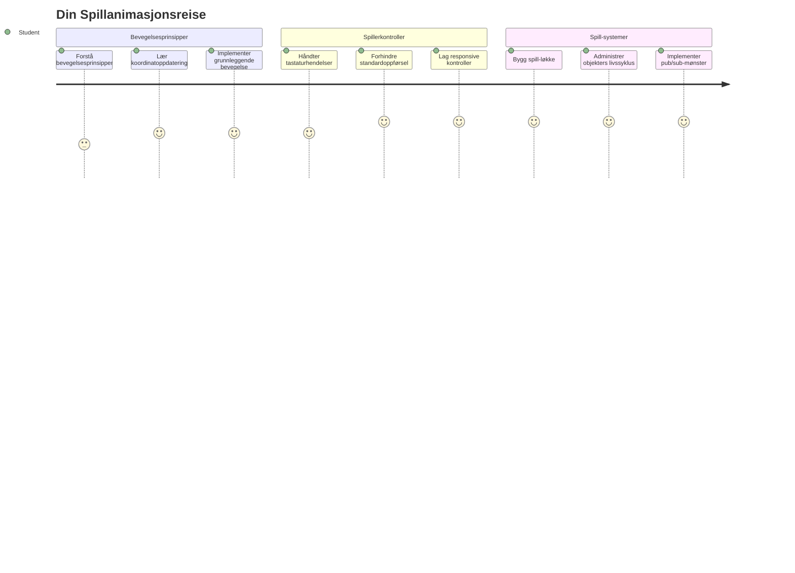
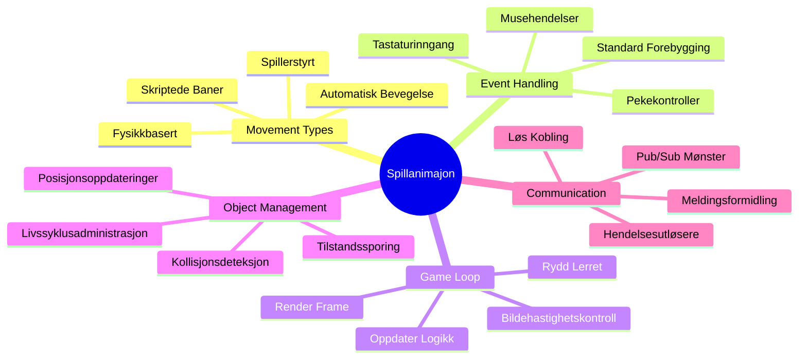
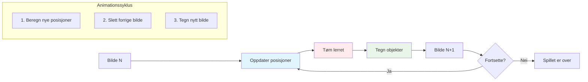
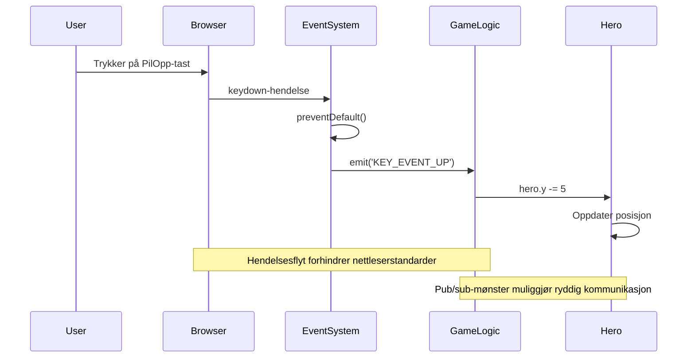
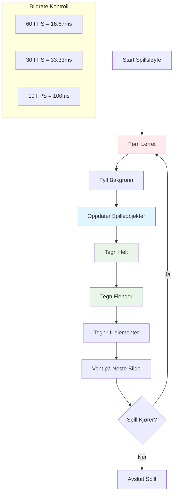
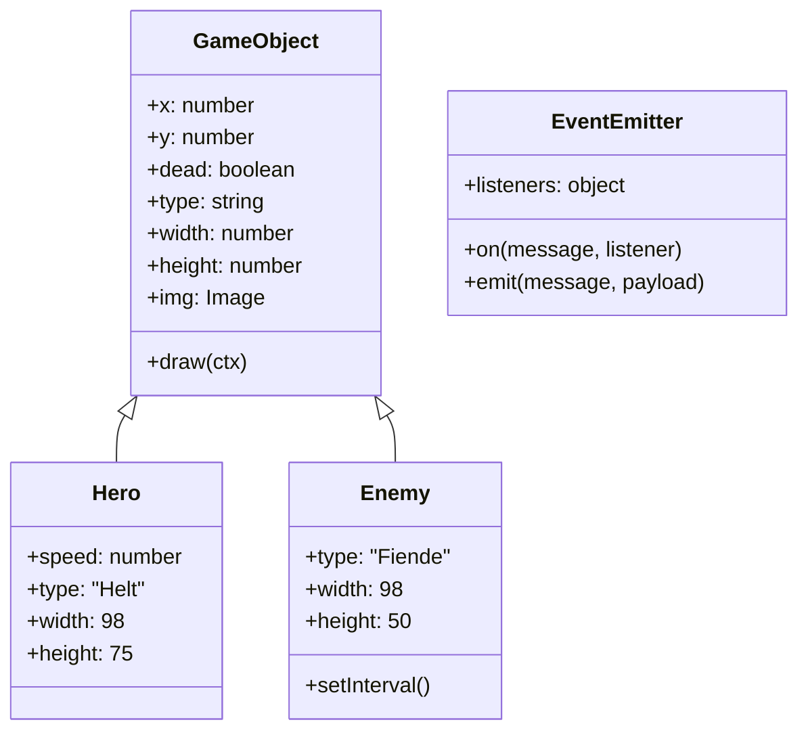
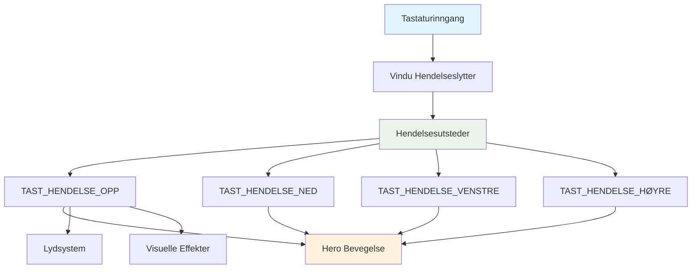
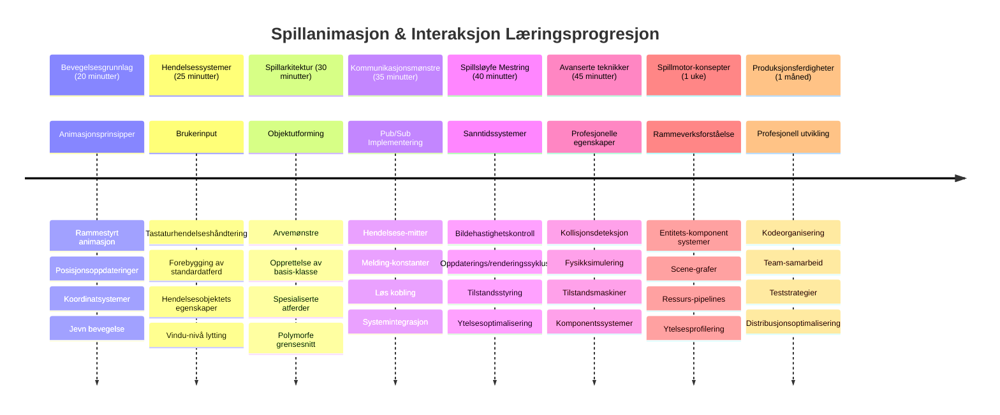

# Lag et Romspill Del 3: Legge til Bevegelse


Tenk på favorittspillene dine – det som gjør dem fengslende er ikke bare pene grafikker, det er måten alt beveger seg på og responderer på handlingene dine. Akkurat nå er romspillet ditt som et vakkert maleri, men vi er i ferd med å legge til bevegelse som bringer det til liv.

Da NASAs ingeniører programmerte veiledningsdatamaskinen for Apollo-oppdragene, sto de overfor en lignende utfordring: hvordan får man et romskip til å respondere på pilotens input samtidig som det automatisk opprettholder kurskorrigeringer? Prinsippene vi skal lære i dag gjenspeiler disse samme konseptene – å håndtere spillerkontrollert bevegelse samtidig som systemet oppfører seg automatisk.

I denne leksjonen skal du lære hvordan du får romskip til å gli over skjermen, respondere på kommandoer fra spilleren, og skape jevne bevegelsesmønstre. Vi bryter ned alt i håndterbare konsepter som bygger naturlig på hverandre.

Til slutt vil du ha spillere som flyr helteskipet sitt rundt på skjermen mens fiendtlige fartøy patruljerer over hodet på dem. Viktigst av alt, vil du forstå kjerneprinsippene som driver spillbevegelsessystemer.


## Før-forelesningsquiz

[Før-forelesningsquiz](https://ff-quizzes.netlify.app/web/quiz/33)

## Forståelse av spillbevegelse

Spill kommer til liv når ting begynner å bevege seg rundt, og det er egentlig to grunnleggende måter dette skjer på:

- **Spillerstyrt bevegelse**: Når du trykker på en tast eller klikker med musen, beveger noe seg. Dette er den direkte forbindelsen mellom deg og spillverdenen.
- **Automatisk bevegelse**: Når spillet selv bestemmer å flytte ting – som de fiendtlige skipene som trenger å patruljere skjermen enten du gjør noe eller ikke.

Å få objekter til å bevege seg på en dataskjerm er enklere enn du kanskje tror. Husker du de x- og y-koordinatene fra mattetimen? Det er akkurat det vi jobber med her. Da Galileo fulgte Jupiters måner i 1610, gjorde han i praksis det samme – plottet posisjoner over tid for å forstå bevegelsesmønstre.

Å flytte ting på skjermen er som å lage en flipbook-animasjon – du må følge disse tre enkle stegene:


1. **Oppdater posisjonen** – Endre hvor objektet ditt skal være (kanskje flytte det 5 piksler til høyre)
2. **Slett det gamle bildet** – Tøm skjermen så du ikke ser spøkelsesaktige spor overalt
3. **Tegn det nye bildet** – Plasser objektet på det nye stedet

Gjør du dette raskt nok, og boom! Du har jevn bevegelse som føles naturlig for spillerne.

Slik kan det se ut i kode:

```javascript
// Sett helten sin posisjon
hero.x += 5;
// Tøm rektangelet som inneholder helten
ctx.clearRect(0, 0, canvas.width, canvas.height);
// Tegn spillets bakgrunn og helten på nytt
ctx.fillRect(0, 0, canvas.width, canvas.height);
ctx.fillStyle = "black";
ctx.drawImage(heroImg, hero.x, hero.y);
```

**Dette gjør koden:**
- **Oppdaterer** helten sin x-koordinat med 5 piksler for å flytte den horisontalt
- **Rydder** hele lerretet for å fjerne det forrige bildet
- **Fyller** lerretet med svart bakgrunnsfarge
- **Tegner** heltebildet på sin nye posisjon

✅ Kan du tenke deg en grunn til at det å tegne helten mange bilder per sekund kan påføre ytelseskostnader? Les om [alternativer til dette mønsteret](https://developer.mozilla.org/en-US/docs/Web/API/Canvas_API/Tutorial/Optimizing_canvas).

## Håndtere tastaturhendelser

Her kobler vi spillerens input til spillhandlingen. Når noen trykker på mellomromstasten for å skyte en laser eller trykker på en piltast for å unngå en asteroide, må spillet ditt oppdage og svare på den inputen.

Tastaturhendelser skjer på vindusnivå, som betyr at hele nettleservinduet ditt lytter etter tastetrykk. Museklikk, derimot, kan knyttes til spesifikke elementer (som å klikke på en knapp). For vårt romspill fokuserer vi på tastaturkontroller siden det gir spillerne den klassiske arkade-følelsen.

Dette minner meg om hvordan telegrafoperatører på 1800-tallet måtte oversette morsekodesignal til meningsfulle meldinger – vi gjør noe tilsvarende, vi oversetter tastetrykk til spillkommandoer.

For å håndtere en hendelse må du bruke vinduets `addEventListener()`-metode og gi den to inputparametere. Den første parameteren er navnet på hendelsen, for eksempel `keyup`. Den andre parameteren er funksjonen som skal utføres som følge av at hendelsen skjer.

Her er et eksempel:

```javascript
window.addEventListener('keyup', (evt) => {
  // evt.key = strengrepresentasjon av tasten
  if (evt.key === 'ArrowUp') {
    // gjør noe
  }
});
```

**Dette skjer her:**
- **Lytter** etter tastaturhendelser på hele vinduet
- **Fanger** event-objektet som inneholder informasjon om hvilken tast som ble trykket
- **Sjekker** om den trykkede tasten matcher en spesifikk tast (i dette tilfellet piltasten opp)
- **Utfører** kode når betingelsen er oppfylt

For tastaturhendelser finnes det to egenskaper på event-objektet du kan bruke for å se hvilken tast som ble trykket:

- `key` - dette er en strengrepresentasjon av tasten, for eksempel `'ArrowUp'`
- `keyCode` - dette er et tall, for eksempel `37`, som tilsvarer `ArrowLeft`

✅ Tastaturhendelsesmanipulering er nyttig utenfor spillutvikling. Hvilke andre bruksområder kan du tenke deg for denne teknikken?


### Spesielle taster: en advarsel!

Noen taster har innebygde nettleseradferder som kan forstyrre spillet ditt. Piltastene ruller siden, og mellomromstasten hopper nedover – adferder du ikke vil ha når noen prøver å styre romskipet.

Vi kan forhindre disse standardadferdene og la spillet håndtere inputen i stedet. Dette ligner på hvordan tidlige dataprogrammører måtte overstyre systemavbrudd for å lage egendefinerte adferder – vi gjør det bare på nettlesernivå. Slik gjør du:

```javascript
const onKeyDown = function (e) {
  console.log(e.keyCode);
  switch (e.keyCode) {
    case 37:
    case 39:
    case 38:
    case 40: // Piltaster
    case 32:
      e.preventDefault();
      break; // Mellomrom
    default:
      break; // ikke blokker andre taster
  }
};

window.addEventListener('keydown', onKeyDown);
```

**Forstå denne forebyggingskoden:**
- **Sjekker** for spesifikke tastkoder som kan forårsake uønsket nettleseradferd
- **Forhindrer** standard nettleserhandling for piltaster og mellomrom
- **Tillater** andre taster å fungere som normalt
- **Bruker** `e.preventDefault()` for å stoppe nettleserens innebygde adferd

### 🔄 **Pedagogisk sjekk**
**Forståelse av hendelseshåndtering**: Før vi går videre til automatisk bevegelse, sørg for at du kan:
- ✅ Forklare forskjellen mellom `keydown` og `keyup` hendelser
- ✅ Forstå hvorfor vi forhindrer standard nettleseradferder
- ✅ Beskrive hvordan eventlyttere kobler brukerinput til spilllogikk
- ✅ Identifisere hvilke taster som kan forstyrre spillkontroller

**Rask selvtest**: Hva ville skje om du ikke hindret standardadferd for piltastene?
*Svar: Nettleseren ville rulle siden, noe som forstyrret spillbevegelsen*

**Hendelsessystem-arkitektur**: Du forstår nå:
- **Lytting på vindusnivå**: Fange hendelser på nettlesernivå
- **Eventobjektets egenskaper**: `key` strenger versus `keyCode` tall
- **Forebygging av standardadferd**: Stoppe uønskede nettleseradferder
- **Betinget logikk**: Responderer på spesifikke tastkombinasjoner

## Spillindusert bevegelse

Nå skal vi snakke om objekter som beveger seg uten spillerinput. Tenk på fiendtlige skip som cruiser over skjermen, kuler som flyr i rette linjer, eller skyer som driver i bakgrunnen. Denne autonome bevegelsen gjør at spillverdenen din føles levende selv når ingen rører kontrollerne.

Vi bruker JavaScripts innebygde timere til å oppdatere posisjoner med jevne mellomrom. Dette konseptet ligner på hvordan pendelklokker fungerer – en regelmessig mekanisme som trigger konsistente, timede handlinger. Slik enkelt kan det være:

```javascript
const id = setInterval(() => {
  // Flytt fienden på y-aksen
  enemy.y += 10;
}, 100);
```

**Dette gjør bevegelseskoden:**
- **Oppretter** en timer som kjører hvert 100. millisekund
- **Oppdaterer** fiendens y-koordinat med 10 piksler hver gang
- **Lagrer** intervall-IDen slik at vi kan stoppe den senere om nødvendig
- **Beveger** fienden nedover på skjermen automatisk

## Spill-loopen

Her er konseptet som binder alt sammen – spill-loopen. Hvis spillet ditt var en film, ville spill-loopen være filmprojektoren, som viser bilde etter bilde så raskt at alt ser ut til å bevege seg jevnt.

Hvert spill har en slik løkke som kjører i bakgrunnen. Det er en funksjon som oppdaterer alle spillobjekter, tegner skjermen på nytt, og gjentar denne prosessen kontinuerlig. Den holder oversikt over helten din, alle fiendene, eventuelle lasere som flyr rundt – hele spilltilstanden.

Dette konseptet minner meg om hvordan tidlige filmanimatører som Walt Disney måtte tegne figurer bilde for bilde for å skape bevegelsesillusjonen. Vi gjør det samme, bare med kode istedenfor blyanter.

Slik kan en spill-loop vanligvis se ut, uttrykt i kode:


```javascript
const gameLoopId = setInterval(() => {
  function gameLoop() {
    ctx.clearRect(0, 0, canvas.width, canvas.height);
    ctx.fillStyle = "black";
    ctx.fillRect(0, 0, canvas.width, canvas.height);
    drawHero();
    drawEnemies();
    drawStaticObjects();
  }
  gameLoop();
}, 200);
```

**Forstå strukturen i spill-loopen:**
- **Rydder** hele lerretet for å fjerne forrige bilde
- **Fyller** bakgrunnen med en ensfarget farge
- **Tegner** alle spillobjekter i deres nåværende posisjoner
- **Gjentar** denne prosessen hvert 200. millisekund for å skape jevn animasjon
- **Styrer** bildefrekvensen ved å kontrollere intervallets timing

## Fortsette romspillet

Nå skal vi legge til bevegelse i den statiske scenen du laget tidligere. Vi skal forvandle det fra et skjermbilde til en interaktiv opplevelse. Vi jobber oss gjennom dette steg for steg for å sikre at hver del bygger på den forrige.

Hent koden fra der vi sluttet i forrige leksjon (eller start med koden i [Del II- start](../../../../6-space-game/3-moving-elements-around/your-work) mappen hvis du trenger en fersk start).

**Dette bygger vi i dag:**
- **Heltekontroller**: Piltastene skal styre romskipet ditt rundt på skjermen
- **Fiendebevegelse**: De utenomjordiske skipene vil begynne sin fremrykking

La oss begynne å implementere disse funksjonene.

## Anbefalte steg

Finn filene som er opprettet for deg i `your-work` undermappen. Den skal inneholde følgende:

```bash
-| assets
  -| enemyShip.png
  -| player.png
-| index.html
-| app.js
-| package.json
```

Du starter prosjektet ditt i `your-work`-mappen ved å skrive:

```bash
cd your-work
npm start
```

**Dette gjør kommandoen:**
- **Navigerer** til prosjektmappen din
- **Starter** en HTTP-server på adressen `http://localhost:5000`
- **Serverer** spillfilene dine slik at du kan teste dem i en nettleser

Ovenstående starter en HTTP-server på adressen `http://localhost:5000`. Åpne en nettleser og skriv inn adressen, nå skal det vise helten og alle fiendene; ingenting beveger seg – ennå!

### Legg til kode

1. **Legg til dedikerte objekter** for `hero`, `enemy` og `game object`, de skal ha `x` og `y` egenskaper. (Husker du delen om [Arv eller komposisjon](../README.md)).

   *TIPS* `game object` skal være den som har `x` og `y` og evnen til å tegne seg selv på et lerret.

   > **Tips**: Start med å legge til en ny `GameObject` klasse med konstruktøren som skissert nedenfor, og tegn den deretter til lerretet:

    ```javascript
    class GameObject {
      constructor(x, y) {
        this.x = x;
        this.y = y;
        this.dead = false;
        this.type = "";
        this.width = 0;
        this.height = 0;
        this.img = undefined;
      }
    
      draw(ctx) {
        ctx.drawImage(this.img, this.x, this.y, this.width, this.height);
      }
    }
    ```

    **Forstå denne baseklassen:**
    - **Definerer** vanlige egenskaper som alle spillobjekter deler (posisjon, størrelse, bilde)
    - **Inkluderer** et `dead` flagg for å spore om objektet skal fjernes
    - **Gir** en `draw()` metode som tegner objektet på lerretet
    - **Setter** standardverdier for alle egenskaper som underklasser kan overstyre


    Nå, utvid denne `GameObject` for å lage `Hero` og `Enemy`:
    
    ```javascript
    class Hero extends GameObject {
      constructor(x, y) {
        super(x, y);
        this.width = 98;
        this.height = 75;
        this.type = "Hero";
        this.speed = 5;
      }
    }
    ```

    ```javascript
    class Enemy extends GameObject {
      constructor(x, y) {
        super(x, y);
        this.width = 98;
        this.height = 50;
        this.type = "Enemy";
        const id = setInterval(() => {
          if (this.y < canvas.height - this.height) {
            this.y += 5;
          } else {
            console.log('Stopped at', this.y);
            clearInterval(id);
          }
        }, 300);
      }
    }
    ```

    **Nøkkelkonsepter i disse klassene:**
    - **Arver** fra `GameObject` ved å bruke `extends` nøkkelordet
    - **Kaller** foreldrekonstruktøren med `super(x, y)`
    - **Setter** spesifikke dimensjoner og egenskaper for hver objekttype
    - **Implementerer** automatisk bevegelse for fiender ved hjelp av `setInterval()`

2. **Legg til tastaturhendelseshåndterere** for å håndtere navigasjon med tast (flytt helten opp/ned venstre/høyre)

   *HUSK* det er et kartesisk system, øverst til venstre er `0,0`. Husk også å legge til kode for å stoppe *standardadferd*

   > **Tips**: Lag din `onKeyDown` funksjon og knytt den til vinduet:

   ```javascript
   const onKeyDown = function (e) {
     console.log(e.keyCode);
     // Legg til koden fra leksjonen ovenfor for å stoppe standardatferd
     switch (e.keyCode) {
       case 37:
       case 39:
       case 38:
       case 40: // Piltaster
       case 32:
         e.preventDefault();
         break; // Mellomrom
       default:
         break; // ikke blokker andre taster
     }
   };

   window.addEventListener("keydown", onKeyDown);
   ```
    
   **Dette gjør denne hendelseshåndteringen:**
   - **Lytter** etter keydown-hendelser på hele vinduet
   - **Logger** tastkode for å hjelpe deg med å feilsøke hvilke taster som blir trykket
   - **Forhindrer** standard nettleseradferd for piltaster og mellomrom
   - **Tillater** andre taster å fungere som normalt
   
   Sjekk nettleserkonsollen din nå, og følg med på at tastetrykk blir logget.

3. **Implementer** [Pub sub-mønsteret](../README.md), dette vil holde koden din ren mens du følger de resterende delene.

   Publiser-abonner-mønsteret hjelper deg å organisere koden ved å skille hendelsesdeteksjon fra hendelseshåndtering. Dette gjør koden mer modulær og lettere å vedlikeholde.

   For denne siste delen kan du:

   1. **Legge til en eventlytter** på vinduet:

       ```javascript
       window.addEventListener("keyup", (evt) => {
         if (evt.key === "ArrowUp") {
           eventEmitter.emit(Messages.KEY_EVENT_UP);
         } else if (evt.key === "ArrowDown") {
           eventEmitter.emit(Messages.KEY_EVENT_DOWN);
         } else if (evt.key === "ArrowLeft") {
           eventEmitter.emit(Messages.KEY_EVENT_LEFT);
         } else if (evt.key === "ArrowRight") {
           eventEmitter.emit(Messages.KEY_EVENT_RIGHT);
         }
       });
       ```

   **Dette gjør hendelsessystemet:**
   - **Oppdager** tastaturinput og konverterer det til egendefinerte spillhendelser
   - **Skiller** input-deteksjonen fra spilllogikken
   - **Gjør** det enkelt å endre kontroller senere uten å påvirke spillkoden
   - **Tillater** flere systemer å svare på samme input


   2. **Lag en EventEmitter-klasse** for å publisere og abonnere på meldinger:

       ```javascript
       class EventEmitter {
         constructor() {
           this.listeners = {};
         }
       
         on(message, listener) {
           if (!this.listeners[message]) {
             this.listeners[message] = [];
           }
           this.listeners[message].push(listener);
         }
       
   3. **Legg til konstanter** og sett opp EventEmitter:

       ```javascript
       const Messages = {
         KEY_EVENT_UP: "KEY_EVENT_UP",
         KEY_EVENT_DOWN: "KEY_EVENT_DOWN",
         KEY_EVENT_LEFT: "KEY_EVENT_LEFT",
         KEY_EVENT_RIGHT: "KEY_EVENT_RIGHT",
       };
       
       let heroImg, 
           enemyImg, 
           laserImg,
           canvas, ctx, 
           gameObjects = [], 
           hero, 
           eventEmitter = new EventEmitter();
       ```

   **Forstå oppsettet:**
   - **Definerer** meldingskonstanter for å unngå skrivefeil og gjøre refaktorering enklere
   - **Deklarerer** variabler for bilder, lerretkontekst og spilltilstand
   - **Oppretter** en global event emitter for pub-sub systemet
   - **Initialiserer** et array for å holde alle spillobjektene

   4. **Initialiser spillet**

       ```javascript
       function initGame() {
         gameObjects = [];
         createEnemies();
         createHero();
       
         eventEmitter.on(Messages.KEY_EVENT_UP, () => {
           hero.y -= 5;
         });
       
         eventEmitter.on(Messages.KEY_EVENT_DOWN, () => {
           hero.y += 5;
         });
       
         eventEmitter.on(Messages.KEY_EVENT_LEFT, () => {
           hero.x -= 5;
         });
       
4. **Sett opp spill-løkken**

   Omstrukturer `window.onload`-funksjonen for å initialisere spillet og sette opp en spill-løkke med jevne mellomrom. Du skal også legge til en laserstraal:

    ```javascript
    window.onload = async () => {
      canvas = document.getElementById("canvas");
      ctx = canvas.getContext("2d");
      heroImg = await loadTexture("assets/player.png");
      enemyImg = await loadTexture("assets/enemyShip.png");
      laserImg = await loadTexture("assets/laserRed.png");
    
      initGame();
      const gameLoopId = setInterval(() => {
        ctx.clearRect(0, 0, canvas.width, canvas.height);
        ctx.fillStyle = "black";
        ctx.fillRect(0, 0, canvas.width, canvas.height);
        drawGameObjects(ctx);
      }, 100);
    };
    ```

   **Forstå spilloppsettet:**
   - **Venter** på at siden skal lastes helt før den starter
   - **Henter** canvas-elementet og dets 2D-renderingskontekst
   - **Laster** alle bilde-ressurser asynkront med `await`
   - **Starter** spill-løkken som kjører med 100ms intervaller (10 FPS)
   - **Fjerner** og tegner hele skjermen på nytt hvert frame

5. **Legg til kode** for å flytte fiender med et visst intervall

    Omstrukturer `createEnemies()`-funksjonen til å lage fiendene og pushe dem inn i den nye gameObjects-klassen:

    ```javascript
    function createEnemies() {
      const MONSTER_TOTAL = 5;
      const MONSTER_WIDTH = MONSTER_TOTAL * 98;
      const START_X = (canvas.width - MONSTER_WIDTH) / 2;
      const STOP_X = START_X + MONSTER_WIDTH;
    
      for (let x = START_X; x < STOP_X; x += 98) {
        for (let y = 0; y < 50 * 5; y += 50) {
          const enemy = new Enemy(x, y);
          enemy.img = enemyImg;
          gameObjects.push(enemy);
        }
      }
    }
    ```

    **Hva fiendeopprettelsen gjør:**
    - **Beregner** posisjoner for å sentrere fiendene på skjermen
    - **Oppretter** et rutenett av fiender med nestede løkker
    - **Tildeler** fiendebildet til hvert fiendeobjekt
    - **Legger til** hver fiende i det globale arrayet med spillobjekter
    
    og legg til en `createHero()`-funksjon for å gjøre en lik prosess for helten.
    
    ```javascript
    function createHero() {
      hero = new Hero(
        canvas.width / 2 - 45,
        canvas.height - canvas.height / 4
      );
      hero.img = heroImg;
      gameObjects.push(hero);
    }
    ```

    **Hva helteopprettelsen gjør:**
    - **Plasserer** helten nederst midt på skjermen
    - **Tildeler** heltebildet til helteobjektet
    - **Legger til** helten i spillobjekt-arrayet for rendering

    og til slutt, legg til en `drawGameObjects()`-funksjon for å starte tegningen:

    ```javascript
    function drawGameObjects(ctx) {
      gameObjects.forEach(go => go.draw(ctx));
    }
    ```

    **Forståelse av tegne-funksjonen:**
    - **Itererer** gjennom alle spillobjektene i arrayet
    - **Kaller** `draw()`-metoden på hvert objekt
    - **Sender** canvas-kontexten slik at objektene kan tegne seg selv

    ### 🔄 **Pedagogisk sjekk**
    **Fullstendig forståelse av spillsystemet**: Bekreft forståelsen av hele arkitekturen:
    - ✅ Hvordan lar arv Helten og Fienden dele felles GameObject-egenskaper?
    - ✅ Hvorfor gjør pub/sub-mønsteret koden enklere å vedlikeholde?
    - ✅ Hvilken rolle spiller spill-løkken for å skape jevn animasjon?
    - ✅ Hvordan kobler event-lyttere brukerinput til oppførselen til spillobjektene?

    **Systemintegrasjon**: Spillet ditt viser nå:
    - **Objektorientert design**: Basis-klasser med spesialisert arv
    - **Hendelsesdrevet arkitektur**: Pub/sub mønster for løs kobling
    - **Animajonsrammeverk**: Spill-løkke med jevne oppdateringer
    - **Input-håndtering**: Tastaturhendelser med standardforebygging
    - **Ressurshåndtering**: Bildeinnlasting og sprite-rendering

    **Profesjonelle mønstre**: Du har implementert:
    - **Separasjon av ansvar**: Skille mellom input, logikk og rendering
    - **Polymorfisme**: Alle spillobjekter deler felles tegne-grensesnitt
    - **Meldingspassing**: Ren kommunikasjon mellom komponenter
    - **Ressurshåndtering**: Effektiv sprite- og animasjonshåndtering

    Fiendene dine skal nå begynne å rykke mot helteskipet ditt!
      }
    }
    ```
    
    and add a `createHero()` function to do a similar process for the hero.
    
    ```javascript
    function createHero() {
      hero = new Hero(
        canvas.width / 2 - 45,
        canvas.height - canvas.height / 4
      );
      hero.img = heroImg;
      gameObjects.push(hero);
    }
    ```

    og til slutt, legg til en `drawGameObjects()`-funksjon for å starte tegningen:

    ```javascript
    function drawGameObjects(ctx) {
      gameObjects.forEach(go => go.draw(ctx));
    }
    ```

    Fiendene dine skal nå begynne å rykke mot helteskipet ditt!

---

## GitHub Copilot Agent Challenge 🚀

Her er en utfordring som vil forbedre spillets finish: legge til grenser og jevne kontroller. Akkurat nå kan helten fly ut av skjermen, og bevegelsen kan føles hakkete.

**Din oppgave:** Få helteskipet til å føles mer realistisk ved å implementere skjermgrenser og jevn bevegelse. Dette ligner hvordan NASAs flykontrollsystemer hindrer romfartøy i å overskride sikre driftsparametere.

**Det du skal bygge:** Lag et system som holder helteskipet på skjermen, og få kontrollene til å føles flytende. Når spillere holder nede en piltast, skal skipet gli kontinuerlig istedenfor å flytte seg i rykk og napp. Vurder å legge til visuell tilbakemelding når skipet når skjermgrensene – kanskje en subtil effekt som indikerer kantene av spillområdet.

Lær mer om [agent mode](https://code.visualstudio.com/blogs/2025/02/24/introducing-copilot-agent-mode) her.

## 🚀 Utfordring

Kodeorganisering blir stadig viktigere etter hvert som prosjektene vokser. Du har kanskje lagt merke til at filen din begynner å bli full av funksjoner, variabler og klasser blandet sammen. Dette minner om hvordan ingeniørene som organiserte Apollo-oppdragskoden måtte lage klare, vedlikeholdbare systemer som flere team kunne jobbe på samtidig.

**Din oppgave:**
Tenk som en programvarearkitekt. Hvordan ville du organisert koden slik at seks måneder frem i tid kan du (eller en kollega) forstå hva som skjer? Selv om alt er i én fil foreløpig, kan du skape bedre organisering ved å:

- **Gruppere relaterte funksjoner** sammen med tydelige kommentarthoder
- **Skille ansvar** – hold spill-logikk adskilt fra rendering
- **Bruke konsistente navnekonvensjoner** for variabler og funksjoner
- **Opprette moduler** eller navnerom for å organisere ulike deler av spillet
- **Legge til dokumentasjon** som forklarer formålet med hver hoveddel

**Refleksjonsspørsmål:**
- Hvilke deler av koden din er vanskeligst å forstå når du kommer tilbake til dem?
- Hvordan kan du organisere koden slik at det blir enklere for andre å bidra?
- Hva skjer hvis du vil legge til nye funksjoner som power-ups eller forskjellige fiendetyper?

## Quiz etter forelesningen

[Post-lecture quiz](https://ff-quizzes.netlify.app/web/quiz/34)

## Gjennomgang og Selvstudium

Vi har bygget alt fra bunnen av, noe som er fantastisk for læring, men her er en liten hemmelighet – det finnes noen fantastiske JavaScript-rammeverk der ute som kan håndtere mye av det tunge arbeidet for deg. Når du føler deg komfortabel med det grunnleggende vi har gått gjennom, er det verdt å [utforske hva som finnes](https://github.com/collections/javascript-game-engines).

Tenk på rammeverk som en godt utstyrt verktøykasse fremfor å lage hvert verktøy for hånd. De kan løse mange av kodeorganiseringsutfordringene vi har snakket om, i tillegg til å tilby funksjoner som ellers kunne tatt uker å lage selv.

**Ting verdt å utforske:**
- Hvordan spillmotorer organiserer kode – du vil bli imponert over de smarte mønstrene de bruker
- Ytelsestriks for å få canvas-spill til å kjøre superjevn  
- Moderne JavaScript-funksjoner som kan gjøre koden din renere og mer vedlikeholdbar
- Ulike tilnærminger for håndtering av spillobjekter og deres relasjoner

## 🎯 Din tidslinje for mestring i spill-animasjon


### 🛠️ Sammendrag av spillutviklingsverktøyene dine

Etter å ha fullført denne leksjonen har du nå behersket:
- **Animasjonsprinsipper**: Bevegelse per frame og jevne overganger
- **Hendelsesdrevet programmering**: Tastaturinput med riktig event-håndtering
- **Objektorientert design**: Arvehierarkier og polymorfe grensesnitt
- **Kommunikasjonsmønstre**: Pub/sub-arkitektur for vedlikeholdbar kode
- **Spill-løkkearkitektur**: Sanntidsoppdatering og rendringssirkler
- **Inntakssystemer**: Brukerkontroll med forhåndsdefinert atferdsforebygging
- **Ressurshåndtering**: Sprite-lasting og effektiv rendering

### ⚡ **Hva du kan gjøre på neste 5 minutter**
- [ ] Åpne nettleserkonsollen og prøv `addEventListener('keydown', console.log)` for å se tastaturhendelser
- [ ] Lag et enkelt div-element og flytt det rundt med piltastene
- [ ] Eksperimenter med `setInterval` for å lage kontinuerlig bevegelse
- [ ] Prøv å forhindre standardoppførsel med `event.preventDefault()`

### 🎯 **Hva du kan oppnå denne timen**
- [ ] Fullføre quizen etter leksjonen og forstå hendelsesdrevet programmering
- [ ] Lage helteskip som flytter seg med full tastaturkontroll
- [ ] Implementere jevne bevegelsesmønstre for fiender
- [ ] Legge til grenser for å forhindre at spillobjekter forlater skjermen
- [ ] Lage enkel kollisjonsdeteksjon mellom spillobjekter

### 📅 **Din ukelange animasjonsreise**
- [ ] Fullføre det komplette romspillet med polert bevegelse og interaksjoner
- [ ] Legge til avanserte bevegelsesmønstre som kurver, akselerasjon og fysikk
- [ ] Implementere jevne overganger og easing-funksjoner
- [ ] Lage partikkeleleffekter og visuelle tilbakemeldingssystemer
- [ ] Optimalisere spillytelse for jevn 60fps-spilling
- [ ] Legge til berøringskontroller for mobil og responsivt design

### 🌟 **Din månedslange utviklingsreise**
- [ ] Lage komplekse interaktive applikasjoner med avanserte animasjonssystemer
- [ ] Lære animasjonsbiblioteker som GSAP eller bygge din egen animasjonsmotor
- [ ] Bidra til open source spill- og animasjonsprosjekter
- [ ] Mestre ytelsesoptimalisering for grafikkintensive applikasjoner
- [ ] Lage pedagogisk innhold om spillutvikling og animasjon
- [ ] Bygge en portefølje som viser avansert interaktiv programmeringskompetanse

**Reelle anvendelser**: Dine spill-animasjonsferdigheter gjelder direkte for:
- **Interaktive nettapplikasjoner**: Dynamiske dashbord og sanntidsgrensesnitt
- **Datavisualisering**: Animerte grafer og interaktive grafikker
- **Pedagogisk programvare**: Interaktive simuleringer og læringsverktøy
- **Mobilutvikling**: Spill og geststyring for berøringsskjerm
- **Desktopapplikasjoner**: Electron-apper med glatte animasjoner
- **Nettanimasjoner**: CSS og JavaScript-animasjonsbiblioteker

**Profesjonelle ferdigheter oppnådd**: Du kan nå:
- **Arkitektere** hendelsesdrevne systemer som skalerer med kompleksitet
- **Implementere** jevne animasjoner med matematiske prinsipper
- **Feilsøke** komplekse interaksjonssystemer med nettleserutviklerverktøy
- **Optimalisere** spillytelse for ulike enheter og nettlesere
- **Designe** vedlikeholdbar kode med gjennomprøvde mønstre

**Beherskede spillutviklingskonsepter**:
- **FPS-håndtering**: Forståelse av billedrate og timingkontroll
- **Input-håndtering**: Plattformuavhengige tastatur- og hendelsessystemer
- **Objektlivssyklus**: Opprettelse, oppdatering og ødeleggelsesmønstre
- **Statussynkronisering**: Holde spilltilstand konsistent gjennom frames
- **Hendelsesarkitektur**: Løs kobling mellom spillsystemer

**Neste nivå**: Du er klar for å legge til kollisjonsdeteksjon, poengsystemer, lydeffekter, eller utforske moderne spillrammeverk som Phaser eller Three.js!

🌟 **Prestasjon oppnådd**: Du har bygget et komplett interaktivt spillsystem med profesjonelle arkitekturmønstre!

## Oppgave

[Kommenter koden din](assignment.md)

---

<!-- CO-OP TRANSLATOR DISCLAIMER START -->
**Ansvarsfraskrivelse**:
Dette dokumentet er oversatt ved bruk av AI-oversettelsestjenesten [Co-op Translator](https://github.com/Azure/co-op-translator). Selv om vi streber etter nøyaktighet, vennligst vær oppmerksom på at automatiserte oversettelser kan inneholde feil eller unøyaktigheter. Det opprinnelige dokumentet på sitt morsmål skal betraktes som den autoritative kilden. For kritisk informasjon anbefales profesjonell menneskelig oversettelse. Vi er ikke ansvarlige for eventuelle misforståelser eller feiltolkninger som oppstår ved bruk av denne oversettelsen.
<!-- CO-OP TRANSLATOR DISCLAIMER END -->