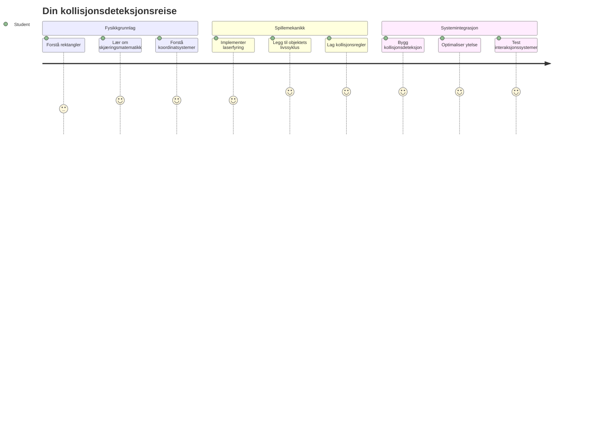
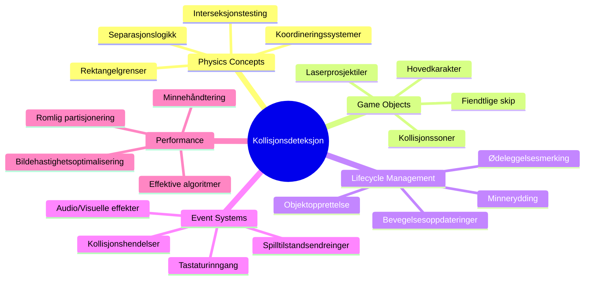
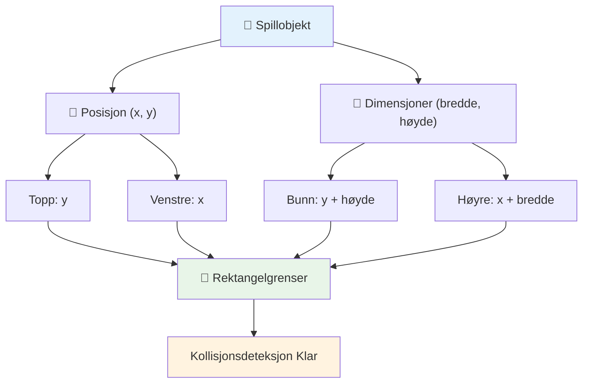
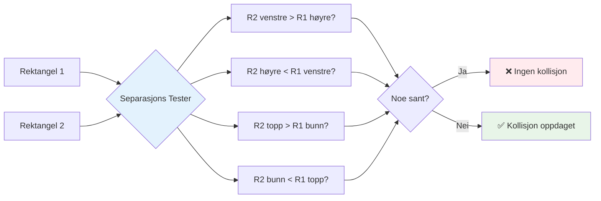
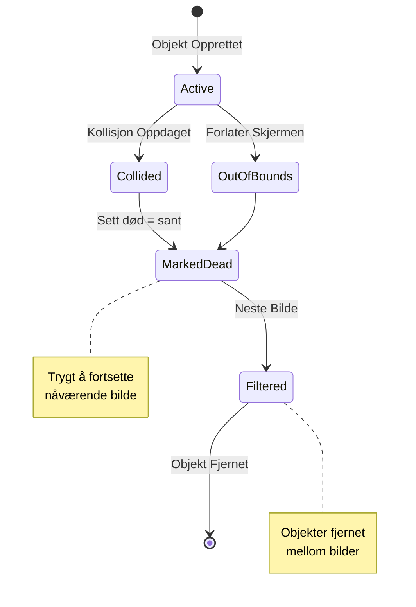
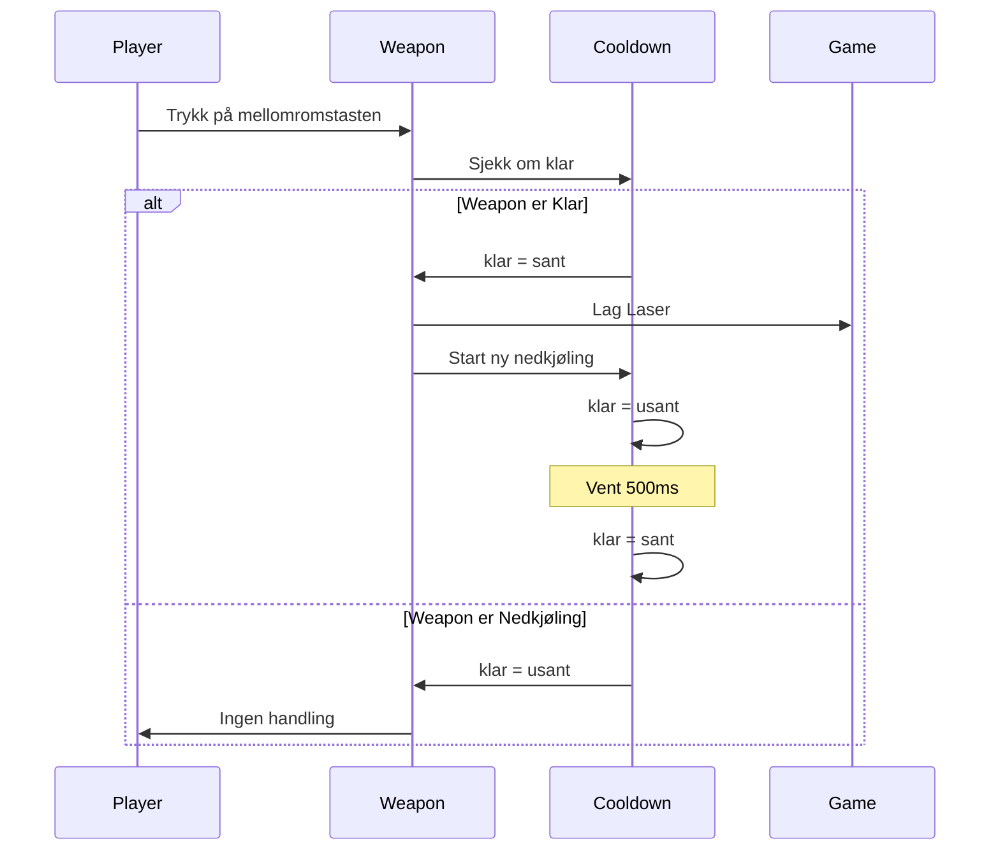
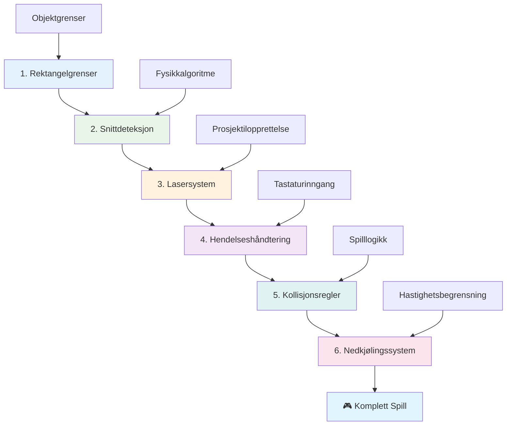
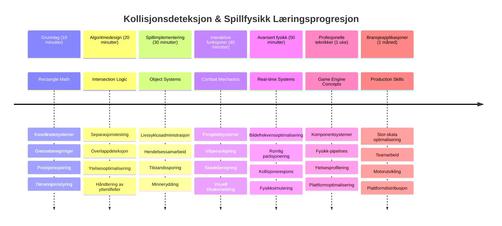

<!--
CO_OP_TRANSLATOR_METADATA:
{
  "original_hash": "039b4d8ce65f5edd82cf48d9c3e6728c",
  "translation_date": "2026-01-07T00:26:06+00:00",
  "source_file": "6-space-game/4-collision-detection/README.md",
  "language_code": "no"
}
-->
# Bygg et romspill del 4: Legge til en laser og oppdage kollisjoner


## Forforelesnings-quiz

[Forforelesnings-quiz](https://ff-quizzes.netlify.app/web/quiz/35)

Tenk på øyeblikket i Star Wars når Lukes protontorpedoer treffer Dødsstjernens eksosport. Den presise kollisjonsdeteksjonen endret galaksens skjebne! I spill fungerer kollisjonsdeteksjon på samme måte - den avgjør når objekter interagerer og hva som skjer videre.

I denne leksjonen skal du legge til laser-våpen i romspillet ditt og implementere kollisjonsdeteksjon. Akkurat som NASAs misjonsplanleggere beregner romfartøysbaner for å unngå rusk, vil du lære å oppdage når spillobjekter krysser hverandre. Vi deler dette opp i håndterbare trinn som bygger på hverandre.

Til slutt vil du ha et fungerende kampsystem hvor lasere ødelegger fiender og kollisjoner utløser spillhendelser. Disse samme kollisjonsprinsippene brukes i alt fra fysikksimuleringer til interaktive nettgrensesnitt.


✅ Gjør litt research på det aller første dataspillet som noen gang ble skrevet. Hva var funksjonaliteten?

## Kollisjonsdeteksjon

Kollisjonsdeteksjon fungerer som nærhetssensorene på Apollo månemodul – den sjekker konstant avstander og utløser varsler når objekter kommer for nær. I spill avgjør dette systemet når objekter interagerer og hva som skal skje videre.

Tilnærmingen vi skal bruke behandler hvert spillobjekt som et rektangel, på samme måte som flykontrollsystemer bruker forenklede geometriske former for å spore luftfartøy. Denne rektangelmetoden kan virke enkel, men er beregningsmessig effektiv og fungerer godt for de fleste spillscenarier.

### Rektangelrepresentasjon

Hvert spillobjekt trenger koordinatgrenser, på samme måte som Mars Pathfinder-roveren kartla sin posisjon på den martianske overflaten. Slik definerer vi disse grensekoordinatene:


```javascript
rectFromGameObject() {
  return {
    top: this.y,
    left: this.x,
    bottom: this.y + this.height,
    right: this.x + this.width
  }
}
```

**La oss bryte dette ned:**
- **Toppkant**: Det er bare hvor objektet starter vertikalt (dets y-posisjon)
- **Venstrekant**: Hvor det starter horisontalt (dets x-posisjon)
- **Bunnkant**: Legg høyden til y-posisjonen - nå vet du hvor det ender!
- **Høykant**: Legg bredden til x-posisjonen - og du har fullstendig grense

### Snittalgoritme

Å oppdage rektangelsnitt bruker logikk som ligner på hvordan Hubble-romteleskopet avgjør om himmellegemer overlapper i sitt synsfelt. Algoritmen sjekker for separasjon:


```javascript
function intersectRect(r1, r2) {
  return !(r2.left > r1.right ||
    r2.right < r1.left ||
    r2.top > r1.bottom ||
    r2.bottom < r1.top);
}
```

**Separasjonstesten fungerer som radarsystemer:**
- Er rektangel 2 helt til høyre for rektangel 1?
- Er rektangel 2 helt til venstre for rektangel 1?
- Er rektangel 2 helt under rektangel 1?
- Er rektangel 2 helt over rektangel 1?

Hvis ingen av disse betingelsene er sanne, må rektanglene overlappe. Denne tilnærmingen speiler hvordan radaroperatører avgjør om to fly er i sikre avstander.

## Håndtering av objekters levetid

Når en laser treffer en fiende, må begge objektene fjernes fra spillet. Men det å slette objekter midt i en løkke kan føre til krasj – en lærepenge tidlig i datasystemer som Apollo Guidance Computer. I stedet bruker vi en "merk for sletting"-tilnærming som trygt fjerner objekter mellom bildene.


Slik merker vi noe for fjerning:

```javascript
// Merk objekt for fjerning
enemy.dead = true;
```

**Hvorfor denne tilnærmingen fungerer:**
- Vi merker objektet som "dødt" men sletter det ikke med en gang
- Dette lar nåværende spillbilde fullføres trygt
- Ingen krasjer fra å prøve å bruke noe som allerede er borte!

Så filtrerer vi ut merkede objekter før neste gjengivelsessyklus:

```javascript
gameObjects = gameObjects.filter(go => !go.dead);
```

**Hva denne filtreringen gjør:**
- Lager en ny liste med bare "levende" objekter
- Kaster ut alt merket som dødt
- Holder spillet ditt kjørende glatt
- Forhindrer minneoppblåsing fra akkumulerte ødelagte objekter

## Implementering av lasermekanikk

Laserprosjektiler i spill fungerer på samme prinsipp som fotontorpedoer i Star Trek – de er diskrete objekter som beveger seg i rette linjer til de treffer noe. Hvert trykk på mellomromstasten lager et nytt laserobjekt som beveger seg over skjermen.

For å få dette til må vi koordinere noen ulike deler:

**Nøkkelkomponenter å implementere:**
- **Opprette** laserobjekter som oppstår fra heltes posisjon
- **Håndtere** tastaturinngang for å utløse laseropprettelse
- **Administrere** laserbevegelse og levetid
- **Implementere** visuell representasjon for laserprosjektilene

## Implementere kontroll av ildrate

Ubegrenset ildrate ville overveldet spillmotoren og gjort spillet for enkelt. Virkelige våpensystemer møter lignende begrensninger – selv USS Enterprises phasere trengte tid for å lade mellom skudd.

Vi skal implementere et kjølesystem som forhindrer hurtigskyting samtidig som det holder kontrollene responsive:


```javascript
class Cooldown {
  constructor(time) {
    this.cool = false;
    setTimeout(() => {
      this.cool = true;
    }, time);
  }
}

class Weapon {
  constructor() {
    this.cooldown = null;
  }
  
  fire() {
    if (!this.cooldown || this.cooldown.cool) {
      // Lag laserprosjektile
      this.cooldown = new Cooldown(500);
    } else {
      // Væpnet kjøler fortsatt ned
    }
  }
}
```

**Slik fungerer kjølingen:**
- Når laget, starter våpenet "varmt" (kan ikke skyte ennå)
- Etter tidsavbrudd blir det "kaldt" (klart til å skyte)
- Før skyting sjekker vi: "Er våpenet kaldt?"
- Dette forhindrer spam-klikk samtidig som kontrollene er raske

✅ Se leksjon 1 i romspillsserien for å minne deg om kjøletid.

## Bygge kollisjonsystemet

Du skal utvide din eksisterende romspillkode for å lage et kollisjonsdeteksjonssystem. Som den automatiserte kollisjonsunngåelsessystemet på den internasjonale romstasjonen, vil spillet kontinuerlig overvåke objektposisjoner og respondere på snitt.

Ut fra koden i forrige leksjon skal du legge til kollisjonsdeteksjon med spesifikke regler som styrer objektinteraksjoner.

> 💡 **Proftips**: Laser-spriten ligger allerede i din `assets`-mappe og er referert i koden din, klar til bruk.

### Kollisjonsregler å implementere

**Spillmekanikk å legge til:**
1. **Laser treffer fiende**: Fiendeobjekt blir ødelagt når det treffes av et laserprosjektil
2. **Laser treffer skjermgrense**: Laser fjernes når den når skjermens toppkant
3. **Fiende og helt-kollisjon**: Begge objekter ødelegges når de kolliderer
4. **Fiende når bunnen**: Spillet avsluttes når fiender når skjermen nederst

### 🔄 **Pedagogisk sjekkpunkt**
**Grunnlag for kollisjonsdeteksjon**: Før implementering, forsikre deg om at du forstår:
- ✅ Hvordan rektangelgrenser definerer kollisjonsområder
- ✅ Hvorfor separasjonstest er mer effektivt enn snittberegning
- ✅ Viktigheten av håndtering av objekters levetid i spill-løkker
- ✅ Hvordan hendelsesdrevne systemer koordinerer kollisjonsrespons

**Rask selvtest**: Hva ville skje hvis du slettet objekter umiddelbart i stedet for å merke dem?
*Svar: Sletting midt i løkkene kan føre til krasj eller hoppe over objekter i iterasjon*

**Forståelse av fysikk**: Nå har du forstått:
- **Koordinatsystemer**: Hvordan posisjon og dimensjoner skaper grenser
- **Snittlogikk**: Matematiske prinsipper bak kollisjonsdeteksjon
- **Ytelsesoptimalisering**: Hvorfor effektive algoritmer betyr mye i sanntid
- **Minnehåndtering**: Trygge levetidsmønstre for stabilitet

## Sette opp ditt utviklingsmiljø

Gode nyheter – vi har allerede forberedt det meste for deg! Alle spillressursene og grunnstrukturen ligger klare i `your-work`-undermappen, klare til at du skal legge til kule kollisjonsfunksjoner.

### Prosjektstruktur

```bash
-| assets
  -| enemyShip.png
  -| player.png
  -| laserRed.png
-| index.html
-| app.js
-| package.json
```

**Forstå filstrukturen:**
- **Inneholder** alle spritebilder behov for spillobjektene
- **Inkluderer** hoved HTML-dokument og JavaScript-applikasjonsfil
- **Tilbyr** pakke-konfigurasjon for lokal utviklingsserver

### Starte utviklingsserveren

Gå til prosjektmappen din og start lokal server:

```bash
cd your-work
npm start
```

**Denne kommandorekken:**
- **Bytter** til katalogen for ditt arbeidsprosjekt
- **Starter** en lokal HTTP-server på `http://localhost:5000`
- **Serverer** spillfilene dine for testing og utvikling
- **Muliggjør** live utvikling med automatisk oppdatering

Åpne nettleseren og gå til `http://localhost:5000` for å se nåværende spillstatus med helt og fiender vist på skjerm.

### Steg-for-steg implementering

Som den systematiske tilnærmingen NASA brukte for å programmere Voyager-romfartøyet, skal vi implementere kollisjonsdeteksjon metodisk, bygge hver komponent steg for steg.


#### 1. Legg til rektangel kollisjonsgrenser

Først, la oss lære spillobjektene våre å beskrive grensene sine. Legg til denne metoden i `GameObject`-klassen din:

```javascript
rectFromGameObject() {
    return {
      top: this.y,
      left: this.x,
      bottom: this.y + this.height,
      right: this.x + this.width,
    };
  }
```

**Denne metoden gjør:**
- **Oppretter** et rektangelobjekt med presise grensetall
- **Beregner** bunn- og høyrekant ved bruk av posisjon pluss dimensjoner
- **Returnerer** et objekt klart for kollisjonsdeteksjonsalgoritmer
- **Gir** et standardisert grensesnitt for alle spillobjekter

#### 2. Implementer snittdeteksjon

Lag nå vår kollisjonsdetektiv – en funksjon som kan si når to rektangler overlapper:

```javascript
function intersectRect(r1, r2) {
  return !(
    r2.left > r1.right ||
    r2.right < r1.left ||
    r2.top > r1.bottom ||
    r2.bottom < r1.top
  );
}
```

**Denne algoritmen fungerer ved:**
- **Tester** fire separasjonsbetingelser mellom rektangler
- **Returnerer** `false` dersom noen separasjonsbetingelser er sanne
- **Indikerer** kollisjon når ingen separasjoner finnes
- **Bruker** negasjonslogikk for effektiv snittesting

#### 3. Implementer laserildsystemet

Her blir det spennende! La oss sette opp laserskytingssystemet.

##### Konstantmeldinger

Definer først noen meldingstyper så ulike deler av spillet kan kommunisere:

```javascript
KEY_EVENT_SPACE: "KEY_EVENT_SPACE",
COLLISION_ENEMY_LASER: "COLLISION_ENEMY_LASER",
COLLISION_ENEMY_HERO: "COLLISION_ENEMY_HERO",
```

**Disse konstantene tilbyr:**
- **Standardiserer** hendelsesnavn i hele applikasjonen
- **Muliggjør** konsekvent kommunikasjon mellom spillsystemer
- **Forhindrer** skrivefeil ved registrering av hendelseslyttere

##### Tastaturinngangshåndtering

Legg til deteksjon av mellomrom i tastetrykklytter:

```javascript
} else if(evt.keyCode === 32) {
  eventEmitter.emit(Messages.KEY_EVENT_SPACE);
}
```

**Denne inngangshåndtereren:**
- **Oppdager** mellomromstast (keyCode 32)
- **Sender ut** en standardisert hendelsesmelding
- **Gjør** skytemekanismen løst koblet

##### Oppsett av hendelseslyttere

Registrer skyteadferd i din `initGame()`-funksjon:

```javascript
eventEmitter.on(Messages.KEY_EVENT_SPACE, () => {
 if (hero.canFire()) {
   hero.fire();
 }
});
```

**Denne hendelseslytteren:**
- **Reagerer** på mellomromstastevents
- **Sjekker** om avkjøling tillater skyting
- **Trigger** laseropprettelse når tillatt

Legg til kollisjonshåndtering for laser-fiende-interaksjoner:

```javascript
eventEmitter.on(Messages.COLLISION_ENEMY_LASER, (_, { first, second }) => {
  first.dead = true;
  second.dead = true;
});
```

**Denne kollisjonshåndteringen:**
- **Mottar** kollisjonsdata med begge objekter
- **Merker** begge for sletting
- **Sikrer** korrekt opprydding etter kollisjon

#### 4. Lag Laser-klassen

Implementer et laserprosjektil som beveger seg oppover og håndterer sin egen levetid:

```javascript
class Laser extends GameObject {
  constructor(x, y) {
    super(x, y);
    this.width = 9;
    this.height = 33;
    this.type = 'Laser';
    this.img = laserImg;
    
    let id = setInterval(() => {
      if (this.y > 0) {
        this.y -= 15;
      } else {
        this.dead = true;
        clearInterval(id);
      }
    }, 100);
  }
}
```

**Denne klasseimplementasjonen:**
- **Utvider** GameObject for å arve grunnfunksjonalitet
- **Setter** passende dimensjoner til laser-spriten
- **Lager** automatisk oppoverbevegelse med `setInterval()`
- **Håndterer** selvdestruksjon ved skjermtopp
- **Administrerer** egen animasjonstiming og opprydding

#### 5. Implementer kollisjonssystem

Lag en omfattende kollisjonsdeteksjonsfunksjon:

```javascript
function updateGameObjects() {
  const enemies = gameObjects.filter(go => go.type === 'Enemy');
  const lasers = gameObjects.filter(go => go.type === "Laser");
  
  // Test laser-fiende kollisjoner
  lasers.forEach((laser) => {
    enemies.forEach((enemy) => {
      if (intersectRect(laser.rectFromGameObject(), enemy.rectFromGameObject())) {
        eventEmitter.emit(Messages.COLLISION_ENEMY_LASER, {
          first: laser,
          second: enemy,
        });
      }
    });
  });

  // Fjern ødelagte objekter
  gameObjects = gameObjects.filter(go => !go.dead);
}
```

**Dette kollisjonssystemet:**
- **Filtrerer** spillobjekter etter type for effektiv testing
- **Tester** hver laser mot hver fiende for overlapp
- **Sender ut** kollisjonsbegivenheter når snitt oppstår
- **Rydder** opp ødelagte objekter etter kollisjonsbehandling

> ⚠️ **Viktig**: Legg til `updateGameObjects()` i hovedspillsløyfen din i `window.onload` for å aktivere kollisjonsdeteksjon.

#### 6. Legg til kjølesystem i Hero-klassen

Utvid Hero-klassen med skytemekanikk og hastighetsbegrensning:

```javascript
class Hero extends GameObject {
  constructor(x, y) {
    super(x, y);
    this.width = 99;
    this.height = 75;
    this.type = "Hero";
    this.speed = { x: 0, y: 0 };
    this.cooldown = 0;
  }
  
  fire() {
    gameObjects.push(new Laser(this.x + 45, this.y - 10));
    this.cooldown = 500;

    let id = setInterval(() => {
      if (this.cooldown > 0) {
        this.cooldown -= 100;
      } else {
        clearInterval(id);
      }
    }, 200);
  }
  
  canFire() {
    return this.cooldown === 0;
  }
}
```

**Forstå den forbedrede Hero-klassen:**
- **Initialiserer** kjøletimer til null (klar til å skyte)
- **Oppretter** laserobjekter plassert over helteskipet
- **Setter** kjøleperiode for å forhindre hurtigskyting
- **Reduserer** kjøletid med intervallbaserte oppdateringer
- **Gir** skytestatus-sjekk via `canFire()`-metoden

### 🔄 **Pedagogisk sjekkpunkt**
**Fullstendig systemforståelse**: Bekreft mestring av kollisjonssystemet:
- ✅ Hvordan gjør rektangelgrenser kollisjonsdeteksjon effektiv?
- ✅ Hvorfor er håndtering av objekters levetid kritisk for spillstabilitet?
- ✅ Hvordan forhindrer kjølesystem ytelsesproblemer?
- ✅ Hvilken rolle spiller hendelsesdrevet arkitektur i kollisjonshåndtering?

**Systemintegrasjon**: Din kollisjonsdeteksjon demonstrerer:
- **Matematisk presisjon**: Rektangelsnittalgoritmer
- **Ytelsesoptimalisering**: Effektive mønstre for kollisjonstesting
- **Minnehåndtering**: Trygg opprettelse og ødeleggelse av objekter
- **Hendelsessamordning**: Løst koblet systemkommunikasjon
- **Sanntidsprosessering**: Bildebaserte oppdateringssykluser

**Profesjonelle mønstre**: Du har implementert:
- **Sepparasjonsprinsipper**: Fysikk, gjengivelse og input adskilt
- **Objektorientert design**: Arv og polymorfisme
- **Tilstandshåndtering**: Objektlivsløp og spilltilstands-sporing
- **Ytelsesoptimalisering**: Effektive algoritmer for sanntidsbruk

### Test implementeringen din

Romspillet ditt har nå komplett kollisjonsdeteksjon og kampmekanikk. 🚀 Test disse nye funksjonene:
- **Naviger** med piltastene for å kontrollere bevegelse
- **Skyt lasere** med mellomromstasten – legg merke til at kjøletiden hindrer spamming
- **Observer kollisjoner** når lasere treffer fiender og trigger fjerning
- **Verifiser opprydding** når ødelagte objekter forsvinner fra spillet

Du har med suksess implementert et kollisjonsdeteksjonssystem ved hjelp av samme matematiske prinsipper som styrer romfartøy-navigasjon og robotikk.

### ⚡ **Hva du kan gjøre de neste 5 minuttene**
- [ ] Åpne nettleserens utviklerverktøy og sett breakpoint i kollisjonsdeteksjonsfunksjonen din
- [ ] Prøv å endre lasers hastighet eller fiendebevegelse for å se kollisjonseffekter
- [ ] Eksperimenter med ulike kjøletidsverdier for å teste skytefrekvens
- [ ] Legg til `console.log`-setninger for å spore kollisjonsbegivenheter i sanntid

### 🎯 **Hva du kan oppnå denne timen**
- [ ] Fullfør quizzen etter leksjonen og forstå kollisjonsdeteksjonsalgoritmer
- [ ] Legg til visuelle effekter som eksplosjoner når kollisjoner oppstår
- [ ] Implementer forskjellige typer prosjektiler med varierende egenskaper
- [ ] Lag power-ups som midlertidig forbedrer spillerens evner
- [ ] Legg til lydeffekter for å gjøre kollisjoner mer tilfredsstillende

### 📅 **Din uke-lange fysikkprogrammering**
- [ ] Fullfør hele romspillet med polerte kollisjonsystemer
- [ ] Implementer avanserte kollisjonsformer utover rektangler (sirkler, polygoner)
- [ ] Legg til partikksystemer for realistiske eksplosjonseffekter
- [ ] Lag kompleks fiendeatferd med kollisjonsunngåelse
- [ ] Optimaliser kollisjonsdeteksjon for bedre ytelse med mange objekter
- [ ] Legg til fysikksimulering som bevegelsesmengde og realistisk bevegelse

### 🌟 **Din måneds-lange mestring av spillfysikk**
- [ ] Bygg spill med avanserte fysikkmotorer og realistiske simuleringer
- [ ] Lær 3D kollisjonsdeteksjon og romlig partisjoneringsalgoritmer
- [ ] Bidra til open source fysikkbiblioteker og spillmotorer
- [ ] Mestre ytelsesoptimalisering for grafikkintensive applikasjoner
- [ ] Lag pedagogisk innhold om spillfysikk og kollisjonsdeteksjon
- [ ] Bygg en portefølje som viser avanserte ferdigheter i fysikkprogrammering

## 🎯 Din tidslinje for mestring av kollisjonsdeteksjon


### 🛠️ Sammendrag av ditt verktøysett for spillfysikk

Etter å ha fullført denne leksjonen, har du nå mestret:
- **Kollisjonsmatematikk**: Algoritmer for rektangelkoblinger og koordinatsystemer
- **Ytelsesoptimalisering**: Effektiv kollisjonsdeteksjon for sanntidsapplikasjoner
- **Objektlivssyklusadministrasjon**: Sikker opprettelse, oppdatering og destruksjonsmønstre
- **Hendelsesdrevet arkitektur**: Løse systemer for kollisjonsrespons
- **Integrasjon i spill-løkken**: Fysikkoppdateringer per bilde og koordinering av rendering
- **Inngangssystemer**: Responsive kontroller med hastighetsbegrensning og tilbakemelding
- **Minnehåndtering**: Effektiv objektpooling og oppryddingsstrategier

**Virkelige anvendelser**: Dine ferdigheter i kollisjonsdeteksjon gjelder direkte for:
- **Interaktive simuleringer**: Vitenskapelig modellering og pedagogiske verktøy
- **Brukergrensesnittdesign**: Dra-og-slipp interaksjoner og berøringsdeteksjon
- **Datavisualisering**: Interaktive diagrammer og klikkbare elementer
- **Mobilutvikling**: Berøringsgjenkjennelse og kollisjonshåndtering
- **Robotikkprogrammering**: Sti-planlegging og unngåelse av hindringer
- **Datagrafikk**: Ray tracing og romlige algoritmer

**Profesjonelle ferdigheter oppnådd**: Du kan nå:
- **Designe** effektive algoritmer for sanntids kollisjonsdeteksjon
- **Implementere** fysikksystemer som skalerer med objektkompleksitet
- **Feilsøke** komplekse interaksjonssystemer ved hjelp av matematiske prinsipper
- **Optimalisere** ytelsen for forskjellig maskinvare og nettleserkapasiteter
- **Arkitektere** vedlikeholdbare spillsystemer med dokumenterte designmønstre

**Spillutviklingskonsepter mestret**:
- **Fysikksimulering**: Sanntids kollisjonsdeteksjon og respons
- **Ytelsesingeniørkunst**: Optimaliserte algoritmer for interaktive applikasjoner
- **Hendelsessystemer**: Løs kobling mellom spillkomponenter
- **Objekthåndtering**: Effektive livssyklusmønstre for dynamisk innhold
- **Inngangshåndtering**: Responsive kontroller med passende tilbakemelding

**Neste nivå**: Du er klar til å utforske avanserte fysikkmotorer som Matter.js, implementere 3D kollisjonsdeteksjon, eller bygge komplekse partikksystemer!

🌟 **Oppnåelse låst opp**: Du har bygget et komplett interaksjonssystem basert på fysikk med kollisjonsdeteksjon i profesjonell klasse!

## GitHub Copilot Agent Challenge 🚀

Bruk Agent-modus for å fullføre følgende utfordring:

**Beskrivelse:** Forbedre kollisjonsdeteksjonssystemet ved å implementere power-ups som spawner tilfeldig og gir midlertidige evner når de samles opp av helteskipet.

**Prompt:** Lag en PowerUp-klasse som utvider GameObject og implementer kollisjonsdeteksjon mellom helten og power-ups. Legg til minst to typer power-ups: en som øker skytefrekvens (reduserer cooldown) og en annen som lager et midlertidig skjold. Inkluder spawn-logikk som oppretter power-ups med tilfeldige intervaller og posisjoner.

---


## 🚀 Utfordring

Legg til en eksplosjon! Ta en titt på spillressursene i [the Space Art repo](../../../../6-space-game/solution/spaceArt/readme.txt) og prøv å legge til en eksplosjon når laseren treffer en romvesen

## Quiz etter forelesning

[Post-lecture quiz](https://ff-quizzes.netlify.app/web/quiz/36)

## Gjennomgang & Selvstudium

Eksperimenter med intervallene i spillet ditt så langt. Hva skjer når du endrer dem? Les mer om [JavaScript timing events](https://www.freecodecamp.org/news/javascript-timing-events-settimeout-and-setinterval/).

## Oppgave

[Utforsk kollisjoner](assignment.md)

---

<!-- CO-OP TRANSLATOR DISCLAIMER START -->
**Ansvarsfraskrivelse**:
Dette dokumentet har blitt oversatt ved hjelp av AI-oversettelsestjenesten [Co-op Translator](https://github.com/Azure/co-op-translator). Selv om vi streber etter nøyaktighet, vennligst vær oppmerksom på at automatiserte oversettelser kan inneholde feil eller unøyaktigheter. Det opprinnelige dokumentet på dets opprinnelige språk bør anses som den autoritative kilden. For kritisk informasjon anbefales profesjonell menneskelig oversettelse. Vi er ikke ansvarlige for eventuelle misforståelser eller feiltolkninger som følge av bruk av denne oversettelsen.
<!-- CO-OP TRANSLATOR DISCLAIMER END -->