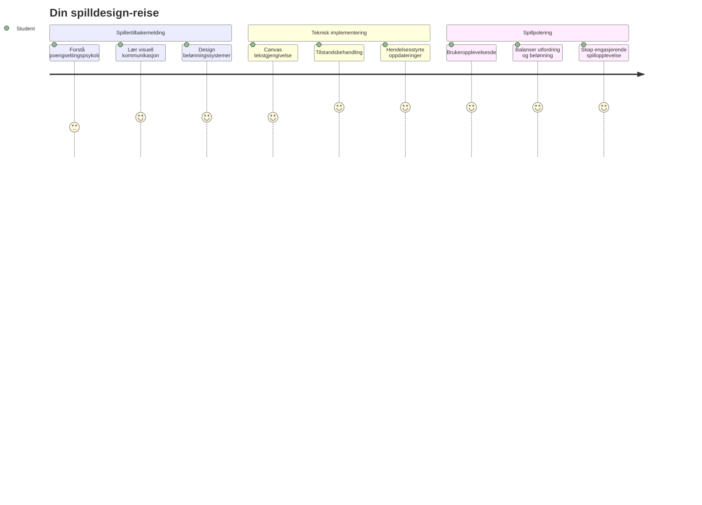
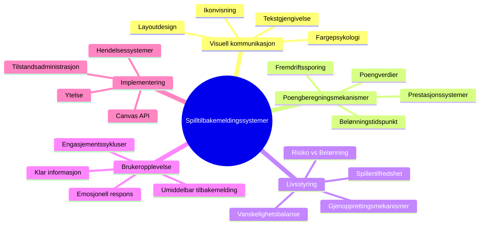
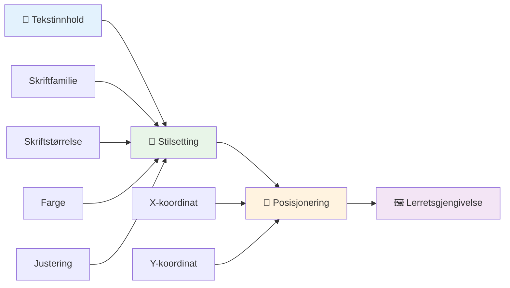
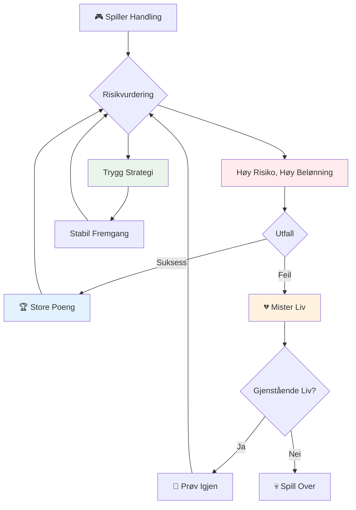
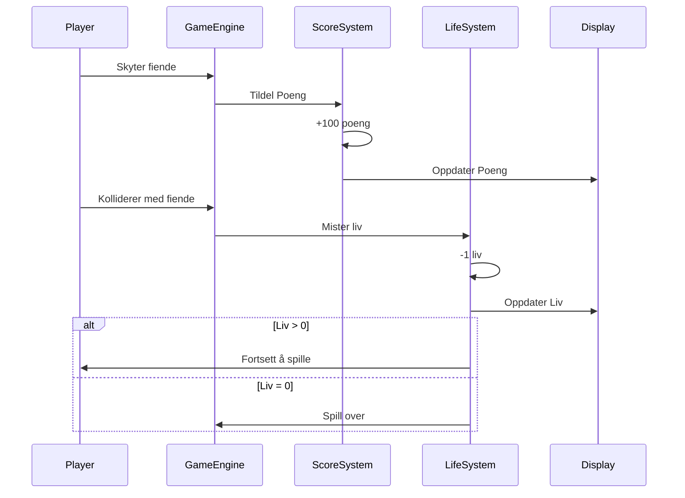
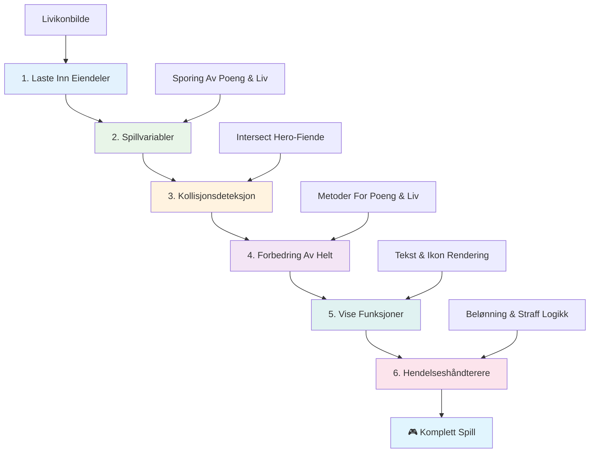
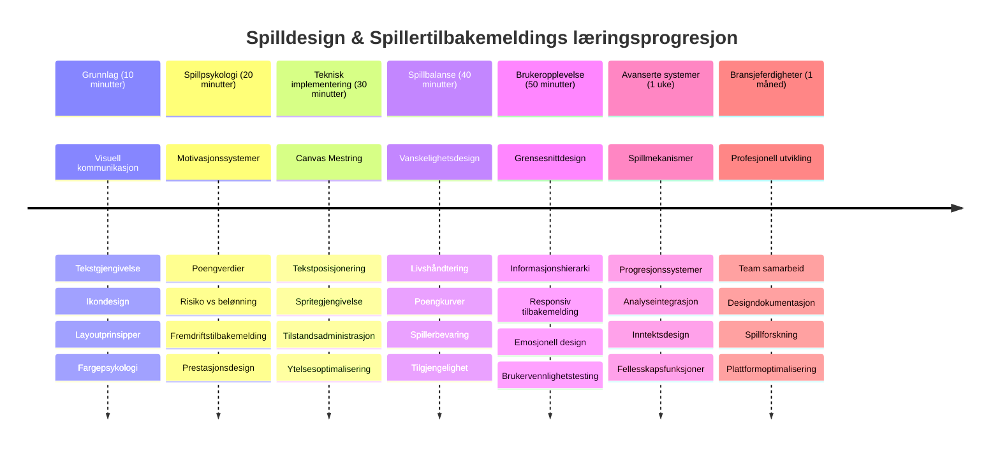

# Bygg et romspill del 5: Poeng og liv


## For-forelesningstest

[For-forelesningstest](https://ff-quizzes.netlify.app/web/quiz/37)

Klar til å få romspillet ditt til å føles som et ekte spill? La oss legge til poenggivning og livsadministrasjon – de grunnleggende mekanikkene som forvandlet tidlige arkadespill som Space Invaders fra enkle demonstrasjoner til fengende underholdning. Her blir spillet ditt virkelig spillbart.


## Tegne tekst på skjermen - spillets stemme

For å vise poengsummen din må vi lære hvordan vi gjengir tekst på lerretet. `fillText()`-metoden er ditt primære verktøy for dette – det samme som ble brukt i klassiske arkadespill for å vise poeng og statusinformasjon.


Du har full kontroll over tekstens utseende:

```javascript
ctx.font = "30px Arial";
ctx.fillStyle = "red";
ctx.textAlign = "right";
ctx.fillText("show this on the screen", 0, 0);
```

✅ Dykk dypere inn i [å legge til tekst på et lerret](https://developer.mozilla.org/docs/Web/API/Canvas_API/Tutorial/Drawing_text) – du kan bli overrasket over hvor kreativ du kan være med fonter og styling!

## Liv – mer enn bare et tall

I spilldesign representerer et "liv" spillerens feilmargin. Dette konseptet går helt tilbake til flipperspill, hvor du fikk flere baller å spille med. I tidlige videospill som Asteroids ga liv spillerne tillatelse til å ta risiko og lære av feil.


Visuell representasjon er svært viktig – å vise skipsikoner i stedet for bare "Liv: 3" gir umiddelbar visuell gjenkjenning, på samme måte som tidlige arkadeskap brukte ikonografi for å kommunisere på tvers av språkbarrierer.

## Bygge spillets belønningssystem

Nå skal vi implementere de grunnleggende tilbakemeldingssystemene som holder spillerne engasjerte:


- **Poengsystem**: Hvert ødelagte fiendeskip belønner med 100 poeng (runde tall er lettere for spillerne å regne på mentalt). Poengsummen vises nederst til venstre.
- **Livsteller**: Helten din starter med tre liv – en standard etablert av tidlige arkadespill for å balansere utfordring med spillbarhet. Hver kollisjon med en fiende koster ett liv. Vi viser gjenværende liv nederst til høyre med skipsikoner .

## La oss bygge!

Først, sett opp arbeidsområdet ditt. Naviger til filene i undermappen `your-work`. Du bør se disse filene:

```bash
-| assets
  -| enemyShip.png
  -| player.png
  -| laserRed.png
-| index.html
-| app.js
-| package.json
```

For å teste spillet ditt, start utviklingsserveren fra `your_work`-mappen:

```bash
cd your-work
npm start
```

Dette starter en lokal server på `http://localhost:5000`. Åpne denne adressen i nettleseren din for å se spillet. Test kontrollene med piltastene og prøv å skyte fiender for å bekrefte at alt fungerer.


### Tid for koding!

1. **Hent de visuelle ressursene du trenger**. Kopier `life.png`-ressursen fra `solution/assets/`-mappen til din `your-work`-mappe. Legg deretter til lifeImg i window.onload-funksjonen:

    ```javascript
    lifeImg = await loadTexture("assets/life.png");
    ```

1. Ikke glem å legge til `lifeImg` i ressurslisten din:

    ```javascript
    let heroImg,
    ...
    lifeImg,
    ...
    eventEmitter = new EventEmitter();
    ```
  
2. **Sett opp spillvariablene dine**. Legg til kode for å spore totalpoengsummen (starter på 0) og gjenstående liv (starter på 3). Vi vil vise disse på skjermen slik at spillerne alltid vet hvor de står.

3. **Implementer kollisjonsdeteksjon**. Utvid `updateGameObjects()`-funksjonen din for å oppdage når fiender kolliderer med helten din:

    ```javascript
    enemies.forEach(enemy => {
        const heroRect = hero.rectFromGameObject();
        if (intersectRect(heroRect, enemy.rectFromGameObject())) {
          eventEmitter.emit(Messages.COLLISION_ENEMY_HERO, { enemy });
        }
      })
    ```

4. **Legg til livs- og poengsporing til helten din**. 
   1. **Initialiser tellerne**. Under `this.cooldown = 0` i `Hero`-klassen, sett opp liv og poeng:

        ```javascript
        this.life = 3;
        this.points = 0;
        ```

   1. **Vis disse verdiene til spilleren**. Lag funksjoner for å tegne disse verdiene på skjermen:

        ```javascript
        function drawLife() {
          // TODO, 35, 27
          const START_POS = canvas.width - 180;
          for(let i=0; i < hero.life; i++ ) {
            ctx.drawImage(
              lifeImg, 
              START_POS + (45 * (i+1) ), 
              canvas.height - 37);
          }
        }
        
        function drawPoints() {
          ctx.font = "30px Arial";
          ctx.fillStyle = "red";
          ctx.textAlign = "left";
          drawText("Points: " + hero.points, 10, canvas.height-20);
        }
        
        function drawText(message, x, y) {
          ctx.fillText(message, x, y);
        }

        ```

   1. **Koble alt inn i spill-loopen din**. Legg til disse funksjonene i window.onload-funksjonen rett etter `updateGameObjects()`:

        ```javascript
        drawPoints();
        drawLife();
        ```

### 🔄 **Pedagogisk sjekkpunkt**
**Forståelse av spilldesign**: Før du implementerer konsekvenser, sørg for at du forstår:
- ✅ Hvordan visuell tilbakemelding kommuniserer spillstatus til spilleren
- ✅ Hvorfor konsistent plassering av UI-elementer forbedrer brukervennlighet
- ✅ Psykologien bak poengverdier og livsadministrasjon
- ✅ Hvordan tekstgjengivelse på lerret skiller seg fra HTML-tekst

**Rask selvtest**: Hvorfor bruker arkadespill vanligvis runde tall som poengverdier?
*Svar: Runde tall er lettere for spillere å regne mentalt og skaper tilfredsstillende psykologiske belønninger*

**Brukeropplevelsesprinsipper**: Du anvender nå:
- **Visuell hierarki**: Viktig informasjon plassert fremtredende
- **Umiddelbar tilbakemelding**: Oppdateringer i sanntid på spillerhandlinger
- **Kognitiv belastning**: Enkelt og klart informasjonsoppsett
- **Emosjonell design**: Ikoner og farger som skaper spillerengasjement

1. **Implementer spillkonsekvenser og belønninger**. Nå legger vi til tilbakemeldingssystemene som gir mening til spillerhandlingene:

   1. **Kollisjoner koster liv**. Hver gang helten din krasjer med en fiende, mister du et liv.

      Legg til denne metoden i `Hero`-klassen:

        ```javascript
        decrementLife() {
          this.life--;
          if (this.life === 0) {
            this.dead = true;
          }
        }
        ```

   2. **Å skyte fiender gir poeng**. Hvert vellykkede treff belønnes med 100 poeng, og gir umiddelbar positiv tilbakemelding for presis skyting.

      Utvid Hero-klassen med denne inkrement-metoden:
    
        ```javascript
          incrementPoints() {
            this.points += 100;
          }
        ```

        Koble nå disse funksjonene til kollisjons- hendelsene:

        ```javascript
        eventEmitter.on(Messages.COLLISION_ENEMY_LASER, (_, { first, second }) => {
           first.dead = true;
           second.dead = true;
           hero.incrementPoints();
        })

        eventEmitter.on(Messages.COLLISION_ENEMY_HERO, (_, { enemy }) => {
           enemy.dead = true;
           hero.decrementLife();
        });
        ```

✅ Nysgjerrig på andre spill laget med JavaScript og Canvas? Utforsk gjerne – du kan bli overrasket over hva som er mulig!

Etter å ha implementert disse funksjonene, test spillet for å se det komplette tilbakemeldingssystemet i aksjon. Du skal se livsikoner nederst til høyre, poengsummen nederst til venstre, og oppleve hvordan kollisjoner reduserer liv mens vellykkede treff øker poengsummen.

Spillet ditt har nå de essensielle mekanikkene som gjorde tidlige arkadespill så fengende – klare mål, umiddelbar tilbakemelding, og meningsfulle konsekvenser for spillerhandlinger.

### 🔄 **Pedagogisk sjekkpunkt**
**Fullstendig spilldesignsystem**: Bekreft at du har mestret spillerens tilbakemeldingssystemer:
- ✅ Hvordan skaper poengsystemer motivasjon og engasjement for spilleren?
- ✅ Hvorfor er visuell konsistens viktig for brukergrensesnittdesign?
- ✅ Hvordan balanserer livssystemet utfordring og spillerkontinuitet?
- ✅ Hvilken rolle spiller umiddelbar tilbakemelding i å skape tilfredsstillende spillopplevelse?

**Systemintegrasjon**: Tilbakemeldingssystemet ditt viser:
- **Brukeropplevelsesdesign**: Klar visuell kommunikasjon og informasjonsstruktur
- **Hendelsesdrevet arkitektur**: Responsiv oppdatering på spillerhandlinger
- **Tilstandshåndtering**: Sporing og visning av dynamiske spilldata
- **Canvas-mestring**: Tekstgjengivelse og sprite-posisjonering
- **Spillpsykologi**: Forståelse av spillerens motivasjon og engasjement

**Profesjonelle mønstre**: Du har implementert:
- **MVC-arkitektur**: Separasjon av spilllogikk, data og presentasjon
- **Observer-mønster**: Hendelsesdrevne oppdateringer av spilltilstand
- **Komponentdesign**: Gjenbrukbare funksjoner for visning og logikk
- **Ytelsesoptimalisering**: Effektiv gjengivelse i spill-løkker

### ⚡ **Hva du kan gjøre på de neste 5 minuttene**
- [ ] Eksperimenter med forskjellige skriftstørrelser og farger for poengvisning
- [ ] Prøv å endre poengverdier og se hvordan det påvirker spillfølelsen
- [ ] Legg til console.log-utsagn for å spore når poeng og liv endres
- [ ] Test grenseverdier som å gå tom for liv eller oppnå høye poengsummer

### 🎯 **Hva du kan oppnå denne timen**
- [ ] Fullfør etter-forelesningsquizen og forstå spilldesignpsykologi
- [ ] Legg til lydeffekter for poeng og tap av liv
- [ ] Implementer et highscore-system med localStorage
- [ ] Lag forskjellige poengverdier for ulike fiendetyper
- [ ] Legg til visuelle effekter som skjermeffekt ved tap av liv

### 📅 **Din ukelange reise i spilldesign**
- [ ] Fullfør hele romspillet med polerte tilbakemeldingssystemer
- [ ] Implementer avanserte poengmekanikker som komboforsterkere
- [ ] Legg til prestasjoner og låsbart innhold
- [ ] Lag vanskelighetsprogresjon og balanseringssystemer
- [ ] Design brukergrensesnitt for menyer og spill-slutt-skjermer
- [ ] Studer andre spill for å forstå engasjementsmekanismer

### 🌟 **Din månedslange mestring i spillutvikling**
- [ ] Bygg komplette spill med sofistikerte progresjonssystemer
- [ ] Lær spillanalyse og måling av spillers atferd
- [ ] Bidra til open source spillutviklingsprosjekter
- [ ] Mestre avanserte spilldesignmønstre og inntektsgenerering
- [ ] Lag pedagogisk innhold om spilldesign og brukeropplevelse
- [ ] Bygg en portefølje som viser frem spilldesign- og utviklingsferdigheter

## 🎯 Din tidslinje for mestring i spilldesign


### 🛠️ Oppsummering av spilldesignverktøyet ditt

Etter å ha fullført denne leksjonen har du mestret:
- **Spillerpsykologi**: Forståelse av motivasjon, risiko/belønning og engasjementssykluser
- **Visuell kommunikasjon**: Effektiv UI-design med tekst, ikoner og layout
- **Tilbakemeldingssystemer**: Sanntidssvar på spillerhandlinger og spillehendelser
- **Tilstandshåndtering**: Effektiv sporing og visning av dynamiske spilldata
- **Canvas-tektsgjengivelse**: Profesjonell tekstvisning med styling og posisjonering
- **Hendelsesintegrasjon**: Koble brukerhandlinger til meningsfulle spillkonsekvenser
- **Spillbalanse**: Design av vanskelighetskurver og spillerprogressjonssystemer

**Reelle anvendelser**: Spilldesignferdighetene dine gjelder direkte til:
- **Brukergrensesnittdesign**: Lage engasjerende og intuitive grensesnitt
- **Produktutvikling**: Forstå brukerens motivasjon og tilbakemeldingssløyfer
- **Pedagogisk teknologi**: Gamifisering og engasjementsystemer for læring
- **Datavisualisering**: Gjøre kompleks informasjon tilgjengelig og engasjerende
- **Mobilapputvikling**: Retensjonsmekanismer og brukeropplevelsesdesign
- **Markedsføringsteknologi**: Forståelse av brukeradferd og konverteringsoptimalisering

**Profesjonelle ferdigheter tilegnet**: Du kan nå:
- **Designe** brukeropplevelser som motiverer og engasjerer brukere
- **Implementere** tilbakemeldingssystemer som effektivt styrer brukeradferd
- **Balanse** utfordring og tilgjengelighet i interaktive systemer
- **Skape** visuell kommunikasjon som fungerer på tvers av brukergrupper
- **Analysere** brukeradferd og iterere på designforbedringer

**Spillutviklingskonsepter mestret**:
- **Spillermotivasjon**: Forstå hva som driver engasjement og retensjon
- **Visuell design**: Lage klare, attraktive og funksjonelle grensesnitt
- **Systemintegrasjon**: Koble flere spillsystemer for en sammenhengende opplevelse
- **Ytelsesoptimalisering**: Effektiv gjengivelse og tilstandshåndtering
- **Tilgjengelighet**: Designe for ulike ferdighetsnivåer og spillerbehov

**Neste nivå**: Du er klar til å utforske avanserte spilldesignmønstre, implementere analyssystemer eller studere spillmonetisering og spillerretensjonsstrategier!

🌟 **Prestasjon oppnådd**: Du har bygget et komplett tilbakemeldingssystem for spillere med profesjonelle spilldesignprinsipper!

---

## GitHub Copilot Agent-utfordring 🚀

Bruk Agent-modus for å fullføre følgende utfordring:

**Beskrivelse:** Forbedre romspillets poengsystem ved å implementere et highscore-funksjon med vedvarende lagring og bonuspoengmekanikker.

**Oppgave:** Lag et highscore-system som lagrer spillerens beste poengsum i localStorage. Legg til bonuspoeng for påfølgende fiendekill (kombosystem) og implementer forskjellige poengverdier for ulike fiendetyper. Inkluder et visuelt tegn når spilleren oppnår ny highscore og vis gjeldende highscore på spillskjermen.

## 🚀 Utfordring

Du har nå et fungerende spill med poeng og liv. Vurder hvilke tilleggsegenskaper som kan forbedre spilleropplevelsen.

## Etter-forelesningstest

[Etter-forelesningstest](https://ff-quizzes.netlify.app/web/quiz/38)

## Gjennomgang og selvstudium

Vil du utforske mer? Undersøk ulike tilnærminger til poenggivning og livssystemer i spill. Det finnes fascinerende spillmotorer som [PlayFab](https://playfab.com) som håndterer poeng, topplister og spillerprogresjon. Hvordan kan integrering av noe slikt ta spillet ditt til neste nivå?

## Oppgave

[Bygg et poengspill](assignment.md)

---

<!-- CO-OP TRANSLATOR DISCLAIMER START -->
**Ansvarsfraskrivelse**:
Dette dokumentet er oversatt ved hjelp av AI-oversettelsestjenesten [Co-op Translator](https://github.com/Azure/co-op-translator). Selv om vi jobber for å oppnå nøyaktighet, vennligst vær oppmerksom på at automatiske oversettelser kan inneholde feil eller unøyaktigheter. Det opprinnelige dokumentet på originalspråket skal betraktes som den autoritative kilden. For kritisk informasjon anbefales profesjonell, menneskelig oversettelse. Vi er ikke ansvarlige for eventuelle misforståelser eller feiltolkninger som oppstår ved bruk av denne oversettelsen.
<!-- CO-OP TRANSLATOR DISCLAIMER END -->