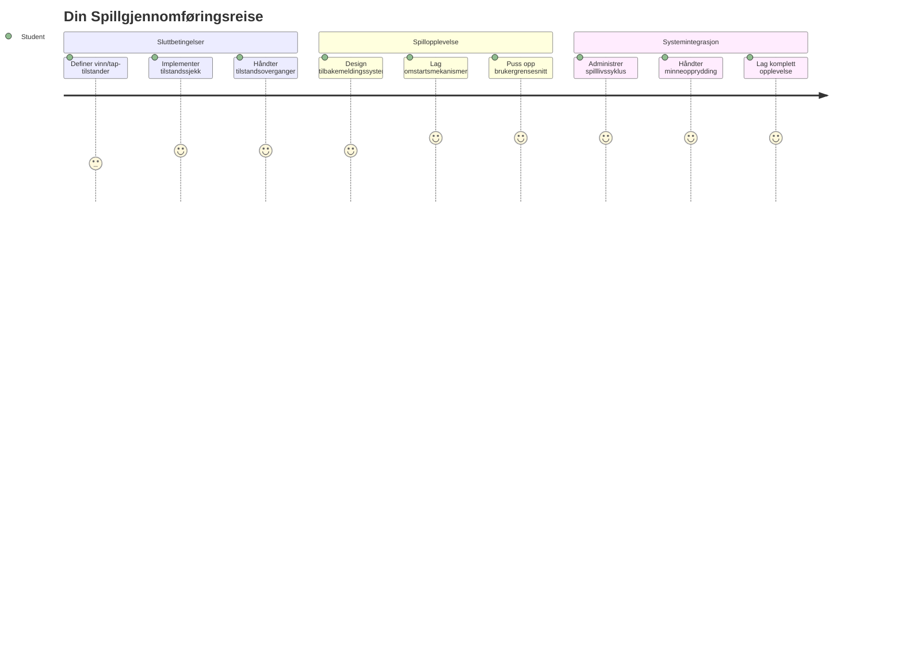
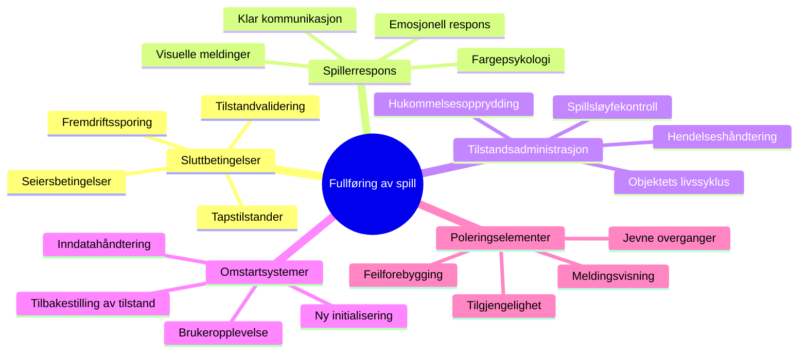
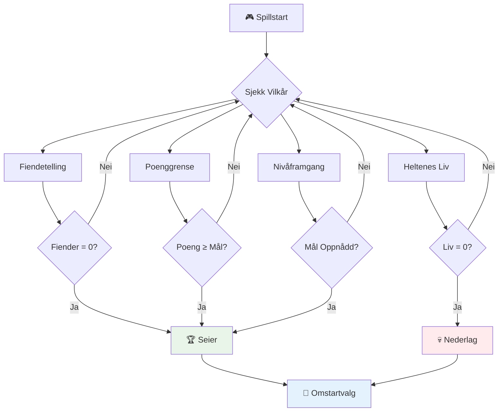
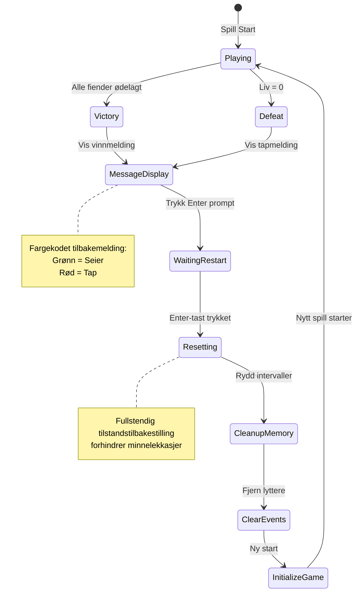
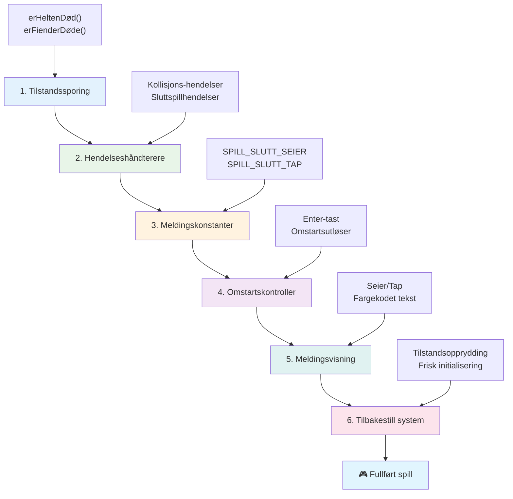
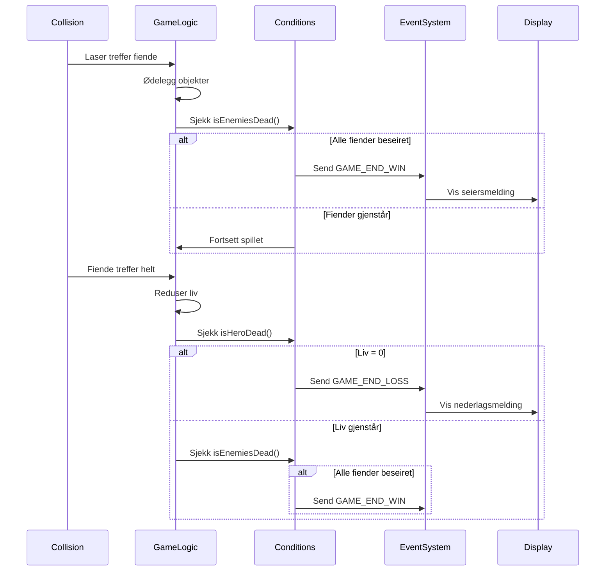
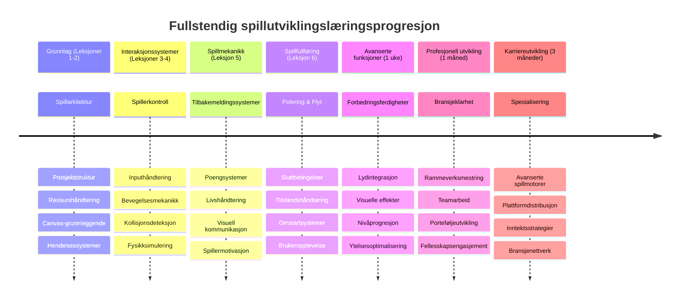

# Bygg et romspill del 6: Slutt og restart


Hvert flott spill trenger klare sluttbetingelser og en smidig restartmekanisme. Du har bygget et imponerende romspill med bevegelse, kamp og poengberegning – nå er det tid for å legge til de siste bitene som får det til å føles komplett.

Spillet ditt kjører for øyeblikket uendelig, som Voyager-sondene som NASA sendte opp i 1977 – fortsatt på reise gjennom verdensrommet tiår senere. Selv om det er fint for romutforskning, trenger spill definerte endepunkter for å skape tilfredsstillende opplevelser.

I dag skal vi implementere riktige vinn/forlurt-betingelser og et restartsystem. Når du er ferdig med denne leksjonen, vil du ha et polert spill som spillere kan fullføre og spille om igjen, akkurat som de klassiske arkadespillene som definerte mediet.


## Pre-forelesningsquiz

[Pre-forelesningsquiz](https://ff-quizzes.netlify.app/web/quiz/39)

## Forstå spillsluttbetingelser

Når bør spillet ditt avsluttes? Dette grunnleggende spørsmålet har formet spilldesign siden den tidlige arkadeepoken. Pac-Man slutter når du blir tatt av spøkelser eller rydder alle prikkene, mens Space Invaders slutter når romvesener når bunnen eller du ødelegger dem alle.

Som spillutvikler definerer du seier- og tapbetingelsene. For vårt romspill er her prøvede tilnærminger som skaper engasjerende gameplay:


- **`N` fiendeskip er ødelagt**: Det er ganske vanlig hvis du deler opp et spill i ulike nivåer at du må ødelegge `N` fiendeskip for å fullføre et nivå
- **Ditt skip er ødelagt**: Det finnes absolutt spill hvor du taper om skipet ditt ødelegges. En annen vanlig tilnærming er at du har et liv-system. Hver gang skipet ditt ødelegges, mister du et liv. Når alle liv er tapt, taper du spillet.
- **Du har samlet `N` poeng**: En annen vanlig sluttbetingelse er at du samler poeng. Hvordan du får poeng står deg fritt, men det er vanlig å tildele poeng for ulike aktiviteter som å ødelegge et fiendeskip eller kanskje samle gjenstander som *slippes* når de blir ødelagt.
- **Fullfør et nivå**: Dette kan involvere flere betingelser som `X` fiendeskip ødelagt, `Y` poeng samlet eller kanskje at en spesifikk gjenstand er samlet inn.

## Implementere Restart-funksjonalitet

Gode spill oppmuntrer til gjenspilling gjennom smidige restartmekanismer. Når spillere fullfører et spill (eller taper), vil de ofte prøve igjen med en gang – enten for å slå sin egen poengsum eller forbedre prestasjonen.


Tetris illustrerer dette perfekt: når blokkene når toppen, kan du umiddelbart starte et nytt spill uten å navigere gjennom kompliserte menyer. Vi skal bygge et lignende restartsystem som pent tilbakestiller spilltilstanden og får spillerne raskt tilbake i aksjon.

✅ **Refleksjon**: Tenk på spillene du har spilt. Under hvilke betingelser slutter de, og hvordan blir du bedt om å starte på nytt? Hva gjør at restart oppleves som smidig kontra frustrerende?

## Hva du skal bygge

Du skal implementere de siste funksjonene som forvandler prosjektet ditt til en fullverdig spillopplevelse. Disse elementene skiller polerte spill fra enkle prototyper.

**Dette legger vi til i dag:**

1. **Seierbetingelse**: Ødelegg alle fiender og få en skikkelig feiring (det har du fortjent!)
2. **Tapbetingelse**: Blir tom for liv og må ta til takke med en taps-skjerm
3. **Restartmekanisme**: Trykk Enter for å hoppe rett inn igjen – ett spill er aldri nok
4. **Tilstandsbehandling**: Rent lerret hver gang – ingen gjenværende fiender eller rare feil fra forrige spill

## Kom i gang

La oss forberede utviklingsmiljøet ditt. Du skal ha alle filene fra romspillet ditt fra tidligere leksjoner klare.

**Prosjektet ditt bør se omtrent slik ut:**

```bash
-| assets
  -| enemyShip.png
  -| player.png
  -| laserRed.png
  -| life.png
-| index.html
-| app.js
-| package.json
```

**Start utviklingsserveren din:**

```bash
cd your-work
npm start
```

**Denne kommandoen:**
- Kjører en lokal server på `http://localhost:5000`
- Serverer filene dine riktig
- Oppdaterer automatisk når du gjør endringer

Åpne `http://localhost:5000` i nettleseren og verifiser at spillet kjører. Du skal kunne bevege deg, skyte og interagere med fiender. Når dette er bekreftet, kan vi gå videre med implementeringen.

> 💡 **Proff-tips**: For å unngå advarsler i Visual Studio Code, deklarer `gameLoopId` øverst i filen som `let gameLoopId;` i stedet for å deklarere det inne i `window.onload`-funksjonen. Dette følger moderne beste praksis for JavaScript-variabeldeklarasjon.


## Implementeringstrinn

### Trinn 1: Lag funksjoner for å spore sluttbetingelser

Vi trenger funksjoner som overvåker når spillet skal slutter. Som sensorer på Den Internasjonale Romstasjonen som konstant overvåker kritiske systemer, vil disse funksjonene kontinuerlig sjekke spilltilstanden.

```javascript
function isHeroDead() {
  return hero.life <= 0;
}

function isEnemiesDead() {
  const enemies = gameObjects.filter((go) => go.type === "Enemy" && !go.dead);
  return enemies.length === 0;
}
```

**Slik fungerer det bak kulissene:**
- **Sjekker** om helten vår har gått tom for liv (au!)
- **Teller** hvor mange fiender som fortsatt lever og kjemper
- **Returnerer** `true` når slagmarken er fri for fiender
- **Bruker** enkel sant/usant-logikk for å holde det greit
- **Filtrerer** gjennom alle spillobjekter for å finne overlevende

### Trinn 2: Oppdater hendelseshåndterere for sluttbetingelser

Nå kobler vi disse betingelsessjekkene til spillets hendelsessystem. Hver gang det skjer en kollisjon, vil spillet vurdere om det utløser en sluttbetingelse. Dette skaper umiddelbar respons på kritiske hendelser.


```javascript
eventEmitter.on(Messages.COLLISION_ENEMY_LASER, (_, { first, second }) => {
    first.dead = true;
    second.dead = true;
    hero.incrementPoints();

    if (isEnemiesDead()) {
      eventEmitter.emit(Messages.GAME_END_WIN);
    }
});

eventEmitter.on(Messages.COLLISION_ENEMY_HERO, (_, { enemy }) => {
    enemy.dead = true;
    hero.decrementLife();
    if (isHeroDead())  {
      eventEmitter.emit(Messages.GAME_END_LOSS);
      return; // tap før seier
    }
    if (isEnemiesDead()) {
      eventEmitter.emit(Messages.GAME_END_WIN);
    }
});

eventEmitter.on(Messages.GAME_END_WIN, () => {
    endGame(true);
});
  
eventEmitter.on(Messages.GAME_END_LOSS, () => {
  endGame(false);
});
```

**Dette skjer her:**
- **Laser treffer fiende**: Begge forsvinner, du får poeng, og vi sjekker om du har vunnet
- **Fiende treffer deg**: Du mister et liv, og vi sjekker om du fortsatt puster
- **Smart rekkefølge**: Vi sjekker tap først (ingen vil vinne og tape samtidig!)
- **Umiddelbare reaksjoner**: Så snart noe viktig skjer, vet spillet om det

### Trinn 3: Legg til nye meldingstyper

Du må legge til nye meldinger i `Messages`-konstantobjektet ditt. Disse konstantene hjelper til med å opprettholde konsistens og forhindre skrivefeil i hendelsessystemet ditt.

```javascript
GAME_END_LOSS: "GAME_END_LOSS",
GAME_END_WIN: "GAME_END_WIN",
```

**Ovenfor har vi:**
- **Lagt til** konstanter for spill-slutt-hendelser for konsistens
- **Brukt** beskrivende navn som tydelig viser hva hendelsen gjelder
- **Fulgte** eksisterende navnekonvensjon for meldingstyper

### Trinn 4: Implementer restartkontroller

Nå legger du til tastaturkontroller som lar spillere starte spillet på nytt. Enter-tasten er et naturlig valg siden den ofte forbindes med å bekrefte handlinger og starte nye spill.

**Legg til Enter-tastgjenkjenning i eksisterende keydown-lytter:**

```javascript
else if(evt.key === "Enter") {
   eventEmitter.emit(Messages.KEY_EVENT_ENTER);
}
```

**Legg til den nye meldingstypen:**

```javascript
KEY_EVENT_ENTER: "KEY_EVENT_ENTER",
```

**Det du trenger å vite:**
- **Utvider** det eksisterende tastaturhendelsesystemet ditt
- **Bruker** Enter-tasten som restarttrigger for intuitiv brukeropplevelse
- **Sender ut** en egendefinert hendelse som andre deler av spillet kan lytte til
- **Holder** samme mønster som andre tastaturkontroller

### Trinn 5: Lag meldingssystemet

Spillet ditt må kommunisere resultater tydelig til spilleren. Vi lager et meldingssystem som viser seier- og tapsmeldinger med fargekodet tekst, lik terminalgrensesnittet på tidlige datasystemer hvor grønt indikerte suksess og rødt varsler feil.

**Lag `displayMessage()`-funksjonen:**

```javascript
function displayMessage(message, color = "red") {
  ctx.font = "30px Arial";
  ctx.fillStyle = color;
  ctx.textAlign = "center";
  ctx.fillText(message, canvas.width / 2, canvas.height / 2);
}
```

**Steg for steg skjer dette:**
- **Setter** skriftstørrelse og -familie for klar og lesbar tekst
- **Bruker** en fargeparameter med "rød" som standard for advarsler
- **Sentrerer** teksten horisontalt og vertikalt på lerretet
- **Bruker** moderne JavaScript standardparametere for fleksible fargevalg
- **Benytter** canvas 2D-kontekst for direkte teksttegning

**Lag `endGame()`-funksjonen:**

```javascript
function endGame(win) {
  clearInterval(gameLoopId);

  // Sett en forsinkelse for å sikre at eventuelle pågående gjengivelser fullføres
  setTimeout(() => {
    ctx.clearRect(0, 0, canvas.width, canvas.height);
    ctx.fillStyle = "black";
    ctx.fillRect(0, 0, canvas.width, canvas.height);
    if (win) {
      displayMessage(
        "Victory!!! Pew Pew... - Press [Enter] to start a new game Captain Pew Pew",
        "green"
      );
    } else {
      displayMessage(
        "You died !!! Press [Enter] to start a new game Captain Pew Pew"
      );
    }
  }, 200)  
}
```

**Dette gjør funksjonen:**
- **Fryser** alt på stedet – ingen flere bevegelser eller lasere
- **Tar** en liten pause (200ms) for å la siste bilde fullføres
- **Tømmer** skjermen og maler den svart for dramatisk effekt
- **Viser** forskjellige meldinger for vinnere og tapere
- **Fargekoder** nyheten – grønt for bra, rødt for... ikke så bra
- **Forteller** spillerne nøyaktig hvordan de hopper inn igjen

### 🔄 **Pedagogisk sjekk**
**Spilltilstandshåndtering**: Før du implementerer tilbakestillingsfunksjonen, må du forstå:
- ✅ Hvordan sluttbetingelser skaper klare mål i spillet
- ✅ Hvorfor visuell tilbakemelding er essensiell for spillerforståelse
- ✅ Hvor viktig riktig opprydding er for å forhindre minnelekkasjer
- ✅ Hvordan hendelsebasert arkitektur muliggjør rene tilstandsoverganger

**Rask selvtest**: Hva skjer dersom du ikke fjerner hendelseslyttere under tilbakestilling?
*Svar: Minnelekkasjer og dupliserte hendelseshåndterere som skaper uforutsigbar oppførsel*

**Spilldesignprinsipper**: Du implementerer nå:
- **Klare mål**: Spillerne vet nøyaktig hva som definerer suksess og fiasko
- **Umiddelbar tilbakemelding**: Spilltilstandsendringer kommuniseres med en gang
- **Brukerkontroll**: Spillere kan restarte når de selv ønsker
- **Systempålidelighet**: Riktig opprydding forhindrer bugs og ytelsesproblemer

### Trinn 6: Implementer spill-tilbakestilling

Tilbakestillingssystemet må fullstendig rydde opp i gjeldende spilltilstand og initialisere en ny spillsesjon. Dette sikrer at spillerne får en ren start uten rester fra forrige spill.

**Lag `resetGame()`-funksjonen:**

```javascript
function resetGame() {
  if (gameLoopId) {
    clearInterval(gameLoopId);
    eventEmitter.clear();
    initGame();
    gameLoopId = setInterval(() => {
      ctx.clearRect(0, 0, canvas.width, canvas.height);
      ctx.fillStyle = "black";
      ctx.fillRect(0, 0, canvas.width, canvas.height);
      drawPoints();
      drawLife();
      updateGameObjects();
      drawGameObjects(ctx);
    }, 100);
  }
}
```

**La oss forstå hver del:**
- **Sjekker** om en spill-syklus kjører før tilbakestilling
- **Sletter** eksisterende spill-løkke for å stoppe all aktivitet
- **Fjerner** alle hendelseslyttere for å unngå minnelekkasjer
- **Initialiserer** spilltilstanden på nytt med ferske objekter og variabler
- **Starter** en ny spill-løkke med alle viktige spillfunksjoner
- **Beholder** samme 100ms intervall for konsistent ytelse

**Legg til Enter-tastens hendelystter i `initGame()`-funksjonen:**

```javascript
eventEmitter.on(Messages.KEY_EVENT_ENTER, () => {
  resetGame();
});
```

**Legg til `clear()`-metoden i EventEmitter-klassen:**

```javascript
clear() {
  this.listeners = {};
}
```

**Viktige punkter å huske:**
- **Kobler** Enter-tasten til reset game-funksjonen
- **Registrerer** denne hendelseslytteren under spillets initialisering
- **Gir** en elegant måte å fjerne alle hendelseslyttere ved tilbakestilling
- **Forhindrer** minnelekkasjer ved å fjerne hendelseshåndterere mellom spill
- **Resetter** lytteren-objektet til tom tilstand for ny initialisering

## Gratulerer! 🎉

👽 💥 🚀 Du har bygget et komplett spill helt fra bunnen av. Som programmererne som skapte de første videospillene på 1970-tallet, har du forvandlet kode til en interaktiv opplevelse med riktige spillmekanikker og tilbakemeldinger til brukeren. 🚀 💥 👽

**Du har oppnådd:**
- **Implementert** fullstendige vinner- og tapbetingelser med brukerfeedback
- **Lag et** sømløst restartsystem for kontinuerlig spilling
- **Designet** tydelig visuell kommunikasjon for spilltilstander
- **Håndtert** komplekse spill-tilstandsoverganger og opprydding
- **Satt sammen** alle komponenter til et helhetlig, spillbart produkt

### 🔄 **Pedagogisk sjekk**
**Fullstendig spillutviklingssystem**: Feire mestringen av hele spillutviklingssyklusen:
- ✅ Hvordan skaper sluttbetingelser tilfredsstillende spillopplevelser?
- ✅ Hvorfor er riktig tilstandsbehandling avgjørende for stabilitet?
- ✅ Hvordan forbedrer visuell tilbakemelding forståelsen hos spillere?
- ✅ Hvilken rolle spiller restartsystemet for spilleropphold?

**Systemmestring**: Ditt komplette spill demonstrerer:
- **Full-stack spillutvikling**: Fra grafikk til input og tilstandsbehandling
- **Profesjonell arkitektur**: Hendelsesdrevne systemer med riktig opprydding
- **Brukeropplevelsesdesign**: Klar tilbakemelding og intuitive kontroller
- **Ytelsesoptimalisering**: Effektiv rendering og minnehåndtering
- **Polish og fullstendighet**: Alle detaljer som får et spill til å føles ferdig

**Klar for bransjen**: Du har implementert:
- **Spill-løkke-arkitektur**: Realtidssystemer med jevn ytelse
- **Hendelsesbasert programmering**: Løse systemer som skalerer godt
- **Tilstandsbehandling**: Kompleks databehandling og livssyklus-styring
- **Brukergrensesnittdesign**: Klar kommunikasjon og responsive kontroller
- **Testing og feilsøking**: Iterativ utvikling og problemløsning

### ⚡ **Hva du kan gjøre de neste 5 minuttene**
- [ ] Spill ditt komplette spill og test alle vinner- og tapsbetingelser
- [ ] Eksperimenter med ulike parametre for sluttbetingelser
- [ ] Prøv å legge til console.log utskrifter for å følge spilltilstands-endringer
- [ ] Del spillet ditt med venner og få tilbakemeldinger

### 🎯 **Hva du kan oppnå denne timen**
- [ ] Fullfør post-leksjonsquizen og reflekter over spillutviklingsreisen
- [ ] Legg til lydeffekter for seier- og tapsmeldinger
- [ ] Implementer flere sluttbetingelser som tidsbegrensning eller bonusmål
- [ ] Lag forskjellige vanskelighetsgrader med varierende antall fiender
- [ ] Puss på det visuelle med bedre fonter og farger

### 📅 **Din ukelange mestring i spillutvikling**
- [ ] Fullfør det utvidede romspillet med flere nivåer og progresjon
- [ ] Legg til avanserte funksjoner som power-ups, forskjellige fiendetyper og spesialvåpen
- [ ] Lag et highscore-system med vedvarende lagring
- [ ] Design brukergrensesnitt for menyer, innstillinger og spillvalg
- [ ] Optimaliser ytelsen for ulike enheter og nettlesere
- [ ] Distribuer spillet ditt på nettet og del med miljøet
### 🌟 **Din Månedslange Spillutviklingskarriere**
- [ ] Lag flere komplette spill som utforsker forskjellige sjangere og mekanikker
- [ ] Lær avanserte spillutviklingsrammeverk som Phaser eller Three.js
- [ ] Bidra til open source spillutviklingsprosjekter
- [ ] Studer spilldesignprinsipper og spillerpsykologi
- [ ] Lag en portefølje som viser dine spillutviklingsferdigheter
- [ ] Knytt kontakt med spillutviklingsmiljøet og fortsett å lære

## 🎯 Din Fullstendige Spillutviklingsmestrings Tidslinje


### 🛠️ Din Fullstendige Spillutviklingsverktøykasse Oppsummering

Etter å ha fullført hele denne romspillsserien, har du nå mestret:
- **Spillarkitektur**: Hendelsesdrevne systemer, spill-løkker og tilstandsadministrasjon
- **Grafikkprogrammering**: Canvas API, sprite-gjengivelse og visuelle effekter
- **Innsystemer**: Tastaturhåndtering, kollisjonsdeteksjon og responsive kontroller
- **Spilldesign**: Spillerfeedback, progresjonssystemer og engasjementmekanismer
- **Ytelsesoptimalisering**: Effektiv gjengivelse, minnehåndtering og bildefrekvenskontroll
- **Brukeropplevelse**: Klar kommunikasjon, intuitive kontroller og finpussdetaljer
- **Profesjonelle mønstre**: Ren kode, feilsøkingsteknikker og prosjektorganisering

**Reelle bruksområder**: Dine spillutviklingsferdigheter gjelder direkte for:
- **Interaktive webapplikasjoner**: Dynamiske grensesnitt og sanntidssystemer
- **Datavisualisering**: Animerte diagrammer og interaktive grafikker
- **Utdanningsteknologi**: Gamifisering og engasjerende læringsopplevelser
- **Mobilutvikling**: Berøringsbaserte interaksjoner og ytelsesoptimalisering
- **Simuleringsprogramvare**: Fysikkmotorer og sanntidsmodellering
- **Kreative næringer**: Interaktiv kunst, underholdning og digitale opplevelser

**Profesjonelle ferdigheter oppnådd**: Du kan nå:
- **Arkitektere** komplekse interaktive systemer fra bunnen av
- **Feilsøke** sanntidsapplikasjoner med systematiske metoder
- **Optimalisere** ytelsen for en jevn brukeropplevelse
- **Designe** engasjerende brukergrensesnitt og interaksjonsmønstre
- **Samarbeide** effektivt på tekniske prosjekter med riktig kodeorganisering

**Spillutviklingskonsepter mestret**:
- **Sanntidssystemer**: Spill-løkker, bildefrekvensstyring og ytelse
- **Hendelsesdrevet arkitektur**: Løse koblinger og meldingsutveksling
- **Tilstandsadministrasjon**: Kompleks datahåndtering og livssyklusforvaltning
- **Brukergrensesnittprogrammering**: Canvas-grafikk og responsivt design
- **Spilldesigntheori**: Spillerpsykologi og engasjementsmekanismer

**Neste nivå**: Du er klar til å utforske avanserte spillrammeverk, 3D-grafikk, flerspiller-systemer, eller gå over til profesjonelle spillutviklingsroller!

🌟 **Prestasjon Låst Opp**: Du har fullført en hel spillutviklingsreise og bygget en interaktiv opplevelse i profesjonell kvalitet fra bunnen av!

**Velkommen til spillutviklingsfellesskapet!** 🎮✨

## GitHub Copilot Agent Challenge 🚀

Bruk Agent-modus for å fullføre følgende utfordring:

**Beskrivelse:** Forbedre romspillet ved å implementere et nivåprogresjonssystem med økende vanskelighetsgrad og bonusfunksjoner.

**Prompt:** Lag et flernivå romspillsystem hvor hvert nivå har flere fiendeskip med økt hastighet og helse. Legg til en poengmultipliserer som øker med hvert nivå, og implementer power-ups (som rask ild eller skjold) som dukker opp tilfeldig når fiender blir ødelagt. Inkluder en nivåsluttbonus og vis gjeldende nivå på skjermen sammen med eksisterende poengsum og liv.

Les mer om [agent mode](https://code.visualstudio.com/blogs/2025/02/24/introducing-copilot-agent-mode) her.

## 🚀 Valgfri Forbedringsutfordring

**Legg til lyd i spillet ditt**: Forbedre spillopplevelsen ved å implementere lydeffekter! Vurder å legge til lyd for:

- **Laserskudd** når spilleren skyter
- **Fiendens ødeleggelse** når skip blir truffet
- **Helten tar skade** når spilleren tar treff
- **Seiersmusikk** når spillet er vunnet
- **Nedturslyd** når spillet er tapt

**Eksempel på lydimplementering:**

```javascript
// Opprett lydobjekter
const laserSound = new Audio('assets/laser.wav');
const explosionSound = new Audio('assets/explosion.wav');

// Spill av lyder under spillhendelser
function playLaserSound() {
  laserSound.currentTime = 0; // Tilbakestill til begynnelsen
  laserSound.play();
}
```

**Det du trenger å vite:**
- **Oppretter** Audio-objekter for forskjellige lydeffekter
- **Nullstiller** `currentTime` for å tillate hurtig ild-lyder
- **Håndterer** nettleserens autoplay-politikk ved å trigge lyder fra brukerinteraksjoner
- **Styrer** lydvolum og timing for bedre spillopplevelse

> 💡 **Læringsressurs**: Utforsk denne [lydsandkassen](https://www.w3schools.com/jsref/tryit.asp?filename=tryjsref_audio_play) for å lære mer om hvordan du implementerer lyd i JavaScript-spill.

## Quiz Etter Forelesning

[Post-lecture quiz](https://ff-quizzes.netlify.app/web/quiz/40)

## Gjennomgang & Selvlæring

Oppgaven din er å lage et nytt eksempelspill, så utforsk noen av de interessante spillene der ute for å se hva slags spill du kunne bygge.

## Oppgave

[Build a Sample Game](assignment.md)

---

<!-- CO-OP TRANSLATOR DISCLAIMER START -->
**Ansvarsfraskrivelse**:
Dette dokumentet er oversatt ved hjelp av AI-oversettelsestjenesten [Co-op Translator](https://github.com/Azure/co-op-translator). Selv om vi streber etter nøyaktighet, vennligst vær oppmerksom på at automatiske oversettelser kan inneholde feil eller unøyaktigheter. Det originale dokumentet på det opprinnelige språket skal anses som den autoritative kilden. For kritisk informasjon anbefales profesjonell menneskelig oversettelse. Vi er ikke ansvarlige for eventuelle misforståelser eller feiltolkninger som oppstår ved bruk av denne oversettelsen.
<!-- CO-OP TRANSLATOR DISCLAIMER END -->