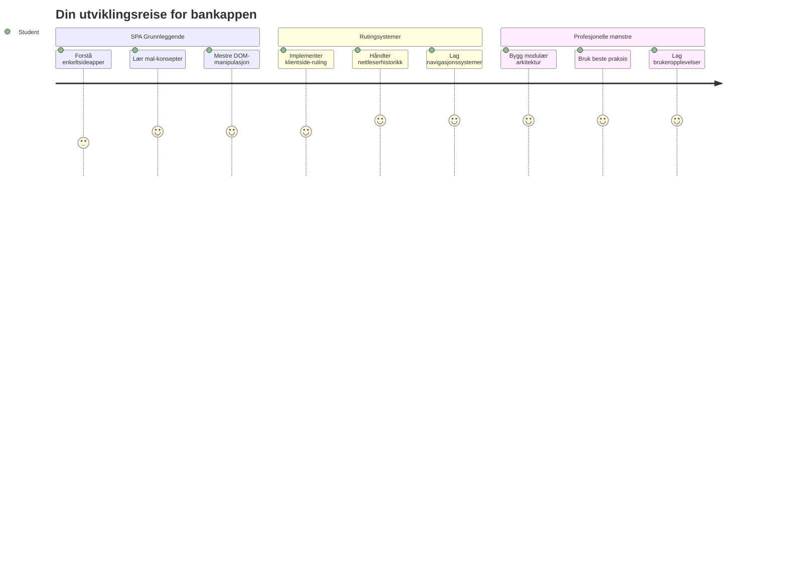
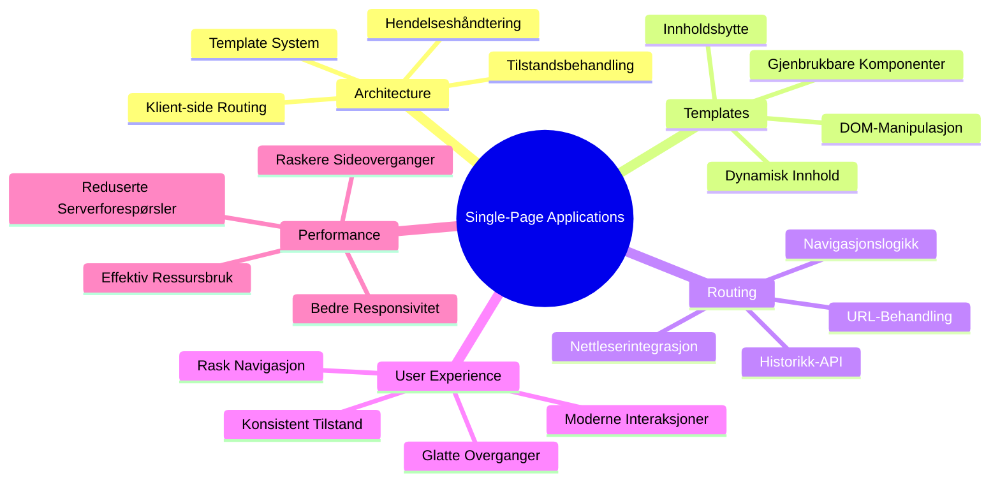
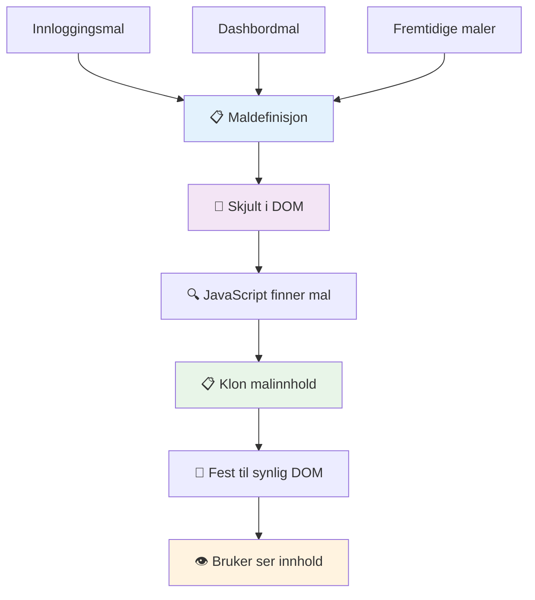
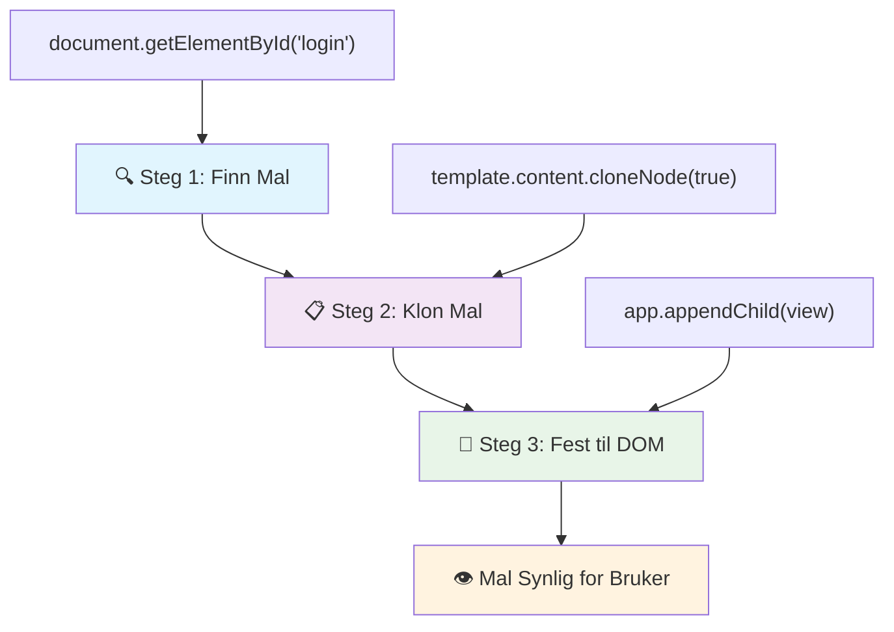
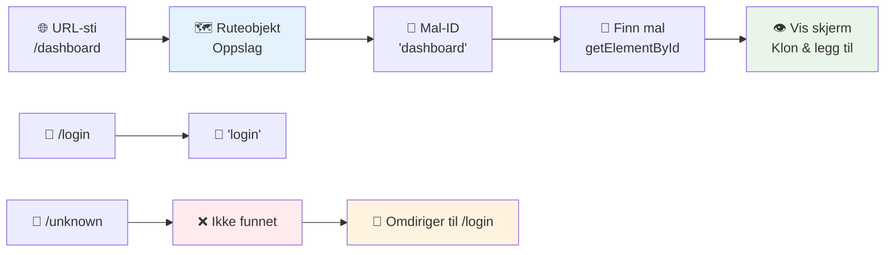
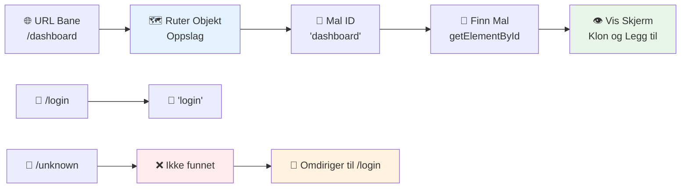
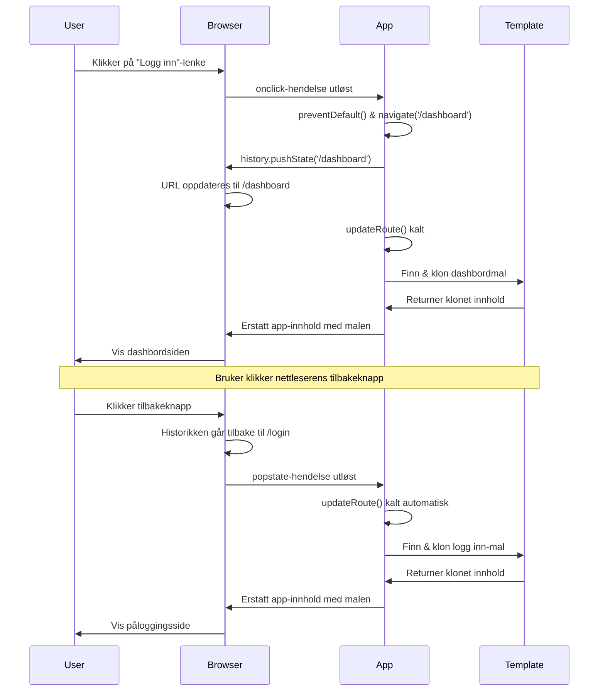
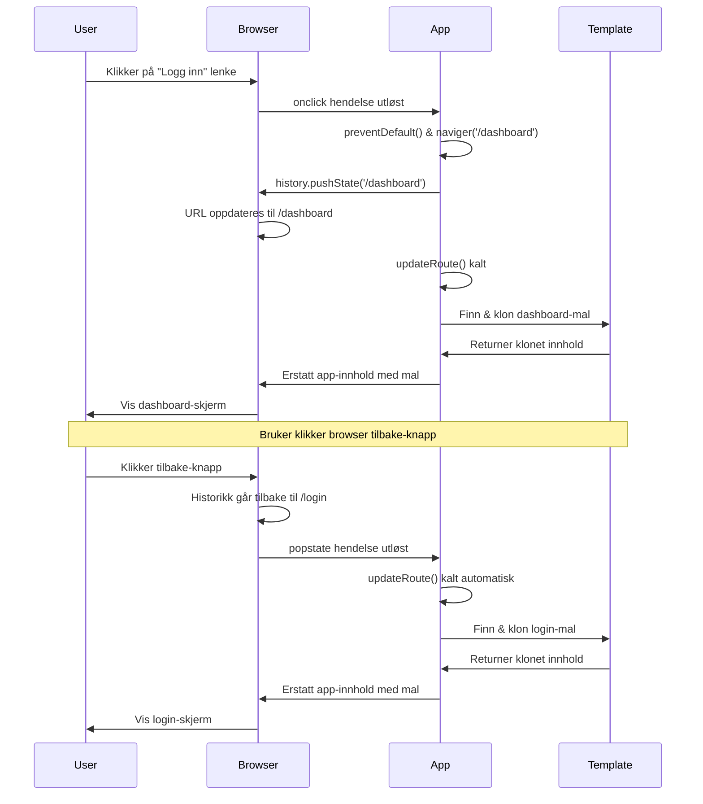
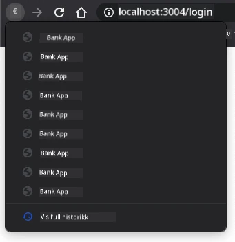
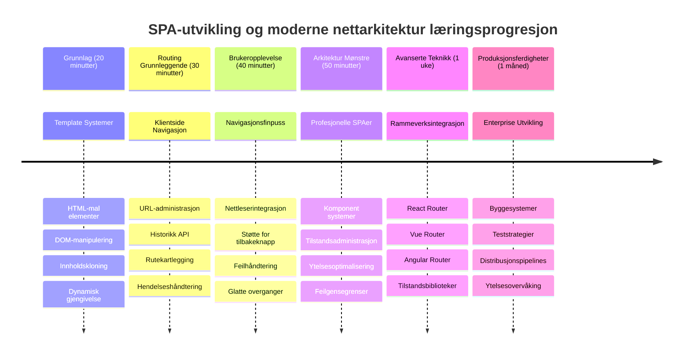

<!--
CO_OP_TRANSLATOR_METADATA:
{
  "original_hash": "351678bece18f07d9daa987a881fb062",
  "translation_date": "2026-01-07T00:40:56+00:00",
  "source_file": "7-bank-project/1-template-route/README.md",
  "language_code": "no"
}
-->
# Bygg en bankapp del 1: HTML-maler og ruter i en nettapp


Da Apollo 11s styringscomputer navigerte til månen i 1969, måtte den bytte mellom forskjellige programmer uten å starte hele systemet på nytt. Moderne nettapplikasjoner fungerer på lignende måte – de endrer det du ser uten å laste alt på nytt. Dette skaper den smidige og responsive opplevelsen brukerne forventer i dag.

I motsetning til tradisjonelle nettsteder som laster inn hele sider for hver interaksjon, oppdaterer moderne nettapper bare de delene som trenger endring. Denne tilnærmingen, omtrent som hvordan kontrollsenteret bytter mellom forskjellige skjermer samtidig som det opprettholder konstant kommunikasjon, skaper den flytende opplevelsen vi har blitt vant til.

Her er hva som gjør forskjellen så dramatisk:

| Tradisjonelle fler-sides apper | Moderne enkelt-sides apper |
|-------------------------------|---------------------------|
| **Navigasjon** | Full sideinnlasting for hver skjerm | Øyeblikkelig innholdsswitch |
| **Ytelse** | Langsommere på grunn av full HTML-nedlasting | Raskere med delvise oppdateringer |
| **Brukeropplevelse** | Slående sideblinking | Smidige, app-lignende overganger |
| **Deling av data** | Vanskelig mellom sider | Enkel tilstandshåndtering |
| **Utvikling** | Flere HTML-filer å vedlikeholde | Én HTML med dynamiske maler |

**Forstå evolusjonen:**
- **Tradisjonelle apper** krever serverforespørsler for hver navigasjonshandling
- **Moderne SPA-er** laster én gang og oppdaterer innhold dynamisk med JavaScript
- **Brukerforventninger** foretrekker nå øyeblikkelige, sømløse interaksjoner
- **Ytelsesfordeler** inkluderer redusert båndbredde og raskere respons

I denne leksjonen skal vi bygge en bankapp med flere skjermer som flyter sømløst sammen. Akkurat som forskere bruker modulære instrumenter som kan omkonfigureres for forskjellige eksperimenter, skal vi bruke HTML-maler som gjenbrukbare komponenter som kan vises etter behov.

Du vil jobbe med HTML-maler (gjenbrukbare tegninger for ulike skjermer), JavaScript-ruting (systemet som bytter mellom skjermer) og nettleserens history API (som sørger for at tilbake-knappen fungerer som forventet). Dette er de samme grunnleggende teknikkene som brukes av rammeverk som React, Vue og Angular.

Mot slutten vil du ha en fungerende bankapp som demonstrerer profesjonelle prinsipper for enkelt-sides applikasjoner.


## Forhåndsforelesnings-quiz

[Forhåndsforelesnings-quiz](https://ff-quizzes.netlify.app/web/quiz/41)

### Hva du trenger

Vi trenger en lokal webserver for å teste bankappen vår – ikke bekymre deg, det er enklere enn det høres ut! Hvis du ikke allerede har en, installer bare [Node.js](https://nodejs.org) og kjør `npx lite-server` fra prosjektmappen din. Denne nyttige kommandoen starter en lokal server og åpner automatisk appen i nettleseren.

### Forberedelse

På din datamaskin, opprett en mappe kalt `bank` med en fil som heter `index.html` inni. Vi starter fra denne HTML [boilerplate](https://en.wikipedia.org/wiki/Boilerplate_code):

```html
<!DOCTYPE html>
<html lang="en">
  <head>
    <meta charset="UTF-8">
    <meta name="viewport" content="width=device-width, initial-scale=1.0">
    <title>Bank App</title>
  </head>
  <body>
    <!-- This is where you'll work -->
  </body>
</html>
```

**Dette tilbyr denne boilerplaten:**
- **Etablerer** HTML5-dokumentstruktur med korrekt DOCTYPE-deklarasjon
- **Konfigurerer** tegnkoding som UTF-8 for internasjonal tekststøtte
- **Aktiverer** responsivt design med viewport meta-tag for mobilkompatibilitet
- **Setter** en beskrivende tittel som vises i nettleserfanen
- **Oppretter** en ren body-seksjon hvor vi bygger applikasjonen

> 📁 **Prosjektstruktur-forhåndsvisning**
> 
> **Ved slutten av denne leksjonen vil prosjektet ditt inneholde:**
> ```
> bank/
> ├── index.html      <!-- Main HTML with templates -->
> ├── app.js          <!-- Routing and navigation logic -->
> └── style.css       <!-- (Optional for future lessons) -->
> ```
> 
> **Filansvar:**
> - **index.html**: Inneholder alle maler og utgjør appens struktur
> - **app.js**: Håndterer ruting, navigasjon og malhåndtering
> - **Malene**: Definerer UI for innlogging, dashbord og andre skjermer

---

## HTML-maler

Maler løser et grunnleggende problem i webutvikling. Da Gutenberg oppfant løst metalltrykk i 1440-årene, innså han at i stedet for å skjære ut hele sider, kunne han lage gjenbrukbare bokstavblokker og arrangere dem etter behov. HTML-maler fungerer på samme prinsipp – i stedet for å lage separate HTML-filer for hver skjerm, definerer du gjenbrukbare strukturer som vises ved behov.


Tenk på maler som tegninger for ulike deler av appen din. Akkurat som en arkitekt lager én tegning og bruker den flere ganger i stedet for å tegne identiske rom på nytt, lager vi maler én gang og oppretter dem etter behov. Nettleseren holder disse malene skjult til JavaScript aktiverer dem.

Hvis du vil lage flere skjermer for en nettside, kan en løsning være å lage én HTML-fil for hver skjerm du vil vise. Men denne løsningen medfører noen ulemper:

- Du må laste inn hele HTML på nytt når du bytter skjerm, noe som kan være tregt.
- Det er vanskelig å dele data mellom de ulike skjermene.

En annen tilnærming er å ha bare én HTML-fil, og definere flere [HTML-maler](https://developer.mozilla.org/docs/Web/HTML/Element/template) ved å bruke `<template>`-elementet. En mal er en gjenbrukbar HTML-blokk som ikke vises av nettleseren, og som må opprettes ved kjøring med JavaScript.

### La oss bygge det

Vi skal lage en bankapp med to hovedskjermer: en innloggingsside og et dashbord. Først legger vi til et plassholder-element i vår HTML-body – dette er der alle våre forskjellige skjermer vil vises:

```html
<div id="app">Loading...</div>
```

**Forstå denne plassholderen:**
- **Oppretter** en beholder med ID-en "app" hvor alle skjermer vises
- **Viser** en lastemelding til JavaScript har initialisert den første skjermen
- **Tilbyr** et enkelt monteringspunkt for vårt dynamiske innhold
- **Muliggjør** enkel målretting fra JavaScript med `document.getElementById()`

> 💡 **Profftips**: Siden innholdet i dette elementet blir erstattet, kan vi putte inn en lastemelding eller indikator som vises mens appen laster.

Deretter legger vi til under det HTML-malen for innloggingssiden. Foreløpig legger vi bare inn en tittel og en seksjon som inneholder en lenke vi skal bruke for navigasjon.

```html
<template id="login">
  <h1>Bank App</h1>
  <section>
    <a href="/dashboard">Login</a>
  </section>
</template>
```

**Bryter ned denne innloggingsmalen:**
- **Definerer** en mal med unik identifikator "login" for JavaScript-målretting
- **Inkluderer** en hovedoverskrift som etablerer appens merkevare
- **Inneholder** et semantisk `<section>`-element som grupperer relatert innhold
- **Tilbyr** en navigasjonslenke som ruter brukeren til dashbordet

Så legger vi til en annen HTML-mal for dashbord-siden. Denne siden inneholder ulike seksjoner:

- En header med tittel og en utloggingslenke
- Den nåværende saldoen på bankkontoen
- En liste over transaksjoner som vises i en tabell

```html
<template id="dashboard">
  <header>
    <h1>Bank App</h1>
    <a href="/login">Logout</a>
  </header>
  <section>
    Balance: 100$
  </section>
  <section>
    <h2>Transactions</h2>
    <table>
      <thead>
        <tr>
          <th>Date</th>
          <th>Object</th>
          <th>Amount</th>
        </tr>
      </thead>
      <tbody></tbody>
    </table>
  </section>
</template>
```

**La oss forstå hver del av dette dashbordet:**
- **Strukturerer** siden med et semantisk `<header>`-element som inneholder navigasjon
- **Viser** apptittelen konsekvent på tvers av skjermer for merkevarebygging
- **Tilbyr** en utloggingslenke som ruter tilbake til innloggingsskjermen
- **Viser** gjeldende kontosaldo i en dedikert seksjon
- **Organiserer** transaksjonsdata med en korrekt strukturert HTML-tabell
- **Definerer** tabelloverskrifter for Dato, Objektnavn og Beløp
- **Lar** tabellkroppen være tom for dynamisk innhold senere

> 💡 **Profftips**: Når du lager HTML-maler, hvis du vil se hvordan det faktisk vil se ut, kan du kommentere ut `<template>` og `</template>`-linjene ved å omslutte dem med `<!-- -->`.

### 🔄 **Pedagogisk sjekkpunkt**
**Forståelse av mal-systemet**: Før du implementerer JavaScript, sørg for at du forstår:
- ✅ Hvordan maler skiller seg fra vanlige HTML-elementer
- ✅ Hvorfor maler forblir skjult til aktivert av JavaScript
- ✅ Viktigheten av semantisk HTML-struktur i maler
- ✅ Hvordan maler muliggjør gjenbrukbare UI-komponenter

**Rask selvtest**: Hva skjer hvis du fjerner `<template>`-taggene rundt HTML-en din?
*Svar: Innholdet blir umiddelbart synlig og mister sin mal-funksjonalitet*

**Arkitekturfordeler**: Maler gir:
- **Gjenbrukbarhet**: Én definisjon, flere forekomster
- **Ytelse**: Ingen unødvendig HTML-parsing
- **Vedlikeholdbarhet**: Sentralisert UI-struktur
- **Fleksibilitet**: Dynamisk innholdsswitching

✅ Hvorfor tror du vi bruker `id`-attributter på malene? Kunne vi brukt noe annet som klasser?

## Å bringe malene til liv med JavaScript

Nå må vi gjøre malene funksjonelle. Akkurat som en 3D-printer tar en digital tegning og lager et fysisk objekt, tar JavaScript våre skjulte maler og lager synlige, interaktive elementer brukeren kan se og bruke.

Prosessen følger tre konsistente steg som utgjør grunnlaget for moderne webutvikling. Når du forstår dette mønsteret, vil du kjenne det igjen i mange rammeverk og biblioteker.

Hvis du prøver din nåværende HTML-fil i en nettleser, vil du se at den sitter fast på å vise `Laster...`. Det er fordi vi må legge til noe JavaScript-kode for å opprette og vise HTML-malene.

Opprettelse av en mal skjer vanligvis i 3 trinn:

1. Hent mal-elementet i DOM-en, for eksempel med [`document.getElementById`](https://developer.mozilla.org/docs/Web/API/Document/getElementById).
2. Klon mal-elementet, ved bruk av [`cloneNode`](https://developer.mozilla.org/docs/Web/API/Node/cloneNode).
3. Fest det til DOM-en under et synlig element, for eksempel ved bruk av [`appendChild`](https://developer.mozilla.org/docs/Web/API/Node/appendChild).


**Visuell nedbrytning av prosessen:**
- **Trinn 1** finner den skjulte malen i DOM-strukturen
- **Trinn 2** lager en arbeidskopi som trygt kan modifiseres
- **Trinn 3** setter kopien inn i det synlige sideområdet
- **Resultat** er en fungerende skjerm brukeren kan interagere med

✅ Hvorfor må vi klone malen før vi fester den til DOM? Hva tror du ville skjedd hvis vi hoppet over dette trinnet?

### Oppgave

Lag en ny fil kalt `app.js` i prosjektmappen din og importer den filen i `<head>`-seksjonen i HTML-en din:

```html
<script src="app.js" defer></script>
```

**Forstå importen av dette skriptet:**
- **Lenker** JavaScript-filen til HTML-dokumentet vårt
- **Bruker** `defer`-attributtet for å sikre at skriptet kjører etter at HTML-parsing er fullført
- **Muliggjør** tilgang til alle DOM-elementer siden de er fullstendig lastet før skripteksekvering
- **Følger** moderne beste praksis for skriptlasting og ytelse

Nå i `app.js` lager vi en ny funksjon `updateRoute`:

```js
function updateRoute(templateId) {
  const template = document.getElementById(templateId);
  const view = template.content.cloneNode(true);
  const app = document.getElementById('app');
  app.innerHTML = '';
  app.appendChild(view);
}
```

**Steg for steg, dette skjer:**
- **Finner** mal-elementet med unik ID
- **Lager** en dyp kopi av malens innhold med `cloneNode(true)`
- **Finner** app-beholderen hvor innhold vises
- **Tømmer** eksisterende innhold fra app-beholderen
- **Setter inn** den klonede mal-innholdet i den synlige DOM-en

Kall nå denne funksjonen med en av malene og se resultatet.

```js
updateRoute('login');
```

**Hva dette funksjonskallet gjør:**
- **Aktiverer** innloggingsmalen ved å sende inn ID som parameter
- **Demonstrerer** hvordan man programmatisk kan bytte mellom ulike appskjermer
- **Viser** innloggingsskjermen i stedet for "Laster..."-meldingen

✅ Hva er hensikten med denne koden `app.innerHTML = '';`? Hva skjer uten den?

## Lage ruter

Ruting handler i bunn og grunn om å koble URL-er til riktig innhold. Tenk på hvordan tidlige telefonoperatører brukte koblingsbrett for å koble samtaler – de tok en innkommende forespørsel og koblet den til riktig destinasjon. Nettruting fungerer likt, ved å ta en URL-forespørsel og bestemme hvilket innhold som skal vises.


Tradisjonelt håndterte webservere dette ved å levere forskjellige HTML-filer for ulike URL-er. Siden vi bygger en enkelt-sides app, må vi håndtere rutingen selv med JavaScript. Denne tilnærmingen gir oss mer kontroll over brukeropplevelse og ytelse.


**Forstå rutingflyten:**
- **URL-endringer** utløser oppslag i vår rute-konfigurasjon
- **Gyldige ruter** kartlegges til bestemte mal-IDer for visning
- **Ugyldige ruter** utløser fallback-handling for å unngå ødelagte tilstander
- **Malgjengivelse** følger den tre-trinns prosessen vi lærte tidligere

Når vi snakker om en nettapp, kaller vi *Ruting* intensjonen om å kartlegge **URL-er** til bestemte skjermer som skal vises. På et nettsted med flere HTML-filer gjøres dette automatisk ettersom filbanene reflekteres i URL-en. For eksempel, med disse filene i prosjektmappen din:

```
mywebsite/index.html
mywebsite/login.html
mywebsite/admin/index.html
```

Hvis du lager en webserver med `mywebsite` som root, vil URL-kartleggingen være:

```
https://site.com            --> mywebsite/index.html
https://site.com/login.html --> mywebsite/login.html
https://site.com/admin/     --> mywebsite/admin/index.html
```

Men i vår nettapp bruker vi én HTML-fil som inneholder alle skjermene, så denne standardatferden hjelper oss ikke. Vi må lage dette kartet manuelt og oppdatere visningen av malen med JavaScript.

### Oppgave

Vi bruker et enkelt objekt for å implementere et [kart](https://en.wikipedia.org/wiki/Associative_array) mellom URL-stier og malene våre. Legg til dette objektet øverst i `app.js`-filen din.

```js
const routes = {
  '/login': { templateId: 'login' },
  '/dashboard': { templateId: 'dashboard' },
};
```

**Forstå denne rute-konfigurasjonen:**
- **Definerer** en kartlegging mellom URL-stier og mal-identifikatorer
- **Bruker** objektsyntaks der nøkler er URL-stier og verdier inneholder malinformasjon
- **Muliggjør** enkel oppslag av hvilken mal som skal vises for en gitt URL
- **Gir** en skalerbar struktur for å legge til nye ruter i fremtiden
Nå skal vi endre litt på `updateRoute`-funksjonen. I stedet for å sende `templateId` direkte som et argument, ønsker vi å hente det ved først å se på den nåværende URL-en, og deretter bruke kartet vårt for å få den tilsvarende mal-ID-verdien. Vi kan bruke [`window.location.pathname`](https://developer.mozilla.org/docs/Web/API/Location/pathname) for kun å få stykke med sti fra URL-en.

```js
function updateRoute() {
  const path = window.location.pathname;
  const route = routes[path];

  const template = document.getElementById(route.templateId);
  const view = template.content.cloneNode(true);
  const app = document.getElementById('app');
  app.innerHTML = '';
  app.appendChild(view);
}
```

**Å bryte ned hva som skjer her:**
- **Henter ut** den nåværende stien fra nettleserens URL ved å bruke `window.location.pathname`
- **Slår opp** den tilsvarende rute-konfigurasjonen i vårt routes-objekt
- **Henter** mal-ID-en fra rute-konfigurasjonen
- **Følger** samme mal-gjengivelsesprosess som tidligere
- **Oppretter** et dynamisk system som reagerer på endringer i URL-en

Her har vi kartlagt rutene vi erklærte til den tilsvarende malen. Du kan prøve det at det fungerer korrekt ved å endre URL-en manuelt i nettleseren din.

✅ Hva skjer hvis du skriver inn en ukjent sti i URL-en? Hvordan kan vi løse dette?

## Legge til Navigasjon

Med routing på plass, trenger brukere en måte å navigere gjennom appen på. Tradisjonelle nettsider laster inn hele sider på nytt når man klikker lenker, men vi ønsker å oppdatere både URL og innhold uten å laste siden på nytt. Dette skaper en jevnere opplevelse, lik hvordan skrivebordsapplikasjoner bytter mellom ulike visninger.

Vi må koordinere to ting: oppdatere nettleserens URL slik at brukere kan bokmerke sider og dele lenker, og vise riktig innhold. Når det implementeres riktig, gir dette den sømløse navigasjonen brukere forventer fra moderne applikasjoner.


### 🔄 **Pedagogisk sjekk**
**Single-Page Application-arkitektur**: Sjekk din forståelse av hele systemet:
- ✅ Hvordan skiller klient-side routing seg fra tradisjonell server-side routing?
- ✅ Hvorfor er History API essensielt for riktig SPA-navigasjon?
- ✅ Hvordan muliggjør maler dynamisk innhold uten sideoppdateringer?
- ✅ Hvilken rolle spiller hendelseshåndtering i å fange navigasjon?

**Systemintegrasjon**: Din SPA demonstrerer:
- **Malhåndtering**: Gjenbrukbare UI-komponenter med dynamisk innhold
- **Klient-side routing**: URL-administrasjon uten serverforespørsler
- **Hendelsesdrevet arkitektur**: Responsiv navigasjon og brukerinteraksjon
- **Nettleserintegrasjon**: Korrekt støtte for historikk og frem-/tilbake-knapper
- **Ytelsesoptimalisering**: Raske overganger og redusert serverbelastning

**Profesjonelle mønstre**: Du har implementert:
- **Modell-Vis-separasjon**: Maler skilles fra applikasjonslogikk
- **Tilstandsstyring**: URL-tilstand synkronisert med vist innhold
- **Progressiv forbedring**: JavaScript forbedrer grunnleggende HTML-funksjonalitet
- **Brukeropplevelse**: Smoother, app-lignende navigasjon uten sideoppdatering

> � **Arkitekturinnsikt**: Navigasjonssystemkomponenter
>
> **Det du bygger:**
> - **🔄 URL-håndtering**: Oppdaterer adressefeltet uten sideoppdatering
> - **📋 Malsystem**: Bytter innhold dynamisk basert på gjeldende rute
> - **📚 Historikkintegrasjon**: Bevarer nettleserens frem-/tilbake-knapper
> - **🛡️ Feilhåndtering**: Sirkler inn feilruter med elegante fallback-løsninger
>
> **Hvordan komponentene jobber sammen:**
> - **Lytter** etter navigasjonshendelser (klikk, historikkendringer)
> - **Oppdaterer** URL via History API
> - **Gjengir** riktig mal for ny rute
> - **Opprettholder** en sømløs brukeropplevelse hele veien

Neste steg for appen vår er å legge til muligheten til å navigere mellom sider uten å måtte endre URL manuelt. Dette innebærer to ting:

  1. Oppdatere den nåværende URL-en
  2. Oppdatere den viste malen basert på ny URL

Vi har allerede tatt oss av den andre delen med `updateRoute`-funksjonen, så vi må finne ut hvordan vi oppdaterer den nåværende URL-en.

Vi må bruke JavaScript, nærmere bestemt [`history.pushState`](https://developer.mozilla.org/docs/Web/API/History/pushState) som lar oss oppdatere URL-en og lage en ny post i nettleserens historikk, uten å laste HTML på nytt.

> ⚠️ **Viktig merknad**: Selv om HTML-anker-elementet [`<a href>`](https://developer.mozilla.org/docs/Web/HTML/Element/a) kan brukes alene for å lage hyperlenker til forskjellige URL-er, vil dette som standard få nettleseren til å laste HTML på nytt. Det er nødvendig å forhindre denne oppførselen når man håndterer routing med egendefinert JavaScript, ved å bruke preventDefault() på klikkhendelsen.

### Oppgave

La oss lage en ny funksjon vi kan bruke for å navigere i appen vår:

```js
function navigate(path) {
  window.history.pushState({}, path, path);
  updateRoute();
}
```

**Forstå denne navigasjonsfunksjonen:**
- **Oppdaterer** nettleserens URL til den nye stien ved hjelp av `history.pushState`
- **Legger til** en ny post i nettleserens historikkstabel for korrekt støtte av frem-/tilbake-knapper
- **Trigger** `updateRoute()`-funksjonen for å vise samsvarende mal
- **Opprettholder** single-page app-opplevelse uten sideoppdateringer

Denne metoden oppdaterer først nåværende URL basert på gitt sti, deretter oppdateres malen. Egenskapen `window.location.origin` returnerer URL-roten, noe som gjør at vi kan rekonstruere en komplett URL fra gitt sti.

Nå som vi har denne funksjonen, kan vi ta oss av problemet dersom en sti ikke matcher noen definert rute. Vi skal modifisere `updateRoute` ved å legge til et fallback til en av eksisterende ruter dersom vi ikke finner noen treff.

```js
function updateRoute() {
  const path = window.location.pathname;
  const route = routes[path];

  if (!route) {
    return navigate('/login');
  }

  const template = document.getElementById(route.templateId);
  const view = template.content.cloneNode(true);
  const app = document.getElementById('app');
  app.innerHTML = '';
  app.appendChild(view);
}
```

**Nøkkelpunkter å huske:**
- **Sjekker** om en rute eksisterer for gjeldende sti
- **Omdirigerer** til påloggingssiden når en ugyldig rute nås
- **Gir** en fallback-mekanisme som unngår brutt navigasjon
- **Sikrer** at brukere alltid ser en gyldig skjerm, selv med feil URL

Dersom en rute ikke finnes, vil vi nå omdirigere til `login`-siden.

Nå lager vi en funksjon for å hente URL når en lenke klikkes, og for å forhindre nettleserens standard lenkeoppførsel:

```js
function onLinkClick(event) {
  event.preventDefault();
  navigate(event.target.href);
}
```

**Forklarer denne klikkhåndtereren:**
- **Forhindrer** nettleserens standard lenkeoppførsel med `preventDefault()`
- **Henter ut** destinasjons-URL fra den klikkede lenkeelementet
- **Kaller** vår egendefinerte navigasjonsfunksjon i stedet for å laste siden på nytt
- **Bevarer** den sømløse single-page applikasjonsopplevelsen

```html
<a href="/dashboard" onclick="onLinkClick(event)">Login</a>
...
<a href="/login" onclick="onLinkClick(event)">Logout</a>
```

**Hva denne onclick bindingen oppnår:**
- **Kobler** hver lenke til vårt egendefinerte navigasjonssystem
- **Sender** klikkhendelsen til vår `onLinkClick`-funksjon for behandling
- **Muliggjør** smidig navigasjon uten sideoppdateringer
- **Opprettholder** korrekt URL-struktur brukere kan bokmerke eller dele

[`onclick`](https://developer.mozilla.org/docs/Web/API/GlobalEventHandlers/onclick) attributtet binder `click`-hendelsen til JavaScript-kode, her kall til `navigate()`-funksjonen.

Prøv å klikke på disse lenkene, nå skal du kunne navigere mellom de ulike skjermene i appen din.

✅ `history.pushState`-metoden er en del av HTML5-standarden og støttes i [alle moderne nettlesere](https://caniuse.com/?search=pushState). Hvis du lager en webapp for eldre nettlesere, finnes det et triks: Ved å bruke en [hash (`#`)](https://en.wikipedia.org/wiki/URI_fragment) foran stien kan du implementere routing som fungerer med vanlige ankernavigasjoner uten å laste siden, ettersom hash opprinnelig var ment for interne lenker i en side.

## Få Tilbake- og Frem-knappene til å Fungere

Tilbake- og frem-knappene er grunnleggende for nettsurfing, akkurat som NASA-misjonskontrollere kan gå tilbake til tidligere systemtilstander under romferder. Brukere forventer at knappene fungerer, og hvis de ikke gjør det, bryter det opp den forventede surfeopplevelsen.

Vår single-page app trenger ekstra konfigurasjon for å støtte dette. Nettleseren holder en historikkstabel (som vi har lagt til i med `history.pushState`), men når brukere navigerer gjennom historikken må appen reagere ved å oppdatere vist innhold tilsvarende.


**Viktige interaksjonspunkter:**
- **Brukerhandlinger** trigges av klikk eller nettleserknapper for navigasjon
- **Appen fanger** lenkeklikk for å forhindre sideoppdateringer
- **History API** håndterer URL-endringer og historikkstabel
- **Maler** gir innholdsstruktur for hver skjerm
- **Hendelseslyttere** sikrer at appen responderer på alle navigasjonstyper

Bruken av `history.pushState` lager nye poster i nettleserens navigasjonshistorikk. Du kan sjekke det ved å holde inne *tilbake-knappen* i nettleseren, det skal vises noe slikt som dette:



Hvis du prøver å klikke tilbake-knappen flere ganger, vil du se at gjeldende URL endres og historikken er oppdatert, men samme mal vises fortsatt.

Det er fordi applikasjonen ikke vet at den må kalle `updateRoute()` hver gang historikken endres. Hvis du ser på [`history.pushState`-dokumentasjonen](https://developer.mozilla.org/docs/Web/API/History/pushState) ser du at når tilstanden endres – altså vi går til en annen URL – blir [`popstate`](https://developer.mozilla.org/docs/Web/API/Window/popstate_event) hendelsen trigget. Den skal vi bruke for å fikse dette.

### Oppgave

For å sørge for at vist mal oppdateres når nettleserhistorikken endres, kobler vi til en ny funksjon som kaller `updateRoute()`. Det gjør vi nederst i `app.js`-filen vår:

```js
window.onpopstate = () => updateRoute();
updateRoute();
```

**Forstå denne historikkintegrasjonen:**
- **Lytter** etter `popstate`-hendelser som skjer når brukere navigerer med nettleserknapper
- **Bruker** en pilfunksjon for konsis hendelseshåndtering
- **Kaller** `updateRoute()` automatisk når historikktilstand endres
- **Initierer** appen ved å kalle `updateRoute()` når siden lastes første gang
- **Sikrer** at riktig mal vises uansett hvordan brukerne navigerer

> 💡 **Pro Tips**: Vi brukte en [pilfunksjon](https://developer.mozilla.org/docs/Web/JavaScript/Reference/Functions/Arrow_functions) her for å deklarere vår `popstate`-hendelseshåndterer for konsistens, men en vanlig funksjon ville fungert like godt.

Her er en oppfriskningsvideo om pilfunksjoner:

[](https://youtube.com/watch?v=OP6eEbOj2sc "Pilfunksjoner")

> 🎥 Klikk på bildet over for en video om pilfunksjoner.

Nå prøv å bruke tilbake- og fremknappene i nettleseren din, og sjekk at vist rute blir korrekt oppdatert denne gangen.

### ⚡ **Hva Du Kan Gjøre i De Neste 5 Minuttene**
- [ ] Test navigasjonen i bankappen din med nettleserens tilbake-/fremknapper
- [ ] Prøv å skrive inn ulike URL-er manuelt i adresselinjen for å teste routing
- [ ] Åpne nettleserens utviklerverktøy og inspiser hvordan maler kopieres inn i DOM
- [ ] Eksperimenter med å legge til console.log-utskrifter for å spore routingflyten

### 🎯 **Hva Du Kan Oppnå Denne Timen**
- [ ] Fullfør quiz etter leksjonen og forstå SPA-arkitekturkonsepter
- [ ] Legg til CSS-styling for å få bankappens maler til å se profesjonelle ut
- [ ] Implementer 404-feilsiden med riktig feilhåndtering
- [ ] Lag utfordring for kredittsiden med ekstra routing-funksjonalitet
- [ ] Legg til lastetilstander og overgangseffekter mellom malbytter

### 📅 **Din Ukelange SPA-Utviklingsreise**
- [ ] Fullfør hele bankappen med skjemaer, databehandling og persistens
- [ ] Legg til avanserte routing-funksjoner som ruteparametre og nestede ruter
- [ ] Implementer navigasjonsvakter og autentiseringsbasert routing
- [ ] Lag gjenbrukbare mal-komponenter og et komponentbibliotek
- [ ] Legg til animasjoner og overganger for jevnere brukeropplevelse
- [ ] Distribuer SPA-en din til en hostingplattform og konfigurer routing riktig

### 🌟 **Din Månedslange Frontend-arkitekturmestring**
- [ ] Bygg komplekse SPA-er med moderne rammeverk som React, Vue eller Angular
- [ ] Lær avanserte mønstre og biblioteker for tilstandsstyring
- [ ] Mestre byggverktøy og utviklingsarbeidsflyt for SPA-utvikling
- [ ] Implementer Progressive Web App-funksjoner og offline-støtte
- [ ] Studer ytelsesoptimalisering for store SPA-er
- [ ] Bidra til open source SPA-prosjekter og del kunnskapen din

## 🎯 Din Masterplan for Single-Page Application-Mestring


### 🛠️ Din Oppsummering av SPA-utviklingsverktøy

Etter å ha fullført denne leksjonen mestrer du nå:
- **Malarkitektur**: Gjenbrukbare HTML-komponenter med dynamisk innholdsgjengivelse
- **Klient-side routing**: URL-håndtering og navigasjon uten sideoppdatering
- **Nettleserintegrasjon**: Bruk av History API og støtte for tilbake-/fremknapper
- **Hendelsesdrevne systemer**: Navigasjonshåndtering og brukerinvolvering
- **DOM-manipulering**: Kloning av maler, innholdsbryting og elementhåndtering
- **Feilhåndtering**: Elegante fallbacks ved ugyldige ruter og manglende innhold
- **Ytelsesmønstre**: Effektiv innholdslasting og gjengivelsesstrategier

**Reelle applikasjoner**: Dine SPA-utviklingsferdigheter kan brukes direkte på:
- **Moderne webløsninger**: React, Vue, Angular og andre rammeverk
- **Progressive Web Apps**: Offline-kapasitetsapplikasjoner med applikasjonsfølelse
- **Enterprise-dashboards**: Komplekse forretningsapplikasjoner med mange visninger
- **E-handel**: Produktkataloger, handlekurver og betaling
- **Innholdsstyring**: Dynamisk innholdsproduksjon og redigering
- **Mobilutvikling**: Hybridapper med webteknologier

**Profesjonelle ferdigheter oppnådd**: Du kan nå:
- **Arkitekt** enkelt-side-applikasjoner med riktig separasjon av bekymringer  
- **Implementer** klient-side rutingsystemer som skalerer med applikasjonskompleksitet  
- **Feilsøk** komplekse navigasjonsflyter ved hjelp av nettleserens utviklerverktøy  
- **Optimaliser** applikasjonsytelse gjennom effektiv malhåndtering  
- **Design** brukeropplevelser som føles native og responsive  

**Frontend utviklingskonsepter mestret**:  
- **Komponentarkitektur**: Gjenbrukbare UI-mønstre og mal-systemer  
- **Status-synkronisering**: URL-statusstyring og nettleserhistorikk  
- **Hendelsesdrevet programmering**: Håndtering av brukerinteraksjon og navigasjon  
- **Ytelsesoptimalisering**: Effektiv DOM-manipulasjon og innholdslasting  
- **Brukeropplevelsesdesign**: Glatte overganger og intuitiv navigasjon  

**Neste nivå**: Du er klar til å utforske moderne frontend-rammeverk, avansert tilstandshåndtering eller bygge komplekse bedriftsapplikasjoner!

🌟 **Prestasjon låst opp**: Du har bygget et profesjonelt grunnlag for enkelt-side-applikasjoner med moderne webarkitektur-mønstre!

---

## GitHub Copilot Agent-utfordring 🚀

Bruk Agent-modus for å fullføre følgende utfordring:

**Beskrivelse:** Forbedre bankappen ved å implementere feilhåndtering og en 404-mal for ugyldige ruter, noe som forbedrer brukeropplevelsen ved navigering til sider som ikke eksisterer.

**Prompt:** Lag en ny HTML-mal med id "not-found" som viser en brukervennlig 404-feilside med styling. Endre deretter JavaScript-rutelogikken slik at denne malen vises når brukere navigerer til ugyldige URL-er, og legg til en "Gå hjem"-knapp som navigerer tilbake til innloggingssiden.

Lær mer om [agent mode](https://code.visualstudio.com/blogs/2025/02/24/introducing-copilot-agent-mode) her.

## 🚀 Utfordring

Legg til en ny mal og rute for en tredje side som viser kreditering for denne appen.

**Mål med utfordringen:**  
- **Lag** en ny HTML-mal med passende innholdsstruktur  
- **Legg til** den nye ruten i din rute-konfigurasjonsobjekt  
- **Inkluder** navigasjonslenker til og fra krediteringssiden  
- **Test** at all navigasjon fungerer korrekt med nettleserhistorikk  

## Quiz etter forelesning

[Quiz etter forelesning](https://ff-quizzes.netlify.app/web/quiz/42)

## Gjennomgang & Selvstudium

Ruting er en av de overraskende vanskelige delene av webutvikling, spesielt når nettet går fra sideoppdateringsadferd til enkelt-side-applikasjon sideoppdateringer. Les litt om [hvordan Azure Static Web App-tjenesten](https://docs.microsoft.com/azure/static-web-apps/routes/?WT.mc_id=academic-77807-sagibbon) håndterer ruting. Kan du forklare hvorfor noen av beslutningene beskrevet i dokumentet er nødvendige?

**Ytterligere læringsressurser:**  
- **Utforsk** hvordan populære rammeverk som React Router og Vue Router implementerer klient-side ruting  
- **Undersøk** forskjellene mellom hash-basert ruting og history API ruting  
- **Lær** om server-side rendering (SSR) og hvordan det påvirker rutingstrategier  
- **Undersøk** hvordan Progressive Web Apps (PWAer) håndterer ruting og navigasjon  

## Oppgave

[Forbedre rutingen](assignment.md)

---

<!-- CO-OP TRANSLATOR DISCLAIMER START -->
**Ansvarsfraskrivelse**:
Dette dokumentet er oversatt ved hjelp av AI-oversettelsestjenesten [Co-op Translator](https://github.com/Azure/co-op-translator). Selv om vi streber etter nøyaktighet, vennligst vær oppmerksom på at automatiserte oversettelser kan inneholde feil eller unøyaktigheter. Det opprinnelige dokumentet på originalsproget bør betraktes som den autoritative kilden. For kritisk informasjon anbefales profesjonell menneskelig oversettelse. Vi er ikke ansvarlige for eventuelle misforståelser eller feiltolkninger som oppstår ved bruk av denne oversettelsen.
<!-- CO-OP TRANSLATOR DISCLAIMER END -->