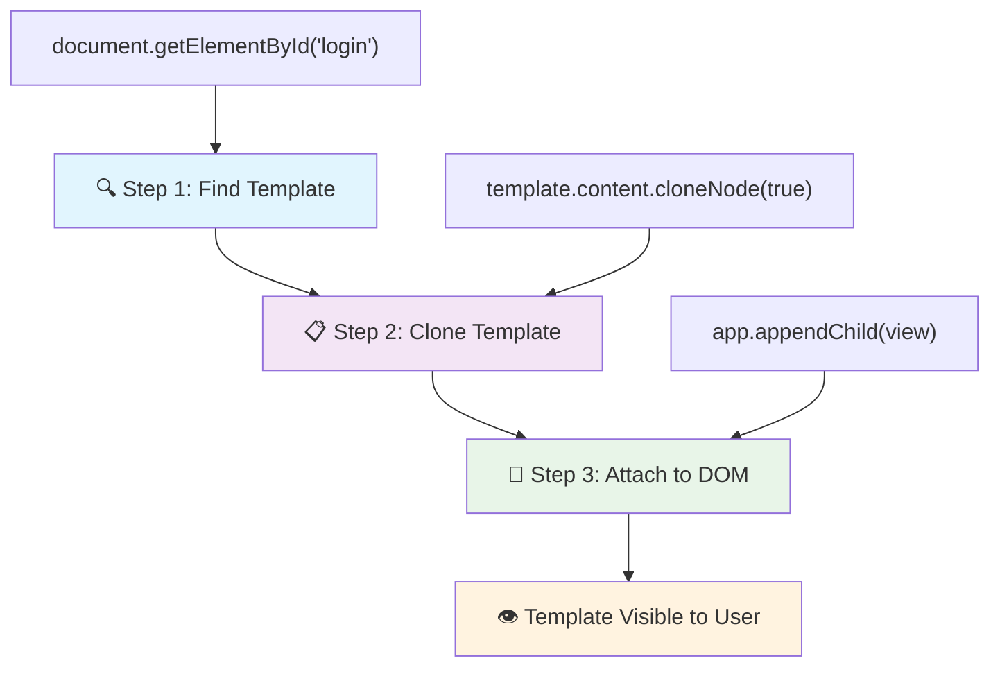
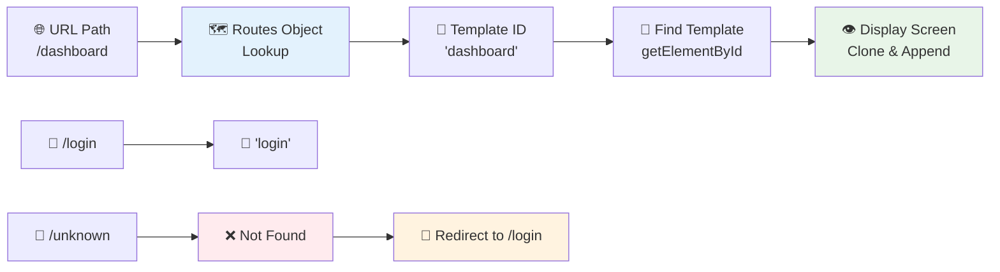
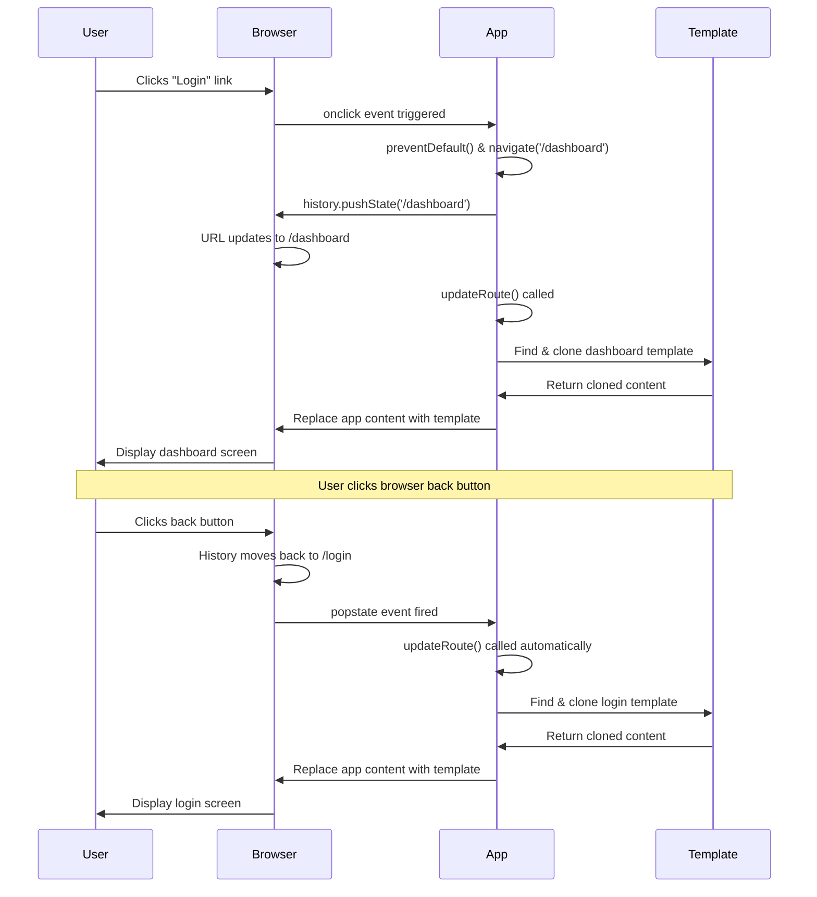

<!--
CO_OP_TRANSLATOR_METADATA:
{
  "original_hash": "5d259f6962464ad91e671083aa0398f4",
  "translation_date": "2025-10-23T22:32:02+00:00",
  "source_file": "7-bank-project/1-template-route/README.md",
  "language_code": "no"
}
-->
# Bygg en bankapp del 1: HTML-maler og ruter i en webapp

Da Apollo 11s navigasjonsdatamaskin navigerte til månen i 1969, måtte den bytte mellom ulike programmer uten å starte hele systemet på nytt. Moderne webapplikasjoner fungerer på lignende måte – de endrer det du ser uten å laste alt fra bunnen av. Dette skaper den jevne, responsive opplevelsen brukere forventer i dag.

I motsetning til tradisjonelle nettsteder som laster hele sider på nytt for hver interaksjon, oppdaterer moderne webapper bare de delene som trenger endring. Denne tilnærmingen, som hvordan kontrollsenteret bytter mellom ulike skjermer mens de opprettholder konstant kommunikasjon, skaper den flytende opplevelsen vi har blitt vant til.

Her er hva som gjør forskjellen så dramatisk:

| Tradisjonelle fler-sides apper | Moderne én-side apper |
|-------------------------------|-----------------------|
| **Navigasjon** | Full sideopplasting for hver skjerm | Øyeblikkelig innholdsskifting |
| **Ytelse** | Langsommere på grunn av fullstendige HTML-nedlastinger | Raskere med delvise oppdateringer |
| **Brukeropplevelse** | Ubehagelige sideblink | Jevne, app-lignende overganger |
| **Datadeling** | Vanskelig mellom sider | Enkel tilstandshåndtering |
| **Utvikling** | Flere HTML-filer å vedlikeholde | Én HTML med dynamiske maler |

**Forstå utviklingen:**
- **Tradisjonelle apper** krever serverforespørsler for hver navigasjonshandling
- **Moderne SPAs** laster én gang og oppdaterer innhold dynamisk med JavaScript
- **Brukerforventninger** favoriserer nå øyeblikkelige, sømløse interaksjoner
- **Ytelsesfordeler** inkluderer redusert båndbredde og raskere responser

I denne leksjonen skal vi bygge en bankapp med flere skjermer som flyter sømløst sammen. Akkurat som forskere bruker modulære instrumenter som kan omkonfigureres for ulike eksperimenter, skal vi bruke HTML-maler som gjenbrukbare komponenter som kan vises etter behov.

Du vil jobbe med HTML-maler (gjenbrukbare blåkopier for ulike skjermer), JavaScript-ruting (systemet som bytter mellom skjermer), og nettleserens historikk-API (som holder tilbake-knappen fungerende som forventet). Dette er de samme grunnleggende teknikkene som brukes av rammeverk som React, Vue og Angular.

Ved slutten av leksjonen vil du ha en fungerende bankapp som demonstrerer profesjonelle prinsipper for én-side applikasjoner.

## Quiz før leksjonen

[Quiz før leksjonen](https://ff-quizzes.netlify.app/web/quiz/41)

### Hva du trenger

Vi trenger en lokal webserver for å teste bankappen vår – ikke bekymre deg, det er enklere enn det høres ut! Hvis du ikke allerede har en satt opp, installer bare [Node.js](https://nodejs.org) og kjør `npx lite-server` fra prosjektmappen din. Denne praktiske kommandoen starter en lokal server og åpner automatisk appen din i nettleseren.

### Forberedelse

På datamaskinen din, opprett en mappe kalt `bank` med en fil kalt `index.html` inni. Vi starter med denne HTML [grunnstrukturen](https://en.wikipedia.org/wiki/Boilerplate_code):

```html
<!DOCTYPE html>
<html lang="en">
  <head>
    <meta charset="UTF-8">
    <meta name="viewport" content="width=device-width, initial-scale=1.0">
    <title>Bank App</title>
  </head>
  <body>
    <!-- This is where you'll work -->
  </body>
</html>
```

**Her er hva denne grunnstrukturen gir:**
- **Etablerer** HTML5-dokumentstrukturen med riktig DOCTYPE-deklarasjon
- **Konfigurerer** tegnkoding som UTF-8 for internasjonal tekststøtte
- **Aktiverer** responsivt design med viewport meta-taggen for mobilkompatibilitet
- **Setter** en beskrivende tittel som vises i nettleserfanen
- **Oppretter** en ren body-seksjon hvor vi skal bygge applikasjonen vår

> 📁 **Forhåndsvisning av prosjektstruktur**
> 
> **Ved slutten av denne leksjonen vil prosjektet ditt inneholde:**
> ```
> bank/
> ├── index.html      <!-- Main HTML with templates -->
> ├── app.js          <!-- Routing and navigation logic -->
> └── style.css       <!-- (Optional for future lessons) -->
> ```
> 
> **Filansvar:**
> - **index.html**: Inneholder alle maler og gir appstrukturen
> - **app.js**: Håndterer ruting, navigasjon og maladministrasjon
> - **Maler**: Definerer brukergrensesnittet for innlogging, dashbord og andre skjermer

---

## HTML-maler

Maler løser et grunnleggende problem i webutvikling. Da Gutenberg oppfant bevegelig type trykking på 1440-tallet, innså han at i stedet for å skjære ut hele sider, kunne han lage gjenbrukbare bokstavblokker og arrangere dem etter behov. HTML-maler fungerer på samme prinsipp – i stedet for å lage separate HTML-filer for hver skjerm, definerer du gjenbrukbare strukturer som kan vises når det trengs.

Tenk på maler som blåkopier for ulike deler av appen din. Akkurat som en arkitekt lager én blåkopi og bruker den flere ganger i stedet for å tegne identiske rom på nytt, lager vi maler én gang og instansierer dem etter behov. Nettleseren holder disse malene skjult til JavaScript aktiverer dem.

Hvis du vil lage flere skjermer for en nettside, kan én løsning være å lage én HTML-fil for hver skjerm du vil vise. Men denne løsningen har noen ulemper:

- Du må laste hele HTML på nytt når du bytter skjerm, noe som kan være tregt.
- Det er vanskelig å dele data mellom de ulike skjermene.

En annen tilnærming er å ha bare én HTML-fil, og definere flere [HTML-maler](https://developer.mozilla.org/docs/Web/HTML/Element/template) ved hjelp av `<template>`-elementet. En mal er en gjenbrukbar HTML-blokk som ikke vises av nettleseren, og må instansieres ved runtime ved hjelp av JavaScript.

### La oss bygge det

Vi skal lage en bankapp med to hovedskjermer: en innloggingsside og et dashbord. Først, la oss legge til et plassholderelement i HTML-bodyen vår – dette er hvor alle de ulike skjermene våre vil vises:

```html
<div id="app">Loading...</div>
```

**Forstå denne plassholderen:**
- **Oppretter** en container med ID-en "app" hvor alle skjermene vil bli vist
- **Viser** en lastemelding til JavaScript initialiserer den første skjermen
- **Gir** et enkelt monteringspunkt for vårt dynamiske innhold
- **Muliggjør** enkel målretting fra JavaScript ved hjelp av `document.getElementById()`

> 💡 **Tips**: Siden innholdet i dette elementet vil bli erstattet, kan vi legge inn en lastemelding eller indikator som vises mens appen lastes.

Deretter legger vi til HTML-malen for innloggingssiden nedenfor. Foreløpig vil vi bare legge inn en tittel og en seksjon som inneholder en lenke vi skal bruke til navigasjon.

```html
<template id="login">
  <h1>Bank App</h1>
  <section>
    <a href="/dashboard">Login</a>
  </section>
</template>
```

**Bryte ned denne innloggingsmalen:**
- **Definerer** en mal med den unike identifikatoren "login" for JavaScript-målretting
- **Inkluderer** en hovedoverskrift som etablerer appens merkevare
- **Inneholder** et semantisk `<section>`-element for å gruppere relatert innhold
- **Gir** en navigasjonslenke som vil rute brukere til dashbordet

Deretter legger vi til en annen HTML-mal for dashbordsiden. Denne siden vil inneholde ulike seksjoner:

- En header med en tittel og en utloggingslenke
- Den nåværende saldoen på bankkontoen
- En liste over transaksjoner, vist i en tabell

```html
<template id="dashboard">
  <header>
    <h1>Bank App</h1>
    <a href="/login">Logout</a>
  </header>
  <section>
    Balance: 100$
  </section>
  <section>
    <h2>Transactions</h2>
    <table>
      <thead>
        <tr>
          <th>Date</th>
          <th>Object</th>
          <th>Amount</th>
        </tr>
      </thead>
      <tbody></tbody>
    </table>
  </section>
</template>
```

**La oss forstå hver del av dette dashbordet:**
- **Strukturerer** siden med et semantisk `<header>`-element som inneholder navigasjon
- **Viser** appens tittel konsekvent på tvers av skjermer for merkevarebygging
- **Gir** en utloggingslenke som ruter tilbake til innloggingsskjermen
- **Viser** den nåværende kontosaldoen i en dedikert seksjon
- **Organiserer** transaksjonsdata ved hjelp av en riktig strukturert HTML-tabell
- **Definerer** tabelloverskrifter for kolonnene Dato, Objekt og Beløp
- **Lar** tabellkroppen være tom for dynamisk innholdsinjeksjon senere

> 💡 **Tips**: Når du lager HTML-maler, hvis du vil se hvordan det vil se ut, kan du kommentere ut `<template>` og `</template>`-linjene ved å omslutte dem med `<!-- -->`.

✅ Hvorfor tror du vi bruker `id`-attributter på malene? Kunne vi brukt noe annet som klasser?

## Gjøre maler funksjonelle med JavaScript

Nå må vi gjøre malene våre funksjonelle. Akkurat som en 3D-printer tar en digital blåkopi og lager et fysisk objekt, tar JavaScript de skjulte malene våre og lager synlige, interaktive elementer som brukerne kan se og bruke.

Prosessen følger tre konsistente trinn som utgjør grunnlaget for moderne webutvikling. Når du forstår dette mønsteret, vil du gjenkjenne det på tvers av mange rammeverk og biblioteker.

Hvis du prøver den nåværende HTML-filen din i en nettleser, vil du se at den sitter fast med å vise `Loading...`. Det er fordi vi må legge til litt JavaScript-kode for å instansiere og vise HTML-malene.

Instansiering av en mal gjøres vanligvis i 3 trinn:

1. Hent mal-elementet i DOM-en, for eksempel ved å bruke [`document.getElementById`](https://developer.mozilla.org/docs/Web/API/Document/getElementById).
2. Klon mal-elementet, ved å bruke [`cloneNode`](https://developer.mozilla.org/docs/Web/API/Node/cloneNode).
3. Fest det til DOM-en under et synlig element, for eksempel ved å bruke [`appendChild`](https://developer.mozilla.org/docs/Web/API/Node/appendChild).



**Visuell oppdeling av prosessen:**
- **Trinn 1** finner det skjulte mal-elementet i DOM-strukturen
- **Trinn 2** lager en fungerende kopi som trygt kan modifiseres
- **Trinn 3** setter inn kopien i det synlige sideområdet
- **Resultat** er en funksjonell skjerm som brukerne kan interagere med

✅ Hvorfor må vi klone malen før vi fester den til DOM-en? Hva tror du ville skjedd hvis vi hoppet over dette trinnet?

### Oppgave

Opprett en ny fil kalt `app.js` i prosjektmappen din og importer den filen i `<head>`-seksjonen av HTML-en:

```html
<script src="app.js" defer></script>
```

**Forstå denne skriptimporten:**
- **Kobler** JavaScript-filen til HTML-dokumentet vårt
- **Bruker** `defer`-attributtet for å sikre at skriptet kjører etter at HTML-parsingen er fullført
- **Muliggjør** tilgang til alle DOM-elementer siden de er fullstendig lastet før skriptutførelse
- **Følger** moderne beste praksis for skriptlasting og ytelse

Nå i `app.js`, skal vi lage en ny funksjon `updateRoute`:

```js
function updateRoute(templateId) {
  const template = document.getElementById(templateId);
  const view = template.content.cloneNode(true);
  const app = document.getElementById('app');
  app.innerHTML = '';
  app.appendChild(view);
}
```

**Trinn for trinn, her er hva som skjer:**
- **Finner** mal-elementet ved hjelp av dets unike ID
- **Lager** en dyp kopi av malens innhold ved hjelp av `cloneNode(true)`
- **Finner** app-containeren hvor innholdet skal vises
- **Tømmer** eksisterende innhold fra app-containeren
- **Setter inn** det klonede malinnholdet i den synlige DOM-en

Nå kan du kalle denne funksjonen med en av malene og se resultatet.

```js
updateRoute('login');
```

**Hva denne funksjonskallet oppnår:**
- **Aktiverer** innloggingsmalen ved å sende dens ID som en parameter
- **Demonstrerer** hvordan man programmatisk kan bytte mellom ulike appskjermer
- **Viser** innloggingsskjermen i stedet for "Loading..."-meldingen

✅ Hva er formålet med denne koden `app.innerHTML = '';`? Hva skjer uten den?

## Opprette ruter

Ruting handler i hovedsak om å koble URL-er til riktig innhold. Tenk på hvordan tidlige telefonoperatører brukte sentralbord for å koble samtaler – de tok en innkommende forespørsel og rutet den til riktig destinasjon. Webruting fungerer på lignende måte, ved å ta en URL-forespørsel og bestemme hvilket innhold som skal vises.

Tradisjonelt håndterte webservere dette ved å servere ulike HTML-filer for ulike URL-er. Siden vi bygger en én-side app, må vi håndtere denne rutingen selv med JavaScript. Denne tilnærmingen gir oss mer kontroll over brukeropplevelsen og ytelsen.



**Forstå ruteflyten:**
- **URL-endringer** utløser et oppslag i vår rute-konfigurasjon
- **Gyldige ruter** kartlegger til spesifikke mal-ID-er for rendering
- **Ugyldige ruter** utløser fallback-oppførsel for å forhindre ødelagte tilstander
- **Malrendering** følger den tre-trinns prosessen vi lærte tidligere

Når vi snakker om en webapp, kaller vi *Ruting* intensjonen om å kartlegge **URL-er** til spesifikke skjermer som skal vises. På et nettsted med flere HTML-filer gjøres dette automatisk ettersom filbanene reflekteres i URL-en. For eksempel, med disse filene i prosjektmappen din:

```
mywebsite/index.html
mywebsite/login.html
mywebsite/admin/index.html
```

Hvis du oppretter en webserver med `mywebsite` som rot, vil URL-kartleggingen være:

```
https://site.com            --> mywebsite/index.html
https://site.com/login.html --> mywebsite/login.html
https://site.com/admin/     --> mywebsite/admin/index.html
```

Men for vår webapp bruker vi én HTML-fil som inneholder alle skjermene, så denne standardoppførselen vil ikke hjelpe oss. Vi må lage dette kartet manuelt og oppdatere den viste malen ved hjelp av JavaScript.

### Oppgave

Vi skal bruke et enkelt objekt for å implementere et [kart](https://en.wikipedia.org/wiki/Associative_array) mellom URL-baner og malene våre. Legg til dette objektet øverst i `app.js`-filen din.

```js
const routes = {
  '/login': { templateId: 'login' },
  '/dashboard': { templateId: 'dashboard' },
};
```

**Forstå denne rute-konfigurasjonen:**
- **Definerer** et kart mellom URL-baner og malidentifikatorer
- **Bruker** objekt-syntaks der nøkler er URL-baner og verdier inneholder malinformasjon
- **Muliggjør** enkelt oppslag av hvilken mal som skal vises for en gitt URL
- **Gir** en skalerbar struktur for å legge til nye ruter i fremtiden

Nå skal vi modifisere `updateRoute`-funksjonen litt. I stedet for å sende direkte `templateId` som et argument, vil vi hente det ved først å se på den nåværende URL-en, og deretter bruke kartet vårt for å få den tilsvarende mal-ID-verdien. Vi kan bruke [`window.location.pathname`](https://developer.mozilla.org/docs/Web/API/Location/pathname) for å få bare bane-seksjonen fra URL-en.

```js
function updateRoute() {
  const path = window.location.pathname;
  const route = routes[path];

  const template = document.getElementById(route.templateId);
  const view = template.content.cloneNode(true);
  const app = document.getElementById('app');
  app.innerHTML = '';
  app.appendChild(view);
}
```

**Bryte ned hva som skjer her:**
- **Henter** den nåværende banen fra nettleserens URL ved hjelp av `window.location.pathname`
- **Slår opp** den tilsvarende rute-konfigurasjonen i vårt rute-objekt
- **Henter** mal-ID-en fra rute-konfigurasjonen
- **Følger** den samme malrenderingsprosessen som før
- **Oppretter** et dynamisk system som reagerer på URL-endringer

Her har vi kartlagt rutene vi erklærte til den tilsvarende malen. Du kan teste at det fungerer korrekt ved å endre URL-en manuelt i nettleseren din.
✅ Hva skjer hvis du skriver inn en ukjent sti i URL-en? Hvordan kan vi løse dette?

## Legge til navigasjon

Med routing på plass trenger brukerne en måte å navigere gjennom appen på. Tradisjonelle nettsider laster inn hele siden på nytt når man klikker på lenker, men vi ønsker å oppdatere både URL og innhold uten å laste siden på nytt. Dette gir en jevnere opplevelse, lik den man får med skrivebordsapplikasjoner som bytter mellom ulike visninger.

Vi må koordinere to ting: oppdatere nettleserens URL slik at brukerne kan bokmerke sider og dele lenker, og vise riktig innhold. Når dette implementeres riktig, skaper det den sømløse navigasjonen brukerne forventer fra moderne applikasjoner.

> 🏗️ **Arkitekturinnsikt**: Komponenter i navigasjonssystemet
>
> **Hva du bygger:**
> - **🔄 URL-håndtering**: Oppdaterer nettleserens adressefelt uten å laste siden på nytt
> - **📋 Mal-system**: Bytter innhold dynamisk basert på gjeldende rute  
> - **📚 Historikk-integrasjon**: Opprettholder funksjonaliteten til nettleserens tilbake-/fremover-knapper
> - **🛡️ Feilhåndtering**: Grasiøse fallbacks for ugyldige eller manglende ruter
>
> **Hvordan komponentene samarbeider:**
> - **Lytter** til navigasjonshendelser (klikk, historikkendringer)
> - **Oppdaterer** URL-en ved hjelp av History API
> - **Rendrer** riktig mal for den nye ruten
> - **Opprettholder** en sømløs brukeropplevelse gjennom hele appen

Neste steg for appen vår er å legge til muligheten for å navigere mellom sider uten å måtte endre URL-en manuelt. Dette innebærer to ting:

  1. Oppdatere gjeldende URL
  2. Oppdatere den viste malen basert på den nye URL-en

Vi har allerede tatt oss av den andre delen med `updateRoute`-funksjonen, så vi må finne ut hvordan vi oppdaterer gjeldende URL.

Vi må bruke JavaScript, og mer spesifikt [`history.pushState`](https://developer.mozilla.org/docs/Web/API/History/pushState), som lar oss oppdatere URL-en og opprette en ny oppføring i nettleserens historikk uten å laste HTML-en på nytt.

> ⚠️ **Viktig merknad**: Selv om HTML-anker-elementet [`<a href>`](https://developer.mozilla.org/docs/Web/HTML/Element/a) kan brukes alene for å lage hyperlenker til ulike URL-er, vil det som standard få nettleseren til å laste HTML-en på nytt. Det er nødvendig å forhindre denne oppførselen når man håndterer routing med egendefinert JavaScript, ved å bruke funksjonen `preventDefault()` på klikkhendelsen.

### Oppgave

La oss lage en ny funksjon vi kan bruke til å navigere i appen vår:

```js
function navigate(path) {
  window.history.pushState({}, path, path);
  updateRoute();
}
```

**Forstå denne navigasjonsfunksjonen:**
- **Oppdaterer** nettleserens URL til den nye stien ved hjelp av `history.pushState`
- **Legger til** en ny oppføring i nettleserens historikkstabel for riktig støtte til tilbake-/fremover-knapper
- **Trigger** `updateRoute()`-funksjonen for å vise den tilsvarende malen
- **Opprettholder** single-page app-opplevelsen uten å laste siden på nytt

Denne metoden oppdaterer først gjeldende URL basert på den gitte stien, og deretter oppdaterer den malen. Egenskapen `window.location.origin` returnerer URL-roten, som lar oss rekonstruere en komplett URL fra en gitt sti.

Nå som vi har denne funksjonen, kan vi ta oss av problemet vi har hvis en sti ikke samsvarer med noen definert rute. Vi vil modifisere `updateRoute`-funksjonen ved å legge til en fallback til en av de eksisterende rutene hvis vi ikke finner en match.

```js
function updateRoute() {
  const path = window.location.pathname;
  const route = routes[path];

  if (!route) {
    return navigate('/login');
  }

  const template = document.getElementById(route.templateId);
  const view = template.content.cloneNode(true);
  const app = document.getElementById('app');
  app.innerHTML = '';
  app.appendChild(view);
}
```

**Viktige punkter å huske:**
- **Sjekker** om det finnes en rute for gjeldende sti
- **Omdirigerer** til innloggingssiden når en ugyldig rute blir forsøkt åpnet
- **Tilbyr** en fallback-mekanisme som forhindrer ødelagt navigasjon
- **Sikrer** at brukerne alltid ser en gyldig skjerm, selv med feil URL-er

Hvis en rute ikke kan bli funnet, vil vi nå omdirigere til `login`-siden.

La oss nå lage en funksjon for å hente URL-en når en lenke blir klikket, og for å forhindre nettleserens standard lenkeoppførsel:

```js
function onLinkClick(event) {
  event.preventDefault();
  navigate(event.target.href);
}
```

**Bryte ned denne klikkhåndtereren:**
- **Forhindrer** nettleserens standard lenkeoppførsel ved hjelp av `preventDefault()`
- **Ekstraherer** destinasjons-URL-en fra det klikkede lenkeelementet
- **Kaller** vår egendefinerte navigasjonsfunksjon i stedet for å laste siden på nytt
- **Opprettholder** den jevne single-page applikasjonsopplevelsen

```html
<a href="/dashboard" onclick="onLinkClick(event)">Login</a>
...
<a href="/login" onclick="onLinkClick(event)">Logout</a>
```

**Hva denne onclick-bindingen oppnår:**
- **Kobler** hver lenke til vårt egendefinerte navigasjonssystem
- **Sender** klikkhendelsen til vår `onLinkClick`-funksjon for behandling
- **Muliggjør** jevn navigasjon uten å laste siden på nytt
- **Opprettholder** riktig URL-struktur som brukerne kan bokmerke eller dele

[`onclick`](https://developer.mozilla.org/docs/Web/API/GlobalEventHandlers/onclick)-attributtet binder `click`-hendelsen til JavaScript-kode, her kallet til `navigate()`-funksjonen.

Prøv å klikke på disse lenkene, du skal nå kunne navigere mellom de ulike skjermene i appen din.

✅ Metoden `history.pushState` er en del av HTML5-standarden og implementert i [alle moderne nettlesere](https://caniuse.com/?search=pushState). Hvis du bygger en webapp for eldre nettlesere, finnes det et triks du kan bruke i stedet for dette API-et: ved å bruke en [hash (`#`)](https://en.wikipedia.org/wiki/URI_fragment) før stien kan du implementere routing som fungerer med vanlige ankerlenker og ikke laster siden på nytt, siden formålet var å lage interne lenker innenfor en side.

## Få tilbake- og fremoverknappene til å fungere

Tilbake- og fremoverknappene er grunnleggende for nettlesing, på samme måte som NASA-misjonskontrollører kan gjennomgå tidligere systemtilstander under romoppdrag. Brukere forventer at disse knappene fungerer, og når de ikke gjør det, bryter det den forventede nettleseropplevelsen.

Vår single-page app trenger ekstra konfigurasjon for å støtte dette. Nettleseren opprettholder en historikkstabel (som vi har lagt til med `history.pushState`), men når brukerne navigerer gjennom denne historikken, må appen vår svare ved å oppdatere det viste innholdet tilsvarende.



**Viktige interaksjonspunkter:**
- **Brukerhandlinger** utløser navigasjon gjennom klikk eller nettleserknapper
- **Appen avskjærer** lenkeklikk for å forhindre sideoppdateringer
- **History API** håndterer URL-endringer og nettleserens historikkstabel
- **Maler** gir innholdsstrukturen for hver skjerm
- **Hendelseslyttere** sikrer at appen reagerer på alle navigasjonstyper

Bruk av `history.pushState` skaper nye oppføringer i nettleserens navigasjonshistorikk. Du kan sjekke dette ved å holde inne *tilbakeknappen* i nettleseren din; den skal vise noe som dette:


Hvis du prøver å klikke på tilbakeknappen noen ganger, vil du se at gjeldende URL endres og historikken oppdateres, men den samme malen fortsetter å vises.

Dette er fordi applikasjonen ikke vet at vi må kalle `updateRoute()` hver gang historikken endres. Hvis du ser på dokumentasjonen for [`history.pushState`](https://developer.mozilla.org/docs/Web/API/History/pushState), kan du se at hvis tilstanden endres - altså at vi har flyttet til en annen URL - utløses [`popstate`](https://developer.mozilla.org/docs/Web/API/Window/popstate_event)-hendelsen. Vi vil bruke dette for å fikse problemet.

### Oppgave

For å sikre at den viste malen oppdateres når nettleserens historikk endres, vil vi legge til en ny funksjon som kaller `updateRoute()`. Vi gjør dette nederst i `app.js`-filen vår:

```js
window.onpopstate = () => updateRoute();
updateRoute();
```

**Forstå denne historikkintegrasjonen:**
- **Lytter** til `popstate`-hendelser som oppstår når brukerne navigerer med nettleserknapper
- **Bruker** en pilfunksjon for konsis syntaks i hendelseshåndtereren
- **Kaller** `updateRoute()` automatisk hver gang historikktilstanden endres
- **Initialiserer** appen ved å kalle `updateRoute()` når siden lastes inn første gang
- **Sikrer** at riktig mal vises uansett hvordan brukerne navigerer

> 💡 **Profftips**: Vi brukte en [pilfunksjon](https://developer.mozilla.org/docs/Web/JavaScript/Reference/Functions/Arrow_functions) her for å erklære vår `popstate`-hendelseshåndterer for konsistens, men en vanlig funksjon ville fungert like bra.

Her er en oppfriskningsvideo om pilfunksjoner:

[](https://youtube.com/watch?v=OP6eEbOj2sc "Pilfunksjoner")

> 🎥 Klikk på bildet over for en video om pilfunksjoner.

Prøv nå å bruke tilbake- og fremoverknappene i nettleseren din, og sjekk at den viste ruten oppdateres riktig denne gangen.

---

## GitHub Copilot Agent-utfordring 🚀

Bruk Agent-modus for å fullføre følgende utfordring:

**Beskrivelse:** Forbedre bankappen ved å implementere feilhåndtering og en 404-side-mal for ugyldige ruter, og forbedre brukeropplevelsen når man navigerer til ikke-eksisterende sider.

**Prompt:** Lag en ny HTML-mal med id "not-found" som viser en brukervennlig 404-feilside med styling. Deretter modifiser JavaScript-routing-logikken for å vise denne malen når brukerne navigerer til ugyldige URL-er, og legg til en "Gå hjem"-knapp som navigerer tilbake til innloggingssiden.

Lær mer om [agent-modus](https://code.visualstudio.com/blogs/2025/02/24/introducing-copilot-agent-mode) her.

## 🚀 Utfordring

Legg til en ny mal og rute for en tredje side som viser kreditering for denne appen.

**Mål for utfordringen:**
- **Lag** en ny HTML-mal med passende innholdsstruktur
- **Legg til** den nye ruten i konfigurasjonsobjektet for rutene
- **Inkluder** navigasjonslenker til og fra krediteringssiden
- **Test** at all navigasjon fungerer korrekt med nettleserhistorikk

## Quiz etter forelesning

[Quiz etter forelesning](https://ff-quizzes.netlify.app/web/quiz/42)

## Gjennomgang og selvstudium

Routing er en av de overraskende vanskelige delene av webutvikling, spesielt ettersom nettet beveger seg fra sideoppdateringsatferd til Single Page Application-sideoppdateringer. Les litt om [hvordan Azure Static Web App-tjenesten](https://docs.microsoft.com/azure/static-web-apps/routes/?WT.mc_id=academic-77807-sagibbon) håndterer routing. Kan du forklare hvorfor noen av beslutningene som er beskrevet i det dokumentet er nødvendige?

**Ekstra læringsressurser:**
- **Utforsk** hvordan populære rammeverk som React Router og Vue Router implementerer klient-side routing
- **Undersøk** forskjellene mellom hash-basert routing og History API-routing
- **Lær** om server-side rendering (SSR) og hvordan det påvirker routing-strategier
- **Undersøk** hvordan Progressive Web Apps (PWAs) håndterer routing og navigasjon

## Oppgave

[Forbedre routingen](assignment.md)

---

**Ansvarsfraskrivelse**:  
Dette dokumentet er oversatt ved hjelp av AI-oversettelsestjenesten [Co-op Translator](https://github.com/Azure/co-op-translator). Selv om vi streber etter nøyaktighet, vær oppmerksom på at automatiske oversettelser kan inneholde feil eller unøyaktigheter. Det originale dokumentet på sitt opprinnelige språk bør anses som den autoritative kilden. For kritisk informasjon anbefales profesjonell menneskelig oversettelse. Vi er ikke ansvarlige for misforståelser eller feiltolkninger som oppstår ved bruk av denne oversettelsen.