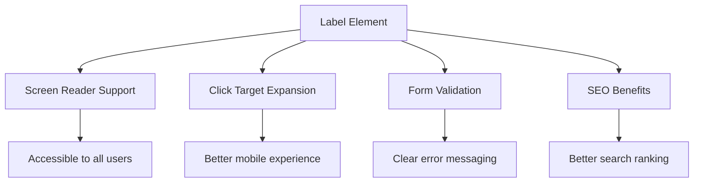
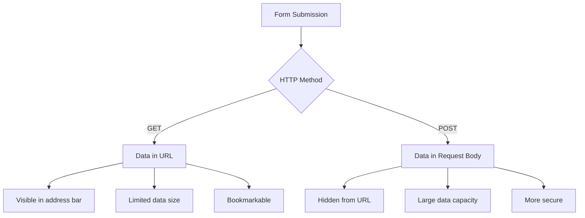
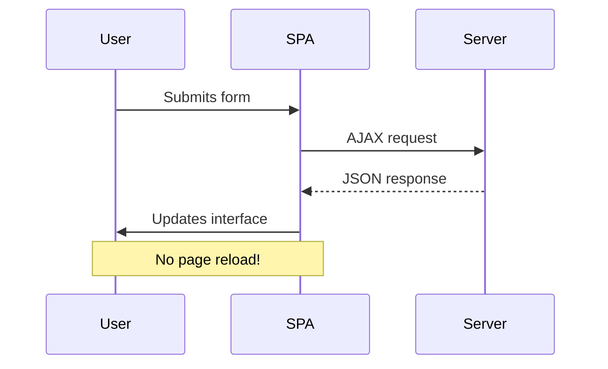
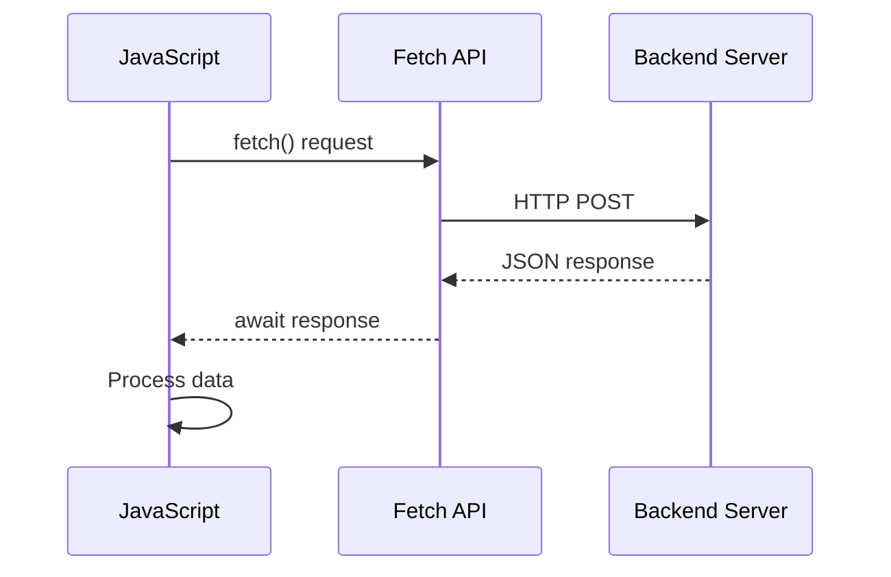
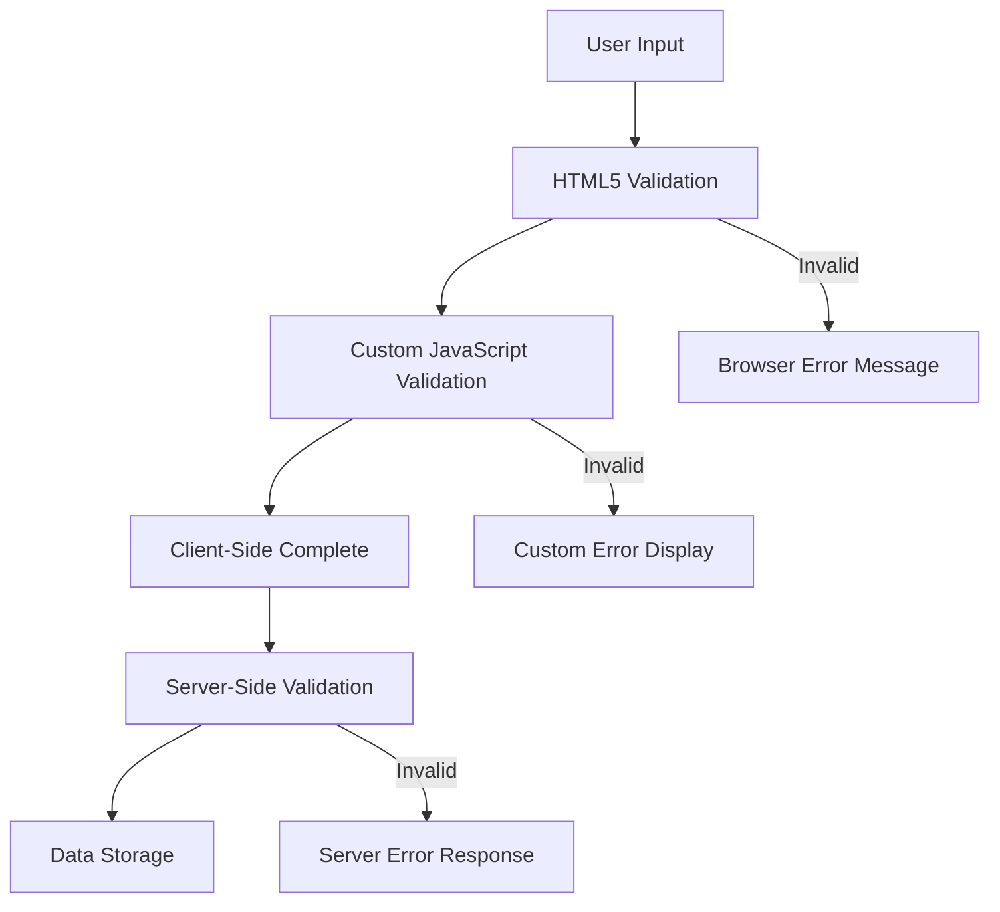
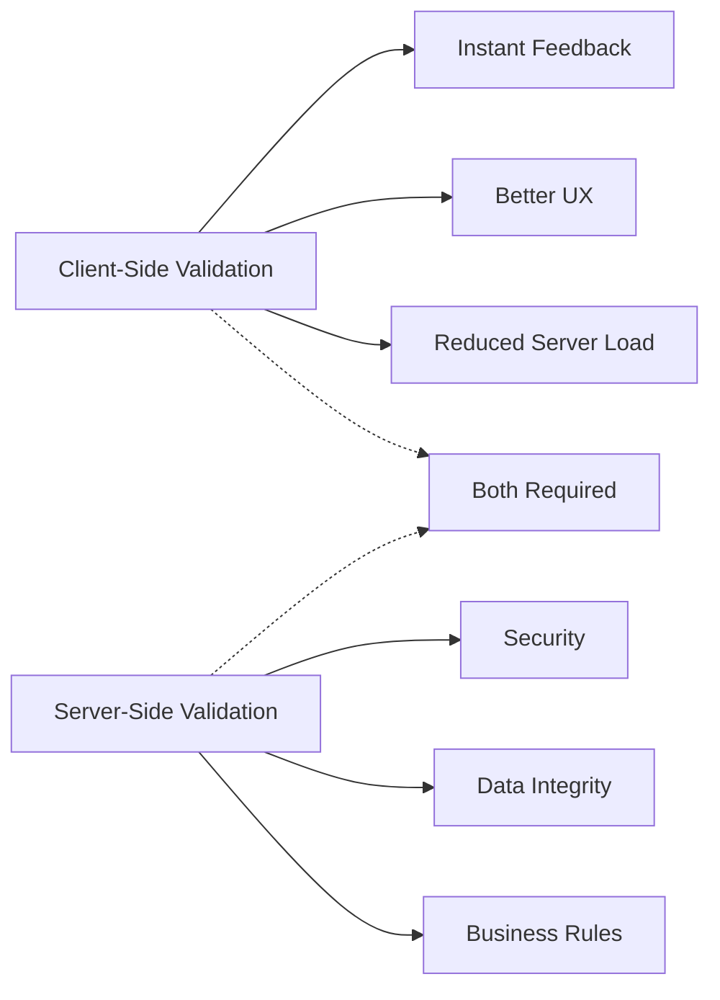

<!--
CO_OP_TRANSLATOR_METADATA:
{
  "original_hash": "b24f28fc46dd473aa9080f174182adde",
  "translation_date": "2025-10-23T22:32:58+00:00",
  "source_file": "7-bank-project/2-forms/README.md",
  "language_code": "no"
}
-->
# Bygg en bankapp del 2: Lag et innloggings- og registreringsskjema

## Quiz før forelesning

[Quiz før forelesning](https://ff-quizzes.netlify.app/web/quiz/43)

Har du noen gang fylt ut et skjema på nettet og fått avvist e-postformatet ditt? Eller mistet all informasjonen din når du trykket på send? Vi har alle opplevd disse frustrerende situasjonene.

Skjemaer er broen mellom brukerne dine og applikasjonens funksjonalitet. Akkurat som de nøye protokollene flygeledere bruker for å lede fly trygt til sine destinasjoner, gir godt utformede skjemaer tydelig tilbakemelding og forhindrer kostbare feil. Dårlige skjemaer, derimot, kan skremme bort brukere raskere enn en misforståelse på en travel flyplass.

I denne leksjonen skal vi forvandle din statiske bankapp til en interaktiv applikasjon. Du vil lære å lage skjemaer som validerer brukerinput, kommuniserer med servere og gir nyttig tilbakemelding. Tenk på det som å bygge kontrollgrensesnittet som lar brukerne navigere i applikasjonens funksjoner.

Ved slutten av leksjonen vil du ha et komplett innloggings- og registreringssystem med validering som veileder brukerne mot suksess i stedet for frustrasjon.

## Forutsetninger

Før vi begynner å lage skjemaer, la oss sørge for at du har alt satt opp riktig. Denne leksjonen fortsetter der vi slapp i den forrige, så hvis du har hoppet fremover, kan det være lurt å gå tilbake og få grunnlaget på plass først.

### Nødvendig oppsett

| Komponent | Status | Beskrivelse |
|-----------|--------|-------------|
| [HTML-maler](../1-template-route/README.md) | ✅ Nødvendig | Grunnstrukturen til bankappen din |
| [Node.js](https://nodejs.org) | ✅ Nødvendig | JavaScript-runtime for serveren |
| [Bank API-server](../api/README.md) | ✅ Nødvendig | Backend-tjeneste for datalagring |

> 💡 **Utviklingstips**: Du vil kjøre to separate servere samtidig – én for frontend-bankappen din og en annen for backend-API-en. Dette oppsettet speiler virkelige utviklingsmiljøer der frontend- og backend-tjenester opererer uavhengig.

### Serverkonfigurasjon

**Utviklingsmiljøet ditt vil inkludere:**
- **Frontend-server**: Serverer bankappen din (typisk port `3000`)
- **Backend API-server**: Håndterer datalagring og henting (port `5000`)
- **Begge servere** kan kjøre samtidig uten konflikter

**Testing av API-tilkoblingen:**
```bash
curl http://localhost:5000/api
# Expected response: "Bank API v1.0.0"
```

**Hvis du ser API-versjonsresponsen, er du klar til å fortsette!**

---

## Forstå HTML-skjemaer og kontroller

HTML-skjemaer er hvordan brukere kommuniserer med webapplikasjonen din. Tenk på dem som telegrafsystemet som koblet fjerne steder på 1800-tallet – de er kommunikasjonsprotokollen mellom brukerens intensjon og applikasjonens respons. Når de er designet med omtanke, fanger de opp feil, veileder inputformat og gir nyttige forslag.

Moderne skjemaer er betydelig mer sofistikerte enn grunnleggende tekstfelt. HTML5 introduserte spesialiserte inputtyper som automatisk håndterer e-postvalidering, nummerformat og datovalg. Disse forbedringene er til fordel for både tilgjengelighet og mobilbrukeropplevelser.

### Essensielle skjemaelementer

**Byggeklosser hvert skjema trenger:**

```html
<!-- Basic form structure -->
<form id="userForm" method="POST">
  <label for="username">Username</label>
  <input id="username" name="username" type="text" required>
  
  <button type="submit">Submit</button>
</form>
```

**Dette gjør koden:**
- **Oppretter** en skjema-container med en unik identifikator
- **Spesifiserer** HTTP-metoden for datasending
- **Assosierer** etiketter med inputfelt for tilgjengelighet
- **Definerer** en send-knapp for å behandle skjemaet

### Moderne inputtyper og attributter

| Inputtype | Formål | Eksempelbruk |
|-----------|--------|--------------|
| `text` | Generelt tekstfelt | `<input type="text" name="username">` |
| `email` | E-postvalidering | `<input type="email" name="email">` |
| `password` | Skjult tekstfelt | `<input type="password" name="password">` |
| `number` | Numerisk input | `<input type="number" name="balance" min="0">` |
| `tel` | Telefonnummer | `<input type="tel" name="phone">` |

> 💡 **Fordel med moderne HTML5**: Bruk av spesifikke inputtyper gir automatisk validering, passende mobil-tastaturer og bedre støtte for tilgjengelighet uten ekstra JavaScript!

### Knappetyper og oppførsel

```html
<!-- Different button behaviors -->
<button type="submit">Save Data</button>     <!-- Submits the form -->
<button type="reset">Clear Form</button>    <!-- Resets all fields -->
<button type="button">Custom Action</button> <!-- No default behavior -->
```

**Dette gjør hver knappetype:**
- **Send-knapper**: Utløser skjemaets sending og sender data til den spesifiserte endepunktet
- **Tilbakestill-knapper**: Gjenoppretter alle skjemaets felt til sin opprinnelige tilstand
- **Vanlige knapper**: Har ingen standardoppførsel og krever tilpasset JavaScript for funksjonalitet

> ⚠️ **Viktig merknad**: `<input>`-elementet er selv-lukkende og krever ikke en avsluttende tag. Moderne beste praksis er å skrive `<input>` uten skråstrek.

### Lage innloggingsskjemaet ditt

La oss nå lage et praktisk innloggingsskjema som demonstrerer moderne HTML-skjema-praksis. Vi starter med en grunnleggende struktur og forbedrer det gradvis med tilgjengelighetsfunksjoner og validering.

```html
<template id="login">
  <h1>Bank App</h1>
  <section>
    <h2>Login</h2>
    <form id="loginForm" novalidate>
      <div class="form-group">
        <label for="username">Username</label>
        <input id="username" name="user" type="text" required 
               autocomplete="username" placeholder="Enter your username">
      </div>
      <button type="submit">Login</button>
    </form>
  </section>
</template>
```

**Dette skjer her:**
- **Strukturerer** skjemaet med semantiske HTML5-elementer
- **Grupperer** relaterte elementer ved bruk av `div`-containere med meningsfulle klasser
- **Assosierer** etiketter med inputfelt ved bruk av `for`- og `id`-attributter
- **Inkluderer** moderne attributter som `autocomplete` og `placeholder` for bedre brukeropplevelse
- **Legger til** `novalidate` for å håndtere validering med JavaScript i stedet for nettleserens standard

### Kraften i riktige etiketter

**Hvorfor etiketter er viktige for moderne webutvikling:**



**Dette oppnår riktige etiketter:**
- **Gjør det mulig** for skjermlesere å annonsere skjemaets felt tydelig
- **Utvider** det klikkbare området (klikk på etiketten fokuserer inputfeltet)
- **Forbedrer** mobilbrukervennlighet med større berøringsmål
- **Støtter** skjemaets validering med meningsfulle feilmeldinger
- **Forbedrer** SEO ved å gi semantisk mening til skjemaelementer

> 🎯 **Tilgjengelighetsmål**: Hvert skjema-input bør ha en tilknyttet etikett. Denne enkle praksisen gjør skjemaene dine brukbare for alle, inkludert brukere med funksjonsnedsettelser, og forbedrer opplevelsen for alle brukere.

### Lage registreringsskjemaet

Registreringsskjemaet krever mer detaljert informasjon for å opprette en komplett brukerkonto. La oss bygge det med moderne HTML5-funksjoner og forbedret tilgjengelighet.

```html
<hr/>
<h2>Register</h2>
<form id="registerForm" novalidate>
  <div class="form-group">
    <label for="user">Username</label>
    <input id="user" name="user" type="text" required 
           autocomplete="username" placeholder="Choose a username">
  </div>
  
  <div class="form-group">
    <label for="currency">Currency</label>
    <input id="currency" name="currency" type="text" value="$" 
           required maxlength="3" placeholder="USD, EUR, etc.">
  </div>
  
  <div class="form-group">
    <label for="description">Account Description</label>
    <input id="description" name="description" type="text" 
           maxlength="100" placeholder="Personal savings, checking, etc.">
  </div>
  
  <div class="form-group">
    <label for="balance">Starting Balance</label>
    <input id="balance" name="balance" type="number" value="0" 
           min="0" step="0.01" placeholder="0.00">
  </div>
  
  <button type="submit">Create Account</button>
</form>
```

**I det ovennevnte har vi:**
- **Organisert** hvert felt i container-diver for bedre styling og layout
- **Lagt til** passende `autocomplete`-attributter for støtte til nettleserens autofyll
- **Inkludert** nyttig placeholder-tekst for å veilede brukerinput
- **Satt** fornuftige standardverdier ved bruk av `value`-attributtet
- **Brukt** valideringsattributter som `required`, `maxlength` og `min`
- **Brukt** `type="number"` for saldo-feltet med desimalstøtte

### Utforske inputtyper og oppførsel

**Moderne inputtyper gir forbedret funksjonalitet:**

| Funksjon | Fordel | Eksempel |
|----------|--------|----------|
| `type="number"` | Numerisk tastatur på mobil | Enklere saldo-registrering |
| `step="0.01"` | Kontroll over desimalpresisjon | Tillater øre i valuta |
| `autocomplete` | Nettleserens autofyll | Raskere skjemautfylling |
| `placeholder` | Kontekstuelle hint | Veileder brukerens forventninger |

> 🎯 **Tilgjengelighetsutfordring**: Prøv å navigere skjemaene ved kun å bruke tastaturet! Bruk `Tab` for å flytte mellom felt, `Space` for å krysse av bokser, og `Enter` for å sende inn. Denne opplevelsen hjelper deg å forstå hvordan skjermleserbrukere interagerer med skjemaene dine.

## Forstå metoder for skjemaets sending

Når noen fyller ut skjemaet ditt og trykker send, må dataene gå et sted – vanligvis til en server som kan lagre det. Det finnes et par forskjellige måter dette kan skje på, og å vite hvilken du skal bruke kan spare deg for noen hodepiner senere.

La oss se på hva som faktisk skjer når noen klikker på send-knappen.

### Standard skjemaoppførsel

La oss først observere hva som skjer med grunnleggende skjema-sending:

**Test skjemaene dine:**
1. Klikk på *Registrer* knappen i skjemaet ditt
2. Observer endringene i nettleserens adressefelt
3. Legg merke til hvordan siden lastes på nytt og data vises i URL-en


### Sammenligning av HTTP-metoder



**Forstå forskjellene:**

| Metode | Brukstilfelle | Dataens plassering | Sikkerhetsnivå | Størrelsesbegrensning |
|--------|---------------|--------------------|----------------|-----------------------|
| `GET` | Søkeforespørsler, filtre | URL-parametere | Lav (synlig) | ~2000 tegn |
| `POST` | Brukerkontoer, sensitiv data | Forespørselens kropp | Høyere (skjult) | Ingen praktisk grense |

**Forstå de grunnleggende forskjellene:**
- **GET**: Legger til skjemaets data i URL-en som spørringsparametere (passer for søkeoperasjoner)
- **POST**: Inkluderer data i forespørselens kropp (essensielt for sensitiv informasjon)
- **GET-begrensninger**: Størrelsesbegrensninger, synlige data, vedvarende nettleserhistorikk
- **POST-fordeler**: Stor datakapasitet, personvern, støtte for filopplasting

> 💡 **Beste praksis**: Bruk `GET` for søkeskjemaer og filtre (datahenting), bruk `POST` for brukerregistrering, innlogging og dataskaping.

### Konfigurere skjemaets sending

La oss konfigurere registreringsskjemaet ditt til å kommunisere riktig med backend-API-en ved bruk av POST-metoden:

```html
<form id="registerForm" action="//localhost:5000/api/accounts" 
      method="POST" novalidate>
```

**Dette gjør konfigurasjonen:**
- **Dirigerer** skjemaets sending til API-endepunktet ditt
- **Bruker** POST-metoden for sikker dataoverføring
- **Inkluderer** `novalidate` for å håndtere validering med JavaScript

### Testing av skjemaets sending

**Følg disse trinnene for å teste skjemaet ditt:**
1. **Fyll ut** registreringsskjemaet med informasjonen din
2. **Klikk** på "Opprett konto"-knappen
3. **Observer** serverens respons i nettleseren din


**Hva du bør se:**
- **Nettleseren omdirigerer** til API-endepunktets URL
- **JSON-respons** som inneholder dine nylig opprettede kontodata
- **Serverbekreftelse** på at kontoen ble opprettet vellykket

> 🧪 **Eksperimenttid**: Prøv å registrere deg igjen med samme brukernavn. Hvilken respons får du? Dette hjelper deg å forstå hvordan serveren håndterer dupliserte data og feiltilstander.

### Forstå JSON-responser

**Når serveren behandler skjemaet ditt vellykket:**
```json
{
  "user": "john_doe",
  "currency": "$",
  "description": "Personal savings",
  "balance": 100,
  "id": "unique_account_id"
}
```

**Denne responsen bekrefter:**
- **Oppretter** en ny konto med dine spesifiserte data
- **Tildeler** en unik identifikator for fremtidig referanse
- **Returnerer** all kontoinformasjon for verifisering
- **Indikerer** vellykket lagring i databasen

## Moderne skjema-håndtering med JavaScript

Tradisjonelle skjema-sendinger forårsaker fullstendige sideoppdateringer, på samme måte som tidlige romferder krevde komplette systemtilbakestillinger for kurskorrigeringer. Denne tilnærmingen forstyrrer brukeropplevelsen og mister applikasjonens tilstand.

JavaScript-skjema-håndtering fungerer som de kontinuerlige veiledningssystemene som brukes av moderne romfartøy – gjør justeringer i sanntid uten å miste navigasjonskonteksten. Vi kan avskjære skjema-sendinger, gi umiddelbar tilbakemelding, håndtere feil på en smidig måte og oppdatere grensesnittet basert på serverens respons, samtidig som vi opprettholder brukerens posisjon i applikasjonen.

### Hvorfor unngå sideoppdateringer?



**Fordeler med JavaScript-skjema-håndtering:**
- **Opprettholder** applikasjonens tilstand og brukerkontekst
- **Gir** umiddelbar tilbakemelding og lastindikatorer
- **Muliggjør** dynamisk feilhåndtering og validering
- **Skaper** jevne, app-lignende brukeropplevelser
- **Tillater** betinget logikk basert på serverens respons

### Overgang fra tradisjonelle til moderne skjemaer

**Utfordringer med tradisjonell tilnærming:**
- **Omdirigerer** brukere bort fra applikasjonen din
- **Mister** gjeldende applikasjonstilstand og kontekst
- **Krever** fullstendige sideoppdateringer for enkle operasjoner
- **Gir** begrenset kontroll over brukerens tilbakemelding

**Fordeler med moderne JavaScript-tilnærming:**
- **Holder** brukere innenfor applikasjonen din
- **Opprettholder** all applikasjonstilstand og data
- **Muliggjør** sanntidsvalidering og tilbakemelding
- **Støtter** progressiv forbedring og tilgjengelighet

### Implementere JavaScript-skjema-håndtering

La oss erstatte den tradisjonelle skjema-sendingen med moderne JavaScript-hendelseshåndtering:

```html
<!-- Remove the action attribute and add event handling -->
<form id="registerForm" method="POST" novalidate>
```

**Legg til registreringslogikken i `app.js`-filen din:**

```javascript
// Modern event-driven form handling
function register() {
  const registerForm = document.getElementById('registerForm');
  const formData = new FormData(registerForm);
  const data = Object.fromEntries(formData);
  const jsonData = JSON.stringify(data);
  
  console.log('Form data prepared:', data);
}

// Attach event listener when the page loads
document.addEventListener('DOMContentLoaded', () => {
  const registerForm = document.getElementById('registerForm');
  registerForm.addEventListener('submit', (event) => {
    event.preventDefault(); // Prevent default form submission
    register();
  });
});
```

**Dette skjer her:**
- **Forhindrer** standard skjema-sending ved bruk av `event.preventDefault()`
- **Henter** skjemaelementet ved bruk av moderne DOM-seleksjon
- **Ekstraherer** skjemaets data ved bruk av den kraftige `FormData`-API-en
- **Konverterer** FormData til et vanlig objekt med `Object.fromEntries()`
- **Serialiserer** dataene til JSON-format for serverkommunikasjon
- **Logger** de behandlede dataene for feilsøking og verifisering

### Forstå FormData-API-en

**FormData-API-en gir kraftig skjema-håndtering:**

```javascript
// Example of what FormData captures
const formData = new FormData(registerForm);

// FormData automatically captures:
// {
//   "user": "john_doe",
//   "currency": "$", 
//   "description": "Personal account",
//   "balance": "100"
// }
```

**Fordeler med FormData-API-en:**
- **Omfattende innsamling**: Fanger opp alle skjemaelementer inkludert tekst, filer og komplekse input
- **Typebevissthet**: Håndterer forskjellige inputtyper automatisk uten tilpasset koding
- **Effektivitet**: Eliminerer manuell feltinnsamling med én enkelt API-kall
- **Tilpasningsevne**: Opprettholder funksjonalitet etter hvert som skjemaets struktur utvikler seg

### Lage funksjonen for serverkommunikasjon

La oss bygge en robust funksjon for å kommunisere med API-serveren din ved bruk av moderne JavaScript-mønstre:

```javascript
async function createAccount(account) {
  try {
    const response = await fetch('//localhost:5000/api/accounts', {
      method: 'POST',
      headers: { 
        'Content-Type': 'application/json',
        'Accept': 'application/json'
      },
      body: account
    });
    
    // Check if the response was successful
    if (!response.ok) {
      throw new Error(`HTTP error! status: ${response.status}`);
    }
    
    return await response.json();
  } catch (error) {
    console.error('Account creation failed:', error);
    return { error: error.message || 'Network error occurred' };
  }
}
```

**Forstå asynkron JavaScript:**



**Dette oppnår den moderne implementeringen:**
- **Bruker** `async/await` for lesbar asynkron kode
- **Inkluderer** riktig feilhåndtering med try/catch-blokker
- **Sjekker** responsstatus før data behandles
- **Setter** passende overskrifter for JSON-kommunikasjon
- **Gir** detaljerte feilmeldinger for feilsøking
- **Returnerer** konsistent datastruktur for suksess- og feilsituasjoner

### Kraften i den moderne Fetch API

**Fordeler med Fetch API sammenlignet med eldre metoder:**

| Funksjon | Fordel | Implementering |
|----------|--------|----------------|
| Basert på Promise | Ren asynkron kode | `await fetch()` |
| Tilpasning av forespørsel | Full kontroll over HTTP | Headers, metoder, body |
| Håndtering av respons | Fleksibel databehandling | `.json()`, `.text()`, `.blob()` |
| Feilhåndtering | Omfattende feilhåndtering | Try/catch-blokker |

> 🎥 **Lær mer**: [Async/Await Tutorial](https://youtube.com/watch?v=YwmlRkrxvkk) - Forstå asynkrone JavaScript-mønstre for moderne webutvikling.

**Nøkkelkonsepter for serverkommunikasjon:**
- **Asynkrone funksjoner** lar deg pause utførelsen for å vente på serverrespons
- **Await-nøkkelordet** gjør asynkron kode lesbar som synkron kode
- **Fetch API** gir moderne, promise-baserte HTTP-forespørsler
- **Feilhåndtering** sikrer at appen din reagerer grasiøst på nettverksproblemer

### Fullføre registreringsfunksjonen

La oss samle alt med en komplett, produksjonsklar registreringsfunksjon:

```javascript
async function register() {
  const registerForm = document.getElementById('registerForm');
  const submitButton = registerForm.querySelector('button[type="submit"]');
  
  try {
    // Show loading state
    submitButton.disabled = true;
    submitButton.textContent = 'Creating Account...';
    
    // Process form data
    const formData = new FormData(registerForm);
    const jsonData = JSON.stringify(Object.fromEntries(formData));
    
    // Send to server
    const result = await createAccount(jsonData);
    
    if (result.error) {
      console.error('Registration failed:', result.error);
      alert(`Registration failed: ${result.error}`);
      return;
    }
    
    console.log('Account created successfully!', result);
    alert(`Welcome, ${result.user}! Your account has been created.`);
    
    // Reset form after successful registration
    registerForm.reset();
    
  } catch (error) {
    console.error('Unexpected error:', error);
    alert('An unexpected error occurred. Please try again.');
  } finally {
    // Restore button state
    submitButton.disabled = false;
    submitButton.textContent = 'Create Account';
  }
}
```

**Denne forbedrede implementeringen inkluderer:**
- **Gir** visuell tilbakemelding under innsending av skjema
- **Deaktiverer** send-knappen for å forhindre dupliserte innsendinger
- **Håndterer** både forventede og uventede feil på en god måte
- **Viser** brukervennlige suksess- og feilmeldinger
- **Nullstiller** skjemaet etter vellykket registrering
- **Gjenoppretter** UI-tilstanden uansett resultat

### Testing av implementeringen

**Åpne utviklerverktøyene i nettleseren og test registreringen:**

1. **Åpne** konsollen i nettleseren (F12 → Console-fanen)
2. **Fyll ut** registreringsskjemaet
3. **Klikk** på "Opprett konto"
4. **Observer** konsollmeldinger og tilbakemeldinger til brukeren


**Hva du bør se:**
- **Lastetilstand** vises på send-knappen
- **Konsolllogger** viser detaljert informasjon om prosessen
- **Suksessmelding** vises når kontoen opprettes
- **Skjemaet nullstilles** automatisk etter vellykket innsending

> 🔒 **Sikkerhetsbetraktning**: For øyeblikket sendes data over HTTP, som ikke er sikkert for produksjon. I virkelige applikasjoner bør du alltid bruke HTTPS for å kryptere dataoverføring. Lær mer om [HTTPS-sikkerhet](https://en.wikipedia.org/wiki/HTTPS) og hvorfor det er viktig for å beskytte brukerdata.

## Omfattende skjema-validering

Skjema-validering forhindrer den frustrerende opplevelsen av å oppdage feil først etter innsending. Akkurat som de mange redundante systemene på den internasjonale romstasjonen, bruker effektiv validering flere lag med sikkerhetssjekker.

Den optimale tilnærmingen kombinerer validering på nettlesernivå for umiddelbar tilbakemelding, JavaScript-validering for forbedret brukeropplevelse, og server-side validering for sikkerhet og dataintegritet. Denne redundansen sikrer både brukertilfredshet og systembeskyttelse.

### Forstå valideringslagene



**Strategi for validering med flere lag:**
- **HTML5-validering**: Umiddelbare nettleserbaserte kontroller
- **JavaScript-validering**: Tilpasset logikk og brukeropplevelse
- **Server-validering**: Endelig sikkerhet og dataintegritetssjekker
- **Progressiv forbedring**: Fungerer selv om JavaScript er deaktivert

### HTML5-valideringsattributter

**Moderne valideringsverktøy til din disposisjon:**

| Attributt | Formål | Eksempelbruk | Nettleseratferd |
|-----------|--------|--------------|-----------------|
| `required` | Obligatoriske felt | `<input required>` | Forhindrer tom innsending |
| `minlength`/`maxlength` | Tekstlengdegrenser | `<input maxlength="20">` | Håndhever tegnbegrensninger |
| `min`/`max` | Numeriske grenser | `<input min="0" max="1000">` | Validerer tallgrenser |
| `pattern` | Egendefinerte regex-regler | `<input pattern="[A-Za-z]+">` | Matcher spesifikke formater |
| `type` | Datatype-validering | `<input type="email">` | Formatspesifikk validering |

### CSS-valideringsstil

**Lag visuell tilbakemelding for valideringstilstander:**

```css
/* Valid input styling */
input:valid {
  border-color: #28a745;
  background-color: #f8fff9;
}

/* Invalid input styling */
input:invalid {
  border-color: #dc3545;
  background-color: #fff5f5;
}

/* Focus states for better accessibility */
input:focus:valid {
  box-shadow: 0 0 0 0.2rem rgba(40, 167, 69, 0.25);
}

input:focus:invalid {
  box-shadow: 0 0 0 0.2rem rgba(220, 53, 69, 0.25);
}
```

**Hva disse visuelle signalene oppnår:**
- **Grønne rammer**: Indikerer vellykket validering, som grønne lys i kontrollsenteret
- **Røde rammer**: Signalerer valideringsfeil som krever oppmerksomhet
- **Fokusmarkeringer**: Gir klar visuell kontekst for nåværende inntastingssted
- **Konsistent styling**: Etablerer forutsigbare grensesnittmønstre som brukere kan lære

> 💡 **Profftips**: Bruk `:valid` og `:invalid` CSS-pseudoklasser for å gi umiddelbar visuell tilbakemelding mens brukerne skriver, og skape et responsivt og hjelpsomt grensesnitt.

### Implementering av omfattende validering

La oss forbedre registreringsskjemaet ditt med robust validering som gir utmerket brukeropplevelse og datakvalitet:

```html
<form id="registerForm" method="POST" novalidate>
  <div class="form-group">
    <label for="user">Username <span class="required">*</span></label>
    <input id="user" name="user" type="text" required 
           minlength="3" maxlength="20" 
           pattern="[a-zA-Z0-9_]+" 
           autocomplete="username"
           title="Username must be 3-20 characters, letters, numbers, and underscores only">
    <small class="form-text">Choose a unique username (3-20 characters)</small>
  </div>
  
  <div class="form-group">
    <label for="currency">Currency <span class="required">*</span></label>
    <input id="currency" name="currency" type="text" required 
           value="$" maxlength="3" 
           pattern="[A-Z$€£¥₹]+" 
           title="Enter a valid currency symbol or code">
    <small class="form-text">Currency symbol (e.g., $, €, £)</small>
  </div>
  
  <div class="form-group">
    <label for="description">Account Description</label>
    <input id="description" name="description" type="text" 
           maxlength="100" 
           placeholder="Personal savings, checking, etc.">
    <small class="form-text">Optional description (up to 100 characters)</small>
  </div>
  
  <div class="form-group">
    <label for="balance">Starting Balance</label>
    <input id="balance" name="balance" type="number" 
           value="0" min="0" step="0.01" 
           title="Enter a positive number for your starting balance">
    <small class="form-text">Initial account balance (minimum $0.00)</small>
  </div>
  
  <button type="submit">Create Account</button>
</form>
```

**Forstå den forbedrede valideringen:**
- **Kombinerer** indikatorer for obligatoriske felt med hjelpsomme beskrivelser
- **Inkluderer** `pattern`-attributter for formatvalidering
- **Gir** `title`-attributter for tilgjengelighet og verktøytips
- **Legger til** hjelpetekst for å veilede brukerens inntasting
- **Bruker** semantisk HTML-struktur for bedre tilgjengelighet

### Avanserte valideringsregler

**Hva hver valideringsregel oppnår:**

| Felt | Valideringsregler | Brukerfordel |
|------|-------------------|--------------|
| Brukernavn | `required`, `minlength="3"`, `maxlength="20"`, `pattern="[a-zA-Z0-9_]+"` | Sikrer gyldige, unike identifikatorer |
| Valuta | `required`, `maxlength="3"`, `pattern="[A-Z$€£¥₹]+"` | Godtar vanlige valutasymboler |
| Saldo | `min="0"`, `step="0.01"`, `type="number"` | Forhindrer negative saldoer |
| Beskrivelse | `maxlength="100"` | Rimelige lengdebegrensninger |

### Testing av valideringsatferd

**Prøv disse valideringsscenarioene:**
1. **Send inn** skjemaet med tomme obligatoriske felt
2. **Skriv inn** et brukernavn kortere enn 3 tegn
3. **Prøv** spesialtegn i brukernavnfeltet
4. **Angi** et negativt saldo-beløp


**Hva du vil observere:**
- **Nettleseren viser** native valideringsmeldinger
- **Styling endres** basert på `:valid` og `:invalid`-tilstander
- **Skjemainnsending** forhindres til alle valideringer er bestått
- **Fokus flyttes automatisk** til det første ugyldige feltet

### Klient-side vs server-side validering



**Hvorfor du trenger begge lagene:**
- **Klient-side validering**: Gir umiddelbar tilbakemelding og forbedrer brukeropplevelsen
- **Server-side validering**: Sikrer sikkerhet og håndterer komplekse forretningsregler
- **Kombinert tilnærming**: Skaper robuste, brukervennlige og sikre applikasjoner
- **Progressiv forbedring**: Fungerer selv når JavaScript er deaktivert

> 🛡️ **Sikkerhetspåminnelse**: Stol aldri kun på klient-side validering! Ondsinnede brukere kan omgå klient-side kontroller, så server-side validering er avgjørende for sikkerhet og dataintegritet.

---

---

## GitHub Copilot Agent Challenge 🚀

Bruk Agent-modus for å fullføre følgende utfordring:

**Beskrivelse:** Forbedre registreringsskjemaet med omfattende klient-side validering og brukerfeedback. Denne utfordringen hjelper deg med å øve på skjema-validering, feilhåndtering og forbedring av brukeropplevelsen med interaktiv tilbakemelding.

**Oppgave:** Lag et komplett system for skjema-validering for registreringsskjemaet som inkluderer: 1) Sanntidstilbakemelding for hvert felt mens brukeren skriver, 2) Egendefinerte valideringsmeldinger som vises under hvert inntastingsfelt, 3) Et passordbekreftelsesfelt med samsvarende validering, 4) Visuelle indikatorer (som grønne sjekkmerker for gyldige felt og røde advarsler for ugyldige), 5) En send-knapp som kun blir aktivert når alle valideringer er bestått. Bruk HTML5-valideringsattributter, CSS for styling av valideringstilstander, og JavaScript for interaktiv atferd.

Lær mer om [agent-modus](https://code.visualstudio.com/blogs/2025/02/24/introducing-copilot-agent-mode) her.

## 🚀 Utfordring

Vis en feilmelding i HTML hvis brukeren allerede eksisterer.

Her er et eksempel på hvordan den endelige innloggingssiden kan se ut etter litt styling:


## Quiz etter forelesning

[Quiz etter forelesning](https://ff-quizzes.netlify.app/web/quiz/44)

## Gjennomgang og selvstudie

Utviklere har blitt veldig kreative når det gjelder skjema-bygging, spesielt med tanke på valideringsstrategier. Lær om forskjellige skjemaoppsett ved å se gjennom [CodePen](https://codepen.com); kan du finne noen interessante og inspirerende skjemaer?

## Oppgave

[Stillegg din bankapp](assignment.md)

---

**Ansvarsfraskrivelse**:  
Dette dokumentet er oversatt ved hjelp av AI-oversettelsestjenesten [Co-op Translator](https://github.com/Azure/co-op-translator). Selv om vi tilstreber nøyaktighet, vær oppmerksom på at automatiserte oversettelser kan inneholde feil eller unøyaktigheter. Det originale dokumentet på sitt opprinnelige språk bør anses som den autoritative kilden. For kritisk informasjon anbefales profesjonell menneskelig oversettelse. Vi er ikke ansvarlige for eventuelle misforståelser eller feiltolkninger som oppstår ved bruk av denne oversettelsen.