<!--
CO_OP_TRANSLATOR_METADATA:
{
  "original_hash": "7cbdbd132d39a2bb493e85bc2a9387cc",
  "translation_date": "2026-01-07T00:38:51+00:00",
  "source_file": "7-bank-project/2-forms/README.md",
  "language_code": "no"
}
-->
# Bygg en bankapp del 2: Bygg et innloggings- og registreringsskjema

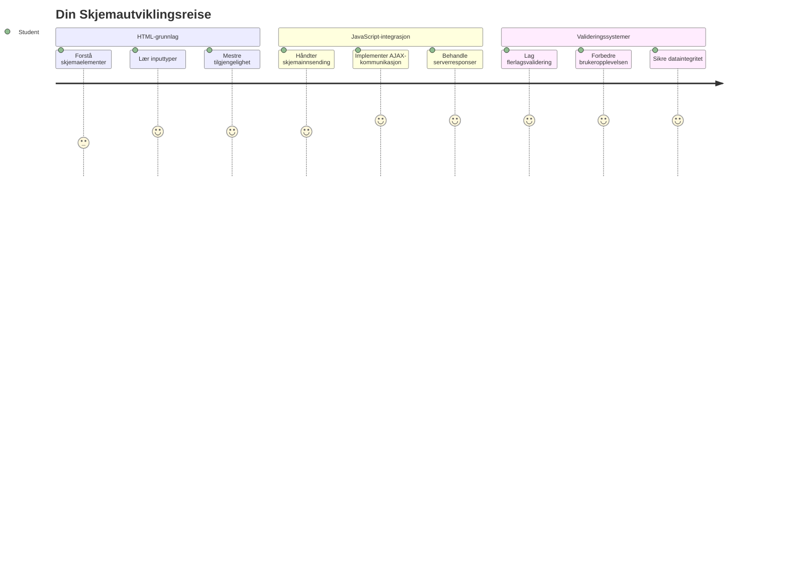
## Pre-forelesningsquiz

[Pre-forelesningsquiz](https://ff-quizzes.netlify.app/web/quiz/43)

Har du noen gang fylt ut et skjema på nettet og fått det til å avvise e-postformatet ditt? Eller mistet all informasjonen din når du trykket på send? Vi har alle opplevd disse frustrerende situasjonene.

Skjemaer er broen mellom brukerne dine og funksjonaliteten i applikasjonen din. Som de nøye protokollene flygelederne bruker for å styre fly trygt til destinasjonene sine, gir godt designede skjemaer klare tilbakemeldinger og forhindrer kostbare feil. Dårlige skjemaer kan derimot skremme brukere unna raskere enn en misforståelse på en travel flyplass.

I denne leksjonen skal vi forvandle din statiske bankapp til en interaktiv applikasjon. Du vil lære å bygge skjemaer som validerer brukerinput, kommuniserer med servere og gir nyttige tilbakemeldinger. Tenk på det som å bygge kontrollgrensesnittet som lar brukere navigere appens funksjoner.

På slutten vil du ha et komplett innloggings- og registreringssystem med validering som veileder brukerne mot suksess i stedet for frustrasjon.

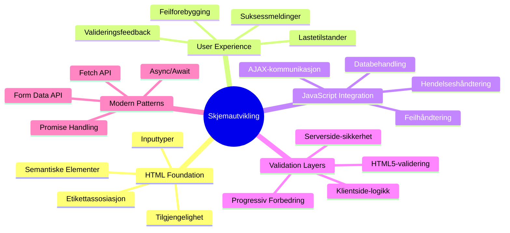
## Forutsetninger

Før vi begynner å bygge skjemaer, la oss forsikre oss om at alt er satt opp riktig. Denne leksjonen fortsetter akkurat der vi slapp i forrige, så hvis du hoppet frem, vil du kanskje gå tilbake og få grunnleggende funksjoner til å fungere først.

### Påkrevde oppsett

| Komponent | Status | Beskrivelse |
|-----------|--------|-------------|
| [HTML-maler](../1-template-route/README.md) | ✅ Påkrevd | Din grunnleggende bankappstruktur |
| [Node.js](https://nodejs.org) | ✅ Påkrevd | JavaScript-runtime for serveren |
| [Bank API-server](../api/README.md) | ✅ Påkrevd | Backend-tjeneste for datalagring |

> 💡 **Utviklertips**: Du vil kjøre to separate servere samtidig – en for frontend bankappen din og en annen for backend API. Dette oppsettet speiler ekte utvikling hvor frontend- og backend-tjenester opererer uavhengig.

### Serverkonfigurasjon

**Utviklingsmiljøet ditt vil inkludere:**
- **Frontend-server**: Server din bankapp (vanligvis port `3000`)
- **Backend API-server**: Håndterer datalagring og henting (port `5000`)
- **Begge serverne** kan kjøre samtidig uten konflikter

**Testing av din API-tilkobling:**
```bash
curl http://localhost:5000/api
# Forventet svar: "Bank API v1.0.0"
```

**Hvis du ser API-versjonssvaret, er du klar til å fortsette!**

---

## Forstå HTML-skjemaer og kontroller

HTML-skjemaer er hvordan brukere kommuniserer med din webapplikasjon. Tenk på dem som telegrafsystemet som koblet fjerne steder sammen på 1800-tallet – de er kommunikasjonsprotokollen mellom brukerens intensjon og applikasjonens respons. Når de er gjennomtenkt designet, fanger de opp feil, veileder inputformatering og gir nyttige forslag.

Moderne skjemaer er betydelig mer sofistikerte enn grunnleggende tekstfelt. HTML5 introduserte spesialiserte input-typer som automatisk håndterer e-postvalidering, tallformatering og datovalidering. Disse forbedringene gavner både tilgjengelighet og mobilbrukeropplevelse.

### Essensielle skjemaelementer

**Byggeklosser alle skjema trenger:**

```html
<!-- Basic form structure -->
<form id="userForm" method="POST">
  <label for="username">Username</label>
  <input id="username" name="username" type="text" required>
  
  <button type="submit">Submit</button>
</form>
```

**Dette gjør koden:**
- **Oppretter** en skjema-beholder med en unik identifikator
- **Spesifiserer** HTTP-metoden for datainnsending
- **Knytter** etiketter til input-feltene for tilgjengelighet
- **Definerer** en send-knapp for å behandle skjemaet

### Moderne input-typer og attributter

| Input-type | Formål | Eksempelbruk |
|------------|---------|---------------|
| `text` | Generell tekstinput | `<input type="text" name="username">` |
| `email` | E-postvalidering | `<input type="email" name="email">` |
| `password` | Skjult tekstinnskriving | `<input type="password" name="password">` |
| `number` | Numerisk input | `<input type="number" name="balance" min="0">` |
| `tel` | Telefonnummer | `<input type="tel" name="phone">` |

> 💡 **Moderne HTML5-fordel**: Bruk av spesifikke input-typer tilbyr automatisk validering, passende mobil-tastaturer og bedre tilgjengelighet uten ekstra JavaScript!

### Knapper typer og oppførsel

```html
<!-- Different button behaviors -->
<button type="submit">Save Data</button>     <!-- Submits the form -->
<button type="reset">Clear Form</button>    <!-- Resets all fields -->
<button type="button">Custom Action</button> <!-- No default behavior -->
```

**Dette gjør hver knappetype:**
- **Send-knapper**: Utløser skjema-innsending og sender data til angitt endepunkt
- **Tilbakestillingsknapper**: Gjenoppretter alle skjema-felt til utgangstilstanden
- **Vanlige knapper**: Har ingen standardfunksjon, krever tilpasset JavaScript for funksjonalitet

> ⚠️ **Viktig merknad**: `<input>`-elementet er selv-lukkende og trenger ikke slutt-tagg. Moderne anbefaling er å skrive `<input>` uten skråstrek.

### Bygge innloggingsskjemaet ditt

La oss nå lage et praktisk innloggingsskjema som demonstrerer moderne HTML-skjema-praksis. Vi starter med en grunnleggende struktur og forbedrer gradvis med tilgjengelighetsfunksjoner og validering.

```html
<template id="login">
  <h1>Bank App</h1>
  <section>
    <h2>Login</h2>
    <form id="loginForm" novalidate>
      <div class="form-group">
        <label for="username">Username</label>
        <input id="username" name="user" type="text" required 
               autocomplete="username" placeholder="Enter your username">
      </div>
      <button type="submit">Login</button>
    </form>
  </section>
</template>
```

**Dette skjer her:**
- **Strukturerer** skjema med semantiske HTML5-elementer
- **Grupperer** relaterte elementer i `div`-beholdere med meningsfulle klasser
- **Knytter** etiketter til input ved bruk av `for` og `id`-attributter
- **Inkluderer** moderne attributter som `autocomplete` og `placeholder` for bedre brukeropplevelse
- **Legger til** `novalidate` for å håndtere validering med JavaScript i stedet for nettleserens standard

### Kraften av riktige etiketter

**Hvorfor etiketter er viktig for moderne webutvikling:**

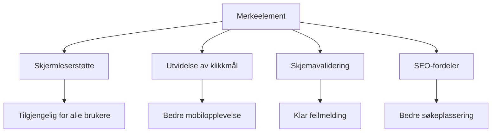
**Hva riktige etiketter oppnår:**
- **Gjør det mulig** for skjermlesere å lese opp skjema-feltene tydelig
- **Utvider** den klikkbare sonen (klikk på etiketten fokuserer input)
- **Forbedrer** brukbarhet på mobil med større berøringsmål
- **Støtter** skjema-validering med meningsfulle feilmeldinger
- **Forbedrer** SEO ved å gi semantisk mening til skjema-elementer

> 🎯 **Tilgjengelighetsmål**: Hvert skjema-input bør ha en tilhørende etikett. Denne enkle praksisen gjør skjemaene dine brukbare for alle, inkludert brukere med nedsatt funksjonsevne, og forbedrer opplevelsen for alle.

### Opprette registreringsskjemaet

Registreringsskjemaet krever mer detaljert informasjon for å opprette en fullstendig brukerprofil. La oss bygge det med moderne HTML5-funksjoner og forbedret tilgjengelighet.

```html
<hr/>
<h2>Register</h2>
<form id="registerForm" novalidate>
  <div class="form-group">
    <label for="user">Username</label>
    <input id="user" name="user" type="text" required 
           autocomplete="username" placeholder="Choose a username">
  </div>
  
  <div class="form-group">
    <label for="currency">Currency</label>
    <input id="currency" name="currency" type="text" value="$" 
           required maxlength="3" placeholder="USD, EUR, etc.">
  </div>
  
  <div class="form-group">
    <label for="description">Account Description</label>
    <input id="description" name="description" type="text" 
           maxlength="100" placeholder="Personal savings, checking, etc.">
  </div>
  
  <div class="form-group">
    <label for="balance">Starting Balance</label>
    <input id="balance" name="balance" type="number" value="0" 
           min="0" step="0.01" placeholder="0.00">
  </div>
  
  <button type="submit">Create Account</button>
</form>
```

**I ovenstående har vi:**
- **Organisert** hvert felt i containere (`div`) for bedre styling og oppsett
- **Lagt til** passende `autocomplete`-attributter for nettleserens autofyll-støtte
- **Inkludert** hjelpsom plassholdertekst for å veilede brukerinput
- **Satt** fornuftige standardverdier ved bruk av `value`-attributtet
- **Brukt** valideringsattributter som `required`, `maxlength` og `min`
- **Brukt** `type="number"` for saldo-feltet med desimalstøtte

### Utforske input-typer og oppførsel

**Moderne input-typer gir utvidet funksjonalitet:**

| Egenskap | Fordel | Eksempel |
|---------|---------|----------|
| `type="number"` | Numerisk tastatur på mobil | Letter inntasting av saldo |
| `step="0.01"` | Kontroll på desimalnøyaktighet | Tillater cent i valuta |
| `autocomplete` | Nettleser autofyll | Raskere utfylling |
| `placeholder` | Kontekstuelle hint | Veileder brukerforventninger |

> 🎯 **Tilgjengelighetsutfordring**: Prøv å navigere skjemaene med bare tastaturet! Bruk `Tab` for å bevege deg mellom feltene, `Space` for å hake av bokser, og `Enter` for å sende inn. Denne opplevelsen hjelper deg å forstå hvordan skjermlesere-brukere samhandler med skjemaene dine.

### 🔄 **Pedagogisk gjennomgang**
**Forståelse av skjema-grunnlag**: Før du implementerer JavaScript, sørg for at du forstår:
- ✅ Hvordan semantisk HTML skaper tilgjengelige skjema-strukturer
- ✅ Hvorfor input-typer er viktige for mobil-tastaturer og validering
- ✅ Forholdet mellom etiketter og skjema-kontroller
- ✅ Hvordan skjemaattributter påvirker nettleserens standardatferd

**Rask selvtest**: Hva skjer dersom du sender inn et skjema uten JavaScript?
*Svar: Nettleseren utfører standard innsending, vanligvis ved å omdirigere til action-URL*

**Fordeler med HTML5-skjemaer**: Moderne skjemaer tilbyr:
- **Innebygd validering**: Automatisk e-post- og tallformatkontroll
- **Mobiloptimalisering**: Passende tastaturer for ulike input-typer
- **Tilgjengelighet**: Skjermleserstøtte og tastaturnavigering
- **Progressiv forbedring**: Fungerer også når JavaScript er deaktivert

## Forstå metoder for skjema-innsending

Når noen fyller ut skjemaet ditt og trykker på send, må dataene sendes et sted – vanligvis til en server som kan lagre det. Det finnes et par forskjellige måter å gjøre dette på, og å vite hvilken du skal bruke kan spare deg for problemer senere.

La oss se på hva som faktisk skjer når noen klikker på send-knappen.

### Standard oppførsel for skjema

Først, la oss observere hva som skjer med et grunnleggende skjema:

**Test dine nåværende skjemaer:**
1. Klikk på *Registrer*-knappen i skjemaet ditt
2. Observer endringene i nettleserens adressefelt
3. Legg merke til hvordan siden lastes på nytt og data vises i URLen


### Sammenligning av HTTP-metoder

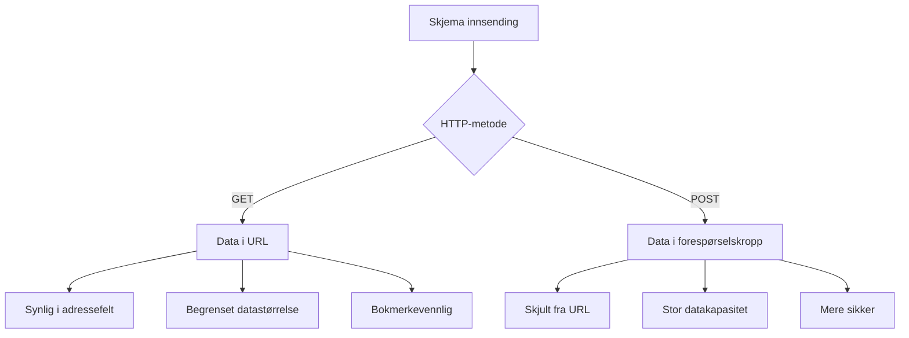
**Forstå forskjellene:**

| Metode | Bruksområde | Data-plassering | Sikkerhetsnivå | Størrelsesbegrensning |
|--------|----------|---------------|----------------|-------------|
| `GET` | Søkespørringer, filtrering | URL-parametere | Lav (synlig) | ~2000 tegn |
| `POST` | Brukerkontoer, sensitiv data | Forespørselskropp | Høyere (skjult) | Ingen praktisk grense |

**Grunnleggende forskjeller:**
- **GET**: Legger skjema-data til URL som spørringsparametere (passer for søk)
- **POST**: Inkluderer data i forespørselskroppen (essensielt for sensitiv info)
- **GET-begrensninger**: Størrelsesbegrensninger, synlig data, persistente nettleserhistorikk
- **POST-fordeler**: Stor datakapasitet, personvern, støtte for filopplasting

> 💡 **Beste praksis**: Bruk `GET` for søkeskjemaer og filtre (datauthenting), bruk `POST` for brukerregistrering, innlogging og dataskaping.

### Konfigurere skjema-innsending

La oss konfigurere registreringsskjemaet ditt til å kommunisere korrekt med backend-APIen ved å bruke POST-metoden:

```html
<form id="registerForm" action="//localhost:5000/api/accounts" 
      method="POST" novalidate>
```

**Dette gjør konfigurasjonen:**
- **Dirigerer** skjema-innsending til API-endepunktet ditt
- **Bruker** POST-metoden for sikker dataoverføring
- **Inkluderer** `novalidate` for å håndtere validering i JavaScript

### Teste skjema-innsending

**Følg disse stegene for å teste skjemaet:**
1. **Fyll ut** registreringsskjemaet med dine opplysninger
2. **Klikk** på "Opprett konto"-knappen
3. **Observer** serverens respons i nettleseren

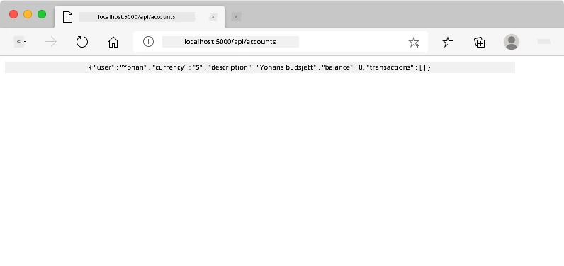

**Dette bør du se:**
- **Nettleseren omdirigeres** til API-endepunktets URL
- **JSON-svar** som inneholder den nylig opprettede kontodataen din
- **Serverbekreftelse** på at kontoen ble opprettet vellykket

> 🧪 **Eksperimenttid**: Prøv å registrere med samme brukernavn igjen. Hvilket svar får du? Dette hjelper deg forstå hvordan serveren håndterer duplikatdata og feilsituasjoner.

### Forstå JSON-responser

**Når serveren behandler skjemaet ditt vellykket:**
```json
{
  "user": "john_doe",
  "currency": "$",
  "description": "Personal savings",
  "balance": 100,
  "id": "unique_account_id"
}
```

**Denne responsen bekrefter:**
- **Oppretter** en ny konto med de oppgitte dataene
- **Tildeler** en unik ID for fremtidig referanse
- **Returnerer** all kontoinformasjon for verifisering
- **Indikerer** vellykket lagring i databasen

## Moderne skjema-håndtering med JavaScript

Tradisjonelle skjema-innsendinger forårsaker full sideoppdatering, likt hvordan tidlige romferder krevde komplette systemresett for kursendringer. Denne tilnærmingen forstyrrer brukeropplevelsen og mister applikasjonstilstand.

JavaScript-skjema-håndtering fungerer som kontinuerlig styringssystem brukt av moderne romfartøy – det gjør sanntidsjusteringer uten å miste navigasjonskontekst. Vi kan fange skjema-innsendinger, gi umiddelbare tilbakemeldinger, håndtere feil elegant, og oppdatere grensesnittet basert på serverresponser, samtidig som vi beholder brukerens posisjon i appen.

### Hvorfor unngå sideoppdateringer?

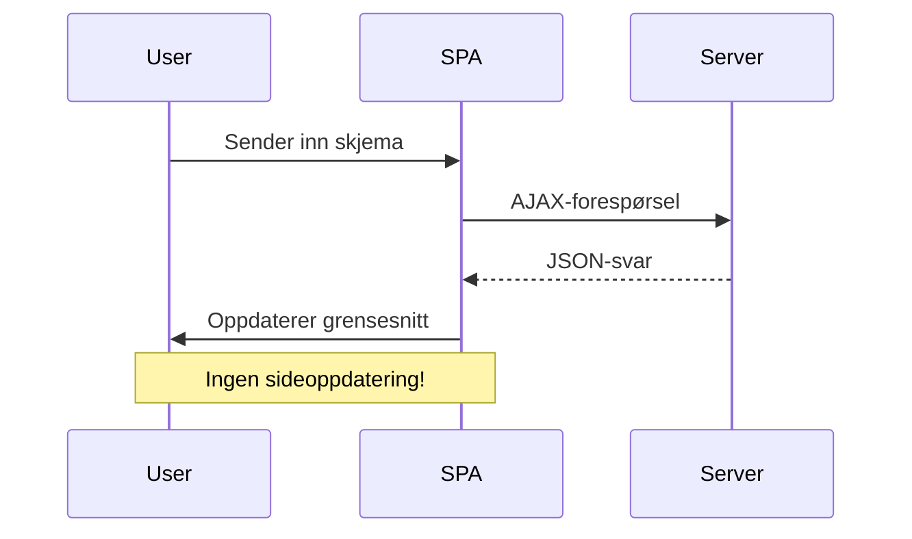
**Fordeler med JavaScript-skjema-håndtering:**
- **Opprettholder** applikasjonstilstand og bruker-kontekst
- **Gir** umiddelbar tilbakemelding og lastindikatorer
- **Muliggjør** dynamisk feilhåndtering og validering
- **Skaper** jevn, app-liknende brukeropplevelse
- **Tillater** betinget logikk basert på serverresponser

### Overgang fra tradisjonelle til moderne skjemaer

**Utfordringer med tradisjonell tilnærming:**
- **Sender brukere bort** fra applikasjonen din
- **Mister** nåværende applikasjonstilstand og kontekst
- **Krever** full sideoppdatering for enkle operasjoner
- **Gir** begrenset kontroll over bruker-tilbakemeldinger

**Fordeler med moderne JavaScript-tilnærming:**
- **Beholder** brukere i applikasjonen
- **Opprettholder** all tilstand og data
- **Muliggjør** sanntidsvalidering og tilbakemelding
- **Støtter** progressiv forbedring og tilgjengelighet

### Implementere JavaScript-skjema-håndtering

La oss erstatte tradisjonell skjema-innsending med moderne JavaScript-hendelseshåndtering:

```html
<!-- Remove the action attribute and add event handling -->
<form id="registerForm" method="POST" novalidate>
```

**Legg til registreringslogikk i `app.js`-filen din:**

```javascript
// Moderne hendelsesdrevet skjemabehandling
function register() {
  const registerForm = document.getElementById('registerForm');
  const formData = new FormData(registerForm);
  const data = Object.fromEntries(formData);
  const jsonData = JSON.stringify(data);
  
  console.log('Form data prepared:', data);
}

// Legg til event-lytter når siden lastes
document.addEventListener('DOMContentLoaded', () => {
  const registerForm = document.getElementById('registerForm');
  registerForm.addEventListener('submit', (event) => {
    event.preventDefault(); // Forhindre standard innsending av skjema
    register();
  });
});
```

**Dette skjer her:**
- **Forhindrer** standard skjema-innsending med `event.preventDefault()`
- **Henter** skjemaelementet med moderne DOM-selektor
- **Henter ut** skjema-data med kraftige `FormData` API
- **Konverterer** FormData til vanlig objekt med `Object.fromEntries()`
- **Serialiserer** data til JSON-format for serverkommunikasjon
- **Logger** de behandlede dataene for feilsøking og verifisering

### Forstå FormData API

**FormData API gir kraftig skjema-håndtering:**
```javascript
// Eksempel på hva FormData fanger opp
const formData = new FormData(registerForm);

// FormData fanger automatisk opp:
// {
//   "bruker": "john_doe",
//   "valuta": "$",
//   "beskrivelse": "Personlig konto",
//   "saldo": "100"
// }
```

**Fordeler med FormData-API:**
- **Omfattende innsamling**: Fanger alle formelementer inkludert tekst, filer og komplekse input
- **Typebevissthet**: Håndterer forskjellige inputtyper automatisk uten egendefinert koding
- **Effektivitet**: Eliminerer manuell feltinnsamling med enkelt API-kall
- **Tilpasningsevne**: Opprettholder funksjonaliteten når formens struktur utvikler seg

### Lage funksjonen for serverkommunikasjon

La oss nå bygge en robust funksjon for å kommunisere med API-serveren din ved bruk av moderne JavaScript-mønstre:

```javascript
async function createAccount(account) {
  try {
    const response = await fetch('//localhost:5000/api/accounts', {
      method: 'POST',
      headers: { 
        'Content-Type': 'application/json',
        'Accept': 'application/json'
      },
      body: account
    });
    
    // Sjekk om svaret var vellykket
    if (!response.ok) {
      throw new Error(`HTTP error! status: ${response.status}`);
    }
    
    return await response.json();
  } catch (error) {
    console.error('Account creation failed:', error);
    return { error: error.message || 'Network error occurred' };
  }
}
```

**Forstå asynkron JavaScript:**

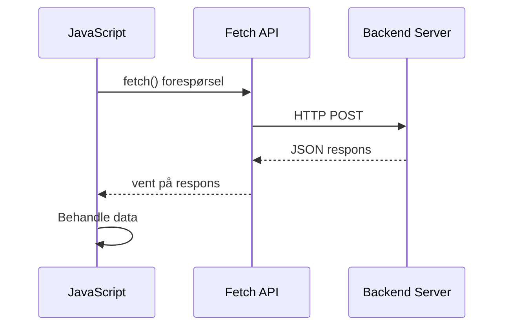
**Hva denne moderne implementeringen oppnår:**
- **Bruker** `async/await` for lesbar asynkron kode
- **Inkluderer** riktig feilhåndtering med try/catch-blokker
- **Sjekker** responsstatus før data behandles
- **Setter** passende headere for JSON-kommunikasjon
- **Gir** detaljerte feilmeldinger for feilsøking
- **Returnerer** konsekvent datastruktur for suksess- og feilsituasjoner

### Kraften i moderne Fetch API

**Fordeler med Fetch API over eldre metoder:**

| Funksjon | Fordel | Implementering |
|---------|---------|----------------|
| Promise-basert | Ren async-kode | `await fetch()` |
| Forespørsels-tilpasning | Full HTTP-kontroll | Headere, metoder, kropp |
| Responsbehandling | Fleksibel dataparsering | `.json()`, `.text()`, `.blob()` |
| Feilhåndtering | Omfattende feilfangst | Try/catch-blokker |

> 🎥 **Lær mer**: [Async/Await Tutorial](https://youtube.com/watch?v=YwmlRkrxvkk) – Forstå asynkrone JavaScript-mønstre for moderne webutvikling.

**Nøkkelkonsepter for serverkommunikasjon:**
- **Async-funksjoner** tillater pause i utførelse for å vente på serversvar
- **Await-nøkkelordet** gjør asynkron kode lesbar som synkron kode
- **Fetch API** gir moderne, promise-baserte HTTP-forespørsler
- **Feilhåndtering** sikrer at appen håndterer nettverksproblemer grasiøst

### Fullføre registreringsfunksjonen

La oss samle alt med en komplett, produksjonsklar registreringsfunksjon:

```javascript
async function register() {
  const registerForm = document.getElementById('registerForm');
  const submitButton = registerForm.querySelector('button[type="submit"]');
  
  try {
    // Vis lastetilstand
    submitButton.disabled = true;
    submitButton.textContent = 'Creating Account...';
    
    // Behandle skjema data
    const formData = new FormData(registerForm);
    const jsonData = JSON.stringify(Object.fromEntries(formData));
    
    // Send til server
    const result = await createAccount(jsonData);
    
    if (result.error) {
      console.error('Registration failed:', result.error);
      alert(`Registration failed: ${result.error}`);
      return;
    }
    
    console.log('Account created successfully!', result);
    alert(`Welcome, ${result.user}! Your account has been created.`);
    
    // Tilbakestill skjema etter vellykket registrering
    registerForm.reset();
    
  } catch (error) {
    console.error('Unexpected error:', error);
    alert('An unexpected error occurred. Please try again.');
  } finally {
    // Gjenopprett knappestatus
    submitButton.disabled = false;
    submitButton.textContent = 'Create Account';
  }
}
```

**Denne forbedrede implementeringen inkluderer:**
- **Gir** visuell tilbakemelding under skjema-innsending
- **Deaktiverer** sendeknappen for å forhindre doble innsendelser
- **Håndterer** både forventede og uventede feil på en god måte
- **Viser** brukervennlige suksess- og feilmeldinger
- **Tilbakestiller** skjemaet etter vellykket registrering
- **Gjenoppretter** UI-tilstand uansett utfall

### Teste implementeringen

**Åpne nettleserens utviklerverktøy og test registreringen:**

1. **Åpne** nettleserkonsollen (F12 → Konsoll-fanen)
2. **Fyll ut** registreringsskjemaet
3. **Klikk** "Opprett konto"
4. **Observer** konsollmeldinger og brukerfeedback

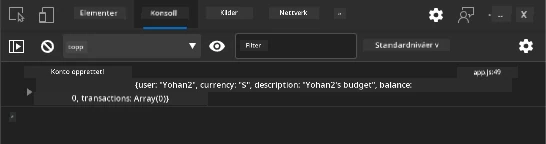

**Det du bør se:**
- **Lastetilstand** vises på sendeknappen
- **Konsolllogger** viser detaljerte opplysninger om prosessen
- **Suksessmelding** vises når kontoopprettelsen lykkes
- **Skjema tilbakestilles** automatisk etter vellykket innsending

> 🔒 **Sikkerhetsmerking**: For øyeblikket går data via HTTP, som ikke er sikkert for produksjon. I reelle applikasjoner må du alltid bruke HTTPS for kryptert datatransport. Lær mer om [HTTPS-sikkerhet](https://en.wikipedia.org/wiki/HTTPS) og hvorfor det er viktig for å beskytte brukerdata.

### 🔄 **Pedagogisk sjekkpunkt**
**Moderne JavaScript-integrasjon**: Verifiser din forståelse av asynkron formhåndtering:
- ✅ Hvordan endrer `event.preventDefault()` standard oppførsel i skjemaer?
- ✅ Hvorfor er FormData-APIen mer effektiv enn manuell feltinnsamling?
- ✅ Hvordan forbedrer async/await mønstrene lesbarheten i koden?
- ✅ Hvilken rolle spiller feilhåndtering i brukeropplevelsen?

**Systemarkitektur**: Din formhåndtering viser:
- **Hendelsesdrevet programmering**: Skjemaer reagerer på brukerhandlinger uten sideoppdatering
- **Asynkron kommunikasjon**: Serverforespørsler blokkerer ikke brukergrensesnittet
- **Feilhåndtering**: Grasiøs degradering når nettverksforespørsler feiler
- **Tilstandsbehandling**: UI oppdateres i tråd med serverens svar
- **Progressiv forbedring**: Grunnfunksjonalitet virker, JavaScript forbedrer opplevelsen

**Profesjonelle mønstre**: Du har implementert:
- **Enkeltansvar**: Funksjoner har klare, fokusert oppgaver
- **Feilgrenser**: Try/catch blokker forhindrer applikasjonskrasj
- **Brukerfeedback**: Lastetilstander og suksess-/feilmeldinger
- **Datatransformasjon**: FormData til JSON for serverkommunikasjon

## Omfattende formvalidering

Formvalidering forhindrer frustrasjonen med å oppdage feil først etter innsending. Som de mange redundante systemene på Den internasjonale romstasjonen, bruker effektiv validering flere lag med sikkerhetssjekker.

Den optimale tilnærmingen kombinerer validering i nettleser for umiddelbar tilbakemelding, JavaScript-validering for bedre brukeropplevelse, og servervalidering for sikkerhet og dataintegritet. Denne redundansen sikrer både brukerens tilfredshet og systemets beskyttelse.

### Forstå valideringslagene

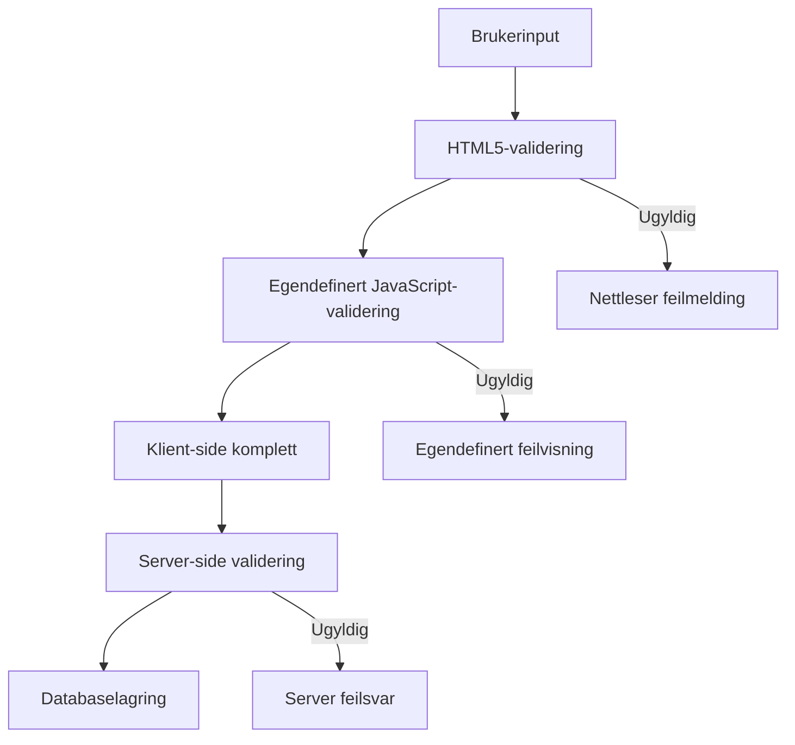
**Strategi med flere valideringslag:**
- **HTML5-validering**: Umiddelbare nettlesersjekker
- **JavaScript-validering**: Egne regler og brukeropplevelse
- **Servervalidering**: Endelig sikkerhet og dataintegritet
- **Progressiv forbedring**: Fungerer selv om JavaScript er deaktivert

### HTML5-valideringsattributter

**Moderne valideringsverktøy til din disposisjon:**

| Attributt | Formål | Eksempelbruk | Nettleseradferd |
|-----------|---------|---------------|------------------|
| `required` | Obligatoriske felt | `<input required>` | Forhindrer tom innsending |
| `minlength`/`maxlength` | Tekstlengdebegrensning | `<input maxlength="20">` | Håndhever tegnbegrensninger |
| `min`/`max` | Numeriske grenser | `<input min="0" max="1000">` | Validerer tallgrenser |
| `pattern` | Egne regex-regler | `<input pattern="[A-Za-z]+">` | Matcher spesifikke formater |
| `type` | Datatypvalidering | `<input type="email">` | Formatspesifikk validering |

### CSS-valideringsstil

**Lag visuell tilbakemelding for valideringstilstander:**

```css
/* Valid input styling */
input:valid {
  border-color: #28a745;
  background-color: #f8fff9;
}

/* Invalid input styling */
input:invalid {
  border-color: #dc3545;
  background-color: #fff5f5;
}

/* Focus states for better accessibility */
input:focus:valid {
  box-shadow: 0 0 0 0.2rem rgba(40, 167, 69, 0.25);
}

input:focus:invalid {
  box-shadow: 0 0 0 0.2rem rgba(220, 53, 69, 0.25);
}
```

**Hva disse visuelle indikatorene gjør:**
- **Grønne rammer**: Indikerer vellykket validering, som grønt lys ved kontrollsenter
- **Røde rammer**: Signalerer valideringsfeil som krever oppmerksomhet
- **Fokusmarkeringer**: Gir klar visuell kontekst for nåværende inputfelt
- **Konsistent stil**: Etablerer forutsigbare brukergrensesnittmønstre

> 💡 **Profftips**: Bruk CSS-pseudoklassene `:valid` og `:invalid` for å gi umiddelbar visuell tilbakemelding mens brukerne skriver, og skap et responsivt og hjelpsomt grensesnitt.

### Implementere omfattende validering

La oss forbedre registreringsskjemaet ditt med robust validering som gir utmerket brukeropplevelse og datakvalitet:

```html
<form id="registerForm" method="POST" novalidate>
  <div class="form-group">
    <label for="user">Username <span class="required">*</span></label>
    <input id="user" name="user" type="text" required 
           minlength="3" maxlength="20" 
           pattern="[a-zA-Z0-9_]+" 
           autocomplete="username"
           title="Username must be 3-20 characters, letters, numbers, and underscores only">
    <small class="form-text">Choose a unique username (3-20 characters)</small>
  </div>
  
  <div class="form-group">
    <label for="currency">Currency <span class="required">*</span></label>
    <input id="currency" name="currency" type="text" required 
           value="$" maxlength="3" 
           pattern="[A-Z$€£¥₹]+" 
           title="Enter a valid currency symbol or code">
    <small class="form-text">Currency symbol (e.g., $, €, £)</small>
  </div>
  
  <div class="form-group">
    <label for="description">Account Description</label>
    <input id="description" name="description" type="text" 
           maxlength="100" 
           placeholder="Personal savings, checking, etc.">
    <small class="form-text">Optional description (up to 100 characters)</small>
  </div>
  
  <div class="form-group">
    <label for="balance">Starting Balance</label>
    <input id="balance" name="balance" type="number" 
           value="0" min="0" step="0.01" 
           title="Enter a positive number for your starting balance">
    <small class="form-text">Initial account balance (minimum $0.00)</small>
  </div>
  
  <button type="submit">Create Account</button>
</form>
```

**Forstå den forbedrede valideringen:**
- **Kombinerer** obligatoriske felter med hjelpetekster
- **Inkluderer** `pattern`-attributter for formatvalidering
- **Gir** `title`-attributter for tilgjengelighet og verktøytips
- **Legger til** hjelpetekst for å veilede brukerinnputt
- **Bruker** semantisk HTML for bedre tilgjengelighet

### Avanserte valideringsregler

**Hva hver valideringsregel oppnår:**

| Felt | Valideringsregler | Brukerfordel |
|-------|------------------|--------------|
| Brukernavn | `required`, `minlength="3"`, `maxlength="20"`, `pattern="[a-zA-Z0-9_]+"` | Sikrer gyldige, unike identifikatorer |
| Valuta | `required`, `maxlength="3"`, `pattern="[A-Z$€£¥₹]+"` | Aksepterer vanlige valutasymboler |
| Saldo | `min="0"`, `step="0.01"`, `type="number"` | Forhindrer negative saldoer |
| Beskrivelse | `maxlength="100"` | Rimelige lengdebegrensninger |

### Teste valideringsatferd

**Prøv disse valideringsscenarioene:**
1. **Send inn** skjemaet med tomme obligatoriske felt
2. **Skriv inn** et brukernavn kortere enn 3 tegn
3. **Prøv** spesialtegn i brukernavnfeltet
4. **Skriv inn** et negativt saldo-beløp

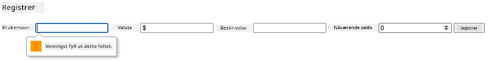

**Dette vil du observere:**
- **Nettleser viser** native valideringsmeldinger
- **Stilen endres** basert på `:valid` og `:invalid` tilstander
- **Skjemaet forhindres** fra innsending til alle valideringer er godkjent
- **Fokuset flyttes automatisk** til først ugyldige felt

### Klient- vs servervalidering

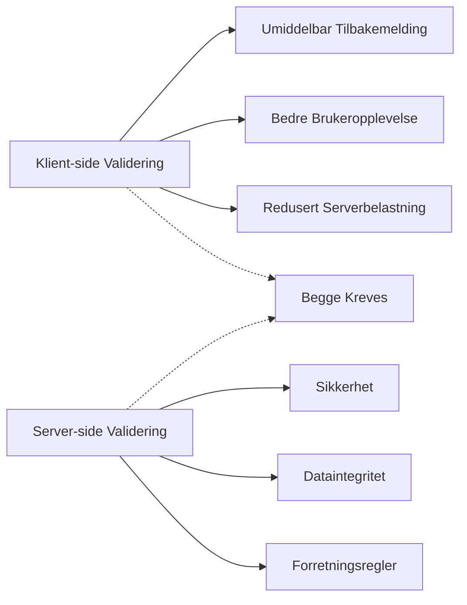
**Hvorfor du trenger begge lagene:**
- **Klientvalidering**: Gir umiddelbar tilbakemelding og forbedrer brukeropplevelsen
- **Servervalidering**: Sikrer sikkerhet og håndterer komplekse forretningsregler
- **Kombinert tilnærming**: Skaper robuste, brukervennlige og sikre applikasjoner
- **Progressiv forbedring**: Fungerer selv når JavaScript skrus av

> 🛡️ **Sikkerhetsminne**: Stol aldri bare på klientvalidering! Ondsinnede brukere kan omgå klientkontroller, så servervalidering er essensielt for sikkerhet og dataintegritet.

### ⚡ **Hva du kan gjøre på 5 minutter**
- [ ] Test skjemaet ditt med ugyldige data for å se valideringsmeldinger
- [ ] Prøv å sende inn skjemaet med JavaScript deaktivert og se HTML5-valideringen
- [ ] Åpne nettleserens DevTools og inspiser formdata som sendes til serveren
- [ ] Eksperimenter med ulike input-typer for å se endringer i mobiltastatur

### 🎯 **Hva du kan oppnå denne timen**
- [ ] Fullfør quiz etter leksjonen og forstå formhåndteringskonsepter
- [ ] Implementer den omfattende valideringsutfordringen med sanntidsfeedback
- [ ] Legg til CSS-styling for profesjonelt utseende skjemaer
- [ ] Lag feilhåndtering for dupliserte brukernavn og serverfeil
- [ ] Legg til passordbekreftelsesfelt med samsvarende validering

### 📅 **Din uke-lange reise til Skjema-Mester**
- [ ] Fullfør hele bankappen med avanserte formfunksjoner
- [ ] Implementer filopplastingsmuligheter for profilbilder eller dokumenter
- [ ] Legg til flerstegsforms med fremdriftsindikatorer og tilstandsadministrasjon
- [ ] Lag dynamiske skjemaer som tilpasser seg basert på brukervalg
- [ ] Implementer autosaving og gjenoppretting av skjema for bedre brukeropplevelse
- [ ] Legg til avansert validering som e-postverifisering og telefonnummerformatering

### 🌟 **Din måned-lange Frontend-utviklingsreise**
- [ ] Bygg komplekse formapplikasjoner med betinget logikk og arbeidsflyter
- [ ] Lær formbiblioteker og rammeverk for rask utvikling
- [ ] Mestre tilgjengelighetsretningslinjer og inkluderende designprinsipper
- [ ] Implementer internasjonalisering og lokalisering for globale skjemaer
- [ ] Lag gjenbrukbare formkomponentbiblioteker og designsystemer
- [ ] Bidra til open source formprosjekter og del beste praksis

## 🎯 Din tidslinje for skjema-utviklingsmester

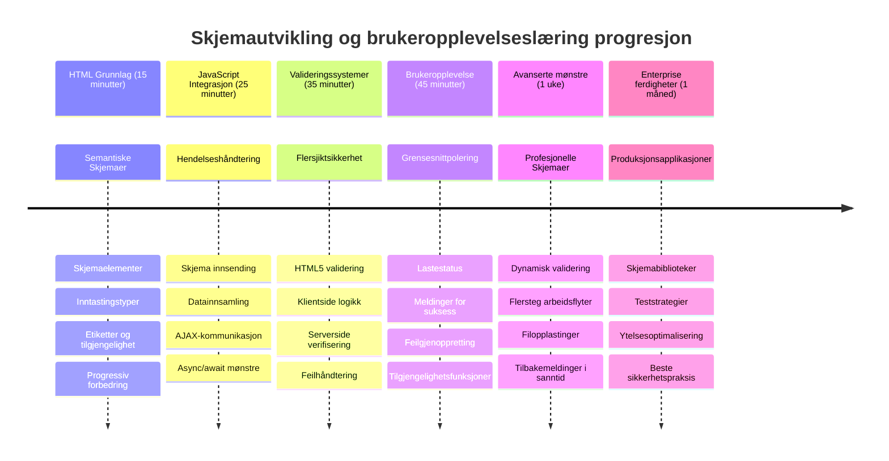
### 🛠️ Oppsummering av ditt skjema-utviklingsverktøy

Etter å ha fullført denne leksjonen, har du nå mestret:
- **HTML5-skjemaer**: Semantisk struktur, inputtyper og tilgjengelighetsfunksjoner
- **JavaScript-formhåndtering**: Hendelsesadministrasjon, datainnsamling og AJAX-kommunikasjon
- **Valideringsarkitektur**: Flere lag av validering for sikkerhet og brukeropplevelse
- **Asynkron programmering**: Moderne fetch API og async/await-mønstre
- **Feilhåndtering**: Omfattende feilbehandling og brukerfeedbacksystemer
- **Brukeropplevelsesdesign**: Lastetilstander, suksessmeldinger og feilinnhenting
- **Progressiv forbedring**: Skjemaer som fungerer på tvers av alle nettlesere og kapasiteter

**Virkelige bruksområder**: Skjemautviklingsferdighetene dine brukes direkte til:
- **E-handel**: Kasseprosesser, kontoregistrering og betalingsskjemaer
- **Bedriftsprogramvare**: Dataregistreringssystemer, rapporteringsgrensesnitt og arbeidsflyt-applikasjoner
- **Innholdshåndtering**: Publiseringsplattformer, bruker-generert innhold og administrative grensesnitt
- **Finansapplikasjoner**: Bankgrensesnitt, investeringsplattformer og transaksjonssystemer
- **Helsesystemer**: Pasientportaler, timebestillinger og medisinske journaler
- **Utdanningsplattformer**: Kursregistreringer, vurderingsverktøy og læringsadministrasjon

**Profesjonelle ferdigheter du har oppnådd**: Du kan nå:
- **Designe** tilgjengelige skjemaer som fungerer for alle brukere, inkludert de med funksjonsnedsettelser
- **Implementere** sikker formvalidering som forhindrer datakorrupsjon og sikkerhetshull
- **Skape** responsive brukergrensesnitt som gir tydelig tilbakemelding og veiledning
- **Feilsøke** komplekse forminteraksjoner med nettleserens utviklerverktøy og nettverksanalyse
- **Optimalisere** formytelse gjennom effektiv databehandling og valideringsstrategier

**Frontend-utviklingskonsepter du har mestret**:
- **Hendelsesdrevet arkitektur**: Håndtering av brukerinteraksjon og respons
- **Asynkron programmering**: Ikke-blokkerende serverkommunikasjon og feilhåndtering
- **Datavalidering**: Klient- og server-sikkerhets- og integritetskontroller
- **Brukeropplevelsesdesign**: Intuitive grensesnitt som veileder brukerne til suksess
- **Tilgjengelighetsinfrastruktur**: Inkluderende design som fungerer for mangfoldige brukerbehov

**Neste nivå**: Du er klar til å utforske avanserte formbiblioteker, implementere komplekse valideringsregler eller bygge datainnsamlingssystemer for bedriftsbruk!

🌟 **Prestasjon oppnådd**: Du har bygget et komplett system for formhåndtering med profesjonell validering, feilhåndtering og brukeropplevelsesmønstre!

---


---

## GitHub Copilot Agent Challenge 🚀

Bruk Agent-modus for å fullføre følgende utfordring:

**Beskrivelse:** Forbedre registreringsskjemaet med omfattende klient-side validering og brukerfeedback. Denne utfordringen hjelper deg å øve på formvalidering, feilhåndtering og forbedring av brukeropplevelse med interaktiv tilbakemelding.
**Prompt:** Lag et komplett valideringssystem for registreringsskjemaet som inkluderer: 1) Valideringsfeedback i sanntid for hvert felt mens brukeren skriver, 2) Egne valideringsmeldinger som vises under hvert inndatafelt, 3) Et passordbekreftelsesfelt med validering for samsvar, 4) Visuelle indikatorer (slik som grønne sjekkmerker for gyldige felt og røde varsler for ugyldige), 5) En send-knapp som kun aktiveres når alle valideringer er bestått. Bruk HTML5 valideringsattributter, CSS for styling av valideringstilstander, og JavaScript for interaktiv oppførsel.

Lær mer om [agent mode](https://code.visualstudio.com/blogs/2025/02/24/introducing-copilot-agent-mode) her.

## 🚀 Utfordring

Vis en feilmelding i HTML hvis brukeren allerede eksisterer.

Her er et eksempel på hvordan den endelige innloggingssiden kan se ut etter litt styling:

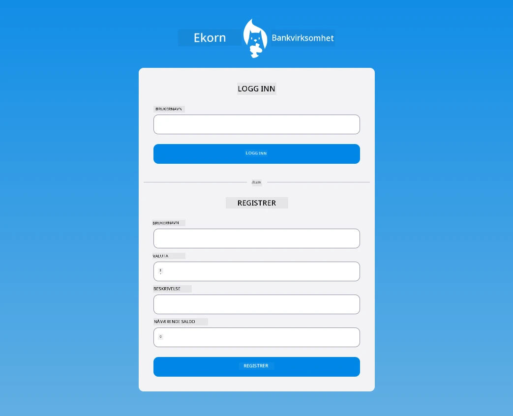

## Quiz etter forelesning

[Quiz etter forelesning](https://ff-quizzes.netlify.app/web/quiz/44)

## Gjennomgang & Selvstudium

Utviklere har blitt svært kreative når det gjelder bygging av skjemaer, spesielt rundt valideringsstrategier. Lær om forskjellige skjema flyter ved å bla gjennom [CodePen](https://codepen.com); kan du finne noen interessante og inspirerende skjemaer?

## Oppgave

[Stil din bank-app](assignment.md)

---

<!-- CO-OP TRANSLATOR DISCLAIMER START -->
**Ansvarsfraskrivelse**:
Dette dokumentet er oversatt ved hjelp av AI-oversettelsestjenesten [Co-op Translator](https://github.com/Azure/co-op-translator). Selv om vi streber etter nøyaktighet, vennligst vær oppmerksom på at automatiserte oversettelser kan inneholde feil eller unøyaktigheter. Det opprinnelige dokumentet på dets opprinnelige språk skal anses som den autoritative kilden. For kritisk informasjon anbefales profesjonell menneskelig oversettelse. Vi er ikke ansvarlige for eventuelle misforståelser eller feiltolkninger som følge av bruk av denne oversettelsen.
<!-- CO-OP TRANSLATOR DISCLAIMER END -->