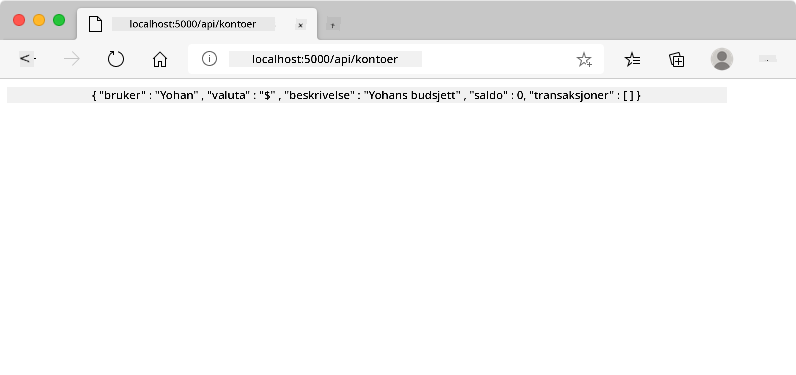
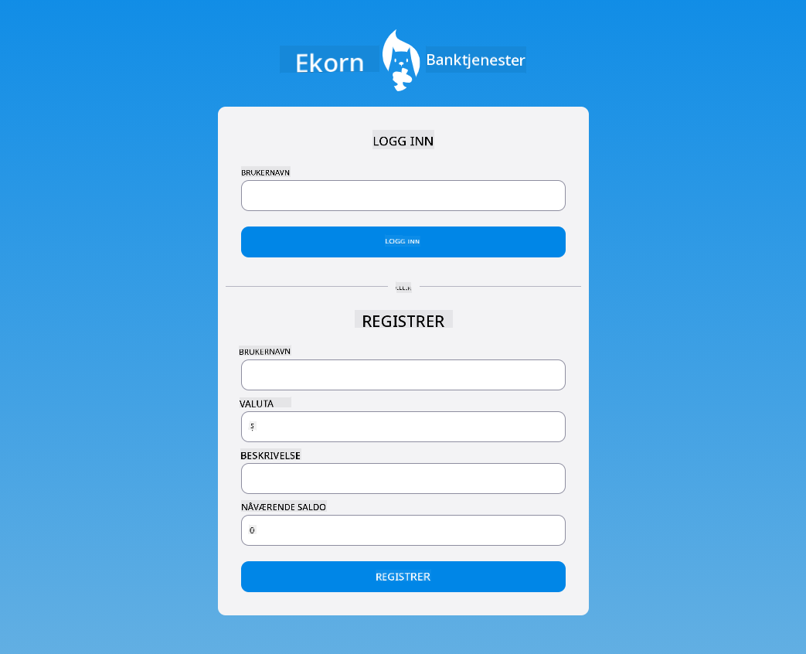

<!--
CO_OP_TRANSLATOR_METADATA:
{
  "original_hash": "b667b7d601e2ee19acb5aa9d102dc9f3",
  "translation_date": "2025-08-26T22:56:43+00:00",
  "source_file": "7-bank-project/2-forms/README.md",
  "language_code": "no"
}
-->
# Bygg en bankapp del 2: Lag et innloggings- og registreringsskjema

## Quiz før forelesning

[Quiz før forelesning](https://ff-quizzes.netlify.app/web/quiz/43)

### Introduksjon

I nesten alle moderne webapplikasjoner kan du opprette en konto for å få ditt eget private område. Siden flere brukere kan få tilgang til en webapplikasjon samtidig, trenger du en mekanisme for å lagre hver brukers personlige data separat og velge hvilken informasjon som skal vises. Vi vil ikke dekke hvordan man håndterer [brukeridentitet sikkert](https://en.wikipedia.org/wiki/Authentication), da det er et omfattende tema i seg selv, men vi vil sørge for at hver bruker kan opprette én (eller flere) bankkontoer i appen vår.

I denne delen skal vi bruke HTML-skjemaer for å legge til innlogging og registrering i webapplikasjonen vår. Vi skal se hvordan man sender data til en server-API programmert, og til slutt hvordan man definerer grunnleggende valideringsregler for brukerinput.

### Forutsetninger

Du må ha fullført [HTML-maler og ruting](../1-template-route/README.md) for webapplikasjonen i denne leksjonen. Du må også installere [Node.js](https://nodejs.org) og [kjøre server-API](../api/README.md) lokalt slik at du kan sende data for å opprette kontoer.

**Merk deg**
Du vil ha to terminaler som kjører samtidig, som beskrevet nedenfor:
1. For hovedbankappen vi bygde i leksjonen [HTML-maler og ruting](../1-template-route/README.md)
2. For [Bank APP server-API](../api/README.md) som vi nettopp satte opp ovenfor.

Du trenger begge serverne oppe og kjørende for å følge resten av leksjonen. De lytter på forskjellige porter (port `3000` og port `5000`), så alt bør fungere fint.

Du kan teste at serveren kjører riktig ved å utføre denne kommandoen i en terminal:

```sh
curl http://localhost:5000/api
# -> should return "Bank API v1.0.0" as a result
```

---

## Skjema og kontroller

`<form>`-elementet kapsler inn en del av et HTML-dokument der brukeren kan skrive inn og sende data med interaktive kontroller. Det finnes alle slags brukergrensesnittkontroller (UI) som kan brukes i et skjema, den vanligste er `<input>`- og `<button>`-elementene.

Det finnes mange forskjellige [typer](https://developer.mozilla.org/docs/Web/HTML/Element/input) av `<input>`. For eksempel, for å lage et felt der brukeren kan skrive inn brukernavnet sitt, kan du bruke:

```html
<input id="username" name="username" type="text">
```

`name`-attributtet vil bli brukt som egenskapsnavn når skjemadataene sendes. `id`-attributtet brukes til å knytte en `<label>` til skjemaelementet.

> Ta en titt på hele listen over [`<input>`-typer](https://developer.mozilla.org/docs/Web/HTML/Element/input) og [andre skjemaelementer](https://developer.mozilla.org/docs/Learn/Forms/Other_form_controls) for å få en idé om alle de innebygde UI-elementene du kan bruke når du bygger grensesnittet ditt.

✅ Merk at `<input>` er et [tomt element](https://developer.mozilla.org/docs/Glossary/Empty_element) som du *ikke* skal legge til en matchende avsluttende tag på. Du kan imidlertid bruke den selvlukkende `<input/>`-notasjonen, men det er ikke nødvendig.

`<button>`-elementet i et skjema er litt spesielt. Hvis du ikke spesifiserer `type`-attributtet, vil det automatisk sende skjemadataene til serveren når det trykkes. Her er de mulige `type`-verdiene:

- `submit`: Standard i et `<form>`, knappen utløser skjemaets sendingshandling.
- `reset`: Knappen tilbakestiller alle skjemaelementene til deres opprinnelige verdier.
- `button`: Tildeler ingen standardoppførsel når knappen trykkes. Du kan deretter tilordne egendefinerte handlinger til den ved hjelp av JavaScript.

### Oppgave

La oss starte med å legge til et skjema i `login`-malen. Vi trenger et *brukernavn*-felt og en *Logg inn*-knapp.

```html
<template id="login">
  <h1>Bank App</h1>
  <section>
    <h2>Login</h2>
    <form id="loginForm">
      <label for="username">Username</label>
      <input id="username" name="user" type="text">
      <button>Login</button>
    </form>
  </section>
</template>
```

Hvis du ser nærmere, kan du legge merke til at vi også la til et `<label>`-element her. `<label>`-elementer brukes til å legge til et navn til UI-kontroller, som vårt brukernavnfelt. Etiketter er viktige for lesbarheten av skjemaene dine, men har også ekstra fordeler:

- Ved å knytte en etikett til en skjemaelement hjelper det brukere som bruker hjelpemiddelteknologier (som skjermlesere) med å forstå hvilken data de forventes å oppgi.
- Du kan klikke på etiketten for å direkte sette fokus på det tilknyttede input-feltet, noe som gjør det enklere å nå på berøringsskjermbaserte enheter.

> [Tilgjengelighet](https://developer.mozilla.org/docs/Learn/Accessibility/What_is_accessibility) på nettet er et veldig viktig tema som ofte blir oversett. Takket være [semantiske HTML-elementer](https://developer.mozilla.org/docs/Learn/Accessibility/HTML) er det ikke vanskelig å lage tilgjengelig innhold hvis du bruker dem riktig. Du kan [lese mer om tilgjengelighet](https://developer.mozilla.org/docs/Web/Accessibility) for å unngå vanlige feil og bli en ansvarlig utvikler.

Nå skal vi legge til et andre skjema for registrering, rett under det forrige:

```html
<hr/>
<h2>Register</h2>
<form id="registerForm">
  <label for="user">Username</label>
  <input id="user" name="user" type="text">
  <label for="currency">Currency</label>
  <input id="currency" name="currency" type="text" value="$">
  <label for="description">Description</label>
  <input id="description" name="description" type="text">
  <label for="balance">Current balance</label>
  <input id="balance" name="balance" type="number" value="0">
  <button>Register</button>
</form>
```

Ved å bruke `value`-attributtet kan vi definere en standardverdi for et gitt input-felt. Legg også merke til at input-feltet for `balance` har typen `number`. Ser det annerledes ut enn de andre input-feltene? Prøv å interagere med det.

✅ Kan du navigere og interagere med skjemaene kun ved hjelp av tastaturet? Hvordan ville du gjort det?

## Sende data til serveren

Nå som vi har et funksjonelt brukergrensesnitt, er neste steg å sende dataene til serveren. La oss gjøre en rask test med vår nåværende kode: hva skjer hvis du klikker på *Logg inn*- eller *Registrer*-knappen?

La du merke til endringen i nettleserens URL-seksjon?


Standardhandlingen for et `<form>` er å sende skjemaet til den nåværende server-URL-en ved hjelp av [GET-metoden](https://www.w3.org/Protocols/rfc2616/rfc2616-sec9.html#sec9.3), og legge til skjemadataene direkte i URL-en. Denne metoden har noen begrensninger:

- Dataene som sendes er svært begrenset i størrelse (omtrent 2000 tegn)
- Dataene er direkte synlige i URL-en (ikke ideelt for passord)
- Den fungerer ikke med filopplastinger

Derfor kan du endre det til å bruke [POST-metoden](https://www.w3.org/Protocols/rfc2616/rfc2616-sec9.html#sec9.5), som sender skjemadataene til serveren i HTTP-forespørselens kropp, uten noen av de tidligere begrensningene.

> Selv om POST er den mest brukte metoden for å sende data, [i noen spesifikke scenarier](https://www.w3.org/2001/tag/doc/whenToUseGet.html) er det bedre å bruke GET-metoden, for eksempel når du implementerer et søkefelt.

### Oppgave

Legg til `action`- og `method`-egenskaper til registreringsskjemaet:

```html
<form id="registerForm" action="//localhost:5000/api/accounts" method="POST">
```

Prøv nå å registrere en ny konto med navnet ditt. Etter å ha klikket på *Registrer*-knappen, bør du se noe som dette:



Hvis alt går bra, bør serveren svare på forespørselen din med en [JSON](https://www.json.org/json-en.html)-respons som inneholder kontodataene som ble opprettet.

✅ Prøv å registrere deg igjen med samme navn. Hva skjer?

## Sende data uten å laste siden på nytt

Som du sikkert la merke til, er det et lite problem med tilnærmingen vi nettopp brukte: når skjemaet sendes, forlater vi appen vår, og nettleseren omdirigerer til serverens URL. Vi prøver å unngå alle sideoppdateringer med webapplikasjonen vår, siden vi lager en [Single-page application (SPA)](https://en.wikipedia.org/wiki/Single-page_application).

For å sende skjemadataene til serveren uten å tvinge en sideoppdatering, må vi bruke JavaScript-kode. I stedet for å sette en URL i `action`-egenskapen til et `<form>`-element, kan du bruke hvilken som helst JavaScript-kode med prefikset `javascript:` for å utføre en egendefinert handling. Ved å bruke dette betyr det også at du må implementere noen oppgaver som tidligere ble gjort automatisk av nettleseren:

- Hente skjemadataene
- Konvertere og kode skjemadataene til et passende format
- Opprette HTTP-forespørselen og sende den til serveren

### Oppgave

Erstatt registreringsskjemaets `action` med:

```html
<form id="registerForm" action="javascript:register()">
```

Åpne `app.js` og legg til en ny funksjon kalt `register`:

```js
function register() {
  const registerForm = document.getElementById('registerForm');
  const formData = new FormData(registerForm);
  const data = Object.fromEntries(formData);
  const jsonData = JSON.stringify(data);
}
```

Her henter vi skjemaelementet ved hjelp av `getElementById()` og bruker [`FormData`](https://developer.mozilla.org/docs/Web/API/FormData)-hjelperen for å trekke ut verdiene fra skjemaelementene som et sett med nøkkel/verdi-par. Deretter konverterer vi dataene til et vanlig objekt ved hjelp av [`Object.fromEntries()`](https://developer.mozilla.org/docs/Web/JavaScript/Reference/Global_Objects/Object/fromEntries) og til slutt serialiserer dataene til [JSON](https://www.json.org/json-en.html), et format som ofte brukes for datautveksling på nettet.

Dataene er nå klare til å sendes til serveren. Opprett en ny funksjon kalt `createAccount`:

```js
async function createAccount(account) {
  try {
    const response = await fetch('//localhost:5000/api/accounts', {
      method: 'POST',
      headers: { 'Content-Type': 'application/json' },
      body: account
    });
    return await response.json();
  } catch (error) {
    return { error: error.message || 'Unknown error' };
  }
}
```

Hva gjør denne funksjonen? Først, legg merke til `async`-nøkkelordet her. Dette betyr at funksjonen inneholder kode som vil utføres [**asynkront**](https://developer.mozilla.org/docs/Web/JavaScript/Reference/Statements/async_function). Når det brukes sammen med `await`-nøkkelordet, lar det oss vente på at asynkron kode skal utføres - som å vente på serverresponsen her - før vi fortsetter.

Her er en kort video om bruk av `async/await`:

[](https://youtube.com/watch?v=YwmlRkrxvkk "Async og Await for håndtering av løfter")

> 🎥 Klikk på bildet ovenfor for en video om async/await.

Vi bruker `fetch()`-API-et for å sende JSON-data til serveren. Denne metoden tar 2 parametere:

- URL-en til serveren, så vi setter tilbake `//localhost:5000/api/accounts` her.
- Innstillingene for forespørselen. Det er her vi setter metoden til `POST` og gir `body` for forespørselen. Siden vi sender JSON-data til serveren, må vi også sette `Content-Type`-headeren til `application/json` slik at serveren vet hvordan den skal tolke innholdet.

Siden serveren vil svare på forespørselen med JSON, kan vi bruke `await response.json()` for å analysere JSON-innholdet og returnere det resulterende objektet. Merk at denne metoden er asynkron, så vi bruker `await`-nøkkelordet her før vi returnerer for å sikre at eventuelle feil under analysen også fanges opp.

Legg nå til litt kode i `register`-funksjonen for å kalle `createAccount()`:

```js
const result = await createAccount(jsonData);
```

Siden vi bruker `await`-nøkkelordet her, må vi legge til `async`-nøkkelordet før register-funksjonen:

```js
async function register() {
```

Til slutt, la oss legge til noen logger for å sjekke resultatet. Den endelige funksjonen bør se slik ut:

```js
async function register() {
  const registerForm = document.getElementById('registerForm');
  const formData = new FormData(registerForm);
  const jsonData = JSON.stringify(Object.fromEntries(formData));
  const result = await createAccount(jsonData);

  if (result.error) {
    return console.log('An error occurred:', result.error);
  }

  console.log('Account created!', result);
}
```

Det var litt langt, men vi kom dit! Hvis du åpner [nettleserens utviklerverktøy](https://developer.mozilla.org/docs/Learn/Common_questions/What_are_browser_developer_tools) og prøver å registrere en ny konto, bør du ikke se noen endring på nettsiden, men en melding vil vises i konsollen som bekrefter at alt fungerer.


✅ Tror du dataene sendes til serveren sikkert? Hva om noen klarte å avskjære forespørselen? Du kan lese om [HTTPS](https://en.wikipedia.org/wiki/HTTPS) for å lære mer om sikker datakommunikasjon.

## Datavalidering

Hvis du prøver å registrere en ny konto uten å sette et brukernavn først, kan du se at serveren returnerer en feil med statuskode [400 (Bad Request)](https://developer.mozilla.org/docs/Web/HTTP/Status/400#:~:text=The%20HyperText%20Transfer%20Protocol%20(HTTP,%2C%20or%20deceptive%20request%20routing).).

Før du sender data til en server, er det en god praksis å [validere skjemadataene](https://developer.mozilla.org/docs/Learn/Forms/Form_validation) på forhånd når det er mulig, for å sikre at du sender en gyldig forespørsel. HTML5-skjemaelementer gir innebygd validering ved hjelp av ulike attributter:

- `required`: feltet må fylles ut, ellers kan ikke skjemaet sendes.
- `minlength` og `maxlength`: definerer minimum og maksimum antall tegn i tekstfelt.
- `min` og `max`: definerer minimum og maksimum verdi for et numerisk felt.
- `type`: definerer hvilken type data som forventes, som `number`, `email`, `file` eller [andre innebygde typer](https://developer.mozilla.org/docs/Web/HTML/Element/input). Dette attributtet kan også endre den visuelle gjengivelsen av skjemaelementet.
- `pattern`: lar deg definere et [regulært uttrykk](https://developer.mozilla.org/docs/Web/JavaScript/Guide/Regular_Expressions)-mønster for å teste om de oppgitte dataene er gyldige eller ikke.
> Tips: Du kan tilpasse utseendet til skjemaelementene dine avhengig av om de er gyldige eller ikke ved å bruke CSS-pseudoklassene `:valid` og `:invalid`.
### Oppgave

Det er to obligatoriske felt for å opprette en gyldig ny konto: brukernavn og valuta. De andre feltene er valgfrie. Oppdater HTML-skjemaet ved å bruke både `required`-attributtet og tekst i feltets etikett slik at:

```html
<label for="user">Username (required)</label>
<input id="user" name="user" type="text" required>
...
<label for="currency">Currency (required)</label>
<input id="currency" name="currency" type="text" value="$" required>
```

Selv om denne spesifikke serverimplementasjonen ikke håndhever spesifikke grenser for maksimal lengde på feltene, er det alltid en god praksis å definere rimelige grenser for tekstinnskriving fra brukeren.

Legg til et `maxlength`-attributt i tekstfeltene:

```html
<input id="user" name="user" type="text" maxlength="20" required>
...
<input id="currency" name="currency" type="text" value="$" maxlength="5" required>
...
<input id="description" name="description" type="text" maxlength="100">
```

Nå, hvis du trykker på *Registrer* og et felt ikke oppfyller en valideringsregel vi har definert, vil du se noe som dette:


Validering som dette, utført *før* data sendes til serveren, kalles **klientsidevalidering**. Men merk at det ikke alltid er mulig å utføre alle sjekker uten å sende data. For eksempel kan vi ikke her sjekke om en konto allerede eksisterer med samme brukernavn uten å sende en forespørsel til serveren. Ytterligere validering utført på serveren kalles **serversidevalidering**.

Vanligvis må begge implementeres, og mens bruk av klientsidevalidering forbedrer brukeropplevelsen ved å gi umiddelbar tilbakemelding til brukeren, er serversidevalidering avgjørende for å sikre at brukerdataene du håndterer er pålitelige og sikre.

---

## 🚀 Utfordring

Vis en feilmelding i HTML hvis brukeren allerede eksisterer.

Her er et eksempel på hvordan den endelige innloggingssiden kan se ut etter litt styling:



## Quiz etter forelesning

[Quiz etter forelesning](https://ff-quizzes.netlify.app/web/quiz/44)

## Gjennomgang og selvstudie

Utviklere har blitt svært kreative når det gjelder å bygge skjemaer, spesielt med tanke på valideringsstrategier. Lær om ulike skjemaoppsett ved å se gjennom [CodePen](https://codepen.com); kan du finne noen interessante og inspirerende skjemaer?

## Oppgave

[Style din bankapp](assignment.md)

---

**Ansvarsfraskrivelse**:  
Dette dokumentet er oversatt ved hjelp av AI-oversettelsestjenesten [Co-op Translator](https://github.com/Azure/co-op-translator). Selv om vi streber etter nøyaktighet, vær oppmerksom på at automatiserte oversettelser kan inneholde feil eller unøyaktigheter. Det originale dokumentet på sitt opprinnelige språk bør anses som den autoritative kilden. For kritisk informasjon anbefales profesjonell menneskelig oversettelse. Vi er ikke ansvarlige for misforståelser eller feiltolkninger som oppstår ved bruk av denne oversettelsen.