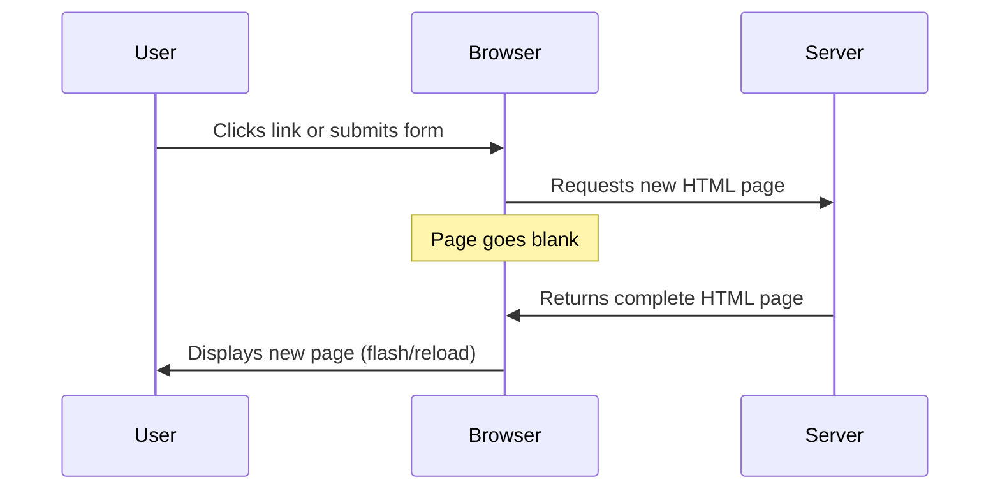
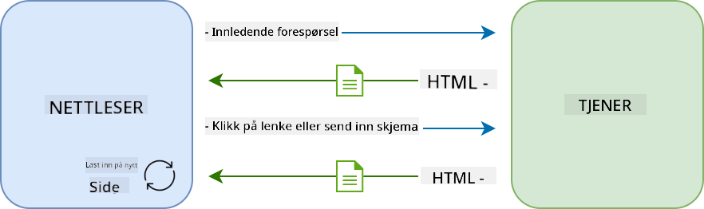
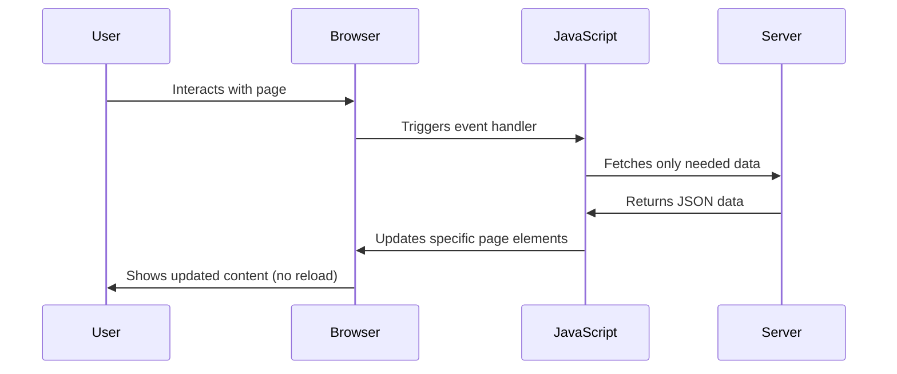
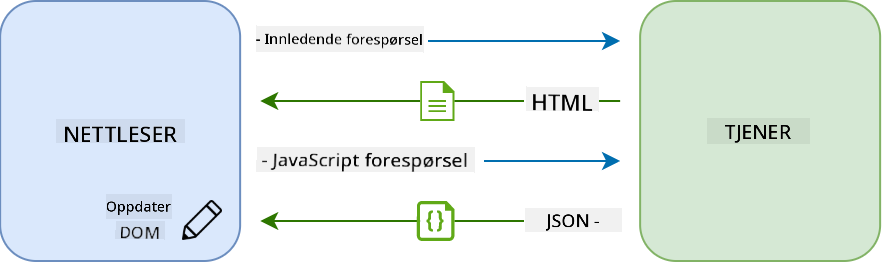
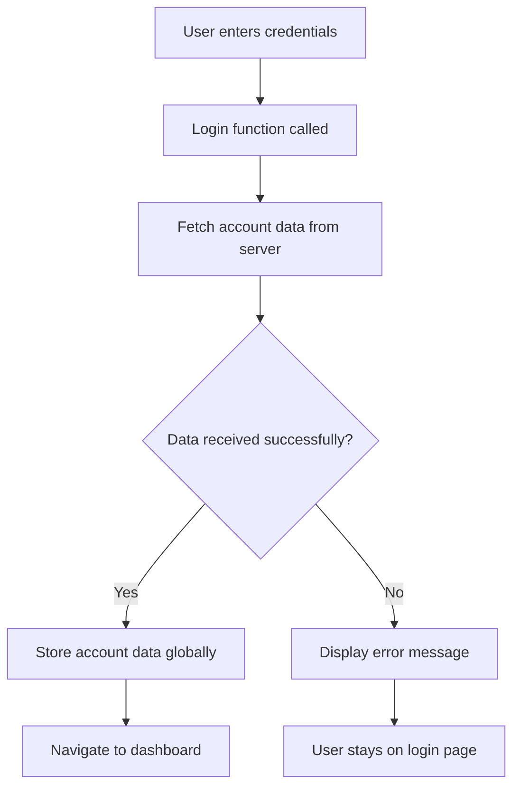
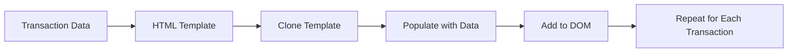

<!--
CO_OP_TRANSLATOR_METADATA:
{
  "original_hash": "2c1164912414820c8efd699b43f64954",
  "translation_date": "2025-10-23T22:30:56+00:00",
  "source_file": "7-bank-project/3-data/README.md",
  "language_code": "no"
}
-->
# Bygg en bankapp del 3: Metoder for henting og bruk av data

Tenk på Enterprise-datamaskinen i Star Trek – når kaptein Picard spør om skipets status, vises informasjonen umiddelbart uten at hele grensesnittet må lukkes og bygges opp på nytt. Den sømløse informasjonsflyten er akkurat det vi skal bygge her med dynamisk datahenting.

Akkurat nå er bankappen din som en trykt avis – informativ, men statisk. Vi skal forvandle den til noe mer som NASAs kontrollsenter, der data flyter kontinuerlig og oppdateres i sanntid uten å avbryte brukerens arbeidsflyt.

Du vil lære hvordan du kommuniserer med servere asynkront, håndterer data som ankommer til forskjellige tider, og transformerer rå informasjon til noe meningsfullt for brukerne dine. Dette er forskjellen mellom en demo og programvare som er klar for produksjon.

## Quiz før forelesning

[Quiz før forelesning](https://ff-quizzes.netlify.app/web/quiz/45)

### Forutsetninger

Før du dykker inn i datahenting, sørg for at du har disse komponentene klare:

- **Forrige leksjon**: Fullfør [Innloggings- og registreringsskjemaet](../2-forms/README.md) – vi bygger videre på dette grunnlaget
- **Lokal server**: Installer [Node.js](https://nodejs.org) og [kjør server-API](../api/README.md) for å levere kontodata
- **API-tilkobling**: Test servertilkoblingen din med denne kommandoen:

```bash
curl http://localhost:5000/api
# Expected response: "Bank API v1.0.0"
```

Denne raske testen sikrer at alle komponenter kommuniserer riktig:
- Bekrefter at Node.js kjører som det skal på systemet ditt
- Bekrefter at API-serveren din er aktiv og svarer
- Validerer at appen din kan nå serveren (som å sjekke radiokontakt før en oppdrag)

---

## Forstå datahenting i moderne webapplikasjoner

Måten webapplikasjoner håndterer data på har utviklet seg dramatisk de siste to tiårene. Å forstå denne utviklingen vil hjelpe deg å sette pris på hvorfor moderne teknikker som AJAX og Fetch API er så kraftige og hvorfor de har blitt essensielle verktøy for webutviklere.

La oss utforske hvordan tradisjonelle nettsteder fungerte sammenlignet med de dynamiske, responsive applikasjonene vi bygger i dag.

### Tradisjonelle fler-sides applikasjoner (MPA)

I internettets tidlige dager var hvert klikk som å skifte kanal på en gammel TV – skjermen ble blank, og deretter kom det nye innholdet sakte frem. Dette var realiteten for tidlige webapplikasjoner, der hver interaksjon betydde at hele siden måtte bygges opp på nytt fra bunnen av.





**Hvorfor denne tilnærmingen føltes klønete:**
- Hvert klikk betydde at hele siden måtte bygges opp på nytt
- Brukere ble avbrutt midt i tanken av irriterende sideblinker
- Internettforbindelsen din jobbet overtid med å laste ned den samme topp- og bunnteksten gjentatte ganger
- Apper føltes mer som å bla gjennom et arkivskap enn å bruke programvare

### Moderne én-sides applikasjoner (SPA)

AJAX (Asynchronous JavaScript and XML) endret dette paradigmet fullstendig. Som den modulære designen til den internasjonale romstasjonen, der astronauter kan bytte ut individuelle komponenter uten å bygge hele strukturen på nytt, lar AJAX oss oppdatere spesifikke deler av en nettside uten å laste alt på nytt. Selv om navnet nevner XML, bruker vi stort sett JSON i dag, men hovedprinsippet er det samme: oppdater bare det som trenger å endres.





**Hvorfor SPAs føles så mye bedre:**
- Bare de delene som faktisk endres blir oppdatert (smart, ikke sant?)
- Ingen flere brå avbrytelser – brukerne dine holder seg i flyten
- Mindre data som sendes over nettet betyr raskere lasting
- Alt føles raskt og responsivt, som appene på telefonen din

### Utviklingen til moderne Fetch API

Moderne nettlesere tilbyr [`Fetch` API](https://developer.mozilla.org/docs/Web/API/Fetch_API), som erstatter den eldre [`XMLHttpRequest`](https://developer.mozilla.org/docs/Web/API/XMLHttpRequest/Using_XMLHttpRequest). Som forskjellen mellom å bruke en telegraf og e-post, bruker Fetch API løfter for renere asynkron kode og håndterer JSON naturlig.

| Funksjon | XMLHttpRequest | Fetch API |
|----------|----------------|-----------|
| **Syntaks** | Kompleks callback-basert | Ren promise-basert |
| **JSON-håndtering** | Krever manuell parsing | Innebygd `.json()`-metode |
| **Feilhåndtering** | Begrenset feilinformasjons | Omfattende feildetaljer |
| **Moderne støtte** | Kompatibilitet med eldre systemer | ES6+ løfter og async/await |

> 💡 **Nettleserkompatibilitet**: Gode nyheter – Fetch API fungerer i alle moderne nettlesere! Hvis du er nysgjerrig på spesifikke versjoner, har [caniuse.com](https://caniuse.com/fetch) hele kompatibilitetshistorien.
> 
**Konklusjon:**
- Fungerer utmerket i Chrome, Firefox, Safari og Edge (i utgangspunktet overalt hvor brukerne dine er)
- Bare Internet Explorer trenger ekstra hjelp (og ærlig talt, det er på tide å gi slipp på IE)
- Setter deg perfekt opp for de elegante async/await-mønstrene vi skal bruke senere

### Implementering av brukerinnlogging og datahenting

La oss nå implementere innloggingssystemet som forvandler bankappen din fra en statisk visning til en funksjonell applikasjon. Som autentiseringsprotokollene som brukes i sikre militæranlegg, vil vi verifisere brukerens legitimasjon og deretter gi tilgang til deres spesifikke data.

Vi bygger dette trinnvis, med start i grunnleggende autentisering og deretter legge til datahentingsfunksjoner.

#### Trinn 1: Lag grunnlaget for innloggingsfunksjonen

Åpne `app.js`-filen din og legg til en ny `login`-funksjon. Denne vil håndtere brukerens autentiseringsprosess:

```javascript
async function login() {
  const loginForm = document.getElementById('loginForm');
  const user = loginForm.user.value;
}
```

**La oss bryte dette ned:**
- Det `async` nøkkelordet? Det forteller JavaScript "hei, denne funksjonen kan trenge å vente på ting"
- Vi henter skjemaet vårt fra siden (ikke noe fancy, bare finner det ved hjelp av ID-en)
- Deretter henter vi det brukeren har skrevet inn som brukernavn
- Her er et smart triks: du kan få tilgang til alle skjemaelementer via `name`-attributtet – ingen grunn til å bruke ekstra getElementById-kall!

> 💡 **Mønster for skjema-tilgang**: Hvert skjemaelement kan nås via navnet (satt i HTML med `name`-attributtet) som en egenskap av skjemaelementet. Dette gir en ren og lesbar måte å hente skjema-data på.

#### Trinn 2: Lag en funksjon for henting av kontodata

Neste steg er å lage en dedikert funksjon for å hente kontodata fra serveren. Dette følger samme mønster som registreringsfunksjonen din, men fokuserer på datahenting:

```javascript
async function getAccount(user) {
  try {
    const response = await fetch('//localhost:5000/api/accounts/' + encodeURIComponent(user));
    return await response.json();
  } catch (error) {
    return { error: error.message || 'Unknown error' };
  }
}
```

**Dette oppnår koden:**
- **Bruker** det moderne `fetch` API for å be om data asynkront
- **Konstruerer** en GET-forespørsel med brukernavnparameter
- **Bruker** `encodeURIComponent()` for å håndtere spesialtegn i URL-er på en sikker måte
- **Konverterer** responsen til JSON-format for enkel datamanipulasjon
- **Håndterer** feil på en ryddig måte ved å returnere et feilobjekt i stedet for å krasje

> ⚠️ **Sikkerhetsnotat**: `encodeURIComponent()`-funksjonen håndterer spesialtegn i URL-er. Som kodingssystemene som brukes i militær kommunikasjon, sikrer den at meldingen din kommer frem akkurat som den skal, og hindrer tegn som "#" eller "&" fra å bli feiltolket.
> 
**Hvorfor dette er viktig:**
- Hindrer spesialtegn fra å ødelegge URL-er
- Beskytter mot angrep som manipulerer URL-er
- Sikrer at serveren mottar de tiltenkte dataene
- Følger sikre kodingspraksiser

#### Forstå HTTP GET-forespørsler

Her er noe som kanskje overrasker deg: når du bruker `fetch` uten ekstra alternativer, oppretter den automatisk en [`GET`](https://developer.mozilla.org/docs/Web/HTTP/Methods/GET)-forespørsel. Dette er perfekt for det vi gjør – spør serveren "hei, kan jeg se denne brukerens kontodata?"

Tenk på GET-forespørsler som å høflig be om å låne en bok fra biblioteket – du ber om å se noe som allerede eksisterer. POST-forespørsler (som vi brukte for registrering) er mer som å sende inn en ny bok for å bli lagt til i samlingen.

| GET-forespørsel | POST-forespørsel |
|-----------------|------------------|
| **Formål** | Hente eksisterende data | Sende nye data til serveren |
| **Parametere** | I URL-sti/spørringsstreng | I forespørselens kropp |
| **Caching** | Kan caches av nettlesere | Ikke typisk cached |
| **Sikkerhet** | Synlig i URL/logg | Skjult i forespørselens kropp |

#### Trinn 3: Sette alt sammen

Nå til den tilfredsstillende delen – la oss koble kontohentingsfunksjonen din til innloggingsprosessen. Dette er der alt faller på plass:

```javascript
async function login() {
  const loginForm = document.getElementById('loginForm');
  const user = loginForm.user.value;
  const data = await getAccount(user);

  if (data.error) {
    return console.log('loginError', data.error);
  }

  account = data;
  navigate('/dashboard');
}
```

Denne funksjonen følger en klar sekvens:
- Henter brukernavnet fra skjemaets input
- Ber om brukerens kontodata fra serveren
- Håndterer eventuelle feil som oppstår under prosessen
- Lagrer kontodataene og navigerer til dashbordet ved suksess

> 🎯 **Async/Await-mønster**: Siden `getAccount` er en asynkron funksjon, bruker vi nøkkelordet `await` for å pause utførelsen til serveren svarer. Dette hindrer koden fra å fortsette med udefinerte data.

#### Trinn 4: Lag et sted for dataene dine

Appen din trenger et sted å huske kontoinformasjonen når den er lastet. Tenk på dette som appens korttidsminne – et sted å holde den nåværende brukerens data tilgjengelig. Legg til denne linjen øverst i `app.js`-filen din:

```javascript
// This holds the current user's account data
let account = null;
```

**Hvorfor vi trenger dette:**
- Holder kontodataene tilgjengelige fra hvor som helst i appen din
- Å starte med `null` betyr "ingen er logget inn ennå"
- Oppdateres når noen logger inn eller registrerer seg
- Fungerer som en enkelt sannhetskilde – ingen forvirring om hvem som er logget inn

#### Trinn 5: Koble skjemaet ditt

La oss nå koble den nye innloggingsfunksjonen din til HTML-skjemaet. Oppdater skjema-taggen din slik:

```html
<form id="loginForm" action="javascript:login()">
  <!-- Your existing form inputs -->
</form>
```

**Hva denne lille endringen gjør:**
- Stopper skjemaet fra å gjøre sin standard "last hele siden på nytt"-oppførsel
- Kaller din tilpassede JavaScript-funksjon i stedet
- Holder alt jevnt og én-sides-app-lignende
- Gir deg full kontroll over hva som skjer når brukere trykker på "Logg inn"

#### Trinn 6: Forbedre registreringsfunksjonen din

For konsistens, oppdater `register`-funksjonen din til også å lagre kontodata og navigere til dashbordet:

```javascript
// Add these lines at the end of your register function
account = result;
navigate('/dashboard');
```

**Denne forbedringen gir:**
- **Sømløs** overgang fra registrering til dashbord
- **Konsekvent** brukeropplevelse mellom innlogging og registreringsflyt
- **Umiddelbar** tilgang til kontodata etter vellykket registrering

#### Testing av implementeringen



**Tid for å teste:**
1. Opprett en ny konto for å sikre at alt fungerer
2. Prøv å logge inn med de samme legitimasjonene
3. Sjekk nettleserens konsoll (F12) hvis noe virker galt
4. Sørg for at du lander på dashbordet etter en vellykket innlogging

Hvis noe ikke fungerer, ikke få panikk! De fleste problemer er enkle å fikse, som skrivefeil eller å glemme å starte API-serveren.

#### Et raskt ord om Cross-Origin magi

Du lurer kanskje: "Hvordan snakker webappen min med denne API-serveren når de kjører på forskjellige porter?" Godt spørsmål! Dette berører noe som enhver webutvikler før eller siden møter.

> 🔒 **Cross-Origin Security**: Nettlesere håndhever en "same-origin policy" for å forhindre uautorisert kommunikasjon mellom forskjellige domener. Som kontrollsystemet ved Pentagon, verifiserer de at kommunikasjonen er autorisert før dataoverføring tillates.
> 
**I vår oppsett:**
- Webappen din kjører på `localhost:3000` (utviklingsserver)
- API-serveren din kjører på `localhost:5000` (backend-server)
- API-serveren inkluderer [CORS-headere](https://developer.mozilla.org/docs/Web/HTTP/CORS) som eksplisitt autoriserer kommunikasjon fra webappen din

Denne konfigurasjonen speiler virkelige utviklingsmiljøer der frontend- og backend-applikasjoner vanligvis kjører på separate servere.

> 📚 **Lær mer**: Utforsk API-er og datahenting mer inngående med dette omfattende [Microsoft Learn-modulet om API-er](https://docs.microsoft.com/learn/modules/use-apis-discover-museum-art/?WT.mc_id=academic-77807-sagibbon).

## Gjør dataene dine levende i HTML

Nå skal vi gjøre de hentede dataene synlige for brukerne gjennom DOM-manipulasjon. Som prosessen med å fremkalle fotografier i et mørkerom, tar vi usynlige data og gjengir dem til noe brukerne kan se og samhandle med.

DOM-manipulasjon er teknikken som forvandler statiske nettsider til dynamiske applikasjoner som oppdaterer innholdet basert på brukerinteraksjoner og serverresponser.

### Velge riktig verktøy for jobben

Når det gjelder å oppdatere HTML med JavaScript, har du flere alternativer. Tenk på disse som forskjellige verktøy i en verktøykasse – hver av dem er perfekt for spesifikke oppgaver:

| Metode | Hva den er bra for | Når du skal bruke den | Sikkerhetsnivå |
|--------|--------------------|-----------------------|----------------|
| `textContent` | Vise brukerdata på en sikker måte | Når du viser tekst | ✅ Svært sikker |
| `createElement()` + `append()` | Bygge komplekse oppsett | Lage nye seksjoner/lister | ✅ Svært sikker |
| `innerHTML` | Sette HTML-innhold | ⚠️ Prøv å unngå denne | ❌ Risikabelt |

#### Den sikre måten å vise tekst: textContent

[`textContent`](https://developer.mozilla.org/docs/Web/API/Node/textContent)-egenskapen er din beste venn når du viser brukerdata. Det er som å ha en dørvakt for nettsiden din – ingenting skadelig slipper gjennom:

```javascript
// The safe, reliable way to update text
const balanceElement = document.getElementById('balance');
balanceElement.textContent = account.balance;
```

**Fordeler med textContent:**
- Behandler alt som ren tekst (hindrer skriptutførelse)
- Tømmer automatisk eksisterende innhold
- Effektiv for enkle tekstoppdateringer
- Gir innebygd sikkerhet mot skadelig innhold

#### Lage dynamiske HTML-elementer
For mer kompleks innhold, kombiner [`document.createElement()`](https://developer.mozilla.org/docs/Web/API/Document/createElement) med metoden [`append()`](https://developer.mozilla.org/docs/Web/API/ParentNode/append):

```javascript
// Safe way to create new elements
const transactionItem = document.createElement('div');
transactionItem.className = 'transaction-item';
transactionItem.textContent = `${transaction.date}: ${transaction.description}`;
container.append(transactionItem);
```

**Forstå denne tilnærmingen:**
- **Oppretter** nye DOM-elementer programmatisk
- **Gir** full kontroll over elementattributter og innhold
- **Tillater** komplekse, nestede elementstrukturer
- **Bevarer** sikkerheten ved å skille struktur fra innhold

> ⚠️ **Sikkerhetsbetraktning**: Selv om [`innerHTML`](https://developer.mozilla.org/docs/Web/API/Element/innerHTML) ofte vises i mange opplæringsguider, kan det utføre innebygde skript. Akkurat som sikkerhetsprotokollene på CERN som forhindrer uautorisert kodeutførelse, gir bruk av `textContent` og `createElement` sikrere alternativer.
> 
**Risiko ved innerHTML:**
- Utfører eventuelle `<script>`-tagger i brukerdata
- Sårbar for kodeinjeksjonsangrep
- Skaper potensielle sikkerhetsproblemer
- De sikrere alternativene vi bruker gir tilsvarende funksjonalitet

### Gjøre feil brukervennlige

For øyeblikket vises innloggingsfeil bare i nettleserkonsollen, som er usynlig for brukerne. Som forskjellen mellom en pilots interne diagnostikk og passasjerinformasjonssystemet, må vi kommunisere viktig informasjon gjennom riktig kanal.

Implementering av synlige feilmeldinger gir brukerne umiddelbar tilbakemelding om hva som gikk galt og hvordan de kan gå videre.

#### Steg 1: Legg til et sted for feilmeldinger

La oss først gi feilmeldingene et hjem i HTML-en din. Legg til dette rett før innloggingsknappen, slik at brukerne ser det naturlig:

```html
<!-- This is where error messages will appear -->
<div id="loginError" role="alert"></div>
<button>Login</button>
```

**Hva som skjer her:**
- Vi oppretter en tom beholder som forblir usynlig til den trengs
- Den er plassert der brukerne naturlig ser etter å ha klikket "Logg inn"
- `role="alert"` er en fin detalj for skjermlesere - det forteller hjelpemiddelsteknologi "hei, dette er viktig!"
- Den unike `id` gir JavaScript et enkelt mål

#### Steg 2: Lag en praktisk hjelpefunksjon

La oss lage en liten hjelpefunksjon som kan oppdatere teksten til et hvilket som helst element. Dette er en av de "skriv én gang, bruk overalt"-funksjonene som sparer deg for tid:

```javascript
function updateElement(id, text) {
  const element = document.getElementById(id);
  element.textContent = text;
}
```

**Fordeler med funksjonen:**
- Enkel grensesnitt som bare krever et element-ID og tekstinnhold
- Trygt finner og oppdaterer DOM-elementer
- Gjenbrukbart mønster som reduserer kode duplisering
- Opprettholder konsistent oppdateringsadferd i hele applikasjonen

#### Steg 3: Vis feil der brukerne kan se dem

La oss nå erstatte den skjulte konsollmeldingen med noe brukerne faktisk kan se. Oppdater innloggingsfunksjonen din:

```javascript
// Instead of just logging to console, show the user what's wrong
if (data.error) {
  return updateElement('loginError', data.error);
}
```

**Denne lille endringen gjør en stor forskjell:**
- Feilmeldinger vises der brukerne ser
- Ingen flere mystiske, stille feil
- Brukerne får umiddelbar, handlingsbar tilbakemelding
- Appen din begynner å føles profesjonell og gjennomtenkt

Nå, når du tester med en ugyldig konto, vil du se en nyttig feilmelding rett på siden!


#### Steg 4: Vær inkluderende med tilgjengelighet

Her er noe kult med den `role="alert"` vi la til tidligere - det er ikke bare dekorasjon! Denne lille attributten skaper det som kalles en [Live Region](https://developer.mozilla.org/docs/Web/Accessibility/ARIA/ARIA_Live_Regions) som umiddelbart kunngjør endringer til skjermlesere:

```html
<div id="loginError" role="alert"></div>
```

**Hvorfor dette er viktig:**
- Skjermleserbrukere hører feilmeldingen så snart den vises
- Alle får den samme viktige informasjonen, uavhengig av hvordan de navigerer
- Det er en enkel måte å få appen din til å fungere for flere mennesker
- Viser at du bryr deg om å skape inkluderende opplevelser

Små detaljer som dette skiller gode utviklere fra de virkelig dyktige!

#### Steg 5: Bruk samme mønster på registrering

For konsistens, implementer identisk feilbehandling i registreringsskjemaet ditt:

1. **Legg til** et element for feilmeldinger i HTML-en for registrering:
```html
<div id="registerError" role="alert"></div>
```

2. **Oppdater** registreringsfunksjonen din til å bruke det samme mønsteret for feilmeldinger:
```javascript
if (data.error) {
  return updateElement('registerError', data.error);
}
```

**Fordeler med konsistent feilbehandling:**
- **Gir** en enhetlig brukeropplevelse på alle skjemaer
- **Reduserer** kognitiv belastning ved å bruke kjente mønstre
- **Forenkler** vedlikehold med gjenbrukbar kode
- **Sikrer** at tilgjengelighetsstandarder oppfylles i hele appen

## Lage ditt dynamiske dashbord

Nå skal vi forvandle det statiske dashbordet ditt til et dynamisk grensesnitt som viser ekte kontoinformasjon. Som forskjellen mellom en trykt flyplan og de levende avgangstavlene på flyplasser, går vi fra statisk informasjon til sanntids, responsive visninger.

Ved å bruke DOM-manipulasjonsteknikkene du har lært, skal vi lage et dashbord som oppdateres automatisk med gjeldende kontoinformasjon.

### Bli kjent med dataene dine

Før vi begynner å bygge, la oss ta en titt på hva slags data serveren din sender tilbake. Når noen logger inn med suksess, her er skatten av informasjon du får tilgang til:

```json
{
  "user": "test",
  "currency": "$",
  "description": "Test account",
  "balance": 75,
  "transactions": [
    { "id": "1", "date": "2020-10-01", "object": "Pocket money", "amount": 50 },
    { "id": "2", "date": "2020-10-03", "object": "Book", "amount": -10 },
    { "id": "3", "date": "2020-10-04", "object": "Sandwich", "amount": -5 }
  ]
}
```

**Denne datastrukturen gir:**
- **`user`**: Perfekt for å personliggjøre opplevelsen ("Velkommen tilbake, Sarah!")
- **`currency`**: Sørger for at vi viser pengebeløp riktig
- **`description`**: Et vennlig navn for kontoen
- **`balance`**: Den viktige nåværende saldoen
- **`transactions`**: Den komplette transaksjonshistorikken med alle detaljer

Alt du trenger for å bygge et profesjonelt utseende bankdashbord!

> 💡 **Profftips**: Vil du se dashbordet ditt i aksjon med en gang? Bruk brukernavnet `test` når du logger inn - det kommer forhåndslastet med eksempeldata, slik at du kan se alt fungere uten å måtte opprette transaksjoner først.
> 
**Hvorfor testkontoen er praktisk:**
- Kommer med realistiske eksempeldata allerede lastet
- Perfekt for å se hvordan transaksjoner vises
- Flott for å teste dashbordfunksjonene dine
- Sparer deg fra å måtte lage dummydata manuelt

### Lage dashbordets visningselementer

La oss bygge dashbordgrensesnittet ditt trinn for trinn, med start på kontosammendraget og deretter gå videre til mer komplekse funksjoner som transaksjonslister.

#### Steg 1: Oppdater HTML-strukturen din

Først, erstatt den statiske "Saldo"-seksjonen med dynamiske plassholderelementer som JavaScript kan fylle ut:

```html
<section>
  Balance: <span id="balance"></span><span id="currency"></span>
</section>
```

Deretter, legg til en seksjon for kontobeskrivelsen. Siden dette fungerer som en tittel for dashbordinnholdet, bruk semantisk HTML:

```html
<h2 id="description"></h2>
```

**Forstå HTML-strukturen:**
- **Bruker** separate `<span>`-elementer for saldo og valuta for individuell kontroll
- **Tildeler** unike ID-er til hvert element for JavaScript-målretting
- **Følger** semantisk HTML ved å bruke `<h2>` for kontobeskrivelsen
- **Skaper** en logisk hierarki for skjermlesere og SEO

> ✅ **Tilgjengelighetsinnsikt**: Kontobeskrivelsen fungerer som en tittel for dashbordinnholdet, så den er markert semantisk som en overskrift. Lær mer om hvordan [overskriftsstruktur](https://www.nomensa.com/blog/2017/how-structure-headings-web-accessibility) påvirker tilgjengelighet. Kan du identifisere andre elementer på siden din som kan dra nytte av overskriftstagger?

#### Steg 2: Lag dashbordets oppdateringsfunksjon

Lag nå en funksjon som fyller dashbordet med ekte kontodata:

```javascript
function updateDashboard() {
  if (!account) {
    return navigate('/login');
  }

  updateElement('description', account.description);
  updateElement('balance', account.balance.toFixed(2));
  updateElement('currency', account.currency);
}
```

**Steg for steg, her er hva denne funksjonen gjør:**
- **Validerer** at kontodata eksisterer før den fortsetter
- **Omdirigerer** uautentiserte brukere tilbake til innloggingssiden
- **Oppdaterer** kontobeskrivelsen ved hjelp av den gjenbrukbare `updateElement`-funksjonen
- **Formaterer** saldoen til alltid å vise to desimaler
- **Viser** riktig valutasymbol

> 💰 **Pengeformatering**: Den [`toFixed(2)`](https://developer.mozilla.org/docs/Web/JavaScript/Reference/Global_Objects/Number/toFixed)-metoden er en livredder! Den sørger for at saldoen alltid ser ut som ekte penger - "75.00" i stedet for bare "75". Brukerne dine vil sette pris på å se kjent valutaformatering.

#### Steg 3: Sørg for at dashbordet oppdateres

For å sikre at dashbordet ditt oppdateres med gjeldende data hver gang noen besøker det, må vi koble det til navigasjonssystemet ditt. Hvis du fullførte [leksjon 1-oppgaven](../1-template-route/assignment.md), bør dette føles kjent. Hvis ikke, ingen bekymringer - her er hva du trenger:

Legg til dette på slutten av `updateRoute()`-funksjonen din:

```javascript
if (typeof route.init === 'function') {
  route.init();
}
```

Oppdater deretter rutene dine for å inkludere initialisering av dashbordet:

```javascript
const routes = {
  '/login': { templateId: 'login' },
  '/dashboard': { templateId: 'dashboard', init: updateDashboard }
};
```

**Hva denne smarte oppsettet gjør:**
- Sjekker om en rute har spesialinitialiseringskode
- Kjører den koden automatisk når ruten lastes
- Sørger for at dashbordet alltid viser ferske, oppdaterte data
- Holder logikken for ruting ren og organisert

#### Teste dashbordet ditt

Etter å ha implementert disse endringene, test dashbordet ditt:

1. **Logg inn** med en testkonto
2. **Bekreft** at du blir omdirigert til dashbordet
3. **Sjekk** at kontobeskrivelsen, saldoen og valutaen vises riktig
4. **Prøv å logge ut og inn igjen** for å sikre at dataene oppdateres riktig

Dashbordet ditt skal nå vise dynamisk kontoinformasjon som oppdateres basert på dataene til den innloggede brukeren!

## Bygge smarte transaksjonslister med maler

I stedet for å manuelt lage HTML for hver transaksjon, skal vi bruke maler for å generere konsistent formatering automatisk. Som de standardiserte komponentene som brukes i romfartsproduksjon, sikrer maler at hver transaksjonsrad følger samme struktur og utseende.

Denne teknikken skalerer effektivt fra noen få transaksjoner til tusenvis, og opprettholder konsistent ytelse og presentasjon.



### Steg 1: Lag transaksjonsmalen

Legg først til en gjenbrukbar mal for transaksjonsrader i HTML-ens `<body>`:

```html
<template id="transaction">
  <tr>
    <td></td>
    <td></td>
    <td></td>
  </tr>
</template>
```

**Forstå HTML-maler:**
- **Definerer** strukturen for en enkelt tabellrad
- **Forblir** usynlig til den klones og fylles ut med JavaScript
- **Inkluderer** tre celler for dato, beskrivelse og beløp
- **Gir** et gjenbrukbart mønster for konsistent formatering

### Steg 2: Forbered tabellen din for dynamisk innhold

Legg deretter til en `id` til tabellkroppen, slik at JavaScript enkelt kan målrette den:

```html
<tbody id="transactions"></tbody>
```

**Hva dette oppnår:**
- **Skaper** et klart mål for å sette inn transaksjonsrader
- **Skiller** tabellstrukturen fra det dynamiske innholdet
- **Muliggjør** enkel fjerning og gjeninnsetting av transaksjonsdata

### Steg 3: Bygg fabrikkfunksjonen for transaksjonsrader

Lag nå en funksjon som transformerer transaksjonsdata til HTML-elementer:

```javascript
function createTransactionRow(transaction) {
  const template = document.getElementById('transaction');
  const transactionRow = template.content.cloneNode(true);
  const tr = transactionRow.querySelector('tr');
  tr.children[0].textContent = transaction.date;
  tr.children[1].textContent = transaction.object;
  tr.children[2].textContent = transaction.amount.toFixed(2);
  return transactionRow;
}
```

**Bryter ned denne fabrikkfunksjonen:**
- **Henter** mal-elementet ved hjelp av ID-en
- **Kloner** malinnholdet for sikker manipulering
- **Velger** tabellraden innenfor det klonede innholdet
- **Fyller** hver celle med transaksjonsdata
- **Formaterer** beløpet til å vise riktige desimaler
- **Returnerer** den ferdige raden klar for innsetting

### Steg 4: Generer flere transaksjonsrader effektivt

Legg til denne koden i `updateDashboard()`-funksjonen din for å vise alle transaksjoner:

```javascript
const transactionsRows = document.createDocumentFragment();
for (const transaction of account.transactions) {
  const transactionRow = createTransactionRow(transaction);
  transactionsRows.appendChild(transactionRow);
}
updateElement('transactions', transactionsRows);
```

**Forstå denne effektive tilnærmingen:**
- **Oppretter** et dokumentfragment for å samle DOM-operasjoner
- **Itererer** gjennom alle transaksjoner i kontodataene
- **Genererer** en rad for hver transaksjon ved hjelp av fabrikkfunksjonen
- **Samler** alle rader i fragmentet før de legges til i DOM-en
- **Utfører** en enkelt DOM-oppdatering i stedet for flere individuelle innsettinger

> ⚡ **Ytelsesoptimalisering**: [`document.createDocumentFragment()`](https://developer.mozilla.org/docs/Web/API/Document/createDocumentFragment) fungerer som monteringsprosessen hos Boeing - komponenter forberedes utenfor hovedlinjen, og installeres deretter som en komplett enhet. Denne batch-tilnærmingen minimerer DOM-omforminger ved å utføre en enkelt innsetting i stedet for flere individuelle operasjoner.

### Steg 5: Forbedre oppdateringsfunksjonen for blandet innhold

Din `updateElement()`-funksjon håndterer for øyeblikket bare tekstinnhold. Oppdater den til å fungere med både tekst og DOM-noder:

```javascript
function updateElement(id, textOrNode) {
  const element = document.getElementById(id);
  element.textContent = ''; // Removes all children
  element.append(textOrNode);
}
```

**Viktige forbedringer i denne oppdateringen:**
- **Fjerner** eksisterende innhold før nytt innhold legges til
- **Godtar** enten tekststrenger eller DOM-noder som parametere
- **Bruker** metoden [`append()`](https://developer.mozilla.org/docs/Web/API/ParentNode/append) for fleksibilitet
- **Opprettholder** bakoverkompatibilitet med eksisterende tekstbasert bruk

### Teste dashbordet ditt

Tid for sannhetens øyeblikk! La oss se det dynamiske dashbordet ditt i aksjon:

1. Logg inn med testkontoen (den har eksempeldata klare til bruk)
2. Naviger til dashbordet ditt
3. Sjekk at transaksjonsradene vises med riktig formatering
4. Sørg for at datoer, beskrivelser og beløp ser bra ut

Hvis alt fungerer, bør du se en fullt funksjonell transaksjonsliste på dashbordet ditt! 🎉

**Hva du har oppnådd:**
- Bygget et dashbord som skalerer med hvilken som helst mengde data
- Laget gjenbrukbare maler for konsistent formatering
- Implementert effektive DOM-manipulasjonsteknikker
- Utviklet funksjonalitet som kan sammenlignes med produksjonsbankapplikasjoner

Du har med suksess forvandlet en statisk nettside til en dynamisk webapplikasjon.

---

## GitHub Copilot Agent Challenge 🚀

Bruk Agent-modus for å fullføre følgende utfordring:

**Beskrivelse:** Forbedre bankappen ved å implementere en søke- og filtreringsfunksjon for transaksjoner som lar brukere finne spesifikke transaksjoner basert på datointervall, beløp eller beskrivelse.
**Prompt:** Lag en søkefunksjon for bankappen som inkluderer: 1) Et søkeskjema med inputfelt for datointervall (fra/til), minimum/maksimum beløp og nøkkelord for transaksjonsbeskrivelse, 2) En `filterTransactions()`-funksjon som filtrerer `account.transactions`-arrayet basert på søkekriteriene, 3) Oppdater `updateDashboard()`-funksjonen for å vise filtrerte resultater, og 4) Legg til en "Tøm filtre"-knapp for å tilbakestille visningen. Bruk moderne JavaScript-arraymetoder som `filter()` og håndter spesialtilfeller for tomme søkekriterier.

Lær mer om [agent mode](https://code.visualstudio.com/blogs/2025/02/24/introducing-copilot-agent-mode) her.

## 🚀 Utfordring

Klar for å ta bankappen din til neste nivå? La oss gjøre den til noe du faktisk har lyst til å bruke. Her er noen ideer for å inspirere kreativiteten din:

**Gjør den vakker**: Legg til CSS-styling for å forvandle det funksjonelle dashbordet til noe visuelt tiltalende. Tenk rene linjer, god avstand og kanskje til og med noen subtile animasjoner.

**Gjør den responsiv**: Prøv å bruke [media queries](https://developer.mozilla.org/docs/Web/CSS/Media_Queries) for å lage et [responsivt design](https://developer.mozilla.org/docs/Web/Progressive_web_apps/Responsive/responsive_design_building_blocks) som fungerer bra på telefoner, nettbrett og datamaskiner. Brukerne dine vil takke deg!

**Legg til litt stil**: Vurder å fargekode transaksjoner (grønn for inntekt, rød for utgifter), legge til ikoner eller lage hover-effekter som gjør grensesnittet mer interaktivt.

Slik kan et polert dashbord se ut:


Du trenger ikke å matche dette nøyaktig - bruk det som inspirasjon og gjør det til ditt eget!

## Quiz etter forelesning

[Quiz etter forelesning](https://ff-quizzes.netlify.app/web/quiz/46)

## Oppgave

[Refaktorer og kommenter koden din](assignment.md)

---

**Ansvarsfraskrivelse**:  
Dette dokumentet er oversatt ved hjelp av AI-oversettelsestjenesten [Co-op Translator](https://github.com/Azure/co-op-translator). Selv om vi streber etter nøyaktighet, vær oppmerksom på at automatiske oversettelser kan inneholde feil eller unøyaktigheter. Det originale dokumentet på dets opprinnelige språk bør anses som den autoritative kilden. For kritisk informasjon anbefales profesjonell menneskelig oversettelse. Vi er ikke ansvarlige for misforståelser eller feiltolkninger som oppstår ved bruk av denne oversettelsen.