# Bygg en bankapp del 3: Metoder for innhenting og bruk av data

Tenk på Enterprise-datamaskinen i Star Trek – når kaptein Picard spør om statusen til skipet, dukker informasjonen opp umiddelbart uten at hele grensesnittet slår seg av og bygger seg opp på nytt. Den sømløse informasjonsflyten er akkurat det vi bygger her med dynamisk datainnhenting.

Akkurat nå er bankappen din som en trykt avis – informativ, men statisk. Vi skal forvandle den til noe mer som oppdragskontrollen hos NASA, der data flyter kontinuerlig og oppdateres i sanntid uten å forstyrre brukerens arbeidsflyt.

Du vil lære hvordan du kommuniserer med servere asynkront, håndterer data som kommer til på ulike tidspunkter, og omformer rå informasjon til noe meningsfylt for brukerne dine. Dette er forskjellen på en demo og programvare klar for produksjon.

## ⚡ Hva Du Kan Gjøre på de Neste 5 Minuttene

**Rask start for travle utviklere**

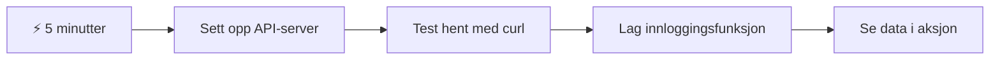
- **Minutt 1-2**: Start API-serveren din (`cd api && npm start`) og test tilkoblingen
- **Minutt 3**: Lag en grunnleggende `getAccount()`-funksjon med fetch
- **Minutt 4**: Koble på logginnskjemaet med `action="javascript:login()"`
- **Minutt 5**: Test logginn og se kontodataene dukke opp i konsollen

**Hurtigtest kommandoer**:  
```bash
# Bekreft at API kjører
curl http://localhost:5000/api

# Test henting av kontodata
curl http://localhost:5000/api/accounts/test
```
  
**Hvorfor dette er viktig**: På 5 minutter vil du oppleve magien ved asynkron datainnhenting som driver hver moderne webapplikasjon. Dette er grunnlaget som gjør at apper føles responsive og levende.

## 🗺️ Din læringsreise gjennom datadrevne webapplikasjoner

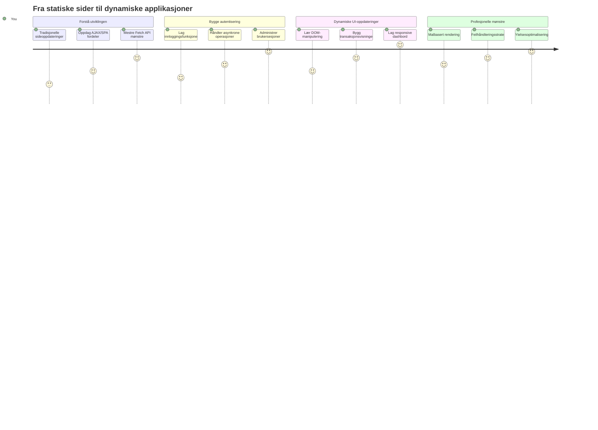
**Mål for reisen din**: Innen slutten av denne leksjonen vil du forstå hvordan moderne webapplikasjoner henter inn, bearbeider og viser data dynamisk, og skaper de sømløse brukeropplevelsene vi forventer fra profesjonelle applikasjoner.

## Forhåndsforelesnings-quiz

[Forhåndsforelesnings-quiz](https://ff-quizzes.netlify.app/web/quiz/45)

### Forutsetninger

Før du går i dybden med datainnhenting, sørg for at du har disse komponentene klare:

- **Tidligere leksjon**: Fullfør [Login and Registration Form](../2-forms/README.md) – vi bygger videre på dette grunnlaget
- **Lokal server**: Installer [Node.js](https://nodejs.org) og [start server-API](../api/README.md) for å levere kontodata
- **API-tilkobling**: Test servertilkoblingen din med denne kommandoen:

```bash
curl http://localhost:5000/api
# Forventet respons: "Bank API v1.0.0"
```
  
Denne raske testen sikrer at alle komponentene kommuniserer korrekt:  
- Verifiserer at Node.js kjører riktig på systemet ditt  
- Bekrefter at API-serveren er aktiv og svarer  
- Validerer at appen din kan nå serveren (som å sjekke radiokontakt før en oppdrag)

## 🧠 Oversikt over datahåndteringens økosystem

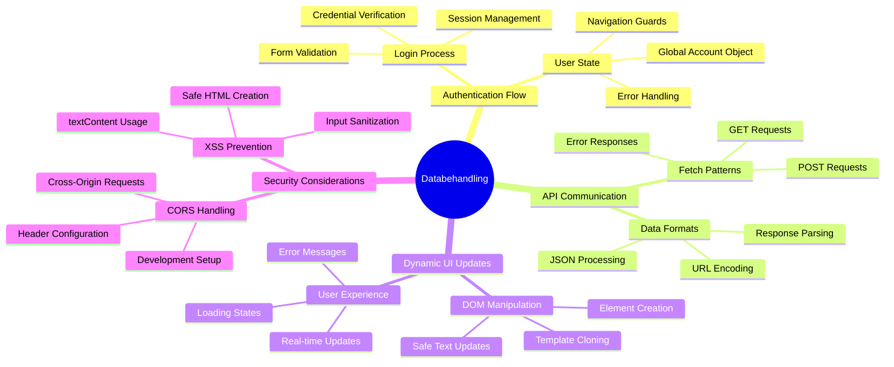
**Kjernetenkning**: Moderne webapplikasjoner er datasystemer for orkestrering – de koordinerer mellom brukergrensesnitt, server-API-er og nettleserens sikkerhetsmodeller for å skape sømløse, responsive opplevelser.

---

## Forstå datainnhenting i moderne webapper

Måten webapplikasjoner håndterer data på har utviklet seg dramatisk i løpet av de siste tjue årene. Å forstå denne utviklingen vil hjelpe deg å sette pris på hvorfor moderne teknikker som AJAX og Fetch API er så kraftfulle, og hvorfor de har blitt uunnværlige verktøy for webutviklere.

La oss utforske hvordan tradisjonelle nettsteder fungerte sammenlignet med de dynamiske, responsive appene vi bygger i dag.

### Tradisjonelle fler-sides applikasjoner (MPA)

På de tidlige webdagene var hvert klikk som å bytte kanal på et gammelt fjernsyn – skjermen ble blank, for så å sakte stille inn det nye innholdet. Dette var virkeligheten for tidlige webapplikasjoner, hvor hver interaksjon betydde å bygge hele siden helt på nytt.

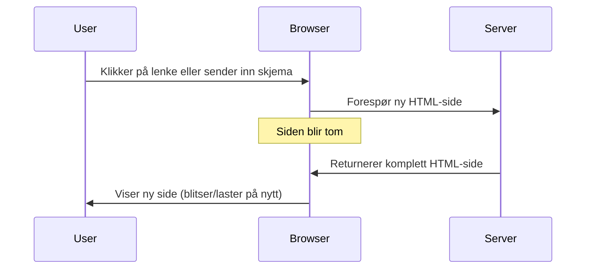
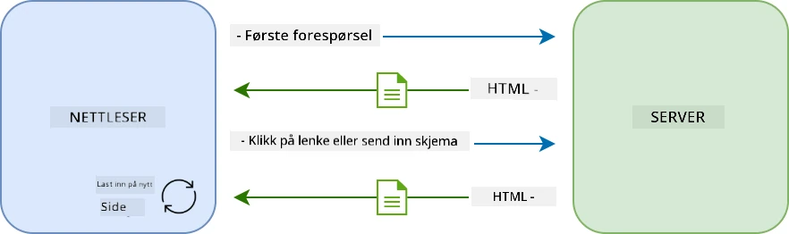  

**Hvorfor denne tilnærmingen føltes tungvint:**  
- Hvert klikk betydde å bygge hele siden fra bunnen av på nytt  
- Brukere ble forstyrret midt i tankene av plagsomme blink på siden  
- Internett-tilkoblingen jobbet overtid med å laste ned samme topp- og bunntekst gjentatte ganger  
- Apper føltes mer som å bla i en arkivskuff enn å bruke programvare

### Moderne enkelt-sides applikasjoner (SPA)

AJAX (Asynchronous JavaScript and XML) endret dette paradigmet fullstendig. Som den modulære designen av Den internasjonale romstasjonen, der astronauter kan bytte ut individuelle komponenter uten å bygge hele strukturen på nytt, lar AJAX oss oppdatere spesifikke deler av en nettside uten å laste alt på nytt. Selv om navnet nevner XML, bruker vi i dag for det meste JSON, men kjerneprinsippet består: oppdater bare det som må endres.

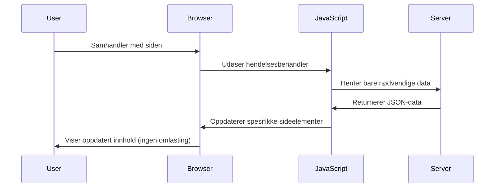
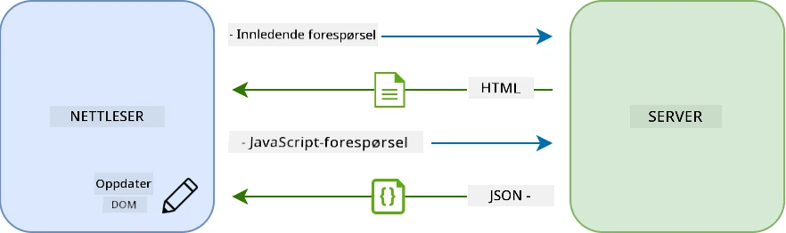  

**Hvorfor SPAs føles mye bedre:**  
- Bare delene som faktisk har endret seg oppdateres (smart, ikke sant?)  
- Ikke flere irriterende avbrudd – brukerne holder flyten  
- Mindre data som sendes over nettverket betyr raskere lasting  
- Alt føles smidig og responsivt, som appene på telefonen din

### Evolusjonen til moderne Fetch API

Moderne nettlesere tilbyr [`Fetch` API](https://developer.mozilla.org/docs/Web/API/Fetch_API), som erstatter den eldre [`XMLHttpRequest`](https://developer.mozilla.org/docs/Web/API/XMLHttpRequest/Using_XMLHttpRequest). Som forskjellen på å bruke telegraf og å sende e-post, bruker Fetch API promises for renere asynkron kode og håndterer JSON naturlig.

| Funksjon | XMLHttpRequest | Fetch API |
|---------|----------------|----------|
| **Syntaks** | Kompleks callback-basert | Ren promise-basert |
| **JSON-håndtering** | Krever manuell parsing | Innebygd `.json()`-metode |
| **Feilhåndtering** | Begrenset feilinformasjon | Omfattende feildetaljer |
| **Moderne støtte** | Legacy-kompatibilitet | ES6+ promises og async/await |

> 💡 **Nettleserkompatibilitet**: God nyhet – Fetch API fungerer i alle moderne nettlesere! Om du er nysgjerrig på spesifikke versjoner, har [caniuse.com](https://caniuse.com/fetch) den komplette kompatibilitetshistorien.  
>  
**Konklusjonen:**  
- Fungerer utmerket i Chrome, Firefox, Safari og Edge (praktisk talt der brukerne dine er)  
- Bare Internet Explorer trenger ekstra hjelp (og ærlig talt, det er på tide å la IE gå)  
- Setter deg perfekt opp for elegante async/await-mønstre vi skal bruke senere

### Implementering av brukerinnlogging og datainnhenting

Nå implementerer vi innloggingssystemet som forvandler bankappen din fra en statisk visning til en funksjonell applikasjon. Som autentiseringsprotokoller brukt i sikre militæranlegg, skal vi verifisere brukernes legitimasjon og så gi tilgang til deres spesifikke data.

Vi bygger dette trinnvis, med grunnleggende autentisering først, deretter legger vi til datainnhentingsfunksjonalitet.

#### Steg 1: Lag fundamentet for login-funksjonen

Åpne filen `app.js` og legg til en ny funksjon `login`. Denne skal håndtere brukerautentiseringsprosessen:

```javascript
async function login() {
  const loginForm = document.getElementById('loginForm');
  const user = loginForm.user.value;
}
```
  
**La oss bryte dette ned:**  
- Det `async`-nøkkelordet? Det forteller JavaScript "hei, denne funksjonen kan trenge å vente på noe"  
- Vi henter skjemaet vårt fra siden (ingen triks, bare finne det via ID)  
- Så trekker vi ut det brukeren skrev inn som brukernavn  
- Her er et fint triks: du kan nå hvert input i skjemaet via `name`-attributtet – slipper ekstra getElementById-kall!

> 💡 **Tilgangsmønster for skjemaer**: Hver formkontroll kan nås via navnet sitt (`name`-attributtet i HTML) som en egenskap på skjemaelementet. Dette gir en ren, lesbar måte å hente skjema-data på.

#### Steg 2: Lag funksjonen for å hente kontodata

Deretter lager vi en dedikert funksjon for å hente kontodata fra serveren. Den følger samme mønster som registreringsfunksjonen, men fokuserer på innhenting:

```javascript
async function getAccount(user) {
  try {
    const response = await fetch('//localhost:5000/api/accounts/' + encodeURIComponent(user));
    return await response.json();
  } catch (error) {
    return { error: error.message || 'Unknown error' };
  }
}
```
  
**Dette oppnår koden:**  
- **Bruker** den moderne `fetch`-API-en for å asynkront hente data  
- **Bygger** en GET-forespørsel med brukernavn som parameter  
- **Bruker** `encodeURIComponent()` for sikker håndtering av spesialtegn i URL  
- **Konverterer** svar til JSON for enkel datahåndtering  
- **Håndterer** feil på en brukervennlig måte ved å returnere en feilobjekt i stedet for kræsje

> ⚠️ **Sikkerhetsnotat**: `encodeURIComponent()` håndterer spesialtegn i URL-er. Som kodingssystemene brukt i marin kommunikasjon, sørger den for at meldingen din kommer frem akkurat som ønsket, og forhindrer at tegn som "#" eller "&" blir feilfortolket.  
>  
**Hvorfor dette er viktig:**  
- Forhindrer at spesialtegn ødelegger URL-er  
- Beskytter mot manipuleringsangrep mot URL  
- Sikrer at serveren mottar korrekt data  
- Følger sikre programmeringsprinsipper

#### Forstå HTTP GET-forespørsler

En ting som kanskje overrasker deg: når du bruker `fetch` uten ekstra opsjoner, lager det automatisk en [`GET`](https://developer.mozilla.org/docs/Web/HTTP/Methods/GET)-forespørsel. Dette passer perfekt når vi spør serveren om "hei, kan jeg se denne brukerens kontodata?"

Tenk på GET-forespørsler som en høflig måte å låne en bok fra biblioteket – du ber om å se noe som allerede finnes. POST-forespørsler (som vi brukte for registrering) er mer som å sende inn en ny bok for å legge til samlingen.

| GET-forespørsel | POST-forespørsel |
|-------------|-------------|
| **Formål** | Hente eksisterende data | Sende ny data til server |
| **Parametre** | I URL-sti/spørringsstreng | I forespørselskropp |
| **Caching** | Kan caches av nettlesere | Vanligvis ikke cachet |
| **Sikkerhet** | Synlig i URL / logger | Skjult i forespørselskropp |

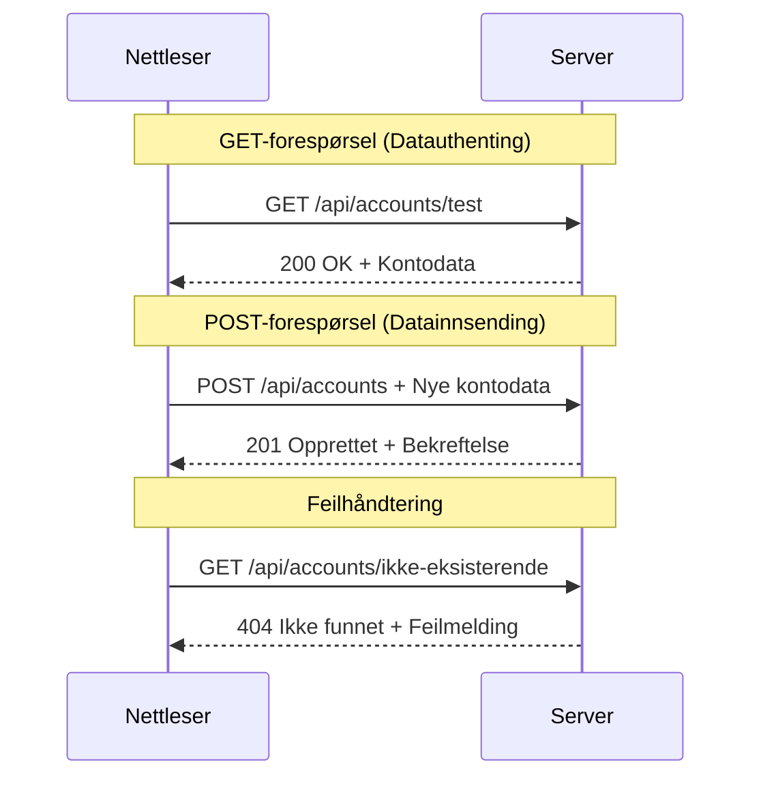
#### Steg 3: Sette alt sammen

Nå kommer den tilfredsstillende delen – la oss koble kontoinnhentingsfunksjonen til login-prosessen. Dette er hvor alt klikker på plass:

```javascript
async function login() {
  const loginForm = document.getElementById('loginForm');
  const user = loginForm.user.value;
  const data = await getAccount(user);

  if (data.error) {
    return console.log('loginError', data.error);
  }

  account = data;
  navigate('/dashboard');
}
```
  
Denne funksjonen følger en klar rekkefølge:  
- Henter brukernavn fra skjemainput  
- Forespør brukerens kontodata fra serveren  
- Håndterer eventuelle feil underveis  
- Lagrer kontodata og navigerer til dashbord ved suksess

> 🎯 **Async/Await-mønster**: Siden `getAccount` er asynkron, bruker vi `await` for å vente på at serveren svarer. Dette hindrer at koden fortsetter med udefinerte data.

#### Steg 4: Lag et hjem for dataene dine

Appen trenger et sted å huske kontoinformasjon når den er lastet inn. Tenk på dette som appens korttidsminne – et sted å holde brukerinformasjonen tilgjengelig. Legg til denne linjen øverst i `app.js`:

```javascript
// Dette holder den nåværende brukerens kontodata
let account = null;
```
  
**Hvorfor vi trenger dette:**  
- Holder kontodata tilgjengelig fra hvor som helst i appen  
- Startverdi `null` betyr "ingen er logget inn ennå"  
- Oppdateres når noen logger inn eller registrerer seg  
- Fungerer som en enkelt sannhetskilde – ingen forvirring om hvem som er innlogget

#### Steg 5: Koble på skjemaet ditt

Nå kobler vi den nye login-funksjonen til HTML-skjemaet ditt. Oppdater skjema-taggen slik:

```html
<form id="loginForm" action="javascript:login()">
  <!-- Your existing form inputs -->
</form>
```
  
**Hva denne lille endringen gjør:**  
- Stopper skjemaet fra å gjøre sin standard "last hele siden på nytt" handling  
- Kaller din egen JavaScript-funksjon i stedet  
- Holder alt glatt og som en enkelt-sides app  
- Gir deg full kontroll over hva som skjer når brukeren trykker "Login"

#### Steg 6: Forbedre registreringsfunksjonen

For konsistens, oppdater `register`-funksjonen til også å lagre kontodata og navigere til dashbordet:

```javascript
// Legg til disse linjene på slutten av din register-funksjon
account = result;
navigate('/dashboard');
```
  
**Denne forbedringen gir:**  
- **Sømløs** overgang fra registrering til dashbord  
- **Konsistent** brukeropplevelse mellom login- og registreringsflyt  
- **Umiddelbar** tilgang til kontodata etter vellykket registrering

#### Test implementeringen din

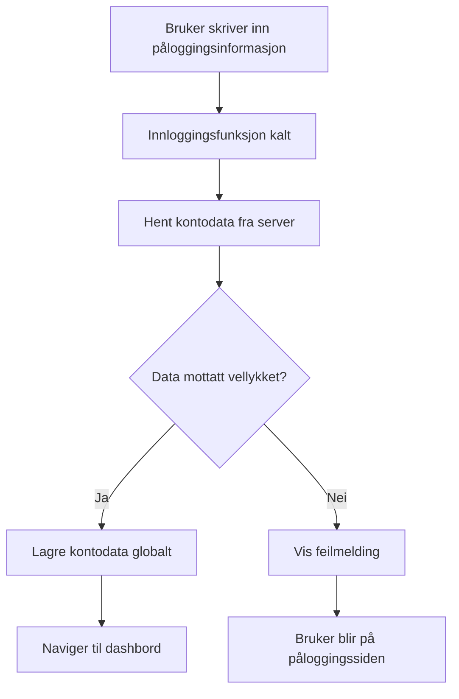
**Tid for å prøve det ut:**  
1. Opprett en ny konto for å sikre at alt fungerer  
2. Prøv å logge inn med de samme legitimasjonene  
3. Sjekk nettleserkonsollen (F12) om noe virker feil  
4. Sørg for at du lander på dashbordet etter innlogging

Hvis noe ikke fungerer, ikke få panikk! De fleste problemer er enkle ting som skrivefeil eller at API-serveren ikke er startet.

#### En kjapp kommentar om Cross-Origin-magien

Du lurer kanskje på: "Hvordan snakker webappen min med denne API-serveren når de kjører på forskjellige porter?" Flott spørsmål! Dette er noe alle webutviklere møter etter hvert.

> 🔒 **Cross-Origin Sikkerhet**: Nettlesere håndhever en "same-origin policy" for å forhindre uautorisert kommunikasjon mellom ulike domener. Som et kontrollpunkt ved Pentagon, verifiserer de at kommunikasjonen er autorisert før dataoverføring tillates.  
>  
**I vår konfigurasjon:**  
- Webappen din kjører på `localhost:3000` (utviklingsserver)  
- API-serveren din kjører på `localhost:5000` (backend-server)  
- API-serveren inkluderer [CORS-headere](https://developer.mozilla.org/docs/Web/HTTP/CORS) som eksplisitt tillater kommunikasjon fra webappen din

Denne oppsettet speiler virkelige utviklingsmiljøer der frontend og backend applikasjoner vanligvis kjører på separate servere.

> 📚 **Lær mer**: Dykk dypere inn i API-er og datainnhenting med denne omfattende [Microsoft Learn-modulen om API-er](https://docs.microsoft.com/learn/modules/use-apis-discover-museum-art/?WT.mc_id=academic-77807-sagibbon).

## Gi dataene dine liv i HTML

Nå skal vi gjøre de innhentede dataene synlige for brukerne gjennom DOM-manipulasjon. Som i fremkallingsprosessen i et mørkerom, tar vi usynlige data og gjengir dem til noe brukerne kan se og samhandle med.
DOM-manipulering er teknikken som forvandler statiske nettsider til dynamiske applikasjoner som oppdaterer innholdet sitt basert på brukerinteraksjoner og serverrespons.

### Velge riktig verktøy for jobben

Når det gjelder å oppdatere HTML-en din med JavaScript, har du flere alternativer. Tenk på disse som forskjellige verktøy i en verktøykasse – hver perfekt for spesifikke oppgaver:

| Metode | Hva den er best for | Når bruke den | Sikkerhetsnivå |
|--------|---------------------|----------------|----------------|
| `textContent` | Vise brukerdata trygt | Når som helst du viser tekst | ✅ Stein solid |
| `createElement()` + `append()` | Bygge komplekse oppsett | Lage nye seksjoner/lister | ✅ Kulefast |
| `innerHTML` | Sette HTML-innhold | ⚠️ Prøv å unngå denne | ❌ Risiko |

#### Den trygge måten å vise tekst på: textContent

[`textContent`](https://developer.mozilla.org/docs/Web/API/Node/textContent)-egenskapen er din beste venn når du skal vise brukerdata. Det er som en dørvakt for nettsiden din – ingenting skadelig slipper igjennom:

```javascript
// Den sikre og pålitelige måten å oppdatere tekst på
const balanceElement = document.getElementById('balance');
balanceElement.textContent = account.balance;
```

**Fordeler med textContent:**
- Behandler alt som ren tekst (hindrer skripteksekvering)
- Rydder automatisk eksisterende innhold
- Effektivt for enkle tekstoppdateringer
- Gir innebygd sikkerhet mot skadelig innhold

#### Lage dynamiske HTML-elementer

For mer komplekst innhold, kombiner [`document.createElement()`](https://developer.mozilla.org/docs/Web/API/Document/createElement) med [`append()`](https://developer.mozilla.org/docs/Web/API/ParentNode/append)-metoden:

```javascript
// Sikker måte å lage nye elementer på
const transactionItem = document.createElement('div');
transactionItem.className = 'transaction-item';
transactionItem.textContent = `${transaction.date}: ${transaction.description}`;
container.append(transactionItem);
```

**Forstå denne tilnærmingen:**
- **Oppretter** nye DOM-elementer programmert
- **Opprettholder** full kontroll over element-attributter og innhold
- **Tillater** komplekse, nestede elementstrukturer
- **Bevarer** sikkerheten ved å skille struktur fra innhold

> ⚠️ **Sikkerhetshensyn**: Selv om [`innerHTML`](https://developer.mozilla.org/docs/Web/API/Element/innerHTML) dukker opp i mange veiledninger, kan det eksekvere innebygde skript. Som sikkerhetsprotokollene ved CERN som hindrer uautorisert kodeskjøring, gir bruken av `textContent` og `createElement` tryggere alternativer.
> 
**Risiko med innerHTML:**
- Eksekverer alle `<script>`-tagger i brukerdata
- Sårbart for kodeinjeksjonsangrep
- Skaper potensielle sikkerhetshull
- De tryggere alternativene vi bruker gir tilsvarende funksjonalitet

### Gjøre feil brukervennlige

For øyeblikket vises innloggingsfeil bare i nettleserkonsollen, som er usynlig for brukerne. Som forskjellen mellom en pilots interne diagnostikk og passasjerinformasjonsystemet, må vi kommunisere viktig informasjon gjennom riktig kanal.

Å implementere synlige feilmeldinger gir brukerne umiddelbar tilbakemelding om hva som gikk galt og hvordan de skal gå fram.

#### Steg 1: Legg til et sted for feilmeldinger

Først, la oss gi feilmeldinger et hjem i HTML-en din. Legg dette rett før påloggingsknappen, så brukerne ser det naturlig:

```html
<!-- This is where error messages will appear -->
<div id="loginError" role="alert"></div>
<button>Login</button>
```

**Hva som skjer her:**
- Vi lager en tom beholder som forblir usynlig til den trengs
- Den er plassert der brukerne naturlig ser etter å ha klikket "Logg inn"
- Den `role="alert"` er en fin detalj for skjermlesere – den forteller hjelpemiddelsteknologi "hei, dette er viktig!"
- Den unike `id` gir JavaScript-en vår et enkelt mål

#### Steg 2: Lag en praktisk hjelpefunksjon

La oss lage en liten hjelpefunksjon som kan oppdatere tekst i hvilket som helst element. Dette er en av de "skriv én gang, bruk overalt"-funksjonene som sparer tid:

```javascript
function updateElement(id, text) {
  const element = document.getElementById(id);
  element.textContent = text;
}
```

**Fordeler med funksjonen:**
- Enkel grensesnitt som bare krever ID og tekstinnhold
- Lokaliserer og oppdaterer DOM-elementer trygt
- Gjenbrukbart mønster som reduserer kodegjentakelse
- Opprettholder konsekvent oppdateringsoppførsel i hele applikasjonen

#### Steg 3: Vis feil der brukerne kan se dem

Nå bytter vi ut den skjulte konsollmeldingen med noe brukerne faktisk kan se. Oppdater påloggingsfunksjonen din:

```javascript
// I stedet for bare å logge til konsollen, vis brukeren hva som er galt
if (data.error) {
  return updateElement('loginError', data.error);
}
```

**Denne lille endringen gjør stor forskjell:**
- Feilmeldinger vises rett der brukerne ser
- Ikke mer mystiske tause feil
- Brukerne får umiddelbar, handlingsrettet tilbakemelding
- Appen føles profesjonell og gjennomtenkt

Nå når du tester med en ugyldig konto, vil du se en hjelpsom feilmelding direkte på siden!


#### Steg 4: Være inkluderende med tilgjengelighet

Det er noe kult med `role="alert"` vi la til tidligere – det er ikke bare pynt! Denne lille attributten skaper det som kalles en [Live Region](https://developer.mozilla.org/docs/Web/Accessibility/ARIA/ARIA_Live_Regions) som umiddelbart kunngjør endringer til skjermlesere:

```html
<div id="loginError" role="alert"></div>
```

**Hvorfor dette er viktig:**
- Skjermleserbrukere hører feilmeldingen så snart den vises
- Alle får den samme viktige informasjonen, uansett hvordan de navigerer
- En enkel måte å få appen til å fungere for flere mennesker
- Viser at du bryr deg om å lage inkluderende opplevelser

Små detaljer som dette skiller gode utviklere fra de utmerkede!

### 🎯 Pedagogisk sjekk: Autentiseringsmønstre

**Pause og reflekter**: Du har nettopp implementert et komplett autentiseringsforløp. Dette er et grunnleggende mønster i webutvikling.

**Rask egenvurdering**:
- Kan du forklare hvorfor vi bruker async/await for API-kall?
- Hva ville skjedd om vi glemte `encodeURIComponent()`-funksjonen?
- Hvordan forbedrer feilbehandlingen vår brukeropplevelsen?

**Reell tilknytning**: Mønstrene du har lært her (async datahenting, feilbehandling, brukerfeedback) brukes i alle store webapplikasjoner fra sosiale medier til netthandelsplattformer. Du bygger ferdigheter på produksjonsnivå!

**Utfordringsspørsmål**: Hvordan kan du endre dette autentiseringssystemet for å håndtere flere brukerroller (kunde, administrator, kasserer)? Tenk på datastruktur og UI-endringer som kreves.

#### Steg 5: Bruke samme mønster for registrering

For konsistens, implementer identisk feilbehandling i registreringsskjemaet ditt:

1. **Legg til** et feilmeldingsvisningselement i registrerings-HTML:
```html
<div id="registerError" role="alert"></div>
```

2. **Oppdater** register-funksjonen din for å bruke samme feilmeldingsmønster:
```javascript
if (data.error) {
  return updateElement('registerError', data.error);
}
```

**Fordeler med konsistent feilbehandling:**
- **Gir** enhetlig brukeropplevelse på tvers av skjemaer
- **Reduserer** kognitiv belastning ved å bruke kjente mønstre
- **Forenkler** vedlikehold med gjenbrukbar kode
- **Sikrer** at tilgjengelighetsstandarder følges i hele appen

## Lage ditt dynamiske dashbord

Nå skal vi forvandle det statiske dashbordet ditt til et dynamisk grensesnitt som viser ekte kontodata. Som forskjellen mellom en trykt flytidsplan og de live avgangstavlene på flyplasser, beveger vi oss fra statisk informasjon til sanntids, responsiv visning.

Ved å bruke DOM-manipuleringsteknikkene du har lært, lager vi et dashbord som oppdateres automatisk med aktuell kontoinformasjon.

### Bli kjent med dataene dine

Før vi begynner å bygge, la oss ta en titt på hva slags data serveren sender tilbake. Når noen logger inn vellykket, får du denne skattekisten av informasjon å arbeide med:

```json
{
  "user": "test",
  "currency": "$",
  "description": "Test account",
  "balance": 75,
  "transactions": [
    { "id": "1", "date": "2020-10-01", "object": "Pocket money", "amount": 50 },
    { "id": "2", "date": "2020-10-03", "object": "Book", "amount": -10 },
    { "id": "3", "date": "2020-10-04", "object": "Sandwich", "amount": -5 }
  ]
}
```

**Denne datastrukturen gir:**
- **`user`**: Perfekt for å personalisere opplevelsen ("Velkommen tilbake, Sarah!")
- **`currency`**: Sørger for riktig visning av pengebeløp
- **`description`**: Et vennlig navn på kontoen
- **`balance`**: Den viktige gjeldende saldoen
- **`transactions`**: Den komplette transaksjonshistorikken med alle detaljer

Alt du trenger for å bygge et profesjonelt utseende bankdashbord!

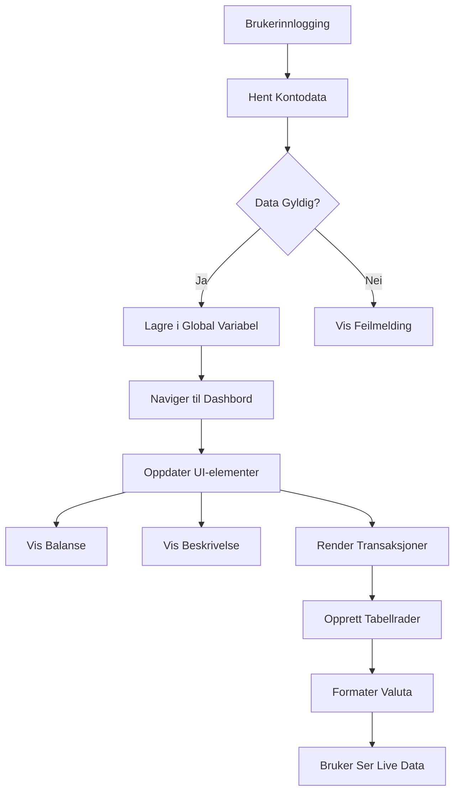
> 💡 **Proff tips**: Vil du se dashbordet ditt i aksjon med en gang? Bruk brukernavnet `test` når du logger inn – det kommer forhåndslastet med eksempeldata så du kan se alt fungere uten å måtte lage transaksjoner først.
> 
**Hvorfor testkontoen er praktisk:**
- Kommer med realistiske eksempeldata ferdig lastet
- Perfekt for å se hvordan transaksjoner vises
- Flott for å teste dashbordfunksjonene dine
- Spar deg for å måtte lage dummydata manuelt

### Lage dashbordets visningselementer

La oss bygge dashbordgrensesnittet trinn for trinn, med kontosammendragsinformasjon først, og deretter mer komplekse funksjoner som transaksjonslister.

#### Steg 1: Oppdater HTML-strukturen din

Først, bytt ut den statiske "Saldo"-seksjonen med dynamiske plassholder-elementer som JavaScript-en din kan fylle ut:

```html
<section>
  Balance: <span id="balance"></span><span id="currency"></span>
</section>
```

Deretter legger du til en seksjon for kontobeskrivelsen. Siden dette fungerer som en tittel for dashbordinnholdet, bruk semantisk HTML:

```html
<h2 id="description"></h2>
```

**Forstå HTML-strukturen:**
- **Bruker** separate `<span>`-elementer for saldo og valuta for individuell kontroll
- **Påfører** unike ID-er på hvert element for JavaScript-målretting
- **Følger** semantisk HTML ved å bruke `<h2>` for kontobeskrivelsen
- **Lager** en logisk hierarki for skjermlesere og SEO

> ✅ **Tilgjengelighetsinnsikt**: Kontobeskrivelsen fungerer som en tittel for dashbordinnholdet, så den er markert semantisk som overskrift. Les mer om hvordan [overskriftsstruktur](https://www.nomensa.com/blog/2017/how-structure-headings-web-accessibility) påvirker tilgjengelighet. Kan du identifisere andre elementer på siden din som kan ha nytte av overskriftstag?

#### Steg 2: Lag dashbordets oppdateringsfunksjon

Lag nå en funksjon som fyller dashbordet ditt med ekte kontodata:

```javascript
function updateDashboard() {
  if (!account) {
    return navigate('/login');
  }

  updateElement('description', account.description);
  updateElement('balance', account.balance.toFixed(2));
  updateElement('currency', account.currency);
}
```

**Steg for steg - dette gjør funksjonen:**
- **Sjekker** at kontodata finnes før den fortsetter
- **Omdirigerer** uautentiserte brukere tilbake til påloggingssiden
- **Oppdaterer** kontobeskrivelsen med den gjenbrukbare `updateElement`-funksjonen
- **Formaterer** saldoen til alltid å vise to desimaler
- **Viser** riktig valutasymbol

> 💰 **Pengeformatering**: Den [`toFixed(2)`](https://developer.mozilla.org/docs/Web/JavaScript/Reference/Global_Objects/Number/toFixed)-metoden er en livredder! Den sikrer at saldoen din alltid ser ut som ekte penger – "75.00" i stedet for bare "75". Brukerne dine vil sette pris på å se kjent valutaformat.

#### Steg 3: Sørg for at dashbordet oppdateres

For å sikre at dashbordet oppdateres med gjeldende data hver gang noen besøker det, må vi koble oss til navigasjonssystemet ditt. Hvis du fullførte [oppgave 1](../1-template-route/assignment.md), bør dette være kjent. Hvis ikke, ikke bekymre deg – her er hva du trenger:

Legg dette til på slutten av `updateRoute()`-funksjonen:

```javascript
if (typeof route.init === 'function') {
  route.init();
}
```

Oppdater så rutene dine til å inkludere dashbordinitialiseringen:

```javascript
const routes = {
  '/login': { templateId: 'login' },
  '/dashboard': { templateId: 'dashboard', init: updateDashboard }
};
```

**Hva denne smarte oppsettet gjør:**
- Sjekker om en rute har spesialisert initialiseringskode
- Kjører den koden automatisk når ruta lastes
- Sikrer at dashbordet ditt alltid viser ferske, oppdaterte data
- Holder rutelogikken ryddig og organisert

#### Test dashbordet ditt

Etter å ha implementert disse endringene, test dashbordet:

1. **Logg inn** med en testkonto
2. **Bekreft** at du blir omdirigert til dashbordet
3. **Sjekk** at kontobeskrivelsen, saldoen og valuta vises riktig
4. **Prøv å logge ut og inn igjen** for å sikre at data oppdateres korrekt

Dashbordet ditt skal nå vise dynamisk kontoinformasjon som oppdateres basert på den innloggede brukeren!

## Lage smarte transaksjonslister med maler

I stedet for å manuelt lage HTML for hver transaksjon, bruker vi maler for å automatisk generere konsistent formatering. Som standardiserte komponenter brukt i romfartøyproduksjon, sikrer maler at hver transaksjonsrad følger samme struktur og utseende.

Denne teknikken skalerer effektivt fra noen få til tusenvis av transaksjoner, samtidig som den opprettholder jevn ytelse og presentasjon.

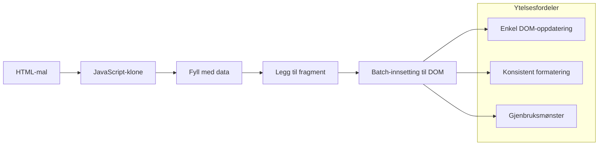
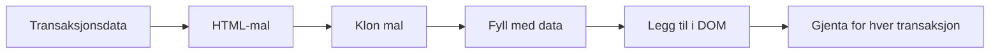
### Steg 1: Lag transaksjonsmalen

Først legger du til en gjenbrukbar mal for transaksjonsrader i `<body>`-en din:

```html
<template id="transaction">
  <tr>
    <td></td>
    <td></td>
    <td></td>
  </tr>
</template>
```

**Forstå HTML-maler:**
- **Definerer** strukturen for en enkelt tabellrad
- **Forblir** usynlig til kloning og utfylling med JavaScript
- **Inkluderer** tre celler for dato, beskrivelse og beløp
- **Gir** et gjenbrukbart mønster for konsekvent formatering

### Steg 2: Gjør tabellen klar for dynamisk innhold

Legg deretter til en `id` på tabellens `<tbody>` slik at JavaScript enkelt kan målrette den:

```html
<tbody id="transactions"></tbody>
```

**Hva dette oppnår:**
- **Oppretter** et klart mål for å sette inn transaksjonsrader
- **Skiller** tabellstrukturen fra det dynamiske innholdet
- **Gjør** det enkelt å tømme og fylle på nytt med transaksjonsdata

### Steg 3: Lag funksjonen som lager transaksjonsrader

Lag nå en funksjon som omdanner transaksjonsdata til HTML-elementer:

```javascript
function createTransactionRow(transaction) {
  const template = document.getElementById('transaction');
  const transactionRow = template.content.cloneNode(true);
  const tr = transactionRow.querySelector('tr');
  tr.children[0].textContent = transaction.date;
  tr.children[1].textContent = transaction.object;
  tr.children[2].textContent = transaction.amount.toFixed(2);
  return transactionRow;
}
```

**Bryter ned denne fabrikkfunksjonen:**
- **Henter** mal-elementet via ID
- **Kloner** malen for trygg manipulering
- **Velger** tabellraden i den klonede strukturen
- **Fyller** hver celle med transaksjonsdata
- **Formaterer** beløpet for riktig desimalvisning
- **Returnerer** ferdig rad klar for innsetting

### Steg 4: Generer flere transaksjonsrader effektivt

Legg denne koden til i `updateDashboard()`-funksjonen for å vise alle transaksjoner:

```javascript
const transactionsRows = document.createDocumentFragment();
for (const transaction of account.transactions) {
  const transactionRow = createTransactionRow(transaction);
  transactionsRows.appendChild(transactionRow);
}
updateElement('transactions', transactionsRows);
```

**Forstå denne effektive tilnærmingen:**
- **Oppretter** et dokumentfragment for å samle DOM-operasjoner
- **Itererer** gjennom alle transaksjoner i kontodataene
- **Genererer** en rad for hver transaksjon ved hjelp av fabrikkfunksjonen
- **Samler** alle radene i fragmentet før de legges til DOM
- **Utfører** en enkelt DOM-oppdatering i stedet for mange individuelle innsettinger
> ⚡ **Ytelsesoptimalisering**: [`document.createDocumentFragment()`](https://developer.mozilla.org/docs/Web/API/Document/createDocumentFragment) fungerer som samlingsprosessen hos Boeing – komponenter forberedes utenfor hovedlinjen, og monteres deretter som en komplett enhet. Denne batch-tilnærmingen minimerer DOM-reflows ved å utføre en enkelt innsetting i stedet for flere individuelle operasjoner.

### Trinn 5: Forbedre oppdateringsfunksjonen for blandet innhold

Din `updateElement()`-funksjon håndterer for øyeblikket bare tekstinnhold. Oppdater den til å fungere med både tekst og DOM-noder:

```javascript
function updateElement(id, textOrNode) {
  const element = document.getElementById(id);
  element.textContent = ''; // Fjerner alle barn
  element.append(textOrNode);
}
```

**Nøkkelforbedringer i denne oppdateringen:**
- **Rydder** eksisterende innhold før nytt innhold legges til
- **Aksepterer** enten tekststrenger eller DOM-noder som parametere
- **Bruker** [`append()`](https://developer.mozilla.org/docs/Web/API/ParentNode/append)-metoden for fleksibilitet
- **Opprettholder** bakoverkompatibilitet med eksisterende tekstbasert bruk

### Ta dashboardet ditt på en prøvetur

Tid for sannhetens øyeblikk! La oss se ditt dynamiske dashboard i aksjon:

1. Logg inn med `test`-kontoen (den har eksempeldata klare)
2. Naviger til ditt dashboard
3. Sjekk at transaksjonsrader vises med riktig formatering
4. Sørg for at datoer, beskrivelser og beløp ser bra ut

Hvis alt fungerer, bør du se en fullverdig transaksjonsliste på dashbordet ditt! 🎉

**Det du har oppnådd:**
- Bygd et dashboard som skalerer med alle mengder data
- Laget gjenbrukbare maler for konsekvent formatering
- Implementert effektive DOM-manipulasjonsteknikker
- Utviklet funksjonalitet som kan sammenlignes med produksjonsbankapplikasjoner

Du har med suksess forvandlet en statisk nettside til en dynamisk webapplikasjon.

### 🎯 Pedagogisk sjekkpunkt: Dynamisk innholdsgenerering

**Forståelse av arkitektur**: Du har implementert en sofistikert data-til-UI-pipeline som speiler mønstre brukt i rammeverk som React, Vue og Angular.

**Kjernebegreper mestret**:
- **Malerendring**: Lage gjenbrukbare UI-komponenter
- **Dokumentfragmenter**: Optimalisere DOM-ytelse
- **Sikker DOM-manipulasjon**: Forhindre sikkerhetssårbarheter
- **Datatransformasjon**: Konvertering av serverdata til brukergrensesnitt

**Bransjetilknytning**: Disse teknikkene utgjør fundamentet for moderne frontend-rammeverk. Reacts virtuelle DOM, Vues malingssystem og Angularkomponentarkitektur bygger alle på disse kjernebegrepene.

**Refleksjonsspørsmål**: Hvordan ville du utvide dette systemet for å håndtere sanntidsoppdateringer (som nye transaksjoner som vises automatisk)? Vurder WebSockets eller Server-Sent Events.

---

## 📈 Din tidslinje for datastyringsmestring

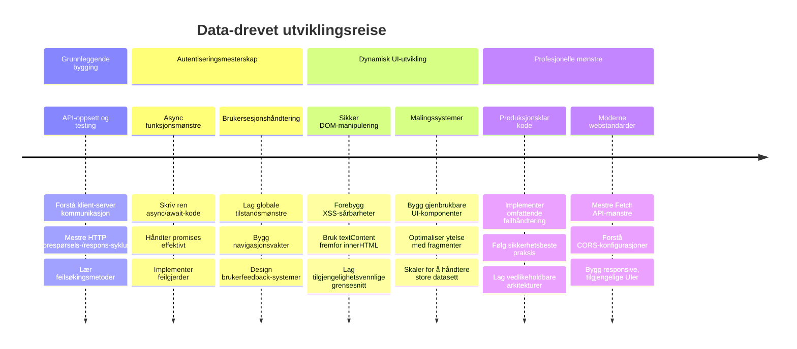
**🎓 Avslutningsmilepæl**: Du har med suksess bygget en komplett data-drevet webapplikasjon ved bruk av moderne JavaScript-mønstre. Disse ferdighetene kan direkte overføres til arbeid med rammeverk som React, Vue eller Angular.

**🔄 Neste nivå ferdigheter**:
- Klar til å utforske frontend-rammeverk som bygger på disse konseptene
- Forberedt på å implementere sanntidsfunksjoner med WebSockets
- Utrustet til å bygge Progressive Web Apps med offline-funksjonalitet
- Grunnlag lagt for å lære avanserte mønstre for tilstandshåndtering

## GitHub Copilot Agent-utfordring 🚀

Bruk Agent-modus for å fullføre følgende utfordring:

**Beskrivelse:** Forbedre bankappen ved å implementere en søke- og filterfunksjon som lar brukere finne spesifikke transaksjoner etter datointervall, beløp eller beskrivelse.

**Prompt:** Lag en søkefunksjonalitet for bankappen som inkluderer: 1) Et søkeskjema med inndat felt for datointervall (fra/til), minimum/maksimum beløp, og nøkkelord for transaksjonsbeskrivelse, 2) En `filterTransactions()`-funksjon som filtrerer account.transactions-arrayen basert på søkekriteriene, 3) Oppdater `updateDashboard()`-funksjonen til å vise filtrerte resultater, og 4) Legg til en "Nullstill filtre"-knapp for å tilbakestille visningen. Bruk moderne JavaScript-arraymetoder som `filter()` og håndter grensesaker for tomme søkekriterier.

Lær mer om [agent mode](https://code.visualstudio.com/blogs/2025/02/24/introducing-copilot-agent-mode) her.

## 🚀 Utfordring

Klar til å ta bankappen til neste nivå? La oss få den til å se ut og føles som noe du faktisk vil bruke. Her er noen ideer for å tenne kreativiteten din:

**Gjør den vakker**: Legg til CSS-styling for å forvandle ditt funksjonelle dashbord til noe visuelt tiltalende. Tenk rene linjer, god avstand og kanskje til og med subtile animasjoner.

**Gjør den responsiv**: Prøv å bruke [mediespørringer](https://developer.mozilla.org/docs/Web/CSS/Media_Queries) for å lage et [responsivt design](https://developer.mozilla.org/docs/Web/Progressive_web_apps/Responsive/responsive_design_building_blocks) som fungerer bra på telefoner, nettbrett og stasjonære PCer. Brukerne dine vil takke deg!

**Legg til litt ekstra**: Vurder fargekoding av transaksjoner (grønt for inntekt, rødt for utgifter), legge til ikoner, eller lage hover-effekter som gjør grensesnittet interaktivt.

Slik kan et polert dashboard se ut:

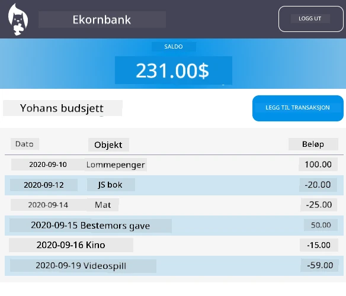

Føl deg ikke presset til å matche dette nøyaktig – bruk det som inspirasjon og gjør det til ditt eget!

## Quiz etter forelesning

[Post-lecture quiz](https://ff-quizzes.netlify.app/web/quiz/46)

## Oppgave

[Refaktorér og kommentér koden din](assignment.md)

---

<!-- CO-OP TRANSLATOR DISCLAIMER START -->
**Ansvarsfraskrivelse**:  
Dette dokumentet er oversatt ved hjelp av AI-oversettelsestjenesten [Co-op Translator](https://github.com/Azure/co-op-translator). Selv om vi streber etter nøyaktighet, vennligst vær oppmerksom på at automatiske oversettelser kan inneholde feil eller unøyaktigheter. Det opprinnelige dokumentet på originalspråket skal betraktes som den autoritative kilden. For viktig informasjon anbefales profesjonell menneskelig oversettelse. Vi påtar oss ikke ansvar for misforståelser eller feiltolkninger som oppstår som følge av bruken av denne oversettelsen.
<!-- CO-OP TRANSLATOR DISCLAIMER END -->