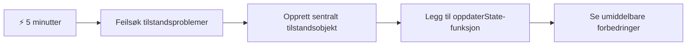
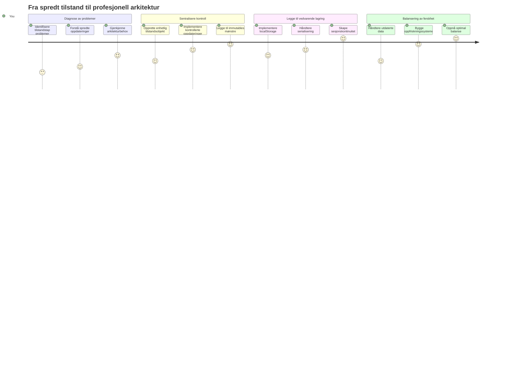
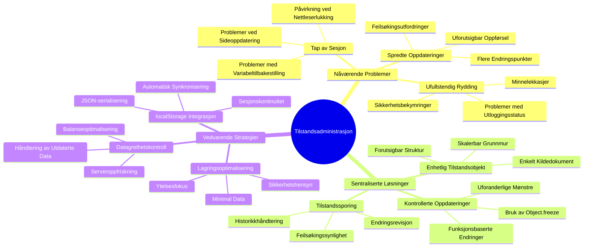
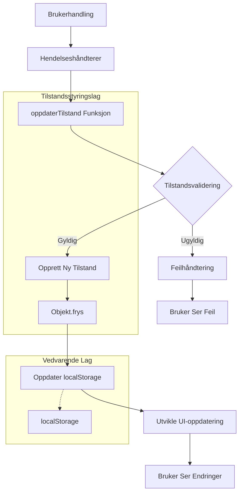
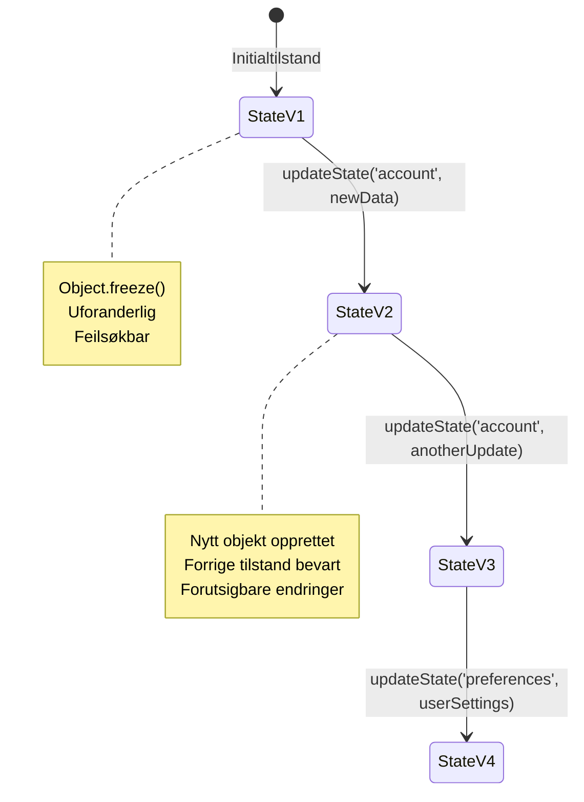
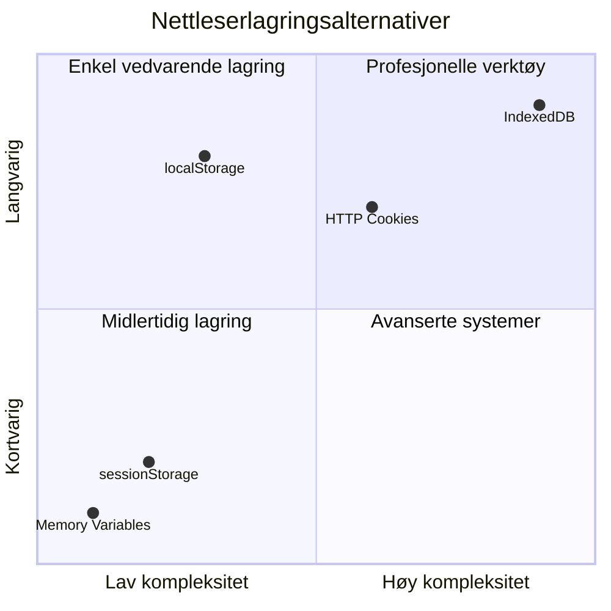
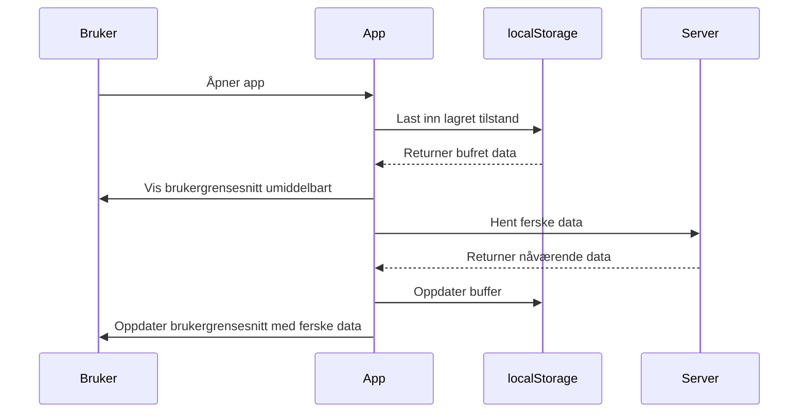
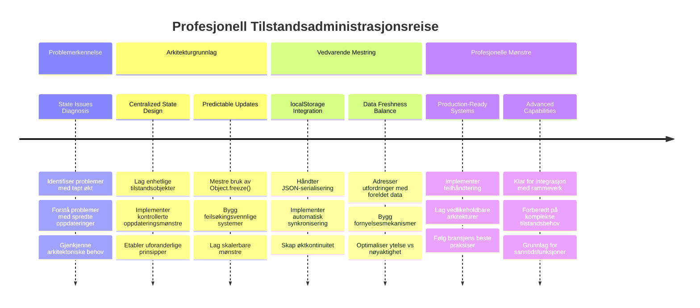

<!--
CO_OP_TRANSLATOR_METADATA:
{
  "original_hash": "b807b09df716dc48a2b750835bf8e933",
  "translation_date": "2026-01-07T00:45:30+00:00",
  "source_file": "7-bank-project/4-state-management/README.md",
  "language_code": "no"
}
-->
# Bygg en bankapp del 4: Konsepter for tilstandshåndtering

## ⚡ Hva du kan gjøre de neste 5 minuttene

**Rask startrute for travle utviklere**


- **Minutt 1**: Test det nåværende tilstandsproblemet – logg inn, oppdater siden, observer utlogging
- **Minutt 2**: Erstatt `let account = null` med `let state = { account: null }`
- **Minutt 3**: Lag en enkel `updateState()`-funksjon for kontrollerte oppdateringer
- **Minutt 4**: Oppdater én funksjon til å bruke det nye mønsteret
- **Minutt 5**: Test forbedret forutsigbarhet og feilsøkingsmuligheter

**Rask diagnostisk test**:
```javascript
// Før: Spredt tilstand
let account = null; // Mistet ved oppdatering!

// Etter: Sentralisert tilstand
let state = Object.freeze({ account: null }); // Kontrollert og sporbar!
```

**Hvorfor dette er viktig**: På 5 minutter vil du oppleve overgangen fra kaotisk tilstandshåndtering til forutsigbare og feilsøkbare mønstre. Dette er fundamentet som gjør komplekse applikasjoner vedlikeholdbare.

## 🗺️ Din læringsreise gjennom mesterlig tilstandshåndtering


**Din reisemål**: Ved slutten av denne leksjonen vil du ha bygget et profesjonelt tilstandshåndteringssystem som håndterer persistens, dataferskhet og forutsigbare oppdateringer – de samme mønstrene som brukes i produksjonsapplikasjoner.

## Forhåndsføringsquiz

[Forhåndsføringsquiz](https://ff-quizzes.netlify.app/web/quiz/47)

## Introduksjon

Tilstandshåndtering er som navigasjonssystemet på Voyager-romfartøyet – når alt fungerer glatt, legger du knapt merke til det. Men når ting går galt, er det forskjellen mellom å nå interstellart rom og å drive tapt i det kosmiske tomrommet. I webutvikling representerer tilstand alt applikasjonen din må huske: brukerinnloggingsstatus, formdata, navigasjonshistorikk og midlertidige grensesnitttilstander.

Etter hvert som bankappen din har utviklet seg fra et enkelt innloggingsskjema til en mer sofistikert applikasjon, har du sannsynligvis møtt noen vanlige utfordringer. Oppdater siden og brukerne blir logget ut uventet. Lukk nettleseren og all fremdrift forsvinner. Feilsøk et problem og du jakter gjennom flere funksjoner som alle endrer de samme data på ulike måter.

Dette er ikke tegn på dårlig koding – det er de naturlige barnesykdommene som oppstår når applikasjoner når et visst kompleksitetsnivå. Hver utvikler møter disse utfordringene når appene går fra "bevis på konsept" til "produksjonsklare".

I denne leksjonen skal vi implementere et sentralisert tilstandshåndteringssystem som forvandler bankappen din til en pålitelig, profesjonell applikasjon. Du vil lære å håndtere dataflyter forutsigbart, bevare brukerøkter hensiktsmessig, og skape en smidig brukeropplevelse som moderne webapplikasjoner krever.

## Forutsetninger

Før du dykker ned i tilstandshåndteringskonsepter, må du ha utviklingsmiljøet riktig satt opp og fundamentet for bankappen på plass. Denne leksjonen bygger direkte på konseptene og koden fra tidligere deler av denne serien.

Sørg for at du har følgende komponenter klare før du går videre:

**Nødvendig oppsett:**
- Fullfør [datainnhentingsleksjonen](../3-data/README.md) – appen din skal laste og vise kontodata vellykket
- Installer [Node.js](https://nodejs.org) på systemet ditt for å kjøre backend-API
- Start [server-API](../api/README.md) lokalt for å håndtere konto-operasjoner

**Test miljøet ditt:**

Bekreft at API-serveren din kjører riktig ved å kjøre denne kommandoen i en terminal:

```sh
curl http://localhost:5000/api
# -> skal returnere "Bank API v1.0.0" som resultat
```

**Hva denne kommandoen gjør:**
- **Sender** en GET-forespørsel til din lokale API-server
- **Tester** forbindelsen og bekrefter at serveren svarer
- **Returnerer** API-versjonsinformasjonen hvis alt fungerer som det skal

## 🧠 Oversikt over arkitektur for tilstandshåndtering


**Kjerneprinsipp**: Profesjonell tilstandshåndtering balanserer forutsigbarhet, persistens og ytelse for å skape pålitelige brukeropplevelser som skalerer fra enkle interaksjoner til komplekse arbeidsflyter.

---

## Diagnostisering av nåværende tilstandsproblemer

Som Sherlock Holmes som undersøker åsted, må vi forstå nøyaktig hva som skjer i vår nåværende implementasjon før vi kan løse mysteriet om forsvinnende brukerøkter.

La oss gjennomføre et enkelt eksperiment som avslører underliggende utfordringer i tilstandshåndteringen:

**🧪 Prøv denne diagnostiske testen:**
1. Logg inn i bankappen din og naviger til dashbordet
2. Oppdater nettlesersiden
3. Observer hva som skjer med innloggingsstatusen din

Hvis du blir sendt tilbake til innloggingsskjermen, har du oppdaget det klassiske problemet med tilstandspersistens. Denne oppførselen skjer fordi vår nåværende implementasjon lagrer brukerdata i JavaScript-variabler som nullstilles ved hver sideinnlasting.

**Problemer med nåværende implementasjon:**

Den enkle `account`-variabelen fra [forrige leksjon](../3-data/README.md) skaper tre betydelige problemer som påvirker både brukeropplevelse og kodevedlikehold:

| Problem | Teknisk årsak | Brukerpåvirkning |
|---------|---------------|------------------|
| **Tapt økt** | Sideoppdatering nullstiller JavaScript-variabler | Brukere må autentisere seg ofte på nytt |
| **Spredte oppdateringer** | Flere funksjoner endrer tilstanden direkte | Feilsøking blir stadig vanskeligere |
| **Ufullstendig rydding** | Utlogging fjerner ikke alle tilstandsreferanser | Potensielle sikkerhets- og personvernhensyn |

**Den arkitektoniske utfordringen:**

Som Titanics skillevegger som virket robuste til flere kamre fyltes samtidig, vil løsning av disse problemene én etter én ikke adressere det underliggende arkitektoniske problemet. Vi trenger en omfattende løsning for tilstandshåndtering.

> 💡 **Hva prøver vi egentlig å oppnå her?**

[State management](https://en.wikipedia.org/wiki/State_management) handler egentlig om å løse to grunnleggende gåter:

1. **Hvor er dataene mine?**: Holde oversikt over hvilken informasjon vi har og hvor den kommer fra
2. **Er alle på samme side?**: Sørge for at det brukerne ser stemmer overens med hva som faktisk skjer

**Vår handlingsplan:**

I stedet for å løpe i sirkel, skal vi lage et **sentralisert tilstandshåndteringssystem**. Tenk på det som å ha én virkelig organisert person som har ansvar for alt det viktige:



**Forstå denne dataflyten:**
- **Sentraliserer** all applikasjonstilstand på ett sted
- **Ruter** alle tilstandsoppdateringer gjennom kontrollerte funksjoner
- **Sikrer** at brukergrensesnittet holdes synkronisert med gjeldende tilstand
- **Gir** et klart, forutsigbart mønster for datastyring

> 💡 **Profesjonelt innblikk**: Denne leksjonen fokuserer på grunnleggende konsepter. For komplekse applikasjoner tilbyr biblioteker som [Redux](https://redux.js.org) mer avanserte funksjoner for tilstandshåndtering. Å forstå disse kjerneprinsippene vil hjelpe deg å mestre hvilket som helst tilstandshåndteringsbibliotek.

> ⚠️ **Avansert tema**: Vi vil ikke dekke automatiske UI-oppdateringer trigget av tilstandsforandringer, da dette involverer konsepter fra [Reaktiv Programmering](https://en.wikipedia.org/wiki/Reactive_programming). Se på dette som et utmerket neste steg i læringsreisen din!

### Oppgave: Sentralisere tilstandsstrukturen

La oss begynne å omforme vår spredte tilstandshåndtering til et sentralisert system. Dette første trinnet legger grunnlaget for alle forbedringene som kommer.

**Trinn 1: Lag et sentralt tilstandsobjekt**

Erstatt den enkle `account`-deklarasjonen:

```js
let account = null;
```

Med et strukturert tilstandsobjekt:

```js
let state = {
  account: null
};
```

**Derfor er denne endringen viktig:**
- **Sentraliserer** alle applikasjonsdata på ett sted
- **Forbereder** strukturen for å legge til flere tilstandsegenskaper senere
- **Skaper** en tydelig grense mellom tilstand og andre variabler
- **Etablerer** et mønster som skalerer etter hvert som appen vokser

**Trinn 2: Oppdater mønstre for tilgang til tilstand**

Oppdater funksjonene dine til å bruke den nye tilstandsstrukturen:

**I `register()`- og `login()`-funksjonene**, erstatt:
```js
account = ...
```

Med:
```js
state.account = ...
```

**I `updateDashboard()`-funksjonen**, legg til denne linjen øverst:
```js
const account = state.account;
```

**Hva disse oppdateringene oppnår:**
- **Opprettholder** eksisterende funksjonalitet samtidig som strukturen forbedres
- **Forbereder** koden din for mer sofistikert tilstandshåndtering
- **Skaper** konsistente mønstre for tilgang til tilstandsdata
- **Legger grunnlaget** for sentraliserte tilstandsoppdateringer

> 💡 **Merk**: Denne refaktoreringen løser ikke problemene umiddelbart, men skaper det nødvendige fundamentet for kraftige forbedringer som kommer!

### 🎯 Pedagogisk pause: Prinsipper for sentralisering

**Stopp opp og reflekter**: Du har nettopp implementert grunnlaget for sentralisert tilstandshåndtering. Dette er et avgjørende arkitektonisk valg.

**Rask egenvurdering**:
- Kan du forklare hvorfor det er bedre å sentralisere tilstanden i ett objekt enn å spre variabler?
- Hva ville skje om du glemte å oppdatere en funksjon til å bruke `state.account`?
- Hvordan forbereder dette mønsteret koden din for mer avanserte funksjoner?

**Sammenheng i virkeligheten**: Sentraliseringsmønsteret du har lært er fundamentet i moderne rammeverk som Redux, Vuex og React Context. Du bygger samme arkitektoniske tenkning som brukes i store applikasjoner.

**Utfordrende spørsmål**: Hvis du trengte å legge til brukerpreferanser (tema, språk) i appen, hvor ville du lagt dem i tilstandsstrukturen? Hvordan vil dette skaleres?

## Implementering av kontrollerte tilstandsoppdateringer

Med vår tilstand sentralisert innebærer neste steg å etablere kontrollerte mekanismer for datamodifikasjoner. Denne tilnærmingen sørger for forutsigbare tilstandsendringer og enklere feilsøking.

Kjerneprinsippet ligner flykontroll: i stedet for å la flere funksjoner endre tilstanden uavhengig, vil vi kanalisere alle endringer gjennom én enkelt, kontrollert funksjon. Dette mønsteret gir klar oversikt over når og hvordan data endres.

**Immutabel tilstandshåndtering:**

Vi behandler `state`-objektet som [*immutabelt*](https://en.wikipedia.org/wiki/Immutable_object), noe som betyr at vi aldri endrer det direkte. I stedet skaper hver endring et nytt tilstandsobjekt med oppdaterte data.

Selv om denne tilnærmingen først kan virke ineffektiv sammenlignet med direkte modifikasjoner, gir den store fordeler for feilsøking, testing og vedlikehold av applikasjonens forutsigbarhet.

**Fordeler med immutabel tilstandshåndtering:**

| Fordel | Beskrivelse | Effekt |
|--------|-------------|--------|
| **Forutsigbarhet** | Endringer skjer kun gjennom kontrollerte funksjoner | Enklere å feilsøke og teste |
| **Historikksporing** | Hver tilstandsendring lager et nytt objekt | Muliggjør angre/gjøre om-funksjonalitet |
| **Forebygging av sideeffekter** | Ingen utilsiktede modifikasjoner | Hindrer mystiske feil |
| **Ytelsesoptimalisering** | Lett å oppdage når tilstanden faktisk har endret seg | Muliggjør effektive UI-oppdateringer |

**JavaScript-immutabilitet med `Object.freeze()`:**

JavaScript tilbyr [`Object.freeze()`](https://developer.mozilla.org/docs/Web/JavaScript/Reference/Global_Objects/Object/freeze) for å forhindre endringer i objekter:

```js
const immutableState = Object.freeze({ account: userData });
// Ethvert forsøk på å endre immutableState vil kaste en feil
```

**Forklaring av hva som skjer her:**
- **Forhindrer** direkte egenskapstildelinger eller slettinger
- **Kaster** unntak hvis forsøk på modifikasjon gjøres
- **Sikrer** at tilstandsendringer må gå gjennom kontrollerte funksjoner
- **Etablerer** en tydelig kontrakt for hvordan tilstand kan oppdateres

> 💡 **Dypdykk**: Lær om forskjellen mellom *shallow* og *deep* immutable objekter i [MDN-dokumentasjonen](https://developer.mozilla.org/docs/Web/JavaScript/Reference/Global_Objects/Object/freeze#What_is_shallow_freeze). Å forstå denne forskjellen er avgjørende for komplekse tilstandsstrukturer.


### Oppgave

La oss lage en ny `updateState()`-funksjon:

```js
function updateState(property, newData) {
  state = Object.freeze({
    ...state,
    [property]: newData
  });
}
```

I denne funksjonen oppretter vi et nytt tilstandsobjekt og kopierer data fra forrige tilstand ved bruk av [*spread (`...`)-operatoren*](https://developer.mozilla.org/docs/Web/JavaScript/Reference/Operators/Spread_syntax#Spread_in_object_literals). Deretter overskriver vi en bestemt egenskap i tilstandsobjektet med de nye dataene ved hjelp av [klamme-notation](https://developer.mozilla.org/docs/Web/JavaScript/Guide/Working_with_Objects#Objects_and_properties) `[property]` for tilordning. Til slutt låser vi objektet for å forhindre modifikasjoner med `Object.freeze()`. Akkurat nå har vi bare `account`-egenskapen lagret i tilstanden, men med denne tilnærmingen kan du legge til så mange egenskaper du trenger.

Vi oppdaterer også `state`-initialiseringen for å sikre at den opprinnelige tilstanden også er frosset:

```js
let state = Object.freeze({
  account: null
});
```

Deretter oppdaterer vi `register`-funksjonen ved å erstatte tildelingen `state.account = result;` med:

```js
updateState('account', result);
```

Gjør det samme i `login`-funksjonen, erstatt `state.account = data;` med:

```js
updateState('account', data);
```

Vi benytter også anledningen til å fikse problemet med at kontodata ikke blir fjernet når brukeren klikker på *Logout*.

Lag en ny funksjon `logout()`:

```js
function logout() {
  updateState('account', null);
  navigate('/login');
}
```

I `updateDashboard()`, erstatt omdirigeringen `return navigate('/login');` med `return logout()`;

Prøv å registrere en ny konto, logge ut og inn igjen for å sjekke at alt fortsatt fungerer som det skal.

> Tips: Du kan følge med på alle tilstandsendringer ved å legge til `console.log(state)` nederst i `updateState()` og åpne konsollen i nettleserens utviklerverktøy.

## Implementering av datapersistering

Problemet med tapt økt som vi identifiserte tidligere, krever en persistensløsning som opprettholder brukerens tilstand på tvers av nettleserøkter. Dette forvandler applikasjonen fra en midlertidig opplevelse til et pålitelig, profesjonelt verktøy.

Tenk på hvordan atomklokker opprettholder presis tid selv gjennom strømbrudd ved å lagre kritisk tilstand i ikke-flyktig minne. På samme måte trenger webapplikasjoner persistente lagringsmekanismer for å bevare essensielle brukerdata på tvers av nettleserøkter og sideoppdateringer.

**Strategiske spørsmål for datapersistering:**

Før du implementerer persistens, vurder disse kritiske faktorene:

| Spørsmål | Bankapp-kontekst | Beslutningens betydning |
|----------|------------------|------------------------|
| **Er dataene sensitive?** | Kontobalanse, transaksjonshistorikk | Velg sikre lagringsmetoder |
| **Hvor lenge bør den vedvare?** | Innloggingsstatus vs. midlertidige UI-preferanser | Velg passende lagringsvarighet |
| **Trenger serveren den?** | Autentiseringstokener vs. UI-innstillinger | Bestem delingsbehov |

**Nettleserens lagringsalternativer:**

Moderne nettlesere tilbyr flere lagringsmekanismer, hver designet for forskjellige bruksområder:

**Primære lagrings-APIer:**

1. **[`localStorage`](https://developer.mozilla.org/docs/Web/API/Window/localStorage)**: Vedvarende [Nøkkel/Verdi-lagring](https://en.wikipedia.org/wiki/Key%E2%80%93value_database)
   - **Bevarer** data på tvers av nettleserøkter på ubestemt tid  
   - **Overlever** nettleseromstarter og datamaskinrestarter
   - **Begrenset** til spesifikt domenenavn for nettstedet
   - **Perfekt** for brukerpreferanser og innloggingsstatus

2. **[`sessionStorage`](https://developer.mozilla.org/docs/Web/API/Window/sessionStorage)**: Midlertidig sesjonslagring
   - **Fungerer** identisk med localStorage under aktive økter
   - **Slettes** automatisk når nettleserfanen lukkes
   - **Ideelt** for midlertidige data som ikke skal bevares

3. **[HTTP Cookies](https://developer.mozilla.org/docs/Web/HTTP/Cookies)**: Server-delt lagring
   - **Sendes automatisk** med hver serverforespørsel
   - **Perfekt** for [autentisering](https://en.wikipedia.org/wiki/Authentication)-tokener
   - **Begrenset** i størrelse og kan påvirke ytelsen

**Krav til dataserialisering:**

Både `localStorage` og `sessionStorage` lagrer kun [strenger](https://developer.mozilla.org/docs/Web/JavaScript/Reference/Global_Objects/String):

```js
// Konverter objekter til JSON-strenger for lagring
const accountData = { user: 'john', balance: 150 };
localStorage.setItem('account', JSON.stringify(accountData));

// Analyser JSON-strenger tilbake til objekter ved henting
const savedAccount = JSON.parse(localStorage.getItem('account'));
```

**Forståelse av serialisering:**
- **Konverterer** JavaScript-objekter til JSON-strenger ved bruk av [`JSON.stringify()`](https://developer.mozilla.org/docs/Web/JavaScript/Reference/Global_Objects/JSON/stringify)
- **Gjenoppretter** objekter fra JSON ved hjelp av [`JSON.parse()`](https://developer.mozilla.org/docs/Web/JavaScript/Reference/Global_Objects/JSON/parse)
- **Håndterer** komplekse nestede objekter og matriser automatisk
- **Feiler** på funksjoner, undefined-verdier og sirkulære referanser

> 💡 **Avansert alternativ**: For komplekse offline-applikasjoner med store datasett, vurder [`IndexedDB` API](https://developer.mozilla.org/docs/Web/API/IndexedDB_API). Den tilbyr en full klient-side database, men krever mer kompleks implementering.


### Oppgave: Implementer lokal lagringsvedvarighet

La oss implementere vedvarende lagring slik at brukere forblir logget inn til de eksplisitt logger ut. Vi bruker `localStorage` for å lagre kontodata på tvers av nettleserøkter.

**Trinn 1: Definer lagringskonfigurasjon**

```js
const storageKey = 'savedAccount';
```

**Hva denne konstanten gjør:**
- **Oppretter** en konsistent identifikator for våre lagrede data
- **Forhindrer** skrivefeil i referanser til lagringsnøkkelen
- **Gjør** det enkelt å endre lagringsnøkkelen om nødvendig
- **Følger** beste praksis for vedlikeholdbar kode

**Trinn 2: Legg til automatisk lagring**

Legg til denne linjen på slutten av `updateState()`-funksjonen:

```js
localStorage.setItem(storageKey, JSON.stringify(state.account));
```

**Hva som skjer her:**
- **Konverterer** kontobjektet til en JSON-streng for lagring
- **Lagrer** dataene ved bruk av vår konsistente lagringsnøkkel
- **Utføres** automatisk hver gang tilstanden endres
- **Sikrer** at lagrede data alltid er synkronisert med gjeldende tilstand

> 💡 **Arkitekturforskjell**: Fordi vi sentraliserte alle tilstandsoppdateringer gjennom `updateState()`, krevde det bare én linje kode å legge til vedvarende lagring. Dette viser kraften av gode arkitekturbeslutninger!

**Trinn 3: Gjenopprett tilstand ved appstart**

Lag en initialiseringsfunksjon for å hente lagrede data:

```js
function init() {
  const savedAccount = localStorage.getItem(storageKey);
  if (savedAccount) {
    updateState('account', JSON.parse(savedAccount));
  }

  // Vår forrige initialiseringskode
  window.onpopstate = () => updateRoute();
  updateRoute();
}

init();
```

**Forståelse av initialiseringsprosessen:**
- **Henter** eventuelle tidligere lagrede kontodata fra localStorage
- **Parser** JSON-strengen tilbake til et JavaScript-objekt
- **Oppdaterer** tilstanden ved bruk av vår kontrollerte oppdateringsfunksjon
- **Gjenoppretter** brukerens sesjon automatisk ved sideinnlasting
- **Utføres** før ruteoppdateringer for å sikre at tilstanden er tilgjengelig

**Trinn 4: Optimaliser standardruten**

Oppdater standardruten for å utnytte vedvarende lagring:

I `updateRoute()`, erstatt:
```js
// Erstatt: return navigate('/login');
return navigate('/dashboard');
```

**Hvorfor denne endringen gir mening:**
- **Utnytter** vårt nye vedvarende lagringssystem effektivt
- **Lar** dashbordet håndtere autentiseringssjekker
- **Omdirigerer** automatisk til innlogging hvis ingen lagret sesjon finnes
- **Skaper** en mer sømløs brukeropplevelse

**Test din implementering:**

1. Logg inn i bankappen din
2. Oppdater nettlesersiden
3. Bekreft at du fremdeles er logget inn og på dashbordet
4. Lukk og åpne nettleseren på nytt
5. Naviger tilbake til appen og bekreft at du fortsatt er innlogget

🎉 **Prestasjon oppnådd**: Du har nå implementert vedvarende tilstandshåndtering! Appen din oppfører seg nå som en profesjonell webapplikasjon.

### 🎯 Pedagogisk kontroll: Vedvarende arkitektur

**Arkitektursforståelse**: Du har implementert et sofistikert lagringslag som balanserer brukeropplevelse med kompleksiteten av databehandling.

**Viktige konsept behersket**:
- **JSON-serialisering**: Konvertering av komplekse objekter til lagringsvennlige strenger
- **Automatisk synkronisering**: Tilstands-endringer utløser vedvarende lagring
- **Sesjonsgjenoppretting**: Apper kan gjenopprette brukerens kontekst etter avbrudd
- **Sentralisert vedvarende lagring**: En oppdateringsfunksjon håndterer all lagring

**Bransjetilknytning**: Dette vedvarende mønsteret er grunnleggende for Progressive Web Apps (PWAer), offline-first-applikasjoner og moderne mobilweb-opplevelser. Du bygger produksjonsklare evner.

**Refleksjonsspørsmål**: Hvordan ville du endret dette systemet for å håndtere flere brukerkontoer på samme enhet? Tenk på personvern og sikkerhetsimplikasjoner.

## Balansering av vedvarende lagring med datanøyaktighet

Vårt lagringssystem opprettholder brukersesjoner, men introduserer en ny utfordring: utdaterte data. Når flere brukere eller apper endrer samme serverdata, blir lokal hurtigbufret informasjon utdatert.

Denne situasjonen ligner viking-navigatører som stolte både på lagrede stjernekart og aktuelle himmelobservasjoner. Kartene ga konsistens, men navigatørene trengte ferske observasjoner for å ta høyde for endrede forhold. På samme måte trenger vår app både vedvarende brukerstatus og aktuell serverdata.

**🧪 Oppdagelse av problemet med utdaterte data:**

1. Logg inn på dashbordet med `test`-kontoen
2. Kjør denne kommandoen i et terminalvindu for å simulere en transaksjon fra en annen kilde:

```sh
curl --request POST \
     --header "Content-Type: application/json" \
     --data "{ \"date\": \"2020-07-24\", \"object\": \"Bought book\", \"amount\": -20 }" \
     http://localhost:5000/api/accounts/test/transactions
```

3. Oppdater dashbordets side i nettleseren
4. Se om du får opp den nye transaksjonen

**Hva denne testen viser:**
- **Viser** hvordan lokal lagring kan bli «utdatert»
- **Simulerer** virkelige situasjoner der data endres utenfor appen
- **Avdekker** spenningen mellom vedvarende lagring og datanøyaktighet

**Utfordringen med utdaterte data:**

| Problem | Årsak | Brukerpåvirkning |
|---------|-------|------------------|
| **Utdatert data** | localStorage utløper aldri automatisk | Brukere ser foreldet informasjon |
| **Serverendringer** | Andre apper/brukere endrer samme data | Uoverensstemmende visninger på tvers av plattformer |
| **Cache vs. virkelighet** | Lokal cache stemmer ikke overens med serverstatus | Dårlig brukeropplevelse og forvirring |

**Løsningsstrategi:**

Vi implementerer et "oppdater ved lasting"-mønster som balanserer fordelene med vedvarende lagring og behovet for fersk data. Denne tilnærmingen opprettholder en smidig brukeropplevelse samtidig som dataenes korrekthet sikres.


### Oppgave: Implementer datasystem for oppdatering

Vi lager et system som automatisk henter ferske data fra serveren samtidig som fordelene med vår vedvarende tilstandshåndtering opprettholdes.

**Trinn 1: Lag funksjon for å oppdatere kontodata**

```js
async function updateAccountData() {
  const account = state.account;
  if (!account) {
    return logout();
  }

  const data = await getAccount(account.user);
  if (data.error) {
    return logout();
  }

  updateState('account', data);
}
```

**Forståelse av funksjonens logikk:**
- **Sjekker** om en bruker for øyeblikket er logget inn (state.account eksisterer)
- **Omdirigerer** til utlogging hvis ingen gyldig sesjon finnes
- **Henter** ferske kontodata fra serveren med eksisterende `getAccount()`-funksjon
- **Håndterer** serverfeil elegant ved å logge ut ugyldige sesjoner
- **Oppdaterer** tilstanden med friske data via vårt kontrollerte oppdateringssystem
- **Utløser** automatisk lagring i localStorage gjennom `updateState()`-funksjonen

**Trinn 2: Lag dashbordets oppdateringshåndterer**

```js
async function refresh() {
  await updateAccountData();
  updateDashboard();
}
```

**Hva denne oppdateringsfunksjonen gjør:**
- **Koordinerer** dataoppdatering og UI-oppdateringsprosess
- **Venter** på at ferske data skal lastes inn før visning oppdateres
- **Sikrer** at dashbordet viser mest mulig oppdatert informasjon
- **Opprettholder** klar separasjon mellom databehandling og UI-oppdateringer

**Trinn 3: Integrer med rutesystemet**

Oppdater rutekonfigurasjonen slik at oppdatering trigges automatisk:

```js
const routes = {
  '/login': { templateId: 'login' },
  '/dashboard': { templateId: 'dashboard', init: refresh }
};
```

**Hvordan denne integrasjonen fungerer:**
- **Utfører** oppdateringsfunksjonen hver gang dashbordruten lastes
- **Sikrer** at ferske data alltid vises når brukere navigerer til dashbordet
- **Opprettholder** eksisterende rutestruktur samtidig som datanøyaktighet legges til
- **Leverer** et konsistent mønster for rute-spesifikk initialisering

**Test ditt datasystem for oppdatering:**

1. Logg inn i bankappen
2. Kjør curl-kommandoen som før for å lage en ny transaksjon
3. Oppdater dashbord-siden eller naviger bort og tilbake
4. Bekreft at den nye transaksjonen vises umiddelbart

🎉 **Perfekt balanse oppnådd**: Appen kombinerer nå smidig vedvarende tilstand med nøyaktig fersk serverdata!

## 📈 Din tidslinje for mestring av tilstandshåndtering


**🎓 Avgangsmilepæl**: Du har bygget et komplett system for tilstandshåndtering med de samme prinsippene som driver Redux, Vuex og andre profesjonelle tilstandsbiblioteker. Disse mønstrene skalerer fra enkle apper til storskala virksomhetsapplikasjoner.

**🔄 Neste nivå funksjonalitet**:
- Klar til å mestre rammeverk for tilstandshåndtering (Redux, Zustand, Pinia)
- Forberedt på å implementere sanntidsfunksjoner med WebSockets
- Utstyrt for å bygge offline-first Progressive Web Apps
- Grunnlaget lagt for avanserte mønstre som statsmaskiner og observatører

## GitHub Copilot Agent-utfordring 🚀

Bruk Agent-modus for å fullføre følgende utfordring:

**Beskrivelse:** Implementer et omfattende system for tilstandshåndtering med angre/gjenta-funksjonalitet for bankappen. Denne utfordringen hjelper deg å praktisere avanserte konsepter som historikksporing, uforanderlige oppdateringer og synkronisering av brukergrensesnitt.

**Oppgave:** Lag et forbedret tilstandshåndteringssystem som inkluderer: 1) En historikk-array som sporer alle tidligere tilstander, 2) Angre- og gjenta-funksjoner som kan gå tilbake til tidligere tilstander, 3) UI-knapper for angre/gjenta-operasjoner på dashbordet, 4) Maksimumshistorikk på 10 tilstander for å unngå minneproblemer, og 5) Rydding av historikk ved utlogging. Sørg for at angre/gjenta-funksjonaliteten fungerer med endringer i kontobalansen og bevares over nettleseroppdateringer.

Lær mer om [agent-modus](https://code.visualstudio.com/blogs/2025/02/24/introducing-copilot-agent-mode) her.

## 🚀 Utfordring: Lagringsoptimalisering

Din implementering håndterer nå effektivt brukersesjoner, dataoppdatering og tilstandshåndtering. Likevel bør du vurdere om vår nåværende tilnærming optimalt balanserer lagringseffektivitet med funksjonalitet.

Som sjakkmestere som skiller mellom viktige brikker og ofrende bønder, krever effektiv tilstandshåndtering identifisering av hvilke data som må vedvare kontra hvilke som alltid bør hentes ferske fra serveren.

**Optimaliseringsanalyse:**

Evaluer din nåværende localStorage-implementering og vurder disse strategiske spørsmålene:
- Hva er minimumsinformasjonen som trengs for å opprettholde brukerautentisering?
- Hvilke data endres ofte nok til at lokal caching gir liten fordel?
- Hvordan kan lagringsoptimalisering forbedre ytelse uten å forringe brukeropplevelsen?

Denne typen arkitekturanalyse skiller erfarne utviklere som tar hensyn til både funksjonalitet og effektivitet i løsningene sine.

**Implementeringstrategi:**
- **Identifiser** de essensielle dataene som må bevares (sannsynligvis bare brukeridentifikasjon)
- **Endre** localStorage-implementeringen til kun å lagre kritiske sesjonsdata
- **Sørg** for at ferske data alltid lastes fra serveren ved dashbordbesøk
- **Test** at den optimaliserte tilnærmingen opprettholder samme brukeropplevelse

**Avansert vurdering:**
- **Sammenlign** kompromissene mellom å lagre full kontodata vs. bare autentiseringstokener
- **Dokumenter** beslutningene og begrunnelsene dine for fremtidige teammedlemmer

Denne utfordringen vil hjelpe deg å tenke som en profesjonell utvikler som balanserer brukeropplevelse og applikasjonseffektivitet. Ta deg tid til å eksperimentere med forskjellige tilnærminger!

## Post-forelesningsquiz

[Post-forelesningsquiz](https://ff-quizzes.netlify.app/web/quiz/48)

## Oppgave

[Implementer "Legg til transaksjon"-dialog](assignment.md)

Her er et eksempelresultat etter å ha fullført oppgaven:


---

<!-- CO-OP TRANSLATOR DISCLAIMER START -->
**Ansvarsfraskrivelse**:
Dette dokumentet er oversatt ved bruk av AI-oversettelsestjenesten [Co-op Translator](https://github.com/Azure/co-op-translator). Selv om vi streber etter nøyaktighet, vennligst vær oppmerksom på at automatiske oversettelser kan inneholde feil eller unøyaktigheter. Det opprinnelige dokumentet på dets morsmål bør anses som den autoritative kilden. For kritisk informasjon anbefales profesjonell menneskelig oversettelse. Vi er ikke ansvarlige for misforståelser eller feiltolkninger som oppstår ved bruk av denne oversettelsen.
<!-- CO-OP TRANSLATOR DISCLAIMER END -->