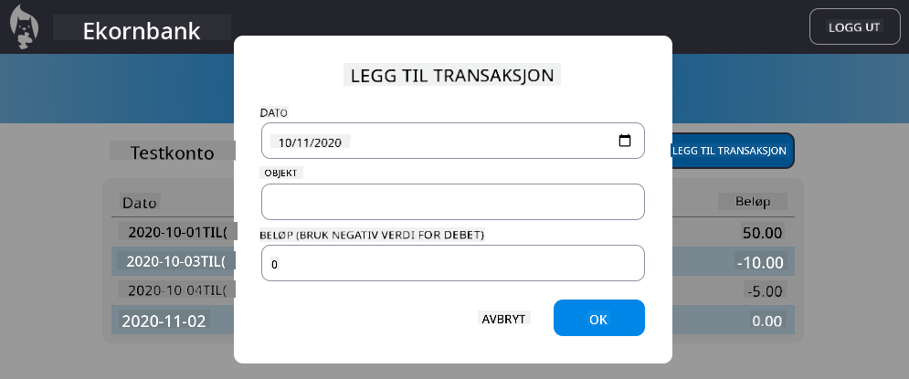

<!--
CO_OP_TRANSLATOR_METADATA:
{
  "original_hash": "4fa20c513e367e9cdd401bf49ae16e33",
  "translation_date": "2025-08-26T23:12:00+00:00",
  "source_file": "7-bank-project/4-state-management/README.md",
  "language_code": "no"
}
-->
# Bygg en bankapp del 4: Konsepter for tilstandshåndtering

## Quiz før forelesning

[Quiz før forelesning](https://ff-quizzes.netlify.app/web/quiz/47)

### Introduksjon

Etter hvert som en webapplikasjon vokser, blir det en utfordring å holde oversikt over alle dataflyter. Hvilken kode henter dataene, hvilken side bruker dem, hvor og når må de oppdateres...det er lett å ende opp med rotete kode som er vanskelig å vedlikeholde. Dette gjelder spesielt når du må dele data mellom forskjellige sider i appen din, for eksempel brukerdata. Konseptet *tilstandshåndtering* har alltid eksistert i alle typer programmer, men ettersom webapplikasjoner blir stadig mer komplekse, har det blitt et viktig punkt å tenke på under utviklingen.

I denne siste delen skal vi se på appen vi har bygget for å revurdere hvordan tilstanden håndteres, slik at vi kan støtte nettleseroppdatering når som helst og bevare data på tvers av brukersesjoner.

### Forutsetninger

Du må ha fullført [datahenting](../3-data/README.md)-delen av webappen for denne leksjonen. Du må også installere [Node.js](https://nodejs.org) og [kjøre server-API](../api/README.md) lokalt slik at du kan administrere kontodata.

Du kan teste at serveren kjører riktig ved å utføre denne kommandoen i en terminal:

```sh
curl http://localhost:5000/api
# -> should return "Bank API v1.0.0" as a result
```

---

## Revurder tilstandshåndtering

I [forrige leksjon](../3-data/README.md) introduserte vi et grunnleggende konsept for tilstand i appen vår med den globale `account`-variabelen som inneholder bankdataene for den innloggede brukeren. Men vår nåværende implementering har noen svakheter. Prøv å oppdatere siden når du er på dashbordet. Hva skjer?

Det er tre problemer med den nåværende koden:

- Tilstanden blir ikke bevart, da en nettleseroppdatering tar deg tilbake til innloggingssiden.
- Det finnes flere funksjoner som endrer tilstanden. Etter hvert som appen vokser, kan det bli vanskelig å holde oversikt over endringene, og det er lett å glemme å oppdatere én.
- Tilstanden blir ikke ryddet opp, så når du klikker på *Logg ut*, er kontodataene fortsatt der, selv om du er på innloggingssiden.

Vi kunne oppdatert koden vår for å takle disse problemene én etter én, men det ville skapt mer kode duplisering og gjort appen mer kompleks og vanskelig å vedlikeholde. Eller vi kunne tatt en pause i noen minutter og revurdert strategien vår.

> Hvilke problemer prøver vi egentlig å løse her?

[Tilstandshåndtering](https://en.wikipedia.org/wiki/State_management) handler om å finne en god tilnærming for å løse disse to spesifikke problemene:

- Hvordan holde dataflytene i en app forståelige?
- Hvordan holde tilstandsdata alltid synkronisert med brukergrensesnittet (og vice versa)?

Når du har tatt hånd om disse, kan eventuelle andre problemer du har enten allerede være løst eller blitt enklere å fikse. Det finnes mange mulige tilnærminger for å løse disse problemene, men vi skal gå for en vanlig løsning som består av **å sentralisere dataene og måtene å endre dem på**. Dataflytene vil gå slik:


> Vi dekker ikke her delen der data automatisk utløser oppdatering av visningen, da det er knyttet til mer avanserte konsepter innen [Reaktiv programmering](https://en.wikipedia.org/wiki/Reactive_programming). Det er et godt oppfølgingsemne hvis du ønsker å dykke dypere.

✅ Det finnes mange biblioteker der ute med forskjellige tilnærminger til tilstandshåndtering, [Redux](https://redux.js.org) er et populært alternativ. Ta en titt på konseptene og mønstrene som brukes, da det ofte er en god måte å lære om potensielle problemer du kan møte i store webapplikasjoner og hvordan de kan løses.

### Oppgave

Vi starter med litt refaktorering. Erstatt `account`-deklarasjonen:

```js
let account = null;
```

Med:

```js
let state = {
  account: null
};
```

Ideen er å *sentralisere* alle appdataene våre i et enkelt tilstandsobjekt. Vi har bare `account` for nå i tilstanden, så det endrer ikke mye, men det skaper en vei for videre utvikling.

Vi må også oppdatere funksjonene som bruker det. I funksjonene `register()` og `login()`, erstatt `account = ...` med `state.account = ...`;

Øverst i funksjonen `updateDashboard()`, legg til denne linjen:

```js
const account = state.account;
```

Denne refaktoreringen i seg selv har ikke gitt store forbedringer, men ideen var å legge grunnlaget for de neste endringene.

## Spor dataendringer

Nå som vi har satt opp `state`-objektet for å lagre dataene våre, er neste steg å sentralisere oppdateringene. Målet er å gjøre det enklere å holde oversikt over eventuelle endringer og når de skjer.

For å unngå at endringer gjøres direkte på `state`-objektet, er det også en god praksis å betrakte det som [*uendelig*](https://en.wikipedia.org/wiki/Immutable_object), noe som betyr at det ikke kan endres i det hele tatt. Det betyr også at du må opprette et nytt tilstandsobjekt hvis du vil endre noe i det. Ved å gjøre dette, bygger du en beskyttelse mot potensielt uønskede [sideeffekter](https://en.wikipedia.org/wiki/Side_effect_(computer_science)), og åpner opp muligheter for nye funksjoner i appen din, som å implementere angre/gjenta, samtidig som det blir enklere å feilsøke. For eksempel kan du logge hver endring som gjøres på tilstanden og holde en historikk over endringene for å forstå kilden til en feil.

I JavaScript kan du bruke [`Object.freeze()`](https://developer.mozilla.org/docs/Web/JavaScript/Reference/Global_Objects/Object/freeze) for å opprette en uendelig versjon av et objekt. Hvis du prøver å gjøre endringer på et uendelig objekt, vil det oppstå en unntak.

✅ Vet du forskjellen mellom et *grunt* og et *dypt* uendelig objekt? Du kan lese om det [her](https://developer.mozilla.org/docs/Web/JavaScript/Reference/Global_Objects/Object/freeze#What_is_shallow_freeze).

### Oppgave

La oss lage en ny `updateState()`-funksjon:

```js
function updateState(property, newData) {
  state = Object.freeze({
    ...state,
    [property]: newData
  });
}
```

I denne funksjonen oppretter vi et nytt tilstandsobjekt og kopierer data fra den forrige tilstanden ved hjelp av [*spread (`...`) operatoren*](https://developer.mozilla.org/docs/Web/JavaScript/Reference/Operators/Spread_syntax#Spread_in_object_literals). Deretter overstyrer vi en bestemt egenskap i tilstandsobjektet med de nye dataene ved hjelp av [brakettnotasjon](https://developer.mozilla.org/docs/Web/JavaScript/Guide/Working_with_Objects#Objects_and_properties) `[property]` for tildeling. Til slutt låser vi objektet for å forhindre endringer ved hjelp av `Object.freeze()`. Vi har bare `account`-egenskapen lagret i tilstanden for nå, men med denne tilnærmingen kan du legge til så mange egenskaper du trenger i tilstanden.

Vi oppdaterer også initialiseringen av `state` for å sikre at den opprinnelige tilstanden også er låst:

```js
let state = Object.freeze({
  account: null
});
```

Etter det, oppdater funksjonen `register` ved å erstatte `state.account = result;`-tildelingen med:

```js
updateState('account', result);
```

Gjør det samme med funksjonen `login`, og erstatt `state.account = data;` med:

```js
updateState('account', data);
```

Vi benytter nå anledningen til å fikse problemet med at kontodataene ikke blir ryddet opp når brukeren klikker på *Logg ut*.

Opprett en ny funksjon `logout()`:

```js
function logout() {
  updateState('account', null);
  navigate('/login');
}
```

I `updateDashboard()`, erstatt omdirigeringen `return navigate('/login');` med `return logout()`;

Prøv å registrere en ny konto, logge ut og inn igjen for å sjekke at alt fortsatt fungerer som det skal.

> Tips: Du kan se på alle tilstandsendringer ved å legge til `console.log(state)` nederst i `updateState()` og åpne konsollen i nettleserens utviklingsverktøy.

## Bevar tilstanden

De fleste webapplikasjoner trenger å bevare data for å kunne fungere korrekt. Alle kritiske data lagres vanligvis i en database og aksesseres via et server-API, som brukerens kontodata i vårt tilfelle. Men noen ganger kan det også være interessant å bevare noen data i klientappen som kjører i nettleseren, for en bedre brukeropplevelse eller for å forbedre lastetiden.

Når du ønsker å bevare data i nettleseren, er det noen viktige spørsmål du bør stille deg selv:

- *Er dataene sensitive?* Du bør unngå å lagre sensitive data på klienten, som brukerpassord.
- *Hvor lenge trenger du å beholde disse dataene?* Planlegger du å aksessere disse dataene kun for den nåværende sesjonen, eller ønsker du at de skal lagres for alltid?

Det finnes flere måter å lagre informasjon i en webapplikasjon, avhengig av hva du ønsker å oppnå. For eksempel kan du bruke URL-er til å lagre et søkespørsmål og gjøre det delbart mellom brukere. Du kan også bruke [HTTP-cookies](https://developer.mozilla.org/docs/Web/HTTP/Cookies) hvis dataene må deles med serveren, som [autentiseringsinformasjon](https://en.wikipedia.org/wiki/Authentication).

En annen mulighet er å bruke en av de mange nettleser-API-ene for lagring av data. To av dem er spesielt interessante:

- [`localStorage`](https://developer.mozilla.org/docs/Web/API/Window/localStorage): en [Key/Value store](https://en.wikipedia.org/wiki/Key%E2%80%93value_database) som lar deg bevare data spesifikke for det nåværende nettstedet på tvers av forskjellige sesjoner. Dataene som lagres i det utløper aldri.
- [`sessionStorage`](https://developer.mozilla.org/docs/Web/API/Window/sessionStorage): denne fungerer på samme måte som `localStorage`, bortsett fra at dataene som lagres i det blir slettet når sesjonen avsluttes (når nettleseren lukkes).

Merk at begge disse API-ene kun tillater lagring av [strenger](https://developer.mozilla.org/docs/Web/JavaScript/Reference/Global_Objects/String). Hvis du vil lagre komplekse objekter, må du serialisere dem til [JSON](https://developer.mozilla.org/docs/Web/JavaScript/Reference/Global_Objects/JSON)-formatet ved hjelp av [`JSON.stringify()`](https://developer.mozilla.org/docs/Web/JavaScript/Reference/Global_Objects/JSON/stringify).

✅ Hvis du ønsker å lage en webapplikasjon som ikke fungerer med en server, er det også mulig å opprette en database på klienten ved hjelp av [`IndexedDB` API](https://developer.mozilla.org/docs/Web/API/IndexedDB_API). Denne er reservert for avanserte brukstilfeller eller hvis du trenger å lagre betydelige mengder data, da den er mer kompleks å bruke.

### Oppgave

Vi ønsker at brukerne skal forbli innlogget til de eksplisitt klikker på *Logg ut*-knappen, så vi bruker `localStorage` til å lagre kontodataene. Først, la oss definere en nøkkel som vi skal bruke til å lagre dataene våre.

```js
const storageKey = 'savedAccount';
```

Legg deretter til denne linjen på slutten av `updateState()`-funksjonen:

```js
localStorage.setItem(storageKey, JSON.stringify(state.account));
```

Med dette vil brukerens kontodata bli bevart og alltid oppdatert ettersom vi tidligere sentraliserte alle tilstandsoppdateringene våre. Det er her vi begynner å dra nytte av alle våre tidligere refaktorer 🙂.

Siden dataene er lagret, må vi også ta oss av å gjenopprette dem når appen lastes. Siden vi begynner å få mer initialiseringskode, kan det være en god idé å opprette en ny `init`-funksjon, som også inkluderer vår tidligere kode nederst i `app.js`:

```js
function init() {
  const savedAccount = localStorage.getItem(storageKey);
  if (savedAccount) {
    updateState('account', JSON.parse(savedAccount));
  }

  // Our previous initialization code
  window.onpopstate = () => updateRoute();
  updateRoute();
}

init();
```

Her henter vi de lagrede dataene, og hvis det finnes noen, oppdaterer vi tilstanden tilsvarende. Det er viktig å gjøre dette *før* vi oppdaterer ruten, da det kan være kode som er avhengig av tilstanden under sideoppdateringen.

Vi kan også gjøre *Dashbord*-siden til standard siden for applikasjonen vår, ettersom vi nå bevarer kontodataene. Hvis ingen data finnes, tar dashbordet seg av å omdirigere til *Innlogging*-siden uansett. I `updateRoute()`, erstatt fallbacken `return navigate('/login');` med `return navigate('/dashboard');`.

Logg inn i appen og prøv å oppdatere siden. Du bør forbli på dashbordet. Med den oppdateringen har vi tatt hånd om alle våre opprinnelige problemer...

## Oppdater dataene

...Men vi kan også ha skapt et nytt problem. Oops!

Gå til dashbordet ved hjelp av `test`-kontoen, og kjør deretter denne kommandoen i en terminal for å opprette en ny transaksjon:

```sh
curl --request POST \
     --header "Content-Type: application/json" \
     --data "{ \"date\": \"2020-07-24\", \"object\": \"Bought book\", \"amount\": -20 }" \
     http://localhost:5000/api/accounts/test/transactions
```

Prøv å oppdatere dashbordet i nettleseren nå. Hva skjer? Ser du den nye transaksjonen?

Tilstanden blir bevart på ubestemt tid takket være `localStorage`, men det betyr også at den aldri blir oppdatert før du logger ut av appen og logger inn igjen!

En mulig strategi for å fikse det er å laste inn kontodataene på nytt hver gang dashbordet lastes, for å unngå utdaterte data.

### Oppgave

Opprett en ny funksjon `updateAccountData`:

```js
async function updateAccountData() {
  const account = state.account;
  if (!account) {
    return logout();
  }

  const data = await getAccount(account.user);
  if (data.error) {
    return logout();
  }

  updateState('account', data);
}
```

Denne metoden sjekker at vi er innlogget og laster deretter kontodataene på nytt fra serveren.

Opprett en annen funksjon kalt `refresh`:

```js
async function refresh() {
  await updateAccountData();
  updateDashboard();
}
```

Denne oppdaterer kontodataene og tar deretter hånd om å oppdatere HTML-en på dashbordet. Det er det vi trenger å kalle når dashbordruten lastes. Oppdater rutedefinisjonen med:

```js
const routes = {
  '/login': { templateId: 'login' },
  '/dashboard': { templateId: 'dashboard', init: refresh }
};
```

Prøv å oppdatere dashbordet nå, det bør vise de oppdaterte kontodataene.

---

## 🚀 Utfordring

Nå som vi laster inn kontodataene på nytt hver gang dashbordet lastes, tror du vi fortsatt trenger å bevare *alle kontodataene*?

Prøv å jobbe sammen for å endre hva som lagres og lastes fra `localStorage` til kun å inkludere det som er absolutt nødvendig for at appen skal fungere.

## Quiz etter forelesning
[Etter-forelesning quiz](https://ff-quizzes.netlify.app/web/quiz/48)

## Oppgave

[Implementer "Legg til transaksjon"-dialog](assignment.md)

Her er et eksempel på resultatet etter å ha fullført oppgaven:



---

**Ansvarsfraskrivelse**:  
Dette dokumentet er oversatt ved hjelp av AI-oversettelsestjenesten [Co-op Translator](https://github.com/Azure/co-op-translator). Selv om vi tilstreber nøyaktighet, vær oppmerksom på at automatiserte oversettelser kan inneholde feil eller unøyaktigheter. Det originale dokumentet på sitt opprinnelige språk bør anses som den autoritative kilden. For kritisk informasjon anbefales profesjonell menneskelig oversettelse. Vi er ikke ansvarlige for eventuelle misforståelser eller feiltolkninger som oppstår ved bruk av denne oversettelsen.