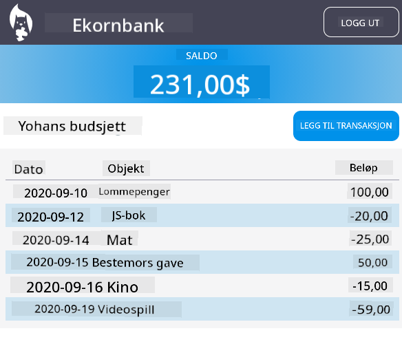

<!--
CO_OP_TRANSLATOR_METADATA:
{
  "original_hash": "830359535306594b448db6575ce5cdee",
  "translation_date": "2025-08-26T22:52:06+00:00",
  "source_file": "7-bank-project/README.md",
  "language_code": "no"
}
-->
# :dollar: Bygg en Bank

I dette prosjektet lærer du hvordan du bygger en fiktiv bank. Disse leksjonene inkluderer instruksjoner om hvordan du setter opp en webapp med ruter, bygger skjemaer, håndterer tilstand, og henter data fra en API som gir tilgang til bankens data.

|  |  |
|--------------------------------|--------------------------------|

## Leksjoner

1. [HTML-maler og ruter i en webapp](1-template-route/README.md)
2. [Bygg et innloggings- og registreringsskjema](2-forms/README.md)
3. [Metoder for å hente og bruke data](3-data/README.md)
4. [Konsepter innen tilstandshåndtering](4-state-management/README.md)

### Krediteringer

Disse leksjonene ble skrevet med :hearts: av [Yohan Lasorsa](https://twitter.com/sinedied).

Hvis du er interessert i å lære hvordan du bygger [server-APIet](/7-bank-project/api/README.md) som brukes i disse leksjonene, kan du følge [denne videoserien](https://aka.ms/NodeBeginner) (spesielt videoene 17 til 21).

Du kan også ta en titt på [denne interaktive Learn-veiledningen](https://aka.ms/learn/express-api).

---

**Ansvarsfraskrivelse**:  
Dette dokumentet er oversatt ved hjelp av AI-oversettelsestjenesten [Co-op Translator](https://github.com/Azure/co-op-translator). Selv om vi streber etter nøyaktighet, vær oppmerksom på at automatiserte oversettelser kan inneholde feil eller unøyaktigheter. Det originale dokumentet på sitt opprinnelige språk bør anses som den autoritative kilden. For kritisk informasjon anbefales profesjonell menneskelig oversettelse. Vi er ikke ansvarlige for misforståelser eller feiltolkninger som oppstår ved bruk av denne oversettelsen.