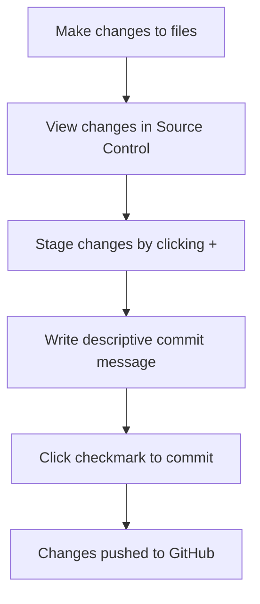

<!--
CO_OP_TRANSLATOR_METADATA:
{
  "original_hash": "cfd4a15974168ca426d50c67682ab9d4",
  "translation_date": "2025-10-23T22:18:02+00:00",
  "source_file": "8-code-editor/1-using-a-code-editor/README.md",
  "language_code": "no"
}
-->
# Bruke en kodeeditor: Mestre VSCode.dev

Husker du i *The Matrix* da Neo måtte koble seg til en enorm datamaskinterminal for å få tilgang til den digitale verden? Dagens verktøy for webutvikling er det motsatte – utrolig kraftige funksjoner tilgjengelig fra hvor som helst. VSCode.dev er en nettleserbasert kodeeditor som gir profesjonelle utviklingsverktøy til enhver enhet med internettforbindelse.

Akkurat som trykkpressen gjorde bøker tilgjengelige for alle, ikke bare munker i klostre, demokratiserer VSCode.dev koding. Du kan jobbe med prosjekter fra en bibliotekdatamaskin, et skolelaboratorium eller hvor som helst du har tilgang til en nettleser. Ingen installasjoner, ingen "jeg trenger min spesifikke oppsett"-begrensninger.

Ved slutten av denne leksjonen vil du forstå hvordan du navigerer i VSCode.dev, åpner GitHub-repositorier direkte i nettleseren og bruker Git for versjonskontroll – ferdigheter som profesjonelle utviklere bruker daglig.

## Hva du vil lære

Etter at vi har gått gjennom dette sammen, vil du kunne:

- Navigere i VSCode.dev som om det er ditt andre hjem – finne alt du trenger uten å gå deg vill
- Åpne ethvert GitHub-repositorium i nettleseren og begynne å redigere umiddelbart (dette er ganske magisk!)
- Bruke Git til å spore endringer og lagre fremgangen din som en proff
- Forbedre editoren din med utvidelser som gjør koding raskere og morsommere
- Opprette og organisere prosjektfiler med selvtillit

## Hva du trenger

Kravene er enkle:

- En gratis [GitHub-konto](https://github.com) (vi guider deg gjennom opprettelsen hvis nødvendig)
- Grunnleggende kjennskap til nettlesere
- Leksjonen "GitHub Basics" gir nyttig bakgrunn, selv om det ikke er essensielt

> 💡 **Ny på GitHub?** Å opprette en konto er gratis og tar bare noen minutter. Akkurat som et bibliotekskort gir deg tilgang til bøker over hele verden, åpner en GitHub-konto dørene til kode-repositorier på internett.

## Hvorfor nettbaserte kodeeditorer er viktige

Før internett kunne ikke forskere ved forskjellige universiteter enkelt dele forskning. Så kom ARPANET på 1960-tallet, som koblet datamaskiner over avstander. Nettbaserte kodeeditorer følger samme prinsipp – de gjør kraftige verktøy tilgjengelige uansett fysisk plassering eller enhet.

En kodeeditor fungerer som ditt utviklingsarbeidsområde, der du skriver, redigerer og organiserer kodefiler. I motsetning til enkle teksteditorer gir profesjonelle kodeeditorer syntaksutheving, feildeteksjon og prosjektstyringsfunksjoner.

VSCode.dev bringer disse funksjonene til nettleseren din:

**Fordeler med nettbasert redigering:**

| Funksjon | Beskrivelse | Praktisk fordel |
|---------|-------------|----------|
| **Plattformuavhengighet** | Fungerer på enhver enhet med en nettleser | Jobb sømløst fra forskjellige datamaskiner |
| **Ingen installasjon nødvendig** | Tilgang via en nettadresse | Omgår restriksjoner på programvareinstallasjon |
| **Automatiske oppdateringer** | Kjører alltid den nyeste versjonen | Tilgang til nye funksjoner uten manuelle oppdateringer |
| **Repository-integrasjon** | Direkte kobling til GitHub | Rediger kode uten lokal filhåndtering |

**Praktiske implikasjoner:**
- Arbeidskontinuitet på tvers av ulike miljøer
- Konsistent grensesnitt uavhengig av operativsystem
- Umiddelbare samarbeidsmuligheter
- Reduserte krav til lokal lagring

## Utforske VSCode.dev

Akkurat som Marie Curies laboratorium inneholdt sofistikert utstyr i et relativt enkelt rom, pakker VSCode.dev profesjonelle utviklingsverktøy inn i et nettlesergrensesnitt. Denne webapplikasjonen gir samme kjernefunksjonalitet som stasjonære kodeeditorer.

Start med å navigere til [vscode.dev](https://vscode.dev) i nettleseren din. Grensesnittet lastes uten nedlastinger eller systeminstallasjoner – en direkte anvendelse av prinsippene for skybasert databehandling.

### Koble til GitHub-kontoen din

Akkurat som Alexander Graham Bells telefon koblet fjerne steder sammen, kobler tilknytningen av GitHub-kontoen din VSCode.dev med dine kode-repositorier. Når du blir bedt om å logge inn med GitHub, anbefales det å godta denne tilkoblingen.

**GitHub-integrasjon gir:**
- Direkte tilgang til dine repositorier i editoren
- Synkroniserte innstillinger og utvidelser på tvers av enheter
- Strømlinjeformet lagringsarbeidsflyt til GitHub
- Personlig utviklingsmiljø

### Bli kjent med ditt nye arbeidsområde

Når alt er lastet opp, vil du se et vakkert rent arbeidsområde som er designet for å holde deg fokusert på det som betyr noe – koden din!

**Her er din omvisning i nabolaget:**
- **Aktivitetslinjen** (stripen til venstre): Din hovednavigasjon med Utforsker 📁, Søk 🔍, Versjonskontroll 🌿, Utvidelser 🧩 og Innstillinger ⚙️
- **Sidepanelet** (panelet ved siden av): Endres for å vise relevant informasjon basert på hva du har valgt
- **Editorområdet** (det store rommet i midten): Her skjer magien – ditt hovedområde for koding

**Ta deg tid til å utforske:**
- Klikk rundt på ikonene i aktivitetslinjen og se hva hver enkelt gjør
- Legg merke til hvordan sidepanelet oppdateres for å vise forskjellig informasjon – ganske kult, ikke sant?
- Utforskervisningen (📁) er sannsynligvis der du vil tilbringe mesteparten av tiden din, så bli komfortabel med den

## Åpne GitHub-repositorier

Før internett måtte forskere fysisk reise til biblioteker for å få tilgang til dokumenter. GitHub-repositorier fungerer på lignende måte – de er samlinger av kode lagret eksternt. VSCode.dev eliminerer det tradisjonelle trinnet med å laste ned repositorier til din lokale maskin før redigering.

Denne funksjonen gir umiddelbar tilgang til ethvert offentlig repositorium for visning, redigering eller bidrag. Her er to metoder for å åpne repositorier:

### Metode 1: Den enkle måten

Dette er perfekt når du starter ferskt i VSCode.dev og vil åpne et spesifikt repositorium. Det er enkelt og nybegynnervennlig:

**Slik gjør du det:**

1. Gå til [vscode.dev](https://vscode.dev) hvis du ikke allerede er der
2. Se etter knappen "Open Remote Repository" på velkomstskjermen og klikk på den

   

3. Lim inn en hvilken som helst GitHub-repositorium-URL (prøv denne: `https://github.com/microsoft/Web-Dev-For-Beginners`)
4. Trykk Enter og se magien skje!

**Proff-tips - Snarveien til kommandopaletten:**

Vil du føle deg som en kode-trollmann? Prøv denne tastatursnarveien: Ctrl+Shift+P (eller Cmd+Shift+P på Mac) for å åpne kommandopaletten:

**Kommandopaletten er som en søkemotor for alt du kan gjøre:**
- Skriv "open remote" og den finner repositorium-åpneren for deg
- Den husker repositorier du har åpnet nylig (superpraktisk!)
- Når du blir vant til den, vil du føle deg som om du koder i lynets hastighet
- Det er i bunn og grunn VSCode.dev sin versjon av "Hei Siri, men for koding"

### Metode 2: URL-modifikasjonsteknikk

Akkurat som HTTP og HTTPS bruker forskjellige protokoller mens de opprettholder samme domenestruktur, bruker VSCode.dev et URL-mønster som speiler GitHubs adresseringssystem. Enhver GitHub-repositorium-URL kan modifiseres for å åpnes direkte i VSCode.dev.

**URL-transformasjonsmønster:**

| Type repositorium | GitHub URL | VSCode.dev URL |
|----------------|---------------------|----------------|
| **Offentlig repositorium** | `github.com/microsoft/Web-Dev-For-Beginners` | `vscode.dev/github/microsoft/Web-Dev-For-Beginners` |
| **Personlig prosjekt** | `github.com/your-username/my-project` | `vscode.dev/github/your-username/my-project` |
| **Ethvert tilgjengelig repo** | `github.com/their-username/awesome-repo` | `vscode.dev/github/their-username/awesome-repo` |

**Implementering:**
- Erstatt `github.com` med `vscode.dev/github`
- Behold alle andre URL-komponenter uendret
- Fungerer med ethvert offentlig tilgjengelig repositorium
- Gir umiddelbar redigeringstilgang

> 💡 **Livsendrende tips**: Bokmerk VSCode.dev-versjonene av dine favoritt-repositorier. Jeg har bokmerker som "Rediger min portefølje" og "Fiks dokumentasjon" som tar meg rett til redigeringsmodus!

**Hvilken metode bør du bruke?**
- **Grensesnittmetoden**: Flott når du utforsker eller ikke husker eksakte repositorium-navn
- **URL-trikset**: Perfekt for lynrask tilgang når du vet nøyaktig hvor du skal

## Arbeide med filer og prosjekter

Nå som du har åpnet et repositorium, la oss begynne å bygge! VSCode.dev gir deg alt du trenger for å opprette, redigere og organisere kodefiler. Tenk på det som ditt digitale verksted – hvert verktøy er akkurat der du trenger det.

La oss dykke inn i de daglige oppgavene som vil utgjøre mesteparten av din kodearbeidsflyt.

### Opprette nye filer

Akkurat som å organisere tegninger på et arkitektkontor, følger filoppretting i VSCode.dev en strukturert tilnærming. Systemet støtter alle standard filtyper for webutvikling.

**Prosess for filoppretting:**

1. Naviger til målmappen i Utforsker-sidepanelet
2. Hold musepekeren over mappenavnet for å avsløre ikonet "Ny fil" (📄+)
3. Skriv inn filnavnet inkludert riktig filtype (`style.css`, `script.js`, `index.html`)
4. Trykk Enter for å opprette filen

**Navnekonvensjoner:**
- Bruk beskrivende navn som indikerer filens formål
- Inkluder filtyper for riktig syntaksutheving
- Følg konsistente navnemønstre gjennom prosjekter
- Bruk små bokstaver og bindestreker i stedet for mellomrom

### Redigere og lagre filer

Her begynner moroa! VSCode.dev sin editor er fullpakket med nyttige funksjoner som gjør koding smidig og intuitiv. Det er som å ha en veldig smart skriveassistent, men for kode.

**Din redigeringsarbeidsflyt:**

1. Klikk på en hvilken som helst fil i Utforsker for å åpne den i hovedområdet
2. Begynn å skrive og se hvordan VSCode.dev hjelper deg med farger, forslag og feildeteksjon
3. Lagre arbeidet ditt med Ctrl+S (Windows/Linux) eller Cmd+S (Mac) – selv om det også auto-lagrer!

**De kule tingene som skjer mens du koder:**
- Koden din blir vakkert fargekodet, så den er lett å lese
- VSCode.dev foreslår fullføringer mens du skriver (som autokorrektur, men mye smartere)
- Den fanger opp skrivefeil og feil før du engang lagrer
- Du kan ha flere filer åpne i faner, akkurat som i en nettleser
- Alt lagres automatisk i bakgrunnen

> ⚠️ **Raskt tips**: Selv om auto-lagring har ryggen din, er det fortsatt en god vane å trykke Ctrl+S eller Cmd+S. Det lagrer alt umiddelbart og utløser noen ekstra nyttige funksjoner som feilsjekking.

### Versjonskontroll med Git

Akkurat som arkeologer lager detaljerte opptegnelser av utgravningslag, sporer Git endringer i koden din over tid. Dette systemet bevarer prosjektets historie og lar deg gå tilbake til tidligere versjoner når det er nødvendig. VSCode.dev inkluderer integrert Git-funksjonalitet.

**Grensesnitt for versjonskontroll:**

1. Få tilgang til panelet for versjonskontroll via 🌿-ikonet i aktivitetslinjen
2. Endrede filer vises i seksjonen "Changes"
3. Fargekoding indikerer endringstyper: grønn for tillegg, rød for slettinger

**Lagre arbeidet ditt (commit-arbeidsflyt):**

**Her er din trinnvise prosess:**
- Klikk på "+"-ikonet ved siden av filene du vil lagre (dette "stager" dem)
- Dobbeltsjekk at du er fornøyd med alle dine stagede endringer
- Skriv en kort notat som forklarer hva du gjorde (dette er din "commit-melding")
- Klikk på hakeknappen for å lagre alt til GitHub
- Hvis du ombestemmer deg om noe, lar angre-ikonet deg forkaste endringer

**Skrive gode commit-meldinger (det er enklere enn du tror!):**
- Bare beskriv hva du gjorde, som "Legg til kontaktskjema" eller "Fiks ødelagt navigasjon"
- Hold det kort og konsist – tenk tweet-lengde, ikke essay
- Start med handlingsord som "Legg til", "Fiks", "Oppdater" eller "Fjern"
- **Gode eksempler**: "Legg til responsiv navigasjonsmeny", "Fiks mobiloppsettproblemer", "Oppdater farger for bedre tilgjengelighet"

> 💡 **Rask navigasjonstips**: Bruk hamburger-menyen (☰) øverst til venstre for å hoppe tilbake til GitHub-repositoriet ditt og se dine commit-endringer online. Det er som en portal mellom ditt redigeringsmiljø og prosjektets hjem på GitHub!

## Forbedre funksjonalitet med utvidelser

Akkurat som en håndverkers verksted inneholder spesialverktøy for forskjellige oppgaver, kan VSCode.dev tilpasses med utvidelser som legger til spesifikke funksjoner. Disse fellesskapsutviklede pluginene adresserer vanlige utviklingsbehov som kodeformatering, live forhåndsvisning og forbedret Git-integrasjon.

Utvidelsesmarkedet inneholder tusenvis av gratis verktøy laget av utviklere over hele verden. Hver utvidelse løser spesifikke arbeidsflytutfordringer, slik at du kan bygge et personlig utviklingsmiljø tilpasset dine spesifikke behov og preferanser.

### Finne dine perfekte utvidelser

Utvidelsesmarkedet er veldig godt organisert, så du vil ikke gå deg vill når du prøver å finne det du trenger. Det er designet for å hjelpe deg med å oppdage både spesifikke verktøy og kule ting du ikke engang visste eksisterte!

**Få tilgang til markedet:**

1. Klikk på Utvidelser-ikonet (🧩) i aktivitetslinjen
2. Bla rundt eller søk etter noe spesifikt
3. Klikk på alt som ser interessant ut for å lære mer om det

**Hva du vil se der inne:**

| Seksjon | Hva som er inni | Hvorfor det er nyttig |
|----------|---------|----------|
| **Installert** | Utvidelser du allerede har lagt til | Din personlige kodeverktøykasse |
| **Populær** | Favorittene blant utviklere | Det de fleste utviklere sverger til |
| **Anbefalt** | Smarte forslag for prosjektet ditt | VSCode.dev sine nyttige anbefalinger |

**Hva som gjør det enkelt å bla:**
- Hver utvidelse viser vurderinger, antall nedlastinger og ekte brukeranmeldelser
- Du får skjermbilder og klare beskrivelser av hva hver enkelt gjør
- Alt er tydelig merket med kompatibilitetsinformasjon
- Lignende utvidelser foreslås slik at du kan sammenligne alternativer

### Installere utvidelser (Det er superenkelt!)

Å legge til nye funksjoner i editoren din er like enkelt som å klikke på en knapp. Utvidelser installeres på sekunder og begynner å fungere umiddelbart – ingen omstarter, ingen venting.

**Her er alt du trenger å gjøre:**

1. Søk etter det du ønsker (prøv å søke etter "live server" eller "prettier")
2. Klikk på en som ser bra ut for å se flere detaljer
3. Les gjennom hva den gjør og sjekk vurderingene
4. Trykk på den blå "Install" knappen, og du er ferdig!

**Hva skjer i bakgrunnen:**
- Utvidelsen lastes ned og konfigurerer seg selv automatisk
- Nye funksjoner vises i grensesnittet ditt med en gang
- Alt begynner å fungere umiddelbart (seriøst, det er så raskt!)
- Hvis du er logget inn, synkroniseres utvidelsen til alle enhetene dine

**Noen utvidelser jeg anbefaler å starte med:**
- **Live Server**: Se nettstedet ditt oppdatere seg i sanntid mens du koder (denne er magisk!)
- **Prettier**: Gjør koden din ren og profesjonell automatisk
- **Auto Rename Tag**: Endre én HTML-tag, og partneren oppdateres også
- **Bracket Pair Colorizer**: Fargekoder parentesene dine, så du aldri mister oversikten
- **GitLens**: Gir deg superkrefter i Git med masse nyttig informasjon

### Tilpasse utvidelsene dine

De fleste utvidelser har innstillinger du kan justere for å få dem til å fungere akkurat slik du ønsker. Tenk på det som å justere setet og speilene i en bil – alle har sine preferanser!

**Juster innstillingene for utvidelser:**

1. Finn den installerte utvidelsen din i Utvidelsespanelet
2. Se etter det lille tannhjulikonet (⚙️) ved siden av navnet og klikk på det
3. Velg "Extension Settings" fra rullegardinmenyen
4. Juster innstillingene til de passer perfekt for arbeidsflyten din

**Vanlige ting du kanskje vil justere:**
- Hvordan koden din blir formatert (tabulatorer vs mellomrom, linjelengde, osv.)
- Hvilke hurtigtaster som utløser ulike handlinger
- Hvilke filtyper utvidelsen skal fungere med
- Slå spesifikke funksjoner av eller på for å holde ting ryddig

### Organisere utvidelsene dine

Etter hvert som du oppdager flere kule utvidelser, vil du gjerne holde samlingen din ryddig og velfungerende. VSCode.dev gjør det veldig enkelt å administrere.

**Dine alternativer for utvidelsesadministrasjon:**

| Hva du kan gjøre | Når det er nyttig | Tips |
|--------|---------|----------|
| **Deaktiver** | Teste om en utvidelse forårsaker problemer | Bedre enn å avinstallere hvis du kanskje vil ha den tilbake |
| **Avinstaller** | Fullstendig fjerne utvidelser du ikke trenger | Holder miljøet ditt rent og raskt |
| **Oppdater** | Få de nyeste funksjonene og feilrettingene | Skjer vanligvis automatisk, men verdt å sjekke |

**Hvordan jeg liker å administrere utvidelser:**
- Hver noen måneder går jeg gjennom hva jeg har installert og fjerner det jeg ikke bruker
- Jeg holder utvidelsene oppdatert for å få de nyeste forbedringene og sikkerhetsrettingene
- Hvis noe virker tregt, deaktiverer jeg midlertidig utvidelser for å se om en av dem er årsaken
- Jeg leser oppdateringsnotatene når utvidelser får store oppdateringer – noen ganger er det kule nye funksjoner!

> ⚠️ **Ytelsestips**: Utvidelser er fantastiske, men å ha for mange kan gjøre ting tregere. Fokuser på de som virkelig gjør livet ditt enklere, og ikke vær redd for å avinstallere de du aldri bruker.

## GitHub Copilot Agent Challenge 🚀

Som den strukturerte tilnærmingen NASA bruker for romoppdrag, innebærer denne utfordringen systematisk bruk av VSCode.dev-ferdigheter i et komplett arbeidsflytscenario.

**Mål:** Demonstrere ferdigheter med VSCode.dev ved å etablere en omfattende arbeidsflyt for webutvikling.

**Prosjektkrav:** Ved hjelp av Agent-modus assistanse, fullfør disse oppgavene:
1. Fork en eksisterende repository eller opprett en ny
2. Etabler en funksjonell prosjektstruktur med HTML-, CSS- og JavaScript-filer
3. Installer og konfigurer tre utvidelser som forbedrer utviklingen
4. Øv på versjonskontroll med beskrivende commit-meldinger
5. Eksperimenter med opprettelse og modifikasjon av feature branches
6. Dokumenter prosessen og lærdommene i en README.md-fil

Denne øvelsen konsoliderer alle VSCode.dev-konsepter i en praktisk arbeidsflyt som kan brukes i fremtidige utviklingsprosjekter.

Lær mer om [agent mode](https://code.visualstudio.com/blogs/2025/02/24/introducing-copilot-agent-mode) her.

## Oppgave

Tid for å teste disse ferdighetene i praksis! Jeg har et praktisk prosjekt som lar deg øve på alt vi har dekket: [Lag en CV-nettside ved hjelp av VSCode.dev](./assignment.md)

Denne oppgaven veileder deg gjennom å bygge en profesjonell CV-nettside helt i nettleseren din. Du vil bruke alle VSCode.dev-funksjonene vi har utforsket, og når du er ferdig, vil du ha både en flott nettside og solid selvtillit i din nye arbeidsflyt.

## Fortsett å utforske og utvikle ferdighetene dine

Du har nå et solid grunnlag, men det er så mye mer kult å oppdage! Her er noen ressurser og ideer for å ta VSCode.dev-ferdighetene dine til neste nivå:

**Offisielle dokumenter verdt å bokmerke:**
- [VSCode Web Documentation](https://code.visualstudio.com/docs/editor/vscode-web?WT.mc_id=academic-0000-alfredodeza) – Den komplette guiden til nettleserbasert redigering
- [GitHub Codespaces](https://docs.github.com/en/codespaces) – For når du vil ha enda mer kraft i skyen

**Kule funksjoner å eksperimentere med neste gang:**
- **Hurtigtaster**: Lær tastatursnarveiene som får deg til å føle deg som en kode-ninja
- **Arbeidsområdeinnstillinger**: Sett opp forskjellige miljøer for ulike typer prosjekter
- **Multi-root Workspaces**: Arbeid med flere repositories samtidig (superpraktisk!)
- **Terminalintegrasjon**: Få tilgang til kommandolinjeverktøy direkte i nettleseren

**Ideer for å øve:**
- Delta i noen open-source prosjekter og bidra ved hjelp av VSCode.dev – det er en flott måte å gi tilbake!
- Prøv ut forskjellige utvidelser for å finne den perfekte oppsettet
- Lag prosjekttemplater for de typene nettsteder du bygger oftest
- Øv på Git-arbeidsflyter som branching og merging – disse ferdighetene er gull verdt i teamprosjekter

---

**Du har mestret nettleserbasert utvikling!** 🎉 Akkurat som oppfinnelsen av bærbare instrumenter gjorde det mulig for forskere å utføre forskning på avsidesliggende steder, gjør VSCode.dev det mulig med profesjonell koding fra enhver enhet med internettforbindelse.

Disse ferdighetene reflekterer dagens bransjepraksis – mange profesjonelle utviklere bruker skybaserte utviklingsmiljøer for deres fleksibilitet og tilgjengelighet. Du har lært en arbeidsflyt som skalerer fra individuelle prosjekter til store team-samarbeid.

Bruk disse teknikkene i ditt neste utviklingsprosjekt! 🚀

---

**Ansvarsfraskrivelse**:  
Dette dokumentet er oversatt ved hjelp av AI-oversettelsestjenesten [Co-op Translator](https://github.com/Azure/co-op-translator). Selv om vi tilstreber nøyaktighet, vær oppmerksom på at automatiserte oversettelser kan inneholde feil eller unøyaktigheter. Det originale dokumentet på sitt opprinnelige språk bør anses som den autoritative kilden. For kritisk informasjon anbefales profesjonell menneskelig oversettelse. Vi er ikke ansvarlige for misforståelser eller feiltolkninger som oppstår ved bruk av denne oversettelsen.