# Bruke en kodeeditor: Mestre VSCode.dev

Husker du i *The Matrix* da Neo måtte koble seg til en enorm dataterminal for å få tilgang til den digitale verden? Dagens webutviklingsverktøy er den motsatte historien – utrolig kraftige verktøy som er tilgjengelige fra hvor som helst. VSCode.dev er en nettleserbasert kodeeditor som bringer profesjonelle utviklingsverktøy til enhver enhet med internettforbindelse.

Akkurat som trykkpressen gjorde bøker tilgjengelige for alle, ikke bare skrivere i klostre, demokratiserer VSCode.dev programmering. Du kan jobbe på prosjekter fra en bibliotek-PC, et skolelaboratorium eller hvor som helst du har nettlesertilgang. Ingen installasjoner, ingen "jeg trenger min spesifikke oppsett"-begrensninger.

Innen slutten av denne leksjonen vil du forstå hvordan du navigerer i VSCode.dev, åpner GitHub-repositorier direkte i nettleseren, og bruker Git for versjonskontroll – alle ferdigheter som profesjonelle utviklere bruker daglig.

## ⚡ Hva du kan gjøre på de neste 5 minuttene

**Rask start for travle utviklere**


- **Minutt 1**: Gå til [vscode.dev](https://vscode.dev) – ingen installasjon nødvendig
- **Minutt 2**: Logg inn med GitHub for å koble til repoene dine
- **Minutt 3**: Prøv URL-trikset: endre `github.com` til `vscode.dev/github` i hvilken som helst repo-URL
- **Minutt 4**: Lag en ny fil og se syntaksutheving fungere automatisk
- **Minutt 5**: Gjør en endring og forplikt den gjennom Kildekontroll-panelet

**Rask test-URL**:  
```
# Transform this:
github.com/microsoft/Web-Dev-For-Beginners

# Into this:
vscode.dev/github/microsoft/Web-Dev-For-Beginners
```
  
**Hvorfor dette er viktig**: På 5 minutter vil du erfare friheten til å kode hvor som helst med profesjonelle verktøy. Dette representerer fremtidens utvikling – tilgjengelig, kraftig, og umiddelbar.

## 🗺️ Din læringsreise gjennom skybasert utvikling

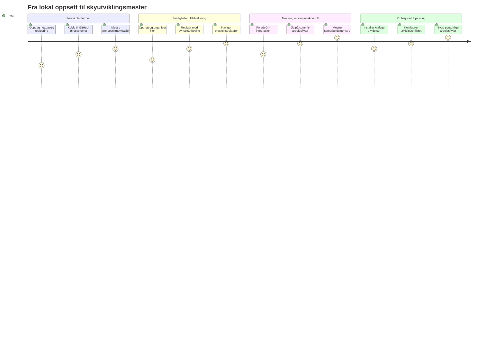
**Din reisemål**: Innen slutten av denne leksjonen vil du ha mestret et profesjonelt sky-utviklingsmiljø som fungerer fra hvilken som helst enhet, og gjør at du kan kode med de samme verktøyene som utviklere i store teknologiselskaper bruker.

## Hva du vil lære

Etter at vi har gått gjennom dette sammen, vil du kunne:

- Navigere VSCode.dev som om det var ditt andre hjem – finne alt du trenger uten å gå deg bort
- Åpne hvilket som helst GitHub-repositorium i nettleseren og begynne å redigere umiddelbart (denne er ganske magisk!)
- Bruke Git for å spore dine endringer og lagre fremdriften som en proff
- Forbedre editoren med utvidelser som gjør koding raskere og morsommere
- Opprette og organisere prosjektfiler med selvtillit

## Hva du trenger

Kravene er enkle:

- En gratis [GitHub-konto](https://github.com) (vi guider deg gjennom opprettelsen ved behov)
- Grunnleggende kjennskap til nettlesere
- GitHub Basics-leksjonen gir nyttig bakgrunn, men er ikke nødvendig

> 💡 **Ny på GitHub?** Å opprette en konto er gratis og tar bare minutter. Som et bibliotekskort gir deg tilgang til bøker verden rundt, åpner en GitHub-konto dører til kode-repositorier over hele internett.

## 🧠 Oversikt over skyutviklingsøkosystemet

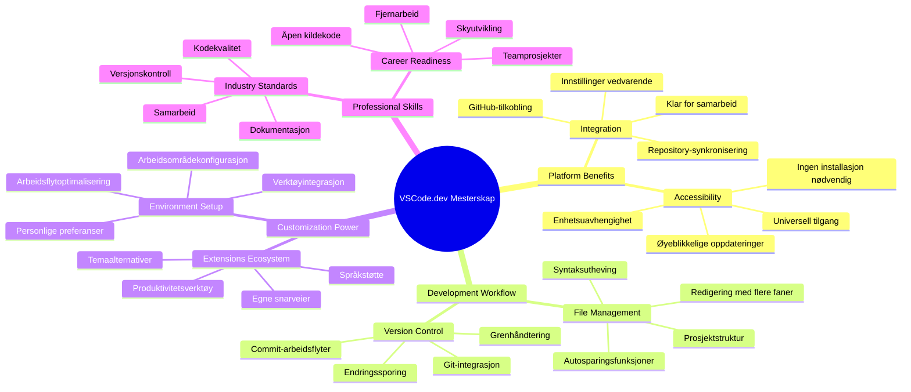
**Kjerneprinsipp**: Skybaserte utviklingsmiljøer representerer fremtiden for koding – de tilbyr profesjonelle verktøy som er tilgjengelige, samarbeidende og plattformuavhengige.

## Hvorfor nettleserbaserte kodeeditorer er viktige

Før internett kunne ikke forskere ved ulike universiteter enkelt dele forskning. Så kom ARPANET på 1960-tallet, som koblet datamaskiner på tvers av avstander. Nettleserbaserte kodeeditorer følger samme prinsipp – de gjør kraftige verktøy tilgjengelige uansett hvor du fysisk befinner deg eller hvilken enhet du bruker.

En kodeeditor fungerer som ditt utviklingsarbeidsområde, hvor du skriver, redigerer og organiserer kodefiler. I motsetning til enkle teksteditorer tilbyr profesjonelle kodeeditorer syntaksutheving, feildeteksjon og prosjektstyringsfunksjoner.

VSCode.dev bringer disse funksjonene til nettleseren din:

**Fordeler med web-basert redigering:**

| Funksjon | Beskrivelse | Praktisk fordel |
|---------|-------------|----------|
| **Plattformuavhengighet** | Kjører på hvilken som helst enhet med nettleser | Jobb sømløst fra forskjellige maskiner |
| **Ingen installasjon nødvendig** | Tilgang gjennom web-URL | Omgå programvareinstallasjonsbegrensninger |
| **Automatiske oppdateringer** | Kjører alltid siste versjon | Få nye funksjoner uten manuelle oppdateringer |
| **Integrasjon med repoer** | Direkte kobling til GitHub | Rediger kode uten lokal filhåndtering |

**Praktiske konsekvenser:**
- Arbeidsflyt kontinuerlig på tvers av miljøer
- Konsistent grensesnitt uavhengig av operativsystem
- Umiddelbare samarbeidsmuligheter
- Redusert krav til lokal lagringsplass

## Utforske VSCode.dev

Akkurat som Marie Curies laboratorium inneholdt avansert utstyr i et relativt enkelt rom, pakker VSCode.dev profesjonelle utviklingsverktøy inn i en nettlesergrensesnitt. Denne webapplikasjonen leverer kjernefunksjonaliteten som stasjonære kodeeditorer har.

Start med å gå til [vscode.dev](https://vscode.dev) i nettleseren din. Grensesnittet lastes uten nedlastinger eller systeminstallasjoner – en direkte anvendelse av skyteknologiprinsipper.

### Koble til GitHub-kontoen din

Akkurat som Alexander Graham Bells telefon koblet fjerne steder sammen, kobler du med GitHub-kontoen din VSCode.dev til kode-repositoriene dine. Når du blir bedt om å logge inn med GitHub, anbefales det å godta denne tilkoblingen.

**GitHub-integrasjon gir:**
- Direkte tilgang til repoene dine i editoren
- Synkroniserte innstillinger og utvidelser på tvers av enheter
- Strømlinjeformet lagringsflyt til GitHub
- Personlig utviklingsmiljø

### Bli kjent med ditt nye arbeidsområde

Når alt er lastet inn, vil du se et vakkert rent arbeidsområde som er designet for å holde deg fokusert på det som betyr noe – koden din!

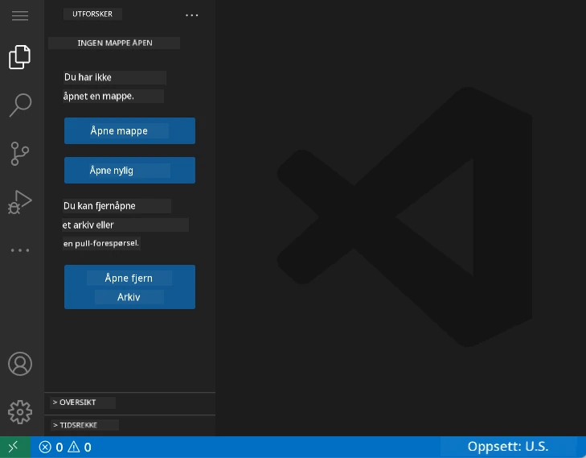

**Her er din omvisning i nabolaget:**
- **Aktivitetslinjen** (den stripen til venstre): Hovednavigasjonen din med Explorer 📁, Søk 🔍, Kildekontroll 🌿, Utvidelser 🧩, og Innstillinger ⚙️
- **Sidelinjen** (panelet ved siden av): Endrer seg for å vise relevant informasjon basert på det du har valgt
- **Redigeringsområdet** (det store midtområdet): Her skjer magien – ditt hovedområde for koding

**Ta et øyeblikk til å utforske:**
- Klikk på ikonene i Aktivitetslinjen og se hva hver enkelt gjør
- Legg merke til hvordan sidelinjen oppdateres med forskjellig informasjon – ganske kult, ikke sant?
- Explorer-visningen (📁) er sannsynligvis der du vil tilbringe mest tid, så bli komfortabel med den

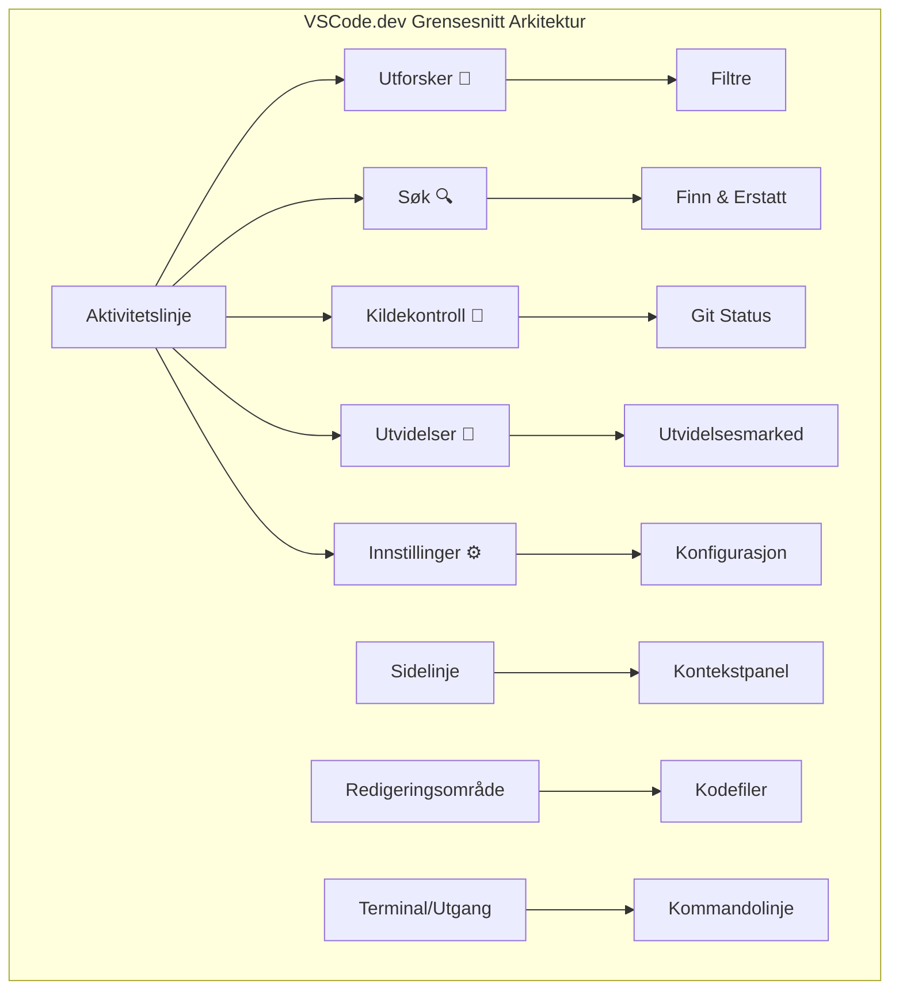
## Åpne GitHub-repositorier

Før internett måtte forskere fysisk reise til biblioteker for å få tilgang til dokumenter. GitHub-repositorier fungerer på lignende måte – de er samlinger kode lagret eksternt. VSCode.dev eliminerer det tradisjonelle steget med å laste ned repoer til din lokale maskin før redigering.

Denne muligheten gir umiddelbar tilgang til alle offentlige repoer for visning, redigering eller bidrag. Her er to metoder for å åpne repoer:

### Metode 1: Punkt-og-klikk-måten

Dette passer perfekt når du er i gang i VSCode.dev og vil åpne et spesifikt repo. Det er enkelt og nybegynnervennlig:

**Slik gjør du det:**

1. Gå til [vscode.dev](https://vscode.dev) hvis du ikke allerede er der
2. Se etter knappen "Open Remote Repository" på velkomstskjermen og klikk den

   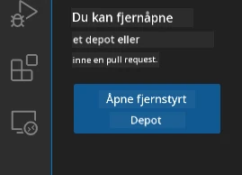

3. Lim inn hvilken som helst GitHub-repo-URL (prøv denne: `https://github.com/microsoft/Web-Dev-For-Beginners`)
4. Trykk Enter og se magien skje!

**Profftips – Kommando-palett snarvei:**

Vil du føle deg som en kode-trollmann? Prøv tastatursnarveien: Ctrl+Shift+P (eller Cmd+Shift+P på Mac) for å åpne Kommando-paletten:

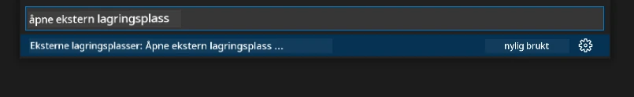

**Kommando-paletten er som en søkemotor for alt du kan gjøre:**
- Skriv "open remote" så finner den repo-åpneren for deg
- Den husker repoene du har åpnet nylig (superpraktisk!)
- Når du blir vant med den, vil du føle at du koder i lynets hastighet
- Det er i bunn og grunn VSCode.dev sin versjon av "Hei Siri, men for koding"

### Metode 2: URL-omformingsteknikk

Akkurat som HTTP og HTTPS bruker forskjellige protokoller men beholder samme domenestruktur, bruker VSCode.dev en URL-mal som speiler GitHubs adresseringssystem. Enhver GitHub-repo-URL kan modifiseres for å åpne direkte i VSCode.dev.

**URL-omformingsmønster:**

| Repo-type | GitHub URL | VSCode.dev URL |
|----------------|---------------------|----------------|
| **Offentlig repo** | `github.com/microsoft/Web-Dev-For-Beginners` | `vscode.dev/github/microsoft/Web-Dev-For-Beginners` |
| **Personlig prosjekt** | `github.com/ditt-brukernavn/min-prosjekt` | `vscode.dev/github/ditt-brukernavn/min-prosjekt` |
| **Hvilket som helst tilgjengelig repo** | `github.com/deres-brukernavn/kult-repo` | `vscode.dev/github/deres-brukernavn/kult-repo` |

**Implementering:**
- Erstatt `github.com` med `vscode.dev/github`
- Behold alle andre URL-komponenter uendret
- Fungerer med ethvert offentlig tilgjengelig repo
- Gir umiddelbar redigeringstilgang

> 💡 **Livsendrende tips**: Bokmerk VSCode.dev-versjonene av dine favorittrepoer. Jeg har bokmerker som "Rediger Min Portfolio" og "Fiks Dokumentasjon" som tar meg rett til redigeringsmodus!

**Hvilken metode bør du bruke?**
- **Grensesnittmåten**: Flott når du utforsker eller ikke husker nøyaktige repo-navn
- **URL-trikset**: Perfekt for lynrask tilgang når du vet nøyaktig hvor du skal

### 🎯 Pedagogisk innsjekk: Tilgang til skyutvikling

**Pause og reflekter**: Du har nettopp lært to metoder for å få tilgang til kode-repositorier gjennom en nettleser. Dette representerer et grunnleggende skifte i hvordan utvikling fungerer.

**Rask selvvurdering**:
- Kan du forklare hvorfor nettleserbasert redigering eliminerer tradisjonell "utviklingsmiljø-oppsett"?
- Hvilke fordeler gir URL-omformingsteknikken sammenlignet med lokal git-kloning?
- Hvordan endrer denne tilnærmingen måten du kan bidra til åpne kilde-prosjekter på?

**Virkelighetsforbindelse**: Store selskap som GitHub, GitLab, og Replit har bygget sine utviklingsplattformer rundt disse sky-første prinsippene. Du lærer de samme arbeidsflytene som profesjonelle utviklingsteam bruker over hele verden.

**Utfordrende spørsmål**: Hvordan kan skybasert utvikling endre måten koding undervises på i skoler? Tenk på krav til enheter, programvareadministrasjon og samarbeidsmuligheter.

## Jobbe med filer og prosjekter

Nå som du har et repo åpent, la oss begynne å bygge! VSCode.dev gir deg alt du trenger for å opprette, redigere og organisere kodefilene dine. Tenk på det som ditt digitale verksted – hvert verktøy er der du trenger det.

La oss dykke ned i daglige oppgaver som vil utgjøre mesteparten av kodearbeidsflyten din.

### Lage nye filer

Som å organisere tegninger i et arkitektkontor følger filoppretting i VSCode.dev en strukturert prosess. Systemet støtter alle standard webutviklingsfil-typer.

**Filopprettingsprosess:**

1. Naviger til ønsket mappe i Explorer-sidelinjen
2. Hold musepekeren over mappenavnet for å vise ikonet "Ny fil" (📄+)
3. Tast inn filnavnet med riktig filendelse (`style.css`, `script.js`, `index.html`)
4. Trykk Enter for å opprette filen

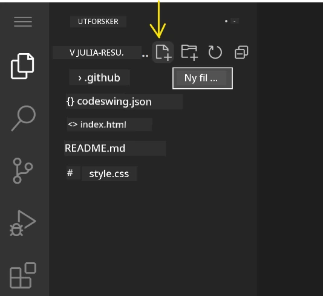

**Navnekonvensjoner:**
- Bruk beskrivende navn som indikerer filens formål
- Inkluder filendelser for riktig syntaksutheving
- Følg konsekvente navnemønstre gjennom prosjekter
- Bruk små bokstaver og bindestreker i stedet for mellomrom

### Redigere og lagre filer

Her begynner moroa! VSCode.devs editor er fylt med nyttige funksjoner som gjør koding glatt og intuitivt. Det er som å ha en veldig smart skriveassistent, men for kode.

**Din redigeringsarbeidsflyt:**

1. Klikk på en fil i Explorer for å åpne den i hovedområdet
2. Begynn å skrive og se VSCode.dev hjelpe deg med farger, forslag og feiloppdagelse
3. Lagre arbeidet med Ctrl+S (Windows/Linux) eller Cmd+S (Mac) – selv om det også lagrer automatisk!

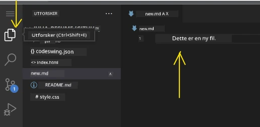

**Kule ting som skjer mens du koder:**
- Koden din fargekodes vakkert så den er lett å lese
- VSCode.dev foreslår fullføringer mens du skriver (som autokorrektur, bare mye smartere)
- Den oppdager skrivefeil og feil før du engang lagrer
- Du kan ha flere filer åpne i faner, akkurat som i en nettleser
- Alt lagres automatisk i bakgrunnen

> ⚠️ **Raskt tips**: Selv om autosave passer på for deg, er det fortsatt en god vane å trykke Ctrl+S eller Cmd+S. Det lagrer alt umiddelbart og utløser ekstra nyttige funksjoner som feilsjekking.

### Versjonskontroll med Git

Som arkeologer som dokumenterer utgravningslag nøyaktig, sporer Git endringer i koden din over tid. Dette systemet bevarer prosjektets historie og gjør det mulig å gå tilbake til tidligere versjoner ved behov. VSCode.dev inkluderer integrert Git-funksjonalitet.

**Kildekontroll-grensesnitt:**

1. Åpne Kildekontroll-panelet via 🌿-ikonet i Aktivitetslinjen
2. Endrede filer vises i "Endringer"-seksjonen
3. Fargekoding indikerer type endring: grønt for tillegg, rødt for slettinger

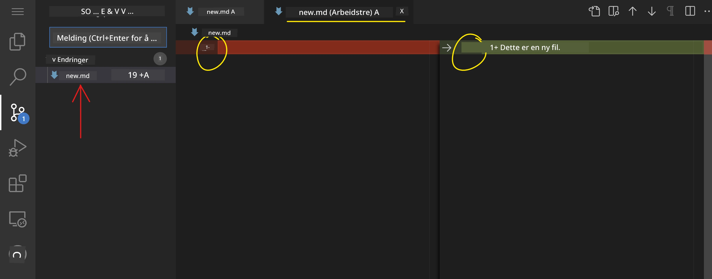

**Lagre arbeidet ditt (commit-arbeidsflyten):**

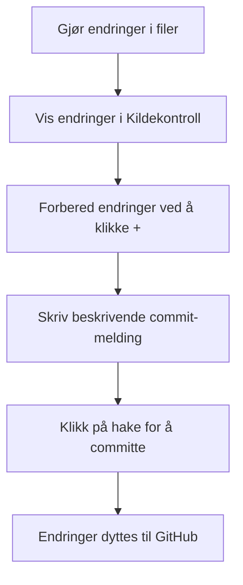
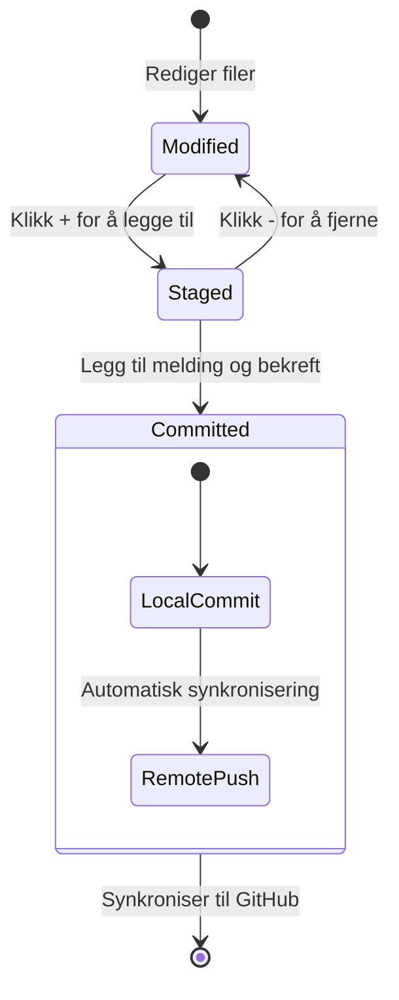
**Her er trinn-for-trinn-prosessen din:**
- Klikk på "+"-ikonet ved siden av filer du vil lagre (dette "stager" dem)
- Dobbeltsjekk at du er fornøyd med alle dine stagede endringer  
- Skriv en kort melding som forklarer hva du gjorde (dette er din "commit message")  
- Klikk på avkryssingsknappen for å lagre alt på GitHub  
- Hvis du ombestemmer deg, lar angre-ikonet deg forkaste endringer  

**Å skrive gode commit-meldinger (dette er enklere enn du tror!):**  
- Beskriv bare hva du gjorde, som "Legg til kontaktskjema" eller "Fix ødelagt navigasjon"  
- Hold det kort og konsist – tenk tweet-lengde, ikke essay  
- Start med handlingsord som "Legg til", "Fix", "Oppdater" eller "Fjern"  
- **Gode eksempler**: "Legg til responsivt navigasjonsmeny", "Fix problemer med mobiloppsett", "Oppdater farger for bedre tilgjengelighet"  

> 💡 **Rask navigasjonstips**: Bruk hamburgermenyen (☰) øverst til venstre for å hoppe tilbake til GitHub-repositoriet ditt og se dine committede endringer online. Det er som en portal mellom redigeringsmiljøet ditt og prosjektets hjem på GitHub!

## Forbedring av funksjonalitet med utvidelser

Akkurat som en håndverkers verksted inneholder spesialiserte verktøy for forskjellige oppgaver, kan VSCode.dev tilpasses med utvidelser som legger til spesifikke funksjoner. Disse pluginene utviklet av fellesskapet adresserer vanlige behov i utvikling som kodeformatering, forhåndsvisning i sanntid og forbedret Git-integrasjon.

Utvidelsesmarkedet inneholder tusenvis av gratis verktøy laget av utviklere over hele verden. Hver utvidelse løser spesifikke arbeidsflytutfordringer, slik at du kan bygge et personlig utviklingsmiljø som passer dine spesifikke behov og preferanser.

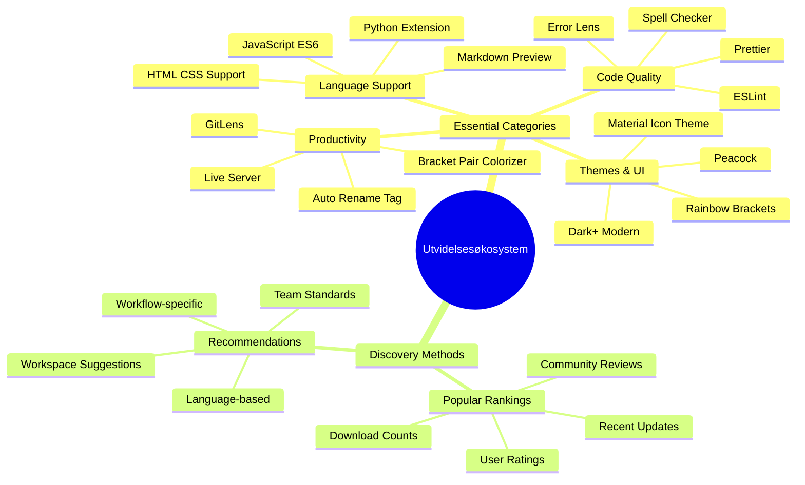
### Finne dine perfekte utvidelser

Utvidelsesmarkedet er virkelig godt organisert, så du går ikke deg vill når du prøver å finne det du trenger. Det er designet for å hjelpe deg å oppdage både spesifikke verktøy og kule ting du ikke engang visste eksisterte!

**Slik kommer du til markedet:**

1. Klikk på Utvidelsesikonet (🧩) i aktivitetsfeltet  
2. Bla rundt eller søk etter noe spesifikt  
3. Klikk på noe som ser interessant ut for å lære mer om det  

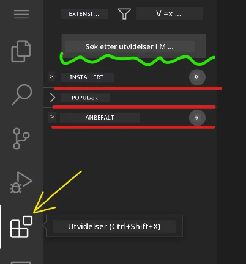  

**Dette vil du se der inne:**

| Seksjon | Hva som finnes | Hvorfor det er nyttig  |  
|----------|---------|----------|  
| **Installert** | Utvidelser du allerede har lagt til | Din personlige koding verktøykasse |  
| **Populære** | Publikum favoritter | Det meste utviklere sverger til |  
| **Anbefalt** | Smarte forslag for prosjektet ditt | VSCode.dev sine hjelpsomme anbefalinger |  

**Hva som gjør det enkelt å bla:**
- Hver utvidelse viser vurderinger, nedlastingsantall og ekte brukeranmeldelser  
- Du får skjermbilder og klare beskrivelser av hva hver enkelt gjør  
- Alt er tydelig merket med kompatibilitetsinfo  
- Lignende utvidelser foreslås slik at du kan sammenligne alternativer  

### Installere utvidelser (det er superenkelt!)

Å legge til nye krefter til editoren din er like enkelt som å klikke på en knapp. Utvidelser installeres på sekunder og begynner å fungere med en gang – ingen omstarter, ingen venting.

**Slik gjør du det:**

1. Søk etter det du vil ha (prøv å søke etter "live server" eller "prettier")  
2. Klikk på en som ser bra ut for å se flere detaljer  
3. Les hva den gjør og sjekk vurderingene  
4. Trykk på den blå "Install" knappen og du er ferdig!  


**Hva som skjer bak kulissene:**
- Utvidelsen lastes ned og setter seg opp automatisk  
- Nye funksjoner dukker opp i grensesnittet ditt med en gang  
- Alt begynner å fungere umiddelbart (seriøst, det går så fort!)  
- Hvis du er innlogget, synkroniseres utvidelsen til alle enhetene dine  

**Noen utvidelser jeg anbefaler å starte med:**
- **Live Server**: Se nettsiden din oppdatere i sanntid mens du koder (denne er magisk!)  
- **Prettier**: Gjør koden din ren og profesjonell automatisk  
- **Auto Rename Tag**: Endre en HTML-tag og dens partner oppdateres også  
- **Bracket Pair Colorizer**: Fargekoder parenteser så du aldri mister oversikten  
- **GitLens**: Superlader dine Git-funksjoner med masse nyttig info  

### Tilpasse utvidelsene dine

De fleste utvidelser kommer med innstillinger du kan justere for å få dem til å fungere akkurat slik du vil. Tenk på det som å justere setet og speilene i en bil – alle har sine preferanser!

**Slik justerer du utvidelsesinnstillinger:**

1. Finn utvidelsen du har installert i Utvidelses-panelet  
2. Se etter det lille gir-ikonet (⚙️) ved siden av navnet og klikk på det  
3. Velg "Extension Settings" fra nedtrekksmenyen  
4. Juster ting til det føles helt riktig i arbeidsflyten din  

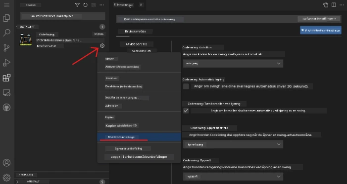  

**Vanlige ting du kanskje vil justere:**
- Hvordan koden din blir formatert (tabulatorer vs mellomrom, linjelengde osv.)  
- Hvilke hurtigtaster som utløser forskjellige handlinger  
- Hvilke filtyper utvidelsen skal fungere med  
- Slå spesifikke funksjoner på eller av for å holde det ryddig  

### Holde utvidelsene dine organiserte

Når du oppdager flere kule utvidelser, vil du holde samlingen ryddig og fungere smidig. VSCode.dev gjør dette veldig enkelt å administrere.

**Valgmuligheter for utvidelsesadministrasjon:**

| Hva du kan gjøre | Når det er nyttig | Proftips |  
|--------|---------|----------|  
| **Deaktiver** | Teste om en utvidelse forårsaker problemer | Bedre enn å avinstallere hvis du kanskje vil ha den tilbake |  
| **Avinstaller** | Fjerne utvidelser du ikke trenger | Holder miljøet ditt rent og raskt |  
| **Oppdater** | Få de nyeste funksjonene og feilrettingene | Skjer vanligvis automatisk, men verdt å sjekke |  

**Hvordan jeg liker å håndtere utvidelser:**
- Hver tredje måned ser jeg over hva jeg har installert og fjerner det jeg ikke bruker  
- Jeg holder utvidelsene oppdatert for å få ny forbedringer og sikkerhetsfikser  
- Hvis noe virker tregt, deaktiverer jeg midlertidig utvidelser for å se om en av dem er synderen  
- Jeg leser oppdateringsnotatene når utvidelser får store oppdateringer – noen ganger er det kule nye funksjoner!  

> ⚠️ **Ytelsestips**: Utvidelser er flotte, men for mange kan gjøre ting tregere. Fokuser på de som virkelig gjør livet ditt enklere, og ikke vær redd for å avinstallere de du aldri bruker.  

### 🎯 Pedagogisk sjekk: Tilpasning av utviklingsmiljø

**Forståelse av arkitektur**: Du har lært å tilpasse et profesjonelt utviklingsmiljø ved hjelp av utvidelser laget av fellesskapet. Dette speiler hvordan store utviklingsteam bygger standardiserte verktøykjeder.

**Nøkkelkonsepter du har mestret**:
- **Oppdagelse av utvidelser**: Finne verktøy som løser spesifikke utviklingsutfordringer  
- **Miljøkonfigurasjon**: Tilpasse verktøy til personlige eller team-preferanser  
- **Ytelsesoptimalisering**: Balansering mellom funksjonalitet og systemytelse  
- **Fellesskapssamarbeid**: Utnytte verktøy laget av det globale utviklerfellesskapet  

**Industriell tilknytning**: Utvidelsesøkosystemer driver store utviklingsplattformer som VS Code, Chrome DevTools og moderne IDE-er. Å forstå hvordan du evaluerer, installerer og konfigurerer utvidelser er essensielt for profesjonelle utviklingsarbeidsflyter.

**Refleksjonsspørsmål**: Hvordan ville du gått fram for å sette opp et standardisert utviklingsmiljø for et team på 10 utviklere? Tenk på konsistens, ytelse og individuelle preferanser.  

## 📈 Din tidslinje for mestring av skybasert utvikling

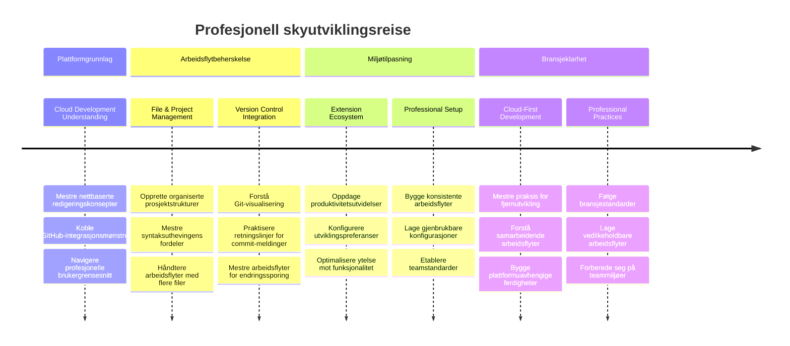
**🎓 Utdanningsmilepæl**: Du har med suksess mestret skybasert utvikling brukende de samme verktøyene og arbeidsflytene som profesjonelle utviklere i store teknologiselskaper. Disse ferdighetene representerer fremtiden for programvareutvikling.

**🔄 Neste nivå ferdigheter**:
- Klar for å utforske avanserte skyutviklingsplattformer (Codespaces, GitPod)  
- Forberedt på å jobbe i distribuerte utviklingsteam  
- Utstyrt for å bidra til open source-prosjekter globalt  
- Grunnlag lagt for moderne DevOps og kontinuerlig integrasjonspraksis  

## GitHub Copilot Agent-utfordring 🚀

Som NASA sin strukturerte tilnærming til romferder, innebærer denne utfordringen systematisk bruk av VSCode.dev-ferdigheter i en komplett arbeidsflytscenario.

**Mål:** Demonstrere ferdigheter med VSCode.dev ved å etablere en omfattende webutviklingsarbeidsflyt.

**Prosjektkrav:** Bruke Agent-modus assistanse til å fullføre disse oppgavene:  
1. Forke et eksisterende repositorium eller lage et nytt  
2. Etablere en funksjonell prosjektstruktur med HTML, CSS og JavaScript-filer  
3. Installere og konfigurere tre utvidelser som forbedrer utvikling  
4. Praktisere versjonskontroll med beskrivende commit-meldinger  
5. Eksperimentere med opprettelse og endring av feature-brancher  
6. Dokumentere prosessen og læringen i en README.md fil  

Denne øvelsen samler alle VSCode.dev-konsepter i en praktisk arbeidsflyt som kan brukes i fremtidige utviklingsprosjekter.

Lær mer om [agent mode](https://code.visualstudio.com/blogs/2025/02/24/introducing-copilot-agent-mode) her.

## Oppgave

Det er på tide å sette disse ferdighetene på en virkelig prøve! Jeg har et praktisk prosjekt som lar deg øve på alt vi har gått gjennom: [Lag en CV-nettside med VSCode.dev](./assignment.md)

Denne oppgaven tar deg gjennom å bygge en profesjonell CV-nettside helt i nettleseren. Du vil bruke alle VSCode.dev-funksjonene vi har utforsket, og på slutten vil du ha både et flott nettsted og sterk selvtillit med din nye arbeidsflyt.

## Fortsett å utforske og vokse dine ferdigheter

Du har et solid fundament nå, men det er så mye mer kult å oppdage! Her er noen ressurser og ideer for å ta VSCode.dev-ferdighetene dine til neste nivå:

**Offisielle dokumenter verdt å bokmerke:**  
- [VSCode Web Documentation](https://code.visualstudio.com/docs/editor/vscode-web?WT.mc_id=academic-0000-alfredodeza) – Den komplette guiden til redigering i nettleseren  
- [GitHub Codespaces](https://docs.github.com/en/codespaces) – For når du vil ha enda mer kraft i skyen  

**Kule funksjoner å eksperimentere med neste gang:**  
- **Hurtigtaster**: Lær tastekombinasjonene som får deg til å føle deg som en koding ninja  
- **Arbeidsområdeinnstillinger**: Sett opp ulike miljøer for forskjellige typer prosjekter  
- **Multi-root arbeidsområder**: Jobb med flere repositorier samtidig (superpraktisk!)  
- **Terminalintegrasjon**: Få tilgang til kommandolinjeverktøy direkte i nettleseren  

**Ideer for øving:**  
- Bli med på noen open source-prosjekter og bidra med VSCode.dev – det er en fin måte å gi tilbake på!  
- Prøv ut forskjellige utvidelser for å finne din perfekte oppsett  
- Lag prosjektmaler for de typene nettsteder du bygger oftest  
- Øv på Git-arbeidsflyter som branching og merging – disse ferdighetene er gull verdt i teamprosjekter  

---

**Du har mestret nettleserbasert utvikling!** 🎉 Som oppfinnelsen av bærbare instrumenter gjorde det mulig for forskere å utføre forskning på avsidesliggende steder, muliggjør VSCode.dev profesjonell koding fra hvilken som helst internett-tilkoblet enhet.

Disse ferdighetene gjenspeiler dagens industripraksis – mange profesjonelle utviklere bruker skybaserte utviklingsmiljøer for fleksibiliteten og tilgjengeligheten. Du har lært en arbeidsflyt som skalerer fra individuelle prosjekter til store team-samarbeid.

Ta i bruk disse teknikkene i ditt neste utviklingsprosjekt! 🚀

---

<!-- CO-OP TRANSLATOR DISCLAIMER START -->
**Ansvarsfraskrivelse**:
Dette dokumentet er oversatt ved hjelp av AI-oversettingstjenesten [Co-op Translator](https://github.com/Azure/co-op-translator). Selv om vi streber etter nøyaktighet, vennligst vær oppmerksom på at automatiske oversettelser kan inneholde feil eller unøyaktigheter. Det originale dokumentet på det opprinnelige språket bør anses som den autoritative kilden. For kritisk informasjon anbefales profesjonell menneskelig oversettelse. Vi er ikke ansvarlige for eventuelle misforståelser eller feiltolkninger som oppstår fra bruk av denne oversettelsen.
<!-- CO-OP TRANSLATOR DISCLAIMER END -->