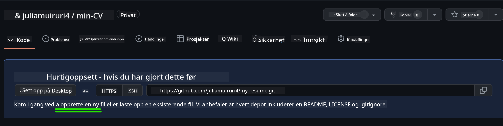
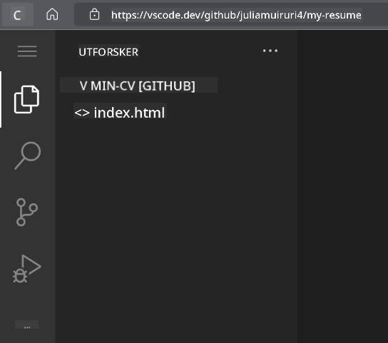
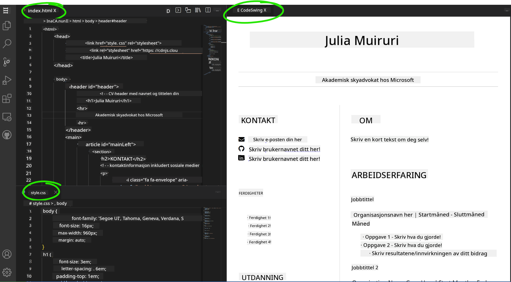

<!--
CO_OP_TRANSLATOR_METADATA:
{
  "original_hash": "bd3aa6d2b879c30ea496c43aec1c49ed",
  "translation_date": "2025-08-29T08:40:27+00:00",
  "source_file": "8-code-editor/1-using-a-code-editor/assignment.md",
  "language_code": "no"
}
-->
# Lag en CV-nettside ved hjelp av vscode.dev

_Hvor kult hadde det vært om en rekrutterer ba om CV-en din, og du sendte dem en URL?_ 😎

<!----
TODO: legg til et valgfritt bilde

> Sketchnote av [Forfatterens navn](https://example.com)
---->

<!---
## Quiz før forelesning
[Quiz før forelesning](https://ff-quizzes.netlify.app/web/quiz/3)
---->

## Mål

Etter denne oppgaven vil du lære å:

- Lage en nettside for å vise frem CV-en din

### Forutsetninger

1. En GitHub-konto. Gå til [GitHub](https://github.com/) og opprett en konto hvis du ikke allerede har en.

## Steg

**Steg 1:** Opprett et nytt GitHub-repositorium og gi det navnet `my-resume`

**Steg 2:** Opprett en `index.html`-fil i repositoriet ditt. Vi må legge til minst én fil mens vi fortsatt er på github.com, fordi du ikke kan åpne et tomt repositorium på vscode.dev.

Klikk på lenken `creating a new file`, skriv inn navnet `index.html` og velg knappen `Commit new file`.



**Steg 3:** Åpne [VSCode.dev](https://vscode.dev) og velg knappen `Open Remote Repository`.

Kopier URL-en til repositoriet du nettopp opprettet for CV-nettsiden din og lim den inn i inndatafeltet:

_Erstatt `your-username` med ditt GitHub-brukernavn_

```
https://github.com/your-username/my-resume
```

✅ Hvis det er vellykket, vil du se prosjektet ditt og `index.html`-filen åpne seg i teksteditoren i nettleseren.



**Steg 4:** Åpne `index.html`-filen, lim inn koden nedenfor i kodeområdet ditt og lagre.

<details>
    <summary><b>HTML-kode som er ansvarlig for innholdet på CV-nettsiden din.</b></summary>
    
        <html>

            <head>
                <link href="style.css" rel="stylesheet">
                <link rel="stylesheet" href="https://cdnjs.cloudflare.com/ajax/libs/font-awesome/5.15.4/css/all.min.css">
                <title>Navnet ditt her!</title>
            </head>
            <body>
                <header id="header">
                    <!-- CV-header med navnet ditt og tittelen -->
                    <h1>Navnet ditt her!</h1>
                    <hr>
                    Din rolle!
                    <hr>
                </header>
                <main>
                    <article id="mainLeft">
                        <section>
                            <h2>KONTAKT</h2>
                            <!-- Kontaktinfo inkludert sosiale medier -->
                            <p>
                                <i class="fa fa-envelope" aria-hidden="true"></i>
                                <a href="mailto:username@domain.top-level domain">Skriv e-posten din her</a>
                            </p>
                            <p>
                                <i class="fab fa-github" aria-hidden="true"></i>
                                <a href="github.com/yourGitHubUsername">Skriv brukernavnet ditt her!</a>
                            </p>
                            <p>
                                <i class="fab fa-linkedin" aria-hidden="true"></i>
                                <a href="linkedin.com/yourLinkedInUsername">Skriv brukernavnet ditt her!</a>
                            </p>
                        </section>
                        <section>
                            <h2>FERDIGHETER</h2>
                            <!-- Dine ferdigheter -->
                            <ul>
                                <li>Ferdighet 1!</li>
                                <li>Ferdighet 2!</li>
                                <li>Ferdighet 3!</li>
                                <li>Ferdighet 4!</li>
                            </ul>
                        </section>
                        <section>
                            <h2>UTDANNING</h2>
                            <!-- Din utdanning -->
                            <h3>Skriv kurset ditt her!</h3>
                            <p>
                                Skriv institusjonen din her!
                            </p>
                            <p>
                                Start - Sluttdato
                            </p>
                        </section>            
                    </article>
                    <article id="mainRight">
                        <section>
                            <h2>OM</h2>
                            <!-- Om deg -->
                            <p>Skriv en kort tekst om deg selv!</p>
                        </section>
                        <section>
                            <h2>ARBEIDSERFARING</h2>
                            <!-- Din arbeidserfaring -->
                            <h3>Jobbtittel</h3>
                            <p>
                                Organisasjonsnavn her | Startmåned – Sluttmåned
                            </p>
                            <ul>
                                    <li>Oppgave 1 - Skriv hva du gjorde!</li>
                                    <li>Oppgave 2 - Skriv hva du gjorde!</li>
                                    <li>Skriv resultatene/effekten av ditt bidrag</li>
                                    
                            </ul>
                            <h3>Jobbtittel 2</h3>
                            <p>
                                Organisasjonsnavn her | Startmåned – Sluttmåned
                            </p>
                            <ul>
                                    <li>Oppgave 1 - Skriv hva du gjorde!</li>
                                    <li>Oppgave 2 - Skriv hva du gjorde!</li>
                                    <li>Skriv resultatene/effekten av ditt bidrag</li>
                                    
                            </ul>
                        </section>
                    </article>
                </main>
            </body>
        </html>
</details>

Legg til CV-detaljene dine for å erstatte _plassholderteksten_ i HTML-koden.

**Steg 5:** Hold musepekeren over My-Resume-mappen, klikk på ikonet `New File ...` og opprett 2 nye filer i prosjektet ditt: `style.css` og `codeswing.json`.

**Steg 6:** Åpne `style.css`-filen, lim inn koden nedenfor og lagre.

<details>
        <summary><b>CSS-kode for å formatere layouten på siden.</b></summary>
            
            body {
                font-family: 'Segoe UI', Tahoma, Geneva, Verdana, sans-serif;
                font-size: 16px;
                max-width: 960px;
                margin: auto;
            }
            h1 {
                font-size: 3em;
                letter-spacing: .6em;
                padding-top: 1em;
                padding-bottom: 1em;
            }

            h2 {
                font-size: 1.5em;
                padding-bottom: 1em;
            }

            h3 {
                font-size: 1em;
                padding-bottom: 1em;
            }
            main { 
                display: grid;
                grid-template-columns: 40% 60%;
                margin-top: 3em;
            }
            header {
                text-align: center;
                margin: auto 2em;
            }

            section {
                margin: auto 1em 4em 2em;
            }

            i {
                margin-right: .5em;
            }

            p {
                margin: .2em auto
            }

            hr {
                border: none;
                background-color: lightgray;
                height: 1px;
            }

            h1, h2, h3 {
                font-weight: 100;
                margin-bottom: 0;
            }
            #mainLeft {
                border-right: 1px solid lightgray;
            }
            
</details>

**Steg 6:** Åpne `codeswing.json`-filen, lim inn koden nedenfor og lagre.

    {
    "scripts": [],
    "styles": []
    }

**Steg 7:** Installer `Codeswing extension` for å visualisere CV-nettsiden i kodeområdet.

Klikk på _`Extensions`_-ikonet på aktivitetslinjen og skriv inn Codeswing. Klikk enten på _den blå installasjonsknappen_ på den utvidede aktivitetslinjen for å installere, eller bruk installasjonsknappen som vises i kodeområdet når du velger utvidelsen for å laste inn tilleggsinformasjon. Rett etter installasjonen av utvidelsen, observer kodeområdet ditt for å se endringene i prosjektet 😃


Dette er hva du vil se på skjermen din etter at du har installert utvidelsen.



Hvis du er fornøyd med endringene du har gjort, hold musepekeren over `Changes`-mappen og klikk på `+`-knappen for å stage endringene.

Skriv inn en commit-melding _(En beskrivelse av endringen du har gjort i prosjektet)_ og commit endringene dine ved å klikke på `check`. Når du er ferdig med å jobbe på prosjektet, velg hamburgerikonet øverst til venstre for å gå tilbake til repositoriet på GitHub.

Gratulerer 🎉 Du har nettopp laget CV-nettsiden din ved hjelp av vscode.dev på få steg.

## 🚀 Utfordring

Åpne et eksternt repositorium du har tillatelse til å gjøre endringer i, og oppdater noen filer. Deretter kan du prøve å opprette en ny gren med endringene dine og lage en Pull Request.

<!----
## Quiz etter forelesning
[Quiz etter forelesning](https://ff-quizzes.netlify.app/web/quiz/4)
---->

## Gjennomgang og selvstudium

Les mer om [VSCode.dev](https://code.visualstudio.com/docs/editor/vscode-web?WT.mc_id=academic-0000-alfredodeza) og noen av de andre funksjonene.

---

**Ansvarsfraskrivelse**:  
Dette dokumentet er oversatt ved hjelp av AI-oversettelsestjenesten [Co-op Translator](https://github.com/Azure/co-op-translator). Selv om vi tilstreber nøyaktighet, vennligst vær oppmerksom på at automatiske oversettelser kan inneholde feil eller unøyaktigheter. Det originale dokumentet på sitt opprinnelige språk bør anses som den autoritative kilden. For kritisk informasjon anbefales profesjonell menneskelig oversettelse. Vi er ikke ansvarlige for eventuelle misforståelser eller feiltolkninger som oppstår ved bruk av denne oversettelsen.