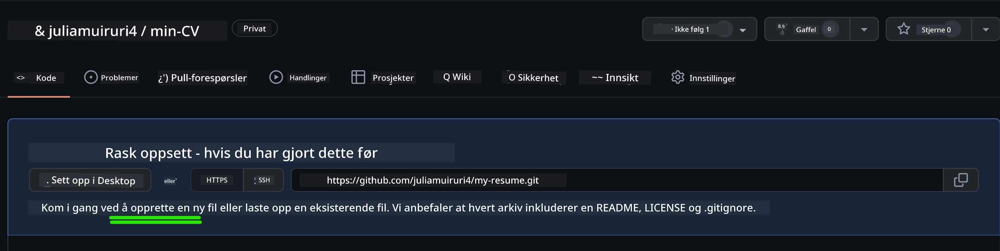
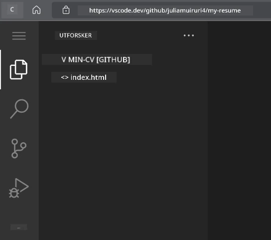
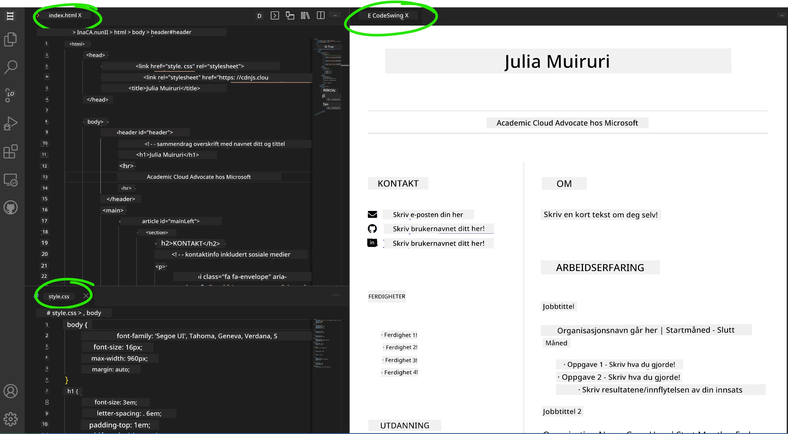

# Lag en CV-nettside med VSCode.dev

Forbedre karrieremulighetene dine ved å lage en profesjonell CV-nettside som viser frem ferdighetene og erfaringene dine i et interaktivt og moderne format. I stedet for å sende tradisjonelle PDF-er, kan du gi rekrutterere en elegant, responsiv nettside som demonstrerer både kvalifikasjonene dine og dine ferdigheter innen webutvikling.

Denne praktiske oppgaven setter alle dine VSCode.dev-ferdigheter på prøve samtidig som du lager noe som virkelig kan være nyttig for karrieren din. Du vil oppleve hele webutviklingsarbeidsflyten – fra opprettelse av et repository til publisering – alt innenfor nettleseren din.

Ved å fullføre dette prosjektet vil du ha en profesjonell online tilstedeværelse som enkelt kan deles med potensielle arbeidsgivere, oppdateres etter hvert som ferdighetene dine utvikler seg, og tilpasses for å matche din personlige merkevare. Dette er akkurat den typen praktisk prosjekt som viser ekte ferdigheter innen webutvikling.

## Læringsmål

Etter å ha fullført denne oppgaven, vil du kunne:

- **Opprette** og administrere et komplett webutviklingsprosjekt ved hjelp av VSCode.dev
- **Strukturere** en profesjonell nettside med semantiske HTML-elementer
- **Stile** responsive oppsett med moderne CSS-teknikker
- **Implementere** interaktive funksjoner ved hjelp av grunnleggende webteknologier
- **Publisere** en live nettside tilgjengelig via en delbar URL
- **Demonstrere** beste praksis for versjonskontroll gjennom hele utviklingsprosessen

## Forutsetninger

Før du starter denne oppgaven, må du ha:

- En GitHub-konto (opprett en på [github.com](https://github.com/) hvis nødvendig)
- Fullført VSCode.dev-leksjonen som dekker navigering i grensesnittet og grunnleggende operasjoner
- Grunnleggende forståelse av HTML-struktur og CSS-stilkonsepter

## Prosjektoppsett og opprettelse av repository

La oss starte med å sette opp grunnlaget for prosjektet ditt. Denne prosessen speiler arbeidsflyten i virkelige utviklingsprosjekter, der prosjekter begynner med riktig initialisering av repository og planlegging av struktur.

### Steg 1: Opprett GitHub-repository

Å sette opp et dedikert repository sikrer at prosjektet ditt er godt organisert og versjonskontrollert fra starten av.

1. **Naviger** til [GitHub.com](https://github.com) og logg inn på kontoen din
2. **Klikk** på den grønne "New"-knappen eller "+"-ikonet øverst til høyre
3. **Navngi** repositoryen din `my-resume` (eller velg et personlig navn som `john-smith-resume`)
4. **Legg til** en kort beskrivelse: "Profesjonell CV-nettside bygget med HTML og CSS"
5. **Velg** "Public" for å gjøre CV-en din tilgjengelig for potensielle arbeidsgivere
6. **Huk av** "Add a README file" for å opprette en innledende prosjektbeskrivelse
7. **Klikk** "Create repository" for å fullføre oppsettet

> 💡 **Tips for navngivning av repository**: Bruk beskrivende, profesjonelle navn som tydelig indikerer prosjektets formål. Dette hjelper når du deler med arbeidsgivere eller under porteføljegjennomganger.

### Steg 2: Initialiser prosjektstrukturen

Siden VSCode.dev krever minst én fil for å åpne et repository, oppretter vi hoved-HTML-filen direkte på GitHub før vi bytter til nettredigeringsverktøyet.

1. **Klikk** på "creating a new file"-lenken i ditt nye repository
2. **Skriv** `index.html` som filnavn
3. **Legg til** denne innledende HTML-strukturen:

```html
<!DOCTYPE html>
<html lang="en">
<head>
    <meta charset="UTF-8">
    <meta name="viewport" content="width=device-width, initial-scale=1.0">
    <title>Your Name - Professional Resume</title>
</head>
<body>
    <h1>Your Name</h1>
    <p>Professional Resume Website</p>
</body>
</html>
```

4. **Skriv** en commit-melding: "Legg til innledende HTML-struktur"
5. **Klikk** "Commit new file" for å lagre endringene dine



**Dette oppnår den innledende oppsettet:**
- **Etablerer** riktig HTML5-dokumentstruktur med semantiske elementer
- **Inkluderer** viewport meta-tag for kompatibilitet med responsiv design
- **Setter** en beskrivende sidetittel som vises i nettleserfaner
- **Skaper** grunnlaget for profesjonell innholdsorganisering

## Arbeid i VSCode.dev

Nå som grunnlaget for repositoryen din er etablert, la oss gå over til VSCode.dev for hovedutviklingsarbeidet. Denne nettbaserte redigereren gir alle verktøyene som trengs for profesjonell webutvikling.

### Steg 3: Åpne prosjektet ditt i VSCode.dev

1. **Naviger** til [vscode.dev](https://vscode.dev) i en ny nettleserfane
2. **Klikk** "Open Remote Repository" på velkomstskjermen
3. **Kopier** URL-en til repositoryen din fra GitHub og lim den inn i inndatafeltet

   Format: `https://github.com/your-username/my-resume`
   
   *Erstatt `your-username` med ditt faktiske GitHub-brukernavn*

4. **Trykk** Enter for å laste inn prosjektet ditt

✅ **Indikator for suksess**: Du bør se prosjektfilene dine i Explorer-sidepanelet og `index.html` tilgjengelig for redigering i hovedredigeringsområdet.



**Hva du vil se i grensesnittet:**
- **Explorer-sidepanel**: **Viser** prosjektfilene og mappestrukturen din
- **Redigeringsområde**: **Viser** innholdet i valgte filer for redigering
- **Aktivitetslinje**: **Gir** tilgang til funksjoner som Source Control og Extensions
- **Statuslinje**: **Indikerer** tilkoblingsstatus og informasjon om gjeldende gren

### Steg 4: Bygg innholdet til CV-en din

Erstatt plassholderinnholdet i `index.html` med en omfattende CV-struktur. Denne HTML-en gir grunnlaget for en profesjonell presentasjon av kvalifikasjonene dine.

<details>
<summary><b>Komplett HTML-struktur for CV</b></summary>

```html
<!DOCTYPE html>
<html lang="en">
<head>
    <meta charset="UTF-8">
    <meta name="viewport" content="width=device-width, initial-scale=1.0">
    <link href="style.css" rel="stylesheet">
    <link rel="stylesheet" href="https://cdnjs.cloudflare.com/ajax/libs/font-awesome/5.15.4/css/all.min.css">
    <title>Your Name - Professional Resume</title>
</head>
<body>
    <header id="header">
        <h1>Your Full Name</h1>
        <hr>
        <p class="role">Your Professional Title</p>
        <hr>
    </header>
    
    <main>
        <article id="mainLeft">
            <section>
                <h2>CONTACT</h2>
                <p>
                    <i class="fa fa-envelope" aria-hidden="true"></i>
                    <a href="mailto:your.email@domain.com">your.email@domain.com</a>
                </p>
                <p>
                    <i class="fab fa-github" aria-hidden="true"></i>
                    <a href="https://github.com/your-username">github.com/your-username</a>
                </p>
                <p>
                    <i class="fab fa-linkedin" aria-hidden="true"></i>
                    <a href="https://linkedin.com/in/your-profile">linkedin.com/in/your-profile</a>
                </p>
            </section>
            
            <section>
                <h2>SKILLS</h2>
                <ul>
                    <li>HTML5 & CSS3</li>
                    <li>JavaScript (ES6+)</li>
                    <li>Responsive Web Design</li>
                    <li>Version Control (Git)</li>
                    <li>Problem Solving</li>
                </ul>
            </section>
            
            <section>
                <h2>EDUCATION</h2>
                <h3>Your Degree or Certification</h3>
                <p>Institution Name</p>
                <p>Start Date - End Date</p>
            </section>
        </article>
        
        <article id="mainRight">
            <section>
                <h2>ABOUT</h2>
                <p>Write a compelling summary that highlights your passion for web development, key achievements, and career goals. This section should give employers insight into your personality and professional approach.</p>
            </section>
            
            <section>
                <h2>WORK EXPERIENCE</h2>
                <div class="job">
                    <h3>Job Title</h3>
                    <p class="company">Company Name | Start Date – End Date</p>
                    <ul>
                        <li>Describe a key accomplishment or responsibility</li>
                        <li>Highlight specific skills or technologies used</li>
                        <li>Quantify impact where possible (e.g., "Improved efficiency by 25%")</li>
                    </ul>
                </div>
                
                <div class="job">
                    <h3>Previous Job Title</h3>
                    <p class="company">Previous Company | Start Date – End Date</p>
                    <ul>
                        <li>Focus on transferable skills and achievements</li>
                        <li>Demonstrate growth and learning progression</li>
                        <li>Include any leadership or collaboration experiences</li>
                    </ul>
                </div>
            </section>
            
            <section>
                <h2>PROJECTS</h2>
                <div class="project">
                    <h3>Project Name</h3>
                    <p>Brief description of what the project accomplishes and technologies used.</p>
                    <a href="#" target="_blank">View Project</a>
                </div>
            </section>
        </article>
    </main>
</body>
</html>
```
</details>

**Retningslinjer for tilpasning:**
- **Erstatt** all plassholdertekst med din faktiske informasjon
- **Juster** seksjoner basert på ditt erfaringsnivå og karrierefokus
- **Legg til** eller fjern seksjoner etter behov (f.eks. Sertifiseringer, Frivillig arbeid, Språk)
- **Inkluder** lenker til dine faktiske profiler og prosjekter

### Steg 5: Opprett støttende filer

Profesjonelle nettsider krever organiserte filstrukturer. Opprett CSS-stilarket og konfigurasjonsfilene som trengs for et komplett prosjekt.

1. **Hold musen over** prosjektmappenavnet i Explorer-sidepanelet
2. **Klikk** på "New File"-ikonet (📄+) som vises
3. **Opprett** disse filene én om gangen:
   - `style.css` (for styling og layout)
   - `codeswing.json` (for konfigurasjon av forhåndsvisningsutvidelsen)

**Opprette CSS-filen (`style.css`):**

<details>
<summary><b>Profesjonell CSS-styling</b></summary>

```css
/* Modern Resume Styling */
body {
    font-family: 'Segoe UI', Tahoma, Geneva, Verdana, sans-serif;
    font-size: 16px;
    line-height: 1.6;
    max-width: 960px;
    margin: 0 auto;
    padding: 20px;
    color: #333;
    background-color: #f9f9f9;
}

/* Header Styling */
header {
    text-align: center;
    margin-bottom: 3em;
    padding: 2em;
    background: linear-gradient(135deg, #667eea 0%, #764ba2 100%);
    color: white;
    border-radius: 10px;
    box-shadow: 0 4px 6px rgba(0, 0, 0, 0.1);
}

h1 {
    font-size: 3em;
    letter-spacing: 0.1em;
    margin-bottom: 0.2em;
    font-weight: 300;
}

.role {
    font-size: 1.3em;
    font-weight: 300;
    margin: 1em 0;
}

/* Main Content Layout */
main {
    display: grid;
    grid-template-columns: 35% 65%;
    gap: 3em;
    margin-top: 3em;
    background: white;
    padding: 2em;
    border-radius: 10px;
    box-shadow: 0 2px 10px rgba(0, 0, 0, 0.1);
}

/* Typography */
h2 {
    font-size: 1.4em;
    font-weight: 600;
    margin-bottom: 1em;
    color: #667eea;
    border-bottom: 2px solid #667eea;
    padding-bottom: 0.3em;
}

h3 {
    font-size: 1.1em;
    font-weight: 600;
    margin-bottom: 0.5em;
    color: #444;
}

/* Section Styling */
section {
    margin-bottom: 2.5em;
}

#mainLeft {
    border-right: 1px solid #e0e0e0;
    padding-right: 2em;
}

/* Contact Links */
section a {
    color: #667eea;
    text-decoration: none;
    transition: color 0.3s ease;
}

section a:hover {
    color: #764ba2;
    text-decoration: underline;
}

/* Icons */
i {
    margin-right: 0.8em;
    width: 20px;
    text-align: center;
    color: #667eea;
}

/* Lists */
ul {
    list-style: none;
    padding-left: 0;
}

li {
    margin: 0.5em 0;
    padding: 0.3em 0;
    position: relative;
}

li:before {
    content: "▸";
    color: #667eea;
    margin-right: 0.5em;
}

/* Work Experience */
.job, .project {
    margin-bottom: 2em;
    padding-bottom: 1.5em;
    border-bottom: 1px solid #f0f0f0;
}

.company {
    font-style: italic;
    color: #666;
    margin-bottom: 0.5em;
}

/* Responsive Design */
@media (max-width: 768px) {
    main {
        grid-template-columns: 1fr;
        gap: 2em;
    }
    
    #mainLeft {
        border-right: none;
        border-bottom: 1px solid #e0e0e0;
        padding-right: 0;
        padding-bottom: 2em;
    }
    
    h1 {
        font-size: 2.2em;
    }
    
    body {
        padding: 10px;
    }
}

/* Print Styles */
@media print {
    body {
        background: white;
        color: black;
        font-size: 12pt;
    }
    
    header {
        background: none;
        color: black;
        box-shadow: none;
    }
    
    main {
        box-shadow: none;
    }
}
```
</details>

**Opprette konfigurasjonsfilen (`codeswing.json`):**

```json
{
    "scripts": [],
    "styles": []
}
```

**Forstå CSS-funksjonene:**
- **Bruker** CSS Grid for responsiv, profesjonell layoutstruktur
- **Implementerer** moderne fargepaletter med gradientoverskrifter
- **Inkluderer** hover-effekter og jevne overganger for interaktivitet
- **Gir** responsiv design som fungerer på alle enhetsstørrelser
- **Legger til** utskriftsvennlige stiler for PDF-generering

### Steg 6: Installer og konfigurer utvidelser

Utvidelser forbedrer utviklingsopplevelsen din ved å gi muligheter for live forhåndsvisning og forbedrede arbeidsflytverktøy. CodeSwing-utvidelsen er spesielt nyttig for webutviklingsprosjekter.

**Installere CodeSwing-utvidelsen:**

1. **Klikk** på Extensions-ikonet (🧩) i Aktivitetslinjen
2. **Søk** etter "CodeSwing" i søkeboksen for markedsplassen
3. **Velg** CodeSwing-utvidelsen fra søkeresultatene
4. **Klikk** på den blå "Install"-knappen


**Hva CodeSwing tilbyr:**
- **Aktiverer** live forhåndsvisning av nettsiden din mens du redigerer
- **Viser** endringer i sanntid uten manuell oppdatering
- **Støtter** flere filtyper, inkludert HTML, CSS og JavaScript
- **Gir** en integrert utviklingsmiljøopplevelse

**Umiddelbare resultater etter installasjon:**
Når CodeSwing er installert, vil du se en live forhåndsvisning av CV-nettsiden din vises i redigeringsverktøyet. Dette lar deg se nøyaktig hvordan siden din ser ut mens du gjør endringer.



**Forstå det forbedrede grensesnittet:**
- **Delt visning**: **Viser** koden din på den ene siden og live forhåndsvisning på den andre
- **Sanntidsoppdateringer**: **Reflekterer** endringer umiddelbart mens du skriver
- **Interaktiv forhåndsvisning**: **Lar** deg teste lenker og interaksjoner
- **Mobil simulering**: **Gir** testmuligheter for responsiv design

### Steg 7: Versjonskontroll og publisering

Nå som CV-nettsiden din er ferdig, bruk Git for å lagre arbeidet ditt og gjøre det tilgjengelig online.

**Commit endringene dine:**

1. **Klikk** på Source Control-ikonet (🌿) i Aktivitetslinjen
2. **Gå gjennom** alle filene du har opprettet og endret i "Changes"-seksjonen
3. **Stage** endringene dine ved å klikke på "+"-ikonet ved siden av hver fil
4. **Skriv** en beskrivende commit-melding, som:
   - "Legg til komplett CV-nettside med responsiv design"
   - "Implementer profesjonell styling og innholdsstruktur"
5. **Klikk** på hakeikonet (✓) for å committe og pushe endringene dine

**Eksempler på effektive commit-meldinger:**
- "Legg til profesjonelt CV-innhold og styling"
- "Implementer responsiv design for mobilkompatibilitet"
- "Oppdater kontaktinformasjon og prosjektlenker"

> 💡 **Profesjonelt tips**: Gode commit-meldinger hjelper deg med å spore prosjektets utvikling og viser oppmerksomhet på detaljer – egenskaper som arbeidsgivere verdsetter.

**Tilgang til den publiserte siden din:**
Når endringene er commitet, kan du gå tilbake til GitHub-repositoryen din ved å bruke hamburgermenyen (☰) øverst til venstre. CV-nettsiden din er nå versjonskontrollert og klar for publisering eller deling.

## Resultater og neste steg

**Gratulerer! 🎉** Du har lykkes med å lage en profesjonell CV-nettside ved hjelp av VSCode.dev. Prosjektet ditt demonstrerer:
**Tekniske ferdigheter som er vist:**
- **Repository-administrasjon**: Opprettet og organisert en komplett prosjektstruktur
- **Webutvikling**: Bygget en responsiv nettside med moderne HTML5 og CSS3
- **Versjonskontroll**: Implementert riktig Git-arbeidsflyt med meningsfulle commits
- **Verktøykompetanse**: Effektivt brukt VSCode.dev-grensesnittet og utvidelsessystemet

**Oppnådde profesjonelle resultater:**
- **Online tilstedeværelse**: En delbar URL som viser frem kvalifikasjonene dine
- **Moderne format**: Et interaktivt alternativ til tradisjonelle PDF-CV-er
- **Demonstrerbare ferdigheter**: Konkrete bevis på dine ferdigheter innen webutvikling
- **Enkel oppdatering**: Et grunnlag du kontinuerlig kan forbedre og tilpasse

### Publiseringsalternativer

For å gjøre CV-en din tilgjengelig for arbeidsgivere, vurder disse hosting-alternativene:

**GitHub Pages (Anbefalt):**
1. Gå til repository-innstillingene dine på GitHub
2. Rull ned til "Pages"-seksjonen
3. Velg "Deploy from a branch" og velg "main"
4. Siden din vil være tilgjengelig på `https://your-username.github.io/my-resume`

**Alternative plattformer:**
- **Netlify**: Automatisk publisering med egendefinerte domener
- **Vercel**: Rask publisering med moderne hosting-funksjoner
- **GitHub Codespaces**: Utviklingsmiljø med innebygd forhåndsvisning

### Forslag til forbedringer

Fortsett å utvikle ferdighetene dine ved å legge til disse funksjonene:

**Tekniske forbedringer:**
- **JavaScript-interaktivitet**: Legg til jevn scrolling eller interaktive elementer
- **Mørk modus-bryter**: Implementer temaendring for brukerpreferanser
- **Kontaktskjema**: Aktiver direkte kommunikasjon med potensielle arbeidsgivere
- **SEO-optimalisering**: Legg til meta-tags og strukturert data for bedre synlighet i søk

**Innholdsforbedringer:**
- **Prosjektportefølje**: Lenke til GitHub-repositoryer og live demonstrasjoner
- **Visualisering av ferdigheter**: Lag fremdriftslinjer eller ferdighetsvurderingssystemer
- **Anbefalingsseksjon**: Inkluder anbefalinger fra kolleger eller instruktører
- **Bloggintegrasjon**: Legg til en bloggseksjon for å vise frem din læringsreise

## GitHub Copilot Agent Challenge 🚀

Bruk Agent-modus for å fullføre følgende utfordring:

**Beskrivelse:** Forbedre CV-nettsiden din med avanserte funksjoner som demonstrerer profesjonelle webutviklingsferdigheter og moderne designprinsipper.

**Oppgave:** Bygg videre på den eksisterende CV-nettsiden din og implementer disse avanserte funksjonene:
1. Legg til en mørk/lys tema-bryter med jevne overganger
2. Lag en interaktiv ferdighetsseksjon med animerte fremdriftslinjer
3. Implementer et kontaktskjema med validering
4. Legg til en prosjektportefølje-seksjon med hover-effekter og modal popups
5. Inkluder en bloggseksjon med minst 3 eksempelinnlegg om din læringsreise
6. Optimaliser for SEO med riktige meta-tags, strukturert data og ytelse
7. Publiser den forbedrede siden ved hjelp av GitHub Pages eller Netlify
8. Dokumenter alle nye funksjoner i README.md med skjermbilder

Den forbedrede nettsiden din bør demonstrere mestring av moderne webutviklingspraksis, inkludert responsiv design, JavaScript-interaktivitet og profesjonelle publiseringsarbeidsflyter.

## Utvidelsesutfordring

Klar for å ta ferdighetene dine enda lenger? Prøv disse avanserte utfordringene:

**📱 Mobil-først redesign:** Bygg siden din helt på nytt ved hjelp av en mobil-først tilnærming med CSS Grid og Flexbox

**🔍 SEO-optimalisering:** Implementer omfattende SEO inkludert meta-tags, strukturert data og ytelsesoptimalisering

**🌐 Støtte for flere språk:** Legg til internasjonaliseringsfunksjoner for å støtte flere språk

**📊 Analyseintegrasjon:** Legg til Google Analytics for å spore besøkendes engasjement og optimalisere innholdet ditt

**🚀 Ytelsesoptimalisering:** Oppnå perfekte Lighthouse-score i alle kategorier

## Gjennomgang og selvstudium

Utvid kunnskapen din med disse ressursene:

**Avanserte VSCode.dev-funksjoner:**
- [VSCode.dev Dokumentasjon](https://code.visualstudio.com/docs/editor/vscode-web?WT.mc_id=academic-0000-alfredodeza) - Komplett guide til nettbasert redigering
- [GitHub Codespaces](https://docs.github.com/en/codespaces) - Skybaserte utviklingsmiljøer

**Beste praksis for webutvikling:**
- **Responsiv design**: Studer CSS Grid og Flexbox for moderne oppsett
- **Tilgjengelighet**: Lær WCAG-retningslinjer for inkluderende webdesign  
- **Ytelse**: Utforsk verktøy som Lighthouse for optimalisering  
- **SEO**: Forstå grunnleggende prinsipper for søkemotoroptimalisering  

**Profesjonell utvikling:**  
- **Bygge portefølje**: Lag flere prosjekter for å vise frem ulike ferdigheter  
- **Åpen kildekode**: Bidra til eksisterende prosjekter for å få erfaring med samarbeid  
- **Nettverksbygging**: Del nettsiden din med CV i utviklermiljøer for tilbakemeldinger  
- **Kontinuerlig læring**: Hold deg oppdatert på trender og teknologier innen webutvikling  

---

**Dine neste steg:** Del nettsiden din med CV med venner, familie eller mentorer for tilbakemeldinger. Bruk deres forslag til å iterere og forbedre designet ditt. Husk, dette prosjektet er ikke bare en CV – det er en demonstrasjon av din utvikling som webutvikler!

---

**Ansvarsfraskrivelse**:  
Dette dokumentet er oversatt ved hjelp av AI-oversettelsestjenesten [Co-op Translator](https://github.com/Azure/co-op-translator). Selv om vi streber etter nøyaktighet, vær oppmerksom på at automatiske oversettelser kan inneholde feil eller unøyaktigheter. Det originale dokumentet på dets opprinnelige språk bør anses som den autoritative kilden. For kritisk informasjon anbefales profesjonell menneskelig oversettelse. Vi er ikke ansvarlige for eventuelle misforståelser eller feiltolkninger som oppstår ved bruk av denne oversettelsen.