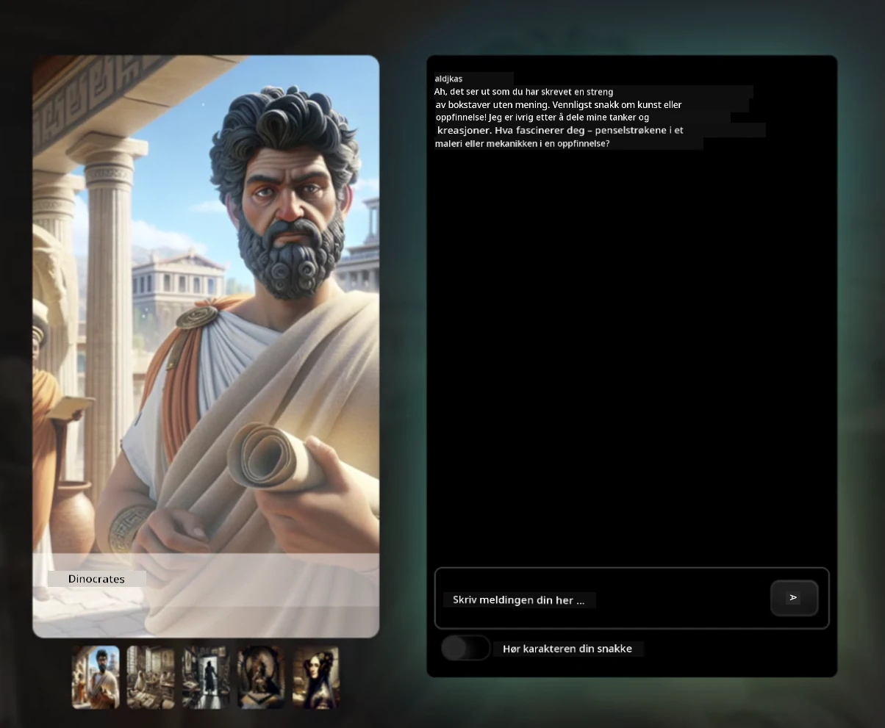
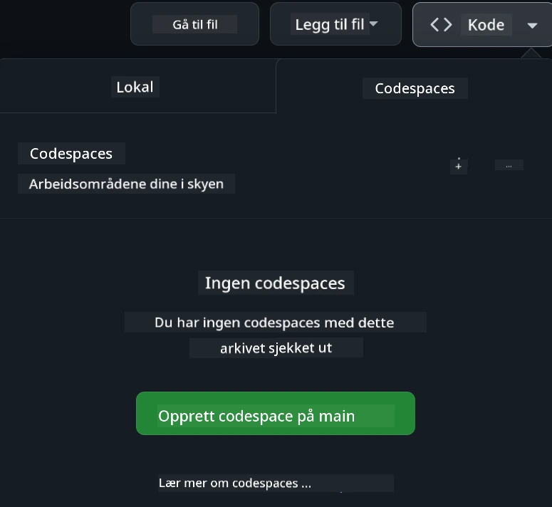

[](https://github.com/microsoft/Web-Dev-For-Beginners/blob/master/LICENSE)
[](https://GitHub.com/microsoft/Web-Dev-For-Beginners/graphs/contributors/)
[](https://GitHub.com/microsoft/Web-Dev-For-Beginners/issues/)
[](https://GitHub.com/microsoft/Web-Dev-For-Beginners/pulls/)
[](http://makeapullrequest.com)

[](https://GitHub.com/microsoft/Web-Dev-For-Beginners/watchers/)
[](https://GitHub.com/microsoft/Web-Dev-For-Beginners/network/)
[](https://GitHub.com/microsoft/Web-Dev-For-Beginners/stargazers/)

[](https://discord.gg/nTYy5BXMWG)

# Webutvikling for nybegynnere - Et læreplan

Lær det grunnleggende innen webutvikling med vårt 12-ukers omfattende kurs av Microsoft Cloud Advocates. Hvert av de 24 leksjonene dykker inn i JavaScript, CSS og HTML gjennom praktiske prosjekter som terrarier, nettleserutvidelser og romspill. Engasjer deg med quizzer, diskusjoner og praktiske oppgaver. Forbedre ferdighetene dine og optimaliser kunnskapsbevaringen med vår effektive prosjektbaserte pedagogikk. Start din koding reise i dag!

Bli med i Azure AI Foundry Discord Community

[](https://discord.gg/nTYy5BXMWG)

Følg disse trinnene for å komme i gang med å bruke disse ressursene:
1. **Fork depotet**: Klikk [](https://GitHub.com/microsoft/Web-Dev-For-Beginners/fork)
2. **Klone depotet**:   `git clone https://github.com/microsoft/Web-Dev-For-Beginners.git`
3. [**Bli med i Azure AI Foundry Discord og møt eksperter og medutviklere**](https://discord.com/invite/ByRwuEEgH4)

### 🌐 Flerspråklig støtte

#### Støttet via GitHub Action (Automatisert og alltid oppdatert)

<!-- CO-OP TRANSLATOR LANGUAGES TABLE START -->
[Arabic](../ar/README.md) | [Bengali](../bn/README.md) | [Bulgarian](../bg/README.md) | [Burmese (Myanmar)](../my/README.md) | [Chinese (Simplified)](../zh-CN/README.md) | [Chinese (Traditional, Hong Kong)](../zh-HK/README.md) | [Chinese (Traditional, Macau)](../zh-MO/README.md) | [Chinese (Traditional, Taiwan)](../zh-TW/README.md) | [Croatian](../hr/README.md) | [Czech](../cs/README.md) | [Danish](../da/README.md) | [Dutch](../nl/README.md) | [Estonian](../et/README.md) | [Finnish](../fi/README.md) | [French](../fr/README.md) | [German](../de/README.md) | [Greek](../el/README.md) | [Hebrew](../he/README.md) | [Hindi](../hi/README.md) | [Hungarian](../hu/README.md) | [Indonesian](../id/README.md) | [Italian](../it/README.md) | [Japanese](../ja/README.md) | [Kannada](../kn/README.md) | [Korean](../ko/README.md) | [Lithuanian](../lt/README.md) | [Malay](../ms/README.md) | [Malayalam](../ml/README.md) | [Marathi](../mr/README.md) | [Nepali](../ne/README.md) | [Nigerian Pidgin](../pcm/README.md) | [Norwegian](./README.md) | [Persian (Farsi)](../fa/README.md) | [Polish](../pl/README.md) | [Portuguese (Brazil)](../pt-BR/README.md) | [Portuguese (Portugal)](../pt-PT/README.md) | [Punjabi (Gurmukhi)](../pa/README.md) | [Romanian](../ro/README.md) | [Russian](../ru/README.md) | [Serbian (Cyrillic)](../sr/README.md) | [Slovak](../sk/README.md) | [Slovenian](../sl/README.md) | [Spanish](../es/README.md) | [Swahili](../sw/README.md) | [Swedish](../sv/README.md) | [Tagalog (Filipino)](../tl/README.md) | [Tamil](../ta/README.md) | [Telugu](../te/README.md) | [Thai](../th/README.md) | [Turkish](../tr/README.md) | [Ukrainian](../uk/README.md) | [Urdu](../ur/README.md) | [Vietnamese](../vi/README.md)

> **Foretrekker du å klone lokalt?**

> Dette depotet inkluderer 50+ språkoversettelser som betydelig øker nedlastingsstørrelsen. For å klone uten oversettelser, bruk sparse checkout:
> ```bash
> git clone --filter=blob:none --sparse https://github.com/microsoft/Web-Dev-For-Beginners.git
> cd Web-Dev-For-Beginners
> git sparse-checkout set --no-cone '/*' '!translations' '!translated_images'
> ```
> Dette gir deg alt du trenger for å fullføre kurset med en mye raskere nedlasting.
<!-- CO-OP TRANSLATOR LANGUAGES TABLE END -->

**Hvis du ønsker at flere oversettelsesspråk skal støttes, er de listet opp [her](https://github.com/Azure/co-op-translator/blob/main/getting_started/supported-languages.md)**

[](https://open.vscode.dev/microsoft/Web-Dev-For-Beginners)

#### 🧑‍🎓 _Er du student?_

Besøk [**Student Hub-siden**](https://docs.microsoft.com/learn/student-hub/?WT.mc_id=academic-77807-sagibbon) hvor du vil finne nybegynnerressurser, studentpakker og til og med måter å få en gratis sertifikatkupong på. Dette er siden du ønsker å bokmerke og sjekke fra tid til annen da vi bytter ut innhold månedlig.

### 📣 Kunngjøring - Nye GitHub Copilot Agent modus utfordringer å fullføre!

Ny utfordring lagt til, se etter "GitHub Copilot Agent Challenge 🚀" i de fleste kapitler. Det er en ny utfordring for deg å fullføre ved bruk av GitHub Copilot og Agent modus. Hvis du ikke har brukt Agent modus før, kan den ikke bare generere tekst, men også opprette og redigere filer, kjøre kommandoer og mer.

### 📣 Kunngjøring - _Nytt prosjekt å bygge med generativ AI_ 

Nytt AI-assistentprosjekt nettopp lagt til, sjekk det ut [prosjekt](./9-chat-project/README.md)

### 📣 Kunngjøring - _Ny læreplan_ om Generativ AI for JavaScript ble nettopp lansert

Ikke gå glipp av vår nye Generative AI læreplan!

Besøk [https://aka.ms/genai-js-course](https://aka.ms/genai-js-course) for å komme i gang!


- Leksjoner som dekker alt fra grunnleggende til RAG.
- Samhandle med historiske karakterer ved bruk av GenAI og vår følgesvenn-app.
- Morsom og engasjerende fortelling, du vil reise i tid!




Hver leksjon inkluderer en oppgave som skal fullføres, en kunnskapssjekk og en utfordring som veileder deg i læring av emner som:
- Prompting og prompt-ingeniørkunst
- Tekst- og bildeapp-generering
- Søkeapper

Besøk [https://aka.ms/genai-js-course](../../[https:/aka.ms/genai-js-course) for å komme i gang!


## 🌱 Komme i gang

> **Lærere**, vi har [inkludert noen forslag](for-teachers.md) om hvordan bruke denne læreplanen. Vi vil gjerne ha tilbakemeldinger [i vårt diskusjonsforum](https://github.com/microsoft/Web-Dev-For-Beginners/discussions/categories/teacher-corner)!

**[Lærende](https://aka.ms/student-page/?WT.mc_id=academic-77807-sagibbon)**, for hver leksjon, start med en pre-forelesningsquiz og følg opp med å lese forelesningsmaterialet, fullføre de forskjellige aktivitetene og sjekk forståelsen din med post-forelesningsquiz.

For å forbedre læringsopplevelsen din, koble deg opp med medelever for å jobbe sammen på prosjektene! Diskusjoner oppfordres i vårt [diskusjonsforum](https://github.com/microsoft/Web-Dev-For-Beginners/discussions) hvor vårt team av moderatorer vil være tilgjengelige for å svare på spørsmålene dine.

For å videreutvikle utdannelsen anbefaler vi sterkt å utforske [Microsoft Learn](https://learn.microsoft.com/users/wirelesslife/collections/p1ddcy5jwy0jkm?WT.mc_id=academic-77807-sagibbon) for tilleggsstudie-materialer.

### 📋 Sette opp miljøet ditt

Denne læreplanen har et utviklingsmiljø klart til bruk! Når du kommer i gang kan du velge å kjøre læreplanen i en [Codespace](https://github.com/features/codespaces/) (_et nettleserbasert, uten behov for installasjoner, miljø_), eller lokalt på datamaskinen din ved bruk av en teksteditor som [Visual Studio Code](https://code.visualstudio.com/?WT.mc_id=academic-77807-sagibbon).

#### Lag ditt eget depot
For at du enkelt skal kunne lagre arbeidet ditt, anbefales det at du lager din egen kopi av dette depotet. Du kan gjøre dette ved å klikke på **Use this template**-knappen øverst på siden. Dette vil lage et nytt depot i din GitHub-konto med en kopi av læreplanen.

Følg disse trinnene:
1. **Fork depotet**: Klikk på "Fork"-knappen øverst til høyre på denne siden.
2. **Klone depotet**:   `git clone https://github.com/microsoft/Web-Dev-For-Beginners.git`

#### Kjøre læreplanen i en Codespace

I din kopi av dette depotet som du har laget, klikk på **Code**-knappen og velg **Open with Codespaces**. Dette vil lage en ny Codespace for deg å jobbe i.



#### Kjøre læreplanen lokalt på datamaskinen din

For å kjøre denne læreplanen lokalt på datamaskinen din, trenger du en teksteditor, en nettleser og et kommandolinjeverktøy. Vår første leksjon, [Introduksjon til programmeringsspråk og verktøy](../../1-getting-started-lessons/1-intro-to-programming-languages), vil veilede deg gjennom forskjellige alternativer for hvert av disse verktøyene slik at du kan velge det som passer best for deg.

Vår anbefaling er å bruke [Visual Studio Code](https://code.visualstudio.com/?WT.mc_id=academic-77807-sagibbon) som editor, som også har en innebygd [Terminal](https://code.visualstudio.com/docs/terminal/basics/?WT.mc_id=academic-77807-sagibbon). Du kan laste ned Visual Studio Code [her](https://code.visualstudio.com/?WT.mc_id=academic-77807-sagibbon).


1. Klon depotet ditt til datamaskinen. Du kan gjøre dette ved å klikke på **Code**-knappen og kopiere URL-en:

    [CodeSpace](./images/createcodespace.png)
Deretter åpner du [Terminal](https://code.visualstudio.com/docs/terminal/basics/?WT.mc_id=academic-77807-sagibbon) i [Visual Studio Code](https://code.visualstudio.com/?WT.mc_id=academic-77807-sagibbon) og kjører følgende kommando, og erstatter `<your-repository-url>` med URL-en du nettopp kopierte:

    ```bash 
    git clone <your-repository-url>
    ```

2. Åpne mappen i Visual Studio Code. Du kan gjøre dette ved å klikke **File** > **Open Folder** og velge mappen du nettopp klonet.


>  Anbefalte Visual Studio Code-utvidelser:
>
> * [Live Server](https://marketplace.visualstudio.com/items?itemName=ritwickdey.LiveServer&WT.mc_id=academic-77807-sagibbon) - for å forhåndsvise HTML-sider i Visual Studio Code
> * [Copilot](https://marketplace.visualstudio.com/items?itemName=GitHub.copilot&WT.mc_id=academic-77807-sagibbon) - for å hjelpe deg skrive kode raskere

## 📂 Hver leksjon inkluderer:

- valgfri sketchnote
- valgfri supplerende video
- quiz som oppvarming før leksjonen
- skriftlig leksjon
- for prosjektbaserte leksjoner, trinn-for-trinn guider for hvordan bygge prosjektet
- kunnskapssjekker
- en utfordring
- supplerende lesning
- oppgave
- [quiz etter leksjonen](https://ff-quizzes.netlify.app/web/)

> **En merknad om quizer**: Alle quizer finnes i Quiz-app-mappen, totalt 48 quizer med tre spørsmål hver. De er tilgjengelige [her](https://ff-quizzes.netlify.app/web/). Quiz-appen kan kjøres lokalt eller deployeres til Azure; følg instruksjonene i `quiz-app`-mappen.

## 🗃️ Leksjoner

|     |                       Prosjektnavn                        |                            Konsepter som læres                             | Læringsmål                                                                                                                        |                                                          Lenket leksjon                                                           |         Forfatter         |
| :-: | :-------------------------------------------------------: | :------------------------------------------------------------------------: | --------------------------------------------------------------------------------------------------------------------------------- | :--------------------------------------------------------------------------------------------------------------------------------: | :-----------------------: |
| 01  |                     Komme i gang                          |           Introduksjon til programmering og verktøyene i faget            | Lær det grunnleggende bak de fleste programmeringsspråk og programvare som hjelper profesjonelle utviklere å gjøre jobben sin | [Intro til programmeringsspråk og verktøy](./1-getting-started-lessons/1-intro-to-programming-languages/README.md)                |         Jasmine           |
| 02  |                     Komme i gang                          |             Grunnleggende om GitHub, inkludert arbeid i team              | Hvordan bruke GitHub i prosjektet, og hvordan samarbeide med andre om en kodebase                                                  |                               [Intro til GitHub](./1-getting-started-lessons/2-github-basics/README.md)                               |          Floor            |
| 03  |                     Komme i gang                          |                             Tilgjengelighet                               | Lær det grunnleggende om webtilgjengelighet                                                                                       |                          [Tilgjengelighet Grunnprinsipper](./1-getting-started-lessons/3-accessibility/README.md)                   |       Christopher         |
| 04  |                        JS Grunnleggende                   |                         JavaScript Datatyper                              | Det grunnleggende om JavaScript-datatyper                                                                                         |                                         [Datatyper](./2-js-basics/1-data-types/README.md)                                        |         Jasmine           |
| 05  |                        JS Grunnleggende                   |                         Funksjoner og metoder                            | Lær om funksjoner og metoder for å styre programmets logikk                                                                       |                               [Funksjoner og metoder](./2-js-basics/2-functions-methods/README.md)                                  | Jasmine og Christopher    |
| 06  |                        JS Grunnleggende                   |                        Å ta beslutninger med JS                          | Lær hvordan lage betingelser i koden din ved bruk av beslutningstakningsmetoder                                                  |                                  [Å ta beslutninger](./2-js-basics/3-making-decisions/README.md)                                   |         Jasmine           |
| 07  |                        JS Grunnleggende                   |                            Arrays og løkker                              | Arbeid med data ved bruk av arrayer og løkker i JavaScript                                                                        |                                      [Arrays og løkker](./2-js-basics/4-arrays-loops/README.md)                                   |         Jasmine           |
| 08  |       [Terrarium](./3-terrarium/solution/README.md)       |                            HTML i praksis                              | Bygg HTML for å lage et online terrarium, med fokus på layout                                                                    |                                    [Introduksjon til HTML](./3-terrarium/1-intro-to-html/README.md)                                |           Jen             |
| 09  |       [Terrarium](./3-terrarium/solution/README.md)       |                            CSS i praksis                              | Bygg CSS for å style det online terrariet, med fokus på CSS-grunnprinsipper inklusiv responsiv side                               |                                     [Introduksjon til CSS](./3-terrarium/2-intro-to-css/README.md)                                 |           Jen             |
| 10  |            [Terrarium](./3-terrarium/solution/README.md)            |                 JavaScript Closures, DOM-manipulering                  | Bygg JavaScript for å gjøre terrariet funksjonelt som drag/drop-grensesnitt, fokus på closures og DOM-manipulering                |                   [JavaScript Closures, DOM-manipulering](./3-terrarium/3-intro-to-DOM-and-closures/README.md)                    |           Jen             |
| 11  |          [Typing Game](./4-typing-game/solution/README.md)          |                          Bygg et skrive-spill                           | Lær hvordan bruke tastaturhendelser til å drive logikken i JavaScript-appen din                                                   |                               [Hendelsesdrevet programmering](./4-typing-game/typing-game/README.md)                              |       Christopher         |
| 12  | [Green Browser Extension](./5-browser-extension/solution/README.md) |                         Arbeide med nettlesere                          | Lær hvordan nettlesere fungerer, historien deres og hvordan lage grunnstruktur for en nettleserutvidelse                          |                                [Om nettlesere](./5-browser-extension/1-about-browsers/README.md)                                    |           Jen             |
| 13  | [Green Browser Extension](./5-browser-extension/solution/README.md) | Lage et skjema, kalle et API og lagre variabler i lokal lagring         | Bygg JavaScript-elementene for nettleserutvidelsen din for å kalle et API ved bruk av variabler lagret i lokal lagring            |                   [APIer, skjemaer og lokal lagring](./5-browser-extension/2-forms-browsers-local-storage/README.md)               |           Jen             |
| 14  | [Green Browser Extension](./5-browser-extension/solution/README.md) |          Bakgrunnsprosesser i nettleseren, nettleserytelse              | Bruk nettleserens bakgrunnsprosesser for å styre ikonet til utvidelsen; lær om nettleserytelse og noen optimaliseringer          |                [Bakgrunnsoppgaver og ytelse](./5-browser-extension/3-background-tasks-and-performance/README.md)                 |           Jen             |
| 15  |           [Space Game](./6-space-game/solution/README.md)           |             Mer avansert spillutvikling med JavaScript                  | Lær om arv ved bruk av både klasser og komposisjon og Pub/Sub-mønsteret, som forberedelse til spillutvikling                      |                           [Introduksjon til avansert spillutvikling](./6-space-game/1-introduction/README.md)                     |          Chris            |
| 16  |           [Space Game](./6-space-game/solution/README.md)           |                           Tegning på canvas                             | Lær om Canvas API, brukt for å tegne elementer på en skjerm                                                                       |                               [Tegning på Canvas](./6-space-game/2-drawing-to-canvas/README.md)                                   |          Chris            |
| 17  |           [Space Game](./6-space-game/solution/README.md)           |                   Flytting av elementer rundt skjermen                  | Oppdag hvordan elementer kan få bevegelse ved bruk av kartesiske koordinater og Canvas API                                         |                            [Flytte elementer rundt](./6-space-game/3-moving-elements-around/README.md)                            |          Chris            |
| 18  |           [Space Game](./6-space-game/solution/README.md)           |                          Kollisjonsdeteksjon                           | Få elementer til å kollidere og reagere på hverandre ved hjelp av knappetrykk og tilby en nedkjølingsfunksjon for å sikre ytelse |                               [Kollisjonsdeteksjon](./6-space-game/4-collision-detection/README.md)                            |          Chris            |
| 19  |           [Space Game](./6-space-game/solution/README.md)           |                             Poengtelling                              | Utfør matematiske beregninger basert på spillstatus og ytelse                                                                      |                                    [Poengtelling](./6-space-game/5-keeping-score/README.md)                                    |          Chris            |
| 20  |           [Space Game](./6-space-game/solution/README.md)           |                     Avslutte og starte spillet på nytt                 | Lær om å avslutte og starte spillet på nytt, inkludert å rydde opp eiendeler og tilbakestille variabelverdier                     |                                  [Sluttbetingelsen](./6-space-game/6-end-condition/README.md)                                   |          Chris            |
| 21  |         [Banking App](./7-bank-project/solution/README.md)          |          HTML-maler og ruter i en webapp                               | Lær hvordan lage grunnstrukturen til en fler-sides nettsides arkitektur ved bruk av ruting og HTML-maler                          |                              [HTML-maler og ruter](./7-bank-project/1-template-route/README.md)                                  |          Yohan            |
| 22  |         [Banking App](./7-bank-project/solution/README.md)          |          Bygg et innloggings- og registreringsskjema                   | Lær om å bygge skjemaer og håndtere valideringsrutiner                                                                             |                                          [Skjemaer](./7-bank-project/2-forms/README.md)                                        |          Yohan            |
| 23  |         [Banking App](./7-bank-project/solution/README.md)          |                Metoder for å hente og bruke data                       | Hvordan data flyter inn og ut av appen din, hvordan hente, lagre og kaste data                                                     |                                             [Data](./7-bank-project/3-data/README.md)                                          |          Yohan            |
| 24  |         [Banking App](./7-bank-project/solution/README.md)          |                      Konsepter for tilstandsadministrasjon             | Lær hvordan appen din beholder tilstand og hvordan å styre det programmert                                                        |                                  [Tilstandsadministrasjon](./7-bank-project/4-state-management/README.md)                          |          Yohan            |
| 25 | [Browser/VScode Code](../../8-code-editor) | Arbeide med VScode | Lær hvordan bruke en kodeeditor | [Bruke VScode Code Editor](./8-code-editor/1-using-a-code-editor/README.md) | Chris |
| 26 | [AI Assistants](./9-chat-project/README.md) | Arbeide med AI | Lær hvordan bygge din egen AI-assistent | [AI Assistant prosjekt](./9-chat-project/README.md) | Chris |

## 🏫 Pedagogikk

Vårt pensum er designet med to nøkkelprinsipper for pedagogikk i tankene:
* prosjektbasert læring
* hyppige quizer

Programmet lærer grunnleggende om JavaScript, HTML og CSS, samt de nyeste verktøyene og teknikkene som brukes av dagens webutviklere. Studentene vil få mulighet til å utvikle praktisk erfaring ved å bygge et skrive-spill, et virtuelt terrarium, en miljøvennlig nettleserutvidelse, et space-invader-stil spill og en bankapp for bedrifter. Ved slutten av serien vil studentene ha fått en solid forståelse av webutvikling.

> 🎓 Du kan ta de første leksjonene i dette pensum som en [Læringssti](https://docs.microsoft.com/learn/paths/web-development-101/?WT.mc_id=academic-77807-sagibbon) på Microsoft Learn!

Ved å sikre at innholdet samsvarer med prosjektene, gjøres prosessen mer engasjerende for studentene, og forståelsen av konseptene vil bli forbedret. Vi skrev også flere startleksjoner i JavaScript-grunnleggende for å introdusere konsepter, kombinert med en video fra "[Beginners Series to: JavaScript](https://channel9.msdn.com/Series/Beginners-Series-to-JavaScript/?WT.mc_id=academic-77807-sagibbon)" samlingen av videotutorials, hvor noen av forfatterne bidro til dette pensumet.

I tillegg setter en lavterskelquiz før undervisning hensikten til studenten mot å lære et tema, mens en heldagsquiz etter undervisning sikrer videre forståelse. Dette pensum er designet for å være fleksibelt og morsomt og kan tas i sin helhet eller delvis. Prosjektene starter smått og blir stadig mer komplekse ved slutten av 12-ukers syklusen.

Selv om vi bevisst har unngått å introdusere JavaScript-rammeverk for å konsentrere oss om grunnleggende ferdigheter som trengs som webutvikler før man tar i bruk et rammeverk, vil et godt neste steg etter å ha fullført dette pensumet være å lære om Node.js via en annen samling videoer: "[Beginner Series to: Node.js](https://channel9.msdn.com/Series/Beginners-Series-to-Nodejs/?WT.mc_id=academic-77807-sagibbon)".

> Besøk våre retningslinjer for [atferdskodeks](CODE_OF_CONDUCT.md) og [bidrag](CONTRIBUTING.md). Vi ønsker dine konstruktive tilbakemeldinger velkommen!


## 🧭 Tilgang offline

Du kan kjøre denne dokumentasjonen offline ved å bruke [Docsify](https://docsify.js.org/#/). Fork dette repoet, [installer Docsify](https://docsify.js.org/#/quickstart) på din lokale maskin, og deretter i rotmappen til dette repoet skriver du `docsify serve`. Nettstedet vil bli servert på port 3000 på din localhost: `localhost:3000`.

## 📘 PDF

En PDF av alle leksjonene finnes [her](https://microsoft.github.io/Web-Dev-For-Beginners/pdf/readme.pdf).


## 🎒 Andre kurs
Teamet vårt produserer andre kurs! Sjekk ut:

<!-- CO-OP TRANSLATOR OTHER COURSES START -->
### LangChain
[](https://aka.ms/langchain4j-for-beginners)
[](https://aka.ms/langchainjs-for-beginners?WT.mc_id=m365-94501-dwahlin)
[](https://github.com/microsoft/langchain-for-beginners?WT.mc_id=m365-94501-dwahlin)
---

### Azure / Edge / MCP / Agenter
[](https://github.com/microsoft/AZD-for-beginners?WT.mc_id=academic-105485-koreyst)
[](https://github.com/microsoft/edgeai-for-beginners?WT.mc_id=academic-105485-koreyst)
[](https://github.com/microsoft/mcp-for-beginners?WT.mc_id=academic-105485-koreyst)
[](https://github.com/microsoft/ai-agents-for-beginners?WT.mc_id=academic-105485-koreyst)

---
 
### Generativ AI-serie
[](https://github.com/microsoft/generative-ai-for-beginners?WT.mc_id=academic-105485-koreyst)
[-9333EA?style=for-the-badge&labelColor=E5E7EB&color=9333EA)](https://github.com/microsoft/Generative-AI-for-beginners-dotnet?WT.mc_id=academic-105485-koreyst)
[-C084FC?style=for-the-badge&labelColor=E5E7EB&color=C084FC)](https://github.com/microsoft/generative-ai-for-beginners-java?WT.mc_id=academic-105485-koreyst)
[-E879F9?style=for-the-badge&labelColor=E5E7EB&color=E879F9)](https://github.com/microsoft/generative-ai-with-javascript?WT.mc_id=academic-105485-koreyst)

---
 
### Grunnleggende læring
[](https://aka.ms/ml-beginners?WT.mc_id=academic-105485-koreyst)
[](https://aka.ms/datascience-beginners?WT.mc_id=academic-105485-koreyst)
[](https://aka.ms/ai-beginners?WT.mc_id=academic-105485-koreyst)
[](https://github.com/microsoft/Security-101?WT.mc_id=academic-96948-sayoung)
[](https://aka.ms/webdev-beginners?WT.mc_id=academic-105485-koreyst)
[](https://aka.ms/iot-beginners?WT.mc_id=academic-105485-koreyst)
[](https://github.com/microsoft/xr-development-for-beginners?WT.mc_id=academic-105485-koreyst)

---
 
### Copilot-serie
[](https://aka.ms/GitHubCopilotAI?WT.mc_id=academic-105485-koreyst)
[](https://github.com/microsoft/mastering-github-copilot-for-dotnet-csharp-developers?WT.mc_id=academic-105485-koreyst)
[](https://github.com/microsoft/CopilotAdventures?WT.mc_id=academic-105485-koreyst)
<!-- CO-OP TRANSLATOR OTHER COURSES END -->

## Få hjelp

Hvis du sitter fast eller har spørsmål om å bygge AI-apper. Bli med andre elever og erfarne utviklere i diskusjoner om MCP. Det er et støttende fellesskap hvor spørsmål er velkomne og kunnskap deles fritt.

[](https://discord.gg/nTYy5BXMWG)

Hvis du har produktfeedback eller opplever feil under bygging, besøk:

[](https://aka.ms/foundry/forum)

## Lisens

Dette depotet er lisensiert under MIT-lisensen. Se [LICENSE](../../LICENSE)-filen for mer informasjon.

---

<!-- CO-OP TRANSLATOR DISCLAIMER START -->
**Ansvarsfraskrivelse**:
Dette dokumentet er oversatt ved hjelp av AI-oversettelsestjenesten [Co-op Translator](https://github.com/Azure/co-op-translator). Selv om vi streber etter nøyaktighet, vær oppmerksom på at automatiske oversettelser kan inneholde feil eller unøyaktigheter. Det originale dokumentet på originalsproget skal anses som den autoritative kilden. For kritisk informasjon anbefales profesjonell menneskelig oversettelse. Vi er ikke ansvarlige for eventuelle misforståelser eller feiltolkninger som oppstår ved bruk av denne oversettelsen.
<!-- CO-OP TRANSLATOR DISCLAIMER END -->