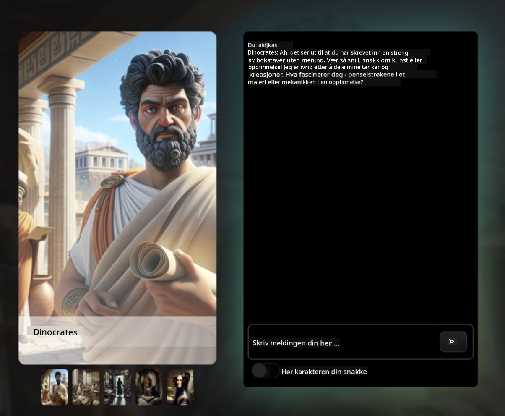

<!--
CO_OP_TRANSLATOR_METADATA:
{
  "original_hash": "efa251c5fc089367f0a81c572874afca",
  "translation_date": "2025-08-28T03:01:45+00:00",
  "source_file": "README.md",
  "language_code": "no"
}
-->
[](https://github.com/microsoft/Web-Dev-For-Beginners/blob/master/LICENSE)  
[](https://GitHub.com/microsoft/Web-Dev-For-Beginners/graphs/contributors/)  
[](https://GitHub.com/microsoft/Web-Dev-For-Beginners/issues/)  
[](https://GitHub.com/microsoft/Web-Dev-For-Beginners/pulls/)  
[](http://makeapullrequest.com)  

[](https://GitHub.com/microsoft/Web-Dev-For-Beginners/watchers/)  
[](https://GitHub.com/microsoft/Web-Dev-For-Beginners/network/)  
[](https://GitHub.com/microsoft/Web-Dev-For-Beginners/stargazers/)  

[](https://discord.gg/zxKYvhSnVp?WT.mc_id=academic-000002-leestott)  

[](https://open.vscode.dev/microsoft/Web-Dev-For-Beginners)  

[](https://discord.com/invite/ByRwuEEgH4)  

Følg disse stegene for å komme i gang med ressursene:  
1. **Fork repositoryen**: Klikk [](https://GitHub.com/microsoft/Web-Dev-For-Beginners/fork)  
2. **Klon repositoryen**:   `git clone https://github.com/microsoft/Web-Dev-For-Beginners.git`  
3. [**Bli med i Azure AI Foundry Discord og møt eksperter og andre utviklere**](https://discord.com/invite/ByRwuEEgH4)  

# Webutvikling for nybegynnere - Et kurs  

Lær det grunnleggende innen webutvikling med vårt 12-ukers omfattende kurs fra Microsoft Cloud Advocates. Hver av de 24 leksjonene går i dybden på JavaScript, CSS og HTML gjennom praktiske prosjekter som terrarier, nettleserutvidelser og romspill. Delta i quizzer, diskusjoner og praktiske oppgaver. Forbedre ferdighetene dine og optimaliser kunnskapsbeholdningen med vår effektive prosjektbaserte pedagogikk. Start din kode-reise i dag!  

#### 🧑‍🎓 _Er du student?_  

Besøk [**Student Hub-siden**](https://docs.microsoft.com/learn/student-hub/?WT.mc_id=academic-77807-sagibbon) hvor du finner ressurser for nybegynnere, studentpakker og til og med måter å få en gratis sertifikatvoucher. Dette er siden du bør bokmerke og sjekke jevnlig, da vi bytter ut innhold månedlig.  

### 📣 Kunngjøring - _Nytt kurs_ om Generativ AI for JavaScript er nettopp lansert  

Ikke gå glipp av vårt nye kurs om Generativ AI!  

Besøk [https://aka.ms/genai-js-course](https://aka.ms/genai-js-course) for å komme i gang!  

  

- Leksjoner som dekker alt fra grunnleggende til RAG.  
- Interager med historiske karakterer ved hjelp av GenAI og vår tilhørende app.  
- Morsom og engasjerende fortelling, du vil reise i tid!  

  

Hver leksjon inkluderer en oppgave, en kunnskapssjekk og en utfordring for å veilede deg i læring av emner som:  
- Prompting og prompt engineering  
- Tekst- og bildeapp-generering  
- Søkeapper  

Besøk [https://aka.ms/genai-js-course](https://aka.ms/genai-js-course) for å komme i gang!  

## 🌱 Kom i gang  

> **Lærere**, vi har [inkludert noen forslag](for-teachers.md) om hvordan du kan bruke dette kurset. Vi vil gjerne ha tilbakemeldingen din [i vårt diskusjonsforum](https://github.com/microsoft/Web-Dev-For-Beginners/discussions/categories/teacher-corner)!  

**[Lærende](https://aka.ms/student-page/?WT.mc_id=academic-77807-sagibbon)**, for hver leksjon, start med en quiz før forelesningen og fortsett med å lese forelesningsmaterialet, fullføre de ulike aktivitetene og sjekke forståelsen din med quizen etter forelesningen.  

For å forbedre læringsopplevelsen din, koble deg sammen med andre for å jobbe på prosjektene sammen! Diskusjoner oppmuntres i vårt [diskusjonsforum](https://github.com/microsoft/Web-Dev-For-Beginners/discussions) hvor vårt team av moderatorer vil være tilgjengelige for å svare på spørsmålene dine.  

For å utvide utdanningen din, anbefaler vi sterkt å utforske [Microsoft Learn](https://learn.microsoft.com/users/wirelesslife/collections/p1ddcy5jwy0jkm?WT.mc_id=academic-77807-sagibbon) for ytterligere studiemateriale.  

### 📋 Sette opp miljøet ditt  

Dette kurset har et utviklingsmiljø klart til bruk! Når du starter, kan du velge å kjøre kurset i en [Codespace](https://github.com/features/codespaces/) (_et nettleserbasert miljø uten behov for installasjoner_), eller lokalt på datamaskinen din ved hjelp av en teksteditor som [Visual Studio Code](https://code.visualstudio.com/?WT.mc_id=academic-77807-sagibbon).  

#### Opprett repositoryen din  
For å enkelt lagre arbeidet ditt, anbefales det at du oppretter din egen kopi av denne repositoryen. Du kan gjøre dette ved å klikke på **Bruk denne malen**-knappen øverst på siden. Dette vil opprette en ny repository i GitHub-kontoen din med en kopi av kurset.  

Følg disse stegene:  
1. **Fork repositoryen**: Klikk på "Fork"-knappen øverst til høyre på denne siden.  
2. **Klon repositoryen**:   `git clone https://github.com/microsoft/Web-Dev-For-Beginners.git`  

#### Kjøre kurset i en Codespace  

I kopien av repositoryen du opprettet, klikk på **Code**-knappen og velg **Open with Codespaces**. Dette vil opprette en ny Codespace for deg å jobbe i.  

[!Codespace](../..)./images/createcodespace.png)  

#### Kjøre kurset lokalt på datamaskinen din  

For å kjøre dette kurset lokalt på datamaskinen din, trenger du en teksteditor, en nettleser og et kommandolinjeverktøy. Vår første leksjon, [Introduksjon til programmeringsspråk og verktøy](../../1-getting-started-lessons/1-intro-to-programming-languages), vil gå gjennom ulike alternativer for hvert av disse verktøyene slik at du kan velge det som passer best for deg.  

Vår anbefaling er å bruke [Visual Studio Code](https://code.visualstudio.com/?WT.mc_id=academic-77807-sagibbon) som editor, som også har en innebygd [Terminal](https://code.visualstudio.com/docs/terminal/basics/?WT.mc_id=academic-77807-sagibbon). Du kan laste ned Visual Studio Code [her](https://code.visualstudio.com/?WT.mc_id=academic-77807-sagibbon).  

1. Klon repositoryen til datamaskinen din. Du kan gjøre dette ved å klikke på **Code**-knappen og kopiere URL-en:  

    [!CodeSpace](./images/createcodespace.png)  

    Deretter åpner du [Terminal](https://code.visualstudio.com/docs/terminal/basics/?WT.mc_id=academic-77807-sagibbon) i [Visual Studio Code](https://code.visualstudio.com/?WT.mc_id=academic-77807-sagibbon) og kjører følgende kommando, hvor `<your-repository-url>` erstattes med URL-en du nettopp kopierte:  

    ```bash 
    git clone <your-repository-url>
    ```  

2. Åpne mappen i Visual Studio Code. Du kan gjøre dette ved å klikke **File** > **Open Folder** og velge mappen du nettopp klonet.  

>  Anbefalte Visual Studio Code-utvidelser:  
>  
> * [Live Server](https://marketplace.visualstudio.com/items?itemName=ritwickdey.LiveServer&WT.mc_id=academic-77807-sagibbon) - for å forhåndsvise HTML-sider i Visual Studio Code  
> * [Copilot](https://marketplace.visualstudio.com/items?itemName=GitHub.copilot&WT.mc_id=academic-77807-sagibbon) - for å hjelpe deg med å skrive kode raskere  

## 📂 Hver leksjon inkluderer:  

- valgfri sketchnote  
- valgfri tilleggsvideo  
- oppvarmingsquiz før leksjonen  
- skriftlig leksjon  
- for prosjektbaserte leksjoner, steg-for-steg guider for hvordan man bygger prosjektet  
- kunnskapssjekker  
- en utfordring  
- tilleggslesing  
- oppgave  
- [quiz etter leksjonen](https://ff-quizzes.netlify.app/)  

> **En merknad om quizzer**: Alle quizzer er inkludert i Quiz-app-mappen, totalt 48 quizzer med tre spørsmål hver. De er tilgjengelige [her](https://ff-quizzes.netlify.app/) og quiz-appen kan kjøres lokalt eller distribueres til Azure; følg instruksjonene i `quiz-app`-mappen.  

## 🗃️ Leksjoner  

|     |                       Prosjektnavn                       |                            Konsepter som læres                            | Læringsmål                                                                                                                         |                                                         Lenket leksjon                                                          |         Forfatter         |  
| :-: | :------------------------------------------------------: | :-----------------------------------------------------------------------: | ---------------------------------------------------------------------------------------------------------------------------------- | :-----------------------------------------------------------------------------------------------------------------------------: | :-----------------------: |  
| 01  |                     Komme i gang                        |           Introduksjon til programmering og verktøyene som brukes           | Lær det grunnleggende bak de fleste programmeringsspråk og om programvare som hjelper profesjonelle utviklere med jobben sin       | [Introduksjon til programmeringsspråk og verktøy](./1-getting-started-lessons/1-intro-to-programming-languages/README.md)       |         Jasmine           |  
| 02  |                     Komme i gang                        |             Grunnleggende om GitHub, inkludert samarbeid i team             | Hvordan bruke GitHub i prosjektet ditt, hvordan samarbeide med andre på en kodebase                                                |                            [Introduksjon til GitHub](./1-getting-started-lessons/2-github-basics/README.md)                      |          Floor            |  
| 03  |                     Komme i gang                        |                             Tilgjengelighet                              | Lær det grunnleggende om webtilgjengelighet                                                                                         |                       [Grunnleggende om tilgjengelighet](./1-getting-started-lessons/3-accessibility/README.md)                  |       Christopher         |  
| 04  |                        JS Grunnleggende                  |                         JavaScript Datatyper                              | Det grunnleggende om JavaScript-datatyper                                                                                          |                                       [Datatyper](./2-js-basics/1-data-types/README.md)                                         |         Jasmine           |  
| 05  |                        JS Grunnleggende                  |                         Funksjoner og metoder                              | Lær om funksjoner og metoder for å håndtere logikkflyten i en applikasjon                                                          |                              [Funksjoner og metoder](./2-js-basics/2-functions-methods/README.md)                                | Jasmine og Christopher    |  
| 06  |                        JS Grunnleggende                  |                        Ta beslutninger med JS                             | Lær hvordan du lager betingelser i koden din ved hjelp av metoder for beslutningstaking                                             |                                 [Ta beslutninger](./2-js-basics/3-making-decisions/README.md)                                   |         Jasmine           |  
| 07  |                        JS Grunnleggende                  |                            Arrays og løkker                               | Jobb med data ved hjelp av arrays og løkker i JavaScript                                                                           |                                   [Arrays og løkker](./2-js-basics/4-arrays-loops/README.md)                                     |         Jasmine           |  
| 08  |       [Terrarium](./3-terrarium/solution/README.md)       |                            HTML i praksis                                 | Bygg HTML for å lage et online terrarium, med fokus på å bygge et layout                                                           |                                 [Introduksjon til HTML](./3-terrarium/1-intro-to-html/README.md)                                 |           Jen             |  
| 09  |       [Terrarium](./3-terrarium/solution/README.md)       |                            CSS i praksis                                  | Bygg CSS for å style det online terrariet, med fokus på det grunnleggende i CSS, inkludert å gjøre siden responsiv                 |                                  [Introduksjon til CSS](./3-terrarium/2-intro-to-css/README.md)                                  |           Jen             |  
| 10  |            [Terrarium](./3-terrarium/solution/README.md)            |                 JavaScript Closures, DOM-manipulering                  | Bygg JavaScript som får terrariet til å fungere som et dra-og-slipp-grensesnitt, med fokus på closures og DOM-manipulering          |                  [JavaScript Closures, DOM-manipulering](./3-terrarium/3-intro-to-DOM-and-closures/README.md)                   |           Jen           |
| 11  |          [Typing Game](./4-typing-game/solution/README.md)          |                          Bygg et skrive-spill                          | Lær hvordan du bruker tastaturevents for å styre logikken i JavaScript-appen din                                                    |                                [Event-drevet programmering](./4-typing-game/typing-game/README.md)                              |       Christopher       |
| 12  | [Green Browser Extension](./5-browser-extension/solution/README.md) |                         Arbeide med nettlesere                         | Lær hvordan nettlesere fungerer, deres historie, og hvordan du kan sette opp de første elementene i en nettleserutvidelse          |                               [Om nettlesere](./5-browser-extension/1-about-browsers/README.md)                                 |           Jen           |
| 13  | [Green Browser Extension](./5-browser-extension/solution/README.md) | Bygge et skjema, kalle en API og lagre variabler i lokal lagring       | Bygg JavaScript-elementene i nettleserutvidelsen din for å kalle en API ved hjelp av variabler lagret i lokal lagring               |                [API-er, skjemaer og lokal lagring](./5-browser-extension/2-forms-browsers-local-storage/README.md)              |           Jen           |
| 14  | [Green Browser Extension](./5-browser-extension/solution/README.md) |          Bakgrunnsprosesser i nettleseren, ytelsesoptimalisering       | Bruk nettleserens bakgrunnsprosesser til å administrere utvidelsens ikon; lær om webytelse og noen optimaliseringer                |             [Bakgrunnsoppgaver og ytelse](./5-browser-extension/3-background-tasks-and-performance/README.md)                  |           Jen           |
| 15  |           [Space Game](./6-space-game/solution/README.md)           |             Mer avansert spillutvikling med JavaScript                 | Lær om arv ved bruk av både klasser og komposisjon, samt Pub/Sub-mønsteret, som forberedelse til å bygge et spill                  |                      [Introduksjon til avansert spillutvikling](./6-space-game/1-introduction/README.md)                        |          Chris          |
| 16  |           [Space Game](./6-space-game/solution/README.md)           |                           Tegne på canvas                              | Lær om Canvas API, som brukes til å tegne elementer på skjermen                                                                     |                                [Tegne på canvas](./6-space-game/2-drawing-to-canvas/README.md)                                   |          Chris          |
| 17  |           [Space Game](./6-space-game/solution/README.md)           |                   Flytte elementer rundt på skjermen                   | Oppdag hvordan elementer kan få bevegelse ved hjelp av kartesiske koordinater og Canvas API                                         |                           [Flytte elementer rundt](./6-space-game/3-moving-elements-around/README.md)                           |          Chris          |
| 18  |           [Space Game](./6-space-game/solution/README.md)           |                          Kollisjonsdeteksjon                           | Få elementer til å kollidere og reagere på hverandre ved hjelp av tastetrykk, og implementer en nedkjølingsfunksjon for ytelse      |                              [Kollisjonsdeteksjon](./6-space-game/4-collision-detection/README.md)                              |          Chris          |
| 19  |           [Space Game](./6-space-game/solution/README.md)           |                             Holde styr på poeng                        | Utfør matematiske beregninger basert på spillets status og ytelse                                                                   |                                    [Holde styr på poeng](./6-space-game/5-keeping-score/README.md)                               |          Chris          |
| 20  |           [Space Game](./6-space-game/solution/README.md)           |                     Avslutte og starte spillet på nytt                 | Lær om hvordan du avslutter og starter spillet på nytt, inkludert opprydding av ressurser og tilbakestilling av variabler          |                                [Avslutningsbetingelse](./6-space-game/6-end-condition/README.md)                                |          Chris          |
| 21  |         [Banking App](./7-bank-project/solution/README.md)          |                 HTML-maler og ruter i en webapp                        | Lær hvordan du lager grunnstrukturen for en flersidet nettsides arkitektur ved hjelp av ruting og HTML-maler                       |                            [HTML-maler og ruter](./7-bank-project/1-template-route/README.md)                                   |          Yohan          |
| 22  |         [Banking App](./7-bank-project/solution/README.md)          |                  Bygge et innloggings- og registreringsskjema          | Lær om å bygge skjemaer og håndtere valideringsrutiner                                                                              |                                           [Skjemaer](./7-bank-project/2-forms/README.md)                                        |          Yohan          |
| 23  |         [Banking App](./7-bank-project/solution/README.md)          |                   Metoder for å hente og bruke data                    | Hvordan data flyter inn og ut av appen din, hvordan du henter, lagrer og sletter den                                               |                                            [Data](./7-bank-project/3-data/README.md)                                            |          Yohan          |
| 24  |         [Banking App](./7-bank-project/solution/README.md)          |                      Konsepter for tilstandsadministrasjon              | Lær hvordan appen din beholder tilstand og hvordan du administrerer den programmatisk                                              |                                [Tilstandsadministrasjon](./7-bank-project/4-state-management/README.md)                         |          Yohan          |


## 🏫 Pedagogikk

Vår læreplan er designet med to sentrale pedagogiske prinsipper i tankene:
* prosjektbasert læring
* hyppige quizer

Programmet lærer bort grunnleggende JavaScript, HTML og CSS, samt de nyeste verktøyene og teknikkene som brukes av dagens webutviklere. Studentene får muligheten til å utvikle praktisk erfaring ved å bygge et skrive-spill, et virtuelt terrarium, en miljøvennlig nettleserutvidelse, et spill i stil med Space Invaders, og en bankapp for bedrifter. Ved slutten av serien vil studentene ha oppnådd en solid forståelse av webutvikling.

> 🎓 Du kan ta de første leksjonene i denne læreplanen som en [Learn Path](https://docs.microsoft.com/learn/paths/web-development-101/?WT.mc_id=academic-77807-sagibbon) på Microsoft Learn!

Ved å sørge for at innholdet er knyttet til prosjekter, blir prosessen mer engasjerende for studentene, og konseptene vil bli bedre husket. Vi har også skrevet flere innledende leksjoner i JavaScript-grunnleggende for å introdusere konsepter, sammen med en video fra "[Beginners Series to: JavaScript](https://channel9.msdn.com/Series/Beginners-Series-to-JavaScript/?WT.mc_id=academic-77807-sagibbon)"-samlingen av videotutorials, hvor noen av forfatterne bidro til denne læreplanen.

I tillegg setter en lavterskelquiz før en klasse studentens fokus mot å lære et tema, mens en andre quiz etter klassen sikrer ytterligere forståelse. Denne læreplanen er designet for å være fleksibel og morsom og kan tas i sin helhet eller delvis. Prosjektene starter små og blir stadig mer komplekse mot slutten av den 12-ukers syklusen.

Selv om vi bevisst har unngått å introdusere JavaScript-rammeverk for å konsentrere oss om de grunnleggende ferdighetene som trengs som webutvikler før man tar i bruk et rammeverk, vil et godt neste steg etter å ha fullført denne læreplanen være å lære om Node.js via en annen samling videoer: "[Beginner Series to: Node.js](https://channel9.msdn.com/Series/Beginners-Series-to-Nodejs/?WT.mc_id=academic-77807-sagibbon)".

> Besøk våre [Retningslinjer for oppførsel](CODE_OF_CONDUCT.md) og [Bidragsveiledning](CONTRIBUTING.md). Vi ønsker dine konstruktive tilbakemeldinger velkommen!


## 🧭 Offline tilgang

Du kan kjøre denne dokumentasjonen offline ved å bruke [Docsify](https://docsify.js.org/#/). Fork denne repoen, [installer Docsify](https://docsify.js.org/#/quickstart) på din lokale maskin, og skriv deretter `docsify serve` i rotmappen til denne repoen. Nettstedet vil bli servert på port 3000 på din localhost: `localhost:3000`.

## 📘 PDF

En PDF av alle leksjonene finner du [her](https://microsoft.github.io/Web-Dev-For-Beginners/pdf/readme.pdf).


## 🎒 Andre kurs

Vårt team produserer andre kurs! Sjekk ut:

- [Generativ AI for nybegynnere](https://aka.ms/genai-beginners)
- [Generativ AI for nybegynnere .NET](https://github.com/microsoft/Generative-AI-for-beginners-dotnet)
- [Generativ AI med JavaScript](https://github.com/microsoft/generative-ai-with-javascript)
- [Generativ AI med Java](https://github.com/microsoft/Generative-AI-for-beginners-java)
- [AI for nybegynnere](https://aka.ms/ai-beginners)
- [Data Science for nybegynnere](https://aka.ms/datascience-beginners)
- [ML for nybegynnere](https://aka.ms/ml-beginners)
- [Cybersikkerhet for nybegynnere](https://github.com/microsoft/Security-101)
- [Webutvikling for nybegynnere](https://aka.ms/webdev-beginners)
- [IoT for nybegynnere](https://aka.ms/iot-beginners)
- [XR-utvikling for nybegynnere](https://github.com/microsoft/xr-development-for-beginners)
- [Mestre GitHub Copilot for agentisk bruk](https://github.com/microsoft/Mastering-GitHub-Copilot-for-Paired-Programming)
- [Mestre GitHub Copilot for C#/.NET-utviklere](https://github.com/microsoft/mastering-github-copilot-for-dotnet-csharp-developers)
- [Velg ditt eget Copilot-eventyr](https://github.com/microsoft/CopilotAdventures)

## Lisens

Dette repositoriet er lisensiert under MIT-lisensen. Se [LISENS](../../LICENSE)-filen for mer informasjon.

---

**Ansvarsfraskrivelse**:  
Dette dokumentet er oversatt ved hjelp av AI-oversettelsestjenesten [Co-op Translator](https://github.com/Azure/co-op-translator). Selv om vi streber etter nøyaktighet, vær oppmerksom på at automatiske oversettelser kan inneholde feil eller unøyaktigheter. Det originale dokumentet på sitt opprinnelige språk bør anses som den autoritative kilden. For kritisk informasjon anbefales profesjonell menneskelig oversettelse. Vi er ikke ansvarlige for misforståelser eller feiltolkninger som oppstår ved bruk av denne oversettelsen.