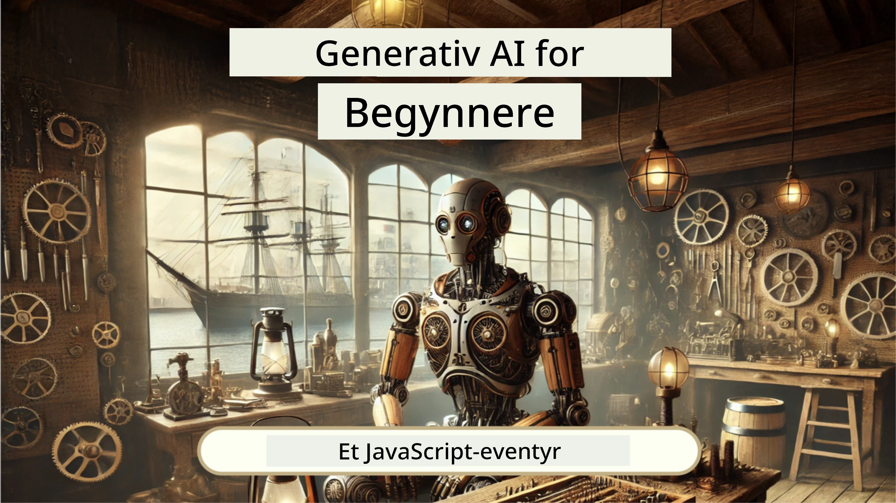
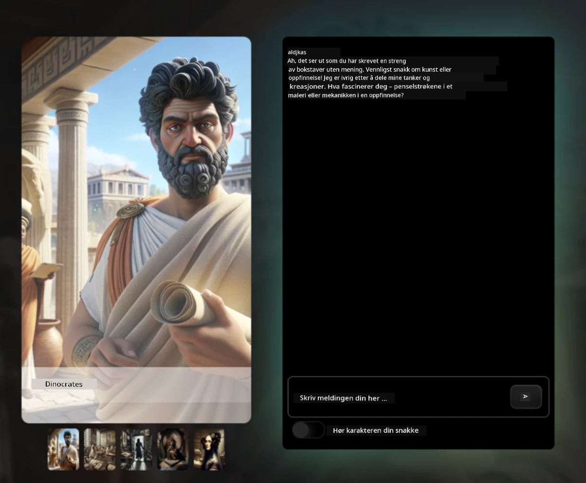
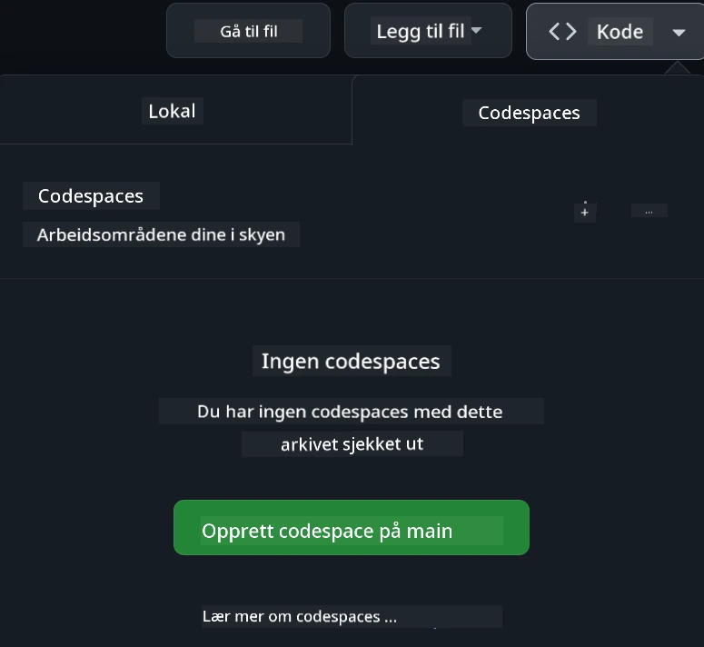

[](https://github.com/microsoft/Web-Dev-For-Beginners/blob/master/LICENSE)
[](https://GitHub.com/microsoft/Web-Dev-For-Beginners/graphs/contributors/)
[](https://GitHub.com/microsoft/Web-Dev-For-Beginners/issues/)
[](https://GitHub.com/microsoft/Web-Dev-For-Beginners/pulls/)
[](http://makeapullrequest.com) 

[](https://GitHub.com/microsoft/Web-Dev-For-Beginners/watchers/)
[](https://GitHub.com/microsoft/Web-Dev-For-Beginners/network/)
[](https://GitHub.com/microsoft/Web-Dev-For-Beginners/stargazers/)

[](https://discord.gg/nTYy5BXMWG)

# Webutvikling for nybegynnere - En læreplan

Lær det grunnleggende innen webutvikling med vårt 12-ukers omfattende kurs av Microsoft Cloud Advocates. Hver av de 24 leksjonene dykker inn i JavaScript, CSS og HTML gjennom praktiske prosjekter som terrarier, nettleserutvidelser og romspill. Engasjer deg med quizzer, diskusjoner og praktiske oppgaver. Forbedre ferdighetene dine og optimaliser kunnskapsinnhentingen med vår effektive prosjektbaserte pedagogikk. Start kodingen din i dag!

Bli med i Azure AI Foundry Discord-samfunnet

[](https://discord.gg/nTYy5BXMWG)

Følg disse trinnene for å komme i gang med disse ressursene:
1. **Fork repositoriet**: Klikk [](https://GitHub.com/microsoft/Web-Dev-For-Beginners/fork)
2. **Klone repositoriet**:   `git clone https://github.com/microsoft/Web-Dev-For-Beginners.git`
3. [**Bli med i Azure AI Foundry Discord og møt eksperter og medutviklere**](https://discord.com/invite/ByRwuEEgH4)

### 🌐 Støtte for flere språk

#### Støttet via GitHub Action (Automatisert og alltid oppdatert)

<!-- CO-OP TRANSLATOR LANGUAGES TABLE START -->
[Arabic](../ar/README.md) | [Bengali](../bn/README.md) | [Bulgarian](../bg/README.md) | [Burmese (Myanmar)](../my/README.md) | [Chinese (Simplified)](../zh-CN/README.md) | [Chinese (Traditional, Hong Kong)](../zh-HK/README.md) | [Chinese (Traditional, Macau)](../zh-MO/README.md) | [Chinese (Traditional, Taiwan)](../zh-TW/README.md) | [Croatian](../hr/README.md) | [Czech](../cs/README.md) | [Danish](../da/README.md) | [Dutch](../nl/README.md) | [Estonian](../et/README.md) | [Finnish](../fi/README.md) | [French](../fr/README.md) | [German](../de/README.md) | [Greek](../el/README.md) | [Hebrew](../he/README.md) | [Hindi](../hi/README.md) | [Hungarian](../hu/README.md) | [Indonesian](../id/README.md) | [Italian](../it/README.md) | [Japanese](../ja/README.md) | [Kannada](../kn/README.md) | [Khmer](../km/README.md) | [Korean](../ko/README.md) | [Lithuanian](../lt/README.md) | [Malay](../ms/README.md) | [Malayalam](../ml/README.md) | [Marathi](../mr/README.md) | [Nepali](../ne/README.md) | [Nigerian Pidgin](../pcm/README.md) | [Norwegian](./README.md) | [Persian (Farsi)](../fa/README.md) | [Polish](../pl/README.md) | [Portuguese (Brazil)](../pt-BR/README.md) | [Portuguese (Portugal)](../pt-PT/README.md) | [Punjabi (Gurmukhi)](../pa/README.md) | [Romanian](../ro/README.md) | [Russian](../ru/README.md) | [Serbian (Cyrillic)](../sr/README.md) | [Slovak](../sk/README.md) | [Slovenian](../sl/README.md) | [Spanish](../es/README.md) | [Swahili](../sw/README.md) | [Swedish](../sv/README.md) | [Tagalog (Filipino)](../tl/README.md) | [Tamil](../ta/README.md) | [Telugu](../te/README.md) | [Thai](../th/README.md) | [Turkish](../tr/README.md) | [Ukrainian](../uk/README.md) | [Urdu](../ur/README.md) | [Vietnamese](../vi/README.md)

> **Foretrekker du å klone lokalt?**
>
> Dette repositoriet inkluderer 50+ språkoversettelser som betydelig øker nedlastingsstørrelsen. For å klone uten oversettelser, bruk sparsom utsjekking:
>
> **Bash / macOS / Linux:**
> ```bash
> git clone --filter=blob:none --sparse https://github.com/microsoft/Web-Dev-For-Beginners.git
> cd Web-Dev-For-Beginners
> git sparse-checkout set --no-cone '/*' '!translations' '!translated_images'
> ```
>
> **CMD (Windows):**
> ```cmd
> git clone --filter=blob:none --sparse https://github.com/microsoft/Web-Dev-For-Beginners.git
> cd Web-Dev-For-Beginners
> git sparse-checkout set --no-cone "/*" "!translations" "!translated_images"
> ```
>
> Dette gir deg alt du trenger for å fullføre kurset med en mye raskere nedlasting.
<!-- CO-OP TRANSLATOR LANGUAGES TABLE END -->

**Hvis du ønsker at flere oversettelser skal støttes, er de oppført [her](https://github.com/Azure/co-op-translator/blob/main/getting_started/supported-languages.md)**

[](https://open.vscode.dev/microsoft/Web-Dev-For-Beginners)

#### 🧑‍🎓 _Er du student?_

Besøk [**Student Hub-siden**](https://docs.microsoft.com/learn/student-hub/?WT.mc_id=academic-77807-sagibbon) hvor du finner nybegynnerressurser, studentpakker og til og med måter å få et gratis sertifikatkupong på. Dette er siden du vil bokmerke og sjekke fra tid til annen da vi bytter ut innhold månedlig.

### 📣 Kunngjøring - Nye utfordringer i GitHub Copilot Agent-modus å fullføre!

Ny utfordring lagt til, se etter "GitHub Copilot Agent Challenge 🚀" i de fleste kapitler. Det er en ny utfordring for deg å gjennomføre ved bruk av GitHub Copilot og Agent-modus. Hvis du ikke har brukt Agent-modus før, kan den ikke bare generere tekst, men også opprette og redigere filer, kjøre kommandoer og mer.

### 📣 Kunngjøring - _Nytt prosjekt å bygge med generativ AI_

Nytt AI Assistant prosjekt lagt til, sjekk det ut [prosjekt](./9-chat-project/README.md)

### 📣 Kunngjøring - _Ny læreplan_ om generativ AI for JavaScript ble nettopp lansert

Ikke gå glipp av vår nye læreplan for generativ AI!

Besøk [https://aka.ms/genai-js-course](https://aka.ms/genai-js-course) for å komme i gang!



- Leksjoner som dekker alt fra grunnleggende til RAG.
- Interager med historiske karakterer ved hjelp av GenAI og vår følgesvenn-app.
- Morsom og engasjerende fortelling, du vil tidsreise!




Hver leksjon inkluderer en oppgave som må fullføres, en kunnskapskontroll og en utfordring for å veilede deg i læringstemaer som:
- Prompting og prompt engineering
- Tekst- og bildeapp-generering
- Søkeapper

Besøk [https://aka.ms/genai-js-course](https://aka.ms/genai-js-course) for å komme i gang!


## 🌱 Komme i gang

> **Lærere**, vi har [inkludert noen forslag](for-teachers.md) om hvordan bruke denne læreplanen. Vi setter pris på din tilbakemelding [i vårt diskusjonsforum](https://github.com/microsoft/Web-Dev-For-Beginners/discussions/categories/teacher-corner)!

**[Lærende](https://aka.ms/student-page/?WT.mc_id=academic-77807-sagibbon)**, for hver leksjon, start med en forhånds-quiz og følg opp med å lese forelesningsmaterialet, fullføre de ulike aktivitetene og sjekk forståelsen din med post-forelesningsquizen.

For å forbedre læringsopplevelsen, koble deg til med jevnaldrende for å jobbe sammen på prosjektene! Diskusjoner oppmuntres i vårt [diskusjonsforum](https://github.com/microsoft/Web-Dev-For-Beginners/discussions) der vårt team av moderatorer er tilgjengelige for å svare på spørsmålene dine.

For å fremme utdanningen din anbefaler vi sterkt å utforske [Microsoft Learn](https://learn.microsoft.com/users/wirelesslife/collections/p1ddcy5jwy0jkm?WT.mc_id=academic-77807-sagibbon) for ekstra studiemateriell.

### 📋 Sette opp ditt miljø

Denne læreplanen har et utviklingsmiljø klart til bruk! Når du starter kan du velge å kjøre læreplanen i en [Codespace](https://github.com/features/codespaces/) (_et nettleserbasert miljø uten behov for installasjoner_), eller lokalt på din maskin ved å bruke en teksteditor som [Visual Studio Code](https://code.visualstudio.com/?WT.mc_id=academic-77807-sagibbon).

#### Opprett ditt eget repository
For at du enkelt skal lagre arbeidet ditt, anbefales det at du lager din egen kopi av dette repositoriet. Du kan gjøre dette ved å klikke på **Use this template**-knappen øverst på siden. Dette vil opprette et nytt repository i din GitHub-konto med en kopi av læreplanen.

Følg disse trinnene:
1. **Fork repositoriet**: Klikk på "Fork"-knappen øverst til høyre på denne siden.
2. **Klone repositoriet**:   `git clone https://github.com/microsoft/Web-Dev-For-Beginners.git`

#### Kjøre læreplanen i en Codespace

I din kopi av dette repositoriet som du laget, klikk på **Code**-knappen og velg **Open with Codespaces**. Dette oppretter en ny Codespace for deg å jobbe i.



#### Kjøre læreplanen lokalt på din datamaskin

For å kjøre denne læreplanen lokalt trenger du en teksteditor, en nettleser og et kommandolinjeverktøy. Vår første leksjon, [Introduksjon til programmeringsspråk og verktøy](../../1-getting-started-lessons/1-intro-to-programming-languages), vil veilede deg gjennom ulike alternativer for hver av disse verktøyene slik at du kan velge det som passer best for deg.

Vår anbefaling er å bruke [Visual Studio Code](https://code.visualstudio.com/?WT.mc_id=academic-77807-sagibbon) som editor, som også har en innebygd [Terminal](https://code.visualstudio.com/docs/terminal/basics/?WT.mc_id=academic-77807-sagibbon). Du kan laste ned Visual Studio Code [her](https://code.visualstudio.com/?WT.mc_id=academic-77807-sagibbon).
1. Klon depotet ditt til datamaskinen. Du kan gjøre dette ved å klikke på **Code**-knappen og kopiere URL-en:

    [CodeSpace](./images/createcodespace.png)

    Åpne deretter [Terminal](https://code.visualstudio.com/docs/terminal/basics/?WT.mc_id=academic-77807-sagibbon) i [Visual Studio Code](https://code.visualstudio.com/?WT.mc_id=academic-77807-sagibbon) og kjør følgende kommando, og erstatt `<your-repository-url>` med URL-en du nettopp kopierte:

    ```bash 
    git clone <your-repository-url>
    ```

2. Åpne mappen i Visual Studio Code. Du kan gjøre dette ved å klikke **File** > **Open Folder** og velge mappen du nettopp klonet.


>  Anbefalte Visual Studio Code-utvidelser:
>
> * [Live Server](https://marketplace.visualstudio.com/items?itemName=ritwickdey.LiveServer&WT.mc_id=academic-77807-sagibbon) - for å forhåndsvise HTML-sider i Visual Studio Code
> * [Copilot](https://marketplace.visualstudio.com/items?itemName=GitHub.copilot&WT.mc_id=academic-77807-sagibbon) - for å hjelpe deg med å skrive kode raskere

## 📂 Hver leksjon inkluderer:

- valgfri sketchnote
- valgfri supplerende video
- oppvarmingsquiz før leksjonen
- skriftlig leksjon
- for prosjektbaserte leksjoner, trinnvise guider for hvordan bygge prosjektet
- kunnskapstester
- en utfordring
- supplerende lesing
- oppgave
- [quiz etter leksjonen](https://ff-quizzes.netlify.app/web/)

> **En merknad om quizer**: Alle quizene finnes i Quiz-app-mappen, totalt 48 quizer med tre spørsmål hver. De er tilgjengelige [her](https://ff-quizzes.netlify.app/web/) quiz-appen kan kjøres lokalt eller distribueres til Azure; følg instruksjonene i `quiz-app`-mappen.

## 🗃️ Leksjoner

|     |                       Prosjektnavn                       |                            Lærte konsept                             | Læringsmål                                                                                                                 |                                                         Tilknyttet leksjon                                                          |         Forfatter          |
| :-: | :------------------------------------------------------: | :--------------------------------------------------------------------: | -------------------------------------------------------------------------------------------------------------------------- | :----------------------------------------------------------------------------------------------------------------------------: | :---------------------: |
| 01  |                     Komme i gang                         |           Introduksjon til programmering og verktøy                   | Lær de grunnleggende prinsippene bak de fleste programmeringsspråk og programvare som hjelper profesjonelle utviklere        | [Intro til programmeringsspråk og verktøy](./1-getting-started-lessons/1-intro-to-programming-languages/README.md) |         Jasmine         |
| 02  |                     Komme i gang                         |             Grunnleggende GitHub, inklusive å jobbe i team            | Hvordan bruke GitHub i prosjektet ditt, hvordan samarbeide med andre på en kodebase                                          |                            [Intro til GitHub](./1-getting-started-lessons/2-github-basics/README.md)                             |          Floor          |
| 03  |                     Komme i gang                         |                             Tilgjengelighet                            | Lær det grunnleggende om webtilgjengelighet                                                                                 |                       [Tilgjengelighetsgrunnlag](./1-getting-started-lessons/3-accessibility/README.md)                       |       Christopher       |
| 04  |                        JS Grunnleggende                  |                         JavaScript datatyper                          | Grunnleggende om JavaScript-datatyper                                                                                       |                                       [Datatyper](./2-js-basics/1-data-types/README.md)                                        |         Jasmine         |
| 05  |                        JS Grunnleggende                  |                         Funksjoner og metoder                         | Lær om funksjoner og metoder for å styre logikkflyten i en applikasjon                                                     |                              [Funksjoner og metoder](./2-js-basics/2-functions-methods/README.md)                               | Jasmine og Christopher |
| 06  |                        JS Grunnleggende                  |                        Å ta beslutninger med JS                       | Lær hvordan du lager betingelser i koden ved å bruke metoder for beslutningstaking                                          |                                 [Å ta beslutninger](./2-js-basics/3-making-decisions/README.md)                                  |         Jasmine         |
| 07  |                        JS Grunnleggende                  |                            Arrays og løkker                           | Arbeid med data ved hjelp av arrays og løkker i JavaScript                                                                 |                                   [Arrays og løkker](./2-js-basics/4-arrays-loops/README.md)                                    |         Jasmine         |
| 08  |       [Terrarium](./3-terrarium/solution/README.md)       |                            HTML i praksis                            | Bygg HTML for å lage et online terrarium, med fokus på layout                                                              |                                 [Introduksjon til HTML](./3-terrarium/1-intro-to-html/README.md)                                 |           Jen           |
| 09  |       [Terrarium](./3-terrarium/solution/README.md)       |                            CSS i praksis                             | Bygg CSS for å style det online terrariet, med fokus på grunnleggende CSS inkludert å gjøre siden responsiv                |                                  [Introduksjon til CSS](./3-terrarium/2-intro-to-css/README.md)                                  |           Jen           |
| 10  |            [Terrarium](./3-terrarium/solution/README.md)            |                 JavaScript closures, DOM-manipulasjon                  | Lag JavaScript for å gjøre terrariet funksjonelt som et dra/slipp-grensesnitt, med fokus på closures og DOM-manipulasjon   |                  [JavaScript Closures, DOM-manipulasjon](./3-terrarium/3-intro-to-DOM-and-closures/README.md)                   |           Jen           |
| 11  |          [Typing Game](./4-typing-game/solution/README.md)          |                          Lag et skrive-spill                           | Lær hvordan du bruker tastaturhendelser for å styre logikken i din JavaScript-app                                           |                                [Event-Drevet programmering](./4-typing-game/typing-game/README.md)                                |       Christopher       |
| 12  | [Grønn Nettleserutvidelse](./5-browser-extension/solution/README.md) |                         Arbeide med nettlesere                        | Lær hvordan nettlesere fungerer, deres historie, og hvordan du bygger de første elementene i en nettleserutvidelse          |                               [Om nettlesere](./5-browser-extension/1-about-browsers/README.md)                                |           Jen           |
| 13  | [Grønn Nettleserutvidelse](./5-browser-extension/solution/README.md) | Lage et skjema, kalle et API og lagre variabler lokalt                | Bygg JavaScript-elementene i nettleserutvidelsen din for å kalle et API med variabler lagret i lokal lagring                |                [APIer, skjemaer og lokal lagring](./5-browser-extension/2-forms-browsers-local-storage/README.md)                 |           Jen           |
| 14  | [Grønn Nettleserutvidelse](./5-browser-extension/solution/README.md) |          Bakgrunnsprosesser i nettleseren, webytelse                   | Bruk nettleserens bakgrunnsprosesser til å styre utvidelsens ikon; lær om webytelse og noen optimaliseringer                |             [Bakgrunnsprosesser og ytelse](./5-browser-extension/3-background-tasks-and-performance/README.md)              |           Jen           |
| 15  |           [Space Game](./6-space-game/solution/README.md)           |             Mer avansert spillutvikling med JavaScript               | Lær om arv ved bruk av både klasser og komposisjon og Pub/Sub-mønsteret i forberedelse til å bygge et spill                   |                      [Introduksjon til avansert spillutvikling](./6-space-game/1-introduction/README.md)                       |          Chris          |
| 16  |           [Space Game](./6-space-game/solution/README.md)           |                           Tegning til canvas                           | Lær om Canvas API, brukt for å tegne elementer på skjermen                                                                 |                                [Tegning til canvas](./6-space-game/2-drawing-to-canvas/README.md)                                |          Chris          |
| 17  |           [Space Game](./6-space-game/solution/README.md)           |                   Flytte elementer rundt på skjermen                  | Oppdag hvordan elementer kan få bevegelse ved bruk av kartesiske koordinater og Canvas API                                   |                           [Flytte elementer rundt](./6-space-game/3-moving-elements-around/README.md)                           |          Chris          |
| 18  |           [Space Game](./6-space-game/solution/README.md)           |                          Kollisjonsdeteksjon                         | Få elementer til å kollidere og reagere på hverandre ved bruk av tastetrykk og lag en nedkjølingsfunksjon for å sikre ytelse |                              [Kollisjonsdeteksjon](./6-space-game/4-collision-detection/README.md)                              |          Chris          |
| 19  |           [Space Game](./6-space-game/solution/README.md)           |                             Holde poengsum                            | Utfør matematiske beregninger basert på spillets status og ytelse                                                            |                                    [Holde poengsum](./6-space-game/5-keeping-score/README.md)                                    |          Chris          |
| 20  |           [Space Game](./6-space-game/solution/README.md)           |                     Avslutte og starte spillet på nytt               | Lær om å avslutte og starte spillet på nytt, inkludert å rydde opp ressurser og tilbakestille variabler                      |                                [Avslutningsbetingelsen](./6-space-game/6-end-condition/README.md)                                 |          Chris          |
| 21  |         [Bank App](./7-bank-project/solution/README.md)          |                 HTML-maler og ruter i en webapp                       | Lær hvordan lage strukturen av en flersidig nettside ved bruk av ruting og HTML-maler                                        |                            [HTML-maler og ruter](./7-bank-project/1-template-route/README.md)                             |          Yohan          |
| 22  |         [Bank App](./7-bank-project/solution/README.md)          |                  Lag en innloggings- og registreringsskjema          | Lær om å bygge skjemaer og håndtere valideringsrutiner                                                                       |                                           [Skjemaer](./7-bank-project/2-forms/README.md)                                           |          Yohan          |
| 23  |         [Bank App](./7-bank-project/solution/README.md)          |                   Metoder for henting og bruk av data                 | Hvordan data flyter inn og ut av appen din, hvordan hente, lagre og kassere den                                              |                                            [Data](./7-bank-project/3-data/README.md)                                            |          Yohan          |
| 24  |         [Bank App](./7-bank-project/solution/README.md)          |                      Konsepter for tilstandshåndtering                | Lær hvordan appen din beholder tilstand og hvordan styre den programmatisk                                                  |                                [Tilstandshåndtering](./7-bank-project/4-state-management/README.md)                                |          Yohan          |
| 25 | [Browser/VScode Code](../../8-code-editor) | Arbeide med VScode | Lær hvordan du bruker en kodeeditor| [Bruke VScode kodeeditor](./8-code-editor/1-using-a-code-editor/README.md) | Chris |
| 26 | [AI Assistants](./9-chat-project/README.md) | Arbeide med AI | Lær hvordan du bygger din egen AI-assistent | [AI-assistentprosjekt](./9-chat-project/README.md) | Chris |

## 🏫 Pedagogikk

Vår læreplan er designet med to viktige pedagogiske prinsipper i tankene:
* prosjektbasert læring
* hyppige quizer

Programmet underviser grunnleggende JavaScript, HTML og CSS, samt de nyeste verktøy og teknikker som dagens webutviklere bruker. Studentene får muligheten til å utvikle praktisk erfaring ved å bygge et skrive-spill, virtuelt terrarium, miljøvennlig nettleserutvidelse, et rom-invasjonsspill og en bankapp for bedrifter. Ved slutten av serien vil studentene ha fått en solid forståelse av webutvikling.

> 🎓 Du kan ta de første leksjonene i denne læreplanen som en [Learn Path](https://docs.microsoft.com/learn/paths/web-development-101/?WT.mc_id=academic-77807-sagibbon) på Microsoft Learn!

Ved å sikre at innholdet samsvarer med prosjekter, blir prosessen mer engasjerende for studentene og konseptene blir lettere å huske. Vi har også skrevet flere introduksjonsleksjoner i JavaScript grunnleggende for å introdusere konsepter, sammen med en video fra "[Beginners Series to: JavaScript](https://channel9.msdn.com/Series/Beginners-Series-to-JavaScript/?WT.mc_id=academic-77807-sagibbon)" samling av videotutorials, hvorav noen av forfatterne bidro til denne læreplanen.

I tillegg setter en lavrisiko quiz før en klasse intensjonen til studenten mot å lære et emne, mens en andre quiz etter klassen sikrer videre innlæring. Denne læreplanen er designet for å være fleksibel og morsom og kan tas helt eller delvis. Prosjektene starter smått og blir gradvis mer kompliserte etter hvert som 12-ukers syklusen skrider frem.

Selv om vi bevisst har unngått å introdusere JavaScript-rammeverk for å konsentrere oss om grunnleggende ferdigheter som trengs som webutvikler før man tar i bruk et rammeverk, vil et godt neste steg for å fullføre denne læreplanen være å lære om Node.js via en annen videosamling: "[Beginner Series to: Node.js](https://channel9.msdn.com/Series/Beginners-Series-to-Nodejs/?WT.mc_id=academic-77807-sagibbon)".

> Besøk våre retningslinjer for [Atferdskodeks](CODE_OF_CONDUCT.md) og [Bidrag](CONTRIBUTING.md). Vi setter pris på konstruktive tilbakemeldinger!


## 🧭 Offline-tilgang

Du kan kjøre denne dokumentasjonen offline ved å bruke [Docsify](https://docsify.js.org/#/). Fork dette repoet, [installer Docsify](https://docsify.js.org/#/quickstart) på din lokale maskin, og skriv så `docsify serve` i rotmappen til dette repoet. Nettstedet vil bli servert på port 3000 på din localhost: `localhost:3000`.

## 📘 PDF
En PDF av alle leksjonene kan finnes [her](https://microsoft.github.io/Web-Dev-For-Beginners/pdf/readme.pdf).


## 🎒 Andre Kurs

Vårt team produserer andre kurs! Sjekk ut:

<!-- CO-OP TRANSLATOR OTHER COURSES START -->
### LangChain
[](https://aka.ms/langchain4j-for-beginners)
[](https://aka.ms/langchainjs-for-beginners?WT.mc_id=m365-94501-dwahlin)
[](https://github.com/microsoft/langchain-for-beginners?WT.mc_id=m365-94501-dwahlin)
---

### Azure / Edge / MCP / Agenter
[](https://github.com/microsoft/AZD-for-beginners?WT.mc_id=academic-105485-koreyst)
[](https://github.com/microsoft/edgeai-for-beginners?WT.mc_id=academic-105485-koreyst)
[](https://github.com/microsoft/mcp-for-beginners?WT.mc_id=academic-105485-koreyst)
[](https://github.com/microsoft/ai-agents-for-beginners?WT.mc_id=academic-105485-koreyst)

---
 
### Generativ AI Serie
[](https://github.com/microsoft/generative-ai-for-beginners?WT.mc_id=academic-105485-koreyst)
[-9333EA?style=for-the-badge&labelColor=E5E7EB&color=9333EA)](https://github.com/microsoft/Generative-AI-for-beginners-dotnet?WT.mc_id=academic-105485-koreyst)
[-C084FC?style=for-the-badge&labelColor=E5E7EB&color=C084FC)](https://github.com/microsoft/generative-ai-for-beginners-java?WT.mc_id=academic-105485-koreyst)
[-E879F9?style=for-the-badge&labelColor=E5E7EB&color=E879F9)](https://github.com/microsoft/generative-ai-with-javascript?WT.mc_id=academic-105485-koreyst)

---
 
### Kjerne Læring
[](https://aka.ms/ml-beginners?WT.mc_id=academic-105485-koreyst)
[](https://aka.ms/datascience-beginners?WT.mc_id=academic-105485-koreyst)
[](https://aka.ms/ai-beginners?WT.mc_id=academic-105485-koreyst)
[](https://github.com/microsoft/Security-101?WT.mc_id=academic-96948-sayoung)
[](https://aka.ms/webdev-beginners?WT.mc_id=academic-105485-koreyst)
[](https://aka.ms/iot-beginners?WT.mc_id=academic-105485-koreyst)
[](https://github.com/microsoft/xr-development-for-beginners?WT.mc_id=academic-105485-koreyst)

---
 
### Copilot Serie
[](https://aka.ms/GitHubCopilotAI?WT.mc_id=academic-105485-koreyst)
[](https://github.com/microsoft/mastering-github-copilot-for-dotnet-csharp-developers?WT.mc_id=academic-105485-koreyst)
[](https://github.com/microsoft/CopilotAdventures?WT.mc_id=academic-105485-koreyst)
<!-- CO-OP TRANSLATOR OTHER COURSES END -->

## Få hjelp

Hvis du sitter fast eller har spørsmål om å lage AI-apper. Bli med andre lærende og erfarne utviklere i diskusjoner om MCP. Det er et støttende fellesskap hvor spørsmål er velkomne og kunnskap deles fritt.

[](https://discord.gg/nTYy5BXMWG)

Hvis du har produktfeedback eller feil mens du bygger, besøk:

[](https://aka.ms/foundry/forum)

## Lisens

Dette depotet er lisensiert under MIT-lisensen. Se [LICENSE](../../LICENSE)-filen for mer informasjon.

---

<!-- CO-OP TRANSLATOR DISCLAIMER START -->
**Ansvarsfraskrivelse**:  
Dette dokumentet er oversatt ved hjelp av AI-oversettelsestjenesten [Co-op Translator](https://github.com/Azure/co-op-translator). Selv om vi streber etter nøyaktighet, vennligst vær oppmerksom på at automatiske oversettelser kan inneholde feil eller unøyaktigheter. Det opprinnelige dokumentet på sitt opprinnelige språk bør betraktes som den autoritative kilden. For kritisk informasjon anbefales profesjonell menneskelig oversettelse. Vi er ikke ansvarlige for misforståelser eller feiltolkninger som følge av bruk av denne oversettelsen.
<!-- CO-OP TRANSLATOR DISCLAIMER END -->