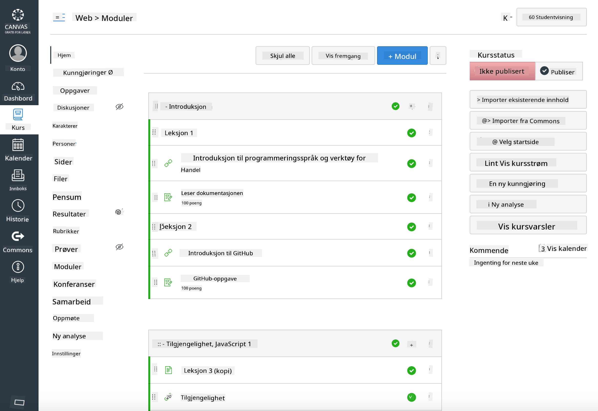

<!--
CO_OP_TRANSLATOR_METADATA:
{
  "original_hash": "75cb51f7ca9ea0b097ef4a1287e9290c",
  "translation_date": "2025-08-26T21:25:03+00:00",
  "source_file": "for-teachers.md",
  "language_code": "no"
}
-->
## For lærere

Vil du bruke dette læreplanen i klasserommet ditt? Vær så god, bruk det gjerne!

Faktisk kan du bruke det direkte i GitHub ved å bruke GitHub Classroom.

For å gjøre det, lag en fork av dette repoet. Du må opprette et repo for hver leksjon, så du må trekke ut hver mappe til et eget repo. På den måten kan [GitHub Classroom](https://classroom.github.com/classrooms) hente hver leksjon separat.

Disse [fullstendige instruksjonene](https://github.blog/2020-03-18-set-up-your-digital-classroom-with-github-classroom/) gir deg en idé om hvordan du setter opp klasserommet ditt.

## Bruke det i Moodle, Canvas eller Blackboard

Denne læreplanen fungerer godt i disse læringsplattformene! Bruk [Moodle-opplastingsfilen](../../../../../../../teaching-files/webdev-moodle.mbz) for hele innholdet, eller prøv [Common Cartridge-filen](../../../../../../../teaching-files/webdev-common-cartridge.imscc) som inneholder noe av innholdet. Moodle Cloud støtter ikke fullstendige Common Cartridge-eksporter, så det er bedre å bruke Moodle-nedlastingsfilen som kan lastes opp i Canvas. Gi oss gjerne beskjed om hvordan vi kan forbedre denne opplevelsen.

> Læreplanen i et Moodle-klasserom

> Læreplanen i Canvas

## Bruke repoet som det er

Hvis du ønsker å bruke dette repoet slik det står, uten å bruke GitHub Classroom, er det også mulig. Du må kommunisere med studentene dine om hvilken leksjon dere skal jobbe med sammen.

I et nettbasert format (Zoom, Teams eller andre) kan du opprette grupperom for quizene og veilede studentene for å hjelpe dem med å forberede seg på læring. Deretter kan du invitere studentene til quizene og be dem sende inn svarene som 'issues' på et bestemt tidspunkt. Du kan gjøre det samme med oppgaver hvis du ønsker at studentene skal jobbe sammen i det åpne.

Hvis du foretrekker et mer privat format, kan du be studentene dine om å forke læreplanen, leksjon for leksjon, til sine egne private GitHub-repoer og gi deg tilgang. Da kan de fullføre quizer og oppgaver privat og sende dem til deg via issues i klasseromsrepoet ditt.

Det finnes mange måter å få dette til å fungere i et nettbasert klasseromsformat. Gi oss beskjed om hva som fungerer best for deg!

## Gi oss dine tilbakemeldinger!

Vi ønsker å gjøre denne læreplanen best mulig for deg og studentene dine. Ta kontakt med oss i [Teacher corner](https://github.com/microsoft/Web-Dev-For-Beginners/discussions/categories/teacher-corner) og åpne en [**ny issue**](https://github.com/microsoft/Web-Dev-For-Beginners/issues/new/choose) for eventuelle forespørsler, feil og tilbakemeldinger.

---

**Ansvarsfraskrivelse**:  
Dette dokumentet er oversatt ved hjelp av AI-oversettelsestjenesten [Co-op Translator](https://github.com/Azure/co-op-translator). Selv om vi streber etter nøyaktighet, vær oppmerksom på at automatiske oversettelser kan inneholde feil eller unøyaktigheter. Det originale dokumentet på sitt opprinnelige språk bør anses som den autoritative kilden. For kritisk informasjon anbefales profesjonell menneskelig oversettelse. Vi er ikke ansvarlige for eventuelle misforståelser eller feiltolkninger som oppstår ved bruk av denne oversettelsen.