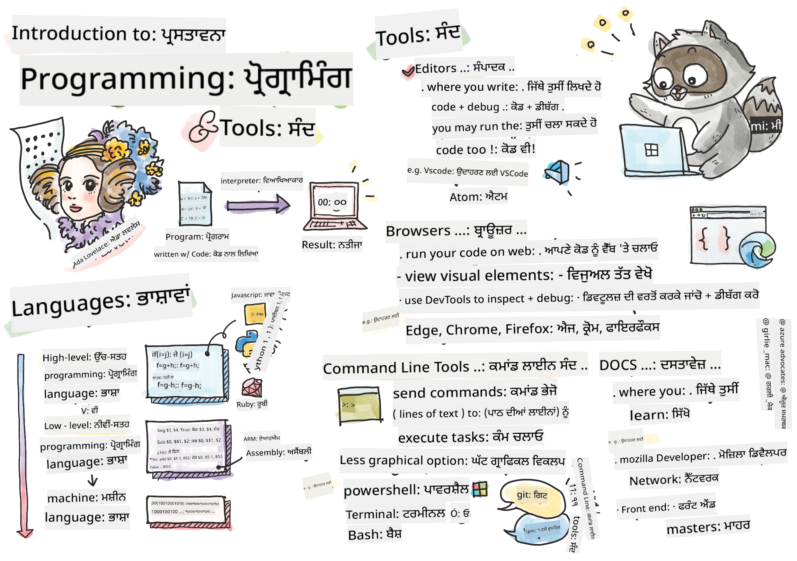

<!--
CO_OP_TRANSLATOR_METADATA:
{
  "original_hash": "c63675cfaf1d223b37bb9fecbfe7c252",
  "translation_date": "2025-08-25T23:11:11+00:00",
  "source_file": "1-getting-started-lessons/1-intro-to-programming-languages/README.md",
  "language_code": "pa"
}
-->
# ਪ੍ਰੋਗ੍ਰਾਮਿੰਗ ਭਾਸ਼ਾਵਾਂ ਅਤੇ ਟੂਲਜ਼ ਦੀ ਪਹਿਚਾਣ

ਇਹ ਪਾਠ ਪ੍ਰੋਗ੍ਰਾਮਿੰਗ ਭਾਸ਼ਾਵਾਂ ਦੇ ਮੁੱਢਲੇ ਸਿਧਾਂਤਾਂ ਨੂੰ ਕਵਰ ਕਰਦਾ ਹੈ। ਇੱਥੇ ਕਵਰ ਕੀਤੇ ਗਏ ਵਿਸ਼ੇ ਅੱਜ ਦੀਆਂ ਜ਼ਿਆਦਾਤਰ ਆਧੁਨਿਕ ਪ੍ਰੋਗ੍ਰਾਮਿੰਗ ਭਾਸ਼ਾਵਾਂ 'ਤੇ ਲਾਗੂ ਹੁੰਦੇ ਹਨ। 'ਟੂਲਜ਼ ਆਫ਼ ਦ ਟਰੇਡ' ਸੈਕਸ਼ਨ ਵਿੱਚ, ਤੁਸੀਂ ਉਹ ਸੌਫਟਵੇਅਰ ਬਾਰੇ ਸਿੱਖੋਗੇ ਜੋ ਇੱਕ ਡਿਵੈਲਪਰ ਵਜੋਂ ਤੁਹਾਡੀ ਮਦਦ ਕਰਦਾ ਹੈ।


> ਸਕੈਚਨੋਟ [Tomomi Imura](https://twitter.com/girlie_mac) ਦੁਆਰਾ

## ਪਾਠ ਤੋਂ ਪਹਿਲਾਂ ਕਵਿਜ਼
[ਪ੍ਰੀ-ਲੈਕਚਰ ਕਵਿਜ਼](https://forms.office.com/r/dru4TE0U9n?origin=lprLink)

## ਪਹਿਚਾਣ

ਇਸ ਪਾਠ ਵਿੱਚ, ਅਸੀਂ ਕਵਰ ਕਰਾਂਗੇ:

- ਪ੍ਰੋਗ੍ਰਾਮਿੰਗ ਕੀ ਹੈ?
- ਪ੍ਰੋਗ੍ਰਾਮਿੰਗ ਭਾਸ਼ਾਵਾਂ ਦੇ ਕਿਸਮ
- ਪ੍ਰੋਗਰਾਮ ਦੇ ਮੁੱਢਲੇ ਤੱਤ
- ਪੇਸ਼ੇਵਰ ਡਿਵੈਲਪਰ ਲਈ ਲਾਭਦਾਇਕ ਸੌਫਟਵੇਅਰ ਅਤੇ ਟੂਲਿੰਗ

> ਤੁਸੀਂ ਇਹ ਪਾਠ [Microsoft Learn](https://docs.microsoft.com/learn/modules/web-development-101/introduction-programming/?WT.mc_id=academic-77807-sagibbon) 'ਤੇ ਲੈ ਸਕਦੇ ਹੋ!

## ਪ੍ਰੋਗ੍ਰਾਮਿੰਗ ਕੀ ਹੈ?

ਪ੍ਰੋਗ੍ਰਾਮਿੰਗ (ਜਿਸਨੂੰ ਕੋਡਿੰਗ ਵੀ ਕਿਹਾ ਜਾਂਦਾ ਹੈ) ਇੱਕ ਡਿਵਾਈਸ ਜਿਵੇਂ ਕਿ ਕੰਪਿਊਟਰ ਜਾਂ ਮੋਬਾਈਲ ਡਿਵਾਈਸ ਲਈ ਹਦਾਇਤਾਂ ਲਿਖਣ ਦੀ ਪ੍ਰਕਿਰਿਆ ਹੈ। ਅਸੀਂ ਇਹ ਹਦਾਇਤਾਂ ਪ੍ਰੋਗ੍ਰਾਮਿੰਗ ਭਾਸ਼ਾ ਨਾਲ ਲਿਖਦੇ ਹਾਂ, ਜਿਸਨੂੰ ਫਿਰ ਡਿਵਾਈਸ ਦੁਆਰਾ ਵਿਆਖਿਆ ਕੀਤੀ ਜਾਂਦੀ ਹੈ। ਇਹ ਹਦਾਇਤਾਂ ਦੇ ਸੈੱਟ ਨੂੰ ਵੱਖ-ਵੱਖ ਨਾਮਾਂ ਨਾਲ ਸੰਬੋਧਿਤ ਕੀਤਾ ਜਾ ਸਕਦਾ ਹੈ, ਪਰ *ਪ੍ਰੋਗਰਾਮ*, *ਕੰਪਿਊਟਰ ਪ੍ਰੋਗਰਾਮ*, *ਐਪਲੀਕੇਸ਼ਨ (ਐਪ)*, ਅਤੇ *ਐਗਜ਼ਿਕਿਊਟੇਬਲ* ਕੁਝ ਪ੍ਰਸਿੱਧ ਨਾਮ ਹਨ।

ਇੱਕ *ਪ੍ਰੋਗਰਾਮ* ਕੁਝ ਵੀ ਹੋ ਸਕਦਾ ਹੈ ਜੋ ਕੋਡ ਨਾਲ ਲਿਖਿਆ ਗਿਆ ਹੈ; ਵੈਬਸਾਈਟਾਂ, ਗੇਮਾਂ, ਅਤੇ ਫੋਨ ਐਪਸ ਪ੍ਰੋਗਰਾਮ ਹਨ। ਜਦੋਂ ਕਿ ਕੋਡ ਲਿਖਣ ਤੋਂ ਬਿਨਾਂ ਪ੍ਰੋਗਰਾਮ ਬਣਾਉਣਾ ਸੰਭਵ ਹੈ, ਅਧਾਰਭੂਤ ਤਰਕ ਡਿਵਾਈਸ ਦੁਆਰਾ ਵਿਆਖਿਆ ਕੀਤਾ ਜਾਂਦਾ ਹੈ ਅਤੇ ਉਹ ਤਰਕ ਸੰਭਵਤ: ਕੋਡ ਨਾਲ ਲਿਖਿਆ ਗਿਆ ਸੀ। ਇੱਕ ਪ੍ਰੋਗਰਾਮ ਜੋ *ਚੱਲ ਰਿਹਾ ਹੈ* ਜਾਂ *ਐਗਜ਼ਿਕਿਊਟ* ਹੋ ਰਿਹਾ ਹੈ, ਉਹ ਹਦਾਇਤਾਂ ਨੂੰ ਅੰਜ਼ਾਮ ਦੇ ਰਿਹਾ ਹੈ। ਉਹ ਡਿਵਾਈਸ ਜਿਸ 'ਤੇ ਤੁਸੀਂ ਇਹ ਪਾਠ ਪੜ੍ਹ ਰਹੇ ਹੋ, ਤੁਹਾਡੇ ਸਕ੍ਰੀਨ 'ਤੇ ਇਸਨੂੰ ਪ੍ਰਿੰਟ ਕਰਨ ਲਈ ਇੱਕ ਪ੍ਰੋਗਰਾਮ ਚਲਾ ਰਿਹਾ ਹੈ।

✅ ਥੋੜ੍ਹਾ ਖੋਜ ਕਰੋ: ਕੌਣ ਦੁਨੀਆ ਦਾ ਪਹਿਲਾ ਕੰਪਿਊਟਰ ਪ੍ਰੋਗਰਾਮਰ ਮੰਨਿਆ ਜਾਂਦਾ ਹੈ?

## ਪ੍ਰੋਗ੍ਰਾਮਿੰਗ ਭਾਸ਼ਾਵਾਂ

ਪ੍ਰੋਗ੍ਰਾਮਿੰਗ ਭਾਸ਼ਾਵਾਂ ਡਿਵੈਲਪਰਾਂ ਨੂੰ ਡਿਵਾਈਸ ਲਈ ਹਦਾਇਤਾਂ ਲਿਖਣ ਯੋਗ ਬਣਾਉਂਦੀਆਂ ਹਨ। ਡਿਵਾਈਸ ਸਿਰਫ ਬਾਈਨਰੀ (1s ਅਤੇ 0s) ਨੂੰ ਸਮਝ ਸਕਦੇ ਹਨ, ਅਤੇ *ਜ਼ਿਆਦਾਤਰ* ਡਿਵੈਲਪਰਾਂ ਲਈ ਇਹ ਸੰਚਾਰ ਕਰਨ ਦਾ ਬਹੁਤ ਕੁਸ਼ਲ ਤਰੀਕਾ ਨਹੀਂ ਹੈ। ਪ੍ਰੋਗ੍ਰਾਮਿੰਗ ਭਾਸ਼ਾਵਾਂ ਮਨੁੱਖਾਂ ਅਤੇ ਕੰਪਿਊਟਰਾਂ ਦੇ ਵਿਚਕਾਰ ਸੰਚਾਰ ਦਾ ਸਾਧਨ ਹਨ।

ਪ੍ਰੋਗ੍ਰਾਮਿੰਗ ਭਾਸ਼ਾਵਾਂ ਵੱਖ-ਵੱਖ ਫਾਰਮੈਟਾਂ ਵਿੱਚ ਆਉਂਦੀਆਂ ਹਨ ਅਤੇ ਵੱਖ-ਵੱਖ ਉਦੇਸ਼ਾਂ ਦੀ ਸੇਵਾ ਕਰ ਸਕਦੀਆਂ ਹਨ। ਉਦਾਹਰਣ ਲਈ, ਜਾਵਾਸਕ੍ਰਿਪਟ ਮੁੱਖ ਤੌਰ 'ਤੇ ਵੈਬ ਐਪਲੀਕੇਸ਼ਨਾਂ ਲਈ ਵਰਤੀ ਜਾਂਦੀ ਹੈ, ਜਦੋਂ ਕਿ ਬੈਸ਼ ਮੁੱਖ ਤੌਰ 'ਤੇ ਓਪਰੇਟਿੰਗ ਸਿਸਟਮਾਂ ਲਈ ਵਰਤੀ ਜਾਂਦੀ ਹੈ।

*ਲੋਅ ਲੈਵਲ ਭਾਸ਼ਾਵਾਂ* ਆਮ ਤੌਰ 'ਤੇ *ਹਾਈ ਲੈਵਲ ਭਾਸ਼ਾਵਾਂ* ਨਾਲੋਂ ਘੱਟ ਕਦਮਾਂ ਦੀ ਲੋੜ ਹੁੰਦੀ ਹੈ ਤਾਂ ਜੋ ਡਿਵਾਈਸ ਹਦਾਇਤਾਂ ਨੂੰ ਵਿਆਖਿਆ ਕਰ ਸਕੇ। ਹਾਲਾਂਕਿ, ਹਾਈ ਲੈਵਲ ਭਾਸ਼ਾਵਾਂ ਦੀ ਪੜ੍ਹਨਯੋਗਤਾ ਅਤੇ ਸਹਾਇਤਾ ਉਨ੍ਹਾਂ ਨੂੰ ਪ੍ਰਸਿੱਧ ਬਣਾਉਂਦੀ ਹੈ। ਜਾਵਾਸਕ੍ਰਿਪਟ ਨੂੰ ਇੱਕ ਹਾਈ ਲੈਵਲ ਭਾਸ਼ਾ ਮੰਨਿਆ ਜਾਂਦਾ ਹੈ।

ਹੇਠਾਂ ਦਿੱਤਾ ਕੋਡ ਜਾਵਾਸਕ੍ਰਿਪਟ ਵਿੱਚ ਇੱਕ ਹਾਈ ਲੈਵਲ ਭਾਸ਼ਾ ਅਤੇ ਏ.ਆਰ.ਐਮ ਅਸੈਂਬਲੀ ਕੋਡ ਵਿੱਚ ਇੱਕ ਲੋਅ ਲੈਵਲ ਭਾਸ਼ਾ ਦੇ ਵਿਚਕਾਰ ਅੰਤਰ ਨੂੰ ਦਰਸਾਉਂਦਾ ਹੈ।

```javascript
let number = 10
let n1 = 0, n2 = 1, nextTerm;

for (let i = 1; i <= number; i++) {
    console.log(n1);
    nextTerm = n1 + n2;
    n1 = n2;
    n2 = nextTerm;
}
```

```c
 area ascen,code,readonly
 entry
 code32
 adr r0,thumb+1
 bx r0
 code16
thumb
 mov r0,#00
 sub r0,r0,#01
 mov r1,#01
 mov r4,#10
 ldr r2,=0x40000000
back add r0,r1
 str r0,[r2]
 add r2,#04
 mov r3,r0
 mov r0,r1
 mov r1,r3
 sub r4,#01
 cmp r4,#00
 bne back
 end
```

ਵਿਸ਼ਵਾਸ ਕਰੋ ਜਾਂ ਨਾ ਕਰੋ, *ਇਹ ਦੋਵੇਂ ਇੱਕੋ ਹੀ ਕੰਮ ਕਰ ਰਹੇ ਹਨ*: 10 ਤੱਕ ਫਿਬੋਨਾਚੀ ਸੀਕਵੈਂਸ ਪ੍ਰਿੰਟ ਕਰਨਾ।

✅ ਫਿਬੋਨਾਚੀ ਸੀਕਵੈਂਸ [ਪ੍ਰਭਾਸ਼ਿਤ](https://en.wikipedia.org/wiki/Fibonacci_number) ਕੀਤਾ ਜਾਂਦਾ ਹੈ ਜਿਵੇਂ ਕਿ ਨੰਬਰਾਂ ਦਾ ਇੱਕ ਸੈੱਟ ਜਿਸ ਵਿੱਚ ਹਰ ਨੰਬਰ ਪਿਛਲੇ ਦੋ ਨੰਬਰਾਂ ਦਾ ਜੋੜ ਹੁੰਦਾ ਹੈ, 0 ਅਤੇ 1 ਤੋਂ ਸ਼ੁਰੂ ਕਰਦੇ ਹੋਏ। ਫਿਬੋਨਾਚੀ ਸੀਕਵੈਂਸ ਦੇ ਅਗਲੇ 10 ਨੰਬਰ ਹਨ: 0, 1, 1, 2, 3, 5, 8, 13, 21 ਅਤੇ 34।

## ਪ੍ਰੋਗਰਾਮ ਦੇ ਤੱਤ

ਪ੍ਰੋਗਰਾਮ ਵਿੱਚ ਇੱਕੋ ਇੱਕ ਹਦਾਇਤ ਨੂੰ *ਸਟੇਟਮੈਂਟ* ਕਿਹਾ ਜਾਂਦਾ ਹੈ ਅਤੇ ਆਮ ਤੌਰ 'ਤੇ ਇਸ ਵਿੱਚ ਇੱਕ ਅੱਖਰ ਜਾਂ ਲਾਈਨ ਸਪੇਸਿੰਗ ਹੁੰਦੀ ਹੈ ਜੋ ਦਰਸਾਉਂਦੀ ਹੈ ਕਿ ਹਦਾਇਤ ਕਿੱਥੇ ਖਤਮ ਹੁੰਦੀ ਹੈ ਜਾਂ *ਟਰਮੀਨੇਟ* ਹੁੰਦੀ ਹੈ। ਪ੍ਰੋਗਰਾਮ ਕਿਵੇਂ ਟਰਮੀਨੇਟ ਹੁੰਦਾ ਹੈ, ਇਹ ਹਰ ਭਾਸ਼ਾ ਵਿੱਚ ਵੱਖਰਾ ਹੁੰਦਾ ਹੈ।

ਪ੍ਰੋਗਰਾਮ ਵਿੱਚ ਸਟੇਟਮੈਂਟਾਂ ਉਪਭੋਗਤਾ ਜਾਂ ਕਿਸੇ ਹੋਰ ਸਥਾਨ ਦੁਆਰਾ ਪ੍ਰਦਾਨ ਕੀਤੇ ਡਾਟਾ 'ਤੇ ਨਿਰਭਰ ਕਰ ਸਕਦੀਆਂ ਹਨ ਤਾਂ ਜੋ ਹਦਾਇਤਾਂ ਨੂੰ ਅੰਜ਼ਾਮ ਦਿੱਤਾ ਜਾ ਸਕੇ। ਡਾਟਾ ਪ੍ਰੋਗਰਾਮ ਦੇ ਵਿਹਾਰ ਨੂੰ ਬਦਲ ਸਕਦਾ ਹੈ, ਇਸ ਲਈ ਪ੍ਰੋਗ੍ਰਾਮਿੰਗ ਭਾਸ਼ਾਵਾਂ ਵਿੱਚ ਡਾਟਾ ਨੂੰ ਅਸਥਾਈ ਤੌਰ 'ਤੇ ਸਟੋਰ ਕਰਨ ਦਾ ਤਰੀਕਾ ਹੁੰਦਾ ਹੈ ਤਾਂ ਜੋ ਇਸਨੂੰ ਬਾਅਦ ਵਿੱਚ ਵਰਤਿਆ ਜਾ ਸਕੇ। ਇਹਨਾਂ ਨੂੰ *ਵੈਰੀਏਬਲ* ਕਿਹਾ ਜਾਂਦਾ ਹੈ। ਵੈਰੀਏਬਲ ਸਟੇਟਮੈਂਟ ਹਨ ਜੋ ਡਿਵਾਈਸ ਨੂੰ ਆਪਣੀ ਮੈਮਰੀ ਵਿੱਚ ਡਾਟਾ ਸੇਵ ਕਰਨ ਲਈ ਹਦਾਇਤ ਦਿੰਦੇ ਹਨ। ਪ੍ਰੋਗਰਾਮਾਂ ਵਿੱਚ ਵੈਰੀਏਬਲ ਬੀਜਗਣਿਤ ਵਿੱਚ ਵੈਰੀਏਬਲਾਂ ਦੇ ਸਮਾਨ ਹਨ, ਜਿੱਥੇ ਉਨ੍ਹਾਂ ਦਾ ਇੱਕ ਵਿਲੱਖਣ ਨਾਮ ਹੁੰਦਾ ਹੈ ਅਤੇ ਉਨ੍ਹਾਂ ਦੀ ਮੁੱਲ ਸਮੇਂ ਦੇ ਨਾਲ ਬਦਲ ਸਕਦੀ ਹੈ।

ਇਹ ਸੰਭਵ ਹੈ ਕਿ ਕੁਝ ਸਟੇਟਮੈਂਟ ਡਿਵਾਈਸ ਦੁਆਰਾ ਐਗਜ਼ਿਕਿਊਟ ਨਾ ਕੀਤੇ ਜਾਣ। ਇਹ ਆਮ ਤੌਰ 'ਤੇ ਡਿਵੈਲਪਰ ਦੁਆਰਾ ਲਿਖੇ ਜਾਣ 'ਤੇ ਡਿਜ਼ਾਈਨ ਦੁਆਰਾ ਜਾਂ ਅਣਪ੍ਰਤੀਕਸ਼ਿਤ ਗਲਤੀ ਹੋਣ 'ਤੇ ਹੁੰਦਾ ਹੈ। ਐਪਲੀਕੇਸ਼ਨ 'ਤੇ ਇਸ ਤਰ੍ਹਾਂ ਦਾ ਕੰਟਰੋਲ ਇਸਨੂੰ ਹੋਰ ਮਜ਼ਬੂਤ ਅਤੇ ਰੱਖ-ਰਖਾਅ ਯੋਗ ਬਣਾਉਂਦਾ ਹੈ। ਆਮ ਤੌਰ 'ਤੇ, ਇਹ ਕੰਟਰੋਲ ਵਿੱਚ ਬਦਲਾਵ ਤਦ ਹੁੰਦੇ ਹਨ ਜਦੋਂ ਕੁਝ ਸ਼ਰਤਾਂ ਪੂਰੀਆਂ ਹੁੰਦੀਆਂ ਹਨ। ਆਧੁਨਿਕ ਪ੍ਰੋਗ੍ਰਾਮਿੰਗ ਵਿੱਚ ਇੱਕ ਆਮ ਸਟੇਟਮੈਂਟ ਜੋ ਪ੍ਰੋਗਰਾਮ ਨੂੰ ਚਲਾਉਣ ਦੇ ਤਰੀਕੇ ਨੂੰ ਕੰਟਰੋਲ ਕਰਦਾ ਹੈ, ਉਹ ਹੈ `if..else` ਸਟੇਟਮੈਂਟ।

✅ ਤੁਸੀਂ ਇਸ ਕਿਸਮ ਦੇ ਸਟੇਟਮੈਂਟ ਬਾਰੇ ਅਗਲੇ ਪਾਠਾਂ ਵਿੱਚ ਹੋਰ ਸਿੱਖੋਗੇ।

## ਟੂਲਜ਼ ਆਫ਼ ਦ ਟਰੇਡ

[](https://youtube.com/watch?v=69WJeXGBdxg "Tools of the Trade")

> 🎥 ਉਪਰ ਦਿੱਤੀ ਤਸਵੀਰ 'ਤੇ ਕਲਿਕ ਕਰੋ ਟੂਲਿੰਗ ਬਾਰੇ ਵੀਡੀਓ ਲਈ

ਇਸ ਸੈਕਸ਼ਨ ਵਿੱਚ, ਤੁਸੀਂ ਕੁਝ ਸੌਫਟਵੇਅਰ ਬਾਰੇ ਸਿੱਖੋਗੇ ਜੋ ਤੁਹਾਡੇ ਪੇਸ਼ੇਵਰ ਵਿਕਾਸ ਯਾਤਰਾ ਦੀ ਸ਼ੁਰੂਆਤ ਕਰਦੇ ਸਮੇਂ ਬਹੁਤ ਲਾਭਦਾਇਕ ਹੋ ਸਕਦੇ ਹਨ।

**ਡਿਵੈਲਪਮੈਂਟ ਐਨਵਾਇਰਨਮੈਂਟ** ਇੱਕ ਵਿਲੱਖਣ ਸੈੱਟ ਹੈ ਟੂਲਜ਼ ਅਤੇ ਵਿਸ਼ੇਸ਼ਤਾਵਾਂ ਦਾ ਜੋ ਇੱਕ ਡਿਵੈਲਪਰ ਅਕਸਰ ਸੌਫਟਵੇਅਰ ਲਿਖਣ ਸਮੇਂ ਵਰਤਦਾ ਹੈ। ਇਹਨਾਂ ਟੂਲਜ਼ ਨੂੰ ਡਿਵੈਲਪਰ ਦੀਆਂ ਵਿਸ਼ੇਸ਼ ਜ਼ਰੂਰਤਾਂ ਲਈ ਕਸਟਮਾਈਜ਼ ਕੀਤਾ ਗਿਆ ਹੈ, ਅਤੇ ਸਮੇਂ ਦੇ ਨਾਲ ਬਦਲ ਸਕਦੇ ਹਨ ਜੇਕਰ ਡਿਵੈਲਪਰ ਕੰਮ, ਨਿੱਜੀ ਪ੍ਰਾਜੈਕਟਾਂ, ਜਾਂ ਜਦੋਂ ਉਹ ਵੱਖ-ਵੱਖ ਪ੍ਰੋਗ੍ਰਾਮਿੰਗ ਭਾਸ਼ਾ ਵਰਤਦਾ ਹੈ, ਵਿੱਚ ਤਰਜੀਹਾਂ ਬਦਲਦਾ ਹੈ। ਡਿਵੈਲਪਮੈਂਟ ਐਨਵਾਇਰਨਮੈਂਟ ਉਨ੍ਹਾਂ ਡਿਵੈਲਪਰਾਂ ਜਿੰਨਾ ਹੀ ਵਿਲੱਖਣ ਹੁੰਦੇ ਹਨ ਜੋ ਉਨ੍ਹਾਂ ਨੂੰ ਵਰਤਦੇ ਹਨ।

### ਐਡੀਟਰ

ਸੌਫਟਵੇਅਰ ਵਿਕਾਸ ਲਈ ਸਭ ਤੋਂ ਮਹੱਤਵਪੂਰਨ ਟੂਲ ਐਡੀਟਰ ਹੈ। ਐਡੀਟਰ ਉਹ ਜਗ੍ਹਾ ਹੈ ਜਿੱਥੇ ਤੁਸੀਂ ਆਪਣਾ ਕੋਡ ਲਿਖਦੇ ਹੋ ਅਤੇ ਕਈ ਵਾਰ ਜਿੱਥੇ ਤੁਸੀਂ ਆਪਣਾ ਕੋਡ ਚਲਾਉਂਦੇ ਹੋ।

ਡਿਵੈਲਪਰ ਐਡੀਟਰਾਂ 'ਤੇ ਕੁਝ ਹੋਰ ਕਾਰਨਾਂ ਲਈ ਨਿਰਭਰ ਕਰਦੇ ਹਨ:

- *ਡਿਬੱਗਿੰਗ* ਗਲਤੀਆਂ ਅਤੇ ਐਰਰਾਂ ਨੂੰ ਖੋਜਣ ਵਿੱਚ ਮਦਦ ਕਰਦੀ ਹੈ ਕੋਡ ਨੂੰ ਲਾਈਨ-ਬਾਈ-ਲਾਈਨ ਚੈੱਕ ਕਰਕੇ। ਕੁਝ ਐਡੀਟਰਾਂ ਵਿੱਚ ਡਿਬੱਗਿੰਗ ਦੀ ਸਮਰੱਥਾ ਹੁੰਦੀ ਹੈ; ਇਹਨਾਂ ਨੂੰ ਵਿਸ਼ੇਸ਼ ਪ੍ਰੋਗ੍ਰਾਮਿੰਗ ਭਾਸ਼ਾਵਾਂ ਲਈ ਕਸਟਮਾਈਜ਼ ਅਤੇ ਸ਼ਾਮਲ ਕੀਤਾ ਜਾ ਸਕਦਾ ਹੈ।
- *ਸਿੰਟੈਕਸ ਹਾਈਲਾਈਟਿੰਗ* ਕੋਡ ਵਿੱਚ ਰੰਗ ਅਤੇ ਟੈਕਸਟ ਫਾਰਮੈਟਿੰਗ ਸ਼ਾਮਲ ਕਰਦੀ ਹੈ, ਜਿਸ ਨਾਲ ਇਸਨੂੰ ਪੜ੍ਹਨਾ ਆਸਾਨ ਬਣ ਜਾਂਦਾ ਹੈ। ਜ਼ਿਆਦਾਤਰ ਐਡੀਟਰ ਕਸਟਮਾਈਜ਼ਡ ਸਿੰਟੈਕਸ ਹਾਈਲਾਈਟਿੰਗ ਦੀ ਆਗਿਆ ਦਿੰਦੇ ਹਨ।
- *ਐਕਸਟੈਂਸ਼ਨ ਅਤੇ ਇੰਟੀਗ੍ਰੇਸ਼ਨ* ਡਿਵੈਲਪਰਾਂ ਲਈ ਵਿਸ਼ੇਸ਼ ਟੂਲ ਹਨ, ਡਿਵੈਲਪਰਾਂ ਦੁਆਰਾ। ਇਹ ਟੂਲ ਬੇਸ ਐਡੀਟਰ ਵਿੱਚ ਸ਼ਾਮਲ ਨਹੀਂ ਕੀਤੇ ਗਏ। ਉਦਾਹਰਣ ਲਈ, ਕਈ ਡਿਵੈਲਪਰ ਆਪਣੇ ਕੋਡ ਨੂੰ ਦਸਤਾਵੇਜ਼ ਕਰਦੇ ਹਨ ਤਾਂ ਕਿ ਇਹ ਕਿਵੇਂ ਕੰਮ ਕਰਦਾ ਹੈ ਇਹ ਸਮਝਾਇਆ ਜਾ ਸਕੇ। ਉਹ ਇੱਕ ਸਪੈਲ ਚੈੱਕ ਐਕਸਟੈਂਸ਼ਨ ਇੰਸਟਾਲ ਕਰ ਸਕਦੇ ਹਨ ਤਾਂ ਜੋ ਦਸਤਾਵੇਜ਼ ਵਿੱਚ ਟਾਈਪੋਜ਼ ਨੂੰ ਖੋਜਿਆ ਜਾ ਸਕੇ। ਜ਼ਿਆਦਾਤਰ ਐਕਸਟੈਂਸ਼ਨ ਇੱਕ ਵਿਸ਼ੇਸ਼ ਐਡੀਟਰ ਵਿੱਚ ਵਰਤਣ ਲਈ ਬਣਾਈ ਗਈ ਹੁੰਦੀ ਹੈ, ਅਤੇ ਜ਼ਿਆਦਾਤਰ ਐਡੀਟਰ ਇੱਕ ਤਰੀਕੇ ਨਾਲ ਆਉਂਦੇ ਹਨ ਜੋ ਉਪਲਬਧ ਐਕਸਟੈਂਸ਼ਨ ਨੂੰ ਖੋਜਣ ਦੀ ਆਗਿਆ ਦਿੰਦੇ ਹਨ।
- *ਕਸਟਮਾਈਜ਼ੇਸ਼ਨ* ਡਿਵੈਲਪਰਾਂ ਨੂੰ ਆਪਣੀ ਜ਼ਰੂਰਤਾਂ ਨੂੰ ਪੂਰਾ ਕਰਨ ਲਈ ਇੱਕ ਵਿਲੱਖਣ ਵਿਕਾਸ ਐਨਵਾਇਰਨਮੈਂਟ ਬਣਾਉਣ ਯੋਗ ਬਣਾਉਂਦੀ ਹੈ। ਜ਼ਿਆਦਾਤਰ ਐਡੀਟਰ ਬਹੁਤ ਹੀ ਕਸਟਮਾਈਜ਼ੇਬਲ ਹੁੰਦੇ ਹਨ ਅਤੇ ਡਿਵੈਲਪਰਾਂ ਨੂੰ ਕਸਟਮ ਐਕਸਟੈਂਸ਼ਨ ਬਣਾਉਣ ਦੀ ਆਗਿਆ ਵੀ ਦੇ ਸਕਦੇ ਹਨ।

#### ਪ੍ਰਸਿੱਧ ਐਡੀਟਰ ਅਤੇ ਵੈਬ ਵਿਕਾਸ ਐਕਸਟੈਂਸ਼ਨ

- [Visual Studio Code](https://code.visualstudio.com/?WT.mc_id=academic-77807-sagibbon)
  - [Code Spell Checker](https://marketplace.visualstudio.com/items?itemName=streetsidesoftware.code-spell-checker)
  - [Live Share](https://marketplace.visualstudio.com/items?itemName=MS-vsliveshare.vsliveshare)
  - [Prettier - Code formatter](https://marketplace.visualstudio.com/items?itemName=esbenp.prettier-vscode)
- [Atom](https://atom.io/)
  - [spell-check](https://atom.io/packages/spell-check)
  - [teletype](https://atom.io/packages/teletype)
  - [atom-beautify](https://atom.io/packages/atom-beautify)
  
- [Sublimetext](https://www.sublimetext.com/)
  - [emmet](https://emmet.io/)
  - [SublimeLinter](http://www.sublimelinter.com/en/stable/)

### ਬ੍ਰਾਊਜ਼ਰ

ਹੋਰ ਇੱਕ ਮਹੱਤਵਪੂਰਨ ਟੂਲ ਬ੍ਰਾਊਜ਼ਰ ਹੈ। ਵੈਬ ਡਿਵੈਲਪਰ ਬ੍ਰਾਊਜ਼ਰ 'ਤੇ ਨਿਰਭਰ ਕਰਦੇ ਹਨ ਇਹ ਦੇਖਣ ਲਈ ਕਿ ਉਨ੍ਹਾਂ ਦਾ ਕੋਡ ਵੈਬ 'ਤੇ ਕਿਵੇਂ ਚੱਲਦਾ ਹੈ। ਇਹ ਐਡੀਟਰ ਵਿੱਚ ਲਿਖੇ HTML ਵਰਗੇ ਵੈਬ ਪੇਜ ਦੇ ਵਿਜ਼ੂਅਲ ਤੱਤਾਂ ਨੂੰ ਡਿਸਪਲੇ ਕਰਨ ਲਈ ਵੀ ਵਰਤਿਆ ਜਾਂਦਾ ਹੈ।

ਕਈ ਬ੍ਰਾਊਜ਼ਰ *ਡਿਵੈਲਪਰ ਟੂਲਜ਼* (DevTools) ਨਾਲ ਆਉਂਦੇ ਹਨ ਜੋ ਡਿਵੈਲਪਰਾਂ ਨੂੰ ਉਨ੍ਹਾਂ ਦੇ ਐਪਲੀਕੇਸ਼ਨ ਬਾਰੇ ਮਹੱਤਵਪੂਰਨ ਜਾਣਕਾਰੀ ਇਕੱਠਾ ਕਰਨ ਅਤੇ ਕੈਪਚਰ ਕਰਨ ਵਿੱਚ ਮਦਦ ਕਰਨ ਲਈ ਵਿਸ਼ੇਸ਼ਤਾਵਾਂ ਅਤੇ ਜਾਣਕਾਰੀ ਦਾ ਸੈੱਟ ਸ਼ਾਮਲ ਕਰਦੇ ਹਨ। ਉਦਾਹਰਣ ਲਈ: ਜੇਕਰ ਇੱਕ ਵੈਬ ਪੇਜ ਵਿੱਚ ਗਲਤੀਆਂ ਹਨ, ਕਈ ਵਾਰ ਇਹ ਜਾਣਨਾ ਲਾਭਦਾਇਕ ਹੁੰਦਾ ਹੈ ਕਿ ਇਹ ਕਦੋਂ ਹੋਈਆਂ। ਬ੍ਰਾਊਜ਼ਰ ਵਿੱਚ DevTools ਨੂੰ ਇਸ ਜਾਣਕਾਰੀ ਨੂੰ ਕੈਪਚਰ ਕਰਨ ਲਈ ਕਨਫਿਗਰ ਕੀਤਾ ਜਾ ਸਕਦਾ ਹੈ।

#### ਪ੍ਰਸਿੱਧ ਬ੍ਰਾਊਜ਼ਰ ਅਤੇ DevTools

- [Edge](https://docs.microsoft.com/microsoft-edge/devtools-guide-chromium/?WT.mc_id=academic-77807-sagibbon)
- [Chrome](https://developers.google.com/web/tools/chrome-devtools/)
- [Firefox](https://developer.mozilla.org/docs/Tools)

### ਕਮਾਂਡ ਲਾਈਨ ਟੂਲਜ਼

ਕੁਝ ਡਿਵੈਲਪਰ ਆਪਣੇ ਰੋਜ਼ਾਨਾ ਕੰਮਾਂ ਲਈ ਘੱਟ ਗ੍ਰਾਫਿਕਲ ਦ੍ਰਿਸ਼ ਨੂੰ ਤਰਜੀਹ ਦਿੰਦੇ ਹਨ ਅਤੇ ਇਸਨੂੰ ਹਾਸਲ ਕਰਨ ਲਈ ਕਮਾਂਡ ਲਾਈਨ 'ਤੇ ਨਿਰਭਰ ਕਰਦੇ ਹਨ। ਕੋਡ ਲਿਖਣ ਲਈ ਬਹੁਤ ਸਾਰਾ ਟਾਈਪਿੰਗ ਦੀ ਲੋੜ ਹੁੰਦੀ ਹੈ ਅਤੇ ਕੁਝ ਡਿਵੈਲਪਰ ਆਪਣੀ ਕੀਬੋਰਡ 'ਤੇ ਫਲੋ ਨੂੰ ਬਾਘਾ ਨਹੀਂ ਕਰਨਾ ਚਾਹੁੰਦੇ। ਉਹ ਡੈਸਕਟਾਪ ਵਿੰਡੋਜ਼ ਦੇ ਵਿਚਕਾਰ ਸਵੈਪ ਕਰਨ, ਵੱਖ-ਵੱਖ ਫਾਈਲਾਂ 'ਤੇ ਕੰਮ ਕਰਨ, ਅਤੇ ਟੂਲਜ਼ ਵਰਤਣ ਲਈ ਕੀਬੋਰਡ ਸ਼ਾਰਟਕਟ ਵਰਤਣਗੇ। ਜ਼ਿਆਦਾਤਰ ਕੰਮ ਮਾਊਸ ਨਾਲ ਕੀਤੇ ਜਾ ਸਕਦੇ ਹਨ, ਪਰ ਕਮਾਂਡ ਲਾਈਨ ਵਰਤਣ ਦਾ ਇੱਕ ਫਾਇਦਾ ਇਹ ਹੈ ਕਿ ਕਮਾਂਡ ਲਾਈਨ ਟੂਲਜ਼ ਨਾਲ ਬਹੁਤ ਕੁਝ ਕੀਤਾ ਜਾ ਸਕਦਾ ਹੈ ਬਿਨਾਂ

**ਅਸਵੀਕਰਤਾ**:  
ਇਹ ਦਸਤਾਵੇਜ਼ AI ਅਨੁਵਾਦ ਸੇਵਾ [Co-op Translator](https://github.com/Azure/co-op-translator) ਦੀ ਵਰਤੋਂ ਕਰਕੇ ਅਨੁਵਾਦ ਕੀਤਾ ਗਿਆ ਹੈ। ਜਦੋਂ ਕਿ ਅਸੀਂ ਸਹੀ ਹੋਣ ਦੀ ਕੋਸ਼ਿਸ਼ ਕਰਦੇ ਹਾਂ, ਕਿਰਪਾ ਕਰਕੇ ਧਿਆਨ ਦਿਓ ਕਿ ਸਵੈਚਾਲਿਤ ਅਨੁਵਾਦਾਂ ਵਿੱਚ ਗਲਤੀਆਂ ਜਾਂ ਅਸੁਣੀਕਤਾਵਾਂ ਹੋ ਸਕਦੀਆਂ ਹਨ। ਇਸ ਦੀ ਮੂਲ ਭਾਸ਼ਾ ਵਿੱਚ ਮੂਲ ਦਸਤਾਵੇਜ਼ ਨੂੰ ਅਧਿਕਾਰਤ ਸਰੋਤ ਮੰਨਿਆ ਜਾਣਾ ਚਾਹੀਦਾ ਹੈ। ਮਹੱਤਵਪੂਰਨ ਜਾਣਕਾਰੀ ਲਈ, ਪੇਸ਼ੇਵਰ ਮਨੁੱਖੀ ਅਨੁਵਾਦ ਦੀ ਸਿਫਾਰਸ਼ ਕੀਤੀ ਜਾਂਦੀ ਹੈ। ਇਸ ਅਨੁਵਾਦ ਦੀ ਵਰਤੋਂ ਤੋਂ ਪੈਦਾ ਹੋਣ ਵਾਲੇ ਕਿਸੇ ਵੀ ਗਲਤਫਹਿਮੀ ਜਾਂ ਗਲਤ ਵਿਆਖਿਆ ਲਈ ਅਸੀਂ ਜ਼ਿੰਮੇਵਾਰ ਨਹੀਂ ਹਾਂ।