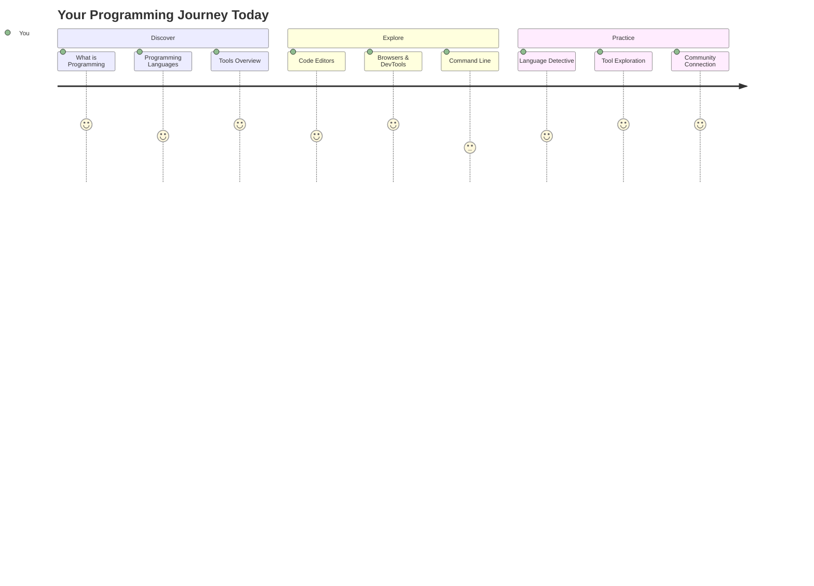
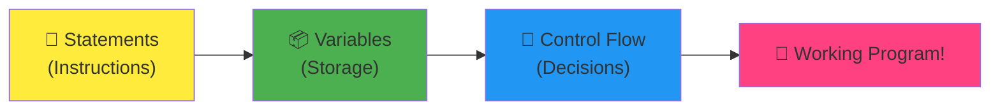
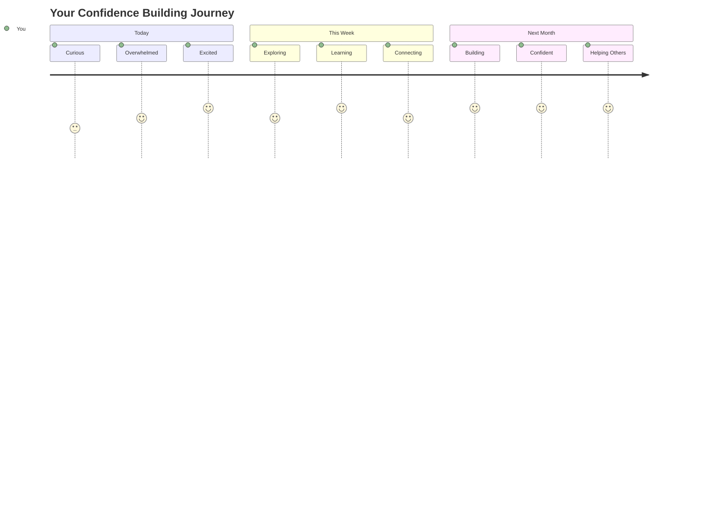

<!--
CO_OP_TRANSLATOR_METADATA:
{
  "original_hash": "d45ddcc54eb9232a76d08328b09d792e",
  "translation_date": "2025-11-03T16:13:57+00:00",
  "source_file": "1-getting-started-lessons/1-intro-to-programming-languages/README.md",
  "language_code": "pa"
}
-->
# ਪ੍ਰੋਗ੍ਰਾਮਿੰਗ ਭਾਸ਼ਾਵਾਂ ਅਤੇ ਆਧੁਨਿਕ ਡਿਵੈਲਪਰ ਟੂਲਜ਼ ਦਾ ਪਰਿਚਯ

ਹੈਲੋ, ਭਵਿੱਖ ਦੇ ਡਿਵੈਲਪਰ! 👋 ਕੀ ਮੈਂ ਤੁਹਾਨੂੰ ਕੁਝ ਦੱਸ ਸਕਦਾ ਹਾਂ ਜੋ ਹਰ ਰੋਜ਼ ਮੈਨੂੰ ਰੋਮਾਂਚਿਤ ਕਰਦਾ ਹੈ? ਤੁਸੀਂ ਜਲਦੀ ਹੀ ਪਤਾ ਲਗਾਉਣ ਵਾਲੇ ਹੋ ਕਿ ਪ੍ਰੋਗ੍ਰਾਮਿੰਗ ਸਿਰਫ ਕੰਪਿਊਟਰਾਂ ਬਾਰੇ ਨਹੀਂ ਹੈ - ਇਹ ਤੁਹਾਡੇ ਸਭ ਤੋਂ ਜੰਗਲੀ ਵਿਚਾਰਾਂ ਨੂੰ ਹਕੀਕਤ ਵਿੱਚ ਬਦਲਣ ਲਈ ਅਸਲ ਤਾਕਤਾਂ ਬਾਰੇ ਹੈ!

ਤੁਹਾਨੂੰ ਉਹ ਪਲ ਯਾਦ ਹੈ ਜਦੋਂ ਤੁਸੀਂ ਆਪਣੀ ਮਨਪਸੰਦ ਐਪ ਵਰਤ ਰਹੇ ਹੋ ਅਤੇ ਸਭ ਕੁਝ ਬਿਲਕੁਲ ਸਹੀ ਤਰੀਕੇ ਨਾਲ ਕੰਮ ਕਰ ਰਿਹਾ ਹੈ? ਜਦੋਂ ਤੁਸੀਂ ਇੱਕ ਬਟਨ ਨੂੰ ਦਬਾਉਂਦੇ ਹੋ ਅਤੇ ਕੁਝ ਬਿਲਕੁਲ ਜਾਦੂਈ ਹੁੰਦਾ ਹੈ ਜੋ ਤੁਹਾਨੂੰ "ਵਾਹ, ਉਹਨਾਂ ਨੇ ਇਹ ਕਿਵੇਂ ਕੀਤਾ?" ਕਹਿਣ ਲਈ ਮਜਬੂਰ ਕਰਦਾ ਹੈ। ਖੈਰ, ਕੋਈ ਤੁਹਾਡੇ ਵਰਗਾ - ਸ਼ਾਇਦ ਰਾਤ ਦੇ 2 ਵਜੇ ਆਪਣੇ ਮਨਪਸੰਦ ਕਾਫੀ ਸ਼ਾਪ ਵਿੱਚ ਬੈਠਾ ਹੋਵੇ - ਉਸ ਜਾਦੂ ਨੂੰ ਬਣਾਉਣ ਲਈ ਕੋਡ ਲਿਖਿਆ। ਅਤੇ ਇਹ ਹੈ ਜੋ ਤੁਹਾਡੇ ਮਨ ਨੂੰ ਉਡਾ ਦੇਵੇਗਾ: ਇਸ ਪਾਠ ਦੇ ਅੰਤ ਤੱਕ, ਤੁਸੀਂ ਸਿਰਫ ਸਮਝ ਨਹੀਂ ਪਾਵੋਗੇ ਕਿ ਉਹਨਾਂ ਨੇ ਇਹ ਕਿਵੇਂ ਕੀਤਾ, ਪਰ ਤੁਸੀਂ ਖੁਦ ਇਸਨੂੰ ਅਜ਼ਮਾਉਣ ਲਈ ਬੇਚੈਨ ਹੋਵੋਗੇ!

ਵੇਖੋ, ਜੇ ਤੁਹਾਨੂੰ ਹੁਣ ਪ੍ਰੋਗ੍ਰਾਮਿੰਗ ਡਰਾਉਣ ਵਾਲੀ ਲੱਗਦੀ ਹੈ ਤਾਂ ਮੈਂ ਇਸਨੂੰ ਪੂਰੀ ਤਰ੍ਹਾਂ ਸਮਝਦਾ ਹਾਂ। ਜਦੋਂ ਮੈਂ ਪਹਿਲੀ ਵਾਰ ਸ਼ੁਰੂ ਕੀਤਾ ਸੀ, ਮੈਂ ਸੱਚਮੁੱਚ ਸੋਚਿਆ ਕਿ ਤੁਹਾਨੂੰ ਕਿਸੇ ਕਿਸਮ ਦੇ ਗਣਿਤ ਦੇ ਜ਼ਹਾਨੀ ਜਾਂ ਪੰਜ ਸਾਲ ਦੀ ਉਮਰ ਤੋਂ ਕੋਡਿੰਗ ਕਰਨ ਦੀ ਲੋੜ ਹੈ। ਪਰ ਇਹ ਹੈ ਜੋ ਮੇਰੇ ਨਜ਼ਰੀਏ ਨੂੰ ਪੂਰੀ ਤਰ੍ਹਾਂ ਬਦਲ ਦਿੰਦਾ ਹੈ: ਪ੍ਰੋਗ੍ਰਾਮਿੰਗ ਬਿਲਕੁਲ ਇੱਕ ਨਵੀਂ ਭਾਸ਼ਾ ਵਿੱਚ ਗੱਲਬਾਤ ਕਰਨਾ ਸਿੱਖਣ ਵਰਗਾ ਹੈ। ਤੁਸੀਂ "ਹੈਲੋ" ਅਤੇ "ਧੰਨਵਾਦ" ਨਾਲ ਸ਼ੁਰੂ ਕਰਦੇ ਹੋ, ਫਿਰ ਕਾਫੀ ਮੰਗਣ ਲਈ ਕੰਮ ਕਰਦੇ ਹੋ, ਅਤੇ ਇਸ ਤੋਂ ਪਹਿਲਾਂ ਕਿ ਤੁਸੀਂ ਜਾਣਦੇ ਹੋ, ਤੁਸੀਂ ਡੂੰਘੀਆਂ ਦਾਰਸ਼ਨਿਕ ਚਰਚਾਵਾਂ ਕਰ ਰਹੇ ਹੋ! ਇਸ ਦੇ ਬਦਲੇ ਵਿੱਚ, ਤੁਸੀਂ ਕੰਪਿਊਟਰਾਂ ਨਾਲ ਗੱਲਬਾਤ ਕਰ ਰਹੇ ਹੋ, ਅਤੇ ਸੱਚਮੁੱਚ? ਉਹ ਸਭ ਤੋਂ ਧੀਰਜਵਾਨ ਗੱਲਬਾਤ ਸਾਥੀ ਹਨ ਜੋ ਤੁਸੀਂ ਕਦੇ ਵੀ ਮਿਲੇ ਹੋਵੋਗੇ - ਉਹ ਕਦੇ ਵੀ ਤੁਹਾਡੇ ਗਲਤੀਆਂ ਦਾ ਨਿਰਣੇ ਨਹੀਂ ਕਰਦੇ ਅਤੇ ਉਹ ਹਮੇਸ਼ਾ ਮੁੜ ਕੋਸ਼ਿਸ਼ ਕਰਨ ਲਈ ਉਤਸੁਕ ਰਹਿੰਦੇ ਹਨ!

ਅੱਜ, ਅਸੀਂ ਉਹ ਸ਼ਾਨਦਾਰ ਟੂਲਜ਼ ਦੀ ਖੋਜ ਕਰਨ ਜਾ ਰਹੇ ਹਾਂ ਜੋ ਆਧੁਨਿਕ ਵੈੱਬ ਡਿਵੈਲਪਮੈਂਟ ਨੂੰ ਸਿਰਫ ਸੰਭਵ ਹੀ ਨਹੀਂ ਬਲਕਿ ਗੰਭੀਰ ਤੌਰ 'ਤੇ ਆਕਰਸ਼ਕ ਬਣਾਉਂਦੇ ਹਨ। ਮੈਂ ਉਹੀ ਸੰਪਾਦਕਾਂ, ਬ੍ਰਾਊਜ਼ਰਾਂ ਅਤੇ ਵਰਕਫਲੋਜ਼ ਬਾਰੇ ਗੱਲ ਕਰ ਰਿਹਾ ਹਾਂ ਜੋ Netflix, Spotify, ਅਤੇ ਤੁਹਾਡੇ ਮਨਪਸੰਦ ਇੰਡੀ ਐਪ ਸਟੂਡੀਓ ਦੇ ਡਿਵੈਲਪਰ ਹਰ ਰੋਜ਼ ਵਰਤਦੇ ਹਨ। ਅਤੇ ਇਹ ਹੈ ਉਹ ਹਿੱਸਾ ਜੋ ਤੁਹਾਨੂੰ ਖੁਸ਼ੀ ਨਾਲ ਨੱਚਣ ਲਈ ਮਜਬੂਰ ਕਰੇਗਾ: ਇਹਨਾਂ ਵਿੱਚੋਂ ਜ਼ਿਆਦਾਤਰ ਪੇਸ਼ੇਵਰ-ਗਰੇਡ, ਉਦਯੋਗ-ਮਿਆਰੀ ਟੂਲਜ਼ ਪੂਰੀ ਤਰ੍ਹਾਂ ਮੁਫ਼ਤ ਹਨ!


> ਸਕੈਚਨੋਟ [Tomomi Imura](https://twitter.com/girlie_mac) ਦੁਆਰਾ



## ਆਓ ਵੇਖੀਏ ਕਿ ਤੁਸੀਂ ਪਹਿਲਾਂ ਹੀ ਕੀ ਜਾਣਦੇ ਹੋ!

ਮਜ਼ੇਦਾਰ ਚੀਜ਼ਾਂ ਵਿੱਚ ਛਾਲ ਮਾਰਨ ਤੋਂ ਪਹਿਲਾਂ, ਮੈਂ ਜਾਨਣਾ ਚਾਹੁੰਦਾ ਹਾਂ - ਕੀ ਤੁਸੀਂ ਪਹਿਲਾਂ ਹੀ ਇਸ ਪ੍ਰੋਗ੍ਰਾਮਿੰਗ ਦੁਨੀਆ ਬਾਰੇ ਕੁਝ ਜਾਣਦੇ ਹੋ? ਅਤੇ ਸੁਣੋ, ਜੇ ਤੁਸੀਂ ਇਹ ਸਵਾਲਾਂ ਦੇਖ ਰਹੇ ਹੋ ਅਤੇ ਸੋਚ ਰਹੇ ਹੋ "ਮੈਨੂੰ ਇਸ ਬਾਰੇ ਬਿਲਕੁਲ ਕੁਝ ਪਤਾ ਨਹੀਂ," ਇਹ ਸਿਰਫ ਠੀਕ ਨਹੀਂ ਹੈ, ਇਹ ਬਿਲਕੁਲ ਸਹੀ ਹੈ! ਇਸਦਾ ਮਤਲਬ ਹੈ ਕਿ ਤੁਸੀਂ ਬਿਲਕੁਲ ਸਹੀ ਜਗ੍ਹਾ 'ਤੇ ਹੋ। ਇਸ ਕਵਿਜ਼ ਨੂੰ ਇੱਕ ਵਰਕਆਉਟ ਤੋਂ ਪਹਿਲਾਂ ਖਿੱਚਣ ਵਾਂਗ ਸੋਚੋ - ਅਸੀਂ ਸਿਰਫ ਉਹਨਾਂ ਦਿਮਾਗੀ ਮਾਸਪੇਸ਼ੀਆਂ ਨੂੰ ਗਰਮ ਕਰ ਰਹੇ ਹਾਂ!

[ਪਾਠ ਤੋਂ ਪਹਿਲਾਂ ਕਵਿਜ਼ ਲਵੋ](https://forms.office.com/r/dru4TE0U9n?origin=lprLink)

## ਸਫ਼ਰ ਜੋ ਅਸੀਂ ਇਕੱਠੇ ਕਰਨ ਜਾ ਰਹੇ ਹਾਂ

ਠੀਕ ਹੈ, ਮੈਂ ਸੱਚਮੁੱਚ ਉਸ ਬਾਰੇ ਉਤਸਾਹਿਤ ਹਾਂ ਜੋ ਅਸੀਂ ਅੱਜ ਖੋਜਣ ਜਾ ਰਹੇ ਹਾਂ! ਸੱਚਮੁੱਚ, ਮੈਂ ਕਾਸ਼ ਤੁਹਾਡਾ ਚਿਹਰਾ ਦੇਖ ਸਕਦਾ ਜਦੋਂ ਕੁਝ ਸੰਕਲਪ ਸਪਸ਼ਟ ਹੁੰਦੇ ਹਨ। ਇਹ ਹੈ ਸ਼ਾਨਦਾਰ ਯਾਤਰਾ ਜੋ ਅਸੀਂ ਇਕੱਠੇ ਕਰ ਰਹੇ ਹਾਂ:

- **ਪ੍ਰੋਗ੍ਰਾਮਿੰਗ ਅਸਲ ਵਿੱਚ ਕੀ ਹੈ (ਅਤੇ ਇਹ ਕਿਉਂ ਸਭ ਤੋਂ ਵਧੀਆ ਚੀਜ਼ ਹੈ!)** - ਅਸੀਂ ਪਤਾ ਲਗਾਉਣ ਜਾ ਰਹੇ ਹਾਂ ਕਿ ਕੋਡ ਬਿਲਕੁਲ ਅਦ੍ਰਿਸ਼ ਜਾਦੂ ਹੈ ਜੋ ਤੁਹਾਡੇ ਆਲੇ ਦੁਆਲੇ ਸਭ ਕੁਝ ਚਲਾਉਂਦਾ ਹੈ, ਉਸ ਅਲਾਰਮ ਤੋਂ ਜੋ ਕਿਸੇ ਤਰੀਕੇ ਨਾਲ ਜਾਣਦਾ ਹੈ ਕਿ ਇਹ ਸੋਮਵਾਰ ਸਵੇਰ ਹੈ, Netflix ਦੀਆਂ ਸਿਫਾਰਸ਼ਾਂ ਨੂੰ ਪੂਰੀ ਤਰ੍ਹਾਂ ਕੁਰੇਟ ਕਰਨ ਵਾਲੇ ਐਲਗੋਰਿਦਮ ਤੱਕ
- **ਪ੍ਰੋਗ੍ਰਾਮਿੰਗ ਭਾਸ਼ਾਵਾਂ ਅਤੇ ਉਹਨਾਂ ਦੇ ਸ਼ਾਨਦਾਰ ਵਿਅਕਤੀਗਤ ਗੁਣ** - ਕਲਪਨਾ ਕਰੋ ਕਿ ਤੁਸੀਂ ਇੱਕ ਪਾਰਟੀ ਵਿੱਚ ਜਾ ਰਹੇ ਹੋ ਜਿੱਥੇ ਹਰ ਵਿਅਕਤੀ ਦੇ ਬਿਲਕੁਲ ਵੱਖਰੇ ਤਾਕਤਾਂ ਅਤੇ ਸਮੱਸਿਆਵਾਂ ਨੂੰ ਹੱਲ ਕਰਨ ਦੇ ਤਰੀਕੇ ਹਨ। ਇਹ ਪ੍ਰੋਗ੍ਰਾਮਿੰਗ ਭਾਸ਼ਾ ਦੀ ਦੁਨੀਆ ਵਰਗੀ ਹੈ, ਅਤੇ ਤੁਹਾਨੂੰ ਉਹਨਾਂ ਨੂੰ ਮਿਲਣ ਵਿੱਚ ਮਜ਼ਾ ਆਵੇਗਾ!
- **ਡਿਜੀਟਲ ਜਾਦੂ ਬਣਾਉਣ ਵਾਲੇ ਮੂਲ ਬਲਾਕ** - ਇਹਨਾਂ ਨੂੰ ਅੰਤਮ ਰਚਨਾਤਮਕ LEGO ਸੈਟ ਵਾਂਗ ਸੋਚੋ। ਜਦੋਂ ਤੁਸੀਂ ਸਮਝਦੇ ਹੋ ਕਿ ਇਹ ਟੁਕੜੇ ਕਿਵੇਂ ਇਕੱਠੇ ਹੁੰਦੇ ਹਨ, ਤਾਂ ਤੁਸੀਂ ਅਹਿਸਾਸ ਕਰੋਗੇ ਕਿ ਤੁਸੀਂ ਬਿਲਕੁਲ ਕੁਝ ਵੀ ਬਣਾਉਣ ਲਈ ਯੋਗ ਹੋ ਜੋ ਤੁਹਾਡੀ ਕਲਪਨਾ ਕਰਦੀ ਹੈ
- **ਪੇਸ਼ੇਵਰ ਟੂਲ ਜੋ ਤੁਹਾਨੂੰ ਮਹਿਸੂ ਕਰਵਾਉਂਦੇ ਹਨ ਕਿ ਤੁਹਾਨੂੰ ਇੱਕ ਜਾਦੂਗਰ ਦੀ ਛੜੀ ਦਿੱਤੀ ਗਈ ਹੈ** - ਮੈਂ ਇੱਥੇ ਨਾਟਕ ਨਹੀਂ ਕਰ ਰਿਹਾ - ਇਹ ਟੂਲ ਸੱਚਮੁੱਚ ਤੁਹਾਨੂੰ ਮਹਿਸੂ ਕਰਵਾਉਣਗੇ ਕਿ ਤੁਹਾਡੇ ਕੋਲ ਤਾਕਤਾਂ ਹਨ, ਅਤੇ ਸਭ ਤੋਂ ਵਧੀਆ ਹਿੱਸਾ? ਇਹ ਉਹੀ ਹਨ ਜੋ ਪੇਸ਼ੇਵਰ ਵਰਤਦੇ ਹਨ!

> 💡 **ਇਹ ਗੱਲ ਹੈ**: ਅੱਜ ਸਭ ਕੁਝ ਯਾਦ ਕਰਨ ਦੀ ਕੋਸ਼ਿਸ਼ ਕਰਨ ਬਾਰੇ ਸੋਚੋ ਵੀ ਨਾ! ਇਸ ਸਮੇਂ, ਮੈਂ ਸਿਰਫ ਇਹ ਚਾਹੁੰਦਾ ਹਾਂ ਕਿ ਤੁਸੀਂ ਜੋ ਸੰਭਵ ਹੈ ਉਸ ਬਾਰੇ ਉਤਸਾਹ ਮਹਿਸੂ ਕਰੋ। ਜਿਵੇਂ ਅਸੀਂ ਇਕੱਠੇ ਅਭਿਆਸ ਕਰਦੇ ਹਾਂ, ਵੇਰਵੇ ਕੁਦਰਤੀ ਤੌਰ 'ਤੇ ਚਿਪਕ ਜਾਣਗੇ - ਅਸਲ ਸਿੱਖਣ ਇਸ ਤਰੀਕੇ ਨਾਲ ਹੁੰਦਾ ਹੈ!

> ਤੁਸੀਂ ਇਹ ਪਾਠ [Microsoft Learn](https://docs.microsoft.com/learn/modules/web-development-101/introduction-programming/?WT.mc_id=academic-77807-sagibbon) 'ਤੇ ਲੈ ਸਕਦੇ ਹੋ!

## ਤਾਂ ਪ੍ਰੋਗ੍ਰਾਮਿੰਗ ਅਸਲ ਵਿੱਚ *ਕੀ* ਹੈ?

ਚਲੋ, ਮਿਲੀਅਨ-ਡਾਲਰ ਸਵਾਲ ਦਾ ਜਵਾਬ ਦਿੰਦੇ ਹਾਂ: ਪ੍ਰੋਗ੍ਰਾਮਿੰਗ ਅਸਲ ਵਿੱਚ ਕੀ ਹੈ?

ਮੈਂ ਤੁਹਾਨੂੰ ਇੱਕ ਕਹਾਣੀ ਦਿੰਦਾ ਹਾਂ ਜਿਸ ਨੇ ਮੇਰੇ ਸੋਚਣ ਦੇ ਤਰੀਕੇ ਨੂੰ ਪੂਰੀ ਤਰ੍ਹਾਂ ਬਦਲ ਦਿੱਤਾ। ਪਿਛਲੇ ਹਫ਼ਤੇ, ਮੈਂ ਆਪਣੀ ਮਾਂ ਨੂੰ ਸਾਡੇ ਨਵੇਂ ਸਮਾਰਟ ਟੀਵੀ ਰਿਮੋਟ ਦੀ ਵਰਤੋਂ ਕਰਨ ਦਾ ਸਮਝਾਉਣ ਦੀ ਕੋਸ਼ਿਸ਼ ਕਰ ਰਿਹਾ ਸੀ। ਮੈਂ ਆਪਣੇ ਆਪ ਨੂੰ ਇਹ ਕਹਿੰਦੇ ਹੋਏ ਪਾਇਆ "ਲਾਲ ਬਟਨ ਦਬਾਓ, ਪਰ ਵੱਡਾ ਲਾਲ ਬਟਨ ਨਹੀਂ, ਛੋਟਾ ਲਾਲ ਬਟਨ ਖੱਬੇ ਪਾਸੇ... ਨਹੀਂ, ਤੁਹਾਡਾ ਦੂਜਾ ਖੱਬਾ... ਠੀਕ ਹੈ, ਹੁਣ ਇਸਨੂੰ ਦੋ ਸਕਿੰਟ ਲਈ ਰੱਖੋ, ਇੱਕ ਨਹੀਂ, ਤਿੰਨ ਨਹੀਂ..." ਜਾਣ ਪਛਾਣ ਲੱਗਦਾ ਹੈ? 😅

ਇਹ ਪ੍ਰੋਗ੍ਰਾਮਿੰਗ ਹੈ! ਇਹ ਕੁਝ ਬਹੁਤ ਸ਼ਕਤੀਸ਼ਾਲੀ ਨੂੰ ਬਹੁਤ ਹੀ ਵਿਸਥਾਰਵਾਦੀ, ਕਦਮ-ਦਰ-ਕਦਮ ਹਦਾਇਤਾਂ ਦੇਣ ਦੀ ਕਲਾ ਹੈ ਪਰ ਇਸਨੂੰ ਸਭ ਕੁਝ ਬਿਲਕੁਲ ਸਪਸ਼ਟ ਤਰੀਕੇ ਨਾਲ ਦੱਸਣ ਦੀ ਲੋੜ ਹੁੰਦੀ ਹੈ।
- **ਟਿੱਪਣੀਆਂ**: ਉੱਚ-ਸਤਹ ਦੀਆਂ ਭਾਸ਼ਾਵਾਂ ਵਿਆਖਿਆਤਮਕ ਟਿੱਪਣੀਆਂ ਨੂੰ ਉਤਸ਼ਾਹਿਤ ਕਰਦੀਆਂ ਹਨ ਜੋ ਕੋਡ ਨੂੰ ਆਪ ਹੀ ਦਸਤਾਵੇਜ਼ ਬਣਾਉਣ ਵਾਲਾ ਬਣਾਉਂਦੀਆਂ ਹਨ  
- **ਸੰਰਚਨਾ**: JavaScript ਦੀ ਤਰਕਸ਼ੀਲ ਲਹਿਰਵਾਹੀ ਉਸ ਤਰੀਕੇ ਨਾਲ ਮਿਲਦੀ ਹੈ ਜਿਵੇਂ ਮਨੁੱਖ ਸਮੱਸਿਆਵਾਂ ਨੂੰ ਕਦਮ-ਦਰ-ਕਦਮ ਸੋਚਦੇ ਹਨ  
- **ਰੱਖ-ਰਖਾਵ**: ਵੱਖ-ਵੱਖ ਜ਼ਰੂਰਤਾਂ ਲਈ JavaScript ਵਰਜਨ ਨੂੰ ਅਪਡੇਟ ਕਰਨਾ ਸਿੱਧਾ ਅਤੇ ਸਪਸ਼ਟ ਹੈ  

✅ **ਫਿਬੋਨਾਚੀ ਸੀਰੀਜ਼ ਬਾਰੇ**: ਇਹ ਬੇਹੱਦ ਸੁੰਦਰ ਗਿਣਤੀ ਦਾ ਪੈਟਰਨ (ਜਿੱਥੇ ਹਰ ਗਿਣਤੀ ਪਿਛਲੇ ਦੋ ਗਿਣਤੀਆਂ ਦੇ ਜੋੜ ਦੇ ਬਰਾਬਰ ਹੁੰਦੀ ਹੈ: 0, 1, 1, 2, 3, 5, 8...) ਕੁਦਰਤ ਵਿੱਚ ਹਰ ਜਗ੍ਹਾ ਮਿਲਦਾ ਹੈ! ਤੁਸੀਂ ਇਸਨੂੰ ਸੂਰਜਮੁਖੀ ਦੇ ਘੁੰਮਾਓ, ਪਾਈਨਕੋਨ ਦੇ ਪੈਟਰਨ, ਨੌਟਿਲਸ ਸ਼ੈਲ ਦੇ ਵਕਰ ਅਤੇ ਇੱਥੋਂ ਤੱਕ ਕਿ ਦਰੱਖਤਾਂ ਦੀਆਂ ਟਾਹਣੀਆਂ ਦੇ ਵਧਣ ਦੇ ਤਰੀਕੇ ਵਿੱਚ ਵੀ ਪਾਓਗੇ। ਇਹ ਵਾਕਈ ਹੈਰਾਨੀਜਨਕ ਹੈ ਕਿ ਗਣਿਤ ਅਤੇ ਕੋਡ ਸਾਨੂੰ ਸਮਝਣ ਅਤੇ ਦੁਬਾਰਾ ਬਣਾਉਣ ਵਿੱਚ ਮਦਦ ਕਰ ਸਕਦੇ ਹਨ ਜੋ ਕੁਦਰਤ ਸੁੰਦਰਤਾ ਬਣਾਉਣ ਲਈ ਵਰਤਦੀ ਹੈ!  

## ਜਾਦੂ ਬਣਾਉਣ ਵਾਲੇ ਬੁਨਿਆਦੀ ਹਿੱਸੇ  

ਚੰਗਾ, ਹੁਣ ਜਦੋਂ ਤੁਸੀਂ ਦੇਖ ਲਿਆ ਕਿ ਪ੍ਰੋਗਰਾਮਿੰਗ ਭਾਸ਼ਾਵਾਂ ਕਿਵੇਂ ਕੰਮ ਕਰਦੀਆਂ ਹਨ, ਆਓ ਉਹ ਬੁਨਿਆਦੀ ਹਿੱਸੇ ਤੋੜੀਏ ਜੋ ਲਗਭਗ ਹਰ ਪ੍ਰੋਗਰਾਮ ਨੂੰ ਬਣਾਉਂਦੇ ਹਨ। ਇਹਨਾਂ ਨੂੰ ਤੁਹਾਡੇ ਮਨਪਸੰਦ ਰਸੋਈ ਦੇ ਅਵਸ਼ਕ ਅੰਗਾਂ ਵਾਂਗ ਸੋਚੋ – ਜਦੋਂ ਤੁਸੀਂ ਸਮਝ ਲੈਂਦੇ ਹੋ ਕਿ ਹਰ ਇੱਕ ਕੀ ਕਰਦਾ ਹੈ, ਤੁਸੀਂ ਲਗਭਗ ਕਿਸੇ ਵੀ ਭਾਸ਼ਾ ਵਿੱਚ ਕੋਡ ਪੜ੍ਹ ਅਤੇ ਲਿਖ ਸਕਦੇ ਹੋ!  

ਇਹ ਕੁਝ ਪ੍ਰੋਗਰਾਮਿੰਗ ਦੇ ਵਿਆਕਰਨ ਨੂੰ ਸਿੱਖਣ ਵਾਂਗ ਹੈ। ਯਾਦ ਕਰੋ ਸਕੂਲ ਵਿੱਚ ਜਦੋਂ ਤੁਸੀਂ ਨਾਉਨ, ਵਰਬ ਅਤੇ ਵਾਕ ਬਣਾਉਣ ਦੇ ਤਰੀਕੇ ਬਾਰੇ ਸਿੱਖਿਆ ਸੀ? ਪ੍ਰੋਗਰਾਮਿੰਗ ਦਾ ਆਪਣਾ ਵਿਆਕਰਨ ਹੁੰਦਾ ਹੈ, ਅਤੇ ਸੱਚਮੁੱਚ, ਇਹ ਅੰਗਰੇਜ਼ੀ ਵਿਆਕਰਨ ਤੋਂ ਕਾਫੀ ਜ਼ਿਆਦਾ ਤਰਕਸ਼ੀਲ ਅਤੇ ਮਾਫ਼ ਕਰਨ ਵਾਲਾ ਹੁੰਦਾ ਹੈ! 😄  

### ਸਟੇਟਮੈਂਟ: ਕਦਮ-ਦਰ-ਕਦਮ ਹਦਾਇਤਾਂ  

ਆਓ **ਸਟੇਟਮੈਂਟ** ਨਾਲ ਸ਼ੁਰੂ ਕਰੀਏ – ਇਹ ਤੁਹਾਡੇ ਕੰਪਿਊਟਰ ਨਾਲ ਗੱਲਬਾਤ ਵਿੱਚ ਵਿਅਕਤੀਗਤ ਵਾਕਾਂ ਵਾਂਗ ਹੁੰਦੇ ਹਨ। ਹਰ ਸਟੇਟਮੈਂਟ ਕੰਪਿਊਟਰ ਨੂੰ ਇੱਕ ਖਾਸ ਕੰਮ ਕਰਨ ਲਈ ਕਹਿੰਦਾ ਹੈ, ਜਿਵੇਂ ਕਿ ਦਿਸ਼ਾਵਾਂ ਦੇਣਾ: "ਇੱਥੇ ਖੱਬੇ ਮੁੜੋ," "ਲਾਲ ਬੱਤੀ 'ਤੇ ਰੁਕੋ," "ਉਸ ਜਗ੍ਹਾ 'ਤੇ ਪਾਰਕ ਕਰੋ।"  

ਮੈਨੂੰ ਸਟੇਟਮੈਂਟ ਬਾਰੇ ਇਹ ਚੰਗਾ ਲੱਗਦਾ ਹੈ ਕਿ ਇਹ ਆਮ ਤੌਰ 'ਤੇ ਕਿੰਨੇ ਪੜ੍ਹਨ ਯੋਗ ਹੁੰਦੇ ਹਨ। ਇਹ ਦੇਖੋ:  

```javascript
// Basic statements that perform single actions
const userName = "Alex";                    
console.log("Hello, world!");              
const sum = 5 + 3;                         
```
  
**ਇਹ ਕੋਡ ਕੀ ਕਰਦਾ ਹੈ:**  
- **ਘੋਸ਼ਣਾ** ਕਰੋ ਇੱਕ constant variable ਨੂੰ ਵਰਤੋਂਕਾਰ ਦੇ ਨਾਮ ਨੂੰ ਸਟੋਰ ਕਰਨ ਲਈ  
- **ਦਿਖਾਓ** ਇੱਕ ਸਵਾਗਤ ਸੰਦੇਸ਼ ਨੂੰ console output 'ਤੇ  
- **ਗਣਨਾ ਕਰੋ** ਅਤੇ ਇੱਕ ਗਣਿਤੀਕ ਕਾਰਵਾਈ ਦੇ ਨਤੀਜੇ ਨੂੰ ਸਟੋਰ ਕਰੋ  

```javascript
// Statements that interact with web pages
document.title = "My Awesome Website";      
document.body.style.backgroundColor = "lightblue";
```
  
**ਕਦਮ-ਦਰ-ਕਦਮ, ਇਹ ਹੈ ਕਿ ਕੀ ਹੋ ਰਿਹਾ ਹੈ:**  
- **ਸੋਧੋ** ਵੈਬਪੇਜ ਦਾ ਸਿਰਲੇਖ ਜੋ ਬ੍ਰਾਊਜ਼ਰ ਟੈਬ ਵਿੱਚ ਦਿਖਾਈ ਦਿੰਦਾ ਹੈ  
- **ਬਦਲੋ** ਪੂਰੇ ਪੇਜ ਦੇ ਬੈਕਗ੍ਰਾਊਂਡ ਦਾ ਰੰਗ  

### ਵੈਰੀਏਬਲ: ਤੁਹਾਡੇ ਪ੍ਰੋਗਰਾਮ ਦਾ ਮੈਮੋਰੀ ਸਿਸਟਮ  

ਚੰਗਾ, **ਵੈਰੀਏਬਲ** ਸੱਚਮੁੱਚ ਮੇਰੇ ਮਨਪਸੰਦ ਸੰਕਲਪਾਂ ਵਿੱਚੋਂ ਇੱਕ ਹਨ ਸਿੱਖਾਉਣ ਲਈ ਕਿਉਂਕਿ ਇਹ ਉਹਨਾਂ ਚੀਜ਼ਾਂ ਵਾਂਗ ਹਨ ਜੋ ਤੁਸੀਂ ਹਰ ਰੋਜ਼ ਵਰਤਦੇ ਹੋ!  

ਤੁਹਾਡੇ ਫੋਨ ਦੇ ਸੰਪਰਕ ਸੂਚੀ ਬਾਰੇ ਇੱਕ ਸਕਿੰਟ ਲਈ ਸੋਚੋ। ਤੁਸੀਂ ਹਰ ਕਿਸੇ ਦਾ ਫੋਨ ਨੰਬਰ ਯਾਦ ਨਹੀਂ ਕਰਦੇ – ਇਸਦੀ ਬਜਾਏ, ਤੁਸੀਂ "ਮਾਂ," "ਸਰਬੋਤਮ ਦੋਸਤ," ਜਾਂ "ਪਿਜ਼ਾ ਸਥਾਨ ਜੋ 2 AM ਤੱਕ ਡਿਲਿਵਰੀ ਕਰਦਾ ਹੈ" ਸੇਵ ਕਰਦੇ ਹੋ ਅਤੇ ਆਪਣੇ ਫੋਨ ਨੂੰ ਅਸਲ ਨੰਬਰ ਯਾਦ ਕਰਨ ਦਿੰਦੇ ਹੋ। ਵੈਰੀਏਬਲ ਬਿਲਕੁਲ ਇਸੇ ਤਰੀਕੇ ਨਾਲ ਕੰਮ ਕਰਦੇ ਹਨ! ਇਹ ਲੇਬਲ ਵਾਲੇ ਕੰਟੇਨਰਾਂ ਵਾਂਗ ਹੁੰਦੇ ਹਨ ਜਿੱਥੇ ਤੁਹਾਡਾ ਪ੍ਰੋਗਰਾਮ ਜਾਣਕਾਰੀ ਸਟੋਰ ਕਰ ਸਕਦਾ ਹੈ ਅਤੇ ਬਾਅਦ ਵਿੱਚ ਇੱਕ ਨਾਮ ਦੀ ਵਰਤੋਂ ਕਰਕੇ ਇਸਨੂੰ ਪ੍ਰਾਪਤ ਕਰ ਸਕਦਾ ਹੈ ਜੋ ਵਾਸਤਵ ਵਿੱਚ ਮਾਨਸੂਬੀ ਬਣਾਉਂਦਾ ਹੈ।  

ਇਹ ਹੈ ਕਿ ਕੀ ਚੰਗਾ ਹੈ: ਵੈਰੀਏਬਲ ਤੁਹਾਡੇ ਪ੍ਰੋਗਰਾਮ ਦੇ ਚਲਣ ਦੇ ਨਾਲ ਬਦਲ ਸਕਦੇ ਹਨ (ਇਸ ਲਈ ਨਾਮ "ਵੈਰੀਏਬਲ" – ਦੇਖੋ ਉਹਨਾਂ ਨੇ ਕੀ ਕੀਤਾ?). ਜਿਵੇਂ ਤੁਸੀਂ ਉਸ ਪਿਜ਼ਾ ਸਥਾਨ ਸੰਪਰਕ ਨੂੰ ਅਪਡੇਟ ਕਰਦੇ ਹੋ ਜਦੋਂ ਤੁਸੀਂ ਕੋਈ ਹੋਰ ਬਿਹਤਰ ਸਥਾਨ ਲੱਭਦੇ ਹੋ, ਵੈਰੀਏਬਲ ਤੁਹਾਡੇ ਪ੍ਰੋਗਰਾਮ ਦੇ ਨਵੀਂ ਜਾਣਕਾਰੀ ਸਿੱਖਣ ਜਾਂ ਸਥਿਤੀਆਂ ਦੇ ਬਦਲਣ ਦੇ ਨਾਲ ਅਪਡੇਟ ਹੋ ਸਕਦੇ ਹਨ!  

ਮੈਨੂੰ ਤੁਹਾਨੂੰ ਦਿਖਾਉਣ ਦਿਓ ਕਿ ਇਹ ਕਿੰਨਾ ਸੁੰਦਰ ਅਤੇ ਸਧਾਰਨ ਹੋ ਸਕਦਾ ਹੈ:  

```javascript
// Step 1: Creating basic variables
const siteName = "Weather Dashboard";        
let currentWeather = "sunny";               
let temperature = 75;                       
let isRaining = false;                      
```
  
**ਇਹ ਸੰਕਲਪਾਂ ਨੂੰ ਸਮਝਣਾ:**  
- **ਸਟੋਰ** ਅਸਥਿਰ ਮੁੱਲਾਂ ਨੂੰ `const` ਵੈਰੀਏਬਲਾਂ ਵਿੱਚ (ਜਿਵੇਂ ਸਾਈਟ ਦਾ ਨਾਮ)  
- **ਵਰਤੋਂ** `let` ਉਹ ਮੁੱਲਾਂ ਲਈ ਜੋ ਤੁਹਾਡੇ ਪ੍ਰੋਗਰਾਮ ਦੇ ਦੌਰਾਨ ਬਦਲ ਸਕਦੇ ਹਨ  
- **ਅਸਾਈਨ** ਵੱਖ-ਵੱਖ ਡੇਟਾ ਕਿਸਮਾਂ: strings (ਟੈਕਸਟ), numbers, ਅਤੇ booleans (true/false)  
- **ਚੁਣੋ** ਵਿਆਖਿਆਤਮਕ ਨਾਮ ਜੋ ਹਰ ਵੈਰੀਏਬਲ ਵਿੱਚ ਕੀ ਹੈ ਇਹ ਸਮਝਾਉਂਦੇ ਹਨ  

```javascript
// Step 2: Working with objects to group related data
const weatherData = {                       
  location: "San Francisco",
  humidity: 65,
  windSpeed: 12
};
```
  
**ਉਪਰੋਕਤ ਵਿੱਚ, ਅਸੀਂ:**  
- **ਬਣਾਇਆ** ਇੱਕ object ਜੋ ਸੰਬੰਧਿਤ ਮੌਸਮ ਜਾਣਕਾਰੀ ਨੂੰ ਇਕੱਠਾ ਕਰਦਾ ਹੈ  
- **ਸੰਗਠਿਤ** ਕਈ ਡੇਟਾ ਟੁਕੜੇ ਇੱਕ ਵੈਰੀਏਬਲ ਨਾਮ ਦੇ ਹੇਠਾਂ  
- **ਵਰਤੋਂ** key-value ਜੋੜੇ ਹਰ ਜਾਣਕਾਰੀ ਦੇ ਟੁਕੜੇ ਨੂੰ ਸਪਸ਼ਟ ਤੌਰ 'ਤੇ ਲੇਬਲ ਕਰਨ ਲਈ  

```javascript
// Step 3: Using and updating variables
console.log(`${siteName}: Today is ${currentWeather} and ${temperature}°F`);
console.log(`Wind speed: ${weatherData.windSpeed} mph`);

// Updating changeable variables
currentWeather = "cloudy";                  
temperature = 68;                          
```
  
**ਆਓ ਹਰ ਹਿੱਸੇ ਨੂੰ ਸਮਝੀਏ:**  
- **ਦਿਖਾਓ** ਜਾਣਕਾਰੀ ਨੂੰ template literals ਦੇ ਨਾਲ `${}` syntax ਵਰਤ ਕੇ  
- **ਪਹੁੰਚੋ** object properties ਨੂੰ dot notation (`weatherData.windSpeed`) ਨਾਲ  
- **ਅਪਡੇਟ ਕਰੋ** `let` ਨਾਲ ਘੋਸ਼ਿਤ ਵੈਰੀਏਬਲ ਨੂੰ ਬਦਲ ਰਹੀਆਂ ਸਥਿਤੀਆਂ ਨੂੰ ਦਰਸਾਉਣ ਲਈ  
- **ਜੋੜੋ** ਕਈ ਵੈਰੀਏਬਲਾਂ ਨੂੰ ਅਰਥਪੂਰਨ ਸੰਦੇਸ਼ ਬਣਾਉਣ ਲਈ  

```javascript
// Step 4: Modern destructuring for cleaner code
const { location, humidity } = weatherData; 
console.log(`${location} humidity: ${humidity}%`);
```
  
**ਤੁਹਾਨੂੰ ਕੀ ਜਾਣਨ ਦੀ ਜ਼ਰੂਰਤ ਹੈ:**  
- **ਨਿਕਾਲੋ** ਖਾਸ properties ਨੂੰ objects ਤੋਂ destructuring assignment ਦੀ ਵਰਤੋਂ ਕਰਕੇ  
- **ਬਣਾਓ** ਨਵੇਂ ਵੈਰੀਏਬਲ ਆਪਣੇ ਆਪ object keys ਦੇ ਨਾਮਾਂ ਦੇ ਨਾਲ  
- **ਸਰਲ ਕਰੋ** ਕੋਡ ਨੂੰ ਦੁਹਰਾਉਣ ਵਾਲੀ dot notation ਤੋਂ ਬਚ ਕੇ  

### ਕੰਟਰੋਲ ਫਲੋ: ਤੁਹਾਡੇ ਪ੍ਰੋਗਰਾਮ ਨੂੰ ਸੋਚਣਾ ਸਿਖਾਉਣਾ  

ਚੰਗਾ, ਇਹ ਜਿੱਥੇ ਪ੍ਰੋਗਰਾਮਿੰਗ ਬਿਲਕੁਲ ਹੈਰਾਨੀਜਨਕ ਹੋ ਜਾਂਦੀ ਹੈ! **ਕੰਟਰੋਲ ਫਲੋ** ਮੂਲ ਤੌਰ 'ਤੇ ਤੁਹਾਡੇ ਪ੍ਰੋਗਰਾਮ ਨੂੰ ਸਮਾਰਟ ਫੈਸਲੇ ਲੈਣਾ ਸਿਖਾਉਣਾ ਹੈ, ਬਿਲਕੁਲ ਜਿਵੇਂ ਤੁਸੀਂ ਹਰ ਰੋਜ਼ ਬਿਨਾਂ ਸੋਚੇ ਸਮਝਦੇ ਹੋ।  

ਇਸਨੂੰ ਸੋਚੋ: ਅੱਜ ਸਵੇਰੇ ਤੁਸੀਂ ਸ਼ਾਇਦ ਕੁਝ ਇਸ ਤਰ੍ਹਾਂ ਕੀਤਾ ਹੋਵੇਗਾ "ਜੇ ਬਾਰਿਸ਼ ਹੋ ਰਹੀ ਹੈ, ਤਾਂ ਮੈਂ ਛਤਰੀ ਲਵਾਂਗਾ। ਜੇ ਠੰਢ ਹੈ, ਤਾਂ ਮੈਂ ਜੈਕਟ ਪਹਿਨਾਂਗਾ। ਜੇ ਮੈਂ ਦੇਰ ਕਰ ਰਿਹਾ ਹਾਂ, ਤਾਂ ਮੈਂ ਨਾਸ਼ਤਾ ਛੱਡ ਦਿਆਂਗਾ ਅਤੇ ਰਾਹ ਵਿੱਚ ਕੌਫੀ ਲਵਾਂਗਾ।" ਤੁਹਾਡਾ ਦਿਮਾਗ ਕੁਦਰਤੀ ਤੌਰ 'ਤੇ ਇਸ if-then ਤਰਕ ਨੂੰ ਹਰ ਰੋਜ਼ ਦਜਨਾਂ ਵਾਰ ਫਾਲੋ ਕਰਦਾ ਹੈ!  

ਇਹ ਉਹ ਹੈ ਜੋ ਪ੍ਰੋਗਰਾਮਾਂ ਨੂੰ ਬੇਵਕੂਫ਼, ਪੇਸ਼ਕਸ਼ੀਲ ਸਕ੍ਰਿਪਟ ਦੀ ਪਾਲਣਾ ਕਰਨ ਦੀ ਬਜਾਏ ਸਮਾਰਟ ਅਤੇ ਜ਼ਿੰਦਾ ਮਹਿਸੂਸ ਕਰਦਾ ਹੈ। ਉਹ ਵਾਸਤਵ ਵਿੱਚ ਇੱਕ ਸਥਿਤੀ ਨੂੰ ਦੇਖ ਸਕਦੇ ਹਨ, ਜੋ ਹੋ ਰਿਹਾ ਹੈ ਉਸਦਾ ਅਨੁਮਾਨ ਲਗਾ ਸਕਦੇ ਹਨ, ਅਤੇ ਸਹੀ ਤਰੀਕੇ ਨਾਲ ਪ੍ਰਤੀਕ੍ਰਿਆ ਕਰ ਸਕਦੇ ਹਨ। ਇਹ ਤੁਹਾਡੇ ਪ੍ਰੋਗਰਾਮ ਨੂੰ ਇੱਕ ਦਿਮਾਗ ਦੇਣ ਵਾਂਗ ਹੈ ਜੋ ਅਨੁਕੂਲ ਹੋ ਸਕਦਾ ਹੈ ਅਤੇ ਚੋਣਾਂ ਕਰ ਸਕਦਾ ਹੈ!  

ਤੁਹਾਨੂੰ ਦਿਖਾਉਣ ਦਿਓ ਕਿ ਇਹ ਕਿੰਨਾ ਸੁੰਦਰ ਕੰਮ ਕਰਦਾ ਹੈ:  

```javascript
// Step 1: Basic conditional logic
const userAge = 17;

if (userAge >= 18) {
  console.log("You can vote!");
} else {
  const yearsToWait = 18 - userAge;
  console.log(`You'll be able to vote in ${yearsToWait} year(s).`);
}
```
  
**ਇਹ ਕੋਡ ਕੀ ਕਰਦਾ ਹੈ:**  
- **ਜਾਂਚੋ** ਕਿ ਵਰਤੋਂਕਾਰ ਦੀ ਉਮਰ ਵੋਟਿੰਗ ਦੀ ਲੋੜ ਨੂੰ ਪੂਰਾ ਕਰਦੀ ਹੈ ਜਾਂ ਨਹੀਂ  
- **ਅਮਲ ਕਰੋ** ਵੱਖ-ਵੱਖ ਕੋਡ ਬਲਾਕ ਸਥਿਤੀ ਦੇ ਨਤੀਜੇ ਦੇ ਆਧਾਰ 'ਤੇ  
- **ਗਣਨਾ ਕਰੋ** ਅਤੇ ਦਿਖਾਓ ਕਿ ਵੋਟਿੰਗ ਯੋਗਤਾ ਤੱਕ ਕਿੰਨਾ ਸਮਾਂ ਬਾਕੀ ਹੈ ਜੇ 18 ਤੋਂ ਘੱਟ ਹੈ  
- **ਪ੍ਰਦਾਨ ਕਰੋ** ਹਰ ਸਥਿਤੀ ਲਈ ਖਾਸ, ਮਦਦਗਾਰ ਫੀਡਬੈਕ  

```javascript
// Step 2: Multiple conditions with logical operators
const userAge = 17;
const hasPermission = true;

if (userAge >= 18 && hasPermission) {
  console.log("Access granted: You can enter the venue.");
} else if (userAge >= 16) {
  console.log("You need parent permission to enter.");
} else {
  console.log("Sorry, you must be at least 16 years old.");
}
```
  
**ਇੱਥੇ ਕੀ ਹੁੰਦਾ ਹੈ ਇਸਨੂੰ ਤੋੜ ਕੇ ਸਮਝੋ:**  
- **ਜੋੜੋ** ਕਈ ਸਥਿਤੀਆਂ ਨੂੰ `&&` (and) operator ਦੀ ਵਰਤੋਂ ਕਰਕੇ  
- **ਬਣਾਓ** ਸਥਿਤੀਆਂ ਦੀ ਇੱਕ hierarchy `else if` ਦੀ ਵਰਤੋਂ ਕਰਕੇ ਕਈ ਸਥਿਤੀਆਂ ਲਈ  
- **ਸੰਭਾਲੋ** ਸਾਰੀਆਂ ਸੰਭਾਵਿਤ ਸਥਿਤੀਆਂ ਨੂੰ ਇੱਕ ਅੰਤਮ `else` ਸਟੇਟਮ ਨਾਲ  
- **ਪ੍ਰਦਾਨ ਕਰੋ** ਸਪਸ਼ਟ, ਕਾਰਵਾਈਯੋਗ ਫੀਡਬੈਕ ਹਰ ਵੱਖ-ਵੱਖ ਸਥਿਤੀ ਲਈ  

```javascript
// Step 3: Concise conditional with ternary operator
const votingStatus = userAge >= 18 ? "Can vote" : "Cannot vote yet";
console.log(`Status: ${votingStatus}`);
```
  
**ਤੁਹਾਨੂੰ ਕੀ ਯਾਦ ਰੱਖਣਾ ਹੈ:**  
- **ਵਰਤੋਂ** ternary operator (`? :`) ਸਧਾਰਨ ਦੋ-ਵਿਕਲਪ ਸਥਿਤੀਆਂ ਲਈ  
- **ਲਿਖੋ** ਸਥਿਤੀ ਪਹਿਲਾਂ, ਫਿਰ `?`, ਫਿਰ ਸੱਚਾ ਨਤੀਜਾ, ਫਿਰ `:`, ਫਿਰ ਗਲਤ ਨਤੀਜਾ  
- **ਲਾਗੂ ਕਰੋ** ਇਹ ਪੈਟਰਨ ਜਦੋਂ ਤੁਹਾਨੂੰ ਸਥਿਤੀਆਂ ਦੇ ਆਧਾਰ 'ਤੇ ਮੁੱਲਾਂ ਅਸਾਈਨ ਕਰਨ ਦੀ ਜ਼ਰੂਰਤ ਹੋਵੇ  

```javascript
// Step 4: Handling multiple specific cases
const dayOfWeek = "Tuesday";

switch (dayOfWeek) {
  case "Monday":
  case "Tuesday":
  case "Wednesday":
  case "Thursday":
  case "Friday":
    console.log("It's a weekday - time to work!");
    break;
  case "Saturday":
  case "Sunday":
    console.log("It's the weekend - time to relax!");
    break;
  default:
    console.log("Invalid day of the week");
}
```
  
**ਇਹ ਕੋਡ ਹਾਸਲ ਕਰਦਾ ਹੈ:**  
- **ਮਿਲਾਓ** ਵੈਰੀਏਬਲ ਮੁੱਲ ਨੂੰ ਕਈ ਖਾਸ ਕੇਸਾਂ ਦੇ ਖਿਲਾਫ  
- **ਗਰੁੱਪ ਕਰੋ** ਸਮਾਨ ਕੇਸਾਂ ਨੂੰ ਇਕੱਠੇ (ਹਫ਼ਤੇ ਦੇ ਦਿਨ ਵਸ. ਹਫ਼ਤੇ ਦੇ ਅੰਤ)  
- **ਅਮਲ ਕਰੋ** ਸਹੀ ਕੋਡ ਬਲਾਕ ਜਦੋਂ ਇੱਕ ਮੈਚ ਮਿਲਦਾ ਹੈ  
- **ਸ਼ਾਮਲ ਕਰੋ** ਇੱਕ `default` ਕੇਸ ਅਣਪਛਾਤੇ ਮੁੱਲਾਂ ਨੂੰ ਸੰਭਾਲਣ ਲਈ  
- **ਵਰਤੋਂ** `break` ਸਟੇਟਮਾਂ ਕੋਡ ਨੂੰ ਅਗਲੇ ਕੇਸ ਵਿੱਚ ਜਾਰੀ ਰੱਖਣ ਤੋਂ ਰੋਕਣ ਲਈ  

> 💡 **ਅਸਲ-ਦੁਨੀਆ ਦੀ ਮਿਸਾਲ**: ਕੰਟਰੋਲ ਫਲੋ ਨੂੰ ਦੁਨੀਆ ਦੇ ਸਭ ਤੋਂ ਧੀਰਜ ਵਾਲੇ GPS ਵਾਂਗ ਸੋਚੋ ਜੋ ਤੁਹਾਨੂੰ ਦਿਸ਼ਾਵਾਂ ਦਿੰਦਾ ਹੈ। ਇਹ ਸ਼ਾਇਦ ਕਹੇ "ਜੇ ਮੈਨ ਸਟ੍ਰੀਟ 'ਤੇ ਟ੍ਰੈਫਿਕ ਹੈ, ਤਾਂ ਇਸਦੀ ਬਜਾਏ ਹਾਈਵੇ ਲਵੋ। ਜੇ ਹਾਈਵੇ 'ਤੇ ਕੰਸਟਰਕਸ਼ਨ ਰੁਕਾਵਟ ਪੈਦਾ ਕਰ ਰਿਹਾ ਹੈ, ਤਾਂ ਦ੍ਰਿਸ਼ਯਮਾਰਗ ਦੀ ਕੋਸ਼ਿਸ਼ ਕਰੋ।" ਪ੍ਰੋਗਰਾਮ ਬਿਲਕੁਲ ਇਸੇ ਤਰ੍ਹਾਂ ਦੀ ਸਥਿਤੀਕ ਤਰਕ ਦੀ ਵਰਤੋਂ ਕਰਦੇ ਹਨ ਵੱਖ-ਵੱਖ ਸਥਿਤੀਆਂ ਨੂੰ ਸਮਰਥਨਯੋਗ ਤਰੀਕੇ ਨਾਲ ਪ੍ਰਤੀਕ੍ਰਿਆ ਕਰਨ ਲਈ ਅਤੇ ਹਮੇਸ਼ਾ ਵਰਤੋਂਕਾਰਾਂ ਨੂੰ ਸਭ ਤੋਂ ਵਧੀਆ ਅਨੁਭਵ ਦਿੰਦੇ ਹਨ।  

### 🎯 **ਸੰਕਲਪ ਚੈੱਕ: ਬੁਨਿਆਦੀ ਹਿੱਸਿਆਂ ਦੀ ਮਾਹਰਤਾ**  

**ਆਓ ਦੇਖੀਏ ਕਿ ਤੁਸੀਂ ਬੁਨਿਆਦੀਆਂ ਨਾਲ ਕਿਵੇਂ ਕਰ ਰਹੇ ਹੋ:**  
- ਕੀ ਤੁਸੀਂ ਆਪਣੇ ਸ਼ਬਦਾਂ ਵਿੱਚ ਵੈਰੀਏਬਲ ਅਤੇ ਸਟੇਟਮੈਂਟ ਦੇ ਵਿਚਕਾਰ ਅੰਤਰ ਨੂੰ ਸਮਝਾ ਸਕਦੇ ਹੋ?  
- ਇੱਕ ਅਸਲ-ਦੁਨੀਆ ਦੀ ਸਥਿਤੀ ਬਾਰੇ ਸੋਚੋ ਜਿੱਥੇ ਤੁਸੀਂ ਇੱਕ if-then ਫੈਸਲਾ ਲਗਾਉਂਦੇ ਹੋ (ਜਿਵੇਂ ਸਾਡਾ ਵੋਟਿੰਗ ਉਦਾਹਰਨ)  
- ਪ੍ਰੋਗਰਾਮਿੰਗ ਤਰਕ ਬਾਰੇ ਇੱਕ ਚੀਜ਼ ਜੋ ਤੁਹਾਨੂੰ ਹੈਰਾਨ ਕਰ ਗਈ?  

**ਤੁਰੰਤ ਭਰੋਸਾ ਵਧਾਉਣ ਵਾਲਾ:**  

  
✅ **ਅਗਲਾ ਕੀ ਆ ਰਿਹਾ ਹੈ**: ਅਸੀਂ ਇਹਨਾਂ ਸੰਕਲਪਾਂ ਵਿੱਚ ਹੋਰ ਡੂੰਘਾਈ ਵਿੱਚ ਜਾਣ ਲਈ ਬਿਲਕੁਲ ਮਜ਼ੇਦਾਰ ਸਮਾਂ ਬਿਤਾਉਣ ਵਾਲੇ ਹਾਂ ਜਿਵੇਂ ਕਿ ਅਸੀਂ ਇਹ ਸ਼ਾਨਦਾਰ ਯਾਤਰਾ ਇਕੱਠੇ ਜਾਰੀ ਰੱਖਦੇ ਹਾਂ! ਇਸ ਸਮੇਂ, ਸਿਰਫ਼ ਉਹ ਸਾਰਾ ਉਤਸ਼ਾਹ ਮਹਿਸੂਸ ਕਰਨ 'ਤੇ ਧਿਆਨ ਦਿਓ ਜੋ ਤੁਹਾਡੇ ਅੱਗੇ ਸਾਰੇ ਸ਼ਾਨਦਾਰ ਸੰਭਾਵਨਾਵਾਂ ਬਾਰੇ ਹੈ। ਖਾਸ ਹੁਨਰ ਅਤੇ ਤਕਨੀਕਾਂ ਕੁਦਰਤੀ ਤੌਰ 'ਤੇ ਚਿਪਕ ਜਾਣਗੀਆਂ ਜਿਵੇਂ ਅਸੀਂ ਇਕੱਠੇ ਅਭਿਆਸ ਕਰਦੇ ਹਾਂ – ਮੈਂ ਵਾਅਦਾ ਕਰਦਾ ਹਾਂ ਕਿ ਇਹ ਤੁਹਾਡੇ ਸੋਚਣ ਤੋਂ ਕਾਫ਼ੀ ਜ਼ਿਆਦਾ ਮਜ਼ੇਦਾਰ ਹੋਵੇਗਾ!  

## ਵਪਾਰ ਦੇ ਸਾਧਨ  

ਚੰਗਾ, ਇਹ ਸੱਚਮੁੱਚ ਜਿੱਥੇ ਮੈਂ ਬਹੁਤ ਉਤਸ਼ਾਹਿਤ ਹੋ ਜਾਂਦਾ ਹਾਂ ਮੈਂ ਆਪਣੇ ਆਪ ਨੂੰ ਮੁਸ਼ਕਿਲ ਨਾਲ ਕਾਬੂ ਕਰ ਸਕਦਾ ਹਾਂ! 🚀 ਅਸੀਂ ਉਹ ਸ਼ਾਨਦਾਰ ਸਾਧਨਾਂ ਬਾਰੇ ਗੱਲ ਕਰਨ ਵਾਲੇ ਹਾਂ ਜੋ ਤੁਹਾਨੂੰ ਇਹ ਮਹਿਸੂਸ ਕਰਨ ਲਈ ਮਜਬੂਰ ਕਰਨ ਵਾਲੇ ਹਨ ਕਿ ਤੁਹਾਨੂੰ ਇੱਕ ਡਿਜ਼ੀਟਲ ਸਪੇਸਸ਼ਿਪ ਦੀਆਂ ਕੁੰਜੀਆਂ ਦਿੱਤੀਆਂ ਗਈਆਂ ਹਨ।  

ਤੁਹਾਨੂੰ ਪਤਾ ਹੈ ਕਿ ਇੱਕ ਸ਼ੈਫ਼ ਕੋਲ ਉਹਨਾਂ ਦੇ ਹੱਥਾਂ ਦੇ ਵਧਾਏ ਹੋਏ ਹਿੱਸਿਆਂ ਵਾਂਗ ਪੂਰੀ ਤਰ੍ਹਾਂ ਸੰਤੁਲਿਤ ਚਾਕੂ ਹੁੰਦੇ ਹਨ? ਜਾਂ ਇੱਕ ਸੰਗੀਤਕਾਰ ਕੋਲ ਉਹ ਇੱਕ ਗਿਟਾਰ ਹੁੰਦੀ ਹੈ ਜੋ ਉਹਨਾਂ ਦੇ ਛੂਹਣ ਦੇ ਸਮੇਂ ਗਾਉਂਦੀ ਹੈ? ਚੰਗਾ, ਡਿਵੈਲਪਰਾਂ ਕੋਲ ਇਹਨਾਂ ਜਾਦੂਈ ਸਾਧਨਾਂ ਦਾ ਆਪਣਾ ਸੰਸਕਰਣ ਹੁੰਦਾ ਹੈ, ਅਤੇ ਇਹ ਹੈ ਜੋ ਤੁਹਾਨੂੰ ਬਿਲਕੁਲ ਹੈਰਾਨ ਕਰ ਦੇਵੇਗਾ – ਇਹਨਾਂ ਵਿੱਚੋਂ ਜ਼ਿਆਦਾਤਰ ਪੂਰੀ ਤਰ੍ਹਾਂ ਮੁਫ਼ਤ ਹਨ!  

@@CODE
ਜਦੋਂ ਪਹਿਲੀ ਵਾਰ ਕਿਸੇ ਨੇ ਮੈਨੂੰ ਬ੍ਰਾਊਜ਼ਰ ਦੇਵਟੂਲਸ ਦਿਖਾਏ, ਮੈਂ ਤਿੰਨ ਘੰਟੇ ਸਿਰਫ਼ ਕਲਿੱਕ ਕਰਦਾ ਰਿਹਾ ਅਤੇ "ਰੁਕੋ, ਇਹ ਵੀ ਕਰ ਸਕਦਾ ਹੈ?!" ਕਹਿੰਦਾ ਰਿਹਾ। ਤੁਸੀਂ ਹਰੇਕ ਵੈਬਸਾਈਟ ਨੂੰ ਰੀਅਲ-ਟਾਈਮ ਵਿੱਚ ਐਡਿਟ ਕਰ ਸਕਦੇ ਹੋ, ਦੇਖ ਸਕਦੇ ਹੋ ਕਿ ਸਭ ਕੁਝ ਕਿੰਨੀ ਤੇਜ਼ੀ ਨਾਲ ਲੋਡ ਹੁੰਦਾ ਹੈ, ਵੱਖ-ਵੱਖ ਡਿਵਾਈਸਾਂ 'ਤੇ ਆਪਣੀ ਸਾਈਟ ਕਿਵੇਂ ਦਿਖਦੀ ਹੈ, ਅਤੇ ਜਾਵਾਸਕ੍ਰਿਪਟ ਨੂੰ ਪੂਰੇ ਪ੍ਰੋਫੈਸ਼ਨਲ ਦੀ ਤਰ੍ਹਾਂ ਡੀਬੱਗ ਕਰ ਸਕਦੇ ਹੋ। ਇਹ ਬਿਲਕੁਲ ਹੈਰਾਨੀਜਨਕ ਹੈ!

**ਇਸ ਲਈ ਬ੍ਰਾਊਜ਼ਰ ਤੁਹਾਡੇ ਗੁਪਤ ਹਥਿਆਰ ਹਨ:**

ਜਦੋਂ ਤੁਸੀਂ ਵੈਬਸਾਈਟ ਜਾਂ ਵੈਬ ਐਪਲੀਕੇਸ਼ਨ ਬਣਾਉਂਦੇ ਹੋ, ਤਾਂ ਤੁਹਾਨੂੰ ਦੇਖਣ ਦੀ ਲੋੜ ਹੁੰਦੀ ਹੈ ਕਿ ਇਹ ਅਸਲ ਦੁਨੀਆ ਵਿੱਚ ਕਿਵੇਂ ਦਿਖਦੀ ਹੈ ਅਤੇ ਕਿਵੇਂ ਕੰਮ ਕਰਦੀ ਹੈ। ਬ੍ਰਾਊਜ਼ਰ ਸਿਰਫ਼ ਤੁਹਾਡਾ ਕੰਮ ਦਿਖਾਉਂਦੇ ਹੀ ਨਹੀਂ, ਸਗੋਂ ਪ੍ਰਦਰਸ਼ਨ, ਪਹੁੰਚਯੋਗਤਾ ਅਤੇ ਸੰਭਾਵਿਤ ਸਮੱਸਿਆਵਾਂ ਬਾਰੇ ਵਿਸਥਾਰ ਵਿੱਚ ਫੀਡਬੈਕ ਵੀ ਦਿੰਦੇ ਹਨ।

#### ਬ੍ਰਾਊਜ਼ਰ ਡਿਵੈਲਪਰ ਟੂਲਸ (DevTools)

ਆਧੁਨਿਕ ਬ੍ਰਾਊਜ਼ਰ ਵਿਸਥਾਰਤ ਵਿਕਾਸ ਸੂਟ ਸ਼ਾਮਲ ਕਰਦੇ ਹਨ:

| ਟੂਲ ਸ਼੍ਰੇਣੀ | ਇਹ ਕੀ ਕਰਦਾ ਹੈ | ਉਦਾਹਰਨ ਵਰਤੋਂ |
|---------------|--------------|------------------|
| **ਐਲਿਮੈਂਟ ਇੰਸਪੈਕਟਰ** | HTML/CSS ਨੂੰ ਰੀਅਲ-ਟਾਈਮ ਵਿੱਚ ਵੇਖੋ ਅਤੇ ਐਡਿਟ ਕਰੋ | ਸਟਾਈਲਿੰਗ ਨੂੰ ਤੁਰੰਤ ਨਤੀਜੇ ਦੇਖਣ ਲਈ ਠੀਕ ਕਰੋ |
| **ਕੰਸੋਲ** | ਗਲਤੀ ਦੇ ਸੁਨੇਹੇ ਵੇਖੋ ਅਤੇ ਜਾਵਾਸਕ੍ਰਿਪਟ ਟੈਸਟ ਕਰੋ | ਸਮੱਸਿਆਵਾਂ ਨੂੰ ਡੀਬੱਗ ਕਰੋ ਅਤੇ ਕੋਡ ਨਾਲ ਪ੍ਰਯੋਗ ਕਰੋ |
| **ਨੈਟਵਰਕ ਮਾਨੀਟਰ** | ਸਰੋਤਾਂ ਦੇ ਲੋਡ ਹੋਣ ਦੇ ਤਰੀਕੇ ਨੂੰ ਟ੍ਰੈਕ ਕਰੋ | ਪ੍ਰਦਰਸ਼ਨ ਅਤੇ ਲੋਡਿੰਗ ਸਮੇਂ ਨੂੰ ਠੀਕ ਕਰੋ |
| **ਐਕਸੈਸਬਿਲਿਟੀ ਚੈੱਕਰ** | ਸਮਾਵੇਸ਼ੀ ਡਿਜ਼ਾਈਨ ਲਈ ਟੈਸਟ ਕਰੋ | ਯਕੀਨੀ ਬਣਾਓ ਕਿ ਤੁਹਾਡੀ ਸਾਈਟ ਸਾਰੇ ਯੂਜ਼ਰਾਂ ਲਈ ਕੰਮ ਕਰਦੀ ਹੈ |
| **ਡਿਵਾਈਸ ਸਿਮੂਲੇਟਰ** | ਵੱਖ-ਵੱਖ ਸਕ੍ਰੀਨ ਸਾਈਜ਼ਾਂ 'ਤੇ ਪ੍ਰੀਵਿਊ ਕਰੋ | ਬਿਨਾਂ ਕਈ ਡਿਵਾਈਸਾਂ ਦੇ ਜ਼ਰੂਰੀ ਰਿਸਪਾਂਸਿਵ ਡਿਜ਼ਾਈਨ ਦੀ ਜਾਂਚ ਕਰੋ |

#### ਵਿਕਾਸ ਲਈ ਸਿਫਾਰਸ਼ੀ ਬ੍ਰਾਊਜ਼ਰ

- **[Chrome](https://developers.google.com/web/tools/chrome-devtools/)** - ਉਦਯੋਗ-ਮਾਨਕ DevTools ਵਿਸਥਾਰਤ ਦਸਤਾਵੇਜ਼ੀਕਰਨ ਨਾਲ
- **[Firefox](https://developer.mozilla.org/docs/Tools)** - ਸ਼ਾਨਦਾਰ CSS ਗ੍ਰਿਡ ਅਤੇ ਪਹੁੰਚਯੋਗਤਾ ਟੂਲਸ
- **[Edge](https://docs.microsoft.com/microsoft-edge/devtools-guide-chromium/?WT.mc_id=academic-77807-sagibbon)** - Chromium 'ਤੇ ਬਣਿਆ ਹੋਇਆ Microsoft ਦੇ ਡਿਵੈਲਪਰ ਸਰੋਤਾਂ ਨਾਲ

> ⚠️ **ਮਹੱਤਵਪੂਰਨ ਟੈਸਟਿੰਗ ਟਿਪ**: ਹਮੇਸ਼ਾ ਆਪਣੀਆਂ ਵੈਬਸਾਈਟਾਂ ਨੂੰ ਕਈ ਬ੍ਰਾਊਜ਼ਰਾਂ ਵਿੱਚ ਟੈਸਟ ਕਰੋ! Chrome ਵਿੱਚ ਜੋ ਬਿਲਕੁਲ ਸਹੀ ਕੰਮ ਕਰਦਾ ਹੈ, Safari ਜਾਂ Firefox ਵਿੱਚ ਵੱਖਰਾ ਦਿਖ ਸਕਦਾ ਹੈ। ਪੇਸ਼ੇਵਰ ਡਿਵੈਲਪਰ ਸਾਰੇ ਮੁੱਖ ਬ੍ਰਾਊਜ਼ਰਾਂ ਵਿੱਚ ਟੈਸਟ ਕਰਦੇ ਹਨ ਤਾਂ ਜੋ ਸਥਿਰ ਯੂਜ਼ਰ ਅਨੁਭਵ ਯਕੀਨੀ ਬਣਾਇਆ ਜਾ ਸਕੇ।

### ਕਮਾਂਡ ਲਾਈਨ ਟੂਲਸ: ਡਿਵੈਲਪਰ ਸੂਪਰਪਾਵਰਜ਼ ਦਾ ਗੇਟਵੇ

ਚੰਗਾ, ਆਓ ਕਮਾਂਡ ਲਾਈਨ ਬਾਰੇ ਇੱਕ ਬਿਲਕੁਲ ਇਮਾਨਦਾਰ ਪਲ ਬਿਤਾਈਏ, ਕਿਉਂਕਿ ਮੈਂ ਚਾਹੁੰਦਾ ਹਾਂ ਕਿ ਤੁਸੀਂ ਇਹ ਕਿਸੇ ਅਜਿਹੇ ਵਿਅਕਤੀ ਤੋਂ ਸੁਣੋ ਜੋ ਇਸਨੂੰ ਸੱਚਮੁੱਚ ਸਮਝਦਾ ਹੈ। ਜਦੋਂ ਮੈਂ ਪਹਿਲੀ ਵਾਰ ਇਸਨੂੰ ਵੇਖਿਆ – ਸਿਰਫ਼ ਇਹ ਡਰਾਉਣਾ ਕਾਲਾ ਸਕ੍ਰੀਨ ਜਿਸ 'ਤੇ ਟੈਕਸਟ ਚਮਕ ਰਿਹਾ ਸੀ – ਮੈਂ ਸੱਚਮੁੱਚ ਸੋਚਿਆ, "ਨਹੀਂ, ਬਿਲਕੁਲ ਨਹੀਂ! ਇਹ ਕੁਝ 1980 ਦੇ ਹੈਕਰ ਫਿਲਮ ਤੋਂ ਲੱਗਦਾ ਹੈ, ਅਤੇ ਮੈਂ ਇਸ ਲਈ ਬਿਲਕੁਲ ਕਾਬਲ ਨਹੀਂ ਹਾਂ!" 😅

ਪਰ ਇਹ ਹੈ ਜੋ ਮੈਂ ਚਾਹੁੰਦਾ ਹਾਂ ਕਿ ਕਿਸੇ ਨੇ ਮੈਨੂੰ ਉਸ ਸਮੇਂ ਦੱਸਿਆ ਹੋਵੇ, ਅਤੇ ਜੋ ਮੈਂ ਤੁਹਾਨੂੰ ਹੁਣ ਦੱਸ ਰਿਹਾ ਹਾਂ: ਕਮਾਂਡ ਲਾਈਨ ਡਰਾਉਣੀ ਨਹੀਂ ਹੈ – ਇਹ ਅਸਲ ਵਿੱਚ ਤੁਹਾਡੇ ਕੰਪਿਊਟਰ ਨਾਲ ਸਿੱਧੀ ਗੱਲਬਾਤ ਕਰਨ ਵਰਗਾ ਹੈ। ਇਸਨੂੰ ਇਸ ਤਰ੍ਹਾਂ ਸੋਚੋ ਕਿ ਖਾਣਾ ਆਰਡਰ ਕਰਨ ਦਾ ਤਰੀਕਾ ਇੱਕ ਸ਼ਾਨਦਾਰ ਐਪ ਦੇ ਜ਼ਰੀਏ ਹੈ ਜਿਸ ਵਿੱਚ ਤਸਵੀਰਾਂ ਅਤੇ ਮੈਨੂ ਹਨ (ਜੋ ਸੁਹਜ ਅਤੇ ਆਸਾਨ ਹੈ) ਬਨਾਮ ਤੁਹਾਡੇ ਮਨਪਸੰਦ ਸਥਾਨਕ ਰੈਸਟੋਰੈਂਟ ਵਿੱਚ ਜਾਣਾ ਜਿੱਥੇ ਸ਼ੈਫ਼ ਨੂੰ ਪਤਾ ਹੈ ਕਿ ਤੁਹਾਨੂੰ ਕੀ ਪਸੰਦ ਹੈ ਅਤੇ ਸਿਰਫ਼ ਤੁਹਾਡੇ "ਮੈਨੂੰ ਕੁਝ ਸ਼ਾਨਦਾਰ ਨਾਲ ਹੈਰਾਨ ਕਰੋ" ਕਹਿਣ 'ਤੇ ਕੁਝ ਪੂਰਨ ਬਣਾਉਣ ਲਈ ਤਿਆਰ ਹੈ।

ਕਮਾਂਡ ਲਾਈਨ ਉਹ ਜਗ੍ਹਾ ਹੈ ਜਿੱਥੇ ਡਿਵੈਲਪਰ ਜਾਦੂਗਰਾਂ ਵਰਗਾ ਮਹਿਸੂਸ ਕਰਨ ਲਈ ਜਾਂਦੇ ਹਨ। ਤੁਸੀਂ ਕੁਝ ਜਾਦੂਈ ਸ਼ਬਦ (ਠੀਕ ਹੈ, ਇਹ ਸਿਰਫ਼ ਕਮਾਂਡ ਹਨ, ਪਰ ਇਹ ਜਾਦੂਈ ਮਹਿਸੂਸ ਹੁੰਦੀਆਂ ਹਨ!) ਟਾਈਪ ਕਰਦੇ ਹੋ, ਐਂਟਰ ਦਬਾਉਂਦੇ ਹੋ, ਅਤੇ ਬੂਮ – ਤੁਸੀਂ ਪੂਰੇ ਪ੍ਰੋਜੈਕਟ ਸਟ੍ਰਕਚਰ ਬਣਾਏ, ਦੁਨੀਆ ਭਰ ਤੋਂ ਸ਼ਕਤੀਸ਼ਾਲੀ ਟੂਲਸ ਇੰਸਟਾਲ ਕੀਤੇ, ਜਾਂ ਆਪਣਾ ਐਪ ਇੰਟਰਨੈਟ 'ਤੇ ਲੋੜੀਂਦੇ ਲੋਕਾਂ ਲਈ ਡਿਪਲੌਇ ਕੀਤਾ। ਜਦੋਂ ਤੁਸੀਂ ਇਸ ਸ਼ਕਤੀ ਦਾ ਪਹਿਲਾ ਸਵਾਦ ਲੈਂਦੇ ਹੋ, ਇਹ ਸੱਚਮੁੱਚ ਕਾਫ਼ੀ ਆਕਰਸ਼ਕ ਹੁੰਦਾ ਹੈ!

**ਕਮਾਂਡ ਲਾਈਨ ਤੁਹਾਡਾ ਮਨਪਸੰਦ ਟੂਲ ਕਿਉਂ ਬਣ ਜਾਵੇਗਾ:**

ਜਦੋਂ ਕਿ ਗ੍ਰਾਫਿਕਲ ਇੰਟਰਫੇਸ ਕਈ ਕੰਮਾਂ ਲਈ ਸ਼ਾਨਦਾਰ ਹਨ, ਕਮਾਂਡ ਲਾਈਨ ਆਟੋਮੇਸ਼ਨ, ਸਹੀਤਾ ਅਤੇ ਗਤੀ ਵਿੱਚ ਸ਼ਾਨਦਾਰ ਹੈ। ਕਈ ਵਿਕਾਸ ਟੂਲਸ ਮੁੱਖ ਤੌਰ 'ਤੇ ਕਮਾਂਡ ਲਾਈਨ ਇੰਟਰਫੇਸਾਂ ਦੇ ਜ਼ਰੀਏ ਕੰਮ ਕਰਦੇ ਹਨ, ਅਤੇ ਇਨ੍ਹਾਂ ਨੂੰ ਕੁਸ਼ਲਤਾਪੂਰਵਕ ਵਰਤਣ ਦੀ ਸਿੱਖਿਆ ਤੁਹਾਡੀ ਉਤਪਾਦਕਤਾ ਨੂੰ ਬਹੁਤ ਵਧਾ ਸਕਦੀ ਹੈ।

```bash
# Step 1: Create and navigate to project directory
mkdir my-awesome-website
cd my-awesome-website
```

**ਇਹ ਕੋਡ ਕੀ ਕਰਦਾ ਹੈ:**
- **ਨਵਾਂ ਡਾਇਰੈਕਟਰੀ ਬਣਾਓ** "my-awesome-website" ਆਪਣੇ ਪ੍ਰੋਜੈਕਟ ਲਈ
- **ਨਵੇਂ ਬਣਾਏ ਡਾਇਰੈਕਟਰੀ ਵਿੱਚ ਜਾਓ** ਕੰਮ ਸ਼ੁਰੂ ਕਰਨ ਲਈ

```bash
# Step 2: Initialize project with package.json
npm init -y

# Install modern development tools
npm install --save-dev vite prettier eslint
npm install --save-dev @eslint/js
```

**ਕਦਮ-ਦਰ-ਕਦਮ, ਇਹ ਕੀ ਹੋ ਰਿਹਾ ਹੈ:**
- **ਨਵਾਂ Node.js ਪ੍ਰੋਜੈਕਟ ਸ਼ੁਰੂ ਕਰੋ** ਡਿਫਾਲਟ ਸੈਟਿੰਗਾਂ ਨਾਲ `npm init -y` ਦੀ ਵਰਤੋਂ ਕਰਕੇ
- **Vite ਇੰਸਟਾਲ ਕਰੋ** ਇੱਕ ਆਧੁਨਿਕ ਬਿਲਡ ਟੂਲ ਵਧੀਆ ਵਿਕਾਸ ਅਤੇ ਉਤਪਾਦਨ ਬਿਲਡ ਲਈ
- **Prettier ਸ਼ਾਮਲ ਕਰੋ** ਆਟੋਮੈਟਿਕ ਕੋਡ ਫਾਰਮੈਟਿੰਗ ਲਈ ਅਤੇ ESLint ਕੋਡ ਗੁਣਵੱਤਾ ਚੈੱਕ ਲਈ
- **ਵਰਤੋਂ ਕਰੋ** `--save-dev` ਫਲੈਗ ਇਨ੍ਹਾਂ ਨੂੰ ਸਿਰਫ਼ ਵਿਕਾਸ-ਮਾਤਰ ਡਿਪੈਂਡੈਂਸੀਜ਼ ਵਜੋਂ ਮਾਰਕ ਕਰਨ ਲਈ

```bash
# Step 3: Create project structure and files
mkdir src assets
echo '<!DOCTYPE html><html><head><title>My Site</title></head><body><h1>Hello World</h1></body></html>' > index.html

# Start development server
npx vite
```

**ਉਪਰੋਕਤ ਵਿੱਚ, ਅਸੀਂ:**
- **ਆਪਣੇ ਪ੍ਰੋਜੈਕਟ ਨੂੰ ਸੰਗਠਿਤ ਕੀਤਾ** ਸਰੋਤ ਕੋਡ ਅਤੇ ਐਸੈਟਸ ਲਈ ਵੱਖਰੇ ਫੋਲਡਰ ਬਣਾਕੇ
- **ਮੁੱਢਲੀ HTML ਫਾਈਲ ਬਣਾਈ** ਸਹੀ ਦਸਤਾਵੇਜ਼ ਸਟ੍ਰਕਚਰ ਨਾਲ
- **Vite ਵਿਕਾਸ ਸਰਵਰ ਸ਼ੁਰੂ ਕੀਤਾ** ਲਾਈਵ ਰੀਲੋਡਿੰਗ ਅਤੇ ਹਾਟ ਮੋਡਿਊਲ ਰਿਪਲੇਸਮੈਂਟ ਲਈ

#### ਵੈਬ ਵਿਕਾਸ ਲਈ ਜ਼ਰੂਰੀ ਕਮਾਂਡ ਲਾਈਨ ਟੂਲਸ

| ਟੂਲ | ਉਦੇਸ਼ | ਤੁਹਾਨੂੰ ਇਸ ਦੀ ਲੋੜ ਕਿਉਂ ਹੈ |
|------|---------|-----------------|
| **[Git](https://git-scm.com/)** | ਵਰਜਨ ਕੰਟਰੋਲ | ਬਦਲਾਅ ਟ੍ਰੈਕ ਕਰੋ, ਹੋਰਾਂ ਨਾਲ ਸਹਿਯੋਗ ਕਰੋ, ਆਪਣਾ ਕੰਮ ਬੈਕਅਪ ਕਰੋ |
| **[Node.js & npm](https://nodejs.org/)** | ਜਾਵਾਸਕ੍ਰਿਪਟ ਰਨਟਾਈਮ ਅਤੇ ਪੈਕੇਜ ਮੈਨੇਜਮੈਂਟ | ਬ੍ਰਾਊਜ਼ਰਾਂ ਤੋਂ ਬਾਹਰ ਜਾਵਾਸਕ੍ਰਿਪਟ ਚਲਾਓ, ਆਧੁਨਿਕ ਵਿਕਾਸ ਟੂਲਸ ਇੰਸਟਾਲ ਕਰੋ |
| **[Vite](https://vitejs.dev/)** | ਬਿਲਡ ਟੂਲ ਅਤੇ ਡਿਵ ਸਰਵਰ | ਹਾਟ ਮੋਡਿਊਲ ਰਿਪਲੇਸਮੈਂਟ ਨਾਲ ਤੇਜ਼ ਵਿਕਾਸ |
| **[ESLint](https://eslint.org/)** | ਕੋਡ ਗੁਣਵੱਤਾ | ਤੁਹਾਡੇ ਜਾਵਾਸਕ੍ਰਿਪਟ ਵਿੱਚ ਸਮੱਸਿਆਵਾਂ ਨੂੰ ਆਟੋਮੈਟਿਕ ਤੌਰ 'ਤੇ ਲੱਭੋ ਅਤੇ ਠੀਕ ਕਰੋ |
| **[Prettier](https://prettier.io/)** | ਕੋਡ ਫਾਰਮੈਟਿੰਗ | ਤੁਹਾਡੇ ਕੋਡ ਨੂੰ ਸਥਿਰ ਤੌਰ 'ਤੇ ਫਾਰਮੈਟ ਅਤੇ ਪੜ੍ਹਨਯੋਗ ਰੱਖੋ |

#### ਪਲੇਟਫਾਰਮ-ਵਿਸ਼ੇਸ਼ ਵਿਕਲਪ

**Windows:**
- **[Windows Terminal](https://docs.microsoft.com/windows/terminal/?WT.mc_id=academic-77807-sagibbon)** - ਆਧੁਨਿਕ, ਵਿਸਥਾਰਤ ਟਰਮੀਨਲ
- **[PowerShell](https://docs.microsoft.com/powershell/?WT.mc_id=academic-77807-sagibbon)** 💻 - ਸ਼ਕਤੀਸ਼ਾਲੀ ਸਕ੍ਰਿਪਟਿੰਗ ਵਾਤਾਵਰਣ
- **[Command Prompt](https://docs.microsoft.com/windows-server/administration/windows-commands/?WT.mc_id=academic-77807-sagibbon)** 💻 - ਪਰੰਪਰਾਗਤ Windows ਕਮਾਂਡ ਲਾਈਨ

**macOS:**
- **[Terminal](https://support.apple.com/guide/terminal/)** 💻 - ਬਿਲਟ-ਇਨ ਟਰਮੀਨਲ ਐਪਲੀਕੇਸ਼ਨ
- **[iTerm2](https://iterm2.com/)** - ਵਿਸਥਾਰਤ ਟਰਮੀਨਲ ਉੱਨਤ ਵਿਸ਼ੇਸ਼ਤਾਵਾਂ ਨਾਲ

**Linux:**
- **[Bash](https://www.gnu.org/software/bash/)** 💻 - ਸਟੈਂਡਰਡ Linux ਸ਼ੈਲ
- **[KDE Konsole](https://docs.kde.org/trunk5/en/konsole/konsole/index.html)** - ਉੱਨਤ ਟਰਮੀਨਲ ਇਮੀਲੇਟਰ

> 💻 = ਓਪਰੇਟਿੰਗ ਸਿਸਟਮ 'ਤੇ ਪਹਿਲਾਂ ਤੋਂ ਇੰਸਟਾਲ

> 🎯 **ਸਿੱਖਣ ਦਾ ਰਾਹ**: ਬੁਨਿਆਦੀ ਕਮਾਂਡਾਂ ਨਾਲ ਸ਼ੁਰੂ ਕਰੋ ਜਿਵੇਂ `cd` (ਡਾਇਰੈਕਟਰੀ ਬਦਲੋ), `ls` ਜਾਂ `dir` (ਫਾਈਲਾਂ ਦੀ ਸੂਚੀ), ਅਤੇ `mkdir` (ਫੋਲਡਰ ਬਣਾਓ)। ਆਧੁਨਿਕ ਵਰਕਫਲੋ ਕਮਾਂਡਾਂ ਜਿਵੇਂ `npm install`, `git status`, ਅਤੇ `code .` (ਮੌਜੂਦਾ ਡਾਇਰੈਕਟਰੀ ਨੂੰ VS Code ਵਿੱਚ ਖੋਲ੍ਹੋ) ਨਾਲ ਅਭਿਆਸ ਕਰੋ। ਜਿਵੇਂ ਤੁਸੀਂ ਹੋਰ ਆਰਾਮਦਾਇਕ ਹੋ ਜਾਂਦੇ ਹੋ, ਤੁਸੀਂ ਕੁਦਰਤੀ ਤੌਰ 'ਤੇ ਹੋਰ ਉੱਨਤ ਕਮਾਂਡਾਂ ਅਤੇ ਆਟੋਮੇਸ਼ਨ ਤਕਨੀਕਾਂ ਨੂੰ ਸਿੱਖ ਲਵੋਗੇ।

### ਦਸਤਾਵੇਜ਼ੀਕਰਨ: ਤੁਹਾਡਾ ਹਮੇਸ਼ਾ-ਉਪਲਬਧ ਸਿੱਖਣ ਵਾਲਾ ਮੰਤਰ

ਚੰਗਾ, ਆਓ ਇੱਕ ਛੋਟਾ ਰਾਜ਼ ਸਾਂਝਾ ਕਰੀਏ ਜੋ ਤੁਹਾਨੂੰ ਸ਼ੁਰੂਆਤੀ ਹੋਣ ਬਾਰੇ ਬਹੁਤ ਬਿਹਤਰ ਮਹਿਸੂਸ ਕਰੇਗਾ: ਸਭ ਤੋਂ ਅਨੁਭਵੀ ਡਿਵੈਲਪਰ ਆਪਣਾ ਬਹੁਤ ਸਾਰਾ ਸਮਾਂ ਦਸਤਾਵੇਜ਼ੀਕਰਨ ਪੜ੍ਹਨ ਵਿੱਚ ਬਿਤਾਉਂਦੇ ਹਨ। ਅਤੇ ਇਹ ਇਸ ਲਈ ਨਹੀਂ ਕਿ ਉਹ ਨਹੀਂ ਜਾਣਦੇ ਕਿ ਉਹ ਕੀ ਕਰ ਰਹੇ ਹਨ – ਇਹ ਅਸਲ ਵਿੱਚ ਬੁੱਧੀਮਾਨ ਹੋਣ ਦੀ ਨਿਸ਼ਾਨੀ ਹੈ!

ਦਸਤਾਵੇਜ਼ੀਕਰਨ ਨੂੰ 24/7 ਉਪਲਬਧ ਦੁਨੀਆ ਦੇ ਸਭ ਤੋਂ ਧੀਰਜਵਾਨ, ਗਿਆਨਵਾਨ ਅਧਿਆਪਕਾਂ ਤੱਕ ਪਹੁੰਚ ਹੋਣ ਵਜੋਂ ਸੋਚੋ। 2 AM 'ਤੇ ਸਮੱਸਿਆ 'ਤੇ ਫਸੇ ਹੋ? ਦਸਤਾਵੇਜ਼ੀਕਰਨ ਤੁਹਾਡੇ ਲਈ ਇੱਕ ਗਰਮ ਵਰਚੁਅਲ ਹੱਗ ਅਤੇ ਬਿਲਕੁਲ ਉਹ ਜਵਾਬ ਹੈ ਜਿਸ ਦੀ ਤੁਹਾਨੂੰ ਲੋੜ ਹੈ। ਕੁਝ ਠੰਡੇ ਨਵੇਂ ਫੀਚਰ ਬਾਰੇ ਸਿੱਖਣਾ ਚਾਹੁੰਦੇ ਹੋ ਜਿਸ ਬਾਰੇ ਹਰ ਕੋਈ ਗੱਲ ਕਰ ਰਿਹਾ ਹੈ? ਦਸਤਾਵੇਜ਼ੀਕਰਨ ਤੁਹਾਡੇ ਲਈ ਪਿੱਠ ਹੈ ਸਟੈਪ-ਬਾਈ-ਸਟੈਪ ਉਦਾਹਰਨਾਂ ਨਾਲ। ਸਮਝਣ ਦੀ ਕੋਸ਼ਿਸ਼ ਕਰ ਰਹੇ ਹੋ ਕਿ ਕੁਝ ਕਿਵੇਂ ਕੰਮ ਕਰਦਾ ਹੈ? ਤੁਸੀਂ ਅਨੁਮਾਨ ਲਗਾਇਆ – ਦਸਤਾਵੇਜ਼ੀਕਰਨ ਇਸਨੂੰ ਇਸ ਤਰੀਕੇ ਨਾਲ ਸਮਝਾਉਣ ਲਈ ਤਿਆਰ ਹੈ ਜੋ ਅੰਤ ਵਿੱਚ ਇਸਨੂੰ ਕਲਿੱਕ ਕਰਦਾ ਹੈ!

ਇਹ ਕੁਝ ਹੈ ਜਿਸ ਨੇ ਮੇਰੇ ਨਜ਼ਰੀਏ ਨੂੰ ਪੂਰੀ ਤਰ੍ਹਾਂ ਬਦਲ ਦਿੱਤਾ: ਵੈਬ ਵਿਕਾਸ ਦੀ ਦੁਨੀਆ ਬਹੁਤ ਤੇਜ਼ੀ ਨਾਲ ਅੱਗੇ ਵਧਦੀ ਹੈ, ਅਤੇ ਕੋਈ ਵੀ (ਮੈਂ ਬਿਲਕੁਲ ਕੋਈ ਵੀ ਨਹੀਂ!) ਸਭ ਕੁਝ ਯਾਦ ਨਹੀਂ ਰੱਖਦਾ। ਮੈਂ 15+ ਸਾਲਾਂ ਦੇ ਅਨੁਭਵ ਵਾਲੇ ਸੀਨੀਅਰ ਡਿਵੈਲਪਰਾਂ ਨੂੰ ਬੁਨਿਆਦੀ ਸਿੰਟੈਕਸ ਦੀ ਖੋਜ ਕਰਦੇ ਦੇਖਿਆ ਹੈ, ਅਤੇ ਤੁਸੀਂ ਜਾਣਦੇ ਹੋ ਕਿ ਕੀ? ਇਹ ਸ਼ਰਮਨਾਕ ਨਹੀਂ ਹੈ – ਇਹ ਸਮਾਰਟ ਹੈ! ਇਹ ਪੂਰੀ ਯਾਦਸ਼ਤ ਹੋਣ ਬਾਰੇ ਨਹੀਂ ਹੈ; ਇਹ ਤੇਜ਼ੀ ਨਾਲ ਭਰੋਸੇਮੰਦ ਜਵਾਬ ਲੱਭਣ ਅਤੇ ਇਹ ਸਮਝਣ ਬਾਰੇ ਹੈ ਕਿ ਉਨ੍ਹਾਂ ਨੂੰ ਕਿਵੇਂ ਅਤੇ ਕਦੋਂ ਲਾਗੂ ਕਰਨਾ ਹੈ।

**ਇਥੇ ਹੈ ਜਿੱਥੇ ਅਸਲ ਜਾਦੂ ਹੁੰਦਾ ਹੈ:**

ਪੇਸ਼ੇਵਰ ਡਿਵੈਲਪਰ ਆਪਣਾ ਮਹੱਤਵਪੂਰਨ ਹਿੱਸਾ ਦਸਤਾਵੇਜ਼ੀਕਰਨ ਪੜ੍ਹਨ ਵਿੱਚ ਬਿਤਾਉਂਦੇ ਹਨ – ਇਹ ਇਸ ਲਈ ਨਹੀਂ ਕਿ ਉਹ ਨਹੀਂ ਜਾਣਦੇ ਕਿ ਉਹ ਕੀ ਕਰ ਰਹੇ ਹਨ, ਸਗੋਂ ਕਿਉਂਕਿ ਵੈਬ ਵਿਕਾਸ ਦਾ ਦ੍ਰਿਸ਼ ਬਹੁਤ ਤੇਜ਼ੀ ਨਾਲ ਵਿਕਸਿਤ ਹੁੰਦਾ ਹੈ ਕਿ ਅਪ-ਟੂ-ਡੇਟ ਰਹਿਣ ਲਈ ਲਗਾਤਾਰ ਸਿੱਖਣ ਦੀ ਲੋੜ ਹੁੰਦੀ ਹੈ। ਸ਼ਾਨਦਾਰ ਦਸਤਾਵੇਜ਼ੀਕਰਨ ਤੁਹਾਨੂੰ ਸਿਰਫ਼ *ਕਿਵੇਂ* ਕੁਝ ਵਰਤਣਾ ਹੈ, ਸਗੋਂ *ਕਿਉਂ* ਅਤੇ *ਕਦੋਂ* ਵਰਤਣਾ ਹੈ, ਇਹ ਸਮਝਣ ਵਿੱਚ ਮਦਦ ਕਰਦਾ ਹੈ।

#### ਜ਼ਰੂਰੀ ਦਸਤਾਵੇਜ਼ੀਕਰਨ ਸਰੋਤ

**[Mozilla Developer Network (MDN)](https://developer.mozilla.org/docs/Web)**
- ਵੈਬ ਤਕਨਾਲੋਜੀ ਦਸਤਾਵੇਜ਼ੀਕਰਨ ਲਈ ਸੋਨੇ ਦਾ ਮਾਨਕ
- HTML, CSS, ਅਤੇ JavaScript ਲਈ ਵਿਸਥਾਰਤ ਗਾਈਡ
- ਬ੍ਰਾਊਜ਼ਰ ਅਨੁਕੂਲਤਾ ਜਾਣਕਾਰੀ ਸ਼ਾਮਲ ਹੈ
- ਵਿਹੰਗਮ ਉਦਾਹਰਨਾਂ ਅਤੇ ਇੰਟਰਐਕਟਿਵ ਡੈਮੋਜ਼ ਦੀ ਵਿਸ਼ੇ
## ਸਮੀਖਿਆ ਅਤੇ ਖੁਦ ਅਧਿਐਨ

**ਆਪਣਾ ਸਮਾਂ ਲਓ, ਖੋਜ ਕਰੋ ਅਤੇ ਇਸ ਦਾ ਆਨੰਦ ਮਾਣੋ!**

ਤੁਸੀਂ ਅੱਜ ਕਾਫ਼ੀ ਕੁਝ ਸਿੱਖਿਆ ਹੈ, ਅਤੇ ਇਹ ਗਰਵ ਕਰਨ ਵਾਲੀ ਗੱਲ ਹੈ! ਹੁਣ ਮਜ਼ੇਦਾਰ ਹਿੱਸਾ ਆਉਂਦਾ ਹੈ – ਉਹ ਵਿਸ਼ੇ ਖੋਜਣ ਜੋ ਤੁਹਾਡੀ ਦਿਲਚਸਪੀ ਨੂੰ ਜਗਾਉਂਦੇ ਹਨ। ਯਾਦ ਰੱਖੋ, ਇਹ ਘਰ ਦਾ ਕੰਮ ਨਹੀਂ ਹੈ – ਇਹ ਇੱਕ ਸਫ਼ਰ ਹੈ!

**ਜੋ ਤੁਹਾਨੂੰ ਰੁਝਾਉਂਦਾ ਹੈ ਉਸ ਵਿੱਚ ਡੁੱਬੋ:**

**ਪ੍ਰੋਗ੍ਰਾਮਿੰਗ ਭਾਸ਼ਾਵਾਂ ਨਾਲ ਹੱਥ-ਪੈਰ ਮਾਰੋ:**
- ਉਹ 2-3 ਭਾਸ਼ਾਵਾਂ ਦੀਆਂ ਅਧਿਕਾਰਤ ਵੈਬਸਾਈਟਾਂ 'ਤੇ ਜਾਓ ਜਿਨ੍ਹਾਂ ਨੇ ਤੁਹਾਡਾ ਧਿਆਨ ਖਿੱਚਿਆ। ਹਰ ਇੱਕ ਦੀ ਆਪਣੀ ਵਿਸ਼ੇਸ਼ਤਾ ਅਤੇ ਕਹਾਣੀ ਹੁੰਦੀ ਹੈ!
- ਕੁਝ ਆਨਲਾਈਨ ਕੋਡਿੰਗ ਪਲੇਗਰਾਊਂਡ ਜਿਵੇਂ [CodePen](https://codepen.io/), [JSFiddle](https://jsfiddle.net/), ਜਾਂ [Replit](https://replit.com/) ਦੀ ਕੋਸ਼ਿਸ਼ ਕਰੋ। ਪ੍ਰਯੋਗ ਕਰਨ ਤੋਂ ਡਰੋ ਨਾ – ਤੁਸੀਂ ਕੁਝ ਵੀ ਖਰਾਬ ਨਹੀਂ ਕਰ ਸਕਦੇ!
- ਪੜ੍ਹੋ ਕਿ ਤੁਹਾਡੀ ਮਨਪਸੰਦ ਭਾਸ਼ਾ ਕਿਵੇਂ ਬਣੀ। ਸੱਚਮੁੱਚ, ਕੁਝ ਕਹਾਣੀਆਂ ਬਹੁਤ ਦਿਲਚਸਪ ਹੁੰਦੀਆਂ ਹਨ ਅਤੇ ਇਹ ਤੁਹਾਨੂੰ ਸਮਝਣ ਵਿੱਚ ਮਦਦ ਕਰੇਗਾ ਕਿ ਭਾਸ਼ਾਵਾਂ ਕਿਵੇਂ ਕੰਮ ਕਰਦੀਆਂ ਹਨ।

**ਆਪਣੇ ਨਵੇਂ ਟੂਲਾਂ ਨਾਲ ਆਰਾਮਦਾਇਕ ਹੋਵੋ:**
- Visual Studio Code ਡਾਊਨਲੋਡ ਕਰੋ ਜੇਕਰ ਤੁਸੀਂ ਅਜੇ ਤੱਕ ਨਹੀਂ ਕੀਤਾ – ਇਹ ਮੁਫ਼ਤ ਹੈ ਅਤੇ ਤੁਹਾਨੂੰ ਇਹ ਪਸੰਦ ਆਵੇਗਾ!
- Extensions marketplace 'ਤੇ ਕੁਝ ਮਿੰਟ ਬਿਤਾਓ। ਇਹ ਤੁਹਾਡੇ ਕੋਡ ਐਡੀਟਰ ਲਈ ਇੱਕ ਐਪ ਸਟੋਰ ਵਰਗਾ ਹੈ!
- ਆਪਣੇ ਬ੍ਰਾਊਜ਼ਰ ਦੇ Developer Tools ਖੋਲ੍ਹੋ ਅਤੇ ਸਿਰਫ਼ ਕਲਿਕ ਕਰੋ। ਹਰ ਚੀਜ਼ ਨੂੰ ਸਮਝਣ ਦੀ ਚਿੰਤਾ ਨਾ ਕਰੋ – ਸਿਰਫ਼ ਇਸ ਨਾਲ ਜਾਣੂ ਹੋਵੋ ਕਿ ਉੱਥੇ ਕੀ ਹੈ।

**ਕਮਿਊਨਿਟੀ ਵਿੱਚ ਸ਼ਾਮਲ ਹੋਵੋ:**
- ਕੁਝ ਡਿਵੈਲਪਰ ਕਮਿਊਨਿਟੀਆਂ ਨੂੰ [Dev.to](https://dev.to/), [Stack Overflow](https://stackoverflow.com/), ਜਾਂ [GitHub](https://github.com/) 'ਤੇ ਫਾਲੋ ਕਰੋ। ਪ੍ਰੋਗ੍ਰਾਮਿੰਗ ਕਮਿਊਨਿਟੀ ਨਵਾਂ ਸ਼ੁਰੂ ਕਰਨ ਵਾਲਿਆਂ ਲਈ ਬਹੁਤ ਸਵਾਗਤਯੋਗ ਹੈ!
- YouTube 'ਤੇ ਕੁਝ ਸ਼ੁਰੂਆਤੀ-ਦੋਸਤਾਨਾ ਕੋਡਿੰਗ ਵੀਡੀਓਜ਼ ਦੇਖੋ। ਉੱਥੇ ਬਹੁਤ ਸਾਰੇ ਵਧੀਆ ਕ੍ਰੀਏਟਰ ਹਨ ਜੋ ਯਾਦ ਕਰਦੇ ਹਨ ਕਿ ਸ਼ੁਰੂਆਤ ਕਰਨ ਵਾਲਾ ਹੋਣਾ ਕਿਵੇਂ ਹੁੰਦਾ ਹੈ।
- ਸਥਾਨਕ ਮੀਟਅੱਪਸ ਜਾਂ ਆਨਲਾਈਨ ਕਮਿਊਨਿਟੀਆਂ ਵਿੱਚ ਸ਼ਾਮਲ ਹੋਣ ਬਾਰੇ ਸੋਚੋ। ਮੈਨੂੰ ਵਿਸ਼ਵਾਸ ਹੈ, ਡਿਵੈਲਪਰ ਨਵਾਂ ਸ਼ੁਰੂ ਕਰਨ ਵਾਲਿਆਂ ਦੀ ਮਦਦ ਕਰਨਾ ਪਸੰਦ ਕਰਦੇ ਹਨ!

> 🎯 **ਸੁਣੋ, ਇਹ ਹੈ ਜੋ ਮੈਂ ਚਾਹੁੰਦਾ ਹਾਂ ਕਿ ਤੁਸੀਂ ਯਾਦ ਰੱਖੋ**: ਤੁਹਾਨੂੰ ਇੱਕ ਰਾਤ ਵਿੱਚ ਕੋਡਿੰਗ ਦੇ ਮਾਹਰ ਬਣਨ ਦੀ ਉਮੀਦ ਨਹੀਂ ਹੈ! ਇਸ ਸਮੇਂ, ਤੁਸੀਂ ਸਿਰਫ਼ ਇਸ ਸ਼ਾਨਦਾਰ ਨਵੇਂ ਸੰਸਾਰ ਨੂੰ ਜਾਣ ਰਹੇ ਹੋ ਜਿਸਦਾ ਤੁਸੀਂ ਹਿੱਸਾ ਬਣਨ ਵਾਲੇ ਹੋ। ਆਪਣਾ ਸਮਾਂ ਲਓ, ਸਫ਼ਰ ਦਾ ਆਨੰਦ ਮਾਣੋ, ਅਤੇ ਯਾਦ ਰੱਖੋ – ਹਰ ਇੱਕ ਡਿਵੈਲਪਰ ਜਿਸਦੀ ਤੁਸੀਂ ਪ੍ਰਸ਼ੰਸਾ ਕਰਦੇ ਹੋ, ਇੱਕ ਵਾਰ ਤੁਹਾਡੇ ਜਿਵੇਂ ਹੀ ਸੀ, ਉਤਸ਼ਾਹਿਤ ਅਤੇ ਸ਼ਾਇਦ ਥੋੜਾ ਜਿਹਾ ਘਬਰਾਇਆ ਹੋਇਆ। ਇਹ ਬਿਲਕੁਲ ਸਧਾਰਨ ਹੈ, ਅਤੇ ਇਸਦਾ ਮਤਲਬ ਹੈ ਕਿ ਤੁਸੀਂ ਸਹੀ ਕਰ ਰਹੇ ਹੋ।


## ਅਸਾਈਨਮੈਂਟ

[Docs ਪੜ੍ਹਨਾ](assignment.md)

> 💡 **ਤੁਹਾਡੇ ਅਸਾਈਨਮੈਂਟ ਲਈ ਇੱਕ ਛੋਟਾ ਜਿਹਾ ਇਸ਼ਾਰਾ**: ਮੈਂ ਬਿਲਕੁਲ ਪਸੰਦ ਕਰਾਂਗਾ ਕਿ ਤੁਸੀਂ ਕੁਝ ਟੂਲਾਂ ਦੀ ਖੋਜ ਕਰੋ ਜੋ ਅਸੀਂ ਅਜੇ ਤੱਕ ਕਵਰ ਨਹੀਂ ਕੀਤੇ! ਉਹ ਐਡੀਟਰ, ਬ੍ਰਾਊਜ਼ਰ, ਅਤੇ ਕਮਾਂਡ ਲਾਈਨ ਟੂਲਾਂ ਨੂੰ ਛੱਡ ਦਿਓ ਜਿਨ੍ਹਾਂ ਬਾਰੇ ਅਸੀਂ ਪਹਿਲਾਂ ਹੀ ਗੱਲ ਕੀਤੀ ਹੈ – ਉੱਥੇ ਇੱਕ ਪੂਰਾ ਸ਼ਾਨਦਾਰ ਬ੍ਰਹਿਮੰਡ ਹੈ ਜੋ ਅਦਭੁਤ ਵਿਕਾਸ ਟੂਲਾਂ ਨਾਲ ਭਰਿਆ ਹੋਇਆ ਹੈ ਜੋ ਸਿਰਫ਼ ਖੋਜੇ ਜਾਣ ਦੀ ਉਡੀਕ ਕਰ ਰਹੇ ਹਨ। ਉਹਨਾਂ ਦੀ ਭਾਲ ਕਰੋ ਜੋ ਸਰਗਰਮ ਤੌਰ 'ਤੇ ਰੱਖੇ ਗਏ ਹਨ ਅਤੇ ਜ਼ਿੰਦਾਦਿਲ, ਮਦਦਗਾਰ ਕਮਿਊਨਿਟੀਆਂ ਹਨ (ਇਹ ਆਮ ਤੌਰ 'ਤੇ ਸਭ ਤੋਂ ਵਧੀਆ ਟਿਊਟੋਰਿਅਲ ਅਤੇ ਸਭ ਤੋਂ ਸਹਾਇਕ ਲੋਕਾਂ ਵਾਲੇ ਹੁੰਦੇ ਹਨ ਜਦੋਂ ਤੁਸੀਂ ਅਣਮੁੱਲ ਹੋ ਜਾਂਦੇ ਹੋ ਅਤੇ ਤੁਹਾਨੂੰ ਇੱਕ ਦੋਸਤਾਨਾ ਹੱਥ ਦੀ ਲੋੜ ਹੁੰਦੀ ਹੈ)।

---

## 🚀 ਤੁਹਾਡਾ ਪ੍ਰੋਗ੍ਰਾਮਿੰਗ ਸਫ਼ਰ ਦਾ ਟਾਈਮਲਾਈਨ

### ⚡ **ਅਗਲੇ 5 ਮਿੰਟਾਂ ਵਿੱਚ ਤੁਸੀਂ ਕੀ ਕਰ ਸਕਦੇ ਹੋ**
- [ ] ਉਹ 2-3 ਪ੍ਰੋਗ੍ਰਾਮਿੰਗ ਭਾਸ਼ਾਵਾਂ ਦੀਆਂ ਵੈਬਸਾਈਟਾਂ ਬੁੱਕਮਾਰਕ ਕਰੋ ਜਿਨ੍ਹਾਂ ਨੇ ਤੁਹਾਡਾ ਧਿਆਨ ਖਿੱਚਿਆ
- [ ] Visual Studio Code ਡਾਊਨਲੋਡ ਕਰੋ ਜੇਕਰ ਤੁਸੀਂ ਅਜੇ ਤੱਕ ਨਹੀਂ ਕੀਤਾ
- [ ] ਆਪਣੇ ਬ੍ਰਾਊਜ਼ਰ ਦੇ DevTools (F12) ਖੋਲ੍ਹੋ ਅਤੇ ਕਿਸੇ ਵੀ ਵੈਬਸਾਈਟ 'ਤੇ ਕਲਿਕ ਕਰੋ
- [ ] ਇੱਕ ਪ੍ਰੋਗ੍ਰਾਮਿੰਗ ਕਮਿਊਨਿਟੀ ਵਿੱਚ ਸ਼ਾਮਲ ਹੋਵੋ (Dev.to, Reddit r/webdev, ਜਾਂ Stack Overflow)

### ⏰ **ਇਸ ਘੰਟੇ ਵਿੱਚ ਤੁਸੀਂ ਕੀ ਹਾਸਲ ਕਰ ਸਕਦੇ ਹੋ**
- [ ] ਪੋਸਟ-ਪਾਠ ਕਵੀਜ਼ ਪੂਰਾ ਕਰੋ ਅਤੇ ਆਪਣੇ ਜਵਾਬਾਂ 'ਤੇ ਵਿਚਾਰ ਕਰੋ
- [ ] GitHub Copilot ਐਕਸਟੈਂਸ਼ਨ ਨਾਲ VS Code ਸੈਟਅੱਪ ਕਰੋ
- [ ] 2 ਵੱਖ-ਵੱਖ ਪ੍ਰੋਗ੍ਰਾਮਿੰਗ ਭਾਸ਼ਾਵਾਂ ਵਿੱਚ ਆਨਲਾਈਨ "Hello World" ਉਦਾਹਰਨ ਦੀ ਕੋਸ਼ਿਸ਼ ਕਰੋ
- [ ] YouTube 'ਤੇ "Day in the Life of a Developer" ਵੀਡੀਓ ਦੇਖੋ
- [ ] ਆਪਣੀ ਪ੍ਰੋਗ੍ਰਾਮਿੰਗ ਭਾਸ਼ਾ ਡਿਟੈਕਟਿਵ ਵਰਕ ਸ਼ੁਰੂ ਕਰੋ (ਚੁਣੌਤੀ ਤੋਂ)

### 📅 **ਤੁਹਾਡਾ ਇੱਕ ਹਫ਼ਤੇ ਦਾ ਸਫ਼ਰ**
- [ ] ਅਸਾਈਨਮੈਂਟ ਪੂਰਾ ਕਰੋ ਅਤੇ 3 ਨਵੇਂ ਵਿਕਾਸ ਟੂਲਾਂ ਦੀ ਖੋਜ ਕਰੋ
- [ ] 5 ਡਿਵੈਲਪਰਾਂ ਜਾਂ ਪ੍ਰੋਗ੍ਰਾਮਿੰਗ ਖਾਤਿਆਂ ਨੂੰ ਸੋਸ਼ਲ ਮੀਡੀਆ 'ਤੇ ਫਾਲੋ ਕਰੋ
- [ ] CodePen ਜਾਂ Replit 'ਤੇ ਕੁਝ ਛੋਟਾ ਬਣਾਉਣ ਦੀ ਕੋਸ਼ਿਸ਼ ਕਰੋ (ਭਾਵੇਂ ਸਿਰਫ਼ "Hello, [ਤੁਹਾਡਾ ਨਾਮ]!" ਹੋਵੇ!)
- [ ] ਕਿਸੇ ਡਿਵੈਲਪਰ ਦੇ ਬਲੌਗ ਪੋਸਟ ਨੂੰ ਪੜ੍ਹੋ ਜਿਸ ਵਿੱਚ ਉਹਨਾਂ ਦੇ ਕੋਡਿੰਗ ਸਫ਼ਰ ਬਾਰੇ ਦੱਸਿਆ ਗਿਆ ਹੋਵੇ
- [ ] ਇੱਕ ਵਰਚੁਅਲ ਮੀਟਅੱਪ ਵਿੱਚ ਸ਼ਾਮਲ ਹੋਵੋ ਜਾਂ ਪ੍ਰੋਗ੍ਰਾਮਿੰਗ ਟਾਕ ਦੇਖੋ
- [ ] ਆਨਲਾਈਨ ਟਿਊਟੋਰਿਅਲ ਨਾਲ ਆਪਣੀ ਚੁਣੀ ਹੋਈ ਭਾਸ਼ਾ ਸਿੱਖਣ ਸ਼ੁਰੂ ਕਰੋ

### 🗓️ **ਤੁਹਾਡਾ ਇੱਕ ਮਹੀਨੇ ਦਾ ਬਦਲਾਅ**
- [ ] ਆਪਣਾ ਪਹਿਲਾ ਛੋਟਾ ਪ੍ਰੋਜੈਕਟ ਬਣਾਓ (ਭਾਵੇਂ ਇੱਕ ਸਧਾਰਨ ਵੈਬਪੇਜ ਹੀ ਕਿਉਂ ਨਾ ਹੋਵੇ!)
- [ ] ਇੱਕ ਓਪਨ-ਸੋਰਸ ਪ੍ਰੋਜੈਕਟ ਵਿੱਚ ਯੋਗਦਾਨ ਦਿਓ (ਡਾਕੂਮੈਂਟੇਸ਼ਨ ਫਿਕਸਾਂ ਨਾਲ ਸ਼ੁਰੂਆਤ ਕਰੋ)
- [ ] ਕਿਸੇ ਨੂੰ ਮਦਦ ਦਿਓ ਜੋ ਸਿਰਫ਼ ਆਪਣਾ ਪ੍ਰੋਗ੍ਰਾਮਿੰਗ ਸਫ਼ਰ ਸ਼ੁਰੂ ਕਰ ਰਿਹਾ ਹੈ
- [ ] ਆਪਣੀ ਡਿਵੈਲਪਰ ਪੋਰਟਫੋਲਿਓ ਵੈਬਸਾਈਟ ਬਣਾਓ
- [ ] ਸਥਾਨਕ ਡਿਵੈਲਪਰ ਕਮਿਊਨਿਟੀਆਂ ਜਾਂ ਅਧਿਐਨ ਸਮੂਹਾਂ ਨਾਲ ਜੁੜੋ
- [ ] ਆਪਣਾ ਅਗਲਾ ਸਿੱਖਣ ਦਾ ਮੀਲ ਪੱਥਰ ਯੋਜਨਾ ਬਣਾਉਣਾ ਸ਼ੁਰੂ ਕਰੋ

### 🎯 **ਅੰਤਮ ਵਿਚਾਰ-ਵਿਮਰਸ਼ ਚੈੱਕ-ਇਨ**

**ਅੱਗੇ ਵਧਣ ਤੋਂ ਪਹਿਲਾਂ, ਇੱਕ ਪਲ ਲਓ ਮਨਾਉਣ ਲਈ:**
- ਪ੍ਰੋਗ੍ਰਾਮਿੰਗ ਬਾਰੇ ਅੱਜ ਤੁਹਾਨੂੰ ਸਭ ਤੋਂ ਜ਼ਿਆਦਾ ਰੁਝਾਉਣ ਵਾਲੀ ਗੱਲ ਕੀ ਸੀ?
- ਕਿਹੜਾ ਟੂਲ ਜਾਂ ਧਾਰਨਾ ਤੁਸੀਂ ਪਹਿਲਾਂ ਖੋਜਣਾ ਚਾਹੁੰਦੇ ਹੋ?
- ਇਸ ਪ੍ਰੋਗ੍ਰਾਮਿੰਗ ਸਫ਼ਰ ਨੂੰ ਸ਼ੁਰੂ ਕਰਨ ਬਾਰੇ ਤੁਹਾਨੂੰ ਕਿਵੇਂ ਮਹਿਸੂਸ ਹੁੰਦਾ ਹੈ?
- ਇੱਕ ਸਵਾਲ ਜੋ ਤੁਸੀਂ ਇਸ ਸਮੇਂ ਕਿਸੇ ਡਿਵੈਲਪਰ ਨੂੰ ਪੁੱਛਣਾ ਚਾਹੁੰਦੇ ਹੋ?



> 🌟 **ਯਾਦ ਰੱਖੋ**: ਹਰ ਮਾਹਰ ਇੱਕ ਵਾਰ ਸ਼ੁਰੂਆਤੀ ਸੀ। ਹਰ ਸੀਨੀਅਰ ਡਿਵੈਲਪਰ ਇੱਕ ਵਾਰ ਬਿਲਕੁਲ ਤੁਹਾਡੇ ਜਿਵੇਂ ਮਹਿਸੂਸ ਕਰਦਾ ਸੀ – ਉਤਸ਼ਾਹਿਤ, ਸ਼ਾਇਦ ਥੋੜਾ ਜਿਹਾ ਘਬਰਾਇਆ ਹੋਇਆ, ਅਤੇ ਨਿਸ਼ਚਿਤ ਤੌਰ 'ਤੇ ਇਹ ਜਾਣਨ ਲਈ ਉਤਸੁਕ ਕਿ ਕੀ ਸੰਭਵ ਹੈ। ਤੁਸੀਂ ਸ਼ਾਨਦਾਰ ਸੰਗਤ ਵਿੱਚ ਹੋ, ਅਤੇ ਇਹ ਸਫ਼ਰ ਅਦਭੁਤ ਹੋਣ ਵਾਲਾ ਹੈ। ਪ੍ਰੋਗ੍ਰਾਮਿੰਗ ਦੀ ਸ਼ਾਨਦਾਰ ਦੁਨੀਆ ਵਿੱਚ ਤੁਹਾਡਾ ਸਵਾਗਤ ਹੈ! 🎉

---

**ਅਸਵੀਕਰਤੀ**:  
ਇਹ ਦਸਤਾਵੇਜ਼ AI ਅਨੁਵਾਦ ਸੇਵਾ [Co-op Translator](https://github.com/Azure/co-op-translator) ਦੀ ਵਰਤੋਂ ਕਰਕੇ ਅਨੁਵਾਦ ਕੀਤਾ ਗਿਆ ਹੈ। ਜਦੋਂ ਕਿ ਅਸੀਂ ਸਹੀ ਹੋਣ ਦਾ ਯਤਨ ਕਰਦੇ ਹਾਂ, ਕਿਰਪਾ ਕਰਕੇ ਧਿਆਨ ਦਿਓ ਕਿ ਸਵੈਚਾਲਿਤ ਅਨੁਵਾਦਾਂ ਵਿੱਚ ਗਲਤੀਆਂ ਜਾਂ ਅਸੁਚੀਤਤਾਵਾਂ ਹੋ ਸਕਦੀਆਂ ਹਨ। ਇਸ ਦੀ ਮੂਲ ਭਾਸ਼ਾ ਵਿੱਚ ਮੂਲ ਦਸਤਾਵੇਜ਼ ਨੂੰ ਅਧਿਕਾਰਤ ਸਰੋਤ ਮੰਨਿਆ ਜਾਣਾ ਚਾਹੀਦਾ ਹੈ। ਮਹੱਤਵਪੂਰਨ ਜਾਣਕਾਰੀ ਲਈ, ਪੇਸ਼ੇਵਰ ਮਨੁੱਖੀ ਅਨੁਵਾਦ ਦੀ ਸਿਫਾਰਸ਼ ਕੀਤੀ ਜਾਂਦੀ ਹੈ। ਇਸ ਅਨੁਵਾਦ ਦੀ ਵਰਤੋਂ ਤੋਂ ਪੈਦਾ ਹੋਣ ਵਾਲੇ ਕਿਸੇ ਵੀ ਗਲਤਫਹਿਮੀ ਜਾਂ ਗਲਤ ਵਿਆਖਿਆ ਲਈ ਅਸੀਂ ਜ਼ਿੰਮੇਵਾਰ ਨਹੀਂ ਹਾਂ।