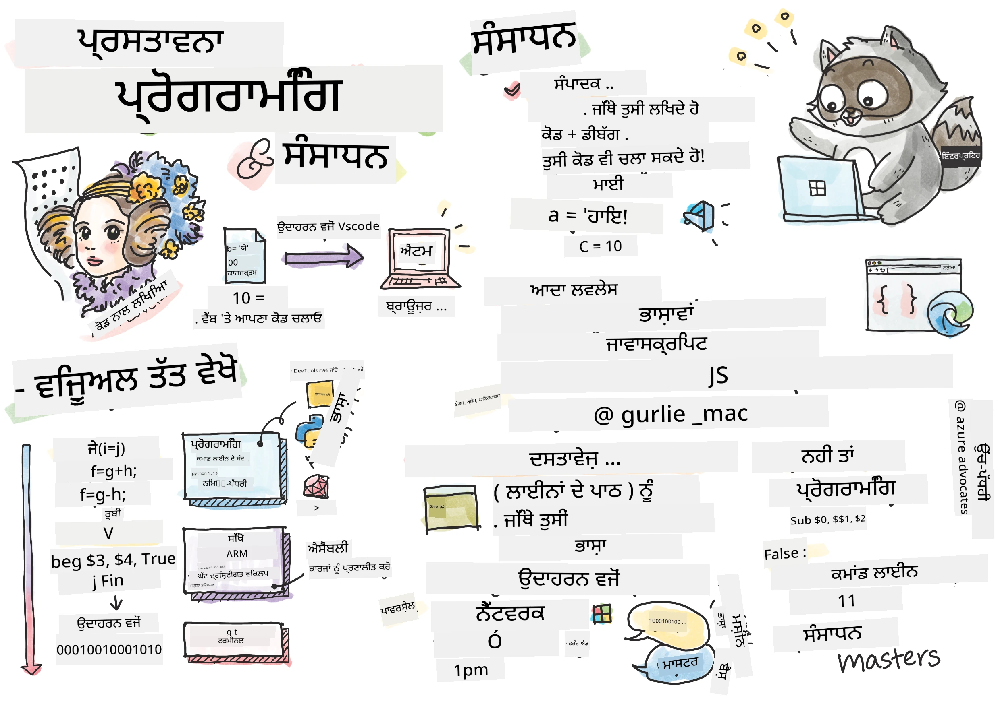
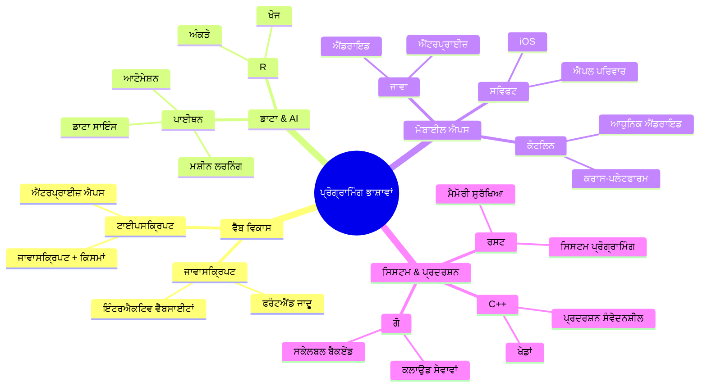
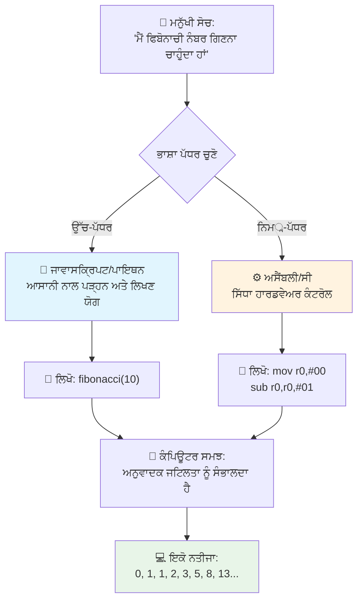
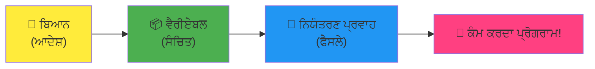
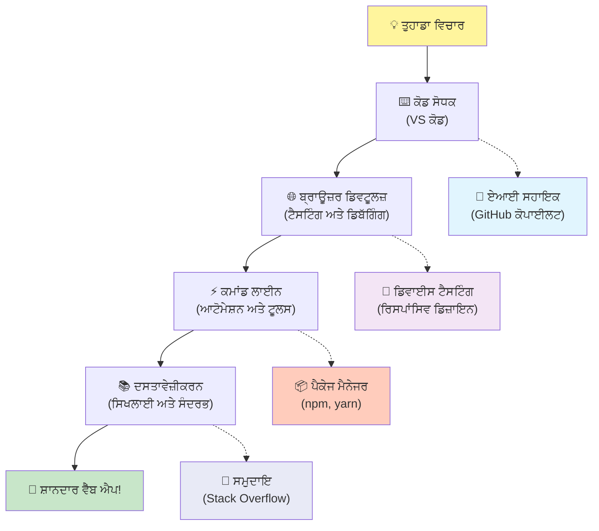
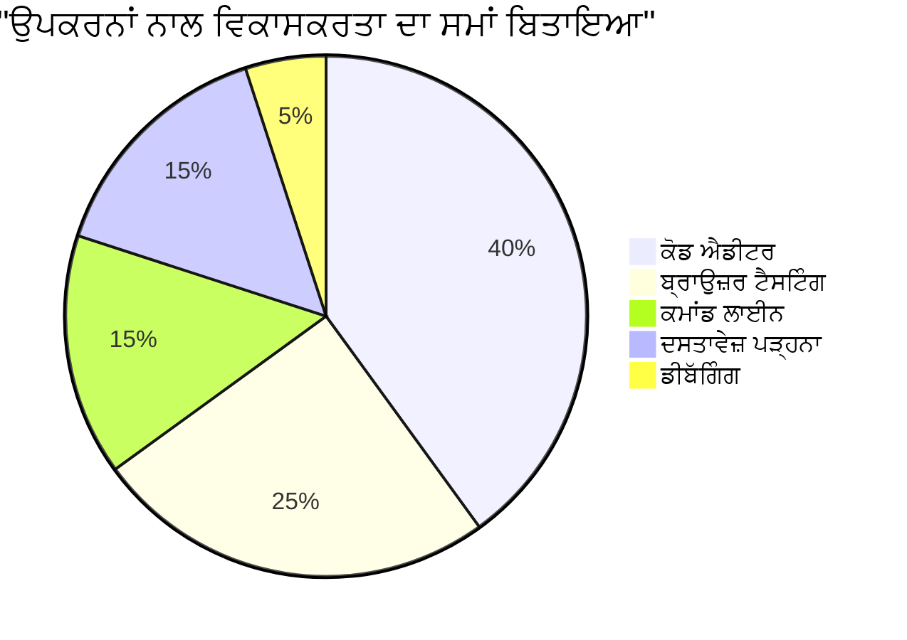
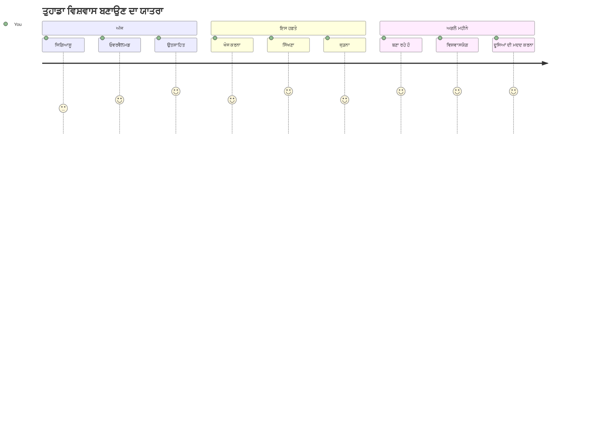

# ਪ੍ਰੋਗ੍ਰਾਮਿੰਗ ਭਾਸ਼ਾਵਾਂ ਅਤੇ ਆਧੁਨਿਕ ਡਿਵੈਲਪਰ ਟੂਲਾਂ ਦਾ ਪਰਚਾ

ਹੈਲੋ, ਭਵਿੱਖਕਾਲ ਦਾ ਡਿਵੈਲਪਰ! 👋 ਕੀ ਮੈਂ ਤੁਹਾਨੂੰ ਕੁਝ ਦੱਸ ਸਕਦਾ ਹਾਂ ਜੋ ਮੈਨੂੰ ਹਰ ਰੋਜ਼ ਰੌਮਾਂਚਿਤ ਕਰਦਾ ਹੈ? ਤੁਸੀਂ ਇਹ ਪਤਾ ਲਗਾਉਣ ਜਾ ਰਹੇ ਹੋ ਕਿ ਪ੍ਰੋਗ੍ਰਾਮਿੰਗ ਸਿਰਫ ਕੰਪਿਊਟਰਾਂ ਬਾਰੇ ਨਹੀਂ ਹੈ – ਇਹ ਤੁਹਾਡੇ ਸਭ ਤੋਂ ਵਿਆਪਕ ਖਿਆਲਾਂ ਨੂੰ ਜੀਵੰਤ ਕਰਨ ਲਈ ਅਸਲ ਜਾਦੂਈ ਤਾਕਤਾਂ ਰੱਖਣ ਬਾਰੇ ਹੈ!

ਤੁਹਾਨੂੰ ਉਹ ਪਲ ਯਾਦ ਹੈ ਜਦੋਂ ਤੁਸੀਂ ਆਪਣੀ ਮਨਪਸੰਦ ਐਪ ਵਰਤ ਰਹੇ ਹੋ ਅਤੇ ਹਰ ਚੀਜ਼ ਬਿਲਕੁਲ ਸਹੀ ਬੈਠ ਜਾਂਦੀ ਹੈ? ਜਦੋਂ ਤੁਸੀਂ ਕਿਸੇ ਬਟਨ 'ਤੇ ਟੈਪ ਕਰਦੇ ਹੋ ਅਤੇ ਕੁਝ ਬਿਲਕੁਲ ਜਾਦੂਈ ਹੁੰਦਾ ਹੈ ਜੋ ਤੁਹਾਨੂੰ "ਵਾਹ, ਉਹਨਾਂ ਨੇ ਐਸਾ ਕਿਵੇਂ ਕੀਤਾ?" ਕਹਿਣ ਤੇ ਮਜ਼ਬੂਰ ਕਰਦਾ ਹੈ? ਠੀਕ ਹੈ, ਉਹ ਕੋਈ ਤੁਹਾਡੇ ਵਰਗਾ ਹੀ ਸੀ – ਸ਼ਾਇਦ ਆਪਣੇ ਮਨਪਸੰਦ ਕਾਫੀਸ਼ਾਪ ਵਿੱਚ 2 ਵਜੇ ਰਾਤ ਨੂੰ ਆਪਣੀ ਤੀਸਰੀ ਐਸਪ੍ਰੈੱਸੋ ਪੀ ਰਹਾ ਸੀ – ਜਿਸਨੇ ਉਹ ਜਾਦੂ ਬਣਾਇਆ। ਅਤੇ ਇਹ ਗੱਲ ਤੁਹਾਡਾ ਦਿਮਾਗ਼ ਉੱਡਾ ਦੇਵੇਗੀ: ਇਸ ਪਾਠ ਦੇ ਅੰਤ ਤੱਕ, ਤੁਸੀਂ ਨਾ ਸਿਰਫ ਇਹ ਸਮਝਾਂਗੇ ਕਿ ਉਹਨਾਂ ਨੇ ਇਹ ਕਿਵੇਂ ਕੀਤਾ, ਸਗੋਂ ਖੁਦ ਇਸਨੂੰ ਅਜਮਾਉਣ ਲਈ ਬੇਸਬਰੀ ਨਾਲ ਤਿਆਰ ਹੋਵੋਗੇ!

ਵੇਖੋ, ਮੈਨੂੰ ਪਤਾ ਹੈ ਕਿ ਹੁਣ ਪ੍ਰੋਗ੍ਰਾਮਿੰਗ ਥੋੜੀ ਡਰਾਉਣੀ ਲੱਗ ਸਕਦੀ ਹੈ। ਜਦੋਂ ਮੈਂ ਸੁਰੂਆਤ ਕੀਤੀ ਸੀ, ਮੈਂ ਸੋਚਦਾ ਸੀ ਕਿ ਤੁਸੀਂ ਕਿਸੇ ਧਾਰਮਿਕ ਮੈਥ ਜਿਨੀਅਸ ਹੋਣਾ ਜਾਂ ਪੰਜ ਸਾਲ ਦੀ ਉਮਰ ਤੋਂ ਕੋਡਿੰਗ ਕਰਨੀ ਪੈਂਦੀ ਹੈ। ਪਰ ਇਹ ਗੱਲ ਮੇਰੀ ਨਜ਼ਰੀਅਤ ਬਦਲ ਕੇ ਰੱਖ ਦਿੱਤੀ: ਪ੍ਰੋਗ੍ਰਾਮਿੰਗ ਬਿਲਕੁਲ ਨਵੀਂ ਭਾਸ਼ਾ ਵਿੱਚ ਗੱਲਬਾਤ ਸਿੱਖਣ ਵਾਂਗ ਹੈ। ਤੁਸੀਂ ਸਭ ਤੋਂ ਪਹਿਲਾਂ "ਹੈਲੋ" ਅਤੇ "ਧੰਨਵਾਦ" ਸਿੱਖਦੇ ਹੋ, ਫਿਰ ਕਾਫੀ ਮੰਗਦੇ ਹੋ, ਅਤੇ ਫਿਰ ਤੁਸੀਂ ਗੰਭੀਰ ਦਰਸ਼ਨਸ਼ਾਸਤਰੀ ਚਰਚਾ ਕਰਦੇ ਹੋ! ਇੱਥੇ ਅਮਲੀ ਗੱਲ ਇਹ ਹੈ ਕਿ ਤੁਸੀਂ ਕੰਪਿਊਟਰਾਂ ਨਾਲ ਗੱਲਬਾਤ ਕਰ ਰਹੇ ਹੋ, ਅਤੇ ਖ਼ਰਦ binne ਰਹਿਮਦ ਆਲੇ ਸਬ ੜਤਣ ਵਾਲੇ ਕਦੇ ਗਲਤੀ ਲਈ ਨਹੀਂ ਤੰਗ ਕਰਦੇ।

ਅੱਜ ਅਸੀਂ ਉਹ ਅਦਭੁਤ ਸੰਦ ਜਾਨਾਂਗੇ ਜੋ ਆਧੁਨਿਕ ਵੈੱਬ ਵਿਕਾਸ ਨੂੰ ਸਿਰਫ ਸੰਭਵ ਹੀ ਨਹੀਂ, ਬਲਕਿ ਬਹੁਤ ਹੀ ਮਨਮੋਹਕ ਬਣਾਉਂਦੇ ਹਨ। ਮੈਂ ਉਹੀ ਸੰਪਾਦਕ, ਬ੍ਰਾਉਜ਼ਰ, ਅਤੇ ਕੰਮ ਦੇ ਢੰਗ ਬਾਰੇ ਗੱਲ ਕਰ ਰਿਹਾ ਹਾਂ ਜੋ Netflix, Spotify, ਅਤੇ ਤੁਹਾਡੇ ਮਨਪਸੰਦ ਇੰਡੀਆ ਐਪ ਸਟੂਡੀਓ ਦੇ ਡਿਵੈਲਪਰ ਹਰ ਰੋਜ਼ ਵਰਤਦੇ ਹਨ। ਅਤੇ ਇੱਥੇ ਆ ਰਿਹਾ ਹੈ ਖੁਸ਼ਖਬਰੀ ਦਾ ਹਿੱਸਾ: ਇਹਨਾਂ ਅਧਿਕਤਮ ਵਰਗੇ ਮਿਆਰੀ ਟੂਲਾਂ ਦਾ ਜ਼ਿਆਦਾਤਰ ਹਿੱਸਾ ਮੁਫ਼ਤ ਹੈ!


> ਸਕੈਚਨੋਟ ਲਿਖਾਰੀ [Tomomi Imura](https://twitter.com/girlie_mac)


```mermaid
journey
    title ਤੁਹਾਡਾ ਪ੍ਰੋਗ੍ਰਾਮਿੰਗ ਯਾਤਰਾ ਅੱਜ
    section ਖੋਜੋ
      ਪ੍ਰੋਗ੍ਰਾਮਿੰਗ ਕੀ ਹੈ: 5: You
      ਪ੍ਰੋਗ੍ਰਾਮਿੰਗ ਭਾਸ਼ਾਵਾਂ: 4: You
      ਸੰਦ ਸਮੀਖਿਆ: 5: You
    section ਖੰਗਾਲੋ
      ਕੋਡ ਸੰਪਾਦਕ: 4: You
      ਬਰਾਊਜ਼ਰ ਅਤੇ ਡਿਵਟੋਲਸ: 5: You
      ਕਮਾਂਡ ਲਾਈਨ: 3: You
    section ਅਭਿਆਸ
      ਭਾਸ਼ਾ ਡਿਟੈਕਟਿਵ: 4: You
      ਸੰਦ ਖੋਜ: 5: You
      ਕਮਿਉਨਿਟੀ ਕਨੈਕਸ਼ਨ: 5: You
```
## ਆਓ ਵੇਖੀਏ ਤੁਸੀਂ ਪਹਿਲਾਂ ਤੋਂ ਕੀ ਜਾਣਦੇ ਹੋ!

ਮਜ਼ੇਦਾਰ ਚੀਜ਼ਾਂ ਵਿੱਚ ਜਾਪਣ ਤੋਂ ਪਹਿਲਾਂ, ਮੈਨੂੰ ਜਾਣਨਾ ਹੈ – ਤੁਸੀਂ ਪਹਿਲਾਂ ਹੀ ਇਸ ਪ੍ਰੋਗ੍ਰਾਮਿੰਗ ਦੁਨੀਆ ਬਾਰੇ ਕੀ ਜਾਣਦੇ ਹੋ? ਅਤੇ ਸੁਣੋ, ਜੇ ਤੁਸੀਂ ਇਹ ਸਵਾਲ ਵੇਖ ਕੇ ਸੋਚ ਰਹੇ ਹੋ "ਮੈਂ ਬਿਲਕੁਲ ਕੁਝ ਨਹੀਂ ਜਾਣਦਾ," ਤਾਂ ਇਹ ਸਿਰਫ ਠੀਕ ਹੀ ਨਹੀਂ, ਬਿਲਕੁਲ ਪਰਫੈਕਟ ਹੈ! ਇਸਦਾ ਮਤਲਬ ਹੈ ਤੁਸੀਂ ਸਹੀ ਥਾਂ ਤੇ ਹੋ। ਇਸ ਕੁਇਜ਼ ਨੂੰ ਵਰਕਆਉਟ ਤੋਂ ਪਹਿਲਾਂ ਸਟਰੈਚਿੰਗ ਵਾਂਗ ਸੋਚੋ – ਅਸੀਂ ਸਿਰਫ ਉਹਨਾਂ ਦਿਮਾਗ਼ ਦੀਆਂ ਮਾਸਪੇਸ਼ੀਆਂ ਨੂੰ ਗਰਮ ਕਰ ਰਹੇ ਹਾਂ!

[ਪ੍ਰੀ-ਪਾਠ ਕੁਇਜ਼ ਲਓ](https://ff-quizzes.netlify.app/web/)


## ਸਾਂਝੇ ਤੌਰ 'ਤੇ ਅਸੀਂ ਜੋ ਸਫ਼ਰ ਕਰਨ ਜਾ ਰਹੇ ਹਾਂ

ਠੀਕ ਹੈ, ਮੈਂ ਇਸ ਗੱਲ ਨੂੰ ਲੈ ਕੇ ਬੇਹੱਦ ਉਤਸ਼ਾਹਤ ਹਾਂ ਜੋ ਅਸੀਂ ਅੱਜ ਖੋਜਣ ਜਾ ਰਹੇ ਹਾਂ! ਸੱਚ ਮੁਚ, ਮੈਂ ਚਾਹੁੰਦਾ ਹਾਂ ਕਿ ਮੈਂ ਤੁਹਾਡਾ ਚਿਹਰਾ ਵੇਖ ਸਕਾਂ ਜਦੋਂ ਕੁਝ ਧਾਰਣਾਵਾਂ ਤੁਹਾਡੇ ਲਈ ਸਪਸ਼ਟ ਹੋਣ। ਸਾਡੇ ਸਫ਼ਰ ਦੀ ਸ਼ਾਨਦਾਰ ਯਾਤਰਾ ਇਹ ਹੈ:

- **ਪ੍ਰੋਗ੍ਰਾਮਿੰਗ ਅਸਲ ਵਿੱਚ ਕੀ ਹੈ (ਅਤੇ ਇਹ ਕਿਉਂ ਸਭ ਤੋਂ ਸ਼ਾਨਦਾਰ ਚੀਜ਼ ਹੈ!)** – ਅਸੀਂ ਜਾਣਾਂਗੇ ਕਿ ਕੋਡ ਵੇਰਵਿਆਂ ਵਿੱਚ ਲੁਕਿਆ ਅਦਿੱਖ ਜਾਦੂ ਹੈ ਜੋ ਚਾਰੋਂ ਪਾਸੇ ਹਰ ਚੀਜ਼ ਨੂੰ ਚਲਾਉਂਦਾ ਹੈ, ਉਸ ਅਲਾਰਮ ਤੋਂ ਜੋ ਸੋਮਵਾਰ ਸਵੇਰੇ ਦਾ ਪਤਾ ਦਿੰਦਾ ਹੈ, ਉਸ ਐਲਗੋਰਿਦਮ ਤੱਕ ਜੋ ਤੁਹਾਡੇ Netflix ਸਿਫਾਰਸ਼ਾਂ ਨੂੰ ਬਿਲਕੁਲ ਬੇਹਤਰੀਨ ਬਣਾਉਂਦਾ ਹੈ
- **ਪ੍ਰੋਗ੍ਰਾਮਿੰਗ ਭਾਸ਼ਾਵਾਂ ਅਤੇ ਉਹਨਾਂ ਦੀਆਂ ਅਦੁਤੀਅ ਸ਼ਖਸੀਅਤਾਂ** – ਸੋਚੋ ਕਿ ਤੁਸੀਂ ਇਕ ਪਾਰਟੀ ਵਿੱਚ ਗਏ ਜਿੱਥੇ ਹਰ ਵਿਅਕਤੀ ਕੋਲ ਅਲੱਗ-ਅਲੱਗ ਜਾਦੂਈ ਤਾਕਤਾਂ ਹਨ ਅਤੇ ਸਮੱਸਿਆਵਾਂ ਸਲਝਾਉਣ ਦੇ ਵੱਖਰੇ ਢੰਗ ਹਨ। ਇਹੀ ਦ੍ਰਿਸ਼ ਐ programming ਭਾਸ਼ਾਵਾਂ ਦੀ ਦੁਨੀਆ ਹੈ, ਅਤੇ ਤੁਹਾਨੂੰ ਉਹਨਾਂ ਨਾਲ ਮਿਲਕੇ ਬਹੁਤ ਮਜ਼ਾ ਆਵੇਗਾ!
- **ਅਹੰਕਾਰਕ ਬਣਾਵਟੀ ਬਲਾਕ ਜਿਹੜੇ ਡਿਜੀਟਲ ਜਾਦੂ ਬਣਾਉਂਦੇ ਹਨ** – ਇਨ੍ਹਾਂ ਨੂੰ ਇੱਕ ਆਖਰੀ ਸ੍ਰਿਜਨਾਤਮਕ LEGO ਸੈੱਟ ਸਮਝੋ। ਜਦੋਂ ਤੁਸੀਂ ਇਹ ਸਮਝ ਲਵੋ ਕਿ ਇਹ ਟੁਕੜੇ ਕਿਸ ਤਰ੍ਹਾਂ ਮਿਲਦੇ ਹਨ, ਤਾਂ ਤੁਸੀਂ ਅਸਲ ਵਿੱਚ ਕੁਝ ਵੀ ਬਣਾਉ ਸਕਦੇ ਹੋ ਜੋ ਤੁਹਾਡੇ ਖ਼ਿਆਲਾਂ ਵਿੱਚ ਹੈ
- **ਪੇਸ਼ਾਵਰ ਟੂਲ ਜੋ ਤੁਹਾਨੂੰ ਜਾਦੂਗਰ ਦੀ ਛੜੀ ਮਿਲਣ ਦੇ ਸਮਾਨ ਮਹਿਸੂਸ ਕਰਵਾਉਣਗੇ** – ਮੈਂ ਇਹ ਬਹੁਤ ਨਾਟਕੀਅਤਮਕ ਤਰੀਕੇ ਨਾਲ ਨਹੀਂ ਕਹਿ ਰਿਹਾ – ਇਹ ਟੂਲਸ ਤੁਹਾਨੂੰ ਸੱਚ-ਮੁੱਚ ਜਾਦੂਈ ਤਾਕਤਾਂ ਦੇ ਨਾਲ ਜੁੜਿਆ ਮਹਿਸੂਸ ਕਰਵਾਉਣਗੇ, ਅਤੇ ਸਭ ਤੋਂ ਵਧੀਆ ਗੱਲ? ਇਹ ਹਰ ਰੋਜ਼ ਮਾਹਿਰ ਵਰਤਦੇ ਹਨ!

> 💡 **ਇਹ ਗੱਲ ਯਾਦ ਰੱਖੋ**: ਅੱਜ ਸਾਰੀ ਕੁਝ ਯਾਦ ਕਰਨ ਦੀ ਕੋਸ਼ਿਸ਼ ਨਾ ਕਰੋ! ਮੈਂ ਸਿਰਫ ਚਾਹੁੰਦਾ ਹਾਂ ਕਿ ਤੁਹਾਡੇ ਅੰਦਰ ਇਹ ਉਤਸ਼ਾਹ ਜਾਗੇ ਕਿ ਸੰਭਾਵਨਾ ਕੀ ਹੈ। ਵਿਸ਼ੇਸ਼ ਜਾਣਕਾਰੀਆਂ ਆਪਣੇ ਆਪ ਯਾਦ ਰਹਿਣਗੀਆਂ ਜਦੋਂ ਅਸੀਂ ਇਕੱਠੇ ਅਭਿਆਸ ਕਰਾਂਗੇ – ਇਹੀ ਅਸਲੀ ਸਿੱਖਣ ਦਾ ਤਰੀਕਾ ਹੈ!

> ਤੁਸੀਂ ਇਹ ਪਾਠ [Microsoft Learn](https://learn.microsoft.com/en-us/learn/modules/web-development-101/introduction-programming/?WT.mc_id=academic-77807-sagibbon) ‘ਤੇ ਵੀ ਕਰ ਸਕਦੇ ਹੋ!

## ਸੋ ਪ੍ਰੋਗ੍ਰਾਮਿੰਗ *ਕੀ* ਹੈ?

ਠੀਕ ਹੈ, ਆਓ ਇਸ ਲੱਖਾਂ ਡਾਲਰ ਦੇ ਸਵਾਲ ਨੂੰ ਹੱਲ ਕਰੀਏ: ਅਸਲ ਵਿੱਚ ਪ੍ਰੋਗ੍ਰਾਮਿੰਗ ਕੀ ਹੈ?

ਮੈਂ ਤੁਹਾਨੂੰ ਇੱਕ ਕਹਾਣੀ ਦੱਸਦਾ ਹਾਂ ਜਿਸ ਨੇ ਮੇਰੀ ਸੋਚ ਬਦਲ ਕੇ ਰੱਖ ਦਿੱਤੀ। ਪਿਛਲੇ ਹਫਤੇ, ਮੈਂ ਆਪਣੀ ਮਾਂ ਨੂੰ ਨਵੀਂ ਸਮਾਰਟ TV ਰੀਮੋਟ ਨੂੰ ਵਰਤਣ ਦਾ ਤਰੀਕਾ ਸਮਝਾ ਰਿਹਾ ਸੀ। ਮੈਂ ਆਪਣੇ ਆਪ ਨੂੰ ਇਹ ਕਹਿੰਦੇ ਸੁਣਿਆ, "ਲਾਲ ਬਟਨ ਦਬਾਓ, ਪਰ ਵੱਡਾ ਲਾਲ ਨਹੀਂ, ਖੱਬੇ ਪਾਸੇ ਛੋਟਾ ਲਾਲ... ਨਹੀਂ, ਤੇਰੀ ਦੂਜੀ ਖੱਬੇ... ਠੀਕ ਹੈ, ਹੁਣ ਇਸਨੂੰ ਦੋ ਸਕਿੰਟ ਲਈ ਰੱਖੋ, ਇੱਕ ਨਹੀਂ, ਤਿੰਨ ਨਹੀਂ..." ਇਹ ਸੱਵਾਲ ਤੁਹਾਨੂੰ ਵੀ ਜਾਣੂ ਲੱਗਦਾ ਹੈ? 😅

ਇਹੀ ਪ੍ਰੋਗ੍ਰਾਮਿੰਗ ਹੈ! ਇਹ ਬਹੁਤ ਵਿਸਥਾਰਵਾਦੀ, ਕਦਮ-ਬਦ-ਕਦਮ ਹਦਾਇਤਾਂ ਦੇਣ ਦੀ ਕਲਾ ਹੈ ਕੁਝ ਇਸ ਦੀ ਸ਼ਕਤੀ ਭਲਾਈ ਹੋਣ ਦੇ ਬਾਵਜੂਦ ਹਰ ਛੋਟੀ ਗੱਲ ਬਿਲਕੁਲ ਸਹੀ ਦਰਸਾਉਣੀ ਪੈਂਦੀ ਹੈ। ਮਗਰ ਇਹ ਵੱਖਰਾ ਹੈ – ਤੁਸੀਂ ਆਪਣੀ ਮਾਂ ਨੂੰ ਨਹੀਂ ਸਮਝਾ ਰਹੇ (ਜੋ ਪੁੱਛ ਸਕਦੀ ਹੈ "ਕਿਹੜਾ ਲਾਲ ਬਟਨ?!"), ਤੁਸੀਂ ਕੰਪਿਊਟਰ ਨੂੰ ਸਮਝਾ ਰਹੇ ਹੋ (ਜੋ बस ਉਹੀ ਕਰਦਾ ਹੈ ਜੋ ਤੁਸੀਂ ਕਹਿੰਦੇ ਹੋ, ਭਾਵੇਂ ਤੁਸੀਂ ਜੋ ਕਿਹਾ ਉਹ ਪੂਰੀ ਤਰ੍ਹਾਂ ਸਹੀ ਨਾ ਹੋਵੇ)।

ਜਦੋਂ ਮੈਂ ਇਹ ਸਿੱਖਿਆ ਤਾਂ ਮੇਰਾ ਦਿਮਾਗ਼ ਉਡ ਗਿਆ: ਕੰਪਿਊਟਰਾਂ ਦੇ ਮੁਲ ਪ੍ਰਭਾਵ ਸਧਾਰਨ ਹਨ। ਉਹਮੁ ਬੱਸ ਦੋ ਚੀਜ਼ਾਂ ਸਮਝਦੇ ਹਨ – 1 ਅਤੇ 0, ਜੋ ਬੁਨਿਆਦੀ ਤੌਰ ‘ਤੇ "ਹਾਂ" ਅਤੇ "ਨਾ" ਜਾਂ "ਚਾਲੂ" ਅਤੇ "ਬੰਦ" ਹਨ। ਬਸ! ਪਰ ਜਾਦੂ ਇਹ ਹੈ – ਸਾਨੂੰ ਮੈਟ੍ਰਿਕਸ ਵਿੱਚ ਜਿਵੇਂ ਇਕਨੀ ਰੂਪ ਵਿੱਚ 1 ਅਤੇ 0 ਗੱਲ ਨਹੀਂ ਕਰਨੀ। ਇੱਥੇ **ਪ੍ਰੋਗ੍ਰਾਮਿੰਗ ਭਾਸ਼ਾਵਾਂ** ਮਦਦ ਲਈ ਆਉਂਦੀਆਂ ਹਨ। ਉਹ ਦੁਨੀਆ ਦੇ ਸਭ ਤੋਂ ਵਧੀਆ ਅਨੁਵਾਦਕ ਵਰਗੇ ਹਨ ਜੋ ਤੁਹਾਡੇ ਕੁਦਰਤੀ ਮਨੁੱਖੀ ਵਿਚਾਰਾਂ ਨੂੰ ਲੈ ਕੇ ਉਸ ਨੂੰ ਕੰਪਿਊਟਰ ਦੀ ਭਾਸ਼ਾ ਵਿੱਚ ਬਦਲ ਦਿੰਦੇ ਹਨ।

ਅਤੇ ਇਹ ਗੱਲ ਹਰ ਸਵੇਰੇ ਮੈਨੂੰ ਜਾਦੂਈ ਜਜ਼ਬਾ ਦਿੰਦੀ ਹੈ: ਤੁਹਾਡੇ ਜੀਵਨ ਦੀ ਹਰ ਡਿਜੀਟਲ ਚੀਜ਼ ਕਿਸੇ ਤੁਹਾਡੇ ਵਰਗੇ ਵਿਅਕਤੀ ਨੇ ਬਣਾਈ ਹੈ, ਸ਼ਾਇਦ ਪਜਾਮੇ ਵਿੱਚ ਬੈਠ ਕੇ ਕਾਫੀ ਪੀ ਰਹੇ ਹੁੰਦੇ ਟਾਈਪ ਕਰਦੇ ਹੋਏ। ਉਹ Instagram ਫਿਲਟਰ ਜੋ ਤੁਹਾਨੂੰ ਬੇਹਤਰੀਨ ਬਣਾਉਂਦਾ ਹੈ? ਕਿਸੇ ਨੇ ਕੋਡ ਕੀਤਾ। ਉਹ ਸਿਫਾਰਸ਼ ਜੋ ਤੁਹਾਡੇ ਲਈ ਨਵੀਂ ਜਾਨਮਾਂ ਗਾਣਾ ਲੈ ਕੇ ਆਈ? ਇੱਕ ਡਿਵੈਲਪਰ ਨੇ ਉਹ ਐਲਗੋਰਿਦਮ ਬਣਾਇਆ। ਉਹ ਐਪ ਜੋ ਤੁਸੀਂ ਦੋਸਤਾਂ ਨਾਲ ਖਾਣੇ ਦੇ ਖਰਚੇ ਵੰਡਣ ਲਈ ਵਰਤਦੇ ਹੋ? ਹਾਂ, ਕਿਸੇ ਨੇ ਸੋਚਿਆ "ਇਹ ਉਬਾਊ ਹੈ, ਮੈਂ ਇਸ ਨੂੰ ਸਹੀ ਕਰ ਸਕਦਾ ਹਾਂ" ਅਤੇ ਫਿਰ... ਉਹ ਕੀਤਾ!

ਜਦੋਂ ਤੁਸੀਂ ਪ੍ਰੋਗ੍ਰਾਮ ਕਰਨਾ ਸਿੱਖਦੇ ਹੋ, ਤੁਸੀਂ ਸਿਰਫ ਇੱਕ ਨਵੀਂ ਹੁਨਰ ਨਹੀਂ ਸਿੱਖ ਰਹੇ, ਤੁਸੀਂ ਇੱਕ ਇਸ ਸ਼ਾਨਦਾਰ ਸਮੁਦਾਇ ਦਾ ਹਿੱਸਾ ਬਣ ਰਹੇ ਹੋ ਜੋ ਸਮੱਸਿਆਵਾਂ ਹੱਲ ਕਰਦਾ ਹੈ ਅਤੇ ਦਿਨ ਬੀਤਾਉਂਦਾ ਹੈ ਇਹ ਸੋਚ ਕੇ, "ਜੇ ਮੈਂ ਕੁਝ ਉਸ ਦਾ ਜਿਸ ਨਾਲ ਕਿਸੇ ਦਾ ਦਿਨ ਥੋੜ੍ਹਾ ਬਿਹਤਰ ਬਣ ਸਕਦਾ ਹੈ, ਤਾਂ ਮੈਂ ਬਣਾਈਦਾ ਕੀਤਾਂ?" ਸੱਚਮੁਚ, ਕੀ ਇਸ ਤੋਂ ਵਧੀਆ ਕੁਝ ਹੋ ਸਕਦਾ ਹੈ?

✅ **ਮਜ਼ੇਦਾਰ ਤੱਥ ਲੱਭੋ**: ਜਦੋਂ ਤੁਹਾਡੇ ਕੋਲ ਖਾਲੀ ਸਮਾਂ ਹੋਵੇ ਤਾਂ ਇਹ ਗੱਲ ਖੋਜੋ – ਤੁਹਾਡੇ ਖ਼ਿਆਲ ਵਿੱਚ ਦੁਨੀਆ ਦਾ ਪਹਿਲਾ ਕੰਪਿਊਟਰ ਪ੍ਰੋਗ੍ਰਾਮਰ ਕੌਣ ਸੀ? ਮੈਂ ਤੁਹਾਨੂੰ ਇੱਕ ਇਸ਼ਾਰਾ ਦਿੰਦਾ ਹਾਂ: ਇਹ ਸ਼ਾਇਦ ਜਿਹੜੀ ਆਦਮੀ ਦੀ ਤੁਸੀਂ ਉਮੀਦ ਕਰਦੇ ਹੋ ਉਸ ਤੋਂ ਵੱਖਰਾ ਹੋ ਸਕਦਾ ਹੈ! ਇਸ ਵਿਅਕਤੀ ਦੀ ਕਹਾਣੀ ਬਹੁਤ ਦਿਲਚਸਪ ਹੈ ਅਤੇ ਦਿਖਾਉਂਦੀ ਹੈ ਕਿ ਪ੍ਰੋਗ੍ਰਾਮਿੰਗ ਸਦਾ ਹੀ ਰਚਨਾਤਮਕ ਸਮੱਸਿਆ ਹੱਲ ਕਰਨ ਅਤੇ ਬਕਸੇ ਤੋਂ ਬਾਹਰ ਸੋਚਣ ਬਾਰੇ ਹੈ।

### 🧠 **ਚੈਕ-ਇਨ ਵੀਲਾ: ਤੁਸੀਂ ਕਿਵੇਂ ਮਹਿਸੂਸ ਕਰ ਰਹੇ ਹੋ?**

**ਇਕ ਪਲ ਲਈ ਸੋਚੋ:**
- ਕੀ ਹੁਣ "ਕੰਪਿਊਟਰਾਂ ਨੂੰ ਹੁਕਮ ਦੇਣ" ਦਾ ਵਿਚਾਰ ਤੁਹਾਡੇ ਲਈ ਸਮਝਦਾਰ ਬਣਿਆ?
- ਕੀ ਤੁਸੀਂ ਕੋਈ ਦਿਨਚਰਿਆ ਵਾਲਾ ਕੰਮ ਸੋਚ ਸਕਦੇ ਹੋ ਜੋ ਤੁਸੀਂ ਪ੍ਰੋਗ੍ਰਾਮਿੰਗ ਨਾਲ ਆਟੋਮੇਟ ਕਰਨਾ ਚਾਹੁੰਦੇ ਹੋ?
- ਇਸ ਸਾਰੀ ਪ੍ਰੋਗ੍ਰਾਮਿੰਗ ਗੱਲ ਬਾਰੇ ਤੁਹਾਡੇ ਮਨ ‘ਚ ਕਿਹੜੇ ਸਵਾਲ ਉੱਠ ਰਹੇ ਹਨ?

> **ਯਾਦ ਰੱਖੋ**: ਕੁਝ ਧਾਰਣਾਵਾਂ ਹੁਣ ਥੋੜ੍ਹੀ ਝੱਲੀ ਲੱਗ ਸਕਦੀਆਂ ਹਨ, ਇਹ ਸਾਧਾਰਣ ਹੈ। ਪ੍ਰੋਗ੍ਰਾਮਿੰਗ ਸਿਖਣਾ ਨਵੀਂ ਭਾਸ਼ਾ ਸਿੱਖਣ ਵਾਂਗ ਹੈ – ਤੁਹਾਡੇ ਦਿਮਾਗ਼ ਨੂੰ ਉਹ ਨੈਰਲ ਪਾਥ ਵੇਖਣ ਵਾਸਤੇ ਸਮਾਂ ਲੱਗਦਾ ਹੈ। ਤੁਸੀਂ ਵਧੀਆ ਕਰ ਰਹੇ ਹੋ!

## ਪ੍ਰੋਗ੍ਰਾਮਿੰਗ ਭਾਸ਼ਾਵਾਂ ਸਿਰਫ ਜਾਦੂ ਦੇ ਵੱਖਰੇ ਸਵਾਦਾਂ ਵਾਂਗ ਹਨ

ਠੀਕ ਹੈ, ਇਹ ਗੱਲ ਅਜੀਬ ਲੱਗੇਗੀ ਪਰ ਮੇਰੇ ਨਾਲ ਰਹੋ – ਪ੍ਰੋਗ੍ਰਾਮਿੰਗ ਭਾਸ਼ਾਵਾਂ ਬਹੁਤ ਕੁਝ ਵੱਖ-ਵੱਖ ਤਰ੍ਹਾਂ ਦੀਆਂ ਮਿਊਜ਼ਿਕ ਸ਼ੈਲੀਆਂ ਵਾਂਗ ਹਨ। ਸੋਚੋ: ਤੁਹਾਡੇ ਕੋਲ ਜਾਜ਼ ਹੈ ਜੋ ਨਰਮ ਅਤੇ ਸੁਤੰਤਰ ਹੈ, ਰੌਕ ਜੋ ਤਾਕਤਵਰ ਅਤੇ ਸਿੱਧਾ ਸਾਦਾ ਹੈ, ਕਲਾਸੀ ਵਿਕ ਹੈ ਜੋ ਸ਼ਾਨਦਾਰ ਅਤੇ ਢਾਂਚਾਗਤ ਹੈ, ਅਤੇ ਹਿਪ-ਹੁਪ ਜੋ ਕਿਰਾਏਟਿਵ ਅਤੇ ਪ੍ਰਗਟਾਵੀ ਹੈ। ਹਰ ਇੱਕ ਸ਼ੈਲੀ ਦਾ ਆਪਣਾ ਵਾਇਬ, ਆਪਣੇ ਬੇਹੱਦ ਪ੍ਰਸ਼ੰਸਕ ਹਨ ਅਤੇ ਹਰ ਇੱਕ ਵੱਖਰੇ ਮੂਡ ਅਤੇ ਮੌਕੇ ਲਈ ਬਿਲਕੁਲ ਵਧੀਆ ਹੈ।

ਪ੍ਰੋਗ੍ਰਾਮਿੰਗ ਭਾਸ਼ਾਵਾਂ ਵੀ ਬਿਲਕੁਲ ਐਸਾ ਹੀ ਕੰਮ ਕਰਦੀਆਂ ਹਨ! ਤੁਸੀਂ ਇੱਕ ਦਿਲਚਸਪ ਮੋਬਾਈਲ ਗੇਮ ਬਣਾਉਣ ਲਈ ਉਹੀ ਭਾਸ਼ਾ ਨਹੀਂ ਵਰਤੋਂਗੇ ਜਿਹੀ ਤੁਸੀਂ ਵੱਡੇ ਮਾਤਰਾ ਵਿੱਚ ਮੌਸਮ ਦੇ ਡਾਟਾ ਨੂੰ ਸੰਭਾਲਣ ਲਈ ਵਰਤੋਂਗੇ, ਬਿਲਕੁਲ ਉਸੇ ਤਰ੍ਹਾਂ ਜਿਵੇਂ ਤੁਸੀਂ ਯੋਗ ਕਲਾਸ ਵਿੱਚ ਡੈਥ ਮੈਟਲ ਕਦੇ ਨਹੀਂ ਬਜਾਉਂਦੇ (ਖੈਰ, ਜਿਆਦਾਤਰ ਯੋਗ ਕਲਾਸਾਂ ਵਿੱਚ ਤਾਂ ਨਹੀਂ! 😄).

ਪਰ ਇਹ ਗੱਲ ਜੋ ਹਮੇਸ਼ਾ ਮੇਰਾ ਦਿਮਾਗ਼ੋਂ ਕਮਾਲ ਕਰ ਦਿੰਦੀ ਹੈ: ਇਹ ਭਾਸ਼ਾਵਾਂ ਤੁਹਾਡੇ ਨਾਲ ਇੱਕ ਬਹੁਤ ਧੀਰਜਵਾਨ, ਬੁੱਧਿਮਾਨ ਦਭਾਸ਼ੀਏ ਵਰਗੀ ਹਨ। ਤੁਸੀਂ ਆਪਣੀਆਂ ਸੋਚਾਂ ਇਸ ਤਰੀਕੇ ਨਾਲ ਦਰਸਾਉਂਦੇ ਹੋ ਜੋ ਤੁਹਾਡੇ ਮਨੁੱਖੀ ਦਿਮਾਗ਼ ਲਈ ਕੁਦਰਤੀ ਹੈ, ਅਤੇ ਉਹ ਸਾਰੇ ਗੁੰਝਲਦਾਰ ਕੰਮ 1 ਅਤੇ 0 ਵਿੱਚ ਬਦਲਣ ਦਾ ਕੰਮ ਸੰਭਾਲਦੇ ਹਨ। ਇਹ ਕਿਸੇ ਐਸੇ ਮਿੱਤਰ ਵਾਂਗ ਹੈ ਜੋ "ਮਨੁੱਖੀ ਰਚਨਾਤਮਕਤਾ" ਅਤੇ "ਕੰਪਿਊਟਰ ਲਾਜਿਕ" ਦੋਹਾਂ ਵਿੱਚ ਪੂਰੀ ਤਰ੍ਹਾਂ ਫਲੂਐਂਟ ਹੈ – ਜੋ ਕਦੇ ਥੱਕਦਾ ਨਹੀਂ, ਕਦੇ ਕਾਫੀ ਬ੍ਰੇਕ ਨਹੀਂ ਲੈਂਦਾ, ਅਤੇ ਕਦੇ ਤੁਹਾਨੂੰ ਇੱਕੋ ਸਵਾਲ ਦੋ ਵਾਰੀ ਪੁੱਛਣ 'ਤੇ ਨਿੰਦਾ ਨਹੀਂ ਕਰਦਾ!

### ਲੋਕਪ੍ਰਿਯ ਪ੍ਰੋਗ੍ਰਾਮਿੰਗ ਭਾਸ਼ਾਵਾਂ ਅਤੇ ਉਹਨਾਂ ਦੀ ਵਰਤੋਂ


```mermaid
mindmap
  root((ਪ੍ਰੋਗ੍ਰਾਮਿੰਗ ਭਾਸ਼ਾਵਾਂ))
    ਵੈੱਬ ਵਿਕਾਸ
      ਜਾਵਾਸਕ੍ਰਿਪਟ
        ਫਰੰਟਐਂਡ ਜਾਦੂ
        ਇੰਟਰਐਕਟਿਵ ਵੈੱਬਸਾਈਟਾਂ
      ਟਾਈਪਸਕ੍ਰਿਪਟ
        ਜਾਵਾਸਕ੍ਰਿਪਟ + ਕਿਸਮਾਂ
        ਐਂਟਰਪ੍ਰਾਈਜ਼ ਐਪਸ
    ਡਾਟਾ & AI
      ਪਾਈਥਨ
        ਡਾਟਾ ਸਾਇੰਸ
        ਮਸ਼ੀਨ ਲਰਨਿੰਗ
        ਆਟੋਮੇਸ਼ਨ
      R
        ਅੰਕੜੇ
        ਖੋਜ
    ਮੋਬਾਈਲ ਐਪਸ
      ਜਾਵਾ
        ਐਂਡਰਾਇਡ
        ਐਂਟਰਪ੍ਰਾਈਜ਼
      ਸਵਿਫਟ
        iOS
        ਐਪਲ ਪਰਿਵਾਰ
      ਕੋਟਲਿਨ
        ਆਧੁਨਿਕ ਐਂਡਰਾਇਡ
        ਕਰਾਸ-ਪਲੇਟਫਾਰਮ
    ਸਿਸਟਮ & ਪ੍ਰਦਰਸ਼ਨ
      C++
        ਖੇਡਾਂ
        ਪ੍ਰਦਰਸ਼ਨ ਸੰਵੇਦਨਸ਼ੀਲ
      ਰਸਟ
        ਮੈਮੋਰੀ ਸੁਰੱਖਿਆ
        ਸਿਸਟਮ ਪ੍ਰੋਗ੍ਰਾਮਿੰਗ
      ਗੋ
        ਕਲਾਉਡ ਸੇਵਾਵਾਂ
        ਸਕੇਲਬਲ ਬੈਕਏਂਡ
```
| ਭਾਸ਼ਾ | ਵਧੀਆ | ਕਿਉਂ ਲੋਕਪ੍ਰਿਯ ਹੈ |
|----------|----------|------------------|
| **JavaScript** | ਵੈੱਬ ਵਿਕਾਸ, ਯੂਜ਼ਰ ਇੰਟਰਫੇਸ | ਬ੍ਰਾਉਜ਼ਰਾਂ ਵਿੱਚ ਚਲਦਾ ਹੈ ਅਤੇ ਇੰਟਰੈਕਟਿਵ ਵੈੱਬਸਾਈਟ ਚਲਾਉਂਦਾ ਹੈ |
| **Python** | ਡੇਟਾ ਵਿਗਿਆਨ, ਆਟੋਮੇਸ਼ਨ, ਏਆਈ | ਪੜ੍ਹਨ ਅਤੇ ਸਿੱਖਣ ਵਿੱਚ ਆਸਾਨ, ਸ਼ਕਤੀਸ਼ਾਲੀ ਲਾਇਬ੍ਰੇਰੀਜ਼ |
| **Java** | ਵੱਡੇ ਕਾਰੋਬਾਰੀ ਐਪ, ਐਂਡਰਾਇਡ ਐਪ | ਪਲੇਟਫਾਰਮ-ਸਵੈਤੰਤਰ, ਵੱਡੇ ਸਿਸਟਮਾਂ ਲਈ ਮਜ਼ਬੂਤ |
| **C#** | ਵਿਂਡੋਜ਼ ਐਪلیکੇਸ਼ਨ, ਗੇਮ ਡਿਵੈਲਪਮੈਂਟ | ਮਜਬੂਤ ਮਾਈਕਰੋਸਾਫਟ ਪਰਿਵਾਰਕ ਸਹਾਇਤਾ |
| **Go** | ਕਲਾਉਡ ਸੇਵਾਵਾਂ, ਬੈਕਏਂਡ ਸਿਸਟਮ | ਤੇਜ਼, ਸਾਦਾ, ਆਧੁਨਿਕ ਕੰਪਿਊਟਿੰਗ ਲਈ ਬਣਾਇਆ |

### ਉੱਚ-ਪੱਧਰੀ ਅਤੇ ਨੀਵਾਂ-ਪੱਧਰੀ ਭਾਸ਼ਾਵਾਂ

ਠੀਕ ਹੈ, ਇਹ ਮੇਰੇ ਲਈ ਉਹ ਧਾਰਣਾ ਸੀ ਜਿਸਨੇ ਮੇਰਾ ਦਿਮਾਗ਼ ਖ਼ਰਾਬ ਕਰ ਦਿੱਤਾ ਜਦੋਂ ਮੈਂ ਪਹਿਲੀ ਵਾਰੀ ਸਿੱਖਣਾ ਸ਼ੁਰੂ ਕੀਤਾ, ਤਾਂ ਮੈਂ ਉਹ ਤਰਕ ਦਿੱਸਾਂਗਾ ਜੋ ਅੰਤ ਵਿੱਚ ਮੈਨੂੰ ਸਮਝ ਆਇਆ – ਅਤੇ ਮੈਂ ਆਸ ਕਰਦਾ ਹਾਂ ਕਿ ਇਹ ਤੁਹਾਡੇ ਲਈ ਵੀ ਫ਼ਾਇਦਾਕਾਰ ਹੋਵੇਗਾ!

ਸੋਚੋ ਕਿ ਤੁਸੀਂ ਕਿਸੇ ਅਜਿਹੇ ਦੇਸ਼ ਵਿੱਚ ਹੋ ਜਿੱਥੇ ਤੁਸੀਂ ਭਾਸ਼ਾ ਨਹੀਂ ਬੋਲਦੇ ਅਤੇ ਤੁਹਾਨੂੰ ਬਹੁਤ ਜ਼ਰੂਰੀ ਹੈ ਕਿ ਸਭ ਤੋਂ ਨੇੜਲਾ ਟਾਇਲੈਟ ਲੱਭੋ (ਸਾਨੂੰ ਸਾਰਿਆਂ ਦੇ ਨਾਲ ਇਹ ਹੋਇਆ ਹੈ, ਸਹੀ? 😅):

- **ਨੀਚੇ-ਪੱਧਰੀ ਪ੍ਰੋਗ੍ਰਾਮਿੰਗ** ਉਹ ਆਪਣੀ ਸਰੋਕਾਰ ਵਿੱਚ ਮੋਟਾਬਕ਼ ਇਥੋਂ ਤੱਕ ਭਾਸ਼ਾ ਸਿੱਖਣਾ ਹੈ ਕਿ ਤੁਸੀਂ ਉਸ ਰਸਤੇ ਦੇਫ਼ਨੀਅਲ ਮਹਿਲਾ ਨਾਲ ਗੱਲਬਾਤ ਕਰ ਸਕੋ ਜੋ ਫਲ ਵੇਚ ਰਹੀ ਹੈ, ਸੰਸਕਾਰਿਕ ਸੰਕੇਤ, ਸਥਾਨਕ ਬੋਲ-ਚਾਲ ਅਤੇ ਅੰਦਰੂਨੀ ਜੋਕਸ ਦੀ ਵਰਤੋਂ ਕਰਦਾ ਹੈ ਜੋ ਸਿਰਫ ਉਥੇ ਲੰਮੇ ਸਮੇਂ ਤੋਂ ਰਹਿਣ ਵਾਲਾ ਸਮਝ ਸਕਦਾ ਹੈ। ਬਹੁਤ ਪ੍ਰਭਾਵਸ਼ালী ਅਤੇ ਬਹੁਤ ਸਾਰਥਕ... ਜੇ ਤੁਸੀਂ ਸੱਚ-ਮੁੱਚ ਦੋਹਾਂ ਭਾਸ਼ਾਵਾਂ ਵਿੱਚ ਫਲੂਐਂਟ ਹੋਵੋਗੇ! ਪਰ ਜਦੋਂ ਤੁਸੀਂ ਸਿਰਫ ਟਾਇਲੈਟ ਲੱਭ ਰਹੇ ਹੋ, ਤਾਂ ਕਾਫੀ ਭਾਰੀ ਲੱਗਦਾ ਹੈ।

- **ਉੱਚ-ਪੱਧਰੀ ਪ੍ਰੋਗ੍ਰਾਮਿੰਗ** ਬਿਲਕੁਲ ਉਸ ਅਸਾਧਾਰਣ ਸਥਾਨਕ ਮਿੱਤਰ ਵਾਂਗ ਹੈ ਜੋ ਤੁਹਾਨੂੰ ਸਮਝਦਾ ਹੈ। ਤੁਸੀਂ ਸਾਫ਼ ਸਾਫ਼ ਅੰਗਰੇਜ਼ੀ ਵਿੱਚ ਕਹਿ ਸਕਦੇ ਹੋ "ਮੈਨੂੰ ਇੱਕ ਟਾਇਲੈਟ ਚਾਹੀਦਾ ਹੈ," ਅਤੇ ਉਹ ਸਭ ਸਾਂਸਕ੍ਰਿਤਕ ਅਨੁਵਾਦ ਸੰਭਾਲਕੇ ਤੁਹਾਨੂੰ ਇਸ ਤਰ੍ਹਾਂ ਦੇ ਨਿਰਦੇਸ਼ ਦਿੰਦਾ ਹੈ ਜੋ ਤੁਹਾਡੇ ਵਿੱਰੋਧੀ ਦਿਮਾਗ਼ ਲਈ ਪੂਰੀ ਤਰ੍ਹਾਂ ਵਾਜਬ਼ ਹਨ।

ਪ੍ਰੋਗ੍ਰਾਮਿੰਗ ਟਰਮਾਂ ਵਿੱਚ:
- **ਨੀਵਾਂ-ਪੱਧਰੀ ਭਾਸ਼ਾਵਾਂ** (ਜਿਵੇਂ Assembly ਜਾਂ C) ਤੁਹਾਨੂੰ ਕੰਪਿਊਟਰ ਦੀ ਹਾਰਡਵੇਅਰ ਨਾਲ ਬਹੁਤ ਹੀ ਵਿਸਥਾਰਵਾਦੀ ਗੱਲਬਾਤ ਕਰਨ ਦੀ ਆਜ਼ਾਦੀ ਦਿੰਦੀਆਂ ਹਨ, ਪਰ ਤੁਸੀਂ ਮਸ਼ੀਨ ਦੇ ਤਰੀਕੇ ਨਾਲ ਸੋਚਣਾ ਪੈਂਦਾ ਹੈ, ਜੋ ਕਿ... ਚਲੋ ਕਹਿਣ ਦਿਉ ਇਹ ਇੱਕ ਵੱਡਾ ਮਾਨਸਿਕ ਬਦਲਾਅ ਹੈ!
- **ਉੱਚ-ਪੱਧਰੀ ਭਾਸ਼ਾਵਾਂ** (ਜਿਵੇਂ JavaScript, Python, ਜਾਂ C#) ਤੁਹਾਨੂੰ ਮਨੁੱਖ ਵਰਗਾ ਸੋਚਣਾ ਦਿੰਦੀਆਂ ਹਨ ਜਦਕਿ ਉਹ ਸ਼ਾਹੀ ਮਸ਼ੀਨ ਦੀ ਭਾਸ਼ਾ ਦੇ ਕੰਮ ਕਰਦੀਆਂ ਹਨ। ਨਾਲ ਹੀ, ਉਹਨਾਂ ਕੋਲ ਬਹੁਤ ਹੀ ਮਿਠੜੇ ਸਮੁਦਾਏ ਹਨ ਜਿਹੜੇ ਯਾਦ ਰੱਖਦੇ ਹਨ ਕਿ ਨਵੇਂ ਹੁਣੇ ਕੀਤਿਆਂ ਨੂੰ ਲੱਗਦਾ ਸੀ ਅਤੇ ਜੋ ਸਬਰ ਨਾਲ ਮਦਦ ਕਰਦੇ ਹਨ!

ਹੁਣ ਤੁਸੀਂ ਸੋਚ ਰਹੇ ਹੋਵੋਗੇ ਕਿ ਮੈਂ ਕਿਹੜੀਆਂ ਭਾਸ਼ਾਵਾਂ ਨਾਲ ਸ਼ੁਰੂਆਤ ਕਰਨ ਦੀ ਸੁਝਾਅ ਦਿਉਂਗਾ? 😉 ਉੱਚ-ਪੱਧਰੀ ਭਾਸ਼ਾਵਾਂ ਸੰਭਾਲਣਾ ਬਹੁਤ ਆਸਾਨ ਹੈ ਅਤੇ ਉਹ ਅਜਿਹੇ ਸਹਾਰੇ ਹਨ ਜੋ ਤੁਸੀਂ ਕਦੇ ਹਟਾਉਣਾ ਨਹੀਂ ਚਾਹੋਗੇ ਕਿਉਂਕਿ ਉਹ ਸਿੱਖਣ ਦਾ ਤਜ਼ਰਬਾ ਬਹੁਤ ਖ਼ੂਬਸੂਰਤ ਬਣਾ ਦਿੰਦੇ ਹਨ!


```mermaid
flowchart TB
    A["👤 ਮਨੁੱਖੀ ਸੋਚ:<br/>'ਮੈਂ ਫਿਬੋਨਾਚੀ ਨੰਬਰ ਗਿਣਨਾ ਚਾਹੁੰਦਾ ਹਾਂ'"] --> B{ਭਾਸ਼ਾ ਪੱਧਰ ਚੁਣੋ}
    
    B -->|ਉੱਚ-ਪੱਧਰ| C["🌟 ਜਾਵਾਸਕ੍ਰਿਪਟ/ਪਾਇਥਨ<br/>ਆਸਾਨੀ ਨਾਲ ਪੜ੍ਹਨ ਅਤੇ ਲਿਖਣ ਯੋਗ"]
    B -->|ਨਿਮ্ন-ਪੱਧਰ| D["⚙️ ਅਸੈਂਬਲੀ/ਸੀ<br/>ਸਿੱਧਾ ਹਾਰਡਵੇਅਰ ਕੰਟਰੋਲ"]
    
    C --> E["📝 ਲਿਖੋ: fibonacci(10)"]
    D --> F["📝 ਲਿਖੋ: mov r0,#00<br/>sub r0,r0,#01"]
    
    E --> G["🤖 ਕੰਪਿਊਟਰ ਸਮਝ:<br/>ਅਨੁਵਾਦਕ ਜਟਿਲਤਾ ਨੂੰ ਸੰਭਾਲਦਾ ਹੈ"]
    F --> G
    
    G --> H["💻 ਇਕੋ ਨਤੀਜਾ:<br/>0, 1, 1, 2, 3, 5, 8, 13..."]
    
    style C fill:#e1f5fe
    style D fill:#fff3e0
    style H fill:#e8f5e8
```
### ਮੈਂ ਤੁਹਾਨੂੰ ਦਿਖਾਉਂਦਾ ਹਾਂ ਕਿਉਂ ਉੱਚ-ਪੱਧਰੀ ਭਾਸ਼ਾਵਾਂ ਬਹੁਤ ਜਿਆਦਾ ਦੋਸਤਾਨਾ ਹਨ

ਠੀਕ ਹੈ, ਮੈਂ ਤੁਹਾਨੂੰ ਕੁਝ ਐਸਾ ਦਿਖਾਉਣ ਜਾ ਰਿਹਾ ਹਾਂ ਜੋ ਬਿਲਕੁਲ ਦਿਖਾਉਂਦਾ ਹੈ ਕਿ ਮੈਂ ਉੱਚ-ਪੱਧਰੀ ਭਾਸ਼ਾਵਾਂ ਨਾਲ ਕਿਵੇਂ ਪਿਆਰ ਕਰ ਗਿਆ, ਪਰ ਪਹਿਲਾਂ – ਮੈਨੂੰ ਤੁਹਾਡਾ ਵਾਅਦਾ ਚਾਹੀਦਾ ਹੈ। ਜਦੋਂ ਤੁਸੀਂ ਪਹਿਲਾ ਕੋਡ ਨਮੂਨਾ ਦੇਖੋਗੇ, ਡਰੋ ਨਾ! ਇਹ ਇਰਾਦੇ ਨਾਲ ਥੋੜ੍ਹਾ ਡਰਾਉਣਾ ਬਣਾਇਆ ਗਿਆ ਹੈ। ਮੈਂ ਇਹ ਗੱਲ ਹਾਈਲਾਈਟ ਕਰ ਰਿਹਾ ਹਾਂ!

ਅਸੀਂ ਇੱਕੋ ਕੰਮ ਨੂੰ ਦੋ ਬਿਲਕੁਲ ਵੱਖ-ਵੱਖ ਸਟਾਈਲਾਂ ਵਿੱਚ ਲਿਖਿਆ ਹੋਇਆ ਦੇਖਾਂਗੇ। ਦੋਨੋ Fibonacci ਦਾ ਕ੍ਰਮ ਬਣਾਉਂਦੇ ਹਨ – ਜੋ ਇੱਕ ਸੁੰਦਰ ਗਣਿਤਕ ਨਮੂਨਾ ਹੈ ਜਿਸ ਵਿੱਚ ਹਰ ਅੰਕ ਪਿਛਲੇ ਦੋ ਅੰਕਾਂ ਦਾ ਜੋੜ ਹੁੰਦਾ ਹੈ: 0, 1, 1, 2, 3, 5, 8, 13... (ਮਜ਼ੇਦਾਰ ਗੱਲ: ਇਹ ਨਮੂਨਾ ਕੁਦਰਤ ਵਿੱਚ ਖ਼ੂਬ ਮਿਲਦਾ ਹੈ – ਸੂਰਜਮੁਖੀ ਦੇ ਬੀਜ ਦੇ ਸਪਾਇਰਲ, ਪਾਈਨਕੋਨ ਦੇ ਬੁੰਨੇ, ਅਤੇ ਇਥੋਂ ਤੱਕ ਕਿ ਗੈਕਸੀਜ਼ ਢਾਂਚਾ ਬਣਾਉਂਦੇ ਹਨ!)

ਤਿਆਰ ਹੋ ਤੁਲਨਾ ਦੇਖਣ ਲਈ? ਚੱਲੋ ਜੀ!

**ਉੱਚ-ਪੱਧਰੀ ਭਾਸ਼ਾ (JavaScript) – ਮਨੁੱਖ-ਮਿੱਤ੍ਰ:**

```javascript
// ਕਦਮ 1: ਮੂਲ ਫਿਬੋਨਾਚੀ ਸੈਟਅੱਪ
const fibonacciCount = 10;
let current = 0;
let next = 1;

console.log('Fibonacci sequence:');
```

**ਇਹ ਕੋਡ ਇਹ ਕਰਦਾ ਹੈ:**
- **ਇੱਕ ਸਥਿਰ ਘੋਸ਼ਿਤ ਕਰੋ ਕਿ ਕਿੰਨੇ Fibonacci ਅੰਕ ਬਣਾਉਣੇ ਹਨ
- **ਦੋ ਵੈਰੀਏਬਲ ਸ਼ੁਰੂ ਕਰੋ ਜੋ ਇਸ ਵਾਰਣੀ ਵਿੱਚ ਮੌਜੂਦਾ ਅਤੇ ਅਗਲੇ ਨੰਬਰ ਨੂੰ ਟ੍ਰੈਕ ਕਰਦੇ ਹਨ
- **ਸ਼ੁਰੂਆਤੀ ਮੁੱਲ (0 ਅਤੇ 1) ਸੈੱਟ ਕਰੋ ਜੋ Fibonacci ਪੈਟਰਨ ਨੂੰ ਪਰਿਭਾਸ਼ਿਤ ਕਰਦੇ ਹਨ
- **ਆਪਣੇ ਨਤੀਜੇ ਨੂੰ ਪਛਾਣਨ ਲਈ ਸਿਰਲੇਖ ਸੁਨੇਹਾ ਪੇਸ਼ ਕਰੋ

```javascript
// ਕਦਮ 2: ਇੱਕ ਲੂਪ ਨਾਲ ਕ੍ਰਮ ਬਣਾਓ
for (let i = 0; i < fibonacciCount; i++) {
  console.log(`Position ${i + 1}: ${current}`);
  
  // ਕ੍ਰਮ ਵਿਚ ਅਗਲਾ ਨੰਬਰ ਗਣਨਾ ਕਰੋ
  const sum = current + next;
  current = next;
  next = sum;
}
```

**ਜਿਹੜਾ ਇੱਥੇ ਹੁੰਦਾ ਹੈ ਉਸ ਨੂੰ ਵਿਸ਼ਲੇਸ਼ਣ ਕਰਦੇ ਹਾਂ:**
- **ਸਾਡੀ ਵਾਰਣੀ ਵਿੱਚ ਹਰ ਸਥਾਨ ਲਈ ਇੱਕ `for` ਲੂਪ ਦੀ ਵਰਤੋਂ ਕਰੋ
- **ਹਰ ਨੰਬਰ ਨੂੰ ਉਸ ਦੀ ਜਗ੍ਹਾ ਦੇ ਨਾਲ ਮੁਹੱਈਆ ਕਰੋ ਟੈਂਪਲੇਟ ਲਿਟਰਲ ਫਾਰਮੈਟਿੰਗ ਨਾਲ
- **ਮੌਜੂਦਾ ਅਤੇ ਅਗਲੇ ਮੁੱਲਾਂ ਨੂੰ ਜੋੜ ਕੇ ਅਗਲਾ Fibonacci ਨੰਬਰ ਗਿਣੋ
- **ਅਗਲੇ ਮੁੜ ਚੱਕਰ ਲਈ ਟ੍ਰੈਕਿੰਗ ਵੈਰੀਏਬਲਜ਼ ਨੂੰ ਅਪਡੇਟ ਕਰੋ

```javascript
// ਕਦਮ 3: ਆਧੁਨਿਕ ਕਾਰਜਕਾਰੀ ਰੁਖ
const generateFibonacci = (count) => {
  const sequence = [0, 1];
  
  for (let i = 2; i < count; i++) {
    sequence[i] = sequence[i - 1] + sequence[i - 2];
  }
  
  return sequence;
};

// ਵਰਤੋਂ ਦਾ ਉਦਾਹਰਨ
const fibSequence = generateFibonacci(10);
console.log(fibSequence);
```

**ਉਪਰ ਨੂੰ ਸਮੇਤ, ਅਸੀਂ:**
- **ਆਧੁਨਿਕ ਐਰੋ ਫੰਕਸ਼ਨ ਸਿੰਟੈਕਸ ਨਾਲ ਇੱਕ ਦੁਬਾਰਾ ਵਰਤੀ ਜਾ ਸਕਣ ਵਾਲੀ ਫੰਕਸ਼ਨ ਬਣਾਈ
- **ਪੂਰੀ ਵਾਰਣੀ ਨੂੰ ਸੰਭਾਲਣ ਲਈ ਇੱਕ ਐਰੇ ਬਣਾਇਆ, ਨਾ ਕਿ ਹਰ ਅੰਕ ਨੂੰ ਵਿਖਾਉਣ ਲਈ ਵੱਖਰਾ
- **ਪਿਛਲੇ ਮੁੱਲਾਂ ਤੋਂ ਹਰ ਨਵੇਂ ਨੰਬਰ ਦੀ ਗਿਣਤੀ ਲਈ ਐਰੇ ਇੰਡੈਕਸਿੰਗ ਦੀ ਵਰਤੋਂ ਕੀਤੀ
- **ਆਪਣੇ ਕਾਰਜਕ੍ਰਮ ਦੇ ਹੋਰ ਹਿੱਸਿਆਂ ਵਿੱਚ ਲਚੀਲਾ ਵਰਤੋਂ ਲਈ ਪੂਰੀ ਲੜੀ ਵਾਪਸ ਕੀਤੀ

**ਨੀਵਾਂ-ਪੱਧਰੀ ਭਾਸ਼ਾ (ARM Assembly) – ਕੰਪਿਊਟਰ-ਮਿੱਤਰ:**

```assembly
 area ascen,code,readonly
 entry
 code32
 adr r0,thumb+1
 bx r0
 code16
thumb
 mov r0,#00
 sub r0,r0,#01
 mov r1,#01
 mov r4,#10
 ldr r2,=0x40000000
back add r0,r1
 str r0,[r2]
 add r2,#04
 mov r3,r0
 mov r0,r1
 mov r1,r3
 sub r4,#01
 cmp r4,#00
 bne back
 end
```

ਨੋਟਿਸ ਕਰੋ ਕਿ JavaScript ਸੰਸਕਰਨ ਲਗਭਗ ਅੰਗਰੇਜ਼ੀ ਹਦਾਇਤਾਂ ਵਾਂਗ ਵੱਝਦਾ ਹੈ, ਜਦਕਿ Assembly ਸੰਸਕਰਨ ਗੁਪਤ ਹੁਕਮਾਂ ਦੀ ਵਰਤੋਂ ਕਰਦਾ ਹੈ ਜੋ ਕੰਪਿਊਟਰ ਦੇ ਪ੍ਰੋਸੈਸਰ ਨੂੰ ਸਿੱਧਾ ਕਾਬੂ ਕਰਦਾ ਹੈ। ਦੋਹਾਂ ਵਧੀਆ ਢੰਗ ਨਾਲ ਉਹੀ ਕੰਮ ਕਰਦੇ ਹਨ, ਪਰ ਉੱਚ-ਪੱਧਰੀ ਭਾਸ਼ਾ ਮਨੁੱਖਾਂ ਲਈ ਆਸਾਨ ਸਮਝਣ, ਲਿਖਣ, ਅਤੇ ਸੰਭਾਲਣ ਵਾਲੀ ਹੈ।

**ਤੁਸੀਂ ਧਿਆਨ ਦੇਵੋਗੇ ਕੁਝ ਮੁੱਖ ਫ਼ਰਕ ਇਹ ਹਨ:**
- **ਪੜ੍ਹਨਯੋਗਤਾ**: ਜਾਵਾਸਕ੍ਰਿਪਟ ਵਰਗੀ ਭਾਸ਼ਾਵਾਂ `fibonacciCount` ਵਰਗੇ ਵਰਨਨਾਤਮਕ ਨਾਮ ਵਰਤਦੀਆਂ ਹਨ, ਜਦਕਿ ਅਸੈਂਬਲੀ ਵਰਗੀ ਭਾਸ਼ਾਵਾਂ `r0`, `r1` ਵਰਗੀਆਂ ਕ੍ਰਿਪਟਿਕ ਸੰਕੇਤ ਲੇਬਲ ਵਰਤਦੀਆਂ ਹਨ  
- **ਟਿੱਪਣੀਆਂ**: ਉੱਚ-ਪੱਧਰੀ ਭਾਸ਼ਾਵਾਂ ਵਿਵਰਨਾਤਮਕ ਟਿੱਪਣੀਆਂ ਕਰਨ ਲਈ ਉਤਸ਼ਾਹਿਤ ਕਰਦੀਆਂ ਹਨ ਜੋ ਕੋਡ ਨੂੰ ਖੁਦ-ਦਸਤਾਵੇਜ਼ਿਤ ਬਣਾਉਂਦੀਆਂ ਹਨ  
- **ਸੰਰਚਨਾ**: ਜਾਵਾਸਕ੍ਰਿਪਟ ਦੀ ਤਾਰਕਿਕ ਪ੍ਰਵਾਹ ਉਹਨਾਂ ਤਰੀਕਿਆਂ ਨਾਲ ਮਿਲਦੀ ਹੈ ਜਿਸ ਤਰ੍ਹਾਂ ਮਨੁੱਖ ਸਮੱਸਿਆਵਾਂ ਨੂੰ ਕਦਮ-ਦਰ-ਕਦਮ ਸੋਚਦੇ ਹਨ  
- **ਰੱਖ-ਰਖਾਅ**: ਵੱਖ-ਵੱਖ ਜ਼ਰੂਰਤਾਂ ਲਈ ਜਾਵਾਸਕ੍ਰਿਪਟ ਸੰਸਕਰਨ ਨੂੰ ਅਪਡੇਟ ਕਰਨਾ ਸਧਾਰਣ ਅਤੇ ਸਪਸ਼ਟ ਹੁੰਦਾ ਹੈ  

✅ **ਫਿਬੋਨਾਚੀ ਕ੍ਰਮ ਬਾਰੇ**: ਇਹ ਬਿਲਕੁਲ ਖੂਬਸੂਰਤ ਗਿਣਤੀ ਦਾ ਪੈਟਰਨ (ਜਿੱਥੇ ਹਰ ਗਿਣਤੀ ਪਿਛਲੀ ਦੋ ਗਿਣਤੀਆਂ ਦੇ ਜੋੜ ਦੇ ਬਰਾਬਰ ਹੁੰਦੀ ਹੈ: 0, 1, 1, 2, 3, 5, 8...) ਕੁਦਰਤ ਵਿੱਚ ਲਗਭਗ *ਹਰ ਜਗ੍ਹਾ* ਮਿਲਦਾ ਹੈ! ਤੁਸੀਂ ਇਹ ਗੁਲਾਬੀ ਸੂਰਜਮੁਖੀ ਦੇ ਸਪਾਇਰਲਾਂ ਵਿੱਚ, ਪਾਈਨਕੋਨ ਦੇ ਪੈਟਰਨਾਂ ਵਿੱਚ, ਨਾਊਟਿਲਸ ਸ਼ੈਲਜ਼ ਦੇ ਮੋੜ ਵਿੱਚ ਅਤੇ ਇੱਥੋਂ ਤੱਕ ਕਿ ਦਰੱਖਤ ਦੀਆਂ ਸ਼ਾਖਾਂ ਦੇ ਵਿੱਧੇ ਹੋਣ ਦੇ ਤਰੀਕੇ ਵਿੱਚ ਮਿਲੇਗਾ। ਇਹ ਕਿੰਨਾ ਹੈਰਾਨ ਕਰਨ ਵਾਲਾ ਹੈ ਕਿ ਗਣਿਤ ਅਤੇ ਕੋਡ ਸਾਨੂੰ ਉਹ ਪੈਟਰਨ ਸਮਝਣ ਅਤੇ ਦੁਬਾਰਾ ਬਣਾਉਣ ਵਿੱਚ ਮਦਦ ਕਰ ਸਕਦੇ ਹਨ ਜੋ ਕੁਦਰਤ ਸੁੰਦਰਤਾ ਬਣਾਉਣ ਲਈ ਵਰਤੀਦੀ ਹੈ!  


## ਮੂਲ ਢਾਂਚੇ ਜੋ ਜਾਦੂ ਬਣਾਉਂਦੇ ਹਨ  

ਚੰਗਾ, ਹੁਣ ਜਦ ਤੁਸੀਂ ਦੇਖ ਲਿਆ ਕਿ ਪ੍ਰੋਗ੍ਰਾਮਿੰਗ ਭਾਸ਼ਾਵਾਂ ਕਾਰਜ ਵਿੱਚ ਕਿਵੇਂ ਦਿੱਖਦੀਆਂ ਹਨ, ਆਓ ਹਰ ਇੱਕ ਪ੍ਰੋਗ੍ਰਾਮ ਦੀ ਪ੍ਰાથਮਿਕ ਇਕਾਈਆਂ ਨੂੰ ਸਮਝੀਏ ਜੋ ਲਿਖੇ ਗਏ ਹਨ। ਇਹਨਾਂ ਨੂੰ ਆਪਣੇ ਮਨਪਸੰਦ ਰੈਸੀਪੀ ਦੇ ਅਹਿਮ ਸਮੱਗਰੀ ਵਾਂਗ ਸਮਝੋ – ਜਦ ਤਕ ਤੁਹਾਨੂੰ ਪਤਾ ਲੱਗ ਜਾਵੇ ਕਿ ਹਰ ਇਕ ਕੰਮ ਕੀ ਕਰਦਾ ਹੈ, ਤੁਸੀਂ ਕਿਸੇ ਵੀ ਭਾਸ਼ਾ ਵਿੱਚ ਕੋਡ ਪੜ੍ਹਨ ਅਤੇ ਲਿਖਣ ਵਿੱਚ ਸਮਰੱਥ ਹੋ ਜਾਵੋਗੇ!  

ਇਹ ਕੁਝ ਇਸ ਤਰ੍ਹਾਂ ਹੈ ਜਿਵੇਂ ਤੁਸੀਂ ਪ੍ਰੋਗ੍ਰਾਮਿੰਗ ਦੀ ਵਿਆਕਰਨ ਸਿੱਖ ਰਹੇ ਹੋ। ਯਾਦ ਹੈ ਜਦ ਤੁਸੀਂ ਸਕੂਲ ਵਿੱਚ ਨਾਉਂ (ਸੰਜ्ञਾ), ਕਿਰਿਆ (ਵਿਆਪਕ) ਅਤੇ ਵਾਕਾਂ ਨੂੰ ਕਿਵੇਂ ਜੋੜਣਾ ਹੈ ਸਿੱਖਿਆ ਸੀ? ਪ੍ਰੋਗ੍ਰਾਮਿੰਗ ਦੀ ਆਪਣੀ ਵਿਆਕਰਨ ਹੈ, ਅਤੇ ਸਚ ਮੈਨੂੰ ਕਹਿਣਾ, ਇਹ ਅੰਗਰੇਜ਼ੀ ਵਿਆਕਰਨ ਤੋਂ ਕਾਫ਼ੀ ਵਧੀਆ ਅਤੇ ਸਹਿਜ ਹੈ! 😄  

### ਬਿਆਨ (Statements): ਕਦਮ-ਦਰ-ਕਦਮ ਹਦਾਇਤਾਂ  

ਆਓ **ਬਿਆਨਾਂ** ਨਾਲ ਸ਼ੁਰੂ ਕਰੀਏ – ਇਹ ਉਨ੍ਹਾਂ ਵਾਕਾਂ ਵਾਂਗ ਹਨ ਜੋ ਤੁਹਾਡੇ ਕੰਪਿਊਟਰ ਨਾਲ ਗੱਲਬਾਤ ਕਰ ਰਹੇ ਹਨ। ਹਰ ਬਿਆਨ ਕੰਪਿਊਟਰ ਨੂੰ ਇੱਕ ਖਾਸ ਕਾਰਜ ਕਰਨ ਲਈ ਕਹਿੰਦਾ ਹੈ, ਜਿਵੇਂ ਹਦਾਇਤਾਂ ਦੇਣ: "ਇੱਥੇ ਖੱਬੇ ਮੁੜੋ," "ਲਾਲ ਬਤੀ 'ਤੇ ਰੁਕੋ," "ਉਸ ਥਾਂ ਗੱਡੀ ਖੜੀ ਕਰੋ।"  

ਮੈਂ ਬਿਆਨਾਂ ਦੀ ਪੜ੍ਹਨਯੋਗਤਾ ਨੂੰ ਬਹੁਤ ਪਸੰਦ ਕਰਦਾ ਹਾਂ। ਇਹ ਜਰੂਰ ਵੇਖੋ:  

```javascript
// ਮੂਲ ਬਿਆਨ ਜੋ ਇੱਕੋ ਕੰਮ ਕਰਦੇ ਹਨ
const userName = "Alex";                    
console.log("Hello, world!");              
const sum = 5 + 3;                         
```
  
**ਇਹ ਕੋਡ ਇਹ ਕਰਦਾ ਹੈ:**  
- ਇੱਕ ਸਥਿਰ ਵੈਰੀਏਬਲ ਨੂੰ ਪਰਿਭਾਸ਼ਿਤ ਕਰੋ ਜੋ ਯੂਜ਼ਰ ਦਾ ਨਾਮ ਸੰਭਾਲੇ  
- ਕਨਸੋਲ ਉੱਤਪਾਦ 'ਤੇ ਸਾਲਮ ਦਿੱਖਾਓ  
- ਇੱਕ ਗਣਿਤੀ ਕਾਰਵਾਈ ਦਾ ਨਤੀਜਾ ਸਟੋਰ ਕਰੋ  

```javascript
// ਬਿਆਨ ਜੋ ਵੈੱਬ ਪੰਨਿਆਂ ਨਾਲ ਅੰਤਰਕਿਰਿਆ ਕਰਦੇ ਹਨ
document.title = "My Awesome Website";      
document.body.style.backgroundColor = "lightblue";
```
  
**ਕਦਮ-ਦਰ-ਕਦਮ, ਇਹ ਹੋ ਰਿਹਾ ਹੈ:**  
- ਬ੍ਰਾਉਜ਼ਰ ਟੈਬ ਵਿੱਚ ਵੈੱਬਪੇਜ ਦਾ ਸਿਰਲੇਖ ਬਦਲੋ  
- ਪੂਰੇ ਪੇਜ ਬਾਡੀ ਦਾ ਪਿਛੋਕੜ ਰੰਗ ਬਦਲੋ  

### ਵੈਰੀਏਬਲ (Variables): ਤੁਹਾਡੇ ਪ੍ਰੋਗ੍ਰਾਮ ਦੀ ਯਾਦਦਾਸ਼ਤ ਪ੍ਰਣਾਲੀ  

ਠੀਕ ਹੈ, **ਵੈਰੀਏਬਲ** ਸਿੱਖਾਉਣ ਲਈ ਮੇਰੇ ਸਭ ਤੋਂ ਮਨਪਸੰਦ ਵਿਚਾਰਾਂ ਵਿੱਚੋਂ ਇਕ ਹਨ ਕਿਉਂਕਿ ਇਹ ਬਿਲਕੁਲ ਉਹਨਾਂ ਚੀਜ਼ਾਂ ਵਾਂਗ ਹਨ ਜੋ ਤੁਸੀਂ ਹਰ ਰੋਜ਼ ਵਰਤਦੇ ਹੋ!  

ਆਪਣੇ ਫੋਨ ਦੀ ਸੰਪਰਕ ਸੂਚੀ ਬਾਰੇ ਸੋਚੋ। ਤੁਸੀਂ ਹਰ ਕਿਸੇ ਦੀ ਨੰਬਰ ਯਾਦ ਨਹੀਂ ਕਰਦੇ – ਇਸ ਦੀ ਥਾਂ “ਮਾਂ,” “ਸਭ ਤੋਂ ਵਧੀਆ ਦੋਸਤ,” ਜਾਂ “ਪਿਜ਼ਜ਼ਾ ਪਲੇਸ ਜੋ 2 ਵਜੇ ਤੱਕ ਡਿਲਿਵਰੀ ਕਰਦਾ ਹੈ” ਸਾਂਭ ਲੈਂਦੇ ਹੋ ਅਤੇ ਫੋਨ ਅਸਲੀ ਨੰਬਰ ਯਾਦ ਰੱਖਦਾ ਹੈ। ਵੈਰੀਏਬਲ ਬਿਲਕੁਲ ਇਹੀ ਕਰਦੇ ਹਨ! ਇਹਨਾਂ ਨੂੰ ਲੇਬਲ ਕੀਤੇ ਹੋਏ ਡੱਬਿਆਂ ਵਾਂਗ ਸੋਚੋ ਜਿੱਥੇ ਤੁਹਾਡੇ ਪ੍ਰੋਗ੍ਰਾਮ ਜਾਣਕਾਰੀ ਸਟੋਰ ਕਰ ਸਕਦਾ ਹੈ ਅਤੇ ਬਾਅਦ ਵਿੱਚ ਉਸੇ ਨਾਮ ਨਾਲ ਦੁਬਾਰਾ ਪ੍ਰਾਪਤ ਕਰ ਸਕਦਾ ਹੈ।  

ਸੱਚੀ ਗੱਲ ਇਹ ਹੈ ਕਿ: ਵੈਰੀਏਬਲ ਪ੍ਰੋਗ੍ਰਾਮ ਦੌਰਾਨ ਬਦਲ ਸਕਦੇ ਹਨ (ਇਸ ਲਈ ਇਨ੍ਹਾਂ ਨੂੰ "ਵੈਰੀਏਬਲ" ਕਿਹਾ ਜਾਂਦਾ ਹੈ – ਸਮਝਿਆ ਨਾ?). ਜਿਵੇਂ ਤੁਸੀਂ ਕਿਤੇ ਹੋਰ ਵਧੀਆ ਪਿਜ਼ਜ਼ਾ ਪਲੇਸ ਲੱਭਣ ’ਤੇ ਸੰਪਰਕ ਬਦਲਦੇ ਹੋ, ਇੰਝ ਹੀ ਵੈਰੀਏਬਲ ਅਪਡੇਟ ਕੀਤਾ ਜਾ ਸਕਦਾ ਹੈ ਜਦ ਪ੍ਰੋਗ੍ਰਾਮ ਨਵੀਂ ਜਾਣਕਾਰੀ ਪ੍ਰਾਪਤ ਕਰਦਾ ਹੈ ਜਾਂ ਹਾਲਾਤ ਬਦਲਦੇ ਹਨ!  

ਆਓ ਵੇਖੀਏ ਇਹ ਕਿਵੇਂ ਸੁੰਦਰ ਸਾਦਾ ਹੋ ਸਕਦਾ ਹੈ:  

```javascript
// ਕਦਮ 1: ਬੁਨਿਆਦੀ ਵੈਰੀਏਬਲ ਬਣਾਉਣਾ
const siteName = "Weather Dashboard";        
let currentWeather = "sunny";               
let temperature = 75;                       
let isRaining = false;                      
```
  
**ਇਹ ਸਮਝਾਉਂਦਾ ਹੈ:**  
- `const` ਥੰਮੀਆਂ ਵਿੱਚ ਨਾ ਬਦਲਣ ਵਾਲੇ ਮੁੱਲ ਸਟੋਰ ਕਰੋ (ਜਿਵੇਂ ਸਾਈਟ ਦਾ ਨਾਮ)  
- ਆਪਣੇ ਪ੍ਰੋਗ੍ਰਾਮ ਦੌਰਾਨ ਬਦਲ ਸਕਣ ਵਾਲੇ ਮੁੱਲ ਲਈ `let` ਵਰਤੋਂ  
- ਵੱਖ-ਵੱਖ ਡੇਟਾ ਕਿਸਮਾਂ: ਸਟਰਿੰਗਾਂ (ਟੈਕਸਟ), ਨੰਬਰ ਅਤੇ ਬੂਲੀਅਨ (ਸੱਚ/ਝੂਠ) ਸੌਂਪੋ  
- ਵਰਨਨਾਤਮਕ ਨਾਮ ਚੁਣੋ ਜੋ ਹਰ ਵੈਰੀਏਬਲ ਦਾ ਅਰਥ ਸਮਝਾਉਂਦਾ ਹੋਵੇ  

```javascript
// ਕਦਮ 2: ਸਬੰਧਤ ਡੇਟਾ ਨੂੰ ਗਰੁੱਪ ਕਰਨ ਲਈ ਵਸਤੂਆਂ ਨਾਲ ਕੰਮ ਕਰਨਾ
const weatherData = {                       
  location: "San Francisco",
  humidity: 65,
  windSpeed: 12
};
```
  
**ਉਪਰ ਦਿਖਾਏ ਗਏ ਵਿੱਚ, ਅਸੀਂ:**  
- ਸੰਬੰਧਿਤ ਮੌਸਮ ਜਾਣਕਾਰੀ ਨੂੰ ਇਕ ਓਬਜੈਕਟ ਵਿੱਚ ਗ੍ਰੁੱਪ ਕੀਤਾ  
- ਕਈ ਡੇਟਾ ਵੱਖ-ਵੱਖ ਟੁਕੜਿਆਂ ਨੂੰ ਇਕ ਵੈਰੀਏਬਲ ਨਾਮ ਹੇਠਾਂ ਠੀਕ ਕੀਤਾ  
- ਸਪਸ਼ਟ ਤੌਰ 'ਤੇ ਹਰ ਜਾਣਕਾਰੀ ਦੇ ਟੁਕੜਿਆਂ ਨੂੰ ਕੁੰਜੀ-ਮੁੱਲ ਜੋੜੇ ਨਾਲ ਲੇਬਲ ਕੀਤਾ  

```javascript
// ਕਦਮ 3: ਵੈਰੀਏਬਲਾਂ ਦਾ ਇਸਤੇਮਾਲ ਅਤੇ ਅਪਡੇਟ ਕਰਨਾ
console.log(`${siteName}: Today is ${currentWeather} and ${temperature}°F`);
console.log(`Wind speed: ${weatherData.windSpeed} mph`);

// ਬਦਲਣਯੋਗ ਵੈਰੀਏਬਲਾਂ ਨੂੰ ਅਪਡੇਟ ਕਰਨਾ
currentWeather = "cloudy";                  
temperature = 68;                          
```
  
**ਆਓ ਹਰ ਹਿੱਸਾ ਸਮਝੀਏ:**  
- ਟੈਮਪਲੇਟ ਲਿਟਰਲ `${}` ਸਿੰਟੈਕਸ ਨਾਲ ਜਾਣਕਾਰੀ ਦਿਖਾਓ  
- ਡੌਟ ਨੋਟੇਸ਼ਨ (`weatherData.windSpeed`) ਨਾਲ ਓਬਜੈਕਟ ਦੀਆਂ ਗੁਣਾਂ ਨੂੰ ਪਹੁੰਚੋ  
- `let` ਨਾਲ ਡੀਕਲੇਅਰ ਕੀਤੇ ਵੈਰੀਏਬਲਾਂ ਨੂੰ ਬਦਲਦੇ ਹਾਲਾਤਾਂ ਦੇ ਅਨੁਸਾਰ ਅਪਡੇਟ ਕਰੋ  
- ਕਈ ਵੈਰੀਏਬਲਾਂ ਨੂੰ ਮਿਲਾ ਕੇ ਅਰਥਪੂਰਨ ਸੁਨੇਹੇ ਬਣਾਓ  

```javascript
// ਕਦਮ 4: ਸਾਫ਼ ਕੋਡ ਲਈ ਆਧੁਨਿਕ ਵਿਘਟਨ
const { location, humidity } = weatherData; 
console.log(`${location} humidity: ${humidity}%`);
```
  
**ਤੁਹਾਨੂੰ ਜਾਣਨਾ ਚਾਹੀਦਾ ਹੈ:**  
- ਡੀਸਟ੍ਰਕਚਰਿੰਗ ਅਸਾਈਨਮੈਂਟ ਦੀ ਵਰਤੋਂ ਨਾਲ ਓਬਜੈਕਟ ਦੇ ਖਾਸ ਗੁਣ extrਟ੍ਰੈਕਟ ਕਰੋ  
- ਓਬਜੈਕਟ ਕੀਜ਼ ਦੇ ਨਾਮਾਂ ਨਾਲ ਆਟੋਮੈਟਿਕ ਨਵੀਆਂ ਵੈਰੀਏਬਲਾਂ ਬਣਾਓ  
- ਡੌਟ ਨੋਟੇਸ਼ਨ ਦੇ ਦੁਹਰਾਅ ਤੋਂ ਬਚ ਕੇ ਕੋਡ ਸਧਾਰਨ ਬਣਾਓ  

### ਕੰਟਰੋਲ ਫਲੋ (Control Flow): ਤੁਹਾਡੇ ਪ੍ਰੋਗ੍ਰਾਮ ਨੂੰ ਸੋਚਣਾ ਸਿਖਾਉਣਾ  

ਠੀਕ ਹੈ, ਇੱਥੇ ਤੋਂ ਪ੍ਰੋਗ੍ਰਾਮਿੰਗ ਬਿਲਕੁਲ ਦਿਮਾਗ਼ ਉਡਾਉਣ ਵਾਲੀ ਹੋ ਜਾਂਦੀ ਹੈ! **ਕੰਟਰੋਲ ਫਲੋ** ਮੂਲ ਰੂਪ ਵਿੱਚ ਤੁਹਾਡੇ ਪ੍ਰੋਗ੍ਰਾਮ ਨੂੰ ਸਿਆਣੇ ਫੈਸਲੇ ਕਰਨਾ ਸਿਖਾਉਂਦਾ ਹੈ, ਬਿਲਕੁਲ ਉਸ ਤਰ੍ਹਾਂ ਜਿਵੇਂ ਤੁਸੀਂ ਹਰ ਦਿਨ ਕੁਝ ਸੋਚੇ ਬਿਨਾਂ ਕਰਦੇ ਹੋ।  

ਸੋਚੋ ਇਹ ਏਸ ਤਰ੍ਹਾਂ: ਇਸ ਸਵੇਰੇ ਤੁਸੀਂ ਸ਼ਾਇਦ ਇਹ ਕੀਤਾ, "ਜੇ ਮੀਂਹ ਪੈ ਰਿਹਾ ਹੈ ਤਾਂ ਛਤਰ ਲਵਾਂਗਾ। ਜੇਠੀਂ ਠੰਡੀ ਹੈ ਤਾਂ ਜੈਕਟ ਪਹਿਨਾਂਗਾ। ਜੇ ਮੈਂ ਲੇਟ ਹਾਂ ਤਾਂ ਨاشتਾਹ ਛੱਡ ਕੇ ਰਸਤੇ ਵਿੱਚ ਕੌਫੀ ਲਵਾਂਗਾ।" ਤੁਹਾਡਾ ਦਿਮਾਗ਼ ਬੇਹਿਸਾਬ ਵਾਰਾਂ ਇਹ if-then ਤਰਕ ਅਨੁਸਰਣ ਕਰਦਾ ਹੈ!  

ਇਹੀ ਗੱਲ ਪ੍ਰੋਗ੍ਰਾਮਜ਼ ਨੂੰ ਬੁੱਧੀਮਾਨ ਅਤੇ ਜਿੰਦਾਂ ਬਣਾਉਂਦੀ ਹੈ, ਬਿਨਾਂ ਕਿਸੇ ਨਿਰਾਸ਼ਾਜਨਕ ਸਕ੍ਰਿਪਟ ਦੇ। ਉਹ ਵਾਸਤਵ ਵਿੱਚ ਸਥਿਤੀ ਨੂੰ ਦੇਖ ਸਕਦੇ ਹਨ, ਕੀ ਹੋ ਰਿਹਾ ਹੈ ਨਿਰੀਖਣ ਕਰ ਸਕਦੇ ਹਨ ਅਤੇ ਸਹੀ ਤਰੀਕੇ ਨਾਲ ਜਵਾਬ ਦੇ ਸਕਦੇ ਹਨ। ਇਹ ਤੁਹਾਡੇ ਪ੍ਰੋਗ੍ਰਾਮ ਨੂੰ ਉਹਨਾਂ ਨੂੰ ਢਾਲਨ ਵਾਂਗ ਅਤੇ ਚੋਣ ਕਰਨ ਯੋਗ ਦਿਮਾਗ਼ ਦੇਣ ਵਰਗਾ ਹੈ!  

ਚਾਹੁੰਦੇ ਹੋ ਦੇਖਣਾ ਇਹ ਕਿਵੇਂ ਕੰਮ ਕਰਦਾ ਹੈ? ਆਓ ਵੇਖੀਏ:  

```javascript
// ਕਦਮ 1: ਬੁਨਿਆਦੀ ਸਥਿਤੀ ਗਤੀਵਿਧੀ
const userAge = 17;

if (userAge >= 18) {
  console.log("You can vote!");
} else {
  const yearsToWait = 18 - userAge;
  console.log(`You'll be able to vote in ${yearsToWait} year(s).`);
}
```
  
**ਇਹ ਕੋਡ ਇਹ ਕਰਦਾ ਹੈ:**  
- ਜਾਂਚੋ ਕਿ ਯੂਜ਼ਰ ਦੀ ਉਮਰ ਵੋਟਿੰਗ ਲਾਇਕ ਹੈ ਕਿ ਨਹੀਂ  
- ਸ਼ਰਤ ਦੇ ਨਤੀਜੇ ਦੇ ਅਧਾਰ 'ਤੇ ਵੱਖ-ਵੱਖ ਕੋਡ ਬਲਾਕ ਚਲਾਓ  
- 18 ਤੋਂ ਘੱਟ ਹੋਣ ਤੇ ਵੋਟਿੰਗ ਯੋਗਤਾ ਤੱਕ ਕਿੰਨਾ ਸਮਾਂ ਬਚਾ ਹੈ, ਗਿਣਤੀ ਅਤੇ ਦਿਖਾਓ  
- ਹਰ ਸਥਿਤੀ ਲਈ ਵਿਸ਼ੇਸ਼ ਅਤੇ ਮਦਦਗਾਰ ਫੀਡਬੈਕ ਦਿਓ  

```javascript
// ਕਦਮ 2: ਲਾਜ਼ਮੀ ਓਪਰੇਟਰਾਂ ਨਾਲ 여러 ਸਰਤਾਂ
const userAge = 17;
const hasPermission = true;

if (userAge >= 18 && hasPermission) {
  console.log("Access granted: You can enter the venue.");
} else if (userAge >= 16) {
  console.log("You need parent permission to enter.");
} else {
  console.log("Sorry, you must be at least 16 years old.");
}
```
  
**ਇੱਥੇ ਜੋ ਹੁੰਦਾ ਹੈ ਉਸਦਾ ਵਿਸ਼ਲੇਸ਼ਣ:**  
- `&&` (ਅਤੇ) ਓਪਰੇਟਰ ਨਾਲ ਕਈ ਸ਼ਰਤਾਂ ਮਿਲਾਓ  
- ਕਈ ਸਥਿਤੀਆਂ ਲਈ `else if` ਨਾਲ ਹਾਇਰਾਰਕੀ ਬਣਾਓ  
- ਸਾਰੇ ਸੰਭਾਵਿਤ ਕੇਸਾਂ ਦਾ ਨਿਵਾਰਨ ਕਰਨ ਲਈ ਅੰਤ ਵਿੱਚ `else` ਵਰਤੋਂ  
- ਹਰ ਵੱਖਰੇ ਸਥਿਤੀ ਲਈ ਸਪਸ਼ਟ, ਕਾਰਗਰ ਫੀਡਬੈਕ ਦਿਓ  

```javascript
// ਕਦਮ 3: ਟਰਨਰੀ ਓਪਰੇਟਰ ਨਾਲ ਸੰਕੁਚਿਤ ਸਾਥੀ ਸ਼ਰਤ
const votingStatus = userAge >= 18 ? "Can vote" : "Cannot vote yet";
console.log(`Status: ${votingStatus}`);
```
  
**ਤੁਹਾਨੂੰ ਯਾਦ ਰੱਖਣਾ ਚਾਹੀਦਾ ਹੈ:**  
- ਸਧਾਰਨ ਦੋ-ਚੋਣਾਂ ਵਾਲੀਆਂ ਸ਼ਰਤਾਂ ਲਈ ਟਰਨਰੀ ਓਪਰੇਟਰ (`? :`) ਵਰਤੋਂ  
- ਪਹਿਲੇ ਸ਼ਰਤ ਲਿਖੋ, ਫਿਰ `?`, ਫੇਰ ਸੱਚ ਨਤੀਜਾ, ਫਿਰ `:`, ਫਿਰ ਝੂਠ ਨਤੀਜਾ ਲਿਖੋ  
- ਜਦੋਂ ਵੀ ਸੰਬੰਧਤ ਮੁੱਲਾਂ ਦੀ ਨਿਵੇਸ਼ੀ ਕਿਰਿਆ ਸ਼ਰਤ ਦੇ ਅਧਾਰ 'ਤੇ ਕਰਨੀ ਹੋਵੇ, ਇਸ ਢਾਂਚੇ ਦੀ ਵਰਤੋਂ ਕਰੋ  

```javascript
// ਕਦਮ 4: ਵਿਸ਼ੇਸ਼ ਕਈ ਕੇਸਾਂ ਨੂੰ ਸੰਭਾਲਣਾ
const dayOfWeek = "Tuesday";

switch (dayOfWeek) {
  case "Monday":
  case "Tuesday":
  case "Wednesday":
  case "Thursday":
  case "Friday":
    console.log("It's a weekday - time to work!");
    break;
  case "Saturday":
  case "Sunday":
    console.log("It's the weekend - time to relax!");
    break;
  default:
    console.log("Invalid day of the week");
}
```
  
**ਇਹ ਕੋਡ ਇਹ ਪੂਰਾ ਕਰਦਾ ਹੈ:**  
- ਵੈਰੀਏਬਲ ਮੁੱਲ ਨੂੰ ਕਈ ਵਿਸ਼ੇਸ਼ ਕੇਸਾਂ ਨਾਲ ਤੁਲਨਾ ਕਰਦਾ ਹੈ  
- ਇੱਕੋ ਜਿਹੇ ਕੇਸਾਂ ਨੂੰ ਇਕੱਠਾ ਕਰਦਾ ਹੈ (ਹਫ਼ਤੇ ਦੇ ਦਿਨ ਵਿਰੁੱਧ ਛੁੱਟੀਆਂ)  
- ਜਦੋਂ ਕੋਈ ਮੇਲ ਲੱਭੇ ਤਾਂ ਯੋਗ ਕੋਡ ਬਲਾਕ ਚਲਾਓ  
- ਅਣਉਮੀਦ ਮੁੱਲਾਂ ਲਈ `default` ਕੇਸ ਸ਼ਾਮਿਲ ਕਰੋ  
- ਅਗਲੇ ਕੇਸ ਵਿੱਚ ਜਾ ਕੇ ਗਲਤੀ ਤੋਂ ਬਚਾਉਣ ਲਈ `break` ਬਿਆਨ ਵਰਤੋਂ  

> 💡 **ਅਸਲ ਜ਼ਿੰਦਗੀ ਦੀ ਉਦਾਹਰਨ**: ਕੰਟਰੋਲ ਫਲੋ ਨੂੰ ਸੋਚੋ ਜਿਵੇਂ ਦੁਨੀਆ ਦੀ ਸਭ ਤੋਂ ਧੀਰਜ ਵਾਲੀ GPS ਤੁਹਾਨੂੰ ਦਿਸ਼ਾ-ਨਿਰਦੇਸ਼ ਦੇ ਰਹੀ ਹੋਵੇ। ਇਹ ਕਹਿੰਦੀ ਹੈ "ਜੇ ਮੇਨ ਸਟ੍ਰੀਟ 'ਤੇ ਟ੍ਰੈਫਿਕ ਹੈ ਤਾਂ ਹਾਈਵੇ ਤੇ ਜਾਓ। ਜੇ ਹਾਈਵੇ 'ਤੇ ਮੁਰੰਮਤ ਦਾ ਕੰਮ ਰੋਕ ਰਿਹਾ ਹੈ ਤਾਂ ਸੁੰਦਰ ਰਸਤਾ ਲਵੋ।" ਪ੍ਰੋਗ੍ਰਾਮ ਵੀ ਬਿਲਕੁਲ ਇਸ ਤਰ੍ਹਾਂ ਵੱਖ-ਵੱਖ ਸਥਿਤੀਆਂ ਦਾ ਸਮਝਦਾਰੀ ਨਾਲ ਜਵਾਬ ਦੇਣ ਲਈ ਸ਼ਰਤਾਂ ਨੂੰ ਵਰਤਦੇ ਹਨ ਅਤੇ ਹਮੇਸ਼ਾ ਉਪਭੋਗਤਿਆਂ ਨੂੰ ਸਭ ਤੋਂ ਵਧੀਆ ਅਨੁਭਵ ਦਿੰਦੇ ਹਨ।  

### 🎯 **ਧਾਰਨਾ ਚੈੱਕ: ਬੇਸਿਕ ਸਿਖਲਾਈ ਦਾ ਅਧਿਐਨ**  

**ਆਓ ਵੇਖੀਏ ਕਿ ਤੁਸੀਂ ਮੂਲ ਧਾਰਨਾਂ ਵਿੱਚ ਕਿੱਥੇ ਹੋ:**  
- ਆਪਣੇ ਸ਼ਬਦਾਂ ਵਿੱਚ ਵੈਰੀਏਬਲ ਅਤੇ ਬਿਆਨ ਵਿੱਚ ਕੀ ਫਰਕ ਹੈ, ਦੱਸੋ?  
- ਅਸਲ ਜ਼ਿੰਦਗੀ ਦੀ ਕੋਈ ਉਦਾਹਰਨ ਸੋਚੋ ਜਿੱਥੇ ਤੁਸੀਂ if-then ਫੈਸਲਾ ਵਰਤੋਂਗੇ (ਜਿਵੇਂ ਸਾਡਾ ਵੋਟਿੰਗ ਉਦਾਹਰਨ)  
- ਪ੍ਰੋਗ੍ਰਾਮਿੰਗ ਲੌਜਿਕ ਬਾਰੇ ਤੁਹਾਨੂੰ ਕੀ ਗੱਲ ਹੈਰਾਨ ਕਰਨ ਵਾਲੀ ਲੱਗੀ?  

**ਤੁਰੰਤ ਭਰੋਸਾ ਵਧਾਓ:**  

```mermaid
flowchart LR
    A["📝 ਬਿਆਨ<br/>(ਆਦੇਸ਼)"] --> B["📦 ਵੈਰੀਏਬਲ<br/>(ਸੰਚਿਤ)"] --> C["🔀 ਨਿਯੰਤਰਣ ਪ੍ਰਵਾਹ<br/>(ਫੈਸਲੇ)"] --> D["🎉 ਕੰਮ ਕਰਦਾ ਪ੍ਰੋਗਰਾਮ!"]
    
    style A fill:#ffeb3b
    style B fill:#4caf50
    style C fill:#2196f3
    style D fill:#ff4081
```  
✅ **ਅਗਲੇ ਭਾਗ ਵਿੱਚ:** ਅਸੀਂ ਇਸ ਸ਼ਾਨਦਾਰ ਯਾਤਰਾ ਵਿੱਚ ਹੋਰ ਡੂੰਘਾਈ ਵਿੱਚ ਜਾਣ ਵਾਲੇ ਹਾਂ! ਹਾਲੇ ਲਈ, ਸਿਰਫ਼ ਇਸ ਉਤਸ਼ਾਹ ਨੂੰ ਮਹਿਸੂਸ ਕਰੋ ਜੋ ਤੁਹਾਡੇ ਸਾਹਮਣੇ ਵੱਡੇ ਸੰਭਾਵਨਾਂ ਦਾ ਹੈ। ਖਾਸ ਹੁਨਰ ਅਤੇ ਤਕਨੀਕਾਂ ਕੁਦਰਤੀ ਤੌਰ 'ਤੇ ਚਿਪਕ ਜਾਣਗੀਆਂ ਜਦ ਅਸੀਂ ਇਕੱਠੇ ਅਭਿਆਸ ਕਰਾਂਗੇ – ਮੈਂ ਵਾਅਦਾ ਕਰਦਾ ਹਾਂ ਇਹ ਤੁਹਾਡੇ ਲਈ ਬਹੁਤ ਮਜ਼ੇਦਾਰ ਹੋਵੇਗਾ ਜੋ ਤੁਹਾਡੇ ਸੋਚੇ ਤੋਂ ਵੀ ਵੱਧ!  

## ਵਪਾਰ ਦੇ ਸੰਦ  

ਠੀਕ ਹੈ, ਇੱਥੇ ਤੋ ਮੈਨੂੰ ਬਹੁਤ ਉਤਸ਼ਾਹ ਹੁੰਦਾ ਹੈ ਕਿ ਮੈਂ ਆਪਣੇ ਆਪ ਨੂੰ ਰੋਕ ਨਹੀਂ ਪਾ ਰਿਹਾ! 🚀 ਅਸੀਂ ਬਾਰੇ ਗੱਲ ਕਰਨ ਜਾ ਰਹੇ ਹਾਂ ਉਹ ਸ਼ਾਨਦਾਰ ਸੰਦ ਜਿਹੜੇ ਤੁਹਾਨੂੰ ਡਿਜਿਟਲ ਯਾਤਰਾ ਲਈ ਸਪੇਸਸ਼ਿਪ ਦੇ ਚਾਬੀ ਮਿਲੀ ਹੋਵੇਗੀ ਜਿਹਾ ਮਹਿਸੂਸ ਕਰਵਾਉਣਗੇ।  

ਤੁਸੀਂ ਜਾਣਦੇ ਹੋ ਕਿ ਰਸੋਈਏ ਕੋਲ ਉਹ ਪੱਖੀਲੇ ਬਰਡਿੰਗ ਛੁਰੀਆਂ ਹੁੰਦੀਆਂ ਹਨ ਜੋ ਲੱਗਦਾ ਹੈ ਜਿਵੇਂ ਉਹਨਾਂ ਦੇ ਹੱਥਾਂ ਦਾ ਵਾਧਾ ਹੋ? ਜਾਂ ਕਿਸੇ ਮਿਊਜ਼ੀਸ਼ਨ ਕੋਲ ਉਹ ਗਿਟਾਰ ਹੁੰਦੀ ਹੈ ਜਿਹੜੀ ਛੂਹਣ ਤੇ ਸੁਰ ਲਗ ਜਾਦਾ ਹੈ? ਖੈਰ, ਡਿਵੈਲਪਰਜ਼ ਕੋਲ ਵੀ ਇਸ ਕਿਸਮ ਦੇ ਜਾਦੂਈ ਮੋਹਰ ਹਨ, ਅਤੇ ਇਹ ਜੋ ਮੈਂ ਤੁਹਾਨੂੰ ਦੱਸਣ ਜਾ ਰਿਹਾ ਹਾਂ, ਉਸਨੇ ਤੁਹਾਡੇ ਮਨ ਨੂੰ ਬਿਲਕੁਲ ਉਡਾ ਦੇਣਾ ਹੈ – ਜ਼ਿਆਦਾਤਰ ਇਹ ਸਹੂਲੇਤਾਂ ਮੁਫ਼ਤ ਹਨ!  

ਮੈਂ ਕੁਰਸੀ 'ਤੇ ਬਾਉਂਸ ਕਰ ਰਿਹਾ ਹਾਂ ਇਹ ਸੋਚ ਕੇ ਕਿ ਤੁਸੀਂ ਇਹਨਾਂ ਨਾਲ ਵਾਂਗ ਕਿਵੇਂ ਵਪਾਰ ਕਰਨਾ ਆਸਾਨ ਹੋ ਜਾਵੇਗਾ ਕਿਉਂਕਿ ਇਹ ਸਿਰਫ ਸਾਫਟਵੇਅਰ ਬਣਾਉਣ ਦੇ ਤਰੀਕੇ ਹੀ ਬਦਲ ਕੇ ਰੱਖ ਦਿੱਤੇ ਹਨ। ਅਸੀਂ ਗੱਲ ਕਰ ਰਹੇ ਹਾਂ ਏਆਈ-ਸਹਾਇਤਾ ਪ੍ਰੋਗ੍ਰਾਮਾਂ ਦੀ ਜੋ ਤੁਹਾਡੇ ਲਈ ਕੋਡ ਲਿਖਦੇ ਹਨ (ਮੈਂ ਮਜ਼ਾਕ ਨਹੀਂ ਕਰ ਰਿਹਾ!), ਕਲਾਉਡ ਵਾਤਾਵਰਨਾਂ ਦੀ ਜਿੱਥੇ ਤੁਸੀਂ ਕਿਤੇ ਵੀ Wi-Fi ਨਾਲ ਪੂਰੇ ਐਪਲੀਕੇਸ਼ਨ ਬਣਾ ਸਕਦੇ ਹੋ, ਅਤੇ ਡੀਬੱਗ ਸੰਸाधਨਾਂ ਦੀ ਜੋ ਇਸ ਕਦਰ ਤਕਨੀਕੀ ਹਨ ਕਿ ਤੁਹਾਡੇ ਪ੍ਰੋਗ੍ਰਾਮਾਂ ਲਈ ਏਕਸ-ਰੇ ਦਿੱਖ ਵਰਗੀਆਂ ਹਨ।  

ਅਤੇ ਇਹ ਹਿੱਸਾ ਜੋ ਅਜੇ ਵੀ ਮੈਨੂੰ ਠੰਢਾਂ ਲਾ ਦਿੰਦਾ ਹੈ: ਇਹਆਂ "ਸ਼ੁਰੂਆਤੀ ਸੰਦ" ਨਹੀਂ ਹਨ ਜਿਨ੍ਹਾਂ ਤੋਂ ਤੁਸੀਂ ਅੱਗੇ ਵੱਧ ਕੇ ਛੁੱਟਕਾਰਾ ਲੈਂਦੇ ਹੋ। ਇਹ ਬਿਲਕੁਲ ਉਹੇ ਪੇਸ਼ੇਵਰ ਮਿਆਰੀ ਸੰਦ ਹਨ ਜੋ ਗੂਗਲ, ਨੈਟਫਲਿਕਸ ਅਤੇ ਉਹ ਇੰਡੀ ਐਪ ਸਟੂਡੀਓ ਜੋ ਤੁਸੀਂ ਪਸੰਦ ਕਰਦੇ ਹੋ, ਇਸ ਸਮੇਂ ਵਰਤ ਰਹੇ ਹਨ। ਤੁਸੀਂ ਇਹਨਾਂ ਨੂੰ ਵਰਤ ਕੇ ਕਾਫੀ ਪੇਸ਼ੇਵਰ ਮਹਿਸੂਸ ਕਰੋਗੇ!  


```mermaid
graph TD
    A["💡 ਤੁਹਾਡਾ ਵਿਚਾਰ"] --> B["⌨️ ਕੋਡ ਸੋਧਕ<br/>(VS ਕੋਡ)"] 
    B --> C["🌐 ਬ੍ਰਾਊਜ਼ਰ ਡਿਵਟੂਲਜ਼<br/>(ਟੈਸਟਿੰਗ ਅਤੇ ਡਿਬੱਗਿੰਗ)"]
    C --> D["⚡ ਕਮਾਂਡ ਲਾਈਨ<br/>(ਆਟੋਮੇਸ਼ਨ ਅਤੇ ਟੂਲਸ)"]
    D --> E["📚 ਦਸਤਾਵੇਜ਼ੀਕਰਨ<br/>(ਸਿਖਲਾਈ ਅਤੇ ਸੰਦਰਭ)"]
    E --> F["🚀 ਸ਼ਾਨਦਾਰ ਵੈੱਬ ਐਪ!"]
    
    B -.-> G["🤖 ਏਆਈ ਸਹਾਇਕ<br/>(GitHub ਕੋਪਾਈਲਟ)"]
    C -.-> H["📱 ਡਿਵਾਈਸ ਟੈਸਟਿੰਗ<br/>(ਰਿਸਪਾਂਸਿਵ ਡਿਜ਼ਾਇਨ)"]
    D -.-> I["📦 ਪੈਕੇਜ ਮੈਨੇਜਰ<br/>(npm, yarn)"]
    E -.-> J["👥 ਸਮੁਦਾਇ<br/>(Stack Overflow)"]
    
    style A fill:#fff59d
    style F fill:#c8e6c9
    style G fill:#e1f5fe
    style H fill:#f3e5f5
    style I fill:#ffccbc
    style J fill:#e8eaf6
```  
### ਕੋਡ ਐਡੀਟਰ ਅਤੇ IDEs: ਤੁਹਾਡੇ ਨਵੇਂ ਡਿਜਿਟਲ ਸਭ ਤੋਂ ਵਧੀਆ ਦੋਸਤ  

ਆਓ ਕੋਡ ਐਡੀਟਰਾਂ ਬਾਰੇ ਗੱਲ ਕਰੀਏ – ਇਹ ਜ਼ੋਰਦਾਰ ਤੁਹਾਡੇ ਮਨਪਸੰਦ ਥਾਵਾਂ ਬਣਨ ਵਾਲੇ ਹਨ! ਇਹ ਉਹ ਨਿੱਜੀ ਕੋਡਿੰਗ ਠਿਕਾਣੇ ਹਨ ਜਿੱਥੇ ਤੁਸੀਂ ਆਪਣਾ ਸਭ ਤੋਂ ਵੱਧ ਸਮਾਂ ਆਪਣੇ ਡਿਜਿਟਲ ਕਿਰਤੀਆਂ ਦਾ ਸਾਜ਼ੋ-ਸਮਾਨ ਬਣਾਉਂਦਿਆਂ ਬਿਤਾਵੋਗੇ।  

ਪਰ ਅੱਜ ਦੇ ਸਮਕਾਲੀ ਐਡੀਟਰਾਂ ਦੀ ਜਾਦੂਈ ਗੱਲ ਇਹ ਹੈ: ਇਹ ਸਿਰਫ ਫੈਨਸੀ ਟੈਕਸਟ ਐਡੀਟਰਾਂ ਨਹੀਂ ਹਨ। ਇਹ ਵਧਿਆਤਰ ਐਸੇ ਬ੍ਰਿਲੀਅਂਟ ਅਤੇ ਸਹਿਯੋਗੀ ਕੋਡਿੰਗ ਮੈਨਟਰ ਵਰਗੇ ਹਨ ਜੋ 24/7 ਤੁਹਾਡੇ ਨਾਲ ਬੈਠੇ ਹਨ। ਇਹ ਤੁਹਾਡੇ ਟਾਈਪਿੰਗ ਤਰੁੱਟੀਆਂ ਨੂੰ ਪਹਿਲਾ ਹੀ ਫੜ ਲੈਂਦੇ ਹਨ, ਸੁਧਾਰਾਂ ਸੁਝਾਉਂਦੇ ਹਨ ਜੋ ਤੁਹਾਨੂੰ ਜਿਨੀਅਸ ਬਣਾਉਂਦੇ ਹਨ, ਹਰ ਟੁਕੜੇ ਨੂੰ ਸਮਝਣ ਵਿੱਚ ਮਦਦ ਕਰਦੇ ਹਨ ਅਤੇ ਕੁਝ ਤਾਂ ਅਗਲਾ ਟਾਈਪ ਕਰਨ ਨੂੰ ਪੂਰਾ ਕਰਨ ਦੀ ਵੀ ਪੇਸ਼ਗੋਈ ਕਰਦੇ ਹਨ!  

ਮੈਨੂੰ ਯਾਦ ਹੈ ਜਦ ਮੈਂ ਪਹਿਲੀ ਵਾਰੀ ਆਟੋ-ਕੰਪਲੀਸ਼ਨ ਲੱਭਿਆ ਸੀ – ਮੈਨੂੰ ਅਜਿਹਾ ਮਹਿਸੂਸ ਹੋਇਆ ਜਿਵੇਂ ਮੈਂ ਭਵਿੱਖ ਵਿਚ ਰਹਿ ਰਿਹਾ ਹਾਂ। ਤੁਸੀਂ ਕੁਝ ਟਾਈਪ ਕਰਦੇ ਹੋ ਅਤੇ ਤੁਹਾਡਾ ਐਡੀਟਰ ਕਹਿੰਦਾ ਹੈ, "ਹੇ, ਕੀ ਤੁਸੀਂ ਇਹ ਫੰਕਸ਼ਨ ਸੋਚ ਰਹੇ ਸੀ ਜੋ ਬਿਲਕੁਲ ਤੁਹਾਡੇ ਲੋੜ ਅਨੁਸਾਰ ਲਿਖਿਆ ਗਿਆ ਹੈ?" ਇਹ ਤੁਹਾਡੇ ਕੋਡਿੰਗ ਮਿਤ੍ਰ ਨਾਲ ਮਾਨਸਿਕ ਪਾਠਕ ਹੌਣ ਵਰਗਾ ਹੈ!  

**ਇਹ ਐਡੀਟਰਾਂ ਨੂੰ ਕਿੰਨਾ ਅਦਭੁਤ ਬਣਾਉਂਦਾ ਹੈ?**  

ਮੌਡਰਨ ਕੋਡ ਐਡੀਟਰ ਇੱਕ ਭਾਰੀ ਵਿਸ਼ੇਸ਼ਤਾਵਾਂ ਦੀ ਸ਼੍ਰੇਣੀ ਦਿੰਦੇ ਹਨ ਜੋ ਤੁਹਾਡੀ ਉਤਪਾਦਕਤਾ ਨੂੰ ਵਧਾਉਂਦੇ ਹਨ:  

| ਵਿਸ਼ੇਸ਼ਤਾ | ਕਿ ਕਰਦਾ ਹੈ | ਕਿਉਂ ਮਦਦ ਕਰਦਾ ਹੈ |  
|---------|--------------|--------------|  
| **ਸਿੰਟੈਕਸ ਹਾਈਲਾਈਟਿੰਗ** | ਤੁਹਾਡੇ ਕੋਡ ਦੇ ਵੱਖਰੇ ਹਿੱਸਿਆਂ ਨੂੰ ਰੰਗਾਂ ਨਾਲ ਦਿਖਾ ਦਿੰਦਾ ਹੈ | ਕੋਡ ਪੜ੍ਹਨ ਲਈ ਆਸਾਨ ਅਤੇ ਗਲਤੀਆਂ ਚਿੰਨ੍ਹਨ ਲਈ ਮਦਦਗਾਰ |  
| **ਆਟੋ-ਕੰਪਲੀਸ਼ਨ** | ਤੁਸੀਂ ਟਾਈਪ ਕਰਦੇ ਹੋਏ ਕੋਡ ਬਾਰੇ ਸੁਝਾਅ ਦਿੰਦਾ ਹੈ | ਕੋਡਿੰਗ ਤੇਜ਼ ਕਰਦਾ ਹੈ ਅਤੇ ਟਾਈਪਿੰਗ ਤਰੁੱਟੀਆਂ ਘਟਾਉਂਦਾ ਹੈ |  
| **ਡੀਬੱਗਿੰਗ ਟੂਲਜ਼** | ਤੁਹਾਨੂੰ ਗਲਤੀਆਂ ਲੱਭਣ ਅਤੇ ਠੀਕ ਕਰਨ ਵਿੱਚ ਮਦਦ ਕਰਦਾ ਹੈ | ਸਮੱਸਿਆ ਕਦਰ ਕਰਨ ਵਿੱਚ ਕਈ ਘੰਟੇ ਬਚਾਉਂਦਾ ਹੈ |  
| **ਐਕਸਟੇਂਸ਼ਨਸ** | ਵਿਸ਼ੇਸ਼ਤਾਵਾਂ ਸ਼ਾਮਿਲ ਕਰਦੇ ਹਨ | ਕਿਸੇ ਵੀ ਤਕਨੀਕ ਲਈ ਆਪਣੇ ਐਡੀਟਰ ਨੂੰ ਕਸਟਮਾਈਜ਼ ਕਰਨਾ |  
| **ਏਆਈ ਸਹਾਇਕ** | ਕੋਡ ਅਤੇ ਵਿਆਖਿਆਵਾਂ ਦੇ ਸੁਝਾਅ ਦਿੰਦੇ ਹਨ | ਸਿੱਖਣ ਅਤੇ ਉਤਪਾਦਕਤਾ ਤੇਜ਼ ਕਰਦਾ ਹੈ |  

> 🎥 **ਵੀਡੀਓ ਸਰੋਤ**: ਇਹ ਸੰਦ ਕਾਰਜ ਵਿੱਚ ਦੇਖਣਾ ਚਾਹੁੰਦੇ ਹੋ? ਇਸ [Tools of the Trade ਵੀਡੀਓ](https://youtube.com/watch?v=69WJeXGBdxg) ਨੂੰ ਵੇਖੋ ਜਿੱਥੇ ਚੰਗੀ ਤਰ੍ਹਾਂ ਵਿਸ਼ਲੇਸ਼ਣ ਕੀਤਾ ਗਿਆ ਹੈ।  

#### ਵੈੱਬ ਡਿਵੈਲਪਮੈਂਟ ਲਈ ਸਿਫਾਰਸ਼ੀ ਐਡੀਟਰ  

**[Visual Studio Code](https://code.visualstudio.com/?WT.mc_id=academic-77807-sagibbon)** (ਮੁਫ਼ਤ)  
- ਵੈੱਬ ਡਿਵੈਲਪਰਾਂ ਵਿੱਚ ਸਭ ਤੋਂ ਪਸੰਦੀਦਾ  
- ਸ਼ਾਨਦਾਰ ਐਕਸਟੇਂਸ਼ਨ ਪਰਿਵਾਰ  
- ਇਨਬਿਲਟ ਟਰਮੀਨਲ ਅਤੇ Git ਇੰਟੀਗ੍ਰੇਸ਼ਨ  
- **ਲਾਜ਼ਮੀ ਐਕਸਟੇਂਸ਼ਨਸ**:  
  - [GitHub Copilot](https://marketplace.visualstudio.com/items?itemName=GitHub.copilot) - ਏਆਈ-ਸਹਾਇਤਾ ਕੋਡ ਸੁਝਾਅ  
  - [Live Share](https://marketplace.visualstudio.com/items?itemName=MS-vsliveshare.vsliveshare) - ਰੀਅਲ-ਟਾਈਮ ਸਹਯੋਗ  
  - [Prettier](https://marketplace.visualstudio.com/items?itemName=esbenp.prettier-vscode) - ਆਟੋਮੈਟਿਕ ਕੋਡ ਫਾਰਮੈਟਿੰਗ  
  - [Code Spell Checker](https://marketplace.visualstudio.com/items?itemName=streetsidesoftware.code-spell-checker) - ਕੋਡ ਵਿੱਚ ਟਾਈਪੋ ਫੜਨ ਲਈ  

**[JetBrains WebStorm](https://www.jetbrains.com/webstorm/)** (ਪੈਡ, ਵਿਦਿਆਰਥੀਆਂ ਲਈ ਮੁਫ਼ਤ)  
- ਅੱਗੇ ਵਧੇ ਡੀਬੱਗਿੰਗ ਅਤੇ ਟੈਸਟਿੰਗ ਸੰਦ  
- ਬੁੱਧਿਮਾਨ ਕੋਡ ਕੰਪਲੀਸ਼ਨ  
- ਇਨਬਿਲਟ ਵਰਜਨ ਕੰਟਰੋਲ  

**ਕਲਾਊਡ ਅਧਾਰਤ IDEs** (ਵੱਖ-ਵੱਖ ਮੁੱਲ)  
- [GitHub Codespaces](https://github.com/features/codespaces) - ਤੁਸੀਂ ਬ੍ਰਾਉਜ਼ਰ ਵਿੱਚ VS Code ਵਰਤ ਸਕਦੇ ਹੋ  
- [Replit](https://replit.com/) - ਸਿੱਖਣ ਅਤੇ ਕੋਡ ਸਾਂਝਾ ਕਰਨ ਲਈ ਵਧੀਆ  
- [StackBlitz](https://stackblitz.com/) - ਤਾਂਤਰੀਕ, ਪੂਰਾ-ਸਟੈਕ ਵੈੱਬ ਡਿਵੈਲਪਮੈਂਟ  

> 💡 **ਸ਼ੁਰੂਆਤ ਦਾ ਸੁਝਾਅ**: Visual Studio Code ਨਾਲ ਸ਼ੁਰੂ ਕਰੋ – ਇਹ ਮੁਫ਼ਤ ਹੈ, ਉਦਯੋਗ ਵਿੱਚ ਵਿਆਪਕ ਤੌਰ 'ਤੇ ਵਰਤਿਆ ਜਾਂਦਾ ਹੈ ਅਤੇ ਇਸਦੀ ਇੱਕ ਵੱਡੀ ਕਮਿਊਨਿਟੀ ਹੈ ਜੋ ਸਹਾਇਕ ਟਿਊਟੋਰਿਅਲਸ ਅਤੇ ਐਕਸਟੇਂਸ਼ਨ ਬਣਾਉਂਦੀ ਹੈ।  


### ਵੈੱਬ ਬ੍ਰਾਉਜ਼ਰ: ਤੁਹਾਡੀ ਗੁਪਤ ਵਿਕਾਸ ਲੈਬੋਰੇਟਰੀ  

ਠੀਕ ਹੈ, ਤਿਆਰ ਹੋ ਜਾਓ ਆਪਣਾ ਦਿਮਾਗ਼ ਬਿਲਕੁਲ ਖੋਲ੍ਹਣ ਲਈ! ਤੁਸੀਂ ਜਾਣਦੇ ਹੋ ਕਿ ਤੁਸੀਂ ਬ੍ਰਾਉਜ਼ਰ ਨੂੰ ਸੋਸ਼ਲ ਮੀਡੀਆ ਤੇ ਸਕ੍ਰੋਲ ਕਰਨ ਅਤੇ ਵੀਡੀਓਜ਼ ਦੇਖਣ ਲਈ ਵਰਤਦੇ ਹੋ? ਪਰ ਇਹ ਪਤਾ ਲੱਗਾ ਹੈ ਕਿ ਇਹਨਾ ਵਿੱਚ ਇੱਕ ਸ਼ਾਨਦਾਰ ਗੁਪਤ ਵਿਕਾਸਾਤਮਕ ਪ੍ਰਯੋਗਸ਼ਾਲਾ ਹੁੰਦੀ ਹੈ ਜੋ ਸਿਰਫ ਤੁਹਾਡੇ ਖੋਜਣ ਦੀ ਉਡੀਕ ਕਰ ਰਹੀ ਸੀ!  

ਹਰ ਵਾਰੀ ਜਦ ਤੁਸੀਂ ਕਿਸੇ ਵੈੱਬਪੇਜ 'ਤੇ ਰਾਈਟ-ਕਲਿੱਕ ਕਰਕੇ "ਇੰਸਪੈਕਟ ਐਲਿਮੈਂਟ" ਚੁਣਦੇ ਹੋ, ਤੁਸੀਂ ਡਿਵੈਲਪਰ ਟੂਲਜ਼ ਦੀ ਇੱਕ ਛੁਪੀ ਦੁਨੀਆ ਖੋਲਦੇ ਹੋ ਜੋ ਵਾਕਈ ਮਹਿੰਗੇ ਸਾਫਟਵੇਅਰ ਨਾਲੋਂ ਵੱਧ ਤਾਕਤਵਰ ਹੈ, ਜਿਸਦਾ ਮੈਨੂੰ ਸੌ ਦੇ ਲਾੜੋਂ ਵੀ ਲਾਗਤ ਆਉਂਦੀ ਸੀ। ਇਹ ਇਸ ਤਰ੍ਹਾਂ ਹੈ ਜਿਵੇਂ ਤੁਹਾਡੀ ਆਮ ਖਾਣੇ ਦੀ ਰਸੋਈ ਵਿੱਚ ਇੱਕ ਗੁਪਤ ਪੈਨਲ ਦੇ ਪਿੱਛੇ ਇੱਕ ਪੇਸ਼ੇਵਰ ਰਸੋਈਏ ਦੀ ਲੈਬ ਹੋਵੇ!
ਜਦੋਂ ਪਹਿਲੀ ਵਾਰੀ ਕਿਸੇ ਨੇ ਮੈਨੂੰ ਬ੍ਰਾਊਜ਼ਰ ਦੇਵਟੂਲਸ ਦਿਖਾਏ, ਤਾਂ ਮੈਂ ਤਿੰਨ ਘੰਟੇ ਸਿਰਫ ਕਲਿੱਕ ਕਰਦਾ ਰਹਿ ਗਿਆ ਅਤੇ ਕਹਿੰਦਾ ਰਿਹਾ "ਰੁਕੋ, ਇਹ ਵੀ ਕਰ ਸਕਦਾ ਹੈ?!" ਤੁਸੀਂ ਲਿਟਰਲੀ ਕਿਸੇ ਵੀ ਵੈੱਬਸਾਈਟ ਨੂੰ ਰੀਅਲ-ਟਾਈਮ ਵਿੱਚ ਐਡਿਟ ਕਰ ਸਕਦੇ ਹੋ, ਦੇਖ ਸਕਦੇ ਹੋ ਕਿ ਸਭ ਕੁਝ ਕਿੰਨਾ ਤੇਜ਼ੀ ਨਾਲ ਲੋਡ ਹੁੰਦਾ ਹੈ, ਵੱਖ-ਵੱਖ ਡਿਵਾਈਸਾਂ 'ਤੇ ਆਪਣੀ ਸਾਈਟ ਕਿਸ ਤਰ੍ਹਾਂ ਦਿੱਖਦੀ ਹੈ ਜਾਂ ਟੈਸਟ ਕਰ ਸਕਦੇ ਹੋ, ਅਤੇ ਜਾਵਾਸਕ੍ਰਿਪਟ ਨੂੰ ਪੂਰੀ ਪ੍ਰੋਫੈਸ਼ਨਲ ਟਰਿੱਪ ਨਾਲ ਡਿਬੱਗ ਵੀ ਕਰ ਸਕਦੇ ਹੋ। ਇਹ ਬਿਲਕੁਲ ਮਾਨ-ਭਾਂਜਕ ਹੈ!

**ਇਸ ਲਈ ਬ੍ਰਾਊਜ਼ਰ ਤੁਹਾਡਾ ਖੁਫੀਆ ਹਥਿਆਰ ਹਨ:**

ਜਦੋਂ ਤੁਸੀਂ ਕੋਈ ਵੈੱਬਸਾਈਟ ਜਾਂ ਵੈੱਬ ਐਪਲੀਕੇਸ਼ਨ ਬਣਾਉਂਦੇ ਹੋ, ਤਾਂ ਤੁਹਾਨੂੰ ਵੇਖਣ ਦੀ ਲੋੜ ਹੁੰਦੀ ਹੈ ਕਿ ਇਹ ਅਸਲ ਦੁਨੀਆ ਵਿੱਚ ਕਿਵੇਂ ਦਿਖਦਾ ਅਤੇ ਵਿਹਾਰ ਕਰਦਾ ਹੈ। ਬ੍ਰਾਊਜ਼ਰ ਨਾ ਸਿਰਫ ਤੁਹਾਡੇ ਕੰਮ ਨੂੰ ਦਿਖਾਉਂਦੇ ਹਨ, ਬਲਕਿ ਪਰਫਾਰਮੈਂਸ, ਐਕਸੈਸਿਬਿਲਿਟੀ, ਅਤੇ ਸੰਭਾਵੀ ਸਮੱਸਿਆਵਾਂ ਬਾਰੇ ਡੀਟੇਲਦ ਫੀਡਬੈਕ ਵੀ ਦੇਂਦੇ ਹਨ।

#### ਬ੍ਰਾਊਜ਼ਰ ਡਿਵੈਲਪਰ ਟੂਲਸ (DevTools)

ਆਧੁਨਿਕ ਬ੍ਰਾਊਜ਼ਰ ਸਮੱਗਰੀ ਵਿਕਾਸ ਲਈ ਵਿਸਤ੍ਰਿਤ ਸੂਟ ਸ਼ਾਮਲ ਕਰਦੇ ਹਨ:

| ਟੂਲ ਕੈਟੇਗਰੀ | ਇਹ ਕੀ ਕਰਦਾ ਹੈ | ਉਦਾਹਰਨ ਵਰਤੋਂ ਦੇ ਮਾਮਲੇ |
|---------------|--------------|------------------|
| **ਇਲੈਮੈਂਟ ਇੰਸਪੈਕਟਰ** | HTML/CSS ਨੂੰ ਰੀਅਲ-ਟਾਈਮ ਵਿੱਚ ਦੇਖੋ ਅਤੇ ਐਡਿਟ ਕਰੋ | ਤੁਰੰਤ ਨਤੀਜੇ ਵੇਖਣ ਲਈ ਸਟਾਈਲਿੰਗ ਅਨੁਕੂਲ ਕਰੋ |
| **ਕੰਸੋਲ** | ਐਰਰ ਸੁਨੇਹੇ ਵੇਖੋ ਅਤੇ ਜਾਵਾਸਕ੍ਰਿਪਟ ਟੈਸਟ ਕਰੋ | ਸਮੱਸਿਆਵਾਂ ਡਿਬੱਗ ਕਰੋ ਅਤੇ ਕੋਡ ਨਾਲ ਪ੍ਰਯੋਗ ਕਰੋ |
| **ਨੈੱਟਵਰਕ ਮਾਨੀਟਰ** | ਰਿਸੋਰਸ ਦੀ ਲੋਡਿੰਗ ਟਰੈਕ ਕਰੋ | ਪਰਫਾਰਮੈਂਸ ਅਤੇ ਲੋਡਿੰਗ ਸਮੇਂ ਦੀ ਬੇਹਤਰੀ ਲਈ |
| **ਐਕਸੈਸਿਬਿਲਿਟੀ ਚੈੱਕਰ** | ਸਮਾਵੇਸ਼ੀ ਡਿਜ਼ਾਈਨ ਲਈ ਟੈਸਟ ਕਰੋ | ਇਹ ਯਕੀਨੀ ਬਣਾਓ ਕਿ ਤੁਹਾਡੀ ਸਾਈਟ ਸਾਰੇ ਯੂਜ਼ਰਾਂ ਲਈ ਕੰਮ ਕਰਦੀ ਹੈ |
| **ਡਿਵਾਈਸ ਸਿਮੂਲੇਟਰ** | ਵੱਖ-ਵੱਖ ਸਕ੍ਰੀਨ ਸਾਈਜ਼ਾਂ 'ਤੇ ਪ੍ਰੀਵਿਊ ਕਰੋ | ਬਹੁਤ ਸਾਰੇ ਡਿਵਾਈਸਾਂ ਬਿਨਾਂ ਪ੍ਰਤੀਕ੍ਰਿਆਸ਼ੀਲ ਡਿਜ਼ਾਈਨ ਟੈਸਟ ਕਰੋ |

#### ਵਿਕਾਸ ਲਈ ਸਿਫਾਰਸ਼ੀ ਬ੍ਰਾਊਜ਼ਰ

- **[Chrome](https://developers.google.com/web/tools/chrome-devtools/)** - ਉਦਯੋਗ-ਮਿਆਰੀ DevTools ਸਥਿਤ ਵਿਸਤ੍ਰਿਤ ਦਸਤਾਵੇਜ਼ੀਕਰਨ ਨਾਲ
- **[Firefox](https://developer.mozilla.org/docs/Tools)** - ਸ਼ਾਨਦਾਰ CSS ਗ੍ਰਿਡ ਅਤੇ ਐਕਸੈਸਿਬਿਲਿਟੀ ਟੂਲਸ
- **[Edge](https://docs.microsoft.com/microsoft-edge/devtools-guide-chromium/?WT.mc_id=academic-77807-sagibbon)** - ਕ੍ਰੋਮਿਯਮ ਤੇ ਆਧਾਰਿਤ ਮਾਈਕਰੋਸੋਫਟ ਦੇ ਡਿਵੈਲਪਰ ਸਰੋਤਾਂ ਨਾਲ

> ⚠️ **ਮਹੱਤਵਪੂਰਨ ਟੈਸਟਿੰਗ ਟਿਪ**: ਹਮੇਸ਼ਾ ਆਪਣੀਆਂ ਵੈੱਬਸਾਈਟਾਂ ਕਈ ਬ੍ਰਾਊਜ਼ਰਾਂ ਵਿੱਚ ਟੈਸਟ ਕਰੋ! ਜੋ Chrome ਵਿਚ ਪੂਰੀ ਤਰ੍ਹਾਂ ਚਲਦਾ ਹੈ, ਉਹ Safari ਜਾਂ Firefox ਵਿੱਚ ਵੱਖਰਾ ਦਿਸ ਸਕਦਾ ਹੈ। ਪ੍ਰੋਫੈਸ਼ਨਲ ਡਿਵੈਲਪਰਾ ਸਾਰੇ ਮੁੱਖ ਬ੍ਰਾਊਜ਼ਰਾਂ ਵਿੱਚ ਟੈਸਟ ਕਰਦੇ ਹਨ ਤਾਂ ਜੋ ਇਕਸਾਰ ਯੂਜ਼ਰ ਅਨੁਭਵ ਸੁਰੱਖਿਅਤ ਹੋਵੇ।

### ਕਮਾਂਡ ਲਾਈਨ ਟੂਲਸ: ਤੁਹਾਡੇ ਡਿਵੈਲਪਰ ਸੁਪਰਪਾਵਰ ਲਈ ਦਰਵਾਜਾ

ਚਲੋ, ਅਸਲ ਗੱਲ ਕਰੀਏ ਕਮਾਂਡ ਲਾਈਨ ਬਾਰੇ, ਕਿਉਂਕਿ ਮੈਂ ਚਾਹੁੰਦਾ ਹਾਂ ਕਿ ਤੁਸੀਂ ਇਹ ਕਿਸੇ ਐਸੇ ਵਿਅਕਤੀ ਤੋਂ ਸੁਣੋ ਜੋ ਸਚਮੁਚ ਇਸ ਨੂੰ ਸਮਝਦਾ ਹੈ। ਜਦੋਂ ਪਹਿਲੀ ਵਾਰੀ ਮੈਂ ਇਹ ਵੇਖਿਆ – ਸਿਰਫ ਇਹ ਕਾਲਾ ਸਕ੍ਰੀਨ ਜਿਸ ਤੇ ਟੈਕਸਟ ਟਿਕ-ਟਿਕ ਕਰਦਾ ਸੀ – ਮੈਂ ਸੱਚਮੁਚ ਸੋਚਿਆ, "ਨਹੀਂ, ਬਿਲਕੁਲ ਨਹੀਂ! ਇਹ ਤਾਂ 1980 ਦੇ ਕਾਲ ਦੇ ਹੈਕਰ ਫਿਲਮ ਦਾ ਦ੍ਰਿਸ਼ ਹੈ, ਅਤੇ ਮੈਂ ਇਸ ਲਈ ਬਿਲਕੁਲ ਸਮਝਦਾਰ ਨਹੀਂ ਹਾਂ!" 😅

ਪਰ ਇਹ ਗੱਲ ਜੋ ਮੈਂ ਚਾਹੁੰਦਾ ਹਾਂ ਕਿ ਤੁਹਾਨੂੰ ਇੱਥੇ ਹੁਣ ਦੱਸਾਂ: ਕਮਾਂਡ ਲਾਈਨ ਡਰਾਉਣ ਵਾਲੀ ਨਹੀਂ – ਇਹ ਅਸਲ ਵਿੱਚ ਤੁਹਾਡੇ ਕੰਪਿਊਟਰ ਨਾਲ ਸਿੱਧੀ ਗੱਲਬਾਤ ਕਰਨ ਵਰਗਾ ਹੈ। ਇਸਨੂੰ ਸੋਚੋ ਜਿਵੇਂ ਤੁਸੀਂ ਕਿਸੇ ਫੈਸੀ ਐਪ ਨਾਲ ਖਾਣਾ ਆਰਡਰ ਕਰ ਰਹੇ ਹੋ ਜਿਸ ਵਿਚ ਤਸਵੀਰਾਂ ਤੇ ਮੇਨੂ ਹੁੰਦੇ ਹਨ (ਜੋ ਆਸਾਨ ਹੈ), ਵਿਰੁੱਧ ਤੁਸੀਂ ਆਪਣੇ ਮਨਪਸੰਦ लोकਲ ਰੈਸਟੋਰੈਂਟ ਵਿੱਚ ਜਾ ਰਹੇ ਹੋ ਜਿੱਥੇ ਸ਼ੈਫ ਨੂੰ ਪਤਾ ਹੈ ਤੁਹਾਨੂੰ ਕੀ ਚੰਗਾ ਲੱਗਦਾ ਹੈ ਤੇ ਉਹ ਸਿਰਫ਼ "ਕੁਝ ਸ਼ਾਨਦਾਰ ਸਨਪ੍ਰਾਈਜ਼ ਕਰ ਦੇ" ਕਹਿਣ ਨਾਲ ਤੁਹਾਡੇ ਲਈ ਵਧੀਆ ਬਣਾਈ ਦੇਂਦਾ ਹੈ।

ਕਮਾਂਡ ਲਾਈਨ ਉਹ ਜਗ੍ਹਾ ਹੈ ਜਿੱਥੇ ਡਿਵੈਲਪਰ ਮਹਾਨ ਜਾਦੂਗਰ ਮਹਿਲੂਸ ਕਰਦੇ ਹਨ। ਤੁਸੀਂ ਕੁਝ ਜਾਦੂਈ ਲਫ਼ਜ਼ (ਅੱਛਾ, ਉਹ ਸਿਰਫ ਕਮਾਂਡ ਹਨ ਪਰ ਜਾਦੂਈ ਮਹਿਸੂਸ ਹੁੰਦੇ ਹਨ!), ਲਿਖਦੇ ਹੋ, ਐਂਟਰ ਦਬਾਉਂਦੇ ਹੋ, ਤੇ ਬੂੰਮ – ਤੁਸੀਂ ਪੂਰੇ ਪ੍ਰੋਜੈਕਟ ਦੀਆਂ ਸੰਰਚਨਾਵਾਂ ਬਣਾਈਆਂ, ਦੁਨੀਆ ਭਰ ਤੋਂ ਤਾਕਤਵਰ ਟੂਲਸ ਇੰਸਟਾਲ ਕੀਤੇ, ਜਾਂ ਆਪਣੇ ਐਪ ਨੂੰ ਇੰਟਰਨੈਟ 'ਤੇ ਲੱਖਾਂ ਲੋਕਾਂ ਲਈ ਮੋਹਤੀਅਾਰ ਕੀਤਾ। ਜਦੋਂ ਤੁਸੀਂ ਇਹ ਸ਼ਕਤੀ ਮਿਲਦੀ ਹੈ, ਤਾਂ ਇਹ ਵਾਸਤਵ ਵਿੱਚ ਕਾਫੀ ਆਦਤ ਬਣ ਜਾਂਦੀ ਹੈ!

**ਕਮਾਂਡ ਲਾਈਨ ਤੁਹਾਡਾ ਮਨਪਸੰਦ ਟੂਲ ਕਿਉਂ ਬਣੇਗਾ:**

ਜਦੋਂ ਕਿ ਗ੍ਰਾਫਿਕਲ ਇੰਟਰਫੇਸ ਕਈ ਕੰਮਾਂ ਲਈ ਵਧੀਆ ਹਨ, ਕਮਾਂਡ ਲਾਈਨ ਸੁਚਤੇ, ਨਿੱਘਾ, ਅਤੇ ਤੇਜ਼ ਕਾਰਗੁਜ਼ਾਰੀ ਵਿੱਚ ਮਹਾਨ ਹੈ। ਕਈ ਵਿਕਾਸ ਟੂਲ ਮੁੱਖ ਤੌਰ 'ਤੇ ਕਮਾਂਡ ਲਾਈਨ ਇੰਟਰਫੇਸ ਰਾਹੀਂ ਕੰਮ ਕਰਦੇ ਹਨ, ਅਤੇ ਇਹਨਾਂ ਦਾ ਪ੍ਰਭਾਵਸ਼ালী ਤਰੀਕੇ ਨਾਲ ਵਰਤਣਾ ਤੁਹਾਡੇ ਪ੍ਰੋਡਕਟੀਵਿਟੀ ਵਿੱਚ ਨਿਖਾਰ ਲਿਆ ਸਕਦਾ ਹੈ।

```bash
# ਕਦਮ 1: ਪ੍ਰੋਜੈਕਟ ਡਾਇਰੈਕਟਰੀ ਬਣਾਓ ਅਤੇ ਉਸ ਵਿੱਚ ਜਾਓ
mkdir my-awesome-website
cd my-awesome-website
```

**ਇਹ ਕੋਡ ਕੀ ਕਰਦਾ ਹੈ:**
- **ਨਵੀ ਡਾਇਰੈਕਟਰੀ ਬਣਾਓ** ਜਿਸਦਾ ਨਾਮ "my-awesome-website" ਹੈ ਤੁਹਾਡੇ ਪ੍ਰੋਜੈਕਟ ਲਈ
- **ਨਵੀਂ ਬਣਾਈ ਡਾਇਰੈਕਟਰੀ ਵਿੱਚ ਚਲੋ**, ਕੰਮ ਸ਼ੁਰੂ ਕਰਨ ਲਈ

```bash
# ਕਦਮ 2: ਪ੍ਰੋਜੈਕਟ ਨੂੰ package.json ਨਾਲ ਸ਼ੁਰੂ ਕਰੋ
npm init -y

# ਆਧੁਨਿਕ ਵਿਕਾਸ ਸੰਦਾਂ ਨੂੰ ਇੰਸਟਾਲ ਕਰੋ
npm install --save-dev vite prettier eslint
npm install --save-dev @eslint/js
```

**ਕਦਮ-ਦਰ-ਕਦਮ, ਇਹ ਹੋ ਰਿਹਾ ਹੈ:**
- `npm init -y` ਨਾਲ ਡੀਫੌਲਟ ਸੈਟਿੰਗਜ਼ ਨਾਲ ਨਵਾਂ Node.js ਪ੍ਰੋਜੈਕਟ ਸ਼ੁਰੂ ਕਰੋ
- ਤੇਜ਼ ਵਿਕਾਸ ਅਤੇ ਉਤਪਾਦਨ ਬਿਲਡ ਲਈ Vite ਇਕ ਆਧੁਨਿਕ ਬਿਲਡ ਟੂਲ ਵਜੋਂ ਇੰਸਟਾਲ ਕਰੋ
- ਕੌਡ ਫਾਰਮੈਟਿੰਗ ਲਈ Prettier ਅਤੇ ਕੋਡ ਕੁਆਲਿਟੀ ਚੈੱਕ ਲਈ ESLint ਸ਼ਾਮਲ ਕਰੋ
- ਇਨ੍ਹਾਂ ਕਿ੍ਰਤੀਆਂ ਨੂੰ ਵਿਕਾਸ ਸਮੇਂ ਲਈ ਹੀ ਮੰਨਣ ਲਈ `--save-dev` ਫਲੈਗ ਵਰਤੋ

```bash
# ਕਦਮ 3: ਪ੍ਰੋਜੈਕਟ ਢਾਂਚਾ ਅਤੇ ਫਾਈਲਾਂ ਬਣਾਉੋ
mkdir src assets
echo '<!DOCTYPE html><html><head><title>My Site</title></head><body><h1>Hello World</h1></body></html>' > index.html

# ਵਿਕਾਸ ਸਰਵਰ ਸ਼ੁਰੂ ਕਰੋ
npx vite
```

**ਉਪਰ ਦੱਸਿਆ ਗਿਆ ਅੰਦਾਜ਼ਾ:**
- ਸਾਥੀਆਂ ਕੋਡ ਅਤੇ ਆਸੈਟ ਲਈ ਵੱਖ-ਵੱਖ ਫੋਲਡਰ ਬਣਾਕੇ ਆਪਣੇ ਪ੍ਰੋਜੈਕਟ ਨੂੰ ਸ਼੍ਰੇਣੀਬੱਧ ਕੀਤਾ
- ਬੁਨਿਆਦੀ HTML ਫਾਈਲ ਤਿਆਰ ਕੀਤੀ ਜਿਸ ਵਿੱਚ ਸਾਹੀ ਦਸਤਾਵੇਜ਼ ਬਣਤਰ ਹੈ
- Vite ਵਿਕਾਸ ਸਰਵਰ ਸ਼ੁਰੂ ਕੀਤਾ ਜਿਸ ਨਾਲ ਲਾਈਵ ਰੀਲੋਡਿੰਗ ਅਤੇ ਹਾਟ ਮੋਡੀਊਲ ਬਦਲੀ ਹੋਂਦੀ ਹੈ

#### ਵੈੱਬ ਵਿਕਾਸ ਲਈ ਜ਼ਰੂਰੀ ਕਮਾਂਡ ਲਾਈਨ ਟੂਲਸ

| ਟੂਲ | ਮਕਸਦ | ਕਿਉਂ ਲੋੜੀਂਦਾ ਹੈ |
|------|---------|-----------------|
| **[Git](https://git-scm.com/)** | ਵਰਜ਼ਨ ਕੰਟਰੋਲ | ਬਦਲਾਵ ਟਰੈਕ ਕਰਨ ਲਈ, ਹੋਰਾਂ ਨਾਲ ਸਹਿਯੋਗ ਕਰਨ ਲਈ, ਕੰਮ ਦਾ ਬੈਕਅਪ ਬਣਾਉਣ ਲਈ |
| **[Node.js & npm](https://nodejs.org/)** | ਜਾਵਾਸਕ੍ਰਿਪਟ ਰਨਟਾਈਮ ਅਤੇ ਪੈਕੇਜ ਮੈਨੇਜਮੈਂਟ | ਬ੍ਰਾਊਜ਼ਰ ਬਾਹਰ ਜਾਵਾਸਕ੍ਰਿਪਟ ਚਲਾਉਣ ਲਈ, ਆਧੁਨਿਕ ਵਿਕਾਸ ਟੂਲ ਇੰਸਟਾਲ ਕਰਨ ਲਈ |
| **[Vite](https://vitejs.dev/)** | ਬਿਲਡ ਟੂਲ ਅਤੇ ਡੈਵ ਸਰਵਰ | ਤੇਜ਼ ਵਿਕਾਸ ਲਈ ਬਿਜਲੀ ਰਫ਼ਤਾਰ ਨਾਲ ਕੰਮ ਕਰਨ ਲਈ |
| **[ESLint](https://eslint.org/)** | ਕੋਡ ਗੁਣਵੱਤਾ | ਆਪਣੇ ਜਾਵਾਸਕ੍ਰਿਪਟ ਵਿੱਚ ਸਮੱਸਿਆਵਾਂ ਨੂੰ ਆਟੋਮੈਟਿਕ ਤੌਰ 'ਤੇ ਲੱਭੋ ਅਤੇ ਠੀਕ ਕਰੋ |
| **[Prettier](https://prettier.io/)** | ਕੋਡ ਫਾਰਮੈਟਿੰਗ | ਆਪਣੇ ਕੋਡ ਨੂੰ ਲਗਾਤਾਰ ਫਾਰਮੈਟ ਅਤੇ ਪੜ੍ਹਣਯੋਗ ਬਣਾਈ ਰੱਖੋ |

#### ਵਿਅਕਤੀਗਤ ਪਲੇਟਫਾਰਮ ਵਿਕਲਪ

**Windows:**
- **[Windows Terminal](https://docs.microsoft.com/windows/terminal/?WT.mc_id=academic-77807-sagibbon)** - ਆਧੁਨਿਕ, ਵਿਸਤ੍ਰਿਤ ਟਰਮੀਨਲ
- **[PowerShell](https://docs.microsoft.com/powershell/?WT.mc_id=academic-77807-sagibbon)** 💻 - ਤਾਕਤਵਰ ਸਕ੍ਰਿਪਟਿੰਗ ਵਾਤਾਵਰਨ
- **[Command Prompt](https://learn.microsoft.com/windows-server/administration/windows-commands/windows-commands)** 💻 - ਰਵਾਇਤੀ Windows ਕਮਾਂਡ ਲਾਈਨ

**macOS:**
- **[Terminal](https://support.apple.com/guide/terminal/)** 💻 - ਬਿਲਟ-ਇਨ ਟਰਮੀਨਲ ਐਪਲੀਕੇਸ਼ਨ
- **[iTerm2](https://iterm2.com/)** - ਵਰਧਿਤ ਟਰਮੀਨਲ ਨਾਲ ਅਗਲੇ ਪੱਧਰ ਦੀਆਂ ਵਿਸ਼ੇਸ਼ਤਾਵਾਂ

**Linux:**
- **[Bash](https://www.gnu.org/software/bash/)** 💻 - ਮਿਆਰੀ Linux ਸ਼ੈੱਲ
- **[KDE Konsole](https://docs.kde.org/trunk5/en/konsole/konsole/index.html)** - ਅਗਲੇ ਪੱਧਰ ਦਾ ਟਰਮੀਨਲ ਇਮੀਲੇਟਰ

> 💻 = ਆਪਰੇਟਿੰਗ ਸਿਸਟਮ 'ਤੇ ਪਹਿਲਾਂ ਤੋਂ ਇੰਸਟਾਲ

> 🎯 **ਸਿਖਣ ਦਾ ਰਾਹ**: ਆਮ ਕਮਾਂਡਾਂ ਨਾਲ ਸ਼ੁਰੂ ਕਰੋ ਜਿਵੇਂ ਕਿ `cd` (ਡਾਇਰੈਕਟਰੀ ਬਦਲੋ), `ls` ਜਾਂ `dir` (ਫਾਇਲਾਂ ਦੀ ਸੂਚੀ), ਅਤੇ `mkdir` (ਫੋਲਡਰ ਬਣਾਓ)। ਆਧੁਨਿਕ ਵਰਕਫਲੋ ਕਮਾਂਡਾਂ ਜਿਵੇਂ `npm install`, `git status`, ਅਤੇ `code .` (ਵਰਤਮਾਨ ਡਾਇਰੈਕਟਰੀ VS Code ਵਿੱਚ ਖੋਲੋ) ਨਾਲ ਅਭਿਆਸ ਕਰੋ। ਜਿਵੇਂ ਜਿਵੇਂ ਤੁਸੀਂ ਵਧਦੇ ਹੋ, ਤਕਨੀਕੀ ਤੇ ਆਟੋਮੇਸ਼ਨ ਕਮਾਂਡਾਂ ਆਪਣੇ ਆਪ ਸਿੱਖੋ।

### ਡੌਕਯੂਮੈਂਟੇਸ਼ਨ: ਤੁਹਾਡਾ ਹਮੇਸ਼ਾ ਉਪਲੱਬਧ ਸਿੱਖਣ ਵਾਲਾ ਮਾਰਗਦਰਸ਼ਕ

ਠੀਕ ਹੈ, ਮੈਂ ਤੁਹਾਡੇ ਨਾਲ ਇੱਕ ਛੋਟੀ ਗੁਪਤ ਗੱਲ ਸਾਂਝੀ ਕਰਦਾ ਹਾਂ ਜੋ ਤੁਹਾਨੂੰ ਸ਼ੁਰੂਆਤੀ ਹੋਣ ਦਾ ਭਰੋਸਾ ਦਿਵੇਗਾ: ਸਭ ਤੋਂ ਅਨੁਭਵੀ ਡਿਵੈਲਪਰ ਵੀ ਆਪਣੇ ਸਮੇਂ ਦੌਰਾਨ ਵੱਡਾ ਹਿੱਸਾ ਸਿਰਫ ਡੌਕਯੂਮੈਂਟੇਸ਼ਨ ਪੜ੍ਹਨ ਵਿੱਚ ਗੁਜ਼ਾਰਦੇ ਹਨ। ਅਤੇ ਇਹ ਇਸ ਲਈ ਨਹੀਂ ਕਿ ਉਹਨਾਂ ਨੂੰ ਇਹ ਪਤਾ ਨਹੀਂ ਕਿ ਕੀ ਕਰਨਾ ਹੈ – ਇਹ ਤੱਤਮੰਤਤਾ ਦਾ ਕੰਮ ਹੈ!

ਡੌਕਯੂਮੈਂਟੇਸ਼ਨ ਨੂੰ ਸੋਚੋ ਜਿਵੇਂ ਦੁਨੀਆ ਦੇ ਸਭ ਤੋਂ ਧੀਰਜਵਾਨ, ਗਿਆਨਵਾਨ ਅਧਿਆਪਕ ਜੋ 24/7 ਸਦਾ ਉਪਲੱਬਧ ਹਨ। ਰਾਤ 2 ਵਜੇ ਕਿਸੇ ਸਮੱਸਿਆ ਵਿੱਚ ਫਸ ਗਏ? ਡੌਕਯੂਮੈਂਟੇਸ਼ਨ ਤੁਹਾਡੇ ਨਾਲ ਵਰਚੁਅਲ ਗਲੇ ਲਗਾਉਂਦਾ ਤੇ ਸਹੀ ਜਵਾਬ ਦਿੰਦਾ। ਕੋਈ ਕੂਲ ਨਵਾਂ ਫੀਚਰ ਸਿੱਖਣਾ ਹੈ ਜੋ ਹਰ ਕੋਈ ਗੱਲ ਕਰ ਰਿਹਾ ਹੈ? ਡੌਕਯੂਮੈਂਟੇਸ਼ਨ ਤੁਹਾਡੇ ਨਾਲ ਹੈ ਸਥਿਰ ਉਦਾਹਰਨਾਂ ਅਤੇ ਪ੍ਰਯੋਗਾਂ ਨਾਲ। ਸਮਝਣਾ ਹੈ ਕਿ ਕੋਈ ਚੀਜ਼ ਕਿਉਂ ਕੰਮ ਕਰਦੀ ਹੈ ਜਿਵੇਂ ਕਿ ਕਰਦੀ ਹੈ? ਡੌਕਯੂਮੈਂਟੇਸ਼ਨ ਆਖ਼ਰੀ ਵਾਰ ਸਮਝਾਣ ਲਈ ਤਿਆਰ ਹੈ!

ਇਹ ਗੱਲ ਜਿਹੜੀ ਮੇਰਾ ਨਜ਼ਰੀਆ ਬਦਲ ਦਿੱਤਾ: ਵੈੱਬ ਵਿਕਾਸ ਦੀ ਦੁਨੀਆ ਬੇਹੱਦ ਤੇਜ਼ੀ ਨਾਲ ਬਦਲਦੀ ਹੈ, ਅਤੇ ਕੋਈ ਵੀ (ਮਤਲਬ ਬਿਲਕੁਲ ਕੋਈ ਨਹੀਂ!) ਸਭ ਕੁਝ ਯਾਦ ਨਹੀਂ ਰੱਖਦਾ। ਮੈਂ 15 ਸਾਲਾਂ ਤੋਂ ਵਜ਼ੀਫਾ ਰੱਖਣ ਵਾਲੇ ਸੀਨੀਅਰ ਡਿਵੈਲਪਰਜ਼ ਨੂੰ ਵੀ ਆਮ ਬੁਨਿਆਦੀ ਸਿੰਟੈਕਸ ਵੇਲਖਦਾ ਦੇਖਿਆ ਹੈ, ਅਤੇ ਜਾਣਦੇ ਹੋ ਕਿ ਕੀ? ਇਹ ਸ਼ਰਮਨਾਕ ਨਹੀਂ – ਇਸ ਨੂੰ ਸਮਝਦਾਰੀ ਕਹਿੰਦੇ ਹਨ! ਇਹ ਪੂਰੀ ਯਾਦ ਰੱਖਣ ਬਾਰੇ ਨਹੀਂ, ਬਲਕਿ ਭਰੋਸੇਯੋਗ ਜਵਾਬ ਜਲਦੀ ਲੱਭਣ ਅਤੇ ਉਹਨਾਂ ਨੂੰ ਵਰਤਣ ਦੇ ਤਰੀਕੇ ਬਾਰੇ ਹੈ।

**ਇੱਥੇ ਸੱਚੀ ਜਾਦੂ ਹੁੰਦੀ ਹੈ:**

ਪ੍ਰੋਫੈਸ਼ਨਲ ਡਿਵੈਲਪਰ ਆਪਣਾ ਇੱਕ ਵੱਡਾ ਹਿੱਸਾ ਸਮਾਂ ਕਿਤਾਬਾਂ ਅਤੇ ਦਸਤਾਵੇਜ਼ ਪੜ੍ਹਨ ਵਿੱਚ ਗੁਜ਼ਾਰਦੇ ਹਨ – ਨਾ ਇਸ ਲਈ ਕਿ ਉਹ ਲୋੜੀਂਦੇ ਹਨ ਪਰ ਕਿਉਂਕਿ ਵੈੱਬ ਵਿਕਾਸ ਜਗਤ ਕਾਫੀ ਤੇਜ਼ੀ ਨਾਲ ਬਦਲਦਾ ਹੈ ਅਤੇ ਅਪਡੇਟ ਰਹਿਣ ਦੇ ਲਈ ਲਗਾਤਾਰ ਸਿੱਖਣਾ ਲਾਜ਼ਮੀ ਹੈ। ਬਹੁਤ ਵਧੀਆ ਡੌਕਯੂਮੈਂਟੇਸ਼ਨ ਤੁਹਾਨੂੰ ਸਮਝਾਉਂਦੀ ਹੈ ਨਾਹ ਸਿਰਫ਼ *ਕਿਵੇਂ* ਕਿਸੇ ਚੀਜ਼ ਨੂੰ ਵਰਤਣਾ ਹੈ, ਪਰ *ਕਿਉਂ* ਤੇ *ਕਦੋਂ* ਇਸ ਨੂੰ ਵਰਤਣਾ ਚਾਹੀਦਾ ਹੈ।

#### ਅਹਿਮ ਡੌਕਯੂਮੈਂਟੇਸ਼ਨ ਸਰੋਤ

**[Mozilla Developer Network (MDN)](https://developer.mozilla.org/docs/Web)**
- ਵੈੱਬ ਤਕਨਾਲੋਜੀ ਡੌਕਯੂਮੈਂਟੇਸ਼ਨ ਦੀ ਸੋਨੇ ਦੀ ਮਿਆਰ
- HTML, CSS, ਅਤੇ ਜਾਵਾਸਕ੍ਰਿਪਟ ਲਈ ਵਿਸਤ੍ਰਿਤ ਗਾਈਡਸ
- ਬ੍ਰਾਊਜ਼ਰ ਕਾਂਪੈਟਬਿਲਿਟੀ ਜਾਣਕਾਰੀ ਸ਼ਾਮਲ
- ਵਿਹਾਰਕ ਉਦਾਹਰਨ ਤੇ ਇੰਟਰਐਕਟਿਵ ਡੈਮੋ ਸ਼ਾਮਲ

**[Web.dev](https://web.dev)** (ਗੂਗਲ ਵੱਲੋਂ)
- ਆਧੁਨਿਕ ਵੈੱਬ ਵਿਕਾਸ ਸਰਵੋਤਮ ਅਮਲ
- ਪਰਫਾਰਮੈਂਸ ਦਾ ਬੇਹਤਰੀ ਗਾਈਡ
- ਐਕਸੈਸਿਬਿਲਿਟੀ ਅਤੇ ਸਮਾਵੇਸ਼ੀ ਡਿਜ਼ਾਈਨ ਦੇ ਨਿਯਮ
- ਅਸਲੀ ਦੁਨੀਆ ਦੇ ਪ੍ਰੋਜੈਕਟਾਂ ਤੋਂ ਕੇਸ ਅਧਿਐਨ

**[Microsoft Developer Documentation](https://docs.microsoft.com/microsoft-edge/#microsoft-edge-for-developers)**
- ਏਜ ਬ੍ਰਾਊਜ਼ਰ ਵਿਕਾਸ ਸਰੋਤ
- ਪ੍ਰਗਟਿਸੀਲ ਵੈੱਬ ਐਪ ਗਾਈਡਸ
- ਕ੍ਰਾਸ-ਪਲੇਟਫਾਰਮ ਵਿਕਾਸ ਦੀ ਸਮਝ

**[Frontend Masters Learning Paths](https://frontendmasters.com/learn/)**
- ਪ੍ਰਣਾਲੀਬੱਧ ਸਿੱਖਣ ਵਾਲਾ ਕੋਰਸ
- ਉਦਯੋਗ ਦੇ ਮਾਹਿਰਾਂ ਵੱਲੋਂ ਵੀਡੀਓ ਕੋਰਸ
- ਅਭਿਆਸ ਵਾਲੇ ਕੋਡਿੰਗ ਵਰਕਆਉਟ

> 📚 **ਅਧਿਐਨ ਰਣਨੀਤੀ**: ਡੌਕਯੂਮੈਂਟੇਸ਼ਨ ਯਾਦ ਕਰਨ ਦੀ ਕੋਸ਼ਿਸ਼ ਨਾ ਕਰੋ – ਬਦਲੇ ਵਿੱਚ, ਇਸਨੂੰ ਕੁਸ਼ਲਤਾ ਨਾਲ ਜ਼ੁਰਮਾਨਾ ਕਰਨਾ ਸਿੱਖੋ। ਵਾਰ-ਵਾਰ ਵਰਤੇ ਜਾਣ ਵਾਲੇ ਹਵਾਲੇ ਬੁੱਕਮਾਰਕ ਕਰੋ ਅਤੇ ਜੋ ਖੋਜ ਕੈਂਿਵੀਂ ਵਰਗਾ ਵਾਪਰਦਾ ਹੈ ਉਸਦਾ ਅਭਿਆਸ ਕਰੋ ਤਾਂ ਜੋ ਜਲਦੀ ਜਾਣਕਾਰੀ ਲੱਭੋ।

### 🔧 **ਟੂਲ ਮਾਸਟਰੀ ਚੈਕ: ਤੁਹਾਨੂੰ ਕੀ ਜ਼ਿਆਦਾ ਪਸੰਦ ਹੈ?**

**ਇੱਕ ਪਲ ਲਈ ਸੋਚੋ:**
- ਤੁਸੀਂ ਸਭ ਤੋਂ ਪਹਿਲਾਂ ਕਿਹੜਾ ਟੂਲ ਵਰਤਣਾ ਚਾਹੁੰਦੇ ਹੋ? (ਕੋਈ ਗਲਤ ਜਵਾਬ ਨਹੀਂ!)
- ਕੀ ਤੁਹਾਨੂੰ ਹੁਣ ਵੀ ਕਮਾਂਡ ਲਾਈਨ ਡਰਾਉਣ ਵਾਲੀ ਲੱਗਦੀ ਹੈ ਜਾਂ ਤੁਸੀਂ ਇਸ ਵਿਚ ਰੁਚੀ ਰੱਖਦੇ ਹੋ?
- ਕੀ ਤੁਸੀਂ ਕਦੇ ਆਪਣੀਆਂ ਮਨਪਸੰਦ ਵੈੱਬਸਾਈਟਾਂ ਦੇ ਪਿੱਛੇ ਬ੍ਰਾਊਜ਼ਰ DevTools ਨਾਲ ਝਾਤੀ ਮਾਰਨ ਦੀ ਸੋਚ ਸਕਦੇ ਹੋ?


```mermaid
pie title "ਉਪਕਰਨਾਂ ਨਾਲ ਵਿਕਾਸਕਰਤਾ ਦਾ ਸਮਾਂ ਬਿਤਾਇਆ"
    "ਕੋਡ ਐਡੀਟਰ" : 40
    "ਬ੍ਰਾਉਜ਼ਰ ਟੈਸਟਿੰਗ" : 25
    "ਕਮਾਂਡ ਲਾਈਨ" : 15
    "ਦਸਤਾਵੇਜ਼ ਪੜ੍ਹਨਾ" : 15
    "ਡੀਬੱਗਿੰਗ" : 5
```
> **ਮਜ਼ੇਦਾਰ ਗੱਲ**: ਕਿਸੇ ਵੀ ਡਿਵੈਲਪਰ ਦਾ ਤਕਰੀਬਨ 40% ਸਮਾਂ ਉਸਦੇ ਕੋਡ ਸੰਪਾਦਕ ਵਿੱਚ ਗੁਜ਼ਰਦਾ ਹੈ, ਪਰ ਇਸ ਗੱਲ 'ਤੇ ਧਿਆਨ ਦਿਓ ਕਿ ਟੈਸਟਿੰਗ, ਸਿੱਖਣ ਅਤੇ ਸਮੱਸਿਆ ਹੱਲ ਕਰਨ ਸਹਿਤ ਕਿੰਨਾ ਸਮਾਂ ਜਾਦਾ ਜਾਂਦਾ ਹੈ। ਪ੍ਰੋਗ੍ਰਾਮਿੰਗ ਸਿਰਫ ਕੋਡ ਲਿਖਣ ਲਈ ਨਹੀਂ – ਇਹ ਅਨੁਭਵ ਬਣਾਉਣ ਵਾਲਾ ਕੰਮ ਹੈ।

✅ **ਵਿਚਾਰ ਕਰਨ ਵਾਲੀ ਗੱਲ**: ਇਹ ਸੋਚਨ ਵਿਚ ਰੁਚੀ ਲਵੋ – ਵੈੱਬਸਾਈਟ ਬਨਾਉਣ ਵਾਲੇ ਟੂਲ (ਡਿਵੈਲਪਮੈਂਟ) ਅਤੇ ਡਿਜ਼ਾਈਨ ਕਰਨ ਵਾਲੇ ਟੂਲ ਵਿੱਚ ਕਿਵੇਂ ਫ਼ਰਕ ਹੁੰਦਾ ਹੈ? ਇਹ ਓਹ ਜਿਵੇਂ ਆਰਕੀਟੈਕਟ ਜਿਹੜਾ ਸੁੰਦਰ ਘਰ ਡਿਜ਼ਾਈਨ ਕਰਦਾ ਹੈ ਅਤੇ ਠੇਕੇਦਾਰ ਜੋ ਅਸਲ ਵਿੱਚ ਉਸ ਨੂੰ ਬਣਾਉਂਦਾ ਹੈ। ਦੋਵਾਂ ਜ਼ਰੂਰੀ ਹਨ, ਪਰ ਉਹਨਾਂ ਲਈ ਵੱਖਰੇ ਟੂਲਬਾਕਸ ਚਾਹੀਦੇ ਹਨ! ਇਹ ਸੋਚ ਤੁਹਾਨੂੰ ਵੱਡੀ ਤਸਵੀਰ ਵੇਖਣ ਵਿੱਚ ਸਹਾਇਤਾ ਕਰੇਗੀ ਕਿ ਵੈੱਬਸਾਈਟ ਕਿਵੇਂ ਜੀਵੰਤ ਹੁੰਦੀਆਂ ਹਨ।

## GitHub Copilot Agent ਚੈਲੇਂਜ 🚀

Agent ਮੋਡ ਦੀ ਵਰਤੋਂ ਕਰਕੇ ਹੇਠਾਂ ਦਿੱਤੇ ਚੈਲੇਂਜ ਨੂੰ ਪੂਰਾ ਕਰੋ:

**ਵੇਰਵਾ:** ਇੱਕ ਆਧੁਨਿਕ ਕੋਡ ਸੰਪਾਦਕ ਜਾਂ IDE ਦੇ ਫੀਚਰਾਂ ਦੀ ਖੋਜ ਕਰੋ ਅਤੇ ਦਿਖਾਓ ਕਿ ਇਹ ਤੁਹਾਡੇ ਵੈੱਬ ਡਿਵੈਲਪਮੈਂਟ ਵਰਕਫਲੋ ਨੂੰ ਕਿਵੇਂ ਸੁਧਾਰ ਸਕਦਾ ਹੈ।

**ਪ੍ਰੰਪਟ:** ਕੋਈ ਕੋਡ ਸੰਪਾਦਕ ਜਾਂ IDE ਚੁਣੋ (ਜਿਵੇਂ Visual Studio Code, WebStorm, ਜਾਂ ਕੁਲੌਡ-ਆਧਾਰਿਤ IDE)। ਤਿੰਨ ਫੀਚਰ ਜਾਂ ਐਕਸਟੈਂਸ਼ਨ ਲਿਸਟ ਕਰੋ ਜੋ ਤੁਹਾਨੂੰ ਕੋਡ ਲਿਖਣ, ਡਿਬੱਗ ਕਰਨ ਜਾਂ ਬਣਾਏ ਰੱਖਣ ਵਿੱਚ ਮਦਦ ਕਰਦੇ ਹਨ। ਹਰ ਇੱਕ ਲਈ ਛੋਟੀ ਸਮਝਾਓ ਕਿ ਇਹ ਤੁਹਾਡੇ ਵਰਕਫਲੋ ਲਈ ਕਿਵੇਂ ਲਾਭਕਾਰੀ ਹੈ।

---

## 🚀 ਚੈਲੇਂਜ

**ਚੰਗਾ, ਡਿਟੈਕਟਿਵ, ਆਪਣਾ ਪਹਿਲਾ ਕੇਸ ਲਈ ਤਿਆਰ ਹੋ?**

ਹੁਣ ਜਦੋਂ ਤੁਹਾਡੇ ਕੋਲ ਇਹ ਸ਼ਾਨਦਾਰ ਬੁਨਿਆਦ ਹੈ, ਮੈਂ ਇੱਕ ਮੁਹਿੰਮ ਲੈ ਕੇ ਆਇਆ ਹਾਂ ਜੋ ਤੁਹਾਨੂੰ ਪ੍ਰੋਗ੍ਰਾਮਿੰਗ ਦੁਨੀਆ ਕਿੰਨੀ ਵੱਖ-ਵੱਖ ਅਤੇ ਮਨਮੋਹਕ ਹੈ, ਵੇਖਣ ਵਿੱਚ ਮਦਦ ਕਰੇਗੀ। ਅਤੇ ਧਿਆਨ ਦਿਓ – ਇਹ ਹੁਣ ਤੱਕ ਕੋਡ ਲਿਖਣ ਜਿਹਾ ਨਹੀਂ ਹੈ, ਇਸ ਲਈ ਕੋਈ ਦਬਾਅ ਨਹੀਂ! ਆਪਣੇ ਆਪ ਨੂੰ ਇੱਕ ਪ੍ਰੋਗ੍ਰਾਮਿੰਗ ਭਾਸ਼ਾ ਡਿਟੈਕਟਿਵ ਦੇ ਤੌਰ 'ਤੇ ਸੋਚੋ ਜੋ ਆਪਣੀ ਪਹਿਲੀ ਰੋਮਾਂਚਕ ਕੇਸ 'ਤੇ ਕੰਮ ਕਰ ਰਿਹਾ ਹੈ!

**ਤੁਹਾਡਾ ਮਿਸ਼ਨ, ਜੋ ਤੁਸੀਂ ਕਬੂਲ ਕਰਦੇ ਹੋ:**
1. **ਭਾਸ਼ਾ ਖੋਜੀ ਬਣੋ**: ਤਿੰਨ ਪ੍ਰੋਗ੍ਰਾਮਿੰਗ ਭਾਸ਼ਾਵਾਂ ਚੁਣੋ ਬਿਲਕੁਲ ਵੱਖ-ਵੱਖ ਜਗਹਾਂ ਤੋਂ – ਸ਼ਾਇਦ ਇੱਕ ਵੈੱਬਸਾਈਟ ਬਣਾਉਣ ਵਾਲੀ, ਇੱਕ ਮੋਬਾਇਲ ਐਪ ਬਣਾਉਣ ਵਾਲੀ, ਅਤੇ ਇੱਕ ਵਿਗਿਆਨੀਆਂ ਲਈ ਡਾਟਾ ਸੰਭਾਲਣ ਵਾਲੀ। ਹਰ ਭਾਸ਼ਾ ਵਿੱਚ ਇੱਕੋ ਜਹੀ ਸਧਾਰਣ ਕੰਮ ਦੇ ਉਦਾਹਰਨ ਲੱਭੋ। ਮੈਂ ਵਾਅਦਾ ਕਰਦਾ ਹਾਂ ਤੁਸੀਂ ਬਿਲਕੁਲ ਹੈਰਾਨ ਰਹੋਗੇ ਕਿ ਉਹਨਾਂ ਦਾ ਦਿਖਾਵਾ ਕਿੰਨਾ ਵੱਖਰਾ ਹੈ ਜਦੋਂ ਅਸਲ ਕੰਮ ਇੱਕੋ ਜਿਹਾ ਹੋਵੇ!

2. **ਉਨ੍ਹਾਂ ਦੀਆਂ ਉਤਪੱਤੀ ਕਹਾਣੀਆਂ ਖੋਲ੍ਹੋ**: ਹਰ ਭਾਸ਼ਾ ਨੂੰ ਖਾਸ ਬਨਾਉਂਦਾ ਕੀ ਹੈ? ਇਹ ਇੱਕ ਰੁਚਿਕਰ ਤੱਥ ਹੈ – ਹਰ ਪ੍ਰੋਗ੍ਰਾਮਿੰਗ ਭਾਸ਼ਾ ਕਿਸੇ ਵਿਅਕਤੀ ਨੇ ਇਸ ਲਈ ਬਣਾਈ ਕਿਉਂਕਿ ਉਹ ਸੋਚਦਾ ਸੀ, "ਮੈਨੂੰ ਲੱਗਦਾ ਹੈ ਕਿ ਇਸ ਵਿਸ਼ੇਸ਼ ਸਮੱਸਿਆ ਦਾ ਕੋਈ ਬਿਹਤਰ ਤਰੀਕਾ ਹੋਣਾ ਚਾਹੀਦਾ ਹੈ।" ਕੀ ਤੁਸੀਂ ਇਹ ਪਤਾ ਲਗਾ ਸਕਦੇ ਹੋ ਕਿ ਉਹ ਸਮੱਸਿਆਵਾਂ ਕੀ ਸਨ? ਕੁਝ ਕਹਾਣੀਆਂ ਬਹੁਤ ਮਨੋਹਰ ਹਨ!

3. **ਕਮਿਊਨਿਟੀ ਨਾਲ ਮਿਲੋ**: ਵੇਖੋ ਕਿ ਹਰ ਭਾਸ਼ਾ ਦੀ ਕਮਿਊਨਿਟੀ ਕਿੰਨੀ ਸਵਾਗਤ ਕਰਨ ਵਾਲੀ ਅਤੇ ਜਜ਼ਬਾਤੀ ਹੈ। ਕੁਝ ਕੋਲ ਮਿਲੀਅਨਾਂ ਡਿਵੈਲਪਰ ਹੁੰਦੇ ਹਨ ਜੋ ਗਿਆਨ ਸਾਂਝਾ ਕਰਦੇ ਅਤੇ ਇਕ ਦੂਜੇ ਦੀ ਮਦਦ ਕਰਦੇ ਹਨ, ਹੋਰ ਛੋਟੇ ਪਰ ਬੜੇ ਗਹਿਰੇ ਅਤੇ ਸਹਿਯੋਗੀ ਸਮੂਹ ਹੁੰਦੇ ਹਨ। ਤੁਸੀਂ ਇਹਨੀਆਂ ਵੱਖ-ਵੱਖ ਜਜ਼ਬਾਤੀ ਬਹਿਰਾਂ ਨੂੰ ਦੇਖ ਕੇ ਚਕਿਤ ਰਹੋਗੇ!

4. **ਆਪਣੇ ਜਜ਼ਬਾਤ ਦੀ ਪਾਲਣਾ ਕਰੋ**: ਇਸ ਸਮੇਂ ਤੁਹਾਨੂੰ ਕਿਹੜੀ ਭਾਸ਼ਾ ਸਭ ਤੋਂ ਜ਼ਿਆਦਾ ਸਵੀਕਾਰਯੋਗ ਲੱਗਦੀ ਹੈ? "ਸਹੀ" ਚੋਣ ਕਰਨ ਦੀ ਚਿੰਤਾ ਨਾ ਕਰੋ – ਸਿਰਫ ਆਪਣੀ ਅੰਦਰੂਨੀ ਅਵਾਜ਼ ਸੁਣੋ! ਬਿਲਕੁਲ ਕੋਈ ਗਲਤ ਜਵਾਬ ਨਹੀਂ, ਅਤੇ ਤੁਸੀਂ ਬਾਅਦ ਵਿੱਚ ਹੋਰ ਭਾਸ਼ਾਵਾਂ ਵੀ ਖੋਜ ਸਕਦੇ ਹੋ।

**ਵਾਧੂ ਡਿਟੈਕਟਿਵ ਕੰਮ**: ਵੇਖੋ ਕਿ ਤੁਸੀਂ ਕਿਹੜੀਆਂ ਮੁੱਖ ਵੈੱਬਸਾਈਟਾਂ ਜਾਂ ਐਪ ਭਾਸ਼ਾ ਨਾਲ ਬਣੀਆਂ ਹਨ, ਇਹ ਵੀ ਪਛਾਣਾ! ਮੈਂ гаранти ਕਰਦਾ ਹਾਂ ਤੁਸੀਂ ਹੈਰਾਨ ਰਹੋਗੇ ਜਦ ਤੁਹਾਨੂੰ ਪਤਾ ਲੱਗੇਗਾ ਕਿ Instagram, Netflix ਜਾਂ ਉਹ ਮੋਬਾਇਲ ਗੇਮ ਜੋ ਤੁਸੀਂ ਰੁਕਦੇ ਨਹੀਂ ਖੇਡਦੇ, ਕਿਹੜਾ ਤਕਨਾਲੋਜੀ ਵਰਤਦਾ ਹੈ!

> 💡 **ਯਾਦ ਰੱਖੋ**: ਤੁਸੀਂ ਅੱਜ ਕਿਸੇ ਵੀ ਭਾਸ਼ਾ ਵਿੱਚ ਮਾਹਿਰ ਬਣਨ ਦੀ ਕੋਸ਼ਿਸ਼ ਨਹੀਂ ਕਰ ਰਹੇ। ਤੁਸੀਂ ਸਿਰਫ ਪਰੋਸਾ ਜਾਣ ਰਹੇ ਹੋ ਕਿ ਕਿੱਥੇ ਕਿਵੇਂ ਕਾਮ ਕਰਦਾ ਹੈ। ਧੀਰੇ ਧੀਰੇ ਅੱਗੇ ਵਧੋ, ਮਜ਼ਾ ਕਰੋ ਅਤੇ ਆਪਣੀ ਜਿਗਿਆਸਾ ਨੂੰ ਰਾਹਤ ਦਿਓ!

## ਆਓ ਜਸ਼ਨ ਮਨਾਈਏ ਜੋ ਤੁਸੀਂ ਖੋਜਿਆ ਹੈ!

ਬੜੀ ਗੱਲ ਹੈ, ਤੁਸੀਂ ਅੱਜ ਬੇਹੱਦ ਸ਼ਾਨਦਾਰ ਜਾਣਕਾਰੀ ਹਾਸਲ ਕਰ ਲਈ ਹੈ! ਮੈਂ ਸੱਚਮੁਚ ਉਤਸੁਕ ਹਾਂ ਇਹ ਵੇਖਣ ਲਈ ਕਿ ਇਸ ਸ਼ਾਨਦਾਰ ਯਾਤਰਾ ਦਾ ਕਿੰਨਾ ਹਿੱਸਾ ਤੁਹਾਡੇ ਨਾਲ ਬਣਿਆ ਹੈ। ਅਤੇ ਯਾਦ ਰੱਖੋ – ਇਹ ਕੋਈ ਟੈਸਟ ਨਹੀਂ ਹੈ ਕਿ ਤੁਹਾਨੂੰ ਸਭ ਕੁਝ ਪੂਰੀ ਤਰ੍ਹਾਂ ਸਹੀ ਕਰਨਾ ਹੈ। ਇਹ ਜ਼ਿਆਦਾ ਇੱਕ ਤਿਉਹਾਰ ਹੈ ਜੋ ਤੁਹਾਡੇ ਸਿੱਖੇ ਹੋਏ ਸਭ ਕੁਝ ਬਾਰੇ ਹੈ ਜੋ ਤੁਸੀਂ ਇਸ ਮਨਮੋਹਕ ਦੁਨੀਆ ਵਿੱਚ ਅੱਗੇ ਜਾਣ ਤੋਂ ਪਹਿਲਾਂ ਜਾਣਿਆ ਹੈ!

[ਪੋਸਟ-ਲੈਸਨ ਕੁਇਜ਼ ਲਓ](https://ff-quizzes.netlify.app/web/)

## ਸਮੀਖਿਆ ਅਤੇ ਸਵੈ ਅਧਿਐਨ

**ਆਪਣਾ ਸਮਾਂ ਲਵੋ ਅਤੇ ਮਜ਼ਾ ਕਰੋ!**
ਤੁਸੀਂ ਅੱਜ ਬਹੁਤ ਕੁਝ ਸਿੱਖਿਆ ਹੈ, ਅਤੇ ਇਹ ਗੱਲ ਮਾਣਣ ਯੋਗ ਹੈ! ਹੁਣ ਆਉਂਦਾ ਹੈ ਮਜ਼ੇਦਾਰ ਹਿੱਸਾ – ਉਨ੍ਹਾਂ ਵਿਸ਼ਿਆਂ ਦੀ ਖੋਜ ਕਰਨਾ ਜਿਨ੍ਹਾਂ ਨੇ ਤੁਹਾਡੀ ਜਿਗਿਆਸਾ ਜਗਾਈ ਹੈ। ਯਾਦ ਰੱਖੋ, ਇਹ ਹੋਮਵਰਕ ਨਹੀਂ ਹੈ – ਇਹ ਇੱਕ ਮੁਹਿੰਮ ਹੈ!

**ਜੋ ਤੁਹਾਨੂੰ ਰੁਚੀ ਦਿੰਦਾ ਹੈ, ਉਸ ਵਿੱਚ ਹੋਰ ਡੁੱਬੋ:**

**ਪਰੋਗ੍ਰਾਮਿੰਗ ਭਾਸ਼ਾਵਾਂ ਨਾਲ ਹੱਥ-ਓਨ ਕਰੋ:**
- ਉਹ 2-3 ਭਾਸ਼ਾਵਾਂ ਦੀਆਂ ਅਧਿਕਾਰਤ ਵੈੱਬਸਾਈਟਾਂ ਵੇਖੋ ਜਿਨ੍ਹਾਂ ਨੇ ਤੁਹਾਡਾ ਧਿਆਨ ਖਿੱਚਿਆ। ਹਰ ਇਕ ਦੀ ਆਪਣੀ ਵਿਅਕਤੀਗਤਤਾਅ ਅਤੇ ਕਹਾਣੀ ਹੈ!
- ਕੁਝ ਔਨਲਾਈਨ ਕੋਡਿੰਗ ਪਲੇਅਗ੍ਰਾਊਂਡਾਂ ਵਰਗੇ [CodePen](https://codepen.io/), [JSFiddle](https://jsfiddle.net/), ਜਾਂ [Replit](https://replit.com/) ‘ਤੇ ਅਜ਼ਮਾਓ। ਖੇਡਨ ਤੋਂ ਨਾ ਡਰੋ – ਤੁਸੀਂ ਕੁਝ ਟੁੱਟੇਗਾ ਨਹੀਂ!
- ਪੜ੍ਹੋ ਕਿ ਤੁਹਾਡੀ ਮਨਪਸੰਦ ਭਾਸ਼ਾ ਕਿਵੇਂ ਬਣੀ। ਸੱਚਮੁਚ, ਕੁਝ ਇਨ੍ਹਾਂ ਦੀਆਂ ਮੂਲ ਕਹਾਣੀਆਂ ਰੁਚਿਕਰ ਹਨ ਅਤੇ ਤੁਹਾਨੂੰ ਸਮਝਣ ਵਿੱਚ ਮਦਦ ਕਰਣਗੀਆਂ ਕਿ ਭਾਸ਼ਾਵਾਂ ਇਸ ਤਰ੍ਹਾਂ ਕਿਵੇਂ ਕੰਮ ਕਰਦੀਆਂ ਹਨ।

**ਆਪਣੇ ਨਵੇਂ ਸੰਦਾਂ ਨਾਲ ਪਾਰੰਗਤ ਹੋਵੋ:**
- ਜੇਕਰ ਤੁਸੀਂ ਇਸ ਤੋਂ ਪਹਿਲਾਂ Visual Studio Code ਡਾਊਨਲੋਡ ਨਹੀਂ ਕੀਤਾ ਤਾਂ ਇਸਨੂੰ ਡਾਊਨਲੋਡ ਕਰੋ – ਇਹ ਮੁਫ਼ਤ ਹੈ ਅਤੇ ਤੁਹਾਨੂੰ ਬਹੁਤ ਪਸੰਦ ਆਏਗਾ!
- ਕੁਝ ਮਿੰਟ Extensions ਮਾਰਕੀਟਪਲੇਸ ‘ਤੇ ਘੁੰਮੋ। ਇਹ ਤੁਹਾਡੇ ਕੋਡ ਐਡੀਟਰ ਲਈ ਇੱਕ ਐਪ ਸਟੋਰ ਵਰਗਾ ਹੈ!
- ਆਪਣੇ ਬਰਾਊਜ਼ਰ ਦੇ Developer Tools ਖੋਲ੍ਹੋ ਅਤੇ ਸਮਝਣ ਦੀ ਚਿੰਤਾ ਨਾ ਕਰਦੇ ਹੋਏ ਕਲਿੱਕ ਕਰਦੇ ਜਾਓ – ਸਿਰਫ ਜਾਣ-ਪਛਾਣ ਕਰੋ ਕਿ ਉੱਥੇ ਕੀ ਹੈ।

**ਕਮਿਊਨਿਟੀ ਨਾਲ ਜੁੜੋ:**
- ਕੁਝ ਡਿਵੈਲਪਰ ਕਮਿਊਨਿਟੀਆਂ ਦੀ ਪਾਲਣਾ ਕਰੋ [Dev.to](https://dev.to/), [Stack Overflow](https://stackoverflow.com/), ਜਾਂ [GitHub](https://github.com/) ‘ਤੇ। ਪਰੋਗ੍ਰਾਮਿੰਗ ਕਮਿਊਨਿਟੀ ਨਵੇਂ ਆਏ ਲੋਕਾਂ ਲਈ ਬਹੁਤ ਸਵਾਗਤਯੋਗ ਹੈ!
- ਯੂਟਿਊਬ ‘ਤੇ ਕੁਝ ਸ਼ੁਰੂਆਤੀ-ਮਿੱਤਰ ਕੋਡਿੰਗ ਵੀਡੀਓਜ਼ ਦੇਖੋ। ਬਹੁਤ ਸਾਰੇ ਸ਼ਾਨਦਾਰ ਰਚਨਹਾਰ ਆਉਂਦੇ ਹਨ ਜੋ ਯਾਦ ਕਰਦੇ ਹਨ ਕਿ ਨਵਾਂ ਸ਼ੁਰੂਆਤ ਕਰਨਾ ਕਿਵੇਂ ਹੁੰਦਾ ਹੈ।
- ਸਥਾਨਕ ਮੀਟਅੱਪ ਜਾਂ ਅਨਲਾਈਨ ਕਮਿਊਨਿਟੀਆਂ ਵਿੱਚ ਸ਼ਾਮਿਲ ਹੋ ਜਾਓ। ਮੈਨੂੰ ਵਿਸ਼ਵਾਸ ਹੈ, ਡਿਵੈਲਪਰ ਨਵੇਂ ਲੋਕਾਂ ਦੀ ਮਦਦ ਕਰਨਾ ਪਸੰਦ ਕਰਦੇ ਹਨ!

> 🎯 **ਸੁਣੋ, ਯਾਦ ਰੱਖੋ ਇਹ ਗੱਲ**: ਰਾਤੋ-ਰਾਤ ਕੋਈ ਕੋਡਿੰਗ ਮਾਹਿਰ ਨਹੀਂ ਬਣਦਾ! ਇਸ ਵੇਲੇ, ਤੁਸੀਂ ਸਿਰਫ਼ ਇਸ ਸ਼ਾਨਦਾਰ ਨਵੇਂ ਸੰਸਾਰ ਨੂੰ ਜਾਣ ਰਹੇ ਹੋ ਜਿਸ ਦਾ ਤੁਸੀਂ ਹਿੱਸਾ ਬਣਨ ਵਾਲੇ ਹੋ। ਆਪਣਾ ਸਮਾਂ ਲੋ, ਯਾਤਰਾ ਦਾ ਆਨੰਦ ਮਾਣੋ, ਅਤੇ ਯਾਦ ਰੱਖੋ – ਹਰ ਇੱਕ ਡਿਵੈਲਪਰ ਜਿਸ ਨੂੰ ਤੁਸੀਂ ਮਾਨਦੇ ਹੋ, ਉਹ ਵੀ ਕਦੇ ਅਜਿਹੇ ਹੀ ਸੀ ਜਿੱਥੇ ਤੁਸੀਂ ਹੁਣ ਹੋ, ਉਤਸ਼ਾਹਿਤ ਅਤੇ ਕਦੇ ਕਦੇ ਥੋੜ੍ਹਾ ਸੰਭਾਲਣ ਵਾਲਾ। ਇਹ ਪੂਰੀ ਤਰ੍ਹਾਂ ਆਮ ਗੱਲ ਹੈ, ਅਤੇ ਇਸਦਾ ਮਤਲਬ ਹੈ ਤੁਸੀਂ ਸਹੀ ਰਸਤੇ ‘ਤੇ ਹੋ!  


## Assignment

[Reading the Docs](assignment.md)

> 💡 **ਤੁਹਾਡੇ ਅਸਾਈਨਮੈਂਟ ਲਈ ਇਕ ਛੋਟੀ ਪ੍ਰੇਰਣਾ**: ਮੈਂ ਬਹੁਤ ਖੁਸ਼ ਹੋਵਾਂਗਾ ਜੇ ਤੁਸੀਂ ਕੁਝ ਏਸੇ ਸੰਦ ਖੋਜੋ ਜੋ ਅਸੀਂ ਹੋਰ ਕਿਵੇਂ ਕਵਰ ਨਹੀਂ ਕੀਤੇ! ਉਹ ਐਡੀਟਰਜ਼, ਬਰਾਊਜ਼ਰਜ਼ ਅਤੇ ਕਮਾਂਡ ਲਾਈਨ ਸੰਦ ਵਿਸਰੋ ਜਿਨ੍ਹਾਂ ਬਾਰੇ ਅਸੀਂ ਪਹਿਲਾਂ ਗੱਲ ਕੀਤੀ ਹੈ – ਇਥੇ ਇੱਕ ਸ਼ਾਨਦਾਰ ਵਿਕਾਸ ਸੰਦਾਂ ਦੀ ਦੁਨੀਆ ਹੈ ਜੋ ਨਾਲ ਖੋਜ ਕਰਨ ਦੀ ਉਡੀਕ ਕਰ ਰਹੀ ਹੈ। ਅਜਿਹੇ ਜੋ ਐਕਟਿਵ ਰੱਖੇ ਜਾ ਰਹੇ ਹਨ ਅਤੇ ਜ਼ੋਰਦਾਰ, ਮਦਦਗਾਰ ਕਮਿਊਨਿਟੀਆਂ ਵਾਲੇ ਹਨ (ਇਹਨਾਂ ਕੋਲ ਸ਼੍ਰੇਸ਼ਠ ਟਿਊਟੋਰਿਯਲ ਅਤੇ ਸਭ ਤੋਂ ਸਹਾਇਕ ਲੋਕ ਹੁੰਦੇ ਹਨ ਜਦੋਂ ਤੁਸੀਂ ਕਿਸੇ ਸਮੱਸਿਆ ਵਿੱਚ ਫਸ ਜਾਂਦੇ ਹੋ ਅਤੇ ਮਿੱਤਰ ਵਰਗੀ ਮਦਦ ਚਾਹੁੰਦੇ ਹੋ)।

---

## 🚀 Your Programming Journey Timeline

### ⚡ **ਅਗਲੇ 5 ਮਿੰਟਾਂ ਵਿੱਚ ਤੁਸੀਂ ਕੀ ਕਰ ਸਕਦੇ ਹੋ**
- [ ] 2-3 ਪਰੋਗ੍ਰਾਮਿੰਗ ਭਾਸ਼ਾਵਾਂ ਵੈੱਬਸਾਈਟਾਂ ਨੂੰ ਬੁੱਕਮਾਰਕ ਕਰੋ ਜਿਨ੍ਹਾਂ ਨੇ ਤੁਹਾਡਾ ਧਿਆਨ ਖਿੱਚਿਆ
- [ ] ਜੇ ਤੁਸੀਂ ਹਜੇ ਤੱਕ Visual Studio Code ਡਾਊਨਲੋਡ ਨਹੀਂ ਕੀਤਾ, ਤਾਂ ਇਸਨੂੰ ਡਾਊਨਲੋਡ ਕਰੋ
- [ ] ਆਪਣੇ ਬਰਾਊਜ਼ਰ ਦੇ DevTools (F12) ਖੋਲ੍ਹੋ ਅਤੇ ਕਿਸੇ ਵੀ ਵੈੱਬਸਾਈਟ ‘ਤੇ ਕਲਿੱਕ ਕਰੋ
- [ ] ਇੱਕ ਪਰੋਗ੍ਰਾਮਿੰਗ ਕਮਿਊਨਿਟੀ ਨਾਲ ਜੁੜੋ (Dev.to, Reddit r/webdev, ਜਾਂ Stack Overflow)

### ⏰ **ਇਸ ਘੰਟੇ ਦੇ ਅੰਦਰ ਤੁਸੀਂ ਕੀ ਹਾਸਲ ਕਰ ਸਕਦੇ ਹੋ**
- [ ] ਪੋਸਟ-ਲੀਸਨ ਕੁਇਜ਼ ਨੂੰ ਪੂਰਾ ਕਰੋ ਅਤੇ ਆਪਣੇ ਉਤਰਾਂ 'ਤੇ ਵਿਚਾਰ ਕਰੋ
- [ ] VS Code ਨੂੰ GitHub Copilot ਐਕਸਟੈਨਸ਼ਨ ਨਾਲ ਸੈੱਟਅੱਪ ਕਰੋ
- [ ] 2 ਵੱਖ-ਵੱਖ ਪਰੋਗ੍ਰਾਮਿੰਗ ਭਾਸ਼ਾਵਾਂ ਵਿੱਚ ਅਨਲਾਈਨ "ਹੈਲੋ ਵਰਲਡ" ਉਦਾਹਰਨ ਅਜ਼ਮਾਓ
- [ ] ਯੂਟਿਊਬ ‘ਤੇ "ਡੇ ਇਨ ਦ ਲਾਈਫ ਆਫ ਐ ਡਿਵੈਲਪਰ" ਵੀਡੀਓ ਦੇਖੋ
- [ ] ਆਪਣੀ ਪਰੋਗ੍ਰਾਮਿੰਗ ਭਾਸ਼ਾ ਡਿਟੈਕਟਿਵ ਵਰਕ ਸ਼ੁਰੂ ਕਰੋ (ਚੈਲੰਜ ਤੋਂ)

### 📅 **ਤੁਹਾਡੀ ਹਫਤੇ ਦੀ ਮੁਹਿੰਮ**
- [ ] ਅਸਾਈਨਮੈਂਟ ਪੂਰਾ ਕਰੋ ਅਤੇ 3 ਨਵੇਂ ਵਿਕਾਸ ਸੰਦਾਂ ਨੂੰ ਖੋਜੋ
- [ ] 5 ਡਿਵੈਲਪਰਾਂ ਜਾਂ ਪਰੋਗ੍ਰਾਮਿੰਗ ਖਾਤਿਆਂ ਨੂੰ ਸੋਸ਼ਲ ਮੀਡੀਆ ‘ਤੇ ਫਾਲੋ ਕਰੋ
- [ ] CodePen ਜਾਂ Replit ਵਿੱਚ ਕੁਝ ਛੋਟਾ ਬਣਾਉਣ ਦੀ ਕੋਸ਼ਿਸ਼ ਕਰੋ (ਠੀਕ ਹੈ, ਸਿਰਫ "ਹੈਲੋ, [ਤੁਹਾਡਾ ਨਾਮ]!" ਵੀ)
- [ ] ਕਿਸੇ ਡਿਵੈਲਪਰ ਦੀ ਕੋਡਿੰਗ ਯਾਤਰਾ ਬਾਰੇ ਇੱਕ ਬਲੌਗ ਪੋਸਟ ਪੜ੍ਹੋ
- [ ] ਵਰਚੁਅਲ ਮੀਟਅੱਪ ਵਿੱਚ ਸ਼ਾਮਿਲ ਹੋਵੋ ਜਾਂ ਕੋਈ ਪਰੋਗ੍ਰਾਮਿੰਗ ਟਾਕ ਦੇਖੋ
- [ ] ਆਪਣੀ ਚੁਣੀ ਹੋਈ ਭਾਸ਼ਾ ‘ਤੇ ਅਨਲਾਈਨ ਟਿਊਟੋਰਿਯਲਜ਼ ਨਾਲ ਸਿੱਖਣਾ ਸ਼ੁਰੂ ਕਰੋ

### 🗓️ **ਤੁਹਾਡਾ ਮਹੀਨੇ ਦੀ ਮੁਹਿੰਮ**
- [ ] ਆਪਣਾ ਪਹਿਲਾ ਛੋਟਾ ਪ੍ਰਾਜੈਕਟ ਬਣਾਓ (ਇੱਕ ਸਰਲ ਵੈਬਪੇਜ਼ ਵੀ ਗਿਣਿਆ ਜਾਵੇਗਾ!)
- [ ] ਕਿਸੇ ਓਪਨ-ਸੋਰਸ ਪ੍ਰਾਜੈਕਟ ਵਿੱਚ ਯੋਗਦਾਨ ਪਾਓ (ਦਸਤਾਵੇਜ਼ ਸੁਧਾਰ ਦੇ ਨਾਲ ਸ਼ੁਰੂ ਕਰੋ)
- [ ] ਕਿਸੇ ਨਵੇਂ ਸਟਾਰਟਰ ਨੂੰ ਮੈਨਟੋਰ ਕਰੋ ਜੋ ਆਪਣੀ ਪਰੋਗ੍ਰਾਮਿੰਗ ਯਾਤਰਾ ‘ਤੇ ਹੈ
- [ ] ਆਪਣੀ ਡਿਵੈਲਪਰ ਪੋਰਟਫੋਲਿਓ ਵੈੱਬਸਾਈਟ ਬਣਾਓ
- [ ] ਸਥਾਨਕ ਡਿਵੈਲਪਰ ਕਮਿਊਨਿਟੀਆਂ ਜਾਂ ਅਧਿਐਨ ਸਮੂਹਾਂ ਨਾਲ ਜੁੜੋ
- [ ] ਆਪਣੇ ਅਗਲੇ ਸਿੱਖਣ ਦੇ ਮੀਲ ਦਾ ਪਲਾਨ ਬਣਾਉ

### 🎯 **ਅਖੀਰੀ ਵਿਚਾਰ ਅਤੇ ਜਾਂਚ**

**ਆਗੇ ਵਧਣ ਤੋਂ ਪਹਿਲਾਂ, ਆਪਣੇ ਆਪ ਨੂੰ ਜਸ਼ਨ ਮਨਾਉਣ ਲਈ ਥੋੜ੍ਹਾ ਸਮਾਂ ਲਵੋ:**
- ਅੱਜ ਪਰੋਗ੍ਰਾਮਿੰਗ ਬਾਰੇ ਤੁਹਾਨੂੰ ਸਭ ਤੋਂ ਜ਼ਿਆਦਾ ਕੀ ਰੁਚੀ ਦਿੱਤੀ?
- ਪਹਿਲਾਂ ਕਿਹੜੇ ਸੰਦ ਜਾਂ ਧਾਰਨਾ ਦੀ ਖੋਜ ਕਰਨੀ ਹੈ?
- ਤੁਸੀਂ ਇਸ ਪਰੋਗ੍ਰਾਮਿੰਗ ਯਾਤਰਾ ਨੂੰ ਸ਼ੁਰੂ ਕਰਨ ਬਾਰੇ ਕਿਵੇਂ ਮਹਿਸੂਸ ਕਰ ਰਹੇ ਹੋ?
- ਤੁਸੀਂ ਅੱਜ ਕਿਸੇ ਡਿਵੈਲਪਰ ਤੋਂ ਕਿਹੜਾ ਸਵਾਲ ਪੁੱਛਣਾ ਚਾਹੁੰਦੇ ਹੋ?


```mermaid
journey
    title ਤੁਹਾਡਾ ਵਿਸ਼ਵਾਸ ਬਣਾਉਣ ਦਾ ਯਾਤਰਾ
    section ਅੱਜ
      ਜਿਗਿਆਸੂ: 3: You
      ਓਵਰਵੈਲਮਡ: 4: You
      ਉਤਸ਼ਾਹਿਤ: 5: You
    section ਇਸ ਹਫ਼ਤੇ
      ਖੋਜ ਕਰਨਾ: 4: You
      ਸਿੱਖਣਾ: 5: You
      ਜੁੜਨਾ: 4: You
    section ਅਗਲੇ ਮਹੀਨੇ
      ਬਣਾ ਰਹੇ ਹੋ: 5: You
      ਵਿਸ਼ਵਾਸਯੋਗ: 5: You
      ਦੂਜਿਆਂ ਦੀ ਮਦਦ ਕਰਨਾ: 5: You
```
> 🌟 **ਯਾਦ ਰੱਖੋ**: ਹਰ ਮਾਹਿਰ ਪਹਿਲਾਂ ਨਵਾਂ ਸਿੱਖਣ ਵਾਲਾ ਹੁੰਦਾ ਹੈ। ਹਰ ਸੀਨੀਅਰ ਡਿਵੈਲਪਰ ਕਦੇ ਵਤੋਂ ਤਰ੍ਹਾਂ ਤੁਹਾਡੇ ਵਰਗਾ ਹੀ ਮਹਿਸੂਸ ਕਰਦਾ ਸੀ – ਉਤਸ਼ਾਹਿਤ, ਕੁਝ ਥੋੜ੍ਹਾ ਝੁਠਾ, ਅਤੇ ਸਦੀਯਾਂ ਬਾਰੇ ਜਿਗਿਆਸੂ। ਤੁਸੀਂ ਸ਼ਾਨਦਾਰ ਸਾਥੀਆਂ ਵਿੱਚ ਹੋ, ਅਤੇ ਇਹ ਯਾਤਰਾ ਬੇਹੱਦ ਸ਼ਾਨਦਾਰ ਹੋਵੇਗੀ। ਪਰੋਗ੍ਰਾਮਿੰਗ ਦੀ ਵਧੀਆ ਦੁਨੀਆ ਵਿੱਚ ਤੁਹਾਡਾ ਸਵਾਗਤ ਹੈ! 🎉

---

<!-- CO-OP TRANSLATOR DISCLAIMER START -->
**ਜਰੂਰਾਤੀ ਸੁਚਨਾ**:  
ਇਸ ਦਸਤਾਵੇਜ਼ ਦਾ ਅਨੁਵਾਦ ਏ.ਆਈ. ਅਨੁਵਾਦ ਸੇਵਾ [Co-op Translator](https://github.com/Azure/co-op-translator) ਦੀ ਵਰਤੋਂ ਕਰਕੇ ਕੀਤਾ ਗਿਆ ਹੈ। ਜਦੋਂ ਕਿ ਅਸੀਂ ਸਹੀਤਾ ਲਈ ਕੋਸ਼ਿਸ਼ ਕਰਦੇ ਹਾਂ, ਕਿਰਪਾ ਕਰਕੇ ਧਿਆਨ ਵਿੱਚ ਰੱਖੋ ਕਿ ਸੁਚਾਲਿਤ ਅਨੁਵਾਦਾਂ ਵਿੱਚ ਗਲਤੀਆਂ ਜਾਂ ਅਸਥਿਰਤਾਵਾਂ ਹੋ ਸਕਦੀਆਂ ਹਨ। ਮੂਲ ਦਸਤਾਵੇਜ਼ ਆਪਣੀ ਮੂਲ ਭਾਸ਼ਾ ਵਿੱਚ ਪ੍ਰਮਾਣਿਕ ਸਰੋਤ ਮੰਨਿਆ ਜਾਣਾ ਚਾਹੀਦਾ ਹੈ। ਮਹੱਤਵਪੂਰਨ ਜਾਣਕਾਰੀ ਲਈ, ਪ੍ਰੋਫੈਸ਼ਨਲ ਮਨੁੱਖੀ ਅਨੁਵਾਦ ਦੀ ਸਿਫਾਰਸ਼ ਕੀਤੀ ਜਾਂਦੀ ਹੈ। ਇਸ ਅਨੁਵਾਦ ਦੀ ਵਰਤੋਂ ਕਰਕੇ ਹੋਣ ਵਾਲੀਆਂ ਕਿਸੇ ਵੀ ਗਲਤ ਫਹਮੀ ਜਾਂ ਗਲਤ ਫਹਮੀਆਂ ਲਈ ਅਸੀਂ ਜ਼ਿੰਮੇਵਾਰ ਨਹੀਂ ਹਾਂ।
<!-- CO-OP TRANSLATOR DISCLAIMER END -->