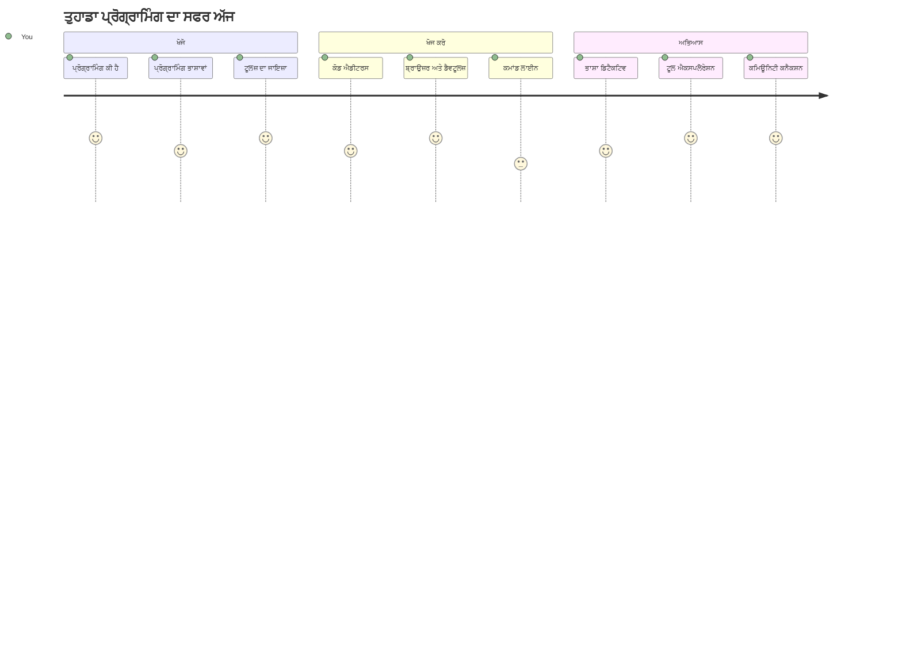
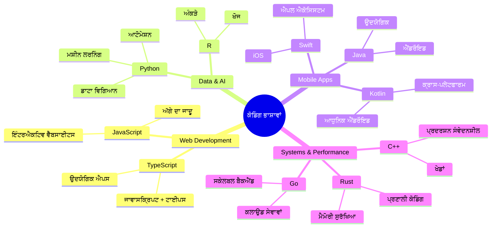
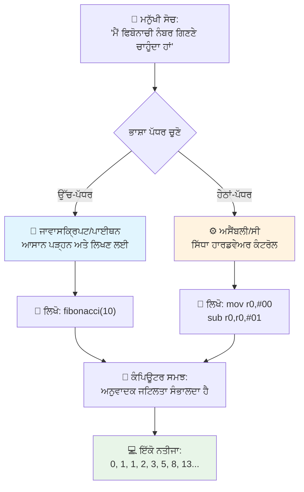
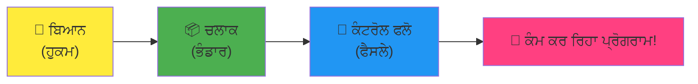
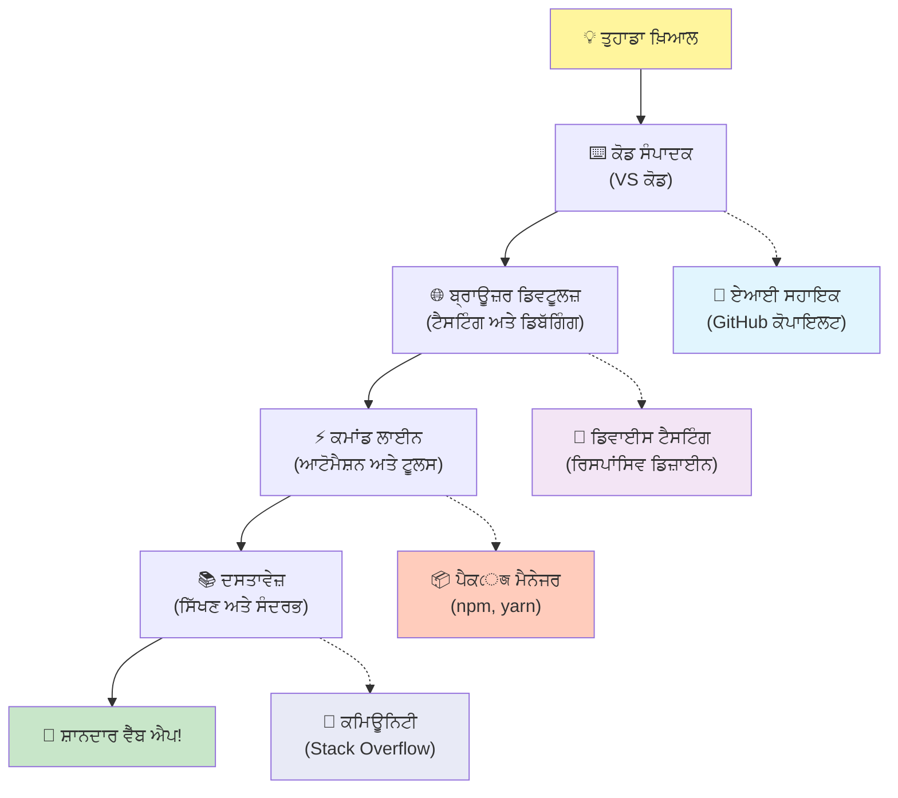
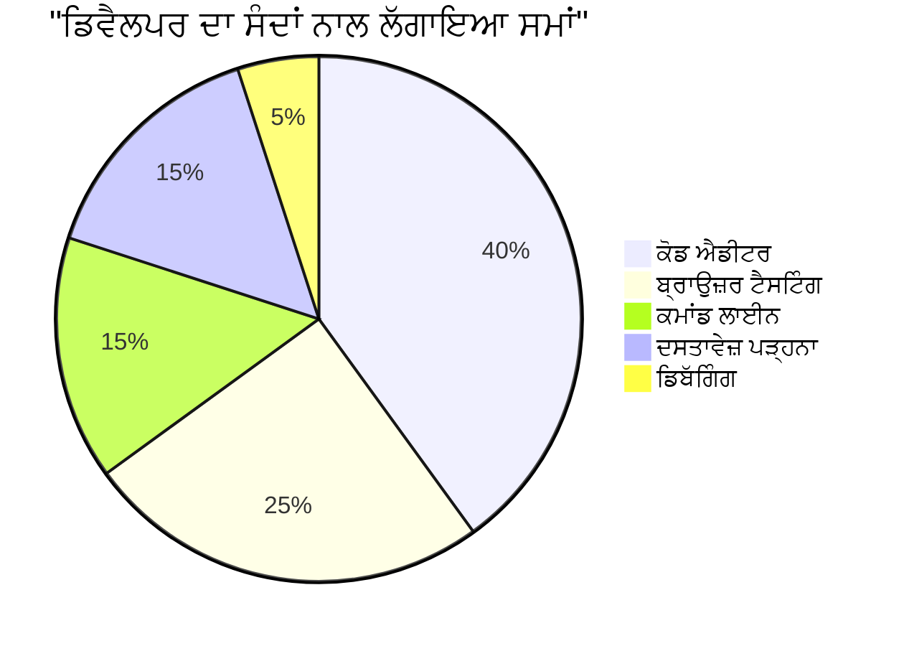
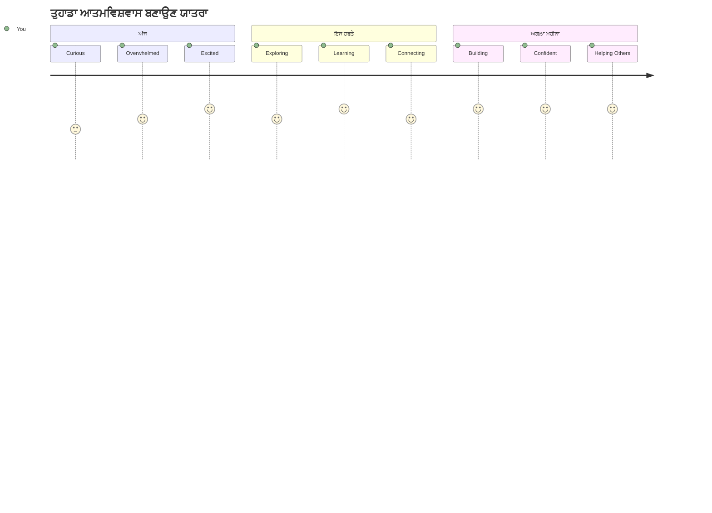

# ਪ੍ਰੋਗਰਾਮਿੰਗ ਭਾਸ਼ਾਵਾਂ ਅਤੇ ਆਧੁਨਿਕ ਡਿਵੈਲਪਰ ਟੂਲਾਂ ਦਾ ਪਰਿਚਇ
 
ਹੈਲੋ, ਭਵਿੱਖ ਦਾ ਡਿਵੈਲਪਰ! 👋 ਕੀ ਮੈਂ ਤੁਹਾਨੂੰ ਕੁਝ ਐਸਾ ਦੱਸਾਂ ਜੋ ਹਰ ਰੋਜ਼ ਮੈਨੂੰ ਸਿਰਮੌਰ ਕਰਦਾ ਹੈ? ਤੁਸੀਂ ਇਹ ਜਾਣਨ ਵਾਲੇ ਹੋ ਕਿ ਪ੍ਰੋਗਰਾਮਿੰਗ ਸਿਰਫ ਕੰਪਿਊਟਰਾਂ ਬਾਰੇ ਹੀ ਨਹੀਂ ਹੈ – ਇਹ ਆਪਣੇ ਸਭ ਤੋਂ ਜ਼ਬਰਦਸਤ ਖਿਆਲਾਂ ਨੂੰ ਜੀਵੰਤ ਕਰਨ ਵਾਸਤੇ ਅਸਲ ਦੀਆਂ ਸੂਪਰਪਾਵਰ ਹੋਣ ਬਾਰੇ ਹੈ!

ਤੁਹਾਨੂੰ ਉਹ ਲਹਜ਼ਾ ਪਤਾ ਹੈ ਜਦੋਂ ਤੁਸੀਂ ਆਪਣੀ ਮਨਪਸੰਦ ਐਪ ਵਰਤ ਰਹੇ ਹੋ ਅਤੇ ਸਭ ਕੁਝ ਬਿਲਕੁਲ ਸਹੀ ਢੰਗ ਨਾਲ ਕਲਿੱਕ ਹੋ ਜਾਂਦਾ ਹੈ? ਜਦੋਂ ਤੁਸੀਂ ਕਿਸੇ ਬਟਨ ਨੂੰ ਟੈਪ ਕਰਦੇ ਹੋ ਅਤੇ ਕੋਈ ਜਾਦੂਈ ਗੱਲ ਹੁੰਦੀ ਹੈ ਜਿਸ ਨੂੰ ਦੇਖ ਕੇ ਤੁਸੀਂ ਕਹਿੰਦੇ ਹੋ "ਵਾਹ, ਉਹਨਾਂ ਨੇ ਇਹ ਕਿਵੇਂ ਕੀਤਾ?" ਖੈਰ, ਕੋਈ ਇੰਝ ਜਿਹਾ ਹੀ ਸੀ – ਸ਼ਾਇਦ ਆਪਣੀ ਮਨਪਸੰਦ ਕੌਫੀ ਸ਼ਾਪ ’ਚ 2 ਵਜੇ ਤੀਜੀ ਐਸਪ੍ਰੈੱਸੋ ਪੀ ਰਹੇ ਹੋਂਦਿਆਂ – ਜਿਸਨੇ ਉਕੋਡ ਕੀਤਾ ਜੋ ਉਹ ਜਾਦੂ ਪੈਦਾ ਕਰਦਾ ਹੈ। ਅਤੇ ਇਹ ਗੱਲ ਤੁਹਾਨੂੰ ਹੈਰਾਨ ਕਰ ਦੇਵੇਗੀ: ਇਸ ਪਾਠ ਦੇ ਅੰਤ ਵਿੱਚ, ਤੁਸੀਂ ਸਮਝੋਂਗੇ ਕਿ ਉਹਨਾਂ ਨੇ ਇਹ ਕਿਵੇਂ ਕੀਤਾ, ਸਾਥ ਹੀ ਤੁਸੀਂ ਖੁਦ ਇਸਨੂੰ ਅਜ਼ਮਾਉਣ ਲਈ ਉਤਸ਼ੁਕ ਹੋ ਜਾਉਗੇ!

ਸुनੋ, ਮੈਨੂੰ ਪੂਰੀ ਤਰ੍ਹਾਂ ਸਮਝ ਹੈ ਕਿ ਹੁਣ ਪ੍ਰੋਗਰਾਮਿੰਗ ਤੁਹਾਨੂੰ ਭਿਆਨਕ ਲੱਗ ਸਕਦੀ ਹੈ। ਜਦੋਂ ਮੈਂ ਪਹਿਲੀ ਵਾਰੀ ਸ਼ੁਰੂ ਕੀਤਾ ਸੀ, ਮੈਨੂੰ ਅਸਲ ਵਿੱਚ ਲੱਗਦਾ ਸੀ ਕਿ ਤੁਹਾਨੂੰ ਕੋਈ ਗਣਿਤ ਦਾ ਜਾਦੂਗਰ ਹੋਣਾ ਚਾਹੀਦਾ ਹੈ ਜਾਂ ਤੁਸੀਂ ਪੰਜ ਸਾਲ ਦੀ ਉਮਰ ਤੋਂ ਕੋਡ ਕਰ ਰਹੇ ਹੋ। ਪਰ ਇਹ ਗੱਲ ਜੋ ਮੇਰੀ ਸੋਚ ਬਦਲ ਦਿੰਦੀ ਹੈ: ਪ੍ਰੋਗਰਾਮਿੰਗ ਬਿਲਕੁਲ ਵੱਖ-ਵੱਖ ਭਾਸ਼ਾ ਵਿੱਚ ਗੱਲਾਂ ਕਰਨ ਵਾਂਗ ਹੈ। ਤੁਸੀਂ "ਹੈਲੋ" ਅਤੇ "ਥੈਂਕ ਯੂ" ਨਾਲ ਸ਼ੁਰੂ ਕਰਦੇ ਹੋ, ਫਿਰ ਕੌਫੀ ਮੰਗਦੇ ਹੋ, ਅਤੇ ਜਲਦੀ ਹੀ ਤੂੰ ਗੰਭੀਰ ਦਰਸ਼ਨਿਕ ਚਰਚਾ ਕਰਦੇ ਹੋ! ਇਸ ਮਾਮਲੇ ਵਿੱਚ, ਤੁਸੀਂ ਕੰਪਿਊਟਰ ਨਾਲ ਗੱਲ ਕਰ ਰਹੇ ਹੋ, ਅਤੇ ਸਚ ਪੁੱਛੋ ਤਾਂ? ਉਹ ਸਭ ਤੋਂ ਧੀਰਜ ਵਾਲੇ ਗੱਲਬਾਤ ਕਰਤਾ ਹਨ ਜੋ ਤੁਸੀਂ ਕਦੇ ਵੱਖਰੀ ਦੇਖੋਗੇ – ਉਹ ਤੁਹਾਡੇ ਗਲਤੀਆਂ ਦਾ ਕਦੇ ਅੰਦਾਜ਼ਾ ਨਹੀਂ ਲਗਾਉਂਦੇ ਅਤੇ ਹਮੇਸ਼ਾ ਓਹ ਪੁੜਕਣ ਲਈ ਤੇਯਾਰ ਹੁੰਦੇ ਹਨ!

ਅੱਜ, ਅਸੀਂ ਉਹ ਸ਼ਾਨਦਾਰ ਟੂਲਾਂ ਦਾ ਪਤਾ ਲਗਾਣ ਜਾ ਰਹੇ ਹਾਂ ਜਿਹੜੇ ਆਧੁਨਿਕ ਵੈੱਬ ਵਿਕਾਸ ਨੂੰ ਨਾ ਸਿਰਫ ਸੰਭਵ ਬਣਾਉਂਦੇ ਹਨ, ਬਲਕਿ ਬੜੀ ਖੁਸ਼ੀਦਾਇਕ ਬਣਾਉਂਦੇ ਹਨ। ਮੈਂ ਉਹੀ ਠੀਕ ਸੋਫਟਵੇਅਰ ਐਡੀਟਰ, ਬ੍ਰਾਊਜ਼ਰ ਅਤੇ ਵਰਕਫਲੋਜ਼ ਦੀ ਗੱਲ ਕਰ ਰਿਹਾ ਹਾਂ ਜੋ Netflix, Spotify ਅਤੇ ਤੁਹਾਡੇ ਮਨਪਸੰਦ ਇੰਡੀ ਐਪ ਸਟੂਡਿਓ ਵਿੱਚ ਡਿਵੈਲਪਰ ਹਰੇਕ ਦਿਨ ਵਰਤਦੇ ਹਨ। ਅਤੇ ਇਹ ਗੱਲ ਤੁਹਾਨੂੰ ਖੁਸ਼ ਕਰ ਦੇਵੇਗੀ: ਜਿਆਦਾਤਰ ਇਹ ਪੇਸ਼ਾਵਰ ਦਰਜੇ ਦੇ, ਉਦਯੋਗ ਮਿਆਰੀ ਟੂਲ ਬਿਲਕੁਲ ਮੁਫ਼ਤ ਹਨ!


> ਸਕੇਚਨੋਟ by [Tomomi Imura](https://twitter.com/girlie_mac)


```mermaid
journey
    title ਤੁਹਾਡਾ ਪ੍ਰੋਗ੍ਰਾਮਿੰਗ ਦਾ ਸਫਰ ਅੱਜ
    section ਖੋਜੋ
      ਪ੍ਰੋਗ੍ਰਾਮਿੰਗ ਕੀ ਹੈ: 5: You
      ਪ੍ਰੋਗ੍ਰਾਮਿੰਗ ਭਾਸ਼ਾਵਾਂ: 4: You
      ਟੂਲਜ਼ ਦਾ ਜਾਇਜ਼ਾ: 5: You
    section ਖੋਜ ਕਰੋ
      ਕੋਡ ਐਡੀਟਰਸ: 4: You
      ਬ੍ਰਾਉਜ਼ਰ ਅਤੇ ਡੈਵਟੂਲਜ਼: 5: You
      ਕਮਾਂਡ ਲਾਈਨ: 3: You
    section ਅਭਿਆਸ
      ਭਾਸ਼ਾ ਡਿਟੈਕਟਿਵ: 4: You
      ਟੂਲ ਐਕਸਪਲੋਰੇਸ਼ਨ: 5: You
      ਕਮਿਊਨਿਟੀ ਕਨੈਕਸ਼ਨ: 5: You
```
## ਆਓ ਵੇਖੀਏ ਤੁਸੀਂ ਪਹਿਲਾਂ ਹੀ ਕੀ ਜਾਣਦੇ ਹੋ!

ਮਜ਼ੇਦਾਰ ਚੀਜ਼ਾਂ ਵਿੱਚ ਦਾਖਲ ਹੋਣ ਤੋਂ ਪਹਿਲਾਂ, ਮੈਂ ਦਿਲਚਸਪੀ ਰੱਖਦਾ ਹਾਂ – ਇਸ ਪ੍ਰੋਗਰਾਮਿੰਗ ਦੀ ਦੁਨੀਆ ਬਾਰੇ ਤੁਸੀਂ ਪਹਿਲਾਂ ਕੀ ਜਾਣਦੇ ਹੋ? ਤੇ ਵੇਖੋ, ਜੇ ਤੁਸੀਂ ਇਹ ਸવાલ ਵੇਖ ਕੇ ਸੋਚ ਰਹੇ ਹੋ "ਮੈਨੂੰ ਇਹ ਸਭ ਬਾਰੇ ਕੋਈ ਖਾਸ ਸਮਝ ਨਹੀਂ," ਤਾਂ ਇਹ ਨਾ ਸਿਰਫ ਠੀਕ ਹੈ, ਬਲਕਿ ਬਹੁਤ ਵਧੀਆ ਹੈ! ਇਹ ਮਤਲਬ ਹੈ ਕਿ ਤੁਸੀਂ ਠੀਕ ਜਗ੍ਹਾ ਤੇ ਹੋ। ਇਸ ਕਵਿਜ਼ ਨੂੰ ਵਰਕਆਉਟ ਤੋਂ ਪਹਿਲਾਂ ਸਟਰੇਚਿੰਗ ਵਾਂਗ ਸਮਝੋ – ਅਸੀਂ ਆਪਣੇ ਦਿਮਾਗੀ ਮਾਸਪੇਸ਼ੀਆਂ ਨੂੰ ਗਰਮ ਕਰਨ ਵਾਲੇ ਹਾਂ!

[ਪ्री-ਪਾਠ ਕਵਿਜ਼ ਲਓ](https://ff-quizzes.netlify.app/web/)


## ਸਾਥੀ ਮੁਹਿੰਮ ਜਿਸ ‘ਤੇ ਅਸੀਂ ਇਕੱਠੇ ਨਿਕਲ ਰਹੇ ਹਾਂ

ਠੀਕ ਹੈ, ਮੈਂ ਸੱਚਮੁੱਚ ਇਸ ਗੱਲ ਨਾਲ ਬੜੀ ਉਤਸ਼ਾਹਿਤ ਹਾਂ ਕਿ ਅਸੀਂ ਅੱਜ ਕੀ ਖੋਜ ਕਰਨ ਵਾਲੇ ਹਾਂ! ਵਿਚਾਰ ਕਰੋ, ਕਦੋਂ ਤੁਸੀਂ ਕਈ ਗੱਲਾਂ ਦੇ ਮਤਲਬ ਨੂੰ ਸਮਝੋਗੇ ਤਾਂ ਮੈਂ ਤੁਹਾਡੇ ਚਿਹਰੇ ਨੂੰ ਵੇਖਣਾ ਚਾਹੁੰਦਾ ਹਾਂ। ਅਸੀ ਇੱਕ ਸ਼ਾਨਦਾਰ ਯਾਤਰਾ ‘ਤੇ ਹਾਂ:

- **ਪ੍ਰੋਗਰਾਮਿੰਗ ਅਸਲ ਵਿੱਚ ਕੀ ਹੈ (ਅਤੇ ਇਹ ਕਿਉਂ ਸਭ ਤੋਂ ਕੂਲ ਚੀਜ਼ ਹੈ!)** – ਅਸੀਂ ਜਾਣਾਂਗੇ ਕਿ ਕੋਡ ਇਸ ਅਦ੍ਰਿਸ਼ਯ ਜਾਦੂ ਵਰਗਾ ਹੈ ਜੋ ਤੁਹਾਡੇ ਆਲੇ-ਦੁਆਲੇ ਹਰ ਚੀਜ਼ ਨੂੰ ਚਲਾਉਂਦਾ ਹੈ, ਉਸ ਆਲਾਰਮ ਤੋਂ ਲੈ ਕੇ ਜੋ ਸੋਮਵਾਰ ਦੀ ਸਵੇਰ ਨੂੰ ਜਾਣਦਾ ਹੈ, ਤੱਕ algorithm ਜੋ ਟਾਈਟ netflix ਦੀ ਸਿਫਾਰਿਸ਼ ਕਰਦਾ ਹੈ।
- **ਪ੍ਰੋਗਰਾਮਿੰਗ ਭਾਸ਼ਾਵਾਂ ਅਤੇ ਉਹਨਾਂ ਦੀਆਂ ਸ਼ਾਨਦਾਰ ਵਿਅਕਤਿਤਵਾਂ** – ਕਲਪਨਾ ਕਰੋ ਕਿ ਤੁਸੀਂ ਇੱਕ ਪਾਰਟੀ ਵਿੱਚ ਜਾ ਰਹੇ ਹੋ ਜਿੱਥੇ ਹਰ ਵਿਅਕਤੀ ਦੇ ਵੱਖਰੇ ਸੂਪਰਪਾਵਰ ਅਤੇ ਸਮੱਸਿਆਵਾਂ ਦੇ ਹੱਲ ਕਰਨ ਦੇ ਢੰਗ ਹਨ। ਪ੍ਰੋਗਰਾਮਿੰਗ ਭਾਸ਼ਾਵਾਂ ਦੀ ਦੁਨੀਆ ਇੰਝ ਹੀ ਹੈ, ਅਤੇ ਤੁਸੀਂ ਉਹਨਾਂ ਨੂੰ ਮਿਲ ਕੇ ਮਸਤੀ ਕਰੋਗੇ!
- **ਉਹ ਮੂਲਭੂਤ ਕੰਮ ਦਾ ਸਾਜੋ-ਸਮਾਨ ਜੋ ਡਿਜੀਟਲ ਜਾਦੂ ਪੈਦਾ ਕਰਦਾ ਹੈ** – ਇਹਨਾਂ ਨੂੰ ਸਭ ਤੋਂ ਸ਼ਾਨਦਾਰ ਬਣਾਉਣ ਵਾਲੇ LEGO ਸੈੱਟ ਵਾਂਗ ਸੋਚੋ। ਜਦ ਤੁਸੀਂ ਸਮਝ ਲਵੋਗੇ ਕਿ ਇਹ ਟੁਕੜੇ ਕਿਵੇਂ ਜੁੜਦੇ ਹਨ, ਤਾਂ ਤੁਸੀਂ ਕੁਝ ਵੀ ਬਣਾ ਸਕਦੇ ਹੋ ਜੋ ਤੁਸੀਂ ਕੱਲਪਨਾ ਕਰਦੇ ਹੋ।
- **ਉਦਯੋਗ-ਮਿਆਰੀ ਟੂਲ ਜਿਹੜੇ ਤੁਹਾਨੂੰ ਜਾਦੂਗਰ ਦੀ ਛੜੀ ਹੱਥ ਵਿੱਚ ਮਿਲੀ ਹੋਵੇ ਵਰਗਾ ਮਹਿਸੂਸ ਕਰਵਾਉਂਦੇ ਹਨ** – ਮੈਂ ਨਾਟਕ ਨਹੀਂ ਕਰ ਰਿਹਾ – ਇਹ ਟੂਲ ਵਾਸਤਵ ਵਿੱਚ ਤੁਹਾਨੂੰ ਜਾਦੂਗਰ ਬਣਾਉਂਦੇ ਹਨ, ਅਤੇ ਸਭ ਤੋਂ ਵਧੀਆ ਗੱਲ? ਇਹੋ ਜਿਹੇ ਟੂਲ ਉਹ ਹਨ ਜੋ ਪ੍ਰੋ ਬਣਾਂਦੇ ਨੇ!

> 💡 **ਇਹ ਗੱਲ ਯਾਦ ਰੱਖੋ**: ਅੱਜ ਸਾਰਾ ਕੁਝ ਯਾਦ ਕਰਨ ਦੀ ਕੋਸ਼ਿਸ਼ ਨਾ ਕਰੋ! ਅੱਜ ਮੈਂ ਸਿਰਫ ਇਹ ਚਾਹੁੰਦਾ ਹਾਂ ਕਿ ਤੁਸੀਂ ਸੰਭਾਵਨਾਵਾਂ ਦੇ ਬਾਰੇ ਉਤਸ਼ਾਹ ਮਹਿਸੂਸ ਕਰੋ। ਬਾਰਿਕੀਆਂ ਆਪੇ ਹੀ ਯਾਦ ਰਹਿਣਗੀਆਂ ਜਦ ਅਸੀਂ ਇਕੱਠੇ ਅਭਿਆਸ ਕਰਾਂਗੇ – ਅਸਲੀ ਸਿੱਖਿਆ ਇਹੀ ਹੈ!

> ਤੁਸੀਂ ਇਹ ਪਾਠ [Microsoft Learn](https://learn.microsoft.com/en-us/learn/modules/web-development-101/introduction-programming/?WT.mc_id=academic-77807-sagibbon) ’ਤੇ ਵੀ ਕਰ ਸਕਦੇ ਹੋ!

## ਤਾਂ ਪ੍ਰੋਗਰਾਮਿੰਗ ਅਸਲ ਵਿੱਚ ਕੀ ਹੈ?

ਚਲੋ, ਅਸਲੀ ਸਵਾਲ ਦਾ ਜਵਾਬ ਦਿੰਦੇ ਹਾਂ: ਪ੍ਰੋਗਰਾਮਿੰਗ ਕੀ ਹੈ?

ਮੈਂ ਤੁਹਾਨੂੰ ਇੱਕ ਕਹਾਣੀ ਦੱਸਾਂਗਾ ਜਿਸ ਨੇ ਮੇਰੀ ਸੋਚ ਬਦਲ ਦਿੱਤੀ। ਪਿਛਲੇ ਹਫਤੇ ਮੈਂ ਆਪਣੀ ਮਾਂ ਨੂੰ ਸਾਡਾ ਨਵਾਂ ਸਮਾਰਟ ਟੀਵੀ ਰਿਮੋਟ ਕਿਵੇਂ ਵਰਤਣਾ ਹੈ, ਸਮਝਾ ਰਿਹਾ ਸੀ। ਮੈਂ ਕਹਿੰਦਾ ਪਿਆ, "ਲਾਲ ਬਟਨ ਦਬਾਓ, ਪਰ ਵੱਡਾ ਲਾਲ ਨਹੀਂ, ਛੋਟਾ ਲਾਲ ਜੋ ਖੱਬੇ ਪਾਸੇ ਹੈ... ਨਹੀਂ, ਤੇਰਾ ਅੱਗਲਾ ਖੱਬਾ... ਠੀਕ ਹੈ, ਹੁਣ ਦੋ ਸਕਿੰਟ ਲਈ ਰੱਖੋ, ਇੱਕ ਨਹੀਂ, ਤਿੰਨ ਨਹੀਂ..." ਇਹ ਸੁਣ ਕੇ ਕੋਈ ਜਾਣਦਾ ਹੈ? 😅

ਇਹ ਹੀ ਪ੍ਰੋਗਰਾਮਿੰਗ ਹੈ! ਇਹ ਬਹੁਤ ਹੀ ਵਿਸਥਾਰਤ ਕਦਮ-ਬੰਦ-ਕਦਮ ਹਦਾਇਤਾਂ ਦੇਣ ਦੀ ਕਲਾ ਹੈ ਕੁਝ ਅੱਤਿਆਧੁਨਿਕ ਚੀਜ਼ ਨੂੰ, ਜਿਸ ਨੂੰ ਹਰ ਚੀਜ਼ ਬਿਲਕੁਲ ਠੀਕ ਢੰਗ ਨਾਲ ਸਮਝਾਉਣੀ ਪੈਂਦੀ ਹੈ। ਪਰਮਾਤਮਾ ਨੂੰ ਸਮਝਾਉਣ ਦੇ ਬਜਾਏ (ਜੋ ਪੁੱਛ ਸਕਦੀ ਹੈ "ਕਿਹੜਾ ਲਾਲ ਬਟਨ?!"), ਤੁਸੀਂ ਕੰਪਿਊਟਰ ਨੂੰ ਸਮਝਾ ਰਹੇ ਹੋ (ਜੋ ਬਿਲਕੁਲ ਉਹੀ ਕਰਦਾ ਹੈ ਜੋ ਤੁਸੀਂ ਕਹਿੰਦੇ ਹੋ, ਭਾਵੇਂ ਤੁਸੀਂ ਜੋ ਕਿਹਾ ਉਹੀ ਤੁਸੀਂ ਚਾਹੁੰਦੇ ਨਾ ਹੋਵੋ)।

ਜਦੋਂ ਮੈਂ ਇਹ ਸਿੱਖਿਆ ਸੀ, ਤਾਂ ਇਹ ਗੱਲ ਮੇਰੇ ਮਨ ਨੂੰ ਹਿਲਾ ਦੇਂਦੀ ਸੀ: ਕੰਪਿਊਟਰ ਅਸਲ ਵਿੱਚ ਬਹੁਤ ਸਧਾਰਨ ਹਨ। ਉਹ ਸਿਰਫ਼ ਦੋ ਗੱਲਾਂ ਸਮਝਦੇ ਹਨ – 1 ਅਤੇ 0, ਜੋ ਆਮ ਤੌਰ ‘ਤੇ "ਹਾਂ" ਅਤੇ "ਨਾ" ਜਾਂ "ਚਾਲੂ" ਅਤੇ "ਬੰਦ" ਨੂੰ ਦਰਸਾਉਂਦੇ ਹਨ। ਬੱਸ! ਪਰ ਜਾਦੂਦਾਰ ਗੱਲ ਇਹ ਹੈ ਕਿ ਸਾਨੂੰ 1 ਅਤੇ 0 ਵਿੱਚ ਗੱਲ ਕਰਨ ਦੀ ਲੋੜ ਨਹੀਂ ਹੈ ਜਿਵੇਂ 'ਦ ਮੈਟਰਿਕਸ' ਵਿੱਚ ਹੁੰਦਾ ਹੈ। ਇੱਥੇ ਆਉਂਦੇ ਹਨ **ਪ੍ਰੋਗਰਾਮਿੰਗ ਭਾਸ਼ਾਵਾਂ** ਜੋ ਤੁਹਾਡੇ ਸਮਾਨ ਜਗਤ ਦਾ ਸਭ ਤੋਂ ਵਧੀਆ ਅਨੁਵਾਦਕ ਹਨ ਜੋ ਤੁਹਾਡੇ ਸਧਾਰਣ ਵਚਨ ਨੂੰ ਕੰਪਿਊਟਰ ਦੀ ਭਾਸ਼ਾ ਵਿੱਚ ਬਦਲ ਦੇਂਦੇ ਹਨ।

ਅਤੇ ਇਹ ਗੱਲ ਹਰ ਸਵੇਰੇ ਮੈਨੂੰ ਹਿਲਾ ਦਿੰਦੀ ਹੈ: ਤੁਹਾਡੇ ਜੀਵਨ ਦੀ ਹਰ ਡਿਜੀਟਲ ਚੀਜ਼ ਕਿਸੇ ਤੇਰੇ ਵਰਗੇ ਹੀ ਕਿਸੇ ਨੇ ਸ਼ੁਰੂ ਕੀਤੀ ਸੀ, ਸ਼ਾਇਦ ਪੀਜਾਮੇ ਪਹਿਨੇ ਕੌਫੀ ਦਾ ਕੱਪ ਹੱਥ ਵਿੱਚ ਲੇ ਕੇ, ਆਪਣੇ ਲੈਪਟਾਪ ਤੇ ਕੋਡ ਟਾਈਪ ਕਰਦਾ। ਉਹ Instagram ਫਿਲਟਰ ਜੋ ਤੁਹਾਨੂੰ ਬੇਦਾਗ ਦਿਖਾਉਂਦਾ ਹੈ? ਕਿਸੇ ਨੇ ਕੋਡ ਕੀਤਾ। ਉਹ ਸਿਫਾਰਸ਼ ਜੋ ਤੁਹਾਨੂੰ ਤੇਰਾ ਮਨਪਸੰਦ ਗੀਤ ਸੁਣਾਇਆ? ਇੱਕ ਡਿਵੈਲਪਰ ਨੇ ਉਹ algorithm ਬਣਾਇਆ। ਉਹ ਐਪ ਜੋ ਤੁਹਾਨੂੰ ਦੋਸਤਾਂ ਨਾਲ ਬਿੱਲ ਵੰਡਣ ਵਿੱਚ ਮਦਦ ਕਰਦਾ? ਹਾਂ, ਕਿਸੇ ਨੇ ਸੋਚਿਆ "ਇਹ ਤੰਗ ਕਰਦਾ ਹੈ, ਮੈਂ ਇਹ ਠੀਕ ਕਰ ਸਕਦਾ ਹਾਂ" ਅਤੇ ਫਿਰ... ਕੀਤਾ!

ਜਦੋਂ ਤੁਸੀਂ ਪ੍ਰੋਗਰਾਮਿੰਗ ਸਿੱਖਦੇ ਹੋ, ਤਾਂ ਤੁਸੀਂ ਸਿਰਫ਼ ਨਵੀਂ ਯੋਗਤਾ ਨਹੀਂ ਹਾਸਲ ਕਰ ਰਹੇ, ਤੁਸੀਂ ਉਸ ਅਦਭੁਤ ਸਮੁਦਾਇ ਦਾ ਹਿੱਸਾ ਬਣ ਰਹੇ ਹੋ ਜੋ ਸਮੱਸਿਆਵਾਂ ਦਾ ਹੱਲ ਲੱਭਣ ਵਿੱਚ ਲੱਗਿਆ ਹੈ ਜੋ ਇਹ ਸੋਚਦੇ ਹਨ, "ਜੇ ਮੈਂ ਕੁਝ ਐਸਾ ਬਣਾ ਸਕਾਂ ਜੋ ਕਿਸੇ ਦਾ ਦਿਨ ਥੋੜ੍ਹਾ ਬਿਹਤਰ ਕਰ ਦੇਵੇ?" ਖ਼ਰਚੀ, ਕੀ ਇਸ ਤੋਂ ਕੂਲ ਕੁਝ ਹੋ ਸਕਦਾ ਹੈ?

✅ **ਮਜ਼ੇਦਾਰ ਤੱਥ ਖੋਜ**: ਜਦੋਂ ਤੁਹਾਡੇ ਕੋਲ ਕੁਝ ਖਾਲੀ ਸਮਾਂ ਹੋਵੇ ਤਾਂ ਇਹ ਗੱਲ ਵੇਖੋ – ਦੁਨੀਆ ਦਾ ਪਹਿਲਾ ਕੰਪਿਊਟਰ ਪ੍ਰੋਗਰਾਮਰ ਕੌਣ ਸੀ? ਮੈਂ ਤੁਹਾਨੂੰ ਸੰਕੇਤ ਦਿੰਦਾ ਹਾਂ: ਇਹ ਉਸ ਉਮੀਦ ਵਾਲੇ ਵਿਅਕਤੀ ਤੋਂ ਵੱਖਰਾ ਹੋ ਸਕਦਾ ਹੈ! ਉਸ ਵਿਅਕਤੀ ਦੀ ਕਹਾਣੀ ਬਹੁਤ ਦਿਲਚਸਪ ਹੈ ਅਤੇ ਦਰਸਾਉਂਦੀ ਹੈ ਕਿ ਪ੍ਰੋਗਰਾਮਿੰਗ ਸਦਾ ਹੀ ਰਚਨਾਤਮਕ ਸਮੱਸਿਆ ਹੱਲ ਅਤੇ ਨਵੇਂ ਤਰੀਕੇ ਸੋਚਣ ਬਾਰੇ ਰਹੀ ਹੈ।

### 🧠 **ਚੈਕ-ਇਨ ਸਮਾਂ: ਤੁਹਾਡੇ ਕੀ ਅਹਿਸਾਸ ਹਨ?**

**ਇੱਕ ਪਲ ਲਈ ਸੋਚੋ:**
- ਕੀ ਤੁਸੀਂ ਹੁਣ "ਕੰਪਿਊਟਰਾਂ ਨੂੰ ਹਦਾਇਤਾਂ ਦੇਣ" ਦਾ ਮਤਲਬ ਸਮਝਦੇ ਹੋ?
- ਕੀ ਤੁਸੀਂ ਕੋਈ ਰੋਜ਼ਾਨਾ ਕੰਮ ਸੋਚ ਸਕਦੇ ਹੋ ਜੋ ਤੁਸੀਂ ਪ੍ਰੋਗਰਾਮਿੰਗ ਨਾਲ ਸੁਚਾਰੂ ਬਣਾ ਸਕਦੇ ਹੋ?
- ਇਸ ਸਾਰੀ ਪ੍ਰੋਗਰਾਮਿੰਗ ਮਾਮਲੇ ਵਾਰੇ ਤੁਹਾਡੇ ਮਨ ਵਿੱਚ ਕਿਹੜੇ ਸਵਾਲ ਉੱਠ ਰਹੇ ਹਨ?

> **ਯਾਦ ਰੱਖੋ**: ਇਹ ਬਿਲਕੁਲ ਸਧਾਰਣ ਗੱਲ ਹੈ ਕਿ ਕੁਝ ਧਾਰਣਾਵਾਂ ਅਜੇ ਸਪਸ਼ਟ ਨਾ ਹੋਣ। ਪ੍ਰੋਗਰਾਮਿੰਗ ਸਿੱਖਣਾ ਨਵੀਂ ਭਾਸ਼ਾ ਸਿੱਖਣ ਵਾਂਗ ਹੈ – ਇਹ ਤੁਹਾਡੇ ਦਿਮਾਗ ਨੂੰ ਉਹ ਨਿਊਰਲ ਰਾਹ ਬਣਾਉਣ ਲਈ ਸਮਾਂ ਲੈਂਦਾ ਹੈ। ਤੁਸੀਂ ਬੜੀਆ ਕੰਮ ਕਰ ਰਹੇ ਹੋ!

## ਪ੍ਰੋਗਰਾਮਿੰਗ ਭਾਸ਼ਾਵਾਂ ਵੱਖ-ਵੱਖ ਜਾਦੂਆਂ ਦੇ ਸਵਾਦ ਵਾਂਗ ਹਨ

ਠੀਕ ਹੈ, ਇਹ ਅਜੀਬ ਲੱਗ ਸਕਦਾ ਹੈ ਪਰ ਮੇਰੇ ਨਾਲ ਰਹੋ – ਪ੍ਰੋਗਰਾਮਿੰਗ ਭਾਸ਼ਾਵਾਂ ਬਹੁਤ ਵੱਖਰੇ ਸੰਗੀਤ ਦੀਆਂ ਸ਼ੈਲੀਆਂ ਵਾਂਗ ਹਨ। ਸੋਚੋ ਕਿ ਤੁਹਾਡੇ ਕੋਲ ਜੈਜ਼ ਹੈ, ਜੋ ਸਹਜ ਅਤੇ ਇਮਪ੍ਰੋਵਾਈਜ਼ੇਸ਼ਨ ਵਾਲਾ ਹੈ, ਰਾਕ ਜੋ ਸ਼ਕਤੀਸ਼ਾਲੀ ਅਤੇ ਸਿੱਧਾ ਹੈ, ਕਲਾਸਿਕ ਜੋ ਸੁੰਦਰ ਅਤੇ ਸੰਰਚਿਤ ਹੈ ਅਤੇ ਹਿਪ-ਹੌਪ ਜੋ ਰਚਨਾਤਮਕ ਅਤੇ ਪ੍ਰਗਟਾਵਾ ਵਾਲਾ ਹੈ। ਹਰ ਸ਼ੈਲੀ ਦਾ ਆਪਣਾ ਮਹਿਸੂਸ, ਉਸਦਾ ਆਪਣੇ ਉਤਸ਼ਾਹੀ ਭਗਤਾਂ ਦਾ ਸਮੂਹ ਹੈ, ਅਤੇ ਹਰ ਇੱਕ ਮੁੱਖ ਵੱਖ-ਵੱਖ ਮੂਡ ਅਤੇ ਮੌਕਿਆਂ ਲਈ ਵਧੀਆ ਹੈ।

ਪ੍ਰੋਗਰਾਮਿੰਗ ਭਾਸ਼ਾਵਾਂ ਬਿਲਕੁਲ ਇਨ੍ਹਾਂ ਵਾਂਗ ਹੀ ਕੰਮ ਕਰਦੀਆਂ ਹਨ! ਤੁਸੀਂ ਇੱਕੋ ਭਾਸ਼ਾ ਨੂੰ ਇੱਕ ਮਜ਼ੇਦਾਰ ਮੋਬਾਇਲ ਖੇਡ ਬਣਾਉਣ ਲਈ ਵਰਤੋਂ ਵਿੱਚ ਨਹੀਂ ਲਿਆਉਗੇ ਜੋ ਤੁਸੀਂ ਵੱਡੇ ਪੱਧਰ ਦੇ ਕੁਲਿਤੀ ਡੇਟਾ ਦਾ ਹਿਸਾਬ ਕਿਤਾਬ ਕਰਨ ਲਈ ਵਰਤੋਂ ਹੋਵੇਗਾ, ਬਿਲਕੁਲ ਜਿਵੇਂ ਤੁਸੀਂ ਯੋਗਾ ਕਲਾਸ ਵਿੱਚ ਡੈਥ ਮੈਟਲ ਨਹੀਂ ਬਜਾਉਂਦੇ (ਅੱਛਾ, ਅਕਸਰ ਯੋਗਾ ਕਲਾਸਾਂ ਵਿੱਚ! 😄).

ਪਰ ਜੋ ਗੱਲ ਹਰ ਵਾਰੀ ਮੇਰੇ ਮਨ ਨੂੰ ਹਿਲਾ ਦਿੰਦੀ ਹੈ ਉਹ ਇਹ ਹੈ: ਇਹ ਭਾਸ਼ਾਵਾਂ ਤੁਹਾਡੇ ਬगल ਵਿੱਚ ਬੈਠੇ ਦੁਨੀਆ ਦੇ ਸਭ ਤੋਂ ਧੀਰਜਵਾਂ, ਬਹੁਤ ਤੇਜ਼ ਅਨੁਵਾਦਕ ਵਰਗੀ ਹਨ। ਤੁਸੀਂ ਆਪਣੇ ਮਨੁੱਖੀ ਦਿਮਾਗ ਲਈ ਸਵਭਾਵਿਕ ਢੰਗ ਨਾਲ ਆਪਣੇ ਵਿਚਾਰ ਪ੍ਰਗਟ ਕਰੋ, ਅਤੇ ਉਹ ਸਾਰਾ ਜਟਿਲ ਕੰਮ ਕਰਦੇ ਹਨ ਜੋ ਉਸਨੂੰ 1 ਅਤੇ 0 ਵਿੱਚ ਬਦਲ ਦੇਂਦਾ ਹੈ ਜੋ ਕੰਪਿਊਟਰ ਸੱਚਮੁਚ ਬੋਲਦੇ ਹਨ। ਇਹ ਬਿਲਕੁਲ ਉਹੋ ਜਿਹਾ ਹੈ ਜਿਵੇਂ ਕੋਈ ਦੋਸਤ ਜੋ "ਮਨੁੱਖੀ ਰਚਨਾਤਮਕਤਾ" ਅਤੇ "ਕੰਪਿਊਟਰ ਤਰਕ" ਦੋਹਾਂ ਵਿੱਚ ਪਰਫੈਕਟ ਫਲੂਐਂਟ ਹੋਵੇ – ਉਹ ਕਦੇ ਥੱਕਦੇ ਨਹੀਂ, ਕਦੇ ਕੌਫੀ ਬ੍ਰੇਕ ਨਹੀਂ ਲੈਂਦੇ ਅਤੇ ਉਹ ਕਦੇ ਤੁਹਾਡੇ ਮੈਂਪ੍ਰਸ਼ਨਾਂ ਦਾ ਦੋਹਰਾਅ ਕਰਨ ’ਤੇ ਨਿੱਡਰ ਨਹੀਂ ਹੁੰਦੇ!

### ਪ੍ਰਸਿੱਧ ਪ੍ਰੋਗਰਾਮਿੰਗ ਭਾਸ਼ਾਵਾਂ ਅਤੇ ਉਹਨਾਂ ਦੇ ਉਪਯੋਗ


```mermaid
mindmap
  root((ਕੋਡਿੰਗ ਭਾਸ਼ਾਵਾਂ))
    Web Development
      JavaScript
        ਅੱਗੇ ਦਾ ਜਾਦੂ
        ਇੰਟਰਐਕਟਿਵ ਵੈੱਬਸਾਈਟਸ
      TypeScript
        ਜਾਵਾਸਕ੍ਰਿਪਟ + ਟਾਈਪਸ
        ਉਦਯੋਗਿਕ ਐਪਸ
    Data & AI
      Python
        ਡਾਟਾ ਵਿਗਿਆਨ
        ਮਸ਼ੀਨ ਲਰਨਿੰਗ
        ਆਟੋਮੇਸ਼ਨ
      R
        ਅੰਕੜੇ
        ਖੋਜ
    Mobile Apps
      Java
        ਐਂਡਰੌਇਡ
        ਉਦਯੋਗਿਕ
      Swift
        iOS
        ਐਪਲ ਐਕੋਸਿਸਟਮ
      Kotlin
        ਆਧੁਨਿਕ ਐਂਡਰੌਇਡ
        ਕ੍ਰਾਸ-ਪਲੇਟਫਾਰਮ
    Systems & Performance
      C++
        ਖੇਡਾਂ
        ਪ੍ਰਦਰਸ਼ਨ ਸੰਵੇਦਨਸ਼ੀਲ
      Rust
        ਮੈਮੋਰੀ ਸੁਰੱਖਿਆ
        ਪ੍ਰਣਾਲੀ ਕੋਡਿੰਗ
      Go
        ਕਲਾਉਡ ਸੇਵਾਵਾਂ
        ਸਕੇਲਬਲ ਬੈਕਐਂਡ
```
| ਭਾਸ਼ਾ      | ਸਭ ਤੋਂ ਵਧੀਆ | ਕਿਉਂ ਇਹ ਪ੍ਰਸਿੱਧ ਹੈ                   |
|------------|---------------|--------------------------------------|
| **JavaScript** | ਵੈੱਬ ਵਿਕਾਸ, ਯੂਜ਼ਰ ਇੰਟਰਫੇਸ | ਬ੍ਰਾਊਜ਼ਰ ਵਿੱਚ ਚੱਲਦੀ ਹੈ ਅਤੇ ਇੰਟਰਐਕਟਿਵ ਵੈੱਬਸਾਈਟਸ ਚਲਾਉਂਦੀ ਹੈ |
| **Python**     | ਡੇਟਾ ਸਾਇੰਸ, ਆਟੋਮੇਸ਼ਨ, ਏਆਈ | ਪੜ੍ਹਨ ਅਤੇ ਸਿੱਖਣ ਵਿੱਚ آسان, ਸ਼ਕਤੀਸ਼ਾਲੀ ਲਾਇਬ੍ਰੇਰੀਜ਼ |
| **Java**       | ਐਨਟਰਪਰਾਈਜ਼ ਐਪਲੀਕੇਸ਼ਨ, ਐਂਡਰਾਇਡ ਐਪਸ | ਪਲੇਟਫੌਰਮ-ਅਜ਼ਾਦ, ਵੱਡੇ ਸਿਸਟਮਾਂ ਲਈ ਮਜ਼ਬੂਤ |
| **C#**         | ਵਿੰਡੋਜ਼ ਐਪਲੀਕੇਸ਼ਨ, ਗੇਮ ਡਿਵੈਲਪਮੈਂਟ | ਮਾਈਕ੍ਰੋਸਾਫਟ ਸਿਸਟਮਾਂ ਦਾ ਧਾਰਮਿਕ ਸਹਿਯੋਗ |
| **Go**         | ਕਲਾਉਡ ਸੇਵਾਵਾਂ, ਬੈਕਐਂਡ ਸਿਸਟਮ | ਤੇਜ਼, ਸਧਾਰਨ, ਆਧੁਨਿਕ ਕੰਪਿਊਟਿੰਗ ਲਈ डिजाइन ਕੀਤੀ ਗਈ |

### ਹਾਈ-ਲੈਵਲ ਵਸੁਲ ਲੋ-ਲੈਵਲ ਭਾਸ਼ਾਵਾਂ

ਠੀਕ ਹੈ, ਇਹ ਵਾਕਈ ਉਹ ਧਾਰਣਾ ਸੀ ਜੋ ਮੇਰਾ ਦਿਮਾਗ ਤੋੜਦਾ ਸੀ ਜਦੋਂ ਮੈਂ ਪਹਿਲੀ ਵਾਰੀ ਸਿੱਖ ਰਿਹਾ ਸੀ, ਇਸ ਲਈ ਮੈਂ ਉਹ ਉਦਾਹਰਨ ਸਾਂਝੀ ਕਰਾਂਗਾ ਜਿਸ ਨੇ ਮੈਨੂੰ ਇਹ ਸਮਝਾਇਆ – ਅਤੇ ਮੈਂ ਆਸ ਕਰਦਾ ਹਾਂ ਕਿ ਤੁਹਾਨੂੰ ਵੀ ਸਮਝ ਆਏਗੀ!

ਕਲਪਨਾ ਕਰੋ ਕਿ ਤੁਸੀਂ ਕਿਸੇ ਅਜਿਹੇ ਦੇਸ਼ ਵਿਚ ਜਾ ਰਹੇ ਹੋ ਜਿੱਥੇ ਤੁਸੀਂ ਭਾਸ਼ਾ ਨਹੀਂ ਬੋਲਦੇ ਅਤੇ ਤੁਹਾਨੂੰ ਬਹੁਤ ਜ਼ਰੂਰੀ ਹੈ ਕਿ ਸਭ ਤੋਂ ਨੇੜੇ ਵਾਲਾ ਬਾਥਰੂਮ ਕਿੱਥੇ ਹੈ (ਸਾਨੂੰ ਸਾਰਿਆਂ ਨੇ ਇਹ ਸੈਨ! 😅):

- **ਲੋ-ਲੇਵਲ ਪ੍ਰੋਗਰਾਮਿੰਗ** ਬਿਲਕੁਲ ਉਸ ਜਿਹੀ ਹੈ ਜਿਵੇਂ ਤੁਸੀਂ ਸਥਾਨਕ ਬੋਲੀ ਅਜਿਹੀ ਚੰਗੀ ਤਰ੍ਹਾਂ ਸਿੱਖ ਲئی ਹੈ ਕਿ ਤੁਸੀਂ ਫਲ ਵੇਚ ਰਹੀ ਦਾਦੀ ਨਾਲ ਬੜੀ ਗੱਲ-ਬਾਤ ਕਰ ਸਕਦੇ ਹੋ, ਜਿਸ ਵਿੱਚ ਸਾਂਝੇ ਸੱਭਿਆਚਾਰਕ ਹਵਾਲੇ, ਸਥਾਨਕ ਭਾਸ਼ਾਵਾਂ ਅਤੇ ਮਜ਼ਾਕ ਹਨ ਜੋ ਸਿਰਫ ਉਸ ਜਗ੍ਹਾ ਦੇ ਲੋਕ ਸਮਝਦੇ ਹਨ। ਬਹੁਤ ਪ੍ਰਭਾਵਸ਼ਾਲੀ ਅਤੇ ਬੇਹਦ ਪ੍ਰਭਾਵੀ... ਜੇ ਤੁਸੀਂ ਇਹ ਜਾਣਦੇ ਹੋ! ਪਰ ਬਾਥਰੂਮ ਲੱਭਣ ਸਮੇਂ ਇਹ ਉਲਝਣ ਵਾਲੀ ਗੱਲ ਹੋ ਸਕਦੀ ਹੈ।

- **ਹਾਈ-ਲੇਵਲ ਪ੍ਰੋਗਰਾਮਿੰਗ** ਉਸੇ ਜਿਹੀ ਹੈ ਜਿਵੇਂ ਤੁਹਾਡੇ ਕੋਲ ਕੋਈ ਸਥਾਨਕ ਦੋਸਤ ਹੋਵੇ ਜੋ ਤੁਹਾਡੇ ਮਤਲਬ ਨੂੰ ਸਮਝਦਾ ਹੋਵੇ। ਤੁਸੀਂ ਸਾਫ਼ ਅੰਗਰੇਜ਼ੀ ਵਿੱਚ ਕਹ ਸਕਦੇ ਹੋ "ਮੈਨੂੰ ਬਾਥਰੂਮ ਲੱਭਣਾ ਹੈ," ਅਤੇ ਉਹ ਸਾਰੇ ਸੱਭਿਆਚਾਰਕ ਅਨੁਵਾਦ ਕਰਦਾ ਹੈ ਅਤੇ ਤੁਹਾਡੇ ਲਈ ਛੇਤੀ ਤੇਸਰੀ ਸਮਝ ਵਾਲੇ ਹਵਾਲੇ ਦਿੰਦਾ ਹੈ।

ਪ੍ਰੋਗਰਾਮਿੰਗ ਦੇ ਟਰਮਾਂ ਵਿੱਚ:
- **ਲੋ-ਲੇਵਲ ਭਾਸ਼ਾਵਾਂ** (ਜਿਵੇਂ Assembly ਜਾਂ C) ਤੁਹਾਨੂੰ ਕੰਪਿਊਟਰ ਦੇ ਹਾਰਡਵੇਅਰ ਨਾਲ ਬਹੁਤ ਵਿਸਥਾਰਿਤ ਗੱਲਬਾਤ ਕਰਨ ਦੀ ਆਗਿਆ ਦਿੰਦੀਆਂ ਹਨ, ਪਰ ਤੁਹਾਨੂੰ ਮਸ਼ੀਨ ਵਿਚਾਰ ਕਰਨਾ ਪੈਂਦਾ ਹੈ, ਜੋ… ਚਲੋ ਕਹੀਏ ਇਹ ਇਕ ਵੱਡਾ ਮਨੋਵੈਜ্ঞানਿਕ ਬਦਲਾਅ ਹੈ!
- **ਹਾਈ-ਲੇਵਲ ਭਾਸ਼ਾਵਾਂ** (ਜਿਵੇਂ JavaScript, Python, ਜਾਂ C#) ਤੁਹਾਨੂੰ ਮਨੁੱਖੀ ਤਰ੍ਹਾਂ ਸੋਚਣ ਦਿੰਦੀਆਂ ਹਨ ਜਦੋਂਕਿ ਉਹ ਸਾਰੇ ਮਸ਼ੀਨੀ ਗੱਲਬਾਤਾਂ ਦਾ ਕੰਮ ਛੁਪੇ ਤਰੀਕੇ ਨਾਲ ਸਹਿਣ ਲੈਂਦੀਆਂ ਹਨ। ਇਨ੍ਹਾਂ ਦੇ ਕਮਿਊਨਿਟੀ ਬਹੁਤ ਸਹਿਯੋਗੀ ਹੁੰਦੇ ਹਨ ਜੋ ਯਾਦ ਰੱਖਦੇ ਹਨ ਕਿ ਨਵੇਂ ਸੀ ਕਿਵੇਂ ਮਹਿਸੂਸ ਕਰਦੇ ਹਨ ਅਤੇ ਸਾਫ਼ਦਿਲੀ ਨਾਲ ਮਦਦ ਕਰਨਾ ਚਾਹੁੰਦੇ ਹਨ!

ਸੋਚੋ ਮੈਂ ਤੁਹਾਨੂੰ ਕਿਹੜੀਆਂ ਭਾਸ਼ਾਵਾਂ ਨਾਲ ਸ਼ੁਰੂ ਕਰਨ ਦੀ ਸਲਾਹ ਦਿੰਦਾ ਹਾਂ? 😉 ਹਾਈ-ਲੈਵਲ ਭਾਸ਼ਾਵਾਂ ਉਹ ਪ੍ਰਸ਼ਿਖਣ ਵਾਹਨੇ ਵਰਗੀ ਹੁੰਦੀਆਂ ਹਨ ਜੋ ਤੁਸੀਂ ਕਦੇ ਨਹੀਂ ਹਟਾਉਂਦੇ ਕਿਉਂਕਿ ਉਹ ਸਾਰਾ ਅਨੁਭਵ ਬਹੁਤ ਹੀ ਆਸਾਨ ਅਤੇ ਮਨੋਹਰ ਬਣਾ ਦਿੱਂਦੀਆਂ ਹਨ!


```mermaid
flowchart TB
    A["👤 ਮਨੁੱਖੀ ਸੋਚ:<br/>'ਮੈਂ ਫਿਬੋਨਾਚੀ ਨੰਬਰ ਗਿਣਣੇ ਚਾਹੁੰਦਾ ਹਾਂ'"] --> B{ਭਾਸ਼ਾ ਪੱਧਰ ਚੁਣੋ}
    
    B -->|ਉੱਚ-ਪੱਧਰ| C["🌟 ਜਾਵਾਸਕ੍ਰਿਪਟ/ਪਾਈਥਨ<br/>ਆਸਾਨ ਪੜ੍ਹਨ ਅਤੇ ਲਿਖਣ ਲਈ"]
    B -->|ਹੇਠਾਂ-ਪੱਧਰ| D["⚙️ ਅਸੈਂਬਲੀ/ਸੀ<br/>ਸਿੱਧਾ ਹਾਰਡਵੇਅਰ ਕੰਟਰੋਲ"]
    
    C --> E["📝 ਲਿਖੋ: fibonacci(10)"]
    D --> F["📝 ਲਿਖੋ: mov r0,#00<br/>sub r0,r0,#01"]
    
    E --> G["🤖 ਕੰਪਿਊਟਰ ਸਮਝ:<br/>ਅਨੁਵਾਦਕ ਜਟਿਲਤਾ ਸੰਭਾਲਦਾ ਹੈ"]
    F --> G
    
    G --> H["💻 ਇੱਕੋ ਨਤੀਜਾ:<br/>0, 1, 1, 2, 3, 5, 8, 13..."]
    
    style C fill:#e1f5fe
    style D fill:#fff3e0
    style H fill:#e8f5e8
```
### ਆਓ ਮੈਂ ਤੁਹਾਨੂੰ ਦਿਖਾਵਾਂ ਕਿ ਹਾਈ-ਲੈਵਲ ਭਾਸ਼ਾਵਾਂ ਕਿਵੇਂ ਜ਼ਿਆਦਾ ਦੋਸਤਾਨਾ ਹੁੰਦੀਆਂ ਹਨ

ਠੀਕ ਹੈ, ਮੈਂ ਤੁਹਾਨੂੰ ਕੁਝ ਅਜਿਹਾ ਦੇਖਾਉਣ ਜਾ ਰਿਹਾ ਹਾਂ ਜੋ ਸਹੀ ਤਰ੍ਹਾਂ ਦਿਖਾਉਂਦਾ ਹੈ ਕਿ ਮੈਂ ਹਾਈ-ਲੈਵਲ ਭਾਸ਼ਾਵਾਂ ਨਾਲ ਕਿਵੇਂ ਪਿਆਰ ਕਰ ਬੈਠਿਆ, ਪਰ ਪਹਿਲਾਂ – ਤੁਸੀਂ ਮੈਨੂੰ ਇੱਕ ਵਾਅਦਾ ਕਰੋ। ਜਦੋਂ ਤੁਸੀਂ ਪਹਿਲਾ ਕੋਡ ਉਦਾਹਰਨ ਵੇਖੋਗੇ, ਤਾਂ ਘਬਰਾਓ ਨਹੀਂ! ਇਹ ਉਦਾਹਰਨ ਅਸਲ ਵਿੱਚ ਭਿਆਨਕ ਲੱਗਣ ਲਈ ਹੈ। ਇਹੀ ਗੱਲ ਮੈਂ ਦਰਸਾਉਂਣਾ ਚਾਹੁੰਦਾ ਹਾਂ!

ਅਸੀਂ ਇੱਕੋ ਕੰਮ ਨੂੰ ਦੋ ਬਿਲਕੁਲ ਵੱਖ-ਵੱਖ ਅੰਦਾਜ਼ਾਂ ਵਿੱਚ ਲਿਖਿਆ ਵੇਖਾਂਗੇ। ਦੋਵੇਂ Fibonacci ਕ੍ਰਮ ਬਣਾ ਰਹੇ ਹਨ – ਇਹ ਇੱਕ ਸੁੰਦਰ ਗਣਿਤੀਕ ਢਾਂਚਾ ਹੈ ਜਿਸ ਵਿੱਚ ਹਰ ਨੰਬਰ ਪਿਛਲੇ ਦੋ ਨੰਬਰਾਂ ਦਾ ਜੋੜ ਹੁੰਦਾ ਹੈ: 0, 1, 1, 2, 3, 5, 8, 13... (ਮਜ਼ੇਦਾਰ ਤੱਥ: ਤੁਸੀਂ ਇਹ ਪੈਟਰਨ ਵਿੱਚ ਕੁਦਰਤ ਵਿੱਚ ਹਰ ਥਾਂ ਲੱਭੋਗੇ – ਸੂਰਜਮੁਖੀ ਦੇ ਬੀਜ ਵਾਲੀਆਂ ਘੁੰਬਦੀਆਂ, ਚੀੜ ਦੇਸ਼ ਦੇ ਨਮੂਨੇ, ਅਤੇ ਗੈਲੈਕਸੀ ਦੇ ਬਣਤਰਾਂ ਵਿੱਚ!)

ਤਿਆਰ ਹੋ ਇਸ ਅੰਤਰ ਨੂੰ ਵੇਖਣ ਲਈ? ਚਲੋ ਚੱਲੀਏ!

**ਹਾਈ-ਲੈਵਲ ਭਾਸ਼ਾ (JavaScript) – ਮਨੁੱਖੀ-ਮਿੱਤਰ:**

```javascript
// ਕਦਮ 1: ਮੁਢਲਾ ਫਿਬੋਨਾਚੀ ਸੈਟਅਪ
const fibonacciCount = 10;
let current = 0;
let next = 1;

console.log('Fibonacci sequence:');
```

**ਇਹ ਕੋਡ ਕੀ ਕਰਦਾ ਹੈ:**
- **ਇੱਕ ਨਿਸ਼ਚਿਤ ਕਿੰਨ੍ਹਾ Fibonacci ਅੰਕ ਬਣਾਉਣ ਹਨ, ਇਹ ਦੱਸਣ ਲਈ ਇੱਕ constant ঘোষণা ਕਰੋ**
- **ਦੋ ਵਰिएਬਲਸ ਸ਼ੁਰੂ ਕਰੋ ਜੋ ਵਰਤਮਾਨ ਅਤੇ ਅੱਗਲੇ ਨੰਬਰ ਨੂੰ ਟਰੈਕ ਕਰਨਗੇ**
- **ਸ਼ੁਰੂਆਤੀ ਕੀਮਤਾਂ (0 ਅਤੇ 1) ਸੈੱਟ ਕਰੋ ਜੋ Fibonacci ਪੈਟਰਨ ਨੂੰ ਪਰਿਭਾਸ਼ਿਤ ਕਰਦੀਆਂ ਹਨ**
- **ਆਪਣੇ ਨਤੀਜੇ ਨੂੰ ਦਰਸਾਉਣ ਲਈ ਹੈਡਰ ਸੁਨੇਹਾ ਦਿਖਾਓ**

```javascript
// ਕਦਮ 2: ਲੂਪ ਨਾਲ ਕ੍ਰਮ ਤਿਆਰ ਕਰੋ
for (let i = 0; i < fibonacciCount; i++) {
  console.log(`Position ${i + 1}: ${current}`);
  
  // ਕ੍ਰਮ ਵਿੱਚ ਅਗਲਾ ਨੰਬਰ ਗਣਨਾ ਕਰੋ
  const sum = current + next;
  current = next;
  next = sum;
}
```

**ਅਤੇ ਇਹ ਜਿਹੜਾ ਹੁੰਦਾ ਹੈ:**
- **ਸਾਡੀ ਲੜੀ ਵਿੱਚ ਹਰ ਸਥਾਨ ਲਈ `for` ਲੂਪ ਚਲਾਓ**
- **ਹਰ ਨੰਬਰ ਨੂੰ ਉਸਦੀ ਸਥਿਤੀ ਦੇ ਨਾਲ template literal ਫਾਰਮੈਟ ਵਿੱਚ ਦਿਖਾਓ**
- **ਵਰਤਮਾਨ ਅਤੇ ਅਗਲੇ ਨੰਬਰਾਂ ਨੂੰ ਜੋੜ ਕੇ ਅਗਲਾ Fibonacci ਨੰਬਰ ਗਣਨਾ ਕਰੋ**
- **ਅਗਲੀ ਦੌੜ ਲਈ ਵਰੀਏਬਲਸ ਨੂੰ ਅਪਡੇਟ ਕਰੋ**

```javascript
// ਕਦਮ 3: ਆਧੁਨਿਕ ਕਾਰਯਕਾਰੀ ਪਹੁੰਚ
const generateFibonacci = (count) => {
  const sequence = [0, 1];
  
  for (let i = 2; i < count; i++) {
    sequence[i] = sequence[i - 1] + sequence[i - 2];
  }
  
  return sequence;
};

// ਵਰਤੋਂ ਦਾ ਉਦਾਹਰਨ
const fibSequence = generateFibonacci(10);
console.log(fibSequence);
```

**ਉਪਰਲੇ ਕੋਡ ਵਿੱਚ, ਅਸੀਂ:**
- **ਆਧੁਨਿਕ arrow function syntax ਵਰਤ ਕੇ ਇੱਕ ਪਾਠ ਬਣਾਉਂਦਾ ਕਾਰਜਕਾਰੀ function ਬਣਾਇਆ**
- **ਸਾਰੀ ਲੜੀ ਨੂੰ ਇੱਕ ਐਰੇ ਵਿੱਚ ਸਟੋਰ ਕੀਤਾ ਬਜਾਏ ਹਰ ਨੰਬਰ ਦਿਖਾਉਣ ਦੇ**
- **ਪਿਛਲੇ ਨੰਬਰਾਂ ਤੋਂ ਨਵਾਂ ਨੰਬਰ ਕੈਲਕੁਲੇਟ ਕਰਨ ਲਈ ਐਰੇ ਇੰਡੈਕਸਿੰਗ ਵਰਤੀ**
- **ਪੂਰੀ ਲੜੀ ਨੂੰ ਵਾਪਸ ਕੀਤਾ, ਜੋ ਸਾਡੀ ਕਾਰਜਕਾਰੀ ਦੇ ਹੋਰ ਹਿੱਸਿਆਂ ਵਿੱਚ ਵਰਤੀ ਜਾ ਸਕਦੀ ਹੈ**

**ਲੋ-ਲੇਵਲ ਭਾਸ਼ਾ (ARM Assembly) – ਕੰਪਿਊਟਰ-ਮਿੱਤਰ:**

```assembly
 area ascen,code,readonly
 entry
 code32
 adr r0,thumb+1
 bx r0
 code16
thumb
 mov r0,#00
 sub r0,r0,#01
 mov r1,#01
 mov r4,#10
 ldr r2,=0x40000000
back add r0,r1
 str r0,[r2]
 add r2,#04
 mov r3,r0
 mov r0,r1
 mov r1,r3
 sub r4,#01
 cmp r4,#00
 bne back
 end
```

ਤੁਸੀਂ ਦੇਖ ਸਕਦੇ ਹੋ ਕਿ ਜਾਵਾਸਕ੍ਰਿਪਟ ਵਰਜਨ ਲਗਭਗ ਅੰਗਰੇਜ਼ੀ ਹਦਾਇਤਾਂ ਵਾਂਗ ਪੜ੍ਹਦਾ ਹੈ, ਜਦਕਿ Assembly ਵਰਜਨ ਰਾਜ਼ਦਾਰ ਹੁਕਮਾਂ ਦਾ ਇਸਤੇਮਾਲ ਕਰਦਾਂ ਜੋ ਸਿੱਧਾ ਕੰਪਿਊਟਰ ਦੇ ਪ੍ਰੋਸੈਸਰ ਨੂੰ ਕંટ੍ਰੋਲ ਕਰਦਾ ਹੈ। ਦੋਹਾਂ ਨੇ ਇਕੋ ਕੰਮ ਕੀਤਾ, ਪਰ ਹਾਈ-ਲੈਵਲ ਭਾਸ਼ਾ ਮਨੁੱਖਾਂ ਲਈ ਸਮਝਣ, ਲਿਖਣ ਅਤੇ ਸੰਭਾਲਣ ਵਿੱਚ ਬਹੁਤ ਸੌਖੀ ਹੁੰਦੀ ਹੈ।

**ਤੁਹਾਨੂੰ ਜੋ ਮੁੱਖ ਅੰਤਰ ਨਜ਼ਰ ਆਉਂਦੇ ਹਨ:**
- **ਵਾਚੀਯਤਾ**: ਜਾਵਾਸਕ੍ਰਿਪਟ ਵਰਣਨਾਤਮਕ ਨਾਮ ਵਰਤਦਾ ਹੈ ਜਿਵੇਂ ਕਿ `fibonacciCount` ਜਦਕਿ ਐਸੈਂਬਲੀ ਰਾਜ਼ੀ ਨਾਂ ਜਿਵੇਂ `r0`, `r1` ਵਰਤਦਾ ਹੈ  
- **ਟਿੱਪਣੀਆਂ**: ਉੱਚ-ਸਤ੍ਹਰ ਦੀਆਂ ਭਾਸ਼ਾਵਾਂ ਵਿਆਖਿਆਤਮਕ ਟਿੱਪਣੀਆਂ ਦੀ ਹੌਂਸਲਾਬੱਦੀ ਕਰਦੀਆਂ ਹਨ ਜੋ ਕੋਡ ਨੂੰ ਖੁਦ-ਦਸਤਾਵੇਜ਼ ਬਣਾਉਂਦੀਆਂ ਹਨ  
- **ਸੰਰਚਨਾ**: ਜਾਵਾਸਕ੍ਰਿਪਟ ਦਾ ਤਰਕੀਬੀ ਪ੍ਰਵਾਹ ਇੰਨਾ ਸਵਭਾਵਿਕ ਹੈ ਜਿਵੇਂ ਮਨੁੱਖ ਸਮੱਸਿਆਵਾਂ ਨੂੰ ਕਦਮ-ਬੰਦ ਤਰੀਕੇ ਨਾਲ ਸੋਚਦੇ ਹਨ  
- **ਰਖ-ਰਖਾਵ**: ਵੱਖ-ਵੱਖ ਲੋੜਾਂ ਲਈ ਜਾਵਾਸਕ੍ਰਿਪਟ ਵਰਜਨ ਨੂੰ ਅਪਡੇਟ ਕਰਨਾ ਸਾਡੇ ਲਈ ਸਿਧਾ ਅਤੇ ਸਪਸ਼ਟ ਹੈ  

✅ **ਫਿਬੋਨਾਚੀ ਕ੍ਰਮ ਬਾਰੇ**: ਇਹ ਬਿਲਕੁਲ ਸੁੰਦਰ ਨੰਬਰਾਂ ਦਾ ਪੈਟਰਨ (ਜਿੱਥੇ ਹਰ ਨੰਬਰ ਪਿਛਲੇ ਦੋ ਨੰਬਰਾਂ ਦੇ ਜੋੜ ਦੇ ਬਰਾਬਰ ਹੁੰਦਾ ਹੈ: 0, 1, 1, 2, 3, 5, 8...) ਕੁਦਰਤ ਵਿੱਚ ਹਰੇਕ ਥਾਂ ਸੰਜੀਦਗੀ ਨਾਲ ਮਿਲਦਾ ਹੈ! ਤੁਸੀਂ ਇਹ ਸੂਰਜਮੁਖੀ ਦੇ ਸੁਤਰਾਂਵਾਂ, ਪਾਈਨਕੋਨ ਦੇ ਨਮੂਨੇ, ਨੌਟਿਲਸ ਖੋਲ੍ਹਾਂ ਦੇ ਮੁੜਨ ਦੇ ਤਰੀਕੇ ਅਤੇ ਦਰੱਖਤ ਦੀਆਂ ਸ਼ਾਖਾਂ ਦੀ ਵਧੌਤ ਵਿੱਚ ਵੀ ਦੇਖੋਗੇ। ਇਹ ਕਿਤਨਾ ਅਦਭੁਤ ਗੱਲ ਹੈ ਕਿ ਗਣਿਤ ਅਤੇ ਕੋਡ ਸਾਡੇ ਲਈ ਕੁਦਰਤੀ ਸੁੰਦਰਤਾ ਬਣਾਉਣ ਵਾਲੇ ਪੈਟਰਨ ਨੂੰ ਸਮਝਣ ਅਤੇ ਦੁਹਰਾਉਣ ਵਿੱਚ ਮਦਦ ਕਰ ਸਕਦੇ ਹਨ!  

## ਬਿਲਡਿੰਗ ਬਲਾਕ ਜੋ ਜਾਦੂ ਬਣਾਉਂਦੇ ਹਨ  

ਚਲੋ, ਹੁਣ ਜਦੋਂ ਤੁਸੀਂ ਦੇਖ ਚੁੱਕੇ ਹੋ ਕਿ ਪ੍ਰੋਗ੍ਰਾਮਿੰਗ ਭਾਸ਼ਾਵਾਂ ਅਮਲ ਵਿੱਚ ਕੀਹ ਲੱਗਦੀਆਂ ਹਨ, ਚਲੋ ਉਹ ਮੂਲਭੂਤ ਤੱਤ ਤੋੜਦੇ ਹਾਂ ਜੋ ਹਰੇਕ ਲਿਖੇ ਪ੍ਰੋਗ੍ਰਾਮ ਨੂੰ ਬਣਾਉਂਦੇ ਹਨ। ਇਹਨਾਂ ਨੂੰ ਆਪਣੇ ਮਨਪਸੰਦ ਰੇਸੀਪੀ ਦੇ ਜਰੂਰੀ ਸਮਗਰੀ ਜਿਵੇਂ ਸੋਚੋ – ਜਦੋਂ ਤੁਸੀਂ ਜਾਣ ਲਵੋਗੇ ਕਿ ਹਰ ਇੱਕ ਕੀ ਕਰਦਾ ਹੈ ਤਾਂ ਤੁਸੀਂ ਲਗਭਗ ਕਿਸੇ ਭਾਸ਼ਾ ਵਿੱਚ ਕੋਡ ਨੂੰ ਪੜ੍ਹ ਅਤੇ ਲਿਖ ਸਕੋਗੇ!  

ਇਹ ਕੁਝ ਇਸ ਤਰ੍ਹਾਂ ਹੈ ਜਿਵੇਂ ਤੁਸੀਂ ਪ੍ਰੋਗ੍ਰਾਮਿੰਗ ਦੀ ਵਿਸ਼ੇਸ਼ ਭਾਸ਼ਾ ਸਿਖ ਰਹੇ ਹੋ। ਸਕੂਲ ਵਿੱਚ ਜਦੋਂ ਤੁਸੀਂ ਨਾਂਉਂ, ਕਿਰਿਆਵਾਂ ਅਤੇ ਵਾਕਾਂ ਦੀ ਬਣਤਰ ਸਿੱਖੀ ਸੀ, ਤਾਂ ਇਹ ਵੀ ਉਸੇ ਤਰ੍ਹਾਂ ਪ੍ਰੋਗ੍ਰਾਮਿੰਗ ਦੀ ਆਪਣੀ ਗ੍ਰਾਮਰ ਹੈ, ਜੋ ਇੰਗਲਿਸ਼ ਦੀ ਗ੍ਰਾਮਰ ਨਾਲੋਂ ਕਾਫੀ ਜ਼ਿਆਦਾ ਤਰਕਸ਼ੀਲ ਅਤੇ ਮਾਫ਼ ਕਰਣ ਵਾਲੀ ਹੈ! 😄  

### ਬਿਆਨ: ਕਦਮ-ਬਦ ਕਦਮ ਨਿਰਦੇਸ਼  

ਆਓ **ਬਿਆਨਾਂ** ਨਾਲ ਸ਼ੁਰੂ ਕਰੀਏ – ਇਹ ਬਿਲਕੁਲ ਤੁਹਾਡੇ ਕੰਪਿਊਟਰ ਨਾਲ ਸਾਂਝੀ ਗੱਲਬਾਤ ਵਿੱਚ ਵਾਕਾਂ ਵਾਂਗ ਹਨ। ਹਰ ਬਿਆਨ ਕੰਪਿਊਟਰ ਨੂੰ ਇੱਕ ਖਾਸ ਕੰਮ ਕਰਨ ਲਈ ਕਹਿੰਦਾ ਹੈ, ਹੋਰ ਥਾਂ ਨਾਲ ਦਿਸ਼ਾ-ਨਿਰਦੇਸ਼ ਦੇਣ ਵਰਗਾ: "ਇੱਥੇ ਖੱਬੇ ਮੁੜੋ," "ਲਾਲ ਬੱਤੀ ਤੇ ਰੁਕੋ," "ਉਸ ਥਾਂ ਗੱਡੀ ਖੜੀ ਕਰੋ।"  

ਮੈਨੂੰ ਬਿਆਨਾਂ ਦੀ ਪੜ੍ਹਨਯੋਗਤਾ ਬਹੁਤ ਪਸੰਦ ਹੈ ਕਿਉਂਕਿ ਇਹ ਆਮ ਤੌਰ ਤੇ ਕਾਫੀ ਸਮਝਣਯੋਗ ਹੁੰਦੇ ਹਨ। ਏਹ ਵੇਖੋ:  

```javascript
// ਮੂਲ ਬਿਆਨ ਜੋ ਇਕੱਲੀ ਕਾਰਵਾਈ ਕਰਦੇ ਹਨ
const userName = "Alex";                    
console.log("Hello, world!");              
const sum = 5 + 3;                         
```
  
**ਇਹ ਕੋਡ ਕੀ ਕਰਦਾ ਹੈ:**  
- ਇੱਕ ਯੂਜ਼ਰ ਦੇ ਨਾਮ ਨੂੰ ਸਟੋਰ ਕਰਨ ਲਈ ਇੱਕ ਅਸਥਿਰ ਵੈਰੀਏਬਲ ਘੋਸ਼ਿਤ ਕਰੋ  
- ਕਨਸੋਲ ਆઉਟਪੁੱਟ ’ਤੇ ਸਲਾਮੀ ਸੁਨੇਹੁ ਦਿਖਾਓ  
- ਗਣਿਤੀ ਕਾਰਵਾਈ ਦਾ ਨਤੀਜਾ ਕੈਲਕੁਲੇਟ ਕਰੋ ਅਤੇ ਸਟੋਰ ਕਰੋ  

```javascript
// ਬਿਆਨ ਜੋ ਵੈੱਬ ਪੰਨਿਆਂ ਨਾਲ ਇੰਟਰਏਕਟ ਕਰਦੇ ਹਨ
document.title = "My Awesome Website";      
document.body.style.backgroundColor = "lightblue";
```
  
**ਕਦਮ-ਦਰ-ਕਦਮ ਇਹ ਹੋ ਰਿਹਾ ਹੈ:**  
- ਬਰਾਊਜ਼ਰ ਟੈਬ ਵਿੱਚ ਵੇਬਪੇਜ ਦਾ ਸਿਰਲੇਖ ਬਦਲੋ  
- ਪੂਰੇ ਪੇਜ ਬਾਡੀ ਦਾ ਪਿਛੋਕੜ ਰੰਗ ਬਦਲੋ  

### ਵੈਰੀਏਬਲ: ਤੁਹਾਡੇ ਪ੍ਰੋਗ੍ਰਾਮ ਦੀ ਯਾਦਦਾਸ਼ਤ ਪ੍ਰਣਾਲੀ  

ਠੀਕ ਹੈ, **ਵੈਰੀਏਬਲ** ਮੇਰੇ ਮਨਪਸੰਦ ਤੱਤਾਂ ਵਿੱਚੋਂ ਇੱਕ ਹਨ ਕਿਉਂਕਿ ਇਹ ਹਰ ਰੋਜ਼ ਵਰਤੇ ਜਾਂਦੇ ਚੀਜ਼ਾਂ ਵਾਂਗ ਹਨ!  

ਆਪਣੇ ਫੋਨ ਦੇ ਕਾਂਟੈਕਟ ਲਿਸਟ ਬਾਰੇ ਸੋਚੋ। ਤੁਸੀਂ ਹਰ ਕਿਸੇ ਦਾ ਨੰਬਰ ਯਾਦ ਨਹੀਂ ਰੱਖਦੇ – ਤੁਸੀਂ "ਮਾਂ," "ਸਭ ਤੋਂ ਚੰਗਾ ਮਿੱਤਰ," ਜਾਂ "ਉਹ ਪੀਜ਼ਾ ਵਾਲਾ ਜਿਹੜਾ ਰਾਤ 2 ਵਜੇ ਤੱਕ ਡਿਲਿਵਰੀ ਕਰਦਾ ਹੈ" ਵਰਗੇ ਨਾਮ ਸੇਵ ਕਰ ਲੈਂਦੇ ਹੋ ਅਤੇ ਫੋਨ ਅਸਲੀ ਨੰਬਰ ਯਾਦ ਰੱਖਦਾ ਹੈ। ਵੈਰੀਏਬਲ ਵੀ ਏਸੇ ਤਰ੍ਹਾਂ ਕੰਮ ਕਰਦੇ ਹਨ! ਇਹ ਲੇਬਲ ਕੀਤੇ ਹੋਏ ਕੰਟੇਨਰ ਵਾਂਗ ਹਨ ਜਿੱਥੇ ਤੁਹਾਡਾ ਪ੍ਰੋਗ੍ਰਾਮ ਜਾਣਕਾਰੀ ਸਟੋਰ ਕਰ ਸਕਦਾ ਹੈ ਅਤੇ ਬਾਅਦ ਵਿੱਚ ਉਸਨੂੰ ਇਕ ਸੂਚਿਤ ਨਾਮ ਨਾਲ ਪ੍ਰਾਪਤ ਕਰ ਸਕਦਾ ਹੈ।  

ਇਹ ਗੱਲ ਵਧੀਆ ਹੈ ਕਿ ਵੈਰੀਏਬਲ ਆਪਣੇ ਨੂੰ ਚਲਦੇ ਸਮੇਂ ਬਦਲ ਸਕਦੇ ਹਨ (ਇਸ ਲਈ ਨਾਮ "ਵੈਰੀਏਬਲ" ਰੱਖਿਆ ਗਿਆ ਹੈ – ਵੇਖੋ ਕਿਵੇਂ ਖੇਡ ਰਹੇ ਹਨ)। ਜਿਵੇਂ ਤੁਸੀਂ ਉਹ ਪੀਜ਼ਾ ਠੇਕਣਾ ਅਪਡੇਟ ਕਰਦੇ ਹੋ ਜਦ ਤੁਹਾਨੂੰ ਕੋਈ ਹੋਰ ਚੰਗਾ ਜਗ੍ਹਾ ਮਿਲ ਜਾਂਦੀ ਹੈ, ਵੈਰੀਏਬਲ ਵੀ ਪ੍ਰੋਗ੍ਰਾਮ ਵਿਚ ਨਵਾਂ ਡੇਟਾ ਆਉਣ ਜਾਂ ਹਾਲਾਤ ਬਦਲਣ ਤੇ ਅਪਡੇਟ ਹੁੰਦੇ ਹਨ!  

ਹੇਠਾਂ ਵਿਖਾਉਂਦਾ ਹਾਂ ਕਿ ਇਹ ਕਿਵੇਂ ਸੁੰਦਰ ਅਤੇ ਸਧਾਰਨ ਹੋ ਸਕਦਾ ਹੈ:  

```javascript
// ਕਦਮ 1: ਮੁਢਲੀ ਵੈਰੀਏਬਲ ਬਣਾਉਣਾ
const siteName = "Weather Dashboard";        
let currentWeather = "sunny";               
let temperature = 75;                       
let isRaining = false;                      
```
  
**ਇਹ ਅਸੂਲ ਸਮਝੋ:**  
- `const` ਵੈਰੀਏਬਲਾਂ ਵਿੱਚ ਅਟੱਲ ਮੁੱਲ ਸਟੋਰ ਕਰੋ (ਜਿਵੇਂ ਸਾਈਟ ਦਾ ਨਾਮ)  
- `let` ਦਾ ਉਪਯੋਗ ਕਰੋ ਉਹ ਮੁੱਲ ਜਿਹੜੇ ਤੁਹਾਡੇ ਪ੍ਰੋਗ੍ਰਾਮ ਵਿੱਚ ਬਦਲ ਸਕਦੇ ਹਨ  
- ਵੱਖ ਵੱਖ ਡਾਟਾ ਕਿਸਮਾਂ ਨਿਰਧਾਰਿਤ ਕਰੋ: ਸਤਰਾਂ (ਟੈਕਸਟ), ਸੰਖਿਆਵਾਂ ਅਤੇ ਬੂਲੀਅਨ (ਸੱਚ/ਝੂਠ)  
- ਵਿਆਖਿਆਤਮਕ ਨਾਮ ਚੁਣੋ ਜੋ ਦੱਸਣ ਕਿ ਹਰ ਵੈਰੀਏਬਲ ਵਿੱਚ ਕੀ ਹੈ  

```javascript
// ਕਦਮ 2: ਸੰਬੰਧਤ ਡਾਟਾ ਨੂੰ ਇਕੱਠਾ ਕਰਨ ਲਈ ਆਬਜੈਕਟਾਂ ਨਾਲ ਕੰਮ ਕਰਨਾ
const weatherData = {                       
  location: "San Francisco",
  humidity: 65,
  windSpeed: 12
};
```
  
**ਉੱਪਰ ਦਿੱਤਾ ਗਿਆ:**  
- ਇੱਕ ਓਬਜੈਕਟ ਬਣਾਇਆ ਜੋ ਸਬੰਧਤ ਮੌਸਮੀ ਜਾਣਕਾਰੀ ਨੂੰ ਇਕੱਠਾ ਕਰਦਾ ਹੈ  
- ਕਈ ਜਾਣਕਾਰੀ ਨੂੰ ਇੱਕ ਵੈਰੀਏਬਲ ਨਾਮ ਹੇਠ ਇਕਟਠਾ ਕੀਤਾ  
- ਲੇਬਲ ਕਰਨ ਲਈ ਕੀ-ਮੁੱਲ ਜੋੜਾਂ ਦੀ ਵਰਤੋਂ ਕੀਤੀ  

```javascript
// ਕਦਮ 3: ਵేరੀਏਬਲ ਵਰਤੋਂ ਅਤੇ ਅਪਡੇਟ ਕਰਨਾ
console.log(`${siteName}: Today is ${currentWeather} and ${temperature}°F`);
console.log(`Wind speed: ${weatherData.windSpeed} mph`);

// ਬਦਲਣਯੋਗ ਵేరੀਏਬਲ ਨੂੰ ਅਪਡੇਟ ਕਰਨਾ
currentWeather = "cloudy";                  
temperature = 68;                          
```
  
**ਹਰੇਕ ਹਿੱਸੇ ਨੂੰ ਸਮਝੋ:**  
- ਇੰਫੋ ਲਈ ਟੈਂਪਲੇਟ ਲਿਟਰਲ `${}` ਸਿੰਟੈਕਸ ਨਾਲ ਜਾਣਕਾਰੀ ਦਿਖਾਓ  
- ਡਾਟ ਨੋਟੇਸ਼ਨ (`weatherData.windSpeed`) ਨਾਲ ਓਬਜੈਕਟ ਦੀਆਂ ਸੰਪਤੀਆਂ ਨੂੰ ਐਕਸੈੱਸ ਕਰੋ  
- ਬਦਲ ਸਕਣ ਵਾਲੇ `let` ਵੈਰੀਏਬਲ ਬਦਲੋ ਤਸ਼ਦੀਕ ਲਈ  
- ਅਰਥਪੂਰਨ ਸੁਨੇਹੇ ਬਣਾਉਣ ਲਈ ਕਈ ਵੈਰੀਏਬਲ ਮਿਲਾਓ  

```javascript
// ਕਦਮ 4: ਸਾਫ ਸੂਥਰੇ ਕੋਡ ਲਈ ਆਧੁਨਿਕ ਵਿਘਟਨ
const { location, humidity } = weatherData; 
console.log(`${location} humidity: ${humidity}%`);
```
  
**ਤੁਹਾਨੂੰ ਕੀ ਜਾਣਨਾ ਚਾਹੀਦਾ ਹੈ:**  
- ਵਿਖੰਡਨ ਅਸਾਈਨਮੈਂਟ ਨਾਲ ਓਬਜੈਕਟਾਂ ਤੋਂ ਖਾਸ ਸੰਪਤੀਆਂ ਕੱਢੋ  
- ਓਬਜੈਕਟ ਕੀ ਕੀ ਜਾਂਨਾਂ ਵਾਂਗ ਖੁਦ-ਬ-ਖੁਦ ਨਵਾਂ ਵੈਰੀਏਬਲ ਬਣਾਓ  
- ਡਾਟ ਨੋਟੇਸ਼ਨ ਬਾਰੰਬਾਰ ਕਰਨ ਤੋਂ ਬਚਾਉਣ ਨਾਲ ਕੋਡ ਸੀਧਾ ਕਰੋ  

### ਕੰਟਰੋਲ ਫਲੋ: ਆਪਣੇ ਪ੍ਰੋਗ੍ਰਾਮ ਨੂੰ ਸੋਚਣਾ ਸਿਖਾਉਣਾ  

ਠੀਕ ਹੈ, ਇੱਥੇ ਪ੍ਰੋਗ੍ਰਾਮਿੰਗ ਬਿਲਕੁਲ ਅਤੇ ਬਿਲਕੁਲ ਮਨ ਨੂੰ ਘੇਰ ਲੈਣ ਵਾਲੀ ਹੋ ਜਾਂਦੀ ਹੈ! **ਕੰਟਰੋਲ ਫਲੋ** ਹੈ ਉਹ ਤਰੀਕਾ ਜਿਸ ਨਾਲ ਤੁਸੀਂ ਆਪਣੇ ਪ੍ਰੋਗ੍ਰਾਮ ਨੂੰ ਸਮਾਰਟ ਫ਼ੈਸਲੇ ਕਰਨਾ ਸਿਖਾਉਂਦੇ ਹੋ, ਜਿਵੇਂ ਤੁਸੀਂ ਹਰ ਰੋਜ਼ ਬਿਨਾਂ ਸੋਚੇ ਕੀਤਾ ਕਰੋ।  

ਕਲਪਨਾ ਕਰੋ: ਸਵੇਰੇ ਤੁਸੀਂ ਸੋਚਿਆ "ਜੇ ਬਾਰਿਸ਼ ਹੋ ਰਹੀ ਹੈ ਤਾਂ ਛਤਰੀ ਲਵਾਂਗਾ। ਜੇ ਠੰਢ ਹੈ ਤਾਂ ਜੈਕਟ ਪਹਿਨਾਂਗਾ। ਜੇ ਦੇਰ ਹੋ ਰਹੀ ਹੈ ਤਾਂ ਨਾਸ਼ਤਾ ਛੱਡ ਕੇ ਕੌਫੀ ਲਵਾਂਗਾ।" ਤੁਹਾਡਾ ਦਿਮਾਗ ਹਰ ਰੋਜ਼ ਇਸ ਤਰ੍ਹਾਂ ਦੀ 'ਜੇ-ਤਦ' ਤਰਕਸੰਗਤ ਲਾਜਿਕ ਕਈ ਵਾਰ ਅਮਲ ਕਰਦਾ ਹੈ!  

ਇਹੀ ਕਾਰਨ ਹੈ ਕਿ ਪ੍ਰੋਗ੍ਰਾਮ ਭੁੱਲੋ-ਭੁੱਲਾਈ ਸਮਝਦਾਰ ਅਤੇ ਜ਼ਿੰਦਾ ਮਹਿਸੂਸ ਹੁੰਦੇ ਹਨ ਨਾ ਕਿ ਕੋਈ ਇਕ ਰੁਟੀਨੀ ਕਥਾ ਬਣਾ ਕੇ ਦਿਓ। ਇਹ ਹਾਲਾਤ ਨੂੰ ਦੇਖ ਸਕਦੇ ਹਨ, ਮੂਲਾਂਕਣ ਕਰ ਸਕਦੇ ਹਨ, ਅਤੇ ਉਚਿਤ ਜਵਾਬ ਦੇ ਸਕਦੇ ਹਨ। ਇਹ ਤੁਹਾਡੇ ਪ੍ਰੋਗ੍ਰਾਮ ਨੂੰ ਇੱਕ ਅਜਿਹਾ ਦਿਮਾਗ ਦਿੰਦਾ ਹੈ ਜੋ ਅਨੁਕੂਲਨ ਅਤੇ ਚੋਣਾਂ ਕਰ ਸਕਦਾ ਹੈ!  

ਚਾਹੁੰਦੇ ਹੋ ਵੇਖਣਾ ਕਿ ਇਹ ਕਿਵੇਂ ਸੁੰਦਰ ਤਰੀਕੇ ਨਾਲ ਕੰਮ ਕਰਦਾ ਹੈ? ਮੈਨੂੰ ਦਿਖਾਉਣ ਦਿਓ:  

```javascript
// ਕਦਮ 1: ਮੂਲ ਸ਼ਰਤੀ ਤਰਕ
const userAge = 17;

if (userAge >= 18) {
  console.log("You can vote!");
} else {
  const yearsToWait = 18 - userAge;
  console.log(`You'll be able to vote in ${yearsToWait} year(s).`);
}
```
  
**ਇਹ ਕੋਡ ਕੀ ਕਰਦਾ ਹੈ:**  
- ਜਾਂਚ ਕਰਦਾ ਹੈ ਕਿ ਯੂਜ਼ਰ ਦੀ ਉਮਰ ਵੋਟਿੰਗ ਦੀ ਯੋਗਤਾ ਨੂੰ ਪੂਰਾ ਕਰਦੀ ਹੈ  
- ਸਥਿਤੀ ਦੇ ਨਤੀਜੇ ਅਨੁਸਾਰ ਵੱਖਰੇ ਕੋਡ ਬਲਾਕ ਚਲਾਉਂਦਾ ਹੈ  
- 18 ਤੋਂ ਘੱਟ ਹਲਾਤ ਵਿੱਚ ਵੋਟਿੰਗ ਅਧਿਕਾਰ ਤੱਕ ਕਿੰਨੀ ਦੇਰ ਹੈ ਕੈਲਕੁਲੇਟ ਕਰਦਾ ਹੈ ਅਤੇ ਦਿਖਾਉਂਦਾ ਹੈ  
- ਹਰ ਸਥਿਤੀ ਲਈ ਖਾਸ ਅਤੇ ਮਦਦਗਾਰ ਫੀਡਬੈਕ ਪ੍ਰਦਾਨ ਕਰਦਾ ਹੈ  

```javascript
// ਕਦਮ 2: ਤਰਕਿਕ ਓਪਰੇਟਰਾਂ ਨਾਲ ਕਈ ਸ਼ਰਤਾਂ
const userAge = 17;
const hasPermission = true;

if (userAge >= 18 && hasPermission) {
  console.log("Access granted: You can enter the venue.");
} else if (userAge >= 16) {
  console.log("You need parent permission to enter.");
} else {
  console.log("Sorry, you must be at least 16 years old.");
}
```
  
**ਇੱਥੇ ਕੀ ਹੋ ਰਿਹਾ ਹੈ:**  
- ਕਈ ਸਥਿਤੀਆਂ ਨੂੰ `&&` (ਅਤੇ) ਓਪਰੇਟਰ ਨਾਲ ਜੋੜਦਾ ਹੈ  
- ਕਈ ਹਾਲਾਤਾਂ ਲਈ `else if` ਨਾਲ ਸਥਿਤੀ ਦੀ ਸ਼੍ਰੇਣੀ ਬਣਾਉਂਦਾ ਹੈ  
- ਸਭ ਸੰਭਾਵਿਤ ਹਾਲਾਤਾਂ ਨੂੰ ਇੱਕ ਆਖਰੀ `else` ਨਾਲ ਸੰਭਾਲਦਾ ਹੈ  
- ਹਰ ਵੱਖਰੀ ਸਥਿਤੀ ਲਈ ਸਪਸ਼ਟ ਫੀਡਬੈਕ ਦਿੰਦਾ ਹੈ  

```javascript
// ਕਦਮ 3: ਤਿਨ-ਅਪਰੇਟਰ ਨਾਲ ਸੰਖੇਪ ਸਥਿਤੀਕਸ਼ਰ
const votingStatus = userAge >= 18 ? "Can vote" : "Cannot vote yet";
console.log(`Status: ${votingStatus}`);
```
  
**ਸਮਝਣ ਦੀ ਗੱਲ:**  
- ਆਸਾਨ ਦੋ-ਵਿਕਲਪ ਵਾਲੀਆਂ ਸਥਿਤੀਆਂ ਲਈ ਟਰਨਰੀ ਓਪਰੇਟਰ (`? :`) ਨਾਲ ਵਰਤੋਂ ਕਰੋ  
- ਪਹਿਲਾਂ ਸਥਿਤੀ ਲਿਖੋ, ਫਿਰ `?`, ਫਿਰ ਸੱਚ ਨਤੀਜਾ, ਫਿਰ `:`, ਫਿਰ ਝੂਠ ਨਤੀਜਾ  
- ਜਦ ਤੁਹਾਨੂੰ ਸਥਿਤੀ ਅਨੁਸਾਰ ਮੁੱਲ ਨਿਰਧਾਰਤ ਕਰਨੇ ਹੋਣ ਤਦ ਇਹ ਪੈਟਰਨ ਵਰਤੋਂ  

```javascript
// ਕਦਮ 4: ਕਈ ਵਿਸ਼ੇਸ਼ ਮਾਮਲਿਆਂ ਨੂੰ ਸੰਭਾਲਣਾ
const dayOfWeek = "Tuesday";

switch (dayOfWeek) {
  case "Monday":
  case "Tuesday":
  case "Wednesday":
  case "Thursday":
  case "Friday":
    console.log("It's a weekday - time to work!");
    break;
  case "Saturday":
  case "Sunday":
    console.log("It's the weekend - time to relax!");
    break;
  default:
    console.log("Invalid day of the week");
}
```
  
**ਇਹ ਕੋਡ ਇਹ ਕਰਦਾ ਹੈ:**  
- ਵੈਰੀਏਬਲ ਦੇ ਮੁੱਲ ਨੂੰ ਕਈ ਵਿਸ਼ੇਸ਼ ਕੇਸਾਂ ਨਾਲ ਮੈਚ ਕਰਦਾ ਹੈ  
- ਸਮਾਨ ਕੇਸਾਂ ਨੂੰ ਇਕੱਠਾ ਕਰਦਾ ਹੈ (ਹਫਤੇ ਦੇ ਦਿਨਾਂ ਅਤੇ ਹਫਤੇ ਦੇ ਅੰਤ)  
- ਮੈਚ ਮਿਲਣ ਤੇ ਉਚਿਤ ਕੋਡ ਚਲਾਉਂਦਾ ਹੈ  
- ਅਣਉਮੀਦ ਮੁੱਲਾਂ ਲਈ `default` ਕੇਸ ਸ਼ਾਮਲ ਕਰਦਾ ਹੈ  
- ਅਗਲੇ ਕੇਸ 'ਤੇ ਨਾ ਜਾਣ ਲਈ `break` ਬਿਆਨ ਵਰਤਦਾ ਹੈ  

> 💡 **ਅਸਲੀ ਜ਼ਿੰਦਗੀ ਦੀ ਉਦਾਹਰਣ**: ਕੰਟਰੋਲ ਫਲੋ ਨੂੰ ਇਹੋ ਜਿਹਾ ਸੋਚੋ ਜਿਵੇਂ ਦੁਨੀਆ ਦਾ ਸਭ ਤੋਂ ਧੀਰਜਵਾਨ GPS ਤੁਹਾਨੂੰ ਰਸਤੇ ਦਿਖਾ ਰਿਹਾ ਹੈ। "ਜੇ ਮੇਨ ਸਟ੍ਰੀਟ ਤੇ ਟ੍ਰੈਫਿਕ ਹੈ ਤਾਂ ਹਾਈਵੇ ਤੇ ਜਾਓ। ਜੇ ਹਾਈਵੇ ਬੰਦ ਹੈ ਤਾਂ ਖੂਬਸੂਰਤ ਰਸਤਾ ਲਵੋ।" ਪ੍ਰੋਗ੍ਰਾਮ ਵੀ ਅਗਲੇ ਸਥਿਤੀਆਂ ਲਈ ਇਸ ਤਰ੍ਹਾਂ ਦੀ ਸ਼ਰਤੀ ਲਾਜਿਕ ਵਰਤਕੇ ਸਮਾਰਟ ਜਵਾਬ ਦਿੰਦੇ ਹਨ ਅਤੇ ਸਦੀਵ ਅਨੁਭਵ ਬਿਹਤਰ ਬਣਾਉਂਦੇ ਹਨ।  

### 🎯 **ਅਸੂਲਾਂ ਦੀ ਜਾਂਚ: ਬਿਲਡਿੰਗ ਬਲਾਕ ਮਾਹਰਤਾ**  

**ਆਓ ਵੇਖੀਏ ਤੁਸੀਂ ਮੂਲ ਅਸੂਲ ਕਿਵੇਂ ਸਮਝੇ ਹੋ:**  
- ਕੀ ਤੁਸੀਂ ਆਪਣੇ ਸ਼ਬਦਾਂ ਵਿੱਚ ਬਿਆਨ ਅਤੇ ਵੈਰੀਏਬਲ ਵਿਚਕਾਰ ਫਰਕ ਸਮਝਾ ਸਕਦੇ ਹੋ?  
- ਕਿਸੇ ਅਸਲੀ ਦੁਨੀਆ ਦੀ ਸਥਿਤੀ ਸੋਚੋ ਜਿੱਥੇ ਤੁਸੀਂ ਜੇ-ਤਦ ਫੈਸਲਾ ਲਿਆ ਹੋਵੇ (ਸਾਡੇ ਵੋਟਿੰਗ ਉਦਾਹਰਣ ਵਰਗਾ)  
- ਪ੍ਰੋਗ੍ਰਾਮਿੰਗ ਦੀ ਲਾਜਿਕ ਬਾਰੇ ਇਕ ਗੱਲ ਜੋ ਤੁਹਾਨੂੰ ਹੈਰਾਨ ਕਰ ਗਈ ਕੀ ਹੈ?  

**ਦੇਰ ਨਾ ਕਰੋ ਆਪਣਾ ਬਿਸਵਾਸ ਵਧਾਉਣ ਲਈ:**  

```mermaid
flowchart LR
    A["📝 ਬਿਆਨ<br/>(ਹੁਕਮ)"] --> B["📦 ਚਲਾਕ<br/>(ਭੰਡਾਰ)"] --> C["🔀 ਕੰਟਰੋਲ ਫਲੋ<br/>(ਫੈਸਲੇ)"] --> D["🎉 ਕੰਮ ਕਰ ਰਿਹਾ ਪ੍ਰੋਗਰਾਮ!"]
    
    style A fill:#ffeb3b
    style B fill:#4caf50
    style C fill:#2196f3
    style D fill:#ff4081
```  
✅ **ਅੱਗੇ ਕੀ ਆ ਰਿਹਾ ਹੈ**: ਅਸੀਂ ਨਾਲ ਮਿਲਕੇ ਇਹ ਨਵੀਂਆਂ ਯਾਤਰਾਵਾਂ ਵਿੱਚ ਡੁੱਬਕੀ ਲਗਾਉਣ ਲਈ ਬੜਾ ਮਜ਼ਾ ਕਰਨ ਜਾ ਰਹੇ ਹਾਂ! ਹੁਣ ਫਿਲਹਾਲ ਸਿਰਫ ਉਹ ਉਤਸ਼ਾਹ ਮਹਿਸੂਸ ਕਰੋ ਜੋ ਤੁਹਾਡੇ ਅੱਗੇ ਸ਼ਾਨਦਾਰ ਸੰਭਾਵਨਾਵਾਂ ਨੂੰ ਲੈ ਕੇ ਆ ਰਿਹਾ ਹੈ। ਵਿਸ਼ੇਸ਼ ਹੁਨਰਾਂ ਅਤੇ ਤਕਨੀਕਾਂ ਕੁਦਰਤੀ ਰੂਪ ਵਿੱਚ ਜੁੜ ਜਾਣਗੇ ਜਿਵੇਂ ਅਸੀਂ ਮਿਲਕੇ ਅਭਿਆਸ ਕਰਾਂਗੇ – ਇਹ ਇੱਕ ਬਹੁਤ ਹੀ ਯਾਦਗਾਰ ਸਮਾਂ ਹੋਵੇਗਾ!  

## ਸਾਜ-ਸਾਮਾਨ  

ਠੀਕ ਹੈ, ਇਹ ਮੇਰੇ ਲਈ ਬਹੁਤ ਹੀ ਉਤਸ਼ਾਹਿਤ ਕਰਨ ਵਾਲੀ ਗੱਲ ਹੈ! 🚀 ਅਸੀਂ ਗੱਲ ਕਰਨ ਜਾ ਰਹੇ ਹਾਂ ਉਹ ਸ਼ਾਨਦਾਰ ਸਾਧਨਾਂ ਬਾਰੇ ਜੋ ਤੁਹਾਨੂੰ ਲੱਗੇਗਾ ਕਿ ਤੁਸੀਂ ਵਿੱਚ ਡਿਜ਼ਿਟਲ ਸਪੇਸਸ਼ਿਪ ਦੀ ਚਾਬੀ ਮਿਲ ਗਈ ਹੈ।  

ਤੁਸੀਂ ਜਾਣਦੇ ਹੋ ਕਿ ਇੱਕ ਰਸੋਈਆ ਕੋਲ ਸਧਾਰਨ ਅਤੇ ਬਰਾਬਰ ਤੌਰ 'ਤੇ ਆਪਣੇ ਹੱਥਾਂ ਦੀ ਵਧੀਆ ਕਟਾਰੀ ਹੁੰਦੀ ਹੈ? ਜਾਂ ਕਿ ਇੱਕ ਸੰਗੀਤਕਾਰ ਕੋਲ ਉਹ ਗਿਟਾਰ ਹੁੰਦਾ ਹੈ ਜੋ ਜਦੋਂ ਛੁਹਿਆ ਜਾਵੇ ਮੱਤਜਾ ਹੋ ਜਾਂਦਾ ਹੈ? ਠੀਕ ਹੈ, ਡਿਵੈਲਪਰਾਂ ਕੋਲ ਵੀ ਅਜਿਹੇ ਜਾਦੂਈ ਸਾਧਨ ਹੁੰਦੇ ਹਨ, ਤੇ ਇਹ ਗੱਲ ਤੁਹਾਡੇ ਦਿਮਾਗ ਨੂੰ ਪੱਕੀ ਤਰ੍ਹਾਂ ਹਿਲਾ ਦੇਵੇਗੀ – ਮੋਸਟ ਸਾਧਨ ਮੁਫ਼ਤ ਹਨ!  

ਮੈਂ ਆਪਣੀ ਕਰਸੀ 'ਤੇ ਬੈਠ ਕੇ ਉਤਸ਼ਾਹਿਤ ਹਾਂ ਇਹ ਸਾਧਨ ਤੁਹਾਡੇ ਨਾਲ ਸਾਂਝੇ ਕਰਨ ਲਈ ਕਿਉਂਕਿ ਇਹ ਸਾਡੇ ਸੌਫਟਵੇਅਰ ਬਨਾਉਣ ਦੇ ਤਰੀਕਿਆਂ ਵਿੱਚ ਕ੍ਰਾਂਤੀ ਲੈ ਕੇ ਆਏ ਹਨ। ਅਸੀਂ ਗੱਲ ਕਰ ਰਹੇ ਹਾਂ AI ਸਮਰਥਿਤ ਕੋਡਿੰਗ ਸਹਾਇਕਾਂ ਦੀ ਜੋ ਤੁਹਾਡਾ ਕੋਡ ਲਿਖਣ ਵਿੱਚ ਮਦਦ ਕਰਦੇ ਹਨ (ਸੱਚੀ ਮੈਨੂੰ ਕਦੇ ਵੀ ਬਹੁਤ ਲੱਗਾ ਨਹੀਂ!), ਕਲਾਉਡ ਭਰੂਣ ਵਾਲੇ ਵਾਤਾਵਰਨ ਜਿੱਥੇ ਤੁਸੀਂ Wi-Fi ਨਾਲ ਕਿਥੇ ਵੀ ਆਪਣੀ ਐਪਲੀਕੇਸ਼ਨ ਬਣਾ ਸਕਦੇ ਹੋ, ਅਤੇ ਡਿਬੱਗ ਕਰਨ ਵਾਲੇ ਸਾਧਨ ਜਿਹੜੇ X-ਰੇ ਵਿਜ਼ਨ ਵਰਗੇ ਹਨ ਤੁਹਾਡੇ ਪ੍ਰੋਗ੍ਰਾਮਾਂ ਲਈ।  

ਅਤੇ ਇਹ ਗੱਲ ਜੋ ਮੈਨੂੰ ਅਜੇ ਵੀ ਸਿਰ ਕੁੰਮ੍ਹਾ ਦੇਂਦੀ ਹੈ: ਇਹ "ਨਵੇਂ ਸ਼ੁਰੂਆਤੀ" ਸਾਧਨ ਨਹੀਂ ਹਨ ਜਿਹੜੇ ਤੁਸੀਂ ਤੇਜ਼ੀ ਨਾਲ ਛੱਡ ਦੋਗੇ। ਇਹ ਉਹੀ ਪੇਸ਼ੇਵਰ ਗਰੇਡ ਸਾਧਨ ਹਨ ਜੋ ਗੂਗਲ, ਨੈਟਫਲਿਕਸ, ਅਤੇ ਉਹ ਇੰਡੀ ਐਪ ਸਟੂਡੀਓ ਜਿਹੜਾ ਤੁਸੀਂ ਪਿਆਰ ਕਰਦੇ ਹੋ, ਇਸ ਸਮੇਂ ਵਰਤ ਰਹੇ ਹਨ। ਇਹਨਾਂ ਦੀ ਵਰਤੋਂ ਕਰਕੇ ਤੁਸੀਂ ਖੁਦ ਨੂੰ ਬਹੁਤ ਪ੍ਰੋ ਮਹਿਸੂਸ ਕਰੋਂਗੇ!  


```mermaid
graph TD
    A["💡 ਤੁਹਾਡਾ ਖ਼ਿਆਲ"] --> B["⌨️ ਕੋਡ ਸੰਪਾਦਕ<br/>(VS ਕੋਡ)"] 
    B --> C["🌐 ਬ੍ਰਾਊਜ਼ਰ ਡਿਵਟੂਲਜ਼<br/>(ਟੈਸਟਿੰਗ ਅਤੇ ਡਿਬੱਗਿੰਗ)"]
    C --> D["⚡ ਕਮਾਂਡ ਲਾਈਨ<br/>(ਆਟੋਮੈਸ਼ਨ ਅਤੇ ਟੂਲਸ)"]
    D --> E["📚 ਦਸਤਾਵੇਜ਼<br/>(ਸਿੱਖਣ ਅਤੇ ਸੰਦਰਭ)"]
    E --> F["🚀 ਸ਼ਾਨਦਾਰ ਵੈੱਬ ਐਪ!"]
    
    B -.-> G["🤖 ਏਆਈ ਸਹਾਇਕ<br/>(GitHub ਕੋਪਾਇਲਟ)"]
    C -.-> H["📱 ਡਿਵਾਈਸ ਟੈਸਟਿੰਗ<br/>(ਰਿਸਪਾਂਸਿਵ ਡਿਜ਼ਾਈਨ)"]
    D -.-> I["📦 ਪੈਕেজ ਮੈਨੇਜਰ<br/>(npm, yarn)"]
    E -.-> J["👥 ਕਮਿਊਨਿਟੀ<br/>(Stack Overflow)"]
    
    style A fill:#fff59d
    style F fill:#c8e6c9
    style G fill:#e1f5fe
    style H fill:#f3e5f5
    style I fill:#ffccbc
    style J fill:#e8eaf6
```  
### ਕੋਡ ਐਡੀਟਰ ਅਤੇ IDEs: ਤੁਹਾਡੇ ਨਵੇਂ ਡਿਜੀਟਲ ਸਭ ਤੋਂ ਚੰਗੇ ਦੋਸਤ  

ਆਓ ਗੱਲ ਕਰੀਏ ਕੋਡ ਐਡੀਟਰਾਂ ਬਾਰੇ – ਇਹ ਸੱਚਮੁਚ ਤੁਹਾਡੇ ਨਵੇਂ ਮਨਪਸੰਦ ਸਥਾਨ ਹੋ ਜਾ ਰਹੇ ਹਨ! ਇਹ ਤੁਹਾਡਾ ਨਿੱਜੀ ਕੋਡਿੰਗ ਸੈਂਚੁਰੀ ਹੋਣਗੇ ਜਿਥੇ ਤੁਸੀਂ ਆਪਣਾ ਵਧੀਆ ਕੰਮ ਬਣਾ ਕੇ ਬਹਿਤ ਕੀਤਾ ਕਰੋਗੇ।  

ਪਰ ਇੱਥੇ ਇੱਕ ਮਾਹਰ ਚੀਜ਼ ਹੈ ਆਧੁਨਿਕ ਐਡੀਟਰਾਂ ਦੀ: ਇਹ ਸਿਰਫ ਸਧਾਰਣ ਟੈਕਸਟ ਐਡੀਟਰ ਨਹੀਂ। ਇਹ ਬਿਲਕੁਲ ਹਰ ਵੇਲੇ ਤੁਹਾਡੇ ਨਾਲ ਬੈਠੇ ਸਭ ਤੋਂ ਤੇਜ਼, ਸਮਰਥਿਤ ਕੋਡਿੰਗ ਮੈਨਟਰ ਵਰਗੇ ਹਨ। ਇਹ ਤੁਹਾਡੇ ਟਾਈਪਿੰਗ ਦੀਆਂ ਗਲਤੀਆਂ ਫੜ ਲੈਂਦੇ ਹਨ ਪਹਿਲਾਂ ਹੀ ਤੁਸੀਂ ਖ਼ਬਰ ਹੁੰਦੀ, ਸੁਝਾਵ ਦਿੰਦੇ ਹਨ ਜੋ ਤੁਹਾਨੂੰ ਜੀਂਅਸ ਵਰਗਾ ਲਗਾਊਂਦੇ ਹਨ, ਸਮਝਾਉਂਦੇ ਹਨ ਕਿ ਹਰ ਹਿੱਸਾ ਕੀ ਕਰਦਾ ਹੈ, ਅਤੇ ਕੁਝ ਤਾਂ ਤੁਹਾਡੇ ਸੋਚੇ ਸਿੱਧੇ ਹੀ ਪੂਰੇ ਕਰਕੇ ਖ਼ਤਮ ਕਰ ਦੇਂਦੇ ਹਨ!  

ਮੈਨੂੰ ਯਾਦ ਹੈ ਜਦ ਮੈਂ ਪਹਿਲੀ ਵਾਰੀ ਆਟੋ-ਕੰਪਲੀਸ਼ਨ ਲੱਭੀ – ਮੈਨੂੰ ਅਜੇ ਵੀ ਮਹਿਸੂਸ ਹੁੰਦਾ ਜਿਵੇਂ ਮੈਂ ਭਵਿੱਖ ਵਿੱਚ ਜੀ ਰਿਹਾ ਹਾਂ। ਤੁਸੀਂ ਕੁਝ ਲਿਖਣਾ ਸ਼ੁਰੂ ਕਰਦੇ ਹੋ, ਤੇ ਤੁਹਾਡਾ ਐਡੀਟਰ ਕਹਿੰਦਾ ਹੈ "ਹੇ, ਕੀ ਤੁਸੀਂ ਉਸ ਫੰਕਸ਼ਨ ਬਾਰੇ ਸੋਚ ਰਹੇ ਸੀ ਜੋ ਤੁਹਾਡੇ ਕੰਮ ਆਉਂਦਾ?" ਇਹ ਤੁਹਾਡਾ ਮਾਈਂਡ ਰੀਡਰ ਜਿਵੇਂ ਹੈ ਜੋ ਤੁਹਾਡਾ ਕੋਡਿੰਗ ਸਾਥੀ ਹੈ!  

**ਇਹ ਐਡੀਟਰਾਂ ਨੂੰ ਇੰਨਾ ਸ਼ਾਨਦਾਰ ਕੀ ਬਣਾਉਂਦਾ ਹੈ?**  

ਆਧੁਨਿਕ ਕੋਡ ਐਡੀਟਰ ਇੱਕ ਲੰਬੀ ਸੂਚੀ ਫੀਚਰ ਲੈ ਕੇ ਆਉਂਦੇ ਹਨ ਜੋ ਤੁਹਾਡੀ ਉਤਪਾਦਕਤਾ ਵਧਾਉਂਦੇ ਹਨ:  

| ਵਿਸ਼ੇਸ਼ਤਾ | ਇਹ ਕੀ ਕਰਦੀ ਹੈ | ਇਹ ਕਿਉਂ ਮਦਦਗਾਰ ਹੈ |  
|---------|--------------|--------------|  
| **ਸਿੰਟੈਕਸ ਹਾਈਲਾਈਟਿੰਗ** | ਤੁਹਾਡੇ ਕੋਡ ਦੇ ਵੱਖ-ਵੱਖ ਹਿੱਸਿਆਂ ਨੂੰ ਰੰਗ ਬਣਾਉਂਦੀ ਹੈ | ਕੋਡ ਪੜ੍ਹਨਯੋਗ ਅਤੇ ਗਲਤੀਆਂ ਆਪਣੀਆਂ ਸਮਝ ਨੂੰ ਸੁਲਝਾਉਂਦਾ ਹੈ |  
| **ਆਟੋ-ਕੰਪਲੀਸ਼ਨ** | ਜਦ ਤੁਸੀਂ ਲਿਖਦੇ ਹੋ ਤਾਂ ਸੁਝਾਵ ਦਿੰਦਾ ਹੈ | ਕੋਡਿੰਗ ਤੇਜ਼ ਅਤੇ ਗਲਤੀਆਂ ਘਟਾਉਂਦਾ ਹੈ |  
| **ਡਿਬੱਗਿੰਗ ਸਾਧਨ** | ਗਲਤੀਆਂ ਲੱਭਣ ਅਤੇ ਠੀਕ ਕਰਨ ਵਿੱਚ ਮਦਦ ਕਰਦੇ ਹਨ | ਟਰਬਲਸ਼ੂਟਿੰਗ ਦਾ ਸਮਾਂ ਬਚਾਉਂਦਾ ਹੈ |  
| **ਐਕਸਟੈਂਸ਼ਨਜ਼** | ਵਿਸ਼ੇਸ਼ ਫੀਚਰ ਸ਼ਾਮਲ ਕਰਦੇ ਹਨ | ਕਿਸੇ ਵੀ ਤਕਨਾਲੋਜੀ ਲਈ ਐਡੀਟਰ ਨੂੰ ਕਸਟਮਾਈਜ਼ ਕਰਦਾ ਹੈ |  
| **AI ਸਹਾਇਕਾਂ** | ਕੋਡ ਅਤੇ ਵਿਆਖਿਆਵਾਂ ਦਾ ਸੁਝਾਅ ਕਰਦੇ ਹਨ | ਸਿਖਣ ਅਤੇ ਲਾਜ਼मी ਤੇਜ਼ੀ ਵਧਾਉਂਦੇ ਹਨ |  

> 🎥 **ਵੀਡੀਓ ਸਰੋਤ**: ਇਹ ਸਾਰੇ ਸਾਧਨ ਕਾਰਜ ਵਿੱਚ ਦੇਖਣ ਲਈ ਇਹ [Tools of the Trade video](https://youtube.com/watch?v=69WJeXGBdxg) ਦੇਖੋ।  

#### ਵੈੱਬ ਵਿਕਾਸ ਲਈ ਸਿਫਾਰਸ਼ੀਤ ਐਡੀਟਰ  

**[Visual Studio Code](https://code.visualstudio.com/?WT.mc_id=academic-77807-sagibbon)** (ਮੁਫ਼ਤ)  
- ਵੈੱਬ ਡਿਵੈਲਪਰਾਂ ਵਿੱਚ ਸਭ ਤੋਂ ਲੋਕਪ੍ਰਿਯ  
- ਸ਼ਾਨਦਾਰ ਐਕਸਟੈਂਸ਼ਨ ਪ੍ਰਣਾਲੀ  
- ਬਿਲਟ-ਇਨ ਟਰਮੀਨਲ ਅਤੇ Git ਇੰਟੀਗ੍ਰੇਸ਼ਨ  
- **ਅਨਿਵਾਰ੍ਯ ਐਕਸਟੈਂਸ਼ਨਜ਼**:  
  - [GitHub Copilot](https://marketplace.visualstudio.com/items?itemName=GitHub.copilot) - AI ਸਮਰਥਿਤ ਕੋਡ ਸੁਝਾਵ  
  - [Live Share](https://marketplace.visualstudio.com/items?itemName=MS-vsliveshare.vsliveshare) - ਤੁਰੰਤ ਸਾਂਝਾ ਕਿਰਿਆ  
  - [Prettier](https://marketplace.visualstudio.com/items?itemName=esbenp.prettier-vscode) - ਆਪਣੇ ਆਪ ਕੋਡ ਫਾਰਮੈਟਿੰਗ  
  - [Code Spell Checker](https://marketplace.visualstudio.com/items?itemName=streetsidesoftware.code-spell-checker) - ਕੋਡ ਵਿੱਚ ਟਾਈਪੋ ਫੜਨ ਵਾਲਾ  

**[JetBrains WebStorm](https://www.jetbrains.com/webstorm/)** (ਪੈਡ, ਵਿਦਿਆਰਥੀਆਂ ਲਈ ਮੁਫ਼ਤ)  
- ਅਗੇਤਰ ਡਿਬੱਗਿੰਗ ਅਤੇ ਟੈਸਟਿੰਗ ਸਾਧਨ  
- ਸਮਾਰਥ ਕੋਡ ਪੂਰਨਤਾ  
- ਬਿਲਟ-ਇਨ ਵਰਜ਼ਨ ਕੰਟਰੋਲ  

**ਕਲਾਉਡ-ਆਧਾਰਿਤ IDEs** (ਵੱਖ-ਵੱਖ ਕੀਮਤ)  
- [GitHub Codespaces](https://github.com/features/codespaces) - ਤੁਹਾਡੇ ਬ੍ਰਾਊਜ਼ਰ ਵਿੱਚ ਪੂਰਾ VS ਕੋਡ  
- [Replit](https://replit.com/) - ਸਿੱਖਣ ਅਤੇ ਕੋਡ ਸਾਂਝਾ ਕਰਨ ਲਈ ਵਧੀਆ  
- [StackBlitz](https://stackblitz.com/) - ਤੁਰੰਤ, ਪੂਰਾ-ਸਟੈਕ ਵੈੱਬ ਵਿਕਾਸ  

> 💡 **ਸ਼ੁਰੂਆਤੀ ਸਲਾਹ**: Visual Studio Code ਨਾਲ ਸ਼ੁਰੂ ਕਰੋ – ਇਹ ਮੁਫ਼ਤ ਹੈ, ਉਦਯੋਗ ਵਿੱਚ ਵਿਆਪਕ ਤੌਰ ਤੇ ਵਰਤਿਆ ਜਾਂਦਾ ਹੈ, ਅਤੇ ਇਸਦਾ ਇਕ ਵੱਡਾ ਕਮਿਊਨਟੀ ਹੈ ਜੋ ਮਦਦਗਾਰ ਟਿਊਟੋਰਿਯਲ ਅਤੇ ਐਕਸਟੈਂਸ਼ਨ ਬਣਾਉਂਦਾ ਹੈ।  

### ਵੈੱਬ ਬ੍ਰਾਉਜ਼ਰ: ਤੁਹਾਡਾ ਗੁਪਤ ਵਿਕਾਸ ਲੈਬ  
  
ਠੀਕ ਹੈ, ਆਪਣਾ ਦਿਮਾਗ ਪੂਰੀ ਤਰ੍ਹਾਂ ਘੁਮਾ ਲੈਣ ਲਈ ਤਿਆਰ ਰਹੋ! ਤੁਸੀਂ ਜਾਣਦੇ ਹੋ ਕਿ ਤੁਸੀਂ ਬ੍ਰਾਉਜ਼ਰਾਂ ਨੂੰ ਸੋਸ਼ਲ ਮੀਡੀਆ ਸਕ੍ਰੋਲ ਕਰਣ ਅਤੇ ਵੀਡੀਓ ਦੇਖਣ ਲਈ ਵਰਤਦੇ ਰਹੇ ਹੋ? ਪਰ ਇਹ ਪਤਾ ਲੱਗਾ ਹੈ ਕਿ ਸਾਰੀ ਸਮਾਂ ਇਹ ਅਦਭੁਤ ਗੁਪਿਤ ਵਿਕਾਸ ਲੈਬ੍ਰੇਟਰੀ ਲੁਕਾਈ ਹੋਈ ਸੀ, ਸਿਰਫ ਤੁਹਾਡੇ ਦੁਆਰਾ ਖੋਜ ਲਈ ਉਡੀਕ ਰਹੀ ਸੀ!  

ਹਰ ਵਾਰੀ ਜਦ ਤੁਸੀਂ ਵੈੱਬਪੇਜ਼ 'ਤੇ Right-click ਕਰਕੇ "Inspect Element" ਛਾਂਟੀਏ ਹੋ, ਤੁਸੀਂ ਇੱਕ ਛੁਪਿਆ ਹੋਇਆ ਵਿਕਾਸ ਟੂਲਜ਼ ਦਾ ਜਗਤ ਖੋਲ੍ਹ ਰਹੇ ਹੋ ਜੋ ਇੱਥੇ ਤੱਕ ਕਿ ਕਈ ਮਹਿੰਗੇ ਸਾਫਟਵੇਅਰਾਂ ਨਾਲੋਂ ਵੀ ਵੱਧ ਸ਼ਕਤੀਸ਼ਾਲੀ ਹੈ ਜਿਸ ਲਈ ਮੈਨੂੰ ਕਈ ਸੌ ਡਾਲਰ ਖਰਚਣੇ ਪਏ। ਇਹ ਕੁਝ ਇਸ ਤਰ੍ਹਾਂ ਹੈ ਜਿਵੇਂ ਤੁਹਾਡੀ ਆਮ ਪੱਕੀ ਰਸੋਈ ਵਿੱਚ ਛੁਪਿਆ ਇੱਕ ਪ੍ਰੋਫੈਸ਼ਨਲ ਰਸੋਈਆ ਦਾ ਲੈਬ ਹੋਵੇ ਕਿ ਜਿਸਦਾ ਦਰਵਾਜ਼ਾ ਕੋਈ ਦ੍ਰਿਸ਼ਟੀ ਨਹੀਂ ਕਰਦਾ!  
ਜਦੋਂ ਕਿਸੇ ਨੇ ਪਹਿਲੀ ਵਾਰ ਮੈਨੂੰ browser DevTools ਦਿਖਾਏ, ਮੈਂ ਤਿੰਨ ਘੰਟੇ ਸਿਰਫ ਕਲਿੱਕ ਕਰਦਾ ਰਹਿੰਦਾ ਅਤੇ ਕਹਿੰਦਾ "ਰੁਕੋ, ਇਹ ਵੀ ਕਰ ਸਕਦਾ ਹੈ?!" ਤੁਸੀਂ ਹਕੀਕਤ ਵਿੱਚ ਕਿਸੇ ਵੀ ਵੈੱਬਸਾਈਟ ਨੂੰ ਰੀਅਲ-ਟਾਈਮ ਵਿੱਚ ਸੋਧ ਸਕਦੇ ਹੋ, ਦੇਖ ਸਕਦੇ ਹੋ ਕਿ ਸਾਰਾ ਕੁਝ ਕਿੰਨਾ ਤੇਜ਼ੀ ਨਾਲ ਲੋਡ ਹੁੰਦਾ ਹੈ, ਆਪਣੇ ਸਾਈਟ ਨੂੰ ਵੱਖ-ਵੱਖ ਡਿਵਾਈਸਾਂ 'ਤੇ ਕਿਵੇਂ ਲੱਗਦਾ ਹੈ ਟੈਸਟ ਕਰ ਸਕਦੇ ਹੋ, ਅਤੇ ਜਾਵਾਸਕ੍ਰਿਪਟ ਨੂੰ ਪੂਰੀ ਮਾਹਰਤਾ ਨਾਲ ਡਿਬੱਗ ਵੀ ਕਰ ਸਕਦੇ ਹੋ। ਇਹ ਬਿਲਕੁਲ ਹੈਰਾਨ ਕਰਨ ਵਾਲਾ ਹੈ!

**ਇਹ ਹੈ ਕਿ ਬ੍ਰਾਊਜ਼ਰ ਤੁਹਾਡੇ ਗੁਪਤ ਹਥਿਆਰ ਕਿਉਂ ਹਨ:**

ਜਦੋਂ ਤੁਸੀਂ ਇੱਕ ਵੈੱਬਸਾਈਟ ਜਾਂ ਵੈੱਬ ਐਪਲੀਕੇਸ਼ਨ ਬਣਾਉਂਦੇ ਹੋ, ਤਾਂ ਤੁਹਾਨੂੰ ਇਹ ਦੇਖਣਾ ਪੈਂਦਾ ਹੈ ਕਿ ਇਹ ਅਸਲੀ ਦੁਨੀਆਂ ਵਿੱਚ ਕਿਵੇਂ ਦਿਖਦਾ ਹੈ ਅਤੇ ਕਿਵੇਂ ਵਰਤਦਾ ਹੈ। ਬ੍ਰਾਊਜ਼ਰ ਸਿਰਫ ਤੁਹਾਡੇ ਕੰਮ ਨੂੰ ਵਿਖਾਉਂਦੇ ਨਹੀਂ, ਸਗੋਂ ਪ੍ਰਦਰਸ਼ਨ, ਪਹੁੰਚਯੋਗਤਾ ਅਤੇ ਸੰਭਾਵਿਤ ਸਮੱਸਿਆਵਾਂ ਬਾਰੇ ਵਿਸਥਾਰ ਨਾਲ ਫੀਡਬੈਕ ਵੀ ਦਿੰਦੇ ਹਨ।

#### ਬ੍ਰਾਊਜ਼ਰ ਡਿਵੈਲਪਰ ਟੂਲਜ਼ (DevTools)

ਆਧੁਨਿਕ ਬ੍ਰਾਊਜ਼ਰ ਵੱਡੇ ਵਿਕਾਸ ਸੂਟਸ਼ਾਮਿਲ ਕਰਦੇ ਹਨ:

| ਟੂਲ ਸ਼੍ਰੇਣੀ | ਇਹ ਕੀ ਕਰਦਾ ਹੈ | ਉਦਾਹਰਨ ਵਰਤੋਂ ਮਾਮਲਾ |
|-------------|-----------------|---------------------|
| **ਏਲੀਮੈਂਟ ਇੰਸਪੈਕਟਰ** | ਹਟਮਲ/ਸੀਐੱਸਐੱਸ ਨੂੰ ਰੀਅਲ-ਟਾਈਮ ਵਿੱਚ ਵੇਖੋ ਅਤੇ ਸੋਧੋ | ਤੁਰੰਤ ਨਤੀਜੇ ਵੇਖਣ ਲਈ ਸਟਾਈਲਿੰਗ ਬਦਲੋ |
| **ਕਨਸੋਲ** | ਗਲਤੀ ਸੰਦਰਭ ਅਤੇ ਜਾਵਾਸਕ੍ਰਿਪਟ ਟੈਸਟ ਕਰੋ | ਮੁਸ਼ਕਿਲਾਂ ਡੀਬੱਗ ਕਰੋ ਅਤੇ ਕੋਡ ਨਾਲ ਅਜ਼ਮਾਇਸ਼ ਕਰੋ |
| **ਨੈੱਟਵਰਕ ਮਾਨੀਟਰ** | ਕਿਵੇਂ ਸਾਧਨ ਲੋਡ ਹੁੰਦੇ ਹਨ ਟਰੈਕ ਕਰੋ | ਪ੍ਰਦਰਸ਼ਨ ਅਤੇ ਲੋਡਿੰਗ ਸਮੇਂ ਨੂੰ ਠੀਕ ਕਰੋ |
| **ਪਹੁੰਚਯੋਗਤਾ ਚੈਕਰ** | ਸਮਾਵੇਸ਼ੀ ਡਿਜ਼ਾਈਨ ਲਈ ਟੈਸਟ ਕਰੋ | ਇਹ ਯਕੀਨੀ ਬਣਾਓ ਕਿ ਤੁਹਾਡੀ ਸਾਈਟ ਸਾਰੇ ਉਪਭੋਗਤਿਆਂ ਲਈ ਕੰਮ ਕਰਦੀ ਹੈ |
| **ਡਿਵਾਈਸ ਸਿਮੁਲੇਟਰ** | ਵੱਖ-ਵੱਖ ਸਕਰੀਨ ਆਕਾਰਾਂ 'ਤੇ ਪ੍ਰੀਵਿਊ ਕਰੋ | ਬਿਨਾਂ ਵੱਖ-ਵੱਖ ਡਿਵਾਈਸਾਂ ਦੇ ਰਿਸਪਾਂਸਿਵ ਡਿਜ਼ਾਈਨ ਟੈਸਟ ਕਰੋ |

#### ਵਿਕਾਸ ਲਈ ਸੁਝਾਏ ਗਏ ਬ੍ਰਾਊਜ਼ਰ

- **[Chrome](https://developers.google.com/web/tools/chrome-devtools/)** - ਉਦਯੋਗ-ਮਿਆਰੀ DevTools ਬਹੁਤ ਮੁਫ਼ਤ ਦਸਤਾਵੇਜ਼ੀਕਰਨ ਨਾਲ
- **[Firefox](https://developer.mozilla.org/docs/Tools)** - ਸ਼ਾਨਦਾਰ CSS ਗ੍ਰਿਡ ਅਤੇ ਪਹੁੰਚਯੋਗਤਾ ਟੂਲਜ਼
- **[Edge](https://docs.microsoft.com/microsoft-edge/devtools-guide-chromium/?WT.mc_id=academic-77807-sagibbon)** - Microsoft ਦੇ ਡਿਵੈਲਪਰ ਸੰਜੋਨੀਆਂ ਦੇ ਨਾਲ Chromium 'ਤੇ ਬਣਾਇਆ ਗਿਆ

> ⚠️ **ਮਹੱਤਵਪੂਰਨ ਟੈਸਟਿੰਗ ਸੁਝਾਅ**: ਹਮੇਸ਼ਾ ਆਪਣੀਆਂ ਵੈੱਬਸਾਈਟਾਂ ਨੂੰ ਕਈ ਬ੍ਰਾਊਜ਼ਰਾਂ ਵਿਚ ਟੈਸਟ ਕਰੋ! ਜੋ Chrome ਵਿੱਚ ਬਿਲਕੁਲ ਠੀਕ ਕੰਮ ਕਰਦਾ ਹੈ, ਉਸਦੀ ਲੁੱਕ Safari ਜਾਂ Firefox ਵਿੱਚ ਵੱਖਰੀ ਹੋ ਸਕਦੀ ਹੈ। ਪ੍ਰੋਫੈਸ਼ਨਲ ਵਿਕਾਸਕਾਰ ਸਾਰੇ ਮੁੱਖ ਬ੍ਰਾਊਜ਼ਰਾਂ ਵਿੱਚ ਟੈਸਟ ਕਰਦੇ ਹਨ ਤਾਂ ਜੋ ਉਪਯੋਗਤਾ ਅਨੁਭਵ ਸਥਿਰ ਰਹੇ।


### ਕਮਾਂਡ ਲਾਈਨ ਟੂਲਜ਼: ਤੁਹਾਡੇ ਡਿਵੈਲਪਰ ਮਹਾਓਗਤ ਦੇ ਦਰਵਾਜ਼ੇ

ਚਲੋ, ਕਮਾਂਡ ਲਾਈਨ ਬਾਰੇ ਬਿਲਕੁਲ ਸਚਿਆਈ ਨਾਲ ਗੱਲ ਕਰੀਏ, ਕਿਉਂਕਿ ਮੈਂ ਚਾਹੁੰਦਾ ਹਾਂ ਕਿ ਤੁਸੀਂ ਇਹ ਕਿਸੇ ਅਜੇਹੇ ਵਿਅਕਤੀ ਤੋਂ ਸੁਣੋ ਜੋ ਤੇਰੇ ਸਹੀ ਮਾਇਨੇ ਵਿੱਚ ਇਸਨੂੰ ਸਮਝਦਾ ਹੈ। ਜਦੋਂ ਮੈਂ ਪਹਿਲੀ ਵਾਰ ਇਸਨੂੰ ਦੇਖਿਆ – ਇੱਕ ਡਰਾਉਣਾ ਕਾਲਾ ਸਕਰੀਨ ਚਮਕਦੇ ਲਿਖਤ ਨਾਲ – ਮੈਂ ਵਾਕਈ ਸੋਚਿਆ, "ਨਹੀਂ, ਬਿਲਕੁਲ ਨਹੀਂ! ਇਹ ਕਿਸੇ 1980 ਦੇ ਦਹਾਕੇ ਦੇ ਹੈਕਰ ਫਿਲਮ ਵਰਗਾ ਲੱਗਦਾ ਹੈ, ਅਤੇ ਮੈਂ ਇਸ ਲਈ ਬਿਲਕੁਲ ਸਮਾਰਟ ਨਹੀਂ ਹਾਂ!" 😅

ਪਰ ਇਹ ਹੈ ਜੋ ਕਾਸ਼ ਕਿਸੇ ਨੇ ਮੈਨੂੰ ਉਸ ਸਮੇਂ ਦੱਸਿਆ ਹੁੰਦਾ, ਅਤੇ ਹੁਣ ਮੈਂ ਤੁਹਾਨੂੰ ਦੱਸ ਰਿਹਾ ਹਾਂ: ਕਮਾਂਡ ਲਾਈਨ ਡਰਾਉਣਾ ਨਹੀਂ ਹੈ – ਇਹ ਵਾਸਤਵ ਵਿੱਚ ਤੁਹਾਡੇ ਕੰਪਿਊਟਰ ਨਾਲ ਸਿੱਧੀ ਗੱਲਬਾਤ ਕਰਨ ਵਰਗਾ ਹੈ। ਇਸਨੂੰ ਇਸ ਤਰ੍ਹਾਂ ਸੋਚੋ ਜਿਵੇਂ ਫੋਟੋਆਂ ਅਤੇ ਮੇਨੂਜ਼ ਨਾਲ ਇੱਕ ਸਜਾਇਆ ਗਿਆ ਐਪ ਦੁਆਰਾ ਖਾਣਾ ਮੰਗਾਉਣਾ (ਜੋ ਸੁਗਮ ਅਤੇ ਆਸਾਨ ਹੈ) ਅਤੇ ਆਪਣੇ ਮਨਪਸੰਦ ਸਥਾਨਕ ਰੈਸਟੋਰੈਂਟ ਵਿੱਚ ਜਾਣਾ ਜਿੱਥੇ ਖਾਣਾਢ ਦਾ ਕੁੱਕ ਜਾਣਦਾ ਹੈ ਕਿ ਤੁਸੀਂ ਕੀ ਪਸੰਦ ਕਰਦੇ ਹੋ ਅਤੇ ਤੁਸੀਂ "ਕੁਝ ਅਜਿਹਾ ਹੈਰਾਨੀਜਨਕ ਬਣਾਓ" ਕਹਿਣ ਨਾਲ ਹੀ ਕੁਝ ਲਾਜਵਾਬ ਤਿਆਰ ਕਰਦਾ ਹੈ।

ਕਮਾਂਡ ਲਾਈਨ ਉਹ ਜਗ੍ਹਾ ਹੈ ਜਿੱਥੇ ਡਿਵੈਲਪਰ ਆਪ ਨੂੰ ਪੂਰੀ ਤਰ੍ਹਾਂ ਜਾਦੂਗਰ ਮਹਸੂਸ ਕਰਦੇ ਹਨ। ਤੁਸੀਂ ਕੁਝ ਜਾਦੂਈ ਸ਼ਬਦ (ਠੀਕ ਹੈ, ਇਹ ਸਿਰਫ ਹੁਕਮ ਹਨ, ਪਰ ਇਹ ਜਾਦੂਈ ਮਹਿਸੂਸ ਹੁੰਦੇ ਹਨ!) ਟਾਇਪ ਕਰਦੇ ਹੋ, ਐਂਟਰ ਦਬਾਉਂਦੇ ਹੋ, ਅਤੇ ਬੂਮ – ਤੁਸੀਂ ਪੂਰੇ ਪ੍ਰੋਜੈਕਟ ਸੰਰਚਨਾਵਾਂ ਬਣਾ ਦਿਤੇ, ਸੰਸਾਰ ਭਰ ਤੋਂ ਤਾਕਤਵਰ ਟੂਲ ਇੰਸਟਾਲ ਕੀਤੇ, ਜਾਂ ਆਪਣਾ ਐਪ ਇੰਟਰਨੈੱਟ 'ਤੇ ਲੱਖਾਂ ਲੋਕਾਂ ਨੂੰ ਵੇਖਣ ਲਈ ਡਿਪਲੋਇ ਕੀਤਾ। ਜਦੋਂ ਤੁਸੀਂ ਇਸ ਤਕਤ ਦਾ ਪਹਿਲਾ ਜ਼ਾਇਕਾ ਲੈਂਦੇ ਹੋ, ਤਾਂ ਇਹ ਸੱਚਮੁੱਚ ਆਦਤ ਬਣ ਜਾਂਦਾ ਹੈ!

**ਕਮਾਂਡ ਲਾਈਨ ਤੁਹਾਡਾ ਪਸੰਦੀਦਾ ਟੂਲ ਕਿਉਂ ਬਣੇਗਾ:**

ਜਦੋਂ ਕਿ ਗ੍ਰਾਫਿਕਲ ਇੰਟਰਫੇਸ ਬਹੁਤ ਸਾਰੇ ਕੰਮਾਂ ਲਈ ਵਧੀਆ ਹਨ, ਕਮਾਂਡ ਲਾਈਨ ਸੁਚਜਤਾ, ਨੈਪਕਤਾ ਅਤੇ ਗਤੀ ਵਿੱਚ ਕਮਾਲ ਕਰਦੀ ਹੈ। ਬਹੁਤ ਸਾਰੇ ਵਿਕਾਸ ਟੂਲ ਮੁੱਖ ਤੌਰ 'ਤੇ ਕਮਾਂਡ ਲਾਈਨ ਇੰਟਰਫੇਸਾਂ ਰਾਹੀਂ ਕੰਮ ਕਰਦੇ ਹਨ, ਅਤੇ ਉਹਨਾਂ ਨੂੰ ਪ੍ਰਭਾਵਸ਼ਾਲੀ ਢੰਗ ਨਾਲ ਵਰਤਣਾ ਸਿਖਣਾ ਤੁਹਾਡੀ ਉਤਪਾਦਕਤਾ ਵਿੱਚ ਬਹੁਤ ਸੁਧਾਰ ਕਰ ਸਕਦਾ ਹੈ।

```bash
# ਕਦਮ 1: ਪ੍ਰੋਜੈਕਟ ਡਾਇਰੈਕਟਰੀ ਬਣਾਓ ਅਤੇ ਨੇਵੀਗੇਟ ਕਰੋ
mkdir my-awesome-website
cd my-awesome-website
```

**ਇਹ ਕੋਡ ਕੀ ਕਰਦਾ ਹੈ:**
- ਤੁਹਾਡੇ ਪ੍ਰੋਜੈਕਟ ਲਈ "my-awesome-website" ਨਾਮਕ ਇੱਕ ਨਵਾਂ ਡਾਇਰੈਕਟਰੀ ਬਣਾਓ
- ਕੰਮ ਸ਼ੁਰੂ ਕਰਨ ਲਈ ਨਵੀਂ ਬਣਾਈ ਡਾਇਰੈਕਟਰੀ ਵਿੱਚ ਜਾਓ

```bash
# ਕਦਮ 2: package.json ਨਾਲ ਪ੍ਰੋਜੈਕਟ ਸ਼ੁਰੂ ਕਰੋ
npm init -y

# ਆਧੁਨਿਕ ਵਿਕਾਸ ਟੂਲਸ ਇੰਸਟਾਲ ਕਰੋ
npm install --save-dev vite prettier eslint
npm install --save-dev @eslint/js
```

**ਕਦਮ-ਦਰ-ਕਦਮ, ਇਹ ਕੀ ਹੋ ਰਿਹਾ ਹੈ:**
- ਮੂਲ ਸੈਟਿੰਗਾਂ ਨਾਲ ਇੱਕ ਨਵਾਂ Node.js ਪ੍ਰੋਜੈਕਟ `$ npm init -y` ਦੇ ਨਾਲ ਸ਼ੁਰੂ ਕਰੋ
- ਤੇਜ਼ ਵਿਕਾਸ ਅਤੇ ਉਤਪਾਦਨ ਬਣਾਵਟ ਲਈ Vite ਇੰਸਟਾਲ ਕਰੋ
- ਆਟੋਮੈਟਿਕ ਕੋਡ ਫਾਰਮੈਟਿੰਗ ਲਈ Prettier ਅਤੇ ਕੋਡ ਗੁਣਵੱਤਾ ਜਾਂਚ ਲਈ ESLint ਸ਼ਾਮਿਲ ਕਰੋ
- ਇਹਨਾਂ ਨੂੰ ਵਿਕਾਸ-ਕੇਵਲ ਨਿਰਭਰਤਾਵਾਂ ਵਜੋਂ ਮਾਰਕ ਕਰਨ ਲਈ `--save-dev` ਝੰਡਾ ਵਰਤੋਂ

```bash
# ਕਦਮ 3: ਪ੍ਰੋਜੈਕਟ ਦਾ ਢਾਂਚਾ ਅਤੇ ਫਾਈਲਾਂ ਬਣਾਓ
mkdir src assets
echo '<!DOCTYPE html><html><head><title>My Site</title></head><body><h1>Hello World</h1></body></html>' > index.html

# ਵਿਕਾਸ ਸਰਵਰ ਸ਼ੁਰੂ ਕਰੋ
npx vite
```

**ਉਪਰ ਦਿੱਤੇ ਕੋਡ ਵਿੱਚ, ਅਸੀਂ:**
- ਸੋਰਸ ਕੋਡ ਅਤੇ ਐਸੈੱਟ ਲਈ ਵੱਖ-ਵੱਖ ਫੋਲਡਰ ਬਣਾਕੇ ਪ੍ਰੋਜੈਕਟ ਦਾ ਆਯੋਜਨ ਕੀਤਾ
- ਸਹੀ ਦਸਤਾਵੇਜ਼ ਸੰਰਚਨਾ ਨਾਲ ਇੱਕ ਮੂਲ HTML ਫਾਇਲ ਬਣਾਈ
- ਲਾਈਵ ਰੀਲੋਡਿੰਗ ਅਤੇ ਹੌਟ ਮਾਡਿਊਲ ਰੀਪਲੇਸਮੈਂਟ ਲਈ Vite ਡਿਵੈਲਪਮੈਂਟ ਸਰਵਰ ਸ਼ੁਰੂ ਕੀਤਾ

#### ਵੈੱਬ ਵਿਕਾਸ ਲਈ ਅਣਿਵਾਰ્ય ਕਮਾਂਡ ਲਾਈਨ ਟੂਲਜ਼

| ਟੂਲ | ਮਕਸਦ | ਤੁਹਾਨੂੰ ਇਸ ਦੀ ਕੀ ਲੋੜ ਹੈ |
|-------|---------|--------------------------|
| **[Git](https://git-scm.com/)** | ਵਰਜਨ ਕੰਟਰੋਲ | ਬਦਲਾਵ ਟਰੈਕ ਕਰੋ, ਦੂਜਿਆਂ ਨਾਲ ਸਹਿਯੋਗ ਕਰੋ, ਆਪਣਾ ਕੰਮ ਬੈਕਅੱਪ ਕਰੋ |
| **[Node.js & npm](https://nodejs.org/)** | ਜਾਵਾਸਕ੍ਰਿਪਟ ਰਨਟਾਈਮ ਅਤੇ ਪੈਕੇਜ ਮੈਨੇਜਮੈਂਟ | ਬ੍ਰਾਊਜ਼ਰਾਂ ਤੋਂ ਬਾਹਰ ਜਾਵਾਸਕ੍ਰਿਪਟ ਚਲਾਓ, ਆਧੁਨਿਕ ਵਿਕਾਸ ਟੂਲ ਇੰਸਟਾਲ ਕਰੋ |
| **[Vite](https://vitejs.dev/)** | ਬਿਲਡ ਟੂਲ ਅਤੇ ਡਿਵ ਸਰਵਰ | ਬਿਜਲੀ-ਜਿਹਾ ਤੇਜ਼ ਵਿਕਾਸ ਹੌਟ ਮਾਡਿਊਲ ਬਦਲੀ ਸਮੇਤ |
| **[ESLint](https://eslint.org/)** | ਕੋਡ ਗੁਣਵੱਤਾ | ਆਪਣੇ ਜਾਵਾਸਕ੍ਰਿਪਟ ਵਿੱਚ ਮੁਸ਼ਕਿਲਾਂ ਆਪਮੈਟਿਕ ਢੰਗ ਨਾਲ ਲੱਭੋ ਅਤੇ ਠੀਕ ਕਰੋ |
| **[Prettier](https://prettier.io/)** | ਕੋਡ ਫਾਰਮੈਟਿੰਗ | ਆਪਣੇ ਕੋਡ ਨੂੰ ਇਕਸਾਰ ਅਤੇ ਪੜ੍ਹਨਯੋਗ ਰੱਖੋ |

#### ਪਲੇਟਫਾਰਮ-ਵਿਸ਼ੇਸ਼ ਵਿਕਲਪ

**Windows:**
- **[Windows Terminal](https://docs.microsoft.com/windows/terminal/?WT.mc_id=academic-77807-sagibbon)** - ਆਧੁਨਿਕ, ਵਿਸ਼ੇਸ਼ਤਾਵਾਂ ਨਾਲ ਭਰਪੂਰ ਟਰਮੀਨਲ
- **[PowerShell](https://docs.microsoft.com/powershell/?WT.mc_id=academic-77807-sagibbon)** 💻 - ਸ਼ਕਤੀਸ਼ਾਲੀ ਸਕ੍ਰਿਪਟਿੰਗ ਵਾਤਾਵਰਣ
- **[Command Prompt](https://docs.microsoft.com/windows-server/administration/windows-commands/?WT.mc_id=academic-77807-sagibbon)** 💻 - ਪਰੰਪਰਾਤਮਕ Windows ਕਮਾਂਡ ਲਾਈਨ

**macOS:**
- **[Terminal](https://support.apple.com/guide/terminal/)** 💻 - ਬਿਲਟ-ਇਨ ਟਰਮੀਨਲ ਐਪਲੀਕੇਸ਼ਨ
- **[iTerm2](https://iterm2.com/)** - ਉੱਨਤ ਫੀਚਰਾਂ ਨਾਲ ਸੰਵਾਰਿਆ ਟਰਮੀਨਲ

**Linux:**
- **[Bash](https://www.gnu.org/software/bash/)** 💻 - ਮਿਆਰੀ Linux ਸ਼ੈਲ
- **[KDE Konsole](https://docs.kde.org/trunk5/en/konsole/konsole/index.html)** - ਉੱਨਤ ਟਰਮੀਨਲ ਇਮੂਲੇਟਰ

> 💻 = ਓਪਰੇਟਿੰਗ ਸਿਸਟਮ 'ਤੇ ਪਹਿਲਾਂ ਤੋਂ ਹੀ ਸਥਾਪਿਤ

> 🎯 **ਸਿੱਖਣ ਦਾ ਰਸਤਾ**: ਮੂਲ ਕਮਾਂਡਾਂ ਨਾਲ ਸ਼ੁਰੂ ਕਰੋ ਜਿਵੇਂ ਕਿ `cd` (ਡਾਇਰੈਕਟਰੀ ਬਦਲਣ ਲਈ), `ls` ਜਾਂ `dir` (ਫਾਇਲਾਂ ਦੀ ਸੂਚੀ), ਅਤੇ `mkdir` (ਫੋਲਡਰ ਬਣਾਉਣ ਲਈ)। ਮੁਕਤਦਮ ਵਰਕਫ਼ਲੋ ਕਮਾਂਡਾਂ ਜਿਵੇਂ ਕਿ `npm install`, `git status`, ਅਤੇ `code .` (ਮੌਜੂਦਾ ਡਾਇਰੈਕਟਰੀ VS ਕੋਡ ਵਿੱਚ ਖੋਲ੍ਹਣ ਲਈ) ਨਾਲ ਅਭਿਆਸ ਕਰੋ। ਜਿਵੇਂ ਜਿਵੇਂ ਤੁਸੀਂ ਆਰਾਮਦਾਇਕ ਹੋਵੋਗੇ, ਤੁਸੀਂ ਕੁਦਰਤੀ ਤੌਰ ਤੇ ਹੌਲੀ-ਹੌਲੀ ਵਧੀਆ ਕਮਾਂਡਾਂ ਅਤੇ ਆਟੋਮੇਸ਼ਨ ਤਕਨੀਕਾਂ ਸਿੱਖੋਗੇ।


### ਦਸਤਾਵੇਜ਼ੀਕਰਨ: ਤੁਹਾਡਾ ਹਮੇਸ਼ਾ ਉਪਲਬਧ ਸਿੱਖਣ ਵਾਲਾ ਗੁਰੂ

ਠੀਕ ਹੈ, ਮੈਂ ਇੱਕ ਛੋਟਾ ਸਿਕੰਦਰ ਸਾਂਝਾ ਕਰਦਾ ਹਾਂ ਜੋ ਤੁਹਾਨੂੰ ਸ਼ੁਰੂਆਤੀ ਹੋਣ ਦੇ ਬਾਵਜੂਦ ਬਹੁਤ ਠੀਕ ਮਹਿਸੂਸ ਕਰਵਾਏਗਾ: ਸਭ ਤੋਂ ਤਜਰਬੇਕਾਰ ਡਿਵੈਲਪਰ ਵੀ ਆਪਣੇ ਸਮੇਂ ਦਾ ਵੱਡਾ ਹਿੱਸਾ ਦਸਤਾਵੇਜ਼ੀਕਰਨ ਪੜ੍ਹਨ ਵਿੱਚ ਬਿਤਾਂਦੇ ਹਨ। ਅਤੇ ਇਹ ਇਸ ਲਈ ਨਹੀਂ ਕਿ ਉਹ ਨਹੀਂ ਜਾਣਦੇ ਕਿ ਉਹ ਕੀ ਕਰ ਰਹੇ ਹਨ – ਇਹ ਦਰਅਸਲ ਬੁੱਧੀਮੱਤਾ ਦੀ ਨਿਸ਼ਾਨੀ ਹੈ!

ਦਸਤਾਵੇਜ਼ੀਕਰਨ ਨੂੰ ਧਿਆਨ ਨਾਲ ਸੋਚੋ ਕਿ ਇਹ ਦੁਨੀਆ ਦੇ ਸਭ ਤੋਂ ਧੀਰੀ, ਗਿਆਨਵਾਨ ਅਧਿਆਪਕਾਂ ਦੀ ਪਹੁੰਚਾਂਵਾਲਾ ਹੈ ਜੋ 24/7 ਉਪਲਬਧ ਹਨ। 2 ਵਜੇ ਰਾਤ ਨੂੰ ਕਿਸੇ ਸਮੱਸਿਆ 'ਤੇ ਫਸ ਗਏ? ਦਸਤਾਵੇਜ਼ੀਕਰਨ ਗਰਮਜੋਸ਼ੀ ਨਾਲ ਵਰਚੁਅਲ ਗਲੇ ਲਗਾਉਂਦਾ ਹੈ ਅਤੇ ਬਿਲਕੁਲ ਉਹੀ ਜਵਾਬ ਦਿੰਦਾ ਹੈ ਜੋ ਤੁਹਾਨੂੰ ਚਾਹੀਦਾ ਹੈ। ਕੁਝ ਨਵੀਂ ਖੂਬਸੂਰਤ ਫੀਚਰ ਬਾਰੇ ਸਿੱਖਣਾ ਚਾਹੁੰਦੇ ਹੋ ਜੋ ਹਰ ਕੋਈ ਗੱਲ ਕਰ ਰਿਹਾ ਹੈ? ਦਸਤਾਵੇਜ਼ੀਕਰਨ ਤੁਹਾਡੇ ਨਾਲ ਕਦਮ-ਦਰ-कਦਮ ਉਦਾਹਰਨਾਂ ਦੇ ਕੇ ਹੈ। ਸਮਝਣ ਦੀ ਕੋਸ਼ਿਸ਼ ਕਰ ਰਹੇ ਹੋ ਕਿ ਕੁਝ ਕਿਉਂ ਕੰਮ ਕਰਦਾ ਹੈ ਜਿਵੇਂ ਕਰਦਾ ਹੈ? ਤੁਸੀਂ ਸਹੀ ਸਮਝੇ – ਦਸਤਾਵੇਜ਼ੀਕਰਨ ਇਸਨੂੰ ਅਜਿਹੇ ਢੰਗ ਨਾਲ ਸਮਝਾਉਣ ਲਈ ਤਤਪਰ ਹੈ ਜਿਸ ਨਾਲ ਸਹੀ ਸਮਝ ਆਉਂਦੀ ਹੈ!

ਇੱਕ ਚੀਜ਼ ਜਿਸ ਨੇ ਮੇਰਾ ਦ੍ਰਿਸ਼ਟੀਕੋਣ ਬਿਲਕੁਲ ਬਦਲ ਦਿੱਤਾ ਹੈ: ਵੈੱਬ ਵਿਕਾਸ ਦੀ ਦੁਨੀਆਂ ਬੜੀ ਤੇਜ਼ੀ ਨਾਲ ਹਿਲਦੀ ਹੈ, ਅਤੇ ਕੋਈ ਵੀ (ਸਿਰਫ ਕੋਈ ਵੀ ਨਹੀਂ!) ਸਭ ਕੁਝ ਯਾਦ ਨਹੀਂ ਕਰ ਸਕਦਾ। ਮੈਂ 15+ ਸਾਲ ਤਜ਼ਰਬੇ ਵਾਲੇ ਸੀਨੀਅਰ ਡਿਵੈਲਪਰਾਂ ਨੂੰ ਮੂਲ ਸਿੰਟੈਕਸ ਵੇਖਦੇ ਵੇਖਿਆ ਹੈ, ਅਤੇ ਤੁਹਾਨੂੰ ਕੀ ਪਤਾ? ਇਹ ਸ਼ਰਮਨਾਕ ਨਹੀਂ ਸਗੋਂ ਸਮਾਰਟ ਹੈ! ਇਹ ਪਰਫੈਕਟ ਯਾਦ ਦਿਹਾੜੇ ਬਾਰੇ ਨਹੀਂ, ਸਗੋਂ ਇਹ ਜਾਣਣ ਬਾਰੇ ਹੈ ਕਿ ਭਰੋਸੇਯੋਗ ਜਵਾਬ ਕਿੱਥੇ ਲੱਭਣੇ ਹਨ ਤੇ ਕਿਵੇਂ ਉਨ੍ਹਾਂ ਨੂੰ ਲਾਗੂ ਕਰਨਾ ਹੈ।

**ਅਸਲੀ ਜਾਦੂ ਇੱਥੇ ਹੁੰਦਾ ਹੈ:**

ਪ੍ਰੋਫੈਸ਼ਨਲ ਵਿਕਾਸਕਾਰ ਲੰਮੇ ਸਮੇਂ ਦਸਤਾਵੇਜ਼ੀਕਰਨ ਪੜ੍ਹਦੇ ਹਨ – ਇਸ ਲਈ ਨਹੀਂ ਕਿ ਉਹ ਨਹੀਂ ਜਾਣਦੇ ਕਿ ਉਹ ਕੀ ਕਰ ਰਹੇ ਹਨ, ਪਰ ਵੈੱਬ ਵਿਕਾਸੇ ਦਾ ਖੇਤਰ ਇੰਨਾ ਤੇਜ਼ੀ ਨਾਲ ਵਿਕਸਤ ਹੁੰਦਾ ਹੈ ਕਿ ਅੱਛੇ ਨਾਲ ਅੱਛਾ ਰਹਿਣ ਲਈ ਲਗਾਤਾਰ ਸਿੱਖਣਾ ਲਾਜ਼ਮੀ ਹੈ। ਮਹਾਨ ਦਸਤਾਵੇਜ਼ੀਕਰਨ ਤੁਹਾਨੂੰ ਸਿਰਫ ਇਹ ਨਹੀਂ ਦਿਖਾਉਂਦੀ ਕਿ *ਕਿਵੇਂ* ਕੁਝ ਵਰਤਣਾ ਹੈ, ਪਰ *ਕਿਉਂ* ਅਤੇ *ਕਦੋਂ* ਇਸਨੂੰ ਵਰਤਣਾ ਚਾਹੀਦਾ ਹੈ।

#### ਲਾਜ਼ਮੀ ਦਸਤਾਵੇਜ਼ੀਕਰਨ ਸਰੋਤ

**[Mozilla Developer Network (MDN)](https://developer.mozilla.org/docs/Web)**  
- ਵੈੱਬ ਤਕਨਾਲੋਜੀ ਦਸਤਾਵੇਜ਼ੀਕਰਨ ਵਿੱਚ ਸੋਨੇ ਦੀ ਸਥਿਤੀ  
- HTML, CSS, ਅਤੇ ਜਾਵਾਸਕ੍ਰਿਪਟ ਲਈ ਵਿਸ਼ਤ ਰਾਹਦਰਸ਼ਨ  
- ਬ੍ਰਾਊਜ਼ਰ ਸਮਰਥਤਾ ਜਾਣਕਾਰੀ ਸ਼ਾਮਿਲ  
- ਵਿਹਾਰਕ ਉਦਾਹਰਨ ਅਤੇ ਇੰਟਰੈਕਟਿਵ ਡੈਮੋਜ਼

**[Web.dev](https://web.dev)** (ਗੂਗਲ ਵੱਲੋਂ)  
- ਆਧੁਨਿਕ ਵੈੱਬ ਵਿਕਾਸ ਦੇ ਸਰਵੋਤਮ ਅਮਲ  
- ਪ੍ਰਦਰਸ਼ਨ ਵਧਾਇਆਣ ਦੇ ਮਾਰਗਦਰਸ਼ਨ  
- ਪਹੁੰਚਯੋਗਤਾ ਅਤੇ ਸਮਾਵੇਸ਼ੀ ਡਿਜ਼ਾਈਨ ਸਿਧਾਂਤ  
- ਅਸਲ-ਦੁਨੀਆਂ ਪ੍ਰੋਜੈਕਟਾਂ ਤੋਂ ਕੇਸ ਸਟਡੀਜ਼

**[Microsoft Developer Documentation](https://docs.microsoft.com/microsoft-edge/#microsoft-edge-for-developers)**  
- Edge ਬ੍ਰਾਊਜ਼ਰ ਵਿਕਾਸ ਸਰੋਤ  
- ਪ੍ਰੋਗਰੇਸਿਵ ਵੈੱਬ ਐਪ ਗਾਈਡ  
- ਕਰਾਸ-ਪਲੇਟਫਾਰਮ ਵਿਕਾਸ ਦੀ ਜਾਣਕਾਰੀ

**[Frontend Masters Learning Paths](https://frontendmasters.com/learn/)**  
- ਸੰਰਚਿਤ ਸਿੱਖਣ ਵਾਲੇ ਕੋਰਸ  
- ਉਦਯੋਗ ਕੇ ਮਾਹਿਰਾਂ ਤੋਂ ਵੀਡੀਓ ਕੋਰਸ  
- ਹੱਥੋਂ-ਹੱਥ ਕੋਡਿੰਗ ਕਸਰਤਾਂ

> 📚 **ਅਧਿਐਨ ਰਣਨੀਤੀ**: ਦਸਤਾਵੇਜ਼ੀਕਰਨ ਯਾਦ ਕਰਨ ਦੀ ਕੋਸ਼ਿਸ਼ ਨਾ ਕਰੋ – ਇਸ ਦੀ ਜਗ੍ਹਾ ਇਸਨੂੰ ਪ੍ਰਭਾਵਸ਼ਾਲੀ ਤਰੀਕੇ ਨਾਲ ਕਿਵੇਂ ਖੋਜਣਾ ਹੈ, ਇਹ ਸਿੱਖੋ। ਅਕਸਰ ਵਰਤੇ ਜਾਂਦੇ ਸਰੋਤਾਂ ਨੂੰ ਬੁੱਕਮਾਰਕ ਕਰੋ ਅਤੇ ਲਾਂਭੇ ਸਮੇਂ ਵਿੱਚ ਖੋਜ ਕਾਰਜਾਂ ਦੀ ਵਰਤੋਂ ਨਾਲ ਟੁੱਟੇ ਹੋਏ ਪ੍ਰਸ਼ਨਾਂ ਦਾ ਜਵਾਬ ਤੇਜ਼ੀ ਨਾਲ ਲੱਭਣਾ ਅਭਿਆਸ ਕਰੋ। 

### 🔧 **ਟੂਲ ਮਾਸਟਰੀ ਚੈੱਕ: ਤੁਹਾਡੇ ਨਾਲ ਕਿਹੜੀ ਗੱਲ ਜ਼ਿਆਦਾ ਜੁੜਦੀ ਹੈ?**

**ਇੱਕ ਪਲ ਲਈ ਸੋਚੋ:**  
- ਤੁਹਾਨੂੰ ਸਭ ਤੋਂ ਪਹਿਲਾਂ ਕਿਸ ਟੂਲ ਨੂੰ ਅਜ਼ਮਾਉਣ ਵਿੱਚ ਸਭ ਤੋਂ ਜ਼ਿਆਦਾ ਰੁਚੀ ਹੈ? (ਕੋਈ ਗਲਤ ਜਵਾਬ ਨਹੀਂ!)  
- ਕਮਾਂਡ ਲਾਈਨ ਤੁਹਾਨੂੰ ਅਜੇ ਵੀ ਡਰਾਵਣੀ ਲੱਗਦੀ ਹੈ ਜਾਂ ਤੁਹਾਨੂੰ ਇਸ ਵਿਚ ਦਿਲਚਸਪੀ ਹੈ?  
- ਕੀ ਤੁਸੀਂ ਬ੍ਰਾਊਜ਼ਰ DevTools ਨੂੰ ਵਰਤ ਕੇ ਆਪਣੀਆਂ ਮਨਪਸੰਦ ਵੈੱਬਸਾਈਟਾਂ ਦੇ ਪਿੱਛੇ ਵਾਲਾ ਪਰਦਾਰੁਸ ਤਕਨੀਕੀ ਜ਼ਰੂਰਤਾਂ ਦਾ ਅੰਦਾਜ਼ਾ ਲਗਾ ਸਕਦੇ ਹੋ?


```mermaid
pie title "ਡਿਵੈਲਪਰ ਦਾ ਸੰਦਾਂ ਨਾਲ ਲੱਗਾਇਆ ਸਮਾਂ"
    "ਕੋਡ ਐਡੀਟਰ" : 40
    "ਬ੍ਰਾਉਜ਼ਰ ਟੈਸਟਿੰਗ" : 25
    "ਕਮਾਂਡ ਲਾਈਨ" : 15
    "ਦਸਤਾਵੇਜ਼ ਪੜ੍ਹਨਾ" : 15
    "ਡਿਬੱਗਿੰਗ" : 5
```  
> **ਮਜ਼ੇਦਾਰ ਜਾਣਕਾਰੀ**: ਬਹੁਤ ਸਾਰੇ ਡਿਵੈਲਪਰ ਆਪਣੇ ਸਮੇਂ ਦਾ ਲਗਭਗ 40% ਸਮਾਂ ਆਪਣੇ ਕੋਡ ਐਡੀਟਰ ਵਿੱਚ ਬਿਤਾਂਦੇ ਹਨ, ਪਰ ਧਿਆਨ ਦਿਓ ਕਿ ਟੈਸਟਿੰਗ, ਸਿੱਖਣ ਅਤੇ ਸਮੱਸਿਆ ਹੱਲ ਕਰਨ ਵਿੱਚ ਕਿੰਨਾ ਸਮਾਂ ਲਗਦਾ ਹੈ। ਪ੍ਰੋਗਰਾਮਿੰਗ ਸਿਰਫ ਕੋਡ ਲਿਖਣ ਬਾਰੇ ਨਹੀਂ – ਇਹ ਤਜ਼ਰਬੇ ਬਣਾਉਣ ਬਾਰੇ ਹੈ!

✅ **ਵਿਚਾਰ ਲਈ ਕੁਝ ਖੁਰਾਕ**: ਇੱਥੇ ਇੱਕ ਦਿਲਚਸਪ ਗੱਲ ਹੈ – ਤੁਹਾਡੇ ਖ਼ਿਆਲ ਵਿੱਚ ਵੈੱਬਸਾਈਟਾਂ ਬਨਾਉਣ (ਡਿਵੈਲਪਮੈਂਟ) ਲਈ ਟੂਲ ਅਤੇ ਉਨ੍ਹਾਂ ਦੇ ਲੁੱਕ (ਡਿਜ਼ਾਈਨ) ਲਈ ਟੂਲ ਵਿੱਚ ਕੀ ਫਰਕ ਹੋ ਸਕਦਾ ਹੈ? ਇਹ ਕੁਝ ਫਰਕ ਵਾਂਗ ਹੈ ਜਿਵੇਂ ਕਿ ਇੱਕ ਆਰਕੀਟੈਕਟ ਸੁੰਦਰ ਘਰ ਡਿਜ਼ਾਈਨ ਕਰਦਾ ਹੈ ਅਤੇ ਇੱਕ ਠੇਕਦਾਰ ਉਸਨੂੰ ਬਣਾਉਂਦਾ ਹੈ। ਦੋਹਾਂ ਦੀ ਜ਼ਰੂਰਤ ਹੁੰਦੀ ਹੈ, ਪਰ ਉਨ੍ਹਾਂ ਦੀਆਂ ਟੂਲਬਾਕਸਾਂ ਵੱਖ-ਵੱਖ ਹੁੰਦੀਆਂ ਹਨ! ਇਹ ਸੋਚ ਤੁਹਾਡੇ ਲਈ ਵੱਡਾ ਚਿੱਤਰ ਦੇਖਣ ਵਿੱਚ ਸਹਾਇਕ ਹੋਵੇਗੀ ਕਿ ਵੈੱਬਸਾਈਟਾਂ ਕਿਵੇਂ ਜੀਵੰਤ ਹੁੰਦੀਆਂ ਹਨ।

## GitHub Copilot Agent ਚੈਲੇਂਜ 🚀

Agent ਮੋਡ ਨੂੰ ਵਰਤ ਕੇ ਹੇਠਾਂ ਦਿੱਤਾ ਚੈਲੇਂਜ ਪੂਰਾ ਕਰੋ:

**ਵੇਰਵਾ:** ਇੱਕ ਆਧੁਨਿਕ ਕੋਡ ਐਡੀਟਰ ਜਾਂ IDE ਦੀਆਂ ਖੂਬੀਵਾਂ ਨੂੰ ਖੋਜੋ ਅਤੇ ਦਰਸਾਓ ਕਿ ਇਹ ਕਿਵੇਂ ਤੁਹਾਡੀ ਵੈੱਬ ਵਿਕਾਸ ਵਰਕਫਲੋ ਨੂੰ ਬਹਿਤਰ ਬਣਾਉਂਦਾ ਹੈ।

**ਪ੍ਰੌਂਪਟ:** ਇੱਕ ਕੋਡ ਐਡੀਟਰ ਜਾਂ IDE ਚੁਣੋ (ਜਿਵੇਂ Visual Studio Code, WebStorm, ਜਾਂ ਕਲਾਊਡ-ਆਧਾਰਤ IDE)। ਤਿੰਨ ਖੂਬੀਆਂ ਜਾਂ ਵਿਸਥਾਰ ਦਿੱਤੇ ਜੋ ਤੁਹਾਨੂੰ ਜ਼ਿਆਦਾ ਪ੍ਰਭਾਵਸ਼ਾਲੀ ਤਰੀਕੇ ਨਾਲ ਕੋਡ ਲਿਖਣ, ਡਿਬੱਗ ਕਰਨ ਜਾਂ ਸੰਭਾਲਣ ਵਿੱਚ ਮਦਦ ਕਰਦੀਆਂ ਹਨ। ਹਰ ਇੱਕ ਲਈ, ਇੱਕ ਛੋਟਾ ਵਰਨਨ ਦਿਓ ਕਿ ਇਹ ਤੁਹਾਡੇ ਵਰਕਫਲੋ ਲਈ ਕਿਵੇਂ ਲਾਭਦਾਇਕ ਹੈ।

---

## 🚀 ਚੈਲੇਂਜ

**ਠੀਕ ਹੈ, ਜਾਸੂਸ, ਕੀ ਤੁਸੀਂ ਆਪਣੇ ਪਹਿਲੇ ਮਾਮਲੇ ਲਈ ਤਿਆਰ ਹੋ?**

ਹੁਣ ਜਦੋਂ ਕਿ ਤੁਹਾਡੇ ਕੋਲ ਇਹ ਸ਼ਾਨਦਾਰ ਅਧਾਰ ਹੈ, ਮੈਂ ਇੱਕ ਐਸਾ ਸਫ਼ਰ ਤੁਹਾਡੀ ਲਈ ਲੈ ਕੇ ਆਇਆ ਹਾਂ ਜੋ ਤੁਹਾਨੂੰ ਵੇਖਾਉਂਦਾ ਹੈ ਕਿ ਪ੍ਰੋਗਰਾਮਿੰਗ ਦੀ ਦੁਨੀਆ ਕਿੰਨੀ ਬਹੁਵਿਧ ਅਤੇ ਮਨੋਹਰ ਹੈ। ਅਤੇ ਸੁਣੋ – ਇਹ ਅਜੇ ਕੋਡ ਲਿਖਣ ਬਾਰੇ ਨਹੀਂ ਹੈ, ਇਸ ਲਈ ਕੋਈ ਦਬਾਅ ਨਹੀਂ! ਖਿੱਚੋ ਆਪਣੇ ਆਪ ਨੂੰ ਇੱਕ ਪ੍ਰੋਗਰਾਮਿੰਗ ਭਾਸ਼ਾ ਦਾ ਜਾਸੂਸ ਸਮਝੋ ਜੋ ਆਪਣੇ ਪਹਿਲੇ ਦਿਲਚਸਪ ਮਾਮਲੇ 'ਤੇ ਹੈ!

**ਤੁਹਾਡਾ ਮਿਸ਼ਨ, ਜੇ ਤੁਸੀਂ ਇਹ ਸਵੀਕਾਰ ਕਰੋ:**
1. **ਭਾਸ਼ਾ ਖੋਜਕਰਤਾ ਬਣੋ**: ਬਿਲਕੁਲ ਵੱਖ-ਵੱਖ ਬ੍ਰਹਿਮੰਡਾਂ ਦੀਆਂ ਤਿੰਨ ਪ੍ਰੋਗਰਾਮਿੰਗ ਭਾਸ਼ਾਵਾਂ ਚੁਣੋ – ਸ਼ਾਇਦ ਇੱਕ ਵੈੱਬਸਾਈਟ ਬਣਾਉਂਣ ਲਈ, ਇੱਕ ਮੋਬਾਈਲ ਐਪ ਬਣਾਉਣ ਲਈ, ਅਤੇ ਇੱਕ ਵਿਗਿਆਨੀਆਂ ਲਈ ਡਾਟਾ ਪ੍ਰੋਸੈਸ ਕਰਨ ਲਈ। ਹਰ ਇਕ ਵਿੱਚ ਇੱਕੋ ਸਧਾਰਨ ਕੰਮ ਦੇ ਉਦਾਹਰਨ ਲੱਭੋ। ਮੈਂ ਵਾਅਦਾ ਕਰਦਾ ਹਾਂ ਕਿ ਤੁਸੀਂ ਦੇਖ ਕੇ ਬਿਲਕੁਲ ਹੈਰਾਨ ਹੋ ਜਾਵੋਗੇ ਕਿ ਇੱਕੋ ਕੰਮ ਅਜੇ ਵੀ ਕਿੰਨਾ ਵੱਖਰਾ ਲੱਗਦਾ ਹੈ!  
2. **ਉਹਨਾਂ ਦੀਆਂ ਮੂਲ ਕਹਾਣੀਆਂ ਖੋਜੋ**: ਹਰ ਇੱਕ ਭਾਸ਼ਾ ਵਿਲੱਖਣ ਕਿਵੇਂ ਹੈ? ਇਕ ਮਜ਼ੇਦਾਰ ਗੱਲ ਇਹ ਹੈ – ਹਰੇਕ ਪ੍ਰੋਗ੍ਰਾਮਿੰਗ ਭਾਸ਼ਾ ਇਸ ਲਈ ਬਣਾਈ ਗਈ ਸੀ ਕਿਉਂਕਿ ਕਿਸੇ ਨੇ ਸੋਚਿਆ, "ਮੈਨੂੰ ਲੱਗਦਾ ਹੈ ਇਸ ਖਾਸ ਸਮੱਸਿਆ ਨੂੰ ਹੱਲ ਕਰਨ ਲਈ ਇੱਕ ਵਧੀਆ ਤਰੀਕਾ ਹੋਣਾ ਚਾਹੀਦਾ ਹੈ।" ਕੀ ਤੁਸੀਂ ਪਤਾ ਲਗਾ ਸਕਦੇ ਹੋ ਉਹ ਸਮੱਸਿਆਵਾਂ ਕੀ ਸਨ? ਇਹਨਾਂ ਵਿੱਚੋਂ ਕੁਝ ਕਹਾਣੀਆਂ ਸੱਚਮੁੱਚ ਦਿਲਚਸਪ ਹਨ!  
3. **ਕਮਿਊਨਿਟੀ ਨਾਲ ਮਿਲੋ**: ਵੇਖੋ ਕਿ ਹਰ ਇੱਕ ਭਾਸ਼ਾ ਦਾ ਕਮਿਊਨਿਟੀ ਕਿੰਨਾ ਸਵਾਗਤਯੋਗ ਅਤੇ ਜੁਸ਼ੀਲਾ ਹੈ। ਕੁਝ ਕੋਡਰਾਂ ਦੀ ਲੱਖਾਂ ਦੀ ਗਿਣਤੀ ਹੈ ਜੋ ਗਿਆਨ ਸਾਂਝਾ ਕਰਦੇ ਹਨ ਅਤੇ ਇਕ ਦੂਜੇ ਦੀ ਮਦਦ ਕਰਦੇ ਹਨ, ਕੁਝ ਛੋਟੇ ਪਰ ਬੜੇ ਘਰਾਨਾ ਅਤੇ ਸਹਾਇਕ ਹਨ। ਤੁਸੀਂ ਇਹ ਵੱਖ-ਵੱਖ ਨਰਸੁੰਗੀਆਂ ਦੇਖ ਕੇ ਬਹੁਤ ਖੁਸ਼ ਹੋਵੋਗੇ!  
4. **ਆਪਣੇ ਦਿਲ ਦੀ ਸੁਣੋ**: ਤੁਹਾਨੂੰ ਕਿਹੜੀ ਭਾਸ਼ਾ ਇਸ ਸਮੇਂ ਸਭ ਤੋਂ ਜ਼ਿਆਦਾ ਸਮਝਦਾਰ ਲੱਗਦੀ ਹੈ? "ਪਰਫੈਕਟ" ਚੋਣ ਕਰਨ ਦਾ ਦਬਾਅ ਨਾ ਲਵੋ – ਸਿਰਫ਼ ਆਪਣੇ ਹਾਵ-ਭਾਵ ਨੂੰ ਸੁਣੋ! ਸੱਚਮੁੱਚ ਇੱਥੇ ਕੋਈ ਗਲਤ ਜਵਾਬ ਨਹੀਂ ਹੈ, ਅਤੇ ਤੁਸੀਂ ਬਾਅਦ ਵਿੱਚ ਹੋਰਾਂ ਨੂੰ ਵੀ ਖੋਜ ਸਕਦੇ ਹੋ।

**ਬੋਨਸ ਜਾਸੂਸੀ ਕਾਰਜ**: ਵੇਖੋ ਕਿ ਕੀ ਤੁਸੀਂ ਲੱਭ ਸਕਦੇ ਹੋ ਕਿ ਮੁੱਖ ਵੈੱਬਸਾਈਟਾਂ ਜਾਂ ਐਪਸ ਕਿਸ ਭਾਸ਼ਾ ਨਾਲ ਬਣੇ ਹਨ। ਮੈਂ ਗੈਰੰਟੀ ਦਿੰਦਾ ਹਾਂ ਕਿ ਤੁਸੀਂ ਚੌਕ ਜਾਓਗੇ ਇਹ ਜਾਣ ਕੇ ਕਿ ਇੰਸਟਾਗ੍ਰਾਮ, ਨੈਟਫਲਿਕਸ, ਜਾਂ ਉਹ ਮੋਬਾਈਲ ਗੇਮ ਜਿਸਨੂੰ ਤੁਸੀਂ ਰੋਕ ਨਹੀਂ ਸਕਦੇ, ਕਿਹੜੀ ਭਾਸ਼ਾ ਤੇ ਚੱਲਦੇ ਹਨ!

> 💡 **ਯਾਦ ਰੱਖੋ**: ਤੁਹਾਡਾ ਇਰਾਦਾ ਨਹੀਂ ਹੈ ਕਿ ਅੱਜ ਕਿਸੇ ਭਾਸ਼ਾ ਦੇ ਮਾਹਿਰ ਬਣਨਾ। ਤੁਸੀਂ ਸਿਰਫ਼ ਇਲਾਕਾ ਜਾਣ ਰਹੇ ਹੋ ਇਸ ਤੋਂ ਪਹਿਲਾਂ ਕਿ ਤੁਸੀਂ ਸੋਚੋ ਕਿ ਕਿੱਥੇ ਆਪਣਾ ਦਫ਼ਤਰ ਕਾਇਮ ਕਰਨਾ ਹੈ। ਆਪਣੇ ਵਕਤ ਲਵੋ, ਮਜ਼ੇ ਕਰੋ, ਅਤੇ ਕੁਤੂਹਲ ਨੂੰ ਮਾਰਗਦਰਸ਼ਨ ਬਨਾਉਣ ਦਿਓ!

## ਆਓ ਜਸ਼ਨ ਮਨਾਈਏ ਜੋ ਤੁਸੀਂ ਸਿੱਖਿਆ ਹੈ!

ਹੋਲਿ ਮੋਲੀ, ਤੁਸੀਂ ਅੱਜ ਜਿੰਨੀ ਵਧੀਆ ਜਾਣਕਾਰੀ ਸਿੱਖੀ ਹੈ ਉਹ ਬਹੁਤ ਪ੍ਰੇਰਣਾਦਾਇਕ ਹੈ! ਮੈਂ ਸੱਚਮੁੱਚ ਉਮੀਦਵਾਰ ਹਾਂ ਕਿ ਇਸ ਅਸਧਾਰਨ ਯਾਤਰਾ ਵਿੱਚੋਂ ਕਿਨਾ ਜ਼ਿਆਦਾ ਤੁਹਾਡੇ ਵਿੱਚ ਟਿਕਿਆ ਹੋਵੇਗਾ। ਤੇ ਯਾਦ ਰੱਖੋ – ਇਹ ਕੋਈ ਟੈਸਟ ਨਹੀਂ ਜਿੱਥੇ ਤੁਹਾਨੂੰ ਸਾਰਾ ਕੁਝ ਪੂਰੀ ਤਰ੍ਹਾਂ ਠੀਕ ਕਰਨਾ ਹੈ। ਇਹ ਵਧੀਆ ਕੁਝ ਸਿੱਖਣ ਬਾਰੇ ਜਸ਼ਨ ਮਨਾਉਣ ਵਰਗਾ ਹੈ ਜੋ ਤੁਸੀਂ ਇਸ ਦਿਲਚਸਪ ਦੁਨੀਆਂ ਬਾਰੇ ਜਾਣਿਆ ਹੈ ਜੋ ਤੁਸੀਂ ਖੋਜ ਰਹੇ ਹੋ!

[ਪੋਸਟ-ਪਾਠ ਕਈਜ਼ ਲਓ](https://ff-quizzes.netlify.app/web/)

## ਸਮੀਖਿਆ ਅਤੇ ਸਵੈ-ਅਧਿਐਨ

**ਆਪਣਾ ਵਕਤ ਲਵੋ ਤੇ ਇਸਨੂੰ ਖੋਜੋ ਅਤੇ ਮਜ਼ੇ ਲਵੋ!**
ਤੁਸੀਂ ਅੱਜ ਕਾਫੀ ਕੁਝ ਸਿਖ ਲਿਆ ਹੈ, ਅਤੇ ਇਹ ਗੱਲ ਮਾਣ ਕਰਨ ਵਾਲੀ ਹੈ! ਹੁਣ ਆਉਂਦੀ ਹੈ ਮਜ਼ੇਦਾਰ ਭਾਗ – ਉਹ ਵਿਸ਼ੇ ਜਿਨ੍ਹਾਂ ਨੇ ਤੁਹਾਡੇ ਵਿਚ ਉਤਸ਼ਾਹ ਜਗਾਇਆ। ਯਾਦ ਰੱਖੋ, ਇਹ ਹੋਮਵਰਕ ਨਹੀਂ ਹੈ – ਇਹ ਇੱਕ ਸੁਹਾਉਣਾ ਸਫ਼ਰ ਹੈ!

**ਜੋ ਤੁਹਾਨੂੰ ਉਤਸ਼ਾਹਿਤ ਕਰਦਾ ਹੈ, ਉਸ ਵਿੱਚ ਵਧੇਰੇ ਡੁੱਬਕੀਆ ਮਾਰੋ:**

**ਪ੍ਰੋਗ੍ਰਾਮਿੰਗ ਭਾਸ਼ਾਵਾਂ ਨਾਲ ਹੱਥੋਂ-ਹੱਥ ਜਾਣੂ ਹੋਵੋ:**
- 2-3 ਭਾਸ਼ਾਵਾਂ ਦੀਆਂ ਅਧਿਕਾਰਿਕ ਵੈੱਬਸਾਈਟਾਂ ਤੇ ਜਾਓ ਜਿਹੜੀਆਂ ਤੁਹਾਡੇ ਧਿਆਨ ਵਿੱਚ ਆਈਆਂ। ਹਰ ਇੱਕ ਦੀ ਆਪਣੀ ਵਿਅਕਤੀਗਤਤਾ ਅਤੇ ਕਹਾਣੀ ਹੈ!
- ਕੁਝ ਆਨਲਾਈਨ ਕੋਡਿੰਗ ਪ੍ਲੇਗ੍ਰਾਊਂਡਾਂ ਜਿਵੇਂ ਕਿ [CodePen](https://codepen.io/), [JSFiddle](https://jsfiddle.net/), ਜਾਂ [Replit](https://replit.com/) ਵਰਤ ਕੇ ਕੋਸ਼ਿਸ਼ ਕਰੋ। ਪ੍ਰਯੋਗ ਕਰਨ ਤੋਂ ਨਾ ਡਰੋ – ਤੁਸੀਂ ਕੁਝ ਟੁੱਟਦਾ ਨਹੀਂ!
- ਆਪਣੇ ਮਨਪਸੰਦ ਭਾਸ਼ਾ ਦੇ ਬਣਨ ਦੀ ਕਹਾਣੀ ਬਾਰੇ ਪੜ੍ਹੋ। ਸਚਮੁਚ, ਕੁਝ ਇਹਨਾਂ ਦੀ ਮੂਲ ਕਹਾਣੀਆਂ ਬਹੁਤ ਦਿਲਚਸਪ ਹੁੰਦੀਆਂ ਹਨ ਜੋ ਤੁਹਾਨੂੰ ਸਮਝਾਉਂਦੀਆਂ ਹਨ ਕਿ ਭਾਸ਼ਾਵਾਂ ਇਹ ਤਰੀਕੇ ਨਾਲ ਕੰਮ ਕਿਉਂ ਕਰਦੀਆਂ ਹਨ।

**ਆਪਣੇ ਨਵੇਂ ਟੂਲਾਂ ਨਾਲ ਆਦਤ ਬਣਾਓ:**
- ਜੇ ਤੁਸੀਂ ਹਾਲੇ ਤੱਕ ਡਾਊਨਲੋਡ ਨਹੀਂ ਕੀਤਾ, ਤਾਂ Visual Studio Code ਡਾਊਨਲੋਡ ਕਰੋ – ਇਹ ਮੁਫ਼ਤ ਹੈ ਅਤੇ ਤੁਹਾਨੂੰ ਇਹ ਵਧੀਆ ਲੱਗੇਗਾ!
- ਕੁਝ ਮਿੰਟ Extensions ਮਾਰਕੀਟਪਲੇਸ ਨੂੰ ਵੇਖਣ ਵਿੱਚ ਬਿਤਾਓ। ਇਹ ਤੁਹਾਡੇ ਕੋਡ ਐਡੀਟਰ ਲਈ ਐਪ ਸਟੋਰ ਵਰਗਾ ਹੈ!
- ਆਪਣੇ ਬ੍ਰਾਊਜ਼ਰ ਦੇ Developer Tools ਖੋਲ੍ਹੋ ਅਤੇ ਬਸ ਕਲਿੱਕ ਕਰਦੇ ਜਾਓ। ਸਭ ਕੁਝ ਸਮਝਣ ਦੀ ਚਿੰਤਾ ਨਾ ਕਰੋ – ਸਿਰਫ਼ ਜਿਸ ਤਰ੍ਹਾਂ ਕੁਝ ਹੈ ਉਹਨਾਂ ਨਾਲ ਪਰਿਚਿਤ ਹੋ ਜਾਓ।

**ਕਮਿਊਨਿਟੀ ਵਿੱਚ ਸ਼ਾਮਲ ਹੋਵੋ:**
- ਕੁਝ ਡਿਵੈਲਪਰ ਕਮਿਊਨਿਟੀਆਂ ਦੇ ਫਾਲੋ ਕਰੋ ਜਿਵੇਂ ਕਿ [Dev.to](https://dev.to/), [Stack Overflow](https://stackoverflow.com/), ਜਾਂ [GitHub](https://github.com/)। ਪ੍ਰੋਗ੍ਰਾਮਿੰਗ ਕਮਿਊਨਿਟੀ ਨਵੇਂ ਆਏ ਲੋਕਾਂ ਲਈ ਬਹੁਤ ਸੁਆਗਤਯੋਗ ਹੈ!
- YouTube 'ਤੇ ਕੁਝ ਬਿਗਿਨਰ-ਫ੍ਰੈਂਡਲੀ ਕੋਡਿੰਗ ਵੀਡੀਓਜ਼ ਦੇਖੋ। ਬਹੁਤ ਸਾਰੇ ਵਧੀਆ ਸਿਰਜਣਹਾਰ ਹਨ ਜੋ ਯਾਦ ਰੱਖਦੇ ਹਨ ਕਿ ਨਵੀਂ ਸ਼ੁਰੂਆਤ ਕਿੰਨੀ ਮੁਸ਼ਕਿਲ ਹੁੰਦੀ ਹੈ।
- ਸਥਾਨਕ ਮੀਟਅੱਪ ਜਾਂ ਆਨਲਾਈਨ ਕਮਿਊਨਿਟੀਆਂ ਵਿੱਚ ਸ਼ਾਮਲ ਹੋਣ ਤੇ ਵੀ ਵਿਚਾਰ ਕਰੋ। ਮੇਰੀ ਗੱਲ ਮਾਨੋ, ਡਿਵੈਲਪਰ ਨਵੇਂ ਲੋਕਾਂ ਦੀ ਮਦਦ ਕਰਨਾ ਪਸੰਦ ਕਰਦੇ ਹਨ!

> 🎯 **ਸੁਣੋ, ਇਹ ਗੱਲ ਮੈਂ ਤੁਹਾਨੂੰ ਯਾਦ ਰਹੇਗੀ:** ਤੁਸੀਂ ਇੱਕ ਰਾਤ ਵਿੱਚ ਕੋਡਿੰਗ ਮਾਹਿਰ ਬਣਨ ਦੀ ਉਮੀਦ ਨਾ ਰੱਖੋ! ਇਸ ਵੇਲੇ, ਤੁਸੀਂ ਸਿਰਫ਼ ਇਸ ਅਚੰਭੇ ਨਵੇਂ ਸੰਸਾਰ ਨੂੰ ਜਾਣ ਰਹੇ ਹੋ ਜਿਸ ਦਾ ਹਿੱਸਾ ਤੁਸੀਂ ਬਣਨ ਵਾਲੇ ਹੋ। ਆਪਣਾ ਸਮਾਂ ਲਵੋ, ਸਫਰ ਦਾ ਮਜ਼ਾ ਲਵੋ, ਅਤੇ ਯਾਦ ਰੱਖੋ – ਹਰ ਇਕ ਡਿਵੈਲਪਰ ਜਿਸ ਦੀ ਤੁਸੀਂ ਪ੍ਰਸ਼ੰਸਾ ਕਰਦੇ ਹੋ, ਉਹ ਇਕ ਸਮੇਂ ਤੁਹਾਡੇ ਵਰਗੇ ਬਿਲਕੁਲ ਇਸੀ ਥਾਂ ਬੈਠਾ ਸੀ, ਜਿੰਨਾ ਐਕਸਾਇਟ ਅਤੇ ਸ਼ਾਇਦ ਕੁਝ ਘਬਰਾਇਆ ਹੋਇਆ। ਇਹ ਬਿਲਕੁਲ ਸਧਾਰਨ ਗੱਲ ਹੈ, ਅਤੇ ਇਸਦਾ ਮਤਲਬ ਹੈ ਕਿ ਤੁਸੀਂ ਸਹੀ ਕਰ ਰਹੇ ਹੋ!


## ਅਸਾਈਨਮੈਂਟ

[Reading the Docs](assignment.md)

> 💡 **ਤੁਹਾਡੇ ਅਸਾਈਨਮੈਂਟ ਲਈ ਥੋੜ੍ਹਾ ਜਿਹਾ ਪ੍ਰੇਰਣਾ:** ਮੈਂ ਬੇਹਦ ਚਾਹੁੰਦਾ ਹਾਂ ਕਿ ਤੁਸੀਂ ਕੁਝ ਐਸੇ ਟੂਲ ਕੱਢ ਕੇ ਵੇਖੋ ਜਿਨ੍ਹਾਂ ਬਾਰੇ ਅਸੀਂ ਅੱਜ ਤੱਕ ਗੱਲ ਨਹੀਂ ਕੀਤੀ! ਉਹ ਐਡੀਟਰ, ਬ੍ਰਾਊਜ਼ਰ ਅਤੇ ਕਮਾਂਡ ਲਾਈਨ ਟੂਲ ਜੋ ਅਸੀਂ ਪਹਿਲਾਂ ਹੀ ਚਰਚਾ ਕੀਤੇ ਹਨ, ਉਹ ਛੱਡੋ – ਇੱਥੇ ਬਹੁਤ ਵਧੀਆ ਵਿਕਾਸ ਟੂਲਾਂ ਦੀ ਦੁਨੀਆ ਹੈ ਜੋ ਤੁਹਾਡੇ ਲਈ ਖੁੱਲ੍ਹੀ ਹੈ। ਅਜੇਦਰ ਰੱਖਣ ਵਾਲੇ ਅਤੇ ਜੀਵੰਤ ਕਮਿਊਨਿਟੀਆਂ ਵਾਲੇ ਟੂਲ ਲੱਭੋ (ਇਹ ਹੋਰਾਂ ਦਾ ਸਹਿਯੋਗ ਅਤੇ ਸਭ ਤੋਂ ਵਧੀਆ ਟਿਊਟੋਰਿਅਲ ਦਿੰਦੇ ਹਨ, ਜਦੋਂ ਤੁਸੀਂ ਫਸ ਜਾਂਦੇ ਹੋ ਅਤੇ ਮਦਦ ਚਾਹੀਦੀ ਹੈ)।

---

## 🚀 ਤੁਹਾਡਾ ਪ੍ਰੋਗ੍ਰਾਮਿੰਗ ਸਫਰ ਦੀ ਟਾਈਮਲਾਈਨ

### ⚡ **ਅਗਲੇ 5 ਮਿੰਟਾਂ ਵਿੱਚ ਤੁਸੀਂ ਕੀ ਕਰ ਸਕਦੇ ਹੋ**
- [ ] 2-3 ਪ੍ਰੋਗ੍ਰਾਮਿੰਗ ਭਾਸ਼ਾਵਾਂ ਦੀਆਂ ਵੈੱਬਸਾਈਟਾਂ ਨੂੰ ਬੁੱਕਮਾਰਕ ਕਰੋ ਜਿਹੜੀਆਂ ਤੁਹਾਡੇ ਧਿਆਨ ਵਿੱਚ ਆਈਆਂ
- [ ] ਜੇ ਤੁਸੀਂ ਹਾਲੇ ਤੱਕ ਕੀਤਾ ਨਹੀਂ, ਤਾਂ Visual Studio Code ਡਾਊਨਲੋਡ ਕਰੋ
- [ ] ਆਪਣੇ ਬ੍ਰਾਊਜ਼ਰ ਦੇ DevTools (F12) ਖੋਲ੍ਹੋ ਅਤੇ ਕਿਸੇ ਵੀ ਵੈੱਬਸਾਈਟ 'ਤੇ ਕਲਿੱਕ ਕਰੋ
- [ ] ਇੱਕ ਪ੍ਰੋਗ੍ਰਾਮਿੰਗ ਕਮਿਊਨਿਟੀ ਵਿੱਚ ਸ਼ਾਮਲ ਹੋਵੋ (Dev.to, Reddit r/webdev, ਜਾਂ Stack Overflow)

### ⏰ **ਇਸ ਘੰਟੇ ਵਿੱਚ ਤੁਸੀਂ ਕੀ ਪੂਰਾ ਕਰ ਸਕਦੇ ਹੋ**
- [ ] ਪੋਸਟ-ਕਲਾਸ ਕੁਇਜ਼ ਪੂਰਾ ਕਰੋ ਅਤੇ ਆਪਣੇ ਜਵਾਬਾਂ ਬਾਰੇ ਸੋਚੋ
- [ ] VS Code ਨੂੰ GitHub Copilot ਐਕਸਟੇਨਸ਼ਨ ਨਾਲ ਸੈੱਟਅੱਪ ਕਰੋ
- [ ] ਅਨਲਾਈਨ 2 ਵੱਖ-ਵੱਖ ਪ੍ਰੋਗ੍ਰਾਮਿੰਗ ਭਾਸ਼ਾਵਾਂ ਵਿੱਚ "Hello World" ਦਾ ਉਦਾਹਰਨ ਕੋਸ਼ਿਸ਼ ਕਰੋ
- [ ] YouTube 'ਤੇ "ਡੇ ਇਨ ਦ ਲਾਈਫ ਆਫ ਅ ਡਿਵੈਲਪਰ" ਵੀਡੀਓ ਦੇਖੋ
- [ ] ਆਪਣੇ ਪ੍ਰੋਗ੍ਰਾਮਿੰਗ ਭਾਸ਼ਾ ਦੀ ਖੋਜ ਸ਼ੁਰੂ ਕਰੋ (ਚੈਲੈਂਜ ਤੋਂ)

### 📅 **ਤੁਹਾਡਾ ਇੱਕ ਹਫ਼ਤਾ ਲੰਬਾ ਸਫ਼ਰ**
- [ ] ਅਸਾਈਨਮੈਂਟ ਪੂਰਾ ਕਰੋ ਅਤੇ 3 ਨਵੇਂ ਵਿਕਾਸ ਟੂਲ ਖੋਜੋ
- [ ] 5 ਡਿਵੈਲਪਰਾਂ ਜਾਂ ਪ੍ਰੋਗ੍ਰਾਮਿੰਗ ਖਾਤਿਆਂ ਨੂੰ ਸੋਸ਼ਲ ਮੀਡੀਆ 'ਤੇ ਫਾਲੋ ਕਰੋ
- [ ] CodePen ਜਾਂ Replit 'ਚ ਕੁਝ ਛੋਟਾ ਬਣਾਉਣ ਦੀ ਕੋਸ਼ਿਸ਼ ਕਰੋ (ਇਹ ਜਿਹਾ “Hello, [ਤੁਹਾਡਾ ਨਾਮ]!” ਵੀ ਹੋ ਸਕਦਾ ਹੈ)
- [ ] ਕਿਸੇ ਡਿਵੈਲਪਰ ਦੇ ਕੋਡਿੰਗ ਯਾਤਰਾ ਬਾਰੇ ਇਕ ਬ੍ਲੌਗ ਪੋਸਟ ਪੜ੍ਹੋ
- [ ] ਇੱਕ ਵਰਚੁਅਲ ਮੀਟਅੱਪ ਵਿੱਚ ਸ਼ਾਮਲ ਹੋਵੋ ਜਾਂ ਕੋਈ ਪ੍ਰੋਗ੍ਰਾਮਿੰਗ ਟਾਕ ਦੇਖੋ
- [ ] ਆਪਣੇ ਚੁਣੇ ਹੋਏ ਭਾਸ਼ਾ ਨੂੰ ਆਨਲਾਈਨ ਟਿਊਟੋਰਿਅਲ ਨਾਲ ਸਿੱਖਣਾ ਸ਼ੁਰੂ ਕਰੋ

### 🗓️ **ਤੁਹਾਡੀ ਮਹੀਨੇ ਲੰਬੀ ਤਬਦੀਲੀ**
- [ ] ਆਪਣਾ ਪਹਿਲਾ ਛੋਟਾ ਪ੍ਰੋਜੈਕਟ ਬਣਾਓ (ਇੱਕ ਸਧਾਰਣ ਵੈੱਬਪੇਜ ਵੀ ਗਿਣਤੀ ਵਿਚ ਆਉਂਦਾ ਹੈ!)
- [ ] ਕਿਸੇ ਓਪਨ-ਸੋਰਸ ਪ੍ਰੋਜੈਕਟ ਵਿੱਚ ਯੋਗਦਾਨ ਪਾਓ (ਦਸਤਾਵੇਜ਼ਾਂ ਵਿੱਚ ਸੁਧਾਰ ਨਾਲ ਸ਼ੁਰੂ ਕਰੋ)
- [ ] ਕਿਸੇ ਨਵੇਂ ਆਏ ਵਿਅਕਤੀ ਦਾ ਮੈਨਟਰ ਬਣੋ ਜੋ ਆਪਣਾ ਪ੍ਰੋਗ੍ਰਾਮਿੰਗ ਸਫਰ ਸ਼ੁਰੂ ਕਰ ਰਿਹਾ ਹੈ
- [ ] ਆਪਣੀ ਡਿਵੈਲਪਰ ਪੋਰਟਫੋਲਿਓ ਵੈੱਬਸਾਈਟ ਬਣਾਓ
- [ ] ਸਥਾਨਕ ਡਿਵੈਲਪਰ ਕਮਿਊਨਿਟੀ ਜਾਂ ਅਧਿਐਨ ਸਮੂਹਾਂ ਨਾਲ ਕਨੈਕਟ ਕਰੋ
- [ ] ਆਪਣਾ ਅਗਲਾ ਸਿਖਲਾਈ ਮੀਲ ਦਾ ਪੱਥਰ ਯੋਜਨਾ ਬਣਾਓ

### 🎯 **ਅੰਤਿਮ ਵਿਚਾਰਾਂ ਲਈ ਜाँच-ਪੜਤਾਲ**

**ਅੱਗੇ ਵਧਣ ਤੋਂ ਪਹਿਲਾਂ, ਮਨਾਉਣ ਲਈ ਇਕ ਪਲ ਲਵੋ:**
- ਪ੍ਰੋਗ੍ਰਾਮਿੰਗ ਵਿੱਚ ਅੱਜ ਤੁਹਾਨੂੰ ਸਭ ਤੋਂ ਜ਼ਿਆਦਾ ਕੀ ਚੀਜ਼ ਉਤਸ਼ਾਹਿਤ ਕਰਦੀ ਹੈ?
- ਕਿਹੜਾ ਟੂਲ ਜਾਂ ਧਾਰਣਾ ਤੁਸੀਂ ਪਹਿਲਾਂ ਖੋਜਣਾ ਚਾਹੁੰਦੇ ਹੋ?
- ਇਸ ਪ੍ਰੋਗ੍ਰਾਮਿੰਗ ਸਫਰ ਦੀ ਸ਼ੁਰੂਆਤ ਬਾਰੇ ਤੁਹਾਡੇ ਵਿਚ ਕਿਵੇਂ ਮਹਿਸੂਸ ਹੁੰਦਾ ਹੈ?
- ਅੱਜ ਤੁਸੀਂ ਕਿਸੇ ਡਿਵੈਲਪਰ ਨੂੰ ਕਿਹੜਾ سوال ਪੁੱਛਣਾ ਚਾਹੋਗੇ?


```mermaid
journey
    title ਤੁਹਾਡਾ ਆਤਮਵਿਸ਼ਵਾਸ ਬਣਾਉਣ ਯਾਤਰਾ
    section ਅੱਜ
      Curious: 3: You
      Overwhelmed: 4: You
      Excited: 5: You
    section ਇਸ ਹਫਤੇ
      Exploring: 4: You
      Learning: 5: You
      Connecting: 4: You
    section ਅਗਲਾ ਮਹੀਨਾ
      Building: 5: You
      Confident: 5: You
      Helping Others: 5: You
```
> 🌟 **ਯਾਦ ਰੱਖੋ**: ਹਰ ਮਾਹਿਰ ਇੱਕ ਸਮੇਂ ਬਿਗਿਨਰ ਸੀ। ਹਰ ਇੱਕ ਸੀਨੀਅਰ ਡਿਵੈਲਪਰ ਨੇ ਵੀ ਅਜੇਹੀ ਠਾਹਰੀ ਹੋਈ ਭਾਵਨਾ ਮਹਿਸੂਸ ਕੀਤੀ ਹੈ ਜੋ ਤੁਸੀਂ ਹੁਣ ਕਰ ਰਹੇ ਹੋ – ਉਤਸ਼ਾਹਿਤ, ਸ਼ਾਇਦ ਥੋੜ੍ਹਾ ਘਬਰਾਇਆ ਹੋਇਆ, ਅਤੇ ਪਤਾ ਲਗਾਉਣ ਲਈ ਤਤ્પਰ। ਤੁਸੀਂ ਸ਼ਾਨਦਾਰ ਸਾਥੀ-ਹੰਗਾਮੇ ਵਿੱਚ ਹੋ, ਅਤੇ ਇਹ ਸਫਰ ਬੇਹੱਦ ਅੱਨੰਦਮਯ ਹੋਣ ਵਾਲਾ ਹੈ। ਪ੍ਰੋਗ੍ਰਾਮਿੰਗ ਦੀ ਸ਼ਾਨਦਾਰ ਦੁਨੀਆ ਵਿੱਚ ਤੁਹਾਡਾ ਸਵਾਗਤ ਹੈ! 🎉

---

<!-- CO-OP TRANSLATOR DISCLAIMER START -->
**ਅਸਵੀਕਾਰਨ**:  
ਇਹ ਦਸਤਾਵੇਜ਼ [Co-op Translator](https://github.com/Azure/co-op-translator) ਨਾਮਕ AI ਅਨੁਵਾਦ ਸੇਵਾ ਦੀ ਵਰਤੋਂ ਕਰਕੇ ਅਨੁਵਾਦਿਤ ਕੀਤਾ ਗਿਆ ਹੈ। ਜਦੋਂ ਕਿ ਅਸੀਂ ਸਹੀਤਾ ਲਈ ਕੋਸ਼ਿਸ਼ ਕਰਦੇ ਹਾਂ, ਕਿਰਪਾ ਕਰਕੇ ਧਿਆਨ ਰੱਖੋ ਕਿ ਸਵੈਚਲਿਤ ਅਨੁਵਾਦਾਂ ਵਿੱਚ ਗਲਤੀਆਂ ਜਾਂ ਅਸਮਰਥਤਾਵਾਂ ਹੋ ਸਕਦੀਆਂ ਹਨ। ਮੂਲ ਦਸਤਾਵੇਜ਼ ਆਪਣੇ ਮੂਲ ਭਾਸ਼ਾ ਵਿੱਚ ਹੀ ਅਧਿਕਾਰਤ ਸਰੋਤ ਮੰਨਿਆ ਜਾਣਾ ਚਾਹੀਦਾ ਹੈ। ਮਹੱਤਵਪੂਰਨ ਜਾਣਕਾਰੀ ਲਈ ਪੇਸ਼ਾਵਰ ਮਨੁੱਖੀ ਅਨੁਵਾਦ ਦੀ ਸਿਫਾਰਸ਼ ਕੀਤੀ ਜਾਂਦੀ ਹੈ। ਅਸੀਂ ਇਸ ਅਨੁਵਾਦ ਦੀ ਵਰਤੋਂ ਕਰਕੇ ਉੱਪਜਣ ਵਾਲੀਆਂ ਕਿਸੇ ਵੀ ਗਲਤਫਹਿਮੀਆਂ ਜਾਂ ਗਲਤ ਵਿਆਖਿਆਵਾਂ ਲਈ ਜੁੰਮੇਵਾਰ ਨਹੀਂ ਹਾਂ।
<!-- CO-OP TRANSLATOR DISCLAIMER END -->