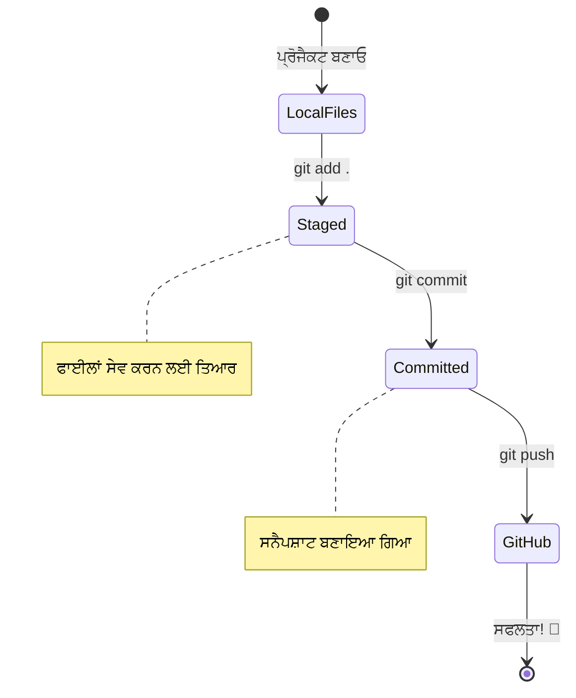
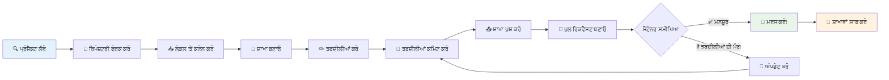

<!--
CO_OP_TRANSLATOR_METADATA:
{
  "original_hash": "5c383cc2cc23bb164b06417d1c107a44",
  "translation_date": "2025-11-25T12:16:52+00:00",
  "source_file": "1-getting-started-lessons/2-github-basics/README.md",
  "language_code": "pa"
}
-->
# GitHub ਦਾ ਪਰਚੇ

ਹੈਲੋ, ਭਵਿੱਖ ਦੇ ਡਿਵੈਲਪਰ! 👋 ਦੁਨੀਆ ਭਰ ਦੇ ਲੱਖਾਂ ਕੋਡਰਾਂ ਵਿੱਚ ਸ਼ਾਮਲ ਹੋਣ ਲਈ ਤਿਆਰ ਹੋ? ਮੈਂ ਤੁਹਾਨੂੰ GitHub ਨਾਲ ਜਾਣੂ ਕਰਵਾਉਣ ਲਈ ਬਹੁਤ ਉਤਸਾਹਿਤ ਹਾਂ – ਇਸਨੂੰ ਪ੍ਰੋਗਰਾਮਰਾਂ ਲਈ ਸੋਸ਼ਲ ਮੀਡੀਆ ਪਲੇਟਫਾਰਮ ਵਜੋਂ ਸੋਚੋ, ਪਰ ਲੰਚ ਦੀਆਂ ਫੋਟੋਆਂ ਸਾਂਝੀਆਂ ਕਰਨ ਦੀ ਬਜਾਏ, ਅਸੀਂ ਕੋਡ ਸਾਂਝਾ ਕਰ ਰਹੇ ਹਾਂ ਅਤੇ ਇਕੱਠੇ ਸ਼ਾਨਦਾਰ ਚੀਜ਼ਾਂ ਬਣਾਉਣ ਦੀ ਕੋਸ਼ਿਸ਼ ਕਰ ਰਹੇ ਹਾਂ!

ਇਹ ਗੱਲ ਜੋ ਮੇਰੇ ਮਨ ਨੂੰ ਹੈਰਾਨ ਕਰ ਦਿੰਦੀ ਹੈ: ਤੁਹਾਡੇ ਫੋਨ ਵਿੱਚ ਹਰ ਐਪ, ਹਰ ਵੈਬਸਾਈਟ ਜਿਸ ਨੂੰ ਤੁਸੀਂ ਵੇਖਦੇ ਹੋ, ਅਤੇ ਜ਼ਿਆਦਾਤਰ ਟੂਲ ਜੋ ਤੁਸੀਂ ਵਰਤਣਾ ਸਿੱਖੋਗੇ, ਉਹ ਡਿਵੈਲਪਰਾਂ ਦੀਆਂ ਟੀਮਾਂ ਦੁਆਰਾ ਬਣਾਈ ਗਈਆਂ ਹਨ ਜੋ GitHub ਵਰਗੇ ਪਲੇਟਫਾਰਮਾਂ 'ਤੇ ਸਹਿਯੋਗ ਕਰ ਰਹੀਆਂ ਹਨ। ਉਹ ਮਿਊਜ਼ਿਕ ਐਪ ਜਿਸ ਨੂੰ ਤੁਸੀਂ ਪਸੰਦ ਕਰਦੇ ਹੋ? ਤੁਹਾਡੇ ਵਰਗੇ ਕਿਸੇ ਨੇ ਇਸ ਵਿੱਚ ਯੋਗਦਾਨ ਪਾਇਆ। ਉਹ ਗੇਮ ਜਿਸ ਨੂੰ ਤੁਸੀਂ ਛੱਡ ਨਹੀਂ ਸਕਦੇ? ਹਾਂ, ਸ਼ਾਇਦ GitHub ਸਹਿਯੋਗ ਨਾਲ ਬਣਾਇਆ ਗਿਆ। ਅਤੇ ਹੁਣ ਤੁਸੀਂ ਉਸ ਸ਼ਾਨਦਾਰ ਕਮਿਊਨਿਟੀ ਦਾ ਹਿੱਸਾ ਬਣਨ ਦਾ ਤਰੀਕਾ ਸਿੱਖਣ ਜਾ ਰਹੇ ਹੋ!

ਮੈਨੂੰ ਪਤਾ ਹੈ ਕਿ ਸ਼ੁਰੂ ਵਿੱਚ ਇਹ ਸਭ ਕੁਝ ਬਹੁਤ ਜ਼ਿਆਦਾ ਲੱਗ ਸਕਦਾ ਹੈ – ਸੱਚਮੁੱਚ, ਮੈਨੂੰ ਯਾਦ ਹੈ ਕਿ ਮੈਂ ਆਪਣਾ ਪਹਿਲਾ GitHub ਪੇਜ ਦੇਖਦੇ ਹੋਏ ਸੋਚਿਆ "ਇਹ ਸਾਰਾ ਕੀ ਮਤਲਬ ਹੈ?" ਪਰ ਗੱਲ ਇਹ ਹੈ: ਹਰ ਇੱਕ ਡਿਵੈਲਪਰ ਬਿਲਕੁਲ ਉਥੇ ਹੀ ਸ਼ੁਰੂ ਕਰਦਾ ਹੈ ਜਿੱਥੇ ਤੁਸੀਂ ਹੁਣ ਹੋ। ਇਸ ਪਾਠ ਦੇ ਅੰਤ ਤੱਕ, ਤੁਹਾਡੇ ਕੋਲ ਆਪਣਾ GitHub ਰਿਪੋਜ਼ਟਰੀ ਹੋਵੇਗਾ (ਇਸਨੂੰ ਕਲਾਉਡ ਵਿੱਚ ਤੁਹਾਡਾ ਨਿੱਜੀ ਪ੍ਰੋਜੈਕਟ ਸ਼ੋਕੇਸ ਸਮਝੋ), ਅਤੇ ਤੁਸੀਂ ਆਪਣਾ ਕੰਮ ਸੁਰੱਖਿਅਤ ਕਰਨ, ਇਸਨੂੰ ਹੋਰਾਂ ਨਾਲ ਸਾਂਝਾ ਕਰਨ, ਅਤੇ ਉਹਨਾਂ ਪ੍ਰੋਜੈਕਟਾਂ ਵਿੱਚ ਯੋਗਦਾਨ ਪਾਉਣ ਦਾ ਤਰੀਕਾ ਜਾਣੋਗੇ ਜੋ ਲੱਖਾਂ ਲੋਕ ਵਰਤਦੇ ਹਨ।

ਅਸੀਂ ਇਹ ਯਾਤਰਾ ਇਕੱਠੇ ਕਰਾਂਗੇ, ਇੱਕ ਕਦਮ ਵਿੱਚ। ਕੋਈ ਜਲਦੀ ਨਹੀਂ, ਕੋਈ ਦਬਾਅ ਨਹੀਂ – ਸਿਰਫ ਤੁਸੀਂ, ਮੈਂ, ਅਤੇ ਕੁਝ ਬਹੁਤ ਹੀ ਸ਼ਾਨਦਾਰ ਟੂਲ ਜੋ ਤੁਹਾਡੇ ਨਵੇਂ ਸਭ ਤੋਂ ਵਧੀਆ ਦੋਸਤ ਬਣਨ ਜਾ ਰਹੇ ਹਨ!


> ਸਕੈਚਨੋਟ [Tomomi Imura](https://twitter.com/girlie_mac) ਦੁਆਰਾ

## ਪਾਠ ਤੋਂ ਪਹਿਲਾਂ ਕਵਿਜ਼
[ਪਾਠ ਤੋਂ ਪਹਿਲਾਂ ਕਵਿਜ਼](https://ff-quizzes.netlify.app)

## ਪਰਚੇ

ਸੱਚਮੁੱਚ ਰੋਮਾਂਚਕ ਚੀਜ਼ਾਂ ਵਿੱਚ ਡੁੱਬਣ ਤੋਂ ਪਹਿਲਾਂ, ਆਓ ਤੁਹਾਡੇ ਕੰਪਿਊਟਰ ਨੂੰ ਕੁਝ GitHub ਜਾਦੂ ਲਈ ਤਿਆਰ ਕਰੀਏ! ਇਸਨੂੰ ਇੱਕ ਸ਼ਾਹਕਾਰ ਬਣਾਉਣ ਤੋਂ ਪਹਿਲਾਂ ਆਪਣੇ ਕਲਾ ਸਾਮਾਨ ਨੂੰ ਸੰਗਠਿਤ ਕਰਨ ਵਾਂਗ ਸੋਚੋ – ਸਹੀ ਟੂਲ ਤਿਆਰ ਰੱਖਣ ਨਾਲ ਸਭ ਕੁਝ ਬਹੁਤ ਹੀ ਸਹੀ ਅਤੇ ਬਹੁਤ ਮਜ਼ੇਦਾਰ ਬਣ ਜਾਂਦਾ ਹੈ।

ਮੈਂ ਤੁਹਾਨੂੰ ਹਰ ਸੈਟਅਪ ਕਦਮ ਵਿੱਚ ਨਿੱਜੀ ਤੌਰ 'ਤੇ ਲੈ ਜਾਵਾਂਗਾ, ਅਤੇ ਮੈਂ ਵਾਅਦਾ ਕਰਦਾ ਹਾਂ ਕਿ ਇਹ ਸ਼ੁਰੂ ਵਿੱਚ ਜਿੰਨਾ ਡਰਾਉਣਾ ਲੱਗਦਾ ਹੈ, ਉਹਨਾ ਨਹੀਂ ਹੈ। ਜੇਕਰ ਕੁਝ ਤੁਰੰਤ ਸਮਝ ਨਹੀਂ ਆਉਂਦਾ, ਤਾਂ ਇਹ ਬਿਲਕੁਲ ਸਧਾਰਨ ਹੈ! ਮੈਨੂੰ ਯਾਦ ਹੈ ਕਿ ਮੈਂ ਆਪਣਾ ਪਹਿਲਾ ਡਿਵੈਲਪਮੈਂਟ ਵਾਤਾਵਰਣ ਸੈਟਅਪ ਕੀਤਾ ਸੀ ਅਤੇ ਮੈਨੂੰ ਲੱਗਿਆ ਕਿ ਮੈਂ ਪ੍ਰਾਚੀਨ ਲਿਪੀਆਂ ਨੂੰ ਪੜ੍ਹਨ ਦੀ ਕੋਸ਼ਿਸ਼ ਕਰ ਰਿਹਾ ਹਾਂ। ਹਰ ਇੱਕ ਡਿਵੈਲਪਰ ਬਿਲਕੁਲ ਉਥੇ ਹੀ ਹੁੰਦਾ ਹੈ ਜਿੱਥੇ ਤੁਸੀਂ ਹੁਣ ਹੋ, ਸੋਚਦੇ ਹੋ ਕਿ ਕੀ ਉਹ ਸਹੀ ਕਰ ਰਹੇ ਹਨ। ਸਪੌਇਲਰ ਅਲਰਟ: ਜੇ ਤੁਸੀਂ ਇੱਥੇ ਸਿੱਖ ਰਹੇ ਹੋ, ਤਾਂ ਤੁਸੀਂ ਪਹਿਲਾਂ ਹੀ ਸਹੀ ਕਰ ਰਹੇ ਹੋ! 🌟

ਇਸ ਪਾਠ ਵਿੱਚ, ਅਸੀਂ ਕਵਰ ਕਰਾਂਗੇ:

- ਤੁਹਾਡੇ ਕੰਪਿਊਟਰ 'ਤੇ ਕੀਤੇ ਕੰਮ ਨੂੰ ਟ੍ਰੈਕ ਕਰਨਾ
- ਹੋਰਾਂ ਨਾਲ ਪ੍ਰੋਜੈਕਟਾਂ 'ਤੇ ਕੰਮ ਕਰਨਾ
- ਓਪਨ ਸੋਰਸ ਸਾਫਟਵੇਅਰ ਵਿੱਚ ਯੋਗਦਾਨ ਪਾਉਣ ਦਾ ਤਰੀਕਾ

### ਪੂਰਵ ਸ਼ਰਤਾਂ

ਆਓ ਤੁਹਾਡੇ ਕੰਪਿਊਟਰ ਨੂੰ ਕੁਝ GitHub ਜਾਦੂ ਲਈ ਤਿਆਰ ਕਰੀਏ! ਚਿੰਤਾ ਨਾ ਕਰੋ – ਇਹ ਸੈਟਅਪ ਕੁਝ ਹੈ ਜੋ ਤੁਹਾਨੂੰ ਸਿਰਫ ਇੱਕ ਵਾਰ ਕਰਨਾ ਹੈ, ਅਤੇ ਫਿਰ ਤੁਸੀਂ ਆਪਣੇ ਪੂਰੇ ਕੋਡਿੰਗ ਯਾਤਰਾ ਲਈ ਤਿਆਰ ਹੋਵੋਗੇ।

ਚਲੋ, ਅਧਾਰ ਨਾਲ ਸ਼ੁਰੂ ਕਰੀਏ! ਸਭ ਤੋਂ ਪਹਿਲਾਂ, ਸਾਨੂੰ ਚੈੱਕ ਕਰਨਾ ਹੈ ਕਿ Git ਪਹਿਲਾਂ ਹੀ ਤੁਹਾਡੇ ਕੰਪਿਊਟਰ 'ਤੇ ਹੈ ਜਾਂ ਨਹੀਂ। Git ਬੁਨਿਆਦੀ ਤੌਰ 'ਤੇ ਇੱਕ ਬਹੁਤ ਹੀ ਚੁਸਤ ਸਹਾਇਕ ਵਾਂਗ ਹੈ ਜੋ ਤੁਹਾਡੇ ਕੋਡ ਵਿੱਚ ਕੀਤੇ ਹਰ ਇੱਕ ਬਦਲਾਅ ਨੂੰ ਯਾਦ ਰੱਖਦਾ ਹੈ – ਹਰ ਦੋ ਸਕਿੰਟ ਵਿੱਚ ਬੇਚੈਨ ਹੋ ਕੇ Ctrl+S ਦਬਾਉਣ ਤੋਂ ਬਹੁਤ ਵਧੀਆ (ਅਸੀਂ ਸਭ ਨੇ ਇਹ ਕੀਤਾ ਹੈ!).

ਆਓ ਦੇਖੀਏ ਕਿ Git ਪਹਿਲਾਂ ਹੀ ਇੰਸਟਾਲ ਹੈ ਜਾਂ ਨਹੀਂ, ਇਸ ਜਾਦੂਈ ਕਮਾਂਡ ਨੂੰ ਆਪਣੇ ਟਰਮੀਨਲ ਵਿੱਚ ਟਾਈਪ ਕਰਕੇ:
`git --version`

ਜੇ Git ਅਜੇ ਤੱਕ ਨਹੀਂ ਹੈ, ਕੋਈ ਗੱਲ ਨਹੀਂ! ਸਿਰਫ [Git ਡਾਊਨਲੋਡ ਕਰੋ](https://git-scm.com/downloads) ਅਤੇ ਇਸਨੂੰ ਹਾਸਲ ਕਰੋ। ਜਦੋਂ ਤੁਸੀਂ ਇਸਨੂੰ ਇੰਸਟਾਲ ਕਰ ਲੈਂਦੇ ਹੋ, ਤਾਂ ਸਾਨੂੰ Git ਨੂੰ ਤੁਹਾਡੇ ਨਾਲ ਢੰਗ ਨਾਲ ਜਾਣੂ ਕਰਵਾਉਣਾ ਪਵੇਗਾ:

> 💡 **ਪਹਿਲੀ ਵਾਰ ਸੈਟਅਪ**: ਇਹ ਕਮਾਂਡ Git ਨੂੰ ਦੱਸਦੀਆਂ ਹਨ ਕਿ ਤੁਸੀਂ ਕੌਣ ਹੋ। ਇਹ ਜਾਣਕਾਰੀ ਹਰ ਕਮਿਟ ਨਾਲ ਜੁੜੀ ਹੋਵੇਗੀ ਜੋ ਤੁਸੀਂ ਕਰਦੇ ਹੋ, ਇਸ ਲਈ ਇੱਕ ਨਾਮ ਅਤੇ ਈਮੇਲ ਚੁਣੋ ਜੋ ਤੁਸੀਂ ਜਨਤਕ ਤੌਰ 'ਤੇ ਸਾਂਝਾ ਕਰਨ ਲਈ ਸਹੀ ਸਮਝਦੇ ਹੋ।

ਤੁਹਾਡੇ ਕੰਪਿਊਟਰ 'ਤੇ GitHub ਖਾਤਾ, ਇੱਕ ਕੋਡ ਐਡੀਟਰ (ਜਿਵੇਂ Visual Studio Code), ਅਤੇ ਟਰਮੀਨਲ (ਜਾਂ: ਕਮਾਂਡ ਪ੍ਰੌਮਪਟ) ਖੋਲ੍ਹਣ ਦੀ ਲੋੜ ਹੋਵੇਗੀ।

[github.com](https://github.com/) 'ਤੇ ਜਾਓ ਅਤੇ ਖਾਤਾ ਬਣਾਓ ਜੇਕਰ ਤੁਸੀਂ ਪਹਿਲਾਂ ਹੀ ਨਹੀਂ ਕੀਤਾ, ਜਾਂ ਲੌਗਇਨ ਕਰੋ ਅਤੇ ਆਪਣਾ ਪ੍ਰੋਫਾਈਲ ਭਰੋ।

💡 **ਆਧੁਨਿਕ ਸੁਝਾਅ**: [SSH keys](https://docs.github.com/en/authentication/connecting-to-github-with-ssh) ਸੈਟਅਪ ਕਰਨ ਜਾਂ [GitHub CLI](https://cli.github.com/) ਵਰਤਣ ਬਾਰੇ ਸੋਚੋ, ਬਿਨਾਂ ਪਾਸਵਰਡਾਂ ਦੇ ਆਸਾਨ ਪ੍ਰਮਾਣਿਕਤਾ ਲਈ।

✅ GitHub ਦੁਨੀਆ ਵਿੱਚ ਇਕੱਲਾ ਕੋਡ ਰਿਪੋਜ਼ਟਰੀ ਨਹੀਂ ਹੈ; ਹੋਰ ਵੀ ਹਨ, ਪਰ GitHub ਸਭ ਤੋਂ ਪ੍ਰਸਿੱਧ ਹੈ।

### ਤਿਆਰੀ

ਤੁਹਾਨੂੰ ਆਪਣੇ ਲੋਕਲ ਮਸ਼ੀਨ (ਲੈਪਟਾਪ ਜਾਂ ਪੀਸੀ) 'ਤੇ ਇੱਕ ਫੋਲਡਰ ਵਿੱਚ ਇੱਕ ਕੋਡ ਪ੍ਰੋਜੈਕਟ ਦੀ ਲੋੜ ਹੋਵੇਗੀ, ਅਤੇ GitHub 'ਤੇ ਇੱਕ ਜਨਤਕ ਰਿਪੋਜ਼ਟਰੀ ਦੀ ਲੋੜ ਹੋਵੇਗੀ, ਜੋ ਹੋਰਾਂ ਦੇ ਪ੍ਰੋਜੈਕਟਾਂ ਵਿੱਚ ਯੋਗਦਾਨ ਪਾਉਣ ਦਾ ਉਦਾਹਰਨ ਵਜੋਂ ਕੰਮ ਕਰੇਗੀ।

### ਤੁਹਾਡੇ ਕੋਡ ਨੂੰ ਸੁਰੱਖਿਅਤ ਰੱਖਣਾ

ਆਓ ਸੁਰੱਖਿਆ ਬਾਰੇ ਕੁਝ ਗੱਲ ਕਰੀਏ – ਪਰ ਚਿੰਤਾ ਨਾ ਕਰੋ, ਅਸੀਂ ਤੁਹਾਨੂੰ ਡਰਾਉਣ ਵਾਲੀਆਂ ਚੀਜ਼ਾਂ ਨਾਲ ਭਰ ਨਹੀਂ ਦੇਵਾਂਗੇ! ਇਹ ਸੁਰੱਖਿਆ ਅਭਿਆਸਾਂ ਨੂੰ ਤੁਹਾਡੇ ਕਾਰ ਜਾਂ ਘਰ ਨੂੰ ਤਾਲਾ ਲਗਾਉਣ ਵਾਂਗ ਸੋਚੋ। ਇਹ ਸਧਾਰਨ ਆਦਤਾਂ ਹਨ ਜੋ ਦੂਜੇ ਸੁਭਾਵਿਕ ਬਣ ਜਾਂਦੀਆਂ ਹਨ ਅਤੇ ਤੁਹਾਡੇ ਮਿਹਨਤ ਨੂੰ ਸੁਰੱਖਿਅਤ ਰੱਖਦੀਆਂ ਹਨ।

ਅਸੀਂ ਤੁਹਾਨੂੰ ਸ਼ੁਰੂ ਤੋਂ ਹੀ GitHub ਨਾਲ ਕੰਮ ਕਰਨ ਦੇ ਆਧੁਨਿਕ, ਸੁਰੱਖਿਅਤ ਤਰੀਕੇ ਦਿਖਾਵਾਂਗੇ। ਇਸ ਤਰੀਕੇ ਨਾਲ, ਤੁਸੀਂ ਚੰਗੀਆਂ ਆਦਤਾਂ ਵਿਕਸਿਤ ਕਰੋਗੇ ਜੋ ਤੁਹਾਡੇ ਕੋਡਿੰਗ ਕਰੀਅਰ ਵਿੱਚ ਤੁਹਾਡੀ ਚੰਗੀ ਸੇਵਾ ਕਰਨਗੀਆਂ।

GitHub ਨਾਲ ਕੰਮ ਕਰਦੇ ਸਮੇਂ, ਇਹ ਸੁਰੱਖਿਆ ਸਧਾਰਨ ਅਭਿਆਸਾਂ ਦੀ ਪਾਲਣਾ ਕਰਨਾ ਮਹੱਤਵਪੂਰਨ ਹੈ:

| ਸੁਰੱਖਿਆ ਖੇਤਰ | ਚੰਗੀ ਅਭਿਆਸ | ਇਹ ਕਿਉਂ ਮਹੱਤਵਪੂਰਨ ਹੈ |
|---------------|---------------|----------------|
| **ਪ੍ਰਮਾਣਿਕਤਾ** | SSH keys ਜਾਂ Personal Access Tokens ਵਰਤੋ | ਪਾਸਵਰਡ ਘੱਟ ਸੁਰੱਖਿਅਤ ਹਨ ਅਤੇ ਹਟਾਏ ਜਾ ਰਹੇ ਹਨ |
| **ਦੋ-ਕਦਮ ਪ੍ਰਮਾਣਿਕਤਾ** | ਆਪਣੇ GitHub ਖਾਤੇ 'ਤੇ 2FA ਚਾਲੂ ਕਰੋ | ਖਾਤੇ ਦੀ ਸੁਰੱਖਿਆ ਦਾ ਇੱਕ ਵਾਧੂ ਤਹਿ ਜੋੜਦਾ ਹੈ |
| **ਰਿਪੋਜ਼ਟਰੀ ਸੁਰੱਖਿਆ** | ਸੰਵੇਦਨਸ਼ੀਲ ਜਾਣਕਾਰੀ ਕਦੇ ਵੀ ਕਮਿਟ ਨਾ ਕਰੋ | API keys ਅਤੇ ਪਾਸਵਰਡ ਜਨਤਕ ਰਿਪੋਜ਼ਟਰੀ ਵਿੱਚ ਨਹੀਂ ਹੋਣੇ ਚਾਹੀਦੇ |
| **ਡਿਪੈਂਡੈਂਸੀ ਪ੍ਰਬੰਧਨ** | Dependabot ਨੂੰ ਅਪਡੇਟ ਲਈ ਚਾਲੂ ਕਰੋ | ਤੁਹਾਡੇ ਡਿਪੈਂਡੈਂਸੀ ਨੂੰ ਸੁਰੱਖਿਅਤ ਅਤੇ ਅਪਡੇਟ ਰੱਖਦਾ ਹੈ |

> ⚠️ **ਮਹੱਤਵਪੂਰਨ ਸੁਰੱਖਿਆ ਯਾਦ**: API keys, ਪਾਸਵਰਡ, ਜਾਂ ਹੋਰ ਸੰਵੇਦਨਸ਼ੀਲ ਜਾਣਕਾਰੀ ਨੂੰ ਕਿਸੇ ਵੀ ਰਿਪੋਜ਼ਟਰੀ ਵਿੱਚ ਕਦੇ ਵੀ ਕਮਿਟ ਨਾ ਕਰੋ। ਸੰਵੇਦਨਸ਼ੀਲ ਡਾਟਾ ਦੀ ਰੱਖਿਆ ਲਈ environment variables ਅਤੇ `.gitignore` ਫਾਈਲਾਂ ਵਰਤੋ।

**ਆਧੁਨਿਕ ਪ੍ਰਮਾਣਿਕਤਾ ਸੈਟਅਪ:**

> 💡 **ਪ੍ਰੋ ਸੁਝਾਅ**: SSH keys ਪਾਸਵਰਡਾਂ ਨੂੰ ਵਾਰ-ਵਾਰ ਦਰਜ ਕਰਨ ਦੀ ਲੋੜ ਨੂੰ ਖਤਮ ਕਰ ਦਿੰਦੇ ਹਨ ਅਤੇ ਰਵਾਇਤੀ ਪ੍ਰਮਾਣਿਕਤਾ ਤਰੀਕਿਆਂ ਨਾਲੋਂ ਜ਼ਿਆਦਾ ਸੁਰੱਖਿਅਤ ਹਨ।

---

## ਆਪਣੇ ਕੋਡ ਨੂੰ ਪ੍ਰੋਫੈਸ਼ਨਲ ਵਾਂਗ ਪ੍ਰਬੰਧਿਤ ਕਰਨਾ

ਚੰਗਾ, ਇਹ ਉਹ ਜਗ੍ਹਾ ਹੈ ਜਿੱਥੇ ਚੀਜ਼ਾਂ ਸੱਚਮੁੱਚ ਰੋਮਾਂਚਕ ਹੋ ਜਾਂਦੀਆਂ ਹਨ! 🎉 ਅਸੀਂ ਸਿੱਖਣ ਜਾ ਰਹੇ ਹਾਂ ਕਿ ਪ੍ਰੋਫੈਸ਼ਨਲ ਵਾਂਗ ਆਪਣੇ ਕੋਡ ਨੂੰ ਟ੍ਰੈਕ ਅਤੇ ਪ੍ਰਬੰਧਿਤ ਕਿਵੇਂ ਕਰਨਾ ਹੈ, ਅਤੇ ਸੱਚਮੁੱਚ, ਇਹ ਮੇਰੀ ਮਨਪਸੰਦ ਚੀਜ਼ਾਂ ਵਿੱਚੋਂ ਇੱਕ ਹੈ ਸਿਖਾਉਣ ਲਈ ਕਿਉਂਕਿ ਇਹ ਬਹੁਤ ਵੱਡਾ ਬਦਲਾਅ ਲਿਆਉਂਦਾ ਹੈ।

ਇਸਨੂੰ ਸੋਚੋ: ਤੁਸੀਂ ਇੱਕ ਸ਼ਾਨਦਾਰ ਕਹਾਣੀ ਲਿਖ ਰਹੇ ਹੋ, ਅਤੇ ਤੁਸੀਂ ਹਰ ਮਸੌਦੇ, ਹਰ ਸ਼ਾਨਦਾਰ ਸੋਧ, ਅਤੇ ਹਰ "ਰੁਕੋ, ਇਹ ਜ਼ਬਰਦਸਤ ਹੈ!" ਪਲ ਨੂੰ ਟ੍ਰੈਕ ਕਰਨਾ ਚਾਹੁੰਦੇ ਹੋ। ਇਹੀ ਕੁਝ Git ਤੁਹਾਡੇ ਕੋਡ ਲਈ ਕਰਦਾ ਹੈ! ਇਹ ਬਿਲਕੁਲ ਇੱਕ ਸ਼ਾਨਦਾਰ ਸਮਾਂ-ਯਾਤਰਾ ਕਰਨ ਵਾਲੇ ਨੋਟਬੁੱਕ ਵਾਂਗ ਹੈ ਜੋ ਹਰ ਚੀਜ਼ ਨੂੰ ਯਾਦ ਰੱਖਦਾ ਹੈ – ਹਰ ਕੀ-ਸਟ੍ਰੋਕ, ਹਰ ਬਦਲਾਅ, ਹਰ "ਓਹ, ਇਸ ਨੇ ਸਭ ਕੁਝ ਤੋੜ ਦਿੱਤਾ" ਪਲ ਜਿਸ ਨੂੰ ਤੁਸੀਂ ਤੁਰੰਤ ਰੱਦ ਕਰ ਸਕਦੇ ਹੋ।

ਮੈਂ ਸੱਚਮੁੱਚ – ਇਹ ਸ਼ੁਰੂ ਵਿੱਚ ਔਖਾ ਲੱਗ ਸਕਦਾ ਹੈ। ਜਦੋਂ ਮੈਂ ਸ਼ੁਰੂ ਕੀਤਾ, ਮੈਂ ਸੋਚਿਆ "ਮੈਂ ਆਪਣੇ ਫਾਈਲਾਂ ਨੂੰ ਸਧਾਰਨ ਤਰੀਕੇ ਨਾਲ ਸੇਵ ਕਿਉਂ ਨਹੀਂ ਕਰ ਸਕਦਾ?" ਪਰ ਮੈਨੂੰ ਇਸ 'ਤੇ ਭਰੋਸਾ ਕਰੋ: ਜਦੋਂ Git ਤੁਹਾਡੇ ਲਈ ਕਲਿੱਕ ਕਰਦਾ ਹੈ (ਅਤੇ ਇਹ ਕਰੇਗਾ!), ਤੁਹਾਡੇ ਕੋਲ ਉਹ ਲਾਈਟਬਲਬ ਪਲ ਹੋਵੇਗਾ ਜਿੱਥੇ ਤੁਸੀਂ ਸੋਚਦੇ ਹੋ "ਮੈਂ ਇਸ ਤੋਂ ਪਹਿਲਾਂ ਕਿਵੇਂ ਕੋਡ ਕੀਤਾ?" ਇਹ ਬਿਲਕੁਲ ਉਹੀ ਹੈ ਜਿਵੇਂ ਤੁਸੀਂ ਉਡਣ ਦੀ ਖੋਜ ਕਰਦੇ ਹੋ ਜਦੋਂ ਤੁਸੀਂ ਆਪਣੀ ਸਾਰੀ ਜ਼ਿੰਦਗੀ ਚੱਲ ਰਹੇ ਹੋ!

ਆਓ ਕਹੀਏ ਕਿ ਤੁਹਾਡੇ ਕੋਲ ਲੋਕਲ ਫੋਲਡਰ ਵਿੱਚ ਕੁਝ ਕੋਡ ਪ੍ਰੋਜੈਕਟ ਹੈ ਅਤੇ ਤੁਸੀਂ git - ਵਰਜਨ ਕੰਟਰੋਲ ਸਿਸਟਮ ਦੀ ਵਰਤੋਂ ਕਰਕੇ ਆਪਣੀ ਪ੍ਰਗਤੀ ਟ੍ਰੈਕ ਕਰਨਾ ਸ਼ੁਰੂ ਕਰਨਾ ਚਾਹੁੰਦੇ ਹੋ। ਕੁਝ ਲੋਕ git ਦੀ ਵਰਤੋਂ ਨੂੰ ਆਪਣੇ ਭਵਿੱਖ ਦੇ ਆਪ ਨੂੰ ਪਿਆਰ ਭਰੇ ਪੱਤਰ ਲਿਖਣ ਨਾਲ ਤੁਲਨਾ ਕਰਦੇ ਹਨ। ਆਪਣੇ ਕਮਿਟ ਮੈਸੇਜਾਂ ਨੂੰ ਦਿਨਾਂ ਜਾਂ ਹਫ਼ਤਿਆਂ ਜਾਂ ਮਹੀਨਿਆਂ ਬਾਅਦ ਪੜ੍ਹਦੇ ਹੋਏ ਤੁਸੀਂ ਯਾਦ ਕਰ ਸਕਦੇ ਹੋ ਕਿ ਤੁਸੀਂ ਇੱਕ ਫੈਸਲਾ ਕਿਉਂ ਕੀਤਾ, ਜਾਂ "ਰੋਲਬੈਕ" ਇੱਕ ਬਦਲਾਅ – ਇਹ ਹੈ, ਜਦੋਂ ਤੁਸੀਂ ਚੰਗੇ "ਕਮਿਟ ਮੈਸੇਜ" ਲਿਖਦੇ ਹੋ।

### ਟਾਸਕ: ਆਪਣਾ ਪਹਿਲਾ ਰਿਪੋਜ਼ਟਰੀ ਬਣਾਓ!

> 🎯 **ਤੁਹਾਡਾ ਮਿਸ਼ਨ (ਅਤੇ ਮੈਂ ਤੁਹਾਡੇ ਲਈ ਬਹੁਤ ਉਤਸਾਹਿਤ ਹਾਂ!)**: ਅਸੀਂ ਇਕੱਠੇ ਤੁਹਾਡਾ ਪਹਿਲਾ GitHub ਰਿਪੋਜ਼ਟਰੀ ਬਣਾਉਣ ਜਾ ਰਹੇ ਹਾਂ! ਜਦੋਂ ਤੱਕ ਅਸੀਂ ਇੱਥੇ ਖਤਮ ਕਰਾਂਗੇ, ਤੁਹਾਡੇ ਕੋਡ ਦਾ ਆਪਣਾ ਛੋਟਾ ਇੰਟਰਨੈਟ ਕੋਨਾ ਹੋਵੇਗਾ, ਅਤੇ ਤੁਸੀਂ ਆਪਣਾ ਪਹਿਲਾ "ਕਮਿਟ" ਕੀਤਾ ਹੋਵੇਗਾ (ਇਹ ਡਿਵੈਲਪਰ ਭਾਸ਼ਾ ਵਿੱਚ ਤੁਹਾਡੇ ਕੰਮ ਨੂੰ ਬਹੁਤ ਹੀ ਸਮਾਰਟ ਤਰੀਕੇ ਨਾਲ ਸੇਵ ਕਰਨ ਲਈ ਹੈ)।
>
> ਇਹ ਸੱਚਮੁੱਚ ਬਹੁਤ ਖਾਸ ਪਲ ਹੈ – ਤੁਸੀਂ ਡਿਵੈਲਪਰਾਂ ਦੀ ਗਲੋਬਲ ਕਮਿਊਨਿਟੀ ਵਿੱਚ ਅਧਿਕਾਰਤ ਤੌਰ 'ਤੇ ਸ਼ਾਮਲ ਹੋਣ ਜਾ ਰਹੇ ਹੋ! ਮੈਨੂੰ ਅਜੇ ਵੀ ਆਪਣਾ ਪਹਿਲਾ ਰਿਪੋ ਬਣਾਉਣ ਦੀ ਰੋਮਾਂਚਕਤਾ ਯਾਦ ਹੈ ਅਤੇ ਸੋਚਿਆ "ਵਾਹ, ਮੈਂ ਸੱਚਮੁੱਚ ਇਹ ਕਰ ਰਿਹਾ ਹਾਂ!"

ਆਓ ਇਸ ਦੂਸਰੇ ਨਾਲ ਇਹ ਯਾਤਰਾ ਕਰੀਏ, ਕਦਮ-ਦਰ-ਕਦਮ। ਹਰ ਹਿੱਸੇ ਨਾਲ ਆਪਣਾ ਸਮਾਂ ਲਵੋ – ਜਲਦੀ ਕਰਨ ਲਈ ਕੋਈ ਇਨਾਮ ਨਹੀਂ ਹੈ, ਅਤੇ ਮੈਂ ਵਾਅਦਾ ਕਰਦਾ ਹਾਂ ਕਿ ਹਰ ਇੱਕ ਕਦਮ ਦਾ ਮਤਲਬ ਹੋਵੇਗਾ। ਯਾਦ ਰੱਖੋ, ਹਰ ਕੋਡਿੰਗ ਸਟਾਰ ਜਿਸ ਦੀ ਤੁਸੀਂ ਪ੍ਰਸ਼ੰਸਾ ਕਰਦੇ ਹੋ, ਇੱਕ ਵਾਰ ਬਿਲਕੁਲ ਉਥੇ ਬੈਠਾ ਸੀ ਜਿੱਥੇ ਤੁਸੀਂ ਹੁਣ ਹੋ, ਆਪਣਾ ਪਹਿਲਾ ਰਿਪੋਜ਼ਟਰੀ ਬਣਾਉਣ ਵਾਲਾ। ਇਹ ਕਿੰਨਾ ਸ਼ਾਨਦਾਰ ਹੈ?

> ਵੀਡੀਓ ਵੇਖੋ
> 
> [](https://www.youtube.com/watch?v=9R31OUPpxU4)

**ਇਸਨੂੰ ਇਕੱਠੇ ਕਰੀਏ:**

1. **GitHub 'ਤੇ ਆਪਣਾ ਰਿਪੋਜ਼ਟਰੀ ਬਣਾਓ**। GitHub.com 'ਤੇ ਜਾਓ ਅਤੇ ਉਹ ਚਮਕਦਾਰ ਹਰਾ **New** ਬਟਨ (ਜਾਂ ਉੱਪਰ ਸੱਜੇ ਕੋਨੇ ਵਿੱਚ **+** ਨਿਸ਼ਾਨ) ਦੀ ਭਾਲ ਕਰੋ। ਇਸ 'ਤੇ ਕਲਿੱਕ ਕਰੋ ਅਤੇ **New repository** ਚੁਣੋ।

   ਇੱਥੇ ਕੀ ਕਰਨਾ ਹੈ:
   1. ਆਪਣੇ ਰਿਪੋਜ਼ਟਰੀ ਨੂੰ ਇੱਕ ਨਾਮ ਦਿਓ – ਇਸਨੂੰ ਤੁਹਾਡੇ ਲਈ ਕੁਝ ਅਰਥਪ
   - ਅਸੀਂ ਤੁਹਾਡੇ ਸਥਾਨਕ ਪ੍ਰੋਜੈਕਟ ਅਤੇ ਤੁਹਾਡੇ GitHub ਰਿਪੋਜ਼ਟਰੀ ਦੇ ਵਿਚਕਾਰ ਇੱਕ ਕਨੈਕਸ਼ਨ ਬਣਾਈ ਹੈ।
   - "Origin" ਸਿਰਫ ਤੁਹਾਡੇ GitHub ਰਿਪੋਜ਼ਟਰੀ ਲਈ ਇੱਕ ਨਿਕ ਨੇਮ ਹੈ – ਇਹ ਤੁਹਾਡੇ ਫੋਨ ਵਿੱਚ ਇੱਕ ਸੰਪਰਕ ਜੋੜਨ ਵਰਗਾ ਹੈ।
   - ਹੁਣ ਤੁਹਾਡਾ ਸਥਾਨਕ Git ਜਾਣਦਾ ਹੈ ਕਿ ਤੁਹਾਡਾ ਕੋਡ ਕਿੱਥੇ ਭੇਜਣਾ ਹੈ ਜਦੋਂ ਤੁਸੀਂ ਇਸਨੂੰ ਸਾਂਝਾ ਕਰਨ ਲਈ ਤਿਆਰ ਹੋ।

   💡 **ਅਸਾਨ ਤਰੀਕਾ**: ਜੇ ਤੁਹਾਡੇ ਕੋਲ GitHub CLI ਇੰਸਟਾਲ ਹੈ, ਤਾਂ ਤੁਸੀਂ ਇਹ ਇੱਕ ਕਮਾਂਡ ਵਿੱਚ ਕਰ ਸਕਦੇ ਹੋ:
   ```bash
   gh repo create my-repo --public --push --source=.
   ```

8. **ਤੁਹਾਡਾ ਕੋਡ GitHub 'ਤੇ ਭੇਜੋ** (ਵੱਡਾ ਪਲ!):

   ```bash
   git push -u origin main
   ```

   **🚀 ਇਹ ਹੈ! ਤੁਸੀਂ ਆਪਣਾ ਕੋਡ GitHub 'ਤੇ ਅਪਲੋਡ ਕਰ ਰਹੇ ਹੋ!**
   
   **ਕੀ ਹੋ ਰਿਹਾ ਹੈ:**
   - ਤੁਹਾਡੇ commits ਤੁਹਾਡੇ ਕੰਪਿਊਟਰ ਤੋਂ GitHub ਤੱਕ ਜਾ ਰਹੇ ਹਨ।
   - `-u` ਫਲੈਗ ਇੱਕ ਸਥਾਈ ਕਨੈਕਸ਼ਨ ਸੈਟ ਕਰਦਾ ਹੈ ਤਾਂ ਜੋ ਭਵਿੱਖ ਦੇ pushes ਆਸਾਨ ਹੋਣ।
   - "main" ਤੁਹਾਡੇ ਪ੍ਰਾਇਮਰੀ ਬ੍ਰਾਂਚ ਦਾ ਨਾਮ ਹੈ (ਜਿਵੇਂ ਮੁੱਖ ਫੋਲਡਰ)।
   - ਇਸ ਤੋਂ ਬਾਅਦ, ਤੁਸੀਂ ਭਵਿੱਖ ਦੇ ਅਪਲੋਡ ਲਈ ਸਿਰਫ `git push` ਟਾਈਪ ਕਰ ਸਕਦੇ ਹੋ!

   💡 **ਛੋਟਾ ਨੋਟ**: ਜੇ ਤੁਹਾਡੀ ਬ੍ਰਾਂਚ ਦਾ ਨਾਮ ਕੁਝ ਹੋਰ ਹੈ (ਜਿਵੇਂ "master"), ਤਾਂ ਉਹ ਨਾਮ ਵਰਤੋ। ਤੁਸੀਂ `git branch --show-current` ਨਾਲ ਚੈੱਕ ਕਰ ਸਕਦੇ ਹੋ।

9. **ਤੁਹਾਡਾ ਨਵਾਂ ਰੋਜ਼ਾਨਾ ਕੋਡਿੰਗ ਰਿਥਮ** (ਇਹ ਜ਼ਰੂਰ ਆਦਤ ਬਣ ਜਾਵੇਗੀ!):

   ਹੁਣ ਤੋਂ, ਜਦੋਂ ਵੀ ਤੁਸੀਂ ਆਪਣੇ ਪ੍ਰੋਜੈਕਟ ਵਿੱਚ ਬਦਲਾਅ ਕਰਦੇ ਹੋ, ਤੁਹਾਡੇ ਕੋਲ ਇਹ ਸਧਾਰਨ ਤਿੰਨ-ਕਦਮਾਂ ਦਾ ਨਾਚ ਹੈ:

   ```bash
   git add .
   git commit -m "describe what you changed"
   git push
   ```

   **ਇਹ ਤੁਹਾਡਾ ਕੋਡਿੰਗ ਹਾਰਟਬੀਟ ਬਣ ਜਾਂਦਾ ਹੈ:**
   - ਆਪਣੇ ਕੋਡ ਵਿੱਚ ਕੁਝ ਸ਼ਾਨਦਾਰ ਬਦਲਾਅ ਕਰੋ ✨
   - `git add` ਨਾਲ ਉਨ੍ਹਾਂ ਨੂੰ ਸਟੇਜ ਕਰੋ ("ਹੇ Git, ਇਹ ਬਦਲਾਅ 'ਤੇ ਧਿਆਨ ਦਿਓ!")
   - `git commit` ਅਤੇ ਇੱਕ ਵੇਰਵਾ ਵਾਲਾ ਸੁਨੇਹਾ ਨਾਲ ਉਨ੍ਹਾਂ ਨੂੰ ਸੇਵ ਕਰੋ (ਭਵਿੱਖ ਵਿੱਚ ਤੁਸੀਂ ਆਪਣੇ ਆਪ ਨੂੰ ਧੰਨਵਾਦ ਦੋਗੇ!)
   - `git push` ਨਾਲ ਉਨ੍ਹਾਂ ਨੂੰ ਦੁਨੀਆ ਨਾਲ ਸਾਂਝਾ ਕਰੋ 🚀
   - ਦੁਹਰਾਓ ਅਤੇ ਮੁੜ ਕਰੋ – ਸੱਚਮੁੱਚ, ਇਹ ਸਾਹ ਲੈਣ ਜਿੰਨਾ ਕੁਦਰਤੀ ਬਣ ਜਾਂਦਾ ਹੈ!

   ਮੈਨੂੰ ਇਹ ਵਰਕਫਲੋ ਪਸੰਦ ਹੈ ਕਿਉਂਕਿ ਇਹ ਵੀਡੀਓ ਗੇਮ ਵਿੱਚ ਕਈ ਸੇਵ ਪਾਇੰਟਸ ਹੋਣ ਵਰਗਾ ਹੈ। ਕੋਈ ਬਦਲਾਅ ਕੀਤਾ ਜੋ ਤੁਹਾਨੂੰ ਪਸੰਦ ਹੈ? Commit ਕਰੋ! ਕੁਝ ਖਤਰਨਾਕ ਅਜ਼ਮਾਉਣਾ ਚਾਹੁੰਦੇ ਹੋ? ਕੋਈ ਸਮੱਸਿਆ ਨਹੀਂ – ਜੇਕਰ ਚੀਜ਼ਾਂ ਖਰਾਬ ਹੋ ਜਾਂਦੀਆਂ ਹਨ ਤਾਂ ਤੁਸੀਂ ਹਮੇਸ਼ਾ ਆਪਣੇ ਪਿਛਲੇ commit 'ਤੇ ਵਾਪਸ ਜਾ ਸਕਦੇ ਹੋ!

   > 💡 **ਸੁਝਾਅ**: ਤੁਸੀਂ `.gitignore` ਫਾਈਲ ਨੂੰ ਅਪਨਾਉਣਾ ਚਾਹੁੰਦੇ ਹੋ ਤਾਂ ਜੋ ਉਹ ਫਾਈਲਾਂ ਜੋ ਤੁਸੀਂ ਟਰੈਕ ਨਹੀਂ ਕਰਨਾ ਚਾਹੁੰਦੇ GitHub 'ਤੇ ਨਾ ਆਉਣ – ਜਿਵੇਂ ਉਹ ਨੋਟਸ ਫਾਈਲ ਜੋ ਤੁਸੀਂ ਉਸੇ ਫੋਲਡਰ ਵਿੱਚ ਸਟੋਰ ਕਰਦੇ ਹੋ ਪਰ ਜਿਸਦਾ ਕੋਈ ਸਥਾਨ ਪਬਲਿਕ ਰਿਪੋਜ਼ਟਰੀ 'ਤੇ ਨਹੀਂ ਹੈ। `.gitignore` ਫਾਈਲਾਂ ਲਈ ਟੈਂਪਲੇਟ [`.gitignore templates`](https://github.com/github/gitignore) 'ਤੇ ਮਿਲ ਸਕਦੇ ਹਨ ਜਾਂ [gitignore.io](https://www.toptal.com/developers/gitignore) ਦੀ ਵਰਤੋਂ ਕਰਕੇ ਇੱਕ ਬਣਾਈ ਜਾ ਸਕਦੀ ਹੈ।

### 🧠 **ਪਹਿਲੀ ਰਿਪੋਜ਼ਟਰੀ ਚੈੱਕ-ਇਨ: ਇਹ ਕਿਵੇਂ ਲੱਗਾ?**

**ਇੱਕ ਪਲ ਲਈ ਜਸ਼ਨ ਮਨਾਓ ਅਤੇ ਵਿਚਾਰ ਕਰੋ:**
- ਤੁਹਾਡੇ ਕੋਡ ਨੂੰ ਪਹਿਲੀ ਵਾਰ GitHub 'ਤੇ ਦੇਖ ਕੇ ਕਿਵੇਂ ਲੱਗਾ?
- ਕਿਹੜਾ ਕਦਮ ਸਭ ਤੋਂ ਜ਼ਿਆਦਾ ਗੁੰਝਲਦਾਰ ਲੱਗਾ, ਅਤੇ ਕਿਹੜਾ ਹੈਰਾਨੀਜਨਕ ਤੌਰ 'ਤੇ ਆਸਾਨ ਲੱਗਾ?
- ਕੀ ਤੁਸੀਂ `git add`, `git commit`, ਅਤੇ `git push` ਦੇ ਫਰਕ ਨੂੰ ਆਪਣੇ ਸ਼ਬਦਾਂ ਵਿੱਚ ਸਮਝਾ ਸਕਦੇ ਹੋ?


> **ਯਾਦ ਰੱਖੋ**: ਅਨੁਭਵੀ ਡਿਵੈਲਪਰ ਵੀ ਕਈ ਵਾਰ ਸਹੀ ਕਮਾਂਡ ਭੁੱਲ ਜਾਂਦੇ ਹਨ। ਇਹ ਵਰਕਫਲੋ ਨੂੰ ਮਾਸਲ ਮੈਮੋਰੀ ਬਣਾਉਣ ਲਈ ਅਭਿਆਸ ਦੀ ਲੋੜ ਹੁੰਦੀ ਹੈ - ਤੁਸੀਂ ਬਹੁਤ ਵਧੀਆ ਕਰ ਰਹੇ ਹੋ!

#### ਆਧੁਨਿਕ Git ਵਰਕਫਲੋਜ਼

ਇਹ ਆਧੁਨਿਕ ਅਭਿਆਸਾਂ ਅਪਨਾਉਣ ਬਾਰੇ ਸੋਚੋ:

- **Conventional Commits**: `feat:`, `fix:`, `docs:` ਆਦਿ ਵਰਗੇ ਮਿਆਰੀ commit ਸੁਨੇਹਾ ਫਾਰਮੈਟ ਦੀ ਵਰਤੋਂ ਕਰੋ। [conventionalcommits.org](https://www.conventionalcommits.org/) 'ਤੇ ਹੋਰ ਜਾਣੋ।
- **Atomic commits**: ਹਰ commit ਨੂੰ ਇੱਕ ਲਾਜ਼ਮੀ ਤਬਦੀਲੀ ਦਾ ਪ੍ਰਤੀਨਿਧੀ ਬਣਾਓ।
- **Frequent commits**: ਵੱਡੇ, ਕਦਰਾਂ-ਕਦਰਾਂ commit ਕਰਨ ਦੀ ਬਜਾਏ ਵਿਆਖਿਆਤਮਕ ਸੁਨੇਹਿਆਂ ਨਾਲ ਅਕਸਰ commit ਕਰੋ।

#### Commit ਸੁਨੇਹੇ

ਇੱਕ ਵਧੀਆ Git commit ਸਬਜੈਕਟ ਲਾਈਨ ਹੇਠਾਂ ਦਿੱਤੇ ਵਾਕ ਨੂੰ ਪੂਰਾ ਕਰਦੀ ਹੈ:
ਜੇ ਲਾਗੂ ਕੀਤਾ ਗਿਆ, ਤਾਂ ਇਹ commit <ਤੁਹਾਡੀ ਸਬਜੈਕਟ ਲਾਈਨ ਇੱਥੇ>

ਸਬਜੈਕਟ ਲਈ imperative, present tense ਵਰਤੋ: "change" ਨਾ ਕਿ "changed" ਜਾਂ "changes"। ਜਿਵੇਂ ਸਬਜੈਕਟ ਵਿੱਚ, ਬਾਡੀ (ਵਿਕਲਪਿਕ) ਵਿੱਚ ਵੀ imperative, present tense ਵਰਤੋ। ਬਾਡੀ ਵਿੱਚ ਤਬਦੀਲੀ ਲਈ ਪ੍ਰੇਰਣਾ ਸ਼ਾਮਲ ਹੋਣੀ ਚਾਹੀਦੀ ਹੈ ਅਤੇ ਇਸਨੂੰ ਪਿਛਲੇ ਵਿਹਾਰ ਨਾਲ ਵਿਰੋਧ ਵਿੱਚ ਦਰਸਾਉਣਾ ਚਾਹੀਦਾ ਹੈ। ਤੁਸੀਂ `why` ਨੂੰ ਸਮਝਾ ਰਹੇ ਹੋ, ਨਾ ਕਿ `how` ਨੂੰ।

✅ ਕੁਝ ਮਿੰਟ ਲੈ ਕੇ GitHub 'ਤੇ ਘੁੰਮੋ। ਕੀ ਤੁਸੀਂ ਇੱਕ ਬਹੁਤ ਵਧੀਆ commit ਸੁਨੇਹਾ ਲੱਭ ਸਕਦੇ ਹੋ? ਕੀ ਤੁਸੀਂ ਇੱਕ ਬਹੁਤ ਹੀ ਘੱਟ ਸੁਨੇਹਾ ਲੱਭ ਸਕਦੇ ਹੋ? ਤੁਹਾਡੇ ਵਿਚਾਰ ਵਿੱਚ commit ਸੁਨੇਹੇ ਵਿੱਚ ਸਭ ਤੋਂ ਮਹੱਤਵਪੂਰਨ ਅਤੇ ਲਾਭਦਾਇਕ ਜਾਣਕਾਰੀ ਕੀ ਹੈ?

## ਹੋਰਾਂ ਨਾਲ ਕੰਮ ਕਰਨਾ (ਮਜ਼ੇਦਾਰ ਹਿੱਸਾ!)

ਤਿਆਰ ਰਹੋ ਕਿਉਂਕਿ ਇਹ ਹੈ ਜਿੱਥੇ GitHub ਬਿਲਕੁਲ ਜਾਦੂਈ ਬਣ ਜਾਂਦਾ ਹੈ! 🪄 ਤੁਸੀਂ ਆਪਣੇ ਕੋਡ ਨੂੰ ਮੈਨੇਜ ਕਰਨ ਵਿੱਚ ਮਾਹਰ ਹੋ ਗਏ ਹੋ, ਪਰ ਹੁਣ ਅਸੀਂ ਮੇਰੇ ਬਿਲਕੁਲ ਮਨਪਸੰਦ ਹਿੱਸੇ ਵਿੱਚ ਡੁੱਬ ਰਹੇ ਹਾਂ – ਦੁਨੀਆ ਭਰ ਦੇ ਸ਼ਾਨਦਾਰ ਲੋਕਾਂ ਨਾਲ ਸਹਿਯੋਗ।

ਇਸ ਦੀ ਕਲਪਨਾ ਕਰੋ: ਤੁਸੀਂ ਕੱਲ ਸਵੇਰੇ ਉੱਠਦੇ ਹੋ ਅਤੇ ਵੇਖਦੇ ਹੋ ਕਿ ਟੋਕੀਓ ਵਿੱਚ ਕਿਸੇ ਨੇ ਤੁਹਾਡੇ ਕੋਡ ਨੂੰ ਸੁਧਾਰਿਆ ਜਦੋਂ ਤੁਸੀਂ ਸੌ ਰਹੇ ਸੀ। ਫਿਰ ਬਰਲਿਨ ਵਿੱਚ ਕਿਸੇ ਨੇ ਇੱਕ ਬੱਗ ਨੂੰ ਠੀਕ ਕੀਤਾ ਜਿਸ 'ਤੇ ਤੁਸੀਂ ਫਸੇ ਹੋਏ ਸੀ। ਦੁਪਹਿਰ ਤੱਕ, ਸਾਓ ਪਾਓਲੋ ਵਿੱਚ ਇੱਕ ਡਿਵੈਲਪਰ ਨੇ ਇੱਕ ਫੀਚਰ ਜੋੜਿਆ ਜਿਸ ਬਾਰੇ ਤੁਸੀਂ ਕਦੇ ਸੋਚਿਆ ਵੀ ਨਹੀਂ ਸੀ। ਇਹ ਵਿਗਿਆਨਕ ਕਲਪਨਾ ਨਹੀਂ ਹੈ – ਇਹ ਸਿਰਫ GitHub ਯੂਨੀਵਰਸ ਵਿੱਚ ਇੱਕ ਮੰਗਲਵਾਰ ਹੈ!

ਜੋ ਚੀਜ਼ ਮੈਨੂੰ ਸੱਚਮੁੱਚ ਉਤਸ਼ਾਹਿਤ ਕਰਦੀ ਹੈ ਉਹ ਹੈ ਕਿ ਤੁਸੀਂ ਸਿੱਖਣ ਵਾਲੀਆਂ ਸਹਿਯੋਗੀ ਕੌਸ਼ਲਾਂ? ਇਹ EXACT ਉਹੀ ਵਰਕਫਲੋਜ਼ ਹਨ ਜੋ Google, Microsoft, ਅਤੇ ਤੁਹਾਡੇ ਮਨਪਸੰਦ startups ਵਿੱਚ ਟੀਮਾਂ ਹਰ ਰੋਜ਼ ਵਰਤਦੀਆਂ ਹਨ। ਤੁਸੀਂ ਸਿਰਫ ਇੱਕ ਕੂਲ ਟੂਲ ਨਹੀਂ ਸਿੱਖ ਰਹੇ – ਤੁਸੀਂ ਉਹ ਗੁਪਤ ਭਾਸ਼ਾ ਸਿੱਖ ਰਹੇ ਹੋ ਜੋ ਪੂਰੇ ਸੌਫਟਵੇਅਰ ਸੰਸਾਰ ਨੂੰ ਇਕੱਠੇ ਕੰਮ ਕਰਨ ਲਈ ਬਣਾਉਂਦੀ ਹੈ।

ਸੱਚਮੁੱਚ, ਜਦੋਂ ਤੁਸੀਂ ਆਪਣਾ ਪਹਿਲਾ pull request merge ਹੋਣ ਦਾ rush ਮਹਿਸੂਸ ਕਰਦੇ ਹੋ, ਤਾਂ ਤੁਸੀਂ ਸਮਝ ਜਾਵੋਗੇ ਕਿ ਡਿਵੈਲਪਰ ਖੁੱਲੇ ਸਰੋਤ ਬਾਰੇ ਕਿਉਂ ਬਹੁਤ ਜ਼ਿਆਦਾ ਜਜ਼ਬਾਤੀ ਹੋ ਜਾਂਦੇ ਹਨ। ਇਹ ਦੁਨੀਆ ਦੇ ਸਭ ਤੋਂ ਵੱਡੇ, ਸਭ ਤੋਂ ਰਚਨਾਤਮਕ ਟੀਮ ਪ੍ਰੋਜੈਕਟ ਦਾ ਹਿੱਸਾ ਹੋਣ ਵਰਗਾ ਹੈ!

> ਵੀਡੀਓ ਦੇਖੋ
>
> [](https://www.youtube.com/watch?v=bFCM-PC3cu8)

ਚੀਜ਼ਾਂ GitHub 'ਤੇ ਰੱਖਣ ਦਾ ਮੁੱਖ ਕਾਰਨ ਹੋਰ ਡਿਵੈਲਪਰਾਂ ਨਾਲ ਸਹਿਯੋਗ ਸੰਭਵ ਬਣਾਉਣਾ ਸੀ।


ਤੁਹਾਡੇ ਰਿਪੋਜ਼ਟਰੀ ਵਿੱਚ, `Insights > Community` 'ਤੇ ਜਾਓ ਤਾਂ ਜੋ ਤੁਸੀਂ ਦੇਖ ਸਕੋ ਕਿ ਤੁਹਾਡਾ ਪ੍ਰੋਜੈਕਟ ਸਿਫਾਰਸ਼ੀ community standards ਨਾਲ ਕਿਵੇਂ ਤੁਲਨਾਤਮਕ ਹੈ।

ਤੁਹਾਡਾ ਰਿਪੋਜ਼ਟਰੀ ਪੇਸ਼ੇਵਰ ਅਤੇ ਸਵਾਗਤਯੋਗ ਬਣਾਉਣ ਲਈ? ਆਪਣੇ ਰਿਪੋਜ਼ਟਰੀ 'ਤੇ ਜਾਓ ਅਤੇ `Insights > Community` 'ਤੇ ਕਲਿਕ ਕਰੋ। ਇਹ ਸ਼ਾਨਦਾਰ ਫੀਚਰ ਤੁਹਾਨੂੰ ਦਿਖਾਉਂਦਾ ਹੈ ਕਿ ਤੁਹਾਡਾ ਪ੍ਰੋਜੈਕਟ GitHub community ਦੁਆਰਾ "ਵਧੀਆ ਰਿਪੋਜ਼ਟਰੀ ਅਭਿਆਸਾਂ" ਮੰਨਿਆ ਜਾਂਦਾ ਹੈ।

> 🎯 **ਤੁਹਾਡੇ ਪ੍ਰੋਜੈਕਟ ਨੂੰ ਚਮਕਦਾਰ ਬਣਾਉਣਾ**: ਇੱਕ ਚੰਗੀ ਤਰ੍ਹਾਂ-ਸੰਗਠਿਤ ਰਿਪੋਜ਼ਟਰੀ ਜਿਸ ਵਿੱਚ ਵਧੀਆ ਦਸਤਾਵੇਜ਼ ਹੈ, ਇੱਕ ਸਾਫ਼, ਸਵਾਗਤਯੋਗ storefront ਹੋਣ ਵਰਗਾ ਹੈ। ਇਹ ਲੋਕਾਂ ਨੂੰ ਦਿਖਾਉਂਦਾ ਹੈ ਕਿ ਤੁਸੀਂ ਆਪਣੇ ਕੰਮ ਦੀ ਪਰਵਾਹ ਕਰਦੇ ਹੋ ਅਤੇ ਹੋਰਾਂ ਨੂੰ ਯੋਗਦਾਨ ਦੇਣ ਲਈ ਪ੍ਰੇਰਿਤ ਕਰਦਾ ਹੈ!

**ਇੱਕ ਰਿਪੋਜ਼ਟਰੀ ਨੂੰ ਸ਼ਾਨਦਾਰ ਬਣਾਉਣ ਵਾਲੀਆਂ ਚੀਜ਼ਾਂ:**

| ਕੀ ਜੋੜਨਾ ਹੈ | ਇਹ ਕਿਉਂ ਮਹੱਤਵਪੂਰਨ ਹੈ | ਇਹ ਤੁਹਾਡੇ ਲਈ ਕੀ ਕਰਦਾ ਹੈ |
|-------------|-------------------|---------------------|
| **Description** | ਪਹਿਲਾ ਪ੍ਰਭਾਵ ਮਹੱਤਵਪੂਰਨ ਹੈ! | ਲੋਕ ਤੁਰੰਤ ਜਾਣਦੇ ਹਨ ਕਿ ਤੁਹਾਡਾ ਪ੍ਰੋਜੈਕਟ ਕੀ ਕਰਦਾ ਹੈ |
| **README** | ਤੁਹਾਡੇ ਪ੍ਰੋਜੈਕਟ ਦਾ ਫਰੰਟ ਪੇਜ | ਨਵੇਂ ਵਿਜ਼ਟਰਾਂ ਲਈ ਇੱਕ ਦੋਸਤਾਨਾ ਟੂਰ ਗਾਈਡ |
| **Contributing Guidelines** | ਦਿਖਾਉਂਦਾ ਹੈ ਕਿ ਤੁਸੀਂ ਮਦਦ ਦਾ ਸਵਾਗਤ ਕਰਦੇ ਹੋ | ਲੋਕ ਜਾਣਦੇ ਹਨ ਕਿ ਉਹ ਤੁਹਾਡੀ ਮਦਦ ਕਿਵੇਂ ਕਰ ਸਕਦੇ ਹਨ |
| **Code of Conduct** | ਇੱਕ ਦੋਸਤਾਨਾ ਸਥਾਨ ਬਣਾਉਂਦਾ ਹੈ | ਹਰ ਕੋਈ ਭਾਗ ਲੈਣ ਲਈ ਸਵਾਗਤ ਮਹਿਸੂਸ ਕਰਦਾ ਹੈ |
| **License** | ਕਾਨੂੰਨੀ ਸਪਸ਼ਟਤਾ | ਹੋਰ ਲੋਕ ਜਾਣਦੇ ਹਨ ਕਿ ਉਹ ਤੁਹਾਡਾ ਕੋਡ ਕਿਵੇਂ ਵਰਤ ਸਕਦੇ ਹਨ |
| **Security Policy** | ਦਿਖਾਉਂਦਾ ਹੈ ਕਿ ਤੁਸੀਂ ਜ਼ਿੰਮੇਵਾਰ ਹੋ | ਪੇਸ਼ੇਵਰ ਅਭਿਆਸਾਂ ਦਾ ਪ੍ਰਦਰਸ਼ਨ ਕਰਦਾ ਹੈ |

> 💡 **Pro Tip**: GitHub ਇਹਨਾਂ ਫਾਈਲਾਂ ਲਈ ਟੈਂਪਲੇਟ ਪ੍ਰਦਾਨ ਕਰਦਾ ਹੈ। ਨਵਾਂ ਰਿਪੋਜ਼ਟਰੀ ਬਣਾਉਣ ਸਮੇਂ, ਇਹਨਾਂ ਫਾਈਲਾਂ ਨੂੰ ਆਪਣੇ ਆਪ ਜਨਰੇਟ ਕਰਨ ਲਈ ਬਾਕਸਾਂ ਨੂੰ ਚੈੱਕ ਕਰੋ।

**ਆਧੁਨਿਕ GitHub ਫੀਚਰਾਂ ਦੀ ਖੋਜ ਕਰਨ ਲਈ:**

🤖 **Automation & CI/CD:**
- **GitHub Actions** ਆਟੋਮੈਟਿਕ ਟੈਸਟਿੰਗ ਅਤੇ ਡਿਪਲੌਇਮੈਂਟ ਲਈ
- **Dependabot** ਆਟੋਮੈਟਿਕ dependency ਅਪਡੇਟ ਲਈ

💬 **Community & Project Management:**
- **GitHub Discussions** community ਗੱਲਬਾਤਾਂ ਲਈ
- **GitHub Projects** kanban-style ਪ੍ਰੋਜੈਕਟ ਮੈਨੇਜਮੈਂਟ ਲਈ
- **Branch protection rules** ਕੋਡ ਗੁਣਵੱਤਾ ਮਿਆਰਾਂ ਨੂੰ ਲਾਗੂ ਕਰਨ ਲਈ

ਇਹ ਸਾਰੇ ਸਰੋਤ ਨਵੇਂ ਟੀਮ ਮੈਂਬਰਾਂ ਨੂੰ ਆਨਬੋਰਡ ਕਰਨ ਵਿੱਚ ਲਾਭਦਾਇਕ ਹੋਣਗੇ। ਅਤੇ ਇਹ ਆਮ ਤੌਰ 'ਤੇ ਉਹ ਚੀਜ਼ਾਂ ਹਨ ਜੋ ਨਵੇਂ ਯੋਗਦਾਨਕਰਤਾ ਤੁਹਾਡੇ ਕੋਡ ਨੂੰ ਦੇਖਣ ਤੋਂ ਪਹਿਲਾਂ ਦੇਖਦੇ ਹਨ, ਇਹ ਪਤਾ ਕਰਨ ਲਈ ਕਿ ਤੁਹਾਡਾ ਪ੍ਰੋਜੈਕਟ ਉਹ ਸਥਾਨ ਹੈ ਜਿੱਥੇ ਉਹ ਆਪਣਾ ਸਮਾਂ ਬਿਤਾਉਣ ਲਈ ਚਾਹੁੰਦੇ ਹਨ।

✅ README ਫਾਈਲਾਂ, ਹਾਲਾਂਕਿ ਇਹਨਾਂ ਨੂੰ ਤਿਆਰ ਕਰਨ ਵਿੱਚ ਸਮਾਂ ਲੱਗਦਾ ਹੈ, ਅਕਸਰ ਵਿਅਸਤ maintainers ਦੁਆਰਾ ਨਜ਼ਰਅੰਦਾਜ਼ ਕੀਤੀਆਂ ਜਾਂਦੀਆਂ ਹਨ। ਕੀ ਤੁਸੀਂ ਇੱਕ ਵਿਸ਼ੇਸ਼ ਤੌਰ 'ਤੇ ਵੇਰਵੇਦਾਰ README ਲੱਭ ਸਕਦੇ ਹੋ? ਨੋਟ: ਕੁਝ [ਚੰਗੇ README ਬਣਾਉਣ ਲਈ ਟੂਲ](https://www.makeareadme.com/) ਹਨ ਜੋ ਤੁਸੀਂ ਅਜ਼ਮਾਉਣਾ ਚਾਹੁੰਦੇ ਹੋ।

### ਟਾਸਕ: ਕੁਝ ਕੋਡ merge ਕਰੋ

Contributing ਦਸਤਾਵੇਜ਼ ਲੋਕਾਂ ਨੂੰ ਪ੍ਰੋਜੈਕਟ ਵਿੱਚ ਯੋਗਦਾਨ ਦੇਣ ਵਿੱਚ ਮਦਦ ਕਰਦੇ ਹਨ। ਇਹ ਸਮਝਾਉਂਦਾ ਹੈ ਕਿ ਤੁਸੀਂ ਕਿਸ ਕਿਸਮ ਦੇ ਯੋਗਦਾਨ ਦੀ ਭਾਲ ਕਰ ਰਹੇ ਹੋ ਅਤੇ ਪ੍ਰਕਿਰਿਆ ਕਿਵੇਂ ਕੰਮ ਕਰਦੀ ਹੈ। Contributors ਨੂੰ ਤੁਹਾਡੇ GitHub ਰਿਪੋ 'ਤੇ ਯੋਗਦਾਨ ਦੇਣ ਲਈ ਕਈ ਕਦਮਾਂ ਵਿੱਚੋਂ ਗੁਜ਼ਰਨਾ ਪਵੇਗਾ:

1. **Forking your repo** ਤੁਸੀਂ ਸ਼ਾਇਦ ਲੋਕਾਂ ਨੂੰ _fork_ ਕਰਨ ਲਈ ਕਹੋਗੇ। Forking ਦਾ ਮਤਲਬ ਹੈ ਤੁਹਾਡੇ ਰਿਪੋਜ਼ਟਰੀ ਦੀ ਇੱਕ ਨਕਲ ਉਨ੍ਹਾਂ ਦੇ GitHub ਪ੍ਰੋਫਾਈਲ 'ਤੇ ਬਣਾਉਣਾ।
1. **Clone**. ਇਸ ਤੋਂ ਬਾਅਦ ਉਹ ਪ੍ਰੋਜੈਕਟ ਨੂੰ ਆਪਣੇ ਸਥਾਨਕ ਮਸ਼ੀਨ 'ਤੇ ਕਲੋਨ ਕਰਨਗੇ।
1. **Create a branch**. ਤੁਸੀਂ ਉਨ੍ਹਾਂ ਨੂੰ ਆਪਣੇ ਕੰਮ ਲਈ ਇੱਕ _branch_ ਬਣਾਉਣ ਲਈ ਕਹੋਗੇ।
1. **Focus their change on one area**. Contributors ਨੂੰ ਇੱਕ ਸਮੇਂ ਵਿੱਚ ਇੱਕ ਚੀਜ਼ 'ਤੇ ਧਿਆਨ ਕੇਂਦਰਿਤ ਕਰਨ ਲਈ ਕਹੋ - ਇਸ ਤਰੀਕੇ ਨਾਲ ਉਨ੍ਹਾਂ ਦੇ ਕੰਮ ਨੂੰ _merge_ ਕਰਨ ਦੀ ਸੰਭਾਵਨਾ ਵਧ ਜਾਂਦੀ ਹੈ। ਕਲਪਨਾ ਕਰੋ ਕਿ ਉਹ ਇੱਕ bug fix ਲਿਖਦੇ ਹਨ, ਇੱਕ ਨਵਾਂ feature ਜੋੜਦੇ ਹਨ, ਅਤੇ ਕਈ tests ਨੂੰ ਅਪਡੇਟ ਕਰਦੇ ਹਨ - ਕੀ ਹੋਵੇ ਜੇ ਤੁਸੀਂ 3 ਵਿੱਚੋਂ 2 ਜਾਂ 3 ਵਿੱਚੋਂ 1 ਬਦਲਾਅ ਨੂੰ ਲਾਗੂ ਕਰਨਾ ਚਾਹੁੰਦੇ ਹੋ ਜਾਂ ਕਰ ਸਕਦੇ ਹੋ?

✅ ਉਹ ਸਥਿਤੀਆਂ ਕਲਪਨਾ ਕਰੋ ਜਿੱਥੇ branches ਚੰਗਾ ਕੋਡ ਲਿਖਣ ਅਤੇ ship ਕਰਨ ਲਈ ਖਾਸ ਤੌਰ 'ਤੇ ਮਹੱਤਵਪੂਰਨ ਹਨ। ਤੁਸੀਂ ਕਿਹੜੇ use cases ਬਾਰੇ ਸੋਚ ਸਕਦੇ ਹੋ?

> ਨੋਟ, ਉਹ ਬਦਲਾਅ ਬਣੋ ਜੋ ਤੁਸੀਂ ਸੰਸਾਰ ਵਿੱਚ ਦੇਖਣਾ ਚਾਹੁੰਦੇ ਹੋ, ਅਤੇ ਆਪਣੇ ਕੰਮ ਲਈ branches ਬਣਾਓ। ਕੋਈ ਵੀ commits ਜੋ ਤੁਸੀਂ ਕਰਦੇ ਹੋ ਉਹ ਉਸ branch 'ਤੇ ਕੀਤੇ ਜਾਣਗੇ ਜਿਸ 'ਤੇ ਤੁਸੀਂ "checked out" ਹੋ। `git status` ਦੀ ਵਰਤੋਂ ਕਰੋ ਇਹ ਦੇਖਣ ਲਈ ਕਿ ਉਹ ਕਿਹੜੀ branch ਹੈ।

ਆਓ contributor workflow ਵਿੱਚ ਜਾਈਏ। ਮੰਨ ਲਓ ਕਿ contributor ਨੇ ਪਹਿਲਾਂ ਹੀ _fork_ ਅਤੇ _clone_ ਰਿਪੋ ਕਰ ਲਿਆ ਹੈ ਤਾਂ ਜੋ ਉਨ੍ਹਾਂ ਕੋਲ ਇੱਕ Git ਰਿਪੋ ਹੋਵੇ ਜੋ ਉਨ੍ਹਾਂ ਦੇ ਸਥਾਨਕ ਮਸ਼ੀਨ 'ਤੇ ਕੰਮ ਕਰਨ ਲਈ ਤਿਆਰ ਹੈ:

1. **Create a
1. **ਸਾਫ਼-ਸਫਾਈ ਕਰੋ**। ਇਹ ਚੰਗੀ ਪ੍ਰਥਾ ਮੰਨੀ ਜਾਂਦੀ ਹੈ ਕਿ ਜਦੋਂ ਤੁਸੀਂ ਸਫਲਤਾਪੂਰਵਕ PR ਨੂੰ ਮਰਜ ਕਰ ਲੈਂਦੇ ਹੋ, ਤਾਂ ਆਪਣੇ ਕੰਮ ਦੀ ਸਫ਼ਾਈ ਕਰੋ। ਤੁਹਾਨੂੰ ਆਪਣੀ ਲੋਕਲ ਬ੍ਰਾਂਚ ਅਤੇ ਉਹ ਬ੍ਰਾਂਚ ਜੋ ਤੁਸੀਂ GitHub 'ਤੇ ਪੁਸ਼ ਕੀਤੀ ਸੀ, ਦੋਹਾਂ ਨੂੰ ਸਾਫ਼ ਕਰਨਾ ਚਾਹੀਦਾ ਹੈ। ਪਹਿਲਾਂ, ਇਸ ਕਮਾਂਡ ਨਾਲ ਇਸਨੂੰ ਲੋਕਲ ਤੌਰ 'ਤੇ ਹਟਾਓ: 

   ```bash
   git branch -d [branch-name]
   ```

   ਅਗਲੇ ਕਦਮ ਵਜੋਂ, ਫੋਰਕ ਕੀਤੇ ਰਿਪੋ ਦੀ GitHub ਪੇਜ 'ਤੇ ਜਾਓ ਅਤੇ ਉਹ ਰਿਮੋਟ ਬ੍ਰਾਂਚ ਹਟਾਓ ਜੋ ਤੁਸੀਂ ਹੁਣੇ ਹੀ ਪੁਸ਼ ਕੀਤੀ ਸੀ।

`ਪੁਲ ਰਿਕਵੈਸਟ` ਸ਼ਬਦ ਕੁਝ ਮਜ਼ਾਕੀਆ ਲੱਗਦਾ ਹੈ ਕਿਉਂਕਿ ਅਸਲ ਵਿੱਚ ਤੁਸੀਂ ਆਪਣੇ ਬਦਲਾਅ ਪ੍ਰੋਜੈਕਟ ਵਿੱਚ ਪੁਸ਼ ਕਰਨਾ ਚਾਹੁੰਦੇ ਹੋ। ਪਰ ਮੈਨਟੇਨਰ (ਪ੍ਰੋਜੈਕਟ ਮਾਲਕ) ਜਾਂ ਕੋਰ ਟੀਮ ਨੂੰ ਤੁਹਾਡੇ ਬਦਲਾਅ ਬਾਰੇ ਸੋਚਣਾ ਪੈਂਦਾ ਹੈ ਇਸਨੂੰ ਪ੍ਰੋਜੈਕਟ ਦੀ "ਮੁੱਖ" ਬ੍ਰਾਂਚ ਨਾਲ ਮਰਜ ਕਰਨ ਤੋਂ ਪਹਿਲਾਂ, ਇਸ ਲਈ ਤੁਸੀਂ ਅਸਲ ਵਿੱਚ ਮੈਨਟੇਨਰ ਤੋਂ ਬਦਲਾਅ ਦਾ ਫੈਸਲਾ ਮੰਗ ਰਹੇ ਹੋ।

ਪੁਲ ਰਿਕਵੈਸਟ ਉਹ ਜਗ੍ਹਾ ਹੈ ਜਿੱਥੇ ਤੁਸੀਂ ਬ੍ਰਾਂਚ 'ਤੇ ਕੀਤੇ ਗਏ ਫਰਕਾਂ ਦੀ ਤੁਲਨਾ ਅਤੇ ਚਰਚਾ ਕਰ ਸਕਦੇ ਹੋ, ਰਿਵਿਊਜ਼, ਟਿੱਪਣੀਆਂ, ਇੰਟੀਗ੍ਰੇਟ ਕੀਤੇ ਟੈਸਟ ਅਤੇ ਹੋਰ ਬਹੁਤ ਕੁਝ। ਇੱਕ ਵਧੀਆ ਪੁਲ ਰਿਕਵੈਸਟ ਲਗਭਗ ਉਹੀ ਨਿਯਮ ਮੰਨਦਾ ਹੈ ਜੋ ਇੱਕ ਕਮਿਟ ਮੈਸੇਜ ਲਈ ਹੁੰਦੇ ਹਨ। ਜਦੋਂ ਤੁਹਾਡਾ ਕੰਮ ਕਿਸੇ ਸਮੱਸਿਆ ਨੂੰ ਹੱਲ ਕਰਦਾ ਹੈ, ਉਦਾਹਰਣ ਲਈ, ਤੁਸੀਂ ਇਸਨੂੰ ਇਸ਼ੂ ਟ੍ਰੈਕਰ ਵਿੱਚ ਇੱਕ ਇਸ਼ੂ ਦਾ ਹਵਾਲਾ ਦੇ ਸਕਦੇ ਹੋ। ਇਹ `#` ਦੇ ਨਾਲ ਅਤੇ ਤੁਹਾਡੇ ਇਸ਼ੂ ਦੇ ਨੰਬਰ ਨਾਲ ਕੀਤਾ ਜਾਂਦਾ ਹੈ। ਉਦਾਹਰਣ ਲਈ `#97`।

🤞ਉਮੀਦ ਹੈ ਕਿ ਸਾਰੇ ਚੈਕ ਪਾਸ ਹੋ ਜਾਣ ਅਤੇ ਪ੍ਰੋਜੈਕਟ ਮਾਲਕ ਤੁਹਾਡੇ ਬਦਲਾਅ ਨੂੰ ਪ੍ਰੋਜੈਕਟ ਵਿੱਚ ਮਰਜ ਕਰ ਲੈਣਗੇ🤞

ਆਪਣੀ ਮੌਜੂਦਾ ਲੋਕਲ ਵਰਕਿੰਗ ਬ੍ਰਾਂਚ ਨੂੰ GitHub 'ਤੇ ਸੰਬੰਧਤ ਰਿਮੋਟ ਬ੍ਰਾਂਚ ਤੋਂ ਸਾਰੇ ਨਵੇਂ ਕਮਿਟਸ ਨਾਲ ਅਪਡੇਟ ਕਰੋ:

`git pull`

## ਓਪਨ ਸੋਰਸ ਵਿੱਚ ਯੋਗਦਾਨ ਦੇਣਾ (ਤੁਹਾਡਾ ਅਸਰ ਛੱਡਣ ਦਾ ਮੌਕਾ!)

ਕੀ ਤੁਸੀਂ ਕੁਝ ਅਜਿਹਾ ਕਰਨ ਲਈ ਤਿਆਰ ਹੋ ਜੋ ਤੁਹਾਡੇ ਮਨ ਨੂੰ ਬਿਲਕੁਲ ਹੈਰਾਨ ਕਰ ਦੇਵੇ? 🤯 ਆਓ ਓਪਨ ਸੋਰਸ ਪ੍ਰੋਜੈਕਟਾਂ ਵਿੱਚ ਯੋਗਦਾਨ ਦੇਣ ਬਾਰੇ ਗੱਲ ਕਰੀਏ – ਅਤੇ ਮੈਂ ਇਸਨੂੰ ਤੁਹਾਡੇ ਨਾਲ ਸਾਂਝਾ ਕਰਨ ਬਾਰੇ ਸੋਚ ਕੇ ਹੀ ਰੋਮਾਂਚਿਤ ਹੋ ਰਿਹਾ ਹਾਂ!

ਇਹ ਤੁਹਾਡੇ ਲਈ ਕੁਝ ਬੇਹਤਰੀਨ ਦਾ ਹਿੱਸਾ ਬਣਨ ਦਾ ਮੌਕਾ ਹੈ। ਸੋਚੋ ਕਿ ਉਹ ਟੂਲਸ ਬਿਹਤਰ ਬਣਾਉਣਾ ਜੋ ਹਰ ਰੋਜ਼ ਲੱਖਾਂ ਡਿਵੈਲਪਰ ਵਰਤਦੇ ਹਨ, ਜਾਂ ਉਸ ਐਪ ਵਿੱਚ ਬੱਗ ਨੂੰ ਠੀਕ ਕਰਨਾ ਜੋ ਤੁਹਾਡੇ ਦੋਸਤ ਪਸੰਦ ਕਰਦੇ ਹਨ। ਇਹ ਸਿਰਫ਼ ਇੱਕ ਸੁਪਨਾ ਨਹੀਂ ਹੈ – ਇਹੀ ਓਪਨ ਸੋਰਸ ਯੋਗਦਾਨ ਦਾ ਸਾਰ ਹੈ!

ਇਹ ਹੈ ਜੋ ਹਰ ਵਾਰ ਸੋਚਣ 'ਤੇ ਮੈਨੂੰ ਰੋਮਾਂਚਿਤ ਕਰਦਾ ਹੈ: ਹਰ ਇੱਕ ਟੂਲ ਜਿਸ ਨਾਲ ਤੁਸੀਂ ਸਿੱਖ ਰਹੇ ਹੋ – ਤੁਹਾਡਾ ਕੋਡ ਐਡੀਟਰ, ਉਹ ਫਰੇਮਵਰਕ ਜੋ ਅਸੀਂ ਖੋਜਾਂਗੇ, ਇੱਥੋਂ ਤੱਕ ਕਿ ਬ੍ਰਾਊਜ਼ਰ ਜਿਸ ਵਿੱਚ ਤੁਸੀਂ ਇਹ ਪੜ੍ਹ ਰਹੇ ਹੋ – ਇਹ ਸਾਰਾ ਕਿਸੇ ਅਜਿਹੇ ਵਿਅਕਤੀ ਨਾਲ ਸ਼ੁਰੂ ਹੋਇਆ ਸੀ ਜੋ ਆਪਣਾ ਪਹਿਲਾ ਯੋਗਦਾਨ ਕਰ ਰਿਹਾ ਸੀ। ਉਹ ਬ੍ਰਿਲੀਅੰਟ ਡਿਵੈਲਪਰ ਜਿਸ ਨੇ ਤੁਹਾਡਾ ਮਨਪਸੰਦ VS Code ਐਕਸਟੈਂਸ਼ਨ ਬਣਾਇਆ? ਉਹ ਵੀ ਇੱਕ ਸ਼ੁਰੂਆਤੀ ਸੀ ਜਿਸ ਨੇ "ਪੁਲ ਰਿਕਵੈਸਟ ਬਣਾਓ" 'ਤੇ ਕਲਿੱਕ ਕੀਤਾ ਸੀ, ਬਿਲਕੁਲ ਤੁਹਾਡੇ ਵਾਂਗ।

ਅਤੇ ਇਹ ਸਭ ਤੋਂ ਸੁੰਦਰ ਹਿੱਸਾ ਹੈ: ਓਪਨ ਸੋਰਸ ਕਮਿਊਨਿਟੀ ਇੰਟਰਨੈਟ ਦਾ ਸਭ ਤੋਂ ਵੱਡਾ ਗਰਮਜੋਸ਼ੀ ਭਰਿਆ ਗਰੁੱਪ ਹੈ। ਜ਼ਿਆਦਾਤਰ ਪ੍ਰੋਜੈਕਟ ਨਵੇਂ ਆਉਣ ਵਾਲਿਆਂ ਦੀ ਭਾਲ ਕਰਦੇ ਹਨ ਅਤੇ "good first issue" ਟੈਗ ਕੀਤੇ ਇਸ਼ੂਜ਼ ਹੁੰਦੇ ਹਨ ਜੋ ਖਾਸ ਤੌਰ 'ਤੇ ਤੁਹਾਡੇ ਵਰਗੇ ਲੋਕਾਂ ਲਈ ਹੁੰਦੇ ਹਨ! ਮੈਨਟੇਨਰ ਨਵੇਂ ਯੋਗਦਾਨਕਰਤਾਵਾਂ ਨੂੰ ਦੇਖ ਕੇ ਸੱਚਮੁੱਚ ਉਤਸ਼ਾਹਿਤ ਹੁੰਦੇ ਹਨ ਕਿਉਂਕਿ ਉਹ ਆਪਣੇ ਪਹਿਲੇ ਕਦਮਾਂ ਨੂੰ ਯਾਦ ਕਰਦੇ ਹਨ।

```mermaid
flowchart TD
    A[🔍 ਗਿਟਹੱਬ ਦੀ ਖੋਜ ਕਰੋ] --> B[🏷️ "ਚੰਗਾ ਪਹਿਲਾ ਮਸਲਾ" ਲੱਭੋ]
    B --> C[📖 ਯੋਗਦਾਨ ਦੇ ਨਿਯਮ ਪੜ੍ਹੋ]
    C --> D[🍴 ਰਿਪੋਜ਼ਟਰੀ ਫੋਰਕ ਕਰੋ]
    D --> E[💻 ਸਥਾਨਕ ਵਾਤਾਵਰਣ ਸੈੱਟ ਕਰੋ]
    E --> F[🌿 ਫੀਚਰ ਸ਼ਾਖਾ ਬਣਾਓ]
    F --> G[✨ ਆਪਣਾ ਯੋਗਦਾਨ ਦਿਓ]
    G --> H[🧪 ਆਪਣੇ ਬਦਲਾਅ ਦੀ ਜਾਂਚ ਕਰੋ]
    H --> I[📝 ਸਾਫ਼ ਕਮਿਟ ਲਿਖੋ]
    I --> J[📤 ਪੁਸ਼ ਕਰੋ ਅਤੇ ਪੀਆਰ ਬਣਾਓ]
    J --> K[💬 ਫੀਡਬੈਕ ਨਾਲ ਜੁੜੋ]
    K --> L[🎉 ਮਿਲਾਇਆ ਗਿਆ! ਤੁਸੀਂ ਯੋਗਦਾਨਕਰਤਾ ਹੋ!]
    L --> M[🌟 ਅਗਲਾ ਮਸਲਾ ਲੱਭੋ]
    
    style A fill:#e1f5fe
    style L fill:#c8e6c9
    style M fill:#fff59d
```
ਤੁਸੀਂ ਇੱਥੇ ਸਿਰਫ਼ ਕੋਡ ਸਿੱਖਣ ਲਈ ਨਹੀਂ ਹੋ – ਤੁਸੀਂ ਬਿਲਡਰਾਂ ਦੇ ਇੱਕ ਗਲੋਬਲ ਪਰਿਵਾਰ ਵਿੱਚ ਸ਼ਾਮਲ ਹੋਣ ਲਈ ਤਿਆਰੀ ਕਰ ਰਹੇ ਹੋ ਜੋ ਹਰ ਰੋਜ਼ ਇਹ ਸੋਚਦੇ ਹਨ "ਅਸੀਂ ਡਿਜ਼ੀਟਲ ਦੁਨੀਆ ਨੂੰ ਥੋੜ੍ਹਾ ਬਿਹਤਰ ਕਿਵੇਂ ਬਣਾ ਸਕਦੇ ਹਾਂ?" ਕਲੱਬ ਵਿੱਚ ਤੁਹਾਡਾ ਸਵਾਗਤ ਹੈ! 🌟

ਸਭ ਤੋਂ ਪਹਿਲਾਂ, GitHub 'ਤੇ ਇੱਕ ਰਿਪੋਜ਼ਟਰੀ (ਜਾਂ **ਰਿਪੋ**) ਲੱਭੋ ਜੋ ਤੁਹਾਨੂੰ ਦਿਲਚਸਪ ਲੱਗੇ ਅਤੇ ਜਿਸ ਵਿੱਚ ਤੁਸੀਂ ਕੋਈ ਬਦਲਾਅ ਕਰਨਾ ਚਾਹੁੰਦੇ ਹੋ। ਤੁਸੀਂ ਇਸਦੀ ਸਮੱਗਰੀ ਨੂੰ ਆਪਣੇ ਕੰਪਿਊਟਰ 'ਤੇ ਕਾਪੀ ਕਰਨਾ ਚਾਹੋਗੇ।

✅ 'ਸ਼ੁਰੂਆਤੀ-ਦੋਸਤਾਨਾ' ਰਿਪੋਜ਼ਟਰੀ ਲੱਭਣ ਦਾ ਇੱਕ ਵਧੀਆ ਤਰੀਕਾ ਹੈ [ਟੈਗ 'good-first-issue' ਦੁਆਰਾ ਖੋਜ ਕਰਨਾ](https://github.blog/2020-01-22-browse-good-first-issues-to-start-contributing-to-open-source/)।


ਕੋਡ ਕਾਪੀ ਕਰਨ ਦੇ ਕਈ ਤਰੀਕੇ ਹਨ। ਇੱਕ ਤਰੀਕਾ ਹੈ ਰਿਪੋਜ਼ਟਰੀ ਦੀ ਸਮੱਗਰੀ ਨੂੰ "ਕਲੋਨ" ਕਰਨਾ, HTTPS, SSH ਜਾਂ GitHub CLI (ਕਮਾਂਡ ਲਾਈਨ ਇੰਟਰਫੇਸ) ਦੀ ਵਰਤੋਂ ਕਰਕੇ।

ਆਪਣੇ ਟਰਮੀਨਲ ਨੂੰ ਖੋਲ੍ਹੋ ਅਤੇ ਰਿਪੋਜ਼ਟਰੀ ਨੂੰ ਇਸ ਤਰ੍ਹਾਂ ਕਲੋਨ ਕਰੋ:
```bash
# HTTPS ਵਰਤ ਰਹੇ ਹਨ
git clone https://github.com/ProjectURL

# SSH ਵਰਤ ਰਹੇ ਹਨ (SSH ਕੁੰਜੀ ਸੈਟਅੱਪ ਦੀ ਲੋੜ ਹੈ)
git clone git@github.com:username/repository.git

# GitHub CLI ਵਰਤ ਰਹੇ ਹਨ
gh repo clone username/repository
```

ਪ੍ਰੋਜੈਕਟ 'ਤੇ ਕੰਮ ਕਰਨ ਲਈ, ਸਹੀ ਫੋਲਡਰ 'ਚ ਜਾਓ:
`cd ProjectURL`

ਤੁਸੀਂ ਪੂਰੇ ਪ੍ਰੋਜੈਕਟ ਨੂੰ ਇਸ ਤਰ੍ਹਾਂ ਵੀ ਖੋਲ੍ਹ ਸਕਦੇ ਹੋ:
- **[GitHub Codespaces](https://github.com/features/codespaces)** - GitHub ਦਾ ਕਲਾਉਡ ਡਿਵੈਲਪਮੈਂਟ ਮਾਹੌਲ, ਬ੍ਰਾਊਜ਼ਰ ਵਿੱਚ VS Code ਦੇ ਨਾਲ
- **[GitHub Desktop](https://desktop.github.com/)** - Git ਕਾਰਵਾਈਆਂ ਲਈ ਇੱਕ GUI ਐਪਲੀਕੇਸ਼ਨ  
- **[GitHub.dev](https://github.dev)** - ਕਿਸੇ ਵੀ GitHub ਰਿਪੋ 'ਤੇ `.` ਕੀ ਦਬਾਓ ਅਤੇ ਬ੍ਰਾਊਜ਼ਰ ਵਿੱਚ VS Code ਖੋਲ੍ਹੋ
- **VS Code** GitHub Pull Requests ਐਕਸਟੈਂਸ਼ਨ ਦੇ ਨਾਲ

ਆਖ਼ਰ ਵਿੱਚ, ਤੁਸੀਂ ਕੋਡ ਨੂੰ ਜ਼ਿਪ ਕੀਤੇ ਫੋਲਡਰ ਵਿੱਚ ਡਾਊਨਲੋਡ ਕਰ ਸਕਦੇ ਹੋ।

### GitHub ਬਾਰੇ ਕੁਝ ਹੋਰ ਦਿਲਚਸਪ ਗੱਲਾਂ

ਤੁਸੀਂ GitHub 'ਤੇ ਕਿਸੇ ਵੀ ਪਬਲਿਕ ਰਿਪੋਜ਼ਟਰੀ ਨੂੰ ਸਟਾਰ, ਵਾਚ ਜਾਂ "ਫੋਰਕ" ਕਰ ਸਕਦੇ ਹੋ। ਤੁਸੀਂ ਆਪਣੇ ਸਟਾਰ ਕੀਤੇ ਰਿਪੋਜ਼ਟਰੀਜ਼ ਨੂੰ ਟੌਪ-ਰਾਈਟ ਡ੍ਰੌਪ-ਡਾਊਨ ਮੀਨੂ ਵਿੱਚ ਲੱਭ ਸਕਦੇ ਹੋ। ਇਹ ਬੁੱਕਮਾਰਕ ਕਰਨ ਵਾਂਗ ਹੈ, ਪਰ ਕੋਡ ਲਈ।

ਪ੍ਰੋਜੈਕਟਾਂ ਵਿੱਚ ਇੱਕ ਇਸ਼ੂ ਟ੍ਰੈਕਰ ਹੁੰਦਾ ਹੈ, ਜ਼ਿਆਦਾਤਰ GitHub 'ਤੇ "Issues" ਟੈਬ ਵਿੱਚ ਜਦੋਂ ਤੱਕ ਹੋਰਥਾਂ ਨਹੀਂ ਦੱਸਿਆ ਜਾਂਦਾ, ਜਿੱਥੇ ਲੋਕ ਪ੍ਰੋਜੈਕਟ ਨਾਲ ਸੰਬੰਧਤ ਸਮੱਸਿਆਵਾਂ 'ਤੇ ਚਰਚਾ ਕਰਦੇ ਹਨ। ਅਤੇ Pull Requests ਟੈਬ ਉਹ ਜਗ੍ਹਾ ਹੈ ਜਿੱਥੇ ਲੋਕ ਚਰਚਾ ਅਤੇ ਸਮੀਖਿਆ ਕਰਦੇ ਹਨ ਜੋ ਬਦਲਾਅ ਪ੍ਰਗਤੀ ਵਿੱਚ ਹਨ।

ਪ੍ਰੋਜੈਕਟਾਂ ਵਿੱਚ ਫੋਰਮ, ਮੇਲਿੰਗ ਲਿਸਟਾਂ ਜਾਂ ਚੈਟ ਚੈਨਲਾਂ ਜਿਵੇਂ Slack, Discord ਜਾਂ IRC ਵਿੱਚ ਵੀ ਚਰਚਾ ਹੋ ਸਕਦੀ ਹੈ।

🔧 **ਆਧੁਨਿਕ GitHub ਫੀਚਰਜ਼**:
- **GitHub Discussions** - ਕਮਿਊਨਿਟੀ ਗੱਲਬਾਤਾਂ ਲਈ ਬਿਲਟ-ਇਨ ਫੋਰਮ
- **GitHub Sponsors** - ਮੈਨਟੇਨਰਾਂ ਨੂੰ ਵਿੱਤੀ ਸਹਾਇਤਾ ਦਿਓ  
- **Security tab** - ਖਾਮੀਆਂ ਦੀ ਰਿਪੋਰਟ ਅਤੇ ਸੁਰੱਖਿਆ ਸਲਾਹਾਂ
- **Actions tab** - ਆਟੋਮੇਟਡ ਵਰਕਫਲੋਜ਼ ਅਤੇ CI/CD ਪਾਈਪਲਾਈਨਜ਼ ਦੇਖੋ
- **Insights tab** - ਯੋਗਦਾਨਕਰਤਾਵਾਂ, ਕਮਿਟਸ ਅਤੇ ਪ੍ਰੋਜੈਕਟ ਦੀ ਸਿਹਤ ਬਾਰੇ ਵਿਸ਼ਲੇਸ਼ਣ
- **Projects tab** - GitHub ਦੇ ਬਿਲਟ-ਇਨ ਪ੍ਰੋਜੈਕਟ ਮੈਨੇਜਮੈਂਟ ਟੂਲਜ਼

✅ ਆਪਣੇ ਨਵੇਂ GitHub ਰਿਪੋ ਦੇ ਆਲੇ-ਦੁਆਲੇ ਦੇਖੋ ਅਤੇ ਕੁਝ ਚੀਜ਼ਾਂ ਅਜ਼ਮਾਓ, ਜਿਵੇਂ ਸੈਟਿੰਗਾਂ ਨੂੰ ਸੋਧਣਾ, ਆਪਣੇ ਰਿਪੋ ਵਿੱਚ ਜਾਣਕਾਰੀ ਸ਼ਾਮਲ ਕਰਨਾ, ਇੱਕ ਪ੍ਰੋਜੈਕਟ ਬਣਾਉਣਾ (ਜਿਵੇਂ ਕਿ ਕਨਬਨ ਬੋਰਡ), ਅਤੇ ਆਟੋਮੇਸ਼ਨ ਲਈ GitHub Actions ਸੈਟ ਕਰਨਾ। ਤੁਹਾਡੇ ਲਈ ਬਹੁਤ ਕੁਝ ਕਰਨ ਲਈ ਹੈ!

---

## 🚀 ਚੈਲੈਂਜ 

ਚਲੋ, ਹੁਣ ਤੁਹਾਡੇ ਨਵੇਂ GitHub ਸੁਪਰਪਾਵਰਜ਼ ਨੂੰ ਅਜ਼ਮਾਉਣ ਦਾ ਸਮਾਂ ਹੈ! 🚀 ਇੱਥੇ ਇੱਕ ਚੈਲੈਂਜ ਹੈ ਜੋ ਸਭ ਕੁਝ ਸਭ ਤੋਂ ਸੰਤੋਸ਼ਜਨਕ ਢੰਗ ਨਾਲ ਕਲਿੱਕ ਕਰ ਦੇਵੇਗਾ:

ਇੱਕ ਦੋਸਤ (ਜਾਂ ਉਹ ਪਰਿਵਾਰਕ ਮੈਂਬਰ ਜੋ ਹਮੇਸ਼ਾ ਪੁੱਛਦਾ ਹੈ ਕਿ ਤੁਸੀਂ ਇਸ "ਕੰਪਿਊਟਰ ਵਾਲੇ ਕੰਮ" ਨਾਲ ਕੀ ਕਰ ਰਹੇ ਹੋ) ਨੂੰ ਲਵੋ ਅਤੇ ਇਕੱਠੇ ਇੱਕ ਸਹਿਯੋਗੀ ਕੋਡਿੰਗ ਸਫ਼ਰ 'ਤੇ ਨਿਕਲੋ! ਇਹ ਜਿੱਥੇ ਅਸਲ ਜਾਦੂ ਹੁੰਦਾ ਹੈ – ਇੱਕ ਪ੍ਰੋਜੈਕਟ ਬਣਾਓ, ਉਹਨੂੰ ਫੋਰਕ ਕਰਨ ਦਿਓ, ਕੁਝ ਬ੍ਰਾਂਚ ਬਣਾਓ, ਅਤੇ ਉਹਨਾਂ ਬਦਲਾਅ ਨੂੰ ਮਰਜ ਕਰੋ ਜਿਵੇਂ ਕਿ ਤੁਸੀਂ ਹੁਣ ਪ੍ਰੋਫੈਸ਼ਨਲ ਬਣ ਰਹੇ ਹੋ।

ਮੈਂ ਝੂਠ ਨਹੀਂ ਬੋਲਾਂਗਾ – ਤੁਸੀਂ ਸ਼ਾਇਦ ਕਿਸੇ ਸਮੇਂ ਹੱਸੋਗੇ (ਖਾਸ ਕਰਕੇ ਜਦੋਂ ਤੁਸੀਂ ਦੋਵੇਂ ਇੱਕੋ ਲਾਈਨ ਨੂੰ ਬਦਲਣ ਦੀ ਕੋਸ਼ਿਸ਼ ਕਰਦੇ ਹੋ), ਸ਼ਾਇਦ ਕੁਝ ਸਮੇਂ ਲਈ ਹੈਰਾਨ ਹੋਵੋਗੇ, ਪਰ ਤੁਹਾਨੂੰ ਉਹ ਸ਼ਾਨਦਾਰ "ਆਹਾ!" ਪਲ ਮਿਲਣਗੇ ਜੋ ਸਾਰੇ ਸਿੱਖਣ ਨੂੰ ਕਾਬਿਲ ਬਣਾਉਂਦੇ ਹਨ। ਪਲਸ, ਕਿਸੇ ਹੋਰ ਦੇ ਨਾਲ ਉਹ ਪਹਿਲਾ ਸਫਲ ਮਰਜ ਸਾਂਝਾ ਕਰਨ ਵਿੱਚ ਕੁਝ ਖਾਸ ਹੈ – ਇਹ ਇਸ ਗੱਲ ਦਾ ਛੋਟਾ ਜਸ਼ਨ ਹੈ ਕਿ ਤੁਸੀਂ ਕਿੰਨਾ ਅੱਗੇ ਆ ਗਏ ਹੋ!

ਜੇ ਤੁਹਾਡੇ ਕੋਲ ਅਜੇ ਤੱਕ ਕੋਈ ਕੋਡਿੰਗ ਸਾਥੀ ਨਹੀਂ ਹੈ, ਤਾਂ ਕੋਈ ਗੱਲ ਨਹੀਂ! GitHub ਕਮਿਊਨਿਟੀ ਬਹੁਤ ਹੀ ਸਵਾਗਤ ਕਰਨ ਵਾਲੇ ਲੋਕਾਂ ਨਾਲ ਭਰੀ ਹੋਈ ਹੈ ਜੋ ਯਾਦ ਕਰਦੇ ਹਨ ਕਿ ਨਵਾਂ ਹੋਣਾ ਕਿਵੇਂ ਲੱਗਦਾ ਹੈ। "good first issue" ਲੇਬਲ ਵਾਲੇ ਰਿਪੋਜ਼ਟਰੀਜ਼ ਦੀ ਭਾਲ ਕਰੋ – ਉਹ ਬੁਨਿਆਦਵੀਆਂ ਵਿੱਚ ਸਿੱਖਣ ਲਈ ਤੁਹਾਨੂੰ ਸੱਦਾ ਦੇ ਰਹੇ ਹਨ! ਇਹ ਕਿੰਨਾ ਸ਼ਾਨਦਾਰ ਹੈ?

## ਪੋਸਟ-ਲੈਕਚਰ ਕਵਿਜ਼
[ਪੋਸਟ-ਲੈਕਚਰ ਕਵਿਜ਼](https://ff-quizzes.netlify.app/web/en/)

## ਸਮੀਖਿਆ ਅਤੇ ਸਿੱਖਣਾ ਜਾਰੀ ਰੱਖੋ

ਵਾਹ! 🎉 ਦੇਖੋ ਤੁਸੀਂ – ਤੁਸੀਂ ਬਿਲਕੁਲ ਇੱਕ ਚੈਂਪੀਅਨ ਵਾਂਗ GitHub ਬੇਸਿਕਸ ਨੂੰ ਜਿੱਤ ਲਿਆ ਹੈ! ਜੇ ਤੁਹਾਡਾ ਦਿਮਾਗ ਹੁਣੇ ਕੁਝ ਭਰਿਆ ਹੋਇਆ ਮਹਿਸੂਸ ਕਰ ਰਿਹਾ ਹੈ, ਤਾਂ ਇਹ ਬਿਲਕੁਲ ਸਧਾਰਨ ਹੈ ਅਤੇ ਸੱਚਮੁੱਚ ਇੱਕ ਚੰਗੀ ਗੱਲ ਹੈ। ਤੁਸੀਂ ਹੁਣੇ ਉਹ ਟੂਲਸ ਸਿੱਖੇ ਹਨ ਜੋ ਮੈਨੂੰ ਸ਼ੁਰੂਆਤ ਵਿੱਚ ਹਫ਼ਤੇ ਲੱਗੇ ਸਨ।

Git ਅਤੇ GitHub ਬਹੁਤ ਹੀ ਸ਼ਕਤੀਸ਼ਾਲੀ ਹਨ (ਜਿਵੇਂ, ਸੱਚਮੁੱਚ ਸ਼ਕਤੀਸ਼ਾਲੀ), ਅਤੇ ਹਰ ਡਿਵੈਲਪਰ ਜਿਸਨੂੰ ਮੈਂ ਜਾਣਦਾ ਹਾਂ – ਉਹਨਾਂ ਵਿੱਚੋਂ ਜੋ ਹੁਣ ਜਾਦੂਗਰ ਲੱਗਦੇ ਹਨ – ਨੂੰ ਇਹ ਸਾਰਾ ਸਮਝਣ ਲਈ ਅਭਿਆਸ ਅਤੇ ਕੁਝ ਗਲਤੀਆਂ ਕਰਨੀਆਂ ਪਈਆਂ। ਇਹ ਗੱਲ ਕਿ ਤੁਸੀਂ ਇਸ ਪਾਠ ਨੂੰ ਪੂਰਾ ਕਰ ਲਿਆ ਹੈ, ਇਸਦਾ ਮਤਲਬ ਹੈ ਕਿ ਤੁਸੀਂ ਪਹਿਲਾਂ ਹੀ ਡਿਵੈਲਪਰ ਦੇ ਟੂਲਕਿਟ ਦੇ ਸਭ ਤੋਂ ਮਹੱਤਵਪੂਰਨ ਟੂਲਸ ਵਿੱਚੋਂ ਕੁਝ ਨੂੰ ਮਾਹਰ ਬਣਨ ਦੇ ਰਸਤੇ 'ਤੇ ਹੋ।

ਇੱਥੇ ਕੁਝ ਬਿਲਕੁਲ ਸ਼ਾਨਦਾਰ ਸਰੋਤ ਹਨ ਜੋ ਤੁਹਾਨੂੰ ਅਭਿਆਸ ਕਰਨ ਅਤੇ ਹੋਰ ਵੀ ਸ਼ਾਨਦਾਰ ਬਣਨ ਵਿੱਚ ਮਦਦ ਕਰਨਗੇ:

- [ਓਪਨ ਸੋਰਸ ਸਾਫਟਵੇਅਰ ਗਾਈਡ ਵਿੱਚ ਯੋਗਦਾਨ ਦੇਣਾ](https://opensource.guide/how-to-contribute/#how-to-submit-a-contribution) – ਅੰਤਰ ਪੈਦਾ ਕਰਨ ਲਈ ਤੁਹਾਡਾ ਰੋਡਮੈਪ
- [Git ਚੀਟਸ਼ੀਟ](https://training.github.com/downloads/github-git-cheat-sheet/) – ਤੇਜ਼ ਹਵਾਲੇ ਲਈ ਇਸਨੂੰ ਹਮੇਸ਼ਾ ਆਪਣੇ ਕੋਲ ਰੱਖੋ!

ਅਤੇ ਯਾਦ ਰੱਖੋ: ਅਭਿਆਸ ਪ੍ਰਗਤੀ ਲਿਆਉਂਦਾ ਹੈ, ਪੂਰਨਤਾ ਨਹੀਂ! ਜਿੰਨਾ ਜ਼ਿਆਦਾ ਤੁਸੀਂ Git ਅਤੇ GitHub ਦੀ ਵਰਤੋਂ ਕਰੋਗੇ, ਇਹਨਾ ਜ਼ਿਆਦਾ ਕੁਦਰਤੀ ਲੱਗੇਗਾ। GitHub ਨੇ ਕੁਝ ਸ਼ਾਨਦਾਰ ਇੰਟਰਐਕਟਿਵ ਕੋਰਸ ਬਣਾਏ ਹਨ ਜੋ ਤੁਹਾਨੂੰ ਇੱਕ ਸੁਰੱਖਿਅਤ ਮਾਹੌਲ ਵਿੱਚ ਅਭਿਆਸ ਕਰਨ ਦਿੰਦੇ ਹਨ:

- [GitHub ਦਾ ਪਰਿਚਯ](https://github.com/skills/introduction-to-github)
- [ਮਾਰਕਡਾਊਨ ਦੀ ਵਰਤੋਂ ਕਰਕੇ ਸੰਚਾਰ ਕਰੋ](https://github.com/skills/communicate-using-markdown)  
- [GitHub ਪੇਜ](https://github.com/skills/github-pages)
- [ਮਰਜ ਸੰਘਰਸ਼ਾਂ ਦਾ ਪ੍ਰਬੰਧਨ](https://github.com/skills/resolve-merge-conflicts)

**ਜਿਆਦਾ ਦਿਲਚਸਪ ਮਹਿਸੂਸ ਕਰ ਰਹੇ ਹੋ? ਇਹ ਆਧੁਨਿਕ ਟੂਲਸ ਦੇਖੋ:**
- [GitHub CLI ਦਸਤਾਵੇਜ਼](https://cli.github.com/manual/) – ਜਦੋਂ ਤੁਸੀਂ ਕਮਾਂਡ-ਲਾਈਨ ਜਾਦੂਗਰ ਮਹਿਸੂਸ ਕਰਨਾ ਚਾਹੁੰਦੇ ਹੋ
- [GitHub Codespaces ਦਸਤਾਵੇਜ਼](https://docs.github.com/en/codespaces) – ਕਲਾਉਡ ਵਿੱਚ ਕੋਡ ਕਰੋ!
- [GitHub Actions ਦਸਤਾਵੇਜ਼](https://docs.github.com/en/actions) – ਸਾਰੀਆਂ ਚੀਜ਼ਾਂ ਆਟੋਮੇਟ ਕਰੋ
- [Git ਦੀਆਂ ਵਧੀਆ ਪ੍ਰਥਾਵਾਂ](https://www.atlassian.com/git/tutorials/comparing-workflows) – ਆਪਣੇ ਵਰਕਫਲੋ ਗੇਮ ਨੂੰ ਅੱਗੇ ਲੈ ਜਾਓ 

## GitHub Copilot Agent ਚੈਲੈਂਜ 🚀

Agent ਮੋਡ ਦੀ ਵਰਤੋਂ ਕਰਕੇ ਹੇਠਾਂ ਦਿੱਤੇ ਚੈਲੈਂਜ ਨੂੰ ਪੂਰਾ ਕਰੋ:

**ਵੇਰਵਾ:** ਇੱਕ ਸਹਿਯੋਗੀ ਵੈੱਬ ਡਿਵੈਲਪਮੈਂਟ ਪ੍ਰੋਜੈਕਟ ਬਣਾਓ

---

<!-- CO-OP TRANSLATOR DISCLAIMER START -->
**ਅਸਵੀਕਰਤੀ**:  
ਇਹ ਦਸਤਾਵੇਜ਼ AI ਅਨੁਵਾਦ ਸੇਵਾ [Co-op Translator](https://github.com/Azure/co-op-translator) ਦੀ ਵਰਤੋਂ ਕਰਕੇ ਅਨੁਵਾਦ ਕੀਤਾ ਗਿਆ ਹੈ। ਜਦੋਂ ਕਿ ਅਸੀਂ ਸਹੀ ਹੋਣ ਦੀ ਕੋਸ਼ਿਸ਼ ਕਰਦੇ ਹਾਂ, ਕਿਰਪਾ ਕਰਕੇ ਧਿਆਨ ਦਿਓ ਕਿ ਸਵੈਚਾਲਿਤ ਅਨੁਵਾਦਾਂ ਵਿੱਚ ਗਲਤੀਆਂ ਜਾਂ ਅਸੁੱਤੀਆਂ ਹੋ ਸਕਦੀਆਂ ਹਨ। ਮੂਲ ਦਸਤਾਵੇਜ਼ ਨੂੰ ਇਸਦੀ ਮੂਲ ਭਾਸ਼ਾ ਵਿੱਚ ਅਧਿਕਾਰਤ ਸਰੋਤ ਮੰਨਿਆ ਜਾਣਾ ਚਾਹੀਦਾ ਹੈ। ਮਹੱਤਵਪੂਰਨ ਜਾਣਕਾਰੀ ਲਈ, ਪੇਸ਼ੇਵਰ ਮਨੁੱਖੀ ਅਨੁਵਾਦ ਦੀ ਸਿਫਾਰਸ਼ ਕੀਤੀ ਜਾਂਦੀ ਹੈ। ਇਸ ਅਨੁਵਾਦ ਦੀ ਵਰਤੋਂ ਤੋਂ ਪੈਦਾ ਹੋਣ ਵਾਲੇ ਕਿਸੇ ਵੀ ਗਲਤਫਹਿਮੀ ਜਾਂ ਗਲਤ ਵਿਆਖਿਆ ਲਈ ਅਸੀਂ ਜ਼ਿੰਮੇਵਾਰ ਨਹੀਂ ਹਾਂ।
<!-- CO-OP TRANSLATOR DISCLAIMER END -->