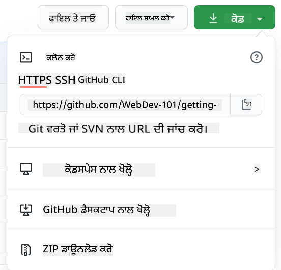

<!--
CO_OP_TRANSLATOR_METADATA:
{
  "original_hash": "05666cecb8983a72cf0ce1d18932b5b7",
  "translation_date": "2025-08-25T22:49:42+00:00",
  "source_file": "1-getting-started-lessons/2-github-basics/README.md",
  "language_code": "pa"
}
-->
# GitHub ਦਾ ਪਰਚੇਅ

ਇਸ ਪਾਠ ਵਿੱਚ ਅਸੀਂ GitHub ਦੇ ਮੁੱਢਲੇ ਸਿਧਾਂਤਾਂ ਨੂੰ ਕਵਰ ਕਰਾਂਗੇ, ਜੋ ਕਿ ਤੁਹਾਡੇ ਕੋਡ ਨੂੰ ਹੋਸਟ ਕਰਨ ਅਤੇ ਉਸ ਵਿੱਚ ਕੀਤੇ ਗਏ ਬਦਲਾਵਾਂ ਨੂੰ ਪ੍ਰਬੰਧਿਤ ਕਰਨ ਲਈ ਇੱਕ ਪਲੇਟਫਾਰਮ ਹੈ।


> ਸਕੈਚਨੋਟ [Tomomi Imura](https://twitter.com/girlie_mac) ਦੁਆਰਾ

## ਪਾਠ ਤੋਂ ਪਹਿਲਾਂ ਕਵਿਜ਼
[ਪਾਠ ਤੋਂ ਪਹਿਲਾਂ ਕਵਿਜ਼](https://ff-quizzes.netlify.app/web/quiz/3)

## ਪਰਚੇਅ

ਇਸ ਪਾਠ ਵਿੱਚ ਅਸੀਂ ਕਵਰ ਕਰਾਂਗੇ:

- ਤੁਹਾਡੇ ਕੰਪਿਊਟਰ 'ਤੇ ਕੀਤੇ ਕੰਮ ਨੂੰ ਟ੍ਰੈਕ ਕਰਨਾ
- ਹੋਰ ਲੋਕਾਂ ਨਾਲ ਪ੍ਰੋਜੈਕਟ 'ਤੇ ਕੰਮ ਕਰਨਾ
- ਓਪਨ ਸੋਰਸ ਸਾਫਟਵੇਅਰ ਵਿੱਚ ਯੋਗਦਾਨ ਦੇਣ ਦਾ ਤਰੀਕਾ

### ਪੂਰਵ ਸ਼ਰਤਾਂ

ਸ਼ੁਰੂ ਕਰਨ ਤੋਂ ਪਹਿਲਾਂ, ਤੁਹਾਨੂੰ ਜਾਂਚਣ ਦੀ ਲੋੜ ਹੈ ਕਿ Git ਇੰਸਟਾਲ ਹੈ ਜਾਂ ਨਹੀਂ। ਟਰਮੀਨਲ ਵਿੱਚ ਟਾਈਪ ਕਰੋ:  
`git --version`

ਜੇ Git ਇੰਸਟਾਲ ਨਹੀਂ ਹੈ, [Git ਡਾਊਨਲੋਡ ਕਰੋ](https://git-scm.com/downloads)। ਫਿਰ, ਟਰਮੀਨਲ ਵਿੱਚ ਆਪਣਾ ਸਥਾਨਕ Git ਪ੍ਰੋਫਾਈਲ ਸੈਟਅਪ ਕਰੋ:
* `git config --global user.name "your-name"`
* `git config --global user.email "your-email"`

ਜਾਂਚਣ ਲਈ ਕਿ Git ਪਹਿਲਾਂ ਹੀ ਕਨਫਿਗਰ ਹੈ, ਤੁਸੀਂ ਟਾਈਪ ਕਰ ਸਕਦੇ ਹੋ:
`git config --list`

ਤੁਹਾਨੂੰ ਇੱਕ GitHub ਖਾਤਾ, ਇੱਕ ਕੋਡ ਐਡੀਟਰ (ਜਿਵੇਂ Visual Studio Code), ਅਤੇ ਆਪਣਾ ਟਰਮੀਨਲ (ਜਾਂ: ਕਮਾਂਡ ਪ੍ਰਾਂਪਟ) ਖੋਲ੍ਹਣ ਦੀ ਲੋੜ ਹੋਵੇਗੀ।

[github.com](https://github.com/) 'ਤੇ ਜਾਓ ਅਤੇ ਖਾਤਾ ਬਣਾਓ ਜੇਕਰ ਤੁਸੀਂ ਪਹਿਲਾਂ ਹੀ ਨਹੀਂ ਕੀਤਾ, ਜਾਂ ਲੌਗਇਨ ਕਰੋ ਅਤੇ ਆਪਣੀ ਪ੍ਰੋਫਾਈਲ ਭਰੋ।

✅ GitHub ਦੁਨੀਆ ਵਿੱਚ ਇੱਕੋ ਇਕ ਕੋਡ ਰਿਪੋਜ਼ਟਰੀ ਨਹੀਂ ਹੈ; ਹੋਰ ਵੀ ਹਨ, ਪਰ GitHub ਸਭ ਤੋਂ ਪ੍ਰਸਿੱਧ ਹੈ।

### ਤਿਆਰੀ

ਤੁਹਾਨੂੰ ਆਪਣੇ ਸਥਾਨਕ ਕੰਪਿਊਟਰ (ਲੈਪਟਾਪ ਜਾਂ PC) 'ਤੇ ਇੱਕ ਕੋਡ ਪ੍ਰੋਜੈਕਟ ਵਾਲਾ ਫੋਲਡਰ ਅਤੇ GitHub 'ਤੇ ਇੱਕ ਜਨਤਕ ਰਿਪੋਜ਼ਟਰੀ ਦੀ ਲੋੜ ਹੋਵੇਗੀ, ਜੋ ਦੂਜਿਆਂ ਦੇ ਪ੍ਰੋਜੈਕਟਾਂ ਵਿੱਚ ਯੋਗਦਾਨ ਦੇਣ ਦਾ ਉਦਾਹਰਨ ਸੇਵਾ ਕਰੇਗਾ।

---

## ਕੋਡ ਪ੍ਰਬੰਧਨ

ਮੰਨ ਲਓ ਕਿ ਤੁਹਾਡੇ ਕੋਲ ਸਥਾਨਕ ਤੌਰ 'ਤੇ ਇੱਕ ਫੋਲਡਰ ਹੈ ਜਿਸ ਵਿੱਚ ਕੁਝ ਕੋਡ ਪ੍ਰੋਜੈਕਟ ਹੈ ਅਤੇ ਤੁਸੀਂ Git ਵਰਤ ਕੇ ਆਪਣੀ ਤਰੱਕੀ ਟ੍ਰੈਕ ਕਰਨਾ ਸ਼ੁਰੂ ਕਰਨਾ ਚਾਹੁੰਦੇ ਹੋ - ਵਰਜਨ ਕੰਟਰੋਲ ਸਿਸਟਮ। ਕੁਝ ਲੋਕ Git ਦੀ ਵਰਤੋਂ ਨੂੰ ਆਪਣੇ ਭਵਿੱਖ ਦੇ ਆਪ ਨੂੰ ਪਿਆਰ ਭਰੀ ਚਿੱਠੀ ਲਿਖਣ ਦੇ ਨਾਲ ਤੁਲਨਾ ਕਰਦੇ ਹਨ। ਜੇ ਤੁਸੀਂ ਚੰਗੇ "ਕਮਿਟ ਮੈਸੇਜ" ਲਿਖਦੇ ਹੋ, ਤਾਂ ਦਿਨਾਂ, ਹਫ਼ਤਿਆਂ ਜਾਂ ਮਹੀਨਿਆਂ ਬਾਅਦ ਆਪਣੇ ਕਮਿਟ ਮੈਸੇਜ ਪੜ੍ਹ ਕੇ ਤੁਸੀਂ ਯਾਦ ਕਰ ਸਕਦੇ ਹੋ ਕਿ ਤੁਸੀਂ ਕਿਉਂ ਕੋਈ ਫੈਸਲਾ ਕੀਤਾ ਸੀ, ਜਾਂ "ਰੋਲਬੈਕ" ਕਰ ਸਕਦੇ ਹੋ।

### ਟਾਸਕ: ਰਿਪੋਜ਼ਟਰੀ ਬਣਾਓ ਅਤੇ ਕੋਡ ਕਮਿਟ ਕਰੋ  

> ਵੀਡੀਓ ਦੇਖੋ  
> 
> [](https://www.youtube.com/watch?v=9R31OUPpxU4)

1. **GitHub 'ਤੇ ਰਿਪੋਜ਼ਟਰੀ ਬਣਾਓ**। GitHub.com 'ਤੇ, ਰਿਪੋਜ਼ਟਰੀਜ਼ ਟੈਬ ਵਿੱਚ ਜਾਂ ਨੈਵੀਗੇਸ਼ਨ ਬਾਰ ਦੇ ਸਿਖਰ-ਸੱਜੇ ਵਿੱਚ, **ਨਵਾਂ ਰਿਪੋ** ਬਟਨ ਲੱਭੋ।

   1. ਆਪਣੇ ਰਿਪੋਜ਼ਟਰੀ (ਫੋਲਡਰ) ਨੂੰ ਇੱਕ ਨਾਮ ਦਿਓ।
   1. **ਰਿਪੋਜ਼ਟਰੀ ਬਣਾਓ** ਚੁਣੋ।

1. **ਆਪਣੇ ਵਰਕਿੰਗ ਫੋਲਡਰ ਵਿੱਚ ਜਾਓ**। ਆਪਣੇ ਟਰਮੀਨਲ ਵਿੱਚ, ਉਸ ਫੋਲਡਰ (ਜਿਸਨੂੰ ਡਾਇਰੈਕਟਰੀ ਵੀ ਕਿਹਾ ਜਾਂਦਾ ਹੈ) ਵਿੱਚ ਸਵਿੱਚ ਕਰੋ ਜਿਸਨੂੰ ਤੁਸੀਂ ਟ੍ਰੈਕ ਕਰਨਾ ਸ਼ੁਰੂ ਕਰਨਾ ਚਾਹੁੰਦੇ ਹੋ। ਟਾਈਪ ਕਰੋ:

   ```bash
   cd [name of your folder]
   ```

1. **Git ਰਿਪੋਜ਼ਟਰੀ ਸ਼ੁਰੂ ਕਰੋ**। ਆਪਣੇ ਪ੍ਰੋਜੈਕਟ ਵਿੱਚ ਟਾਈਪ ਕਰੋ:

   ```bash
   git init
   ```

1. **ਸਥਿਤੀ ਦੀ ਜਾਂਚ ਕਰੋ**। ਆਪਣੀ ਰਿਪੋਜ਼ਟਰੀ ਦੀ ਸਥਿਤੀ ਦੀ ਜਾਂਚ ਕਰਨ ਲਈ ਟਾਈਪ ਕਰੋ:

   ```bash
   git status
   ```

   ਆਉਟਪੁੱਟ ਕੁਝ ਇਸ ਤਰ੍ਹਾਂ ਹੋ ਸਕਦੀ ਹੈ:

   ```output
   Changes not staged for commit:
   (use "git add <file>..." to update what will be committed)
   (use "git checkout -- <file>..." to discard changes in working directory)

        modified:   file.txt
        modified:   file2.txt
   ```

   ਆਮ ਤੌਰ 'ਤੇ `git status` ਕਮਾਂਡ ਤੁਹਾਨੂੰ ਇਹ ਦੱਸਦੀ ਹੈ ਕਿ ਕਿਹੜੀਆਂ ਫਾਈਲਾਂ ਰਿਪੋ ਵਿੱਚ _ਸੇਵ_ ਕਰਨ ਲਈ ਤਿਆਰ ਹਨ ਜਾਂ ਉਨ੍ਹਾਂ 'ਤੇ ਬਦਲਾਅ ਹਨ ਜੋ ਤੁਸੀਂ ਸਥਿਰ ਕਰਨਾ ਚਾਹੁੰਦੇ ਹੋ।

1. **ਟ੍ਰੈਕਿੰਗ ਲਈ ਸਾਰੀਆਂ ਫਾਈਲਾਂ ਸ਼ਾਮਲ ਕਰੋ**  
   ਇਸਨੂੰ ਫਾਈਲਾਂ ਨੂੰ ਸਟੇਜ ਕਰਨ/ਸਟੇਜਿੰਗ ਖੇਤਰ ਵਿੱਚ ਸ਼ਾਮਲ ਕਰਨ ਦੇ ਤੌਰ 'ਤੇ ਵੀ ਕਿਹਾ ਜਾਂਦਾ ਹੈ।

   ```bash
   git add .
   ```

   `git add` ਅਤੇ `.` ਆਰਗੂਮੈਂਟ ਦਰਸਾਉਂਦਾ ਹੈ ਕਿ ਸਾਰੀਆਂ ਫਾਈਲਾਂ ਅਤੇ ਬਦਲਾਅ ਟ੍ਰੈਕਿੰਗ ਲਈ ਹਨ।

1. **ਚੁਣੀ ਗਈ ਫਾਈਲਾਂ ਟ੍ਰੈਕਿੰਗ ਲਈ ਸ਼ਾਮਲ ਕਰੋ**

   ```bash
   git add [file or folder name]
   ```

   ਇਹ ਸਾਨੂੰ ਸਟੇਜਿੰਗ ਖੇਤਰ ਵਿੱਚ ਸਿਰਫ਼ ਚੁਣੀ ਗਈ ਫਾਈਲਾਂ ਸ਼ਾਮਲ ਕਰਨ ਵਿੱਚ ਮਦਦ ਕਰਦਾ ਹੈ ਜਦੋਂ ਅਸੀਂ ਸਾਰੀਆਂ ਫਾਈਲਾਂ ਨੂੰ ਇੱਕ ਵਾਰ ਵਿੱਚ ਕਮਿਟ ਨਹੀਂ ਕਰਨਾ ਚਾਹੁੰਦੇ।

1. **ਸਾਰੀਆਂ ਫਾਈਲਾਂ ਨੂੰ ਅਨਸਟੇਜ ਕਰੋ**

   ```bash
   git reset
   ```

   ਇਹ ਕਮਾਂਡ ਸਾਨੂੰ ਇੱਕ ਵਾਰ ਵਿੱਚ ਸਾਰੀਆਂ ਫਾਈਲਾਂ ਨੂੰ ਅਨਸਟੇਜ ਕਰਨ ਵਿੱਚ ਮਦਦ ਕਰਦੀ ਹੈ।

1. **ਇੱਕ ਖਾਸ ਫਾਈਲ ਨੂੰ ਅਨਸਟੇਜ ਕਰੋ**

   ```bash
   git reset [file or folder name]
   ```

   ਇਹ ਕਮਾਂਡ ਸਾਨੂੰ ਇੱਕ ਵਾਰ ਵਿੱਚ ਸਿਰਫ਼ ਇੱਕ ਖਾਸ ਫਾਈਲ ਨੂੰ ਅਨਸਟੇਜ ਕਰਨ ਵਿੱਚ ਮਦਦ ਕਰਦੀ ਹੈ ਜਿਸਨੂੰ ਅਸੀਂ ਅਗਲੇ ਕਮਿਟ ਵਿੱਚ ਸ਼ਾਮਲ ਨਹੀਂ ਕਰਨਾ ਚਾਹੁੰਦੇ।

1. **ਆਪਣਾ ਕੰਮ ਸਥਿਰ ਕਰੋ**। ਇਸ ਪੜਾਅ 'ਤੇ ਤੁਸੀਂ ਫਾਈਲਾਂ ਨੂੰ ਇੱਕ ਸਟੇਜਿੰਗ ਖੇਤਰ ਵਿੱਚ ਸ਼ਾਮਲ ਕੀਤਾ ਹੈ। ਇਹ ਇੱਕ ਥਾਂ ਹੈ ਜਿੱਥੇ Git ਤੁਹਾਡੀਆਂ ਫਾਈਲਾਂ ਨੂੰ ਟ੍ਰੈਕ ਕਰ ਰਿਹਾ ਹੈ। ਬਦਲਾਅ ਨੂੰ ਸਥਾਈ ਬਣਾਉਣ ਲਈ ਤੁਹਾਨੂੰ ਫਾਈਲਾਂ ਨੂੰ _ਕਮਿਟ_ ਕਰਨਾ ਪਵੇਗਾ। _ਕਮਿਟ_ ਬਣਾਉਣ ਲਈ `git commit` ਕਮਾਂਡ ਦੀ ਵਰਤੋਂ ਕਰੋ। _ਕਮਿਟ_ ਤੁਹਾਡੇ ਰਿਪੋ ਦੇ ਇਤਿਹਾਸ ਵਿੱਚ ਇੱਕ ਸੇਵਿੰਗ ਪਾਇੰਟ ਨੂੰ ਦਰਸਾਉਂਦਾ ਹੈ। _ਕਮਿਟ_ ਬਣਾਉਣ ਲਈ ਹੇਠਾਂ ਦਿੱਤੇ ਕਮਾਂਡ ਨੂੰ ਟਾਈਪ ਕਰੋ:

   ```bash
   git commit -m "first commit"
   ```

   ਇਹ ਤੁਹਾਡੀਆਂ ਸਾਰੀਆਂ ਫਾਈਲਾਂ ਨੂੰ ਕਮਿਟ ਕਰਦਾ ਹੈ, "ਪਹਿਲਾ ਕਮਿਟ" ਮੈਸੇਜ ਸ਼ਾਮਲ ਕਰਦਾ ਹੈ। ਭਵਿੱਖ ਦੇ ਕਮਿਟ ਮੈਸੇਜਾਂ ਲਈ ਤੁਸੀਂ ਆਪਣੇ ਬਦਲਾਅ ਦੇ ਕਿਸਮ ਨੂੰ ਦਰਸਾਉਣ ਲਈ ਵਧੇਰੇ ਵੇਰਵੇ ਵਾਲੇ ਵਰਣਨ ਦੀ ਵਰਤੋਂ ਕਰਨਾ ਚਾਹੁੰਦੇ ਹੋ।

1. **ਆਪਣੇ ਸਥਾਨਕ Git ਰਿਪੋ ਨੂੰ GitHub ਨਾਲ ਜੁੜੋ**। ਇੱਕ Git ਰਿਪੋ ਤੁਹਾਡੇ ਕੰਪਿਊਟਰ 'ਤੇ ਚੰਗਾ ਹੈ ਪਰ ਕਿਸੇ ਸਮੇਂ ਤੁਸੀਂ ਆਪਣੀਆਂ ਫਾਈਲਾਂ ਦਾ ਬੈਕਅੱਪ ਕਿਤੇ ਕਰਨਾ ਚਾਹੁੰਦੇ ਹੋ ਅਤੇ ਹੋਰ ਲੋਕਾਂ ਨੂੰ ਆਪਣੇ ਰਿਪੋ 'ਤੇ ਕੰਮ ਕਰਨ ਲਈ ਸੱਦਾ ਦੇਣਾ ਚਾਹੁੰਦੇ ਹੋ। ਇੱਕ ਸ਼ਾਨਦਾਰ ਥਾਂ GitHub ਹੈ। ਯਾਦ ਕਰੋ ਕਿ ਅਸੀਂ ਪਹਿਲਾਂ ਹੀ GitHub 'ਤੇ ਇੱਕ ਰਿਪੋ ਬਣਾਇਆ ਹੈ ਇਸ ਲਈ ਸਿਰਫ਼ ਸਥਾਨਕ Git ਰਿਪੋ ਨੂੰ GitHub ਨਾਲ ਜੁੜਨ ਦੀ ਲੋੜ ਹੈ। `git remote add` ਕਮਾਂਡ ਇਹ ਕੰਮ ਕਰੇਗੀ। ਹੇਠਾਂ ਦਿੱਤੇ ਕਮਾਂਡ ਨੂੰ ਟਾਈਪ ਕਰੋ:

   > ਨੋਟ, ਕਮਾਂਡ ਟਾਈਪ ਕਰਨ ਤੋਂ ਪਹਿਲਾਂ ਆਪਣੇ GitHub ਰਿਪੋ ਪੇਜ 'ਤੇ ਜਾਓ ਅਤੇ ਰਿਪੋਜ਼ਟਰੀ URL ਲੱਭੋ। ਤੁਸੀਂ ਇਸਨੂੰ ਹੇਠਾਂ ਦਿੱਤੇ ਕਮਾਂਡ ਵਿੱਚ ਵਰਤੋਂਗੇ। ```https://github.com/username/repository_name.git``` ਨੂੰ ਆਪਣੇ GitHub URL ਨਾਲ ਬਦਲੋ।

   ```bash
   git remote add origin https://github.com/username/repository_name.git
   ```

   ਇਹ "origin" ਨਾਮਕ ਇੱਕ _remote_ ਜਾਂ ਕਨੈਕਸ਼ਨ ਬਣਾਉਂਦਾ ਹੈ ਜੋ ਪਹਿਲਾਂ ਬਣਾਈ ਗਈ GitHub ਰਿਪੋਜ਼ਟਰੀ ਨੂੰ ਦਰਸਾਉਂਦਾ ਹੈ।

1. **ਸਥਾਨਕ ਫਾਈਲਾਂ GitHub 'ਤੇ ਭੇਜੋ**। ਹੁਣ ਤੱਕ ਤੁਸੀਂ ਸਥਾਨਕ ਰਿਪੋ ਅਤੇ GitHub ਰਿਪੋਜ਼ਟਰੀ ਦੇ ਵਿਚਕਾਰ ਇੱਕ _ਕਨੈਕਸ਼ਨ_ ਬਣਾਇਆ ਹੈ। ਆਓ ਹੇਠਾਂ ਦਿੱਤੇ ਕਮਾਂਡ `git push` ਦੀ ਵਰਤੋਂ ਕਰਕੇ ਇਹ ਫਾਈਲਾਂ GitHub 'ਤੇ ਭੇਜੀਏ:

   > ਨੋਟ, ਤੁਹਾਡੀ ਬ੍ਰਾਂਚ ਦਾ ਨਾਮ ```main``` ਤੋਂ ਵੱਖਰਾ ਹੋ ਸਕਦਾ ਹੈ।

   ```bash
   git push -u origin main
   ```

   ਇਹ ਤੁਹਾਡੇ "main" ਬ੍ਰਾਂਚ ਵਿੱਚ ਕੀਤੇ ਕਮਿਟ ਨੂੰ GitHub 'ਤੇ ਭੇਜਦਾ ਹੈ।

2. **ਹੋਰ ਬਦਲਾਅ ਸ਼ਾਮਲ ਕਰਨ ਲਈ**। ਜੇ ਤੁਸੀਂ ਬਦਲਾਅ ਕਰਨਾ ਜਾਰੀ ਰੱਖਣਾ ਚਾਹੁੰਦੇ ਹੋ ਅਤੇ ਉਹ GitHub 'ਤੇ ਭੇਜਣਾ ਚਾਹੁੰਦੇ ਹੋ ਤਾਂ ਤੁਹਾਨੂੰ ਸਿਰਫ਼ ਹੇਠਾਂ ਦਿੱਤੇ ਤਿੰਨ ਕਮਾਂਡਾਂ ਦੀ ਵਰਤੋਂ ਕਰਨ ਦੀ ਲੋੜ ਹੋਵੇਗੀ:

   ```bash
   git add .
   git commit -m "type your commit message here"
   git push
   ```

   > ਟਿਪ, ਤੁਸੀਂ `.gitignore` ਫਾਈਲ ਨੂੰ ਅਪਨਾਉਣਾ ਚਾਹੁੰਦੇ ਹੋ ਤਾਂ ਜੋ ਉਹ ਫਾਈਲਾਂ ਜੋ ਤੁਸੀਂ ਟ੍ਰੈਕ ਨਹੀਂ ਕਰਨਾ ਚਾਹੁੰਦੇ GitHub 'ਤੇ ਨਾ ਦਿਖਾਈ ਦੇਣ - ਜਿਵੇਂ ਕਿ ਉਹ ਨੋਟਸ ਫਾਈਲ ਜੋ ਤੁਸੀਂ ਉਸੇ ਫੋਲਡਰ ਵਿੱਚ ਸਟੋਰ ਕਰਦੇ ਹੋ ਪਰ ਜਨਤਕ ਰਿਪੋਜ਼ਟਰੀ 'ਤੇ ਕੋਈ ਥਾਂ ਨਹੀਂ ਹੈ। ਤੁਸੀਂ `.gitignore` ਫਾਈਲਾਂ ਲਈ ਟੈਂਪਲੇਟ [.gitignore templates](https://github.com/github/gitignore) 'ਤੇ ਲੱਭ ਸਕਦੇ ਹੋ।

#### ਕਮਿਟ ਮੈਸੇਜ

ਇੱਕ ਵਧੀਆ Git ਕਮਿਟ ਸਬਜੈਕਟ ਲਾਈਨ ਹੇਠਾਂ ਦਿੱਤੇ ਵਾਕ ਨੂੰ ਪੂਰਾ ਕਰਦੀ ਹੈ:  
ਜੇ ਲਾਗੂ ਕੀਤਾ ਗਿਆ, ਤਾਂ ਇਹ ਕਮਿਟ <ਤੁਹਾਡੀ ਸਬਜੈਕਟ ਲਾਈਨ ਇੱਥੇ> ਕਰੇਗਾ।

ਸਬਜੈਕਟ ਲਈ ਹੁਕਮਵਾਚਕ, ਵਰਤਮਾਨ ਕਾਲ ਦਾ ਪ੍ਰਯੋਗ ਕਰੋ: "change" ਨਾ ਕਿ "changed" ਜਾਂ "changes"।  
ਜਿਵੇਂ ਸਬਜੈਕਟ ਵਿੱਚ, ਬਾਡੀ (ਵਿਕਲਪਿਕ) ਵਿੱਚ ਵੀ ਹੁਕਮਵਾਚਕ, ਵਰਤਮਾਨ ਕਾਲ ਦੀ ਵਰਤੋਂ ਕਰੋ। ਬਾਡੀ ਵਿੱਚ ਬਦਲਾਅ ਲਈ ਪ੍ਰੇਰਣਾ ਸ਼ਾਮਲ ਹੋਣੀ ਚਾਹੀਦੀ ਹੈ ਅਤੇ ਇਸਨੂੰ ਪਿਛਲੇ ਵਿਹਾਰ ਨਾਲ ਵਿਰੋਧ ਕਰਨਾ ਚਾਹੀਦਾ ਹੈ। ਤੁਸੀਂ `ਕਿਉਂ` ਦੀ ਵਿਆਖਿਆ ਕਰ ਰਹੇ ਹੋ, ਨਾ ਕਿ `ਕਿਵੇਂ`।

✅ ਕੁਝ ਮਿੰਟ ਲਓ ਅਤੇ GitHub 'ਤੇ ਘੁੰਮੋ। ਕੀ ਤੁਸੀਂ ਇੱਕ ਬਹੁਤ ਵਧੀਆ ਕਮਿਟ ਮੈਸੇਜ ਲੱਭ ਸਕਦੇ ਹੋ? ਕੀ ਤੁਸੀਂ ਇੱਕ ਬਹੁਤ ਹੀ ਘੱਟ ਮੈਸੇਜ ਲੱਭ ਸਕਦੇ ਹੋ? ਤੁਹਾਡੇ ਵਿਚਾਰ ਵਿੱਚ ਕਮਿਟ ਮੈਸੇਜ ਵਿੱਚ ਸਭ ਤੋਂ ਮਹੱਤਵਪੂਰਨ ਅਤੇ ਲਾਭਦਾਇਕ ਜਾਣਕਾਰੀ ਕੀ ਹੈ?

### ਟਾਸਕ: ਸਹਿਯੋਗ ਕਰੋ

GitHub 'ਤੇ ਚੀਜ਼ਾਂ ਪਾਉਣ ਦਾ ਮੁੱਖ ਕਾਰਨ ਹੋਰ ਡਿਵੈਲਪਰਾਂ ਨਾਲ ਸਹਿਯੋਗ ਕਰਨਾ ਸੀ।

## ਹੋਰ ਲੋਕਾਂ ਨਾਲ ਪ੍ਰੋਜੈਕਟ 'ਤੇ ਕੰਮ ਕਰਨਾ

> ਵੀਡੀਓ ਦੇਖੋ  
> 
> [](https://www.youtube.com/watch?v=bFCM-PC3cu8)

ਆਪਣੀ ਰਿਪੋਜ਼ਟਰੀ ਵਿੱਚ, `Insights > Community` 'ਤੇ ਜਾਓ ਤਾਂ ਜੋ ਤੁਸੀਂ ਦੇਖ ਸਕੋ ਕਿ ਤੁਹਾਡਾ ਪ੍ਰੋਜੈਕਟ ਸਿਫਾਰਸ਼ੀ ਕਮਿਊਨਿਟੀ ਮਿਆਰਾਂ ਨਾਲ ਕਿਵੇਂ ਤੁਲਨਾ ਕਰਦਾ ਹੈ।

ਇੱਥੇ ਕੁਝ ਚੀਜ਼ਾਂ ਹਨ ਜੋ ਤੁਹਾਡੇ GitHub ਰਿਪੋ ਨੂੰ ਸੁਧਾਰ ਸਕਦੀਆਂ ਹਨ:
- **ਵਰਣਨ**। ਕੀ ਤੁਸੀਂ ਆਪਣੇ ਪ੍ਰੋਜੈਕਟ ਲਈ ਵਰਣਨ ਸ਼ਾਮਲ ਕੀਤਾ?
- **README**। ਕੀ ਤੁਸੀਂ README ਸ਼ਾਮਲ ਕੀਤਾ? GitHub [README](https://docs.github.com/articles/about-readmes/?WT.mc_id=academic-77807-sagibbon) ਲਿਖਣ ਲਈ ਮਦਦ ਪ੍ਰਦਾਨ ਕਰਦਾ ਹੈ।
- **ਯੋਗਦਾਨ ਦੇਣ ਦੇ ਨਿਯਮ**। ਕੀ ਤੁਹਾਡੇ ਪ੍ਰੋਜੈਕਟ ਵਿੱਚ [ਯੋਗਦਾਨ ਦੇਣ ਦੇ ਨਿਯਮ](https://docs.github.com/articles/setting-guidelines-for-repository-contributors/?WT.mc_id=academic-77807-sagibbon) ਹਨ?
- **ਚਾਲ-ਚਲਣ ਦਾ ਕੋਡ**। ਇੱਕ [ਚਾਲ-ਚਲਣ ਦਾ ਕੋਡ](https://docs.github.com/articles/adding-a-code-of-conduct-to-your-project/)।
- **ਲਾਇਸੰਸ**। ਸ਼ਾਇਦ ਸਭ ਤੋਂ ਮਹੱਤਵਪੂਰਨ, ਇੱਕ [ਲਾਇਸੰਸ](https://docs.github.com/articles/adding-a-license-to-a-repository/)।

ਇਹ ਸਾਰੇ ਸਰੋਤ ਨਵੇਂ ਟੀਮ ਮੈਂਬਰਾਂ ਨੂੰ ਸ਼ੁਰੂ ਕਰਨ ਵਿੱਚ ਲਾਭਦਾਇਕ ਹੋਣਗੇ। ਅਤੇ ਇਹ ਆਮ ਤੌਰ 'ਤੇ ਉਹ ਚੀਜ਼ਾਂ ਹਨ ਜੋ ਨਵੇਂ ਯੋਗਦਾਨਕਰਤਾ ਤੁਹਾਡੇ ਕੋਡ ਨੂੰ ਦੇਖਣ ਤੋਂ ਪਹਿਲਾਂ ਦੇਖਦੇ ਹਨ, ਇਹ ਪਤਾ ਕਰਨ ਲਈ ਕਿ ਕੀ ਤੁਹਾਡਾ ਪ੍ਰੋਜੈਕਟ ਉਹ ਥਾਂ ਹੈ ਜਿੱਥੇ ਉਹ ਆਪਣਾ ਸਮਾਂ ਬਿਤਾਉਣਾ ਚਾਹੁੰਦੇ ਹਨ।

✅ README ਫਾਈਲਾਂ, ਹਾਲਾਂਕਿ ਉਹ ਤਿਆਰ ਕਰਨ ਵਿੱਚ ਸਮਾਂ ਲੈਂਦੀਆਂ ਹਨ, ਅਕਸਰ ਵਿਅਸਤ ਰਖਵਾਲਿਆਂ ਦੁਆਰਾ ਅਣਗੌਲੀਆਂ ਕੀਤੀਆਂ ਜਾਂਦੀਆਂ ਹਨ। ਕੀ ਤੁਸੀਂ ਇੱਕ ਵਿਸ਼ੇਸ਼ ਤੌਰ 'ਤੇ ਵੇਰਵੇਦਾਰ README ਦਾ ਉਦਾਹਰਨ ਲੱਭ ਸਕਦੇ ਹੋ? ਨੋਟ: ਕੁਝ [ਉਪਕਰਣ](https://www.makeareadme.com/) ਹਨ ਜੋ ਚੰਗੇ README ਬਣਾਉਣ ਵਿੱਚ ਮਦਦ ਕਰਦੇ ਹਨ ਜੋ ਤੁਸੀਂ ਅਜ਼ਮਾਉਣਾ ਚਾਹੁੰਦੇ ਹੋ।

### ਟਾਸਕ: ਕੁਝ ਕੋਡ ਮਰਜ ਕਰੋ

ਯੋਗਦਾਨ ਦੇਣ ਵਾਲੇ ਦਸਤਾਵੇਜ਼ ਲੋਕਾਂ ਨੂੰ ਪ੍ਰੋਜੈਕਟ ਵਿੱਚ ਯੋਗਦਾਨ ਦੇਣ ਵਿੱਚ ਮਦਦ ਕਰਦੇ ਹਨ। ਇਹ ਵਿਆਖਿਆ ਕਰਦਾ ਹੈ ਕਿ ਤੁਸੀਂ ਕਿਸ ਕਿਸਮ ਦੇ ਯੋਗਦਾਨ ਦੀ ਭਾਲ ਕਰ ਰਹੇ ਹੋ ਅਤੇ ਪ੍ਰਕਿਰਿਆ ਕਿਵੇਂ ਕੰਮ ਕਰਦੀ ਹੈ। ਯੋਗਦਾਨਕਰਤਾ ਤੁਹਾਡੇ GitHub ਰਿਪੋ 'ਤੇ ਯੋਗਦਾਨ ਦੇਣ ਲਈ ਕਈ ਕਦਮਾਂ ਵਿੱਚੋਂ ਗੁਜ਼ਰਣ ਦੀ ਲੋੜ ਹੋਵੇਗੀ:

1. **ਤੁਹਾਡਾ ਰਿਪੋ ਫੋਰਕ ਕਰਨਾ**। ਤੁਸੀਂ ਸ਼ਾਇਦ ਲੋਕਾਂ ਨੂੰ ਆਪਣੇ ਪ੍ਰੋਜੈਕਟ ਨੂੰ _ਫੋਰਕ_ ਕਰਨ ਲਈ ਕਹੋਗੇ। ਫੋਰਕ ਕਰਨ ਦਾ ਮਤਲਬ ਹੈ ਕਿ ਉਹ ਆਪਣੇ GitHub ਪ੍ਰੋਫਾਈਲ 'ਤੇ ਤੁਹਾਡੇ ਰਿਪੋਜ਼ਟਰੀ ਦੀ ਨਕਲ ਬਣਾਉਣਗੇ।
1. **ਕਲੋਨ**। ਇਸ ਤੋਂ ਬਾਅਦ ਉਹ ਪ੍ਰੋਜੈਕਟ ਨੂੰ ਆਪਣੇ ਸਥਾਨਕ ਕੰਪਿਊਟਰ 'ਤੇ ਕਲੋਨ ਕਰਨਗੇ।
1. **ਬ੍ਰਾਂਚ ਬਣਾਉਣਾ**। ਤੁਸੀਂ
ਗਿਟਹੱਬ ਪੇਜ 'ਤੇ ਜਾਓ ਅਤੇ ਫੋਰਕ ਕੀਤੇ ਰਿਪੋ ਲਈ ਰਿਮੋਟ ਬ੍ਰਾਂਚ ਨੂੰ ਹਟਾਓ ਜੋ ਤੁਸੀਂ ਇਸ 'ਤੇ ਪੁਸ਼ ਕੀਤਾ ਸੀ।

`ਪੁਲ ਰਿਕਵੈਸਟ` ਇੱਕ ਮਜ਼ਾਕੀਆ ਸ਼ਬਦ ਲੱਗਦਾ ਹੈ ਕਿਉਂਕਿ ਅਸਲ ਵਿੱਚ ਤੁਸੀਂ ਆਪਣੇ ਬਦਲਾਅ ਪ੍ਰੋਜੈਕਟ ਵਿੱਚ ਪੁਸ਼ ਕਰਨਾ ਚਾਹੁੰਦੇ ਹੋ। ਪਰ ਮੇਂਟੇਨਰ (ਪ੍ਰੋਜੈਕਟ ਮਾਲਕ) ਜਾਂ ਕੋਰ ਟੀਮ ਨੂੰ ਤੁਹਾਡੇ ਬਦਲਾਅ ਨੂੰ ਪ੍ਰੋਜੈਕਟ ਦੀ "ਮੁੱਖ" ਬ੍ਰਾਂਚ ਨਾਲ ਮਿਲਾਉਣ ਤੋਂ ਪਹਿਲਾਂ ਇਸ ਬਾਰੇ ਸੋਚਣਾ ਪੈਂਦਾ ਹੈ, ਇਸ ਲਈ ਤੁਸੀਂ ਅਸਲ ਵਿੱਚ ਮੇਂਟੇਨਰ ਤੋਂ ਬਦਲਾਅ ਦਾ ਫੈਸਲਾ ਮੰਗ ਰਹੇ ਹੋ।

ਇੱਕ ਪੁਲ ਰਿਕਵੈਸਟ ਉਹ ਜਗ੍ਹਾ ਹੈ ਜਿੱਥੇ ਤੁਸੀਂ ਬ੍ਰਾਂਚ 'ਤੇ ਕੀਤੇ ਗਏ ਬਦਲਾਅ ਦੀ ਤੁਲਨਾ ਅਤੇ ਚਰਚਾ ਕਰ ਸਕਦੇ ਹੋ, ਸਮੀਖਿਆਵਾਂ, ਟਿੱਪਣੀਆਂ, ਇੰਟੀਗ੍ਰੇਟ ਕੀਤੇ ਟੈਸਟ ਅਤੇ ਹੋਰ ਬਹੁਤ ਕੁਝ। ਇੱਕ ਵਧੀਆ ਪੁਲ ਰਿਕਵੈਸਟ ਲਗਭਗ ਉਹੀ ਨਿਯਮਾਂ ਦੀ ਪਾਲਣਾ ਕਰਦਾ ਹੈ ਜਿਵੇਂ ਕਿ ਇੱਕ ਕਮਿਟ ਸੁਨੇਹਾ। ਤੁਸੀਂ ਇਸ਼ੂ ਟ੍ਰੈਕਰ ਵਿੱਚ ਇੱਕ ਇਸ਼ੂ ਦਾ ਹਵਾਲਾ ਦੇ ਸਕਦੇ ਹੋ, ਜਦੋਂ ਤੁਹਾਡਾ ਕੰਮ ਉਦਾਹਰਣ ਲਈ ਕਿਸੇ ਸਮੱਸਿਆ ਨੂੰ ਹੱਲ ਕਰਦਾ ਹੈ। ਇਹ `#` ਦੇ ਨਾਲ ਅਤੇ ਤੁਹਾਡੇ ਇਸ਼ੂ ਦੇ ਨੰਬਰ ਨਾਲ ਕੀਤਾ ਜਾਂਦਾ ਹੈ। ਉਦਾਹਰਣ ਲਈ `#97`।

🤞ਉਮੀਦ ਹੈ ਕਿ ਸਾਰੇ ਚੈਕ ਪਾਸ ਹੋ ਜਾਣ ਅਤੇ ਪ੍ਰੋਜੈਕਟ ਮਾਲਕ ਤੁਹਾਡੇ ਬਦਲਾਅ ਨੂੰ ਪ੍ਰੋਜੈਕਟ ਵਿੱਚ ਮਿਲਾ ਲੈਣ🤞

ਆਪਣੀ ਮੌਜੂਦਾ ਲੋਕਲ ਵਰਕਿੰਗ ਬ੍ਰਾਂਚ ਨੂੰ GitHub 'ਤੇ ਸੰਬੰਧਤ ਰਿਮੋਟ ਬ੍ਰਾਂਚ ਤੋਂ ਸਾਰੇ ਨਵੇਂ ਕਮਿਟਸ ਨਾਲ ਅਪਡੇਟ ਕਰੋ:

`git pull`

## ਓਪਨ ਸੋਰਸ ਵਿੱਚ ਯੋਗਦਾਨ ਦੇਣ ਦਾ ਤਰੀਕਾ

ਸਭ ਤੋਂ ਪਹਿਲਾਂ, ਆਓ GitHub 'ਤੇ ਇੱਕ ਰਿਪੋਜ਼ਟਰੀ (ਜਾਂ **ਰਿਪੋ**) ਲੱਭੀਏ ਜੋ ਤੁਹਾਡੇ ਲਈ ਦਿਲਚਸਪ ਹੋਵੇ ਅਤੇ ਜਿਸ ਵਿੱਚ ਤੁਸੀਂ ਕੋਈ ਬਦਲਾਅ ਯੋਗਦਾਨ ਦੇਣਾ ਚਾਹੁੰਦੇ ਹੋ। ਤੁਸੀਂ ਇਸ ਦੀ ਸਮੱਗਰੀ ਨੂੰ ਆਪਣੇ ਕੰਪਿਊਟਰ 'ਤੇ ਕਾਪੀ ਕਰਨਾ ਚਾਹੋਗੇ।

✅ 'ਬਿਗਿਨਰ-ਫ੍ਰੈਂਡਲੀ' ਰਿਪੋਜ਼ ਲੱਭਣ ਦਾ ਇੱਕ ਵਧੀਆ ਤਰੀਕਾ ਹੈ [ਟੈਗ 'ਗੁੱਡ-ਫਰਸਟ-ਇਸ਼ੂ' ਨਾਲ ਖੋਜ ਕਰਨਾ](https://github.blog/2020-01-22-browse-good-first-issues-to-start-contributing-to-open-source/)।



ਕੋਡ ਕਾਪੀ ਕਰਨ ਦੇ ਕਈ ਤਰੀਕੇ ਹਨ। ਇੱਕ ਤਰੀਕਾ ਹੈ ਰਿਪੋਜ਼ਟਰੀ ਦੀ ਸਮੱਗਰੀ ਨੂੰ HTTPS, SSH ਜਾਂ GitHub CLI (ਕਮਾਂਡ ਲਾਈਨ ਇੰਟਰਫੇਸ) ਦੀ ਵਰਤੋਂ ਕਰਕੇ "ਕਲੋਨ" ਕਰਨਾ।

ਆਪਣੇ ਟਰਮੀਨਲ ਨੂੰ ਖੋਲ੍ਹੋ ਅਤੇ ਰਿਪੋਜ਼ਟਰੀ ਨੂੰ ਇਸ ਤਰ੍ਹਾਂ ਕਲੋਨ ਕਰੋ:
`git clone https://github.com/ProjectURL`

ਪ੍ਰੋਜੈਕਟ 'ਤੇ ਕੰਮ ਕਰਨ ਲਈ, ਸਹੀ ਫੋਲਡਰ 'ਚ ਜਾਓ:
`cd ProjectURL`

ਤੁਸੀਂ [Codespaces](https://github.com/features/codespaces), GitHub ਦਾ ਇੰਬੈਡਿਡ ਕੋਡ ਐਡੀਟਰ / ਕਲਾਉਡ ਡਿਵੈਲਪਮੈਂਟ ਐਨਵਾਇਰਨਮੈਂਟ, ਜਾਂ [GitHub Desktop](https://desktop.github.com/) ਦੀ ਵਰਤੋਂ ਕਰਕੇ ਪੂਰੇ ਪ੍ਰੋਜੈਕਟ ਨੂੰ ਖੋਲ੍ਹ ਸਕਦੇ ਹੋ।

ਅੰਤ ਵਿੱਚ, ਤੁਸੀਂ ਕੋਡ ਨੂੰ ਜ਼ਿਪ ਕੀਤੇ ਫੋਲਡਰ ਵਿੱਚ ਡਾਊਨਲੋਡ ਕਰ ਸਕਦੇ ਹੋ।

### GitHub ਬਾਰੇ ਕੁਝ ਹੋਰ ਦਿਲਚਸਪ ਗੱਲਾਂ

ਤੁਸੀਂ GitHub 'ਤੇ ਕਿਸੇ ਵੀ ਪਬਲਿਕ ਰਿਪੋਜ਼ਟਰੀ ਨੂੰ ਸਟਾਰ, ਵਾਚ ਜਾਂ "ਫੋਰਕ" ਕਰ ਸਕਦੇ ਹੋ। ਤੁਸੀਂ ਆਪਣੇ ਸਟਾਰ ਕੀਤੇ ਰਿਪੋਜ਼ਟਰੀਜ਼ ਨੂੰ ਉੱਪਰ-ਸੱਜੇ ਡ੍ਰਾਪਡਾਊਨ ਮੀਨੂ ਵਿੱਚ ਲੱਭ ਸਕਦੇ ਹੋ। ਇਹ ਬੁੱਕਮਾਰਕ ਕਰਨ ਵਰਗਾ ਹੈ, ਪਰ ਕੋਡ ਲਈ।

ਪ੍ਰੋਜੈਕਟਾਂ ਵਿੱਚ ਇੱਕ ਇਸ਼ੂ ਟ੍ਰੈਕਰ ਹੁੰਦਾ ਹੈ, ਜ਼ਿਆਦਾਤਰ GitHub 'ਤੇ "Issues" ਟੈਬ ਵਿੱਚ ਜਦੋਂ ਤੱਕ ਹੋਰਥਾਂ ਉੱਤੇ ਦਰਸਾਇਆ ਨਾ ਗਿਆ ਹੋਵੇ, ਜਿੱਥੇ ਲੋਕ ਪ੍ਰੋਜੈਕਟ ਨਾਲ ਸੰਬੰਧਤ ਸਮੱਸਿਆਵਾਂ 'ਤੇ ਚਰਚਾ ਕਰਦੇ ਹਨ। ਅਤੇ Pull Requests ਟੈਬ ਉਹ ਜਗ੍ਹਾ ਹੈ ਜਿੱਥੇ ਲੋਕ ਚਰਚਾ ਅਤੇ ਸਮੀਖਿਆ ਕਰਦੇ ਹਨ ਜੋ ਬਦਲਾਅ ਪ੍ਰਗਤੀ ਵਿੱਚ ਹਨ।

ਪ੍ਰੋਜੈਕਟਾਂ ਵਿੱਚ ਫੋਰਮ, ਮੇਲਿੰਗ ਲਿਸਟਾਂ ਜਾਂ ਚੈਟ ਚੈਨਲਾਂ ਜਿਵੇਂ Slack, Discord ਜਾਂ IRC ਵਿੱਚ ਵੀ ਚਰਚਾ ਹੋ ਸਕਦੀ ਹੈ।

✅ ਆਪਣੇ ਨਵੇਂ GitHub ਰਿਪੋ ਦੇ ਆਲੇ-ਦੁਆਲੇ ਦੇਖੋ ਅਤੇ ਕੁਝ ਚੀਜ਼ਾਂ ਦੀ ਕੋਸ਼ਿਸ਼ ਕਰੋ, ਜਿਵੇਂ ਸੈਟਿੰਗਾਂ ਨੂੰ ਸੋਧਣਾ, ਆਪਣੇ ਰਿਪੋ ਵਿੱਚ ਜਾਣਕਾਰੀ ਸ਼ਾਮਲ ਕਰਨਾ, ਅਤੇ ਇੱਕ ਪ੍ਰੋਜੈਕਟ ਬਣਾਉਣਾ (ਜਿਵੇਂ ਕਿ ਕਨਬਨ ਬੋਰਡ)। ਤੁਹਾਡੇ ਲਈ ਬਹੁਤ ਕੁਝ ਕਰਨ ਲਈ ਹੈ!

---

## 🚀 ਚੈਲੈਂਜ

ਇੱਕ ਦੋਸਤ ਨਾਲ ਜੋੜ ਬਣਾਓ ਅਤੇ ਇੱਕ-ਦੂਜੇ ਦੇ ਕੋਡ 'ਤੇ ਕੰਮ ਕਰੋ। ਸਾਂਝੇ ਤੌਰ 'ਤੇ ਇੱਕ ਪ੍ਰੋਜੈਕਟ ਬਣਾਓ, ਕੋਡ ਫੋਰਕ ਕਰੋ, ਬ੍ਰਾਂਚ ਬਣਾਓ, ਅਤੇ ਬਦਲਾਅ ਨੂੰ ਮਿਲਾਓ।

## ਪੋਸਟ-ਲੈਕਚਰ ਕਵਿਜ਼
[ਪੋਸਟ-ਲੈਕਚਰ ਕਵਿਜ਼](https://ff-quizzes.netlify.app/web/quiz/4)

## ਸਮੀਖਿਆ ਅਤੇ ਸਵੈ ਅਧਿਐਨ

[ਓਪਨ ਸੋਰਸ ਸੌਫਟਵੇਅਰ ਵਿੱਚ ਯੋਗਦਾਨ ਦੇਣ ਬਾਰੇ ਹੋਰ ਪੜ੍ਹੋ](https://opensource.guide/how-to-contribute/#how-to-submit-a-contribution)।

[ਗਿਟ ਚੀਟਸ਼ੀਟ](https://training.github.com/downloads/github-git-cheat-sheet/)।

ਅਭਿਆਸ ਕਰੋ, ਅਭਿਆਸ ਕਰੋ, ਅਭਿਆਸ ਕਰੋ। GitHub ਨੇ [skills.github.com](https://skills.github.com) ਰਾਹੀਂ ਵਧੀਆ ਲਰਨਿੰਗ ਪਾਥ ਉਪਲਬਧ ਕਰਵਾਏ ਹਨ:

- [GitHub 'ਤੇ ਪਹਿਲਾ ਹਫ਼ਤਾ](https://skills.github.com/#first-week-on-github)

ਤੁਸੀਂ ਹੋਰ ਉੱਚ ਪੱਧਰ ਦੇ ਕੋਰਸ ਵੀ ਲੱਭੋਗੇ।

## ਅਸਾਈਨਮੈਂਟ

[GitHub 'ਤੇ ਪਹਿਲਾ ਹਫ਼ਤਾ ਕੋਰਸ ਪੂਰਾ ਕਰੋ](https://skills.github.com/#first-week-on-github)

**ਅਸਵੀਕਾਰਨਾ**:  
ਇਹ ਦਸਤਾਵੇਜ਼ AI ਅਨੁਵਾਦ ਸੇਵਾ [Co-op Translator](https://github.com/Azure/co-op-translator) ਦੀ ਵਰਤੋਂ ਕਰਕੇ ਅਨੁਵਾਦ ਕੀਤਾ ਗਿਆ ਹੈ। ਜਦੋਂ ਕਿ ਅਸੀਂ ਸਹੀਤਾ ਲਈ ਯਤਨਸ਼ੀਲ ਹਾਂ, ਕਿਰਪਾ ਕਰਕੇ ਧਿਆਨ ਦਿਓ ਕਿ ਸਵੈਚਾਲਿਤ ਅਨੁਵਾਦਾਂ ਵਿੱਚ ਗਲਤੀਆਂ ਜਾਂ ਅਸੁਚਤਤਾਵਾਂ ਹੋ ਸਕਦੀਆਂ ਹਨ। ਮੂਲ ਦਸਤਾਵੇਜ਼ ਨੂੰ ਇਸਦੀ ਮੂਲ ਭਾਸ਼ਾ ਵਿੱਚ ਅਧਿਕਾਰਤ ਸਰੋਤ ਮੰਨਿਆ ਜਾਣਾ ਚਾਹੀਦਾ ਹੈ। ਮਹੱਤਵਪੂਰਨ ਜਾਣਕਾਰੀ ਲਈ, ਪੇਸ਼ੇਵਰ ਮਨੁੱਖੀ ਅਨੁਵਾਦ ਦੀ ਸਿਫਾਰਸ਼ ਕੀਤੀ ਜਾਂਦੀ ਹੈ। ਇਸ ਅਨੁਵਾਦ ਦੀ ਵਰਤੋਂ ਤੋਂ ਪੈਦਾ ਹੋਣ ਵਾਲੇ ਕਿਸੇ ਵੀ ਗਲਤ ਫਹਿਮੀ ਜਾਂ ਗਲਤ ਵਿਆਖਿਆ ਲਈ ਅਸੀਂ ਜ਼ਿੰਮੇਵਾਰ ਨਹੀਂ ਹਾਂ।