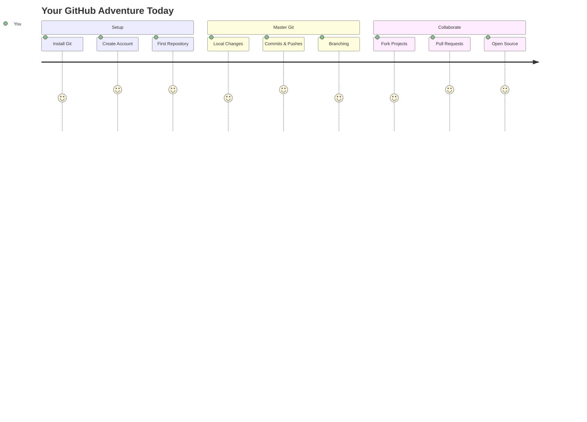

<!--
CO_OP_TRANSLATOR_METADATA:
{
  "original_hash": "0fe3ff66299b447f1c8cb34dcbf0c5ef",
  "translation_date": "2025-11-03T16:20:56+00:00",
  "source_file": "1-getting-started-lessons/2-github-basics/README.md",
  "language_code": "pa"
}
-->
# GitHub ਦਾ ਪਰਚੇ

ਹੈਲੋ, ਭਵਿੱਖ ਦੇ ਡਿਵੈਲਪਰ! 👋 ਤਿਆਰ ਹੋ ਜਾਓ ਦੁਨੀਆ ਭਰ ਦੇ ਲੱਖਾਂ ਕੋਡਰਾਂ ਵਿੱਚ ਸ਼ਾਮਲ ਹੋਣ ਲਈ? ਮੈਂ ਤੁਹਾਨੂੰ GitHub ਨਾਲ ਜਾਣੂ ਕਰਵਾਉਣ ਲਈ ਬਹੁਤ ਉਤਸਾਹਿਤ ਹਾਂ – ਇਸਨੂੰ ਪ੍ਰੋਗਰਾਮਰਾਂ ਲਈ ਸੋਸ਼ਲ ਮੀਡੀਆ ਪਲੇਟਫਾਰਮ ਵਜੋਂ ਸੋਚੋ, ਪਰ ਲੰਚ ਦੀਆਂ ਫੋਟੋਆਂ ਸਾਂਝੀਆਂ ਕਰਨ ਦੀ ਬਜਾਏ, ਅਸੀਂ ਕੋਡ ਸਾਂਝਾ ਕਰ ਰਹੇ ਹਾਂ ਅਤੇ ਇਕੱਠੇ ਸ਼ਾਨਦਾਰ ਚੀਜ਼ਾਂ ਬਣਾਉਣ ਲਈ ਕੰਮ ਕਰ ਰਹੇ ਹਾਂ!

ਇਹ ਹੈ ਜੋ ਮੈਨੂੰ ਬਿਲਕੁਲ ਹੈਰਾਨ ਕਰ ਦਿੰਦਾ ਹੈ: ਤੁਹਾਡੇ ਫੋਨ ਵਿੱਚ ਹਰ ਐਪ, ਹਰ ਵੈਬਸਾਈਟ ਜਿਸ ਨੂੰ ਤੁਸੀਂ ਵੇਖਦੇ ਹੋ, ਅਤੇ ਜ਼ਿਆਦਾਤਰ ਟੂਲ ਜੋ ਤੁਸੀਂ ਵਰਤਣਾ ਸਿੱਖਦੇ ਹੋ, ਉਹ ਡਿਵੈਲਪਰਾਂ ਦੀਆਂ ਟੀਮਾਂ ਦੁਆਰਾ ਬਣਾਈ ਗਈਆਂ ਹਨ ਜੋ GitHub ਵਰਗੇ ਪਲੇਟਫਾਰਮਾਂ 'ਤੇ ਸਹਿਯੋਗ ਕਰ ਰਹੀਆਂ ਹਨ। ਉਹ ਮਿਊਜ਼ਿਕ ਐਪ ਜਿਸ ਨੂੰ ਤੁਸੀਂ ਪਸੰਦ ਕਰਦੇ ਹੋ? ਤੁਹਾਡੇ ਵਰਗੇ ਕਿਸੇ ਨੇ ਇਸ ਵਿੱਚ ਯੋਗਦਾਨ ਪਾਇਆ। ਉਹ ਖੇਡ ਜਿਸ ਨੂੰ ਤੁਸੀਂ ਛੱਡ ਨਹੀਂ ਸਕਦੇ? ਹਾਂ, ਸੰਭਵ ਹੈ ਕਿ GitHub ਸਹਿਯੋਗ ਨਾਲ ਬਣਾਈ ਗਈ। ਅਤੇ ਹੁਣ ਤੁਸੀਂ ਉਸ ਸ਼ਾਨਦਾਰ ਕਮਿਊਨਿਟੀ ਦਾ ਹਿੱਸਾ ਬਣਨ ਦਾ ਤਰੀਕਾ ਸਿੱਖਣ ਜਾ ਰਹੇ ਹੋ!

ਮੈਨੂੰ ਪਤਾ ਹੈ ਕਿ ਸ਼ੁਰੂ ਵਿੱਚ ਇਹ ਸਭ ਕੁਝ ਬਹੁਤ ਜ਼ਿਆਦਾ ਲੱਗ ਸਕਦਾ ਹੈ – ਸੱਚਮੁੱਚ, ਮੈਨੂੰ ਯਾਦ ਹੈ ਕਿ ਮੈਂ ਆਪਣਾ ਪਹਿਲਾ GitHub ਪੰਨਾ ਦੇਖਿਆ ਸੀ ਅਤੇ ਸੋਚਿਆ ਸੀ "ਇਹ ਸਾਰਾ ਕੀ ਮਤਲਬ ਹੈ?" ਪਰ ਗੱਲ ਇਹ ਹੈ: ਹਰ ਇੱਕ ਡਿਵੈਲਪਰ ਬਿਲਕੁਲ ਉਥੇ ਹੀ ਸ਼ੁਰੂ ਕਰਦਾ ਹੈ ਜਿੱਥੇ ਤੁਸੀਂ ਹੁਣ ਹੋ। ਇਸ ਪਾਠ ਦੇ ਅੰਤ ਤੱਕ, ਤੁਹਾਡੇ ਕੋਲ ਆਪਣਾ ਖੁਦ ਦਾ GitHub ਰਿਪੋਜ਼ਿਟਰੀ ਹੋਵੇਗਾ (ਇਸਨੂੰ ਕਲਾਉਡ ਵਿੱਚ ਤੁਹਾਡਾ ਨਿੱਜੀ ਪ੍ਰੋਜੈਕਟ ਸ਼ੋਕੇਸ ਸਮਝੋ), ਅਤੇ ਤੁਸੀਂ ਜਾਣੋਗੇ ਕਿ ਆਪਣਾ ਕੰਮ ਕਿਵੇਂ ਸੁਰੱਖਿਅਤ ਕਰਨਾ ਹੈ, ਇਸਨੂੰ ਹੋਰਾਂ ਨਾਲ ਸਾਂਝਾ ਕਰਨਾ ਹੈ, ਅਤੇ ਇੱਥੋਂ ਤੱਕ ਵੀ ਯੋਗਦਾਨ ਪਾਉਣਾ ਹੈ ਜੋ ਪ੍ਰੋਜੈਕਟ ਲੱਖਾਂ ਲੋਕ ਵਰਤਦੇ ਹਨ।

ਅਸੀਂ ਇਹ ਯਾਤਰਾ ਇਕੱਠੇ ਕਰਾਂਗੇ, ਇੱਕ-ਇੱਕ ਕਦਮ ਕਰਕੇ। ਕੋਈ ਜਲਦੀ ਨਹੀਂ, ਕੋਈ ਦਬਾਅ ਨਹੀਂ – ਸਿਰਫ ਤੁਸੀਂ, ਮੈਂ, ਅਤੇ ਕੁਝ ਬਹੁਤ ਹੀ ਸ਼ਾਨਦਾਰ ਟੂਲ ਜੋ ਤੁਹਾਡੇ ਨਵੇਂ ਸਭ ਤੋਂ ਵਧੀਆ ਦੋਸਤ ਬਣਨ ਜਾ ਰਹੇ ਹਨ!


> ਸਕੈਚਨੋਟ [Tomomi Imura](https://twitter.com/girlie_mac) ਦੁਆਰਾ



## ਪਾਠ ਤੋਂ ਪਹਿਲਾਂ ਕਵਿਜ਼
[ਪਾਠ ਤੋਂ ਪਹਿਲਾਂ ਕਵਿਜ਼](https://ff-quizzes.netlify.app)

## ਪਰਚੇ

ਸੱਚਮੁੱਚ ਰੋਮਾਂਚਕ ਚੀਜ਼ਾਂ ਵਿੱਚ ਡੁੱਬਣ ਤੋਂ ਪਹਿਲਾਂ, ਆਓ ਤੁਹਾਡੇ ਕੰਪਿਊਟਰ ਨੂੰ ਕੁਝ GitHub ਜਾਦੂ ਲਈ ਤਿਆਰ ਕਰੀਏ! ਇਸਨੂੰ ਇੱਕ ਸ਼ਾਹਕਾਰ ਬਣਾਉਣ ਤੋਂ ਪਹਿਲਾਂ ਆਪਣੇ ਕਲਾ ਸਾਮਾਨ ਨੂੰ ਸੰਗਠਿਤ ਕਰਨ ਵਾਂਗ ਸੋਚੋ – ਸਹੀ ਟੂਲ ਤਿਆਰ ਰੱਖਣ ਨਾਲ ਸਭ ਕੁਝ ਬਹੁਤ ਹੀ ਸੌਖਾ ਅਤੇ ਬਹੁਤ ਜ਼ਿਆਦਾ ਮਜ਼ੇਦਾਰ ਬਣ ਜਾਂਦਾ ਹੈ।

ਮੈਂ ਤੁਹਾਨੂੰ ਹਰ ਸੈਟਅੱਪ ਕਦਮ ਨੂੰ ਨਿੱਜੀ ਤੌਰ 'ਤੇ ਦਿਖਾਵਾਂਗਾ, ਅਤੇ ਮੈਂ ਵਾਅਦਾ ਕਰਦਾ ਹਾਂ ਕਿ ਇਹ ਸ਼ੁਰੂ ਵਿੱਚ ਜਿੰਨਾ ਡਰਾਉਣਾ ਲੱਗਦਾ ਹੈ, ਉਤਨਾ ਨਹੀਂ ਹੈ। ਜੇਕਰ ਕੁਝ ਤੁਰੰਤ ਸਮਝ ਨਹੀਂ ਆਉਂਦਾ, ਤਾਂ ਇਹ ਬਿਲਕੁਲ ਸਧਾਰਨ ਹੈ! ਮੈਨੂੰ ਯਾਦ ਹੈ ਕਿ ਮੈਂ ਆਪਣਾ ਪਹਿਲਾ ਡਿਵੈਲਪਮੈਂਟ ਵਾਤਾਵਰਣ ਸੈਟਅੱਪ ਕੀਤਾ ਸੀ ਅਤੇ ਮਹਿਸੂਸ ਕੀਤਾ ਸੀ ਕਿ ਮੈਂ ਪ੍ਰਾਚੀਨ ਲਿਪੀ ਪੜ੍ਹਨ ਦੀ ਕੋਸ਼ਿਸ਼ ਕਰ ਰਿਹਾ ਹਾਂ। ਹਰ ਇੱਕ ਡਿਵੈਲਪਰ ਬਿਲਕੁਲ ਉਥੇ ਹੀ ਹੁੰਦਾ ਹੈ ਜਿੱਥੇ ਤੁਸੀਂ ਹੁਣ ਹੋ, ਸੋਚਦੇ ਹੋ ਕਿ ਕੀ ਉਹ ਸਹੀ ਕਰ ਰਹੇ ਹਨ। ਸਪੌਇਲਰ ਅਲਰਟ: ਜੇ ਤੁਸੀਂ ਇੱਥੇ ਸਿੱਖ ਰਹੇ ਹੋ, ਤਾਂ ਤੁਸੀਂ ਪਹਿਲਾਂ ਹੀ ਸਹੀ ਕਰ ਰਹੇ ਹੋ! 🌟

ਇਸ ਪਾਠ ਵਿੱਚ, ਅਸੀਂ ਕਵਰ ਕਰਾਂਗੇ:

- ਤੁਹਾਡੇ ਕੰਪਿਊਟਰ 'ਤੇ ਕੀਤੇ ਕੰਮ ਨੂੰ ਟ੍ਰੈਕ ਕਰਨਾ
- ਹੋਰਾਂ ਨਾਲ ਪ੍ਰੋਜੈਕਟ 'ਤੇ ਕੰਮ ਕਰਨਾ
- ਖੁੱਲੇ ਸਰੋਤ ਸਾਫਟਵੇਅਰ ਵਿੱਚ ਯੋਗਦਾਨ ਪਾਉਣ ਦਾ ਤਰੀਕਾ

### ਪੂਰਵ ਸ਼ਰਤਾਂ

ਆਓ ਤੁਹਾਡੇ ਕੰਪਿਊਟਰ ਨੂੰ ਕੁਝ GitHub ਜਾਦੂ ਲਈ ਤਿਆਰ ਕਰੀਏ! ਚਿੰਤਾ ਨਾ ਕਰੋ – ਇਹ ਸੈਟਅੱਪ ਕੁਝ ਹੈ ਜੋ ਤੁਹਾਨੂੰ ਸਿਰਫ ਇੱਕ ਵਾਰ ਕਰਨਾ ਹੈ, ਅਤੇ ਫਿਰ ਤੁਸੀਂ ਆਪਣੇ ਪੂਰੇ ਕੋਡਿੰਗ ਯਾਤਰਾ ਲਈ ਤਿਆਰ ਹੋਵੋਗੇ।

ਚਲੋ, ਅਧਾਰ ਨਾਲ ਸ਼ੁਰੂ ਕਰੀਏ! ਪਹਿਲਾਂ, ਸਾਨੂੰ ਚੈੱਕ ਕਰਨਾ ਹੈ ਕਿ Git ਪਹਿਲਾਂ ਹੀ ਤੁਹਾਡੇ ਕੰਪਿਊਟਰ 'ਤੇ ਹੈ ਜਾਂ ਨਹੀਂ। Git ਬੁਨਿਆਦੀ ਤੌਰ 'ਤੇ ਇੱਕ ਬਹੁਤ ਹੀ ਸਮਾਰਟ ਸਹਾਇਕ ਹੋਣ ਵਾਂਗ ਹੈ ਜੋ ਤੁਹਾਡੇ ਕੋਡ ਵਿੱਚ ਕੀਤੇ ਹਰ ਇੱਕ ਬਦਲਾਅ ਨੂੰ ਯਾਦ ਰੱਖਦਾ ਹੈ – ਹਰ ਦੋ ਸਕਿੰਟ ਵਿੱਚ ਬੇਚੈਨ ਹੋ ਕੇ Ctrl+S ਦਬਾਉਣ ਤੋਂ ਬਹੁਤ ਵਧੀਆ (ਅਸੀਂ ਸਾਰੇ ਉਥੇ ਰਹੇ ਹਾਂ!).

ਆਓ ਦੇਖੀਏ ਕਿ Git ਪਹਿਲਾਂ ਹੀ ਇੰਸਟਾਲ ਹੈ ਜਾਂ ਨਹੀਂ ਇਸ ਜਾਦੂ ਕਮਾਂਡ ਨੂੰ ਆਪਣੇ ਟਰਮੀਨਲ ਵਿੱਚ ਟਾਈਪ ਕਰਕੇ:
`git --version`

ਜੇ Git ਅਜੇ ਤੱਕ ਨਹੀਂ ਹੈ, ਕੋਈ ਚਿੰਤਾ ਨਹੀਂ! ਸਿਰਫ [Git ਡਾਊਨਲੋਡ ਕਰੋ](https://git-scm.com/downloads) ਅਤੇ ਇਸਨੂੰ ਹਾਸਲ ਕਰੋ। ਜਦੋਂ ਤੁਸੀਂ ਇਸਨੂੰ ਇੰਸਟਾਲ ਕਰ ਲੈਂਦੇ ਹੋ, ਤਾਂ ਸਾਨੂੰ Git ਨੂੰ ਤੁਹਾਡੇ ਨਾਲ ਢੰਗ ਨਾਲ ਜਾਣੂ ਕਰਵਾਉਣਾ ਪਵੇਗਾ:

> 💡 **ਪਹਿਲੀ ਵਾਰ ਸੈਟਅੱਪ**: ਇਹ ਕਮਾਂਡ Git ਨੂੰ ਦੱਸਦੀਆਂ ਹਨ ਕਿ ਤੁਸੀਂ ਕੌਣ ਹੋ। ਇਹ ਜਾਣਕਾਰੀ ਹਰ ਕਮਿਟ ਨਾਲ ਜੁੜੀ ਹੋਵੇਗੀ ਜੋ ਤੁਸੀਂ ਕਰਦੇ ਹੋ, ਇਸ ਲਈ ਇੱਕ ਨਾਮ ਅਤੇ ਈਮੇਲ ਚੁਣੋ ਜਿਸਨੂੰ ਤੁਸੀਂ ਜਨਤਕ ਤੌਰ 'ਤੇ ਸਾਂਝਾ ਕਰਨ ਲਈ ਆਰਾਮਦਾਇਕ ਮਹਿਸੂਸ ਕਰਦੇ ਹੋ।

```bash
git config --global user.name "your-name"
git config --global user.email "your-email"
```

ਚੈੱਕ ਕਰਨ ਲਈ ਕਿ Git ਪਹਿਲਾਂ ਹੀ ਕਨਫਿਗਰ ਹੈ ਜਾਂ ਨਹੀਂ, ਤੁਸੀਂ ਟਾਈਪ ਕਰ ਸਕਦੇ ਹੋ:
```bash
git config --list
```

ਤੁਹਾਨੂੰ ਇੱਕ GitHub ਖਾਤਾ, ਇੱਕ ਕੋਡ ਐਡੀਟਰ (ਜਿਵੇਂ Visual Studio Code), ਅਤੇ ਤੁਹਾਨੂੰ ਆਪਣਾ ਟਰਮੀਨਲ (ਜਾਂ: ਕਮਾਂਡ ਪ੍ਰੌਮਪਟ) ਖੋਲ੍ਹਣ ਦੀ ਜ਼ਰੂਰਤ ਹੋਵੇਗੀ।

[github.com](https://github.com/) 'ਤੇ ਜਾਓ ਅਤੇ ਇੱਕ ਖਾਤਾ ਬਣਾਓ ਜੇਕਰ ਤੁਸੀਂ ਪਹਿਲਾਂ ਹੀ ਨਹੀਂ ਕੀਤਾ, ਜਾਂ ਲੌਗਇਨ ਕਰੋ ਅਤੇ ਆਪਣਾ ਪ੍ਰੋਫਾਈਲ ਭਰੋ।

💡 **ਆਧੁਨਿਕ ਸੁਝਾਅ**: ਪਾਸਵਰਡਾਂ ਤੋਂ ਬਿਨਾਂ ਆਸਾਨ ਪ੍ਰਮਾਣਿਕਤਾ ਲਈ [SSH ਕੁੰਜੀਆਂ](https://docs.github.com/en/authentication/connecting-to-github-with-ssh) ਸੈਟਅੱਪ ਕਰਨ ਜਾਂ [GitHub CLI](https://cli.github.com/) ਵਰਤਣ ਬਾਰੇ ਸੋਚੋ।

✅ GitHub ਦੁਨੀਆ ਵਿੱਚ ਇਕੱਲਾ ਕੋਡ ਰਿਪੋਜ਼ਿਟਰੀ ਨਹੀਂ ਹੈ; ਹੋਰ ਵੀ ਹਨ, ਪਰ GitHub ਸਭ ਤੋਂ ਪ੍ਰਸਿੱਧ ਹੈ।

### ਤਿਆਰੀ

ਤੁਹਾਨੂੰ ਆਪਣੇ ਸਥਾਨਕ ਕੰਪਿਊਟਰ (ਲੈਪਟੌਪ ਜਾਂ ਪੀਸੀ) 'ਤੇ ਇੱਕ ਕੋਡ ਪ੍ਰੋਜੈਕਟ ਵਾਲਾ ਫੋਲਡਰ ਅਤੇ GitHub 'ਤੇ ਇੱਕ ਜਨਤਕ ਰਿਪੋਜ਼ਿਟਰੀ ਦੀ ਜ਼ਰੂਰਤ ਹੋਵੇਗੀ, ਜੋ ਹੋਰਾਂ ਦੇ ਪ੍ਰੋਜੈਕਟਾਂ ਵਿੱਚ ਯੋਗਦਾਨ ਪਾਉਣ ਦਾ ਉਦਾਹਰਨ ਦੇਵੇਗਾ।

### ਆਪਣੇ ਕੋਡ ਨੂੰ ਸੁਰੱਖਿਅਤ ਰੱਖਣਾ

ਆਓ ਸੁਰੱਖਿਆ ਬਾਰੇ ਕੁਝ ਗੱਲ ਕਰੀਏ – ਪਰ ਚਿੰਤਾ ਨਾ ਕਰੋ, ਅਸੀਂ ਤੁਹਾਨੂੰ ਡਰਾਉਣ ਵਾਲੀਆਂ ਚੀਜ਼ਾਂ ਨਾਲ ਭਰਮਿਤ ਨਹੀਂ ਕਰਨ ਜਾ ਰਹੇ! ਇਹ ਸੁਰੱਖਿਆ ਅਭਿਆਸਾਂ ਨੂੰ ਆਪਣੀ ਕਾਰ ਜਾਂ ਆਪਣੇ ਘਰ ਨੂੰ ਤਾਲਾ ਲਗਾਉਣ ਵਾਂਗ ਸੋਚੋ। ਇਹ ਸਧਾਰਨ ਆਦਤਾਂ ਹਨ ਜੋ ਦੂਜੇ ਸੁਭਾਵਿਕ ਬਣ ਜਾਂਦੀਆਂ ਹਨ ਅਤੇ ਤੁਹਾਡੇ ਮਿਹਨਤ ਨੂੰ ਸੁਰੱਖਿਅਤ ਰੱਖਦੀਆਂ ਹਨ।

ਅਸੀਂ ਤੁਹਾਨੂੰ ਸ਼ੁਰੂ ਤੋਂ ਹੀ GitHub ਨਾਲ ਕੰਮ ਕਰਨ ਦੇ ਆਧੁਨਿਕ, ਸੁਰੱਖਿਅਤ ਤਰੀਕੇ ਦਿਖਾਵਾਂਗੇ। ਇਸ ਤਰੀਕੇ ਨਾਲ, ਤੁਸੀਂ ਚੰਗੀਆਂ ਆਦਤਾਂ ਵਿਕਸਿਤ ਕਰੋਗੇ ਜੋ ਤੁਹਾਡੇ ਪੂਰੇ ਕੋਡਿੰਗ ਕਰੀਅਰ ਵਿੱਚ ਤੁਹਾਡੀ ਸੇਵਾ ਕਰਨਗੀਆਂ।

GitHub ਨਾਲ ਕੰਮ ਕਰਦੇ ਸਮੇਂ, ਇਹ ਜ਼ਰੂਰੀ ਹੈ ਕਿ ਸੁਰੱਖਿਆ ਦੇ ਸ੍ਰੇਸ਼ਠ ਅਭਿਆਸਾਂ ਦੀ ਪਾਲਣਾ ਕੀਤੀ ਜਾਵੇ:

| ਸੁਰੱਖਿਆ ਖੇਤਰ | ਸ੍ਰੇਸ਼ਠ ਅਭਿਆਸ | ਇਹ ਕਿਉਂ ਮਹੱਤਵਪੂਰਨ ਹੈ |
|---------------|---------------|----------------|
| **ਪ੍ਰਮਾਣਿਕਤਾ** | SSH ਕੁੰਜੀਆਂ ਜਾਂ Personal Access Tokens ਵਰਤੋ | ਪਾਸਵਰਡ ਘੱਟ ਸੁਰੱਖਿਅਤ ਹਨ ਅਤੇ ਹਟਾਏ ਜਾ ਰਹੇ ਹਨ |
| **ਦੋ-ਕਦਮ ਪ੍ਰਮਾਣਿਕਤਾ** | ਆਪਣੇ GitHub ਖਾਤੇ 'ਤੇ 2FA ਚਾਲੂ ਕਰੋ | ਖਾਤੇ ਦੀ ਸੁਰੱਖਿਆ ਦਾ ਇੱਕ ਵਾਧੂ ਤਹਿ ਜੋੜਦਾ ਹੈ |
| **ਰਿਪੋਜ਼ਿਟਰੀ ਸੁਰੱਖਿਆ** | ਸੰਵੇਦਨਸ਼ੀਲ ਜਾਣਕਾਰੀ ਕਦੇ ਵੀ ਕਮਿਟ ਨਾ ਕਰੋ | API ਕੁੰਜੀਆਂ ਅਤੇ ਪਾਸਵਰਡ ਜਨਤਕ ਰਿਪੋਜ਼ਿਟਰੀ ਵਿੱਚ ਕਦੇ ਵੀ ਨਹੀਂ ਹੋਣੇ ਚਾਹੀਦੇ |
| **ਨਿਰਭਰਤਾ ਪ੍ਰਬੰਧਨ** | Dependabot ਨੂੰ ਅਪਡੇਟ ਲਈ ਚਾਲੂ ਕਰੋ | ਤੁਹਾਡੀਆਂ ਨਿਰਭਰਤਾਵਾਂ ਨੂੰ ਸੁਰੱਖਿਅਤ ਅਤੇ ਅਪਡੇਟ ਰੱਖਦਾ ਹੈ |

> ⚠️ **ਮਹੱਤਵਪੂਰਨ ਸੁਰੱਖਿਆ ਯਾਦ**: API ਕੁੰਜੀਆਂ, ਪਾਸਵਰਡ, ਜਾਂ ਹੋਰ ਸੰਵੇਦਨਸ਼ੀਲ ਜਾਣਕਾਰੀ ਨੂੰ ਕਿਸੇ ਵੀ ਰਿਪੋਜ਼ਿਟਰੀ ਵਿੱਚ ਕਦੇ ਵੀ ਕਮਿਟ ਨਾ ਕਰੋ। ਸੰਵੇਦਨਸ਼ੀਲ ਡਾਟਾ ਦੀ ਰੱਖਿਆ ਲਈ ਵਾਤਾਵਰਣ ਚਰ ਅਤੇ `.gitignore` ਫਾਈਲਾਂ ਵਰਤੋ।

**ਆਧੁਨਿਕ ਪ੍ਰਮਾਣਿਕਤਾ ਸੈਟਅੱਪ:**

```bash
# Generate SSH key (modern ed25519 algorithm)
ssh-keygen -t ed25519 -C "your_email@example.com"

# Set up Git to use SSH
git remote set-url origin git@github.com:username/repository.git
```

> 💡 **ਪ੍ਰੋ ਟਿਪ**: SSH ਕੁੰਜੀਆਂ ਨੂੰ ਵਾਰ-ਵਾਰ ਪਾਸਵਰਡ ਦਾਖਲ ਕਰਨ ਦੀ ਜ਼ਰੂਰਤ ਨੂੰ ਹਟਾਉਂਦੀਆਂ ਹਨ ਅਤੇ ਰਵਾਇਤੀ ਪ੍ਰਮਾਣਿਕਤਾ ਤਰੀਕਿਆਂ ਨਾਲੋਂ ਵਧੇਰੇ ਸੁਰੱਖਿਅਤ ਹਨ।

---

## ਆਪਣੇ ਕੋਡ ਨੂੰ ਪ੍ਰੋਫੈਸ਼ਨਲ ਵਾਂਗ ਪ੍ਰਬੰਧਿਤ ਕਰਨਾ

ਚੰਗਾ, ਇਹ ਹੈ ਜਿੱਥੇ ਚੀਜ਼ਾਂ ਸੱਚਮੁੱਚ ਰੋਮਾਂਚਕ ਹੋ ਜਾਂਦੀਆਂ ਹਨ! 🎉 ਅਸੀਂ ਸਿੱਖਣ ਜਾ ਰਹੇ ਹਾਂ ਕਿ ਆਪਣੇ ਕੋਡ ਨੂੰ ਪ੍ਰੋਫੈਸ਼ਨਲ ਵਾਂਗ ਟ੍ਰੈਕ ਅਤੇ ਪ੍ਰਬੰਧਿਤ ਕਿਵੇਂ ਕਰਨਾ ਹੈ, ਅਤੇ ਸੱਚਮੁੱਚ, ਇਹ ਮੇਰੀ ਮਨਪਸੰਦ ਚੀਜ਼ਾਂ ਵਿੱਚੋਂ ਇੱਕ ਹੈ ਸਿਖਾਉਣ ਲਈ ਕਿਉਂਕਿ ਇਹ ਬਹੁਤ ਵੱਡਾ ਬਦਲਾਅ ਲਿਆਉਂਦਾ ਹੈ।

ਇਸਨੂੰ ਸੋਚੋ: ਤੁਸੀਂ ਇੱਕ ਸ਼ਾਨਦਾਰ ਕਹਾਣੀ ਲਿਖ ਰਹੇ ਹੋ, ਅਤੇ ਤੁਸੀਂ ਹਰ ਮਸੌਦਾ, ਹਰ ਸ਼ਾਨਦਾਰ ਸੋਧ, ਅਤੇ ਹਰ "ਰੁਕੋ, ਇਹ ਜ਼ਬਰਦਸਤ ਹੈ!" ਪਲ ਨੂੰ ਟ੍ਰੈਕ ਕਰਨਾ ਚਾਹੁੰਦੇ ਹੋ। ਇਹੀ ਕੁਝ Git ਤੁਹਾਡੇ ਕੋਡ ਲਈ ਕਰਦਾ ਹੈ! ਇਹ ਬਿਲਕੁਲ ਸਭ ਤੋਂ ਸ਼ਾਨਦਾਰ ਸਮਾਂ-ਯਾਤਰਾ ਵਾਲੀ ਨੋਟਬੁੱਕ ਹੋਣ ਵਾਂਗ ਹੈ ਜੋ ਹਰ ਚੀਜ਼ ਨੂੰ ਯਾਦ ਰੱਖਦੀ ਹੈ – ਹਰ ਕੀਸਟ੍ਰੋਕ, ਹਰ ਬਦਲਾਅ, ਹਰ "ਓਹ, ਇਸ ਨੇ ਸਭ ਕੁਝ ਤੋੜ ਦਿੱਤਾ" ਪਲ ਜਿਸਨੂੰ ਤੁਸੀਂ ਤੁਰੰਤ ਰੱਦ ਕਰ ਸਕਦੇ ਹੋ।

ਮੈਂ ਸੱਚਮੁੱਚ – ਇਹ ਸ਼ੁਰੂ ਵਿੱਚ ਔਖਾ ਮਹਿਸੂਸ ਹੋ ਸਕਦਾ ਹੈ। ਜਦੋਂ ਮੈਂ ਸ਼ੁਰੂ ਕੀਤਾ, ਮੈਂ ਸੋਚਿਆ "ਮੈਂ ਸਿਰਫ ਆਪਣੇ ਫਾਈਲਾਂ ਨੂੰ ਸਧਾਰਨ ਤਰੀਕੇ ਨਾਲ ਸੇਵ ਕਿਉਂ ਨਹੀਂ ਕਰ ਸਕਦਾ?" ਪਰ ਇਸ 'ਤੇ ਮੇਰਾ ਭਰੋਸਾ ਕਰੋ: ਜਦੋਂ Git ਤੁਹਾਡੇ ਲਈ ਕਲਿੱਕ ਕਰਦਾ ਹੈ (ਅਤੇ ਇਹ ਕਰੇਗਾ!), ਤੁਹਾਡੇ ਕੋਲ ਉਹ ਲਾਈਟਬਲਬ ਪਲ ਹੋਵੇਗਾ ਜਿੱਥੇ ਤੁਸੀਂ ਸੋਚਦੇ ਹੋ "ਮੈਂ ਇਸ ਤੋਂ ਪਹਿਲਾਂ ਕਿਵੇਂ ਕੋਡ ਕੀਤਾ?" ਇਹ ਬਿਲਕੁਲ ਉਹ ਸਮਝਣ ਵਾਂਗ ਹੈ ਕਿ ਤੁਸੀਂ ਉੱਡ ਸਕਦੇ ਹੋ ਜਦੋਂ ਤੁਸੀਂ ਹਰ ਜਗ੍ਹਾ ਪੈਦਲ ਜਾ ਰਹੇ ਹੋ!

ਮੰਨ ਲਓ ਕਿ ਤੁਹਾਡੇ ਕੋਲ ਸਥਾਨਕ ਤੌਰ 'ਤੇ ਕੁਝ ਕੋਡ ਪ੍ਰੋਜੈਕਟ ਵਾਲਾ ਫੋਲਡਰ ਹੈ ਅਤੇ ਤੁਸੀਂ git - ਵਰਜਨ ਕੰਟਰੋਲ ਸਿਸਟਮ ਦੀ ਵਰਤੋਂ ਕਰਕੇ ਆਪਣੀ ਤਰੱਕੀ ਟ੍ਰੈਕ ਕਰਨਾ ਸ਼ੁਰੂ ਕਰਨਾ ਚਾਹੁੰਦੇ ਹੋ। ਕੁਝ ਲੋਕ git ਦੀ ਵਰਤੋਂ ਨੂੰ ਆਪਣੇ ਭਵਿੱਖ ਦੇ ਆਪ ਨੂੰ ਪਿਆਰ ਭਰੇ ਪੱਤਰ ਲਿਖਣ ਦੇ ਨਾਲ ਤੁਲਨਾ ਕਰਦੇ ਹਨ। ਆਪਣੇ ਕਮਿਟ ਸੁਨੇਹੇ ਦਿਨਾਂ ਜਾਂ ਹਫ਼ਤਿਆਂ ਜਾਂ ਮਹੀਨਿਆਂ ਬਾਅਦ ਪੜ੍ਹਦੇ ਹੋ, ਤੁਸੀਂ ਯਾਦ ਕਰ ਸਕਦੇ ਹੋ ਕਿ ਤੁਸੀਂ ਇੱਕ ਫੈਸਲਾ ਕਿਉਂ ਕੀਤਾ, ਜਾਂ ਇੱਕ ਬਦਲਾਅ "ਰੋਲਬੈਕ" ਕਰ ਸਕਦੇ ਹੋ - ਇਹ ਹੈ, ਜਦੋਂ ਤੁਸੀਂ ਚੰਗੇ "ਕਮਿਟ ਸੁਨੇਹੇ" ਲਿਖਦੇ ਹੋ।

```mermaid
flowchart TD
    A[📁 Your Project Files] --> B{Is it a Git Repository?}
    B -->|No| C[git init]
    B -->|Yes| D[Make Changes]
    C --> D
    D --> E[git add .]
    E --> F["git commit -m 'message'"]
    F --> G[git push]
    G --> H[🌟 Code on GitHub!]
    
    H --> I{Want to collaborate?}
    I -->|Yes| J[Fork & Clone]
    I -->|No| D
    J --> K[Create Branch]
    K --> L[Make Changes]
    L --> M[Pull Request]
    M --> N[🎉 Contributing!]
    
    style A fill:#fff59d
    style H fill:#c8e6c9
    style N fill:#ff4081,color:#fff
```



### ਟਾਸਕ: ਆਪਣਾ ਪਹਿਲਾ ਰਿਪੋਜ਼ਿਟਰੀ ਬਣਾਓ!

> 🎯 **ਤੁਹਾਡਾ ਮਿਸ਼ਨ (ਅਤੇ ਮੈਂ ਤੁਹਾਡੇ ਲਈ ਬਹੁਤ ਉਤਸਾਹਿਤ ਹਾਂ!)**: ਅਸੀਂ ਇਕੱਠੇ ਤੁਹਾਡਾ ਪਹਿਲਾ GitHub ਰਿਪੋਜ਼ਿਟਰੀ ਬਣਾਉਣ ਜਾ ਰਹੇ ਹਾਂ! ਜਦੋਂ ਤੱਕ ਅਸੀਂ ਇੱਥੇ ਖਤਮ ਕਰਦੇ ਹਾਂ, ਤੁਹਾਡੇ ਕੋਡ ਦਾ ਆਪਣਾ ਛੋਟਾ ਇੰਟਰਨੈਟ ਕੋਨਾ ਹੋਵੇਗਾ, ਅਤੇ ਤੁਸੀਂ ਆਪਣਾ ਪਹਿਲਾ "ਕਮਿਟ" ਕੀਤਾ ਹੋਵੇਗਾ (ਇਹ ਡਿਵੈਲਪਰ ਭਾਸ਼ਾ ਵਿੱਚ ਤੁਹਾਡੇ ਕੰਮ ਨੂੰ ਬਹੁਤ ਸਮਾਰਟ ਤਰੀਕੇ ਨਾਲ ਸੇਵ ਕਰਨ ਲਈ ਹੈ)।  
>
> ਇਹ ਸੱਚਮੁੱਚ ਬਹੁਤ ਖਾਸ ਪਲ ਹੈ – ਤੁਸੀਂ ਡਿਵੈਲਪਰਾਂ ਦੀ ਗਲੋਬਲ ਕਮਿਊਨਿਟੀ ਵਿੱਚ ਅਧਿਕਾਰਤ ਤੌਰ 'ਤੇ ਸ਼ਾਮਲ ਹੋਣ ਜਾ ਰਹੇ ਹੋ! ਮੈਨੂੰ ਅਜੇ ਵੀ ਆਪਣਾ ਪਹਿਲਾ ਰਿਪੋ ਬਣਾਉਣ ਦਾ ਰੋਮਾਂਚ ਯਾਦ ਹੈ ਅਤੇ ਸੋਚਿਆ "ਵਾਹ, ਮੈਂ ਸੱਚਮੁੱਚ ਇਹ ਕਰ ਰਿਹਾ ਹਾਂ!"

ਆਓ ਇਸ ਸਫ਼ਰ ਨੂੰ ਇਕੱਠੇ, ਕਦਮ-ਦਰ-ਕਦਮ ਤਰੀਕੇ ਨਾਲ ਕਰੀਏ। ਹਰ ਹਿੱਸੇ ਨਾਲ ਆਪਣਾ ਸਮਾਂ ਲਓ – ਜਲਦੀ ਕਰਨ ਲਈ ਕੋਈ ਇਨਾਮ ਨਹੀਂ ਹੈ, ਅਤੇ ਮੈਂ ਵਾਅਦਾ ਕਰਦਾ ਹਾਂ ਕਿ ਹਰ ਇੱਕ ਕਦਮ ਦਾ ਮਤਲਬ ਹੋਵੇਗਾ। ਯਾਦ ਰੱਖੋ, ਹਰ ਕੋਡਿੰਗ ਸਟਾਰ ਜਿਸਨੂੰ ਤੁਸੀਂ ਪ੍ਰਸ਼ੰਸਾ ਕਰਦੇ ਹੋ, ਇੱਕ ਵਾਰ ਬਿਲਕੁਲ ਉਥੇ ਬੈਠੇ ਹੁੰਦੇ ਸਨ ਜਿੱਥੇ ਤੁਸੀਂ ਹੁਣ ਹੋ, ਆਪਣਾ ਪਹਿਲਾ ਰਿਪੋ ਬਣਾਉਣ ਵਾਲੇ। ਇਹ ਕਿੰਨਾ ਸ਼ਾਨਦਾਰ ਹੈ?

> ਵੀਡੀਓ ਵੇਖੋ  
> 
> [](https://www.youtube.com/watch?v=9R31OUPpxU4)


**ਅਸੀਂ ਕੀ ਕੀਤਾ:**
- ਅਸੀਂ ਤੁਹਾਡੇ ਸਥਾਨਕ ਪ੍ਰੋਜੈਕਟ ਅਤੇ ਤੁਹਾਡੇ GitHub ਰਿਪੋਜ਼ਟਰੀ ਦੇ ਵਿਚਕਾਰ ਇੱਕ ਕਨੈਕਸ਼ਨ ਬਣਾਈ।
- "Origin" ਤੁਹਾਡੇ GitHub ਰਿਪੋਜ਼ਟਰੀ ਲਈ ਸਿਰਫ਼ ਇੱਕ ਨਿਕ ਨੇਮ ਹੈ – ਜਿਵੇਂ ਤੁਸੀਂ ਆਪਣੇ ਫੋਨ ਵਿੱਚ ਇੱਕ ਸੰਪਰਕ ਸੇਵ ਕਰਦੇ ਹੋ।
- ਹੁਣ ਤੁਹਾਡਾ ਸਥਾਨਕ Git ਜਾਣਦਾ ਹੈ ਕਿ ਤੁਹਾਡਾ ਕੋਡ ਕਿੱਥੇ ਭੇਜਣਾ ਹੈ ਜਦੋਂ ਤੁਸੀਂ ਇਸਨੂੰ ਸਾਂਝਾ ਕਰਨ ਲਈ ਤਿਆਰ ਹੋ।

💡 **ਅਸਾਨ ਤਰੀਕਾ**: ਜੇ ਤੁਹਾਡੇ ਕੋਲ GitHub CLI ਇੰਸਟਾਲ ਹੈ, ਤਾਂ ਤੁਸੀਂ ਇਹ ਇੱਕ ਕਮਾਂਡ ਵਿੱਚ ਕਰ ਸਕਦੇ ਹੋ:
   ```bash
   gh repo create my-repo --public --push --source=.
   ```

8. **ਤੁਹਾਡਾ ਕੋਡ GitHub 'ਤੇ ਭੇਜੋ** (ਵੱਡਾ ਪਲ!):

   ```bash
   git push -u origin main
   ```

**🚀 ਇਹ ਹੈ! ਤੁਸੀਂ ਆਪਣਾ ਕੋਡ GitHub 'ਤੇ ਅਪਲੋਡ ਕਰ ਰਹੇ ਹੋ!**

**ਕੀ ਹੋ ਰਿਹਾ ਹੈ:**
- ਤੁਹਾਡੇ commits ਤੁਹਾਡੇ ਕੰਪਿਊਟਰ ਤੋਂ GitHub ਤੱਕ ਜਾ ਰਹੇ ਹਨ।
- `-u` ਫਲੈਗ ਇੱਕ ਸਥਾਈ ਕਨੈਕਸ਼ਨ ਸੈਟ ਕਰਦਾ ਹੈ ਤਾਂ ਜੋ ਭਵਿੱਖ ਦੇ pushes ਆਸਾਨ ਹੋਣ।
- "main" ਤੁਹਾਡੇ ਪ੍ਰਾਇਮਰੀ ਬ੍ਰਾਂਚ ਦਾ ਨਾਮ ਹੈ (ਜਿਵੇਂ ਮੁੱਖ ਫੋਲਡਰ)।
- ਇਸ ਤੋਂ ਬਾਅਦ, ਤੁਸੀਂ ਭਵਿੱਖ ਦੇ ਅਪਲੋਡ ਲਈ ਸਿਰਫ `git push` ਲਿਖ ਸਕਦੇ ਹੋ!

💡 **ਛੋਟਾ ਨੋਟ**: ਜੇ ਤੁਹਾਡੀ ਬ੍ਰਾਂਚ ਦਾ ਨਾਮ ਕੁਝ ਹੋਰ ਹੈ (ਜਿਵੇਂ "master"), ਤਾਂ ਉਹ ਨਾਮ ਵਰਤੋ। ਤੁਸੀਂ `git branch --show-current` ਨਾਲ ਚੈੱਕ ਕਰ ਸਕਦੇ ਹੋ।

9. **ਤੁਹਾਡਾ ਨਵਾਂ ਰੋਜ਼ਾਨਾ ਕੋਡਿੰਗ ਰਿਥਮ** (ਇਹ ਜ਼ਰੂਰ ਆਦਤ ਬਣ ਜਾਵੇਗਾ!):

ਹੁਣ ਤੋਂ, ਜਦੋਂ ਵੀ ਤੁਸੀਂ ਆਪਣੇ ਪ੍ਰੋਜੈਕਟ ਵਿੱਚ ਬਦਲਾਅ ਕਰਦੇ ਹੋ, ਤੁਹਾਡੇ ਕੋਲ ਇਹ ਸਧਾਰਨ ਤਿੰਨ-ਕਦਮਾਂ ਦੀ ਪ੍ਰਕਿਰਿਆ ਹੈ:

   ```bash
   git add .
   git commit -m "describe what you changed"
   git push
   ```

**ਇਹ ਤੁਹਾਡਾ ਕੋਡਿੰਗ ਹਾਰਟਬੀਟ ਬਣ ਜਾਂਦਾ ਹੈ:**
- ਆਪਣੇ ਕੋਡ ਵਿੱਚ ਕੁਝ ਸ਼ਾਨਦਾਰ ਬਦਲਾਅ ਕਰੋ ✨
- `git add` ਨਾਲ ਉਨ੍ਹਾਂ ਨੂੰ ਸਟੇਜ ਕਰੋ ("ਹੇ Git, ਇਹ ਬਦਲਾਅ ਧਿਆਨ ਵਿੱਚ ਰੱਖੋ!")
- `git commit` ਅਤੇ ਇੱਕ ਵੇਰਵਾ ਵਾਲੇ ਸੁਨੇਹੇ ਨਾਲ ਉਨ੍ਹਾਂ ਨੂੰ ਸੇਵ ਕਰੋ (ਭਵਿੱਖ ਵਿੱਚ ਤੁਸੀਂ ਆਪਣੇ ਆਪ ਨੂੰ ਧੰਨਵਾਦ ਦੋਗੇ!)
- `git push` ਨਾਲ ਉਨ੍ਹਾਂ ਨੂੰ ਦੁਨੀਆ ਨਾਲ ਸਾਂਝਾ ਕਰੋ 🚀
- ਦੁਹਰਾਓ ਅਤੇ ਮੁੜ ਕਰੋ – ਸੱਚਮੁੱਚ, ਇਹ ਸਾਹ ਲੈਣ ਜਿੰਨਾ ਕੁਦਰਤੀ ਬਣ ਜਾਂਦਾ ਹੈ!

ਮੈਨੂੰ ਇਹ ਵਰਕਫਲੋ ਪਸੰਦ ਹੈ ਕਿਉਂਕਿ ਇਹ ਵੀਡੀਓ ਗੇਮ ਵਿੱਚ ਕਈ ਸੇਵ ਪਾਇੰਟਸ ਹੋਣ ਵਰਗਾ ਹੈ। ਕੋਈ ਬਦਲਾਅ ਕੀਤਾ ਜੋ ਤੁਹਾਨੂੰ ਪਸੰਦ ਹੈ? Commit ਕਰੋ! ਕੁਝ ਖਤਰਨਾਕ ਅਜ਼ਮਾਉਣਾ ਚਾਹੁੰਦੇ ਹੋ? ਕੋਈ ਸਮੱਸਿਆ ਨਹੀਂ – ਜੇਕਰ ਚੀਜ਼ਾਂ ਖਰਾਬ ਹੋ ਜਾਂਦੀਆਂ ਹਨ ਤਾਂ ਤੁਸੀਂ ਹਮੇਸ਼ਾ ਆਪਣੇ ਪਿਛਲੇ commit 'ਤੇ ਵਾਪਸ ਜਾ ਸਕਦੇ ਹੋ!

> 💡 **ਸੁਝਾਅ**: ਤੁਸੀਂ `.gitignore` ਫਾਈਲ ਨੂੰ ਅਪਨਾਉਣਾ ਚਾਹੁੰਦੇ ਹੋ ਤਾਂ ਜੋ ਉਹ ਫਾਈਲਾਂ ਜੋ ਤੁਸੀਂ ਟਰੈਕ ਨਹੀਂ ਕਰਨਾ ਚਾਹੁੰਦੇ GitHub 'ਤੇ ਨਾ ਆਉਣ – ਜਿਵੇਂ ਉਹ ਨੋਟਸ ਫਾਈਲ ਜੋ ਤੁਸੀਂ ਉਸੇ ਫੋਲਡਰ ਵਿੱਚ ਸਟੋਰ ਕਰਦੇ ਹੋ ਪਰ ਇੱਕ ਪਬਲਿਕ ਰਿਪੋਜ਼ਟਰੀ 'ਤੇ ਕੋਈ ਜਗ੍ਹਾ ਨਹੀਂ ਰੱਖਦੀ। `.gitignore` ਫਾਈਲਾਂ ਲਈ ਟੈਂਪਲੇਟ [`.gitignore templates`](https://github.com/github/gitignore) 'ਤੇ ਮਿਲ ਸਕਦੇ ਹਨ ਜਾਂ [gitignore.io](https://www.toptal.com/developers/gitignore) ਦੀ ਵਰਤੋਂ ਕਰਕੇ ਇੱਕ ਬਣਾਈ ਜਾ ਸਕਦੀ ਹੈ।

### 🧠 **ਪਹਿਲੀ ਰਿਪੋਜ਼ਟਰੀ ਚੈੱਕ-ਇਨ: ਇਹ ਕਿਵੇਂ ਲੱਗਾ?**

**ਇੱਕ ਪਲ ਲਈ ਜਸ਼ਨ ਮਨਾਓ ਅਤੇ ਵਿਚਾਰ ਕਰੋ:**
- ਤੁਹਾਡੇ ਕੋਡ ਨੂੰ ਪਹਿਲੀ ਵਾਰ GitHub 'ਤੇ ਦੇਖ ਕੇ ਕਿਵੇਂ ਲੱਗਾ?
- ਕਿਹੜਾ ਕਦਮ ਸਭ ਤੋਂ ਜ਼ਿਆਦਾ ਗੁੰਝਲਦਾਰ ਲੱਗਾ, ਅਤੇ ਕਿਹੜਾ ਹੈਰਾਨੀਜਨਕ ਤੌਰ 'ਤੇ ਆਸਾਨ ਲੱਗਾ?
- ਕੀ ਤੁਸੀਂ `git add`, `git commit`, ਅਤੇ `git push` ਦੇ ਵਿਚਕਾਰ ਅੰਤਰ ਨੂੰ ਆਪਣੇ ਸ਼ਬਦਾਂ ਵਿੱਚ ਸਮਝਾ ਸਕਦੇ ਹੋ?

```mermaid
stateDiagram-v2
    [*] --> LocalFiles: Create project
    LocalFiles --> Staged: git add .
    Staged --> Committed: git commit
    Committed --> GitHub: git push
    GitHub --> [*]: Success! 🎉
    
    note right of Staged
        Files ready to save
    end note
    
    note right of Committed
        Snapshot created
    end note
```



> **ਯਾਦ ਰੱਖੋ**: ਅਨੁਭਵੀ ਡਿਵੈਲਪਰ ਵੀ ਕਈ ਵਾਰ ਸਹੀ ਕਮਾਂਡਾਂ ਭੁੱਲ ਜਾਂਦੇ ਹਨ। ਇਹ ਵਰਕਫਲੋ ਨੂੰ ਮਾਸਲ ਮੈਮੋਰੀ ਬਣਾਉਣ ਲਈ ਅਭਿਆਸ ਦੀ ਲੋੜ ਹੁੰਦੀ ਹੈ - ਤੁਸੀਂ ਬਹੁਤ ਵਧੀਆ ਕਰ ਰਹੇ ਹੋ!

#### ਆਧੁਨਿਕ Git ਵਰਕਫਲੋਜ਼

ਇਹ ਆਧੁਨਿਕ ਅਭਿਆਸਾਂ ਨੂੰ ਅਪਨਾਉਣ ਬਾਰੇ ਸੋਚੋ:

- **Conventional Commits**: `feat:`, `fix:`, `docs:` ਆਦਿ ਵਰਗੇ ਮਿਆਰੀ commit ਸੁਨੇਹਾ ਫਾਰਮੈਟ ਦੀ ਵਰਤੋਂ ਕਰੋ। ਹੋਰ ਜਾਣਕਾਰੀ ਲਈ [conventionalcommits.org](https://www.conventionalcommits.org/) 'ਤੇ ਜਾਓ।
- **Atomic commits**: ਹਰ commit ਨੂੰ ਇੱਕ ਹੀ ਤਰਕਸੰਗਤ ਬਦਲਾਅ ਦਾ ਪ੍ਰਤੀਨਿਧੀ ਬਣਾਓ।
- **Frequent commits**: ਵੱਡੇ, ਕਦਰਾਂ commit ਦੀ ਬਜਾਏ ਵਿਆਖਿਆਤਮਕ ਸੁਨੇਹਿਆਂ ਨਾਲ ਅਕਸਰ commit ਕਰੋ।

#### Commit ਸੁਨੇਹੇ

ਇੱਕ ਸ਼ਾਨਦਾਰ Git commit ਵਿਸ਼ਾ ਲਾਈਨ ਹੇਠਾਂ ਦਿੱਤੇ ਵਾਕ ਨੂੰ ਪੂਰਾ ਕਰਦੀ ਹੈ:
ਜੇ ਲਾਗੂ ਕੀਤਾ ਗਿਆ, ਤਾਂ ਇਹ commit <ਤੁਹਾਡੀ ਵਿਸ਼ਾ ਲਾਈਨ ਇੱਥੇ>।

ਵਿਸ਼ਾ ਲਈ ਹੁਕਮਵਾਚਕ, ਵਰਤਮਾਨ ਕਾਲ ਦਾ ਪ੍ਰਯੋਗ ਕਰੋ: "change" ਨਾ ਕਿ "changed" ਜਾਂ "changes"। ਜਿਵੇਂ ਵਿਸ਼ਾ ਵਿੱਚ, ਬਾਡੀ (ਵਿਕਲਪਿਕ) ਵਿੱਚ ਵੀ ਹੁਕਮਵਾਚਕ, ਵਰਤਮਾਨ ਕਾਲ ਦੀ ਵਰਤੋਂ ਕਰੋ। ਬਾਡੀ ਵਿੱਚ ਬਦਲਾਅ ਲਈ ਪ੍ਰੇਰਣਾ ਸ਼ਾਮਲ ਕਰੋ ਅਤੇ ਇਸਨੂੰ ਪਿਛਲੇ ਵਿਹਾਰ ਨਾਲ ਵਿਰੋਧ ਵਿੱਚ ਦਿਖਾਓ। ਤੁਸੀਂ `ਕਿਉਂ`, ਨਾ ਕਿ `ਕਿਵੇਂ` ਨੂੰ ਸਮਝਾ ਰਹੇ ਹੋ।

✅ ਕੁਝ ਮਿੰਟ ਲਗਾਓ GitHub 'ਤੇ ਸਰਫ ਕਰਨ ਲਈ। ਕੀ ਤੁਸੀਂ ਇੱਕ ਬਹੁਤ ਹੀ ਸ਼ਾਨਦਾਰ commit ਸੁਨੇਹਾ ਲੱਭ ਸਕਦੇ ਹੋ? ਕੀ ਤੁਸੀਂ ਇੱਕ ਬਹੁਤ ਹੀ ਘੱਟ ਸੁਨੇਹਾ ਲੱਭ ਸਕਦੇ ਹੋ? ਤੁਹਾਡੇ ਵਿਚਾਰ ਵਿੱਚ commit ਸੁਨੇਹੇ ਵਿੱਚ ਸਭ ਤੋਂ ਮਹੱਤਵਪੂਰਨ ਅਤੇ ਲਾਭਦਾਇਕ ਜਾਣਕਾਰੀ ਕੀ ਹੈ?

## ਹੋਰਾਂ ਨਾਲ ਕੰਮ ਕਰਨਾ (ਮਜ਼ੇਦਾਰ ਹਿੱਸਾ!)

ਤਿਆਰ ਰਹੋ ਕਿਉਂਕਿ ਇਹ ਹੈ ਜਿੱਥੇ GitHub ਬਿਲਕੁਲ ਜਾਦੂਈ ਬਣ ਜਾਂਦਾ ਹੈ! 🪄 ਤੁਸੀਂ ਆਪਣੇ ਕੋਡ ਨੂੰ ਮੈਨੇਜ ਕਰਨ ਵਿੱਚ ਮਾਹਰ ਹੋ ਗਏ ਹੋ, ਪਰ ਹੁਣ ਅਸੀਂ ਮੇਰੇ ਬਿਲਕੁਲ ਮਨਪਸੰਦ ਹਿੱਸੇ ਵਿੱਚ ਡੁੱਬ ਰਹੇ ਹਾਂ – ਦੁਨੀਆ ਭਰ ਦੇ ਸ਼ਾਨਦਾਰ ਲੋਕਾਂ ਨਾਲ ਸਹਿਯੋਗ।

ਇਸ ਦੀ ਕਲਪਨਾ ਕਰੋ: ਤੁਸੀਂ ਕੱਲ੍ਹ ਸਵੇਰੇ ਉੱਠਦੇ ਹੋ ਅਤੇ ਵੇਖਦੇ ਹੋ ਕਿ ਟੋਕੀਓ ਵਿੱਚ ਕਿਸੇ ਨੇ ਤੁਹਾਡੇ ਕੋਡ ਨੂੰ ਸੁਧਾਰਿਆ ਜਦੋਂ ਤੁਸੀਂ ਸੌ ਰਹੇ ਸੀ। ਫਿਰ ਬਰਲਿਨ ਵਿੱਚ ਕਿਸੇ ਨੇ ਇੱਕ ਬੱਗ ਨੂੰ ਠੀਕ ਕੀਤਾ ਜਿਸ 'ਤੇ ਤੁਸੀਂ ਫਸੇ ਹੋਏ ਸੀ। ਦੁਪਹਿਰ ਤੱਕ, ਸਾਓ ਪਾਓਲੋ ਵਿੱਚ ਇੱਕ ਡਿਵੈਲਪਰ ਨੇ ਇੱਕ ਫੀਚਰ ਸ਼ਾਮਲ ਕੀਤਾ ਜਿਸ ਬਾਰੇ ਤੁਸੀਂ ਕਦੇ ਸੋਚਿਆ ਵੀ ਨਹੀਂ ਸੀ। ਇਹ ਵਿਗਿਆਨਕ ਕਲਪਨਾ ਨਹੀਂ ਹੈ – ਇਹ ਸਿਰਫ਼ GitHub ਯੂਨੀਵਰਸ ਵਿੱਚ ਇੱਕ ਮੰਗਲਵਾਰ ਹੈ!

ਜੋ ਚੀਜ਼ ਮੈਨੂੰ ਬਹੁਤ ਉਤਸ਼ਾਹਿਤ ਕਰਦੀ ਹੈ ਉਹ ਹੈ ਕਿ ਤੁਸੀਂ ਸਹਿਯੋਗ ਦੇ ਜੋ ਹੁਨਰ ਸਿੱਖਣ ਵਾਲੇ ਹੋ? ਇਹ EXACT ਉਹੀ ਵਰਕਫਲੋਜ਼ ਹਨ ਜੋ Google, Microsoft, ਅਤੇ ਤੁਹਾਡੇ ਮਨਪਸੰਦ startups ਵਿੱਚ ਟੀਮਾਂ ਹਰ ਰੋਜ਼ ਵਰਤਦੀਆਂ ਹਨ। ਤੁਸੀਂ ਸਿਰਫ਼ ਇੱਕ ਕੂਲ ਟੂਲ ਨਹੀਂ ਸਿੱਖ ਰਹੇ – ਤੁਸੀਂ ਉਹ ਗੁਪਤ ਭਾਸ਼ਾ ਸਿੱਖ ਰਹੇ ਹੋ ਜੋ ਪੂਰੇ ਸੌਫਟਵੇਅਰ ਸੰਸਾਰ ਨੂੰ ਇਕੱਠੇ ਕੰਮ ਕਰਨ ਲਈ ਬਣਾਉਂਦੀ ਹੈ।

ਸੱਚਮੁੱਚ, ਜਦੋਂ ਤੁਸੀਂ ਆਪਣਾ ਪਹਿਲਾ pull request merge ਹੋਣ ਦਾ ਰੁਸ਼ ਅਨੁਭਵ ਕਰਦੇ ਹੋ, ਤਾਂ ਤੁਸੀਂ ਸਮਝ ਜਾਓਗੇ ਕਿ ਡਿਵੈਲਪਰ ਖੁੱਲ੍ਹੇ ਸਰੋਤ ਬਾਰੇ ਕਿਉਂ ਬਹੁਤ ਜਜ਼ਬਾਤੀ ਹੋ ਜਾਂਦੇ ਹਨ। ਇਹ ਦੁਨੀਆ ਦੇ ਸਭ ਤੋਂ ਵੱਡੇ, ਸਭ ਤੋਂ ਰਚਨਾਤਮਕ ਟੀਮ ਪ੍ਰੋਜੈਕਟ ਦਾ ਹਿੱਸਾ ਹੋਣ ਵਰਗਾ ਹੈ!

> ਵੀਡੀਓ ਦੇਖੋ
>
> [](https://www.youtube.com/watch?v=bFCM-PC3cu8)

GitHub 'ਤੇ ਚੀਜ਼ਾਂ ਪਾਉਣ ਦਾ ਮੁੱਖ ਕਾਰਨ ਹੋਰ ਡਿਵੈਲਪਰਾਂ ਨਾਲ ਸਹਿਯੋਗ ਸੰਭਵ ਬਣਾਉਣਾ ਸੀ।

```mermaid
flowchart LR
    A[🔍 Find Project] --> B[🍴 Fork Repository]
    B --> C[📥 Clone to Local]
    C --> D[🌿 Create Branch]
    D --> E[✏️ Make Changes]
    E --> F[💾 Commit Changes]
    F --> G[📤 Push Branch]
    G --> H[🔄 Create Pull Request]
    H --> I{Maintainer Review}
    I -->|✅ Approved| J[🎉 Merge!]
    I -->|❓ Changes Requested| K[📝 Make Updates]
    K --> F
    J --> L[🧹 Clean Up Branches]
    
    style A fill:#e3f2fd
    style J fill:#e8f5e8
    style L fill:#fff3e0
```



ਤੁਹਾਡੇ ਰਿਪੋਜ਼ਟਰੀ ਵਿੱਚ, `Insights > Community` 'ਤੇ ਜਾਓ ਤਾਂ ਜੋ ਤੁਸੀਂ ਵੇਖ ਸਕੋ ਕਿ ਤੁਹਾਡਾ ਪ੍ਰੋਜੈਕਟ ਸਿਫਾਰਸ਼ੀ community ਮਿਆਰਾਂ ਨਾਲ ਕਿਵੇਂ ਤੁਲਨਾ ਕਰਦਾ ਹੈ।

ਤੁਹਾਡੇ ਰਿਪੋਜ਼ਟਰੀ ਨੂੰ ਪੇਸ਼ੇਵਰ ਅਤੇ ਸਵਾਗਤਯੋਗ ਬਣਾਉਣ ਲਈ ਚਾਹੁੰਦੇ ਹੋ? ਆਪਣੇ ਰਿਪੋਜ਼ਟਰੀ 'ਤੇ ਜਾਓ ਅਤੇ `Insights > Community` 'ਤੇ ਕਲਿਕ ਕਰੋ। ਇਹ ਸ਼ਾਨਦਾਰ ਫੀਚਰ ਤੁਹਾਨੂੰ ਦਿਖਾਉਂਦਾ ਹੈ ਕਿ ਤੁਹਾਡਾ ਪ੍ਰੋਜੈਕਟ GitHub community ਦੁਆਰਾ "ਵਧੀਆ ਰਿਪੋਜ਼ਟਰੀ ਅਭਿਆਸ" ਮੰਨਿਆ ਜਾਂਦਾ ਹੈ।

> 🎯 **ਤੁਹਾਡੇ ਪ੍ਰੋਜੈਕਟ ਨੂੰ ਚਮਕਦਾਰ ਬਣਾਉਣਾ**: ਇੱਕ ਚੰਗੀ ਤਰ੍ਹਾਂ ਸੰਗਠਿਤ ਰਿਪੋਜ਼ਟਰੀ ਜਿਸ ਵਿੱਚ ਚੰਗੀ ਦਸਤਾਵੇਜ਼ੀ ਹੈ, ਇੱਕ ਸਾਫ਼, ਸਵਾਗਤਯੋਗ storefront ਹੋਣ ਵਰਗਾ ਹੈ। ਇਹ ਲੋਕਾਂ ਨੂੰ ਦਿਖਾਉਂਦਾ ਹੈ ਕਿ ਤੁਸੀਂ ਆਪਣੇ ਕੰਮ ਦੀ ਪਰਵਾਹ ਕਰਦੇ ਹੋ ਅਤੇ ਹੋਰਾਂ ਨੂੰ ਯੋਗਦਾਨ ਦੇਣ ਲਈ ਪ੍ਰੇਰਿਤ ਕਰਦਾ ਹੈ!

**ਇੱਕ ਰਿਪੋਜ਼ਟਰੀ ਨੂੰ ਸ਼ਾਨਦਾਰ ਬਣਾਉਣ ਵਾਲੀਆਂ ਚੀਜ਼ਾਂ:**

| ਕੀ ਸ਼ਾਮਲ ਕਰਨਾ ਹੈ | ਇਹ ਕਿਉਂ ਮਹੱਤਵਪੂਰਨ ਹੈ | ਇਹ ਤੁਹਾਡੇ ਲਈ ਕੀ ਕਰਦਾ ਹੈ |
|-------------------|---------------------|-----------------------|
| **Description** | ਪਹਿਲਾ ਪ੍ਰਭਾਵ ਮਹੱਤਵਪੂਰਨ ਹੈ! | ਲੋਕ ਤੁਰੰਤ ਜਾਣਦੇ ਹਨ ਕਿ ਤੁਹਾਡਾ ਪ੍ਰੋਜੈਕਟ ਕੀ ਕਰਦਾ ਹੈ |
| **README** | ਤੁਹਾਡੇ ਪ੍ਰੋਜੈਕਟ ਦਾ ਮੁੱਖ ਪੰਨਾ | ਨਵੇਂ ਵਿਜ਼ਟਰਾਂ ਲਈ ਇੱਕ ਦੋਸਤਾਨਾ ਟੂਰ ਗਾਈਡ |
| **Contributing Guidelines** | ਦਿਖਾਉਂਦਾ ਹੈ ਕਿ ਤੁਸੀਂ ਮਦਦ ਦਾ ਸਵਾਗਤ ਕਰਦੇ ਹੋ | ਲੋਕ ਜਾਣਦੇ ਹਨ ਕਿ ਉਹ ਤੁਹਾਡੀ ਮਦਦ ਕਿਵੇਂ ਕਰ ਸਕਦੇ ਹਨ |
| **Code of Conduct** | ਇੱਕ ਦੋਸਤਾਨਾ ਜਗ੍ਹਾ ਬਣਾਉਂਦਾ ਹੈ | ਹਰ ਕੋਈ ਯੋਗਦਾਨ ਦੇਣ ਲਈ ਸਵਾਗਤ ਮਹਿਸੂਸ ਕਰਦਾ ਹੈ |
| **License** | ਕਾਨੂੰਨੀ ਸਪਸ਼ਟਤਾ | ਹੋਰ ਲੋਕ ਜਾਣਦੇ ਹਨ ਕਿ ਉਹ ਤੁਹਾਡਾ ਕੋਡ ਕਿਵੇਂ ਵਰਤ ਸਕਦੇ ਹਨ |
| **Security Policy** | ਦਿਖਾਉਂਦਾ ਹੈ ਕਿ ਤੁਸੀਂ ਜ਼ਿੰਮੇਵਾਰ ਹੋ | ਪੇਸ਼ੇਵਰ ਅਭਿਆਸਾਂ ਦਾ ਪ੍ਰਦਰਸ਼ਨ ਕਰਦਾ ਹੈ |

> 💡 **ਪ੍ਰੋ ਟਿਪ**: GitHub ਇਹਨਾਂ ਫਾਈਲਾਂ ਲਈ ਟੈਂਪਲੇਟ ਪ੍ਰਦਾਨ ਕਰਦਾ ਹੈ। ਇੱਕ ਨਵਾਂ ਰਿਪੋਜ਼ਟਰੀ ਬਣਾਉਣ ਸਮੇਂ, ਇਹਨਾਂ ਫਾਈਲਾਂ ਨੂੰ ਸਵੈਚਾਲਕ ਤੌਰ 'ਤੇ ਜਨਰੇਟ ਕਰਨ ਲਈ ਬਾਕਸਾਂ ਨੂੰ ਚੈੱਕ ਕਰੋ।

**ਆਧੁਨਿਕ GitHub ਫੀਚਰਾਂ ਦੀ ਖੋਜ ਕਰਨ ਲਈ:**

🤖 **Automation & CI/CD:**
- **GitHub Actions** ਸਵੈਚਾਲਕ ਟੈਸਟਿੰਗ ਅਤੇ ਡਿਪਲੌਇਮੈਂਟ ਲਈ
- **Dependabot** ਸਵੈਚਾਲਕ dependency ਅਪਡੇਟ ਲਈ

💬 **Community & Project Management:**
- **GitHub Discussions** community ਗੱਲਬਾਤਾਂ ਲਈ
- **GitHub Projects** kanban-style ਪ੍ਰੋਜੈਕਟ ਮੈਨੇਜਮੈਂਟ ਲਈ
- **Branch protection rules** ਕੋਡ ਗੁਣਵੱਤਾ ਮਿਆਰਾਂ ਨੂੰ ਲਾਗੂ ਕਰਨ ਲਈ

ਇਹ ਸਾਰੇ ਸਰੋਤ ਨਵੀਂ ਟੀਮ ਮੈਂਬਰਾਂ ਨੂੰ ਸ਼ੁਰੂ ਕਰਨ ਵਿੱਚ ਮਦਦ ਕਰਦੇ ਹਨ। ਅਤੇ ਇਹ ਆਮ ਤੌਰ 'ਤੇ ਉਹ ਚੀਜ਼ਾਂ ਹੁੰਦੀਆਂ ਹਨ ਜੋ ਨਵੇਂ ਯੋਗਦਾਨਕਰਤਾ ਤੁਹਾਡੇ ਕੋਡ ਨੂੰ ਦੇਖਣ ਤੋਂ ਪਹਿਲਾਂ ਵੇਖਦੇ ਹਨ, ਇਹ ਪਤਾ ਕਰਨ ਲਈ ਕਿ ਕੀ ਤੁਹਾਡਾ ਪ੍ਰੋਜੈਕਟ ਉਹ ਜਗ੍ਹਾ ਹੈ ਜਿੱਥੇ ਉਹ ਆਪਣਾ ਸਮਾਂ ਬਿਤਾਉਣ ਚਾਹੁੰਦੇ ਹਨ।

✅ README ਫਾਈਲਾਂ, ਹਾਲਾਂਕਿ ਇਹ ਤਿਆਰ ਕਰਨ ਵਿੱਚ ਸਮਾਂ ਲੈਂਦੀਆਂ ਹਨ, ਅਕਸਰ ਵਿਅਸਤ maintainers ਦੁਆਰਾ ਨਜ਼ਰਅੰਦਾਜ਼ ਕੀਤੀਆਂ ਜਾਂਦੀਆਂ ਹਨ। ਕੀ ਤੁਸੀਂ ਇੱਕ ਵਿਸ਼ੇਸ਼ ਤੌਰ 'ਤੇ ਵੇਰਵੇਦਾਰ README ਲੱਭ ਸਕਦੇ ਹੋ? ਨੋਟ: ਕੁਝ [ਚੰਗੇ README ਬਣਾਉਣ ਲਈ ਟੂਲ](https://www.makeareadme.com/) ਹਨ ਜੋ ਤੁਸੀਂ ਅਜ਼ਮਾਉਣਾ ਚਾਹੁੰਦੇ ਹੋ।

### ਟਾਸਕ: ਕੁਝ ਕੋਡ ਨੂੰ ਮਰਜ ਕਰੋ

Contributing ਦਸਤਾਵੇਜ਼ ਲੋਕਾਂ ਨੂੰ ਪ੍ਰੋਜੈਕਟ ਵਿੱਚ ਯੋਗਦਾਨ ਦੇਣ ਵਿੱਚ ਮਦਦ ਕਰਦੇ ਹਨ। ਇਹ ਸਮਝਾਉਂਦਾ ਹੈ ਕਿ ਤੁਸੀਂ ਕਿਸ ਤਰ੍ਹਾਂ ਦੇ ਯੋਗਦਾਨ ਦੀ ਭਾਲ ਕਰ ਰਹੇ ਹੋ ਅਤੇ ਪ੍ਰਕਿਰਿਆ ਕਿਵੇਂ ਕੰਮ ਕਰਦੀ ਹੈ। Contributors ਨੂੰ ਤੁਹਾਡੇ GitHub ਰਿਪੋ 'ਤੇ ਯੋਗਦਾਨ ਦੇਣ ਲਈ ਕਈ ਕਦਮਾਂ ਵਿੱਚੋਂ ਗੁਜ਼ਰਨਾ ਪਵੇਗਾ:

1. **Forking your repo** ਤੁਸੀਂ ਸ਼ਾਇਦ ਲੋਕਾਂ ਨੂੰ _fork_ ਕਰਨ ਲਈ ਕਹੋਗੇ। Forking ਦਾ ਮਤਲਬ ਹੈ ਤੁਹਾਡੇ ਰਿਪੋਜ਼ਟਰੀ ਦੀ ਇੱਕ ਨਕਲ ਉਨ੍ਹਾਂ ਦੇ GitHub ਪ੍ਰੋਫਾਈਲ 'ਤੇ ਬਣਾਉਣਾ।
1. **Clone**. ਇਸ ਤੋਂ ਬਾਅਦ ਉਹ ਪ੍ਰੋਜੈਕਟ ਨੂੰ ਆਪਣੇ ਸਥਾਨਕ ਮਸ਼ੀਨ 'ਤੇ ਕਲੋਨ ਕਰਨਗੇ।
1. **Create a branch**. ਤੁਸੀਂ ਉਨ੍ਹਾਂ ਨੂੰ ਆਪਣੇ ਕੰਮ ਲਈ ਇੱਕ _branch_ ਬਣਾਉਣ ਲਈ ਕਹੋਗੇ।
1. **Focus their change on one area**. Contributors ਨੂੰ ਇੱਕ ਸਮੇਂ ਵਿੱਚ ਇੱਕ ਚੀਜ਼ 'ਤੇ ਧਿਆਨ ਕੇਂਦਰਿਤ ਕਰਨ ਲਈ ਕਹੋ - ਇਸ ਤਰ੍ਹਾਂ ਉਨ੍ਹਾਂ ਦੇ ਕੰਮ ਨੂੰ _merge_ ਕਰਨ ਦੀ ਸੰਭਾਵਨਾ ਵਧ ਜਾਂਦੀ ਹੈ। ਕਲਪਨਾ ਕਰੋ ਕਿ ਉਹ ਇੱਕ bug fix ਲਿਖਦੇ ਹਨ, ਇੱਕ ਨਵਾਂ feature ਸ਼ਾਮਲ ਕਰਦੇ ਹਨ, ਅਤੇ ਕਈ tests ਨੂੰ ਅਪਡੇਟ ਕਰਦੇ ਹਨ - ਕੀ ਹੋਵੇ ਜੇ ਤੁਸੀਂ 2 ਵਿੱਚੋਂ 3 ਜਾਂ 1 ਵਿੱਚੋਂ 3 ਬਦਲਾਅ ਨੂੰ ਲਾਗੂ ਕਰਨਾ ਚਾਹੁੰਦੇ ਹੋ ਜਾਂ ਕਰ ਸਕਦੇ ਹੋ?

✅ ਇੱਕ ਸਥਿਤੀ ਦੀ ਕਲਪਨਾ ਕਰੋ ਜਿੱਥੇ branches ਚੰਗਾ ਕੋਡ ਲਿਖਣ ਅਤੇ ਸ਼ਿਪ ਕਰਨ ਲਈ ਖਾਸ ਤੌਰ 'ਤੇ ਮਹੱਤਵਪੂਰਨ ਹਨ। ਤੁਸੀਂ ਕਿਹੜੇ use cases ਬਾਰੇ ਸੋਚ ਸਕਦੇ ਹੋ?

> ਨੋਟ, ਉਹ ਬਦਲਾਅ ਬਣੋ ਜੋ ਤੁਸੀਂ ਸੰਸਾਰ ਵਿੱਚ ਦੇਖਣਾ ਚਾਹੁੰਦੇ ਹੋ, ਅਤੇ ਆਪਣੇ ਕੰਮ ਲਈ branches ਬਣਾਓ। ਕੋਈ ਵੀ commits ਜੋ ਤੁਸੀਂ ਕਰਦੇ ਹੋ ਉਹ ਉਸ branch 'ਤੇ ਕੀਤੇ ਜਾਣਗੇ ਜਿਸ 'ਤੇ ਤੁਸੀਂ "checked out" ਹੋ। `git status` ਦੀ ਵਰਤੋਂ ਕਰੋ ਇਹ ਵੇਖਣ ਲਈ ਕਿ ਉਹ ਕਿਹੜੀ branch ਹੈ।

ਆਓ ਇੱਕ contributor workflow ਦੇ ਕਦਮਾਂ ਵਿੱਚੋਂ ਗੁਜ਼ਰੀਏ। ਮੰਨ ਲਵੋ ਕਿ contributor ਨੇ ਪਹਿਲਾਂ ਹੀ _fork_ ਅਤੇ _
1. **ਸਾਫ਼-ਸਫਾਈ**। ਇੱਕ PR ਨੂੰ ਸਫਲਤਾਪੂਰਵਕ ਮਰਜ ਕਰਨ ਤੋਂ ਬਾਅਦ ਸਾਫ਼-ਸਫਾਈ ਕਰਨਾ ਇੱਕ ਚੰਗੀ ਪ੍ਰਥਾ ਮੰਨੀ ਜਾਂਦੀ ਹੈ। ਤੁਸੀਂ ਆਪਣੀ ਲੋਕਲ ਬ੍ਰਾਂਚ ਅਤੇ GitHub 'ਤੇ ਪੁਸ਼ ਕੀਤੀ ਬ੍ਰਾਂਚ ਦੋਵਾਂ ਨੂੰ ਸਾਫ਼ ਕਰਨਾ ਚਾਹੋਗੇ। ਪਹਿਲਾਂ ਇਸਨੂੰ ਹੇਠਾਂ ਦਿੱਤੇ ਕਮਾਂਡ ਨਾਲ ਲੋਕਲ ਤੌਰ 'ਤੇ ਮਿਟਾਓ:

   ```bash
   git branch -d [branch-name]
   ```

   ਅਗਲੇ ਕਦਮ ਵਜੋਂ, ਫੋਰਕ ਕੀਤੇ ਰਿਪੋ ਦੀ GitHub ਪੇਜ 'ਤੇ ਜਾਓ ਅਤੇ ਉਸ ਰਿਮੋਟ ਬ੍ਰਾਂਚ ਨੂੰ ਹਟਾਓ ਜਿਸਨੂੰ ਤੁਸੀਂ ਹਾਲ ਹੀ ਵਿੱਚ ਪੁਸ਼ ਕੀਤਾ ਸੀ।

`Pull request` ਸ਼ਬਦ ਮਜ਼ਾਕੀਆ ਲੱਗਦਾ ਹੈ ਕਿਉਂਕਿ ਅਸਲ ਵਿੱਚ ਤੁਸੀਂ ਪ੍ਰੋਜੈਕਟ ਵਿੱਚ ਆਪਣੇ ਬਦਲਾਅ ਪਹੁੰਚਾਉਣਾ ਚਾਹੁੰਦੇ ਹੋ। ਪਰ ਮੈਨਟੇਨਰ (ਪ੍ਰੋਜੈਕਟ ਮਾਲਕ) ਜਾਂ ਕੋਰ ਟੀਮ ਨੂੰ ਤੁਹਾਡੇ ਬਦਲਾਅ 'ਤੇ ਵਿਚਾਰ ਕਰਨਾ ਪੈਂਦਾ ਹੈ ਇਸਨੂੰ ਪ੍ਰੋਜੈਕਟ ਦੀ "main" ਬ੍ਰਾਂਚ ਨਾਲ ਮਰਜ ਕਰਨ ਤੋਂ ਪਹਿਲਾਂ, ਇਸ ਲਈ ਅਸਲ ਵਿੱਚ ਤੁਸੀਂ ਮੈਨਟੇਨਰ ਤੋਂ ਬਦਲਾਅ ਦਾ ਫੈਸਲਾ ਮੰਗ ਰਹੇ ਹੋ।

ਇੱਕ pull request ਉਹ ਜਗ੍ਹਾ ਹੈ ਜਿੱਥੇ ਤੁਸੀਂ ਬ੍ਰਾਂਚ 'ਤੇ ਕੀਤੇ ਗਏ ਬਦਲਾਅ ਦੀ ਤੁਲਨਾ ਅਤੇ ਚਰਚਾ ਕਰ ਸਕਦੇ ਹੋ, ਰਿਵਿਊਜ਼, ਟਿੱਪਣੀਆਂ, ਇੰਟੀਗਰੇਟਿਡ ਟੈਸਟਸ ਅਤੇ ਹੋਰ। ਇੱਕ ਵਧੀਆ pull request ਲਗਭਗ ਉਹੀ ਨਿਯਮਾਂ ਦੀ ਪਾਲਣਾ ਕਰਦਾ ਹੈ ਜਿਵੇਂ ਕਿ commit message। ਤੁਸੀਂ ਇਸਨੂੰ issue tracker ਵਿੱਚ ਇੱਕ issue ਦਾ ਹਵਾਲਾ ਦੇ ਸਕਦੇ ਹੋ, ਜਦੋਂ ਤੁਹਾਡਾ ਕੰਮ ਉਦਾਹਰਨ ਵਜੋਂ ਇੱਕ issue ਨੂੰ ਹੱਲ ਕਰਦਾ ਹੈ। ਇਹ `#` ਦੇ ਨਾਲ issue ਦੇ ਨੰਬਰ ਦੀ ਵਰਤੋਂ ਕਰਕੇ ਕੀਤਾ ਜਾਂਦਾ ਹੈ। ਉਦਾਹਰਨ ਲਈ `#97`।

🤞ਉਮੀਦ ਹੈ ਕਿ ਸਾਰੇ ਚੈੱਕ ਪਾਸ ਹੋਣਗੇ ਅਤੇ ਪ੍ਰੋਜੈਕਟ ਮਾਲਕ ਤੁਹਾਡੇ ਬਦਲਾਅ ਨੂੰ ਪ੍ਰੋਜੈਕਟ ਵਿੱਚ ਮਰਜ ਕਰਨਗੇ🤞

ਆਪਣੀ ਮੌਜੂਦਾ ਲੋਕਲ ਵਰਕਿੰਗ ਬ੍ਰਾਂਚ ਨੂੰ GitHub 'ਤੇ ਸੰਬੰਧਿਤ ਰਿਮੋਟ ਬ੍ਰਾਂਚ ਤੋਂ ਸਾਰੇ ਨਵੇਂ commits ਨਾਲ ਅਪਡੇਟ ਕਰੋ:

`git pull`

## ਓਪਨ ਸੋਰਸ ਵਿੱਚ ਯੋਗਦਾਨ (ਤੁਹਾਡਾ ਅਸਰ ਪਾਉਣ ਦਾ ਮੌਕਾ!)

ਕੀ ਤੁਸੀਂ ਕੁਝ ਅਜਿਹਾ ਕਰਨ ਲਈ ਤਿਆਰ ਹੋ ਜੋ ਤੁਹਾਡੇ ਮਨ ਨੂੰ ਪੂਰੀ ਤਰ੍ਹਾਂ ਹੈਰਾਨ ਕਰ ਦੇਵੇ? 🤯 ਆਓ ਓਪਨ ਸੋਰਸ ਪ੍ਰੋਜੈਕਟਸ ਵਿੱਚ ਯੋਗਦਾਨ ਦੇਣ ਬਾਰੇ ਗੱਲ ਕਰੀਏ – ਅਤੇ ਮੈਂ ਇਸਨੂੰ ਤੁਹਾਡੇ ਨਾਲ ਸਾਂਝਾ ਕਰਨ ਬਾਰੇ ਸੋਚਦੇ ਹੋਏ ਰੋਮਾਂਚਿਤ ਹੋ ਰਿਹਾ ਹਾਂ!

ਇਹ ਤੁਹਾਡੇ ਲਈ ਕੁਝ ਅਸਲ ਵਿੱਚ ਅਸਧਾਰਨ ਦਾ ਹਿੱਸਾ ਬਣਨ ਦਾ ਮੌਕਾ ਹੈ। ਸੋਚੋ ਕਿ ਉਹ ਟੂਲਸ ਬਿਹਤਰ ਬਣਾਉਣਾ ਜੋ ਹਰ ਰੋਜ਼ ਲੱਖਾਂ ਡਿਵੈਲਪਰ ਵਰਤਦੇ ਹਨ, ਜਾਂ ਉਸ ਐਪ ਵਿੱਚ ਇੱਕ ਬੱਗ ਨੂੰ ਠੀਕ ਕਰਨਾ ਜਿਸਨੂੰ ਤੁਹਾਡੇ ਦੋਸਤ ਪਸੰਦ ਕਰਦੇ ਹਨ। ਇਹ ਸਿਰਫ਼ ਇੱਕ ਸੁਪਨਾ ਨਹੀਂ ਹੈ – ਇਹੀ ਹੈ ਜੋ ਓਪਨ ਸੋਰਸ ਯੋਗਦਾਨ ਦੇਣ ਦਾ ਮਤਲਬ ਹੈ!

ਇਹ ਹੈ ਜੋ ਹਰ ਵਾਰ ਸੋਚਦੇ ਹੋਏ ਮੈਨੂੰ ਰੋਮਾਂਚਿਤ ਕਰਦਾ ਹੈ: ਹਰ ਇੱਕ ਟੂਲ ਜਿਸ ਨਾਲ ਤੁਸੀਂ ਸਿੱਖ ਰਹੇ ਹੋ – ਤੁਹਾਡਾ ਕੋਡ ਐਡੀਟਰ, ਉਹ ਫਰੇਮਵਰਕਸ ਜੋ ਅਸੀਂ ਖੋਜਾਂਗੇ, ਇੱਥੇ ਤੱਕ ਕਿ ਬ੍ਰਾਊਜ਼ਰ ਜਿਸ ਵਿੱਚ ਤੁਸੀਂ ਇਹ ਪੜ੍ਹ ਰਹੇ ਹੋ – ਇਹ ਸਾਰਾ ਕੁਝ ਕਿਸੇ ਨੇ ਆਪਣੇ ਪਹਿਲੇ ਯੋਗਦਾਨ ਨਾਲ ਸ਼ੁਰੂ ਕੀਤਾ। ਉਹ ਬ੍ਰਿਲੀਅੰਟ ਡਿਵੈਲਪਰ ਜਿਸਨੇ ਤੁਹਾਡਾ ਮਨਪਸੰਦ VS Code ਐਕਸਟੈਂਸ਼ਨ ਬਣਾਇਆ? ਉਹ ਵੀ ਇੱਕ ਸ਼ੁਰੂਆਤੀ ਸੀ ਜਿਸਨੇ "create pull request" 'ਤੇ ਕਲਿੱਕ ਕੀਤਾ ਸੀ, ਬਿਲਕੁਲ ਜਿਵੇਂ ਤੁਸੀਂ ਕਰਨ ਵਾਲੇ ਹੋ।

ਅਤੇ ਇਹ ਸਭ ਤੋਂ ਸੁੰਦਰ ਹਿੱਸਾ ਹੈ: ਓਪਨ ਸੋਰਸ ਕਮਿਊਨਿਟੀ ਇੰਟਰਨੈਟ ਦਾ ਸਭ ਤੋਂ ਵੱਡਾ ਗਰੁੱਪ ਹੱਗ ਵਰਗਾ ਹੈ। ਜ਼ਿਆਦਾਤਰ ਪ੍ਰੋਜੈਕਟਸ ਨਵੇਂ ਆਉਣ ਵਾਲਿਆਂ ਦੀ ਭਾਲ ਕਰਦੇ ਹਨ ਅਤੇ "good first issue" ਨਾਲ ਟੈਗ ਕੀਤੇ ਗਏ issues ਨੂੰ ਖਾਸ ਤੌਰ 'ਤੇ ਤੁਹਾਡੇ ਵਰਗੇ ਲੋਕਾਂ ਲਈ ਰੱਖਦੇ ਹਨ! ਮੈਨਟੇਨਰਸ ਸੱਚਮੁੱਚ ਨਵੇਂ ਯੋਗਦਾਨ ਦੇਣ ਵਾਲਿਆਂ ਨੂੰ ਦੇਖ ਕੇ ਉਤਸ਼ਾਹਿਤ ਹੁੰਦੇ ਹਨ ਕਿਉਂਕਿ ਉਹ ਆਪਣੇ ਪਹਿਲੇ ਕਦਮਾਂ ਨੂੰ ਯਾਦ ਕਰਦੇ ਹਨ।

```mermaid
flowchart TD
    A[🔍 Explore GitHub] --> B[🏷️ Find "good first issue"]
    B --> C[📖 Read Contributing Guidelines]
    C --> D[🍴 Fork Repository]
    D --> E[💻 Set Up Local Environment]
    E --> F[🌿 Create Feature Branch]
    F --> G[✨ Make Your Contribution]
    G --> H[🧪 Test Your Changes]
    H --> I[📝 Write Clear Commit]
    I --> J[📤 Push & Create PR]
    J --> K[💬 Engage with Feedback]
    K --> L[🎉 Merged! You're a Contributor!]
    L --> M[🌟 Find Next Issue]
    
    style A fill:#e1f5fe
    style L fill:#c8e6c9
    style M fill:#fff59d
```

ਤੁਸੀਂ ਇੱਥੇ ਸਿਰਫ਼ ਕੋਡ ਸਿੱਖ ਰਹੇ ਨਹੀਂ ਹੋ – ਤੁਸੀਂ ਉਸ ਗਲੋਬਲ ਪਰਿਵਾਰ ਦਾ ਹਿੱਸਾ ਬਣਨ ਲਈ ਤਿਆਰ ਹੋ ਰਹੇ ਹੋ ਜੋ ਹਰ ਰੋਜ਼ ਜਾਗਦਾ ਹੈ ਅਤੇ ਸੋਚਦਾ ਹੈ "ਅਸੀਂ ਡਿਜੀਟਲ ਦੁਨੀਆ ਨੂੰ ਥੋੜਾ ਬਿਹਤਰ ਕਿਵੇਂ ਬਣਾ ਸਕਦੇ ਹਾਂ?" ਕਲੱਬ ਵਿੱਚ ਤੁਹਾਡਾ ਸਵਾਗਤ ਹੈ! 🌟

ਸਭ ਤੋਂ ਪਹਿਲਾਂ, GitHub 'ਤੇ ਇੱਕ ਰਿਪੋਜ਼ਟਰੀ (ਜਾਂ **repo**) ਲੱਭੋ ਜੋ ਤੁਹਾਨੂੰ ਦਿਲਚਸਪ ਲੱਗੇ ਅਤੇ ਜਿਸ ਵਿੱਚ ਤੁਸੀਂ ਕੋਈ ਬਦਲਾਅ ਕਰਨਾ ਚਾਹੁੰਦੇ ਹੋ। ਤੁਸੀਂ ਇਸਦੀ ਸਮੱਗਰੀ ਨੂੰ ਆਪਣੀ ਮਸ਼ੀਨ 'ਤੇ ਕਾਪੀ ਕਰਨਾ ਚਾਹੋਗੇ।

✅ 'ਸ਼ੁਰੂਆਤੀ-ਦੋਸਤਾਨਾ' ਰਿਪੋਜ਼ਟਰੀਜ਼ ਲੱਭਣ ਦਾ ਇੱਕ ਵਧੀਆ ਤਰੀਕਾ ਹੈ [ਟੈਗ 'good-first-issue' ਦੁਆਰਾ ਖੋਜ ਕਰਨਾ](https://github.blog/2020-01-22-browse-good-first-issues-to-start-contributing-to-open-source/)।


ਕੋਡ ਕਾਪੀ ਕਰਨ ਦੇ ਕਈ ਤਰੀਕੇ ਹਨ। ਇੱਕ ਤਰੀਕਾ ਹੈ ਰਿਪੋਜ਼ਟਰੀ ਦੀ ਸਮੱਗਰੀ ਨੂੰ "clone" ਕਰਨਾ, HTTPS, SSH ਜਾਂ GitHub CLI (Command Line Interface) ਦੀ ਵਰਤੋਂ ਕਰਕੇ।

ਆਪਣਾ ਟਰਮੀਨਲ ਖੋਲ੍ਹੋ ਅਤੇ ਰਿਪੋਜ਼ਟਰੀ ਨੂੰ ਇਸ ਤਰ੍ਹਾਂ ਕਲੋਨ ਕਰੋ:
```bash
# Using HTTPS
git clone https://github.com/ProjectURL

# Using SSH (requires SSH key setup)
git clone git@github.com:username/repository.git

# Using GitHub CLI
gh repo clone username/repository
```

ਪ੍ਰੋਜੈਕਟ 'ਤੇ ਕੰਮ ਕਰਨ ਲਈ, ਸਹੀ ਫੋਲਡਰ 'ਤੇ ਜਾਓ:
`cd ProjectURL`

ਤੁਸੀਂ ਪੂਰੇ ਪ੍ਰੋਜੈਕਟ ਨੂੰ ਇਸ ਤਰ੍ਹਾਂ ਵੀ ਖੋਲ੍ਹ ਸਕਦੇ ਹੋ:
- **[GitHub Codespaces](https://github.com/features/codespaces)** - GitHub ਦਾ ਕਲਾਉਡ ਡਿਵੈਲਪਮੈਂਟ ਐਨਵਾਇਰਮੈਂਟ ਜਿਸ ਵਿੱਚ ਬ੍ਰਾਊਜ਼ਰ ਵਿੱਚ VS Code ਹੈ
- **[GitHub Desktop](https://desktop.github.com/)** - Git ਕਾਰਵਾਈਆਂ ਲਈ GUI ਐਪਲੀਕੇਸ਼ਨ  
- **[GitHub.dev](https://github.dev)** - ਕਿਸੇ ਵੀ GitHub ਰਿਪੋ 'ਤੇ `.` ਕੀ ਦਬਾਓ ਅਤੇ ਬ੍ਰਾਊਜ਼ਰ ਵਿੱਚ VS Code ਖੋਲ੍ਹੋ
- **VS Code** GitHub Pull Requests ਐਕਸਟੈਂਸ਼ਨ ਨਾਲ

ਅੰਤ ਵਿੱਚ, ਤੁਸੀਂ ਕੋਡ ਨੂੰ ਇੱਕ ਜ਼ਿਪਡ ਫੋਲਡਰ ਵਿੱਚ ਡਾਊਨਲੋਡ ਕਰ ਸਕਦੇ ਹੋ।

### GitHub ਬਾਰੇ ਕੁਝ ਹੋਰ ਦਿਲਚਸਪ ਗੱਲਾਂ

ਤੁਸੀਂ GitHub 'ਤੇ ਕਿਸੇ ਵੀ ਪਬਲਿਕ ਰਿਪੋਜ਼ਟਰੀ ਨੂੰ star, watch ਅਤੇ/ਜਾਂ "fork" ਕਰ ਸਕਦੇ ਹੋ। ਤੁਸੀਂ ਆਪਣੇ starred ਰਿਪੋਜ਼ਟਰੀਜ਼ ਨੂੰ ਟੌਪ-ਰਾਈਟ ਡ੍ਰਾਪ-ਡਾਊਨ ਮੀਨੂ ਵਿੱਚ ਲੱਭ ਸਕਦੇ ਹੋ। ਇਹ ਬੁੱਕਮਾਰਕ ਕਰਨ ਵਰਗਾ ਹੈ, ਪਰ ਕੋਡ ਲਈ।

ਪ੍ਰੋਜੈਕਟਸ ਵਿੱਚ ਇੱਕ issue tracker ਹੁੰਦਾ ਹੈ, ਜ਼ਿਆਦਾਤਰ GitHub 'ਤੇ "Issues" ਟੈਬ ਵਿੱਚ ਜਦੋਂ ਤੱਕ ਹੋਰ ਨਹੀਂ ਦੱਸਿਆ ਜਾਂਦਾ, ਜਿੱਥੇ ਲੋਕ ਪ੍ਰੋਜੈਕਟ ਨਾਲ ਸੰਬੰਧਿਤ issues 'ਤੇ ਚਰਚਾ ਕਰਦੇ ਹਨ। ਅਤੇ Pull Requests ਟੈਬ ਉਹ ਜਗ੍ਹਾ ਹੈ ਜਿੱਥੇ ਲੋਕ ਚਰਚਾ ਅਤੇ ਰਿਵਿਊ ਕਰਦੇ ਹਨ ਜੋ ਬਦਲਾਅ ਪ੍ਰਗਤੀ ਵਿੱਚ ਹਨ।

ਪ੍ਰੋਜੈਕਟਸ ਵਿੱਚ ਚਰਚਾ ਫੋਰਮ, ਮੇਲਿੰਗ ਲਿਸਟਸ ਜਾਂ Slack, Discord ਜਾਂ IRC ਵਰਗੇ ਚੈਟ ਚੈਨਲਸ ਵਿੱਚ ਵੀ ਹੋ ਸਕਦੀ ਹੈ।

🔧 **ਆਧੁਨਿਕ GitHub ਫੀਚਰਸ**:
- **GitHub Discussions** - ਕਮਿਊਨਿਟੀ ਗੱਲਬਾਤਾਂ ਲਈ ਬਿਲਟ-ਇਨ ਫੋਰਮ
- **GitHub Sponsors** - ਮੈਨਟੇਨਰਸ ਨੂੰ ਵਿੱਤੀ ਸਹਾਇਤਾ  
- **Security tab** - ਖਤਰੇ ਦੀਆਂ ਰਿਪੋਰਟਸ ਅਤੇ ਸੁਰੱਖਿਆ ਸਲਾਹਾਂ
- **Actions tab** - ਆਟੋਮੈਟਿਡ ਵਰਕਫਲੋਜ਼ ਅਤੇ CI/CD ਪਾਈਪਲਾਈਨਸ ਦੇਖੋ
- **Insights tab** - ਯੋਗਦਾਨਕਰਤਿਆਂ, commits ਅਤੇ ਪ੍ਰੋਜੈਕਟ ਦੀ ਸਿਹਤ ਬਾਰੇ ਵਿਸ਼ਲੇਸ਼ਣ
- **Projects tab** - GitHub ਦੇ ਬਿਲਟ-ਇਨ ਪ੍ਰੋਜੈਕਟ ਮੈਨੇਜਮੈਂਟ ਟੂਲਸ

✅ ਆਪਣੇ ਨਵੇਂ GitHub ਰਿਪੋ 'ਤੇ ਇੱਕ ਨਜ਼ਰ ਮਾਰੋ ਅਤੇ ਕੁਝ ਚੀਜ਼ਾਂ ਦੀ ਕੋਸ਼ਿਸ਼ ਕਰੋ, ਜਿਵੇਂ ਕਿ ਸੈਟਿੰਗਸ ਨੂੰ ਐਡਿਟ ਕਰਨਾ, ਆਪਣੇ ਰਿਪੋ ਵਿੱਚ ਜਾਣਕਾਰੀ ਸ਼ਾਮਲ ਕਰਨਾ, ਇੱਕ ਪ੍ਰੋਜੈਕਟ ਬਣਾਉਣਾ (ਜਿਵੇਂ ਕਿ Kanban ਬੋਰਡ), ਅਤੇ GitHub Actions ਨੂੰ ਆਟੋਮੈਸ਼ਨ ਲਈ ਸੈਟ ਕਰਨਾ। ਤੁਹਾਡੇ ਲਈ ਬਹੁਤ ਕੁਝ ਹੈ!

---

## 🚀 ਚੈਲੈਂਜ

ਚਲੋ, ਹੁਣ ਤੁਹਾਡੇ ਨਵੇਂ GitHub ਸੁਪਰਪਾਵਰਸ ਨੂੰ ਅਜ਼ਮਾਉਣ ਦਾ ਸਮਾਂ ਹੈ! 🚀 ਇੱਥੇ ਇੱਕ ਚੈਲੈਂਜ ਹੈ ਜੋ ਸਭ ਕੁਝ ਸਭ ਤੋਂ ਸੰਤੋਸ਼ਜਨਕ ਤਰੀਕੇ ਨਾਲ ਕਲਿੱਕ ਕਰੇਗਾ:

ਇੱਕ ਦੋਸਤ (ਜਾਂ ਉਹ ਪਰਿਵਾਰਕ ਮੈਂਬਰ ਜੋ ਹਮੇਸ਼ਾ ਪੁੱਛਦਾ ਹੈ ਕਿ ਤੁਸੀਂ ਇਸ "ਕੰਪਿਊਟਰ ਵਾਲੇ ਕੰਮ" ਨਾਲ ਕੀ ਕਰ ਰਹੇ ਹੋ) ਨੂੰ ਲਵੋ ਅਤੇ ਇੱਕ ਸਹਿਯੋਗੀ ਕੋਡਿੰਗ ਅਡਵੈਂਚਰ 'ਤੇ ਇਕੱਠੇ ਜਾਓ! ਇਹ ਜਿੱਥੇ ਅਸਲ ਜਾਦੂ ਹੁੰਦਾ ਹੈ – ਇੱਕ ਪ੍ਰੋਜੈਕਟ ਬਣਾਓ, ਉਹਨੂੰ fork ਕਰਨ ਦਿਓ, ਕੁਝ ਬ੍ਰਾਂਚਸ ਬਣਾਓ, ਅਤੇ ਬਦਲਾਅ ਨੂੰ ਮਰਜ ਕਰੋ ਜਿਵੇਂ ਕਿ ਤੁਸੀਂ ਪ੍ਰੋਜ਼ ਬਣ ਰਹੇ ਹੋ।

ਮੈਂ ਝੂਠ ਨਹੀਂ ਬੋਲਾਂਗਾ – ਤੁਸੀਂ ਸ਼ਾਇਦ ਕਿਸੇ ਸਮੇਂ ਹੱਸੋਗੇ (ਖਾਸ ਕਰਕੇ ਜਦੋਂ ਤੁਸੀਂ ਦੋਵੇਂ ਇੱਕੋ ਲਾਈਨ ਨੂੰ ਬਦਲਣ ਦੀ ਕੋਸ਼ਿਸ਼ ਕਰਦੇ ਹੋ), ਸ਼ਾਇਦ ਕੁਝ ਸਮੇਂ ਲਈ ਹੈਰਾਨ ਹੋ ਜਾਓਗੇ, ਪਰ ਤੁਹਾਡੇ ਕੋਲ ਉਹ ਸ਼ਾਨਦਾਰ "aha!" ਪਲ ਹੋਣਗੇ ਜੋ ਸਾਰੇ ਸਿੱਖਣ ਨੂੰ ਮੁੱਲਵਾਨ ਬਣਾਉਂਦੇ ਹਨ। ਇਸ ਤੋਂ ਇਲਾਵਾ, ਕਿਸੇ ਹੋਰ ਦੇ ਨਾਲ ਉਹ ਪਹਿਲਾ ਸਫਲ ਮਰਜ ਸਾਂਝਾ ਕਰਨ ਵਿੱਚ ਕੁਝ ਖਾਸ ਹੁੰਦਾ ਹੈ – ਇਹ ਇਸ ਗੱਲ ਦਾ ਛੋਟਾ ਜਸ਼ਨ ਹੈ ਕਿ ਤੁਸੀਂ ਕਿੰਨਾ ਅੱਗੇ ਆਏ ਹੋ!

ਜੇ ਤੁਹਾਡੇ ਕੋਲ ਅਜੇ ਤੱਕ ਕੋਈ ਕੋਡਿੰਗ ਸਾਥੀ ਨਹੀਂ ਹੈ? ਕੋਈ ਚਿੰਤਾ ਨਹੀਂ! GitHub ਕਮਿਊਨਿਟੀ ਬਹੁਤ ਹੀ ਸਵਾਗਤਯੋਗ ਲੋਕਾਂ ਨਾਲ ਭਰੀ ਹੋਈ ਹੈ ਜੋ ਨਵਾਂ ਹੋਣ ਦਾ ਅਨੁਭਵ ਯਾਦ ਕਰਦੇ ਹਨ। "good first issue" ਲੇਬਲ ਵਾਲੇ ਰਿਪੋਜ਼ਟਰੀਜ਼ ਦੀ ਭਾਲ ਕਰੋ – ਇਹ ਬੁਨਿਆਦੀ ਤੌਰ 'ਤੇ ਕਹਿ ਰਹੇ ਹਨ "ਹੇ ਸ਼ੁਰੂਆਤੀ, ਸਾਡੇ ਨਾਲ ਸਿੱਖੋ!" ਇਹ ਕਿੰਨਾ ਸ਼ਾਨਦਾਰ ਹੈ?

## ਪੋਸਟ-ਲੈਕਚਰ ਕਵਿਜ
[ਪੋਸਟ-ਲੈਕਚਰ ਕਵਿਜ](https://ff-quizzes.netlify.app/web/en/)

## ਰਿਵਿਊ ਅਤੇ ਸਿੱਖਣਾ ਜਾਰੀ ਰੱਖੋ

ਵਾਹ! 🎉 ਵੇਖੋ ਤੁਸੀਂ – ਤੁਸੀਂ GitHub ਬੇਸਿਕਸ ਨੂੰ ਇੱਕ ਅਸਲ ਚੈਂਪੀਅਨ ਵਾਂਗ ਜਿੱਤ ਲਿਆ ਹੈ! ਜੇ ਤੁਹਾਡਾ ਦਿਮਾਗ ਹੁਣ ਥੋੜਾ ਭਰਿਆ ਹੋਵੇ, ਤਾਂ ਇਹ ਪੂਰੀ ਤਰ੍ਹਾਂ ਸਧਾਰਨ ਹੈ ਅਤੇ ਸੱਚਮੁੱਚ ਇੱਕ ਚੰਗੀ ਨਿਸ਼ਾਨੀ ਹੈ। ਤੁਸੀਂ ਉਹ ਟੂਲਸ ਸਿੱਖੇ ਹਨ ਜੋ ਮੈਨੂੰ ਸ਼ੁਰੂਆਤ ਵਿੱਚ ਸਮਝਣ ਲਈ ਹਫ਼ਤੇ ਲੱਗੇ।

Git ਅਤੇ GitHub ਬਹੁਤ ਹੀ ਸ਼ਕਤੀਸ਼ਾਲੀ ਹਨ (ਜਿਵੇਂ, ਸੱਚਮੁੱਚ ਸ਼ਕਤੀਸ਼ਾਲੀ), ਅਤੇ ਹਰ ਡਿਵੈਲਪਰ ਜਿਸਨੂੰ ਮੈਂ ਜਾਣਦਾ ਹਾਂ – ਉਹਨਾਂ ਵਿੱਚੋਂ ਜੋ ਹੁਣ ਜਾਦੂਗਰ ਲੱਗਦੇ ਹਨ – ਨੇ ਇਸਨੂੰ ਕਲਿੱਕ ਕਰਨ ਤੋਂ ਪਹਿਲਾਂ ਅਭਿਆਸ ਅਤੇ ਕੁਝ ਗਲਤੀਆਂ ਕੀਤੀਆਂ। ਇਹ ਸੱਚਾਈ ਕਿ ਤੁਸੀਂ ਇਸ ਪਾਠ ਨੂੰ ਪੂਰਾ ਕੀਤਾ ਹੈ, ਇਸਦਾ ਮਤਲਬ ਹੈ ਕਿ ਤੁਸੀਂ ਪਹਿਲਾਂ ਹੀ ਡਿਵੈਲਪਰ ਦੇ ਟੂਲਕਿਟ ਦੇ ਕੁਝ ਸਭ ਤੋਂ ਮਹੱਤਵਪੂਰਨ ਟੂਲਸ ਨੂੰ ਮਾਸਟਰ ਕਰਨ ਦੇ ਰਾਹ 'ਤੇ ਹੋ।

ਇੱਥੇ ਕੁਝ ਬਹੁਤ ਹੀ ਸ਼ਾਨਦਾਰ ਸਰੋਤ ਹਨ ਜੋ ਤੁਹਾਨੂੰ ਅਭਿਆਸ ਕਰਨ ਅਤੇ ਹੋਰ ਸ਼ਾਨਦਾਰ ਬਣਨ ਵਿੱਚ ਮਦਦ ਕਰਨਗੇ:

- [ਓਪਨ ਸੋਰਸ ਸੌਫਟਵੇਅਰ ਗਾਈਡ ਵਿੱਚ ਯੋਗਦਾਨ](https://opensource.guide/how-to-contribute/#how-to-submit-a-contribution) – ਅਸਰ ਪਾਉਣ ਲਈ ਤੁਹਾਡਾ ਰੋਡਮੈਪ
- [Git ਚੀਟਸ਼ੀਟ](https://training.github.com/downloads/github-git-cheat-sheet/) – ਤੇਜ਼ ਹਵਾਲੇ ਲਈ ਇਸਨੂੰ ਹਮੇਸ਼ਾ ਆਪਣੇ ਕੋਲ ਰੱਖੋ!

ਅਤੇ ਯਾਦ ਰੱਖੋ: ਅਭਿਆਸ ਪ੍ਰਗਤੀ ਬਣਾਉਂਦਾ ਹੈ, ਪੂਰਨਤਾ ਨਹੀਂ! ਜਿੰਨਾ ਜ਼ਿਆਦਾ ਤੁਸੀਂ Git ਅਤੇ GitHub ਦੀ ਵਰਤੋਂ ਕਰੋਗੇ, ਇਹ ਉਨਾ ਹੀ ਕੁਦਰਤੀ ਬਣੇਗਾ। GitHub ਨੇ ਕੁਝ ਸ਼ਾਨਦਾਰ ਇੰਟਰਐਕਟਿਵ ਕੋਰਸ ਬਣਾਏ ਹਨ ਜੋ ਤੁਹਾਨੂੰ ਸੁਰੱਖਿਅਤ ਵਾਤਾਵਰਣ ਵਿੱਚ ਅਭਿਆਸ ਕਰਨ ਦਿੰਦੇ ਹਨ:

- [GitHub ਦਾ ਪਰਿਚਯ](https://github.com/skills/introduction-to-github)
- [Markdown ਦੀ ਵਰਤੋਂ ਕਰਕੇ ਸੰਚਾਰ ਕਰੋ](https://github.com/skills/communicate-using-markdown)  
- [GitHub Pages](https://github.com/skills/github-pages)
- [ਮਰਜ ਕਨਫਲਿਕਟਸ ਦਾ ਪ੍ਰਬੰਧਨ](https://github.com/skills/resolve-merge-conflicts)

**ਜਾਦੂਈ ਮਹਿਸੂਸ ਕਰਨਾ ਚਾਹੁੰਦੇ ਹੋ? ਇਹ ਆਧੁਨਿਕ ਟੂਲਸ ਦੇਖੋ:**
- [GitHub CLI ਦਸਤਾਵੇਜ਼](https://cli.github.com/manual/) – ਜਦੋਂ ਤੁਸੀਂ ਕਮਾਂਡ-ਲਾਈਨ ਜਾਦੂਗਰ ਵਾਂਗ ਮਹਿਸੂਸ ਕਰਨਾ ਚਾਹੁੰਦੇ ਹੋ
- [GitHub Codespaces ਦਸਤਾਵੇਜ਼](https://docs.github.com/en/codespaces) – ਕਲਾਉਡ ਵਿੱਚ ਕੋਡ ਕਰੋ!
- [GitHub Actions ਦਸਤਾਵੇਜ਼](https://docs.github.com/en/actions) – ਸਾਰੀਆਂ ਚੀਜ਼ਾਂ ਆਟੋਮੈਟ ਕਰੋ
- [Git ਦੀਆਂ ਵਧੀਆ ਪ੍ਰਥਾਵਾਂ](https://www.atlassian.com/git/tutorials/comparing-workflows) – ਆਪਣੇ ਵਰਕਫਲੋ ਗੇਮ ਨੂੰ ਉੱਚਾ ਕਰੋ 

## GitHub Copilot Agent Challenge 🚀

Agent ਮੋਡ ਦੀ ਵਰਤੋਂ ਕਰਕੇ ਹੇਠਾਂ ਦਿੱਤੇ ਚੈਲੈਂਜ ਨੂੰ ਪੂਰਾ ਕਰੋ:

**ਵੇਰਵਾ:** ਇੱਕ ਸਹਿਯੋਗੀ ਵੈੱਬ ਡਿਵੈਲਪਮੈਂਟ ਪ੍ਰੋਜੈਕਟ ਬਣਾਓ ਜੋ ਇਸ ਪਾਠ ਵਿੱਚ ਸਿੱਖੀ ਗਈ ਪੂਰੀ GitHub ਵਰਕਫਲੋ ਨੂੰ ਦਰਸਾਉਂਦਾ ਹੈ। ਇਹ ਚੈਲੈਂਜ ਤੁਹਾਨੂੰ ਰਿਪੋਜ਼ਟਰੀ ਬਣਾਉਣ, ਸਹਿਯੋਗੀ ਫੀਚਰਸ ਅਤੇ ਆਧੁਨਿਕ Git ਵਰਕਫਲੋਜ਼ ਨੂੰ ਅਸਲ-ਦੁਨੀਆ ਦੇ ਸੰਦਰਭ ਵਿੱਚ ਅਭਿਆਸ ਕਰਨ ਵਿੱਚ ਮਦਦ ਕਰੇਗਾ।

**ਪ੍ਰੋੰਪਟ:** ਇੱਕ ਨਵਾਂ ਪਬਲਿਕ GitHub ਰਿਪੋਜ਼ਟਰੀ ਬਣ

---

**ਅਸਵੀਕਰਤੀ**:  
ਇਹ ਦਸਤਾਵੇਜ਼ AI ਅਨੁਵਾਦ ਸੇਵਾ [Co-op Translator](https://github.com/Azure/co-op-translator) ਦੀ ਵਰਤੋਂ ਕਰਕੇ ਅਨੁਵਾਦ ਕੀਤਾ ਗਿਆ ਹੈ। ਜਦੋਂ ਕਿ ਅਸੀਂ ਸਹੀ ਹੋਣ ਦੀ ਕੋਸ਼ਿਸ਼ ਕਰਦੇ ਹਾਂ, ਕਿਰਪਾ ਕਰਕੇ ਧਿਆਨ ਦਿਓ ਕਿ ਸਵੈਚਾਲਿਤ ਅਨੁਵਾਦਾਂ ਵਿੱਚ ਗਲਤੀਆਂ ਜਾਂ ਅਸੁੱਤੀਆਂ ਹੋ ਸਕਦੀਆਂ ਹਨ। ਇਸ ਦੀ ਮੂਲ ਭਾਸ਼ਾ ਵਿੱਚ ਮੂਲ ਦਸਤਾਵੇਜ਼ ਨੂੰ ਅਧਿਕਾਰਤ ਸਰੋਤ ਮੰਨਿਆ ਜਾਣਾ ਚਾਹੀਦਾ ਹੈ। ਮਹੱਤਵਪੂਰਨ ਜਾਣਕਾਰੀ ਲਈ, ਪੇਸ਼ੇਵਰ ਮਨੁੱਖੀ ਅਨੁਵਾਦ ਦੀ ਸਿਫਾਰਸ਼ ਕੀਤੀ ਜਾਂਦੀ ਹੈ। ਇਸ ਅਨੁਵਾਦ ਦੀ ਵਰਤੋਂ ਤੋਂ ਪੈਦਾ ਹੋਣ ਵਾਲੇ ਕਿਸੇ ਵੀ ਗਲਤਫਹਿਮੀ ਜਾਂ ਗਲਤ ਵਿਆਖਿਆ ਲਈ ਅਸੀਂ ਜ਼ਿੰਮੇਵਾਰ ਨਹੀਂ ਹਾਂ।