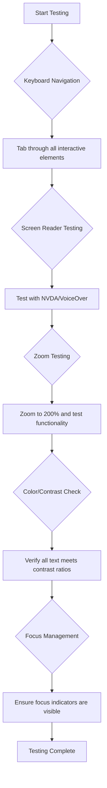
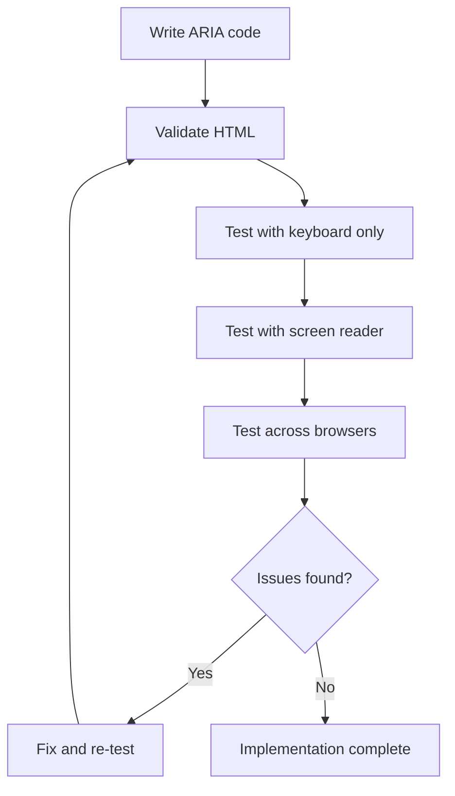

<!--
CO_OP_TRANSLATOR_METADATA:
{
  "original_hash": "90b19cde5b79b29e91babd3138cd8035",
  "translation_date": "2025-10-22T17:34:47+00:00",
  "source_file": "1-getting-started-lessons/3-accessibility/README.md",
  "language_code": "pa"
}
-->
# ਐਕਸੇਸਿਬਲ ਵੈੱਬਪੇਜ ਬਣਾਉਣਾ


> ਸਕੈਚਨੋਟ [ਟੋਮੋਮੀ ਇਮੂਰਾ](https://twitter.com/girlie_mac) ਵੱਲੋਂ

## ਲੈਕਚਰ ਤੋਂ ਪਹਿਲਾਂ ਕਵਿਜ਼
[ਲੈਕਚਰ ਤੋਂ ਪਹਿਲਾਂ ਕਵਿਜ਼](https://ff-quizzes.netlify.app/web/)

> ਵੈੱਬ ਦੀ ਤਾਕਤ ਇਸ ਦੀ ਯੂਨੀਵਰਸਲਿਟੀ ਵਿੱਚ ਹੈ। ਅਪਾਹਜਤਾ ਤੋਂ ਬਿਨਾਂ ਹਰ ਕਿਸੇ ਲਈ ਪਹੁੰਚ ਇਸ ਦਾ ਇੱਕ ਜ਼ਰੂਰੀ ਪਹਲੂ ਹੈ।
>
> \- ਸਰ ਟਿਮੋਥੀ ਬਰਨਰਜ਼-ਲੀ, W3C ਡਾਇਰੈਕਟਰ ਅਤੇ ਵਰਲਡ ਵਾਈਡ ਵੈੱਬ ਦੇ ਖੋਜਕਾਰ

ਇਹ ਗੱਲ ਤੁਹਾਨੂੰ ਹੈਰਾਨ ਕਰ ਸਕਦੀ ਹੈ: ਜਦੋਂ ਤੁਸੀਂ ਐਕਸੇਸਿਬਲ ਵੈੱਬਸਾਈਟਾਂ ਬਣਾਉਂਦੇ ਹੋ, ਤਾਂ ਤੁਸੀਂ ਸਿਰਫ ਅਪਾਹਜ ਲੋਕਾਂ ਦੀ ਮਦਦ ਨਹੀਂ ਕਰ ਰਹੇ ਹੁੰਦੇ—ਤੁਸੀਂ ਅਸਲ ਵਿੱਚ ਵੈੱਬ ਨੂੰ ਹਰ ਕਿਸੇ ਲਈ ਬਿਹਤਰ ਬਣਾ ਰਹੇ ਹੁੰਦੇ ਹੋ!

ਕੀ ਤੁਸੀਂ ਕਦੇ ਸੜਕ ਦੇ ਕੋਨਿਆਂ 'ਤੇ ਉਹ ਰੈਂਪ ਨੋਟਿਸ ਕੀਤੇ ਹਨ? ਇਹ ਮੁਢਲੇ ਤੌਰ 'ਤੇ ਵ੍ਹੀਲਚੇਅਰਾਂ ਲਈ ਬਣਾਏ ਗਏ ਸਨ, ਪਰ ਹੁਣ ਇਹ ਬੱਚਿਆਂ ਦੇ ਸਟ੍ਰੋਲਰਾਂ, ਡਿਲਿਵਰੀ ਵਰਕਰਾਂ ਦੇ ਡੌਲੀਜ਼, ਯਾਤਰੀਆਂ ਦੇ ਰੋਲਿੰਗ ਲੱਗੇਜ ਅਤੇ ਸਾਈਕਲ ਸਵਾਰਾਂ ਲਈ ਵੀ ਮਦਦਗਾਰ ਹਨ। ਇਹੀ ਤਰੀਕੇ ਨਾਲ ਐਕਸੇਸਿਬਲ ਵੈੱਬ ਡਿਜ਼ਾਈਨ ਕੰਮ ਕਰਦਾ ਹੈ—ਜੋ ਹੱਲ ਇੱਕ ਸਮੂਹ ਦੀ ਮਦਦ ਕਰਦੇ ਹਨ, ਉਹ ਅਕਸਰ ਹਰ ਕਿਸੇ ਲਈ ਲਾਭਦਾਇਕ ਸਾਬਤ ਹੁੰਦੇ ਹਨ। ਕਿੰਨਾ ਵਧੀਆ ਹੈ, ਹੈ ਨਾ?

ਇਸ ਪਾਠ ਵਿੱਚ, ਅਸੀਂ ਇਹ ਪੜ੍ਹਾਂਗੇ ਕਿ ਕਿਵੇਂ ਵੈੱਬਸਾਈਟਾਂ ਬਣਾਈਆਂ ਜਾਣ ਜੋ ਹਰ ਕਿਸੇ ਲਈ ਕੰਮ ਕਰਦੀਆਂ ਹਨ, ਭਾਵੇਂ ਉਹ ਵੈੱਬ ਨੂੰ ਕਿਸੇ ਵੀ ਤਰੀਕੇ ਨਾਲ ਬ੍ਰਾਊਜ਼ ਕਰਦੇ ਹੋਣ। ਤੁਸੀਂ ਪ੍ਰੈਕਟਿਕਲ ਤਕਨੀਕਾਂ ਦੀ ਖੋਜ ਕਰੋਗੇ ਜੋ ਪਹਿਲਾਂ ਹੀ ਵੈੱਬ ਮਿਆਰਾਂ ਵਿੱਚ ਸ਼ਾਮਲ ਹਨ, ਟੈਸਟਿੰਗ ਟੂਲਾਂ ਨਾਲ ਹੱਥ-ਅਨੁਭਵ ਪ੍ਰਾਪਤ ਕਰੋਗੇ, ਅਤੇ ਦੇਖੋਗੇ ਕਿ ਐਕਸੇਸਿਬਿਲਟੀ ਤੁਹਾਡੀਆਂ ਸਾਈਟਾਂ ਨੂੰ ਸਾਰੇ ਯੂਜ਼ਰਾਂ ਲਈ ਕਿਵੇਂ ਵਧੀਆ ਬਣਾਉਂਦੀ ਹੈ।

ਇਸ ਪਾਠ ਦੇ ਅੰਤ ਤੱਕ, ਤੁਹਾਡੇ ਵਿੱਚ ਇਹ ਵਿਸ਼ਵਾਸ ਹੋਵੇਗਾ ਕਿ ਐਕਸੇਸਿਬਿਲਟੀ ਨੂੰ ਆਪਣੇ ਡਿਵੈਲਪਮੈਂਟ ਵਰਕਫਲੋ ਦਾ ਕੁਦਰਤੀ ਹਿੱਸਾ ਬਣਾਉਣਾ ਹੈ। ਤਿਆਰ ਹੋ ਜਾਓ ਇਹ ਪੜ੍ਹਨ ਲਈ ਕਿ ਸੋਚ-ਵਿਚਾਰ ਵਾਲੀਆਂ ਡਿਜ਼ਾਈਨ ਚੋਣਾਂ ਕਿਵੇਂ ਅਰਬਾਂ ਯੂਜ਼ਰਾਂ ਲਈ ਵੈੱਬ ਖੋਲ੍ਹ ਸਕਦੀਆਂ ਹਨ? ਚਲੋ ਸ਼ੁਰੂ ਕਰੀਏ!

> ਤੁਸੀਂ ਇਹ ਪਾਠ [ਮਾਈਕਰੋਸਾਫਟ ਲਰਨ](https://docs.microsoft.com/learn/modules/web-development-101/accessibility/?WT.mc_id=academic-77807-sagibbon) 'ਤੇ ਲੈ ਸਕਦੇ ਹੋ!

## ਸਹਾਇਕ ਤਕਨਾਲੋਜੀਆਂ ਨੂੰ ਸਮਝਣਾ

ਕੋਡਿੰਗ ਵਿੱਚ ਕੂਦਣ ਤੋਂ ਪਹਿਲਾਂ, ਆਓ ਇਹ ਸਮਝਣ ਲਈ ਕੁਝ ਸਮਾਂ ਲਵੋ ਕਿ ਵੱਖ-ਵੱਖ ਯੋਗਤਾਵਾਂ ਵਾਲੇ ਲੋਕ ਅਸਲ ਵਿੱਚ ਵੈੱਬ ਦਾ ਅਨੁਭਵ ਕਿਵੇਂ ਕਰਦੇ ਹਨ। ਇਹ ਸਿਰਫ ਸਿਧਾਂਤ ਨਹੀਂ ਹੈ—ਇਹ ਅਸਲ-ਦੁਨੀਆ ਦੇ ਨੈਵੀਗੇਸ਼ਨ ਪੈਟਰਨਾਂ ਨੂੰ ਸਮਝਣਾ ਤੁਹਾਨੂੰ ਇੱਕ ਬਿਹਤਰ ਡਿਵੈਲਪਰ ਬਣਾਉਂਦਾ ਹੈ!

ਸਹਾਇਕ ਤਕਨਾਲੋਜੀਆਂ ਬਹੁਤ ਹੀ ਸ਼ਾਨਦਾਰ ਟੂਲ ਹਨ ਜੋ ਅਪਾਹਜ ਲੋਕਾਂ ਨੂੰ ਵੈੱਬਸਾਈਟਾਂ ਨਾਲ ਇਸ ਤਰੀਕੇ ਨਾਲ ਇੰਟਰੈਕਟ ਕਰਨ ਵਿੱਚ ਮਦਦ ਕਰਦੀਆਂ ਹਨ ਜੋ ਤੁਹਾਨੂੰ ਹੈਰਾਨ ਕਰ ਸਕਦੇ ਹਨ। ਜਦੋਂ ਤੁਸੀਂ ਇਹ ਸਮਝ ਲੈਂਦੇ ਹੋ ਕਿ ਇਹ ਤਕਨਾਲੋਜੀਆਂ ਕਿਵੇਂ ਕੰਮ ਕਰਦੀਆਂ ਹਨ, ਤਾਂ ਐਕਸੇਸਿਬਲ ਵੈੱਬ ਅਨੁਭਵ ਬਣਾਉਣਾ ਕਾਫ਼ੀ ਸੌਖਾ ਹੋ ਜਾਂਦਾ ਹੈ। ਇਹ ਕੁਝ ਇਸ ਤਰ੍ਹਾਂ ਹੈ ਜਿਵੇਂ ਕਿਸੇ ਹੋਰ ਦੀਆਂ ਅੱਖਾਂ ਰਾਹੀਂ ਆਪਣੇ ਕੋਡ ਨੂੰ ਦੇਖਣਾ ਸਿੱਖਣਾ।

### ਸਕ੍ਰੀਨ ਰੀਡਰ

[ਸਕ੍ਰੀਨ ਰੀਡਰ](https://en.wikipedia.org/wiki/Screen_reader) ਬਹੁਤ ਹੀ ਉੱਚ ਤਕਨਾਲੋਜੀ ਵਾਲੇ ਉਪਕਰਣ ਹਨ ਜੋ ਡਿਜ਼ੀਟਲ ਟੈਕਸਟ ਨੂੰ ਬੋਲਣ ਜਾਂ ਬ੍ਰੇਲ ਆਉਟਪੁੱਟ ਵਿੱਚ ਬਦਲ ਦਿੰਦੇ ਹਨ। ਜਦੋਂ ਕਿ ਇਹ ਮੁੱਖ ਤੌਰ 'ਤੇ ਦ੍ਰਿਸ਼ਟੀਹੀਨ ਲੋਕਾਂ ਦੁਆਰਾ ਵਰਤੇ ਜਾਂਦੇ ਹਨ, ਇਹ ਡਿਸਲੇਕਸੀਆ ਵਰਗੀਆਂ ਸਿੱਖਣ ਦੀਆਂ ਅਪਾਹਜਤਾਵਾਂ ਵਾਲੇ ਯੂਜ਼ਰਾਂ ਲਈ ਵੀ ਬਹੁਤ ਮਦਦਗਾਰ ਹਨ।

ਮੈਂ ਸਕ੍ਰੀਨ ਰੀਡਰ ਨੂੰ ਇੱਕ ਬਹੁਤ ਹੀ ਸਮਰੱਥ ਕਹਾਣੀਕਾਰ ਵਾਂਗ ਸੋਚਦਾ ਹਾਂ ਜੋ ਤੁਹਾਨੂੰ ਇੱਕ ਕਿਤਾਬ ਪੜ੍ਹ ਰਿਹਾ ਹੈ। ਇਹ ਸਮੱਗਰੀ ਨੂੰ ਇੱਕ ਤਰਤੀਬਵਾਰ ਕ੍ਰਮ ਵਿੱਚ ਉੱਚਾਰਨ ਕਰਦਾ ਹੈ, ਇੰਟਰੈਕਟਿਵ ਤੱਤਾਂ ਨੂੰ "ਬਟਨ" ਜਾਂ "ਲਿੰਕ" ਵਜੋਂ ਐਲਾਨ ਕਰਦਾ ਹੈ, ਅਤੇ ਪੇਜ ਦੇ ਆਲੇ-ਦੁਆਲੇ ਜੰਪ ਕਰਨ ਲਈ ਕੀਬੋਰਡ ਸ਼ਾਰਟਕੱਟ ਪ੍ਰਦਾਨ ਕਰਦਾ ਹੈ। ਪਰ ਗੱਲ ਇਹ ਹੈ ਕਿ—ਸਕ੍ਰੀਨ ਰੀਡਰ ਸਿਰਫ ਤਦ ਹੀ ਆਪਣਾ ਜਾਦੂ ਦਿਖਾ ਸਕਦੇ ਹਨ ਜਦੋਂ ਅਸੀਂ ਵੈੱਬਸਾਈਟਾਂ ਨੂੰ ਸਹੀ ਢਾਂਚੇ ਅਤੇ ਅਰਥਪੂਰਨ ਸਮੱਗਰੀ ਨਾਲ ਬਣਾਉਂਦੇ ਹਾਂ। ਇਹੋ ਜਿੱਥੇ ਤੁਸੀਂ ਇੱਕ ਡਿਵੈਲਪਰ ਵਜੋਂ ਆਉਂਦੇ ਹੋ!

**ਪਲੇਟਫਾਰਮਾਂ ਵਿੱਚ ਪ੍ਰਸਿੱਧ ਸਕ੍ਰੀਨ ਰੀਡਰ:**
- **ਵਿੰਡੋਜ਼**: [NVDA](https://www.nvaccess.org/about-nvda/) (ਮੁਫ਼ਤ ਅਤੇ ਸਭ ਤੋਂ ਪ੍ਰਸਿੱਧ), [JAWS](https://webaim.org/articles/jaws/), [Narrator](https://support.microsoft.com/windows/complete-guide-to-narrator-e4397a0d-ef4f-b386-d8ae-c172f109bdb1/?WT.mc_id=academic-77807-sagibbon) (ਬਿਲਟ-ਇਨ)
- **ਮੈਕਓਐਸ/ਆਈਓਐਸ**: [VoiceOver](https://support.apple.com/guide/voiceover/welcome/10) (ਬਿਲਟ-ਇਨ ਅਤੇ ਬਹੁਤ ਸਮਰੱਥ)
- **ਐਂਡਰਾਇਡ**: [TalkBack](https://support.google.com/accessibility/android/answer/6283677) (ਬਿਲਟ-ਇਨ)
- **ਲਿਨਕਸ**: [Orca](https://wiki.gnome.org/Projects/Orca) (ਮੁਫ਼ਤ ਅਤੇ ਖੁੱਲ੍ਹਾ-ਸਰੋਤ)

**ਸਕ੍ਰੀਨ ਰੀਡਰ ਵੈੱਬ ਸਮੱਗਰੀ ਨੂੰ ਕਿਵੇਂ ਨੈਵੀਗੇਟ ਕਰਦੇ ਹਨ:**

ਸਕ੍ਰੀਨ ਰੀਡਰ ਕਈ ਨੈਵੀਗੇਸ਼ਨ ਤਰੀਕੇ ਪ੍ਰਦਾਨ ਕਰਦੇ ਹਨ ਜੋ ਅਨੁਭਵੀ ਯੂਜ਼ਰਾਂ ਲਈ ਬ੍ਰਾਊਜ਼ਿੰਗ ਨੂੰ ਪ੍ਰਭਾਵਸ਼ਾਲੀ ਬਣਾਉਂਦੇ ਹਨ:
- **ਲਗਾਤਾਰ ਪੜ੍ਹਨਾ**: ਸਮੱਗਰੀ ਨੂੰ ਉੱਪਰ ਤੋਂ ਹੇਠਾਂ ਪੜ੍ਹਦਾ ਹੈ, ਜਿਵੇਂ ਇੱਕ ਕਿਤਾਬ ਦੀ ਪਾਲਣਾ ਕਰਨਾ
- **ਲੈਂਡਮਾਰਕ ਨੈਵੀਗੇਸ਼ਨ**: ਪੇਜ ਦੇ ਭਾਗਾਂ ਵਿੱਚ ਜੰਪ ਕਰਨਾ (ਹੈਡਰ, ਨੈਵ, ਮੈਨ, ਫੁੱਟਰ)
- **ਹੈਡਿੰਗ ਨੈਵੀਗੇਸ਼ਨ**: ਹੈਡਿੰਗਜ਼ ਵਿੱਚ ਜੰਪ ਕਰਕੇ ਪੇਜ ਦੇ ਢਾਂਚੇ ਨੂੰ ਸਮਝਣਾ
- **ਲਿੰਕ ਲਿਸਟਾਂ**: ਤੇਜ਼ ਪਹੁੰਚ ਲਈ ਸਾਰੇ ਲਿੰਕਾਂ ਦੀ ਸੂਚੀ ਬਣਾਉਣਾ
- **ਫਾਰਮ ਕੰਟਰੋਲ**: ਇਨਪੁਟ ਫੀਲਡਾਂ ਅਤੇ ਬਟਨਾਂ ਵਿੱਚ ਸਿੱਧਾ ਨੈਵੀਗੇਟ ਕਰਨਾ

> 💡 **ਇਹ ਗੱਲ ਜੋ ਮੇਰੇ ਮਨ ਨੂੰ ਹੈਰਾਨ ਕਰ ਗਈ**: 68% ਸਕ੍ਰੀਨ ਰੀਡਰ ਯੂਜ਼ਰ ਮੁੱਖ ਤੌਰ 'ਤੇ ਹੈਡਿੰਗਜ਼ ਦੁਆਰਾ ਨੈਵੀਗੇਟ ਕਰਦੇ ਹਨ ([WebAIM ਸਰਵੇ](https://webaim.org/projects/screenreadersurvey9/#finding))। ਇਸਦਾ ਮਤਲਬ ਹੈ ਕਿ ਤੁਹਾਡਾ ਹੈਡਿੰਗ ਢਾਂਚਾ ਯੂਜ਼ਰਾਂ ਲਈ ਇੱਕ ਰੋਡਮੈਪ ਵਾਂਗ ਹੈ—ਜਦੋਂ ਤੁਸੀਂ ਇਸਨੂੰ ਸਹੀ ਬਣਾਉਂਦੇ ਹੋ, ਤਾਂ ਤੁਸੀਂ ਅਸਲ ਵਿੱਚ ਲੋਕਾਂ ਨੂੰ ਆਪਣੀ ਸਮੱਗਰੀ ਦੇ ਆਲੇ-ਦੁਆਲੇ ਤੇਜ਼ੀ ਨਾਲ ਰਸਤਾ ਲੱਭਣ ਵਿੱਚ ਮਦਦ ਕਰ ਰਹੇ ਹੋ!

### ਆਪਣਾ ਟੈਸਟਿੰਗ ਵਰਕਫਲੋ ਬਣਾਉਣਾ

ਇਹ ਚੰਗੀ ਖ਼ਬਰ ਹੈ—ਪ੍ਰਭਾਵਸ਼ਾਲੀ ਐਕਸੇਸਿਬਿਲਟੀ ਟੈਸਟਿੰਗ ਭਾਰੀ ਨਹੀਂ ਹੋਣੀ ਚਾਹੀਦੀ! ਤੁਸੀਂ ਆਟੋਮੈਟਿਕ ਟੂਲਾਂ (ਇਹ ਸਪੱਸ਼ਟ ਸਮੱਸਿਆਵਾਂ ਨੂੰ ਫੜਨ ਵਿੱਚ ਸ਼ਾਨਦਾਰ ਹਨ) ਨੂੰ ਕੁਝ ਹੱਥ-ਅਨੁਭਵ ਟੈਸਟਿੰਗ ਨਾਲ ਜੋੜਨਾ ਚਾਹੋਗੇ। ਇਹ ਰਹੀ ਇੱਕ ਪ੍ਰਣਾਲੀਬੱਧ ਪਹੁੰਚ ਜੋ ਸਭ ਤੋਂ ਜ਼ਿਆਦਾ ਸਮੱਸਿਆਵਾਂ ਨੂੰ ਫੜਦੀ ਹੈ ਬਿਨਾਂ ਤੁਹਾਡੇ ਸਾਰੇ ਦਿਨ ਨੂੰ ਖਰਚ ਕੀਤੇ:

**ਮਹੱਤਵਪੂਰਨ ਮੈਨੂਅਲ ਟੈਸਟਿੰਗ ਵਰਕਫਲੋ:**



**ਕਦਮ-ਦਰ-ਕਦਮ ਟੈਸਟਿੰਗ ਚੈੱਕਲਿਸਟ:**
1. **ਕੀਬੋਰਡ ਨੈਵੀਗੇਸ਼ਨ**: ਸਿਰਫ਼ Tab, Shift+Tab, Enter, Space, ਅਤੇ Arrow keys ਵਰਤੋ
2. **ਸਕ੍ਰੀਨ ਰੀਡਰ ਟੈਸਟਿੰਗ**: NVDA, VoiceOver, ਜਾਂ Narrator ਚਾਲੂ ਕਰੋ ਅਤੇ ਬੰਦ ਅੱਖਾਂ ਨਾਲ ਨੈਵੀਗੇਟ ਕਰੋ
3. **ਜ਼ੂਮ ਟੈਸਟਿੰਗ**: 200% ਅਤੇ 400% ਜ਼ੂਮ ਲੈਵਲਾਂ 'ਤੇ ਟੈਸਟ ਕਰੋ
4. **ਰੰਗ ਕਾਂਟ੍ਰਾਸਟ ਦੀ ਪੁਸ਼ਟੀ**: ਸਾਰੇ ਟੈਕਸਟ ਅਤੇ UI ਕੰਪੋਨੈਂਟਾਂ ਦੀ ਜਾਂਚ ਕਰੋ
5. **ਫੋਕਸ ਇੰਡਿਕੇਟਰ ਟੈਸਟਿੰਗ**: ਯਕੀਨੀ ਬਣਾਓ ਕਿ ਸਾਰੇ ਇੰਟਰੈਕਟਿਵ ਤੱਤਾਂ ਦੇ ਦ੍ਰਿਸ਼ਮਾਨ ਫੋਕਸ ਸਟੇਟ ਹਨ

✅ **ਲਾਈਟਹਾਊਸ ਨਾਲ ਸ਼ੁਰੂ ਕਰੋ**: ਆਪਣੇ ਬ੍ਰਾਊਜ਼ਰ ਦੇ ਡਿਵਟੂਲ ਖੋਲ੍ਹੋ, ਇੱਕ ਲਾਈਟਹਾਊਸ ਐਕਸੇਸਿਬਿਲਟੀ ਆਡਿਟ ਚਲਾਓ, ਫਿਰ ਆਪਣੇ ਮੈਨੂਅਲ ਟੈਸਟਿੰਗ ਫੋਕਸ ਖੇਤਰਾਂ ਨੂੰ ਗਾਈਡ ਕਰਨ ਲਈ ਨਤੀਜੇ ਵਰਤੋ।

### ਜ਼ੂਮ ਅਤੇ ਵਧਾਈ ਟੂਲ

ਤੁਸੀਂ ਕਿਵੇਂ ਕਦੇ ਆਪਣੇ ਫੋਨ 'ਤੇ ਪਿੰਚ ਕਰਦੇ ਹੋ ਜਦੋਂ ਟੈਕਸਟ ਬਹੁਤ ਛੋਟਾ ਹੁੰਦਾ ਹੈ, ਜਾਂ ਚਮਕਦਾਰ ਧੁੱਪ ਵਿੱਚ ਆਪਣੇ ਲੈਪਟਾਪ ਸਕ੍ਰੀਨ 'ਤੇ ਅੱਖਾਂ ਮਿਚਕਦੇ ਹੋ? ਬਹੁਤ ਸਾਰੇ ਯੂਜ਼ਰ ਹਰ ਰੋਜ਼ ਸਮੱਗਰੀ ਨੂੰ ਪੜ੍ਹਨਯੋਗ ਬਣਾਉਣ ਲਈ ਵਧਾਈ ਟੂਲਾਂ 'ਤੇ ਨਿਰਭਰ ਕਰਦੇ ਹਨ। ਇਸ ਵਿੱਚ ਘੱਟ ਦ੍ਰਿਸ਼ਟੀ ਵਾਲੇ ਲੋਕ, ਵੱਡੇ ਉਮਰ ਦੇ ਲੋਕ, ਅਤੇ ਕੋਈ ਵੀ ਸ਼ਾਮਲ ਹੈ ਜਿਸਨੇ ਕਦੇ ਬਾਹਰ ਵੈੱਬਸਾਈਟ ਪੜ੍ਹਨ ਦੀ ਕੋਸ਼ਿਸ਼ ਕੀਤੀ ਹੈ।

ਆਧੁਨਿਕ ਜ਼ੂਮ ਤਕਨਾਲੋਜੀਆਂ ਸਿਰਫ ਚੀਜ਼ਾਂ ਨੂੰ ਵੱਡਾ ਕਰਨ ਤੋਂ ਬਹੁਤ ਅੱਗੇ ਵਧ ਗਈਆਂ ਹਨ। ਇਹ ਸਮਝਣਾ ਕਿ ਇਹ ਟੂਲ ਕਿਵੇਂ ਕੰਮ ਕਰਦੇ ਹਨ ਤੁਹਾਨੂੰ ਜ਼ਿੰਮੇਵਾਰ ਡਿਜ਼ਾਈਨ ਬਣਾਉਣ ਵਿੱਚ ਮਦਦ ਕਰੇਗਾ ਜੋ ਕਿਸੇ ਵੀ ਵਧਾਈ ਪੱਧਰ 'ਤੇ ਕਾਰਗਰ ਅਤੇ ਆਕਰਸ਼ਕ ਰਹੇ।

**ਆਧੁਨਿਕ ਬ੍ਰਾਊਜ਼ਰ ਜ਼ੂਮ ਸਮਰੱਥਾਵਾਂ:**
- **ਪੇਜ ਜ਼ੂਮ**: ਸਾਰੀ ਸਮੱਗਰੀ ਨੂੰ ਅਨੁਪਾਤਿਕ ਤੌਰ 'ਤੇ ਸਕੇਲ ਕਰਦਾ ਹੈ (ਟੈਕਸਟ, ਚਿੱਤਰ, ਲੇਆਉਟ) - ਇਹ ਪਸੰਦੀਦਾ ਤਰੀਕਾ ਹੈ
- **ਸਿਰਫ ਟੈਕਸਟ ਜ਼ੂਮ**: ਮੂਲ ਲੇਆਉਟ ਨੂੰ ਬਰਕਰਾਰ ਰੱਖਦੇ ਹੋਏ ਫੌਂਟ ਦਾ ਆਕਾਰ ਵਧਾਉਂਦਾ ਹੈ
- **ਪਿੰਚ-ਟੂ-ਜ਼ੂਮ**: ਮੋਬਾਈਲ ਜੈਸਚਰ ਸਹਾਇਤਾ ਅਸਥਾਈ ਵਧਾਈ ਲਈ
- **ਬ੍ਰਾਊਜ਼ਰ ਸਹਾਇਤਾ**: ਸਾਰੇ ਆਧੁਨਿਕ ਬ੍ਰਾਊਜ਼ਰ 500% ਤੱਕ ਜ਼ੂਮ ਦਾ ਸਮਰਥਨ ਕਰਦੇ ਹਨ ਬਿਨਾਂ ਕਾਰਗਰਤਾ ਨੂੰ ਤੋੜੇ

**ਵਿਸ਼ੇਸ਼ ਵਧਾਈ ਸੌਫਟਵੇਅਰ:**
- **ਵਿੰਡੋਜ਼**: [Magnifier](https://support.microsoft.com/windows/use-magnifier-to-make-things-on-the-screen-easier-to-see-414948ba-8b1c-d3bd-8615-0e5e32204198) (ਬਿਲਟ-ਇਨ), [ZoomText](https://www.freedomscientific.com/training/zoomtext/getting-started/)
- **ਮੈਕਓਐਸ/ਆਈਓਐਸ**: [Zoom](https://www.apple.com/accessibility/mac/vision/) (ਬਿਲਟ-ਇਨ ਅਤੇ ਉੱਚਤਮ ਵਿਸ਼ੇਸ਼ਤਾਵਾਂ ਨਾਲ)

> ⚠️ **ਡਿਜ਼ਾਈਨ ਵਿਚਾਰ**: WCAG ਦੀ ਲੋੜ ਹੈ ਕਿ ਸਮੱਗਰੀ 200% ਜ਼ੂਮ ਕੀਤੇ ਜਾਣ 'ਤੇ ਕਾਰਗਰ ਰਹੇ। ਇਸ ਪੱਧਰ 'ਤੇ, ਹੋਰਿਜ਼ਾਂਟਲ ਸਕ੍ਰੋਲਿੰਗ ਘੱਟ ਤੋਂ ਘੱਟ ਹੋਣੀ ਚਾਹੀਦੀ ਹੈ, ਅਤੇ ਸਾਰੇ ਇੰਟਰੈਕਟਿਵ ਤੱਤ ਪਹੁੰਚਯੋਗ ਰਹਿਣੇ ਚਾਹੀਦੇ ਹਨ।

✅ **ਆਪਣੇ ਜ਼ਿੰਮੇਵਾਰ ਡਿਜ਼ਾਈਨ ਦੀ ਜਾਂਚ ਕਰੋ**: ਆਪਣੇ ਬ੍ਰਾਊਜ਼ਰ ਨੂੰ 200% ਅਤੇ 400% ਜ਼ੂਮ ਕਰੋ। ਕੀ ਤੁਹਾਡਾ ਲੇਆਉਟ ਸੁਗਮਤਾ ਨਾਲ ਅਨੁਕੂਲ ਹੁੰਦਾ ਹੈ? ਕੀ ਤੁਸੀਂ ਬਿਨਾਂ ਵੱਧ ਸਕ੍ਰੋਲਿੰਗ ਦੇ ਸਾਰੀ ਕਾਰਗਰਤਾ ਤੱਕ ਪਹੁੰਚ ਸਕਦੇ ਹੋ?

## ਆਧੁਨਿਕ ਐਕਸੇਸਿਬਿਲਟੀ ਟੈਸਟਿੰਗ ਟੂਲ

ਹੁਣ ਜਦੋਂ ਤੁਸੀਂ ਸਮਝ ਗਏ ਹੋ ਕਿ ਲੋਕ ਸਹਾਇਕ ਤਕਨਾਲੋਜੀਆਂ ਨਾਲ ਵੈੱਬ ਨੂੰ ਕਿਵੇਂ ਨੈਵੀਗੇਟ ਕਰਦੇ ਹਨ, ਆਓ ਉਹ ਟੂਲ ਖੋਜੀਏ ਜੋ ਤੁਹਾਨੂੰ ਐਕਸੇਸਿਬਲ ਵੈੱਬਸਾਈਟਾਂ ਬਣਾਉਣ ਅਤੇ ਟੈਸਟ ਕਰਨ ਵਿੱਚ ਮਦਦ ਕਰਦੇ ਹਨ।

ਇਸਨੂੰ ਇਸ ਤਰ੍ਹਾਂ ਸੋਚੋ: ਆਟੋਮੈਟਿਕ ਟੂਲ ਸਪੱਸ਼ਟ ਸਮੱਸਿਆਵਾਂ (ਜਿਵੇਂ ਕਿ ਗੁੰਮ ਹੋਇਆ alt ਟੈਕਸਟ) ਨੂੰ ਫੜਨ ਵਿੱਚ ਸ਼ਾਨਦਾਰ ਹਨ, ਜਦਕਿ ਹੱਥ-ਅਨੁਭਵ ਟੈਸਟਿੰਗ ਤੁਹਾਨੂੰ ਇਹ ਯਕੀਨੀ ਬਣਾਉਣ ਵਿੱਚ ਮਦਦ ਕਰਦੀ ਹੈ ਕਿ ਤੁਹਾਡੀ ਸਾਈਟ ਅਸਲ ਦੁਨੀਆ ਵਿੱਚ ਵਰਤਣ ਲਈ ਚੰਗੀ ਮਹਿਸੂਸ ਕਰਦੀ ਹੈ। ਇਹਨਾਂ ਦੋਹਾਂ ਨੂੰ ਮਿਲਾ ਕੇ, ਤੁਹਾਨੂੰ ਇਹ ਵਿਸ਼ਵਾਸ ਹੁੰਦਾ ਹੈ ਕਿ ਤੁਹਾਡੀਆਂ ਸਾਈਟਾਂ ਹਰ ਕਿਸੇ ਲਈ ਕੰਮ ਕਰਦੀਆਂ ਹਨ।

### ਰੰਗ ਕਾਂਟ੍ਰਾਸਟ ਟੈਸਟਿੰਗ

ਇਹ ਚੰਗੀ ਖ਼ਬਰ ਹੈ: ਰੰਗ ਕਾਂਟ੍ਰਾਸਟ ਸਭ ਤੋਂ ਆਮ ਐਕਸੇਸਿਬਿਲਟੀ ਸਮੱਸਿਆਵਾਂ ਵਿੱਚੋਂ ਇੱਕ ਹੈ, ਪਰ ਇਹ ਸਭ ਤੋਂ ਆਸਾਨ ਹੱਲ ਕਰਨ ਵਾਲੀ ਵੀ ਹੈ। ਚੰਗਾ ਕਾਂਟ੍ਰਾਸਟ ਹਰ ਕਿਸੇ ਲਈ ਲਾਭਦਾਇਕ ਹੈ—ਦ੍ਰਿਸ਼ਟੀਹੀਨ ਯੂਜ਼ਰਾਂ ਤੋਂ ਲੈ ਕੇ ਉਹਨਾਂ ਲੋਕਾਂ ਤੱਕ ਜੋ ਬੀਚ 'ਤੇ ਆਪਣੇ
ਰੰਗ ਸੰਚਾਰ ਲਈ ਬਹੁਤ ਸ਼ਕਤੀਸ਼ਾਲੀ ਹੈ, ਪਰ ਇਹ ਕਦੇ ਵੀ ਇੱਕੋ ਤਰੀਕੇ ਨਾਲ ਮਹੱਤਵਪੂਰਨ ਜਾਣਕਾਰੀ ਪ੍ਰਦਾਨ ਕਰਨ ਦਾ ਸਾਧਨ ਨਹੀਂ ਹੋਣਾ ਚਾਹੀਦਾ। ਰੰਗ ਤੋਂ ਅੱਗੇ ਡਿਜ਼ਾਈਨ ਕਰਨ ਨਾਲ ਜ਼ਿਆਦਾ ਮਜ਼ਬੂਤ, ਸਮਾਵੇਸ਼ੀ ਅਨੁਭਵ ਬਣਦੇ ਹਨ ਜੋ ਵੱਖ-ਵੱਖ ਸਥਿਤੀਆਂ ਵਿੱਚ ਕੰਮ ਕਰਦੇ ਹਨ।

**ਰੰਗ ਦ੍ਰਿਸ਼ਟੀ ਦੇ ਅੰਤਰਾਂ ਲਈ ਡਿਜ਼ਾਈਨ ਕਰੋ:**

ਲਗਭਗ 8% ਪੁਰਸ਼ ਅਤੇ 0.5% ਔਰਤਾਂ ਵਿੱਚ ਰੰਗ ਦ੍ਰਿਸ਼ਟੀ ਦੇ ਕੁਝ ਅੰਤਰ ਹੁੰਦੇ ਹਨ (ਅਕਸਰ "ਰੰਗ ਅੰਧਤਾ" ਕਿਹਾ ਜਾਂਦਾ ਹੈ)। ਸਭ ਤੋਂ ਆਮ ਕਿਸਮਾਂ ਹਨ:
- **Deuteranopia**: ਲਾਲ ਅਤੇ ਹਰੇ ਵਿੱਚ ਫਰਕ ਕਰਨ ਵਿੱਚ ਮੁਸ਼ਕਲ
- **Protanopia**: ਲਾਲ ਹੋਰ ਮੰਦ ਦਿਖਾਈ ਦਿੰਦਾ ਹੈ
- **Tritanopia**: ਨੀਲੇ ਅਤੇ ਪੀਲੇ ਨਾਲ ਮੁਸ਼ਕਲ (ਵਿਰਲ)

**ਸਮਾਵੇਸ਼ੀ ਰੰਗ ਰਣਨੀਤੀਆਂ:**

```css
/* ❌ Bad: Using only color to indicate status */
.error { color: red; }
.success { color: green; }

/* ✅ Good: Color plus icons and context */
.error {
  color: #d32f2f;
  border-left: 4px solid #d32f2f;
}
.error::before {
  content: "⚠️";
  margin-right: 8px;
}

.success {
  color: #2e7d32;
  border-left: 4px solid #2e7d32;
}
.success::before {
  content: "✅";
  margin-right: 8px;
}
```

**ਮੁੱਢਲੀ ਕਾਂਟ੍ਰਾਸਟ ਦੀਆਂ ਲੋੜਾਂ ਤੋਂ ਅੱਗੇ:**
- ਰੰਗ ਚੋਣਾਂ ਨੂੰ ਰੰਗ ਅੰਧਤਾ ਸਿਮੂਲੇਟਰ ਨਾਲ ਟੈਸਟ ਕਰੋ
- ਰੰਗ ਕੋਡਿੰਗ ਦੇ ਨਾਲ-ਨਾਲ ਪੈਟਰਨ, ਟੈਕਸਚਰ ਜਾਂ ਆਕਾਰ ਵਰਤੋ
- ਯਕੀਨੀ ਬਣਾਓ ਕਿ ਇੰਟਰਐਕਟਿਵ ਸਥਿਤੀਆਂ ਰੰਗ ਤੋਂ ਬਿਨਾਂ ਵੀ ਵੱਖਰੀਆਂ ਰਹਿੰਦੀਆਂ ਹਨ
- ਸੋਚੋ ਕਿ ਤੁਹਾਡਾ ਡਿਜ਼ਾਈਨ ਉੱਚ ਕਾਂਟ੍ਰਾਸਟ ਮੋਡ ਵਿੱਚ ਕਿਵੇਂ ਦਿਖਾਈ ਦਿੰਦਾ ਹੈ

✅ **ਆਪਣੀ ਰੰਗ ਪਹੁੰਚਯੋਗਤਾ ਦੀ ਜਾਂਚ ਕਰੋ**: [Coblis](https://www.color-blindness.com/coblis-color-blindness-simulator/) ਵਰਗੇ ਟੂਲ ਵਰਤੋ ਇਹ ਦੇਖਣ ਲਈ ਕਿ ਤੁਹਾਡੀ ਸਾਈਟ ਵੱਖ-ਵੱਖ ਕਿਸਮਾਂ ਦੀ ਰੰਗ ਦ੍ਰਿਸ਼ਟੀ ਵਾਲੇ ਉਪਭੋਗਤਾਵਾਂ ਲਈ ਕਿਵੇਂ ਦਿਖਾਈ ਦਿੰਦੀ ਹੈ।

### ਫੋਕਸ ਇੰਡੀਕੇਟਰ ਅਤੇ ਇੰਟਰਐਕਸ਼ਨ ਡਿਜ਼ਾਈਨ

ਫੋਕਸ ਇੰਡੀਕੇਟਰ ਡਿਜ਼ੀਟਲ ਸਮਾਨ ਹੈ ਕੁਰਸਰ ਦਾ—ਇਹ ਕੀਬੋਰਡ ਉਪਭੋਗਤਾਵਾਂ ਨੂੰ ਦਿਖਾਉਂਦੇ ਹਨ ਕਿ ਉਹ ਪੇਜ 'ਤੇ ਕਿੱਥੇ ਹਨ। ਚੰਗੀ ਤਰ੍ਹਾਂ ਡਿਜ਼ਾਈਨ ਕੀਤੇ ਫੋਕਸ ਇੰਡੀਕੇਟਰ ਹਰ ਕਿਸੇ ਲਈ ਅਨੁਭਵ ਨੂੰ ਵਧਾਉਂਦੇ ਹਨ, ਇੰਟਰਐਕਸ਼ਨ ਨੂੰ ਸਪਸ਼ਟ ਅਤੇ ਭਰੋਸੇਯੋਗ ਬਣਾਉਂਦੇ ਹਨ।

**ਆਧੁਨਿਕ ਫੋਕਸ ਇੰਡੀਕੇਟਰ ਦੀਆਂ ਸਾਰੀਆਂ ਪ੍ਰਥਾਵਾਂ:**

```css
/* Enhanced focus styles that work across browsers */
button:focus-visible {
  outline: 2px solid #0066cc;
  outline-offset: 2px;
  box-shadow: 0 0 0 4px rgba(0, 102, 204, 0.25);
}

/* Remove focus outline for mouse users, preserve for keyboard users */
button:focus:not(:focus-visible) {
  outline: none;
}

/* Focus-within for complex components */
.card:focus-within {
  box-shadow: 0 0 0 3px rgba(74, 144, 164, 0.5);
  border-color: #4A90A4;
}

/* Ensure focus indicators meet contrast requirements */
.custom-focus:focus-visible {
  outline: 3px solid #ffffff;
  outline-offset: 2px;
  box-shadow: 0 0 0 6px #000000;
}
```

**ਫੋਕਸ ਇੰਡੀਕੇਟਰ ਦੀਆਂ ਲੋੜਾਂ:**
- **ਦਿੱਖ**: ਆਲੇ-ਦੁਆਲੇ ਦੇ ਤੱਤਾਂ ਨਾਲ ਘੱਟੋ-ਘੱਟ 3:1 ਕਾਂਟ੍ਰਾਸਟ ਰੇਸ਼ੋ ਹੋਣਾ ਚਾਹੀਦਾ ਹੈ
- **ਚੌੜਾਈ**: ਪੂਰੇ ਤੱਤ ਦੇ ਆਲੇ-ਦੁਆਲੇ ਘੱਟੋ-ਘੱਟ 2px ਮੋਟਾਈ ਹੋਣੀ ਚਾਹੀਦੀ ਹੈ
- **ਸਥਿਰਤਾ**: ਫੋਕਸ ਕਿਤੇ ਹੋਰ ਨਹੀਂ ਜਾਂਦਾ ਤੱਕ ਦਿੱਖ ਰਹਿਣੀ ਚਾਹੀਦੀ ਹੈ
- **ਵੱਖਰਾਪਨ**: ਹੋਰ UI ਸਥਿਤੀਆਂ ਤੋਂ ਦਿੱਖ ਵਿੱਚ ਵੱਖਰਾ ਹੋਣਾ ਚਾਹੀਦਾ ਹੈ

> 💡 **ਡਿਜ਼ਾਈਨ ਟਿਪ**: ਵਧੀਆ ਫੋਕਸ ਇੰਡੀਕੇਟਰ ਅਕਸਰ ਦਿੱਖ ਨੂੰ ਯਕੀਨੀ ਬਣਾਉਣ ਲਈ outline, box-shadow, ਅਤੇ ਰੰਗ ਬਦਲਣ ਦੇ ਸੰਯੋਗ ਵਰਤਦੇ ਹਨ।

✅ **ਆਪਣੇ ਫੋਕਸ ਇੰਡੀਕੇਟਰ ਦੀ ਜਾਂਚ ਕਰੋ**: ਆਪਣੀ ਵੈਬਸਾਈਟ 'ਤੇ ਟੈਬ ਦਬਾ ਕੇ ਦੇਖੋ ਕਿ ਕਿਹੜੇ ਤੱਤਾਂ ਦੇ ਸਪਸ਼ਟ ਫੋਕਸ ਇੰਡੀਕੇਟਰ ਹਨ। ਕੀ ਕੋਈ ਦਿਖਣ ਵਿੱਚ ਮੁਸ਼ਕਲ ਜਾਂ ਪੂਰੀ ਤਰ੍ਹਾਂ ਗਾਇਬ ਹਨ?

### ਸੈਮੈਂਟਿਕ HTML: ਪਹੁੰਚਯੋਗਤਾ ਦੀ ਬੁਨਿਆਦ

ਸੈਮੈਂਟਿਕ HTML ਤੁਹਾਡੀ ਵੈਬਸਾਈਟ ਲਈ ਸਹਾਇਕ ਤਕਨਾਲੋਜੀਆਂ ਲਈ GPS ਸਿਸਟਮ ਵਰਗਾ ਹੈ। ਜਦੋਂ ਤੁਸੀਂ ਸਹੀ HTML ਤੱਤਾਂ ਨੂੰ ਉਨ੍ਹਾਂ ਦੇ ਇਰਾਦੇ ਦੇ ਮੁਤਾਬਕ ਵਰਤਦੇ ਹੋ, ਤਾਂ ਤੁਸੀਂ ਮੂਲ ਤੌਰ 'ਤੇ ਸਕ੍ਰੀਨ ਰੀਡਰ, ਕੀਬੋਰਡ, ਅਤੇ ਹੋਰ ਟੂਲਾਂ ਨੂੰ ਇੱਕ ਵਿਸਥਾਰਤ ਰੋਡਮੈਪ ਪ੍ਰਦਾਨ ਕਰਦੇ ਹੋ ਜੋ ਉਪਭੋਗਤਾਵਾਂ ਨੂੰ ਪ੍ਰਭਾਵਸ਼ਾਲੀ ਤਰੀਕੇ ਨਾਲ ਨੈਵੀਗੇਟ ਕਰਨ ਵਿੱਚ ਮਦਦ ਕਰਦਾ ਹੈ।

ਇਹ ਇੱਕ ਉਦਾਹਰਣ ਹੈ ਜੋ ਮੇਰੇ ਲਈ ਬਹੁਤ ਸਪਸ਼ਟ ਹੋਇਆ: ਸੈਮੈਂਟਿਕ HTML ਇੱਕ ਚੰਗੀ ਤਰ੍ਹਾਂ ਸੰਗਠਿਤ ਲਾਇਬ੍ਰੇਰੀ ਦੇ ਫਰਕ ਦੀ ਤਰ੍ਹਾਂ ਹੈ ਜਿਸ ਵਿੱਚ ਸਪਸ਼ਟ ਸ਼੍ਰੇਣੀਆਂ ਅਤੇ ਮਦਦਗਾਰ ਨਿਸ਼ਾਨ ਹਨ ਬਨਾਮ ਇੱਕ ਗੋਦਾਮ ਜਿੱਥੇ ਕਿਤਾਬਾਂ ਬੇਤਰਤੀਬੀ ਨਾਲ ਫੈਲੀਆਂ ਹੋਈਆਂ ਹਨ। ਦੋਵੇਂ ਜਗ੍ਹਾਂ ਇੱਕੋ ਹੀ ਕਿਤਾਬਾਂ ਹਨ, ਪਰ ਤੁਸੀਂ ਕਿਸ ਵਿੱਚੋਂ ਕੁਝ ਲੱਭਣਾ ਪਸੰਦ ਕਰੋਗੇ? ਬਿਲਕੁਲ!

**ਪੇਜ ਸਟ੍ਰਕਚਰ ਦੇ ਪਹੁੰਚਯੋਗ ਬਲਾਕ:**

```html
<!-- Landmark elements provide page navigation structure -->
<header>
  <h1>Your Site Name</h1>
  <nav aria-label="Main navigation">
    <ul>
      <li><a href="/home">Home</a></li>
      <li><a href="/about">About</a></li>
      <li><a href="/services">Services</a></li>
    </ul>
  </nav>
</header>

<main>
  <article>
    <header>
      <h1>Article Title</h1>
      <p>Published on <time datetime="2024-10-14">October 14, 2024</time></p>
    </header>
    
    <section>
      <h2>First Section</h2>
      <p>Content that relates to this section...</p>
    </section>
    
    <section>
      <h2>Second Section</h2>
      <p>More related content...</p>
    </section>
  </article>
  
  <aside>
    <h2>Related Links</h2>
    <nav aria-label="Related articles">
      <ul>
        <li><a href="/related-1">First related article</a></li>
        <li><a href="/related-2">Second related article</a></li>
      </ul>
    </nav>
  </aside>
</main>

<footer>
  <p>&copy; 2024 Your Site Name. All rights reserved.</p>
  <nav aria-label="Footer links">
    <ul>
      <li><a href="/privacy">Privacy Policy</a></li>
      <li><a href="/contact">Contact Us</a></li>
    </ul>
  </nav>
</footer>
```

**ਸੈਮੈਂਟਿਕ HTML ਪਹੁੰਚਯੋਗਤਾ ਨੂੰ ਕਿਵੇਂ ਬਦਲਦਾ ਹੈ:**

| ਸੈਮੈਂਟਿਕ ਤੱਤ | ਉਦੇਸ਼ | ਸਕ੍ਰੀਨ ਰੀਡਰ ਫਾਇਦਾ |
|------------------|---------|----------------------|
| `<header>` | ਪੇਜ ਜਾਂ ਸੈਕਸ਼ਨ ਹੈਡਰ | "ਬੈਨਰ ਲੈਂਡਮਾਰਕ" - ਉੱਪਰ ਤੇ ਜਲਦੀ ਨੈਵੀਗੇਸ਼ਨ |
| `<nav>` | ਨੈਵੀਗੇਸ਼ਨ ਲਿੰਕ | "ਨੈਵੀਗੇਸ਼ਨ ਲੈਂਡਮਾਰਕ" - ਨੈਵੀਗੇਸ਼ਨ ਸੈਕਸ਼ਨ ਦੀ ਸੂਚੀ |
| `<main>` | ਪ੍ਰਮੁੱਖ ਪੇਜ ਸਮੱਗਰੀ | "ਮੁੱਖ ਲੈਂਡਮਾਰਕ" - ਸਿੱਧੇ ਸਮੱਗਰੀ 'ਤੇ ਜਾਓ |
| `<article>` | ਸਵੈ-ਸੰਬੰਧਿਤ ਸਮੱਗਰੀ | ਲੇਖ ਦੀਆਂ ਹੱਦਾਂ ਦਾ ਐਲਾਨ ਕਰਦਾ ਹੈ |
| `<section>` | ਥੀਮ ਵਾਲੇ ਸਮੱਗਰੀ ਸਮੂਹ | ਸਮੱਗਰੀ ਸਟ੍ਰਕਚਰ ਪ੍ਰਦਾਨ ਕਰਦਾ ਹੈ |
| `<aside>` | ਸੰਬੰਧਿਤ ਸਾਈਡਬਾਰ ਸਮੱਗਰੀ | "ਪੂਰਕ ਲੈਂਡਮਾਰਕ" |
| `<footer>` | ਪੇਜ ਜਾਂ ਸੈਕਸ਼ਨ ਫੁੱਟਰ | "Contentinfo landmark" |

**ਸਕ੍ਰੀਨ ਰੀਡਰ ਦੇ ਸੈਮੈਂਟਿਕ HTML ਨਾਲ ਸੁਪਰਪਾਵਰ:**
- **ਲੈਂਡਮਾਰਕ ਨੈਵੀਗੇਸ਼ਨ**: ਮੁੱਖ ਪੇਜ ਸੈਕਸ਼ਨਾਂ ਵਿੱਚ ਤੁਰੰਤ ਜਾਓ
- **ਹੈਡਿੰਗ ਰੂਪਰੇਖਾ**: ਤੁਹਾਡੇ ਹੈਡਿੰਗ ਸਟ੍ਰਕਚਰ ਤੋਂ ਸਮੱਗਰੀ ਦੀ ਸੂਚੀ ਬਣਾਓ
- **ਤੱਤਾਂ ਦੀ ਸੂਚੀ**: ਸਾਰੇ ਲਿੰਕ, ਬਟਨ, ਜਾਂ ਫਾਰਮ ਕੰਟਰੋਲ ਦੀ ਸੂਚੀ ਬਣਾਓ
- **ਸੰਦੇਸ਼ਕ ਸੂਝ**: ਸਮੱਗਰੀ ਸੈਕਸ਼ਨਾਂ ਦੇ ਰਿਸ਼ਤਿਆਂ ਨੂੰ ਸਮਝੋ

> 🎯 **ਤੁਰੰਤ ਟੈਸਟ**: landmark shortcuts (NVDA/JAWS ਵਿੱਚ D), heading (H), link (K) ਵਰਤ ਕੇ ਆਪਣੀ ਸਾਈਟ ਨੂੰ ਸਕ੍ਰੀਨ ਰੀਡਰ ਨਾਲ ਨੈਵੀਗੇਟ ਕਰਨ ਦੀ ਕੋਸ਼ਿਸ਼ ਕਰੋ। ਕੀ ਨੈਵੀਗੇਸ਼ਨ ਸਹੀ ਲੱਗਦਾ ਹੈ?

✅ **ਆਪਣੀ ਸੈਮੈਂਟਿਕ ਸਟ੍ਰਕਚਰ ਦੀ ਜਾਂਚ ਕਰੋ**: ਆਪਣੇ ਬ੍ਰਾਊਜ਼ਰ ਦੇ DevTools ਵਿੱਚ ਪਹੁੰਚਯੋਗਤਾ ਪੈਨਲ ਵਰਤ ਕੇ accessibility tree ਦੇਖੋ ਅਤੇ ਯਕੀਨੀ ਬਣਾਓ ਕਿ ਤੁਹਾਡਾ ਮਾਰਕਅੱਪ ਇੱਕ ਤਰਕਸੰਗਤ ਸਟ੍ਰਕਚਰ ਬਣਾਉਂਦਾ ਹੈ।

### ਹੈਡਿੰਗ ਹਾਇਰਾਰਕੀ: ਇੱਕ ਤਰਕਸੰਗਤ ਸਮੱਗਰੀ ਰੂਪਰੇਖਾ ਬਣਾਉਣਾ

ਹੈਡਿੰਗ ਪਹੁੰਚਯੋਗ ਸਮੱਗਰੀ ਲਈ ਬਹੁਤ ਮਹੱਤਵਪੂਰਨ ਹਨ—ਇਹ ਉਹ ਰੀੜ੍ਹ ਦੀ ਹੱਡੀ ਹੈ ਜੋ ਸਭ ਕੁਝ ਇਕੱਠਾ ਰੱਖਦੀ ਹੈ। ਸਕ੍ਰੀਨ ਰੀਡਰ ਉਪਭੋਗਤਾ ਹੈਡਿੰਗ 'ਤੇ ਬਹੁਤ ਨਿਰਭਰ ਕਰਦੇ ਹਨ ਤੁਹਾਡੀ ਸਮੱਗਰੀ ਨੂੰ ਸਮਝਣ ਅਤੇ ਨੈਵੀਗੇਟ ਕਰਨ ਲਈ। ਇਸਨੂੰ ਤੁਹਾਡੇ ਪੇਜ ਲਈ ਸਮੱਗਰੀ ਦੀ ਸੂਚੀ ਪ੍ਰਦਾਨ ਕਰਨ ਦੇ ਤੌਰ 'ਤੇ ਸੋਚੋ।

**ਹੈਡਿੰਗ ਲਈ ਸੁਨਹਿਰੀ ਨਿਯਮ:**
ਕਦੇ ਵੀ ਪੱਧਰ ਨਾ ਛੱਡੋ। ਹਮੇਸ਼ਾ `<h1>` ਤੋਂ `<h2>` ਤੋਂ `<h3>` ਤੱਕ ਤਰਕਸੰਗਤ ਤਰੀਕੇ ਨਾਲ ਅੱਗੇ ਵਧੋ। ਸਕੂਲ ਵਿੱਚ ਰੂਪਰੇਖਾ ਬਣਾਉਣ ਦੀ ਯਾਦ ਹੈ? ਇਹ ਬਿਲਕੁਲ ਉਹੀ ਸਿਧਾਂਤ ਹੈ—ਤੁਸੀਂ "I. ਮੁੱਖ ਬਿੰਦੂ" ਤੋਂ ਸਿੱਧੇ "C. ਉਪ-ਉਪ-ਬਿੰਦੂ" 'ਤੇ ਨਹੀਂ ਜਾਓਗੇ ਬਿਨਾਂ "A. ਉਪ-ਬਿੰਦੂ" ਦੇ ਵਿਚਕਾਰ, ਸਹੀ?

**ਸੰਪੂਰਨ ਹੈਡਿੰਗ ਸਟ੍ਰਕਚਰ ਉਦਾਹਰਣ:**

```html
<!-- ✅ Excellent: Logical, hierarchical progression -->
<main>
  <h1>Complete Guide to Web Accessibility</h1>
  
  <section>
    <h2>Understanding Screen Readers</h2>
    <p>Introduction to screen reader technology...</p>
    
    <h3>Popular Screen Reader Software</h3>
    <p>NVDA, JAWS, and VoiceOver comparison...</p>
    
    <h3>Testing with Screen Readers</h3>
    <p>Step-by-step testing instructions...</p>
  </section>
  
  <section>
    <h2>Color and Contrast Guidelines</h2>
    <p>Designing with sufficient contrast...</p>
    
    <h3>WCAG Contrast Requirements</h3>
    <p>Understanding the different contrast levels...</p>
    
    <h3>Testing Tools and Techniques</h3>
    <p>Tools for verifying contrast ratios...</p>
  </section>
</main>
```

```html
<!-- ❌ Problematic: Skipping levels, inconsistent structure -->
<h1>Page Title</h1>
<h3>Subsection</h3> <!-- Skipped h2 -->
<h2>This should come before h3</h2>
<h1>Another main heading?</h1> <!-- Multiple h1s -->
```

**ਹੈਡਿੰਗ ਦੀਆਂ ਵਧੀਆ ਪ੍ਰਥਾਵਾਂ:**
- **ਪ੍ਰਤੀ ਪੇਜ ਇੱਕ `<h1>`**: ਆਮ ਤੌਰ 'ਤੇ ਤੁਹਾਡਾ ਮੁੱਖ ਪੇਜ ਸਿਰਲੇਖ ਜਾਂ ਪ੍ਰਮੁੱਖ ਸਮੱਗਰੀ ਹੈਡਰ
- **ਤਰਕਸੰਗਤ ਪ੍ਰਗਤੀ**: ਕਦੇ ਵੀ ਪੱਧਰ ਨਾ ਛੱਡੋ (h1 → h2 → h3, ਨਾ ਕਿ h1 → h3)
- **ਵਰਣਨਾਤਮਕ ਸਮੱਗਰੀ**: ਹੈਡਿੰਗ ਨੂੰ ਅਰਥਪੂਰਨ ਬਣਾਓ ਜਦੋਂ ਸੰਦਰਭ ਤੋਂ ਬਾਹਰ ਪੜ੍ਹਿਆ ਜਾਵੇ
- **CSS ਨਾਲ ਵਿਜੁਅਲ ਸਟਾਈਲਿੰਗ**: ਦਿੱਖ ਲਈ CSS ਵਰਤੋ, ਸਟ੍ਰਕਚਰ ਲਈ HTML ਪੱਧਰ

**ਸਕ੍ਰੀਨ ਰੀਡਰ ਨੈਵੀਗੇਸ਼ਨ ਅੰਕੜੇ:**
- 68% ਸਕ੍ਰੀਨ ਰੀਡਰ ਉਪਭੋਗਤਾ ਹੈਡਿੰਗ ਦੁਆਰਾ ਨੈਵੀਗੇਟ ਕਰਦੇ ਹਨ ([WebAIM Survey](https://webaim.org/projects/screenreadersurvey9/#finding))
- ਉਪਭੋਗਤਾ ਇੱਕ ਤਰਕਸੰਗਤ ਹੈਡਿੰਗ ਰੂਪਰੇਖਾ ਦੀ ਉਮੀਦ ਕਰਦੇ ਹਨ
- ਹੈਡਿੰਗ ਪੇਜ ਸਟ੍ਰਕਚਰ ਨੂੰ ਸਮਝਣ ਦਾ ਸਭ ਤੋਂ ਤੇਜ਼ ਤਰੀਕਾ ਪ੍ਰਦਾਨ ਕਰਦੇ ਹਨ

> 💡 **ਪ੍ਰੋ ਟਿਪ**: "HeadingsMap" ਵਰਗੇ ਬ੍ਰਾਊਜ਼ਰ ਐਕਸਟੈਂਸ਼ਨ ਵਰਤੋ ਆਪਣੀ ਹੈਡਿੰਗ ਸਟ੍ਰਕਚਰ ਨੂੰ ਵਿਜੁਅਲਾਈਜ਼ ਕਰਨ ਲਈ। ਇਹ ਇੱਕ ਚੰਗੀ ਤਰ੍ਹਾਂ ਸੰਗਠਿਤ ਸਮੱਗਰੀ ਦੀ ਸੂਚੀ ਵਾਂਗ ਪੜ੍ਹੀ ਜਾਣੀ ਚਾਹੀਦੀ ਹੈ।

✅ **ਆਪਣੀ ਹੈਡਿੰਗ ਸਟ੍ਰਕਚਰ ਦੀ ਜਾਂਚ ਕਰੋ**: ਸਕ੍ਰੀਨ ਰੀਡਰ ਦੇ ਹੈਡਿੰਗ ਨੈਵੀਗੇਸ਼ਨ (NVDA ਵਿੱਚ H) ਨੂੰ ਵਰਤ ਕੇ ਆਪਣੀਆਂ ਹੈਡਿੰਗਾਂ 'ਤੇ ਜਾਓ। ਕੀ ਪ੍ਰਗਤੀ ਤੁਹਾਡੀ ਸਮੱਗਰੀ ਦੀ ਕਹਾਣੀ ਤਰਕਸੰਗਤ ਤਰੀਕੇ ਨਾਲ ਦੱਸਦੀ ਹੈ?

### ਉੱਚ ਪੱਧਰੀ ਵਿਜੁਅਲ ਪਹੁੰਚਯੋਗਤਾ ਤਕਨੀਕਾਂ

ਕਾਂਟ੍ਰਾਸਟ ਅਤੇ ਰੰਗ ਦੇ ਮੁੱਢਲੇ ਸਿਧਾਂਤਾਂ ਤੋਂ ਇਲਾਵਾ, ਕੁਝ ਉੱਚ ਪੱਧਰੀ ਤਕਨੀਕਾਂ ਹਨ ਜੋ ਸੱਚਮੁੱਚ ਸਮਾਵੇਸ਼ੀ ਵਿਜੁਅਲ ਅਨੁਭਵ ਬਣਾਉਣ ਵਿੱਚ ਮਦਦ ਕਰਦੀਆਂ ਹਨ। ਇਹ ਤਰੀਕੇ ਯਕੀਨੀ ਬਣਾਉਂਦੇ ਹਨ ਕਿ ਤੁਹਾਡੀ ਸਮੱਗਰੀ ਵੱਖ-ਵੱਖ ਦੇਖਣ ਦੀਆਂ ਸਥਿਤੀਆਂ ਅਤੇ ਸਹਾਇਕ ਤਕਨਾਲੋਜੀਆਂ ਵਿੱਚ ਕੰਮ ਕਰਦੀ ਹੈ।

**ਮੁੱਢਲੇ ਵਿਜੁਅਲ ਸੰਚਾਰ ਰਣਨੀਤੀਆਂ:**

- **ਮਲਟੀ-ਮੋਡਲ ਫੀਡਬੈਕ**: ਵਿਜੁਅਲ, ਟੈਕਸਟੂਅਲ, ਅਤੇ ਕਈ ਵਾਰ ਆਡੀਓ ਸੰਕੇਤਾਂ ਨੂੰ ਮਿਲਾਓ
- **ਪ੍ਰੋਗਰੈਸਿਵ ਡਿਸਕਲੋਜ਼ਰ**: ਜਾਣਕਾਰੀ ਨੂੰ ਹਜ਼ਮ ਕਰਨ ਯੋਗ ਹਿੱਸਿਆਂ ਵਿੱਚ ਪੇਸ਼ ਕਰੋ
- **ਸਥਿਰ ਇੰਟਰਐਕਸ਼ਨ ਪੈਟਰਨ**: ਜਾਣ-ਪਛਾਣ ਵਾਲੇ UI ਰਵਾਇਤਾਂ ਵਰਤੋ
- **ਰਿਸਪਾਂਸਿਵ ਟਾਈਪੋਗ੍ਰਾਫੀ**: ਵੱਖ-ਵੱਖ ਡਿਵਾਈਸਾਂ 'ਤੇ ਟੈਕਸਟ ਨੂੰ ਸਹੀ ਤਰੀਕੇ ਨਾਲ ਸਕੇਲ ਕਰੋ
- **ਲੋਡਿੰਗ ਅਤੇ ਗਲਤੀ ਸਥਿਤੀਆਂ**: ਸਾਰੇ ਉਪਭੋਗਤਾ ਕਾਰਵਾਈਆਂ ਲਈ ਸਪਸ਼ਟ ਫੀਡਬੈਕ ਪ੍ਰਦਾਨ ਕਰੋ

**CSS ਯੂਟਿਲਿਟੀਜ਼ ਪਹੁੰਚਯੋਗਤਾ ਵਧਾਉਣ ਲਈ:**

```css
/* Screen reader only text - visually hidden but accessible */
.sr-only {
  position: absolute;
  width: 1px;
  height: 1px;
  padding: 0;
  margin: -1px;
  overflow: hidden;
  clip: rect(0, 0, 0, 0);
  white-space: nowrap;
  border: 0;
}

/* Skip link for keyboard navigation */
.skip-link {
  position: absolute;
  top: -40px;
  left: 6px;
  background: #000000;
  color: #ffffff;
  padding: 8px 16px;
  text-decoration: none;
  border-radius: 4px;
  font-weight: bold;
  transition: top 0.3s ease;
  z-index: 1000;
}

.skip-link:focus {
  top: 6px;
}

/* Reduced motion respect */
@media (prefers-reduced-motion: reduce) {
  .skip-link {
    transition: none;
  }
  
  * {
    animation-duration: 0.01ms !important;
    animation-iteration-count: 1 !important;
    transition-duration: 0.01ms !important;
  }
}

/* High contrast mode support */
@media (prefers-contrast: high) {
  .button {
    border: 2px solid;
  }
}
```

> 🎯 **ਪਹੁੰਚਯੋਗਤਾ ਪੈਟਰਨ**: "skip link" ਕੀਬੋਰਡ ਉਪਭੋਗਤਾਵਾਂ ਲਈ ਬਹੁਤ ਜ਼ਰੂਰੀ ਹੈ। ਇਹ ਤੁਹਾਡੇ ਪੇਜ 'ਤੇ ਪਹਿਲਾ ਫੋਕਸਯੋਗ ਤੱਤ ਹੋਣਾ ਚਾਹੀਦਾ ਹੈ ਅਤੇ ਸਿੱਧੇ ਮੁੱਖ ਸਮੱਗਰੀ ਖੇਤਰ 'ਤੇ ਜੰਪ ਕਰਨਾ ਚਾਹੀਦਾ ਹੈ।

✅ **skip navigation ਲਾਗੂ ਕਰੋ**: ਆਪਣੇ ਪੇਜਾਂ 'ਤੇ skip links ਸ਼ਾਮਲ ਕਰੋ ਅਤੇ ਜਾਂਚ ਕਰੋ ਕਿ ਜਦੋਂ ਪੇਜ ਲੋਡ ਹੁੰਦਾ ਹੈ ਤਾਂ ਟੈਬ ਦਬਾਉਣ 'ਤੇ ਇਹ ਦਿਖਾਈ ਦਿੰਦੇ ਹਨ ਅਤੇ ਤੁਹਾਨੂੰ ਮੁੱਖ ਸਮੱਗਰੀ 'ਤੇ ਜੰਪ ਕਰਨ ਦੀ ਆਗਿਆ ਦਿੰਦੇ ਹਨ।

## ਅਰਥਪੂਰਨ ਲਿੰਕ ਟੈਕਸਟ ਬਣਾਉਣਾ

ਲਿੰਕ ਵੈਬ ਦੇ ਹਾਈਵੇ ਹਨ, ਪਰ ਖਰਾਬ ਲਿਖਿਆ ਲਿੰਕ ਟੈਕਸਟ "ਜਗ੍ਹਾ" ਦੇ ਬਦਲੇ "ਡਾਊਨਟਾਊਨ ਸ਼ਿਕਾਗੋ" ਕਹਿਣ ਵਾਲੇ ਰੋਡ ਸਾਈਨ ਵਰਗਾ ਹੈ। ਬਹੁਤ ਮਦਦਗਾਰ ਨਹੀਂ, ਸਹੀ?

ਇਹ ਕੁਝ ਹੈ ਜੋ ਮੈਂ ਪਹਿਲੀ ਵਾਰ ਸਿੱਖਿਆ ਤਾਂ ਹੈਰਾਨ ਹੋ ਗਿਆ: ਸਕ੍ਰੀਨ ਰੀਡਰ ਸਾਰੇ ਲਿੰਕਾਂ ਨੂੰ ਇੱਕ ਪੇਜ ਤੋਂ ਕੱਢ ਸਕਦੇ ਹਨ ਅਤੇ ਉਨ੍ਹਾਂ ਨੂੰ ਇੱਕ ਵੱਡੀ ਸੂਚੀ ਵਜੋਂ ਦਿਖਾ ਸਕਦੇ ਹਨ। ਕਲਪਨਾ ਕਰੋ ਕਿ ਕੋਈ ਤੁਹਾਨੂੰ ਤੁਹਾਡੇ ਪੇਜ 'ਤੇ ਹਰ ਲਿੰਕ ਦੀ ਡਾਇਰੈਕਟਰੀ ਦੇਵੇ। ਕੀ ਹਰ ਇੱਕ ਆਪਣੇ ਆਪ ਵਿੱਚ ਅਰਥਪੂਰਨ ਲੱਗਦਾ ਹੈ? ਇਹ ਟੈਸਟ ਤੁਹਾਡੇ ਲਿੰਕ ਟੈਕਸਟ ਨੂੰ ਪਾਸ ਕਰਨਾ ਚਾਹੀਦਾ ਹੈ!

### ਲਿੰਕ ਨੈਵੀਗੇਸ਼ਨ ਪੈਟਰਨਾਂ ਨੂੰ ਸਮਝਣਾ

ਸਕ੍ਰੀਨ ਰੀਡਰ ਵਧੀਆ ਲਿੰਕ ਨੈਵੀਗੇਸ਼ਨ ਫੀਚਰ ਪ੍ਰਦਾਨ ਕਰਦੇ ਹਨ ਜੋ ਚੰਗੇ ਲਿਖੇ ਲਿੰਕ ਟੈਕਸਟ 'ਤੇ ਨਿਰਭਰ ਕਰਦੇ ਹਨ:

**ਲਿੰਕ ਨੈਵੀਗੇਸ਼ਨ ਦੇ ਤਰੀਕੇ:**
- **ਲਗਾਤਾਰ ਪੜ੍ਹਨਾ**: ਲਿੰਕ ਸਮੱਗਰੀ ਦੇ ਪ੍ਰਵਾਹ ਦੇ ਹਿੱਸੇ ਵਜੋਂ ਪੜ੍ਹੇ ਜਾਂਦੇ ਹਨ
- **ਲਿੰਕ ਸੂਚੀ ਬਣਾਉਣਾ**: ਸਾਰੇ ਪੇਜ ਲਿੰਕਾਂ ਨੂੰ ਇੱਕ ਖੋਜਯੋਗ ਡਾਇਰੈਕਟਰੀ ਵਿੱਚ ਇਕੱਠਾ ਕੀਤਾ ਜਾਂਦਾ ਹੈ
- **ਤੁਰੰਤ ਨੈਵੀਗੇਸ਼ਨ**: ਕੀਬੋਰਡ ਸ਼ਾਰਟਕਟ (NVDA ਵਿੱਚ K) ਦੀ ਵਰਤੋਂ ਕਰਕੇ ਲਿੰਕਾਂ ਵਿੱਚ ਜੰਪ ਕਰੋ
- **ਖੋਜ ਫੰਕਸ਼ਨਲਿਟੀ**: ਕੁਝ ਹਿੱਸਾ ਟੈਕਸਟ ਟਾਈਪ ਕਰਕੇ ਵਿਸ਼ੇਸ਼ ਲਿੰਕ ਲੱਭੋ

**ਸੰਦਰਭ ਕਿਉਂ ਮਹੱਤਵਪੂਰਨ ਹੈ:**
ਜਦੋਂ ਸਕ੍ਰੀਨ ਰੀਡਰ ਉਪਭੋਗਤਾ ਲਿੰਕ ਸੂਚੀ ਬਣਾਉਂਦੇ ਹਨ, ਉਹ ਕੁਝ ਇਸ ਤਰ੍ਹਾਂ ਦੇਖਦੇ ਹਨ:
- "ਰਿਪੋਰਟ ਡਾਊਨਲੋਡ ਕਰੋ"
- "ਹੋਰ ਜਾਣੋ"
- "ਇਥੇ ਕਲ
5. **ਸਧਾਰਨ ਤੋਂ ਸ਼ੁਰੂ ਕਰੋ**: ਜਟਿਲ ARIA ਲਾਗੂ ਕਰਨ ਵਿੱਚ ਗਲਤੀਆਂ ਹੋਣ ਦੀ ਸੰਭਾਵਨਾ ਜ਼ਿਆਦਾ ਹੁੰਦੀ ਹੈ

**🔍 ਟੈਸਟਿੰਗ ਵਰਕਫਲੋ:**



**🚫 ਆਮ ARIA ਗਲਤੀਆਂ ਜਿਨ੍ਹਾਂ ਤੋਂ ਬਚਣਾ ਚਾਹੀਦਾ ਹੈ:**

- **ਵਿਰੋਧੀ ਜਾਣਕਾਰੀ**: HTML semantics ਨਾਲ ਵਿਰੋਧ ਨਾ ਕਰੋ
- **ਅਤਿ-ਲੇਬਲਿੰਗ**: ਬਹੁਤ ਜ਼ਿਆਦਾ ARIA ਜਾਣਕਾਰੀ ਉਪਭੋਗਤਾਵਾਂ ਨੂੰ ਭਰਮਾਉਂਦੀ ਹੈ
- **ਸਥਿਰ ARIA**: ਸਮੱਗਰੀ ਬਦਲਣ 'ਤੇ ARIA ਸਥਿਤੀਆਂ ਨੂੰ ਅਪਡੇਟ ਕਰਨਾ ਭੁੱਲ ਜਾਣਾ
- **ਅਣ-ਟੈਸਟ ਕੀਤੀਆਂ ਲਾਗੂਆਂ**: ARIA ਜੋ ਸਿਧਾਂਤ ਵਿੱਚ ਕੰਮ ਕਰਦੀ ਹੈ ਪਰ ਅਮਲ ਵਿੱਚ ਫੇਲ੍ਹ ਹੋ ਜਾਂਦੀ ਹੈ
- **ਕੀਬੋਰਡ ਸਹਾਇਤਾ ਦੀ ਘਾਟ**: ARIA ਰੋਲਾਂ ਬਿਨਾਂ ਸੰਬੰਧਿਤ ਕੀਬੋਰਡ ਇੰਟਰੈਕਸ਼ਨ ਦੇ

> 💡 **ਟੈਸਟਿੰਗ ਸਰੋਤ**: [accessibility-checker](https://www.npmjs.com/package/accessibility-checker) ਵਰਗੇ ਟੂਲਾਂ ਦੀ ਵਰਤੋਂ ਕਰੋ ARIA ਵੈਰੀਫਿਕੇਸ਼ਨ ਲਈ, ਪਰ ਪੂਰੇ ਤਜਰਬੇ ਲਈ ਹਮੇਸ਼ਾ ਅਸਲੀ ਸਕ੍ਰੀਨ ਰੀਡਰ ਨਾਲ ਟੈਸਟ ਕਰੋ।

✅ **ਮਾਹਿਰਾਂ ਤੋਂ ਸਿੱਖੋ**: [ARIA Authoring Practices Guide](https://w3c.github.io/aria-practices/) ਦਾ ਅਧਿਐਨ ਕਰੋ ਜਟਿਲ ਇੰਟਰੈਕਟਿਵ ਵਿਜਟਾਂ ਦੇ ਪੈਟਰਨ ਅਤੇ ਲਾਗੂਆਂ ਲਈ।

## ਚਿੱਤਰ ਅਤੇ ਮੀਡੀਆ ਨੂੰ ਸਹਾਇਕ ਬਣਾਉਣਾ

ਦ੍ਰਿਸ਼ਮਾਨ ਅਤੇ ਆਡੀਓ ਸਮੱਗਰੀ ਆਧੁਨਿਕ ਵੈੱਬ ਅਨੁਭਵਾਂ ਦਾ ਅਹਿਮ ਹਿੱਸਾ ਹੈ, ਪਰ ਜੇ ਸਾਵਧਾਨੀ ਨਾਲ ਲਾਗੂ ਨਾ ਕੀਤਾ ਜਾਵੇ ਤਾਂ ਇਹ ਰੁਕਾਵਟਾਂ ਪੈਦਾ ਕਰ ਸਕਦੀ ਹੈ। ਉਦੇਸ਼ ਇਹ ਯਕੀਨੀ ਬਣਾਉਣਾ ਹੈ ਕਿ ਤੁਹਾਡੀ ਮੀਡੀਆ ਦੀ ਜਾਣਕਾਰੀ ਅਤੇ ਭਾਵਨਾਤਮਕ ਪ੍ਰਭਾਵ ਹਰ ਉਪਭੋਗਤਾ ਤੱਕ ਪਹੁੰਚੇ। ਜਦੋਂ ਤੁਸੀਂ ਇਸਨੂੰ ਸਮਝ ਲੈਂਦੇ ਹੋ, ਇਹ ਆਸਾਨ ਹੋ ਜਾਂਦਾ ਹੈ।

ਵੱਖ-ਵੱਖ ਕਿਸਮ ਦੀ ਮੀਡੀਆ ਲਈ ਵੱਖ-ਵੱਖ ਸਹਾਇਕ ਪਹੁੰਚ ਦੇ ਤਰੀਕੇ ਦੀ ਲੋੜ ਹੁੰਦੀ ਹੈ। ਇਹ ਪਕਾਉਣ ਵਰਗਾ ਹੈ—ਤੁਸੀਂ ਨਰਮ ਮੱਛੀ ਨੂੰ ਮਜ਼ਬੂਤ ਸਟੀਕ ਦੀ ਤਰ੍ਹਾਂ ਨਹੀਂ ਪਕਾਉਂਦੇ। ਇਹ ਫਰਕ ਸਮਝਣ ਨਾਲ ਤੁਹਾਨੂੰ ਹਰ ਸਥਿਤੀ ਲਈ ਸਹੀ ਹੱਲ ਚੁਣਨ ਵਿੱਚ ਮਦਦ ਮਿਲਦੀ ਹੈ।

### ਚਿੱਤਰਾਂ ਦੀ ਸਹਾਇਕ ਪਹੁੰਚ ਲਈ ਰਣਨੀਤੀ

ਤੁਹਾਡੇ ਵੈੱਬਸਾਈਟ 'ਤੇ ਹਰ ਚਿੱਤਰ ਦਾ ਇੱਕ ਉਦੇਸ਼ ਹੁੰਦਾ ਹੈ। ਉਸ ਉਦੇਸ਼ ਨੂੰ ਸਮਝਣ ਨਾਲ ਤੁਹਾਨੂੰ ਬਿਹਤਰ ਵਿਕਲਪਿਕ ਟੈਕਸਟ ਲਿਖਣ ਅਤੇ ਜ਼ਿਆਦਾ ਸਮਾਵੇਸ਼ੀਕ ਅਨੁਭਵ ਬਣਾਉਣ ਵਿੱਚ ਮਦਦ ਮਿਲਦੀ ਹੈ।

**ਚਾਰ ਕਿਸਮ ਦੇ ਚਿੱਤਰ ਅਤੇ ਉਨ੍ਹਾਂ ਦੇ alt ਟੈਕਸਟ ਦੀ ਰਣਨੀਤੀ:**

**ਜਾਣਕਾਰੀ ਦੇਣ ਵਾਲੇ ਚਿੱਤਰ** - ਮਹੱਤਵਪੂਰਨ ਜਾਣਕਾਰੀ ਪ੍ਰਦਾਨ ਕਰਦੇ ਹਨ:
```html

```

**ਸਜਾਵਟੀ ਚਿੱਤਰ** - ਸਿਰਫ਼ ਦ੍ਰਿਸ਼ਮਾਨ, ਕੋਈ ਜਾਣਕਾਰੀਮੁੱਲ ਨਹੀਂ:
```html

```

**ਫੰਕਸ਼ਨਲ ਚਿੱਤਰ** - ਬਟਨ ਜਾਂ ਕੰਟਰੋਲ ਵਜੋਂ ਕੰਮ ਕਰਦੇ ਹਨ:
```html
<button>
  
</button>
```

**ਜਟਿਲ ਚਿੱਤਰ** - ਚਾਰਟ, ਡਾਇਗ੍ਰਾਮ, ਇਨਫੋਗ੍ਰਾਫਿਕਸ:
```html

<div id="chart-description">
  <p>Detailed description: Sales data shows a steady increase across all quarters...</p>
</div>
```

### ਵੀਡੀਓ ਅਤੇ ਆਡੀਓ ਦੀ ਸਹਾਇਕ ਪਹੁੰਚ

**ਵੀਡੀਓ ਦੀਆਂ ਲੋੜਾਂ:**
- **ਕੈਪਸ਼ਨ**: ਬੋਲਣ ਵਾਲੀ ਸਮੱਗਰੀ ਅਤੇ ਸਾਊਂਡ ਇਫੈਕਟਸ ਦਾ ਟੈਕਸਟ ਵਰਜਨ
- **ਆਡੀਓ ਵਰਣਨ**: ਅੰਨ੍ਹੇ ਉਪਭੋਗਤਾਵਾਂ ਲਈ ਦ੍ਰਿਸ਼ਮਾਨ ਤੱਤਾਂ ਦੀ ਕਹਾਣੀ
- **ਟ੍ਰਾਂਸਕ੍ਰਿਪਟਸ**: ਸਾਰੀ ਆਡੀਓ ਅਤੇ ਦ੍ਰਿਸ਼ਮਾਨ ਸਮੱਗਰੀ ਦਾ ਪੂਰਾ ਟੈਕਸਟ ਵਰਜਨ

```html
<video controls>
  <source src="video.mp4" type="video/mp4">
  <track kind="captions" src="captions.vtt" srclang="en" label="English">
  <track kind="descriptions" src="descriptions.vtt" srclang="en" label="Audio descriptions">
</video>
```

**ਆਡੀਓ ਦੀਆਂ ਲੋੜਾਂ:**
- **ਟ੍ਰਾਂਸਕ੍ਰਿਪਟਸ**: ਸਾਰੀ ਬੋਲਣ ਵਾਲੀ ਸਮੱਗਰੀ ਦਾ ਟੈਕਸਟ ਵਰਜਨ
- **ਦ੍ਰਿਸ਼ਮਾਨ ਸੰਕੇਤ**: ਸਿਰਫ਼ ਆਡੀਓ ਸਮੱਗਰੀ ਲਈ, ਦ੍ਰਿਸ਼ਮਾਨ ਸੰਕੇਤ ਪ੍ਰਦਾਨ ਕਰੋ

### ਆਧੁਨਿਕ ਚਿੱਤਰ ਤਕਨੀਕਾਂ

**CSS ਦੀ ਵਰਤੋਂ ਸਜਾਵਟੀ ਚਿੱਤਰਾਂ ਲਈ:**
```css
.hero-section {
  background-image: url('decorative-hero.jpg');
  /* Decorative images in CSS don't need alt text */
}
```

**ਸਹਾਇਕ ਪਹੁੰਚ ਨਾਲ ਜਵਾਬਦੇਹ ਚਿੱਤਰ:**
```html
<picture>
  <source media="(min-width: 800px)" srcset="large-chart.png">
  <source media="(min-width: 400px)" srcset="medium-chart.png">
  
</picture>
```

✅ **ਚਿੱਤਰਾਂ ਦੀ ਸਹਾਇਕ ਪਹੁੰਚ ਦੀ ਜਾਂਚ ਕਰੋ**: ਸਕ੍ਰੀਨ ਰੀਡਰ ਦੀ ਵਰਤੋਂ ਕਰਕੇ ਚਿੱਤਰਾਂ ਵਾਲੇ ਪੰਨੇ ਨੂੰ ਨੇਵੀਗੇਟ ਕਰੋ। ਕੀ ਤੁਹਾਨੂੰ ਸਮੱਗਰੀ ਨੂੰ ਸਮਝਣ ਲਈ ਕਾਫ਼ੀ ਜਾਣਕਾਰੀ ਮਿਲ ਰਹੀ ਹੈ?

## ਕੀਬੋਰਡ ਨੇਵੀਗੇਸ਼ਨ ਅਤੇ ਫੋਕਸ ਪ੍ਰਬੰਧਨ

ਕਈ ਉਪਭੋਗਤਾ ਸਿਰਫ਼ ਆਪਣੇ ਕੀਬੋਰਡ ਨਾਲ ਵੈੱਬ ਨੂੰ ਨੇਵੀਗੇਟ ਕਰਦੇ ਹਨ। ਇਸ ਵਿੱਚ ਮੋਟਰ ਅਪੰਗਤਾ ਵਾਲੇ ਲੋਕ, ਪਾਵਰ ਉਪਭੋਗਤਾ ਜੋ ਕੀਬੋਰਡ ਨੂੰ ਮਾਊਸ ਨਾਲੋਂ ਤੇਜ਼ ਮੰਨਦੇ ਹਨ, ਅਤੇ ਕੋਈ ਵੀ ਜਿਸਦਾ ਮਾਊਸ ਕੰਮ ਕਰਨਾ ਬੰਦ ਕਰ ਚੁੱਕਾ ਹੈ। ਇਹ ਯਕੀਨੀ ਬਣਾਉਣਾ ਕਿ ਤੁਹਾਡੀ ਸਾਈਟ ਕੀਬੋਰਡ ਇਨਪੁਟ ਨਾਲ ਚੰਗੀ ਤਰ੍ਹਾਂ ਕੰਮ ਕਰਦੀ ਹੈ, ਜ਼ਰੂਰੀ ਹੈ ਅਤੇ ਅਕਸਰ ਹਰ ਕਿਸੇ ਲਈ ਤੁਹਾਡੀ ਸਾਈਟ ਨੂੰ ਜ਼ਿਆਦਾ ਕੁਸ਼ਲ ਬਣਾਉਂਦੀ ਹੈ।

### ਜ਼ਰੂਰੀ ਕੀਬੋਰਡ ਨੇਵੀਗੇਸ਼ਨ ਪੈਟਰਨ

**ਮਿਆਰੀ ਕੀਬੋਰਡ ਇੰਟਰੈਕਸ਼ਨ:**
- **Tab**: ਇੰਟਰੈਕਟਿਵ ਤੱਤਾਂ ਦੇ ਰਾਹੀਂ ਫੋਕਸ ਅੱਗੇ ਵਧਾਓ
- **Shift + Tab**: ਫੋਕਸ ਪਿੱਛੇ ਵਧਾਓ
- **Enter**: ਬਟਨ ਅਤੇ ਲਿੰਕ ਐਕਟੀਵੇਟ ਕਰੋ
- **Space**: ਬਟਨ ਐਕਟੀਵੇਟ ਕਰੋ, ਚੈਕਬਾਕਸ ਚੈੱਕ ਕਰੋ
- **Arrow keys**: ਕੰਪੋਨੈਂਟ ਗਰੁੱਪਾਂ ਵਿੱਚ ਨੇਵੀਗੇਟ ਕਰੋ (ਰੇਡੀਓ ਬਟਨ, ਮੀਨੂ)
- **Escape**: ਮੋਡਲ, ਡ੍ਰਾਪਡਾਊਨ ਬੰਦ ਕਰੋ ਜਾਂ ਕਾਰਵਾਈ ਰੱਦ ਕਰੋ

### ਫੋਕਸ ਪ੍ਰਬੰਧਨ ਦੀਆਂ ਸ੍ਰੇਸ਼ਠ ਪ੍ਰਥਾਵਾਂ

**ਦ੍ਰਿਸ਼ਮਾਨ ਫੋਕਸ ਸੰਕੇਤ:**
```css
/* Ensure focus is always visible */
button:focus-visible {
  outline: 2px solid #4A90A4;
  outline-offset: 2px;
}

/* Custom focus styles for different components */
.card:focus-within {
  box-shadow: 0 0 0 3px rgba(74, 144, 164, 0.5);
}
```

**ਸੁਚਾਰੂ ਨੇਵੀਗੇਸ਼ਨ ਲਈ ਸਕਿਪ ਲਿੰਕਸ:**
```html
<a href="#main-content" class="skip-link">Skip to main content</a>
<a href="#navigation" class="skip-link">Skip to navigation</a>

<nav id="navigation">
  <!-- navigation content -->
</nav>
<main id="main-content">
  <!-- main content -->
</main>
```

**ਸਹੀ ਟੈਬ ਕ੍ਰਮ:**
```html
<!-- Use semantic HTML for natural tab order -->
<form>
  <label for="name">Name:</label>
  <input type="text" id="name" tabindex="0">
  
  <label for="email">Email:</label>
  <input type="email" id="email" tabindex="0">
  
  <button type="submit" tabindex="0">Submit</button>
</form>
```

### ਮੋਡਲ ਵਿੱਚ ਫੋਕਸ ਟ੍ਰੈਪਿੰਗ

ਜਦੋਂ ਮੋਡਲ ਡਾਇਲਾਗ ਖੋਲ੍ਹਦੇ ਹੋ, ਫੋਕਸ ਮੋਡਲ ਵਿੱਚ ਹੀ ਟ੍ਰੈਪ ਹੋਣਾ ਚਾਹੀਦਾ ਹੈ:

```javascript
// Modern focus trap implementation
function trapFocus(element) {
  const focusableElements = element.querySelectorAll(
    'button, [href], input, select, textarea, [tabindex]:not([tabindex="-1"])'
  );
  
  const firstElement = focusableElements[0];
  const lastElement = focusableElements[focusableElements.length - 1];

  element.addEventListener('keydown', (e) => {
    if (e.key === 'Tab') {
      if (e.shiftKey && document.activeElement === firstElement) {
        e.preventDefault();
        lastElement.focus();
      } else if (!e.shiftKey && document.activeElement === lastElement) {
        e.preventDefault();
        firstElement.focus();
      }
    }
    
    if (e.key === 'Escape') {
      closeModal();
    }
  });
  
  // Focus first element when modal opens
  firstElement.focus();
}
```

✅ **ਕੀਬੋਰਡ ਨੇਵੀਗੇਸ਼ਨ ਦੀ ਜਾਂਚ ਕਰੋ**: ਸਿਰਫ਼ Tab ਕੁੰਜੀ ਦੀ ਵਰਤੋਂ ਕਰਕੇ ਆਪਣੀ ਵੈੱਬਸਾਈਟ ਨੂੰ ਨੇਵੀਗੇਟ ਕਰਨ ਦੀ ਕੋਸ਼ਿਸ਼ ਕਰੋ। ਕੀ ਤੁਸੀਂ ਸਾਰੇ ਇੰਟਰੈਕਟਿਵ ਤੱਤਾਂ ਤੱਕ ਪਹੁੰਚ ਸਕਦੇ ਹੋ? ਕੀ ਫੋਕਸ ਕ੍ਰਮ ਤਰਕਸੰਗਤ ਹੈ? ਕੀ ਫੋਕਸ ਸੰਕੇਤ ਸਪਸ਼ਟ ਤੌਰ 'ਤੇ ਦਿਖਾਈ ਦੇ ਰਹੇ ਹਨ?

## ਫਾਰਮ ਦੀ ਸਹਾਇਕ ਪਹੁੰਚ

ਫਾਰਮ ਉਪਭੋਗਤਾ ਇੰਟਰੈਕਸ਼ਨ ਲਈ ਮਹੱਤਵਪੂਰਨ ਹਨ ਅਤੇ ਸਹਾਇਕ ਪਹੁੰਚ ਲਈ ਵਿਸ਼ੇਸ਼ ਧਿਆਨ ਦੀ ਲੋੜ ਹੁੰਦੀ ਹੈ।

### ਲੇਬਲ ਅਤੇ ਫਾਰਮ ਕੰਟਰੋਲ ਸੰਬੰਧ

**ਹਰ ਫਾਰਮ ਕੰਟਰੋਲ ਲਈ ਇੱਕ ਲੇਬਲ ਦੀ ਲੋੜ ਹੈ:**
```html
<!-- Explicit labeling (preferred) -->
<label for="username">Username:</label>
<input type="text" id="username" name="username" required>

<!-- Implicit labeling -->
<label>
  Password:
  <input type="password" name="password" required>
</label>

<!-- Using aria-label when visual label isn't desired -->
<input type="search" aria-label="Search products" placeholder="Search...">
```

### ਗਲਤੀ ਸੰਭਾਲ ਅਤੇ ਵੈਰੀਫਿਕੇਸ਼ਨ

**ਸਹਾਇਕ ਗਲਤੀ ਸੁਨੇਹੇ:**
```html
<label for="email">Email Address:</label>
<input type="email" id="email" name="email" 
       aria-describedby="email-error" 
       aria-invalid="true" required>
<div id="email-error" role="alert">
  Please enter a valid email address
</div>
```

**ਫਾਰਮ ਵੈਰੀਫਿਕੇਸ਼ਨ ਦੀਆਂ ਸ੍ਰੇਸ਼ਠ ਪ੍ਰਥਾਵਾਂ:**
- ਗਲਤ ਫੀਲਡਾਂ ਨੂੰ ਦਰਸਾਉਣ ਲਈ `aria-invalid` ਦੀ ਵਰਤੋਂ ਕਰੋ
- ਸਪਸ਼ਟ, ਵਿਸ਼ੇਸ਼ ਗਲਤੀ ਸੁਨੇਹੇ ਪ੍ਰਦਾਨ ਕਰੋ
- ਮਹੱਤਵਪੂਰਨ ਗਲਤੀ ਘੋਸ਼ਣਾਂ ਲਈ `role="alert"` ਦੀ ਵਰਤੋਂ ਕਰੋ
- ਗਲਤੀਆਂ ਤੁਰੰਤ ਅਤੇ ਫਾਰਮ ਸਬਮਿਸ਼ਨ 'ਤੇ ਦਿਖਾਓ

### ਫੀਲਡਸੈਟਸ ਅਤੇ ਗਰੁੱਪਿੰਗ

**ਸੰਬੰਧਿਤ ਫਾਰਮ ਕੰਟਰੋਲਾਂ ਨੂੰ ਗਰੁੱਪ ਕਰੋ:**
```html
<fieldset>
  <legend>Shipping Address</legend>
  <label for="street">Street Address:</label>
  <input type="text" id="street" name="street">
  
  <label for="city">City:</label>
  <input type="text" id="city" name="city">
</fieldset>

<fieldset>
  <legend>Preferred Contact Method</legend>
  <input type="radio" id="contact-email" name="contact" value="email">
  <label for="contact-email">Email</label>
  
  <input type="radio" id="contact-phone" name="contact" value="phone">
  <label for="contact-phone">Phone</label>
</fieldset>
```

## ਤੁਹਾਡਾ ਸਹਾਇਕ ਪਹੁੰਚ ਯਾਤਰਾ: ਮੁੱਖ ਸਿੱਖਿਆ

ਵਧਾਈ! ਤੁਸੀਂ ਸੱਚਮੁੱਚ ਸਮਾਵੇਸ਼ੀਕ ਵੈੱਬ ਅਨੁਭਵ ਬਣਾਉਣ ਲਈ ਮੂਲ ਜ਼ਰੂਰੀ ਗਿਆਨ ਪ੍ਰਾਪਤ ਕਰ ਲਿਆ ਹੈ। ਇਹ ਕਾਫ਼ੀ ਰੋਮਾਂਚਕ ਚੀਜ਼ ਹੈ! ਵੈੱਬ ਸਹਾਇਕ ਪਹੁੰਚ ਸਿਰਫ਼ ਅਨੁਕੂਲਤਾ ਬਾਕਸਾਂ ਨੂੰ ਚੈੱਕ ਕਰਨ ਬਾਰੇ ਨਹੀਂ ਹੈ—ਇਹ ਵੱਖ-ਵੱਖ ਤਰੀਕਿਆਂ ਨੂੰ ਪਛਾਣਨ ਬਾਰੇ ਹੈ ਜਿਨ੍ਹਾਂ ਨਾਲ ਲੋਕ ਡਿਜ਼ੀਟਲ ਸਮੱਗਰੀ ਨਾਲ ਇੰਟਰੈਕਟ ਕਰਦੇ ਹਨ ਅਤੇ ਉਸ ਸ਼ਾਨਦਾਰ ਜਟਿਲਤਾ ਲਈ ਡਿਜ਼ਾਈਨ ਬਣਾਉਣ ਬਾਰੇ ਹੈ।

ਤੁਸੀਂ ਹੁਣ ਵਿਕਾਸਕਾਰਾਂ ਦੀ ਇੱਕ ਵਧ ਰਹੀ ਕਮਿਊਨਿਟੀ ਦਾ ਹਿੱਸਾ ਹੋ ਜੋ ਸਮਝਦੀ ਹੈ ਕਿ ਵਧੀਆ ਡਿਜ਼ਾਈਨ ਹਰ ਕਿਸੇ ਲਈ ਕੰਮ ਕਰਦੀ ਹੈ। ਕਲੱਬ ਵਿੱਚ ਤੁਹਾਡਾ ਸਵਾਗਤ ਹੈ!

**🎯 ਤੁਹਾਡਾ ਸਹਾਇਕ ਪਹੁੰਚ ਟੂਲਕਿਟ ਹੁਣ ਸ਼ਾਮਲ ਹੈ:**

| ਮੁੱਖ ਸਿਧਾਂਤ | ਲਾਗੂ | ਪ੍ਰਭਾਵ |
|----------------|----------------|---------|
| **ਸੈਮਾਂਟਿਕ HTML ਬੁਨਿਆਦ** | HTML ਤੱਤਾਂ ਨੂੰ ਉਨ੍ਹਾਂ ਦੇ ਇਰਾਦੇ ਦੇ ਉਦੇਸ਼ ਲਈ ਵਰਤੋ | ਸਕ੍ਰੀਨ ਰੀਡਰ ਕੁਸ਼ਲਤਾਪੂਰਵਕ ਨੇਵੀਗੇਟ ਕਰ ਸਕਦੇ ਹਨ, ਕੀਬੋਰਡ ਸਵੈਚਾਲਿਤ ਤੌਰ 'ਤੇ ਕੰਮ ਕਰਦੇ ਹਨ |
| **ਸਮਾਵੇਸ਼ੀਕ ਦ੍ਰਿਸ਼ਮਾਨ ਡਿਜ਼ਾਈਨ** | ਯਥਾਥ ਸੰਤੁਲਨ, ਅਰਥਪੂਰਨ ਰੰਗ ਦੀ ਵਰਤੋਂ, ਦ੍ਰਿਸ਼ਮਾਨ ਫੋਕਸ ਸੰਕੇਤ | ਹਰ ਕਿਸੇ ਲਈ ਸਪਸ਼ਟ, ਕਿਸੇ ਵੀ ਰੋਸ਼ਨੀ ਦੀ ਸਥਿਤੀ ਵਿੱਚ |
| **ਵਰਣਨਾਤਮਕ ਸਮੱਗਰੀ** | ਅਰਥਪੂਰਨ ਲਿੰਕ ਟੈਕਸਟ, alt ਟੈਕਸਟ, ਹੈਡਿੰਗ | ਉਪਭੋਗਤਾ ਦ੍ਰਿਸ਼ਮਾਨ ਸੰਦਰਭ ਤੋਂ ਬਿਨਾਂ ਸਮੱਗਰੀ ਨੂੰ ਸਮਝਦੇ ਹਨ |
| **ਕੀਬੋਰਡ ਸਹਾਇਕ ਪਹੁੰਚ** | ਟੈਬ ਕ੍ਰਮ, ਕੀਬੋਰਡ ਸ਼ਾਰਟਕਟ, ਫੋਕਸ ਪ੍ਰਬੰਧਨ | ਮੋਟਰ ਸਹਾਇਕ ਪਹੁੰਚ ਅਤੇ ਪਾਵਰ ਉਪਭੋਗਤਾ ਕੁਸ਼ਲਤਾ |
| **ARIA ਵਧਾਈ** | ਸੈਮਾਂਟਿਕ ਖਾਲੀਆਂ ਨੂੰ ਭਰਨ ਲਈ ਰਣਨੀਤਿਕ ਵਰਤੋਂ | ਜਟਿਲ ਐਪਲੀਕੇਸ਼ਨ ਸਹਾਇਕ ਤਕਨਾਲੋਜੀਆਂ ਨਾਲ ਕੰਮ ਕਰਦੇ ਹਨ |
| **ਵਿਆਪਕ ਟੈਸਟਿੰਗ** | ਸਵੈਚਾਲਿਤ ਟੂਲ + ਮੈਨੂਅਲ ਵੈਰੀਫਿਕੇਸ਼ਨ + ਅਸਲੀ ਉਪਭੋਗਤਾ ਟੈਸਟਿੰਗ | ਗਲਤੀਆਂ ਨੂੰ ਉਪਭੋਗਤਾਵਾਂ 'ਤੇ ਪ੍ਰਭਾਵ ਪੈਣ ਤੋਂ ਪਹਿਲਾਂ ਪਕੜੋ |

**🚀 ਤੁਹਾਡੇ ਅਗਲੇ ਕਦਮ:**

1. **ਆਪਣੇ ਵਰਕਫਲੋ ਵਿੱਚ ਸਹਾਇਕ ਪਹੁੰਚ ਬਣਾਓ**: ਟੈਸਟਿੰਗ ਨੂੰ ਆਪਣੇ ਵਿਕਾਸ ਪ੍ਰਕਿਰਿਆ ਦਾ ਕੁਦਰਤੀ ਹਿੱਸਾ ਬਣਾਓ
2. **ਅਸਲੀ ਉਪਭੋਗਤਾਵਾਂ ਤੋਂ ਸਿੱਖੋ**: ਸਹਾਇਕ ਤਕਨਾਲੋਜੀਆਂ ਦੀ ਵਰਤੋਂ ਕਰਨ ਵਾਲੇ ਲੋਕਾਂ ਤੋਂ ਫੀਡਬੈਕ ਲਵੋ
3. **ਮੌਜੂਦਾ ਰਹੋ**: ਸਹਾਇਕ ਪਹੁੰਚ ਤਕਨੀਕਾਂ ਨਵੀਆਂ ਤਕਨਾਲੋਜੀਆਂ ਅਤੇ ਮਿਆਰਾਂ ਨਾਲ ਵਿਕਸਿਤ ਹੁੰਦੀਆਂ ਹਨ
4. **ਸਮਾਵੇਸ਼ਤਾ ਲਈ ਵਕੀਲ ਬਣੋ**: ਆਪਣਾ ਗਿਆਨ ਸਾਂਝਾ ਕਰੋ ਅਤੇ ਸਹਾਇਕ ਪਹੁੰਚ ਨੂੰ ਟੀਮ ਦੀ ਪ੍ਰਾਥਮਿਕਤਾ ਬਣਾਓ

> 💡 **ਯਾਦ ਰੱਖੋ**: ਸਹਾਇਕ ਪਹੁੰਚ ਦੀਆਂ ਪਾਬੰਦੀਆਂ ਅਕਸਰ ਨਵਾਂਵਾਂ, ਸੁੰਦਰ ਹੱਲ ਲਿਆਉਂਦੀਆਂ ਹਨ ਜੋ ਹਰ ਕਿਸੇ ਲਈ ਫਾਇਦੇਮੰਦ ਹੁੰਦੀਆਂ ਹਨ। ਕਰਬ ਕਟਸ, ਕੈਪਸ਼ਨ, ਅਤੇ ਵਾਇਸ ਕੰਟਰੋਲ ਸਾਰੇ ਸਹਾਇਕ ਪਹੁੰਚ ਦੀਆਂ ਵਿਸ਼ੇਸ਼ਤਾਵਾਂ ਵਜੋਂ ਸ਼ੁਰੂ ਹੋਏ ਅਤੇ ਮੁੱਖ ਧਾਰਾ ਸੁਧਾਰ ਬਣ ਗਏ।

**ਵਪਾਰਕ ਮਾਮਲਾ ਬਿਲਕੁਲ ਸਪਸ਼ਟ ਹੈ**: ਸਹਾਇਕ ਪਹੁੰਚ ਵਾਲੀਆਂ ਵੈੱਬਸਾਈਟਾਂ ਵਧੇਰੇ ਉਪਭੋਗਤਾਵਾਂ ਤੱਕ ਪਹੁੰਚਦੀ ਹਨ, ਸੇਰਚ ਇੰਜਨਾਂ ਵਿੱਚ ਬਿਹਤਰ ਰੈਂਕ ਕਰਦੀਆਂ ਹਨ, ਘੱਟ ਰੱਖ-ਰਖਾਵ ਦੀ ਲਾਗਤ ਹੁੰਦੀ ਹੈ, ਅਤੇ ਕਾਨੂੰਨੀ ਖਤਰੇ ਤੋਂ ਬਚਦੀ ਹਨ। ਪਰ ਸੱਚਮੁੱਚ? ਸਹਾਇਕ ਪਹੁੰਚ ਦੀ ਚਿੰਤਾ ਕਰਨ ਦਾ ਅਸਲੀ ਕਾਰਨ ਇਸ ਤੋਂ ਕਾਫ਼ੀ ਗਹਿਰਾ ਹੈ। ਸਹਾਇਕ ਪਹੁੰਚ ਵਾਲੀਆਂ ਵੈੱਬਸਾਈਟਾਂ ਵੈੱਬ ਦੀਆਂ ਸਭ ਤੋਂ ਵਧੀਆ ਮੁੱਲਾਂ ਨੂੰ ਦਰਸਾਉਂਦੀਆਂ ਹਨ—ਖੁੱਲ੍ਹੇਪਣ, ਸਮਾਵੇਸ਼ਤਾ, ਅਤੇ ਇਹ ਵਿਚਾਰ ਕਿ ਹਰ ਕੋਈ ਜਾਣਕਾਰੀ ਤੱਕ ਬਰਾਬਰ ਪਹੁੰਚ ਦਾ ਹੱਕਦਾਰ ਹੈ।

ਤੁਸੀਂ ਹੁਣ ਭਵਿੱਖ ਦੇ ਸਮਾਵੇਸ਼ੀਕ ਵੈੱਬ ਨੂੰ ਬਣਾਉਣ ਲਈ ਸਜਜ ਹੋ। ਹਰ ਸਹਾਇਕ ਪਹੁੰਚ ਵਾਲੀ ਸਾਈਟ ਜੋ ਤੁਸੀਂ ਬਣਾਉਂਦੇ ਹੋ, ਇੰਟਰਨੈਟ ਨੂੰ ਹਰ ਕਿਸੇ ਲਈ ਜ਼ਿਆਦਾ ਸੁਹਜ ਸਥਾਨ ਬਣਾਉਂਦੀ ਹੈ। ਜਦੋਂ ਤੁਸੀਂ ਇਸ ਬਾਰੇ ਸੋਚਦੇ ਹੋ, ਤਾਂ ਇਹ ਕਾਫ਼ੀ ਸ਼ਾਨਦਾਰ ਹੈ!

## ਵਾਧੂ ਸਰੋਤ

ਆਪਣੀ ਸਹਾਇਕ ਪਹੁੰਚ ਸਿੱਖਣ ਦੀ ਯਾਤਰਾ ਨੂੰ ਇਹਨਾਂ ਜ਼ਰੂਰੀ ਸਰੋਤਾਂ ਨਾਲ ਜਾਰੀ ਰੱਖੋ:

**📚 ਅਧਿਕਾਰਕ ਮਿਆਰ ਅਤੇ ਦਿਸ਼ਾ-ਨਿਰਦੇਸ਼:**
- [WCAG 2.1 Guidelines](https://www.w3.org/WAI/WCAG21/quickref/) - ਤੇਜ਼ ਸੰਦਰਭ ਨਾਲ ਅਧਿਕਾਰਕ ਸਹਾਇਕ ਪਹੁੰਚ ਮਿਆਰ
- [ARIA Authoring Practices Guide](https://w3c.github.io/aria-practices/) - ਇੰਟਰੈਕਟਿਵ ਵਿਜਟਾਂ ਲਈ ਵਿਸਤ੍ਰਿਤ ਪੈਟਰਨ
- [WebAIM Guidelines](https://webaim.org/) - ਅਮਲੀ, ਸ਼ੁਰੂਆਤੀ-ਦੋਸਤਾਨਾ ਸਹਾਇਕ ਪਹੁੰਚ ਦਿਸ਼ਾ-ਨਿਰਦੇਸ਼

**🛠️ ਟੂਲ ਅਤੇ ਟੈਸਟਿੰਗ ਸਰੋਤ:**
- [axe DevTools](https://www.deque.com/axe/devtools/) - ਉਦਯੋਗ-ਮਿਆਰੀ ਸਹਾਇਕ ਪਹੁੰਚ ਟੈਸਟਿੰਗ
- [A11y Project Checklist](https://www.a11yproject.com/checklist/) - ਕਦਮ-ਦਰ-ਕਦਮ ਸਹਾਇਕ ਪਹੁੰਚ ਦੀ ਜਾਂਚ
- [Accessibility Insights](https://accessibilityinsights.io/) - ਮਾਈਕਰੋਸਾਫਟ ਦਾ ਵਿਸਤ੍ਰਿਤ ਟੈਸਟਿੰਗ ਸੂਟ
- [Color Oracle](https://colororacle.org/) - ਡਿਜ਼ਾਈਨ ਟੈਸਟਿੰਗ ਲਈ

---

**ਅਸਵੀਕਰਤੀ**:  
ਇਹ ਦਸਤਾਵੇਜ਼ AI ਅਨੁਵਾਦ ਸੇਵਾ [Co-op Translator](https://github.com/Azure/co-op-translator) ਦੀ ਵਰਤੋਂ ਕਰਕੇ ਅਨੁਵਾਦ ਕੀਤਾ ਗਿਆ ਹੈ। ਜਦੋਂ ਕਿ ਅਸੀਂ ਸਹੀ ਹੋਣ ਦੀ ਕੋਸ਼ਿਸ਼ ਕਰਦੇ ਹਾਂ, ਕਿਰਪਾ ਕਰਕੇ ਧਿਆਨ ਦਿਓ ਕਿ ਸਵੈਚਾਲਿਤ ਅਨੁਵਾਦਾਂ ਵਿੱਚ ਗਲਤੀਆਂ ਜਾਂ ਅਸੁਚੀਤਤਾਵਾਂ ਹੋ ਸਕਦੀਆਂ ਹਨ। ਇਸ ਦੀ ਮੂਲ ਭਾਸ਼ਾ ਵਿੱਚ ਮੂਲ ਦਸਤਾਵੇਜ਼ ਨੂੰ ਅਧਿਕਾਰਤ ਸਰੋਤ ਮੰਨਿਆ ਜਾਣਾ ਚਾਹੀਦਾ ਹੈ। ਮਹੱਤਵਪੂਰਨ ਜਾਣਕਾਰੀ ਲਈ, ਪੇਸ਼ੇਵਰ ਮਨੁੱਖੀ ਅਨੁਵਾਦ ਦੀ ਸਿਫਾਰਸ਼ ਕੀਤੀ ਜਾਂਦੀ ਹੈ। ਇਸ ਅਨੁਵਾਦ ਦੀ ਵਰਤੋਂ ਤੋਂ ਪੈਦਾ ਹੋਣ ਵਾਲੇ ਕਿਸੇ ਵੀ ਗਲਤ ਫਹਿਮੀ ਜਾਂ ਗਲਤ ਵਿਆਖਿਆ ਲਈ ਅਸੀਂ ਜ਼ਿੰਮੇਵਾਰ ਨਹੀਂ ਹਾਂ।