<!--
CO_OP_TRANSLATOR_METADATA:
{
  "original_hash": "7f2c48e04754724123ea100a822765e5",
  "translation_date": "2025-11-03T16:17:27+00:00",
  "source_file": "1-getting-started-lessons/3-accessibility/README.md",
  "language_code": "pa"
}
-->
# ਸਹੀ ਵੈੱਬਸਾਈਟ ਬਣਾਉਣਾ


> ਸਕੈਚਨੋਟ [ਟੋਮੋਮੀ ਇਮੁਰਾ](https://twitter.com/girlie_mac) ਦੁਆਰਾ

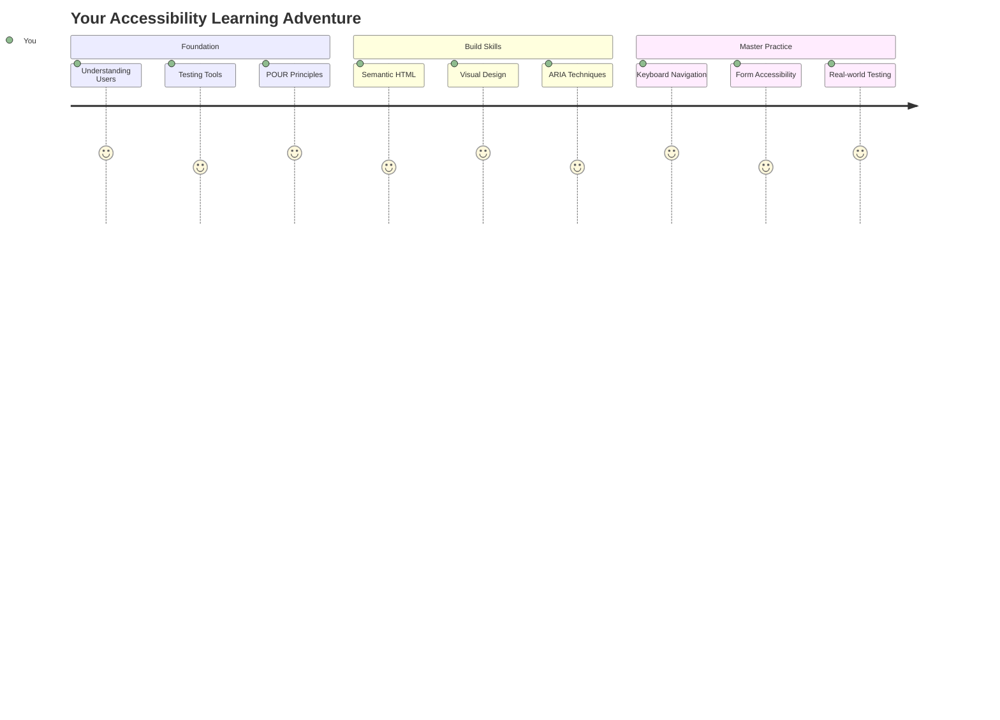

## ਲੈਕਚਰ ਤੋਂ ਪਹਿਲਾਂ ਕਵਿਜ਼
[ਲੈਕਚਰ ਤੋਂ ਪਹਿਲਾਂ ਕਵਿਜ਼](https://ff-quizzes.netlify.app/web/)

> ਵੈੱਬ ਦੀ ਤਾਕਤ ਇਸ ਦੀ ਵਿਸ਼ਵਵਿਆਪਕਤਾ ਵਿੱਚ ਹੈ। ਅਪਾਹਜਤਾ ਤੋਂ ਬਿਨਾਂ ਹਰ ਕਿਸੇ ਲਈ ਪਹੁੰਚ ਇੱਕ ਜ਼ਰੂਰੀ ਪਹਲੂ ਹੈ।
>
> \- ਸਰ ਟਿਮੋਥੀ ਬਰਨਰਜ਼-ਲੀ, W3C ਡਾਇਰੈਕਟਰ ਅਤੇ ਵਰਲਡ ਵਾਈਡ ਵੈੱਬ ਦੇ ਆਵਿਸ਼ਕਾਰਕ

ਇਹ ਤੁਹਾਨੂੰ ਹੈਰਾਨ ਕਰ ਸਕਦਾ ਹੈ: ਜਦੋਂ ਤੁਸੀਂ ਸਹੀ ਵੈੱਬਸਾਈਟ ਬਣਾਉਂਦੇ ਹੋ, ਤਾਂ ਤੁਸੀਂ ਸਿਰਫ ਅਪਾਹਜ ਲੋਕਾਂ ਦੀ ਮਦਦ ਨਹੀਂ ਕਰ ਰਹੇ, ਬਲਕਿ ਤੁਸੀਂ ਵੈੱਬ ਨੂੰ ਹਰ ਕਿਸੇ ਲਈ ਬਿਹਤਰ ਬਣਾ ਰਹੇ ਹੋ!

ਕੀ ਤੁਸੀਂ ਕਦੇ ਸੜਕ ਦੇ ਕੋਨੇ 'ਤੇ ਉਹ ਛੋਟੇ ਰੈਂਪ ਦੇਖੇ ਹਨ? ਇਹ ਮੁੱਖ ਤੌਰ 'ਤੇ ਵ੍ਹੀਲਚੇਅਰ ਲਈ ਬਣਾਏ ਗਏ ਸਨ, ਪਰ ਹੁਣ ਇਹ ਬੱਚਿਆਂ ਦੇ ਸਟ੍ਰੋਲਰ, ਡਿਲਿਵਰੀ ਵਰਕਰਾਂ ਦੇ ਡੌਲੀ, ਯਾਤਰੀਆਂ ਦੇ ਰੋਲਿੰਗ ਲੱਗੇਜ ਅਤੇ ਸਾਈਕਲ ਸਵਾਰਾਂ ਲਈ ਵੀ ਮਦਦਗਾਰ ਹਨ। ਇਹੀ ਤਰੀਕੇ ਨਾਲ ਸਹੀ ਵੈੱਬ ਡਿਜ਼ਾਈਨ ਕੰਮ ਕਰਦੀ ਹੈ—ਜੋ ਹੱਲ ਇੱਕ ਸਮੂਹ ਦੀ ਮਦਦ ਕਰਦੇ ਹਨ, ਉਹ ਅਕਸਰ ਹਰ ਕਿਸੇ ਲਈ ਫਾਇਦੇਮੰਦ ਹੁੰਦੇ ਹਨ। ਕਿੰਨਾ ਵਧੀਆ ਹੈ, ਹੈ ਨਾ?

ਇਸ ਪਾਠ ਵਿੱਚ, ਅਸੀਂ ਇਹ ਪਤਾ ਲਗਾਉਣ ਜਾ ਰਹੇ ਹਾਂ ਕਿ ਕਿਵੇਂ ਵੈੱਬਸਾਈਟਾਂ ਬਣਾਈਆਂ ਜਾ ਸਕਦੀਆਂ ਹਨ ਜੋ ਹਰ ਕਿਸੇ ਲਈ ਕੰਮ ਕਰਦੀਆਂ ਹਨ, ਚਾਹੇ ਉਹ ਵੈੱਬ ਨੂੰ ਕਿਸੇ ਵੀ ਤਰੀਕੇ ਨਾਲ ਵਰਤਦੇ ਹੋਣ। ਤੁਸੀਂ ਵੈੱਬ ਮਿਆਰਾਂ ਵਿੱਚ ਪਹਿਲਾਂ ਹੀ ਸ਼ਾਮਲ ਕੀਤੀਆਂ ਗਈਆਂ ਵਿਧੀਆਂ ਦੀ ਖੋਜ ਕਰੋਗੇ, ਟੈਸਟਿੰਗ ਟੂਲਾਂ ਨਾਲ ਹੱਥ-ਅਜਮਾਈ ਕਰੋਗੇ, ਅਤੇ ਦੇਖੋਗੇ ਕਿ ਕਿਵੇਂ ਸਹੀ ਬਣਾਉਟ ਤੁਹਾਡੇ ਸਾਈਟਾਂ ਨੂੰ ਸਾਰੇ ਉਪਭੋਗਤਾਵਾਂ ਲਈ ਵਧੇਰੇ ਵਰਤਣਯੋਗ ਬਣਾਉਂਦੀ ਹੈ।

ਇਸ ਪਾਠ ਦੇ ਅੰਤ ਤੱਕ, ਤੁਹਾਡੇ ਵਿੱਚ ਇਹ ਯਕੀਨ ਹੋਵੇਗਾ ਕਿ ਸਹੀ ਬਣਾਉਟ ਨੂੰ ਆਪਣੇ ਵਿਕਾਸ ਦੇ ਕੰਮਕਾਜ ਦਾ ਕੁਦਰਤੀ ਹਿੱਸਾ ਬਣਾਉਣਾ ਕਿਵੇਂ ਹੈ। ਤਿਆਰ ਹੋ ਜਾਓ ਇਹ ਪਤਾ ਕਰਨ ਲਈ ਕਿ ਸੋਚ-ਵਿਚਾਰ ਵਾਲੇ ਡਿਜ਼ਾਈਨ ਚੋਣਾਂ ਕਿਵੇਂ ਅਰਬਾਂ ਉਪਭੋਗਤਾਵਾਂ ਲਈ ਵੈੱਬ ਖੋਲ੍ਹ ਸਕਦੀਆਂ ਹਨ? ਚਲੋ ਸ਼ੁਰੂ ਕਰੀਏ!

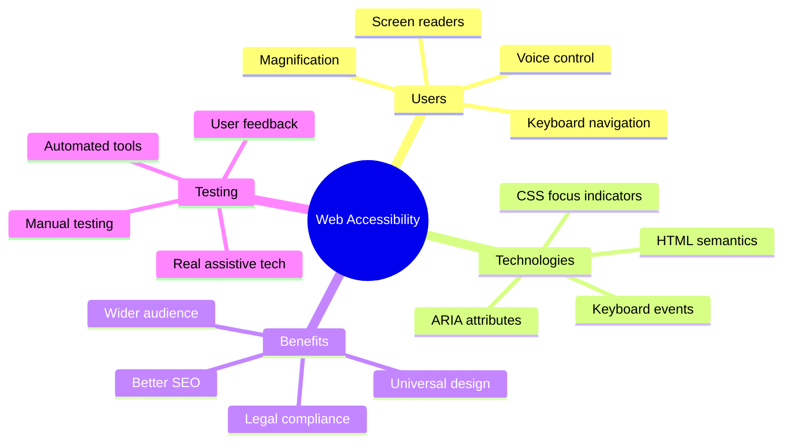

> ਤੁਸੀਂ ਇਹ ਪਾਠ [Microsoft Learn](https://docs.microsoft.com/learn/modules/web-development-101/accessibility/?WT.mc_id=academic-77807-sagibbon) 'ਤੇ ਲੈ ਸਕਦੇ ਹੋ!

## ਸਹਾਇਕ ਤਕਨਾਲੋਜੀਆਂ ਨੂੰ ਸਮਝਣਾ

ਕੋਡਿੰਗ ਵਿੱਚ ਜੁੜਨ ਤੋਂ ਪਹਿਲਾਂ, ਆਓ ਇਹ ਸਮਝਣ ਲਈ ਇੱਕ ਪਲ ਲਵਾਂ ਕਿ ਵੱਖ-ਵੱਖ ਯੋਗਤਾਵਾਂ ਵਾਲੇ ਲੋਕ ਵੈੱਬ ਨੂੰ ਅਸਲ ਵਿੱਚ ਕਿਵੇਂ ਅਨੁਭਵ ਕਰਦੇ ਹਨ। ਇਹ ਸਿਰਫ ਸਿਧਾਂਤ ਨਹੀਂ ਹੈ—ਇਹ ਅਸਲ-ਜਗਤ ਦੇ ਨੈਵੀਗੇਸ਼ਨ ਪੈਟਰਨਾਂ ਨੂੰ ਸਮਝਣਾ ਤੁਹਾਨੂੰ ਇੱਕ ਬਿਹਤਰ ਡਿਵੈਲਪਰ ਬਣਾਉਂਦਾ ਹੈ!

ਸਹਾਇਕ ਤਕਨਾਲੋਜੀਆਂ ਅਦਭੁਤ ਟੂਲ ਹਨ ਜੋ ਅਪਾਹਜ ਲੋਕਾਂ ਨੂੰ ਵੈੱਬਸਾਈਟਾਂ ਨਾਲ ਅਜਿਹੇ ਤਰੀਕੇ ਨਾਲ ਸੰਚਾਰ ਕਰਨ ਵਿੱਚ ਮਦਦ ਕਰਦੀਆਂ ਹਨ ਜੋ ਤੁਹਾਨੂੰ ਹੈਰਾਨ ਕਰ ਸਕਦੇ ਹਨ। ਜਦੋਂ ਤੁਸੀਂ ਇਹ ਸਮਝ ਲੈਂਦੇ ਹੋ ਕਿ ਇਹ ਤਕਨਾਲੋਜੀਆਂ ਕਿਵੇਂ ਕੰਮ ਕਰਦੀਆਂ ਹਨ, ਤਾਂ ਸਹੀ ਵੈੱਬ ਅਨੁਭਵ ਬਣਾਉਣਾ ਕਾਫ਼ੀ ਸਹਜ ਹੋ ਜਾਂਦਾ ਹੈ। ਇਹ ਜਿਵੇਂ ਤੁਹਾਡੇ ਕੋਡ ਨੂੰ ਕਿਸੇ ਹੋਰ ਦੀਆਂ ਅੱਖਾਂ ਨਾਲ ਦੇਖਣ ਦੀ ਕਲਾ ਸਿੱਖਣ ਵਰਗਾ ਹੈ।

### ਸਕ੍ਰੀਨ ਰੀਡਰ

[ਸਕ੍ਰੀਨ ਰੀਡਰ](https://en.wikipedia.org/wiki/Screen_reader) ਕਾਫ਼ੀ ਉੱਚ-ਤਕਨਾਲੀ ਤਕਨਾਲੋਜੀ ਹਨ ਜੋ ਡਿਜ਼ੀਟਲ ਟੈਕਸਟ ਨੂੰ ਬੋਲਣ ਜਾਂ ਬ੍ਰੇਲ ਆਉਟਪੁੱਟ ਵਿੱਚ ਬਦਲ ਦਿੰਦੀਆਂ ਹਨ। ਜਦੋਂ ਕਿ ਇਹ ਮੁੱਖ ਤੌਰ 'ਤੇ ਦ੍ਰਿਸ਼ਟੀ ਬਾਧਾ ਵਾਲੇ ਲੋਕਾਂ ਦੁਆਰਾ ਵਰਤੇ ਜਾਂਦੇ ਹਨ, ਇਹ ਡਿਸਲੈਕਸੀਆ ਵਰਗੀਆਂ ਸਿੱਖਣ ਦੀਆਂ ਬਾਧਾਵਾਂ ਵਾਲੇ ਉਪਭੋਗਤਾਵਾਂ ਲਈ ਵੀ ਬਹੁਤ ਮਦਦਗਾਰ ਹਨ।

ਮੈਨੂੰ ਸਕ੍ਰੀਨ ਰੀਡਰ ਨੂੰ ਇੱਕ ਬਹੁਤ ਹੀ ਸਮਰੱਥ ਕਹਾਣੀਕਾਰ ਵਲੋਂ ਇੱਕ ਕਿਤਾਬ ਪੜ੍ਹਨ ਵਾਲੇ ਵਜੋਂ ਸੋਚਣਾ ਪਸੰਦ ਹੈ। ਇਹ ਸਮੱਗਰੀ ਨੂੰ ਇੱਕ ਤਰਕਸੰਗਤ ਕ੍ਰਮ ਵਿੱਚ ਉੱਚੇ ਸੁਰ ਵਿੱਚ ਪੜ੍ਹਦਾ ਹੈ, ਇੰਟਰਐਕਟਿਵ ਤੱਤਾਂ ਨੂੰ "ਬਟਨ" ਜਾਂ "ਲਿੰਕ" ਵਜੋਂ ਘੋਸ਼ਿਤ ਕਰਦਾ ਹੈ, ਅਤੇ ਪੇਜ 'ਤੇ ਜੰਪ ਕਰਨ ਲਈ ਕੀਬੋਰਡ ਸ਼ਾਰਟਕਟ ਪ੍ਰਦਾਨ ਕਰਦਾ ਹੈ। ਪਰ ਗੱਲ ਇਹ ਹੈ—ਸਕ੍ਰੀਨ ਰੀਡਰ ਸਿਰਫ ਤਦ ਹੀ ਆਪਣਾ ਜਾਦੂ ਕਰ ਸਕਦੇ ਹਨ ਜੇ ਅਸੀਂ ਵੈੱਬਸਾਈਟਾਂ ਨੂੰ ਸਹੀ ਬਣਾਉਟ ਅਤੇ ਅਰਥਪੂਰਨ ਸਮੱਗਰੀ ਨਾਲ ਬਣਾਈਏ। ਇਹ ਤੁਹਾਡੇ ਵਜੋਂ ਇੱਕ ਡਿਵੈਲਪਰ ਦੀ ਜ਼ਿੰਮੇਵਾਰੀ ਹੈ!

**ਪਲੇਟਫਾਰਮਾਂ 'ਤੇ ਪ੍ਰਸਿੱਧ ਸਕ੍ਰੀਨ ਰੀਡਰ:**
- **Windows**: [NVDA](https://www.nvaccess.org/about-nvda/) (ਮੁਫ਼ਤ ਅਤੇ ਸਭ ਤੋਂ ਪ੍ਰਸਿੱਧ), [JAWS](https://webaim.org/articles/jaws/), [Narrator](https://support.microsoft.com/windows/complete-guide-to-narrator-e4397a0d-ef4f-b386-d8ae-c172f109bdb1/?WT.mc_id=academic-77807-sagibbon) (ਬਿਲਟ-ਇਨ)
- **macOS/iOS**: [VoiceOver](https://support.apple.com/guide/voiceover/welcome/10) (ਬਿਲਟ-ਇਨ ਅਤੇ ਬਹੁਤ ਸਮਰੱਥ)
- **Android**: [TalkBack](https://support.google.com/accessibility/android/answer/6283677) (ਬਿਲਟ-ਇਨ)
- **Linux**: [Orca](https://wiki.gnome.org/Projects/Orca) (ਮੁਫ਼ਤ ਅਤੇ ਖੁੱਲ੍ਹਾ-ਸਰੋਤ)

**ਸਕ੍ਰੀਨ ਰੀਡਰ ਵੈੱਬ ਸਮੱਗਰੀ ਨੂੰ ਕਿਵੇਂ ਨੈਵੀਗੇਟ ਕਰਦੇ ਹਨ:**

ਸਕ੍ਰੀਨ ਰੀਡਰ ਕਈ ਨੈਵੀਗੇਸ਼ਨ ਵਿਧੀਆਂ ਪ੍ਰਦਾਨ ਕਰਦੇ ਹਨ ਜੋ ਅਨੁਭਵੀ ਉਪਭੋਗਤਾਵਾਂ ਲਈ ਬ੍ਰਾਊਜ਼ਿੰਗ ਨੂੰ ਪ੍ਰਭਾਵਸ਼ਾਲੀ ਬਣਾਉਂਦੀਆਂ ਹਨ:
- **ਕ੍ਰਮਵਾਰ ਪੜ੍ਹਨਾ**: ਸਮੱਗਰੀ ਨੂੰ ਉੱਪਰ ਤੋਂ ਹੇਠਾਂ ਪੜ੍ਹਦਾ ਹੈ, ਜਿਵੇਂ ਇੱਕ ਕਿਤਾਬ ਦੀ ਪਾਲਣਾ ਕਰਦੇ ਹੋ
- **ਲੈਂਡਮਾਰਕ ਨੈਵੀਗੇਸ਼ਨ**: ਪੇਜ ਦੇ ਸੈਕਸ਼ਨਾਂ ਵਿੱਚ ਜੰਪ ਕਰਨਾ (ਹੈਡਰ, ਨੈਵ, ਮੇਨ, ਫੁੱਟਰ)
- **ਹੈਡਿੰਗ ਨੈਵੀਗੇਸ਼ਨ**: ਹੈਡਿੰਗਜ਼ ਵਿੱਚ ਜੰਪ ਕਰਕੇ ਪੇਜ ਬਣਾਉਟ ਨੂੰ ਸਮਝਣਾ
- **ਲਿੰਕ ਲਿਸਟ**: ਸਾਰੇ ਲਿੰਕਾਂ ਦੀ ਇੱਕ ਸੂਚੀ ਬਣਾਉਣਾ ਤੇ ਤੇਜ਼ ਪਹੁੰਚ
- **ਫਾਰਮ ਕੰਟਰੋਲ**: ਇਨਪੁਟ ਫੀਲਡ ਅਤੇ ਬਟਨ ਵਿੱਚ ਸਿੱਧੇ ਨੈਵੀਗੇਟ ਕਰਨਾ

> 💡 **ਇਹ ਕੁਝ ਹੈਰਾਨੀਜਨਕ ਹੈ**: 68% ਸਕ੍ਰੀਨ ਰੀਡਰ ਉਪਭੋਗਤਾਵਾਂ ਮੁੱਖ ਤੌਰ 'ਤੇ ਹੈਡਿੰਗਜ਼ ਦੁਆਰਾ ਨੈਵੀਗੇਟ ਕਰਦੇ ਹਨ ([WebAIM Survey](https://webaim.org/projects/screenreadersurvey9/#finding))। ਇਸਦਾ ਮਤਲਬ ਹੈ ਕਿ ਤੁਹਾਡਾ ਹੈਡਿੰਗ ਬਣਾਉਟ ਉਪਭੋਗਤਾਵਾਂ ਲਈ ਇੱਕ ਰੋਡਮੈਪ ਵਰਗਾ ਹੈ—ਜਦੋਂ ਤੁਸੀਂ ਇਸਨੂੰ ਸਹੀ ਬਣਾਉਂਦੇ ਹੋ, ਤਾਂ ਤੁਸੀਂ ਅਸਲ ਵਿੱਚ ਲੋਕਾਂ ਨੂੰ ਆਪਣੀ ਸਮੱਗਰੀ ਦੇ ਆਸ-ਪਾਸ ਤੇਜ਼ੀ ਨਾਲ ਰਸਤਾ ਲੱਭਣ ਵਿੱਚ ਮਦਦ ਕਰ ਰਹੇ ਹੋ!

### ਟੈਸਟਿੰਗ ਵਰਕਫਲੋ ਬਣਾਉਣਾ

ਇਹ ਕੁਝ ਚੰਗੀ ਖ਼ਬਰ ਹੈ—ਪ੍ਰਭਾਵਸ਼ਾਲੀ ਸਹੀ ਟੈਸਟਿੰਗ ਭਿਆਨਕ ਨਹੀਂ ਹੋਣੀ ਚਾਹੀਦੀ! ਤੁਸੀਂ ਆਟੋਮੈਟਿਕ ਟੂਲਾਂ (ਇਹ ਸਪਸ਼ਟ ਸਮੱਸਿਆਵਾਂ ਨੂੰ ਪਕੜਨ ਵਿੱਚ ਸ਼ਾਨਦਾਰ ਹਨ) ਨੂੰ ਕੁਝ ਹੱਥ-ਅਜਮਾਈ ਟੈਸਟਿੰਗ ਨਾਲ ਮਿਲਾਉਣਾ ਚਾਹੋਗੇ। ਇਹ ਇੱਕ ਵਿਧੀਬੱਧ ਪਹੁੰਚ ਹੈ ਜੋ ਮੈਂ ਪਤਾ ਲਗਾਇਆ ਹੈ ਕਿ ਸਭ ਤੋਂ ਵੱਧ ਸਮੱਸਿਆਵਾਂ ਨੂੰ ਪਕੜਦਾ ਹੈ ਬਿਨਾਂ ਤੁਹਾਡੇ ਸਾਰੇ ਦਿਨ ਨੂੰ ਖਰਚ ਕਰਨ ਦੇ:

**ਮੁੱਢਲੀ ਹੱਥ-ਅਜਮਾਈ ਟੈਸਟਿੰਗ ਵਰਕਫਲੋ:**

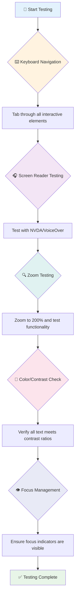

**ਕਦਮ-ਦਰ-ਕਦਮ ਟੈਸਟਿੰਗ ਚੈੱਕਲਿਸਟ:**
1. **ਕੀਬੋਰਡ ਨੈਵੀਗੇਸ਼ਨ**: ਸਿਰਫ਼ Tab, Shift+Tab, Enter, Space, ਅਤੇ Arrow keys ਵਰਤੋ
2. **ਸਕ੍ਰੀਨ ਰੀਡਰ ਟੈਸਟਿੰਗ**: NVDA, VoiceOver, ਜਾਂ Narrator ਚਾਲੂ ਕਰੋ ਅਤੇ ਬੰਦ ਅੱਖਾਂ ਨਾਲ ਨੈਵੀਗੇਟ ਕਰੋ
3. **ਜ਼ੂਮ ਟੈਸਟਿੰਗ**: 200% ਅਤੇ 400% ਜ਼ੂਮ ਲੈਵਲ 'ਤੇ ਟੈਸਟ ਕਰੋ
4. **ਰੰਗ ਕਾਂਟ੍ਰਾਸਟ ਦੀ ਜਾਂਚ**: ਸਾਰੇ ਟੈਕਸਟ ਅਤੇ UI ਕੰਪੋਨੈਂਟਾਂ ਦੀ ਜਾਂਚ ਕਰੋ
5. **ਫੋਕਸ ਇੰਡਿਕੇਟਰ ਟੈਸਟਿੰਗ**: ਯਕੀਨੀ ਬਣਾਓ ਕਿ ਸਾਰੇ ਇੰਟਰਐਕਟਿਵ ਤੱਤਾਂ ਦੇ ਦਿੱਖਤ ਫੋਕਸ ਸਟੇਟ ਹਨ

✅ **Lighthouse ਨਾਲ ਸ਼ੁਰੂ ਕਰੋ**: ਆਪਣੇ ਬ੍ਰਾਊਜ਼ਰ ਦੇ DevTools ਖੋਲ੍ਹੋ, ਇੱਕ Lighthouse ਸਹੀ ਆਡਿਟ ਚਲਾਓ, ਫਿਰ ਆਪਣੇ ਹੱਥ-ਅਜਮਾਈ ਟੈਸਟਿੰਗ ਫੋਕਸ ਖੇਤਰਾਂ ਨੂੰ ਗਾਈਡ ਕਰਨ ਲਈ ਨਤੀਜੇ ਵਰਤੋ।

### ਜ਼ੂਮ ਅਤੇ ਵਧਾਈ ਟੂਲ

ਤੁਹਾਨੂੰ ਪਤਾ ਹੈ ਕਿ ਜਦੋਂ ਟੈਕਸਟ ਬਹੁਤ ਛੋਟਾ ਹੁੰਦਾ ਹੈ ਤਾਂ ਤੁਸੀਂ ਕਦੇ-ਕਦੇ ਆਪਣੇ ਫੋਨ 'ਤੇ ਪਿੰਚ ਕਰਦੇ ਹੋ, ਜਾਂ ਚਮਕਦਾਰ ਧੁੱਪ ਵਿੱਚ ਆਪਣੇ ਲੈਪਟਾਪ ਸਕ੍ਰੀਨ 'ਤੇ ਅੱਖਾਂ ਮੀਟਦੇ ਹੋ? ਕਈ ਉਪਭੋਗਤਾ ਸਮੱਗਰੀ ਨੂੰ ਹਰ ਰੋਜ਼ ਪੜ੍ਹਨਯੋਗ ਬਣਾਉਣ ਲਈ ਵਧਾਈ ਟੂਲਾਂ 'ਤੇ ਨਿਰਭਰ ਕਰਦੇ ਹਨ। ਇਸ ਵਿੱਚ ਘੱਟ ਦ੍ਰਿਸ਼ਟੀ ਵਾਲੇ ਲੋਕ, ਵੱਡੇ ਹੋ ਰਹੇ ਬਜ਼ੁਰਗ, ਅਤੇ ਕੋਈ ਵੀ ਸ਼ਾਮਲ ਹੈ ਜਿਸਨੇ ਕਦੇ ਬਾਹਰ ਇੱਕ ਵੈੱਬਸਾਈਟ ਪੜ੍ਹਨ ਦੀ ਕੋਸ਼ਿਸ਼ ਕੀਤੀ ਹੈ।

ਆਧੁਨਿਕ ਜ਼ੂਮ ਤਕਨਾਲੋਜੀਆਂ ਸਿਰਫ਼ ਚੀਜ਼ਾਂ ਨੂੰ ਵੱਡਾ ਬਣਾਉਣ ਤੋਂ ਬਹੁਤ ਅੱਗੇ ਵਧ ਗਈਆਂ ਹਨ। ਇਹ ਸਮਝਣਾ ਕਿ ਇਹ ਟੂਲ ਕਿਵੇਂ ਕੰਮ ਕਰਦੇ ਹਨ ਤੁਹਾਨੂੰ ਜਵਾਬਦੇਹ ਡਿਜ਼ਾਈਨ ਬਣਾਉਣ ਵਿੱਚ ਮਦਦ ਕਰੇਗਾ ਜੋ ਕਿਸੇ ਵੀ ਵਧਾਈ ਲੈਵਲ 'ਤੇ ਕਾਰਗਰ ਅਤੇ ਆਕਰਸ਼ਕ ਰਹੇ।

**ਆਧੁਨਿਕ ਬ੍ਰਾਊਜ਼ਰ ਜ਼ੂਮ ਸਮਰੱਥਾਵਾਂ:**
- **ਪੇਜ ਜ਼ੂਮ**: ਸਾਰੀ ਸਮੱਗਰੀ ਨੂੰ ਅਨੁਪਾਤਿਕ ਤੌਰ 'ਤੇ ਵਧਾਉਂਦਾ ਹੈ (ਟੈਕਸਟ, ਚਿੱਤਰ, ਬਣਾਉਟ) - ਇਹ ਪਸੰਦੀਦਾ ਵਿਧੀ ਹੈ
- **ਸਿਰਫ਼ ਟੈਕਸਟ ਜ਼ੂਮ**: ਮੂਲ ਬਣਾਉਟ ਨੂੰ ਬਰਕਰਾਰ ਰੱਖਦੇ ਹੋਏ ਫੋਂਟ ਦਾ ਆਕਾਰ ਵਧਾਉਂਦਾ ਹੈ
- **ਪਿੰਚ-ਟੂ-ਜ਼ੂਮ**: ਮੋਬਾਈਲ ਜੈਸਚਰ ਸਹਾਇਤਾ ਅਸਥਾਈ ਵਧਾਈ ਲਈ
- **ਬ੍ਰਾਊਜ਼ਰ ਸਹਾਇਤਾ**: ਸਾਰੇ ਆਧੁਨਿਕ ਬ੍ਰਾਊਜ਼ਰ 500% ਤੱਕ ਜ਼ੂਮ ਦਾ ਸਮਰਥਨ ਕਰਦੇ ਹਨ ਬਿਨਾਂ ਕਾਰਗਰਤਾ ਨੂੰ ਤੋੜੇ

**ਵਿਸ਼ੇਸ਼ਤਾਵਾਂ ਵਾਲਾ ਵਧਾਈ ਸੌਫਟਵੇਅਰ:**
- **Windows**: [Magnifier](https://support.microsoft.com/windows/use-magnifier-to-make-things-on-the-screen-easier-to-see-414948ba-8b1c-d3bd-8615-0e5e32204198) (ਬਿਲਟ-ਇਨ), [ZoomText](https://www.freedomscientific.com/training/zoomtext/getting-started/)
- **macOS/iOS**: [Zoom](https://www.apple.com/accessibility/mac/vision/) (ਬਿਲਟ-ਇਨ ਅਤੇ ਉੱਚਤਮ ਵਿਸ਼ੇਸ਼ਤਾਵਾਂ ਨਾਲ)

> ⚠️ **ਡਿਜ਼ਾਈਨ ਵਿਚਾਰ**: WCAG ਦੀ ਮੰਗ ਹੈ ਕਿ ਸਮੱਗਰੀ 200% ਤੱਕ ਜ਼ੂਮ ਕੀਤੀ ਜਾ ਸਕੇ। ਇਸ ਲੈਵਲ 'ਤੇ, ਹੋਰਿਜ਼ਾਂਟਲ ਸਕ੍ਰੋਲਿੰਗ ਘੱਟ ਹੋਣੀ ਚਾਹੀਦੀ ਹੈ, ਅਤੇ ਸਾਰੇ ਇੰਟਰਐਕਟਿਵ ਤੱਤ ਪਹੁੰਚਯੋਗ ਰਹਿਣੇ ਚਾਹੀਦੇ ਹਨ।

✅ **ਆਪਣੇ ਜਵਾਬਦੇਹ ਡਿਜ਼ਾਈਨ ਦੀ ਜਾਂਚ ਕਰੋ**: ਆਪਣੇ ਬ੍ਰਾਊਜ਼ਰ ਨੂੰ 200% ਅਤੇ 400% ਜ਼ੂਮ ਕਰੋ। ਕੀ ਤੁਹਾਡਾ ਬਣਾਉਟ ਸੁੰਦਰ ਤਰੀਕੇ ਨਾਲ ਅਨੁਕੂਲ ਹੁੰਦਾ ਹੈ? ਕੀ ਤੁਸੀਂ ਬਹੁਤ ਜ਼ਿਆਦਾ ਸਕ੍ਰੋਲਿੰਗ ਤੋਂ ਬਿਨਾਂ ਸਾਰੀ ਕਾਰਗਰਤਾ ਤੱਕ ਪਹੁੰਚ ਸਕਦੇ ਹੋ?

## ਆਧੁਨਿਕ ਸਹੀ ਟੈਸਟਿੰਗ ਟੂਲ

ਹੁਣ ਜਦੋਂ ਤੁਸੀਂ ਸਮਝ ਗਏ ਹੋ ਕਿ ਲੋਕ ਸਹਾਇਕ ਤਕਨਾਲੋਜੀਆਂ ਨਾਲ ਵੈੱਬ ਨੂੰ ਕਿਵੇਂ ਨੈਵੀਗੇਟ ਕਰਦੇ ਹਨ, ਆਓ ਉਹ ਟੂਲਾਂ ਦੀ ਖੋਜ ਕਰੀਏ ਜੋ ਤੁਹਾਨੂੰ ਸਹੀ ਵੈੱਬਸਾਈਟਾਂ ਬਣਾਉਣ ਅਤੇ ਟੈਸਟ ਕਰਨ ਵਿੱਚ ਮਦਦ ਕਰਦੇ ਹਨ।

ਇਸਨੂੰ ਇਸ ਤਰੀਕੇ ਨਾਲ ਸੋਚੋ: ਆਟੋਮੈਟਿਕ ਟੂਲ ਸਪਸ਼ਟ ਸਮੱਸਿਆਵਾਂ (ਜਿਵੇਂ ਕਿ ਗੁੰਮ alt ਟੈਕਸਟ) ਨੂੰ ਪਕੜਨ ਵਿੱਚ ਸ਼ਾਨਦਾਰ ਹਨ, ਜਦੋਂ ਕਿ ਹੱਥ-ਅਜਮਾਈ ਟੈਸਟਿੰਗ ਤੁਹਾਨੂੰ ਇਹ ਯਕੀਨੀ ਬਣਾਉਣ ਵਿੱਚ ਮਦਦ ਕਰਦੀ ਹੈ ਕਿ ਤੁਹਾਡੀ ਸਾਈਟ ਅਸਲ ਜਗਤ ਵਿੱਚ ਵਰਤਣ ਲਈ ਚੰਗੀ ਮਹਿਸੂਸ ਕਰਦੀ ਹੈ। ਇਹਨਾਂ ਨੂੰ ਮਿਲਾ ਕੇ, ਇਹ ਤੁਹਾਨੂੰ ਇਹ ਯਕੀਨ ਦਿੰਦੇ ਹਨ ਕਿ ਤੁਹਾਡੀਆਂ ਸਾਈਟਾਂ ਹਰ ਕਿਸੇ ਲਈ ਕੰਮ ਕਰਦੀਆਂ ਹਨ।

### ਰੰਗ ਕਾਂਟ੍ਰਾਸਟ ਟੈਸਟਿੰਗ

ਇਹ ਕੁਝ ਚੰਗੀ ਖ਼ਬਰ ਹੈ: ਰੰਗ ਕਾਂਟ੍ਰਾਸਟ ਸਭ ਤੋਂ ਆਮ ਸਹੀ ਸਮੱਸਿਆਵਾਂ ਵਿੱਚੋਂ ਇੱਕ ਹੈ, ਪਰ ਇਹ ਸਭ ਤੋਂ ਆਸਾਨੀ ਨਾਲ ਠੀਕ ਕੀਤੀ ਜਾ ਸਕਦੀ ਹੈ। ਚੰਗਾ ਕਾਂਟ੍ਰਾਸਟ ਹਰ ਕਿਸੇ ਲਈ ਫਾਇਦੇਮੰਦ ਹੈ—ਦ੍ਰਿਸ਼ਟੀ ਬਾਧਾ ਵਾਲੇ ਉਪਭੋਗਤਾਵਾਂ ਤੋਂ ਲੈ ਕੇ ਉਹ ਲੋਕ ਜੋ ਬੀਚ 'ਤੇ ਆਪਣੇ ਫੋਨ ਪੜ੍ਹਨ ਦੀ ਕੋਸ਼ਿਸ਼ ਕਰ ਰਹੇ ਹਨ।

**WCAG ਕਾਂਟ੍ਰਾਸਟ ਦੀਆਂ ਮੰਗਾਂ:**

| ਟੈਕਸਟ ਦੀ ਕਿਸਮ | WCAG AA (ਘੱਟੋ-ਘੱਟ) | WCAG AAA (ਵਧੇਰੇ) |
|-----------|-------------------|---------------------|
| **ਸਧਾਰਨ ਟੈਕਸਟ** (18pt ਤੋਂ ਘੱਟ) | 4.5:1 ਕਾਂਟ੍ਰਾਸਟ ਅ
- **ਵੱਖ-ਵੱਖ ਬ੍ਰਾਊਜ਼ਰ, ਡਿਵਾਈਸਾਂ ਅਤੇ ਸਹਾਇਕ ਟੂਲਾਂ 'ਤੇ ਟੈਸਟ ਕਰੋ**
- **ਸਮੱਗਰੀ ਨੂੰ ਇਸ ਤਰੀਕੇ ਨਾਲ ਬਣਾਓ ਕਿ ਜਦੋਂ ਉੱਚ-ਪੱਧਰੀ ਫੀਚਰਾਂ ਦਾ ਸਮਰਥਨ ਨਹੀਂ ਹੁੰਦਾ, ਤਾਂ ਵੀ ਇਹ ਸਹੀ ਕੰਮ ਕਰੇ**

### 🎯 **POUR ਸਿਧਾਂਤ: ਯਾਦਗਾਰ ਬਣਾਉਣਾ**

**ਮੁੱਢਲੇ ਸਿਧਾਂਤਾਂ 'ਤੇ ਛੋਟਾ ਵਿਚਾਰ:**
- ਕੀ ਤੁਸੀਂ ਕਿਸੇ ਵੈਬਸਾਈਟ ਫੀਚਰ ਬਾਰੇ ਸੋਚ ਸਕਦੇ ਹੋ ਜੋ ਹਰ POUR ਸਿਧਾਂਤ 'ਤੇ ਫੇਲ੍ਹ ਹੁੰਦਾ ਹੈ?
- ਤੁਹਾਨੂੰ ਕਿਹੜਾ ਸਿਧਾਂਤ ਇੱਕ ਡਿਵੈਲਪਰ ਵਜੋਂ ਸਭ ਤੋਂ ਕੁਦਰਤੀ ਲੱਗਦਾ ਹੈ?
- ਇਹ ਸਿਧਾਂਤ ਸਿਰਫ ਅਪਾਹਜ ਉਪਭੋਗਤਾਵਾਂ ਲਈ ਨਹੀਂ, ਸਗੋਂ ਹਰ ਕਿਸੇ ਲਈ ਡਿਜ਼ਾਈਨ ਨੂੰ ਕਿਵੇਂ ਸੁਧਾਰ ਸਕਦੇ ਹਨ?

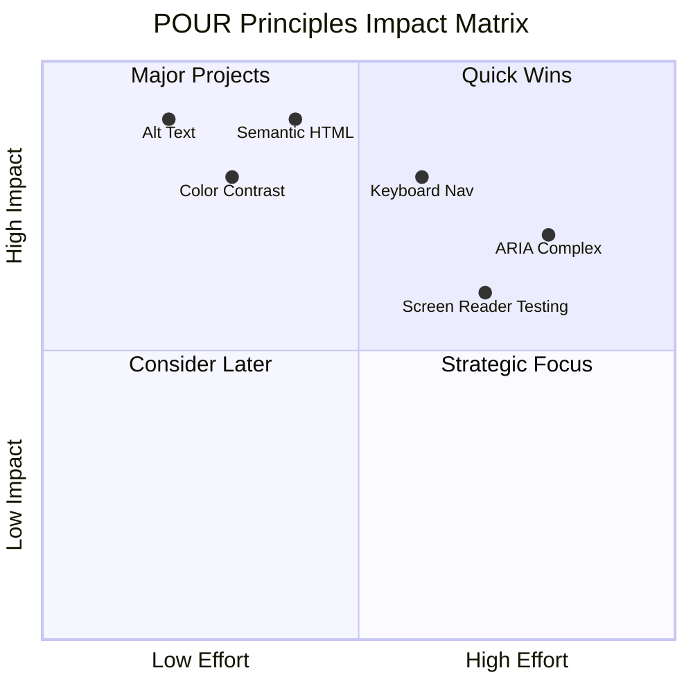

> **ਯਾਦ ਰੱਖੋ**: ਉੱਚ-ਅਸਰ, ਘੱਟ-ਕੋਸ਼ਿਸ਼ ਵਾਲੇ ਸੁਧਾਰਾਂ ਨਾਲ ਸ਼ੁਰੂ ਕਰੋ। ਸੈਮੈਂਟਿਕ HTML ਅਤੇ alt ਟੈਕਸਟ ਤੁਹਾਨੂੰ ਘੱਟ ਕੋਸ਼ਿਸ਼ ਨਾਲ ਵੱਡਾ ਐਕਸੈਸਬਿਲਿਟੀ ਫਾਇਦਾ ਦਿੰਦੇ ਹਨ!

## ਦ੍ਰਿਸ਼ਮਾਨ ਡਿਜ਼ਾਈਨ ਨੂੰ ਐਕਸੈਸਬਲ ਬਣਾਉਣਾ

ਚੰਗਾ ਦ੍ਰਿਸ਼ਮਾਨ ਡਿਜ਼ਾਈਨ ਅਤੇ ਐਕਸੈਸਬਿਲਿਟੀ ਹਮੇਸ਼ਾ ਇਕੱਠੇ ਚੱਲਦੇ ਹਨ। ਜਦੋਂ ਤੁਸੀਂ ਐਕਸੈਸਬਿਲਿਟੀ ਨੂੰ ਧਿਆਨ ਵਿੱਚ ਰੱਖ ਕੇ ਡਿਜ਼ਾਈਨ ਕਰਦੇ ਹੋ, ਤਾਂ ਅਕਸਰ ਇਹ ਪਾਬੰਦੀਆਂ ਸਾਫ਼ ਅਤੇ ਸੁੰਦਰ ਹੱਲ ਲੱਭਣ ਵਿੱਚ ਮਦਦ ਕਰਦੀਆਂ ਹਨ ਜੋ ਸਾਰੇ ਉਪਭੋਗਤਾਵਾਂ ਲਈ ਫਾਇਦੇਮੰਦ ਹੁੰਦੀਆਂ ਹਨ।

ਆਓ ਇਹ ਸਮਝੀਏ ਕਿ ਕਿਵੇਂ ਹਰ ਕਿਸੇ ਲਈ, ਚਾਹੇ ਉਹ ਕਿਸੇ ਵੀ ਦ੍ਰਿਸ਼ਮਾਨ ਯੋਗਤਾ ਜਾਂ ਹਾਲਾਤਾਂ ਵਿੱਚ ਸਮੱਗਰੀ ਦੇਖ ਰਹੇ ਹੋਣ, ਦ੍ਰਿਸ਼ਮਾਨ ਡਿਜ਼ਾਈਨ ਬਣਾਇਆ ਜਾ ਸਕਦਾ ਹੈ।

### ਰੰਗ ਅਤੇ ਦ੍ਰਿਸ਼ਮਾਨ ਐਕਸੈਸਬਿਲਿਟੀ ਰਣਨੀਤੀਆਂ

ਰੰਗ ਸੰਚਾਰ ਲਈ ਸ਼ਕਤੀਸ਼ਾਲੀ ਹੈ, ਪਰ ਇਹ ਕਦੇ ਵੀ ਮਹੱਤਵਪੂਰਨ ਜਾਣਕਾਰੀ ਪ੍ਰਦਾਨ ਕਰਨ ਦਾ ਇੱਕੋ-ਇੱਕ ਤਰੀਕਾ ਨਹੀਂ ਹੋਣਾ ਚਾਹੀਦਾ। ਰੰਗ ਤੋਂ ਪਰੇ ਡਿਜ਼ਾਈਨ ਕਰਨ ਨਾਲ ਜ਼ਿਆਦਾ ਮਜ਼ਬੂਤ, ਸਮਾਵੇਸ਼ੀਕ ਅਨੁਭਵ ਬਣਦੇ ਹਨ ਜੋ ਵੱਖ-ਵੱਖ ਹਾਲਾਤਾਂ ਵਿੱਚ ਕੰਮ ਕਰਦੇ ਹਨ।

**ਰੰਗ ਦ੍ਰਿਸ਼ਮਾਨ ਅੰਤਰਾਂ ਲਈ ਡਿਜ਼ਾਈਨ:**

ਲਗਭਗ 8% ਮਰਦ ਅਤੇ 0.5% ਔਰਤਾਂ ਵਿੱਚ ਕੁਝ ਰੰਗ ਦ੍ਰਿਸ਼ਮਾਨ ਅੰਤਰ ਹੁੰਦੇ ਹਨ (ਅਕਸਰ "ਰੰਗ ਅੰਧਤਾ" ਕਿਹਾ ਜਾਂਦਾ ਹੈ)। ਸਭ ਤੋਂ ਆਮ ਕਿਸਮਾਂ ਹਨ:
- **Deuteranopia**: ਲਾਲ ਅਤੇ ਹਰੇ ਵਿੱਚ ਫਰਕ ਕਰਨ ਵਿੱਚ ਮੁਸ਼ਕਲ
- **Protanopia**: ਲਾਲ ਹੋਰ ਮੰਨ੍ਹਾ ਦਿਖਾਈ ਦਿੰਦਾ ਹੈ
- **Tritanopia**: ਨੀਲੇ ਅਤੇ ਪੀਲੇ ਨਾਲ ਮੁਸ਼ਕਲ (ਵਿਰਲ)

**ਸਮਾਵੇਸ਼ੀਕ ਰੰਗ ਰਣਨੀਤੀਆਂ:**

```css
/* ❌ Bad: Using only color to indicate status */
.error { color: red; }
.success { color: green; }

/* ✅ Good: Color plus icons and context */
.error {
  color: #d32f2f;
  border-left: 4px solid #d32f2f;
}
.error::before {
  content: "⚠️";
  margin-right: 8px;
}

.success {
  color: #2e7d32;
  border-left: 4px solid #2e7d32;
}
.success::before {
  content: "✅";
  margin-right: 8px;
}
```

**ਮੁੱਢਲੇ ਕਾਂਟ੍ਰਾਸਟ ਦੀਆਂ ਲੋੜਾਂ ਤੋਂ ਪਰੇ:**
- ਆਪਣੇ ਰੰਗ ਚੋਣਾਂ ਨੂੰ ਰੰਗ ਅੰਧਤਾ ਸਿਮੂਲੇਟਰਾਂ ਨਾਲ ਟੈਸਟ ਕਰੋ
- ਰੰਗ ਕੋਡਿੰਗ ਦੇ ਨਾਲ ਪੈਟਰਨ, ਟੈਕਸਚਰ ਜਾਂ ਸ਼ੇਪ ਵਰਤੋ
- ਯਕੀਨੀ ਬਣਾਓ ਕਿ ਇੰਟਰੈਕਟਿਵ ਸਟੇਟਾਂ ਰੰਗ ਤੋਂ ਬਿਨਾਂ ਵੀ ਵੱਖਰੀਆਂ ਰਹਿੰਦੀਆਂ ਹਨ
- ਇਹ ਵੀ ਸੋਚੋ ਕਿ ਤੁਹਾਡਾ ਡਿਜ਼ਾਈਨ ਹਾਈ ਕਾਂਟ੍ਰਾਸਟ ਮੋਡ ਵਿੱਚ ਕਿਵੇਂ ਦਿਖਾਈ ਦਿੰਦਾ ਹੈ

✅ **ਆਪਣੀ ਰੰਗ ਐਕਸੈਸਬਿਲਿਟੀ ਟੈਸਟ ਕਰੋ**: [Coblis](https://www.color-blindness.com/coblis-color-blindness-simulator/) ਵਰਗੇ ਟੂਲਾਂ ਦੀ ਵਰਤੋਂ ਕਰੋ ਇਹ ਦੇਖਣ ਲਈ ਕਿ ਤੁਹਾਡੀ ਸਾਈਟ ਵੱਖ-ਵੱਖ ਰੰਗ ਦ੍ਰਿਸ਼ਮਾਨ ਕਿਸਮਾਂ ਵਾਲੇ ਉਪਭੋਗਤਾਵਾਂ ਲਈ ਕਿਵੇਂ ਦਿਖਾਈ ਦਿੰਦੀ ਹੈ।

### ਫੋਕਸ ਇੰਡਿਕੇਟਰ ਅਤੇ ਇੰਟਰੈਕਸ਼ਨ ਡਿਜ਼ਾਈਨ

ਫੋਕਸ ਇੰਡਿਕੇਟਰ ਡਿਜ਼ੀਟਲ ਸੰਸਾਰ ਵਿੱਚ ਕਰਸਰ ਵਰਗੇ ਹਨ—ਇਹ ਕੀਬੋਰਡ ਉਪਭੋਗਤਾਵਾਂ ਨੂੰ ਦਿਖਾਉਂਦੇ ਹਨ ਕਿ ਉਹ ਪੇਜ 'ਤੇ ਕਿੱਥੇ ਹਨ। ਚੰਗੇ ਤਰੀਕੇ ਨਾਲ ਡਿਜ਼ਾਈਨ ਕੀਤੇ ਫੋਕਸ ਇੰਡਿਕੇਟਰ ਹਰ ਕਿਸੇ ਲਈ ਅਨੁਭਵ ਨੂੰ ਸਾਫ਼ ਅਤੇ ਭਰੋਸੇਯੋਗ ਬਣਾਉਂਦੇ ਹਨ।

**ਆਧੁਨਿਕ ਫੋਕਸ ਇੰਡਿਕੇਟਰ ਸ੍ਰੇਸ਼ਠ ਅਭਿਆਸ:**

```css
/* Enhanced focus styles that work across browsers */
button:focus-visible {
  outline: 2px solid #0066cc;
  outline-offset: 2px;
  box-shadow: 0 0 0 4px rgba(0, 102, 204, 0.25);
}

/* Remove focus outline for mouse users, preserve for keyboard users */
button:focus:not(:focus-visible) {
  outline: none;
}

/* Focus-within for complex components */
.card:focus-within {
  box-shadow: 0 0 0 3px rgba(74, 144, 164, 0.5);
  border-color: #4A90A4;
}

/* Ensure focus indicators meet contrast requirements */
.custom-focus:focus-visible {
  outline: 3px solid #ffffff;
  outline-offset: 2px;
  box-shadow: 0 0 0 6px #000000;
}
```

**ਫੋਕਸ ਇੰਡਿਕੇਟਰ ਦੀਆਂ ਲੋੜਾਂ:**
- **ਦਿੱਖ**: ਆਲੇ-ਦੁਆਲੇ ਦੇ ਤੱਤਾਂ ਨਾਲ ਘੱਟੋ-ਘੱਟ 3:1 ਕਾਂਟ੍ਰਾਸਟ ਰੇਸ਼ੋ ਹੋਣਾ ਚਾਹੀਦਾ ਹੈ
- **ਚੌੜਾਈ**: ਘੱਟੋ-ਘੱਟ 2px ਮੋਟਾਈ ਸਾਰੇ ਤੱਤ ਦੇ ਆਲੇ-ਦੁਆਲੇ
- **ਸਥਿਰਤਾ**: ਫੋਕਸ ਕਿਤੇ ਹੋਰ ਨਹੀਂ ਜਾਂਦਾ ਤੱਕ ਦਿੱਖ ਵਿੱਚ ਰਹਿਣਾ ਚਾਹੀਦਾ ਹੈ
- **ਵੱਖਰਾਪਨ**: ਹੋਰ UI ਸਟੇਟਾਂ ਤੋਂ ਦ੍ਰਿਸ਼ਮਾਨ ਤੌਰ 'ਤੇ ਵੱਖਰਾ ਹੋਣਾ ਚਾਹੀਦਾ ਹੈ

> 💡 **ਡਿਜ਼ਾਈਨ ਟਿਪ**: ਵਧੀਆ ਫੋਕਸ ਇੰਡਿਕੇਟਰ ਆਮ ਤੌਰ 'ਤੇ outline, box-shadow, ਅਤੇ ਰੰਗ ਬਦਲਣ ਦੇ ਸੰਯੋਗ ਦੀ ਵਰਤੋਂ ਕਰਦੇ ਹਨ ਤਾਂ ਜੋ ਵੱਖ-ਵੱਖ ਬੈਕਗਰਾਊਂਡ ਅਤੇ ਸੰਦਰਭਾਂ ਵਿੱਚ ਦਿੱਖ ਯਕੀਨੀ ਬਣਾਈ ਜਾ ਸਕੇ।

✅ **ਆਪਣੇ ਫੋਕਸ ਇੰਡਿਕੇਟਰ ਦਾ ਆਡਿਟ ਕਰੋ**: ਆਪਣੀ ਵੈਬਸਾਈਟ 'ਤੇ ਟੈਬ ਦਬਾ ਕੇ ਦੇਖੋ ਕਿ ਕਿਹੜੇ ਤੱਤਾਂ ਦੇ ਸਾਫ਼ ਫੋਕਸ ਇੰਡਿਕੇਟਰ ਹਨ। ਕੀ ਕੋਈ ਦਿਖਣ ਵਿੱਚ ਮੁਸ਼ਕਲ ਜਾਂ ਪੂਰੀ ਤਰ੍ਹਾਂ ਗਾਇਬ ਹਨ?

### ਸੈਮੈਂਟਿਕ HTML: ਐਕਸੈਸਬਿਲਿਟੀ ਦੀ ਬੁਨਿਆਦ

ਸੈਮੈਂਟਿਕ HTML ਸਹਾਇਕ ਤਕਨਾਲੋਜੀਆਂ ਲਈ ਤੁਹਾਡੀ ਵੈਬਸਾਈਟ ਦਾ GPS ਸਿਸਟਮ ਬਣਾਉਣ ਵਰਗਾ ਹੈ। ਜਦੋਂ ਤੁਸੀਂ ਸਹੀ HTML ਤੱਤਾਂ ਨੂੰ ਉਨ੍ਹਾਂ ਦੇ ਉਦੇਸ਼ ਲਈ ਵਰਤਦੇ ਹੋ, ਤਾਂ ਤੁਸੀਂ ਸਕ੍ਰੀਨ ਰੀਡਰ, ਕੀਬੋਰਡ ਅਤੇ ਹੋਰ ਟੂਲਾਂ ਨੂੰ ਇੱਕ ਵਿਸਥਾਰਿਤ ਰੋਡਮੈਪ ਪ੍ਰਦਾਨ ਕਰਦੇ ਹੋ ਜੋ ਉਪਭੋਗਤਾਵਾਂ ਨੂੰ ਪ੍ਰਭਾਵਸ਼ਾਲੀ ਤਰੀਕੇ ਨਾਲ ਨੈਵੀਗੇਟ ਕਰਨ ਵਿੱਚ ਮਦਦ ਕਰਦਾ ਹੈ।

ਇਹ ਇੱਕ ਅਨੁਪਮ ਬੇਹਤਰੀ analogy ਹੈ: ਸੈਮੈਂਟਿਕ HTML ਇੱਕ ਚੰਗੀ ਤਰ੍ਹਾਂ ਸੰਗਠਿਤ ਲਾਇਬ੍ਰੇਰੀ ਦੇ ਫਰਕ ਨੂੰ ਦਰਸਾਉਂਦਾ ਹੈ ਜਿਸ ਵਿੱਚ ਸਾਫ਼ ਸ਼੍ਰੇਣੀਆਂ ਅਤੇ ਮਦਦਗਾਰ ਸਾਈਨ ਹਨ, ਬਨਾਮ ਇੱਕ ਗੋਦਾਮ ਜਿੱਥੇ ਕਿਤਾਬਾਂ ਬੇਤਰਤੀਬੀ ਨਾਲ ਫੈਲੀਆਂ ਹੋਈਆਂ ਹਨ। ਦੋਨਾਂ ਜਗ੍ਹਾਂ ਇੱਕੋ ਕਿਤਾਬਾਂ ਹਨ, ਪਰ ਤੁਸੀਂ ਕਿਸੇ ਵਿੱਚ ਕੁਝ ਲੱਭਣ ਦੀ ਕੋਸ਼ਿਸ਼ ਕਰਨਾ ਚਾਹੋਗੇ? ਬਿਲਕੁਲ!

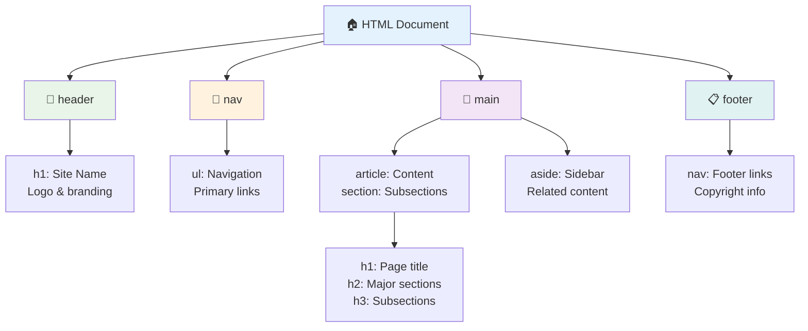

**ਐਕਸੈਸਬਲ ਪੇਜ ਸਟ੍ਰਕਚਰ ਦੇ ਬੁਨਿਆਦੀ ਤੱਤ:**

```html
<!-- Landmark elements provide page navigation structure -->
<header>
  <h1>Your Site Name</h1>
  <nav aria-label="Main navigation">
    <ul>
      <li><a href="/home">Home</a></li>
      <li><a href="/about">About</a></li>
      <li><a href="/services">Services</a></li>
    </ul>
  </nav>
</header>

<main>
  <article>
    <header>
      <h1>Article Title</h1>
      <p>Published on <time datetime="2024-10-14">October 14, 2024</time></p>
    </header>
    
    <section>
      <h2>First Section</h2>
      <p>Content that relates to this section...</p>
    </section>
    
    <section>
      <h2>Second Section</h2>
      <p>More related content...</p>
    </section>
  </article>
  
  <aside>
    <h2>Related Links</h2>
    <nav aria-label="Related articles">
      <ul>
        <li><a href="/related-1">First related article</a></li>
        <li><a href="/related-2">Second related article</a></li>
      </ul>
    </nav>
  </aside>
</main>

<footer>
  <p>&copy; 2024 Your Site Name. All rights reserved.</p>
  <nav aria-label="Footer links">
    <ul>
      <li><a href="/privacy">Privacy Policy</a></li>
      <li><a href="/contact">Contact Us</a></li>
    </ul>
  </nav>
</footer>
```

**ਸੈਮੈਂਟਿਕ HTML ਐਕਸੈਸਬਿਲਿਟੀ ਨੂੰ ਕਿਵੇਂ ਬਦਲਦਾ ਹੈ:**

| ਸੈਮੈਂਟਿਕ ਤੱਤ | ਉਦੇਸ਼ | ਸਕ੍ਰੀਨ ਰੀਡਰ ਫਾਇਦਾ |
|------------------|---------|----------------------|
| `<header>` | ਪੇਜ ਜਾਂ ਸੈਕਸ਼ਨ ਹੈਡਰ | "Banner landmark" - ਸਿੱਧੇ ਉੱਪਰ ਨੈਵੀਗੇਟ |
| `<nav>` | ਨੈਵੀਗੇਸ਼ਨ ਲਿੰਕ | "Navigation landmark" - ਨੈਵ ਸੈਕਸ਼ਨਾਂ ਦੀ ਸੂਚੀ |
| `<main>` | ਮੁੱਖ ਪੇਜ ਸਮੱਗਰੀ | "Main landmark" - ਸਿੱਧੇ ਸਮੱਗਰੀ 'ਤੇ ਜਾਓ |
| `<article>` | ਸਵੈ-ਸੰਬੰਧਿਤ ਸਮੱਗਰੀ | ਆਰਟਿਕਲ ਦੀਆਂ ਹੱਦਾਂ ਦਾ ਐਲਾਨ |
| `<section>` | ਥੀਮ ਵਾਲੇ ਸਮੱਗਰੀ ਸਮੂਹ | ਸਮੱਗਰੀ ਸਟ੍ਰਕਚਰ ਪ੍ਰਦਾਨ ਕਰਦਾ ਹੈ |
| `<aside>` | ਸੰਬੰਧਿਤ ਸਾਈਡਬਾਰ ਸਮੱਗਰੀ | "Complementary landmark" |
| `<footer>` | ਪੇਜ ਜਾਂ ਸੈਕਸ਼ਨ ਫੁੱਟਰ | "Contentinfo landmark" |

**ਸਕ੍ਰੀਨ ਰੀਡਰ ਦੇ ਸੈਮੈਂਟਿਕ HTML ਨਾਲ ਸੁਪਰਪਾਵਰ:**
- **ਲੈਂਡਮਾਰਕ ਨੈਵੀਗੇਸ਼ਨ**: ਮੁੱਖ ਪੇਜ ਸੈਕਸ਼ਨਾਂ ਵਿੱਚ ਤੁਰੰਤ ਜਾਓ
- **ਹੈਡਿੰਗ ਰੂਪਰੇਖਾ**: ਤੁਹਾਡੇ ਹੈਡਿੰਗ ਸਟ੍ਰਕਚਰ ਤੋਂ ਸੂਚੀ ਬਣਾਓ
- **ਤੱਤਾਂ ਦੀ ਸੂਚੀ**: ਸਾਰੇ ਲਿੰਕ, ਬਟਨ ਜਾਂ ਫਾਰਮ ਕੰਟਰੋਲ ਦੀ ਸੂਚੀ ਬਣਾਓ
- **ਸੰਦਰਭ ਜਾਗਰੂਕਤਾ**: ਸਮੱਗਰੀ ਸੈਕਸ਼ਨਾਂ ਦੇ ਰਿਸ਼ਤਿਆਂ ਨੂੰ ਸਮਝੋ

> 🎯 **ਤੁਰੰਤ ਟੈਸਟ**: landmark shortcuts (NVDA/JAWS ਵਿੱਚ D), heading (H), link (K) ਵਰਤ ਕੇ ਆਪਣੀ ਸਾਈਟ ਨੂੰ ਸਕ੍ਰੀਨ ਰੀਡਰ ਨਾਲ ਨੈਵੀਗੇਟ ਕਰਨ ਦੀ ਕੋਸ਼ਿਸ਼ ਕਰੋ। ਕੀ ਨੈਵੀਗੇਸ਼ਨ ਸਹੀ ਲੱਗਦਾ ਹੈ?

### 🏗️ **ਸੈਮੈਂਟਿਕ HTML ਮਾਹਰਤਾ ਚੈੱਕ: ਮਜ਼ਬੂਤ ਬੁਨਿਆਦ ਬਣਾਉਣਾ**

**ਆਓ ਤੁਹਾਡੇ ਸੈਮੈਂਟਿਕ ਸਮਝ ਦਾ ਮੁਲਾਂਕਣ ਕਰੀਏ:**
- ਕੀ ਤੁਸੀਂ HTML ਦੇਖ ਕੇ ਪੇਜ ਦੇ ਲੈਂਡਮਾਰਕਾਂ ਦੀ ਪਹਿਚਾਣ ਕਰ ਸਕਦੇ ਹੋ?
- ਤੁਸੀਂ ਆਪਣੇ ਦੋਸਤ ਨੂੰ `<section>` ਅਤੇ `<div>` ਦੇ ਫਰਕ ਨੂੰ ਕਿਵੇਂ ਸਮਝਾਉਗੇ?
- ਜੇਕਰ ਸਕ੍ਰੀਨ ਰੀਡਰ ਉਪਭੋਗਤਾ ਨੈਵੀਗੇਸ਼ਨ ਸਮੱਸਿਆਵਾਂ ਦੀ ਰਿਪੋਰਟ ਕਰਦਾ ਹੈ, ਤਾਂ ਤੁਸੀਂ ਸਭ ਤੋਂ ਪਹਿਲਾਂ ਕੀ ਚੈੱਕ ਕਰੋਗੇ?

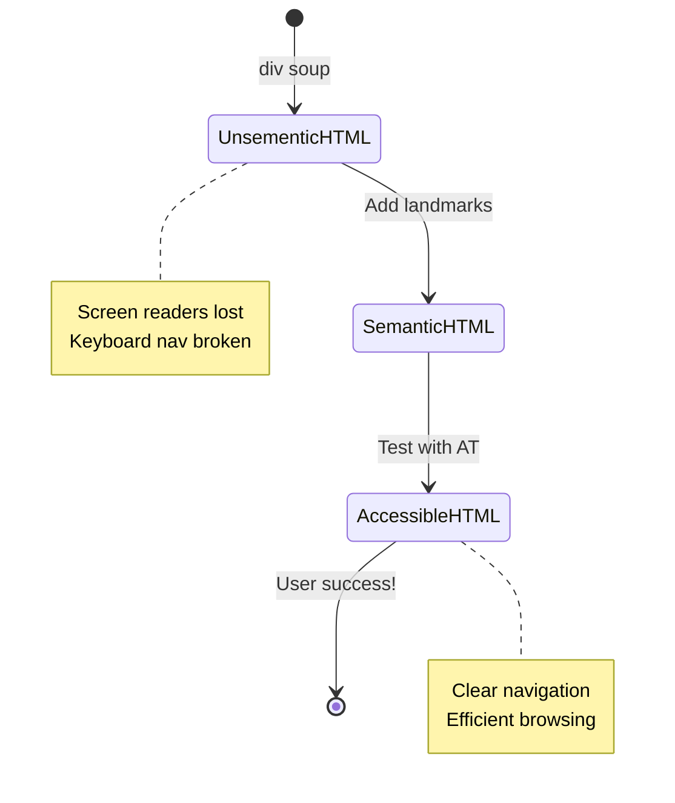

> **ਪ੍ਰੋ ਅੰਦਰੂਨੀ ਜਾਣਕਾਰੀ**: ਚੰਗਾ ਸੈਮੈਂਟਿਕ HTML ਆਪਣੇ ਆਪ 70% ਐਕਸੈਸਬਿਲਿਟੀ ਸਮੱਸਿਆਵਾਂ ਨੂੰ ਹੱਲ ਕਰਦਾ ਹੈ। ਇਸ ਬੁਨਿਆਦ ਨੂੰ ਮਾਹਰ ਬਣਾਓ ਅਤੇ ਤੁਸੀਂ ਸਫਲਤਾ ਦੇ ਰਾਹ 'ਤੇ ਹੋ!

✅ **ਆਪਣੀ ਸੈਮੈਂਟਿਕ ਸਟ੍ਰਕਚਰ ਦਾ ਆਡਿਟ ਕਰੋ**: ਆਪਣੇ ਬ੍ਰਾਊਜ਼ਰ ਦੇ DevTools ਵਿੱਚ ਐਕਸੈਸਬਿਲਿਟੀ ਪੈਨਲ ਦੀ ਵਰਤੋਂ ਕਰੋ ਤਾਂ ਜੋ ਐਕਸੈਸਬਿਲਿਟੀ ਟ੍ਰੀ ਦੇਖਿਆ ਜਾ ਸਕੇ ਅਤੇ ਯਕੀਨੀ ਬਣਾਇਆ ਜਾ ਸਕੇ ਕਿ ਤੁਹਾਡਾ ਮਾਰਕਅੱਪ ਇੱਕ ਤਰਕਸੰਗਤ ਸਟ੍ਰਕਚਰ ਬਣਾਉਂਦਾ ਹੈ।

### ਹੈਡਿੰਗ ਹਾਇਰਾਰਕੀ: ਤਰਕਸੰਗਤ ਸਮੱਗਰੀ ਰੂਪਰੇਖਾ ਬਣਾਉਣਾ

ਹੈਡਿੰਗ ਐਕਸੈਸਬਲ ਸਮੱਗਰੀ ਲਈ ਬਹੁਤ ਮਹੱਤਵਪੂਰਨ ਹਨ—ਇਹ ਉਹ ਰੀੜ੍ਹ ਦੀ ਹੱਡੀ ਹਨ ਜੋ ਸਭ ਕੁਝ ਇਕੱਠੇ ਰੱਖਦੀ ਹੈ। ਸਕ੍ਰੀਨ ਰੀਡਰ ਉਪਭੋਗਤਾ ਤੁਹਾਡੀ ਸਮੱਗਰੀ ਨੂੰ ਸਮਝਣ ਅਤੇ ਨੈਵੀਗੇਟ ਕਰਨ ਲਈ ਹੈਡਿੰਗ 'ਤੇ ਬਹੁਤ ਨਿਰਭਰ ਕਰਦੇ ਹਨ। ਇਹ ਤੁਹਾਡੇ ਪੇਜ ਲਈ ਇੱਕ ਸੂਚੀ ਪ੍ਰਦਾਨ ਕਰਨ ਵਰਗਾ ਹੈ।

**ਹੈਡਿੰਗ ਲਈ ਸੁਨਹਿਰੀ ਨਿਯਮ:**
ਕਦੇ ਵੀ ਪੱਧਰ ਨਾ ਛੱਡੋ। ਹਮੇਸ਼ਾ `<h1>` ਤੋਂ `<h2>` ਤੋਂ `<h3>` ਤੱਕ ਤਰਕਸੰਗਤ ਤਰੀਕੇ ਨਾਲ ਅੱਗੇ ਵਧੋ। ਸਕੂਲ ਵਿੱਚ ਰੂਪਰੇਖਾ ਬਣਾਉਣ ਦੀ ਯਾਦ ਹੈ? ਇਹ ਬਿਲਕੁਲ ਉਹੀ ਸਿਧਾਂਤ ਹੈ—ਤੁਸੀਂ "I. ਮੁੱਖ ਬਿੰਦੂ" ਤੋਂ ਸਿੱਧੇ "C. ਉਪ-ਉਪ-ਬਿੰਦੂ" 'ਤੇ ਬਿਨਾਂ "A. ਉਪ-ਬਿੰਦੂ" ਦੇ ਨਹੀਂ ਜਾਓਗੇ, ਸਹੀ?

**ਸੰਪੂਰਨ ਹੈਡਿੰਗ ਸਟ੍ਰਕਚਰ ਉਦਾਹਰਨ:**

```html
<!-- ✅ Excellent: Logical, hierarchical progression -->
<main>
  <h1>Complete Guide to Web Accessibility</h1>
  
  <section>
    <h2>Understanding Screen Readers</h2>
    <p>Introduction to screen reader technology...</p>
    
    <h3>Popular Screen Reader Software</h3>
    <p>NVDA, JAWS, and VoiceOver comparison...</p>
    
    <h3>Testing with Screen Readers</h3>
    <p>Step-by-step testing instructions...</p>
  </section>
  
  <section>
    <h2>Color and Contrast Guidelines</h2>
    <p>Designing with sufficient contrast...</p>
    
    <h3>WCAG Contrast Requirements</h3>
    <p>Understanding the different contrast levels...</p>
    
    <h3>Testing Tools and Techniques</h3>
    <p>Tools for verifying contrast ratios...</p>
  </section>
</main>
```

```html
<!-- ❌ Problematic: Skipping levels, inconsistent structure -->
<h1>Page Title</h1>
<h3>Subsection</h3> <!-- Skipped h2 -->
<h2>This should come before h3</h2>
<h1>Another main heading?</h1> <!-- Multiple h1s -->
```

**ਹੈਡਿੰਗ ਦੇ ਸ੍ਰੇਸ਼ਠ ਅਭਿਆਸ:**
- **ਪੇਜ 'ਤੇ ਇੱਕ `<h1>`**: ਆਮ ਤੌਰ 'ਤੇ ਤੁਹਾਡਾ ਮੁੱਖ ਪੇਜ ਸਿਰਲੇਖ ਜਾਂ ਪ੍ਰਮੁੱਖ ਸਮੱਗਰੀ ਹੈਡਿੰਗ
- **ਤਰਕਸੰਗਤ ਤਰੱਕੀ**: ਪੱਧਰ ਕਦੇ ਨਾ ਛੱਡੋ (h1 → h2 → h3, ਨਾ ਕਿ h1 → h3)
- **ਵਰਣਨਾਤਮਕ ਸਮੱਗਰੀ**: ਹੈਡਿੰਗ ਨੂੰ ਅਰਥਪੂਰਨ ਬਣਾਓ ਜਦੋਂ ਸੰਦਰਭ ਤੋਂ ਬਾਹਰ ਪੜ੍ਹਿਆ ਜਾਵੇ
- **CSS ਨਾਲ ਦ੍ਰਿਸ਼ਮਾਨ ਸਟਾਈਲਿੰਗ**: ਦਿੱਖ ਲਈ CSS ਦੀ ਵਰਤੋਂ ਕਰੋ, ਸਟ੍ਰਕਚਰ ਲਈ HTML ਪੱਧਰ

**ਸਕ੍ਰੀਨ ਰੀਡਰ ਨੈਵੀਗੇਸ਼ਨ ਅੰਕੜੇ:**
- 68% ਸਕ੍ਰੀਨ ਰੀਡਰ ਉਪਭੋਗਤਾ ਹੈਡਿੰਗ ਦੁਆਰਾ ਨੈਵੀਗੇਟ ਕਰਦੇ ਹਨ ([WebAIM Survey](https://webaim.org/projects/screenreadersurvey9/#finding))
- ਉਪਭੋਗਤਾ ਇੱਕ ਤਰਕਸੰਗਤ ਹੈਡਿੰਗ ਰੂਪਰੇਖਾ ਦੀ ਉਮੀਦ ਕਰਦੇ ਹਨ
- ਹੈਡਿੰਗ ਪੇਜ ਸਟ੍ਰਕਚਰ ਨੂੰ ਸਮਝਣ ਦਾ ਸਭ ਤੋਂ ਤੇਜ਼ ਤਰੀਕਾ ਪ੍ਰਦਾਨ ਕਰਦੇ ਹਨ

> 💡 **ਪ੍ਰੋ ਟਿਪ**: "HeadingsMap" ਵਰਗੇ ਬ੍ਰਾਊਜ਼ਰ ਐਕਸਟੈਂਸ਼ਨ ਦੀ ਵਰਤੋਂ ਕਰੋ ਆਪਣੀ ਹੈਡਿੰਗ ਸਟ੍ਰਕਚਰ ਨੂੰ ਦ੍ਰਿਸ਼ਮਾਨ ਕਰਨ ਲਈ। ਇਹ ਇੱਕ ਚੰਗੀ ਤਰ੍ਹਾਂ ਸੰਗਠਿਤ ਸੂਚੀ ਵਾਂਗ ਪੜ੍ਹਨਾ ਚਾਹੀਦਾ ਹੈ।

✅ **ਆਪਣੀ ਹੈਡਿੰਗ ਸਟ੍ਰਕਚਰ ਟੈਸਟ ਕਰੋ**: ਸਕ੍ਰੀਨ ਰੀਡਰ ਦੇ ਹੈਡਿੰਗ ਨੈਵੀਗੇਸ਼ਨ (NVDA ਵਿੱਚ H ਕੁੰਜੀ) ਦੀ ਵਰਤੋਂ ਕਰਕੇ ਆਪਣੀਆਂ ਹੈਡਿੰਗ ਦੁਆਰਾ ਜਾਓ। ਕੀ ਤਰੱਕੀ ਤੁਹਾਡੀ ਸਮੱਗਰੀ ਦੀ ਕਹਾਣੀ ਤਰਕਸੰਗਤ ਤਰੀਕੇ ਨਾਲ ਦੱਸਦੀ ਹੈ?

### ਉੱਚ-ਪੱਧਰੀ ਦ੍ਰਿਸ਼ਮਾਨ ਐਕਸੈਸਬਿਲਿਟੀ ਤਕਨੀਕਾਂ

ਕਾਂਟ੍ਰਾਸਟ ਅਤੇ ਰੰਗ ਦੇ ਮੁੱਢਲੇ ਸਿਧਾਂਤਾਂ ਤੋਂ ਪਰੇ, ਕੁਝ ਸੁਧਾਰਤ ਤਕਨੀਕਾਂ ਹਨ ਜੋ ਸੱਚਮੁੱਚ ਸਮਾਵੇਸ਼ੀਕ ਦ੍ਰਿਸ਼ਮਾਨ ਅਨੁਭਵ ਬਣਾਉਣ ਵਿੱਚ ਮਦਦ ਕਰਦੀਆਂ ਹਨ। ਇਹ ਤਰੀਕੇ ਯਕੀਨੀ ਬਣਾਉਂਦੇ ਹਨ ਕਿ ਤੁਹਾਡੀ ਸਮੱਗਰੀ ਵੱਖ-ਵੱਖ ਦੇਖਣ ਦੀਆਂ ਹਾਲਾਤਾਂ ਅਤੇ ਸਹਾਇਕ ਤਕਨਾਲੋਜੀਆਂ 'ਤੇ ਕੰਮ ਕਰਦੀ ਹੈ।

**ਮੁੱਢਲੇ ਦ੍ਰਿਸ਼ਮਾਨ ਸੰਚਾਰ ਰਣਨੀਤੀਆਂ:**

- **ਮਲਟੀ-ਮੋਡਲ ਫੀਡਬੈਕ**: ਦ੍ਰਿਸ਼ਮਾਨ, ਟੈਕਸਟੂਅਲ, ਅਤੇ ਕਈ ਵਾਰ ਆਡੀਓ ਸੰਕੇਤਾਂ ਨੂੰ ਮਿਲਾਓ
- **ਪ੍ਰੋਗਰੈਸਿਵ ਡਿਸਕਲੋਜ਼ਰ**: ਜਾਣਕਾਰੀ ਨੂੰ ਹਜ਼ਮ ਕਰਨ ਯੋਗ ਹਿੱਸਿਆਂ ਵਿੱਚ ਪੇਸ਼ ਕਰੋ
- **ਸਥਿਰ ਇੰਟਰੈਕਸ਼ਨ ਪੈਟਰਨ**: ਜਾਣ-ਪਛਾਣ ਵਾਲੇ UI ਰਵਾਇਤਾਂ ਦੀ ਵਰਤੋਂ ਕਰੋ
- **ਰਿਸਪਾਂਸਿਵ ਟਾਈਪੋਗ੍ਰਾਫੀ**: ਵੱਖ-ਵੱਖ ਡਿਵਾਈਸਾਂ 'ਤੇ ਟੈਕਸਟ ਨੂੰ ਸਹ
**ARIA ਦੇ ਪੰਜ ਸ਼੍ਰੇਣੀਆਂ:**

1. **ਰੋਲਸ**: ਇਹ ਤੱਤ ਕੀ ਹੈ? (`button`, `tab`, `dialog`)
2. **ਗੁਣ**: ਇਸ ਦੀਆਂ ਵਿਸ਼ੇਸ਼ਤਾਵਾਂ ਕੀ ਹਨ? (`aria-required`, `aria-haspopup`)
3. **ਸਥਿਤੀਆਂ**: ਇਸ ਦੀ ਮੌਜੂਦਾ ਹਾਲਤ ਕੀ ਹੈ? (`aria-expanded`, `aria-checked`)
4. **ਲੈਂਡਮਾਰਕਸ**: ਪੇਜ ਸਟ੍ਰਕਚਰ ਵਿੱਚ ਇਹ ਕਿੱਥੇ ਹੈ? (`banner`, `navigation`, `main`)
5. **ਲਾਈਵ ਰੀਜਨਸ**: ਬਦਲਾਅ ਕਿਵੇਂ ਐਲਾਨੇ ਜਾਣੇ ਚਾਹੀਦੇ ਹਨ? (`aria-live`, `aria-atomic`)

### ਆਧੁਨਿਕ ਵੈੱਬ ਐਪਸ ਲਈ ਜ਼ਰੂਰੀ ARIA ਪੈਟਰਨ

ਇਹ ਪੈਟਰਨ ਇੰਟਰਐਕਟਿਵ ਵੈੱਬ ਐਪਲੀਕੇਸ਼ਨ ਵਿੱਚ ਸਭ ਤੋਂ ਆਮ ਐਕਸੈਸਬਿਲਿਟੀ ਚੁਣੌਤੀਆਂ ਦਾ ਹੱਲ ਕਰਦੇ ਹਨ:

**ਤੱਤਾਂ ਨੂੰ ਨਾਮ ਦੇਣਾ ਅਤੇ ਵਰਣਨ ਕਰਨਾ:**

```html
<!-- aria-label: Provides accessible name when visible text isn't sufficient -->
<button aria-label="Close newsletter subscription dialog">×</button>

<!-- aria-labelledby: References existing text as the accessible name -->
<section aria-labelledby="news-heading">
  <h2 id="news-heading">Latest News</h2>
  <!-- news content -->
</section>

<!-- aria-describedby: Links to additional descriptive text -->
<input type="password" 
       aria-describedby="pwd-requirements pwd-strength"
       required>
<div id="pwd-requirements">
  Password must contain at least 8 characters, including uppercase, lowercase, and numbers.
</div>
<div id="pwd-strength" aria-live="polite">
  <!-- Dynamic password strength indicator -->
</div>
```

**ਡਾਇਨਾਮਿਕ ਸਮੱਗਰੀ ਲਈ ਲਾਈਵ ਰੀਜਨਸ:**

```html
<!-- Polite announcements (don't interrupt current speech) -->
<div aria-live="polite" id="status-updates">
  <!-- Status messages appear here -->
</div>

<!-- Assertive announcements (interrupt and announce immediately) -->
<div aria-live="assertive" id="urgent-alerts">
  <!-- Error messages and critical alerts -->
</div>

<!-- Loading states with live regions -->
<button id="submit-btn" aria-describedby="loading-status">
  Submit Application
</button>
<div id="loading-status" aria-live="polite" aria-atomic="true">
  <!-- "Processing your application..." appears here -->
</div>
```

**ਇੰਟਰਐਕਟਿਵ ਵਿਜਟ ਉਦਾਹਰਨ (ਐਕਾਰਡੀਅਨ):**

```html
<div class="accordion">
  <h3>
    <button aria-expanded="false" 
            aria-controls="panel-1" 
            id="accordion-trigger-1"
            class="accordion-trigger">
      Accessibility Guidelines
    </button>
  </h3>
  <div id="panel-1" 
       role="region"
       aria-labelledby="accordion-trigger-1" 
       hidden>
    <p>WCAG 2.1 provides comprehensive guidelines...</p>
  </div>
</div>
```

```javascript
// JavaScript to manage accordion state
function toggleAccordion(trigger) {
  const panel = document.getElementById(trigger.getAttribute('aria-controls'));
  const isExpanded = trigger.getAttribute('aria-expanded') === 'true';
  
  // Toggle states
  trigger.setAttribute('aria-expanded', !isExpanded);
  panel.hidden = isExpanded;
  
  // Announce change to screen readers
  const status = document.getElementById('status-updates');
  status.textContent = isExpanded ? 'Section collapsed' : 'Section expanded';
}
```

### ARIA ਲਾਗੂ ਕਰਨ ਦੇ ਸ੍ਰੇਸ਼ਠ ਤਰੀਕੇ

ARIA ਸ਼ਕਤੀਸ਼ਾਲੀ ਹੈ ਪਰ ਇਸ ਨੂੰ ਸਾਵਧਾਨੀ ਨਾਲ ਲਾਗੂ ਕਰਨ ਦੀ ਲੋੜ ਹੈ। ਇਹ ਦਿਸ਼ਾ-ਨਿਰਦੇਸ਼ਾਂ ਦੀ ਪਾਲਣਾ ਕਰਨ ਨਾਲ ਇਹ ਯਕੀਨੀ ਬਣਦਾ ਹੈ ਕਿ ਤੁਹਾਡਾ ARIA ਐਕਸੈਸਬਿਲਿਟੀ ਨੂੰ ਸੁਧਾਰਦਾ ਹੈ ਨਾ ਕਿ ਰੁਕਾਵਟ ਪੈਦਾ ਕਰਦਾ ਹੈ:

**🛡️ ਮੁੱਖ ਸਿਧਾਂਤ:**

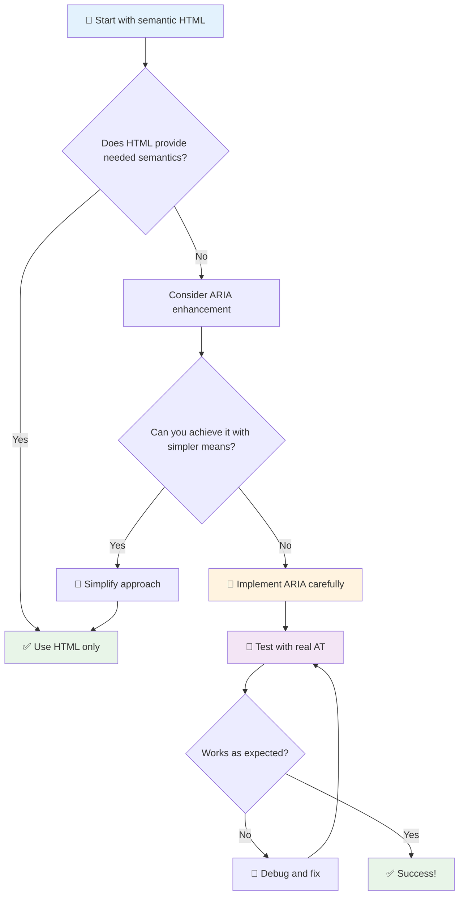

1. **ਸੈਮੈਂਟਿਕ HTML ਪਹਿਲਾਂ**: ਹਮੇਸ਼ਾ `<button>` ਨੂੰ `<div role="button">` ਤੋਂ ਵਧੇਰੇ ਤਰਜੀਹ ਦਿਓ
2. **ਸੈਮੈਂਟਿਕਸ ਨੂੰ ਖਰਾਬ ਨਾ ਕਰੋ**: ਮੌਜੂਦਾ HTML ਦੇ ਅਰਥ ਨੂੰ ਕਦੇ ਵੀ ਓਵਰਰਾਈਡ ਨਾ ਕਰੋ (ਜਿਵੇਂ `<h1 role="button">` ਤੋਂ ਬਚੋ)
3. **ਕੀਬੋਰਡ ਐਕਸੈਸਬਿਲਿਟੀ ਨੂੰ ਬਰਕਰਾਰ ਰੱਖੋ**: ਸਾਰੇ ਇੰਟਰਐਕਟਿਵ ARIA ਤੱਤ ਪੂਰੀ ਤਰ੍ਹਾਂ ਕੀਬੋਰਡ ਨਾਲ ਐਕਸੈਸਬਲ ਹੋਣੇ ਚਾਹੀਦੇ ਹਨ
4. **ਅਸਲੀ ਯੂਜ਼ਰਾਂ ਨਾਲ ਟੈਸਟ ਕਰੋ**: ARIA ਸਹਾਇਕ ਤਕਨਾਲੋਜੀਆਂ ਵਿੱਚ ਕਾਫ਼ੀ ਵੱਖ-ਵੱਖ ਤਰੀਕੇ ਨਾਲ ਸਹਾਇਕ ਹੁੰਦਾ ਹੈ
5. **ਸਧਾਰਨ ਸ਼ੁਰੂਆਤ ਕਰੋ**: ਜਟਿਲ ARIA ਲਾਗੂ ਕਰਨ ਵਿੱਚ ਗਲਤੀਆਂ ਹੋਣ ਦੀ ਸੰਭਾਵਨਾ ਵਧ ਜਾਂਦੀ ਹੈ

**🔍 ਟੈਸਟਿੰਗ ਵਰਕਫਲੋ:**

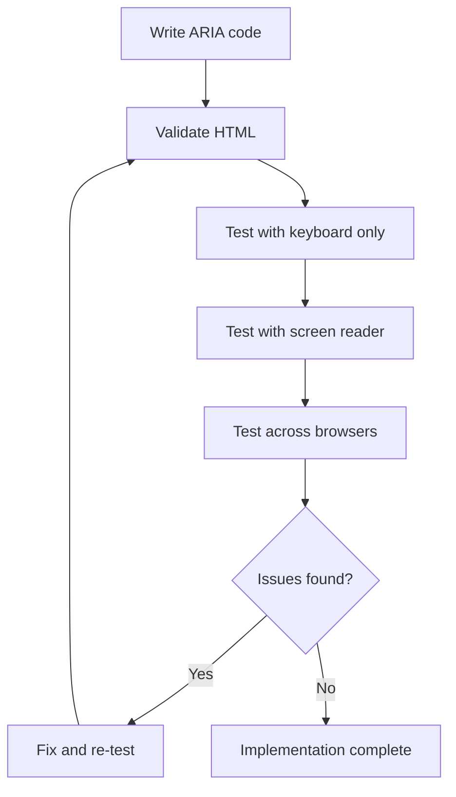

**🚫 ਆਮ ARIA ਗਲਤੀਆਂ ਜਿਨ੍ਹਾਂ ਤੋਂ ਬਚਣਾ ਚਾਹੀਦਾ ਹੈ:**

- **ਵਿਰੋਧੀ ਜਾਣਕਾਰੀ**: HTML ਸੈਮੈਂਟਿਕਸ ਦਾ ਵਿਰੋਧ ਨਾ ਕਰੋ
- **ਅਤਿ-ਲੇਬਲਿੰਗ**: ਬਹੁਤ ਜ਼ਿਆਦਾ ARIA ਜਾਣਕਾਰੀ ਯੂਜ਼ਰਾਂ ਨੂੰ ਭਰਮਾਉਂਦੀ ਹੈ
- **ਸਥਿਰ ARIA**: ਸਮੱਗਰੀ ਬਦਲਣ 'ਤੇ ARIA ਸਥਿਤੀਆਂ ਨੂੰ ਅਪਡੇਟ ਕਰਨਾ ਭੁੱਲ ਜਾਣਾ
- **ਅਣ-ਟੈਸਟ ਕੀਤੀਆਂ ਲਾਗੂਆਂ**: ARIA ਜੋ ਸਿਧਾਂਤ ਵਿੱਚ ਕੰਮ ਕਰਦਾ ਹੈ ਪਰ ਅਸਲ ਵਿੱਚ ਫੇਲ੍ਹ ਹੁੰਦਾ ਹੈ
- **ਕੀਬੋਰਡ ਸਹਾਇਤਾ ਦੀ ਘਾਟ**: ARIA ਰੋਲਸ ਬਿਨਾਂ ਸੰਬੰਧਿਤ ਕੀਬੋਰਡ ਇੰਟਰਐਕਸ਼ਨ ਦੇ

> 💡 **ਟੈਸਟਿੰਗ ਸਰੋਤ**: [accessibility-checker](https://www.npmjs.com/package/accessibility-checker) ਵਰਗੇ ਟੂਲਾਂ ਦੀ ਵਰਤੋਂ ਕਰੋ ARIA ਵੈਲੀਡੇਸ਼ਨ ਲਈ, ਪਰ ਪੂਰੇ ਅਨੁਭਵ ਲਈ ਹਮੇਸ਼ਾ ਅਸਲੀ ਸਕ੍ਰੀਨ ਰੀਡਰਾਂ ਨਾਲ ਟੈਸਟ ਕਰੋ।

### 🎭 **ARIA ਸਿੱਖਣ ਦੀ ਜਾਂਚ: ਕੀ ਤੁਸੀਂ ਜਟਿਲ ਇੰਟਰਐਕਸ਼ਨ ਲਈ ਤਿਆਰ ਹੋ?**

**ਆਪਣੀ ARIA ਯੋਗਤਾ ਨੂੰ ਮਾਪੋ:**
- ਤੁਸੀਂ ARIA ਨੂੰ ਸੈਮੈਂਟਿਕ HTML ਤੋਂ ਵੱਧ ਕਦੋਂ ਚੁਣੋਗੇ? (ਸੁਝਾਅ: ਲਗਭਗ ਕਦੇ ਨਹੀਂ!)
- ਤੁਸੀਂ ਸਮਝਾ ਸਕਦੇ ਹੋ ਕਿ `<div role="button">` ਆਮ ਤੌਰ 'ਤੇ `<button>` ਤੋਂ ਕਿਉਂ ਖਰਾਬ ਹੈ?
- ARIA ਟੈਸਟਿੰਗ ਬਾਰੇ ਸਭ ਤੋਂ ਮਹੱਤਵਪੂਰਨ ਗੱਲ ਕੀ ਹੈ?

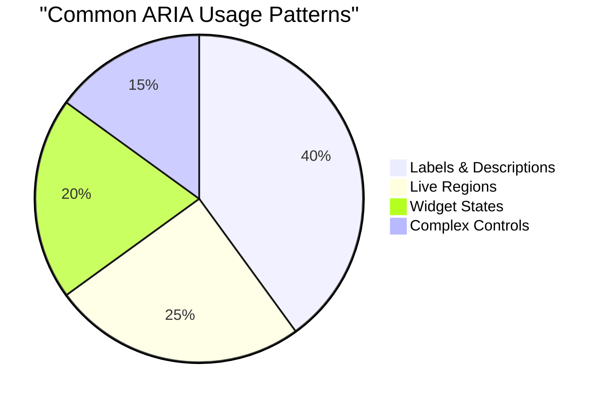

> **ਮੁੱਖ ਝਲਕ**: ਜ਼ਿਆਦਾਤਰ ARIA ਦੀ ਵਰਤੋਂ ਤੱਤਾਂ ਨੂੰ ਲੇਬਲ ਕਰਨ ਅਤੇ ਵਰਣਨ ਕਰਨ ਲਈ ਕੀਤੀ ਜਾਂਦੀ ਹੈ। ਜਟਿਲ ਵਿਜਟ ਪੈਟਰਨ ਤੁਹਾਡੇ ਸੋਚਣ ਤੋਂ ਕਾਫ਼ੀ ਘੱਟ ਆਮ ਹਨ!

✅ **ਮਾਹਿਰਾਂ ਤੋਂ ਸਿੱਖੋ**: [ARIA Authoring Practices Guide](https://w3c.github.io/aria-practices/) ਦਾ ਅਧਿਐਨ ਕਰੋ ਜਟਿਲ ਇੰਟਰਐਕਟਿਵ ਵਿਜਟਾਂ ਦੇ ਪੈਟਰਨ ਅਤੇ ਲਾਗੂਆਂ ਲਈ।

## ਚਿੱਤਰ ਅਤੇ ਮੀਡੀਆ ਨੂੰ ਐਕਸੈਸਬਲ ਬਣਾਉਣਾ

ਦ੍ਰਿਸ਼ਮਾਨ ਅਤੇ ਆਡੀਓ ਸਮੱਗਰੀ ਆਧੁਨਿਕ ਵੈੱਬ ਅਨੁਭਵਾਂ ਦਾ ਅਹਿਮ ਹਿੱਸਾ ਹਨ, ਪਰ ਜੇਕਰ ਸਾਵਧਾਨੀ ਨਾਲ ਲਾਗੂ ਨਾ ਕੀਤਾ ਜਾਵੇ ਤਾਂ ਇਹ ਰੁਕਾਵਟਾਂ ਪੈਦਾ ਕਰ ਸਕਦੇ ਹਨ। ਉਦੇਸ਼ ਇਹ ਯਕੀਨੀ ਬਣਾਉਣਾ ਹੈ ਕਿ ਤੁਹਾਡੀ ਮੀਡੀਆ ਦੀ ਜਾਣਕਾਰੀ ਅਤੇ ਭਾਵਨਾਤਮਕ ਪ੍ਰਭਾਵ ਹਰ ਯੂਜ਼ਰ ਤੱਕ ਪਹੁੰਚੇ। ਜਦੋਂ ਤੁਸੀਂ ਇਸ ਨੂੰ ਸਮਝ ਲੈਂਦੇ ਹੋ, ਇਹ ਆਸਾਨ ਬਣ ਜਾਂਦਾ ਹੈ।

ਵੱਖ-ਵੱਖ ਕਿਸਮ ਦੀ ਮੀਡੀਆ ਨੂੰ ਵੱਖ-ਵੱਖ ਐਕਸੈਸਬਿਲਿਟੀ ਪਹੁੰਚਾਂ ਦੀ ਲੋੜ ਹੁੰਦੀ ਹੈ। ਇਹ ਪਕਾਉਣ ਵਰਗਾ ਹੈ—ਤੁਸੀਂ ਨਰਮ ਮੱਛੀ ਨੂੰ ਹਾਰਡ ਸਟੀਕ ਦੇ ਤਰੀਕੇ ਨਾਲ ਨਹੀਂ ਪਕਾਉਂਦੇ। ਇਹ ਅੰਤਰ ਸਮਝਣ ਨਾਲ ਤੁਹਾਨੂੰ ਹਰ ਸਥਿਤੀ ਲਈ ਸਹੀ ਹੱਲ ਚੁਣਨ ਵਿੱਚ ਮਦਦ ਮਿਲਦੀ ਹੈ।

### ਰਣਨੀਤਿਕ ਚਿੱਤਰ ਐਕਸੈਸਬਿਲਿਟੀ

ਤੁਹਾਡੇ ਵੈੱਬਸਾਈਟ 'ਤੇ ਹਰ ਚਿੱਤਰ ਦਾ ਇੱਕ ਉਦੇਸ਼ ਹੁੰਦਾ ਹੈ। ਉਸ ਉਦੇਸ਼ ਨੂੰ ਸਮਝਣ ਨਾਲ ਤੁਹਾਨੂੰ ਬਿਹਤਰ ਵਿਕਲਪਿਕ ਟੈਕਸਟ ਲਿਖਣ ਅਤੇ ਵਧੇਰੇ ਸਮਾਵੇਸ਼ੀ ਅਨੁਭਵ ਬਣਾਉਣ ਵਿੱਚ ਮਦਦ ਮਿਲਦੀ ਹੈ।

**ਚਿੱਤਰਾਂ ਦੀਆਂ ਚਾਰ ਕਿਸਮਾਂ ਅਤੇ ਉਨ੍ਹਾਂ ਦੇ alt ਟੈਕਸਟ ਰਣਨੀਤੀਆਂ:**

**ਜਾਣਕਾਰੀ ਚਿੱਤਰ** - ਮਹੱਤਵਪੂਰਨ ਜਾਣਕਾਰੀ ਪ੍ਰਦਾਨ ਕਰਦੇ ਹਨ:
```html

```

**ਸਜਾਵਟੀ ਚਿੱਤਰ** - ਸਿਰਫ਼ ਦ੍ਰਿਸ਼ਮਾਨ, ਕੋਈ ਜਾਣਕਾਰੀਮੂਲਕ ਮੁੱਲ ਨਹੀਂ:
```html

```

**ਫੰਕਸ਼ਨਲ ਚਿੱਤਰ** - ਬਟਨ ਜਾਂ ਕੰਟਰੋਲ ਵਜੋਂ ਕੰਮ ਕਰਦੇ ਹਨ:
```html
<button>
  
</button>
```

**ਜਟਿਲ ਚਿੱਤਰ** - ਚਾਰਟ, ਡਾਇਗ੍ਰਾਮ, ਇਨਫੋਗ੍ਰਾਫਿਕਸ:
```html

<div id="chart-description">
  <p>Detailed description: Sales data shows a steady increase across all quarters...</p>
</div>
```

### ਵੀਡੀਓ ਅਤੇ ਆਡੀਓ ਐਕਸੈਸਬਿਲਿਟੀ

**ਵੀਡੀਓ ਦੀਆਂ ਲੋੜਾਂ:**
- **ਕੈਪਸ਼ਨ**: ਬੋਲਣ ਵਾਲੀ ਸਮੱਗਰੀ ਅਤੇ ਸਾਊਂਡ ਇਫੈਕਟਸ ਦਾ ਟੈਕਸਟ ਵਰਜਨ
- **ਆਡੀਓ ਵਰਣਨ**: ਅੰਨ੍ਹੇ ਯੂਜ਼ਰਾਂ ਲਈ ਦ੍ਰਿਸ਼ਮਾਨ ਤੱਤਾਂ ਦੀ ਕਹਾਣੀ
- **ਟ੍ਰਾਂਸਕ੍ਰਿਪਟਸ**: ਸਾਰੀ ਆਡੀਓ ਅਤੇ ਦ੍ਰਿਸ਼ਮਾਨ ਸਮੱਗਰੀ ਦਾ ਪੂਰਾ ਟੈਕਸਟ ਵਰਜਨ

```html
<video controls>
  <source src="video.mp4" type="video/mp4">
  <track kind="captions" src="captions.vtt" srclang="en" label="English">
  <track kind="descriptions" src="descriptions.vtt" srclang="en" label="Audio descriptions">
</video>
```

**ਆਡੀਓ ਦੀਆਂ ਲੋੜਾਂ:**
- **ਟ੍ਰਾਂਸਕ੍ਰਿਪਟਸ**: ਸਾਰੀ ਬੋਲਣ ਵਾਲੀ ਸਮੱਗਰੀ ਦਾ ਟੈਕਸਟ ਵਰਜਨ
- **ਦ੍ਰਿਸ਼ਮਾਨ ਸੰਕੇਤ**: ਸਿਰਫ਼ ਆਡੀਓ ਸਮੱਗਰੀ ਲਈ, ਦ੍ਰਿਸ਼ਮਾਨ ਸੰਕੇਤ ਪ੍ਰਦਾਨ ਕਰੋ

### ਆਧੁਨਿਕ ਚਿੱਤਰ ਤਕਨੀਕਾਂ

**ਸਜਾਵਟੀ ਚਿੱਤਰਾਂ ਲਈ CSS ਦੀ ਵਰਤੋਂ:**
```css
.hero-section {
  background-image: url('decorative-hero.jpg');
  /* Decorative images in CSS don't need alt text */
}
```

**ਐਕਸੈਸਬਿਲਿਟੀ ਨਾਲ ਰਿਸਪਾਂਸਿਵ ਚਿੱਤਰ:**
```html
<picture>
  <source media="(min-width: 800px)" srcset="large-chart.png">
  <source media="(min-width: 400px)" srcset="medium-chart.png">
  
</picture>
```

✅ **ਚਿੱਤਰ ਐਕਸੈਸਬਿਲਿਟੀ ਟੈਸਟ ਕਰੋ**: ਸਕ੍ਰੀਨ ਰੀਡਰ ਦੀ ਵਰਤੋਂ ਕਰਕੇ ਚਿੱਤਰਾਂ ਵਾਲੇ ਪੇਜ ਨੂੰ ਨੈਵੀਗੇਟ ਕਰੋ। ਕੀ ਤੁਹਾਨੂੰ ਸਮੱਗਰੀ ਨੂੰ ਸਮਝਣ ਲਈ ਕਾਫ਼ੀ ਜਾਣਕਾਰੀ ਮਿਲ ਰਹੀ ਹੈ?

## ਕੀਬੋਰਡ ਨੈਵੀਗੇਸ਼ਨ ਅਤੇ ਫੋਕਸ ਮੈਨੇਜਮੈਂਟ

ਕਈ ਯੂਜ਼ਰ ਸਿਰਫ਼ ਆਪਣੇ ਕੀਬੋਰਡ ਨਾਲ ਵੈੱਬ ਨੂੰ ਨੈਵੀਗੇਟ ਕਰਦੇ ਹਨ। ਇਸ ਵਿੱਚ ਮੋਟਰ ਅਪੰਗਤਾ ਵਾਲੇ ਲੋਕ, ਪਾਵਰ ਯੂਜ਼ਰ ਜੋ ਕੀਬੋਰਡ ਨੂੰ ਮਾਊਸ ਨਾਲੋਂ ਤੇਜ਼ ਸਮਝਦੇ ਹਨ, ਅਤੇ ਕੋਈ ਵੀ ਜਿਸਦਾ ਮਾਊਸ ਕੰਮ ਕਰਨਾ ਬੰਦ ਕਰ ਚੁੱਕਾ ਹੈ। ਇਹ ਯਕੀਨੀ ਬਣਾਉਣਾ ਕਿ ਤੁਹਾਡੀ ਸਾਈਟ ਕੀਬੋਰਡ ਇਨਪੁਟ ਨਾਲ ਚੰਗੀ ਤਰ੍ਹਾਂ ਕੰਮ ਕਰਦੀ ਹੈ, ਜ਼ਰੂਰੀ ਹੈ ਅਤੇ ਅਕਸਰ ਹਰ ਕਿਸੇ ਲਈ ਤੁਹਾਡੀ ਸਾਈਟ ਨੂੰ ਵਧੇਰੇ ਪ੍ਰਭਾਵਸ਼ਾਲੀ ਬਣਾਉਂਦੀ ਹੈ।

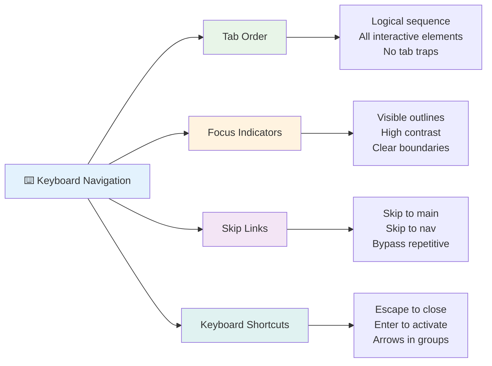

### ਜ਼ਰੂਰੀ ਕੀਬੋਰਡ ਨੈਵੀਗੇਸ਼ਨ ਪੈਟਰਨ

**ਮਿਆਰੀ ਕੀਬੋਰਡ ਇੰਟਰਐਕਸ਼ਨ:**
- **Tab**: ਇੰਟਰਐਕਟਿਵ ਤੱਤਾਂ ਦੇ ਰਾਹੀਂ ਫੋਕਸ ਅੱਗੇ ਵਧਾਓ
- **Shift + Tab**: ਫੋਕਸ ਪਿੱਛੇ ਵਧਾਓ
- **Enter**: ਬਟਨ ਅਤੇ ਲਿੰਕ ਐਕਟੀਵੇਟ ਕਰੋ
- **Space**: ਬਟਨ ਐਕਟੀਵੇਟ ਕਰੋ, ਚੈਕਬਾਕਸ ਚੈੱਕ ਕਰੋ
- **Arrow keys**: ਕੰਪੋਨੈਂਟ ਗਰੁੱਪਾਂ ਵਿੱਚ ਨੈਵੀਗੇਟ ਕਰੋ (ਰੇਡੀਓ ਬਟਨ, ਮੀਨੂ)
- **Escape**: ਮੋਡਲ, ਡ੍ਰਾਪਡਾਊਨ ਬੰਦ ਕਰੋ ਜਾਂ ਓਪਰੇਸ਼ਨ ਰੱਦ ਕਰੋ

### ਫੋਕਸ ਮੈਨੇਜਮੈਂਟ ਦੇ ਸ੍ਰੇਸ਼ਠ ਤਰੀਕੇ

**ਦ੍ਰਿਸ਼ਮਾਨ ਫੋਕਸ ਇੰਡਿਕੇਟਰ:**
```css
/* Ensure focus is always visible */
button:focus-visible {
  outline: 2px solid #4A90A4;
  outline-offset: 2px;
}

/* Custom focus styles for different components */
.card:focus-within {
  box-shadow: 0 0 0 3px rgba(74, 144, 164, 0.5);
}
```

**ਸੁਚਾਰੂ ਨੈਵੀਗੇਸ਼ਨ ਲਈ ਸਕਿਪ ਲਿੰਕਸ:**
```html
<a href="#main-content" class="skip-link">Skip to main content</a>
<a href="#navigation" class="skip-link">Skip to navigation</a>

<nav id="navigation">
  <!-- navigation content -->
</nav>
<main id="main-content">
  <!-- main content -->
</main>
```

**ਸਹੀ ਟੈਬ ਆਰਡਰ:**
```html
<!-- Use semantic HTML for natural tab order -->
<form>
  <label for="name">Name:</label>
  <input type="text" id="name" tabindex="0">
  
  <label for="email">Email:</label>
  <input type="email" id="email" tabindex="0">
  
  <button type="submit" tabindex="0">Submit</button>
</form>
```

### ਮੋਡਲ ਵਿੱਚ ਫੋਕਸ ਟ੍ਰੈਪਿੰਗ

ਜਦੋਂ ਮੋਡਲ ਡਾਇਲਾਗ ਖੁਲ੍ਹਦੇ ਹਨ, ਫੋਕਸ ਮੋਡਲ ਵਿੱਚ ਹੀ ਟ੍ਰੈਪ ਹੋਣਾ ਚਾਹੀਦਾ ਹੈ:

```javascript
// Modern focus trap implementation
function trapFocus(element) {
  const focusableElements = element.querySelectorAll(
    'button, [href], input, select, textarea, [tabindex]:not([tabindex="-1"])'
  );
  
  const firstElement = focusableElements[0];
  const lastElement = focusableElements[focusableElements.length - 1];

  element.addEventListener('keydown', (e) => {
    if (e.key === 'Tab') {
      if (e.shiftKey && document.activeElement === firstElement) {
        e.preventDefault();
        lastElement.focus();
      } else if (!e.shiftKey && document.activeElement === lastElement) {
        e.preventDefault();
        firstElement.focus();
      }
    }
    
    if (e.key === 'Escape') {
      closeModal();
    }
  });
  
  // Focus first element when modal opens
  firstElement.focus();
}
```

✅ **ਕੀਬੋਰਡ ਨੈਵੀਗੇਸ਼ਨ ਟੈਸਟ ਕਰੋ**: ਸਿਰਫ਼ Tab ਕੀ ਦੀ ਵਰਤੋਂ ਕਰਕੇ ਆਪਣੀ ਵੈੱਬਸਾਈਟ ਨੂੰ ਨੈਵੀਗੇਟ ਕਰਨ ਦੀ ਕੋਸ਼ਿਸ਼ ਕਰੋ। ਕੀ ਤੁਸੀਂ ਸਾਰੇ ਇੰਟਰਐਕਟਿਵ ਤੱਤਾਂ ਤੱਕ ਪਹੁੰਚ ਸਕਦੇ ਹੋ? ਕੀ ਫੋਕਸ ਆਰਡਰ ਤਰਕਸੰਗਤ ਹੈ? ਕੀ ਫੋਕਸ ਇੰਡਿਕੇਟਰ ਸਪਸ਼ਟ ਤੌਰ 'ਤੇ ਦਿਖਾਈ ਦੇ ਰਹੇ ਹਨ?

## ਫਾਰਮ ਐਕਸੈਸਬਿਲਿਟੀ

ਫਾਰਮ ਯੂਜ਼ਰ ਇੰਟਰਐਕਸ਼ਨ ਲਈ ਮਹੱਤਵਪੂਰਨ ਹਨ ਅਤੇ ਐਕਸੈਸਬਿਲਿਟੀ ਲਈ ਵਿਸ਼ੇਸ਼ ਧਿਆਨ ਦੀ ਲੋੜ ਹੈ।

### ਲੇਬਲ ਅਤੇ ਫਾਰਮ ਕੰਟਰੋਲ ਸੰਬੰਧ

**ਹਰ ਫਾਰਮ ਕੰਟਰੋਲ ਨੂੰ ਇੱਕ ਲੇਬਲ ਦੀ ਲੋੜ ਹੈ:**
```html
<!-- Explicit labeling (preferred) -->
<label for="username">Username:</label>
<input type="text" id="username" name="username" required>

<!-- Implicit labeling -->
<label>
  Password:
  <input type="password" name="password" required>
</label>

<!-- Using aria-label when visual label isn't desired -->
<input type="search" aria-label="Search products" placeholder="Search...">
```

### ਗਲਤੀ ਸੰਭਾਲ ਅਤੇ ਵੈਲੀਡੇਸ਼ਨ

**ਐਕਸੈਸਬਲ ਗਲਤੀ ਸੁਨੇਹੇ:**
```html
<label for="email">Email Address:</label>
<input type="email" id="email" name="email" 
       aria-describedby="email-error" 
       aria-invalid="true" required>
<div id="email-error" role="alert">
  Please enter a valid email address
</div>
```

**ਫਾਰਮ ਵੈਲੀਡੇਸ਼ਨ ਦੇ ਸ੍ਰੇਸ਼ਠ ਤਰੀਕੇ:**
- ਗਲਤ ਫੀਲਡਾਂ ਨੂੰ ਦਰਸਾਉਣ ਲਈ `aria-invalid` ਦੀ ਵਰਤੋਂ ਕਰੋ
- ਸਪਸ਼ਟ, ਵਿਸ਼ੇਸ਼ ਗਲਤੀ ਸੁਨੇਹੇ ਪ੍ਰਦਾਨ ਕਰੋ
- ਮਹੱਤਵਪੂਰਨ ਗਲਤੀ ਐਲਾਨਾਂ ਲਈ `role="alert"` ਦੀ ਵਰਤੋਂ ਕਰੋ
- ਗਲਤੀਆਂ ਤੁਰੰਤ ਅਤੇ ਫਾਰਮ ਸਬਮਿਸ਼ਨ 'ਤੇ ਦਿਖਾਓ

### ਫੀਲਡਸੈਟਸ ਅਤੇ ਗਰੁੱਪਿੰਗ

**ਸੰਬੰਧਿਤ ਫਾਰਮ ਕੰਟਰੋਲ ਨੂੰ ਗਰੁੱਪ ਕਰੋ:**
```html
<fieldset>
  <legend>Shipping Address</legend>
  <label for="street">Street Address:</label>
  <input type="text" id="street" name="street">
  
  <label for="city">City:</label>
  <input type="text" id="city" name="city">
</fieldset>

<fieldset>
  <legend>Preferred Contact Method</legend>
  <input type="radio" id="contact-email" name="contact" value="email">
  <label for="contact-email">Email</label>
  
  <input type="radio" id="contact-phone" name="contact" value="phone">
  <label for="contact-phone">Phone</label>
</fieldset>
```

## ਤੁਹਾਡਾ ਐਕਸੈਸਬਿਲਿਟੀ ਯਾਤਰਾ: ਮੁੱਖ ਸਿੱਖਿਆ

ਵਧਾਈਆਂ! ਤੁਸੀਂ ਸੱਚਮੁੱਚ ਸਮਾਵੇਸ਼ੀ ਵੈੱਬ ਅਨੁਭਵ ਬਣਾਉਣ ਲਈ ਮੂਲ ਜ਼ਰੂਰੀ ਗਿਆਨ ਪ੍ਰਾਪਤ ਕਰ ਲਿਆ ਹੈ। ਇਹ ਕਾਫ਼ੀ ਰੋਮਾਂਚਕ ਚੀਜ਼ ਹੈ! ਵੈੱਬ ਐਕਸੈਸਬਿਲਿਟੀ ਸਿਰਫ਼ ਅਨੁਕੂਲਤਾ ਬਾਕਸਾਂ ਨੂੰ ਚੈੱਕ ਕਰਨ ਬਾਰੇ ਨਹੀਂ ਹੈ—ਇਹ ਵੱਖ-ਵੱਖ ਤਰੀਕਿਆਂ ਨੂੰ ਪਛਾਣਨ ਬਾਰੇ ਹੈ ਜਿਨ੍ਹਾਂ ਨਾਲ ਲੋਕ ਡਿਜ਼ੀਟਲ ਸਮੱਗਰੀ ਨਾਲ ਇੰਟਰਐਕਟ ਕਰਦੇ ਹਨ ਅਤੇ ਉਸ ਸ਼ਾਨਦਾਰ ਜਟਿਲਤਾ ਲਈ ਡਿਜ਼ਾਈਨ ਕਰਨ ਬਾਰੇ ਹੈ।

ਤੁਸੀਂ ਹੁਣ ਵਿਕਾਸਕਾਰਾਂ ਦੀ ਇੱਕ ਵਧ ਰਹੀ ਕਮਿਊਨਿਟੀ ਦਾ ਹਿੱਸਾ ਹੋ ਜੋ ਸਮਝਦੇ ਹਨ ਕਿ ਵਧੀਆ ਡਿਜ਼ਾਈਨ ਹਰ ਕਿਸੇ ਲਈ ਕੰਮ ਕਰਦਾ ਹੈ। ਕਲੱਬ ਵਿੱਚ ਤੁਹਾਡਾ ਸਵਾਗਤ ਹੈ!

**🎯 ਤੁਹਾਡਾ ਐਕਸੈਸਬਿਲਿਟੀ ਟੂਲਕਿਟ ਹੁਣ ਸ਼ਾਮਲ ਕਰਦਾ ਹੈ:**

| ਮੁੱਖ ਸਿਧਾਂਤ | ਲਾਗੂ | ਪ੍ਰਭਾਵ |
|----------------|----------------|---------|
| **ਸੈਮੈਂਟਿਕ HTML ਫਾਊਂਡੇਸ਼ਨ** | HTML ਤੱਤਾਂ ਨੂੰ ਉਨ੍ਹਾਂ ਦੇ ਉਦੇਸ਼ ਲਈ ਸਹੀ ਤਰੀਕੇ ਨਾਲ ਵਰਤੋ | ਸਕ੍ਰੀਨ ਰੀਡਰਜ਼ ਕੁਸ਼ਲਤਾਪੂਰਵਕ ਨੈਵੀਗੇਟ ਕਰ ਸਕਦੇ ਹਨ, ਕੀਬੋਰਡ ਸਵੈਚਾਲਕ ਤੌਰ 'ਤੇ ਕੰਮ ਕਰਦੇ ਹਨ |
| **ਸਮਾਵੇਸ਼ੀ ਦ੍ਰਿਸ਼ਮਾਨ ਡਿਜ਼ਾਈਨ** | ਯਥਾਥ ਸੰਤੁਲਨ, ਅਰਥਪੂਰਨ ਰੰਗ ਦੀ ਵਰਤੋਂ, ਦ੍ਰਿਸ਼ਮਾਨ ਫੋਕਸ ਇੰਡਿਕੇਟਰ | ਕਿਸੇ ਵੀ ਰੌਸ਼ਨੀ ਦੀ ਸਥਿਤੀ ਵਿੱਚ ਹਰ ਕਿਸੇ ਲਈ ਸਪਸ਼ਟ |
| **ਵਰਣਨਾਤਮਕ ਸਮੱਗਰੀ** | ਅਰਥਪੂਰਨ ਲਿੰਕ ਟੈਕਸਟ, alt ਟੈਕਸਟ, ਹੈਡਿੰਗ | ਯੂਜ਼ਰ ਦ੍ਰਿਸ਼ਮਾਨ ਸੰਦਰਭ ਤੋਂ ਬਿਨਾਂ ਸਮੱਗਰੀ ਨੂੰ ਸਮਝਦੇ ਹਨ |
| **ਕੀਬੋਰਡ ਐਕਸੈਸਬਿਲਿਟੀ** | ਟੈਬ ਆਰਡਰ, ਕੀਬੋਰਡ ਸ਼ਾਰਟਕੱਟ, ਫੋਕਸ ਮੈਨੇਜਮੈਂਟ | ਮੋਟਰ ਐਕਸੈਸਬਿਲਿਟੀ ਅਤੇ ਪਾਵਰ ਯੂਜ਼ਰ ਕੁਸ਼ਲਤਾ |
| **ARIA ਸੁਧਾਰ** | ਸੈਮੈਂਟਿਕ ਖਾਮੀਆਂ ਨੂੰ ਪੂਰਾ ਕਰਨ ਲਈ ਰਣਨੀਤਿਕ ਵਰਤੋਂ | ਜਟਿਲ ਐਪਲੀਕੇਸ਼ਨ ਸਹਾਇਕ ਤਕਨਾਲੋਜੀਆਂ ਨਾਲ ਕੰਮ ਕਰਦੇ ਹਨ |
| **ਵਿਆਪਕ ਟੈਸਟਿੰਗ** | ਆਟੋਮੈਟਿਕ ਟੂਲ + ਮੈਨੂਅਲ ਵੈਰੀਫਿਕੇਸ਼ਨ + ਅਸਲੀ ਯੂਜ਼ਰ ਟੈਸਟਿੰਗ | ਸਮੱਸਿਆਵਾਂ ਨੂੰ ਯੂਜ਼ਰਾਂ 'ਤੇ ਪ੍ਰਭਾਵ ਪੈਣ ਤੋਂ ਪਹਿਲਾਂ ਪਕੜੋ |

**🚀 ਤੁਹਾਡੇ ਅਗਲੇ ਕਦਮ:**

1. **ਆਪਣੇ ਵਰਕਫਲੋ ਵਿੱਚ ਐਕਸੈਸਬਿਲਿਟੀ ਬਣਾਓ**: ਟੈਸਟਿੰਗ ਨੂੰ ਆਪਣੇ ਵਿਕਾਸ ਪ੍ਰਕਿਰਿਆ ਦਾ ਕੁਦਰਤੀ ਹਿੱ
- [ ] 5 ਵੱਖ-ਵੱਖ ਜਟਿਲ ਵੈਬਸਾਈਟਾਂ 'ਤੇ ਕੀਬੋਰਡ ਨੈਵੀਗੇਸ਼ਨ ਦੀ ਪ੍ਰੈਕਟਿਸ ਕਰੋ  
- [ ] ਸਹੀ ਲੇਬਲ, ਗਲਤੀ ਸੰਭਾਲ ਅਤੇ ARIA ਦੇ ਨਾਲ ਇੱਕ ਸਧਾਰਨ ਫਾਰਮ ਬਣਾਓ  
- [ ] ਇੱਕ ਐਕਸੇਸਿਬਿਲਿਟੀ ਕਮਿਊਨਿਟੀ ਵਿੱਚ ਸ਼ਾਮਲ ਹੋਵੋ (A11y Slack, WebAIM ਫੋਰਮ)  
- [ ] ਅਸਲ ਵਿਅਕਤੀ ਜਿਨ੍ਹਾਂ ਨੂੰ ਅਪਾਹਜਤਾ ਹੈ, ਉਹ ਵੈਬਸਾਈਟਾਂ 'ਤੇ ਨੈਵੀਗੇਟ ਕਰਦੇ ਹਨ, ਉਹਨਾਂ ਨੂੰ ਦੇਖੋ (YouTube 'ਤੇ ਵਧੀਆ ਉਦਾਹਰਨ ਹਨ)  

### 🌟 **ਤੁਹਾਡਾ ਮਹੀਨੇ-ਲੰਬਾ ਬਦਲਾਅ**  
- [ ] ਆਪਣੇ ਡਿਵੈਲਪਮੈਂਟ ਵਰਕਫਲੋ ਵਿੱਚ ਐਕਸੇਸਿਬਿਲਿਟੀ ਟੈਸਟਿੰਗ ਨੂੰ ਸ਼ਾਮਲ ਕਰੋ  
- [ ] ਇੱਕ ਓਪਨ ਸੋਰਸ ਪ੍ਰੋਜੈਕਟ ਵਿੱਚ ਯੋਗਦਾਨ ਪਾਓ, ਐਕਸੇਸਿਬਿਲਿਟੀ ਸਮੱਸਿਆਵਾਂ ਨੂੰ ਠੀਕ ਕਰਕੇ  
- [ ] ਕਿਸੇ ਅਜਿਹੇ ਵਿਅਕਤੀ ਨਾਲ ਯੂਜ਼ਬਿਲਿਟੀ ਟੈਸਟਿੰਗ ਕਰੋ ਜੋ ਸਹਾਇਕ ਤਕਨਾਲੋਜੀ ਵਰਤਦਾ ਹੈ  
- [ ] ਆਪਣੀ ਟੀਮ ਲਈ ਇੱਕ ਐਕਸੇਸਿਬਲ ਕੰਪੋਨੈਂਟ ਲਾਇਬ੍ਰੇਰੀ ਬਣਾਓ  
- [ ] ਆਪਣੇ ਕੰਮ ਕਰਨ ਦੇ ਸਥਾਨ ਜਾਂ ਕਮਿਊਨਿਟੀ ਵਿੱਚ ਐਕਸੇਸਿਬਿਲਿਟੀ ਲਈ ਵਕਾਲਤ ਕਰੋ  
- [ ] ਕਿਸੇ ਨਵੇਂ ਵਿਅਕਤੀ ਨੂੰ ਐਕਸੇਸਿਬਿਲਿਟੀ ਸੰਕਲਪਾਂ ਬਾਰੇ ਸਿੱਖਾਉਣ ਵਿੱਚ ਮਦਦ ਕਰੋ  

### 🏆 **ਅੰਤਮ ਐਕਸੇਸਿਬਿਲਿਟੀ ਚੈਂਪੀਅਨ ਚੈੱਕ-ਇਨ**  

**ਆਪਣੇ ਐਕਸੇਸਿਬਿਲਿਟੀ ਯਾਤਰਾ ਦਾ ਜਸ਼ਨ ਮਨਾਓ:**  
- ਵੈਬ ਨੂੰ ਵਰਤਣ ਦੇ ਤਰੀਕੇ ਬਾਰੇ ਸਭ ਤੋਂ ਹੈਰਾਨੀਜਨਕ ਚੀਜ਼ ਕੀ ਸੀ ਜੋ ਤੁਸੀਂ ਸਿੱਖੀ?  
- ਕਿਹੜਾ ਐਕਸੇਸਿਬਿਲਿਟੀ ਸਿਧਾਂਤ ਤੁਹਾਡੇ ਡਿਵੈਲਪਮੈਂਟ ਸਟਾਈਲ ਨਾਲ ਸਭ ਤੋਂ ਵੱਧ ਮਿਲਦਾ ਹੈ?  
- ਐਕਸੇਸਿਬਿਲਿਟੀ ਬਾਰੇ ਸਿੱਖਣ ਨਾਲ ਡਿਜ਼ਾਈਨ 'ਤੇ ਤੁਹਾਡਾ ਨਜ਼ਰੀਆ ਕਿਵੇਂ ਬਦਲਿਆ ਹੈ?  
- ਅਸਲ ਪ੍ਰੋਜੈਕਟ 'ਤੇ ਕਰਨ ਲਈ ਪਹਿਲਾ ਐਕਸੇਸਿਬਿਲਿਟੀ ਸੁਧਾਰ ਕੀ ਹੈ ਜੋ ਤੁਸੀਂ ਕਰਨਾ ਚਾਹੁੰਦੇ ਹੋ?  

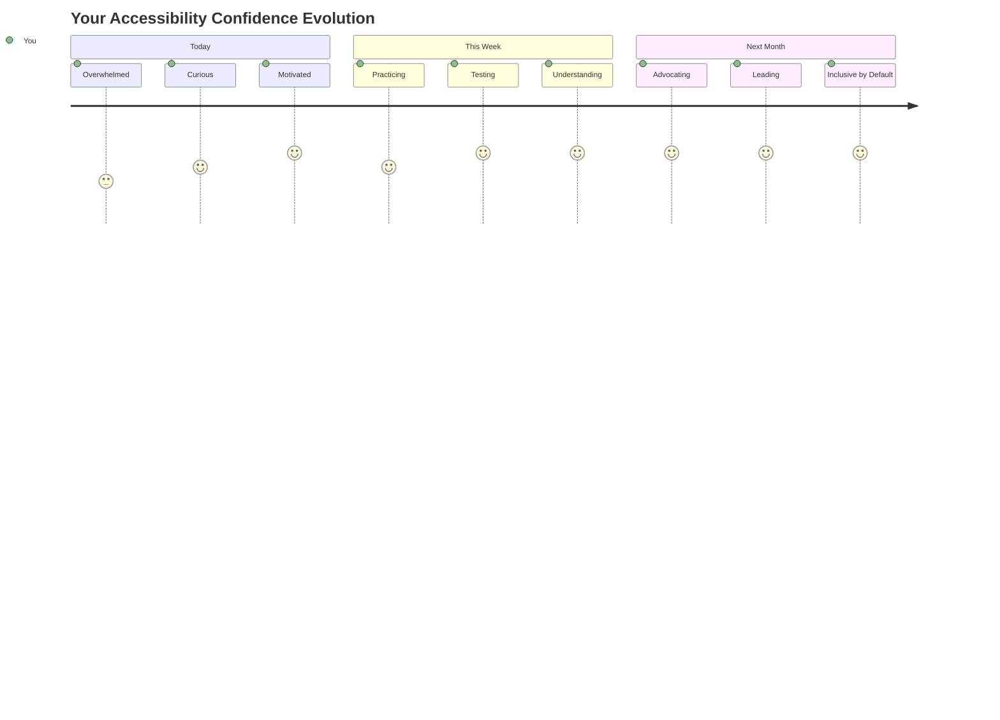
  
> 🌍 **ਤੁਸੀਂ ਹੁਣ ਐਕਸੇਸਿਬਿਲਿਟੀ ਚੈਂਪੀਅਨ ਹੋ!** ਤੁਸੀਂ ਸਮਝਦੇ ਹੋ ਕਿ ਵਧੀਆ ਵੈਬ ਅਨੁਭਵ ਹਰ ਕਿਸੇ ਲਈ ਕੰਮ ਕਰਦੇ ਹਨ, ਚਾਹੇ ਉਹ ਵੈਬ ਨੂੰ ਕਿਵੇਂ ਵੀ ਐਕਸੈਸ ਕਰਦੇ ਹੋਣ। ਹਰ ਐਕਸੇਸਿਬਲ ਫੀਚਰ ਜੋ ਤੁਸੀਂ ਬਣਾਉਂਦੇ ਹੋ, ਇੰਟਰਨੈਟ ਨੂੰ ਹੋਰ ਸਮਾਵੇਸ਼ੀ ਬਣਾਉਂਦਾ ਹੈ। ਵੈਬ ਨੂੰ ਤੁਹਾਡੇ ਵਰਗੇ ਡਿਵੈਲਪਰਾਂ ਦੀ ਲੋੜ ਹੈ ਜੋ ਐਕਸੇਸਿਬਿਲਿਟੀ ਨੂੰ ਰੁਕਾਵਟ ਨਹੀਂ, ਬਲਕਿ ਸਾਰੇ ਯੂਜ਼ਰਾਂ ਲਈ ਵਧੀਆ ਅਨੁਭਵ ਬਣਾਉਣ ਦਾ ਮੌਕਾ ਸਮਝਦੇ ਹਨ। ਇਸ ਮੂਵਮੈਂਟ ਵਿੱਚ ਤੁਹਾਡਾ ਸਵਾਗਤ ਹੈ! 🎉  

---

**ਅਸਵੀਕਰਤਾ**:  
ਇਹ ਦਸਤਾਵੇਜ਼ AI ਅਨੁਵਾਦ ਸੇਵਾ [Co-op Translator](https://github.com/Azure/co-op-translator) ਦੀ ਵਰਤੋਂ ਕਰਕੇ ਅਨੁਵਾਦ ਕੀਤਾ ਗਿਆ ਹੈ। ਜਦੋਂ ਕਿ ਅਸੀਂ ਸਹੀ ਹੋਣ ਦੀ ਕੋਸ਼ਿਸ਼ ਕਰਦੇ ਹਾਂ, ਕਿਰਪਾ ਕਰਕੇ ਧਿਆਨ ਦਿਓ ਕਿ ਸਵੈਚਾਲਿਤ ਅਨੁਵਾਦਾਂ ਵਿੱਚ ਗਲਤੀਆਂ ਜਾਂ ਅਸੁਚੀਤਤਾਵਾਂ ਹੋ ਸਕਦੀਆਂ ਹਨ। ਇਸ ਦੀ ਮੂਲ ਭਾਸ਼ਾ ਵਿੱਚ ਮੂਲ ਦਸਤਾਵੇਜ਼ ਨੂੰ ਅਧਿਕਾਰਤ ਸਰੋਤ ਮੰਨਿਆ ਜਾਣਾ ਚਾਹੀਦਾ ਹੈ। ਮਹੱਤਵਪੂਰਨ ਜਾਣਕਾਰੀ ਲਈ, ਪੇਸ਼ੇਵਰ ਮਨੁੱਖੀ ਅਨੁਵਾਦ ਦੀ ਸਿਫਾਰਸ਼ ਕੀਤੀ ਜਾਂਦੀ ਹੈ। ਇਸ ਅਨੁਵਾਦ ਦੀ ਵਰਤੋਂ ਤੋਂ ਪੈਦਾ ਹੋਣ ਵਾਲੇ ਕਿਸੇ ਵੀ ਗਲਤਫਹਿਮੀ ਜਾਂ ਗਲਤ ਵਿਆਖਿਆ ਲਈ ਅਸੀਂ ਜ਼ਿੰਮੇਵਾਰ ਨਹੀਂ ਹਾਂ।