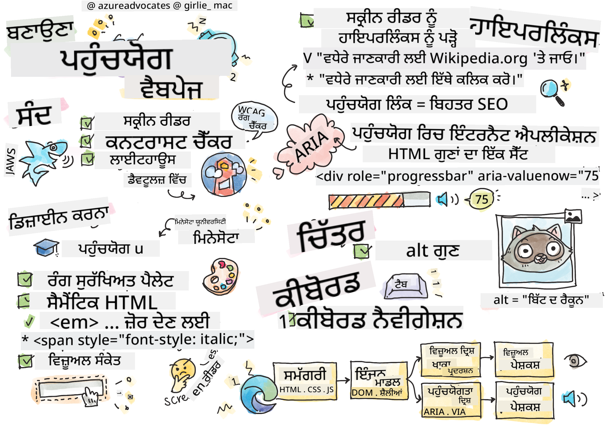
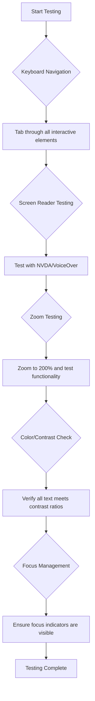

<!--
CO_OP_TRANSLATOR_METADATA:
{
  "original_hash": "300c1562e01f21065ae0b8e9d9181a86",
  "translation_date": "2025-10-20T21:54:16+00:00",
  "source_file": "1-getting-started-lessons/3-accessibility/README.md",
  "language_code": "pa"
}
-->
# ਐਕਸੇਸਿਬਲ ਵੈਬਪੇਜ ਬਣਾਉਣਾ


> ਸਕੈਚਨੋਟ [Tomomi Imura](https://twitter.com/girlie_mac) ਦੁਆਰਾ

## ਲੈਕਚਰ ਤੋਂ ਪਹਿਲਾਂ ਕਵਿਜ਼
[ਲੈਕਚਰ ਤੋਂ ਪਹਿਲਾਂ ਕਵਿਜ਼](https://ff-quizzes.netlify.app/web/)

> ਵੈਬ ਦੀ ਤਾਕਤ ਇਸ ਦੀ ਵਿਸ਼ਵਵਿਆਪਕਤਾ ਵਿੱਚ ਹੈ। ਅਪੰਗਤਾ ਤੋਂ ਬਿਨਾਂ ਹਰ ਕਿਸੇ ਲਈ ਪਹੁੰਚ ਇੱਕ ਅਹਿਮ ਪਹਲੂ ਹੈ।
>
> \- ਸਰ ਟਿਮੋਥੀ ਬਰਨਰਜ਼-ਲੀ, W3C ਡਾਇਰੈਕਟਰ ਅਤੇ ਵਰਲਡ ਵਾਈਡ ਵੈਬ ਦੇ ਆਵਿਸ਼ਕਾਰਕ

ਵੈਬ ਐਕਸੇਸਿਬਲਟੀ ਸਿਰਫ਼ ਇੱਕ ਚੰਗੀ ਚੀਜ਼ ਨਹੀਂ ਹੈ—ਇਹ ਇੱਕ ਮੂਲ ਸਿਧਾਂਤ ਹੈ ਜੋ ਇੰਟਰਨੈਟ ਨੂੰ ਸੱਚਮੁੱਚ ਵਿਸ਼ਵਵਿਆਪਕ ਬਣਾਉਂਦਾ ਹੈ। ਜਦੋਂ ਤੁਸੀਂ ਐਕਸੇਸਿਬਲ ਵੈਬਸਾਈਟਾਂ ਬਣਾਉਂਦੇ ਹੋ, ਤਾਂ ਤੁਸੀਂ ਸਿਰਫ਼ ਅਪੰਗਤਾ ਵਾਲੇ ਲੋਕਾਂ ਦੀ ਮਦਦ ਨਹੀਂ ਕਰ ਰਹੇ ਹੋ; ਤੁਸੀਂ ਹਰ ਕਿਸੇ ਲਈ ਬਿਹਤਰ ਅਨੁਭਵ ਬਣਾਉਂਦੇ ਹੋ। ਸੋਚੋ ਕਿ ਕਿਵੇਂ ਵ੍ਹੀਲਚੇਅਰਾਂ ਲਈ ਬਣਾਈਆਂ ਗਈਆਂ ਕੱਟਾਂ ਬੱਚਿਆਂ ਦੇ ਸਟ੍ਰੋਲਰ, ਸੂਟਕੇਸ ਜਾਂ ਸਾਈਕਲਾਂ ਵਾਲੇ ਲੋਕਾਂ ਦੀ ਵੀ ਮਦਦ ਕਰਦੀਆਂ ਹਨ। ਐਕਸੇਸਿਬਲ ਵੈਬ ਡਿਜ਼ਾਈਨ ਵੀ ਇਸੇ ਤਰ੍ਹਾਂ ਕੰਮ ਕਰਦਾ ਹੈ।

ਇਸ ਪਾਠ ਵਿੱਚ, ਤੁਸੀਂ ਇਹ ਜਾਣੋਗੇ ਕਿ ਕਿਵੇਂ ਵੈਬਸਾਈਟਾਂ ਨੂੰ ਹਰ ਕਿਸੇ ਲਈ ਕੰਮ ਕਰਨ ਲਈ ਬਣਾਇਆ ਜਾ ਸਕਦਾ ਹੈ, ਚਾਹੇ ਉਹਨਾਂ ਦੀਆਂ ਯੋਗਤਾਵਾਂ ਹੋਣ ਜਾਂ ਉਹ ਵੈਬ ਨੂੰ ਬ੍ਰਾਊਜ਼ ਕਰਨ ਲਈ ਕਿਹੜੀਆਂ ਤਕਨਾਲੋਜੀਆਂ ਦੀ ਵਰਤੋਂ ਕਰਦੇ ਹਨ। ਤੁਸੀਂ ਆਧੁਨਿਕ ਵੈਬ ਮਿਆਰਾਂ ਵਿੱਚ ਸ਼ਾਮਲ ਕੀਤੀਆਂ ਗਈਆਂ ਵਿਵਹਾਰਕ ਤਕਨੀਕਾਂ ਬਾਰੇ ਸਿੱਖੋਗੇ, ਸ਼ਕਤੀਸ਼ਾਲੀ ਐਕਸੇਸਿਬਲਟੀ ਟੈਸਟਿੰਗ ਟੂਲਾਂ ਦੀ ਪੜਤਾਲ ਕਰੋਗੇ, ਅਤੇ ਸਮਝੋਗੇ ਕਿ ਐਕਸੇਸਿਬਲਟੀ ਸਾਰੇ ਉਪਭੋਗਤਾਵਾਂ ਲਈ ਵਰਤਣਯੋਗਤਾ ਨੂੰ ਕਿਵੇਂ ਵਧਾਉਂਦੀ ਹੈ।

ਇਸ ਪਾਠ ਦੇ ਅੰਤ ਤੱਕ, ਤੁਹਾਡੇ ਕੋਲ ਦਿਨ ਦੇ ਪਹਿਲੇ ਪਲ ਤੋਂ ਆਪਣੇ ਵਿਕਾਸ ਪ੍ਰਕਿਰਿਆ ਦਾ ਇੱਕ ਕੁਦਰਤੀ ਹਿੱਸਾ ਬਣਾਉਣ ਲਈ ਗਿਆਨ ਅਤੇ ਟੂਲ ਹੋਣਗੇ। ਆਓ ਵੇਖੀਏ ਕਿ ਕਿਵੇਂ ਸੋਚ-ਵਿਚਾਰ ਵਾਲੇ ਡਿਜ਼ਾਈਨ ਚੋਣਾਂ ਦੁਨੀਆ ਭਰ ਦੇ ਅਰਬਾਂ ਉਪਭੋਗਤਾਵਾਂ ਲਈ ਵੈਬ ਨੂੰ ਖੋਲ੍ਹ ਸਕਦੀਆਂ ਹਨ।

> ਤੁਸੀਂ ਇਹ ਪਾਠ [Microsoft Learn](https://docs.microsoft.com/learn/modules/web-development-101/accessibility/?WT.mc_id=academic-77807-sagibbon) 'ਤੇ ਲੈ ਸਕਦੇ ਹੋ!

## ਸਹਾਇਕ ਤਕਨਾਲੋਜੀਆਂ ਨੂੰ ਸਮਝਣਾ

ਐਕਸੇਸਿਬਲ ਵੈਬਸਾਈਟਾਂ ਬਣਾਉਣ ਤੋਂ ਪਹਿਲਾਂ, ਆਓ ਸਮਝੀਏ ਕਿ ਵੱਖ-ਵੱਖ ਯੋਗਤਾਵਾਂ ਵਾਲੇ ਲੋਕ ਵੈਬ ਨੂੰ ਕਿਵੇਂ ਨੈਵੀਗੇਟ ਕਰਦੇ ਹਨ। ਇਹ ਗਿਆਨ ਤੁਹਾਨੂੰ ਆਪਣੇ ਡਿਜ਼ਾਈਨ ਅਤੇ ਵਿਕਾਸ ਚੋਣਾਂ ਬਾਰੇ ਜਾਣੂ ਫੈਸਲੇ ਕਰਨ ਵਿੱਚ ਮਦਦ ਕਰੇਗਾ।

ਸਹਾਇਕ ਤਕਨਾਲੋਜੀਆਂ ਵਿਸ਼ੇਸ਼ ਟੂਲ ਹਨ ਜੋ ਅਪੰਗਤਾ ਵਾਲੇ ਲੋਕਾਂ ਨੂੰ ਡਿਜ਼ੀਟਲ ਸਮੱਗਰੀ ਨਾਲ ਸੰਚਾਰ ਕਰਨ ਵਿੱਚ ਮਦਦ ਕਰਦੇ ਹਨ। ਇਹ ਸਮਝਣਾ ਕਿ ਇਹ ਟੂਲ ਕਿਵੇਂ ਕੰਮ ਕਰਦੇ ਹਨ, ਸੱਚਮੁੱਚ ਐਕਸੇਸਿਬਲ ਵੈਬ ਅਨੁਭਵ ਬਣਾਉਣ ਲਈ ਜ਼ਰੂਰੀ ਹੈ।

### ਸਕ੍ਰੀਨ ਰੀਡਰ

[ਸਕ੍ਰੀਨ ਰੀਡਰ](https://en.wikipedia.org/wiki/Screen_reader) ਸ਼ਾਨਦਾਰ ਸਹਾਇਕ ਤਕਨਾਲੋਜੀਆਂ ਹਨ ਜੋ ਡਿਜ਼ੀਟਲ ਟੈਕਸਟ ਨੂੰ ਬੋਲਣ ਜਾਂ ਬ੍ਰੇਲ ਆਉਟਪੁੱਟ ਵਿੱਚ ਬਦਲ ਦਿੰਦੀਆਂ ਹਨ। ਇਹ ਮੁੱਖ ਤੌਰ 'ਤੇ ਦ੍ਰਿਸ਼ਟੀ ਬਾਧਾ ਵਾਲੇ ਲੋਕਾਂ ਦੁਆਰਾ ਵਰਤੇ ਜਾਂਦੇ ਹਨ, ਪਰ ਇਹ ਡਿਸਲੈਕਸੀਆ ਵਰਗੀਆਂ ਸਿੱਖਣ ਦੀਆਂ ਬਿਮਾਰੀਆਂ ਵਾਲੇ ਉਪਭੋਗਤਾਵਾਂ ਦੀ ਵੀ ਮਦਦ ਕਰਦੇ ਹਨ।

ਸਕ੍ਰੀਨ ਰੀਡਰ ਨੂੰ ਵੈਬ ਲਈ ਇੱਕ ਆਵਾਜ਼ ਕਹਾਣੀਕਾਰ ਵਜੋਂ ਸੋਚੋ। ਇਹ ਸਮੱਗਰੀ ਨੂੰ ਇੱਕ ਤਰਤੀਬਬੱਧ ਕ੍ਰਮ ਵਿੱਚ ਉੱਚੀ ਆਵਾਜ਼ ਵਿੱਚ ਪੜ੍ਹਦਾ ਹੈ, ਬਟਨ ਅਤੇ ਲਿੰਕਾਂ ਵਰਗੇ ਇੰਟਰੈਕਟਿਵ ਤੱਤਾਂ ਦੀ ਘੋਸ਼ਣਾ ਕਰਦਾ ਹੈ, ਅਤੇ ਕੁਸ਼ਲ ਨੈਵੀਗੇਸ਼ਨ ਲਈ ਕੀਬੋਰਡ ਸ਼ਾਰਟਕੱਟ ਪ੍ਰਦਾਨ ਕਰਦਾ ਹੈ। ਹਾਲਾਂਕਿ, ਸਕ੍ਰੀਨ ਰੀਡਰ ਸਿਰਫ਼ ਤਦ ਹੀ ਪ੍ਰਭਾਵਸ਼ਾਲੀ ਤਰੀਕੇ ਨਾਲ ਕੰਮ ਕਰ ਸਕਦੇ ਹਨ ਜਦੋਂ ਵੈਬਸਾਈਟਾਂ ਨੂੰ ਸਹੀ ਬਣਤਰ ਅਤੇ ਅਰਥਪੂਰਨ ਸਮੱਗਰੀ ਨਾਲ ਬਣਾਇਆ ਜਾਂਦਾ ਹੈ।

**ਪਲੇਟਫਾਰਮਾਂ ਵਿੱਚ ਪ੍ਰਸਿੱਧ ਸਕ੍ਰੀਨ ਰੀਡਰ:**
- **Windows**: [NVDA](https://www.nvaccess.org/about-nvda/) (ਮੁਫ਼ਤ ਅਤੇ ਸਭ ਤੋਂ ਪ੍ਰਸਿੱਧ), [JAWS](https://webaim.org/articles/jaws/), [Narrator](https://support.microsoft.com/windows/complete-guide-to-narrator-e4397a0d-ef4f-b386-d8ae-c172f109bdb1/?WT.mc_id=academic-77807-sagibbon) (ਬਿਲਟ-ਇਨ)
- **macOS/iOS**: [VoiceOver](https://support.apple.com/guide/voiceover/welcome/10) (ਬਿਲਟ-ਇਨ ਅਤੇ ਬਹੁਤ ਸਮਰੱਥ)
- **Android**: [TalkBack](https://support.google.com/accessibility/android/answer/6283677) (ਬਿਲਟ-ਇਨ)
- **Linux**: [Orca](https://wiki.gnome.org/Projects/Orca) (ਮੁਫ਼ਤ ਅਤੇ ਖੁੱਲ੍ਹਾ-ਸਰੋਤ)

**ਸਕ੍ਰੀਨ ਰੀਡਰ ਵੈਬ ਸਮੱਗਰੀ ਨੂੰ ਕਿਵੇਂ ਨੈਵੀਗੇਟ ਕਰਦੇ ਹਨ:**

ਸਕ੍ਰੀਨ ਰੀਡਰ ਕਈ ਨੈਵੀਗੇਸ਼ਨ ਵਿਧੀਆਂ ਪ੍ਰਦਾਨ ਕਰਦੇ ਹਨ ਜੋ ਅਨੁਭਵੀ ਉਪਭੋਗਤਾਵਾਂ ਲਈ ਬ੍ਰਾਊਜ਼ਿੰਗ ਨੂੰ ਕੁਸ਼ਲ ਬਣਾਉਂਦੀਆਂ ਹਨ:
- **ਤਰਤੀਬਵਾਰ ਪੜ੍ਹਨਾ**: ਸਮੱਗਰੀ ਨੂੰ ਉੱਪਰ ਤੋਂ ਹੇਠਾਂ ਪੜ੍ਹਦਾ ਹੈ, ਜਿਵੇਂ ਕਿ ਇੱਕ ਕਿਤਾਬ ਦੀ ਪਾਲਣਾ ਕਰਨਾ
- **ਲੈਂਡਮਾਰਕ ਨੈਵੀਗੇਸ਼ਨ**: ਪੰਨੇ ਦੇ ਭਾਗਾਂ ਵਿੱਚ ਜੰਪ ਕਰਨਾ (ਹੈਡਰ, ਨੈਵ, ਮੈਨ, ਫੁਟਰ)
- **ਹੈਡਿੰਗ ਨੈਵੀਗੇਸ਼ਨ**: ਪੰਨੇ ਦੀ ਬਣਤਰ ਨੂੰ ਸਮਝਣ ਲਈ ਹੈਡਿੰਗਜ਼ ਵਿੱਚੋਂ ਛੱਡਣਾ
- **ਲਿੰਕ ਸੂਚੀ**: ਤੇਜ਼ ਪਹੁੰਚ ਲਈ ਸਾਰੇ ਲਿੰਕਾਂ ਦੀ ਸੂਚੀ ਬਣਾਉਣਾ
- **ਫਾਰਮ ਕੰਟਰੋਲ**: ਇਨਪੁਟ ਫੀਲਡਾਂ ਅਤੇ ਬਟਨਾਂ ਵਿੱਚ ਸਿੱਧੇ ਤੌਰ 'ਤੇ ਨੈਵੀਗੇਟ ਕਰਨਾ

> 💡 **ਡਿਵੈਲਪਰ ਅੰਦਰੂਨੀ ਜਾਣਕਾਰੀ**: 68% ਸਕ੍ਰੀਨ ਰੀਡਰ ਉਪਭੋਗਤਾ ਮੁੱਖ ਤੌਰ 'ਤੇ ਹੈਡਿੰਗਜ਼ ਦੁਆਰਾ ਨੈਵੀਗੇਟ ਕਰਦੇ ਹਨ ([WebAIM Survey](https://webaim.org/projects/screenreadersurvey9/#finding))। ਇਸ ਲਈ ਸਹੀ ਹੈਡਿੰਗ ਬਣਤਰ ਬਹੁਤ ਜ਼ਰੂਰੀ ਹੈ!

### ਆਪਣਾ ਟੈਸਟਿੰਗ ਵਰਕਫਲੋ ਬਣਾਉਣਾ

ਪ੍ਰਭਾਵਸ਼ਾਲੀ ਐਕਸੇਸਿਬਲਟੀ ਟੈਸਟਿੰਗ ਲਈ ਆਟੋਮੈਟਿਕ ਟੂਲਾਂ ਅਤੇ ਮੈਨੂਅਲ ਤਸਦੀਕ ਦੋਵਾਂ ਦੀ ਲੋੜ ਹੁੰਦੀ ਹੈ। ਇੱਥੇ ਇੱਕ ਵਿਵਸਥਿਤ ਪਹੁੰਚ ਹੈ ਜੋ ਸਭ ਤੋਂ ਵੱਧ ਮੁੱਦਿਆਂ ਨੂੰ ਪਕੜਦੀ ਹੈ:

**ਮਹੱਤਵਪੂਰਨ ਮੈਨੂਅਲ ਟੈਸਟਿੰਗ ਵਰਕਫਲੋ:**



**ਕਦਮ-ਦਰ-ਕਦਮ ਟੈਸਟਿੰਗ ਚੈੱਕਲਿਸਟ:**
1. **ਕੀਬੋਰਡ ਨੈਵੀਗੇਸ਼ਨ**: ਸਿਰਫ਼ Tab, Shift+Tab, Enter, Space, ਅਤੇ Arrow keys ਦੀ ਵਰਤੋਂ ਕਰੋ
2. **ਸਕ੍ਰੀਨ ਰੀਡਰ ਟੈਸਟਿੰਗ**: NVDA, VoiceOver, ਜਾਂ Narrator ਨੂੰ ਚਾਲੂ ਕਰੋ ਅਤੇ ਬੰਦ ਅੱਖਾਂ ਨਾਲ ਨੈਵੀਗੇਟ ਕਰੋ
3. **ਜ਼ੂਮ ਟੈਸਟਿੰਗ**: 200% ਅਤੇ 400% ਜ਼ੂਮ ਲੈਵਲ 'ਤੇ ਟੈਸਟ ਕਰੋ
4. **ਰੰਗ ਕਾਂਟ੍ਰਾਸਟ ਦੀ ਤਸਦੀਕ**: ਸਾਰੇ ਟੈਕਸਟ ਅਤੇ UI ਕੰਪੋਨੈਂਟਾਂ ਦੀ ਜਾਂਚ ਕਰੋ
5. **ਫੋਕਸ ਇੰਡਿਕੇਟਰ ਟੈਸਟਿੰਗ**: ਯਕੀਨੀ ਬਣਾਓ ਕਿ ਸਾਰੇ ਇੰਟਰੈਕਟਿਵ ਤੱਤਾਂ ਦੇ ਦਿੱਖਤ ਫੋਕਸ ਸਟੇਟ ਹਨ

✅ **Lighthouse ਨਾਲ ਸ਼ੁਰੂ ਕਰੋ**: ਆਪਣੇ ਬ੍ਰਾਊਜ਼ਰ ਦੇ DevTools ਖੋਲ੍ਹੋ, ਇੱਕ Lighthouse ਐਕਸੇਸਿਬਲਟੀ ਆਡਿਟ ਚਲਾਓ, ਫਿਰ ਆਪਣੇ ਮੈਨੂਅਲ ਟੈਸਟਿੰਗ ਫੋਕਸ ਖੇਤਰਾਂ ਨੂੰ ਗਾਈਡ ਕਰਨ ਲਈ ਨਤੀਜੇ ਦੀ ਵਰਤੋਂ ਕਰੋ।

### ਜ਼ੂਮ ਅਤੇ ਵਧਾਈ ਟੂਲ

ਕਈ ਉਪਭੋਗਤਾ ਸਮੱਗਰੀ ਨੂੰ ਪੜ੍ਹਨ ਯੋਗ ਬਣਾਉਣ ਲਈ ਵਧਾਈ 'ਤੇ ਨਿਰਭਰ ਕਰਦੇ ਹਨ। ਇਸ ਵਿੱਚ ਘੱਟ ਦ੍ਰਿਸ਼ਟੀ ਵਾਲੇ ਲੋਕ, ਵੱਡੇ ਉਮਰ ਦੇ ਵਿਅਕਤੀ, ਅਤੇ ਇੱਥੋਂ ਤੱਕ ਕਿ ਚਮਕਦਾਰ ਧੁੱਪ ਵਿੱਚ ਜਾਂ ਅਸਥਾਈ ਦ੍ਰਿਸ਼ਟੀ ਸਮੱਸਿਆਵਾਂ ਵਾਲੇ ਉਪਭੋਗਤਾ ਸ਼ਾਮਲ ਹਨ। ਆਧੁਨਿਕ ਜ਼ੂਮ ਤਕਨਾਲੋਜੀਆਂ ਸਧਾਰਨ ਚਿੱਤਰ ਸਕੇਲਿੰਗ ਤੋਂ ਕਾਫ਼ੀ ਅੱਗੇ ਵਿਕਸਿਤ ਹੋਈਆਂ ਹਨ।

ਜ਼ੂਮ ਕਿਵੇਂ ਕੰਮ ਕਰਦਾ ਹੈ ਇਸ ਨੂੰ ਸਮਝਣਾ ਤੁਹਾਨੂੰ ਸੰਵੇਦਨਸ਼ੀਲ ਡਿਜ਼ਾਈਨ ਬਣਾਉਣ ਵਿੱਚ ਮਦਦ ਕਰਦਾ ਹੈ ਜੋ ਕਿਸੇ ਵੀ ਵਧਾਈ ਲੈਵਲ 'ਤੇ ਕਾਰਗਰ ਅਤੇ ਸੁੰਦਰ ਰਹਿੰਦੇ ਹਨ।

**ਆਧੁਨਿਕ ਬ੍ਰਾਊਜ਼ਰ ਜ਼ੂਮ ਸਮਰੱਥਾ:**
- **ਪੰਨਾ ਜ਼ੂਮ**: ਸਾਰੇ ਸਮੱਗਰੀ ਨੂੰ ਅਨੁਪਾਤਿਕ ਤੌਰ 'ਤੇ ਸਕੇਲ ਕਰਦਾ ਹੈ (ਟੈਕਸਟ, ਚਿੱਤਰ, ਲੇਆਊਟ) - ਇਹ ਪਸੰਦੀਦਾ ਵਿਧੀ ਹੈ
- **ਸਿਰਫ਼ ਟੈਕਸਟ ਜ਼ੂਮ**: ਮੂਲ ਲੇਆਊਟ ਨੂੰ ਬਰਕਰਾਰ ਰੱਖਦੇ ਹੋਏ ਫੋਂਟ ਦਾ ਆਕਾਰ ਵਧਾਉਂਦਾ ਹੈ
- **ਪਿੰਚ-ਟੂ-ਜ਼ੂਮ**: ਅਸਥਾਈ ਵਧਾਈ ਲਈ ਮੋਬਾਈਲ ਜੈਸਚਰ ਸਹਾਇਤਾ
- **ਬ੍ਰਾਊਜ਼ਰ ਸਹਾਇਤਾ**: ਸਾਰੇ ਆਧੁਨਿਕ ਬ੍ਰਾਊਜ਼ਰ 500% ਤੱਕ ਜ਼ੂਮ ਦਾ ਸਮਰਥਨ ਕਰਦੇ ਹਨ ਬਿਨਾਂ ਕਾਰਗਰਤਾ ਨੂੰ ਤੋੜੇ

**ਵਿਸ਼ੇਸ਼ ਵਧਾਈ ਸੌਫਟਵੇਅਰ:**
- **Windows**: [Magnifier](https://support.microsoft.com/windows/use-magnifier-to-make-things-on-the-screen-easier-to-see-414948ba-8b1c-d3bd-8615-0e5e32204198) (ਬਿਲਟ-ਇਨ), [ZoomText](https://www.freedomscientific.com/training/zoomtext/getting-started/)
- **macOS/iOS**: [Zoom](https://www.apple.com/accessibility/mac/vision/) (ਬਿਲਟ-ਇਨ ਨਾਲ ਉੱਨਤ ਵਿਸ਼ੇਸ਼ਤਾਵਾਂ)

> ⚠️ **ਡਿਜ਼ਾਈਨ ਵਿਚਾਰ**: WCAG ਦੀ ਲੋੜ ਹੈ ਕਿ ਸਮੱਗਰੀ 200% ਜ਼ੂਮ ਕੀਤੀ ਜਾ ਸਕਦੀ ਹੈ। ਇਸ ਪੱਧਰ 'ਤੇ, ਹੋਰਿਜ਼ਾਂਟਲ ਸਕ੍ਰੋਲਿੰਗ ਘੱਟ ਹੋਣੀ ਚਾਹੀਦੀ ਹੈ, ਅਤੇ ਸਾਰੇ ਇੰਟਰੈਕਟਿਵ ਤੱਤ ਪਹੁੰਚਯੋਗ ਰਹਿਣੇ ਚਾਹੀਦੇ ਹਨ।

✅ **ਆਪਣੀ ਸੰਵੇਦਨਸ਼ੀਲ ਡਿਜ਼ਾਈਨ ਦੀ ਜਾਂਚ ਕਰੋ**: ਆਪਣੇ ਬ੍ਰਾਊਜ਼ਰ ਨੂੰ 200% ਅਤੇ 400% ਤੱਕ ਜ਼ੂਮ ਕਰੋ। ਕੀ ਤੁਹਾਡਾ ਲੇਆਊਟ ਸੁੰਦਰ ਤਰੀਕੇ ਨਾਲ ਅਨੁਕੂਲ ਹੁੰਦਾ ਹੈ? ਕੀ ਤੁਸੀਂ ਬੇਹਤਾਧਿਕ ਸਕ੍ਰੋਲਿੰਗ ਤੋਂ ਬਿਨਾਂ ਸਾਰੀ ਕਾਰਗਰਤਾ ਤੱਕ ਪਹੁੰਚ ਕਰ ਸਕਦੇ ਹੋ?

## ਆਧੁਨਿਕ ਐਕਸੇਸਿਬਲਟੀ ਟੈਸਟਿੰਗ ਟੂਲ

ਹੁਣ ਜਦੋਂ ਤੁਸੀਂ ਸਮਝ ਗਏ ਹੋ ਕਿ ਸਹਾਇਕ ਤਕਨਾਲੋਜੀਆਂ ਕਿਵੇਂ ਕੰਮ ਕਰਦੀਆਂ ਹਨ, ਆਓ ਉਹ ਟੂਲਾਂ ਦੀ ਪੜਤਾਲ ਕਰੀਏ ਜੋ ਤੁਹਾਨੂੰ ਐਕਸੇਸਿਬਲ ਵੈਬਸਾਈਟਾਂ ਬਣਾਉਣ ਅਤੇ ਟੈਸਟ ਕਰਨ ਵਿੱਚ ਮਦਦ ਕਰਦੇ ਹਨ। ਆਟੋਮੈਟਿਕ ਟੈਸਟਿੰਗ ਨੂੰ ਮੈਨੂਅਲ ਤਸਦੀਕ ਨਾਲ ਜੋੜਨਾ ਤੁਹਾਨੂੰ ਇਹ ਯਕੀਨ ਦਿੰਦਾ ਹੈ ਕਿ ਤੁਹਾਡੀਆਂ ਸਾਈਟਾਂ ਹਰ ਕਿਸੇ ਲਈ ਕੰਮ ਕਰਦੀਆਂ ਹਨ।

ਆਧੁਨਿਕ ਐਕਸੇਸਿਬਲਟੀ ਟੈਸਟਿੰਗ ਇੱਕ ਵਿਸ਼ਤ੍ਰਿਤ ਪਹੁੰਚ ਦੀ ਪਾਲਣਾ ਕਰਦੀ ਹੈ: ਆਟੋਮੈਟਿਕ ਟੂਲ ਸਪਸ਼ਟ ਮੁੱਦਿਆਂ ਨੂੰ ਪਕੜਦੇ ਹਨ, ਜਦਕਿ ਮੈਨੂਅਲ ਟੈਸਟਿੰਗ ਅਸਲ-ਦੁਨੀਆ ਦੀ ਵਰਤਣਯੋਗਤਾ ਨੂੰ ਯਕੀਨੀ ਬਣਾਉਂਦੀ ਹੈ।

### ਰੰਗ ਕਾਂਟ੍ਰਾਸਟ ਟੈਸਟਿੰਗ

ਰੰਗ ਕਾਂਟ੍ਰਾਸਟ ਸਭ ਤੋਂ ਆਮ ਐਕਸੇਸਿਬਲਟੀ ਮੁੱਦਿਆਂ ਵਿੱਚੋਂ ਇੱਕ ਹੈ, ਪਰ ਇਹਨਾਂ ਨੂੰ ਠੀਕ ਕਰਨਾ ਸਭ ਤੋਂ ਆਸਾਨ ਹੈ। ਚੰਗਾ ਕਾਂਟ੍ਰਾਸਟ ਹਰ ਕਿਸੇ ਲਈ ਫਾਇਦੇਮੰਦ ਹੈ—ਦ੍ਰਿਸ਼ਟੀ ਬਾਧਾ ਵਾਲੇ ਉਪਭੋਗਤਾਵਾਂ ਤੋਂ ਲੈ ਕੇ ਚਮਕਦਾਰ ਧੁੱਪ ਵਿੱਚ ਸਕ੍ਰੀਨ ਦੇਖਣ ਵਾਲੇ ਲੋਕਾਂ ਤੱਕ।

**WCAG ਕਾਂਟ੍ਰਾਸਟ ਦੀਆਂ ਲੋੜਾਂ:**

| ਟੈਕਸਟ ਕਿਸਮ | WCAG AA (ਘੱਟੋ-ਘੱਟ) | WCAG AAA (ਵਧੇਰੇ) |
|-----------|-------------------|---------------------|
| **ਸਧਾਰਨ ਟੈਕਸਟ** (18pt ਤੋਂ ਘੱਟ) | 4.5:1 ਕਾਂਟ੍ਰਾਸਟ ਅਨੁਪਾਤ | 7:1 ਕਾਂਟ੍ਰਾਸਟ ਅਨੁਪਾਤ |
| **ਵੱਡਾ ਟੈਕਸਟ** (18pt+ ਜਾਂ 14pt+ bold) | 3:1 ਕਾਂਟ੍ਰਾਸਟ ਅਨੁਪਾਤ | 4.5:1 ਕਾਂਟ੍ਰਾਸਟ ਅਨੁਪਾਤ |
| **UI ਕੰਪੋਨੈਂਟ** (ਬਟਨ, ਫਾਰਮ ਬਾਰਡਰ) | 3:1 ਕਾਂਟ੍ਰਾਸਟ ਅਨੁਪਾਤ | 3:1 ਕਾਂਟ੍ਰਾਸਟ ਅਨੁਪਾਤ |

**ਮਹੱਤਵਪੂਰਨ ਟੈਸਟਿੰਗ ਟੂਲ:**
- [Colour Contrast Analyser](https://www.tpgi.com/color-contrast-checker/) - ਕਲਰ ਪਿਕਰ ਨਾਲ ਡੈਸਕਟਾਪ ਐਪ
- [WebAIM Contrast Checker](https://webaim.org/resources/contrastchecker/) - ਤੁਰੰਤ ਫੀਡਬੈਕ ਨਾਲ ਵੈਬ-ਅਧਾਰਿਤ
- [Stark](https://www.getstark.co/) - Figma, Sketch, Adobe XD ਲਈ ਡਿਜ਼ਾਈਨ ਟੂਲ ਪਲੱਗਇਨ
- [Accessible Colors](https://accessible-colors.com/) - ਪਹੁੰਚਯੋਗ ਰੰਗ ਪੈਲੇਟ ਲੱਭੋ

✅ **ਬਿਹਤਰ ਰੰਗ ਪੈਲੇਟ ਬਣਾਓ**: ਆਪਣੇ ਬ੍ਰਾਂਡ ਰੰਗਾਂ ਨਾਲ ਸ਼ੁਰੂ ਕਰੋ ਅਤੇ ਪਹੁੰਚਯੋਗ ਰੰਗਾਂ ਦੇ ਰੂਪਾਂ ਨੂੰ ਬਣਾਉਣ ਲਈ ਕਾਂਟ੍ਰਾਸਟ ਚੈੱਕਰ ਦੀ ਵਰਤੋਂ ਕਰੋ। ਇਹਨਾਂ ਨੂੰ ਆਪਣੇ ਡਿਜ਼ਾਈਨ ਸਿਸਟਮ ਦੇ ਪਹੁੰਚਯੋਗ ਰੰਗ ਟੋਕ
### ਫੋਕਸ ਇੰਡਿਕੇਟਰ ਅਤੇ ਇੰਟਰਐਕਸ਼ਨ ਡਿਜ਼ਾਈਨ

ਫੋਕਸ ਇੰਡਿਕੇਟਰ ਡਿਜ਼ੀਟਲ ਕਰਸਰ ਵਰਗੇ ਹੁੰਦੇ ਹਨ—ਇਹ ਕੀਬੋਰਡ ਵਰਤੋਂਕਾਰਾਂ ਨੂੰ ਦਿਖਾਉਂਦੇ ਹਨ ਕਿ ਉਹ ਪੇਜ 'ਤੇ ਕਿੱਥੇ ਹਨ। ਚੰਗੀ ਤਰ੍ਹਾਂ ਡਿਜ਼ਾਈਨ ਕੀਤੇ ਫੋਕਸ ਇੰਡਿਕੇਟਰ ਹਰ ਕਿਸੇ ਲਈ ਅਨੁਭਵ ਨੂੰ ਵਧਾਉਂਦੇ ਹਨ, ਕਿਉਂਕਿ ਇਹ ਇੰਟਰਐਕਸ਼ਨ ਨੂੰ ਸਪਸ਼ਟ ਅਤੇ ਭਰੋਸੇਮੰਦ ਬਣਾਉਂਦੇ ਹਨ।

**ਆਧੁਨਿਕ ਫੋਕਸ ਇੰਡਿਕੇਟਰ ਦੀਆਂ ਵਧੀਆ ਪ੍ਰਥਾਵਾਂ:**

```css
/* Enhanced focus styles that work across browsers */
button:focus-visible {
  outline: 2px solid #0066cc;
  outline-offset: 2px;
  box-shadow: 0 0 0 4px rgba(0, 102, 204, 0.25);
}

/* Remove focus outline for mouse users, preserve for keyboard users */
button:focus:not(:focus-visible) {
  outline: none;
}

/* Focus-within for complex components */
.card:focus-within {
  box-shadow: 0 0 0 3px rgba(74, 144, 164, 0.5);
  border-color: #4A90A4;
}

/* Ensure focus indicators meet contrast requirements */
.custom-focus:focus-visible {
  outline: 3px solid #ffffff;
  outline-offset: 2px;
  box-shadow: 0 0 0 6px #000000;
}
```

**ਫੋਕਸ ਇੰਡਿਕੇਟਰ ਦੀਆਂ ਲੋੜਾਂ:**
- **ਦਿੱਖ**: ਆਲੇ ਦੁਆਲੇ ਦੇ ਤੱਤਾਂ ਨਾਲ ਘੱਟੋ-ਘੱਟ 3:1 ਕਾਂਟ੍ਰਾਸਟ ਰੇਸ਼ੋ ਹੋਣੀ ਚਾਹੀਦੀ ਹੈ
- **ਚੌੜਾਈ**: ਪੂਰੇ ਤੱਤ ਦੇ ਆਲੇ ਦੁਆਲੇ ਘੱਟੋ-ਘੱਟ 2px ਮੋਟਾਈ ਹੋਣੀ ਚਾਹੀਦੀ ਹੈ
- **ਸਥਿਰਤਾ**: ਫੋਕਸ ਦਿਖਾਈ ਦੇਣਾ ਚਾਹੀਦਾ ਹੈ ਜਦ ਤੱਕ ਕਿ ਫੋਕਸ ਕਿਤੇ ਹੋਰ ਨਹੀਂ ਚਲਾ ਜਾਂਦਾ
- **ਵੱਖਰਾ ਹੋਣਾ**: ਹੋਰ UI ਸਥਿਤੀਆਂ ਤੋਂ ਦ੍ਰਿਸ਼ਟੀਗਤ ਤੌਰ 'ਤੇ ਵੱਖਰਾ ਹੋਣਾ ਚਾਹੀਦਾ ਹੈ

> 💡 **ਡਿਜ਼ਾਈਨ ਟਿਪ**: ਵਧੀਆ ਫੋਕਸ ਇੰਡਿਕੇਟਰ ਆਮ ਤੌਰ 'ਤੇ ਆਉਟਲਾਈਨ, ਬਾਕਸ-ਸ਼ੈਡੋ, ਅਤੇ ਰੰਗ ਬਦਲਣ ਦੇ ਸੰਯੋਗ ਦੀ ਵਰਤੋਂ ਕਰਦੇ ਹਨ ਤਾਂ ਜੋ ਵੱਖ-ਵੱਖ ਪਿਛੋਕੜ ਅਤੇ ਸੰਦਰਭਾਂ ਵਿੱਚ ਦਿੱਖ ਯਕੀਨੀ ਬਣਾਈ ਜਾ ਸਕੇ।

✅ **ਫੋਕਸ ਇੰਡਿਕੇਟਰ ਦੀ ਜਾਂਚ ਕਰੋ**: ਆਪਣੀ ਵੈਬਸਾਈਟ 'ਤੇ ਟੈਬ ਦਬਾ ਕੇ ਦੇਖੋ ਕਿ ਕਿਹੜੇ ਤੱਤਾਂ ਦੇ ਸਪਸ਼ਟ ਫੋਕਸ ਇੰਡਿਕੇਟਰ ਹਨ। ਕੀ ਕੋਈ ਦਿਖਾਈ ਦੇਣ ਵਿੱਚ ਮੁਸ਼ਕਲ ਹੈ ਜਾਂ ਪੂਰੀ ਤਰ੍ਹਾਂ ਗਾਇਬ ਹੈ?

### ਸੈਮੈਂਟਿਕ HTML: ਪਹੁੰਚਯੋਗਤਾ ਦੀ ਬੁਨਿਆਦ

ਸੈਮੈਂਟਿਕ HTML ਸਹਾਇਕ ਤਕਨਾਲੋਜੀਆਂ ਲਈ ਇੱਕ ਸਪਸ਼ਟ ਰੋਡਮੈਪ ਦੇਣ ਵਰਗਾ ਹੈ। ਜਦੋਂ ਤੁਸੀਂ ਸਹੀ HTML ਤੱਤਾਂ ਨੂੰ ਉਨ੍ਹਾਂ ਦੇ ਉਦੇਸ਼ ਲਈ ਵਰਤਦੇ ਹੋ, ਤਾਂ ਤੁਸੀਂ ਸਕ੍ਰੀਨ ਰੀਡਰ, ਕੀਬੋਰਡ, ਅਤੇ ਹੋਰ ਸੰਦਾਂ ਨੂੰ ਉਹ ਜਾਣਕਾਰੀ ਦਿੰਦੇ ਹੋ ਜੋ ਉਪਭੋਗਤਾਵਾਂ ਨੂੰ ਪ੍ਰਭਾਵਸ਼ਾਲੀ ਤਰੀਕੇ ਨਾਲ ਨੈਵੀਗੇਟ ਕਰਨ ਵਿੱਚ ਮਦਦ ਕਰਦੀ ਹੈ।

ਸੈਮੈਂਟਿਕ HTML ਨੂੰ ਇੱਕ ਚੰਗੀ ਤਰ੍ਹਾਂ ਸੰਗਠਿਤ ਲਾਇਬ੍ਰੇਰੀ ਦੇ ਤੌਰ 'ਤੇ ਸੋਚੋ ਜਿਸ ਵਿੱਚ ਸਪਸ਼ਟ ਸ਼੍ਰੇਣੀਆਂ ਅਤੇ ਨਿਸ਼ਾਨ ਹਨ, ਬਜਾਏ ਇੱਕ ਗੋਦਾਮ ਦੇ ਜਿੱਥੇ ਕਿਤਾਬਾਂ ਬੇਤਰਤੀਬੀ ਨਾਲ ਫੈਲੀਆਂ ਹੋਈਆਂ ਹਨ। ਦੋਵੇਂ ਵਿੱਚ ਇੱਕੋ ਜਾਣਕਾਰੀ ਹੈ, ਪਰ ਸਿਰਫ ਇੱਕ ਹੀ ਸੱਚਮੁੱਚ ਵਰਤਣਯੋਗ ਹੈ।

**ਪੇਜ ਸਟ੍ਰਕਚਰ ਦੇ ਪਹੁੰਚਯੋਗ ਬਲਾਕ:**

```html
<!-- Landmark elements provide page navigation structure -->
<header>
  <h1>Your Site Name</h1>
  <nav aria-label="Main navigation">
    <ul>
      <li><a href="/home">Home</a></li>
      <li><a href="/about">About</a></li>
      <li><a href="/services">Services</a></li>
    </ul>
  </nav>
</header>

<main>
  <article>
    <header>
      <h1>Article Title</h1>
      <p>Published on <time datetime="2024-10-14">October 14, 2024</time></p>
    </header>
    
    <section>
      <h2>First Section</h2>
      <p>Content that relates to this section...</p>
    </section>
    
    <section>
      <h2>Second Section</h2>
      <p>More related content...</p>
    </section>
  </article>
  
  <aside>
    <h2>Related Links</h2>
    <nav aria-label="Related articles">
      <ul>
        <li><a href="/related-1">First related article</a></li>
        <li><a href="/related-2">Second related article</a></li>
      </ul>
    </nav>
  </aside>
</main>

<footer>
  <p>&copy; 2024 Your Site Name. All rights reserved.</p>
  <nav aria-label="Footer links">
    <ul>
      <li><a href="/privacy">Privacy Policy</a></li>
      <li><a href="/contact">Contact Us</a></li>
    </ul>
  </nav>
</footer>
```

**ਸੈਮੈਂਟਿਕ HTML ਕਿਉਂ ਪਹੁੰਚਯੋਗਤਾ ਨੂੰ ਬਦਲਦਾ ਹੈ:**

| ਸੈਮੈਂਟਿਕ ਤੱਤ | ਉਦੇਸ਼ | ਸਕ੍ਰੀਨ ਰੀਡਰ ਲਾਭ |
|------------------|---------|----------------------|
| `<header>` | ਪੇਜ ਜਾਂ ਸੈਕਸ਼ਨ ਹੈਡਰ | "ਬੈਨਰ ਲੈਂਡਮਾਰਕ" - ਚੋਟੀ 'ਤੇ ਤੇਜ਼ ਨੈਵੀਗੇਸ਼ਨ |
| `<nav>` | ਨੈਵੀਗੇਸ਼ਨ ਲਿੰਕ | "ਨੈਵੀਗੇਸ਼ਨ ਲੈਂਡਮਾਰਕ" - ਨੈਵੀਗੇਸ਼ਨ ਸੈਕਸ਼ਨਾਂ ਦੀ ਸੂਚੀ |
| `<main>` | ਮੁੱਖ ਪੇਜ ਸਮੱਗਰੀ | "ਮੁੱਖ ਲੈਂਡਮਾਰਕ" - ਸਿੱਧੇ ਸਮੱਗਰੀ 'ਤੇ ਜਾਓ |
| `<article>` | ਸਵੈ-ਨਿਯੰਤਰਿਤ ਸਮੱਗਰੀ | ਲੇਖ ਦੀਆਂ ਹੱਦਾਂ ਦਾ ਐਲਾਨ ਕਰਦਾ ਹੈ |
| `<section>` | ਥੀਮ ਵਾਲੇ ਸਮੱਗਰੀ ਸਮੂਹ | ਸਮੱਗਰੀ ਦੀ ਸਟ੍ਰਕਚਰ ਪ੍ਰਦਾਨ ਕਰਦਾ ਹੈ |
| `<aside>` | ਸੰਬੰਧਿਤ ਸਾਈਡਬਾਰ ਸਮੱਗਰੀ | "ਪੂਰਕ ਲੈਂਡਮਾਰਕ" |
| `<footer>` | ਪੇਜ ਜਾਂ ਸੈਕਸ਼ਨ ਫੁੱਟਰ | "ਕੰਟੈਂਟਇਨਫੋ ਲੈਂਡਮਾਰਕ" |

**ਸਕ੍ਰੀਨ ਰੀਡਰ ਦੇ ਸਪਰ ਪਾਵਰ ਸੈਮੈਂਟਿਕ HTML ਨਾਲ:**
- **ਲੈਂਡਮਾਰਕ ਨੈਵੀਗੇਸ਼ਨ**: ਮੁੱਖ ਪੇਜ ਸੈਕਸ਼ਨਾਂ ਵਿੱਚ ਤੁਰੰਤ ਜਾਓ
- **ਹੈਡਿੰਗ ਆਉਟਲਾਈਨ**: ਤੁਹਾਡੇ ਹੈਡਿੰਗ ਸਟ੍ਰਕਚਰ ਤੋਂ ਸਮੱਗਰੀ ਦੀ ਸੂਚੀ ਬਣਾਓ
- **ਤੱਤਾਂ ਦੀ ਸੂਚੀ**: ਸਾਰੇ ਲਿੰਕ, ਬਟਨ, ਜਾਂ ਫਾਰਮ ਕੰਟਰੋਲ ਦੀ ਸੂਚੀ ਬਣਾਓ
- **ਸੰਦਰਭ ਜਾਗਰੂਕਤਾ**: ਸਮੱਗਰੀ ਸੈਕਸ਼ਨਾਂ ਦੇ ਵਿਚਕਾਰ ਸੰਬੰਧਾਂ ਨੂੰ ਸਮਝੋ

> 🎯 **ਤੁਰੰਤ ਟੈਸਟ**: ਲੈਂਡਮਾਰਕ ਸ਼ਾਰਟਕੱਟ (NVDA/JAWS ਵਿੱਚ D), ਹੈਡਿੰਗ (H), ਅਤੇ ਲਿੰਕ (K) ਦੀ ਵਰਤੋਂ ਕਰਕੇ ਆਪਣੀ ਸਾਈਟ 'ਤੇ ਸਕ੍ਰੀਨ ਰੀਡਰ ਨਾਲ ਨੈਵੀਗੇਟ ਕਰਨ ਦੀ ਕੋਸ਼ਿਸ਼ ਕਰੋ। ਕੀ ਨੈਵੀਗੇਸ਼ਨ ਸਹੀ ਲੱਗਦਾ ਹੈ?

✅ **ਆਪਣੀ ਸੈਮੈਂਟਿਕ ਸਟ੍ਰਕਚਰ ਦੀ ਜਾਂਚ ਕਰੋ**: ਆਪਣੇ ਬ੍ਰਾਊਜ਼ਰ ਦੇ ਡਿਵਟੂਲਜ਼ ਵਿੱਚ ਪਹੁੰਚਯੋਗਤਾ ਪੈਨਲ ਦੀ ਵਰਤੋਂ ਕਰਕੇ ਪਹੁੰਚਯੋਗਤਾ ਟ੍ਰੀ ਦੇਖੋ ਅਤੇ ਯਕੀਨੀ ਬਣਾਓ ਕਿ ਤੁਹਾਡਾ ਮਾਰਕਅੱਪ ਇੱਕ ਤਰਕਸੰਗਤ ਸਟ੍ਰਕਚਰ ਬਣਾਉਂਦਾ ਹੈ।

### ਹੈਡਿੰਗ ਹਾਇਰਾਰਕੀ: ਇੱਕ ਤਰਕਸੰਗਤ ਸਮੱਗਰੀ ਆਉਟਲਾਈਨ ਬਣਾਉਣਾ

ਹੈਡਿੰਗ ਪਹੁੰਚਯੋਗ ਸਮੱਗਰੀ ਸਟ੍ਰਕਚਰ ਦੀ ਰੀੜ੍ਹ ਦੀ ਹੱਡੀ ਹਨ। ਸਕ੍ਰੀਨ ਰੀਡਰ ਵਰਤੋਂਕਾਰ ਤੁਹਾਡੀ ਸਮੱਗਰੀ ਨੂੰ ਸਮਝਣ ਅਤੇ ਨੈਵੀਗੇਟ ਕਰਨ ਲਈ ਹੈਡਿੰਗ 'ਤੇ ਬਹੁਤ ਜ਼ਿਆਦਾ ਨਿਰਭਰ ਕਰਦੇ ਹਨ—ਇਹ ਤੁਹਾਡੇ ਪੇਜ ਲਈ ਵਿਸਤ੍ਰਿਤ ਸਮੱਗਰੀ ਸੂਚੀ ਪ੍ਰਦਾਨ ਕਰਨ ਵਰਗਾ ਹੈ।

**ਹੈਡਿੰਗ ਹਾਇਰਾਰਕੀ ਦਾ ਨਿਯਮ:**
ਕਦੇ ਵੀ ਹੈਡਿੰਗ ਲੈਵਲ ਨੂੰ ਨਾ ਛੱਡੋ। ਹਮੇਸ਼ਾ ਤਰਕਸੰਗਤ ਤੌਰ 'ਤੇ `<h1>` ਤੋਂ `<h2>` ਤੋਂ `<h3>` ਵੱਲ ਜਾਓ। ਹੈਡਿੰਗ ਨੂੰ ਦਸਤਾਵੇਜ਼ ਵਿੱਚ ਇੱਕ ਆਉਟਲਾਈਨ ਸਟ੍ਰਕਚਰ ਵਾਂਗ ਸੋਚੋ।

**ਸੰਪੂਰਨ ਹੈਡਿੰਗ ਸਟ੍ਰਕਚਰ ਦਾ ਉਦਾਹਰਨ:**

```html
<!-- ✅ Excellent: Logical, hierarchical progression -->
<main>
  <h1>Complete Guide to Web Accessibility</h1>
  
  <section>
    <h2>Understanding Screen Readers</h2>
    <p>Introduction to screen reader technology...</p>
    
    <h3>Popular Screen Reader Software</h3>
    <p>NVDA, JAWS, and VoiceOver comparison...</p>
    
    <h3>Testing with Screen Readers</h3>
    <p>Step-by-step testing instructions...</p>
  </section>
  
  <section>
    <h2>Color and Contrast Guidelines</h2>
    <p>Designing with sufficient contrast...</p>
    
    <h3>WCAG Contrast Requirements</h3>
    <p>Understanding the different contrast levels...</p>
    
    <h3>Testing Tools and Techniques</h3>
    <p>Tools for verifying contrast ratios...</p>
  </section>
</main>
```

```html
<!-- ❌ Problematic: Skipping levels, inconsistent structure -->
<h1>Page Title</h1>
<h3>Subsection</h3> <!-- Skipped h2 -->
<h2>This should come before h3</h2>
<h1>Another main heading?</h1> <!-- Multiple h1s -->
```

**ਹੈਡਿੰਗ ਦੀਆਂ ਵਧੀਆ ਪ੍ਰਥਾਵਾਂ:**
- **ਪ੍ਰਤੀ ਪੇਜ ਇੱਕ `<h1>`**: ਆਮ ਤੌਰ 'ਤੇ ਤੁਹਾਡਾ ਮੁੱਖ ਪੇਜ ਸਿਰਲੇਖ ਜਾਂ ਪ੍ਰਾਇਮਰੀ ਸਮੱਗਰੀ ਹੈਡਰ
- **ਤਰਕਸੰਗਤ ਤਰੱਕੀ**: ਕਦੇ ਵੀ ਲੈਵਲ ਨਾ ਛੱਡੋ (h1 → h2 → h3, ਨਾ ਕਿ h1 → h3)
- **ਵਰਣਾਤਮਕ ਸਮੱਗਰੀ**: ਹੈਡਿੰਗ ਨੂੰ ਅਰਥਪੂਰਨ ਬਣਾਓ ਜਦੋਂ ਸੰਦਰਭ ਤੋਂ ਬਾਹਰ ਪੜ੍ਹਿਆ ਜਾਵੇ
- **CSS ਨਾਲ ਵਿਜ਼ੁਅਲ ਸਟਾਈਲਿੰਗ**: ਦਿੱਖ ਲਈ CSS ਦੀ ਵਰਤੋਂ ਕਰੋ, ਸਟ੍ਰਕਚਰ ਲਈ HTML ਲੈਵਲ

**ਸਕ੍ਰੀਨ ਰੀਡਰ ਨੈਵੀਗੇਸ਼ਨ ਅੰਕੜੇ:**
- 68% ਸਕ੍ਰੀਨ ਰੀਡਰ ਵਰਤੋਂਕਾਰ ਹੈਡਿੰਗ ਦੁਆਰਾ ਨੈਵੀਗੇਟ ਕਰਦੇ ਹਨ ([WebAIM Survey](https://webaim.org/projects/screenreadersurvey9/#finding))
- ਵਰਤੋਂਕਾਰ ਇੱਕ ਤਰਕਸੰਗਤ ਹੈਡਿੰਗ ਆਉਟਲਾਈਨ ਦੀ ਉਮੀਦ ਕਰਦੇ ਹਨ
- ਹੈਡਿੰਗ ਪੇਜ ਸਟ੍ਰਕਚਰ ਨੂੰ ਸਮਝਣ ਦਾ ਸਭ ਤੋਂ ਤੇਜ਼ ਤਰੀਕਾ ਪ੍ਰਦਾਨ ਕਰਦੇ ਹਨ

> 💡 **ਪ੍ਰੋ ਟਿਪ**: "HeadingsMap" ਵਰਗੇ ਬ੍ਰਾਊਜ਼ਰ ਐਕਸਟੈਂਸ਼ਨ ਦੀ ਵਰਤੋਂ ਕਰਕੇ ਆਪਣੀ ਹੈਡਿੰਗ ਸਟ੍ਰਕਚਰ ਨੂੰ ਦਿਖਾਓ। ਇਹ ਇੱਕ ਚੰਗੀ ਤਰ੍ਹਾਂ ਸੰਗਠਿਤ ਸਮੱਗਰੀ ਸੂਚੀ ਵਾਂਗ ਪੜ੍ਹੀ ਜਾਣੀ ਚਾਹੀਦੀ ਹੈ।

✅ **ਆਪਣੀ ਹੈਡਿੰਗ ਸਟ੍ਰਕਚਰ ਦੀ ਜਾਂਚ ਕਰੋ**: ਸਕ੍ਰੀਨ ਰੀਡਰ ਦੇ ਹੈਡਿੰਗ ਨੈਵੀਗੇਸ਼ਨ (NVDA ਵਿੱਚ H ਕੁੰਜੀ) ਦੀ ਵਰਤੋਂ ਕਰਕੇ ਆਪਣੀਆਂ ਹੈਡਿੰਗਾਂ ਵਿੱਚ ਜਾਓ। ਕੀ ਤਰੱਕੀ ਤੁਹਾਡੀ ਸਮੱਗਰੀ ਦੀ ਕਹਾਣੀ ਤਰਕਸੰਗਤ ਤਰੀਕੇ ਨਾਲ ਦੱਸਦੀ ਹੈ?

### ਉੱਚ ਪੱਧਰੀ ਦ੍ਰਿਸ਼ਟੀਗਤ ਪਹੁੰਚਯੋਗਤਾ ਤਕਨੀਕਾਂ

ਕਾਂਟ੍ਰਾਸਟ ਅਤੇ ਰੰਗ ਦੇ ਮੂਲ ਤੱਤਾਂ ਤੋਂ ਇਲਾਵਾ, ਕੁਝ ਸੁਧਾਰਤ ਤਕਨੀਕਾਂ ਹਨ ਜੋ ਸੱਚਮੁੱਚ ਸਮੇਟਣਯੋਗ ਦ੍ਰਿਸ਼ਟੀਗਤ ਅਨੁਭਵ ਬਣਾਉਣ ਵਿੱਚ ਮਦਦ ਕਰਦੀਆਂ ਹਨ। ਇਹ ਤਰੀਕੇ ਯਕੀਨੀ ਬਣਾਉਂਦੇ ਹਨ ਕਿ ਤੁਹਾਡੀ ਸਮੱਗਰੀ ਵੱਖ-ਵੱਖ ਦੇਖਣ ਦੀਆਂ ਸਥਿਤੀਆਂ ਅਤੇ ਸਹਾਇਕ ਤਕਨਾਲੋਜੀਆਂ ਵਿੱਚ ਕੰਮ ਕਰਦੀ ਹੈ।

**ਮਹੱਤਵਪੂਰਨ ਦ੍ਰਿਸ਼ਟੀਗਤ ਸੰਚਾਰ ਰਣਨੀਤੀਆਂ:**

- **ਮਲਟੀ-ਮੋਡਲ ਫੀਡਬੈਕ**: ਦ੍ਰਿਸ਼ਟੀਗਤ, ਲਿਖਤੀ, ਅਤੇ ਕਈ ਵਾਰ ਆਡੀਓ ਸੰਕੇਤਾਂ ਨੂੰ ਮਿਲਾਓ
- **ਪ੍ਰੋਗਰੈਸਿਵ ਖੁਲਾਸਾ**: ਜਾਣਕਾਰੀ ਨੂੰ ਹਜ਼ਮ ਕਰਨ ਯੋਗ ਹਿੱਸਿਆਂ ਵਿੱਚ ਪੇਸ਼ ਕਰੋ
- **ਸਥਿਰ ਇੰਟਰਐਕਸ਼ਨ ਪੈਟਰਨ**: ਜਾਣ-ਪਛਾਣ ਵਾਲੇ UI ਰਵਾਇਤਾਂ ਦੀ ਵਰਤੋਂ ਕਰੋ
- **ਰਿਸਪਾਂਸਿਵ ਟਾਈਪੋਗ੍ਰਾਫੀ**: ਵੱਖ-ਵੱਖ ਡਿਵਾਈਸਾਂ 'ਤੇ ਟੈਕਸਟ ਨੂੰ ਸਹੀ ਤਰੀਕੇ ਨਾਲ ਸਕੇਲ ਕਰੋ
- **ਲੋਡਿੰਗ ਅਤੇ ਗਲਤੀ ਸਥਿਤੀਆਂ**: ਸਾਰੇ ਉਪਭੋਗਤਾ ਕਾਰਵਾਈਆਂ ਲਈ ਸਪਸ਼ਟ ਫੀਡਬੈਕ ਪ੍ਰਦਾਨ ਕਰੋ

**CSS ਯੂਟਿਲਿਟੀਜ਼ ਪਹੁੰਚਯੋਗਤਾ ਵਧਾਉਣ ਲਈ:**

```css
/* Screen reader only text - visually hidden but accessible */
.sr-only {
  position: absolute;
  width: 1px;
  height: 1px;
  padding: 0;
  margin: -1px;
  overflow: hidden;
  clip: rect(0, 0, 0, 0);
  white-space: nowrap;
  border: 0;
}

/* Skip link for keyboard navigation */
.skip-link {
  position: absolute;
  top: -40px;
  left: 6px;
  background: #000000;
  color: #ffffff;
  padding: 8px 16px;
  text-decoration: none;
  border-radius: 4px;
  font-weight: bold;
  transition: top 0.3s ease;
  z-index: 1000;
}

.skip-link:focus {
  top: 6px;
}

/* Reduced motion respect */
@media (prefers-reduced-motion: reduce) {
  .skip-link {
    transition: none;
  }
  
  * {
    animation-duration: 0.01ms !important;
    animation-iteration-count: 1 !important;
    transition-duration: 0.01ms !important;
  }
}

/* High contrast mode support */
@media (prefers-contrast: high) {
  .button {
    border: 2px solid;
  }
}
```

> 🎯 **ਪਹੁੰਚਯੋਗਤਾ ਪੈਟਰਨ**: "ਸਕਿਪ ਲਿੰਕ" ਕੀਬੋਰਡ ਵਰਤੋਂਕਾਰਾਂ ਲਈ ਜ਼ਰੂਰੀ ਹੈ। ਇਹ ਤੁਹਾਡੇ ਪੇਜ 'ਤੇ ਪਹਿਲਾ ਫੋਕਸਯੋਗ ਤੱਤ ਹੋਣਾ ਚਾਹੀਦਾ ਹੈ ਅਤੇ ਮੁੱਖ ਸਮੱਗਰੀ ਖੇਤਰ 'ਤੇ ਜਾਓ।

✅ **ਸਕਿਪ ਨੈਵੀਗੇਸ਼ਨ ਲਾਗੂ ਕਰੋ**: ਆਪਣੇ ਪੇਜਾਂ 'ਤੇ ਸਕਿਪ ਲਿੰਕ ਸ਼ਾਮਲ ਕਰੋ ਅਤੇ ਪੇਜ ਲੋਡ ਹੋਣ ਦੇ ਤੁਰੰਤ ਬਾਅਦ ਟੈਬ ਦਬਾ ਕੇ ਉਨ੍ਹਾਂ ਦੀ ਜਾਂਚ ਕਰੋ। ਇਹ ਦਿਖਾਈ ਦੇਣੇ ਚਾਹੀਦੇ ਹਨ ਅਤੇ ਤੁਹਾਨੂੰ ਮੁੱਖ ਸਮੱਗਰੀ 'ਤੇ ਜਾਨ ਦੀ ਆਗਿਆ ਦੇਣੀ ਚਾਹੀਦੀ ਹੈ।
**ਫੰਕਸ਼ਨਲ ਚਿੱਤਰ** - ਬਟਨ ਜਾਂ ਕੰਟਰੋਲ ਵਜੋਂ ਕੰਮ ਕਰਦੇ ਹਨ:  
```html
<button>
  
</button>
```
  
**ਜਟਿਲ ਚਿੱਤਰ** - ਚਾਰਟ, ਡਾਇਗ੍ਰਾਮ, ਇਨਫੋਗ੍ਰਾਫਿਕਸ:  
```html

<div id="chart-description">
  <p>Detailed description: Sales data shows a steady increase across all quarters...</p>
</div>
```
  

### ਵੀਡੀਓ ਅਤੇ ਆਡੀਓ ਐਕਸੈਸਬਿਲਿਟੀ  

**ਵੀਡੀਓ ਦੀਆਂ ਲੋੜਾਂ:**  
- **ਕੈਪਸ਼ਨ**: ਬੋਲਣ ਵਾਲੀ ਸਮੱਗਰੀ ਅਤੇ ਧੁਨੀ ਪ੍ਰਭਾਵਾਂ ਦਾ ਟੈਕਸਟ ਵਰਜਨ  
- **ਆਡੀਓ ਵਰਣਨ**: ਅੰਨ੍ਹੇ ਉਪਭੋਗਤਾਵਾਂ ਲਈ ਵਿਜੁਅਲ ਤੱਤਾਂ ਦੀ ਕਹਾਣੀ  
- **ਟ੍ਰਾਂਸਕ੍ਰਿਪਟਸ**: ਸਾਰੀ ਆਡੀਓ ਅਤੇ ਵਿਜੁਅਲ ਸਮੱਗਰੀ ਦਾ ਪੂਰਾ ਟੈਕਸਟ ਵਰਜਨ  

```html
<video controls>
  <source src="video.mp4" type="video/mp4">
  <track kind="captions" src="captions.vtt" srclang="en" label="English">
  <track kind="descriptions" src="descriptions.vtt" srclang="en" label="Audio descriptions">
</video>
```
  
**ਆਡੀਓ ਦੀਆਂ ਲੋੜਾਂ:**  
- **ਟ੍ਰਾਂਸਕ੍ਰਿਪਟਸ**: ਸਾਰੀ ਬੋਲਣ ਵਾਲੀ ਸਮੱਗਰੀ ਦਾ ਟੈਕਸਟ ਵਰਜਨ  
- **ਵਿਜੁਅਲ ਸੰਕੇਤ**: ਸਿਰਫ ਆਡੀਓ ਸਮੱਗਰੀ ਲਈ, ਵਿਜੁਅਲ ਸੰਕੇਤ ਪ੍ਰਦਾਨ ਕਰੋ  

### ਆਧੁਨਿਕ ਚਿੱਤਰ ਤਕਨੀਕਾਂ  

**ਸਜਾਵਟੀ ਚਿੱਤਰਾਂ ਲਈ CSS ਦੀ ਵਰਤੋਂ:**  
```css
.hero-section {
  background-image: url('decorative-hero.jpg');
  /* Decorative images in CSS don't need alt text */
}
```
  
**ਐਕਸੈਸਬਲਿਟੀ ਨਾਲ ਸੰਵੇਦਨਸ਼ੀਲ ਚਿੱਤਰ:**  
```html
<picture>
  <source media="(min-width: 800px)" srcset="large-chart.png">
  <source media="(min-width: 400px)" srcset="medium-chart.png">
  
</picture>
```
  
✅ **ਚਿੱਤਰ ਐਕਸੈਸਬਿਲਿਟੀ ਦੀ ਜਾਂਚ ਕਰੋ**: ਇੱਕ ਸਕ੍ਰੀਨ ਰੀਡਰ ਦੀ ਵਰਤੋਂ ਕਰਕੇ ਚਿੱਤਰਾਂ ਵਾਲੇ ਪੰਨੇ ਨੂੰ ਨੇਵੀਗੇਟ ਕਰੋ। ਕੀ ਤੁਹਾਨੂੰ ਸਮੱਗਰੀ ਨੂੰ ਸਮਝਣ ਲਈ ਕਾਫ਼ੀ ਜਾਣਕਾਰੀ ਮਿਲ ਰਹੀ ਹੈ?  

## ਕੀਬੋਰਡ ਨੇਵੀਗੇਸ਼ਨ ਅਤੇ ਫੋਕਸ ਪ੍ਰਬੰਧਨ  

ਕਈ ਉਪਭੋਗਤਾ ਸਿਰਫ ਕੀਬੋਰਡ ਨੇਵੀਗੇਸ਼ਨ 'ਤੇ ਨਿਰਭਰ ਕਰਦੇ ਹਨ। ਇਹ ਯਕੀਨੀ ਬਣਾਉਣਾ ਕਿ ਤੁਹਾਡੀ ਸਾਈਟ ਕੀਬੋਰਡ ਇਨਪੁਟ ਨਾਲ ਬਿਲਕੁਲ ਸਹੀ ਕੰਮ ਕਰਦੀ ਹੈ, ਐਕਸੈਸਬਿਲਿਟੀ ਲਈ ਜ਼ਰੂਰੀ ਹੈ।  

### ਜ਼ਰੂਰੀ ਕੀਬੋਰਡ ਨੇਵੀਗੇਸ਼ਨ ਪੈਟਰਨ  

**ਮਿਆਰੀ ਕੀਬੋਰਡ ਇੰਟਰੈਕਸ਼ਨ:**  
- **ਟੈਬ**: ਇੰਟਰੈਕਟਿਵ ਤੱਤਾਂ ਰਾਹੀਂ ਫੋਕਸ ਅੱਗੇ ਵਧਾਓ  
- **ਸ਼ਿਫਟ + ਟੈਬ**: ਫੋਕਸ ਪਿੱਛੇ ਵਧਾਓ  
- **ਐਂਟਰ**: ਬਟਨ ਅਤੇ ਲਿੰਕਸ ਨੂੰ ਐਕਟੀਵੇਟ ਕਰੋ  
- **ਸਪੇਸ**: ਬਟਨ ਐਕਟੀਵੇਟ ਕਰੋ, ਚੈਕਬਾਕਸ ਚੈੱਕ ਕਰੋ  
- **ਐਰੋ ਕੀਜ਼**: ਕੰਪੋਨੈਂਟ ਗਰੁੱਪਾਂ ਵਿੱਚ ਨੇਵੀਗੇਟ ਕਰੋ (ਰੇਡੀਓ ਬਟਨ, ਮੀਨੂ)  
- **ਐਸਕੇਪ**: ਮੋਡਲ, ਡ੍ਰਾਪਡਾਊਨ ਬੰਦ ਕਰੋ ਜਾਂ ਕਾਰਵਾਈ ਰੱਦ ਕਰੋ  

### ਫੋਕਸ ਪ੍ਰਬੰਧਨ ਦੇ ਸਰਵੋਤਮ ਅਭਿਆਸ  

**ਦਿੱਖਣਯੋਗ ਫੋਕਸ ਸੰਕੇਤਕ:**  
```css
/* Ensure focus is always visible */
button:focus-visible {
  outline: 2px solid #4A90A4;
  outline-offset: 2px;
}

/* Custom focus styles for different components */
.card:focus-within {
  box-shadow: 0 0 0 3px rgba(74, 144, 164, 0.5);
}
```
  
**ਕੁਸ਼ਲ ਨੇਵੀਗੇਸ਼ਨ ਲਈ ਸਕਿਪ ਲਿੰਕਸ:**  
```html
<a href="#main-content" class="skip-link">Skip to main content</a>
<a href="#navigation" class="skip-link">Skip to navigation</a>

<nav id="navigation">
  <!-- navigation content -->
</nav>
<main id="main-content">
  <!-- main content -->
</main>
```
  
**ਸਹੀ ਟੈਬ ਕ੍ਰਮ:**  
```html
<!-- Use semantic HTML for natural tab order -->
<form>
  <label for="name">Name:</label>
  <input type="text" id="name" tabindex="0">
  
  <label for="email">Email:</label>
  <input type="email" id="email" tabindex="0">
  
  <button type="submit" tabindex="0">Submit</button>
</form>
```
  

### ਮੋਡਲ ਵਿੱਚ ਫੋਕਸ ਟ੍ਰੈਪਿੰਗ  

ਜਦੋਂ ਮੋਡਲ ਡਾਇਲਾਗ ਖੋਲ੍ਹਦੇ ਹੋ, ਫੋਕਸ ਮੋਡਲ ਵਿੱਚ ਹੀ ਟ੍ਰੈਪ ਹੋਣਾ ਚਾਹੀਦਾ ਹੈ:  

```javascript
// Modern focus trap implementation
function trapFocus(element) {
  const focusableElements = element.querySelectorAll(
    'button, [href], input, select, textarea, [tabindex]:not([tabindex="-1"])'
  );
  
  const firstElement = focusableElements[0];
  const lastElement = focusableElements[focusableElements.length - 1];

  element.addEventListener('keydown', (e) => {
    if (e.key === 'Tab') {
      if (e.shiftKey && document.activeElement === firstElement) {
        e.preventDefault();
        lastElement.focus();
      } else if (!e.shiftKey && document.activeElement === lastElement) {
        e.preventDefault();
        firstElement.focus();
      }
    }
    
    if (e.key === 'Escape') {
      closeModal();
    }
  });
  
  // Focus first element when modal opens
  firstElement.focus();
}
```
  
✅ **ਕੀਬੋਰਡ ਨੇਵੀਗੇਸ਼ਨ ਦੀ ਜਾਂਚ ਕਰੋ**: ਸਿਰਫ ਟੈਬ ਕੀ ਦੀ ਵਰਤੋਂ ਕਰਕੇ ਆਪਣੀ ਵੈਬਸਾਈਟ ਨੂੰ ਨੇਵੀਗੇਟ ਕਰਨ ਦੀ ਕੋਸ਼ਿਸ਼ ਕਰੋ। ਕੀ ਤੁਸੀਂ ਸਾਰੇ ਇੰਟਰੈਕਟਿਵ ਤੱਤਾਂ ਤੱਕ ਪਹੁੰਚ ਸਕਦੇ ਹੋ? ਕੀ ਫੋਕਸ ਕ੍ਰਮ ਤਰਕਸੰਗਤ ਹੈ? ਕੀ ਫੋਕਸ ਸੰਕੇਤਕ ਸਪਸ਼ਟ ਤੌਰ 'ਤੇ ਦਿੱਖ ਰਹੇ ਹਨ?  

## ਫਾਰਮ ਐਕਸੈਸਬਿਲਿਟੀ  

ਫਾਰਮ ਉਪਭੋਗਤਾ ਇੰਟਰੈਕਸ਼ਨ ਲਈ ਮਹੱਤਵਪੂਰਨ ਹਨ ਅਤੇ ਐਕਸੈਸਬਿਲਿਟੀ ਲਈ ਵਿਸ਼ੇਸ਼ ਧਿਆਨ ਦੀ ਲੋੜ ਹੈ।  

### ਲੇਬਲ ਅਤੇ ਫਾਰਮ ਕੰਟਰੋਲ ਸੰਬੰਧ  

**ਹਰ ਫਾਰਮ ਕੰਟਰੋਲ ਲਈ ਇੱਕ ਲੇਬਲ ਦੀ ਲੋੜ ਹੈ:**  
```html
<!-- Explicit labeling (preferred) -->
<label for="username">Username:</label>
<input type="text" id="username" name="username" required>

<!-- Implicit labeling -->
<label>
  Password:
  <input type="password" name="password" required>
</label>

<!-- Using aria-label when visual label isn't desired -->
<input type="search" aria-label="Search products" placeholder="Search...">
```
  

### ਗਲਤੀ ਸੰਭਾਲ ਅਤੇ ਵੈਧਤਾ  

**ਐਕਸੈਸਬਲ ਗਲਤੀ ਸੁਨੇਹੇ:**  
```html
<label for="email">Email Address:</label>
<input type="email" id="email" name="email" 
       aria-describedby="email-error" 
       aria-invalid="true" required>
<div id="email-error" role="alert">
  Please enter a valid email address
</div>
```
  
**ਫਾਰਮ ਵੈਧਤਾ ਦੇ ਸਰਵੋਤਮ ਅਭਿਆਸ:**  
- ਅਵੈਧ ਖੇਤਰਾਂ ਨੂੰ ਦਰਸਾਉਣ ਲਈ `aria-invalid` ਦੀ ਵਰਤੋਂ ਕਰੋ  
- ਸਪਸ਼ਟ, ਵਿਸ਼ੇਸ਼ ਗਲਤੀ ਸੁਨੇਹੇ ਪ੍ਰਦਾਨ ਕਰੋ  
- ਮਹੱਤਵਪੂਰਨ ਗਲਤੀ ਘੋਸ਼ਣਾਵਾਂ ਲਈ `role="alert"` ਦੀ ਵਰਤੋਂ ਕਰੋ  
- ਗਲਤੀਆਂ ਤੁਰੰਤ ਅਤੇ ਫਾਰਮ ਸਬਮਿਸ਼ਨ 'ਤੇ ਦਿਖਾਓ  

### ਫੀਲਡਸੈਟਸ ਅਤੇ ਗਰੁੱਪਿੰਗ  

**ਸੰਬੰਧਿਤ ਫਾਰਮ ਕੰਟਰੋਲ ਨੂੰ ਗਰੁੱਪ ਕਰੋ:**  
```html
<fieldset>
  <legend>Shipping Address</legend>
  <label for="street">Street Address:</label>
  <input type="text" id="street" name="street">
  
  <label for="city">City:</label>
  <input type="text" id="city" name="city">
</fieldset>

<fieldset>
  <legend>Preferred Contact Method</legend>
  <input type="radio" id="contact-email" name="contact" value="email">
  <label for="contact-email">Email</label>
  
  <input type="radio" id="contact-phone" name="contact" value="phone">
  <label for="contact-phone">Phone</label>
</fieldset>
```
  

## ਤੁਹਾਡਾ ਐਕਸੈਸਬਿਲਿਟੀ ਯਾਤਰਾ: ਮੁੱਖ ਸਿੱਟਾ  

ਮੁਬਾਰਕਾਂ! ਤੁਸੀਂ ਸੱਚਮੁੱਚ ਸਮਾਵੇਸ਼ੀ ਵੈਬ ਅਨੁਭਵ ਬਣਾਉਣ ਲਈ ਮੂਲ ਜ਼ਰੂਰੀ ਗਿਆਨ ਪ੍ਰਾਪਤ ਕਰ ਲਿਆ ਹੈ। ਵੈਬ ਐਕਸੈਸਬਿਲਿਟੀ ਸਿਰਫ਼ ਪਾਲਣਾ ਕਰਨ ਬਾਰੇ ਨਹੀਂ ਹੈ—ਇਹ ਵੱਖ-ਵੱਖ ਤਰੀਕਿਆਂ ਨੂੰ ਪਛਾਣਨ ਬਾਰੇ ਹੈ ਜਿਨ੍ਹਾਂ ਨਾਲ ਲੋਕ ਡਿਜ਼ੀਟਲ ਸਮੱਗਰੀ ਨਾਲ ਇੰਟਰੈਕਟ ਕਰਦੇ ਹਨ ਅਤੇ ਉਸ ਸੁੰਦਰ ਜਟਿਲਤਾ ਲਈ ਡਿਜ਼ਾਈਨ ਬਣਾਉਣ ਬਾਰੇ ਹੈ।  

**🎯 ਤੁਹਾਡਾ ਐਕਸੈਸਬਿਲਿਟੀ ਟੂਲਕਿਟ ਹੁਣ ਸ਼ਾਮਲ ਹੈ:**  

| ਮੁੱਖ ਸਿਧਾਂਤ | ਲਾਗੂ ਕਰਨ ਦਾ ਤਰੀਕਾ | ਪ੍ਰਭਾਵ |  
|----------------|----------------|---------|  
| **ਸੈਮੈਂਟਿਕ HTML ਫਾਊਂਡੇਸ਼ਨ** | ਉਨ੍ਹਾਂ ਦੇ ਇਰਾਦੇ ਦੇ ਉਦੇਸ਼ ਲਈ ਸਹੀ HTML ਤੱਤਾਂ ਦੀ ਵਰਤੋਂ ਕਰੋ | ਸਕ੍ਰੀਨ ਰੀਡਰਜ਼ ਨੂੰ ਕੁਸ਼ਲਤਾ ਨਾਲ ਨੇਵੀਗੇਟ ਕਰਨ ਦੀ ਯੋਗਤਾ, ਕੀਬੋਰਡ ਸਵੈਚਾਲਿਤ ਤੌਰ 'ਤੇ ਕੰਮ ਕਰਦੇ ਹਨ |  
| **ਸਮਾਵੇਸ਼ੀ ਵਿਜੁਅਲ ਡਿਜ਼ਾਈਨ** | ਕਾਫ਼ੀ ਕਾਂਟ੍ਰਾਸਟ, ਅਰਥਪੂਰਨ ਰੰਗ ਦੀ ਵਰਤੋਂ, ਦਿੱਖਣਯੋਗ ਫੋਕਸ ਸੰਕੇਤਕ | ਹਰ ਕਿਸੇ ਲਈ ਸਪਸ਼ਟ ਕਿਸੇ ਵੀ ਰੋਸ਼ਨੀ ਦੀ ਸਥਿਤੀ ਵਿੱਚ |  
| **ਵਰਣਨਾਤਮਕ ਸਮੱਗਰੀ** | ਅਰਥਪੂਰਨ ਲਿੰਕ ਟੈਕਸਟ, alt ਟੈਕਸਟ, ਹੈਡਿੰਗਸ | ਉਪਭੋਗਤਾ ਵਿਜੁਅਲ ਸੰਦਰਭ ਤੋਂ ਬਿਨਾਂ ਸਮੱਗਰੀ ਨੂੰ ਸਮਝਦੇ ਹਨ |  
| **ਕੀਬੋਰਡ ਐਕਸੈਸਬਿਲਿਟੀ** | ਟੈਬ ਕ੍ਰਮ, ਕੀਬੋਰਡ ਸ਼ਾਰਟਕਟਸ, ਫੋਕਸ ਪ੍ਰਬੰਧਨ | ਮੋਟਰ ਐਕਸੈਸਬਿਲਿਟੀ ਅਤੇ ਪਾਵਰ ਉਪਭੋਗਤਾ ਦੀ ਕੁਸ਼ਲਤਾ |  
| **ARIA ਵਧਾਈ** | ਸੈਮੈਂਟਿਕ ਖਾਲੀਆਂ ਨੂੰ ਪੂਰਾ ਕਰਨ ਲਈ ਰਣਨੀਤਿਕ ਵਰਤੋਂ | ਜਟਿਲ ਐਪਲੀਕੇਸ਼ਨ ਸਹਾਇਕ ਤਕਨਾਲੋਜੀ ਨਾਲ ਕੰਮ ਕਰਦੇ ਹਨ |  
| **ਵਿਆਪਕ ਜਾਂਚ** | ਸਵੈਚਾਲਿਤ ਟੂਲ + ਮੈਨੂਅਲ ਤਸਦੀਕ + ਅਸਲ ਉਪਭੋਗਤਾ ਜਾਂਚ | ਉਹ ਮੁੱਦੇ ਪਕੜੋ ਜੋ ਉਪਭੋਗਤਾਵਾਂ ਨੂੰ ਪ੍ਰਭਾਵਿਤ ਕਰਨ ਤੋਂ ਪਹਿਲਾਂ |  

**🚀 ਤੁਹਾਡੇ ਅਗਲੇ ਕਦਮ:**  

1. **ਆਪਣੇ ਵਰਕਫਲੋ ਵਿੱਚ ਐਕਸੈਸਬਿਲਿਟੀ ਬਣਾਓ**: ਜਾਂਚ ਨੂੰ ਆਪਣੇ ਵਿਕਾਸ ਪ੍ਰਕਿਰਿਆ ਦਾ ਕੁਦਰਤੀ ਹਿੱਸਾ ਬਣਾਓ  
2. **ਅਸਲ ਉਪਭੋਗਤਾਵਾਂ ਤੋਂ ਸਿੱਖੋ**: ਉਹਨਾਂ ਲੋਕਾਂ ਤੋਂ ਫੀਡਬੈਕ ਲਵੋ ਜੋ ਸਹਾਇਕ ਤਕਨਾਲੋਜੀ ਦੀ ਵਰਤੋਂ ਕਰਦੇ ਹਨ  
3. **ਅਪ-ਟੂ-ਡੇਟ ਰਹੋ**: ਐਕਸੈਸਬਿਲਿਟੀ ਤਕਨੀਕਾਂ ਨਵੀਂ ਤਕਨਾਲੋਜੀ ਅਤੇ ਮਿਆਰਾਂ ਨਾਲ ਵਿਕਸਤ ਹੁੰਦੀਆਂ ਹਨ  
4. **ਸਮਾਵੇਸ਼ਤਾ ਲਈ ਵਕੀਲ ਬਣੋ**: ਆਪਣੀ ਜਾਣਕਾਰੀ ਸਾਂਝੀ ਕਰੋ ਅਤੇ ਐਕਸੈਸਬਿਲਿਟੀ ਨੂੰ ਟੀਮ ਦੀ ਪ੍ਰਾਥਮਿਕਤਾ ਬਣਾਓ  

> 💡 **ਯਾਦ ਰੱਖੋ**: ਐਕਸੈਸਬਿਲਿਟੀ ਦੀਆਂ ਪਾਬੰਦੀਆਂ ਅਕਸਰ ਨਵੀਨਤਮ, ਸੁੰਦਰ ਹੱਲਾਂ ਦੀ ਵਜ੍ਹਾ ਬਣਦੀਆਂ ਹਨ ਜੋ ਹਰ ਕਿਸੇ ਲਈ ਲਾਭਕਾਰੀ ਹੁੰਦੀਆਂ ਹਨ। ਕੁਰਬ ਕੱਟ, ਕੈਪਸ਼ਨ, ਅਤੇ ਵੌਇਸ ਕੰਟਰੋਲ ਸਾਰੇ ਐਕਸੈਸਬਿਲਿਟੀ ਫੀਚਰ ਵਜੋਂ ਸ਼ੁਰੂ ਹੋਏ ਅਤੇ ਮੁੱਖ ਧਾਰਾ ਸੁਧਾਰ ਬਣ ਗਏ।  

**ਵਪਾਰਕ ਮਾਮਲਾ ਸਪਸ਼ਟ ਹੈ**: ਐਕਸੈਸਬਲ ਵੈਬਸਾਈਟਸ ਵਧੇਰੇ ਉਪਭੋਗਤਾਵਾਂ ਤੱਕ ਪਹੁੰਚਦੇ ਹਨ, ਖੋਜ ਇੰਜਣਾਂ ਵਿੱਚ ਬਿਹਤਰ ਰੈਂਕ ਕਰਦੇ ਹਨ, ਘੱਟ ਰੱਖ-ਰਖਾਅ ਦੀ ਲਾਗਤ ਹੁੰਦੀ ਹੈ, ਅਤੇ ਕਾਨੂੰਨੀ ਖਤਰੇ ਤੋਂ ਬਚਦੇ ਹਨ। ਪਰ ਇਸ ਤੋਂ ਵੀ ਮਹੱਤਵਪੂਰਨ ਗੱਲ ਇਹ ਹੈ ਕਿ ਐਕਸੈਸਬਲ ਵੈਬਸਾਈਟਸ ਵੈਬ ਦੀਆਂ ਸਭ ਤੋਂ ਵਧੀਆ ਮੁੱਲਾਂ ਨੂੰ ਦਰਸਾਉਂਦੀਆਂ ਹਨ—ਖੁੱਲੇਪਣ, ਸਮਾਵੇਸ਼ਤਾ, ਅਤੇ ਜਾਣਕਾਰੀ ਤੱਕ ਸਮਾਨ ਪਹੁੰਚ।  

ਤੁਸੀਂ ਹੁਣ ਭਵਿੱਖ ਦੇ ਸਮਾਵੇਸ਼ੀ ਵੈਬ ਨੂੰ ਬਣਾਉਣ ਲਈ ਸਾਜ਼ੋ-ਸਾਮਾਨ ਨਾਲ ਸਜਜ ਹੋ। ਹਰ ਸਮਾਵੇਸ਼ੀ ਸਾਈਟ ਜੋ ਤੁਸੀਂ ਬਣਾਉਂਦੇ ਹੋ, ਇੰਟਰਨੈਟ ਨੂੰ ਹਰ ਕਿਸੇ ਲਈ ਵਧੇਰੇ ਸੁਹਜ ਸਥਾਨ ਬਣਾਉਂਦੀ ਹੈ।  

## ਵਾਧੂ ਸਰੋਤ  

ਇਨ੍ਹਾਂ ਜ਼ਰੂਰੀ ਸਰੋਤਾਂ ਨਾਲ ਆਪਣੀ ਐਕਸੈਸਬਿਲਿਟੀ ਸਿੱਖਣ ਦੀ ਯਾਤਰਾ ਜਾਰੀ ਰੱਖੋ:  

**📚 ਅਧਿਕਾਰਤ ਮਿਆਰ ਅਤੇ ਦਿਸ਼ਾ-ਨਿਰਦੇਸ਼:**  
- [WCAG 2.1 Guidelines](https://www.w3.org/WAI/WCAG21/quickref/) - ਤੇਜ਼ ਸੰਦਰਭ ਨਾਲ ਅਧਿਕਾਰਤ ਐਕਸੈਸਬਿਲਿਟੀ ਮਿਆਰ  
- [ARIA Authoring Practices Guide](https://w3c.github.io/aria-practices/) - ਇੰਟਰੈਕਟਿਵ ਵਿਜਟਸ ਲਈ ਵਿਸਤ੍ਰਿਤ ਪੈਟਰਨ  
- [WebAIM Guidelines](https://webaim.org/) - ਵਿਹੰਗਮ, ਸ਼ੁਰੂਆਤੀ-ਅਨੁਕੂਲ ਐਕਸੈਸਬਿਲਿਟੀ ਦਿਸ਼ਾ-ਨਿਰਦੇਸ਼  

**🛠️ ਟੂਲ ਅਤੇ ਜਾਂਚ ਸਰੋਤ:**  
- [axe DevTools](https://www.deque.com/axe/devtools/) - ਉਦਯੋਗ-ਮਿਆਰੀ ਐਕਸੈਸਬਿਲਿਟੀ ਜਾਂਚ  
- [A11y Project Checklist](https://www.a11yproject.com/checklist/) - ਕਦਮ-ਦਰ-ਕਦਮ ਐਕਸੈਸਬਿਲਿਟੀ ਤਸਦੀਕ  
- [Accessibility Insights](https://accessibilityinsights.io/) - ਮਾਈਕਰੋਸਾਫਟ ਦਾ ਵਿਸਤ੍ਰਿਤ ਜਾਂਚ ਸੂਟ  
- [Color Oracle](https://colororacle.org/) - ਡਿਜ਼ਾਈਨ ਜਾਂਚ ਲਈ ਰੰਗ ਅੰਧਤਾ ਸਿਮੂਲੇਟਰ  

**🎓 ਸਿੱਖਣ ਅਤੇ ਕਮਿਊਨਿਟੀ:**  
- [WebAIM Screen Reader Survey](https://webaim.org/projects/screenreadersurvey9/) - ਅਸਲ ਉਪਭੋਗਤਾ ਦੀਆਂ ਪਸੰਦਾਂ ਅਤੇ ਵਿਵਹਾਰ  
- [Inclusive Components](https://inclusive-components.design/) - ਆਧੁਨਿਕ ਐਕਸੈਸਬਲ ਕੰਪੋਨੈਂਟ ਪੈਟਰਨ  
- [A11y Coffee](https://a11y.coffee/) - ਤੇਜ਼ ਐਕਸੈਸਬਿਲਿਟੀ ਟਿੱਪਸ ਅਤੇ ਅੰਦਰੂਨੀ ਜਾਣਕਾਰੀ  
- [Web Accessibility Initiative (WAI)](https://www.w3.org/WAI/) - W3C ਦੇ ਵਿਸਤ੍ਰਿਤ ਐਕਸੈਸਬਿਲਿਟੀ ਸਰੋਤ  

**🎥 ਹੱਥ-ਅਨੁਭਵ ਸਿੱਖਣ:**  
- [Accessibility Developer Guide](https://www.accessibility-developer-guide.com/) - ਵਿਹੰਗਮ ਲਾਗੂ ਕਰਨ ਦੀ ਦਿਸ਼ਾ-ਨਿਰਦੇਸ਼  
- [Deque University](https://dequeuniversity.com/) - ਪੇਸ਼ੇਵਰ ਐਕਸੈਸਬਿਲਿਟੀ ਟ੍ਰੇਨਿੰਗ ਕੋਰਸ  

## GitHub Copilot Agent Challenge 🚀  

Agent ਮੋਡ ਦੀ ਵਰਤੋਂ ਕਰਕੇ ਹੇਠਾਂ ਦਿੱਤੇ ਚੈਲੈਂਜ ਨੂੰ ਪੂਰਾ ਕਰੋ:  

**ਵੇਰਵਾ:** ਇੱਕ ਐਕਸੈਸਬਲ ਮੋਡਲ ਡਾਇਲਾਗ ਕੰਪੋਨੈਂਟ ਬਣਾਓ ਜੋ ਸਹੀ ਫੋਕਸ ਪ੍ਰਬੰਧਨ, ARIA ਗੁਣਾਂ, ਅਤੇ ਕੀਬੋਰਡ ਨੇਵੀਗੇਸ਼ਨ ਪੈਟਰਨ ਨੂੰ ਦਰਸਾਉਂਦਾ ਹੈ।  

**ਪ੍ਰੋਮਪਟ:** HTML, CSS, ਅਤੇ JavaScript ਨਾਲ ਇੱਕ ਪੂਰਾ ਮੋਡਲ ਡਾਇਲਾਗ ਕੰਪੋਨੈਂਟ ਬਣਾਓ ਜਿਸ ਵਿੱਚ ਸ਼ਾਮਲ ਹੋਵੇ: ਸਹੀ ਫੋਕਸ ਟ੍ਰੈਪਿੰਗ, ESC ਕੀ ਨਾਲ ਬੰਦ ਕਰੋ, ਬਾਹਰ ਕਲਿੱਕ ਕਰਨ ਨਾਲ ਬੰਦ ਕਰੋ, ਸਕ੍ਰੀਨ ਰੀਡਰਜ਼ ਲਈ ARIA ਗੁਣਾਂ, ਅਤੇ ਦਿੱਖਣਯੋਗ ਫੋਕਸ ਸੰਕੇਤਕ। ਮੋਡਲ ਵਿੱਚ ਇੱਕ ਫਾਰਮ ਹੋਣਾ ਚਾਹੀਦਾ ਹੈ ਜਿਸ ਵਿੱਚ ਸਹੀ ਲੇਬਲ ਅਤੇ ਗਲਤੀ ਸੰਭਾਲ ਹੋਵੇ। ਯਕੀਨੀ ਬਣਾਓ ਕਿ ਕੰਪੋਨੈਂਟ WCAG 2.1 AA ਮਿਆਰਾਂ ਨੂੰ ਪੂਰਾ ਕਰਦਾ ਹੈ।  

## 🚀 ਚੈਲੈਂਜ  

ਇਸ HTML ਨੂੰ ਲਓ ਅਤੇ ਸਿਖਾਈ ਗਈ ਰਣਨੀਤੀਆਂ ਦੇ ਅਨੁਸਾਰ ਇਸਨੂੰ ਜਿੰਨਾ ਹੋ ਸਕੇ ਐਕਸੈਸਬਲ ਬਣਾਓ।  

```html
<!DOCTYPE html>
<html lang="en">
  <head>
    <meta charset="UTF-8">
    <meta name="viewport" content="width=device-width, initial-scale=1.0">
    <title>Turtle Ipsum - The World's Premier Turtle Fan Club</title>
    <link href='../assets/style.css' rel='stylesheet' type='text/css'>
  </head>
  <body>
    <header class="site-header">
      <h1 class="site-title">Turtle Ipsum</h1>
      <p class="site-subtitle">The World's Premier Turtle Fan Club</p>
    </header>
    
    <nav class="main-nav" aria-label="Main navigation">
      <h2 class="nav-header">Resources</h2>
      <ul class="nav-list">
        <li><a href="https://www.youtube.com/watch?v=CMNry4PE93Y">"I like turtles" video</a></li>
        <li><a href="https://en.wikipedia.org/wiki/Turtle">Basic turtle information</a></li>
        <li><a href="https://en.wikipedia.org/wiki/Turtles_(chocolate)">Chocolate turtles candy</a></li>
      </ul>
    </nav>
    
    <main class="main-content">
      <article>
        <h1>Welcome to Turtle Ipsum</h1>
        <p class="intro">
          <a href="/about">Learn more about our turtle community</a> and discover fascinating facts about these amazing creatures.
        </p>
        <p class="article-text">
          Turtle ipsum dolor sit amet, consectetur adipiscing elit, sed do eiusmod tempor incididunt ut labore et dolore magna aliqua. Ut enim ad minim veniam, quis nostrud exercitation ullamco laboris nisi ut aliquip ex ea commodo consequat. Duis aute irure dolor in reprehenderit in voluptate velit esse cillum dolore eu fugiat nulla pariatur. Excepteur sint occaecat cupidatat non proident, sunt in culpa qui officia deserunt mollit anim id est laborum.
        </p>
      </article>
    </main>
    
    <footer class="footer">
      <section class="newsletter-signup">
        <h2>Stay Updated</h2>
        <button type="button" onclick="showNewsletterForm()">Sign up for turtle news</button>
      </section>
      
      <nav class="footer-nav" aria-label="Footer navigation">
        <h2>Site Pages</h2>
        <ul>
          <li><a href="../">Home</a></li>
          <li><a href="../semantic">Semantic HTML example</a></li>
        </ul>
      </nav>
      
      <p class="footer-copyright">&copy; 2024 Instrument. All rights reserved.</p>
    </footer>
  </body>
</html>
```
  
**ਕੀ ਸੁਧਾਰ ਕੀਤੇ ਗਏ:**  
- ਸਹੀ ਸੈਮੈਂਟਿਕ HTML ਬਣਤਰ ਸ਼ਾਮਲ ਕੀਤੀ  
- ਹੈਡਿੰਗ ਹਾਇਰਾਰਕੀ ਨੂੰ ਠੀਕ ਕੀਤਾ (ਇੱਕ h1, ਤਰਕਸੰਗਤ ਤਰੀਕੇ ਨਾਲ ਅਗਲੇ ਕਦਮ)  
- "ਇਥੇ ਕਲਿੱਕ ਕਰੋ" ਦੀ ਬਜਾਏ ਅਰਥਪੂਰਨ ਲਿੰਕ ਟੈਕਸਟ ਸ਼ਾਮਲ ਕੀਤਾ  
- ਨੇਵੀਗੇਸ਼ਨ ਲਈ ਸਹੀ ARIA ਲੇਬਲ ਸ਼ਾਮਲ ਕੀਤੇ  
- lang ਗੁਣ ਅਤੇ ਸਹੀ ਮੈਟਾ ਟੈਗ ਸ਼ਾਮਲ ਕੀਤੇ  
- ਇੰਟਰੈਕਟਿਵ ਤੱਤਾਂ ਲਈ ਬਟਨ ਤੱਤ ਦੀ ਵਰਤੋਂ ਕੀਤੀ  
- ਫੁੱਟਰ ਸਮੱਗਰੀ ਨੂੰ ਸਹੀ ਲੈਂਡਮਾਰਕਸ ਨਾਲ ਬਣਤਰ ਕੀਤਾ  

## ਪੋਸਟ-ਲੈਕਚਰ ਕਵਿਜ਼  
[ਪੋਸਟ-ਲੈਕਚਰ ਕਵਿਜ਼](https://ff-quizzes.netlify.app/web/en/)  

## ਸਮੀਖਿਆ ਅਤੇ ਸਵੈ-ਅਧਿਐਨ  

ਕਈ ਸਰਕਾਰਾਂ ਦੇ ਐਕਸੈਸਬਿਲਿਟੀ ਲੋੜਾਂ ਬਾਰੇ ਕਾਨੂੰਨ ਹਨ। ਆਪਣੇ ਘਰ ਦੇ ਦੇਸ਼ ਦੇ ਐਕਸੈਸਬਿਲਿਟੀ ਕਾਨੂੰਨਾਂ ਬਾਰੇ ਪੜ੍ਹੋ। ਕੀ ਕਵਰ ਕੀਤਾ ਗਿਆ ਹੈ, ਅਤੇ ਕੀ ਨਹੀਂ? ਇੱਕ ਉਦਾਹਰਣ ਹੈ [ਇਹ ਸਰਕਾਰੀ ਵੈਬਸਾਈਟ](https://accessibility.blog.gov.uk/)।  

## ਅਸਾਈਨਮੈਂਟ  

[ਇੱਕ ਗੈਰ-ਐਕਸੈਸਬਲ ਵੈਬਸਾਈਟ ਦਾ ਵਿਸ਼ਲੇਸ਼ਣ ਕਰੋ](assignment.md)  

ਕ੍ਰੈਡਿਟਸ: [Turtle Ipsum](https://github.com/Instrument/semantic-html-sample) Instrument ਦੁਆਰਾ

---

**ਅਸਵੀਕਰਤਾ**:  
ਇਹ ਦਸਤਾਵੇਜ਼ AI ਅਨੁਵਾਦ ਸੇਵਾ [Co-op Translator](https://github.com/Azure/co-op-translator) ਦੀ ਵਰਤੋਂ ਕਰਕੇ ਅਨੁਵਾਦ ਕੀਤਾ ਗਿਆ ਹੈ। ਜਦੋਂ ਕਿ ਅਸੀਂ ਸਹੀ ਹੋਣ ਦੀ ਕੋਸ਼ਿਸ਼ ਕਰਦੇ ਹਾਂ, ਕਿਰਪਾ ਕਰਕੇ ਧਿਆਨ ਦਿਓ ਕਿ ਸਵੈਚਾਲਿਤ ਅਨੁਵਾਦਾਂ ਵਿੱਚ ਗਲਤੀਆਂ ਜਾਂ ਅਸੁੱਤੀਆਂ ਹੋ ਸਕਦੀਆਂ ਹਨ। ਇਸ ਦੀ ਮੂਲ ਭਾਸ਼ਾ ਵਿੱਚ ਮੂਲ ਦਸਤਾਵੇਜ਼ ਨੂੰ ਅਧਿਕਾਰਤ ਸਰੋਤ ਮੰਨਿਆ ਜਾਣਾ ਚਾਹੀਦਾ ਹੈ। ਮਹੱਤਵਪੂਰਨ ਜਾਣਕਾਰੀ ਲਈ, ਪੇਸ਼ੇਵਰ ਮਨੁੱਖੀ ਅਨੁਵਾਦ ਦੀ ਸਿਫਾਰਸ਼ ਕੀਤੀ ਜਾਂਦੀ ਹੈ। ਇਸ ਅਨੁਵਾਦ ਦੀ ਵਰਤੋਂ ਤੋਂ ਪੈਦਾ ਹੋਣ ਵਾਲੇ ਕਿਸੇ ਵੀ ਗਲਤਫਹਿਮੀ ਜਾਂ ਗਲਤ ਵਿਆਖਿਆ ਲਈ ਅਸੀਂ ਜ਼ਿੰਮੇਵਾਰ ਨਹੀਂ ਹਾਂ।