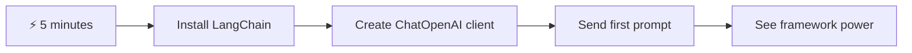
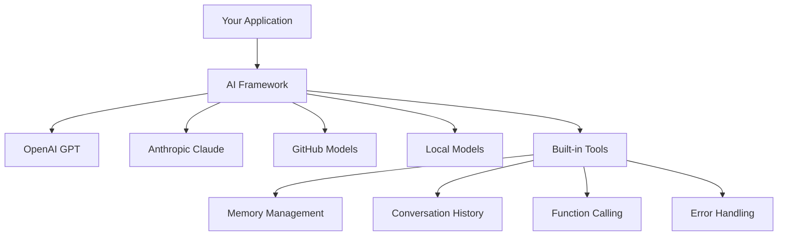
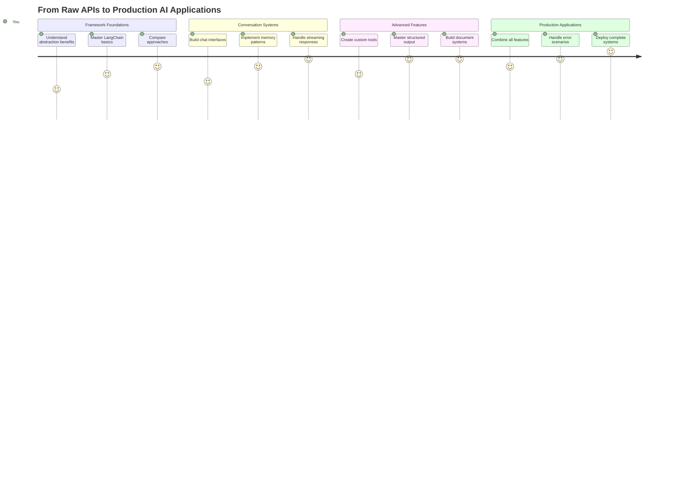
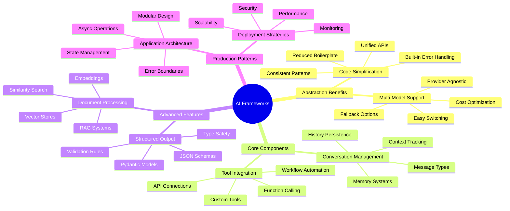
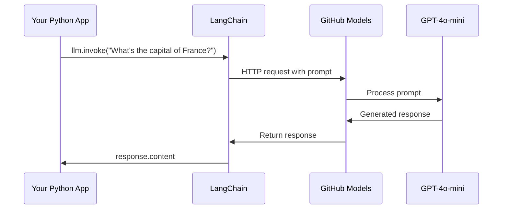
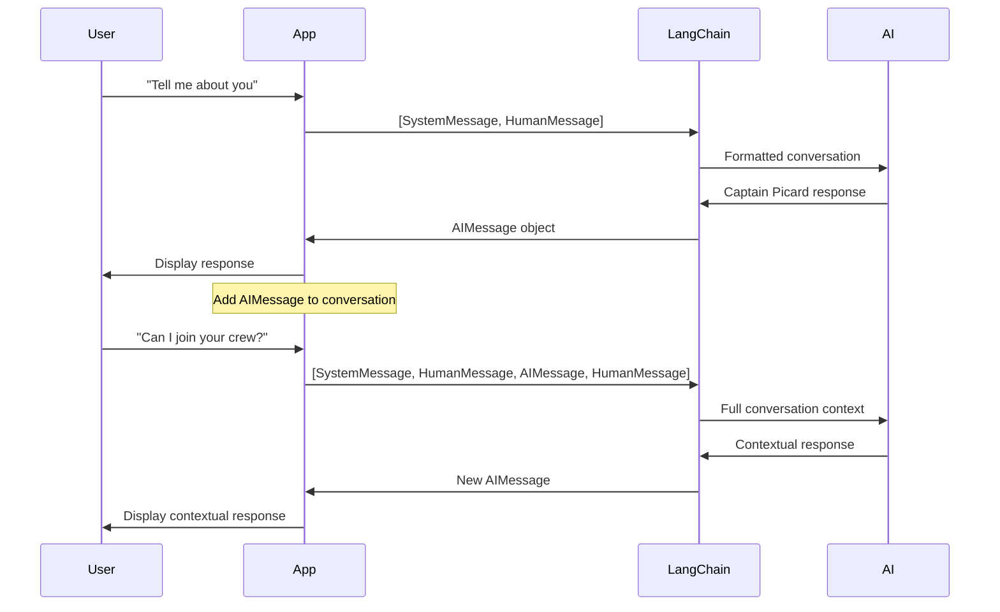
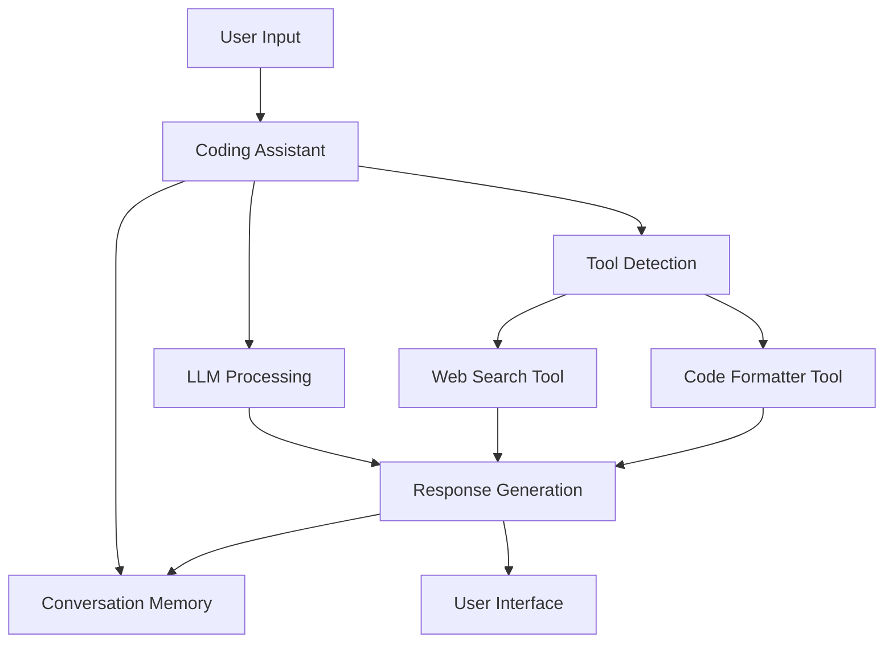
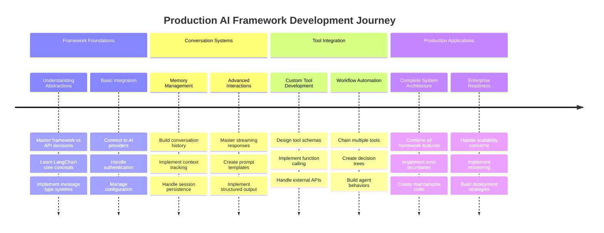
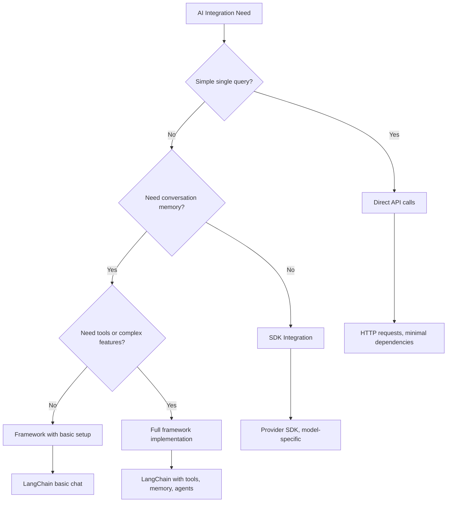

# AI Framework

ਕੀ ਤੁਸੀਂ ਕਦੇ AI ਐਪਲੀਕੇਸ਼ਨ ਨੂੰ ਸ਼ੁਰੂ ਤੋਂ ਬਣਾਉਣ ਦੀ ਕੋਸ਼ਿਸ਼ ਕਰਦੇ ਹੋਏ ਘਬਰਾਏ ਹੋ? ਤੁਸੀਂ ਇਕੱਲੇ ਨਹੀਂ ਹੋ! AI ਫਰੇਮਵਰਕ ਇੱਕ ਸਵਿਸ ਆਰਮੀ ਚਾਕੂ ਵਾਂਗ ਹੁੰਦੇ ਹਨ - ਇਹ ਸ਼ਕਤੀਸ਼ਾਲੀ ਸਾਧਨ ਹਨ ਜੋ ਸਮਰੱਥ ਐਪਲੀਕੇਸ਼ਨ ਬਣਾਉਣ ਦੌਰਾਨ ਤੁਹਾਡਾ ਸਮਾਂ ਅਤੇ ਮੁਸ਼ਕਲਾਂ ਬਚਾ ਸਕਦੇ ਹਨ। AI ਫਰੇਮਵਰਕ ਨੂੰ ਇੱਕ ਚੰਗੀ ਤਰ੍ਹਾਂ ਸੰਗਠਿਤ ਲਾਇਬ੍ਰੇਰੀ ਵਾਂਗ ਸੋਚੋ: ਇਹ ਤੁਹਾਨੂੰ ਪਹਿਲਾਂ ਤੋਂ ਬਣੇ ਕੰਪੋਨੈਂਟ, ਮਿਆਰੀ APIs, ਅਤੇ ਸਮਾਰਟ ਐਬਸਟ੍ਰੈਕਸ਼ਨ ਪ੍ਰਦਾਨ ਕਰਦਾ ਹੈ ਤਾਂ ਕਿ ਤੁਸੀਂ ਅਮਲ ਦੇ ਵੇਰਵਿਆਂ ਨਾਲ ਜੂਝਣ ਦੀ ਬਜਾਏ ਸਮੱਸਿਆਵਾਂ ਹੱਲ ਕਰਨ 'ਤੇ ਧਿਆਨ ਦੇ ਸਕੋ।

ਇਸ ਪਾਠ ਵਿੱਚ, ਅਸੀਂ ਵੇਖਾਂਗੇ ਕਿ ਕਿਵੇਂ LangChain ਵਰਗੇ ਫਰੇਮਵਰਕ ਪੁਰਾਣੇ ਸਮੇਂ ਦੇ ਜਟਿਲ AI ਇੰਟੀਗ੍ਰੇਸ਼ਨ ਕੰਮਾਂ ਨੂੰ ਸਾਫ਼, ਪੜ੍ਹਨਯੋਗ ਕੋਡ ਵਿੱਚ ਬਦਲ ਸਕਦੇ ਹਨ। ਤੁਸੀਂ ਇਹ ਜਾਣੋਗੇ ਕਿ ਗੱਲਬਾਤਾਂ ਦਾ ਟ੍ਰੈਕ ਰੱਖਣ, ਟੂਲ ਕਾਲਿੰਗ ਲਾਗੂ ਕਰਨ, ਅਤੇ ਇੱਕ ਇਕੱਠੇ ਇੰਟਰਫੇਸ ਰਾਹੀਂ ਵੱਖ-ਵੱਖ AI ਮਾਡਲਾਂ ਨੂੰ ਸੰਭਾਲਣ ਵਰਗੀਆਂ ਅਸਲ ਦੁਨੀਆ ਦੀਆਂ ਚੁਣੌਤੀਆਂ ਨੂੰ ਕਿਵੇਂ ਹੱਲ ਕਰਨਾ ਹੈ।

ਜਦੋਂ ਤੱਕ ਅਸੀਂ ਪਾਠ ਪੂਰਾ ਕਰਾਂਗੇ, ਤੁਸੀਂ ਜਾਣੋਗੇ ਕਿ ਕਦੋਂ ਫਰੇਮਵਰਕ ਦੀ ਵਰਤੋਂ ਕਰਨੀ ਹੈ APIs ਦੇ ਸਿੱਧੇ ਕਾਲਾਂ ਦੀ ਬਜਾਏ, ਕਿਵੇਂ ਉਨ੍ਹਾਂ ਦੇ ਐਬਸਟ੍ਰੈਕਸ਼ਨ ਨੂੰ ਪ੍ਰਭਾਵਸ਼ਾਲੀ ਤਰੀਕੇ ਨਾਲ ਵਰਤਣਾ ਹੈ, ਅਤੇ ਕਿਵੇਂ ਅਸਲ ਦੁਨੀਆ ਦੇ ਵਰਤੋਂ ਲਈ ਤਿਆਰ AI ਐਪਲੀਕੇਸ਼ਨ ਬਣਾਉਣੇ ਹਨ। ਆਓ ਵੇਖੀਏ ਕਿ AI ਫਰੇਮਵਰਕ ਤੁਹਾਡੇ ਪ੍ਰੋਜੈਕਟਾਂ ਲਈ ਕੀ ਕਰ ਸਕਦੇ ਹਨ।

## ⚡ ਅਗਲੇ 5 ਮਿੰਟਾਂ ਵਿੱਚ ਤੁਸੀਂ ਕੀ ਕਰ ਸਕਦੇ ਹੋ

**ਵਿਆਸਤ ਡਿਵੈਲਪਰਾਂ ਲਈ ਤੇਜ਼ ਸ਼ੁਰੂਆਤ ਦਾ ਰਾਹ**



- **ਪਹਿਲਾ ਮਿੰਟ**: LangChain ਇੰਸਟਾਲ ਕਰੋ: `pip install langchain langchain-openai`
- **ਦੂਜਾ ਮਿੰਟ**: ਆਪਣਾ GitHub ਟੋਕਨ ਸੈਟ ਕਰੋ ਅਤੇ ChatOpenAI ਕਲਾਇੰਟ ਇੰਪੋਰਟ ਕਰੋ
- **ਤੀਜਾ ਮਿੰਟ**: ਸਿਸਟਮ ਅਤੇ ਮਨੁੱਖੀ ਸੁਨੇਹਿਆਂ ਨਾਲ ਇੱਕ ਸਧਾਰਨ ਗੱਲਬਾਤ ਬਣਾਓ
- **ਚੌਥਾ ਮਿੰਟ**: ਇੱਕ ਬੁਨਿਆਦੀ ਟੂਲ (ਜਿਵੇਂ ਕਿ ਇੱਕ add ਫੰਕਸ਼ਨ) ਸ਼ਾਮਲ ਕਰੋ ਅਤੇ AI ਟੂਲ ਕਾਲਿੰਗ ਦੇਖੋ
- **ਪੰਜਵਾਂ ਮਿੰਟ**: APIs ਦੇ ਸਿੱਧੇ ਕਾਲਾਂ ਅਤੇ ਫਰੇਮਵਰਕ ਐਬਸਟ੍ਰੈਕਸ਼ਨ ਦੇ ਵਿਚਕਾਰ ਅੰਤਰ ਦਾ ਅਨੁਭਵ ਕਰੋ

**ਤੇਜ਼ ਟੈਸਟ ਕੋਡ**:
```python
from langchain_openai import ChatOpenAI
from langchain_core.messages import SystemMessage, HumanMessage

llm = ChatOpenAI(
    api_key=os.environ["GITHUB_TOKEN"],
    base_url="https://models.github.ai/inference",
    model="openai/gpt-4o-mini"
)

response = llm.invoke([
    SystemMessage(content="You are a helpful coding assistant"),
    HumanMessage(content="Explain Python functions briefly")
])
print(response.content)
```

**ਇਸਦਾ ਮਹੱਤਵ ਕਿਉਂ ਹੈ**: 5 ਮਿੰਟਾਂ ਵਿੱਚ, ਤੁਸੀਂ ਅਨੁਭਵ ਕਰੋਗੇ ਕਿ ਕਿਵੇਂ AI ਫਰੇਮਵਰਕ ਜਟਿਲ AI ਇੰਟੀਗ੍ਰੇਸ਼ਨ ਨੂੰ ਸਧਾਰਨ ਵਿਧੀਆਂ ਵਿੱਚ ਬਦਲ ਦਿੰਦੇ ਹਨ। ਇਹ ਉਹ ਬੁਨਿਆਦ ਹੈ ਜੋ ਉਤਪਾਦਨ AI ਐਪਲੀਕੇਸ਼ਨ ਨੂੰ ਚਲਾਉਂਦੀ ਹੈ।

## ਫਰੇਮਵਰਕ ਕਿਉਂ ਚੁਣੋ?

ਤੁਸੀਂ AI ਐਪ ਬਣਾਉਣ ਲਈ ਤਿਆਰ ਹੋ - ਸ਼ਾਨਦਾਰ! ਪਰ ਗੱਲ ਇਹ ਹੈ: ਤੁਹਾਡੇ ਕੋਲ ਕਈ ਵੱਖ-ਵੱਖ ਰਾਹ ਹਨ ਜੋ ਤੁਸੀਂ ਲੈ ਸਕਦੇ ਹੋ, ਅਤੇ ਹਰ ਇੱਕ ਦੇ ਆਪਣੇ ਫਾਇਦੇ ਅਤੇ ਨੁਕਸਾਨ ਹਨ। ਇਹ ਕੁਝ ਇਸ ਤਰ੍ਹਾਂ ਹੈ ਜਿਵੇਂ ਕਿ ਕਿਤੇ ਜਾਣ ਲਈ ਤੁਰਨਾ, ਸਾਈਕਲ ਚਲਾਉਣਾ ਜਾਂ ਗੱਡੀ ਚਲਾਉਣ ਵਿੱਚ ਚੋਣ ਕਰਨੀ - ਇਹ ਸਾਰੇ ਤੁਹਾਨੂੰ ਮੰਜ਼ਿਲ ਤੱਕ ਪਹੁੰਚਾ ਦੇਣਗੇ, ਪਰ ਅਨੁਭਵ (ਅਤੇ ਯਤਨ) ਬਿਲਕੁਲ ਵੱਖਰੇ ਹੋਣਗੇ।

ਆਓ ਤਿੰਨ ਮੁੱਖ ਤਰੀਕੇ ਵੇਖੀਏ ਜਿਨ੍ਹਾਂ ਨਾਲ ਤੁਸੀਂ ਆਪਣੇ ਪ੍ਰੋਜੈਕਟਾਂ ਵਿੱਚ AI ਨੂੰ ਸ਼ਾਮਲ ਕਰ ਸਕਦੇ ਹੋ:

| ਤਰੀਕਾ | ਫਾਇਦੇ | ਸਭ ਤੋਂ ਵਧੀਆ | ਵਿਚਾਰ |
|----------|------------|----------|--------------|
| **Direct HTTP Requests** | ਪੂਰਾ ਕੰਟਰੋਲ, ਕੋਈ dependencies ਨਹੀਂ | ਸਧਾਰਨ ਪੁੱਛਗਿੱਛ, ਬੁਨਿਆਦੀਆਂ ਸਿੱਖਣਾ | ਵਧੇਰੇ verbose ਕੋਡ, ਮੈਨੂਅਲ error handling |
| **SDK Integration** | ਘੱਟ boilerplate, ਮਾਡਲ-ਵਿਸ਼ੇਸ਼ optimizations | ਇੱਕ ਮਾਡਲ ਐਪਲੀਕੇਸ਼ਨ | ਨਿਰਧਾਰਤ ਪ੍ਰਦਾਤਾ ਤੱਕ ਸੀਮਿਤ |
| **AI Frameworks** | ਇਕੱਠੇ API, ਬਣੇ-ਬਨਾਏ abstractions | ਬਹੁ-ਮਾਡਲ ਐਪਸ, ਜਟਿਲ workflows | ਸਿੱਖਣ ਦਾ curve, ਸੰਭਾਵਿਤ over-abstraction |

### ਫਰੇਮਵਰਕ ਦੇ ਫਾਇਦੇ ਅਮਲ ਵਿੱਚ



**ਫਰੇਮਵਰਕ ਕਿਉਂ ਮਹੱਤਵਪੂਰਨ ਹਨ:**
- **ਇਕੱਠੇ** ਵੱਖ-ਵੱਖ AI ਪ੍ਰਦਾਤਾ ਇੱਕ ਇੰਟਰਫੇਸ ਹੇਠ
- **ਸਵੈ-ਚਾਲਤ** ਗੱਲਬਾਤ ਮੈਮੋਰੀ ਨੂੰ ਸੰਭਾਲਦਾ ਹੈ
- **ਤਿਆਰ-ਕੀਤੇ** ਸਾਧਨ ਪ੍ਰਦਾਨ ਕਰਦਾ ਹੈ ਜਿਵੇਂ embeddings ਅਤੇ function calling
- **error handling** ਅਤੇ retry logic ਨੂੰ ਸੰਭਾਲਦਾ ਹੈ
- **ਜਟਿਲ workflows** ਨੂੰ ਪੜ੍ਹਨਯੋਗ ਵਿਧੀਆਂ ਵਿੱਚ ਬਦਲਦਾ ਹੈ

> 💡 **Pro Tip**: ਜਦੋਂ ਵੱਖ-ਵੱਖ AI ਮਾਡਲਾਂ ਦੇ ਵਿਚਕਾਰ ਸਵਿੱਚ ਕਰਨਾ ਜਾਂ agents, memory, ਜਾਂ tool calling ਵਰਗੇ ਜਟਿਲ ਫੀਚਰ ਬਣਾਉਣਾ ਹੋਵੇ ਤਾਂ ਫਰੇਮਵਰਕ ਦੀ ਵਰਤੋਂ ਕਰੋ। ਬੁਨਿਆਦੀਆਂ ਸਿੱਖਣ ਜਾਂ ਸਧਾਰਨ, ਕੇਂਦਰਿਤ ਐਪਲੀਕੇਸ਼ਨ ਬਣਾਉਣ ਦੌਰਾਨ ਸਿੱਧੇ APIs ਨਾਲ ਚਿਪਕੋ।

**ਸਾਰ**: ਜਿਵੇਂ ਕਿ ਇੱਕ ਕਾਰੀਗਰ ਦੇ ਵਿਸ਼ੇਸ਼ ਸਾਧਨ ਅਤੇ ਇੱਕ ਪੂਰੀ workshop ਦੇ ਵਿਚਕਾਰ ਚੋਣ ਕਰਨੀ, ਇਹ ਕੰਮ ਦੇ ਨਾਲ ਸਾਧਨ ਨੂੰ ਮਿਲਾਉਣ ਬਾਰੇ ਹੈ। ਜਟਿਲ, ਫੀਚਰ-ਭਰਪੂਰ ਐਪਲੀਕੇਸ਼ਨ ਲਈ ਫਰੇਮਵਰਕ ਸ਼ਾਨਦਾਰ ਹਨ, ਜਦੋਂ ਕਿ ਸਿੱਧੇ APIs ਸਧਾਰਨ ਵਰਤੋਂ ਦੇ ਕੇਸਾਂ ਲਈ ਚੰਗੇ ਹਨ।

## 🗺️ AI Framework Mastery ਰਾਹੀਂ ਤੁਹਾਡਾ ਸਿੱਖਣ ਦਾ ਸਫਰ



**ਤੁਹਾਡਾ ਸਫਰ ਦਾ ਮੰਜ਼ਿਲ**: ਇਸ ਪਾਠ ਦੇ ਅੰਤ ਤੱਕ, ਤੁਸੀਂ AI ਫਰੇਮਵਰਕ ਡਿਵੈਲਪਮੈਂਟ ਵਿੱਚ ਮਾਹਰ ਹੋ ਜਾਵੋਗੇ ਅਤੇ ਉੱਚ-ਤਕਨੀਕੀ, ਉਤਪਾਦਨ-ਤਿਆਰ AI ਐਪਲੀਕੇਸ਼ਨ ਬਣਾਉਣ ਦੇ ਯੋਗ ਹੋਵੋਗੇ ਜੋ ਵਪਾਰਕ AI ਸਹਾਇਕਾਂ ਦਾ ਮੁਕਾਬਲਾ ਕਰ ਸਕਦੇ ਹਨ।

## ਪੇਸ਼ਕਸ਼

ਇਸ ਪਾਠ ਵਿੱਚ, ਅਸੀਂ ਸਿੱਖਾਂਗੇ:

- ਇੱਕ ਆਮ AI ਫਰੇਮਵਰਕ ਦੀ ਵਰਤੋਂ ਕਰਨਾ।
- ਗੱਲਬਾਤਾਂ, ਟੂਲ ਦੀ ਵਰਤੋਂ, ਮੈਮੋਰੀ ਅਤੇ ਸੰਦਰਭ ਵਰਗੀਆਂ ਆਮ ਸਮੱਸਿਆਵਾਂ ਦਾ ਹੱਲ ਕਰਨਾ।
- ਇਸਨੂੰ ਵਰਤ ਕੇ AI ਐਪਸ ਬਣਾਉਣਾ।

## 🧠 AI Framework Development Ecosystem



**ਮੁੱਖ ਸਿਧਾਂਤ**: AI ਫਰੇਮਵਰਕ ਜਟਿਲਤਾ ਨੂੰ ਐਬਸਟ੍ਰੈਕਟ ਕਰਦੇ ਹਨ ਜਦੋਂ ਕਿ ਗੱਲਬਾਤ ਪ੍ਰਬੰਧਨ, ਟੂਲ ਇੰਟੀਗ੍ਰੇਸ਼ਨ, ਅਤੇ ਦਸਤਾਵੇਜ਼ ਪ੍ਰੋਸੈਸਿੰਗ ਲਈ ਸ਼ਕਤੀਸ਼ਾਲੀ abstractions ਪ੍ਰਦਾਨ ਕਰਦੇ ਹਨ, ਡਿਵੈਲਪਰਾਂ ਨੂੰ ਸਾਫ਼, ਸੰਭਾਲਣਯੋਗ ਕੋਡ ਨਾਲ ਉੱਚ-ਤਕਨੀਕੀ AI ਐਪਲੀਕੇਸ਼ਨ ਬਣਾਉਣ ਯੋਗ ਬਣਾਉਂਦੇ ਹਨ।

## ਤੁਹਾਡਾ ਪਹਿਲਾ AI ਪ੍ਰੋਮਪਟ

ਆਓ ਬੁਨਿਆਦੀਆਂ ਨਾਲ ਸ਼ੁਰੂ ਕਰੀਏ ਅਤੇ ਆਪਣਾ ਪਹਿਲਾ AI ਐਪਲੀਕੇਸ਼ਨ ਬਣਾਈਏ ਜੋ ਇੱਕ ਸਵਾਲ ਭੇਜਦਾ ਹੈ ਅਤੇ ਇੱਕ ਜਵਾਬ ਵਾਪਸ ਪ੍ਰਾਪਤ ਕਰਦਾ ਹੈ। ਜਿਵੇਂ ਕਿ ਆਰਕੀਮੀਡਸ ਨੇ ਆਪਣੇ ਸਨਾਨ ਵਿੱਚ displacement ਦੇ ਸਿਧਾਂਤ ਦੀ ਖੋਜ ਕੀਤੀ, ਕਈ ਵਾਰ ਸਭ ਤੋਂ ਸਧਾਰਨ ਅਵਲੋਕਨ ਸਭ ਤੋਂ ਸ਼ਕਤੀਸ਼ਾਲੀ ਅੰਤਰਦ੍ਰਿਸ਼ਟੀ ਦੀ ਅਗਵਾਈ ਕਰਦੇ ਹਨ - ਅਤੇ ਫਰੇਮਵਰਕ ਇਹ ਅੰਤਰਦ੍ਰਿਸ਼ਟੀ ਸੌਖੇ ਬਣਾਉਂਦੇ ਹਨ।

### LangChain ਨੂੰ GitHub ਮਾਡਲਾਂ ਨਾਲ ਸੈਟ ਕਰਨਾ

ਅਸੀਂ LangChain ਦੀ ਵਰਤੋਂ GitHub ਮਾਡਲਾਂ ਨਾਲ ਜੁੜਨ ਲਈ ਕਰਨ ਜਾ ਰਹੇ ਹਾਂ, ਜੋ ਕਾਫ਼ੀ ਵਧੀਆ ਹੈ ਕਿਉਂਕਿ ਇਹ ਤੁਹਾਨੂੰ ਵੱਖ-ਵੱਖ AI ਮਾਡਲਾਂ ਤੱਕ ਮੁਫ਼ਤ ਪਹੁੰਚ ਦਿੰਦਾ ਹੈ। ਸਭ ਤੋਂ ਵਧੀਆ ਗੱਲ? ਤੁਹਾਨੂੰ ਸ਼ੁਰੂ ਕਰਨ ਲਈ ਸਿਰਫ ਕੁਝ ਸਧਾਰਨ configuration ਪੈਰਾਮੀਟਰਾਂ ਦੀ ਲੋੜ ਹੈ:

```python
from langchain_openai import ChatOpenAI
import os

llm = ChatOpenAI(
    api_key=os.environ["GITHUB_TOKEN"],
    base_url="https://models.github.ai/inference",
    model="openai/gpt-4o-mini",
)

# Send a simple prompt
response = llm.invoke("What's the capital of France?")
print(response.content)
```

**ਇੱਥੇ ਕੀ ਹੋ ਰਿਹਾ ਹੈ:**
- **LangChain ਕਲਾਇੰਟ ਬਣਾਉਂਦਾ ਹੈ** `ChatOpenAI` ਕਲਾਸ ਦੀ ਵਰਤੋਂ ਕਰਕੇ - ਇਹ ਤੁਹਾਡਾ AI ਲਈ ਗੇਟਵੇ ਹੈ!
- **GitHub ਮਾਡਲਾਂ ਨਾਲ ਕਨੈਕਸ਼ਨ ਨੂੰ configure ਕਰਦਾ ਹੈ** ਤੁਹਾਡੇ authentication ਟੋਕਨ ਨਾਲ
- **ਕਿਹੜਾ AI ਮਾਡਲ ਵਰਤਣਾ ਹੈ** (`gpt-4o-mini`) ਨੂੰ specify ਕਰਦਾ ਹੈ - ਇਸਨੂੰ ਆਪਣਾ AI ਸਹਾਇਕ ਚੁਣਨ ਵਾਂਗ ਸੋਚੋ
- **ਤੁਹਾਡਾ ਸਵਾਲ ਭੇਜਦਾ ਹੈ** `invoke()` ਵਿਧੀ ਦੀ ਵਰਤੋਂ ਕਰਕੇ - ਇੱਥੇ ਜਾਦੂ ਹੁੰਦਾ ਹੈ
- **ਜਵਾਬ ਨੂੰ extract ਕਰਦਾ ਹੈ ਅਤੇ ਦਿਖਾਉਂਦਾ ਹੈ** - ਅਤੇ voilà, ਤੁਸੀਂ AI ਨਾਲ ਗੱਲਬਾਤ ਕਰ ਰਹੇ ਹੋ!

> 🔧 **Setup Note**: ਜੇ ਤੁਸੀਂ GitHub Codespaces ਦੀ ਵਰਤੋਂ ਕਰ ਰਹੇ ਹੋ, ਤਾਂ ਤੁਹਾਡੇ ਲਈ ਖੁਸ਼ਖਬਰੀ ਹੈ - `GITHUB_TOKEN` ਪਹਿਲਾਂ ਹੀ ਸੈਟ ਹੈ! ਸਥਾਨਕ ਤੌਰ 'ਤੇ ਕੰਮ ਕਰ ਰਹੇ ਹੋ? ਕੋਈ ਗੱਲ ਨਹੀਂ, ਤੁਹਾਨੂੰ ਸਿਰਫ ਸਹੀ permissions ਨਾਲ ਇੱਕ personal access token ਬਣਾਉਣ ਦੀ ਲੋੜ ਹੈ।

**ਉਮੀਦਵਾਰ ਨਤੀਜਾ:**
```text
The capital of France is Paris.
```



## ਗੱਲਬਾਤੀ AI ਬਣਾਉਣਾ

ਪਹਿਲੇ ਉਦਾਹਰਨ ਨੇ ਬੁਨਿਆਦੀਆਂ ਨੂੰ ਦਰਸਾਇਆ, ਪਰ ਇਹ ਸਿਰਫ ਇੱਕ ਸਿੰਗਲ ਐਕਸਚੇਂਜ ਹੈ - ਤੁਸੀਂ ਸਵਾਲ ਪੁੱਛਦੇ ਹੋ, ਜਵਾਬ ਪ੍ਰਾਪਤ ਕਰਦੇ ਹੋ, ਅਤੇ ਇਹ ਖਤਮ। ਅਸਲ ਐਪਲੀਕੇਸ਼ਨ ਵਿੱਚ, ਤੁਸੀਂ ਚਾਹੋਗੇ ਕਿ ਤੁਹਾਡਾ AI ਇਹ ਯਾਦ ਰੱਖੇ ਕਿ ਤੁਸੀਂ ਕੀ ਚਰਚਾ ਕਰ ਰਹੇ ਹੋ, ਜਿਵੇਂ ਕਿ ਵਾਟਸਨ ਅਤੇ ਹੋਮਜ਼ ਨੇ ਆਪਣੇ ਜਾਂਚ ਪੜਤਾਲੀ ਗੱਲਬਾਤਾਂ ਨੂੰ ਸਮੇਂ ਦੇ ਨਾਲ ਬਣਾਇਆ।

ਇੱਥੇ LangChain ਖਾਸ ਤੌਰ 'ਤੇ ਲਾਭਦਾਇਕ ਬਣਦਾ ਹੈ। ਇਹ ਵੱਖ-ਵੱਖ ਸੁਨੇਹਾ ਕਿਸਮਾਂ ਪ੍ਰਦਾਨ ਕਰਦਾ ਹੈ ਜੋ ਗੱਲਬਾਤਾਂ ਨੂੰ structure ਕਰਨ ਵਿੱਚ ਮਦਦ ਕਰਦੇ ਹਨ ਅਤੇ ਤੁਹਾਨੂੰ ਆਪਣੇ AI ਨੂੰ ਇੱਕ ਵਿਅਕਤੀਤਾ ਦੇਣ ਦਿੰਦੇ ਹਨ। ਤੁਸੀਂ ਗੱਲਬਾਤ ਦੇ ਅਨੁਭਵ ਬਣਾਉਣ ਜਾ ਰਹੇ ਹੋ ਜੋ ਸੰਦਰਭ ਅਤੇ ਵਿਅਕਤੀਤਾ ਨੂੰ ਬਣਾਈ ਰੱਖਦੇ ਹਨ।

### ਸੁਨੇਹਾ ਕਿਸਮਾਂ ਨੂੰ ਸਮਝਣਾ

ਇਨ੍ਹਾਂ ਸੁਨੇਹਾ ਕਿਸਮਾਂ ਨੂੰ ਗੱਲਬਾਤ ਵਿੱਚ ਭਾਗੀਦਾਰਾਂ ਦੁਆਰਾ ਪਹਿਨੇ "ਟੋਪੀਆਂ" ਵਾਂਗ ਸੋਚੋ। LangChain ਵੱਖ-ਵੱਖ ਸੁਨੇਹਾ ਕਲਾਸਾਂ ਦੀ ਵਰਤੋਂ ਕਰਦਾ ਹੈ ਇਹ ਟ੍ਰੈਕ ਕਰਨ ਲਈ ਕਿ ਕੌਣ ਕੀ ਕਹਿ ਰਿਹਾ ਹੈ:

| ਸੁਨੇਹਾ ਕਿਸਮ | ਉਦੇਸ਼ | ਉਦਾਹਰਨ ਵਰਤੋਂ |
|--------------|---------|------------------|
| `SystemMessage` | AI ਦੀ ਵਿਅਕਤੀਤਾ ਅਤੇ ਵਿਹਾਰ ਨੂੰ define ਕਰਦਾ ਹੈ | "ਤੁਸੀਂ ਇੱਕ ਮਦਦਗਾਰ ਕੋਡਿੰਗ ਸਹਾਇਕ ਹੋ" |
| `HumanMessage` | ਯੂਜ਼ਰ ਇਨਪੁਟ ਨੂੰ ਦਰਸਾਉਂਦਾ ਹੈ | "ਫੰਕਸ਼ਨ ਕਿਵੇਂ ਕੰਮ ਕਰਦੇ ਹਨ ਇਹ ਸਮਝਾਓ" |
| `AIMessage` | AI ਦੇ ਜਵਾਬਾਂ ਨੂੰ ਸਟੋਰ ਕਰਦਾ ਹੈ | ਗੱਲਬਾਤ ਵਿੱਚ ਪਿਛਲੇ AI ਜਵਾਬ |

### ਆਪਣੀ ਪਹਿਲੀ ਗੱਲਬਾਤ ਬਣਾਉਣਾ

ਆਓ ਇੱਕ ਗੱਲਬਾਤ ਬਣਾਈਏ ਜਿੱਥੇ ਸਾਡਾ AI ਇੱਕ ਖਾਸ ਭੂਮਿਕਾ ਅਪਣਾਉਂਦਾ ਹੈ। ਅਸੀਂ ਇਸਨੂੰ ਕੈਪਟਨ ਪਿਕਾਰਡ ਦਾ ਰੂਪ ਦੇਵਾਂਗੇ - ਇੱਕ ਪਾਤਰ ਜੋ ਆਪਣੇ ਕੂਟਨੀਤਿਕ ਗਿਆਨ ਅਤੇ ਨੇਤ੍ਰਿਤਵ ਲਈ ਜਾਣਿਆ ਜਾਂਦਾ ਹੈ:

```python
messages = [
    SystemMessage(content="You are Captain Picard of the Starship Enterprise"),
    HumanMessage(content="Tell me about you"),
]
```

**ਇਸ ਗੱਲਬਾਤ ਸੈਟਅਪ ਨੂੰ ਤੋੜਨਾ:**
- **AI ਦੀ ਭੂਮਿਕਾ ਅਤੇ ਵਿਅਕਤੀਤਾ ਨੂੰ ਸਥਾਪਿਤ ਕਰਦਾ ਹੈ** `SystemMessage` ਰਾਹੀਂ
- **ਮਨੁੱਖੀ ਸੁਨੇਹਾ ਰਾਹੀਂ ਸ਼ੁਰੂਆਤੀ ਯੂਜ਼ਰ ਪੁੱਛਗਿੱਛ ਪ੍ਰਦਾਨ ਕਰਦਾ ਹੈ**
- **ਬਹੁ-ਮੁੜ ਗੱਲਬਾਤ ਲਈ ਇੱਕ ਬੁਨਿਆਦ ਬਣਾਉਂਦਾ ਹੈ**

ਇਸ ਉਦਾਹਰਨ ਲਈ ਪੂਰਾ ਕੋਡ ਇਸ ਤਰ੍ਹਾਂ ਦਿਖਦਾ ਹੈ:

```python
from langchain_core.messages import HumanMessage, SystemMessage
from langchain_openai import ChatOpenAI
import os

llm = ChatOpenAI(
    api_key=os.environ["GITHUB_TOKEN"],
    base_url="https://models.github.ai/inference",
    model="openai/gpt-4o-mini",
)

messages = [
    SystemMessage(content="You are Captain Picard of the Starship Enterprise"),
    HumanMessage(content="Tell me about you"),
]


# works
response  = llm.invoke(messages)
print(response.content)
```

ਤੁਹਾਨੂੰ ਇਸ ਤਰ੍ਹਾਂ ਦਾ ਨਤੀਜਾ ਦੇਖਣਾ ਚਾਹੀਦਾ ਹੈ:

```text
I am Captain Jean-Luc Picard, the commanding officer of the USS Enterprise (NCC-1701-D), a starship in the United Federation of Planets. My primary mission is to explore new worlds, seek out new life and new civilizations, and boldly go where no one has gone before. 

I believe in the importance of diplomacy, reason, and the pursuit of knowledge. My crew is diverse and skilled, and we often face challenges that test our resolve, ethics, and ingenuity. Throughout my career, I have encountered numerous species, grappled with complex moral dilemmas, and have consistently sought peaceful solutions to conflicts.

I hold the ideals of the Federation close to my heart, believing in the importance of cooperation, understanding, and respect for all sentient beings. My experiences have shaped my leadership style, and I strive to be a thoughtful and just captain. How may I assist you further?
```

ਗੱਲਬਾਤ ਦੀ continuity ਬਣਾਈ ਰੱਖਣ ਲਈ (ਹਰ ਵਾਰ ਸੰਦਰਭ ਨੂੰ ਰੀਸੈਟ ਕਰਨ ਦੀ ਬਜਾਏ), ਤੁਹਾਨੂੰ ਆਪਣੇ ਸੁਨੇਹਾ ਸੂਚੀ ਵਿੱਚ ਜਵਾਬ ਸ਼ਾਮਲ ਕਰਦੇ ਰਹਿਣਾ ਪਵੇਗਾ। ਜਿਵੇਂ ਕਿ ਮੌਖਿਕ ਪਰੰਪਰਾਵਾਂ ਨੇ ਕਹਾਣੀਆਂ ਨੂੰ ਪੀੜੀਆਂ ਦੇ ਪਾਰ ਸੁਰੱਖਿਅਤ ਕੀਤਾ, ਇਹ ਪਹੁੰਚ ਲੰਬੇ ਸਮੇਂ ਦੀ ਮੈਮੋਰੀ ਬਣਾਉਂਦੀ ਹੈ:

```python
from langchain_core.messages import HumanMessage, SystemMessage
from langchain_openai import ChatOpenAI
import os

llm = ChatOpenAI(
    api_key=os.environ["GITHUB_TOKEN"],
    base_url="https://models.github.ai/inference",
    model="openai/gpt-4o-mini",
)

messages = [
    SystemMessage(content="You are Captain Picard of the Starship Enterprise"),
    HumanMessage(content="Tell me about you"),
]


# works
response  = llm.invoke(messages)

print(response.content)

print("---- Next ----")

messages.append(response)
messages.append(HumanMessage(content="Now that I know about you, I'm Chris, can I be in your crew?"))

response  = llm.invoke(messages)

print(response.content)

```

ਕਾਫ਼ੀ ਵਧੀਆ, ਹੈ ਨਾ? ਇੱਥੇ ਕੀ ਹੋ ਰਿਹਾ ਹੈ ਕਿ ਅਸੀਂ LLM ਨੂੰ ਦੋ ਵਾਰ ਕਾਲ ਕਰ ਰਹੇ ਹਾਂ - ਪਹਿਲਾਂ ਸਿਰਫ ਆਪਣੇ ਸ਼ੁਰੂਆਤੀ ਦੋ ਸੁਨੇਹਿਆਂ ਨਾਲ, ਪਰ ਫਿਰ ਪੂਰੀ ਗੱਲਬਾਤ ਦੇ ਇਤਿਹਾਸ ਨਾਲ। ਇਹ ਇਸ ਤਰ੍ਹਾਂ ਹੈ ਜਿਵੇਂ ਕਿ AI ਸੱਚਮੁੱਚ ਸਾਡੇ ਚੈਟ ਦੇ ਨਾਲ ਚੱਲ ਰਿਹਾ ਹੈ!

ਜਦੋਂ ਤੁਸੀਂ ਇਹ ਕੋਡ ਚਲਾਉਂਦੇ ਹੋ, ਤੁਹਾਨੂੰ ਇੱਕ ਦੂਜਾ ਜਵਾਬ ਮਿਲੇਗਾ ਜੋ ਕੁਝ ਇਸ ਤਰ੍ਹਾਂ ਲੱਗਦਾ ਹੈ:

```text
Welcome aboard, Chris! It's always a pleasure to meet those who share a passion for exploration and discovery. While I cannot formally offer you a position on the Enterprise right now, I encourage you to pursue your aspirations. We are always in need of talented individuals with diverse skills and backgrounds. 

If you are interested in space exploration, consider education and training in the sciences, engineering, or diplomacy. The values of curiosity, resilience, and teamwork are crucial in Starfleet. Should you ever find yourself on a starship, remember to uphold the principles of the Federation: peace, understanding, and respect for all beings. Your journey can lead you to remarkable adventures, whether in the stars or on the ground. Engage!
```



ਮੈਂ ਇਸਨੂੰ "ਸ਼ਾਇਦ" ਵਜੋਂ ਲਵਾਂਗਾ ;)

## Streaming ਜਵਾਬ

ਕੀ ਤੁਸੀਂ ਕਦੇ ਧਿਆਨ ਦਿੱਤਾ ਕਿ ChatGPT ਆਪਣੇ ਜਵਾਬ "ਟਾਈਪ" ਕਰਦਾ ਹੈ ਰੀਅਲ-ਟਾਈਮ ਵਿੱਚ? ਇਹ streaming ਦੀ ਕਾਰਵਾਈ ਹੈ। ਜਿਵੇਂ ਕਿ ਇੱਕ ਨਿਪੁਣ ਕਲਿਗ੍ਰਾਫਰ ਨੂੰ ਕੰਮ ਕਰਦੇ ਦੇਖਣਾ - ਅੱਖਰਾਂ ਨੂੰ ਇੱਕ-ਇੱਕ ਕਰਕੇ ਉਭਰਦੇ ਦੇਖਣਾ ਬਜਾਏ ਕਿ ਉਹ ਤੁਰੰਤ ਹੀ ਪ੍ਰਗਟ ਹੋਣ - streaming ਅੰਤਰਕਿਰਿਆ ਨੂੰ ਕੁਦਰਤੀ ਮਹਿਸੂਸ ਕਰਵਾਉਂਦੀ ਹੈ ਅਤੇ ਤੁਰੰਤ ਫੀਡਬੈਕ ਪ੍ਰਦਾਨ ਕਰਦੀ ਹੈ।

### LangChain ਨਾਲ Streaming ਲਾਗੂ ਕਰਨਾ

```python
from langchain_openai import ChatOpenAI
import os

llm = ChatOpenAI(
    api_key=os.environ["GITHUB_TOKEN"],
    base_url="https://models.github.ai/inference",
    model="openai/gpt-4o-mini",
    streaming=True
)

# Stream the response
for chunk in llm.stream("Write a short story about a robot learning to code"):
    print(chunk.content, end="", flush=True)
```

**Streaming ਕਿਉਂ ਸ਼ਾਨਦਾਰ ਹੈ:**
- **ਸਮੱਗਰੀ ਦਿਖਾਉਂਦੀ ਹੈ** ਜਦੋਂ ਇਹ ਬਣਾਈ ਜਾ ਰਹੀ ਹੁੰਦੀ ਹੈ - ਕੋਈ ਹੋਰ ਅਜੀਬ ਉਡੀਕ ਨਹੀਂ!
- **ਯੂਜ਼ਰਾਂ ਨੂੰ ਮਹਿਸੂਸ ਕਰਵਾਉਂਦੀ ਹੈ** ਕਿ ਕੁਝ ਵਾਸਤਵ ਵਿੱਚ ਹੋ ਰਿਹਾ ਹੈ
- **ਤੇਜ਼ ਮਹਿਸੂਸ ਹੁੰਦੀ ਹੈ**, ਭਾਵੇਂ ਇਹ ਤਕਨੀਕੀ ਤੌਰ 'ਤੇ ਨਾ ਹੋਵੇ
- **ਯੂਜ਼ਰਾਂ ਨੂੰ ਪੜ੍ਹਨਾ ਸ਼ੁਰੂ ਕਰਨ ਦਿੰਦੀ ਹੈ** ਜਦੋਂ AI "ਸੋਚ" ਰਿਹਾ ਹੁੰਦਾ ਹੈ

> 💡 **User Experience Tip**
ਸੰਖਿਆਵਾਂ ਜੋੜਨਾ ਸੰਕਲਪ ਨੂੰ ਦਰਸਾਉਂਦਾ ਹੈ, ਪਰ ਅਸਲ ਟੂਲ ਆਮ ਤੌਰ 'ਤੇ ਹੋਰ ਜਟਿਲ ਕਾਰਵਾਈਆਂ ਕਰਦੇ ਹਨ, ਜਿਵੇਂ ਕਿ ਵੈੱਬ API ਨੂੰ ਕਾਲ ਕਰਨਾ। ਆਓ ਆਪਣੇ ਉਦਾਹਰਨ ਨੂੰ ਵਧਾਉਣ ਲਈ AI ਨੂੰ ਇੰਟਰਨੈਟ ਤੋਂ ਸਮੱਗਰੀ ਲੈਣ ਲਈ ਕਹੀਏ - ਜਿਵੇਂ ਕਿ ਟੈਲੀਗ੍ਰਾਫ ਓਪਰੇਟਰ ਦੂਰ-ਦੂਰ ਦੇ ਸਥਾਨਾਂ ਨੂੰ ਜੋੜਦੇ ਸਨ:

```python
class joke(TypedDict):
    """Tell a joke."""

    # Annotations must have the type and can optionally include a default value and description (in that order).
    category: Annotated[str, ..., "The joke category"]

def get_joke(category: str) -> str:
    response = requests.get(f"https://api.chucknorris.io/jokes/random?category={category}", headers={"Accept": "application/json"})
    if response.status_code == 200:
        return response.json().get("value", f"Here's a {category} joke!")
    return f"Here's a {category} joke!"

functions = {
    "add": lambda a, b: a + b,
    "joke": lambda category: get_joke(category)
}

query = "Tell me a joke about animals"

# the rest of the code is the same
```

ਹੁਣ ਜੇ ਤੁਸੀਂ ਇਹ ਕੋਡ ਚਲਾਉਂਦੇ ਹੋ ਤਾਂ ਤੁਹਾਨੂੰ ਕੁਝ ਇਸ ਤਰ੍ਹਾਂ ਦਾ ਜਵਾਬ ਮਿਲੇਗਾ:

```text
TOOL CALL:  Chuck Norris once rode a nine foot grizzly bear through an automatic car wash, instead of taking a shower.
CONTENT:  
```

```mermaid
flowchart TD
    A[User Query: "Tell me a joke about animals"] --> B[LangChain Analysis]
    B --> C{Tool Available?}
    C -->|Yes| D[Select joke tool]
    C -->|No| E[Generate direct response]
    
    D --> F[Extract Parameters]
    F --> G[Call joke(category="animals")]
    G --> H[API Request to chucknorris.io]
    H --> I[Return joke content]
    I --> J[Display to user]
    
    E --> K[AI-generated response]
    K --> J
    
    subgraph "Tool Definition Layer"
        L[TypedDict Schema]
        M[Function Implementation]
        N[Parameter Validation]
    end
    
    D --> L
    F --> N
    G --> M
```

ਇਹ ਹੈ ਪੂਰਾ ਕੋਡ:

```python
from langchain_openai import ChatOpenAI
import requests
import os
from typing_extensions import Annotated, TypedDict

class add(TypedDict):
    """Add two integers."""

    # Annotations must have the type and can optionally include a default value and description (in that order).
    a: Annotated[int, ..., "First integer"]
    b: Annotated[int, ..., "Second integer"]

class joke(TypedDict):
    """Tell a joke."""

    # Annotations must have the type and can optionally include a default value and description (in that order).
    category: Annotated[str, ..., "The joke category"]

tools = [add, joke]

def get_joke(category: str) -> str:
    response = requests.get(f"https://api.chucknorris.io/jokes/random?category={category}", headers={"Accept": "application/json"})
    if response.status_code == 200:
        return response.json().get("value", f"Here's a {category} joke!")
    return f"Here's a {category} joke!"

functions = {
    "add": lambda a, b: a + b,
    "joke": lambda category: get_joke(category)
}

llm = ChatOpenAI(
    api_key=os.environ["GITHUB_TOKEN"],
    base_url="https://models.github.ai/inference",
    model="openai/gpt-4o-mini",
)

llm_with_tools = llm.bind_tools(tools)

query = "Tell me a joke about animals"

res = llm_with_tools.invoke(query)
if(res.tool_calls):
    for tool in res.tool_calls:
        # print("TOOL CALL: ", tool)
        print("TOOL CALL: ", functions[tool["name"]](../../../10-ai-framework-project/**tool["args"]))
print("CONTENT: ",res.content)
```

## ਐਮਬੈਡਿੰਗ ਅਤੇ ਦਸਤਾਵੇਜ਼ ਪ੍ਰੋਸੈਸਿੰਗ

ਐਮਬੈਡਿੰਗ ਆਧੁਨਿਕ AI ਵਿੱਚ ਸਭ ਤੋਂ ਸੁੰਦਰ ਹੱਲਾਂ ਵਿੱਚੋਂ ਇੱਕ ਹੈ। ਸੋਚੋ ਕਿ ਜੇ ਤੁਸੀਂ ਕਿਸੇ ਵੀ ਲਿਖਤ ਨੂੰ ਲੈ ਕੇ ਇਸਨੂੰ ਅੰਕਾਂ ਵਿੱਚ ਬਦਲ ਸਕਦੇ ਹੋ ਜੋ ਇਸਦੇ ਅਰਥ ਨੂੰ ਕੈਪਚਰ ਕਰਦੇ ਹਨ। ਇਹੀ ਕੰਮ ਐਮਬੈਡਿੰਗ ਕਰਦੇ ਹਨ - ਇਹ ਲਿਖਤ ਨੂੰ ਬਹੁ-ਮਾਤਰੀ ਸਪੇਸ ਵਿੱਚ ਬਿੰਦੂਆਂ ਵਿੱਚ ਬਦਲਦੇ ਹਨ ਜਿੱਥੇ ਸਮਾਨ ਸੰਕਲਪ ਇਕੱਠੇ ਹੁੰਦੇ ਹਨ। ਇਹ ਵਿਚਾਰਾਂ ਲਈ ਇੱਕ ਕੋਆਰਡੀਨੇਟ ਸਿਸਟਮ ਹੋਣ ਵਰਗਾ ਹੈ, ਜਿਵੇਂ ਕਿ ਮੇਂਡਲੀਵ ਨੇ ਪੀਰੀਓਡਿਕ ਟੇਬਲ ਨੂੰ ਪਰਮਾਣੂ ਗੁਣਾਂ ਦੁਆਰਾ ਸੰਗਠਿਤ ਕੀਤਾ ਸੀ।

### ਐਮਬੈਡਿੰਗ ਬਣਾਉਣਾ ਅਤੇ ਵਰਤਣਾ

```python
from langchain_openai import OpenAIEmbeddings
from langchain_community.vectorstores import FAISS
from langchain_community.document_loaders import TextLoader
from langchain.text_splitter import CharacterTextSplitter

# Initialize embeddings
embeddings = OpenAIEmbeddings(
    api_key=os.environ["GITHUB_TOKEN"],
    base_url="https://models.github.ai/inference",
    model="text-embedding-3-small"
)

# Load and split documents
loader = TextLoader("documentation.txt")
documents = loader.load()

text_splitter = CharacterTextSplitter(chunk_size=1000, chunk_overlap=0)
texts = text_splitter.split_documents(documents)

# Create vector store
vectorstore = FAISS.from_documents(texts, embeddings)

# Perform similarity search
query = "How do I handle user authentication?"
similar_docs = vectorstore.similarity_search(query, k=3)

for doc in similar_docs:
    print(f"Relevant content: {doc.page_content[:200]}...")
```

### ਵੱਖ-ਵੱਖ ਫਾਰਮੈਟਾਂ ਲਈ ਦਸਤਾਵੇਜ਼ ਲੋਡਰ

```python
from langchain_community.document_loaders import (
    PyPDFLoader,
    CSVLoader,
    JSONLoader,
    WebBaseLoader
)

# Load different document types
pdf_loader = PyPDFLoader("manual.pdf")
csv_loader = CSVLoader("data.csv")
json_loader = JSONLoader("config.json")
web_loader = WebBaseLoader("https://example.com/docs")

# Process all documents
all_documents = []
for loader in [pdf_loader, csv_loader, json_loader, web_loader]:
    docs = loader.load()
    all_documents.extend(docs)
```

**ਤੁਸੀਂ ਐਮਬੈਡਿੰਗ ਨਾਲ ਕੀ ਕਰ ਸਕਦੇ ਹੋ:**
- **ਖੋਜ ਬਣਾਓ** ਜੋ ਸਿਰਫ਼ ਕੀਵਰਡ ਮੈਚਿੰਗ ਨਹੀਂ, ਬਲਕਿ ਤੁਹਾਡੇ ਅਰਥ ਨੂੰ ਸਮਝਦੀ ਹੈ
- **AI ਬਣਾਓ** ਜੋ ਤੁਹਾਡੇ ਦਸਤਾਵੇਜ਼ਾਂ ਬਾਰੇ ਸਵਾਲਾਂ ਦੇ ਜਵਾਬ ਦੇ ਸਕੇ
- **ਸਿਫਾਰਸ਼ੀ ਸਿਸਟਮ ਬਣਾਓ** ਜੋ ਸੱਚਮੁੱਚ ਸਬੰਧਤ ਸਮੱਗਰੀ ਦੀ ਪੇਸ਼ਕਸ਼ ਕਰੇ
- **ਆਪਣੇ ਸਮੱਗਰੀ ਨੂੰ** ਸਵੈ-ਚਾਲਤ ਢੰਗ ਨਾਲ ਸੰਗਠਿਤ ਅਤੇ ਸ਼੍ਰੇਣੀਬੱਧ ਕਰੋ

```mermaid
flowchart LR
    A[Documents] --> B[Text Splitter]
    B --> C[Create Embeddings]
    C --> D[Vector Store]
    
    E[User Query] --> F[Query Embedding]
    F --> G[Similarity Search]
    G --> D
    D --> H[Relevant Documents]
    H --> I[AI Response]
    
    subgraph "Vector Space"
        J[Document A: [0.1, 0.8, 0.3...]]
        K[Document B: [0.2, 0.7, 0.4...]]
        L[Query: [0.15, 0.75, 0.35...]]
    end
    
    C --> J
    C --> K
    F --> L
    G --> J
    G --> K
```

## ਪੂਰੀ AI ਐਪਲੀਕੇਸ਼ਨ ਬਣਾਉਣਾ

ਹੁਣ ਅਸੀਂ ਤੁਹਾਡੇ ਸਿੱਖੇ ਗਏ ਸਭ ਕੁਝ ਨੂੰ ਇੱਕ ਵਿਸਤ੍ਰਿਤ ਐਪਲੀਕੇਸ਼ਨ ਵਿੱਚ ਸ਼ਾਮਲ ਕਰਾਂਗੇ - ਇੱਕ ਕੋਡਿੰਗ ਸਹਾਇਕ ਜੋ ਸਵਾਲਾਂ ਦੇ ਜਵਾਬ ਦੇ ਸਕੇ, ਟੂਲ ਵਰਤ ਸਕੇ, ਅਤੇ ਗੱਲਬਾਤ ਦੀ ਯਾਦ ਰੱਖ ਸਕੇ। ਜਿਵੇਂ ਕਿ ਪ੍ਰਿੰਟਿੰਗ ਪ੍ਰੈਸ ਨੇ ਮੌਜੂਦਾ ਤਕਨਾਲੋਜੀਆਂ (ਮੋਵੇਬਲ ਟਾਈਪ, ਸਿਆਹ, ਕਾਗਜ਼, ਅਤੇ ਦਬਾਅ) ਨੂੰ ਕੁਝ ਬਦਲਾਅਕਾਰੀ ਵਿੱਚ ਜੋੜਿਆ, ਅਸੀਂ ਆਪਣੇ AI ਕੰਪੋਨੈਂਟ ਨੂੰ ਕੁਝ ਵਿਹਾਰਕ ਅਤੇ ਲਾਭਦਾਇਕ ਵਿੱਚ ਜੋੜਾਂਗੇ।

### ਪੂਰੀ ਐਪਲੀਕੇਸ਼ਨ ਦਾ ਉਦਾਹਰਨ

```python
from langchain_openai import ChatOpenAI, OpenAIEmbeddings
from langchain_core.prompts import ChatPromptTemplate
from langchain_core.messages import HumanMessage, SystemMessage, AIMessage
from langchain_community.vectorstores import FAISS
from typing_extensions import Annotated, TypedDict
import os
import requests

class CodingAssistant:
    def __init__(self):
        self.llm = ChatOpenAI(
            api_key=os.environ["GITHUB_TOKEN"],
            base_url="https://models.github.ai/inference",
            model="openai/gpt-4o-mini"
        )
        
        self.conversation_history = [
            SystemMessage(content="""You are an expert coding assistant. 
            Help users learn programming concepts, debug code, and write better software.
            Use tools when needed and maintain a helpful, encouraging tone.""")
        ]
        
        # Define tools
        self.setup_tools()
    
    def setup_tools(self):
        class web_search(TypedDict):
            """Search for programming documentation or examples."""
            query: Annotated[str, "Search query for programming help"]
        
        class code_formatter(TypedDict):
            """Format and validate code snippets."""
            code: Annotated[str, "Code to format"]
            language: Annotated[str, "Programming language"]
        
        self.tools = [web_search, code_formatter]
        self.llm_with_tools = self.llm.bind_tools(self.tools)
    
    def chat(self, user_input: str):
        # Add user message to conversation
        self.conversation_history.append(HumanMessage(content=user_input))
        
        # Get AI response
        response = self.llm_with_tools.invoke(self.conversation_history)
        
        # Handle tool calls if any
        if response.tool_calls:
            for tool_call in response.tool_calls:
                tool_result = self.execute_tool(tool_call)
                print(f"🔧 Tool used: {tool_call['name']}")
                print(f"📊 Result: {tool_result}")
        
        # Add AI response to conversation
        self.conversation_history.append(response)
        
        return response.content
    
    def execute_tool(self, tool_call):
        tool_name = tool_call['name']
        args = tool_call['args']
        
        if tool_name == 'web_search':
            return f"Found documentation for: {args['query']}"
        elif tool_name == 'code_formatter':
            return f"Formatted {args['language']} code: {args['code'][:50]}..."
        
        return "Tool execution completed"

# Usage example
assistant = CodingAssistant()

print("🤖 Coding Assistant Ready! Type 'quit' to exit.\n")

while True:
    user_input = input("You: ")
    if user_input.lower() == 'quit':
        break
    
    response = assistant.chat(user_input)
    print(f"🤖 Assistant: {response}\n")
```

**ਐਪਲੀਕੇਸ਼ਨ ਆਰਕੀਟੈਕਚਰ:**



**ਅਸੀਂ ਲਾਗੂ ਕੀਤੇ ਮੁੱਖ ਫੀਚਰ:**
- **ਤੁਹਾਡੀ ਪੂਰੀ ਗੱਲਬਾਤ ਨੂੰ ਯਾਦ ਰੱਖਦਾ ਹੈ** ਸੰਦਰਭ ਦੀ ਲਗਾਤਾਰਤਾ ਲਈ
- **ਟੂਲ ਕਾਲਿੰਗ ਦੁਆਰਾ ਕਾਰਵਾਈਆਂ ਕਰਦਾ ਹੈ**, ਸਿਰਫ਼ ਗੱਲਬਾਤ ਨਹੀਂ
- **ਪ੍ਰਿਡਿਕਟੇਬਲ ਇੰਟਰੈਕਸ਼ਨ ਪੈਟਰਨਾਂ ਦੀ ਪਾਲਣਾ ਕਰਦਾ ਹੈ**
- **ਆਪਮਾਤਰਕ ਤੌਰ 'ਤੇ ਗਲਤੀ ਸੰਭਾਲ ਅਤੇ ਜਟਿਲ ਵਰਕਫਲੋਜ਼ ਦਾ ਪ੍ਰਬੰਧਨ ਕਰਦਾ ਹੈ**

### 🎯 ਪੈਡਾਗੌਜੀਕਲ ਚੈੱਕ-ਇਨ: ਪ੍ਰੋਡਕਸ਼ਨ AI ਆਰਕੀਟੈਕਚਰ

**ਆਰਕੀਟੈਕਚਰ ਦੀ ਸਮਝ**: ਤੁਸੀਂ ਇੱਕ ਪੂਰੀ AI ਐਪਲੀਕੇਸ਼ਨ ਬਣਾਈ ਹੈ ਜੋ ਗੱਲਬਾਤ ਪ੍ਰਬੰਧਨ, ਟੂਲ ਕਾਲਿੰਗ, ਅਤੇ ਸੰਗਠਿਤ ਵਰਕਫਲੋਜ਼ ਨੂੰ ਜੋੜਦੀ ਹੈ। ਇਹ ਪ੍ਰੋਡਕਸ਼ਨ-ਲੈਵਲ AI ਐਪਲੀਕੇਸ਼ਨ ਵਿਕਾਸ ਨੂੰ ਦਰਸਾਉਂਦੀ ਹੈ।

**ਮੁੱਖ ਸੰਕਲਪ ਸਿੱਖੇ:**
- **ਕਲਾਸ-ਅਧਾਰਿਤ ਆਰਕੀਟੈਕਚਰ**: ਸੰਗਠਿਤ, ਰੱਖ-ਰਖਾਅ ਯੋਗ AI ਐਪਲੀਕੇਸ਼ਨ ਸਟ੍ਰਕਚਰ
- **ਟੂਲ ਇੰਟੀਗ੍ਰੇਸ਼ਨ**: ਗੱਲਬਾਤ ਤੋਂ ਬਾਹਰ ਕਸਟਮ ਫੰਕਸ਼ਨਲਿਟੀ
- **ਯਾਦ ਪ੍ਰਬੰਧਨ**: ਲਗਾਤਾਰ ਗੱਲਬਾਤ ਸੰਦਰਭ
- **ਗਲਤੀ ਸੰਭਾਲ**: ਮਜ਼ਬੂਤ ਐਪਲੀਕੇਸ਼ਨ ਵਿਹਾਰ

**ਉਦਯੋਗ ਕਨੈਕਸ਼ਨ**: ਤੁਸੀਂ ਲਾਗੂ ਕੀਤੇ ਆਰਕੀਟੈਕਚਰ ਪੈਟਰਨ (ਗੱਲਬਾਤ ਕਲਾਸ, ਟੂਲ ਸਿਸਟਮ, ਯਾਦ ਪ੍ਰਬੰਧਨ) ਉਹੀ ਪੈਟਰਨ ਹਨ ਜੋ Slack ਦੇ AI ਸਹਾਇਕ, GitHub Copilot, ਅਤੇ Microsoft Copilot ਵਰਗੀਆਂ ਐਨਟਰਪ੍ਰਾਈਜ਼ AI ਐਪਲੀਕੇਸ਼ਨਾਂ ਵਿੱਚ ਵਰਤੇ ਜਾਂਦੇ ਹਨ। ਤੁਸੀਂ ਪੇਸ਼ੇਵਰ-ਗ੍ਰੇਡ ਆਰਕੀਟੈਕਚਰਲ ਸੋਚ ਨਾਲ ਬਣਾਉਣ ਲਈ ਤਿਆਰ ਹੋ।

**ਚਿੰਤਨ ਸਵਾਲ**: ਤੁਸੀਂ ਇਸ ਐਪਲੀਕੇਸ਼ਨ ਨੂੰ ਕਈ ਉਪਭੋਗਤਾਵਾਂ, ਸਥਾਈ ਸਟੋਰੇਜ, ਜਾਂ ਬਾਹਰੀ ਡਾਟਾਬੇਸਾਂ ਨਾਲ ਇੰਟੀਗ੍ਰੇਸ਼ਨ ਨੂੰ ਸੰਭਾਲਣ ਲਈ ਕਿਵੇਂ ਵਧਾਉਂਦੇ? ਸਕੇਲਬਿਲਟੀ ਅਤੇ ਸਟੇਟ ਪ੍ਰਬੰਧਨ ਚੁਣੌਤੀਆਂ 'ਤੇ ਵਿਚਾਰ ਕਰੋ।

## ਅਸਾਈਨਮੈਂਟ: ਆਪਣਾ AI-ਚਾਲਤ ਅਧਿਐਨ ਸਹਾਇਕ ਬਣਾਓ

**ਉਦੇਸ਼**: ਇੱਕ AI ਐਪਲੀਕੇਸ਼ਨ ਬਣਾਓ ਜੋ ਵਿਦਿਆਰਥੀਆਂ ਨੂੰ ਪ੍ਰੋਗਰਾਮਿੰਗ ਸੰਕਲਪ ਸਿੱਖਣ ਵਿੱਚ ਮਦਦ ਕਰੇ, ਵਿਆਖਿਆਵਾਂ, ਕੋਡ ਉਦਾਹਰਨਾਂ, ਅਤੇ ਇੰਟਰਐਕਟਿਵ ਕਵਿਜ਼ਾਂ ਪ੍ਰਦਾਨ ਕਰਕੇ।

### ਜ਼ਰੂਰਤਾਂ

**ਮੁੱਖ ਫੀਚਰ (ਲਾਜ਼ਮੀ):**
1. **ਗੱਲਬਾਤੀ ਇੰਟਰਫੇਸ**: ਇੱਕ ਚੈਟ ਸਿਸਟਮ ਲਾਗੂ ਕਰੋ ਜੋ ਕਈ ਸਵਾਲਾਂ ਵਿੱਚ ਸੰਦਰਭ ਨੂੰ ਰੱਖਦਾ ਹੈ
2. **ਸ਼ਿਕਸ਼ਣ ਟੂਲ**: ਘੱਟੋ-ਘੱਟ ਦੋ ਟੂਲ ਬਣਾਓ ਜੋ ਸਿੱਖਣ ਵਿੱਚ ਮਦਦ ਕਰਦੇ ਹਨ:
   - ਕੋਡ ਵਿਆਖਿਆ ਟੂਲ
   - ਸੰਕਲਪ ਕਵਿਜ਼ ਜਨਰੇਟਰ
3. **ਵਿਅਕਤੀਗਤ ਸਿੱਖਣ**: ਸਿਸਟਮ ਸੁਨੇਹਿਆਂ ਨੂੰ ਵਰਤ ਕੇ ਵੱਖ-ਵੱਖ ਕੌਸ਼ਲ ਪੱਧਰਾਂ ਲਈ ਜਵਾਬ ਅਨੁਕੂਲ ਬਣਾਓ
4. **ਜਵਾਬ ਫਾਰਮੈਟਿੰਗ**: ਕਵਿਜ਼ ਸਵਾਲਾਂ ਲਈ ਸੰਗਠਿਤ ਆਉਟਪੁੱਟ ਲਾਗੂ ਕਰੋ

### ਲਾਗੂ ਕਰਨ ਦੇ ਕਦਮ

**ਕਦਮ 1: ਆਪਣਾ ਵਾਤਾਵਰਣ ਸੈਟਅਪ ਕਰੋ**
```bash
pip install langchain langchain-openai
```

**ਕਦਮ 2: ਬੁਨਿਆਦੀ ਚੈਟ ਫੰਕਸ਼ਨਲਿਟੀ**
- ਇੱਕ `StudyAssistant` ਕਲਾਸ ਬਣਾਓ
- ਗੱਲਬਾਤ ਯਾਦ ਰੱਖਣ ਦੀ ਵਿਵਸਥਾ ਲਾਗੂ ਕਰੋ
- ਸਿੱਖਣ ਲਈ ਸਹਾਇਕ ਵਿਅਕਤੀਗਤ ਸੰਰਚਨਾ ਸ਼ਾਮਲ ਕਰੋ

**ਕਦਮ 3: ਸ਼ਿਕਸ਼ਣ ਟੂਲ ਸ਼ਾਮਲ ਕਰੋ**
- **ਕੋਡ ਵਿਆਖਿਆਕਾਰ**: ਕੋਡ ਨੂੰ ਸਮਝਣਯੋਗ ਹਿੱਸਿਆਂ ਵਿੱਚ ਤੋੜਦਾ ਹੈ
- **ਕਵਿਜ਼ ਜਨਰੇਟਰ**: ਪ੍ਰੋਗਰਾਮਿੰਗ ਸੰਕਲਪਾਂ ਬਾਰੇ ਸਵਾਲ ਬਣਾਉਂਦਾ ਹੈ
- **ਪ੍ਰਗਤੀ ਟ੍ਰੈਕਰ**: ਕਵਰੇਜ ਕੀਤੇ ਵਿਸ਼ਿਆਂ ਦੀ ਟ੍ਰੈਕਿੰਗ ਰੱਖਦਾ ਹੈ

**ਕਦਮ 4: ਵਧੇਰੇ ਫੀਚਰ (ਵਿਕਲਪਿਕ)**
- ਬਿਹਤਰ ਉਪਭੋਗਤਾ ਅਨੁਭਵ ਲਈ ਸਟ੍ਰੀਮਿੰਗ ਜਵਾਬ ਲਾਗੂ ਕਰੋ
- ਕੋਰਸ ਸਮੱਗਰੀ ਨੂੰ ਸ਼ਾਮਲ ਕਰਨ ਲਈ ਦਸਤਾਵੇਜ਼ ਲੋਡਿੰਗ ਸ਼ਾਮਲ ਕਰੋ
- ਸਮਾਨਤਾ-ਅਧਾਰਿਤ ਸਮੱਗਰੀ ਪ੍ਰਾਪਤੀ ਲਈ ਐਮਬੈਡਿੰਗ ਬਣਾਓ

### ਮੁਲਾਂਕਣ ਮਾਪਦੰਡ

| ਫੀਚਰ | ਸ਼ਾਨਦਾਰ (4) | ਚੰਗਾ (3) | ਸੰਤੋਸ਼ਜਨਕ (2) | ਕੰਮ ਦੀ ਲੋੜ (1) |
|---------|---------------|----------|------------------|----------------|
| **ਗੱਲਬਾਤ ਦਾ ਪ੍ਰਵਾਹ** | ਕੁਦਰਤੀ, ਸੰਦਰਭ-ਜਾਗਰੂਕ ਜਵਾਬ | ਚੰਗੀ ਸੰਦਰਭ ਰੱਖਣ ਯੋਗਤਾ | ਬੁਨਿਆਦੀ ਗੱਲਬਾਤ | ਸੰਦਰਭ ਬਿਨਾਂ ਗੱਲਬਾਤ |
| **ਟੂਲ ਇੰਟੀਗ੍ਰੇਸ਼ਨ** | ਕਈ ਉਪਯੋਗ ਟੂਲ ਬੇਹਤਰੀਨ ਤਰੀਕੇ ਨਾਲ ਕੰਮ ਕਰਦੇ ਹਨ | 2+ ਟੂਲ ਸਹੀ ਤਰੀਕੇ ਨਾਲ ਲਾਗੂ ਕੀਤੇ | 1-2 ਬੁਨਿਆਦੀ ਟੂਲ | ਟੂਲ ਕਾਰਗਰ ਨਹੀਂ |
| **ਕੋਡ ਗੁਣਵੱਤਾ** | ਸਾਫ਼, ਚੰਗੀ ਤਰੀਕੇ ਨਾਲ ਦਸਤਾਵੇਜ਼ਿਤ, ਗਲਤੀ ਸੰਭਾਲ | ਚੰਗਾ ਸਟ੍ਰਕਚਰ, ਕੁਝ ਦਸਤਾਵੇਜ਼ | ਬੁਨਿਆਦੀ ਕਾਰਗੁਜ਼ਾਰੀ ਕੰਮ ਕਰਦੀ ਹੈ | ਖਰਾਬ ਸਟ੍ਰਕਚਰ, ਕੋਈ ਗਲਤੀ ਸੰਭਾਲ ਨਹੀਂ |
| **ਸ਼ਿਕਸ਼ਣ ਮੁੱਲ** | ਸਿੱਖਣ ਲਈ ਸੱਚਮੁੱਚ ਮਦਦਗਾਰ, ਅਨੁਕੂਲ | ਚੰਗਾ ਸਿੱਖਣ ਸਮਰਥਨ | ਬੁਨਿਆਦੀ ਵਿਆਖਿਆਵਾਂ | ਸੀਮਿਤ ਸ਼ਿਕਸ਼ਣ ਲਾਭ |

### ਨਮੂਨਾ ਕੋਡ ਸਟ੍ਰਕਚਰ

```python
class StudyAssistant:
    def __init__(self, skill_level="beginner"):
        # Initialize LLM, tools, and conversation memory
        pass
    
    def explain_code(self, code, language):
        # Tool: Explain how code works
        pass
    
    def generate_quiz(self, topic, difficulty):
        # Tool: Create practice questions
        pass
    
    def chat(self, user_input):
        # Main conversation interface
        pass

# Example usage
assistant = StudyAssistant(skill_level="intermediate")
response = assistant.chat("Explain how Python functions work")
```

**ਬੋਨਸ ਚੁਣੌਤੀਆਂ:**
- ਵਾਇਸ ਇਨਪੁਟ/ਆਉਟਪੁੱਟ ਸਮਰਥਨ ਸ਼ਾਮਲ ਕਰੋ
- Streamlit ਜਾਂ Flask ਵਰਤ ਕੇ ਵੈੱਬ ਇੰਟਰਫੇਸ ਲਾਗੂ ਕਰੋ
- ਕੋਰਸ ਸਮੱਗਰੀ ਤੋਂ ਐਮਬੈਡਿੰਗ ਵਰਤ ਕੇ ਗਿਆਨ ਅਧਾਰ ਬਣਾਓ
- ਪ੍ਰਗਤੀ ਟ੍ਰੈਕਿੰਗ ਅਤੇ ਵਿਅਕਤੀਗਤ ਸਿੱਖਣ ਪਾਥ ਸ਼ਾਮਲ ਕਰੋ

## 📈 ਤੁਹਾਡਾ AI ਫਰੇਮਵਰਕ ਵਿਕਾਸ ਮਾਹਰਤਾ ਟਾਈਮਲਾਈਨ



**🎓 ਗ੍ਰੈਜੂਏਸ਼ਨ ਮਾਈਲਸਟੋਨ**: ਤੁਸੀਂ AI ਫਰੇਮਵਰਕ ਵਿਕਾਸ ਵਿੱਚ ਮਾਹਰਤਾ ਹਾਸਲ ਕਰ ਲਈ ਹੈ ਜੋ ਆਧੁਨਿਕ AI ਐਪਲੀਕੇਸ਼ਨਾਂ ਨੂੰ ਸ਼ਕਤੀ ਦੇਣ ਵਾਲੇ ਉਹੀ ਟੂਲ ਅਤੇ ਪੈਟਰਨ ਵਰਤਦੀ ਹੈ। ਇਹ ਕੌਸ਼ਲ AI ਐਪਲੀਕੇਸ਼ਨ ਵਿਕਾਸ ਦੇ ਕੱਟੇ-ਧਾਰ ਦਾ ਪ੍ਰਤੀਨਿਧੀ ਕਰਦੇ ਹਨ ਅਤੇ ਤੁਹਾਨੂੰ ਐਨਟਰਪ੍ਰਾਈਜ਼-ਗ੍ਰੇਡ ਬੁੱਧੀਮਾਨ ਸਿਸਟਮ ਬਣਾਉਣ ਲਈ ਤਿਆਰ ਕਰਦੇ ਹਨ।

**🔄 ਅਗਲੇ ਪੱਧਰ ਦੀ ਸਮਰਥਾ**:
- ਉੱਚ-ਤਰੀਕੇ ਦੇ AI ਆਰਕੀਟੈਕਚਰ (ਏਜੰਟ, ਮਲਟੀ-ਏਜੰਟ ਸਿਸਟਮ) ਦੀ ਖੋਜ ਕਰਨ ਲਈ ਤਿਆਰ
- RAG ਸਿਸਟਮਾਂ ਨੂੰ ਵੈਕਟਰ ਡਾਟਾਬੇਸਾਂ ਨਾਲ ਬਣਾਉਣ ਲਈ ਤਿਆਰ
- ਮਲਟੀ-ਮੋਡਲ AI ਐਪਲੀਕੇਸ਼ਨ ਬਣਾਉਣ ਲਈ ਸਜਗ
- AI ਐਪਲੀਕੇਸ਼ਨ ਸਕੇਲਿੰਗ ਅਤੇ ਅਪਟਿਮਾਈਜ਼ੇਸ਼ਨ ਲਈ ਮਜ਼ਬੂਤ ਨੀਵ ਰੱਖੀ

## ਸਾਰ

🎉 ਹੁਣ ਤੁਸੀਂ AI ਫਰੇਮਵਰਕ ਵਿਕਾਸ ਦੇ ਮੂਲ ਤੱਤਾਂ ਵਿੱਚ ਮਾਹਰ ਹੋ ਗਏ ਹੋ ਅਤੇ LangChain ਵਰਤ ਕੇ ਜਟਿਲ AI ਐਪਲੀਕੇਸ਼ਨ ਬਣਾਉਣ ਦਾ ਤਰੀਕਾ ਸਿੱਖ ਲਿਆ ਹੈ। ਜਿਵੇਂ ਕਿ ਇੱਕ ਵਿਸਤ੍ਰਿਤ ਅਪ੍ਰੈਂਟਿਸਸ਼ਿਪ ਪੂਰੀ ਕਰਨ ਤੋਂ ਬਾਅਦ, ਤੁਸੀਂ ਕੌਸ਼ਲਾਂ ਦੇ ਇੱਕ ਵੱਡੇ ਸੰਦ-ਸੈਟ ਨੂੰ ਹਾਸਲ ਕਰ ਲਿਆ ਹੈ। ਆਓ ਜੋ ਤੁਸੀਂ ਹਾਸਲ ਕੀਤਾ ਹੈ ਉਸਦਾ ਸਮੀਖਣ ਕਰੀਏ।

### ਤੁਸੀਂ ਕੀ ਸਿੱਖਿਆ

**ਮੂਲ ਫਰੇਮਵਰਕ ਸੰਕਲਪ:**
- **ਫਰੇਮਵਰਕ ਲਾਭ**: ਸਿੱਧੇ API ਕਾਲਾਂ ਦੇ ਬਦਲੇ ਫਰੇਮਵਰਕ ਚੁਣਨ ਦਾ ਸਮਝਣਾ
- **LangChain ਬੁਨਿਆਦੀਆਂ**: AI ਮਾਡਲ ਕਨੈਕਸ਼ਨ ਸੈਟਅਪ ਅਤੇ ਕਨਫਿਗਰ ਕਰਨਾ
- **ਸੁਨੇਹਾ ਕਿਸਮਾਂ**: `SystemMessage`, `HumanMessage`, ਅਤੇ `AIMessage` ਵਰਤ ਕੇ ਸੰਗਠਿਤ ਗੱਲਬਾਤਾਂ

**ਉੱਚ-ਤਰੀਕੇ ਦੇ ਫੀਚਰ:**
- **ਟੂਲ ਕਾਲਿੰਗ**: ਵਧੇਰੇ AI ਸਮਰਥਾ ਲਈ ਕਸਟਮ ਟੂਲ ਬਣਾਉਣਾ ਅਤੇ ਸ਼ਾਮਲ ਕਰਨਾ
- **ਗੱਲਬਾਤ ਯਾਦ**: ਕਈ ਗੱਲਬਾਤ ਮੋੜਾਂ ਵਿੱਚ ਸੰਦਰਭ ਰੱਖਣਾ
- **ਸਟ੍ਰੀਮਿੰਗ ਜਵਾਬ**: ਰੀਅਲ-ਟਾਈਮ ਜਵਾਬ ਡਿਲਿਵਰੀ ਲਾਗੂ ਕਰਨਾ
- **ਪ੍ਰੋਮਪਟ ਟੈਂਪਲੇਟ**: ਦੁਬਾਰਾ ਵਰਤਣਯੋਗ, ਗਤੀਸ਼ੀਲ ਪ੍ਰੋਮਪਟ ਬਣਾਉਣਾ
- **ਸੰਗਠਿਤ ਆਉਟਪੁੱਟ**: ਸਥਿਰ, ਪਾਰਸ ਕਰਨ ਯੋਗ AI ਜਵਾਬ ਸੁਨਿਸ਼ਚਿਤ ਕਰਨਾ
- **ਐਮਬੈਡਿੰਗ**: ਸੈਮੈਂਟਿਕ ਖੋਜ ਅਤੇ ਦਸਤਾਵੇਜ਼ ਪ੍ਰੋਸੈਸਿੰਗ ਸਮਰਥਾ ਬਣਾਉਣਾ

**ਵਿਹਾਰਕ ਐਪਲੀਕੇਸ਼ਨ:**
- **ਪੂਰੀ ਐਪਸ ਬਣਾਉਣਾ**: ਕਈ ਫੀਚਰਾਂ ਨੂੰ ਪ੍ਰੋਡਕਸ਼ਨ-ਤਿਆਰ ਐਪਲੀਕੇਸ਼ਨਾਂ ਵਿੱਚ ਜੋੜਨਾ
- **ਗਲਤੀ ਸੰਭਾਲ**: ਮਜ਼ਬੂਤ ਗਲਤੀ ਪ੍ਰਬੰਧਨ ਅਤੇ ਵੈਧਤਾ ਲਾਗੂ ਕਰਨਾ
- **ਟੂਲ ਇੰਟੀਗ੍ਰੇਸ਼ਨ**: AI ਸਮਰਥਾ ਵਧਾਉਣ ਵਾਲੇ ਕਸਟਮ ਟੂਲ ਬਣਾਉਣਾ

### ਮੁੱਖ ਸਿੱਖਣ

> 🎯 **ਯਾਦ ਰੱਖੋ**: LangChain ਵਰਗੇ AI ਫਰੇਮਵਰਕ ਬੁਨਿਆਦੀ ਤੌਰ 'ਤੇ ਤੁਹਾਡੇ ਜਟਿਲਤਾ-ਛੁਪਾਉਣ ਵਾਲੇ, ਫੀਚਰ-ਪੈਕਡ ਸਭ ਤੋਂ ਵਧੀਆ ਸਾਥੀ ਹਨ। ਇਹ ਗੱਲਬਾਤ ਯਾਦ, ਟੂਲ ਕਾਲਿੰਗ, ਜਾਂ ਕਈ AI ਮਾਡਲਾਂ ਨਾਲ ਕੰਮ ਕਰਨ ਦੀ ਲੋੜ ਹੋਣ 'ਤੇ ਬਹੁਤ ਹੀ ਵਧੀਆ ਹਨ।

**AI ਇੰਟੀਗ੍ਰੇਸ਼ਨ ਲਈ ਫੈਸਲਾ ਫਰੇਮਵਰਕ:**



### ਹੁਣ ਤੁਸੀਂ ਕਿੱਥੇ ਜਾ ਸਕਦੇ ਹੋ?

**ਹੁਣੇ ਹੀ ਬਣਾਉਣਾ ਸ਼ੁਰੂ ਕਰੋ:**
- ਇਹ ਸੰਕਲਪ ਲੈ ਕੇ ਕੁਝ ਬਣਾਓ ਜੋ ਤੁਹਾਨੂੰ ਉਤਸ਼ਾਹਿਤ ਕਰਦਾ ਹੈ!
- LangChain ਦੁਆਰਾ ਵੱਖ-ਵੱਖ AI ਮਾਡਲਾਂ ਨਾਲ ਖੇਡੋ - ਇਹ AI ਮਾਡਲਾਂ ਦਾ ਖੇਡ ਦਾ ਮੈਦਾਨ ਵਰਗਾ ਹੈ
- ਉਹ ਟੂਲ ਬਣਾਓ ਜੋ ਤੁਹਾਡੇ ਕੰਮ ਜਾਂ ਪ੍ਰੋਜੈਕਟਾਂ ਵਿੱਚ ਅਸਲ ਸਮੱਸਿਆਵਾਂ ਦਾ ਹੱਲ ਕਰਦੇ ਹਨ

**ਅਗਲੇ ਪੱਧਰ ਲਈ ਤਿਆਰ?**
- **AI ਏਜੰਟ**: AI ਸਿਸਟਮ ਬਣਾਓ ਜੋ ਆਪਣੇ ਆਪ ਜਟਿਲ ਕਾਰਵਾਈਆਂ ਦੀ ਯੋਜਨਾ ਅਤੇ ਅਮਲ ਕਰ ਸਕਦੇ ਹਨ
- **RAG (ਰਿਟਰੀਵਲ-ਅਗਮੈਂਟਡ ਜਨਰੇਸ਼ਨ)**: AI ਨੂੰ ਆਪਣੇ ਗਿਆਨ ਅਧਾਰਾਂ ਨਾਲ ਜੋੜੋ ਸਪਰ-ਪਾਵਰਡ ਐਪਲੀਕੇਸ਼ਨਾਂ ਲਈ
- **ਮਲਟੀ-ਮੋਡਲ AI**: ਲਿਖਤ, ਚਿੱਤਰ, ਅਤੇ ਆਡੀਓ ਨੂੰ ਇਕੱਠੇ ਵਰਤੋ - ਸੰਭਾਵਨ

---

**ਅਸਵੀਕਰਤੀ**:  
ਇਹ ਦਸਤਾਵੇਜ਼ AI ਅਨੁਵਾਦ ਸੇਵਾ [Co-op Translator](https://github.com/Azure/co-op-translator) ਦੀ ਵਰਤੋਂ ਕਰਕੇ ਅਨੁਵਾਦ ਕੀਤਾ ਗਿਆ ਹੈ। ਜਦੋਂ ਕਿ ਅਸੀਂ ਸਹੀ ਹੋਣ ਦੀ ਕੋਸ਼ਿਸ਼ ਕਰਦੇ ਹਾਂ, ਕਿਰਪਾ ਕਰਕੇ ਧਿਆਨ ਦਿਓ ਕਿ ਸਵੈਚਾਲਿਤ ਅਨੁਵਾਦਾਂ ਵਿੱਚ ਗਲਤੀਆਂ ਜਾਂ ਅਸੁਚੀਤਤਾਵਾਂ ਹੋ ਸਕਦੀਆਂ ਹਨ। ਮੂਲ ਦਸਤਾਵੇਜ਼ ਨੂੰ ਇਸਦੀ ਮੂਲ ਭਾਸ਼ਾ ਵਿੱਚ ਅਧਿਕਾਰਤ ਸਰੋਤ ਮੰਨਿਆ ਜਾਣਾ ਚਾਹੀਦਾ ਹੈ। ਮਹੱਤਵਪੂਰਨ ਜਾਣਕਾਰੀ ਲਈ, ਪੇਸ਼ੇਵਰ ਮਨੁੱਖੀ ਅਨੁਵਾਦ ਦੀ ਸਿਫਾਰਸ਼ ਕੀਤੀ ਜਾਂਦੀ ਹੈ। ਅਸੀਂ ਇਸ ਅਨੁਵਾਦ ਦੀ ਵਰਤੋਂ ਤੋਂ ਪੈਦਾ ਹੋਣ ਵਾਲੇ ਕਿਸੇ ਵੀ ਗਲਤ ਫਹਿਮੀ ਜਾਂ ਗਲਤ ਵਿਆਖਿਆ ਲਈ ਜ਼ਿੰਮੇਵਾਰ ਨਹੀਂ ਹਾਂ।