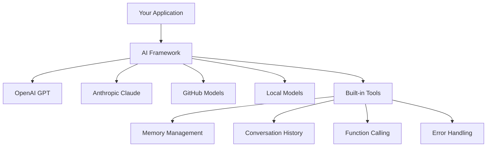
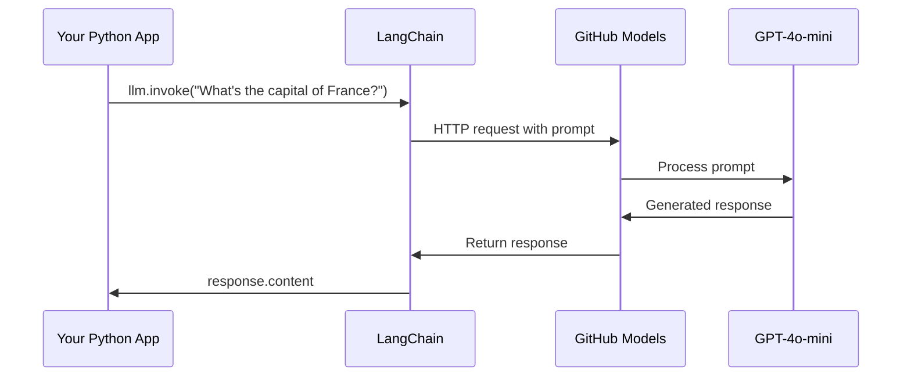
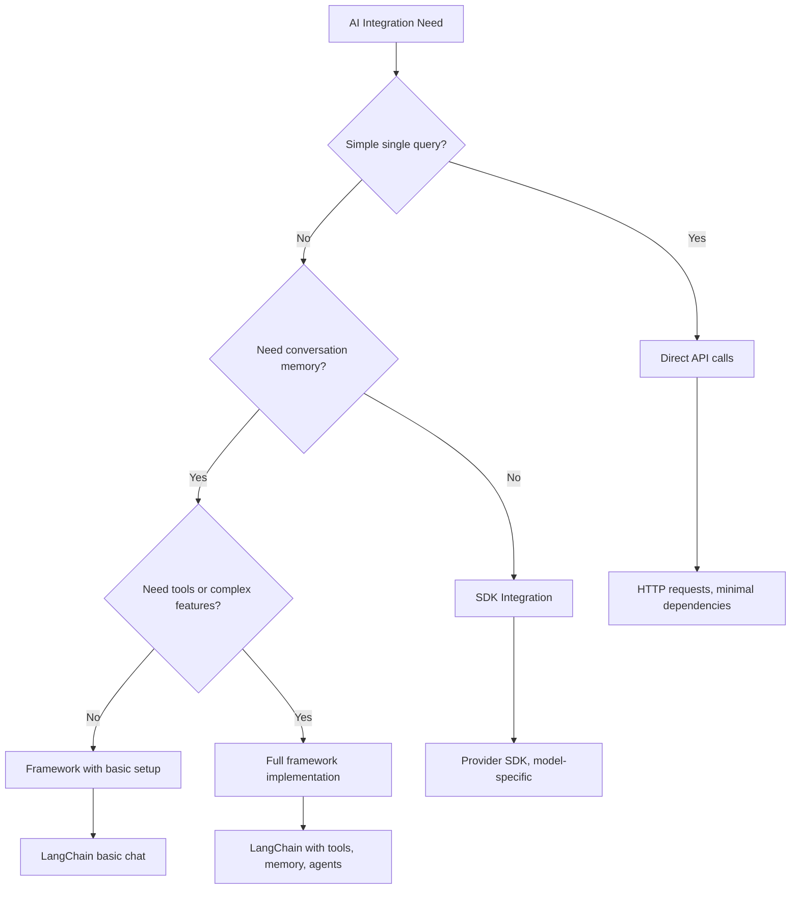

<!--
CO_OP_TRANSLATOR_METADATA:
{
  "original_hash": "e2c4ae5688e34b4b8b09d52aec56c79e",
  "translation_date": "2025-10-22T17:40:50+00:00",
  "source_file": "10-ai-framework-project/README.md",
  "language_code": "pa"
}
-->
# AI Framework

ਕੀ ਤੁਸੀਂ ਕਦੇ AI ਐਪਲੀਕੇਸ਼ਨ ਨੂੰ ਸ਼ੁਰੂ ਤੋਂ ਬਣਾਉਣ ਦੀ ਕੋਸ਼ਿਸ਼ ਕਰਦੇ ਹੋਏ ਘਬਰਾਏ ਹੋ? ਤੁਸੀਂ ਇਕੱਲੇ ਨਹੀਂ ਹੋ! AI ਫਰੇਮਵਰਕ ਇੱਕ ਸਵਿਸ ਆਰਮੀ ਚਾਕੂ ਵਾਂਗ ਹਨ ਜੋ AI ਵਿਕਾਸ ਲਈ ਸ਼ਕਤੀਸ਼ਾਲੀ ਸੰਦ ਹਨ। ਇਹ ਤੁਹਾਡੇ ਸਮੇਂ ਅਤੇ ਮਿਹਨਤ ਨੂੰ ਬਚਾਉਂਦੇ ਹਨ ਜਦੋਂ ਤੁਸੀਂ ਸਮਰੱਥ ਐਪਲੀਕੇਸ਼ਨ ਬਣਾਉਣ ਦੀ ਕੋਸ਼ਿਸ਼ ਕਰ ਰਹੇ ਹੋ। ਇੱਕ AI ਫਰੇਮਵਰਕ ਨੂੰ ਇੱਕ ਚੰਗੀ ਤਰ੍ਹਾਂ ਸੰਗਠਿਤ ਲਾਇਬ੍ਰੇਰੀ ਵਾਂਗ ਸੋਚੋ: ਇਹ ਤੁਹਾਨੂੰ ਪਹਿਲਾਂ ਤੋਂ ਬਣੇ ਹਿੱਸੇ, ਮਿਆਰੀਕ੍ਰਿਤ APIs, ਅਤੇ ਸਮਾਰਟ ਅਬਸਟਰੈਕਸ਼ਨ ਪ੍ਰਦਾਨ ਕਰਦਾ ਹੈ ਤਾਂ ਕਿ ਤੁਸੀਂ ਸਮੱਸਿਆਵਾਂ ਹੱਲ ਕਰਨ 'ਤੇ ਧਿਆਨ ਦੇ ਸਕੋ ਬਜਾਏ ਕਿ ਲਾਗੂ ਕਰਨ ਦੇ ਵੇਰਵਿਆਂ ਨਾਲ ਜੂਝਣ ਦੇ।

ਇਸ ਪਾਠ ਵਿੱਚ, ਅਸੀਂ ਵੇਖਾਂਗੇ ਕਿ ਕਿਵੇਂ LangChain ਵਰਗੇ ਫਰੇਮਵਰਕ ਪੁਰਾਣੇ ਸਮੇਂ ਦੇ ਜਟਿਲ AI ਇੰਟੀਗ੍ਰੇਸ਼ਨ ਕੰਮਾਂ ਨੂੰ ਸਾਫ਼, ਪੜ੍ਹਨਯੋਗ ਕੋਡ ਵਿੱਚ ਬਦਲ ਸਕਦੇ ਹਨ। ਤੁਸੀਂ ਇਹ ਜਾਣੋਗੇ ਕਿ ਅਸਲ ਦੁਨੀਆ ਦੀਆਂ ਚੁਣੌਤੀਆਂ ਨੂੰ ਕਿਵੇਂ ਹੱਲ ਕਰਨਾ ਹੈ ਜਿਵੇਂ ਕਿ ਗੱਲਬਾਤਾਂ ਦਾ ਟ੍ਰੈਕ ਰੱਖਣਾ, ਟੂਲ ਕਾਲਿੰਗ ਲਾਗੂ ਕਰਨਾ, ਅਤੇ ਇੱਕ ਇਕੱਠੇ ਇੰਟਰਫੇਸ ਰਾਹੀਂ ਵੱਖ-ਵੱਖ AI ਮਾਡਲਾਂ ਨੂੰ ਸੰਭਾਲਣਾ।

ਜਦੋਂ ਤੱਕ ਅਸੀਂ ਖਤਮ ਕਰਾਂਗੇ, ਤੁਸੀਂ ਜਾਣੋਗੇ ਕਿ ਕਦੋਂ ਫਰੇਮਵਰਕ ਦੀ ਵਰਤੋਂ ਕਰਨੀ ਹੈ ਬਜਾਏ ਕਿ ਕੱਚੇ API ਕਾਲਾਂ ਦੀ, ਕਿਵੇਂ ਉਨ੍ਹਾਂ ਦੇ ਅਬਸਟਰੈਕਸ਼ਨ ਨੂੰ ਪ੍ਰਭਾਵਸ਼ਾਲੀ ਤਰੀਕੇ ਨਾਲ ਵਰਤਣਾ ਹੈ, ਅਤੇ ਕਿਵੇਂ ਅਸਲ ਦੁਨੀਆ ਦੇ ਵਰਤੋਂ ਲਈ ਤਿਆਰ AI ਐਪਲੀਕੇਸ਼ਨ ਬਣਾਉਣੇ ਹਨ। ਆਓ ਵੇਖੀਏ ਕਿ ਤੁਹਾਡੇ ਪ੍ਰੋਜੈਕਟਾਂ ਲਈ AI ਫਰੇਮਵਰਕ ਕੀ ਕਰ ਸਕਦੇ ਹਨ।

## ਫਰੇਮਵਰਕ ਕਿਉਂ ਚੁਣੋ?

ਤੁਸੀਂ AI ਐਪ ਬਣਾਉਣ ਲਈ ਤਿਆਰ ਹੋ - ਸ਼ਾਨਦਾਰ! ਪਰ ਗੱਲ ਇਹ ਹੈ: ਤੁਹਾਡੇ ਕੋਲ ਕਈ ਵੱਖ-ਵੱਖ ਰਾਹ ਹਨ ਜੋ ਤੁਸੀਂ ਲੈ ਸਕਦੇ ਹੋ, ਅਤੇ ਹਰ ਇੱਕ ਦੇ ਆਪਣੇ ਫਾਇਦੇ ਅਤੇ ਨੁਕਸਾਨ ਹਨ। ਇਹ ਕੁਝ ਇਸ ਤਰ੍ਹਾਂ ਹੈ ਜਿਵੇਂ ਕਿ ਕਿਤੇ ਜਾਣ ਲਈ ਤੁਰਨਾ, ਸਾਈਕਲ ਚਲਾਉਣਾ ਜਾਂ ਗੱਡੀ ਚਲਾਉਣ ਵਿੱਚ ਚੋਣ ਕਰਨਾ - ਇਹ ਸਾਰੇ ਤੁਹਾਨੂੰ ਉੱਥੇ ਪਹੁੰਚਾ ਦੇਣਗੇ, ਪਰ ਅਨੁਭਵ (ਅਤੇ ਮਿਹਨਤ) ਬਿਲਕੁਲ ਵੱਖਰੇ ਹੋਣਗੇ।

ਆਓ ਤਿੰਨ ਮੁੱਖ ਤਰੀਕਿਆਂ ਨੂੰ ਤੋੜ ਕੇ ਵੇਖੀਏ ਕਿ ਤੁਸੀਂ ਆਪਣੇ ਪ੍ਰੋਜੈਕਟਾਂ ਵਿੱਚ AI ਨੂੰ ਕਿਵੇਂ ਸ਼ਾਮਲ ਕਰ ਸਕਦੇ ਹੋ:

| ਤਰੀਕਾ | ਫਾਇਦੇ | ਸਭ ਤੋਂ ਵਧੀਆ | ਵਿਚਾਰ |
|----------|------------|----------|--------------|
| **Direct HTTP Requests** | ਪੂਰਾ ਕੰਟਰੋਲ, ਕੋਈ ਡਿਪੈਂਡੈਂਸੀ ਨਹੀਂ | ਸਧਾਰਨ ਪੁੱਛਗਿੱਛ, ਮੂਲ ਸਿੱਖਣਾ | ਵਧੇਰੇ verbose ਕੋਡ, ਮੈਨੂਅਲ error handling |
| **SDK Integration** | ਘੱਟ boilerplate, ਮਾਡਲ-ਵਿਸ਼ੇਸ਼ ਅਨੁਕੂਲਤਾ | ਇੱਕ-ਮਾਡਲ ਐਪਲੀਕੇਸ਼ਨ | ਨਿਰਧਾਰਤ ਪ੍ਰਦਾਤਾਵਾਂ ਤੱਕ ਸੀਮਿਤ |
| **AI Frameworks** | ਇਕੱਠੇ API, ਬਣੇ-ਬਨਾਏ abstraction | ਬਹੁ-ਮਾਡਲ ਐਪਸ, ਜਟਿਲ workflows | ਸਿੱਖਣ ਦੀ ਲਹਿਰ, ਸੰਭਾਵਿਤ over-abstraction |

### ਫਰੇਮਵਰਕ ਦੇ ਅਸਲ ਫਾਇਦੇ



**ਫਰੇਮਵਰਕ ਕਿਉਂ ਮਹੱਤਵਪੂਰਨ ਹਨ:**
- **ਇਕੱਠੇ** ਵੱਖ-ਵੱਖ AI ਪ੍ਰਦਾਤਾਵਾਂ ਨੂੰ ਇੱਕ ਇੰਟਰਫੇਸ ਹੇਠ
- **ਸੰਭਾਲਦੇ** ਹਨ ਗੱਲਬਾਤ ਦੀ ਯਾਦਸ਼ਕਤੀ ਨੂੰ ਆਪਣੇ ਆਪ
- **ਪ੍ਰਦਾਨ ਕਰਦੇ** ਹਨ ਆਮ ਕੰਮਾਂ ਲਈ ਬਣੇ-ਬਨਾਏ ਸੰਦ ਜਿਵੇਂ ਕਿ embeddings ਅਤੇ function calling
- **ਮੈਨੇਜ** ਕਰਦੇ ਹਨ error handling ਅਤੇ retry logic
- **ਜਟਿਲ workflows** ਨੂੰ ਪੜ੍ਹਨਯੋਗ method calls ਵਿੱਚ ਬਦਲਦੇ ਹਨ

> 💡 **Pro Tip**: ਜਦੋਂ ਤੁਸੀਂ ਵੱਖ-ਵੱਖ AI ਮਾਡਲਾਂ ਦੇ ਵਿਚਕਾਰ ਸਵਿੱਚ ਕਰ ਰਹੇ ਹੋ ਜਾਂ agents, memory, ਜਾਂ tool calling ਵਰਗੇ ਜਟਿਲ ਫੀਚਰ ਬਣਾਉਣ ਦੀ ਕੋਸ਼ਿਸ਼ ਕਰ ਰਹੇ ਹੋ ਤਾਂ ਫਰੇਮਵਰਕ ਦੀ ਵਰਤੋਂ ਕਰੋ। ਸਧਾਰਨ, ਫੋਕਸਡ ਐਪਲੀਕੇਸ਼ਨ ਬਣਾਉਣ ਜਾਂ ਮੂਲ ਸਿੱਖਣ ਦੌਰਾਨ ਸਿੱਧੇ APIs ਨਾਲ ਚਿਪਕੋ।

**ਨਤੀਜਾ**: ਜਿਵੇਂ ਕਿ ਇੱਕ craftsman ਦੇ ਵਿਸ਼ੇਸ਼ ਸੰਦਾਂ ਅਤੇ ਇੱਕ ਪੂਰੇ workshop ਵਿੱਚ ਚੋਣ ਕਰਨ ਵਿੱਚ, ਇਹ ਕੰਮ ਦੇ ਹਿਸਾਬ ਨਾਲ ਸੰਦ ਨੂੰ ਮਿਲਾਉਣ ਬਾਰੇ ਹੈ। ਜਟਿਲ, ਫੀਚਰ-ਰਿਚ ਐਪਲੀਕੇਸ਼ਨ ਲਈ ਫਰੇਮਵਰਕ ਸ਼ਾਨਦਾਰ ਹਨ, ਜਦਕਿ ਸਧਾਰਨ ਵਰਤੋਂ ਦੇ ਕੇਸਾਂ ਲਈ ਸਿੱਧੇ APIs ਚੰਗੇ ਕੰਮ ਕਰਦੇ ਹਨ।

## ਪਰਿਚਯ

ਇਸ ਪਾਠ ਵਿੱਚ, ਅਸੀਂ ਸਿੱਖਾਂਗੇ:

- ਇੱਕ ਆਮ AI ਫਰੇਮਵਰਕ ਦੀ ਵਰਤੋਂ ਕਰਨਾ।
- ਆਮ ਸਮੱਸਿਆਵਾਂ ਨੂੰ ਹੱਲ ਕਰਨਾ ਜਿਵੇਂ ਕਿ ਗੱਲਬਾਤਾਂ, ਸੰਦ ਦੀ ਵਰਤੋਂ, ਯਾਦਸ਼ਕਤੀ ਅਤੇ ਸੰਦਰਭ।
- ਇਸਨੂੰ ਵਰਤ ਕੇ AI ਐਪਸ ਬਣਾਉਣਾ।

## ਤੁਹਾਡਾ ਪਹਿਲਾ AI ਪ੍ਰੋਮਪਟ

ਆਓ ਮੂਲ ਤੱਤਾਂ ਨਾਲ ਸ਼ੁਰੂ ਕਰੀਏ ਅਤੇ ਆਪਣਾ ਪਹਿਲਾ AI ਐਪਲੀਕੇਸ਼ਨ ਬਣਾਈਏ ਜੋ ਇੱਕ ਸਵਾਲ ਭੇਜਦਾ ਹੈ ਅਤੇ ਵਾਪਸ ਜਵਾਬ ਪ੍ਰਾਪਤ ਕਰਦਾ ਹੈ। ਜਿਵੇਂ ਕਿ ਆਰਕੀਮੀਡਸ ਨੇ ਆਪਣੇ ਸਨਾਨ ਵਿੱਚ displacement ਦੇ ਸਿਧਾਂਤ ਦੀ ਖੋਜ ਕੀਤੀ, ਕਈ ਵਾਰ ਸਭ ਤੋਂ ਸਧਾਰਨ ਅਵਲੋਕਨ ਸਭ ਤੋਂ ਸ਼ਕਤੀਸ਼ਾਲੀ ਅੰਦਰੂਨੀ ਜਾਣਕਾਰੀ ਵੱਲ ਲੈ ਜਾਂਦੇ ਹਨ - ਅਤੇ ਫਰੇਮਵਰਕ ਇਹ ਅੰਦਰੂਨੀ ਜਾਣਕਾਰੀ ਸੌਖੇ ਤਰੀਕੇ ਨਾਲ ਪਹੁੰਚਯੋਗ ਬਣਾਉਂਦੇ ਹਨ।

### LangChain ਨੂੰ GitHub ਮਾਡਲਾਂ ਨਾਲ ਸੈਟਅੱਪ ਕਰਨਾ

ਅਸੀਂ LangChain ਦੀ ਵਰਤੋਂ ਕਰਕੇ GitHub ਮਾਡਲਾਂ ਨਾਲ ਜੁੜਨ ਜਾ ਰਹੇ ਹਾਂ, ਜੋ ਕਾਫ਼ੀ ਵਧੀਆ ਹੈ ਕਿਉਂਕਿ ਇਹ ਤੁਹਾਨੂੰ ਵੱਖ-ਵੱਖ AI ਮਾਡਲਾਂ ਤੱਕ ਮੁਫ਼ਤ ਪਹੁੰਚ ਦਿੰਦਾ ਹੈ। ਸਭ ਤੋਂ ਵਧੀਆ ਗੱਲ? ਤੁਹਾਨੂੰ ਸ਼ੁਰੂ ਕਰਨ ਲਈ ਸਿਰਫ ਕੁਝ ਸਧਾਰਨ configuration parameters ਦੀ ਲੋੜ ਹੈ:

```python
from langchain_openai import ChatOpenAI
import os

llm = ChatOpenAI(
    api_key=os.environ["GITHUB_TOKEN"],
    base_url="https://models.github.ai/inference",
    model="openai/gpt-4o-mini",
)

# Send a simple prompt
response = llm.invoke("What's the capital of France?")
print(response.content)
```

**ਇੱਥੇ ਕੀ ਹੋ ਰਿਹਾ ਹੈ:**
- **ਬਣਾਉਂਦਾ ਹੈ** ਇੱਕ LangChain client `ChatOpenAI` ਕਲਾਸ ਦੀ ਵਰਤੋਂ ਕਰਕੇ - ਇਹ ਤੁਹਾਡਾ AI ਲਈ gateway ਹੈ!
- **ਕਨਫਿਗਰ ਕਰਦਾ ਹੈ** GitHub ਮਾਡਲਾਂ ਨਾਲ ਕਨੈਕਸ਼ਨ ਤੁਹਾਡੇ authentication token ਨਾਲ
- **ਨਿਰਧਾਰਤ ਕਰਦਾ ਹੈ** ਕਿ ਕਿਹੜਾ AI ਮਾਡਲ ਵਰਤਣਾ ਹੈ (`gpt-4o-mini`) - ਇਸਨੂੰ ਤੁਹਾਡੇ AI ਸਹਾਇਕ ਦੀ ਚੋਣ ਵਾਂਗ ਸੋਚੋ
- **ਭੇਜਦਾ ਹੈ** ਤੁਹਾਡਾ ਸਵਾਲ `invoke()` ਮੈਥਡ ਦੀ ਵਰਤੋਂ ਕਰਕੇ - ਇੱਥੇ ਜਾਦੂ ਹੁੰਦਾ ਹੈ
- **ਨਿਕਾਲਦਾ ਹੈ** ਅਤੇ ਜਵਾਬ ਦਿਖਾਉਂਦਾ ਹੈ - ਅਤੇ voilà, ਤੁਸੀਂ AI ਨਾਲ ਗੱਲਬਾਤ ਕਰ ਰਹੇ ਹੋ!

> 🔧 **ਸੈਟਅੱਪ ਨੋਟ**: ਜੇ ਤੁਸੀਂ GitHub Codespaces ਦੀ ਵਰਤੋਂ ਕਰ ਰਹੇ ਹੋ, ਤਾਂ ਤੁਹਾਡੇ ਲਈ ਖੁਸ਼ਖਬਰੀ ਹੈ - `GITHUB_TOKEN` ਪਹਿਲਾਂ ਹੀ ਸੈਟਅੱਪ ਕੀਤਾ ਗਿਆ ਹੈ! ਸਥਾਨਕ ਤੌਰ 'ਤੇ ਕੰਮ ਕਰ ਰਹੇ ਹੋ? ਕੋਈ ਚਿੰਤਾ ਨਹੀਂ, ਤੁਹਾਨੂੰ ਸਿਰਫ ਸਹੀ permissions ਨਾਲ ਇੱਕ personal access token ਬਣਾਉਣ ਦੀ ਲੋੜ ਹੋਵੇਗੀ।

**ਅਨੁਮਾਨਿਤ ਨਤੀਜਾ:**
```text
The capital of France is Paris.
```



## ਗੱਲਬਾਤੀ AI ਬਣਾਉਣਾ

ਪਹਿਲਾ ਉਦਾਹਰਣ ਮੂਲ ਤੱਤਾਂ ਨੂੰ ਦਰਸਾਉਂਦਾ ਹੈ, ਪਰ ਇਹ ਸਿਰਫ ਇੱਕ ਸਿੰਗਲ ਐਕਸਚੇਂਜ ਹੈ - ਤੁਸੀਂ ਸਵਾਲ ਪੁੱਛਦੇ ਹੋ, ਜਵਾਬ ਪ੍ਰਾਪਤ ਕਰਦੇ ਹੋ, ਅਤੇ ਇਹ ਖਤਮ। ਅਸਲ ਐਪਲੀਕੇਸ਼ਨ ਵਿੱਚ, ਤੁਸੀਂ ਚਾਹੁੰਦੇ ਹੋ ਕਿ ਤੁਹਾਡਾ AI ਇਹ ਯਾਦ ਰੱਖੇ ਕਿ ਤੁਸੀਂ ਕੀ ਚਰਚਾ ਕਰ ਰਹੇ ਹੋ, ਜਿਵੇਂ ਕਿ ਵਾਟਸਨ ਅਤੇ ਹੋਮਜ਼ ਨੇ ਸਮੇਂ ਦੇ ਨਾਲ ਆਪਣੇ ਜਾਂਚ ਪੜਤਾਲ ਦੀਆਂ ਗੱਲਬਾਤਾਂ ਬਣਾਈਆਂ।

ਇੱਥੇ LangChain ਬਹੁਤ ਹੀ ਲਾਭਦਾਇਕ ਸਾਬਤ ਹੁੰਦਾ ਹੈ। ਇਹ ਵੱਖ-ਵੱਖ message types ਪ੍ਰਦਾਨ ਕਰਦਾ ਹੈ ਜੋ ਗੱਲਬਾਤਾਂ ਨੂੰ structure ਕਰਨ ਵਿੱਚ ਮਦਦ ਕਰਦੇ ਹਨ ਅਤੇ ਤੁਹਾਨੂੰ ਆਪਣੇ AI ਨੂੰ ਇੱਕ ਵਿਅਕਤੀਤਾ ਦੇਣ ਦਿੰਦੇ ਹਨ। ਤੁਸੀਂ ਗੱਲਬਾਤ ਦੇ ਅਨੁਭਵ ਬਣਾਉਣ ਜਾ ਰਹੇ ਹੋ ਜੋ ਸੰਦਰਭ ਅਤੇ ਵਿਅਕਤੀਤਾ ਨੂੰ ਬਣਾਈ ਰੱਖਦੇ ਹਨ।

### Message Types ਨੂੰ ਸਮਝਣਾ

ਇਨ੍ਹਾਂ message types ਨੂੰ ਗੱਲਬਾਤ ਵਿੱਚ ਭਾਗੀਦਾਰਾਂ ਦੁਆਰਾ ਪਹਿਨੇ ਗਏ ਵੱਖ-ਵੱਖ "ਟੋਪੀਆਂ" ਵਾਂਗ ਸੋਚੋ। LangChain ਵੱਖ-ਵੱਖ message classes ਦੀ ਵਰਤੋਂ ਕਰਦਾ ਹੈ ਤਾਂ ਕਿ ਇਹ ਟ੍ਰੈਕ ਕਰ ਸਕੇ ਕਿ ਕੌਣ ਕੀ ਕਹਿ ਰਿਹਾ ਹੈ:

| Message Type | ਉਦੇਸ਼ | ਉਦਾਹਰਣ ਵਰਤੋਂ |
|--------------|---------|------------------|
| `SystemMessage` | AI ਦੀ ਵਿਅਕਤੀਤਾ ਅਤੇ ਵਿਵਹਾਰ ਨੂੰ ਪਰਿਭਾਸ਼ਿਤ ਕਰਦਾ ਹੈ | "ਤੁਸੀਂ ਇੱਕ ਮਦਦਗਾਰ ਕੋਡਿੰਗ ਸਹਾਇਕ ਹੋ" |
| `HumanMessage` | ਯੂਜ਼ਰ ਇਨਪੁਟ ਨੂੰ ਦਰਸਾਉਂਦਾ ਹੈ | "ਫੰਕਸ਼ਨ ਕਿਵੇਂ ਕੰਮ ਕਰਦੇ ਹਨ ਇਹ ਸਮਝਾਓ" |
| `AIMessage` | AI ਦੇ ਜਵਾਬਾਂ ਨੂੰ ਸਟੋਰ ਕਰਦਾ ਹੈ | ਗੱਲਬਾਤ ਵਿੱਚ ਪਿਛਲੇ AI ਜਵਾਬ |

### ਆਪਣੀ ਪਹਿਲੀ ਗੱਲਬਾਤ ਬਣਾਉਣਾ

ਆਓ ਇੱਕ ਗੱਲਬਾਤ ਬਣਾਈਏ ਜਿੱਥੇ ਸਾਡਾ AI ਇੱਕ ਵਿਸ਼ੇਸ਼ ਭੂਮਿਕਾ ਅਪਣਾਉਂਦਾ ਹੈ। ਅਸੀਂ ਇਸਨੂੰ ਕੈਪਟਨ ਪਿਕਾਰਡ ਦਾ ਰੂਪ ਦੇਵਾਂਗੇ - ਇੱਕ ਪਾਤਰ ਜੋ ਆਪਣੀ ਕੂਟਨੀਤਿਕ ਸਿਆਣਪ ਅਤੇ ਨੇਤ੍ਰਿਤਵ ਲਈ ਜਾਣਿਆ ਜਾਂਦਾ ਹੈ:

```python
messages = [
    SystemMessage(content="You are Captain Picard of the Starship Enterprise"),
    HumanMessage(content="Tell me about you"),
]
```

**ਇਸ ਗੱਲਬਾਤ ਸੈਟਅੱਪ ਨੂੰ ਤੋੜ ਕੇ ਵੇਖਣਾ:**
- **ਸਥਾਪਿਤ ਕਰਦਾ ਹੈ** AI ਦੀ ਭੂਮਿਕਾ ਅਤੇ ਵਿਅਕਤੀਤਾ `SystemMessage` ਰਾਹੀਂ
- **ਪਹਿਲਾ ਯੂਜ਼ਰ ਸਵਾਲ** `HumanMessage` ਰਾਹੀਂ ਪ੍ਰਦਾਨ ਕਰਦਾ ਹੈ
- **ਬਣਾਉਂਦਾ ਹੈ** ਬਹੁ-ਟਰਨ ਗੱਲਬਾਤ ਲਈ ਇੱਕ ਮੂਲ

ਇਸ ਉਦਾਹਰਣ ਲਈ ਪੂਰਾ ਕੋਡ ਇਸ ਤਰ੍ਹਾਂ ਦਿਖਦਾ ਹੈ:

```python
from langchain_core.messages import HumanMessage, SystemMessage
from langchain_openai import ChatOpenAI
import os

llm = ChatOpenAI(
    api_key=os.environ["GITHUB_TOKEN"],
    base_url="https://models.github.ai/inference",
    model="openai/gpt-4o-mini",
)

messages = [
    SystemMessage(content="You are Captain Picard of the Starship Enterprise"),
    HumanMessage(content="Tell me about you"),
]


# works
response  = llm.invoke(messages)
print(response.content)
```

ਤੁਹਾਨੂੰ ਇਸ ਦੇ ਨਾਲ ਕੁਝ ਇਸ ਤਰ੍ਹਾਂ ਦਾ ਨਤੀਜਾ ਦੇਖਣਾ ਚਾਹੀਦਾ ਹੈ:

```text
I am Captain Jean-Luc Picard, the commanding officer of the USS Enterprise (NCC-1701-D), a starship in the United Federation of Planets. My primary mission is to explore new worlds, seek out new life and new civilizations, and boldly go where no one has gone before. 

I believe in the importance of diplomacy, reason, and the pursuit of knowledge. My crew is diverse and skilled, and we often face challenges that test our resolve, ethics, and ingenuity. Throughout my career, I have encountered numerous species, grappled with complex moral dilemmas, and have consistently sought peaceful solutions to conflicts.

I hold the ideals of the Federation close to my heart, believing in the importance of cooperation, understanding, and respect for all sentient beings. My experiences have shaped my leadership style, and I strive to be a thoughtful and just captain. How may I assist you further?
```

ਗੱਲਬਾਤ ਦੀ continuity ਨੂੰ ਬਣਾਈ ਰੱਖਣ ਲਈ (ਹਰ ਵਾਰ ਸੰਦਰਭ ਨੂੰ ਰੀਸੈਟ ਕਰਨ ਦੀ ਬਜਾਏ), ਤੁਹਾਨੂੰ ਆਪਣੇ message list ਵਿੱਚ ਜਵਾਬਾਂ ਨੂੰ ਜੋੜਦੇ ਰਹਿਣਾ ਪਵੇਗਾ। ਜਿਵੇਂ ਕਿ ਮੌਖਿਕ ਪਰੰਪਰਾਵਾਂ ਕਈ ਪੀੜ੍ਹੀਆਂ ਵਿੱਚ ਕਹਾਣੀਆਂ ਨੂੰ ਸੁਰੱਖਿਅਤ ਕਰਦੀਆਂ ਹਨ, ਇਹ ਪਹੁੰਚ ਲੰਬੀ ਯਾਦਸ਼ਕਤੀ ਬਣਾਉਂਦੀ ਹੈ:

```python
from langchain_core.messages import HumanMessage, SystemMessage
from langchain_openai import ChatOpenAI
import os

llm = ChatOpenAI(
    api_key=os.environ["GITHUB_TOKEN"],
    base_url="https://models.github.ai/inference",
    model="openai/gpt-4o-mini",
)

messages = [
    SystemMessage(content="You are Captain Picard of the Starship Enterprise"),
    HumanMessage(content="Tell me about you"),
]


# works
response  = llm.invoke(messages)

print(response.content)

print("---- Next ----")

messages.append(response)
messages.append(HumanMessage(content="Now that I know about you, I'm Chris, can I be in your crew?"))

response  = llm.invoke(messages)

print(response.content)

```

ਕਾਫ਼ੀ ਵਧੀਆ, ਹੈ ਨਾ? ਇੱਥੇ ਜੋ ਹੋ ਰਿਹਾ ਹੈ ਉਹ ਇਹ ਹੈ ਕਿ ਅਸੀਂ LLM ਨੂੰ ਦੋ ਵਾਰ ਕਾਲ ਕਰ ਰਹੇ ਹਾਂ - ਪਹਿਲਾਂ ਸਿਰਫ਼ ਆਪਣੇ ਸ਼ੁਰੂਆਤੀ ਦੋ messages ਨਾਲ, ਪਰ ਫਿਰ ਦੁਬਾਰਾ ਪੂਰੀ ਗੱਲਬਾਤ ਦੇ ਇਤਿਹਾਸ ਨਾਲ। ਇਹ ਕੁਝ ਇਸ ਤਰ੍ਹਾਂ ਹੈ ਜਿਵੇਂ ਕਿ AI ਸੱਚਮੁੱਚ ਸਾਡੇ ਚੈਟ ਨੂੰ ਫਾਲੋ ਕਰ ਰਿਹਾ ਹੈ!

ਜਦੋਂ ਤੁਸੀਂ ਇਹ ਕੋਡ ਚਲਾਉਂਦੇ ਹੋ, ਤੁਹਾਨੂੰ ਦੂਜਾ ਜਵਾਬ ਮਿਲੇਗਾ ਜੋ ਕੁਝ ਇਸ ਤਰ੍ਹਾਂ ਲੱਗਦਾ ਹੈ:

```text
Welcome aboard, Chris! It's always a pleasure to meet those who share a passion for exploration and discovery. While I cannot formally offer you a position on the Enterprise right now, I encourage you to pursue your aspirations. We are always in need of talented individuals with diverse skills and backgrounds. 

If you are interested in space exploration, consider education and training in the sciences, engineering, or diplomacy. The values of curiosity, resilience, and teamwork are crucial in Starfleet. Should you ever find yourself on a starship, remember to uphold the principles of the Federation: peace, understanding, and respect for all beings. Your journey can lead you to remarkable adventures, whether in the stars or on the ground. Engage!
```

ਇਸਨੂੰ ਸ਼ਾਇਦ ਇੱਕ "ਹਾਂ" ਮੰਨ ਲਵਾਂਗਾ ;)

## Streaming Responses

ਕੀ ਤੁਸੀਂ ਕਦੇ ਧਿਆਨ ਦਿੱਤਾ ਹੈ ਕਿ ChatGPT ਆਪਣੇ ਜਵਾਬ "ਟਾਈਪ" ਕਰਦਾ ਹੈ ਰੀਅਲ-ਟਾਈਮ ਵਿੱਚ? ਇਹ streaming ਦੀ ਕਾਰਵਾਈ ਹੈ। ਜਿਵੇਂ ਕਿ ਇੱਕ ਮਾਹਰ ਕਲਿਗ੍ਰਾਫਰ ਕੰਮ ਕਰਦਾ ਹੈ - ਅੱਖਰਾਂ ਨੂੰ ਇੱਕ-ਇੱਕ ਕਰਕੇ ਬਣਦੇ ਹੋਏ ਦੇਖਣਾ ਬਜਾਏ ਕਿ ਉਹ ਤੁਰੰਤ ਪ੍ਰਗਟ ਹੁੰਦੇ ਹਨ - streaming ਅੰਤਰਕ੍ਰਿਆ ਨੂੰ ਜ਼ਿਆਦਾ ਕੁਦਰਤੀ ਬਣਾਉਂਦਾ ਹੈ ਅਤੇ ਤੁਰੰਤ feedback ਦਿੰਦਾ ਹੈ।

### LangChain ਨਾਲ Streaming ਲਾਗੂ ਕਰਨਾ

```python
from langchain_openai import ChatOpenAI
import os

llm = ChatOpenAI(
    api_key=os.environ["GITHUB_TOKEN"],
    base_url="https://models.github.ai/inference",
    model="openai/gpt-4o-mini",
    streaming=True
)

# Stream the response
for chunk in llm.stream("Write a short story about a robot learning to code"):
    print(chunk.content, end="", flush=True)
```

**Streaming ਕਿਉਂ ਸ਼ਾਨਦਾਰ ਹੈ:**
- **ਦਿਖਾਉਂਦਾ ਹੈ** ਸਮੱਗਰੀ ਜਦੋਂ ਇਹ ਬਣਾਈ ਜਾ ਰਹੀ ਹੈ - ਹੋਰ awkward ਇੰਤਜ਼ਾਰ ਨਹੀਂ!
- **ਯੂਜ਼ਰ ਨੂੰ ਮਹਿਸੂਸ ਕਰਵਾਉਂਦਾ ਹੈ** ਕਿ ਕੁਝ ਸੱਚਮੁੱਚ ਹੋ ਰਿਹਾ ਹੈ
- **ਤੇਜ਼ ਮਹਿਸੂਸ ਹੁੰਦਾ ਹੈ**, ਭਾਵੇਂ ਇਹ ਤਕਨੀਕੀ ਤੌਰ 'ਤੇ ਨਹੀਂ ਹੈ
- **ਯੂਜ਼ਰ ਨੂੰ** ਪੜ੍ਹਨ ਦੀ ਸ਼ੁਰੂਆਤ ਕਰਨ ਦਿੰਦਾ ਹੈ ਜਦੋਂ AI "ਸੋਚ" ਰਿਹਾ ਹੁੰਦਾ ਹੈ

> 💡 **User Experience Tip**: Streaming ਵੱਡੇ ਜਵਾਬਾਂ ਜਿਵੇਂ ਕਿ ਕੋਡ ਦੀ ਵਿਆਖਿਆ, ਰਚਨਾਤਮਕ ਲਿਖਤ, ਜਾਂ ਵਿਸਤ੍ਰਿਤ ਟਿਊਟੋਰਿਅਲ ਦੇਣ ਦੇ ਸਮੇਂ ਬਹੁਤ ਚਮਕਦਾ ਹੈ। ਤੁਹਾਡੇ ਯੂਜ਼ਰ progress ਦੇਖਣ ਨੂੰ ਪਸੰਦ ਕਰਨਗੇ ਬਜਾਏ ਕਿ ਖਾਲੀ ਸਕ੍ਰੀਨ ਨੂੰ ਤੱਕਣ ਦੇ!

## Prompt Templates

Prompt templates ਕਲਾਸਿਕ oratory ਵਿੱਚ ਵਰਤੇ ਜਾਣ ਵਾਲੇ rhetorical structures ਵਾਂਗ ਕੰਮ ਕਰਦੇ ਹਨ - ਸੋਚੋ ਕਿ ਕਿਵੇਂ Cicero ਆਪਣੇ ਭਾਸ਼ਣ ਦੇ ਪੈਟਰਨ ਨੂੰ ਵੱਖ-ਵੱਖ ਦਰਸ਼ਕਾਂ ਲਈ ਅਨੁਕੂਲ ਕਰਦਾ ਸੀ ਜਦੋਂ ਕਿ ਇੱਕੋ persuasive framework ਨੂੰ ਬਣਾਈ ਰੱਖਦਾ ਸੀ। ਇਹ ਤੁਹਾਨੂੰ reusable prompts ਬਣਾਉਣ ਦਿੰਦੇ ਹਨ ਜਿੱਥੇ ਤੁਸੀਂ ਵੱਖ-ਵੱਖ ਜਾਣਕਾਰੀ ਦੇ ਟੁਕੜਿਆਂ ਨੂੰ ਬਦਲ ਸਕਦੇ ਹੋ ਬਿਨਾਂ ਸਾਰਾ ਕੁਝ ਮੁੜ ਲਿਖਣ ਦੇ। ਇੱਕ ਵਾਰ ਤੁਸੀਂ template ਸੈਟਅੱਪ ਕਰ ਲੈਂਦੇ ਹੋ, ਤੁਸੀਂ ਸਿਰਫ variables ਨੂੰ ਜ਼ਰੂਰੀ values ਨਾਲ ਭਰਦੇ ਹੋ।

### Reusable Prompts ਬਣਾਉਣਾ

```python
from langchain_core.prompts import ChatPromptTemplate

# Define a template for code explanations
template = ChatPromptTemplate.from_messages([
    ("system", "You are an expert programming instructor. Explain concepts clearly with examples."),
    ("human", "Explain {concept} in {language} with a practical example for {skill_level} developers")
])

# Use the template with different values
questions = [
    {"concept": "functions", "language": "JavaScript", "skill_level": "beginner"},
    {"concept": "classes", "language": "Python", "skill_level": "intermediate"},
    {"concept": "async/await", "language": "JavaScript", "skill_level": "advanced"}
]

for question in questions:
    prompt = template.format_messages(**question)
    response = llm.invoke(prompt)
    print(f"Topic: {question['concept']}\n{response.content}\n---\n")
```

**ਤੁਹਾਨੂੰ templates ਦੀ ਵਰਤੋਂ ਕਿਉਂ ਪਸੰਦ ਆਵੇਗੀ:**
- **ਤੁਹਾਡੇ prompts ਨੂੰ** ਤੁਹਾਡੇ ਪੂਰੇ ਐਪ ਵਿੱਚ consistent ਬਣਾਈ ਰੱਖਦਾ ਹੈ
- **ਕੋਈ ਹੋਰ** ਗੰਦਗੀ ਵਾਲੀ string concatenation ਨਹੀਂ - ਸਿਰਫ਼ ਸਾਫ਼, ਸਧਾਰਨ variables
- **ਤੁਹਾਡਾ AI** ਪੇਸ਼ਕਸ਼ੀ ਤਰੀਕੇ ਨਾਲ ਕੰਮ ਕਰਦਾ ਹੈ ਕਿਉਂਕਿ structure ਇੱਕੋ ਰਹਿੰਦਾ ਹੈ
- **ਅੱਪਡੇਟਸ** ਬਹੁਤ ਸੌਖੀਆਂ ਹਨ - ਸਿਰਫ ਇੱਕ ਵਾਰ template ਨੂੰ ਬਦਲੋ, ਅਤੇ ਇਹ ਹਰ ਜਗ੍ਹਾ ਠੀਕ ਹੋ ਜਾਂਦਾ ਹੈ

## Structured Output

ਕੀ ਤੁਸੀਂ ਕਦੇ AI ਦੇ ਜਵਾਬਾਂ ਨੂੰ parse ਕਰਨ ਦੀ ਕੋਸ਼ਿਸ਼ ਕਰਦੇ ਹੋ ਜੋ unstructured text ਵਾਂਗ ਵਾਪਸ ਆਉਂਦੇ ਹਨ? Structured output ਤੁਹਾਡੇ AI ਨੂੰ systematic approach ਦੀ ਪਾਲਣਾ ਕਰਨ ਲਈ ਸਿਖਾਉਣ ਵਾਂਗ ਹੈ ਜੋ Linnaeus ਨੇ biological classification ਲਈ ਵਰਤੀ ਸੀ - ਸੰਗਠਿਤ, predictable, ਅਤੇ ਵਰਤਣ ਲਈ ਸੌਖਾ। ਤੁਸੀਂ JSON, ਨਿਰਧਾਰਤ ਡਾਟਾ structures, ਜਾਂ ਕੋਈ ਵੀ format ਦੀ ਮੰਗ ਕਰ ਸਕਦੇ ਹੋ ਜੋ ਤੁਹਾਨੂੰ ਲੋੜੀਂਦਾ ਹੈ।

### Output Schemas ਨੂੰ Define ਕਰਨਾ

```python
from langchain_core.prompts import ChatPromptTemplate
from langchain_core.output_parsers import JsonOutputParser
from pydantic import BaseModel, Field

class CodeReview(BaseModel):
    score: int = Field(description="Code quality score from 1-10")
    strengths: list[str] = Field(description="List of code strengths")
    improvements: list[str] = Field(description="List of suggested improvements")
    overall_feedback: str = Field(description="Summary feedback")

# Set up the parser
parser = JsonOutputParser(pydantic_object=CodeReview)

# Create prompt with format instructions
prompt = ChatPromptTemplate.from_messages([
    ("system", "You are a code reviewer. {format_instructions}"),
    ("human", "Review this code: {code}")
])

# Format the prompt with instructions
chain = prompt | llm | parser

# Get structured response
code_sample = """
def calculate_average(numbers):
    return sum(numbers) / len(numbers)
"""

result = chain.invoke({
    "code": code_sample,
    "format_instructions": parser.get_format_instructions()
})

print(f"Score: {result['score']}")
print(f"Strengths: {', '.join(result['strengths'])}")
```

**Structured output ਕਿਉਂ game-changer ਹੈ:**
- **ਕ
3. **ਵਿਅਕਤੀਗਤ ਸਿੱਖਿਆ**: ਸਿਸਟਮ ਸੁਨੇਹਿਆਂ ਦੀ ਵਰਤੋਂ ਕਰਕੇ ਵੱਖ-ਵੱਖ ਹੁਨਰ ਪੱਧਰਾਂ ਲਈ ਜਵਾਬਾਂ ਨੂੰ ਅਨੁਕੂਲ ਬਣਾਓ  
4. **ਜਵਾਬਾਂ ਦੀ ਫਾਰਮੈਟਿੰਗ**: ਪ੍ਰਸ਼ਨੋਤਰੀ ਲਈ ਸੰਰਚਿਤ ਨਿਕਾਸ ਨੂੰ ਲਾਗੂ ਕਰੋ  

### ਲਾਗੂ ਕਰਨ ਦੇ ਕਦਮ  

**ਕਦਮ 1: ਆਪਣੇ ਵਾਤਾਵਰਣ ਦੀ ਸੈਟਅੱਪ ਕਰੋ**  
```bash
pip install langchain langchain-openai
```
  
**ਕਦਮ 2: ਬੁਨਿਆਦੀ ਚੈਟ ਫੰਕਸ਼ਨਲਿਟੀ**  
- `StudyAssistant` ਕਲਾਸ ਬਣਾਓ  
- ਗੱਲਬਾਤ ਦੀ ਯਾਦਸ਼ਤ ਲਾਗੂ ਕਰੋ  
- ਸਿੱਖਿਆ ਸਮਰਥਨ ਲਈ ਪੁਰਸ਼ਨਲਿਟੀ ਸੰਰਚਨਾ ਸ਼ਾਮਲ ਕਰੋ  

**ਕਦਮ 3: ਸਿੱਖਿਆਕ ਟੂਲ ਸ਼ਾਮਲ ਕਰੋ**  
- **ਕੋਡ ਵਿਆਖਿਆਕਾਰ**: ਕੋਡ ਨੂੰ ਸਮਝਣਯੋਗ ਹਿੱਸਿਆਂ ਵਿੱਚ ਵੰਡਦਾ ਹੈ  
- **ਪ੍ਰਸ਼ਨੋਤਰੀ ਜਨਰੇਟਰ**: ਪ੍ਰੋਗਰਾਮਿੰਗ ਸੰਕਲਪਾਂ ਬਾਰੇ ਪ੍ਰਸ਼ਨ ਬਣਾਉਂਦਾ ਹੈ  
- **ਪ੍ਰਗਤੀ ਟ੍ਰੈਕਰ**: ਕਵਰ ਕੀਤੇ ਵਿਸ਼ਿਆਂ ਦੀ ਟ੍ਰੈਕਿੰਗ ਰੱਖਦਾ ਹੈ  

**ਕਦਮ 4: ਵਧੇਰੇ ਸੁਧਾਰਿਤ ਵਿਸ਼ੇਸ਼ਤਾਵਾਂ (ਵਿਕਲਪਿਕ)**  
- ਵਧੀਆ ਉਪਭੋਗਤਾ ਅਨੁਭਵ ਲਈ ਸਟ੍ਰੀਮਿੰਗ ਜਵਾਬ ਲਾਗੂ ਕਰੋ  
- ਕੋਰਸ ਸਮੱਗਰੀ ਨੂੰ ਸ਼ਾਮਲ ਕਰਨ ਲਈ ਦਸਤਾਵੇਜ਼ ਲੋਡਿੰਗ ਸ਼ਾਮਲ ਕਰੋ  
- ਸਮਾਨਤਾ-ਅਧਾਰਿਤ ਸਮੱਗਰੀ ਪ੍ਰਾਪਤੀ ਲਈ ਐਮਬੈਡਿੰਗ ਬਣਾਓ  

### ਮੁਲਾਂਕਣ ਮਾਪਦੰਡ  

| ਵਿਸ਼ੇਸ਼ਤਾ | ਸ਼ਾਨਦਾਰ (4) | ਚੰਗਾ (3) | ਸੰਤੋਸ਼ਜਨਕ (2) | ਸੁਧਾਰ ਦੀ ਲੋੜ (1) |  
|----------|-------------|-----------|----------------|------------------|  
| **ਗੱਲਬਾਤ ਦਾ ਪ੍ਰਵਾਹ** | ਕੁਦਰਤੀ, ਸੰਦਰਭ-ਜਾਗਰੂਕ ਜਵਾਬ | ਚੰਗੀ ਸੰਦਰਭ ਰੱਖਿਆ | ਬੁਨਿਆਦੀ ਗੱਲਬਾਤ | ਗੱਲਬਾਤਾਂ ਵਿੱਚ ਕੋਈ ਯਾਦਸ਼ਤ ਨਹੀਂ |  
| **ਟੂਲ ਇੰਟੀਗ੍ਰੇਸ਼ਨ** | ਕਈ ਉਪਯੋਗੀ ਟੂਲ ਬਿਨਾਂ ਰੁਕਾਵਟ ਕੰਮ ਕਰਦੇ ਹਨ | 2+ ਟੂਲ ਸਹੀ ਤਰੀਕੇ ਨਾਲ ਲਾਗੂ ਕੀਤੇ | 1-2 ਬੁਨਿਆਦੀ ਟੂਲ | ਟੂਲ ਕੰਮ ਨਹੀਂ ਕਰਦੇ |  
| **ਕੋਡ ਗੁਣਵੱਤਾ** | ਸਾਫ, ਵਧੀਆ ਦਸਤਾਵੇਜ਼ੀਕਰਨ, ਗਲਤੀ ਸੰਭਾਲ | ਚੰਗੀ ਸੰਰਚਨਾ, ਕੁਝ ਦਸਤਾਵੇਜ਼ੀਕਰਨ | ਬੁਨਿਆਦੀ ਕਾਰਗੁਜ਼ਾਰੀ ਕੰਮ ਕਰਦੀ ਹੈ | ਖਰਾਬ ਸੰਰਚਨਾ, ਕੋਈ ਗਲਤੀ ਸੰਭਾਲ ਨਹੀਂ |  
| **ਸਿੱਖਿਆਕ ਮੁੱਲ** | ਸਿੱਖਣ ਲਈ ਸੱਚਮੁੱਚ ਮਦਦਗਾਰ, ਅਨੁਕੂਲ | ਚੰਗਾ ਸਿੱਖਣ ਸਮਰਥਨ | ਬੁਨਿਆਦੀ ਵਿਆਖਿਆ | ਸੀਮਿਤ ਸਿੱਖਿਆਕ ਲਾਭ |  

### ਨਮੂਨਾ ਕੋਡ ਸੰਰਚਨਾ  

```python
class StudyAssistant:
    def __init__(self, skill_level="beginner"):
        # Initialize LLM, tools, and conversation memory
        pass
    
    def explain_code(self, code, language):
        # Tool: Explain how code works
        pass
    
    def generate_quiz(self, topic, difficulty):
        # Tool: Create practice questions
        pass
    
    def chat(self, user_input):
        # Main conversation interface
        pass

# Example usage
assistant = StudyAssistant(skill_level="intermediate")
response = assistant.chat("Explain how Python functions work")
```
  
**ਬੋਨਸ ਚੁਣੌਤੀਆਂ:**  
- ਵਾਇਸ ਇਨਪੁੱਟ/ਆਉਟਪੁੱਟ ਸਮਰੱਥਾ ਸ਼ਾਮਲ ਕਰੋ  
- Streamlit ਜਾਂ Flask ਦੀ ਵਰਤੋਂ ਕਰਕੇ ਵੈੱਬ ਇੰਟਰਫੇਸ ਲਾਗੂ ਕਰੋ  
- ਐਮਬੈਡਿੰਗ ਦੀ ਵਰਤੋਂ ਕਰਕੇ ਕੋਰਸ ਸਮੱਗਰੀ ਤੋਂ ਗਿਆਨ ਅਧਾਰ ਬਣਾਓ  
- ਪ੍ਰਗਤੀ ਟ੍ਰੈਕਿੰਗ ਅਤੇ ਵਿਅਕਤੀਗਤ ਸਿੱਖਣ ਦੇ ਰਸਤੇ ਸ਼ਾਮਲ ਕਰੋ  

## ਸਾਰ  

🎉 ਹੁਣ ਤੁਸੀਂ AI ਫਰੇਮਵਰਕ ਵਿਕਾਸ ਦੇ ਮੂਲ ਤੱਤਾਂ ਵਿੱਚ ਨਿਪੁਣ ਹੋ ਗਏ ਹੋ ਅਤੇ LangChain ਦੀ ਵਰਤੋਂ ਕਰਕੇ ਉੱਚ-ਤਕਨੀਕੀ AI ਐਪਲੀਕੇਸ਼ਨ ਬਣਾਉਣ ਦਾ ਗਿਆਨ ਪ੍ਰਾਪਤ ਕੀਤਾ ਹੈ। ਇਹ ਇੱਕ ਵਿਸਤ੍ਰਿਤ ਅਪ੍ਰੈਂਟਿਸਸ਼ਿਪ ਪੂਰੀ ਕਰਨ ਵਰਗਾ ਹੈ, ਜਿਸ ਵਿੱਚ ਤੁਸੀਂ ਹੁਨਰਾਂ ਦਾ ਇੱਕ ਵੱਡਾ ਸੰਦ-ਸੈਟ ਹਾਸਲ ਕੀਤਾ ਹੈ। ਆਓ ਜੋ ਤੁਸੀਂ ਹਾਸਲ ਕੀਤਾ ਹੈ ਉਸ ਦੀ ਸਮੀਖਿਆ ਕਰੀਏ।  

### ਤੁਸੀਂ ਕੀ ਸਿੱਖਿਆ  

**ਮੂਲ ਫਰੇਮਵਰਕ ਸੰਕਲਪ:**  
- **ਫਰੇਮਵਰਕ ਦੇ ਫਾਇਦੇ**: ਫਰੇਮਵਰਕ ਦੀ ਚੋਣ ਕਦੋਂ ਕਰਨੀ ਹੈ ਇਸ ਦੀ ਸਮਝ  
- **LangChain ਬੁਨਿਆਦੀਆਂ**: AI ਮਾਡਲ ਕਨੈਕਸ਼ਨ ਸੈਟਅੱਪ ਅਤੇ ਸੰਰਚਨਾ  
- **ਸੁਨੇਹਾ ਕਿਸਮਾਂ**: `SystemMessage`, `HumanMessage`, ਅਤੇ `AIMessage` ਦੀ ਵਰਤੋਂ ਕਰਕੇ ਸੰਰਚਿਤ ਗੱਲਬਾਤਾਂ  

**ਉੱਚ-ਤਕਨੀਕੀ ਵਿਸ਼ੇਸ਼ਤਾਵਾਂ:**  
- **ਟੂਲ ਕਾਲਿੰਗ**: ਵਧੇਰੇ AI ਸਮਰੱਥਾ ਲਈ ਕਸਟਮ ਟੂਲ ਬਣਾਉਣਾ ਅਤੇ ਸ਼ਾਮਲ ਕਰਨਾ  
- **ਗੱਲਬਾਤ ਯਾਦਸ਼ਤ**: ਕਈ ਗੱਲਬਾਤ ਮੋੜਾਂ ਵਿੱਚ ਸੰਦਰਭ ਰੱਖਣਾ  
- **ਸਟ੍ਰੀਮਿੰਗ ਜਵਾਬ**: ਰੀਅਲ-ਟਾਈਮ ਜਵਾਬ ਡਿਲਿਵਰੀ ਲਾਗੂ ਕਰਨਾ  
- **ਪ੍ਰੋਮਪਟ ਟੈਂਪਲੇਟ**: ਦੁਬਾਰਾ ਵਰਤਣਯੋਗ, ਗਤੀਸ਼ੀਲ ਪ੍ਰੋਮਪਟ ਬਣਾਉਣਾ  
- **ਸੰਰਚਿਤ ਨਿਕਾਸ**: ਲਗਾਤਾਰ, ਪਾਰਸ ਕਰਨ ਯੋਗ AI ਜਵਾਬ ਯਕੀਨੀ ਬਣਾਉਣਾ  
- **ਐਮਬੈਡਿੰਗ**: ਸੈਮੈਂਟਿਕ ਖੋਜ ਅਤੇ ਦਸਤਾਵੇਜ਼ ਪ੍ਰੋਸੈਸਿੰਗ ਸਮਰੱਥਾ ਬਣਾਉਣਾ  

**ਵਿਹਾਰਕ ਅਰਜ਼ੀਆਂ:**  
- **ਪੂਰੀ ਐਪਸ ਬਣਾਉਣਾ**: ਕਈ ਵਿਸ਼ੇਸ਼ਤਾਵਾਂ ਨੂੰ ਉਤਪਾਦਨ-ਤਿਆਰ ਐਪਲੀਕੇਸ਼ਨ ਵਿੱਚ ਜੋੜਨਾ  
- **ਗਲਤੀ ਸੰਭਾਲ**: ਮਜ਼ਬੂਤ ਗਲਤੀ ਪ੍ਰਬੰਧਨ ਅਤੇ ਵੈਧਤਾ ਲਾਗੂ ਕਰਨਾ  
- **ਟੂਲ ਇੰਟੀਗ੍ਰੇਸ਼ਨ**: AI ਸਮਰੱਥਾ ਵਧਾਉਣ ਵਾਲੇ ਕਸਟਮ ਟੂਲ ਬਣਾਉਣਾ  

### ਮੁੱਖ ਸਿੱਖਣ ਦੇ ਬਿੰਦੂ  

> 🎯 **ਯਾਦ ਰੱਖੋ**: LangChain ਵਰਗੇ AI ਫਰੇਮਵਰਕ ਬੁਨਿਆਦੀ ਤੌਰ 'ਤੇ ਤੁਹਾਡੇ ਜਟਿਲਤਾ-ਛੁਪਾਉਣ ਵਾਲੇ, ਵਿਸ਼ੇਸ਼ਤਾਵਾਂ ਨਾਲ ਭਰੇ ਹੋਏ ਸਭ ਤੋਂ ਵਧੀਆ ਸਾਥੀ ਹਨ। ਇਹ ਗੱਲਬਾਤ ਯਾਦਸ਼ਤ, ਟੂਲ ਕਾਲਿੰਗ, ਜਾਂ ਕਈ AI ਮਾਡਲਾਂ ਨਾਲ ਕੰਮ ਕਰਨ ਦੀ ਲੋੜ ਹੋਣ 'ਤੇ ਬਹੁਤ ਹੀ ਉਪਯੋਗ ਹਨ।  

**AI ਇੰਟੀਗ੍ਰੇਸ਼ਨ ਲਈ ਫੈਸਲਾ ਫਰੇਮਵਰਕ:**  


  
### ਹੁਣ ਤੁਸੀਂ ਕਿੱਥੇ ਜਾ ਸਕਦੇ ਹੋ?  

**ਤੁਰੰਤ ਬਣਾਉਣਾ ਸ਼ੁਰੂ ਕਰੋ:**  
- ਇਹ ਸੰਕਲਪ ਲਓ ਅਤੇ ਕੁਝ ਬਣਾਓ ਜੋ ਤੁਹਾਨੂੰ ਉਤਸ਼ਾਹਿਤ ਕਰੇ!  
- LangChain ਰਾਹੀਂ ਵੱਖ-ਵੱਖ AI ਮਾਡਲਾਂ ਨਾਲ ਖੇਡੋ - ਇਹ AI ਮਾਡਲਾਂ ਦਾ ਇੱਕ ਖੇਡ ਦਾ ਮੈਦਾਨ ਹੈ  
- ਉਹ ਟੂਲ ਬਣਾਓ ਜੋ ਤੁਹਾਡੇ ਕੰਮ ਜਾਂ ਪ੍ਰੋਜੈਕਟਾਂ ਵਿੱਚ ਅਸਲ ਸਮੱਸਿਆਵਾਂ ਦਾ ਹੱਲ ਕਰਦੇ ਹਨ  

**ਅਗਲੇ ਪੱਧਰ ਲਈ ਤਿਆਰ?**  
- **AI ਏਜੰਟ**: AI ਸਿਸਟਮ ਬਣਾਓ ਜੋ ਆਪਣੇ ਆਪ ਜਟਿਲ ਕੰਮਾਂ ਦੀ ਯੋਜਨਾ ਅਤੇ ਕਾਰਜ ਕਰ ਸਕਦੇ ਹਨ  
- **RAG (ਰਿਟਰੀਵਲ-ਆਗਮੈਂਟਡ ਜਨਰੇਸ਼ਨ)**: AI ਨੂੰ ਆਪਣੇ ਗਿਆਨ ਅਧਾਰਾਂ ਨਾਲ ਜੋੜੋ ਵਧੀਆ ਸਮਰੱਥਾ ਵਾਲੀਆਂ ਐਪਲੀਕੇਸ਼ਨਾਂ ਲਈ  
- **ਮਲਟੀ-ਮੋਡਲ AI**: ਟੈਕਸਟ, ਚਿੱਤਰਾਂ, ਅਤੇ ਆਡੀਓ ਨਾਲ ਇਕੱਠੇ ਕੰਮ ਕਰੋ - ਸੰਭਾਵਨਾਵਾਂ ਬੇਅੰਤ ਹਨ!  
- **ਉਤਪਾਦਨ ਤੈਨਾਤੀ**: ਆਪਣੀਆਂ AI ਐਪਸ ਨੂੰ ਵਧਾਉਣ ਅਤੇ ਅਸਲ ਦੁਨੀਆ ਵਿੱਚ ਉਨ੍ਹਾਂ ਦੀ ਨਿਗਰਾਨੀ ਕਰਨ ਦਾ ਗਿਆਨ ਪ੍ਰਾਪਤ ਕਰੋ  

**ਕਮਿਊਨਿਟੀ ਵਿੱਚ ਸ਼ਾਮਲ ਹੋਵੋ:**  
- LangChain ਕਮਿਊਨਿਟੀ ਬਹੁਤ ਵਧੀਆ ਹੈ ਅੱਪਡੇਟ ਰਹਿਣ ਅਤੇ ਵਧੀਆ ਅਭਿਆਸ ਸਿੱਖਣ ਲਈ  
- GitHub ਮਾਡਲ ਤੁਹਾਨੂੰ ਕੱਟ-ਧਾਰ AI ਸਮਰੱਥਾ ਤੱਕ ਪਹੁੰਚ ਦਿੰਦੇ ਹਨ - ਪ੍ਰਯੋਗ ਕਰਨ ਲਈ ਬਹੁਤ ਹੀ ਵਧੀਆ  
- ਵੱਖ-ਵੱਖ ਵਰਤੋਂ ਦੇ ਕੇਸਾਂ ਨਾਲ ਅਭਿਆਸ ਕਰਦੇ ਰਹੋ - ਹਰ ਪ੍ਰੋਜੈਕਟ ਤੁਹਾਨੂੰ ਕੁਝ ਨਵਾਂ ਸਿਖਾਏਗਾ  

ਤੁਹਾਡੇ ਕੋਲ ਹੁਣ ਬੁੱਧੀਮਾਨ, ਗੱਲਬਾਤ ਕਰਨ ਵਾਲੀਆਂ ਐਪਲੀਕੇਸ਼ਨਾਂ ਬਣਾਉਣ ਦਾ ਗਿਆਨ ਹੈ ਜੋ ਲੋਕਾਂ ਨੂੰ ਅਸਲ ਸਮੱਸਿਆਵਾਂ ਦਾ ਹੱਲ ਕਰਨ ਵਿੱਚ ਮਦਦ ਕਰ ਸਕਦੇ ਹਨ। ਜਿਵੇਂ ਰੈਨੇਸਾਂਸ ਦੇ ਕਾਰੀਗਰਾਂ ਨੇ ਕਲਾਤਮਕ ਦ੍ਰਿਸ਼ਟੀ ਨੂੰ ਤਕਨੀਕੀ ਹੁਨਰ ਨਾਲ ਜੋੜਿਆ, ਤੁਸੀਂ ਹੁਣ AI ਸਮਰੱਥਾ ਨੂੰ ਵਿਹਾਰਕ ਅਰਜ਼ੀ ਨਾਲ ਜੋੜ ਸਕਦੇ ਹੋ। ਸਵਾਲ ਇਹ ਹੈ: ਤੁਸੀਂ ਕੀ ਬਣਾਉਣ ਜਾ ਰਹੇ ਹੋ? 🚀  

## GitHub Copilot Agent Challenge 🚀  

Agent ਮੋਡ ਦੀ ਵਰਤੋਂ ਕਰਕੇ ਹੇਠਾਂ ਦਿੱਤੀ ਚੁਣੌਤੀ ਪੂਰੀ ਕਰੋ:  

**ਵੇਰਵਾ:** ਇੱਕ ਉੱਚ-ਤਕਨੀਕੀ AI-ਚਾਲਤ ਕੋਡ ਸਮੀਖਿਆ ਸਹਾਇਕ ਬਣਾਓ ਜੋ ਕਈ LangChain ਵਿਸ਼ੇਸ਼ਤਾਵਾਂ ਨੂੰ ਸ਼ਾਮਲ ਕਰਦਾ ਹੈ ਜਿਵੇਂ ਕਿ ਟੂਲ ਕਾਲਿੰਗ, ਸੰਰਚਿਤ ਨਿਕਾਸ, ਅਤੇ ਗੱਲਬਾਤ ਯਾਦਸ਼ਤ, ਜੋ ਕੋਡ ਜਮ੍ਹਾਂ ਕਰਨ 'ਤੇ ਵਿਸਤ੍ਰਿਤ ਫੀਡਬੈਕ ਪ੍ਰਦਾਨ ਕਰਦਾ ਹੈ।  

**ਪ੍ਰੋਮਪਟ:** ਇੱਕ CodeReviewAssistant ਕਲਾਸ ਬਣਾਓ ਜੋ ਲਾਗੂ ਕਰਦੀ ਹੈ:  
1. ਕੋਡ ਦੀ ਜਟਿਲਤਾ ਦਾ ਵਿਸ਼ਲੇਸ਼ਣ ਕਰਨ ਅਤੇ ਸੁਧਾਰਾਂ ਦੀ ਸਲਾਹ ਦੇਣ ਲਈ ਇੱਕ ਟੂਲ  
2. ਕੋਡ ਨੂੰ ਵਧੀਆ ਅਭਿਆਸਾਂ ਦੇ ਖਿਲਾਫ ਜਾਂਚਣ ਲਈ ਇੱਕ ਟੂਲ  
3. ਪਾਇਡੈਂਟਿਕ ਮਾਡਲਾਂ ਦੀ ਵਰਤੋਂ ਕਰਕੇ ਸੰਰਚਿਤ ਨਿਕਾਸ ਲਈ ਇੱਕ ਸਥਿਰ ਸਮੀਖਿਆ ਫਾਰਮੈਟ  
4. ਸਮੀਖਿਆ ਸੈਸ਼ਨਾਂ ਨੂੰ ਟ੍ਰੈਕ ਕਰਨ ਲਈ ਗੱਲਬਾਤ ਯਾਦਸ਼ਤ  
5. ਇੱਕ ਮੁੱਖ ਚੈਟ ਇੰਟਰਫੇਸ ਜੋ ਕੋਡ ਜਮ੍ਹਾਂ ਕਰਨ ਨੂੰ ਸੰਭਾਲ ਸਕੇ ਅਤੇ ਵਿਸਤ੍ਰਿਤ, ਕਾਰਗਰ ਸੁਧਾਰਾਂ ਦੀ ਸਲਾਹ ਦੇ ਸਕੇ  

ਸਹਾਇਕ ਨੂੰ ਕਈ ਪ੍ਰੋਗਰਾਮਿੰਗ ਭਾਸ਼ਾਵਾਂ ਵਿੱਚ ਕੋਡ ਦੀ ਸਮੀਖਿਆ ਕਰਨ ਦੇ ਯੋਗ ਹੋਣਾ ਚਾਹੀਦਾ ਹੈ, ਇੱਕ ਸੈਸ਼ਨ ਵਿੱਚ ਕਈ ਕੋਡ ਜਮ੍ਹਾਂ ਕਰਨ ਦੇ ਸੰਦਰਭ ਨੂੰ ਰੱਖਣਾ ਚਾਹੀਦਾ ਹੈ, ਅਤੇ ਸੰਖੇਪ ਸਕੋਰਾਂ ਅਤੇ ਵਿਸਤ੍ਰਿਤ ਸੁਧਾਰਾਂ ਦੀ ਸਲਾਹ ਦਿੰਦਾ ਹੋਣਾ ਚਾਹੀਦਾ ਹੈ।  

ਹੋਰ ਜਾਣੋ [agent mode](https://code.visualstudio.com/blogs/2025/02/24/introducing-copilot-agent-mode) ਬਾਰੇ ਇੱਥੇ।  

---

**ਅਸਵੀਕਰਤਾ**:  
ਇਹ ਦਸਤਾਵੇਜ਼ AI ਅਨੁਵਾਦ ਸੇਵਾ [Co-op Translator](https://github.com/Azure/co-op-translator) ਦੀ ਵਰਤੋਂ ਕਰਕੇ ਅਨੁਵਾਦ ਕੀਤਾ ਗਿਆ ਹੈ। ਜਦੋਂ ਕਿ ਅਸੀਂ ਸਹੀ ਹੋਣ ਦੀ ਕੋਸ਼ਿਸ਼ ਕਰਦੇ ਹਾਂ, ਕਿਰਪਾ ਕਰਕੇ ਧਿਆਨ ਦਿਓ ਕਿ ਸਵੈਚਾਲਿਤ ਅਨੁਵਾਦਾਂ ਵਿੱਚ ਗਲਤੀਆਂ ਜਾਂ ਅਸੁੱਤੀਆਂ ਹੋ ਸਕਦੀਆਂ ਹਨ। ਮੂਲ ਦਸਤਾਵੇਜ਼ ਨੂੰ ਇਸਦੀ ਮੂਲ ਭਾਸ਼ਾ ਵਿੱਚ ਅਧਿਕਾਰਤ ਸਰੋਤ ਮੰਨਿਆ ਜਾਣਾ ਚਾਹੀਦਾ ਹੈ। ਮਹੱਤਵਪੂਰਨ ਜਾਣਕਾਰੀ ਲਈ, ਪੇਸ਼ੇਵਰ ਮਨੁੱਖੀ ਅਨੁਵਾਦ ਦੀ ਸਿਫਾਰਸ਼ ਕੀਤੀ ਜਾਂਦੀ ਹੈ। ਇਸ ਅਨੁਵਾਦ ਦੀ ਵਰਤੋਂ ਤੋਂ ਪੈਦਾ ਹੋਣ ਵਾਲੇ ਕਿਸੇ ਵੀ ਗਲਤਫਹਿਮੀ ਜਾਂ ਗਲਤ ਵਿਆਖਿਆ ਲਈ ਅਸੀਂ ਜ਼ਿੰਮੇਵਾਰ ਨਹੀਂ ਹਾਂ।