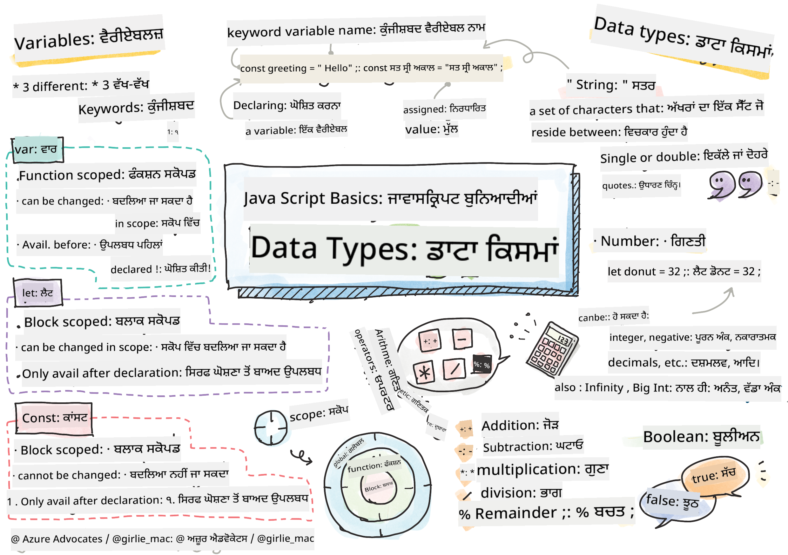

<!--
CO_OP_TRANSLATOR_METADATA:
{
  "original_hash": "fc6aef8ecfdd5b0ad2afa6e6ba52bfde",
  "translation_date": "2025-08-25T21:55:04+00:00",
  "source_file": "2-js-basics/1-data-types/README.md",
  "language_code": "pa"
}
-->
# ਜਾਵਾਸਕ੍ਰਿਪਟ ਬੇਸਿਕਸ: ਡਾਟਾ ਟਾਈਪਸ


> ਸਕੈਚਨੋਟ [Tomomi Imura](https://twitter.com/girlie_mac) ਵੱਲੋਂ

## ਲੈਕਚਰ ਤੋਂ ਪਹਿਲਾਂ ਕਵਿਜ਼
[ਲੈਕਚਰ ਤੋਂ ਪਹਿਲਾਂ ਕਵਿਜ਼](https://ff-quizzes.netlify.app/web/quiz/7)

ਇਸ ਪਾਠ ਵਿੱਚ ਜਾਵਾਸਕ੍ਰਿਪਟ ਦੀ ਬੁਨਿਆਦੀਆਂ ਨੂੰ ਕਵਰ ਕੀਤਾ ਗਿਆ ਹੈ, ਜੋ ਵੈੱਬ 'ਤੇ ਇੰਟਰਐਕਟਿਵਿਟੀ ਪ੍ਰਦਾਨ ਕਰਦਾ ਹੈ।

> ਤੁਸੀਂ ਇਹ ਪਾਠ [Microsoft Learn](https://docs.microsoft.com/learn/modules/web-development-101-variables/?WT.mc_id=academic-77807-sagibbon) 'ਤੇ ਲੈ ਸਕਦੇ ਹੋ!

[](https://youtube.com/watch?v=JNIXfGiDWM8 "Variables in JavaScript")

[](https://youtube.com/watch?v=AWfA95eLdq8 "Data Types in JavaScript")

> 🎥 ਉੱਪਰ ਦਿੱਤੀਆਂ ਤਸਵੀਰਾਂ 'ਤੇ ਕਲਿਕ ਕਰੋ ਵੈਰੀਏਬਲਜ਼ ਅਤੇ ਡਾਟਾ ਟਾਈਪਸ ਬਾਰੇ ਵੀਡੀਓਜ਼ ਦੇਖਣ ਲਈ

ਆਓ ਵੈਰੀਏਬਲਜ਼ ਅਤੇ ਉਹਨਾਂ ਵਿੱਚ ਸਟੋਰ ਕੀਤੇ ਜਾਣ ਵਾਲੇ ਡਾਟਾ ਟਾਈਪਸ ਨਾਲ ਸ਼ੁਰੂ ਕਰੀਏ!

## ਵੈਰੀਏਬਲਜ਼

ਵੈਰੀਏਬਲਜ਼ ਉਹ ਮੁੱਲ ਸਟੋਰ ਕਰਦੇ ਹਨ ਜਿਨ੍ਹਾਂ ਨੂੰ ਤੁਹਾਡੇ ਕੋਡ ਵਿੱਚ ਵਰਤਿਆ ਅਤੇ ਬਦਲਿਆ ਜਾ ਸਕਦਾ ਹੈ।

ਵੈਰੀਏਬਲ ਬਣਾਉਣ ਅਤੇ **ਡਿਕਲੇਅਰ** ਕਰਨ ਦਾ ਸਿੰਟੈਕਸ ਹੁੰਦਾ ਹੈ **[keyword] [name]**। ਇਹ ਦੋ ਹਿੱਸਿਆਂ 'ਤੇ ਆਧਾਰਿਤ ਹੁੰਦਾ ਹੈ:

- **ਕੀਵਰਡ**। ਕੀਵਰਡ `let` ਜਾਂ `var` ਹੋ ਸਕਦੇ ਹਨ।  

✅ ਕੀਵਰਡ `let` ES6 ਵਿੱਚ ਪੇਸ਼ ਕੀਤਾ ਗਿਆ ਸੀ ਅਤੇ ਇਹ ਤੁਹਾਡੇ ਵੈਰੀਏਬਲ ਨੂੰ _ਬਲਾਕ ਸਕੋਪ_ ਦਿੰਦਾ ਹੈ। ਇਹ ਸਿਫਾਰਸ਼ ਕੀਤੀ ਜਾਂਦੀ ਹੈ ਕਿ ਤੁਸੀਂ `var` ਦੀ ਬਜਾਏ `let` ਵਰਤੋ। ਅਸੀਂ ਅਗਲੇ ਹਿੱਸਿਆਂ ਵਿੱਚ ਬਲਾਕ ਸਕੋਪਸ ਬਾਰੇ ਹੋਰ ਵਿਸਥਾਰ ਨਾਲ ਚਰਚਾ ਕਰਾਂਗੇ।
- **ਵੈਰੀਏਬਲ ਦਾ ਨਾਮ**, ਇਹ ਉਹ ਨਾਮ ਹੈ ਜੋ ਤੁਸੀਂ ਖੁਦ ਚੁਣਦੇ ਹੋ।

### ਟਾਸਕ - ਵੈਰੀਏਬਲਜ਼ ਨਾਲ ਕੰਮ ਕਰਨਾ

1. **ਵੈਰੀਏਬਲ ਡਿਕਲੇਅਰ ਕਰੋ**। ਆਓ `let` ਕੀਵਰਡ ਦੀ ਵਰਤੋਂ ਕਰਕੇ ਇੱਕ ਵੈਰੀਏਬਲ ਡਿਕਲੇਅਰ ਕਰੀਏ:

    ```javascript
    let myVariable;
    ```

   `myVariable` ਹੁਣ `let` ਕੀਵਰਡ ਦੀ ਵਰਤੋਂ ਕਰਕੇ ਡਿਕਲੇਅਰ ਕੀਤਾ ਗਿਆ ਹੈ। ਇਸ ਵਿੱਚ ਇਸ ਸਮੇਂ ਕੋਈ ਮੁੱਲ ਨਹੀਂ ਹੈ।

1. **ਮੁੱਲ ਅਸਾਈਨ ਕਰੋ**। ਇੱਕ ਵੈਰੀਏਬਲ ਵਿੱਚ ਮੁੱਲ ਸਟੋਰ ਕਰਨ ਲਈ `=` ਓਪਰੇਟਰ ਦੀ ਵਰਤੋਂ ਕਰੋ, ਜਿਸ ਤੋਂ ਬਾਅਦ ਉਮੀਦ ਕੀਤੀ ਜਾਣ ਵਾਲੀ ਵੈਲਯੂ ਆਉਂਦੀ ਹੈ।

    ```javascript
    myVariable = 123;
    ```

   > ਨੋਟ: ਇਸ ਪਾਠ ਵਿੱਚ `=` ਦੀ ਵਰਤੋਂ "ਅਸਾਈਨਮੈਂਟ ਓਪਰੇਟਰ" ਦੇ ਤੌਰ 'ਤੇ ਕੀਤੀ ਗਈ ਹੈ, ਜੋ ਵੈਰੀਏਬਲ ਨੂੰ ਮੁੱਲ ਸੈਟ ਕਰਨ ਲਈ ਵਰਤਿਆ ਜਾਂਦਾ ਹੈ। ਇਹ ਸਮਾਨਤਾ ਨੂੰ ਦਰਸਾਉਂਦਾ ਨਹੀਂ ਹੈ।

   `myVariable` ਹੁਣ 123 ਦੇ ਮੁੱਲ ਨਾਲ *ਇਨੀਸ਼ੀਅਲਾਈਜ਼* ਕੀਤਾ ਗਿਆ ਹੈ।

1. **ਰਿਫੈਕਟਰ ਕਰੋ**। ਆਪਣਾ ਕੋਡ ਹੇਠਾਂ ਦਿੱਤੇ ਬਿਆਨ ਨਾਲ ਬਦਲੋ।

    ```javascript
    let myVariable = 123;
    ```

    ਉੱਪਰ ਦਿੱਤਾ ਗਿਆ ਬਿਆਨ _ਸਪਸ਼ਟ ਇਨੀਸ਼ੀਅਲਾਈਜ਼ੇਸ਼ਨ_ ਕਿਹਾ ਜਾਂਦਾ ਹੈ, ਜਦੋਂ ਇੱਕ ਵੈਰੀਏਬਲ ਡਿਕਲੇਅਰ ਕੀਤਾ ਜਾਂਦਾ ਹੈ ਅਤੇ ਇੱਕ ਹੀ ਸਮੇਂ ਵਿੱਚ ਮੁੱਲ ਅਸਾਈਨ ਕੀਤਾ ਜਾਂਦਾ ਹੈ।

1. **ਵੈਰੀਏਬਲ ਦਾ ਮੁੱਲ ਬਦਲੋ**। ਹੇਠਾਂ ਦਿੱਤੇ ਤਰੀਕੇ ਨਾਲ ਵੈਰੀਏਬਲ ਦਾ ਮੁੱਲ ਬਦਲੋ:

   ```javascript
   myVariable = 321;
   ```

   ਜਦੋਂ ਇੱਕ ਵੈਰੀਏਬਲ ਡਿਕਲੇਅਰ ਕੀਤਾ ਜਾਂਦਾ ਹੈ, ਤਾਂ ਤੁਸੀਂ ਆਪਣੇ ਕੋਡ ਵਿੱਚ ਕਿਸੇ ਵੀ ਸਮੇਂ `=` ਓਪਰੇਟਰ ਅਤੇ ਨਵੇਂ ਮੁੱਲ ਨਾਲ ਇਸਦਾ ਮੁੱਲ ਬਦਲ ਸਕਦੇ ਹੋ।

   ✅ ਇਸਨੂੰ ਅਜ਼ਮਾਓ! ਤੁਸੀਂ ਜਾਵਾਸਕ੍ਰਿਪਟ ਨੂੰ ਸਿੱਧੇ ਆਪਣੇ ਬ੍ਰਾਊਜ਼ਰ ਵਿੱਚ ਲਿਖ ਸਕਦੇ ਹੋ। ਇੱਕ ਬ੍ਰਾਊਜ਼ਰ ਵਿੰਡੋ ਖੋਲ੍ਹੋ ਅਤੇ ਡਿਵੈਲਪਰ ਟੂਲਜ਼ 'ਤੇ ਜਾਓ। ਕਨਸੋਲ ਵਿੱਚ, ਤੁਹਾਨੂੰ ਇੱਕ ਪ੍ਰਾਂਪਟ ਮਿਲੇਗਾ; `let myVariable = 123` ਲਿਖੋ, ਰਿਟਰਨ ਦਬਾਓ, ਫਿਰ `myVariable` ਲਿਖੋ। ਕੀ ਹੁੰਦਾ ਹੈ? ਨੋਟ ਕਰੋ, ਤੁਸੀਂ ਇਹ ਧਾਰਨਾਵਾਂ ਅਗਲੇ ਪਾਠਾਂ ਵਿੱਚ ਹੋਰ ਸਿੱਖੋਗੇ।

## ਕਾਂਸਟੈਂਟਸ

ਕਾਂਸਟੈਂਟ ਦੀ ਡਿਕਲੇਅਰੇਸ਼ਨ ਅਤੇ ਇਨੀਸ਼ੀਅਲਾਈਜ਼ੇਸ਼ਨ ਵੈਰੀਏਬਲ ਦੇ ਸਮਾਨ ਹੀ ਹੈ, ਸਿਵਾਏ `const` ਕੀਵਰਡ ਦੇ। ਕਾਂਸਟੈਂਟ ਆਮ ਤੌਰ 'ਤੇ ਸਾਰੇ ਅੱਖਰਾਂ ਵਿੱਚ ਲਿਖੇ ਜਾਂਦੇ ਹਨ।

```javascript
const MY_VARIABLE = 123;
```

ਕਾਂਸਟੈਂਟ ਵੈਰੀਏਬਲਜ਼ ਦੇ ਸਮਾਨ ਹਨ, ਪਰ ਦੋ ਅੰਤਰ ਹਨ:

- **ਮੁੱਲ ਹੋਣਾ ਲਾਜ਼ਮੀ ਹੈ**। ਕਾਂਸਟੈਂਟ ਨੂੰ ਇਨੀਸ਼ੀਅਲਾਈਜ਼ ਕੀਤਾ ਜਾਣਾ ਚਾਹੀਦਾ ਹੈ, ਨਹੀਂ ਤਾਂ ਕੋਡ ਚਲਾਉਣ ਸਮੇਂ ਗਲਤੀ ਆਵੇਗੀ।
- **ਰਿਫਰੈਂਸ ਬਦਲਿਆ ਨਹੀਂ ਜਾ ਸਕਦਾ**। ਕਾਂਸਟੈਂਟ ਦੇ ਰਿਫਰੈਂਸ ਨੂੰ ਇੱਕ ਵਾਰ ਇਨੀਸ਼ੀਅਲਾਈਜ਼ ਹੋਣ ਤੋਂ ਬਾਅਦ ਬਦਲਿਆ ਨਹੀਂ ਜਾ ਸਕਦਾ, ਨਹੀਂ ਤਾਂ ਗਲਤੀ ਆਵੇਗੀ। ਆਓ ਦੋ ਉਦਾਹਰਣਾਂ 'ਤੇ ਨਜ਼ਰ ਮਾਰਦੇ ਹਾਂ:
   - **ਸਧਾਰਨ ਮੁੱਲ**। ਹੇਠਾਂ ਦਿੱਤਾ ਗਿਆ ਸਵੀਕਾਰਯੋਗ ਨਹੀਂ ਹੈ:
   
      ```javascript
      const PI = 3;
      PI = 4; // not allowed
      ```
 
   - **ਆਬਜੈਕਟ ਰਿਫਰੈਂਸ ਸੁਰੱਖਿਅਤ ਹੈ**। ਹੇਠਾਂ ਦਿੱਤਾ ਗਿਆ ਸਵੀਕਾਰਯੋਗ ਨਹੀਂ ਹੈ।
   
      ```javascript
      const obj = { a: 3 };
      obj = { b: 5 } // not allowed
      ```

    - **ਆਬਜੈਕਟ ਦਾ ਮੁੱਲ ਸੁਰੱਖਿਅਤ ਨਹੀਂ ਹੈ**। ਹੇਠਾਂ ਦਿੱਤਾ ਗਿਆ ਸਵੀਕਾਰਯੋਗ ਹੈ:
    
      ```javascript
      const obj = { a: 3 };
      obj.a = 5;  // allowed
      ```

      ਉੱਪਰ ਤੁਸੀਂ ਆਬਜੈਕਟ ਦੇ ਮੁੱਲ ਨੂੰ ਬਦਲ ਰਹੇ ਹੋ ਪਰ ਰਿਫਰੈਂਸ ਨੂੰ ਨਹੀਂ, ਜੋ ਇਸਨੂੰ ਸਵੀਕਾਰਯੋਗ ਬਣਾਉਂਦਾ ਹੈ।

   > ਨੋਟ ਕਰੋ, ਇੱਕ `const` ਦਾ ਮਤਲਬ ਹੈ ਕਿ ਰਿਫਰੈਂਸ ਨੂੰ ਦੁਬਾਰਾ ਅਸਾਈਨ ਕਰਨ ਤੋਂ ਸੁਰੱਖਿਅਤ ਕੀਤਾ ਗਿਆ ਹੈ। ਹਾਲਾਂਕਿ ਮੁੱਲ _ਅਪਰਿਵਰਤਨਸ਼ੀਲ_ ਨਹੀਂ ਹੈ ਅਤੇ ਇਹ ਬਦਲ ਸਕਦਾ ਹੈ, ਖਾਸ ਕਰਕੇ ਜੇਕਰ ਇਹ ਇੱਕ ਜਟਿਲ ਬਣਤਰ ਜਿਵੇਂ ਕਿ ਆਬਜੈਕਟ ਹੈ।

## ਡਾਟਾ ਟਾਈਪਸ

ਵੈਰੀਏਬਲਜ਼ ਵੱਖ-ਵੱਖ ਕਿਸਮ ਦੇ ਮੁੱਲ ਸਟੋਰ ਕਰ ਸਕਦੇ ਹਨ, ਜਿਵੇਂ ਕਿ ਨੰਬਰ ਅਤੇ ਟੈਕਸਟ। ਇਹ ਵੱਖ-ਵੱਖ ਕਿਸਮ ਦੇ ਮੁੱਲ **ਡਾਟਾ ਟਾਈਪਸ** ਦੇ ਤੌਰ 'ਤੇ ਜਾਣੇ ਜਾਂਦੇ ਹਨ। ਡਾਟਾ ਟਾਈਪਸ ਸੌਫਟਵੇਅਰ ਡਿਵੈਲਪਮੈਂਟ ਦਾ ਇੱਕ ਮਹੱਤਵਪੂਰਨ ਹਿੱਸਾ ਹਨ ਕਿਉਂਕਿ ਇਹ ਡਿਵੈਲਪਰਾਂ ਨੂੰ ਇਹ ਫੈਸਲਾ ਕਰਨ ਵਿੱਚ ਮਦਦ ਕਰਦੇ ਹਨ ਕਿ ਕੋਡ ਕਿਵੇਂ ਲਿਖਿਆ ਜਾਣਾ ਚਾਹੀਦਾ ਹੈ ਅਤੇ ਸੌਫਟਵੇਅਰ ਕਿਵੇਂ ਚੱਲਣਾ ਚਾਹੀਦਾ ਹੈ। ਇਸ ਤੋਂ ਇਲਾਵਾ, ਕੁਝ ਡਾਟਾ ਟਾਈਪਸ ਵਿੱਚ ਵਿਲੱਖਣ ਵਿਸ਼ੇਸ਼ਤਾਵਾਂ ਹੁੰਦੀਆਂ ਹਨ ਜੋ ਕਿਸੇ ਮੁੱਲ ਵਿੱਚ ਹੋਰ ਜਾਣਕਾਰੀ ਪ੍ਰਾਪਤ ਕਰਨ ਵਿੱਚ ਮਦਦ ਕਰਦੀਆਂ ਹਨ।

✅ ਡਾਟਾ ਟਾਈਪਸ ਨੂੰ ਜਾਵਾਸਕ੍ਰਿਪਟ ਡਾਟਾ ਪ੍ਰਿਮਿਟਿਵਜ਼ ਵੀ ਕਿਹਾ ਜਾਂਦਾ ਹੈ, ਕਿਉਂਕਿ ਇਹ ਭਾਸ਼ਾ ਦੁਆਰਾ ਪ੍ਰਦਾਨ ਕੀਤੇ ਗਏ ਸਭ ਤੋਂ ਨੀਵੇਂ ਪੱਧਰ ਦੇ ਡਾਟਾ ਟਾਈਪਸ ਹਨ। ਪ੍ਰਿਮਿਟਿਵਜ਼ ਦੀ 7 ਕਿਸਮਾਂ ਹਨ: string, number, bigint, boolean, undefined, null ਅਤੇ symbol। ਇੱਕ ਮਿੰਟ ਲਓ ਅਤੇ ਸੋਚੋ ਕਿ ਇਹ ਪ੍ਰਿਮਿਟਿਵਜ਼ ਕੀ ਦਰਸਾਉਂਦੇ ਹਨ। `zebra` ਕੀ ਹੈ? `0` ਬਾਰੇ ਕੀ? `true`?

### ਨੰਬਰ

ਪਿਛਲੇ ਭਾਗ ਵਿੱਚ, `myVariable` ਦਾ ਮੁੱਲ ਇੱਕ ਨੰਬਰ ਡਾਟਾ ਟਾਈਪ ਸੀ।

`let myVariable = 123;`

ਵੈਰੀਏਬਲਜ਼ ਸਾਰੇ ਕਿਸਮ ਦੇ ਨੰਬਰ ਸਟੋਰ ਕਰ ਸਕਦੇ ਹਨ, ਜਿਵੇਂ ਕਿ ਦਸ਼ਮਲਵ ਜਾਂ ਨਕਾਰਾਤਮਕ ਨੰਬਰ। ਨੰਬਰਾਂ ਨੂੰ ਗਣਿਤ ਓਪਰੇਟਰਾਂ ਨਾਲ ਵੀ ਵਰਤਿਆ ਜਾ ਸਕਦਾ ਹੈ, ਜੋ [ਅਗਲੇ ਭਾਗ](../../../../2-js-basics/1-data-types) ਵਿੱਚ ਕਵਰ ਕੀਤੇ ਗਏ ਹਨ।

### ਗਣਿਤ ਓਪਰੇਟਰ

ਗਣਿਤ ਫੰਕਸ਼ਨਾਂ ਨੂੰ ਕਰਨ ਲਈ ਕਈ ਕਿਸਮ ਦੇ ਓਪਰੇਟਰ ਹਨ, ਅਤੇ ਕੁਝ ਹੇਠਾਂ ਦਿੱਤੇ ਗਏ ਹਨ:

| ਚਿੰਨ੍ਹ | ਵੇਰਵਾ                                                                  | ਉਦਾਹਰਣ                          |
| ------ | ---------------------------------------------------------------------- | -------------------------------- |
| `+`    | **ਜੋੜ**: ਦੋ ਨੰਬਰਾਂ ਦਾ ਜੋੜ ਕੱਢਦਾ ਹੈ                                   | `1 + 2 //ਉਮੀਦ ਕੀਤੀ ਜਵਾਬ 3 ਹੈ`   |
| `-`    | **ਘਟਾਓ**: ਦੋ ਨੰਬਰਾਂ ਦਾ ਅੰਤਰ ਕੱਢਦਾ ਹੈ                                 | `1 - 2 //ਉਮੀਦ ਕੀਤੀ ਜਵਾਬ -1 ਹੈ`  |
| `*`    | **ਗੁਣਾ**: ਦੋ ਨੰਬਰਾਂ ਦਾ ਗੁਣਾ ਕੱਢਦਾ ਹੈ                                 | `1 * 2 //ਉਮੀਦ ਕੀਤੀ ਜਵਾਬ 2 ਹੈ`   |
| `/`    | **ਭਾਗ**: ਦੋ ਨੰਬਰਾਂ ਦਾ ਭਾਗ ਕੱਢਦਾ ਹੈ                                   | `1 / 2 //ਉਮੀਦ ਕੀਤੀ ਜਵਾਬ 0.5 ਹੈ` |
| `%`    | **ਬਾਕੀ**: ਦੋ ਨੰਬਰਾਂ ਦੇ ਭਾਗ ਤੋਂ ਬਾਕੀ ਕੱਢਦਾ ਹੈ                         | `1 % 2 //ਉਮੀਦ ਕੀਤੀ ਜਵਾਬ 1 ਹੈ`   |

✅ ਇਸਨੂੰ ਅਜ਼ਮਾਓ! ਆਪਣੇ ਬ੍ਰਾਊਜ਼ਰ ਦੇ ਕਨਸੋਲ ਵਿੱਚ ਇੱਕ ਗਣਿਤੀਕ ਕਾਰਵਾਈ ਅਜ਼ਮਾਓ। ਕੀ ਨਤੀਜੇ ਤੁਹਾਨੂੰ ਹੈਰਾਨ ਕਰਦੇ ਹਨ?

### ਸਟ੍ਰਿੰਗਜ਼

ਸਟ੍ਰਿੰਗਜ਼ ਅੱਖਰਾਂ ਦੇ ਸੈੱਟ ਹੁੰਦੇ ਹਨ ਜੋ ਸਿੰਗਲ ਜਾਂ ਡਬਲ ਕੋਟਸ ਦੇ ਵਿਚਕਾਰ ਹੁੰਦੇ ਹਨ।

- `'ਇਹ ਇੱਕ ਸਟ੍ਰਿੰਗ ਹੈ'`
- `"ਇਹ ਵੀ ਇੱਕ ਸਟ੍ਰਿੰਗ ਹੈ"`
- `let myString = 'ਇਹ ਇੱਕ ਸਟ੍ਰਿੰਗ ਮੁੱਲ ਹੈ ਜੋ ਵੈਰੀਏਬਲ ਵਿੱਚ ਸਟੋਰ ਕੀਤਾ ਗਿਆ ਹੈ';`

ਯਾਦ ਰੱਖੋ ਕਿ ਸਟ੍ਰਿੰਗ ਲਿਖਦੇ ਸਮੇਂ ਕੋਟਸ ਦੀ ਵਰਤੋਂ ਕਰੋ, ਨਹੀਂ ਤਾਂ ਜਾਵਾਸਕ੍ਰਿਪਟ ਮੰਨੇਗਾ ਕਿ ਇਹ ਇੱਕ ਵੈਰੀਏਬਲ ਦਾ ਨਾਮ ਹੈ।

### ਸਟ੍ਰਿੰਗਜ਼ ਨੂੰ ਫਾਰਮੈਟ ਕਰਨਾ

ਸਟ੍ਰਿੰਗਜ਼ ਪਾਠਾਤਮਕ ਹੁੰਦੀਆਂ ਹਨ, ਅਤੇ ਕਈ ਵਾਰ ਇਹਨਾਂ ਨੂੰ ਫਾਰਮੈਟ ਕਰਨ ਦੀ ਲੋੜ ਪੈਂਦੀ ਹੈ।

ਦੋ ਜਾਂ ਵੱਧ ਸਟ੍ਰਿੰਗਜ਼ ਨੂੰ **ਜੋੜਨ** ਲਈ, ਜਾਂ ਇਹਨਾਂ ਨੂੰ ਇਕੱਠੇ ਕਰਨ ਲਈ, `+` ਓਪਰੇਟਰ ਦੀ ਵਰਤੋਂ ਕਰੋ।

```javascript
let myString1 = "Hello";
let myString2 = "World";

myString1 + myString2 + "!"; //HelloWorld!
myString1 + " " + myString2 + "!"; //Hello World!
myString1 + ", " + myString2 + "!"; //Hello, World!

```

✅ ਜਾਵਾਸਕ੍ਰਿਪਟ ਵਿੱਚ `1 + 1 = 2` ਕਿਉਂ ਹੈ, ਪਰ `'1' + '1' = 11` ਕਿਉਂ ਹੈ? ਇਸ ਬਾਰੇ ਸੋਚੋ। `'1' + 1` ਬਾਰੇ ਕੀ?

**ਟੈਂਪਲੇਟ ਲਿਟਰਲਜ਼** ਸਟ੍ਰਿੰਗਜ਼ ਨੂੰ ਫਾਰਮੈਟ ਕਰਨ ਦਾ ਇੱਕ ਹੋਰ ਤਰੀਕਾ ਹਨ, ਪਰ ਕੋਟਸ ਦੀ ਬਜਾਏ ਬੈਕਟਿਕ ਦੀ ਵਰਤੋਂ ਕੀਤੀ ਜਾਂਦੀ ਹੈ। ਜੋ ਕੁਝ ਵੀ ਸਧਾਰਨ ਪਾਠ ਨਹੀਂ ਹੈ, ਉਸਨੂੰ ਪਲੇਸਹੋਲਡਰ `${ }` ਦੇ ਅੰਦਰ ਰੱਖਣਾ ਪੈਂਦਾ ਹੈ। ਇਸ ਵਿੱਚ ਕੋਈ ਵੀ ਵੈਰੀਏਬਲ ਸ਼ਾਮਲ ਹਨ ਜੋ ਸਟ੍ਰਿੰਗਜ਼ ਹੋ ਸਕਦੇ ਹਨ।

```javascript
let myString1 = "Hello";
let myString2 = "World";

`${myString1} ${myString2}!` //Hello World!
`${myString1}, ${myString2}!` //Hello, World!
```

ਤੁਸੀਂ ਆਪਣੇ ਫਾਰਮੈਟਿੰਗ ਦੇ ਲਕਸ਼ਾਂ ਨੂੰ ਕਿਸੇ ਵੀ ਤਰੀਕੇ ਨਾਲ ਹਾਸਲ ਕਰ ਸਕਦੇ ਹੋ, ਪਰ ਟੈਂਪਲੇਟ ਲਿਟਰਲਜ਼ ਖਾਲੀਆਂ ਥਾਵਾਂ ਅਤੇ ਲਾਈਨ ਬ੍ਰੇਕਾਂ ਦਾ ਸਨਮਾਨ ਕਰਨਗੇ।

✅ ਤੁਸੀਂ ਟੈਂਪਲੇਟ ਲਿਟਰਲ ਦੀ ਬਜਾਏ ਸਧਾਰਨ ਸਟ੍ਰਿੰਗ ਕਦੋਂ ਵਰਤੋਗੇ?

### ਬੂਲੀਅਨਜ਼

ਬੂਲੀਅਨਜ਼ ਸਿਰਫ ਦੋ ਮੁੱਲ ਹੋ ਸਕਦੇ ਹਨ: `true` ਜਾਂ `false`। ਬੂਲੀਅਨਜ਼ ਇਹ ਫੈਸਲਾ ਕਰਨ ਵਿੱਚ ਮਦਦ ਕਰਦੇ ਹਨ ਕਿ ਜਦੋਂ ਕੁਝ ਸ਼ਰਤਾਂ ਪੂਰੀਆਂ ਹੁੰਦੀਆਂ ਹਨ, ਤਾਂ ਕਿਹੜੀਆਂ ਕੋਡ ਲਾਈਨਾਂ ਚਲਣੀਆਂ ਚਾਹੀਦੀਆਂ ਹਨ। ਕਈ ਮਾਮਲਿਆਂ ਵਿੱਚ, [ਓਪਰੇਟਰ](../../../../2-js-basics/1-data-types) ਬੂਲੀਅਨ ਦੇ ਮੁੱਲ ਨੂੰ ਸੈਟ ਕਰਨ ਵਿੱਚ ਮਦਦ ਕਰਦੇ ਹਨ ਅਤੇ ਤੁਸੀਂ ਅਕਸਰ ਵੇਖੋਗੇ ਕਿ ਵੈਰੀਏਬਲਜ਼ ਨੂੰ ਇਨੀਸ਼ੀਅਲਾਈਜ਼ ਕੀਤਾ ਜਾਂਦਾ ਹੈ ਜਾਂ ਉਹਨਾਂ ਦੇ ਮੁੱਲ ਓਪਰੇਟਰ ਦੀ ਵਰਤੋਂ ਨਾਲ ਅਪਡੇਟ ਕੀਤੇ ਜਾਂਦੇ ਹਨ।

- `let myTrueBool = true`
- `let myFalseBool = false`

✅ ਇੱਕ ਵੈਰੀਏਬਲ ਨੂੰ 'truthy' ਮੰਨਿਆ ਜਾ ਸਕਦਾ ਹੈ ਜੇਕਰ ਇਹ ਬੂਲੀਅਨ `true` ਨੂੰ ਮੁੱਲ ਦੇ ਤੌਰ 'ਤੇ ਦੇਖਦਾ ਹੈ। ਦਿਲਚਸਪ ਗੱਲ ਇਹ ਹੈ ਕਿ ਜਾਵਾਸਕ੍ਰਿਪਟ ਵਿੱਚ, [ਸਾਰੇ ਮੁੱਲ truthy ਹਨ ਜਦੋਂ ਤੱਕ ਉਹਨਾਂ ਨੂੰ falsy ਵਜੋਂ ਪਰਿਭਾਸ਼ਿਤ ਨਹੀਂ ਕੀਤਾ ਜਾਂਦਾ](https://developer.mozilla.org/docs/Glossary/Truthy)।

---

## 🚀 ਚੁਣੌਤੀ

ਜਾਵਾਸਕ੍ਰਿਪਟ ਕਈ ਵਾਰ ਡਾਟਾ ਟਾਈਪਸ ਨੂੰ ਸੰਭਾਲਣ ਦੇ ਹੈਰਾਨੀਜਨਕ ਤਰੀਕਿਆਂ ਲਈ ਮਸ਼ਹੂਰ ਹੈ। ਇਹਨਾਂ 'gotchas' ਬਾਰੇ ਕੁਝ ਖੋਜ ਕਰੋ। ਉਦਾਹਰਣ ਲਈ: ਕੇਸ ਸੈਂਸਿਟਿਵਿਟੀ ਤੁਹਾਨੂੰ ਮੁਸੀਬਤ ਵਿੱਚ ਪਾ ਸਕਦੀ ਹੈ! ਆਪਣੇ ਕਨਸੋਲ ਵਿੱਚ ਇਹ ਅਜ਼ਮਾਓ: `let age = 1; let Age = 2; age == Age` (ਇਹ `false` ਰਿਜ਼ਾਲਟ ਕਰਦਾ ਹੈ -- ਕਿਉਂ?). ਹੋਰ ਕਿਹੜੇ gotchas ਤੁਸੀਂ ਲੱਭ ਸਕਦੇ ਹੋ?

## ਲੈਕਚਰ ਤੋਂ ਬਾਅਦ ਕਵਿਜ਼
[ਲੈਕਚਰ ਤੋਂ ਬਾਅਦ ਕਵਿਜ਼](https://ff-quizzes.netlify.app/web/quiz/8)

## ਸਮੀਖਿਆ ਅਤੇ ਸਵੈ ਅਧਿਐਨ

[ਜਾਵਾਸਕ੍ਰਿਪਟ ਅਭਿਆਸਾਂ ਦੀ ਇਸ ਸੂਚੀ](https://css-tricks.com/snippets/javascript/) 'ਤੇ ਨਜ਼ਰ ਮਾਰੋ ਅਤੇ ਇੱਕ ਅਜ਼ਮਾਓ। ਤੁਸੀਂ ਕੀ ਸਿੱਖਿਆ?

## ਅਸਾਈਨਮੈਂਟ

[ਡਾਟਾ ਟਾਈਪਸ ਅਭਿਆਸ](assignment.md)

**ਅਸਵੀਕਾਰਨ**:  
ਇਹ ਦਸਤਾਵੇਜ਼ AI ਅਨੁਵਾਦ ਸੇਵਾ [Co-op Translator](https://github.com/Azure/co-op-translator) ਦੀ ਵਰਤੋਂ ਕਰਕੇ ਅਨੁਵਾਦ ਕੀਤਾ ਗਿਆ ਹੈ। ਜਦੋਂ ਕਿ ਅਸੀਂ ਸਹੀਤਾ ਲਈ ਯਤਨਸ਼ੀਲ ਹਾਂ, ਕਿਰਪਾ ਕਰਕੇ ਧਿਆਨ ਦਿਓ ਕਿ ਸਵੈਚਾਲਿਤ ਅਨੁਵਾਦਾਂ ਵਿੱਚ ਗਲਤੀਆਂ ਜਾਂ ਅਸੁਚਨਾਵਾਂ ਹੋ ਸਕਦੀਆਂ ਹਨ। ਮੂਲ ਦਸਤਾਵੇਜ਼ ਨੂੰ ਇਸਦੀ ਮੂਲ ਭਾਸ਼ਾ ਵਿੱਚ ਅਧਿਕਾਰਤ ਸਰੋਤ ਮੰਨਿਆ ਜਾਣਾ ਚਾਹੀਦਾ ਹੈ। ਮਹੱਤਵਪੂਰਨ ਜਾਣਕਾਰੀ ਲਈ, ਪੇਸ਼ੇਵਰ ਮਨੁੱਖੀ ਅਨੁਵਾਦ ਦੀ ਸਿਫਾਰਸ਼ ਕੀਤੀ ਜਾਂਦੀ ਹੈ। ਇਸ ਅਨੁਵਾਦ ਦੀ ਵਰਤੋਂ ਤੋਂ ਪੈਦਾ ਹੋਣ ਵਾਲੇ ਕਿਸੇ ਵੀ ਗਲਤਫਹਿਮੀ ਜਾਂ ਗਲਤ ਵਿਆਖਿਆ ਲਈ ਅਸੀਂ ਜ਼ਿੰਮੇਵਾਰ ਨਹੀਂ ਹਾਂ।