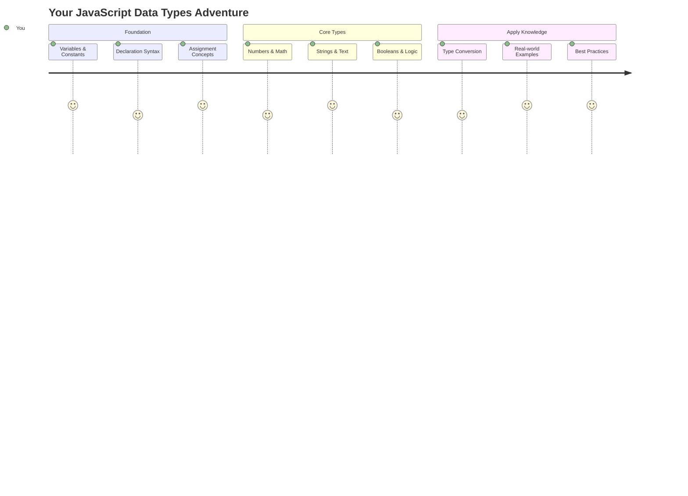
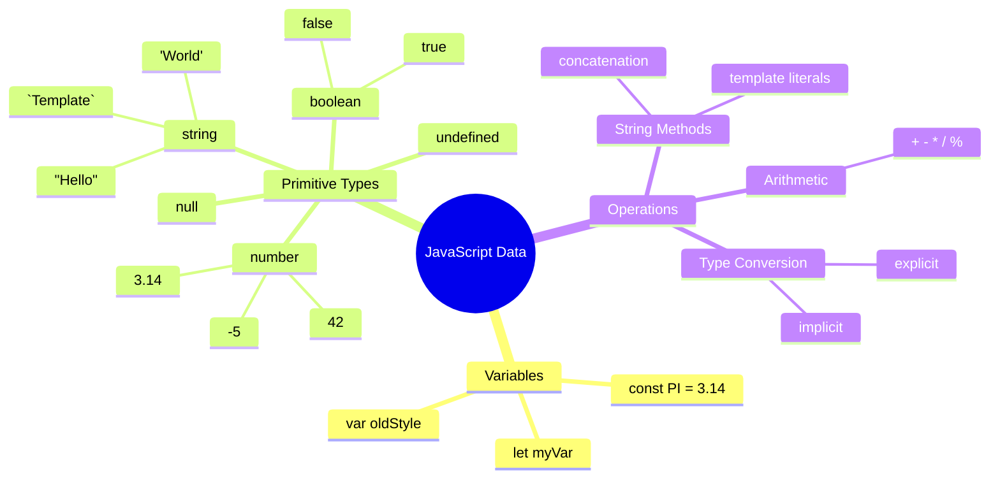
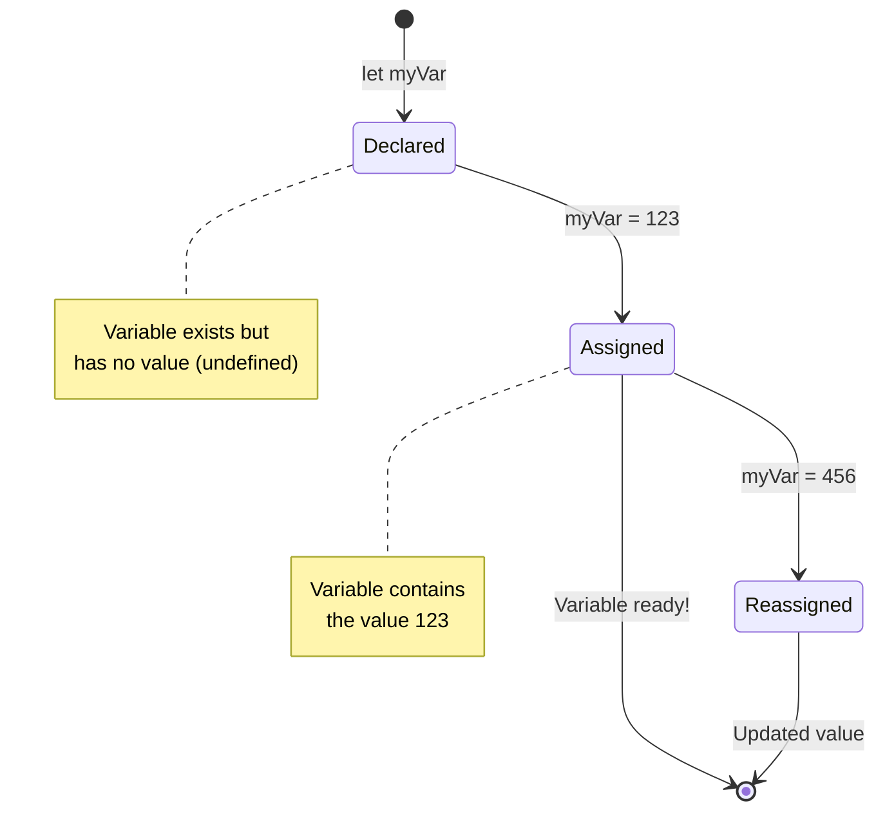
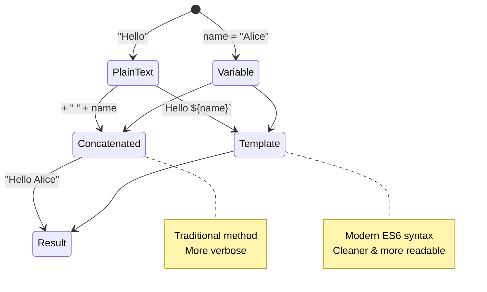
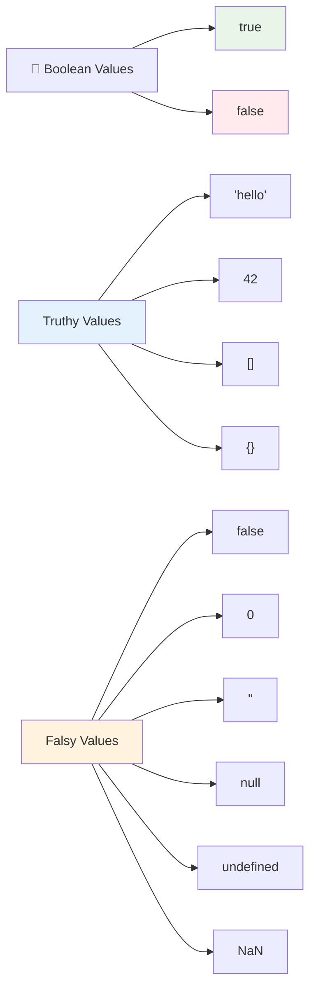
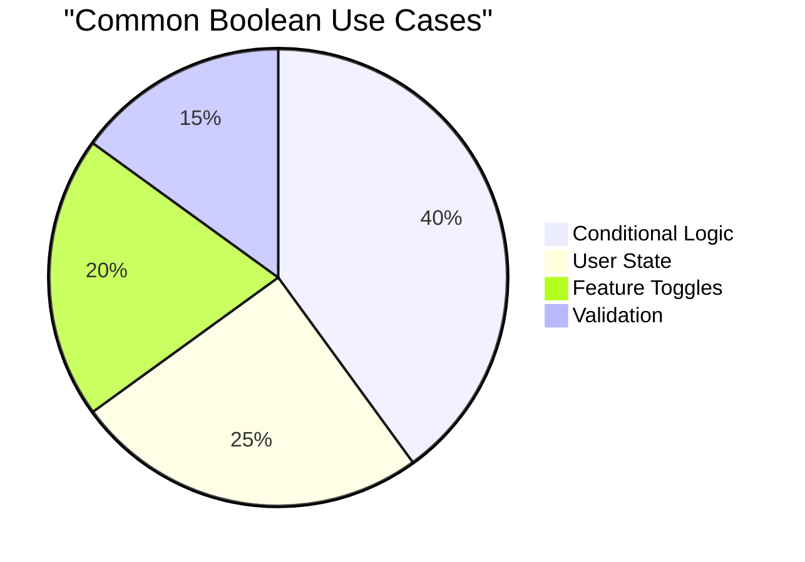
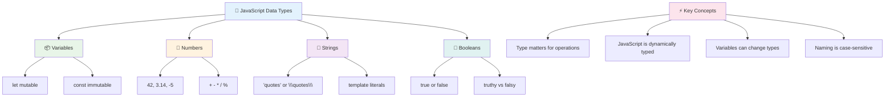
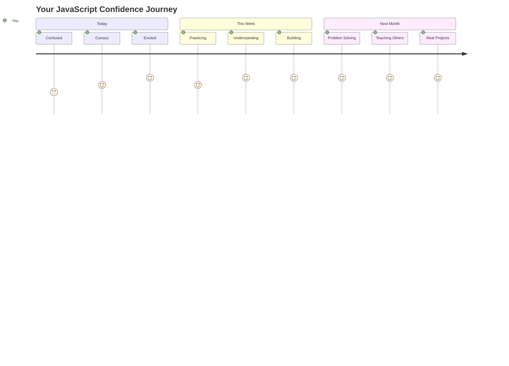

<!--
CO_OP_TRANSLATOR_METADATA:
{
  "original_hash": "672b0bb6e8b431075f3bdb7130590d2d",
  "translation_date": "2025-11-03T16:03:54+00:00",
  "source_file": "2-js-basics/1-data-types/README.md",
  "language_code": "pa"
}
-->
# ਜਾਵਾਸਕ੍ਰਿਪਟ ਬੇਸਿਕਸ: ਡਾਟਾ ਟਾਈਪਸ


> ਸਕੈਚਨੋਟ [Tomomi Imura](https://twitter.com/girlie_mac) ਵੱਲੋਂ



ਡਾਟਾ ਟਾਈਪਸ ਜਾਵਾਸਕ੍ਰਿਪਟ ਦੇ ਮੁੱਢਲੇ ਸੰਕਲਪਾਂ ਵਿੱਚੋਂ ਇੱਕ ਹਨ, ਜੋ ਤੁਹਾਨੂੰ ਹਰ ਪ੍ਰੋਗਰਾਮ ਵਿੱਚ ਮਿਲਣਗੇ ਜੋ ਤੁਸੀਂ ਲਿਖਦੇ ਹੋ। ਡਾਟਾ ਟਾਈਪਸ ਨੂੰ ਉਸ ਪ੍ਰਾਚੀਨ ਲਾਇਬ੍ਰੇਰੀਅਨ ਦੇ ਫਾਈਲਿੰਗ ਸਿਸਟਮ ਵਾਂਗ ਸੋਚੋ ਜੋ ਅਲੈਕਸੈਂਡਰੀਆ ਵਿੱਚ ਵਰਤਿਆ ਜਾਂਦਾ ਸੀ - ਉਹਨਾਂ ਕੋਲ ਕਵਿਤਾ, ਗਣਿਤ ਅਤੇ ਇਤਿਹਾਸਕ ਰਿਕਾਰਡ ਵਾਲੇ ਸਕ੍ਰੋਲਸ ਲਈ ਖਾਸ ਸਥਾਨ ਹੁੰਦੇ ਸਨ। ਜਾਵਾਸਕ੍ਰਿਪਟ ਜਾਣਕਾਰੀ ਨੂੰ ਇਸੇ ਤਰ੍ਹਾਂ ਵੱਖ-ਵੱਖ ਸ਼੍ਰੇਣੀਆਂ ਵਿੱਚ ਸੰਗਠਿਤ ਕਰਦਾ ਹੈ।

ਇਸ ਪਾਠ ਵਿੱਚ, ਅਸੀਂ ਜਾਵਾਸਕ੍ਰਿਪਟ ਦੇ ਮੁੱਖ ਡਾਟਾ ਟਾਈਪਸ ਦੀ ਪੜਚੋਲ ਕਰਾਂਗੇ। ਤੁਸੀਂ ਸੰਖਿਆਵਾਂ, ਲਿਖਤ, ਸੱਚ/ਝੂਠ ਮੁੱਲਾਂ ਨੂੰ ਸੰਭਾਲਣ ਅਤੇ ਸਮਝਣ ਲਈ ਸਿੱਖੋਗੇ ਕਿ ਤੁਹਾਡੇ ਪ੍ਰੋਗਰਾਮਾਂ ਲਈ ਸਹੀ ਟਾਈਪ ਚੁਣਨਾ ਕਿਉਂ ਜ਼ਰੂਰੀ ਹੈ। ਇਹ ਸੰਕਲਪ ਸ਼ੁਰੂ ਵਿੱਚ ਅਜੀਬ ਲੱਗ ਸਕਦੇ ਹਨ, ਪਰ ਅਭਿਆਸ ਨਾਲ, ਇਹ ਤੁਹਾਡੇ ਲਈ ਆਮ ਹੋ ਜਾਣਗੇ।

ਡਾਟਾ ਟਾਈਪਸ ਨੂੰ ਸਮਝਣਾ ਜਾਵਾਸਕ੍ਰਿਪਟ ਵਿੱਚ ਹੋਰ ਸਭ ਕੁਝ ਸਪਸ਼ਟ ਕਰ ਦੇਵੇਗਾ। ਜਿਵੇਂ ਕਿ ਆਰਕੀਟੈਕਟ ਨੂੰ ਕੈਥੀਡ੍ਰਲ ਬਣਾਉਣ ਤੋਂ ਪਹਿਲਾਂ ਵੱਖ-ਵੱਖ ਇਮਾਰਤੀ ਸਮੱਗਰੀਆਂ ਨੂੰ ਸਮਝਣਾ ਪੈਂਦਾ ਹੈ, ਇਹ ਮੁੱਢਲੇ ਸੰਕਲਪ ਤੁਹਾਡੇ ਦੁਆਰਾ ਅੱਗੇ ਬਣਾਈ ਗਈ ਹਰ ਚੀਜ਼ ਦਾ ਆਧਾਰ ਬਣਨਗੇ।

## ਪਾਠ ਤੋਂ ਪਹਿਲਾਂ ਕਵਿਜ਼
[ਪਾਠ ਤੋਂ ਪਹਿਲਾਂ ਕਵਿਜ਼](https://ff-quizzes.netlify.app/web/)

ਇਹ ਪਾਠ ਜਾਵਾਸਕ੍ਰਿਪਟ ਦੇ ਬੁਨਿਆਦੀ ਪਹਲੂਆਂ ਨੂੰ ਕਵਰ ਕਰਦਾ ਹੈ, ਜੋ ਵੈੱਬ 'ਤੇ ਇੰਟਰਐਕਟਿਵਿਟੀ ਪ੍ਰਦਾਨ ਕਰਦਾ ਹੈ।

> ਤੁਸੀਂ ਇਹ ਪਾਠ [Microsoft Learn](https://docs.microsoft.com/learn/modules/web-development-101-variables/?WT.mc_id=academic-77807-sagibbon) 'ਤੇ ਲੈ ਸਕਦੇ ਹੋ!

[](https://youtube.com/watch?v=JNIXfGiDWM8 "Variables in JavaScript")

[](https://youtube.com/watch?v=AWfA95eLdq8 "Data Types in JavaScript")

> 🎥 ਉੱਪਰ ਦਿੱਤੀਆਂ ਤਸਵੀਰਾਂ 'ਤੇ ਕਲਿਕ ਕਰੋ ਜਾਵਾਸਕ੍ਰਿਪਟ ਵਿੱਚ ਵੈਰੀਏਬਲ ਅਤੇ ਡਾਟਾ ਟਾਈਪਸ ਬਾਰੇ ਵੀਡੀਓਜ਼ ਦੇਖਣ ਲਈ

ਆਓ ਵੈਰੀਏਬਲ ਅਤੇ ਉਹਨਾਂ ਡਾਟਾ ਟਾਈਪਸ ਨਾਲ ਸ਼ੁਰੂ ਕਰੀਏ ਜੋ ਉਹਨਾਂ ਨੂੰ ਭਰਦੇ ਹਨ!



## ਵੈਰੀਏਬਲ

ਵੈਰੀਏਬਲ ਪ੍ਰੋਗਰਾਮਿੰਗ ਵਿੱਚ ਬੁਨਿਆਦੀ ਇਮਾਰਤੀ ਬਲਾਕ ਹਨ। ਜਿਵੇਂ ਮੱਧਕਾਲੀ ਕਾਲ ਦੇ ਰਸਾਇਨ ਵਿਗਿਆਨੀਆਂ ਨੇ ਵੱਖ-ਵੱਖ ਪਦਾਰਥਾਂ ਨੂੰ ਸਟੋਰ ਕਰਨ ਲਈ ਲੇਬਲ ਵਾਲੇ ਜਾਰ ਵਰਤੇ, ਵੈਰੀਏਬਲ ਤੁਹਾਨੂੰ ਜਾਣਕਾਰੀ ਸਟੋਰ ਕਰਨ ਅਤੇ ਇਸ ਨੂੰ ਇੱਕ ਵਰਣਨਾਤਮਕ ਨਾਮ ਦੇਣ ਦੀ ਆਗਿਆ ਦਿੰਦੇ ਹਨ ਤਾਂ ਜੋ ਤੁਸੀਂ ਇਸਨੂੰ ਬਾਅਦ ਵਿੱਚ ਰਿਫਰ ਕਰ ਸਕੋ। ਕਿਸੇ ਦੀ ਉਮਰ ਯਾਦ ਰੱਖਣ ਦੀ ਲੋੜ ਹੈ? ਇਸਨੂੰ `age` ਨਾਮ ਦੇ ਵੈਰੀਏਬਲ ਵਿੱਚ ਸਟੋਰ ਕਰੋ। ਕਿਸੇ ਯੂਜ਼ਰ ਦਾ ਨਾਮ ਟ੍ਰੈਕ ਕਰਨਾ ਚਾਹੁੰਦੇ ਹੋ? ਇਸਨੂੰ `userName` ਵਿੱਚ ਰੱਖੋ।

ਅਸੀਂ ਜਾਵਾਸਕ੍ਰਿਪਟ ਵਿੱਚ ਵੈਰੀਏਬਲ ਬਣਾਉਣ ਦੇ ਆਧੁਨਿਕ ਤਰੀਕੇ 'ਤੇ ਧਿਆਨ ਦੇਵਾਂਗੇ। ਇੱਥੇ ਤੁਸੀਂ ਜੋ ਤਕਨੀਕਾਂ ਸਿੱਖੋਗੇ ਉਹ ਜ਼ੁਬਾਨ ਦੇ ਵਿਕਾਸ ਦੇ ਸਾਲਾਂ ਅਤੇ ਪ੍ਰੋਗਰਾਮਿੰਗ ਕਮਿਊਨਿਟੀ ਦੁਆਰਾ ਵਿਕਸਿਤ ਕੀਤੀਆਂ ਸ੍ਰੇਸ਼ਠ ਅਭਿਆਸਾਂ ਦਾ ਪ੍ਰਤੀਨਿਧਿਤ ਕਰਦੀਆਂ ਹਨ।

ਵੈਰੀਏਬਲ ਬਣਾਉਣ ਅਤੇ **ਘੋਸ਼ਿਤ ਕਰਨ** ਦਾ ਸਿੰਟੈਕਸ ਹੈ **[keyword] [name]**। ਇਹ ਦੋ ਹਿੱਸਿਆਂ ਤੋਂ ਬਣਿਆ ਹੈ:

- **ਕੀਵਰਡ**। ਉਹ ਵੈਰੀਏਬਲ ਲਈ `let` ਵਰਤੋ ਜੋ ਬਦਲ ਸਕਦੇ ਹਨ, ਜਾਂ ਉਹ ਮੁੱਲਾਂ ਲਈ `const` ਜੋ ਸਥਿਰ ਰਹਿੰਦੇ ਹਨ।
- **ਵੈਰੀਏਬਲ ਦਾ ਨਾਮ**, ਇਹ ਇੱਕ ਵਰਣਨਾਤਮਕ ਨਾਮ ਹੈ ਜੋ ਤੁਸੀਂ ਖੁਦ ਚੁਣਦੇ ਹੋ।

✅ ਕੀਵਰਡ `let` ES6 ਵਿੱਚ ਪੇਸ਼ ਕੀਤਾ ਗਿਆ ਸੀ ਅਤੇ ਤੁਹਾਡੇ ਵੈਰੀਏਬਲ ਨੂੰ ਇੱਕ _ਬਲਾਕ ਸਕੋਪ_ ਦਿੰਦਾ ਹੈ। ਇਹ ਸਿਫਾਰਸ਼ ਕੀਤੀ ਜਾਂਦੀ ਹੈ ਕਿ ਤੁਸੀਂ ਪੁਰਾਣੇ `var` ਕੀਵਰਡ ਦੀ ਬਜਾਏ `let` ਜਾਂ `const` ਵਰਤੋ। ਅਸੀਂ ਅਗਲੇ ਹਿੱਸਿਆਂ ਵਿੱਚ ਬਲਾਕ ਸਕੋਪਸ ਨੂੰ ਵਧੇਰੇ ਗਹਿਰਾਈ ਨਾਲ ਕਵਰ ਕਰਾਂਗੇ।

### ਟਾਸਕ - ਵੈਰੀਏਬਲ ਨਾਲ ਕੰਮ ਕਰਨਾ

1. **ਵੈਰੀਏਬਲ ਘੋਸ਼ਿਤ ਕਰੋ**। ਆਓ ਆਪਣਾ ਪਹਿਲਾ ਵੈਰੀਏਬਲ ਬਣਾਉਣ ਨਾਲ ਸ਼ੁਰੂ ਕਰੀਏ:

    ```javascript
    let myVariable;
    ```

   **ਇਸ ਨਾਲ ਕੀ ਹਾਸਲ ਹੁੰਦਾ ਹੈ:**
   - ਇਹ ਜਾਵਾਸਕ੍ਰਿਪਟ ਨੂੰ `myVariable` ਨਾਮਕ ਸਟੋਰੇਜ ਸਥਾਨ ਬਣਾਉਣ ਲਈ ਕਹਿੰਦਾ ਹੈ
   - ਜਾਵਾਸਕ੍ਰਿਪਟ ਇਸ ਵੈਰੀਏਬਲ ਲਈ ਮੈਮਰੀ ਵਿੱਚ ਸਥਾਨ ਅਲਾਟ ਕਰਦਾ ਹੈ
   - ਵੈਰੀਏਬਲ ਦੇ ਕੋਲ ਇਸ ਸਮੇਂ ਕੋਈ ਮੁੱਲ ਨਹੀਂ ਹੈ (undefined)

2. **ਇਸਨੂੰ ਮੁੱਲ ਦਿਓ**। ਹੁਣ ਆਓ ਆਪਣੇ ਵੈਰੀਏਬਲ ਵਿੱਚ ਕੁਝ ਪਾਓ:

    ```javascript
    myVariable = 123;
    ```

   **ਅਸਾਈਨਮੈਂਟ ਕਿਵੇਂ ਕੰਮ ਕਰਦਾ ਹੈ:**
   - `=` ਓਪਰੇਟਰ ਸਾਡੇ ਵੈਰੀਏਬਲ ਨੂੰ ਮੁੱਲ 123 ਅਸਾਈਨ ਕਰਦਾ ਹੈ
   - ਵੈਰੀਏਬਲ ਹੁਣ ਇਸ ਮੁੱਲ ਨੂੰ ਰੱਖਦਾ ਹੈ ਨਾ ਕਿ undefined
   - ਤੁਸੀਂ ਆਪਣੇ ਕੋਡ ਵਿੱਚ ਕਿਤੇ ਵੀ ਇਸ ਮੁੱਲ ਨੂੰ ਰਿਫਰ ਕਰ ਸਕਦੇ ਹੋ `myVariable` ਵਰਤ ਕੇ

   > ਨੋਟ: ਇਸ ਪਾਠ ਵਿੱਚ `=` ਦੇ ਵਰਤੋਂ ਦਾ ਮਤਲਬ ਹੈ ਕਿ ਅਸੀਂ "ਅਸਾਈਨਮੈਂਟ ਓਪਰੇਟਰ" ਦੀ ਵਰਤੋਂ ਕਰਦੇ ਹਾਂ, ਜੋ ਵੈਰੀਏਬਲ ਨੂੰ ਮੁੱਲ ਸੈਟ ਕਰਨ ਲਈ ਵਰਤਿਆ ਜਾਂਦਾ ਹੈ। ਇਹ ਬਰਾਬਰੀ ਨੂੰ ਦਰਸਾਉਂਦਾ ਨਹੀਂ।

3. **ਸਮਾਰਟ ਤਰੀਕੇ ਨਾਲ ਕਰੋ**। ਅਸਲ ਵਿੱਚ, ਆਓ ਉਹ ਦੋ ਕਦਮ ਮਿਲਾ ਕੇ ਕਰੀਏ:

    ```javascript
    let myVariable = 123;
    ```

    **ਇਹ ਤਰੀਕਾ ਜ਼ਿਆਦਾ ਕੁਸ਼ਲ ਹੈ:**
    - ਤੁਸੀਂ ਇੱਕ ਹੀ ਬਿਆਨ ਵਿੱਚ ਵੈਰੀਏਬਲ ਘੋਸ਼ਿਤ ਕਰ ਰਹੇ ਹੋ ਅਤੇ ਮੁੱਲ ਅਸਾਈਨ ਕਰ ਰਹੇ ਹੋ
    - ਇਹ ਡਿਵੈਲਪਰਾਂ ਵਿੱਚ ਮਿਆਰੀ ਅਭਿਆਸ ਹੈ
    - ਇਹ ਕੋਡ ਦੀ ਲੰਬਾਈ ਘਟਾਉਂਦਾ ਹੈ ਜਦੋਂ ਕਿ ਸਪਸ਼ਟਤਾ ਨੂੰ ਬਰਕਰਾਰ ਰੱਖਦਾ ਹੈ

4. **ਆਪਣਾ ਮਨ ਬਦਲੋ**। ਜੇ ਅਸੀਂ ਵੱਖ-ਵੱਖ ਨੰਬਰ ਸਟੋਰ ਕਰਨਾ ਚਾਹੁੰਦੇ ਹਾਂ ਤਾਂ ਕੀ ਹੋਵੇਗਾ?

   ```javascript
   myVariable = 321;
   ```

   **ਰੀਅਸਾਈਨਮੈਂਟ ਨੂੰ ਸਮਝਣਾ:**
   - ਵੈਰੀਏਬਲ ਹੁਣ 321 ਰੱਖਦਾ ਹੈ ਨਾ ਕਿ 123
   - ਪਿਛਲਾ ਮੁੱਲ ਬਦਲਿਆ ਜਾਂਦਾ ਹੈ - ਵੈਰੀਏਬਲ ਇੱਕ ਸਮੇਂ ਵਿੱਚ ਸਿਰਫ ਇੱਕ ਮੁੱਲ ਸਟੋਰ ਕਰਦੇ ਹਨ
   - ਇਹ ਮਿਊਟੇਬਿਲਿਟੀ `let` ਨਾਲ ਘੋਸ਼ਿਤ ਕੀਤੇ ਵੈਰੀਏਬਲ ਦੀ ਮੁੱਖ ਵਿਸ਼ੇਸ਼ਤਾ ਹੈ

   ✅ ਇਸਨੂੰ ਅਜ਼ਮਾਓ! ਤੁਸੀਂ ਆਪਣੇ ਬ੍ਰਾਊਜ਼ਰ ਵਿੱਚ ਸਿੱਧੇ ਜਾਵਾਸਕ੍ਰਿਪਟ ਲਿਖ ਸਕਦੇ ਹੋ। ਇੱਕ ਬ੍ਰਾਊਜ਼ਰ ਵਿੰਡੋ ਖੋਲ੍ਹੋ ਅਤੇ ਡਿਵੈਲਪਰ ਟੂਲਜ਼ ਵਿੱਚ ਜਾਓ। ਕਨਸੋਲ ਵਿੱਚ, ਤੁਹਾਨੂੰ ਇੱਕ ਪ੍ਰੰਪਟ ਮਿਲੇਗਾ; `let myVariable = 123` ਟਾਈਪ ਕਰੋ, ਰਿਟਰਨ ਦਬਾਓ, ਫਿਰ `myVariable` ਟਾਈਪ ਕਰੋ। ਕੀ ਹੁੰਦਾ ਹੈ? ਨੋਟ ਕਰੋ, ਤੁਸੀਂ ਅਗਲੇ ਪਾਠਾਂ ਵਿੱਚ ਇਹ ਸੰਕਲਪ ਵਧੇਰੇ ਸਿੱਖੋਗੇ।

### 🧠 **ਵੈਰੀਏਬਲ ਮਾਸਟਰੀ ਚੈੱਕ: ਆਰਾਮਦਾਇਕ ਹੋਣਾ**

**ਆਓ ਵੇਖੀਏ ਕਿ ਤੁਸੀਂ ਵੈਰੀਏਬਲ ਬਾਰੇ ਕਿਵੇਂ ਮਹਿਸੂਸ ਕਰ ਰਹੇ ਹੋ:**
- ਕੀ ਤੁਸੀਂ ਵੈਰੀਏਬਲ ਨੂੰ ਘੋਸ਼ਿਤ ਕਰਨ ਅਤੇ ਅਸਾਈਨ ਕਰਨ ਦੇ ਫਰਕ ਨੂੰ ਸਮਝਾ ਸਕਦੇ ਹੋ?
- ਕੀ ਹੁੰਦਾ ਹੈ ਜੇ ਤੁਸੀਂ ਵੈਰੀਏਬਲ ਨੂੰ ਘੋਸ਼ਿਤ ਕਰਨ ਤੋਂ ਪਹਿਲਾਂ ਇਸਨੂੰ ਵਰਤਣ ਦੀ ਕੋਸ਼ਿਸ਼ ਕਰੋ?
- ਤੁਸੀਂ ਕਿਸ ਸਮੇਂ `let` ਨੂੰ `const` ਦੇ ਉੱਤੇ ਚੁਣੋਗੇ?



> **ਤੁਰੰਤ ਸੁਝਾਅ**: ਵੈਰੀਏਬਲ ਨੂੰ ਲੇਬਲ ਵਾਲੇ ਸਟੋਰੇਜ ਬਾਕਸ ਵਾਂਗ ਸੋਚੋ। ਤੁਸੀਂ ਬਾਕਸ ਬਣਾਉਂਦੇ ਹੋ (`let`), ਇਸ ਵਿੱਚ ਕੁਝ ਪਾਉਂਦੇ ਹੋ (`=`), ਅਤੇ ਜ਼ਰੂਰਤ ਪੈਣ 'ਤੇ ਸਮੱਗਰੀ ਬਦਲ ਸਕਦੇ ਹੋ!

## ਕਾਂਸਟੈਂਟਸ

ਕਈ ਵਾਰ ਤੁਹਾਨੂੰ ਜਾਣਕਾਰੀ ਸਟੋਰ ਕਰਨ ਦੀ ਲੋੜ ਹੁੰਦੀ ਹੈ ਜੋ ਪ੍ਰੋਗਰਾਮ ਦੇ ਚਲਣ ਦੌਰਾਨ ਕਦੇ ਨਹੀਂ ਬਦਲਣੀ ਚਾਹੀਦੀ। ਕਾਂਸਟੈਂਟਸ ਨੂੰ ਉਹ ਗਣਿਤਕ ਸਿਧਾਂਤਾਂ ਵਾਂਗ ਸੋਚੋ ਜੋ ਯੂਕਲਿਡ ਨੇ ਪ੍ਰਾਚੀਨ ਯੂਨਾਨ ਵਿੱਚ ਸਥਾਪਿਤ ਕੀਤੇ - ਇੱਕ ਵਾਰ ਸਾਬਤ ਅਤੇ ਦਸਤਾਵੇਜ਼ ਬਣਾਉਣ ਤੋਂ ਬਾਅਦ, ਉਹ ਸਾਰੇ ਭਵਿੱਖ ਦੇ ਹਵਾਲੇ ਲਈ ਸਥਿਰ ਰਹੇ।

ਕਾਂਸਟੈਂਟਸ ਵੈਰੀਏਬਲਾਂ ਵਾਂਗ ਹੀ ਕੰਮ ਕਰਦੇ ਹਨ, ਪਰ ਇੱਕ ਮਹੱਤਵਪੂਰਨ ਪਾਬੰਦੀ ਨਾਲ: ਜਦੋਂ ਤੁਸੀਂ ਉਹਨਾਂ ਦਾ ਮੁੱਲ ਅਸਾਈਨ ਕਰਦੇ ਹੋ, ਇਸਨੂੰ ਬਦਲਿਆ ਨਹੀਂ ਜਾ ਸਕਦਾ। ਇਹ ਅਸਥਿਰਤਾ ਤੁਹਾਡੇ ਪ੍ਰੋਗਰਾਮ ਵਿੱਚ ਮਹੱਤਵਪੂਰਨ ਮੁੱਲਾਂ ਨੂੰ ਅਨਜਾਣੇ ਤਬਦੀਲੀਆਂ ਤੋਂ ਰੋਕਣ ਵਿੱਚ ਮਦਦ ਕਰਦੀ ਹੈ।

ਕਾਂਸਟੈਂਟ ਦੇ ਘੋਸ਼ਣਾ ਅਤੇ ਸ਼ੁਰੂਆਤ ਵੈਰੀਏਬਲ ਦੇ ਸਮੇਕਾਂਤਾਂ ਦੀ ਪਾਲਨਾ ਕਰਦੀ ਹੈ, `const` ਕੀਵਰਡ ਦੇ ਅਲਾਵਾ। ਕਾਂਸਟੈਂਟਸ ਆਮ ਤੌਰ 'ਤੇ ਸਾਰੇ ਅਪਰਕੇਸ ਅੱਖਰਾਂ ਨਾਲ ਘੋਸ਼ਿਤ ਕੀਤੇ ਜਾਂਦੇ ਹਨ।

```javascript
const MY_VARIABLE = 123;
```

**ਇਹ ਕੋਡ ਕੀ ਕਰਦਾ ਹੈ:**
- **ਬਣਾਉਂਦਾ ਹੈ** ਇੱਕ ਕਾਂਸਟੈਂਟ `MY_VARIABLE` ਜਿਸਦਾ ਮੁੱਲ 123 ਹੈ
- **ਵਰਤਦਾ ਹੈ** ਕਾਂਸਟੈਂਟਸ ਲਈ ਅਪਰਕੇਸ ਨਾਮਕ ਰੀਤੀ
- **ਰੋਕਦਾ ਹੈ** ਇਸ ਮੁੱਲ ਵਿੱਚ ਕੋਈ ਭਵਿੱਖ ਦੀ ਤਬਦੀਲੀ

ਕਾਂਸਟੈਂਟਸ ਦੇ ਦੋ ਮੁੱਖ ਨਿਯਮ ਹਨ:

- **ਤੁਹਾਨੂੰ ਤੁਰੰਤ ਮੁੱਲ ਦੇਣਾ ਪਵੇਗਾ** - ਕੋਈ ਖਾਲੀ ਕਾਂਸਟੈਂਟਸ ਦੀ ਆਗਿਆ ਨਹੀਂ ਹੈ!
- **ਤੁਸੀਂ ਇਸ ਮੁੱਲ ਨੂੰ ਕਦੇ ਬਦਲ ਨਹੀਂ ਸਕਦੇ** - ਜੇ ਤੁਸੀਂ ਕੋਸ਼ਿਸ਼ ਕਰੋ ਤਾਂ ਜਾਵਾਸਕ੍ਰਿਪਟ ਗਲਤੀ ਸੁਟੇਗਾ। ਆਓ ਵੇਖੀਏ ਕਿ ਮੈਂ ਕੀ ਕਹਿ ਰਿਹਾ ਹਾਂ:

   **ਸਧਾਰਨ ਮੁੱਲ** - ਹੇਠਾਂ ਦਿੱਤਾ ਗਿਆ ਸਵੀਕਾਰ ਨਹੀਂ ਹੈ:
   
      ```javascript
      const PI = 3;
      PI = 4; // ਸਵੀਕਾਰ ਨਹੀਂ
      ```

   **ਤੁਹਾਨੂੰ ਕੀ ਯਾਦ ਰੱਖਣਾ ਚਾਹੀਦਾ ਹੈ:**
   - **ਕੋਸ਼ਿਸ਼ਾਂ** ਕਾਂਸਟੈਂਟ ਨੂੰ ਮੁੜ ਅਸਾਈਨ ਕਰਨ ਦੀ ਗਲਤੀ ਪੈਦਾ ਕਰੇਗੀ
   - **ਰੱਖਦਾ ਹੈ** ਮਹੱਤਵਪੂਰਨ ਮੁੱਲਾਂ ਨੂੰ ਅਨਜਾਣੇ ਤਬਦੀਲੀਆਂ ਤੋਂ
   - **ਸੁਨਿਸ਼ਚਿਤ ਕਰਦਾ ਹੈ** ਮੁੱਲ ਤੁਹਾਡੇ ਪ੍ਰੋਗਰਾਮ ਵਿੱਚ ਸਥਿਰ ਰਹੇ

   **ਆਬਜੈਕਟ ਰੀਫਰੈਂਸ ਸੁਰੱਖਿਅਤ ਹੈ** - ਹੇਠਾਂ ਦਿੱਤਾ ਗਿਆ ਸਵੀਕਾਰ ਨਹੀਂ ਹੈ:
   
      ```javascript
      const obj = { a: 3 };
      obj = { b: 5 } // ਸਵੀਕਾਰ ਨਹੀਂ
      ```

   **ਇਹ ਸੰਕਲਪਾਂ ਨੂੰ ਸਮਝਣਾ:**
   - **ਰੋਕਦਾ ਹੈ** ਪੂਰੇ ਆਬਜੈਕਟ ਨੂੰ ਨਵੇਂ ਨਾਲ ਬਦਲਣ ਤੋਂ
   - **ਸੁਰੱਖਿਅਤ ਕਰਦਾ ਹੈ** ਮੂਲ ਆਬਜੈਕਟ ਲਈ ਰੀਫਰੈਂਸ
   - **ਮੈਮਰੀ ਵਿੱਚ** ਆਬਜੈਕਟ ਦੀ ਪਛਾਣ ਨੂੰ ਬਰਕਰਾਰ ਰੱਖਦਾ ਹੈ

    **ਆਬਜੈਕਟ ਮੁੱਲ ਸੁਰੱਖਿਅਤ ਨਹੀਂ ਹੈ** - ਹੇਠਾਂ ਦਿੱਤਾ ਗਿਆ ਸਵੀਕਾਰ ਹੈ:
    
      ```javascript
      const obj = { a: 3 };
      obj.a = 5;  // ਸਵੀਕਾਰ ਹੈ
      ```

      **ਇੱਥੇ ਕੀ ਹੁੰਦਾ ਹੈ:**
      - **ਸੰਪਤੀ ਮੁੱਲ ਨੂੰ** ਆਬਜੈਕਟ ਦੇ ਅੰਦਰ ਬਦਲਦਾ ਹੈ
      - **ਉਹੀ ਆਬਜੈਕਟ ਰੀਫਰੈਂਸ** ਰੱਖਦਾ ਹੈ
      - **ਦਰਸਾਉਂਦਾ ਹੈ** ਕਿ ਆਬਜੈਕਟ ਦੀ ਸਮੱਗਰੀ ਬਦਲ ਸਕਦੀ ਹੈ ਜਦੋਂ ਕਿ ਰੀਫਰੈਂਸ ਸਥਿਰ ਰਹਿੰਦਾ ਹੈ

   > ਨੋਟ ਕਰੋ, ਇੱਕ `const` ਦਾ ਮਤਲਬ ਹੈ ਕਿ ਰੀਫਰੈਂਸ ਮੁੜ ਅਸਾਈਨਮੈਂਟ ਤੋਂ ਸੁਰੱਖਿਅਤ ਹੈ। ਮੁੱਲ _ਅਸਥਿਰ_ ਨਹੀਂ ਹੈ ਅਤੇ ਬਦਲ ਸਕਦਾ ਹੈ, ਖਾਸ ਕਰਕੇ ਜੇਕਰ ਇਹ ਇੱਕ ਜਟਿਲ ਬਣਤਰ ਜਿਵੇਂ ਕਿ ਆਬਜੈਕਟ ਹੈ।

## ਡਾਟਾ ਟਾਈਪਸ

ਜਾਵਾਸਕ੍ਰਿਪਟ ਜਾਣਕਾਰੀ ਨੂੰ ਵੱਖ-ਵੱਖ ਸ਼੍ਰੇਣੀਆਂ ਵਿੱਚ ਸੰਗਠਿਤ ਕਰਦਾ ਹੈ, ਜਿਨ੍ਹਾਂ ਨੂੰ ਡਾਟਾ ਟਾਈਪਸ ਕਿਹਾ ਜਾਂਦਾ ਹੈ। ਇਹ ਸੰਕਲਪ ਉਸ ਤਰੀਕੇ ਨੂੰ ਦਰਸਾਉਂਦਾ ਹੈ ਜਿਵੇਂ ਪ੍ਰਾਚੀਨ ਵਿਦਵਾਨਾਂ ਨੇ ਗਿਆਨ ਨੂੰ ਸ਼੍ਰੇਣੀਬੱਧ ਕੀਤਾ - ਅਰਸਤੂ ਨੇ ਵੱਖ-ਵੱਖ ਤਰ੍ਹਾਂ ਦੇ ਤਰਕਾਂ ਵਿੱਚ ਫਰਕ ਕੀਤਾ, ਇਹ ਜਾਣਦੇ ਹੋਏ ਕਿ ਕਵਿਤਾ, ਗਣਿਤ ਅਤੇ ਕੁਦਰਤੀ ਦਰਸ਼ਨ 'ਤੇ ਤਰਕਸ਼ੀਲ ਸਿਧਾਂਤਾਂ ਨੂੰ ਇੱਕਸਾਰ ਨਹੀਂ ਲਗਾਇਆ ਜਾ ਸਕਦਾ।

ਡਾਟਾ ਟਾਈਪਸ ਮਹੱਤਵਪੂਰਨ ਹਨ ਕਿਉਂਕਿ ਵੱਖ-ਵੱਖ ਕਾਰਵਾਈਆਂ ਵੱਖ-ਵੱਖ ਕਿਸਮ ਦੀ ਜਾਣਕਾਰੀ ਨਾਲ ਕੰਮ ਕਰਦੀਆਂ ਹਨ। ਜਿਵੇਂ ਤੁਸੀਂ ਕਿਸੇ ਵਿਅਕਤੀ ਦੇ ਨਾਮ 'ਤੇ ਗਣਿਤ ਨਹੀਂ ਕਰ ਸਕਦੇ ਜਾਂ ਗਣਿਤਕ ਸਮੀਕਰਨ ਨੂੰ ਅਲਫਾਬੈਟਿਕਲ ਨਹੀਂ ਕਰ ਸਕਦੇ, ਜਾਵਾਸਕ੍ਰਿਪਟ ਹਰ ਕਾਰਵਾਈ ਲਈ ਉਚਿਤ ਡਾਟਾ ਟਾਈਪ ਦੀ ਲੋੜ ਰੱਖਦਾ ਹੈ। ਇਸਨੂੰ ਸਮਝਣ ਨਾਲ ਗਲਤੀਆਂ ਰੋਕੀਆਂ ਜਾਂਦੀਆਂ ਹਨ ਅਤੇ ਤੁਹਾਡਾ ਕੋਡ ਹੋਰ ਭਰੋਸੇਯੋਗ ਬਣਦਾ ਹੈ।

ਵੈਰੀਏਬਲ ਵੱਖ-ਵੱਖ ਕਿਸਮ ਦੇ ਮੁੱਲਾਂ ਨੂੰ ਸਟੋਰ ਕਰ ਸਕਦੇ ਹਨ, ਜਿਵੇਂ ਕਿ ਨੰਬਰ ਅਤੇ ਲਿਖਤ। ਇਹ ਵੱਖ-ਵੱਖ ਕਿਸਮ ਦੇ ਮੁੱਲਾਂ ਨੂੰ **ਡਾਟਾ ਟਾਈਪਸ** ਕਿਹਾ ਜਾਂਦਾ ਹੈ। ਡਾਟਾ ਟਾਈਪਸ ਸੌਫਟਵੇਅਰ ਵਿਕਾਸ ਦਾ ਇੱਕ ਮਹੱਤਵਪੂ
ਦੋ ਜਾਂ ਵਧੇਰੇ ਸਟ੍ਰਿੰਗਜ਼ ਨੂੰ **ਜੋੜਨ** ਲਈ, ਜਾਂ ਉਨ੍ਹਾਂ ਨੂੰ ਇਕੱਠੇ ਕਰਨ ਲਈ, `+` ਓਪਰੇਟਰ ਦੀ ਵਰਤੋਂ ਕਰੋ।

```javascript
let myString1 = "Hello";
let myString2 = "World";

myString1 + myString2 + "!"; //HelloWorld!
myString1 + " " + myString2 + "!"; //Hello World!
myString1 + ", " + myString2 + "!"; //Hello, World!
```

**ਹਰ ਕਦਮ ਵਿੱਚ ਕੀ ਹੋ ਰਿਹਾ ਹੈ:**
- **ਕਈ ਸਟ੍ਰਿੰਗਜ਼ ਨੂੰ** `+` ਓਪਰੇਟਰ ਦੀ ਵਰਤੋਂ ਕਰਕੇ ਜੋੜਦਾ ਹੈ
- ਪਹਿਲੇ ਉਦਾਹਰਨ ਵਿੱਚ ਸਟ੍ਰਿੰਗਜ਼ ਨੂੰ ਬਿਨਾਂ ਖਾਲੀ ਥਾਂ ਦੇ ਸਿੱਧੇ ਤੌਰ 'ਤੇ ਜੋੜਦਾ ਹੈ
- ਪੜ੍ਹਨ ਯੋਗ ਬਣਾਉਣ ਲਈ ਸਟ੍ਰਿੰਗਜ਼ ਦੇ ਵਿਚਕਾਰ ਖਾਲੀ ਥਾਂ `" "` ਸ਼ਾਮਲ ਕਰਦਾ ਹੈ
- **ਸਹੀ ਫਾਰਮੈਟਿੰਗ** ਲਈ ਅੰਕ-ਚਿੰਨ੍ਹ ਜਿਵੇਂ ਕਿ ਕਾਮਾ ਸ਼ਾਮਲ ਕਰਦਾ ਹੈ

✅ ਜਾਵਾਸਕ੍ਰਿਪਟ ਵਿੱਚ `1 + 1 = 2` ਕਿਉਂ ਹੈ, ਪਰ `'1' + '1' = 11` ਕਿਉਂ ਹੈ? ਸੋਚੋ। `'1' + 1` ਬਾਰੇ ਕੀ ਖਿਆਲ ਹੈ?

**ਟੈਂਪਲੇਟ ਲਿਟਰਲਜ਼** ਸਟ੍ਰਿੰਗਜ਼ ਨੂੰ ਫਾਰਮੈਟ ਕਰਨ ਦਾ ਇੱਕ ਹੋਰ ਤਰੀਕਾ ਹੈ, ਪਰ ਇਸ ਵਿੱਚ quotes ਦੀ ਬਜਾਏ backtick ਦੀ ਵਰਤੋਂ ਹੁੰਦੀ ਹੈ। ਜੋ ਕੁਝ ਸਧਾਰਨ ਟੈਕਸਟ ਨਹੀਂ ਹੈ, ਉਸਨੂੰ `${ }` ਪਲੇਸਹੋਲਡਰ ਵਿੱਚ ਰੱਖਣਾ ਪੈਂਦਾ ਹੈ। ਇਸ ਵਿੱਚ ਕੋਈ ਵੀ ਵੈਰੀਏਬਲ ਸ਼ਾਮਲ ਹੁੰਦੇ ਹਨ ਜੋ ਸਟ੍ਰਿੰਗ ਹੋ ਸਕਦੇ ਹਨ।

```javascript
let myString1 = "Hello";
let myString2 = "World";

`${myString1} ${myString2}!` //Hello World!
`${myString1}, ${myString2}!` //Hello, World!
```

**ਹਰ ਹਿੱਸੇ ਨੂੰ ਸਮਝੋ:**
- ਟੈਂਪਲੇਟ ਲਿਟਰਲਜ਼ ਬਣਾਉਣ ਲਈ **quotes ਦੀ ਬਜਾਏ** backticks `` ` `` ਦੀ ਵਰਤੋਂ ਕਰਦਾ ਹੈ
- `${}` ਪਲੇਸਹੋਲਡਰ ਸਿੰਟੈਕਸ ਦੀ ਵਰਤੋਂ ਕਰਕੇ **ਵੈਰੀਏਬਲਜ਼ ਨੂੰ ਸਿੱਧੇ ਸ਼ਾਮਲ** ਕਰਦਾ ਹੈ
- **ਜਿਵੇਂ ਲਿਖਿਆ ਗਿਆ ਹੈ, ਖਾਲੀ ਥਾਂ ਅਤੇ ਫਾਰਮੈਟਿੰਗ ਨੂੰ ਸੁਰੱਖਿਅਤ** ਕਰਦਾ ਹੈ
- **ਵੈਰੀਏਬਲਾਂ ਨਾਲ ਜਟਿਲ ਸਟ੍ਰਿੰਗਜ਼ ਬਣਾਉਣ ਦਾ ਇੱਕ ਸਾਫ਼ ਤਰੀਕਾ** ਪ੍ਰਦਾਨ ਕਰਦਾ ਹੈ

ਤੁਹਾਡੇ ਫਾਰਮੈਟਿੰਗ ਦੇ ਲਕਸ਼ਾਂ ਨੂੰ ਦੋਵੇਂ ਤਰੀਕਿਆਂ ਨਾਲ ਹਾਸਲ ਕੀਤਾ ਜਾ ਸਕਦਾ ਹੈ, ਪਰ ਟੈਂਪਲੇਟ ਲਿਟਰਲਜ਼ ਖਾਲੀ ਥਾਂ ਅਤੇ ਲਾਈਨ ਬ੍ਰੇਕਾਂ ਦਾ ਪੂਰਾ ਧਿਆਨ ਰੱਖਦੇ ਹਨ।

✅ ਤੁਸੀਂ ਟੈਂਪਲੇਟ ਲਿਟਰਲ ਕਦੋਂ ਵਰਤੋਂਗੇ ਅਤੇ ਸਧਾਰਨ ਸਟ੍ਰਿੰਗ ਕਦੋਂ?

### 🔤 **ਸਟ੍ਰਿੰਗ ਮਾਹਰਤਾ ਚੈੱਕ: ਟੈਕਸਟ ਮੈਨਿਪੂਲੇਸ਼ਨ ਵਿੱਚ ਭਰੋਸਾ**

**ਆਪਣੀਆਂ ਸਟ੍ਰਿੰਗ ਸਿੱਖਣ ਦੀਆਂ ਯੋਗਤਾਵਾਂ ਦਾ ਮੁਲਾਂਕਣ ਕਰੋ:**
- ਕੀ ਤੁਸੀਂ ਸਮਝਾ ਸਕਦੇ ਹੋ ਕਿ `'1' + '1'` `'11'` ਕਿਉਂ ਹੈ ਨਾ ਕਿ `2`?
- ਤੁਹਾਨੂੰ ਕਿਹੜਾ ਸਟ੍ਰਿੰਗ ਤਰੀਕਾ ਵਧੇਰੇ ਪੜ੍ਹਨ ਯੋਗ ਲੱਗਦਾ ਹੈ: ਜੋੜਨ ਜਾਂ ਟੈਂਪਲੇਟ ਲਿਟਰਲਜ਼?
- ਕੀ ਹੁੰਦਾ ਹੈ ਜੇ ਤੁਸੀਂ ਸਟ੍ਰਿੰਗ ਦੇ ਆਸ-ਪਾਸ quotes ਭੁੱਲ ਜਾਂਦੇ ਹੋ?



> **ਪ੍ਰੋ ਟਿਪ**: ਟੈਂਪਲੇਟ ਲਿਟਰਲਜ਼ ਆਮ ਤੌਰ 'ਤੇ ਜਟਿਲ ਸਟ੍ਰਿੰਗ ਬਣਾਉਣ ਲਈ ਪਸੰਦ ਕੀਤੇ ਜਾਂਦੇ ਹਨ ਕਿਉਂਕਿ ਇਹ ਵਧੇਰੇ ਪੜ੍ਹਨ ਯੋਗ ਹਨ ਅਤੇ ਬਹੁ-ਲਾਈਨ ਸਟ੍ਰਿੰਗਜ਼ ਨੂੰ ਬਹੁਤ ਹੀ ਵਧੀਆ ਢੰਗ ਨਾਲ ਸੰਭਾਲਦੇ ਹਨ!

### ਬੂਲੀਅਨ

ਬੂਲੀਅਨ ਡਾਟਾ ਦਾ ਸਭ ਤੋਂ ਸਧਾਰਨ ਰੂਪ ਹੈ: ਇਹ ਸਿਰਫ ਦੋ ਮੁੱਲ ਰੱਖ ਸਕਦੇ ਹਨ – `true` ਜਾਂ `false`। ਇਹ ਬਾਈਨਰੀ ਲਾਜਿਕ ਸਿਸਟਮ 19ਵੀਂ ਸਦੀ ਦੇ ਗਣਿਤਜੀ George Boole ਦੇ ਕੰਮ ਤੋਂ ਆਉਂਦਾ ਹੈ, ਜਿਸ ਨੇ ਬੂਲੀਅਨ ਅਲਜਬਰਾ ਵਿਕਸਿਤ ਕੀਤੀ।

ਇਹਨਾਂ ਦੀ ਸਧਾਰਨਤਾ ਦੇ ਬਾਵਜੂਦ, ਬੂਲੀਅਨ ਪ੍ਰੋਗਰਾਮ ਲਾਜਿਕ ਲਈ ਬਹੁਤ ਜ਼ਰੂਰੀ ਹਨ। ਇਹ ਤੁਹਾਡੇ ਕੋਡ ਨੂੰ ਹਾਲਾਤਾਂ ਦੇ ਆਧਾਰ 'ਤੇ ਫੈਸਲੇ ਕਰਨ ਦੇ ਯੋਗ ਬਣਾਉਂਦੇ ਹਨ – ਜਿਵੇਂ ਕਿ ਯੂਜ਼ਰ ਲੌਗਇਨ ਹੈ ਜਾਂ ਨਹੀਂ, ਕੀ ਬਟਨ ਕਲਿਕ ਕੀਤਾ ਗਿਆ ਸੀ, ਜਾਂ ਕੀ ਕੁਝ ਮਾਪਦੰਡ ਪੂਰੇ ਕੀਤੇ ਗਏ ਹਨ।

ਬੂਲੀਅਨ ਸਿਰਫ ਦੋ ਮੁੱਲ ਰੱਖ ਸਕਦੇ ਹਨ: `true` ਜਾਂ `false`। ਬੂਲੀਅਨ ਇਹ ਫੈਸਲਾ ਕਰਨ ਵਿੱਚ ਮਦਦ ਕਰਦੇ ਹਨ ਕਿ ਜਦੋਂ ਕੁਝ ਹਾਲਾਤ ਪੂਰੇ ਕੀਤੇ ਜਾਂਦੇ ਹਨ ਤਾਂ ਕਿਹੜੀਆਂ ਕੋਡ ਲਾਈਨਾਂ ਚਲਾਈਆਂ ਜਾਣੀਆਂ ਚਾਹੀਦੀਆਂ ਹਨ। ਬਹੁਤ ਸਾਰੀਆਂ ਸਥਿਤੀਆਂ ਵਿੱਚ, [operators](../../../../2-js-basics/1-data-types) ਬੂਲੀਅਨ ਦਾ ਮੁੱਲ ਸੈਟ ਕਰਨ ਵਿੱਚ ਮਦਦ ਕਰਦੇ ਹਨ ਅਤੇ ਤੁਸੀਂ ਅਕਸਰ ਵੇਖੋਗੇ ਕਿ ਵੈਰੀਏਬਲਜ਼ ਨੂੰ ਸ਼ੁਰੂ ਕੀਤਾ ਜਾਂਦਾ ਹੈ ਜਾਂ ਉਨ੍ਹਾਂ ਦੇ ਮੁੱਲ ਨੂੰ ਇੱਕ ਓਪਰੇਟਰ ਨਾਲ ਅਪਡੇਟ ਕੀਤਾ ਜਾਂਦਾ ਹੈ।

```javascript
let myTrueBool = true;
let myFalseBool = false;
```

**ਉਪਰੋਕਤ ਵਿੱਚ, ਅਸੀਂ:**
- **ਇੱਕ ਵੈਰੀਏਬਲ ਬਣਾਈ** ਜੋ ਬੂਲੀਅਨ ਮੁੱਲ `true` ਸਟੋਰ ਕਰਦੀ ਹੈ
- **ਦਿਖਾਇਆ** ਕਿ ਬੂਲੀਅਨ ਮੁੱਲ `false` ਕਿਵੇਂ ਸਟੋਰ ਕੀਤਾ ਜਾ ਸਕਦਾ ਹੈ
- **ਸਹੀ keywords** `true` ਅਤੇ `false` ਦੀ ਵਰਤੋਂ ਕੀਤੀ (quotes ਦੀ ਲੋੜ ਨਹੀਂ)
- **ਇਨ੍ਹਾਂ ਵੈਰੀਏਬਲਾਂ ਨੂੰ** ਸ਼ਰਤੀ ਬਿਆਨਾਂ ਵਿੱਚ ਵਰਤਣ ਲਈ ਤਿਆਰ ਕੀਤਾ

✅ ਇੱਕ ਵੈਰੀਏਬਲ 'ਸੱਚਾ' ਮੰਨਿਆ ਜਾ ਸਕਦਾ ਹੈ ਜੇ ਇਹ ਬੂਲੀਅਨ `true` ਨੂੰ ਮੁੱਲ ਦੇ ਤੌਰ 'ਤੇ ਮਾਨਤਾ ਦਿੰਦਾ ਹੈ। ਦਿਲਚਸਪ ਗੱਲ ਇਹ ਹੈ ਕਿ ਜਾਵਾਸਕ੍ਰਿਪਟ ਵਿੱਚ, [ਸਾਰੇ ਮੁੱਲ ਸੱਚੇ ਹਨ ਜਦੋਂ ਤੱਕ ਉਹ 'ਝੂਠੇ' ਤੌਰ 'ਤੇ ਪਰਿਭਾਸ਼ਿਤ ਨਹੀਂ ਕੀਤੇ ਜਾਂਦੇ](https://developer.mozilla.org/docs/Glossary/Truthy)।



### 🎯 **ਬੂਲੀਅਨ ਲਾਜਿਕ ਚੈੱਕ: ਫੈਸਲੇ ਲੈਣ ਦੀ ਯੋਗਤਾ**

**ਆਪਣੀ ਬੂਲੀਅਨ ਸਮਝ ਦੀ ਜਾਂਚ ਕਰੋ:**
- ਤੁਹਾਨੂੰ ਕਿਉਂ ਲੱਗਦਾ ਹੈ ਕਿ ਜਾਵਾਸਕ੍ਰਿਪਟ ਵਿੱਚ `true` ਅਤੇ `false` ਤੋਂ ਬਾਹਰ "truthy" ਅਤੇ "falsy" ਮੁੱਲ ਹਨ?
- ਕੀ ਤੁਸੀਂ ਅਨੁਮਾਨ ਲਗਾ ਸਕਦੇ ਹੋ ਕਿ ਕਿਹੜਾ ਮੁੱਲ 'falsy' ਹੈ: `0`, `"0"`, `[]`, `"false"`?
- ਬੂਲੀਅਨ ਪ੍ਰੋਗਰਾਮ ਦੇ ਪ੍ਰਵਾਹ ਨੂੰ ਨਿਯੰਤਰਿਤ ਕਰਨ ਵਿੱਚ ਕਿਵੇਂ ਮਦਦਗਾਰ ਹੋ ਸਕਦੇ ਹਨ?



> **ਯਾਦ ਰੱਖੋ**: ਜਾਵਾਸਕ੍ਰਿਪਟ ਵਿੱਚ ਸਿਰਫ 6 ਮੁੱਲ 'falsy' ਹਨ: `false`, `0`, `""`, `null`, `undefined`, ਅਤੇ `NaN`। ਬਾਕੀ ਸਭ ਕੁਝ 'truthy' ਹੈ!

---

## 📊 **ਤੁਹਾਡਾ ਡਾਟਾ ਟਾਈਪਸ ਟੂਲਕਿਟ ਸਾਰ**



## GitHub Copilot Agent Challenge 🚀

Agent ਮੋਡ ਦੀ ਵਰਤੋਂ ਕਰਕੇ ਹੇਠਾਂ ਦਿੱਤੇ ਚੈਲੈਂਜ ਨੂੰ ਪੂਰਾ ਕਰੋ:

**ਵੇਰਵਾ:** ਇੱਕ ਪੈਰਸਨਲ ਇਨਫਰਮੇਸ਼ਨ ਮੈਨੇਜਰ ਬਣਾਓ ਜੋ ਇਸ ਪਾਠ ਵਿੱਚ ਸਿੱਖੇ ਸਾਰੇ ਜਾਵਾਸਕ੍ਰਿਪਟ ਡਾਟਾ ਟਾਈਪਸ ਨੂੰ ਦਰਸਾਉਂਦਾ ਹੋਵੇ ਅਤੇ ਅਸਲ-ਦੁਨੀਆ ਦੇ ਡਾਟਾ ਸਥਿਤੀਆਂ ਨੂੰ ਸੰਭਾਲਦਾ ਹੋਵੇ।

**ਪ੍ਰੋਮਪਟ:** ਇੱਕ ਜਾਵਾਸਕ੍ਰਿਪਟ ਪ੍ਰੋਗਰਾਮ ਬਣਾਓ ਜੋ ਇੱਕ ਯੂਜ਼ਰ ਪ੍ਰੋਫਾਈਲ ਓਬਜੈਕਟ ਬਣਾਉਂਦਾ ਹੈ ਜਿਸ ਵਿੱਚ: ਇੱਕ ਵਿਅਕਤੀ ਦਾ ਨਾਮ (string), ਉਮਰ (number), ਇੱਕ ਵਿਦਿਆਰਥੀ ਸਥਿਤੀ (boolean), ਪਸੰਦੀਦਾ ਰੰਗਾਂ ਇੱਕ array ਦੇ ਰੂਪ ਵਿੱਚ, ਅਤੇ ਇੱਕ ਪਤਾ ਓਬਜੈਕਟ ਜਿਸ ਵਿੱਚ ਗਲੀ, ਸ਼ਹਿਰ, ਅਤੇ zip ਕੋਡ ਗੁਣ ਹਨ। ਪ੍ਰੋਫਾਈਲ ਜਾਣਕਾਰੀ ਦਿਖਾਉਣ ਅਤੇ ਵਿਅਕਤੀਗਤ ਖੇਤਰਾਂ ਨੂੰ ਅਪਡੇਟ ਕਰਨ ਲਈ ਫੰਕਸ਼ਨ ਸ਼ਾਮਲ ਕਰੋ। ਸਟ੍ਰਿੰਗ ਜੋੜਨ, ਟੈਂਪਲੇਟ ਲਿਟਰਲਜ਼, ਉਮਰ ਨਾਲ ਗਣਿਤ ਕਾਰਵਾਈਆਂ, ਅਤੇ ਵਿਦਿਆਰਥੀ ਸਥਿਤੀ ਲਈ ਬੂਲੀਅਨ ਲਾਜਿਕ ਨੂੰ ਦਰਸਾਓ।

Agent ਮੋਡ ਬਾਰੇ ਹੋਰ ਜਾਣੋ [ਇਥੇ](https://code.visualstudio.com/blogs/2025/02/24/introducing-copilot-agent-mode)।

## 🚀 ਚੈਲੈਂਜ

ਜਾਵਾਸਕ੍ਰਿਪਟ ਵਿੱਚ ਕੁਝ ਵਿਵਹਾਰ ਹਨ ਜੋ ਡਿਵੈਲਪਰਾਂ ਨੂੰ ਹੈਰਾਨ ਕਰ ਸਕਦੇ ਹਨ। ਇੱਥੇ ਇੱਕ ਕਲਾਸਿਕ ਉਦਾਹਰਨ ਹੈ ਜੋ ਪੜਤਾਲ ਕਰਨ ਲਈ ਹੈ: ਆਪਣੇ ਬ੍ਰਾਊਜ਼ਰ ਕਨਸੋਲ ਵਿੱਚ ਇਹ ਟਾਈਪ ਕਰੋ: `let age = 1; let Age = 2; age == Age` ਅਤੇ ਨਤੀਜੇ ਨੂੰ ਦੇਖੋ। ਇਹ `false` ਵਾਪਸ ਕਰਦਾ ਹੈ – ਕੀ ਤੁਸੀਂ ਪਤਾ ਲਗਾ ਸਕਦੇ ਹੋ ਕਿ ਕਿਉਂ?

ਇਹ ਜਾਵਾਸਕ੍ਰਿਪਟ ਦੇ ਬਹੁਤ ਸਾਰੇ ਵਿਵਹਾਰਾਂ ਵਿੱਚੋਂ ਇੱਕ ਹੈ ਜਿਸਨੂੰ ਸਮਝਣ ਦੀ ਲੋੜ ਹੈ। ਇਨ੍ਹਾਂ ਵਿਸ਼ੇਸ਼ਤਾਵਾਂ ਨਾਲ ਜਾਣੂ ਹੋਣਾ ਤੁਹਾਨੂੰ ਵਧੇਰੇ ਭਰੋਸੇਯੋਗ ਕੋਡ ਲਿਖਣ ਅਤੇ ਮੁੱਦਿਆਂ ਨੂੰ ਪ੍ਰਭਾਵਸ਼ਾਲੀ ਢੰਗ ਨਾਲ ਡੀਬੱਗ ਕਰਨ ਵਿੱਚ ਮਦਦ ਕਰੇਗਾ।

## ਪਾਠ-ਪ੍ਰਵਚਨ ਕਵਿਜ਼
[ਪਾਠ-ਪ੍ਰਵਚਨ ਕਵਿਜ਼](https://ff-quizzes.netlify.app)

## ਸਮੀਖਿਆ ਅਤੇ ਸਵੈ-ਅਧਿਐਨ

[ਜਾਵਾਸਕ੍ਰਿਪਟ ਅਭਿਆਸਾਂ ਦੀ ਇਸ ਸੂਚੀ](https://css-tricks.com/snippets/javascript/) ਨੂੰ ਵੇਖੋ ਅਤੇ ਇੱਕ ਅਭਿਆਸ ਕਰੋ। ਤੁਸੀਂ ਕੀ ਸਿੱਖਿਆ?

## ਅਸਾਈਨਮੈਂਟ

[ਡਾਟਾ ਟਾਈਪਸ ਅਭਿਆਸ](assignment.md)

## 🚀 ਤੁਹਾਡਾ ਜਾਵਾਸਕ੍ਰਿਪਟ ਡਾਟਾ ਟਾਈਪਸ ਮਾਹਰਤਾ ਟਾਈਮਲਾਈਨ

### ⚡ **ਤੁਸੀਂ ਅਗਲੇ 5 ਮਿੰਟਾਂ ਵਿੱਚ ਕੀ ਕਰ ਸਕਦੇ ਹੋ**
- [ ] ਆਪਣੇ ਬ੍ਰਾਊਜ਼ਰ ਕਨਸੋਲ ਨੂੰ ਖੋਲ੍ਹੋ ਅਤੇ ਵੱਖ-ਵੱਖ ਡਾਟਾ ਟਾਈਪਸ ਦੇ 3 ਵੈਰੀਏਬਲ ਬਣਾਓ
- [ ] ਚੈਲੈਂਜ ਅਭਿਆਸ ਕਰੋ: `let age = 1; let Age = 2; age == Age` ਅਤੇ ਪਤਾ ਲਗਾਓ ਕਿ ਇਹ false ਕਿਉਂ ਹੈ
- [ ] ਆਪਣੇ ਨਾਮ ਅਤੇ ਪਸੰਦੀਦਾ ਨੰਬਰ ਨਾਲ ਸਟ੍ਰਿੰਗ ਜੋੜਨ ਦਾ ਅਭਿਆਸ ਕਰੋ
- [ ] ਇਹ ਜਾਂਚੋ ਕਿ ਜਦੋਂ ਤੁਸੀਂ ਸਟ੍ਰਿੰਗ ਵਿੱਚ ਨੰਬਰ ਸ਼ਾਮਲ ਕਰਦੇ ਹੋ ਤਾਂ ਕੀ ਹੁੰਦਾ ਹੈ

### 🎯 **ਤੁਸੀਂ ਇਸ ਘੰਟੇ ਵਿੱਚ ਕੀ ਹਾਸਲ ਕਰ ਸਕਦੇ ਹੋ**
- [ ] ਪਾਠ-ਪ੍ਰਵਚਨ ਕਵਿਜ਼ ਪੂਰਾ ਕਰੋ ਅਤੇ ਕੋਈ ਵੀ ਗੁੰਝਲਦਾਰ ਧਾਰਨਾਵਾਂ ਦੀ ਸਮੀਖਿਆ ਕਰੋ
- [ ] ਇੱਕ ਮਿਨੀ ਕੈਲਕੂਲੇਟਰ ਬਣਾਓ ਜੋ ਦੋ ਨੰਬਰਾਂ ਨੂੰ ਜੋੜਦਾ, ਘਟਾਉਂਦਾ, ਗੁਣਾ ਕਰਦਾ ਅਤੇ ਵੰਡਦਾ ਹੈ
- [ ] ਟੈਂਪਲੇਟ ਲਿਟਰਲਜ਼ ਦੀ ਵਰਤੋਂ ਕਰਕੇ ਇੱਕ ਸਧਾਰਨ ਨਾਮ ਫਾਰਮੈਟਰ ਬਣਾਓ
- [ ] `==` ਅਤੇ `===` ਤੁਲਨਾ ਓਪਰੇਟਰਾਂ ਦੇ ਵਿਚਕਾਰ ਅੰਤਰਾਂ ਦੀ ਪੜਚੋਲ ਕਰੋ
- [ ] ਵੱਖ-ਵੱਖ ਡਾਟਾ ਟਾਈਪਸ ਵਿੱਚ ਤਬਦੀਲ ਕਰਨ ਦਾ ਅਭਿਆਸ ਕਰੋ

### 📅 **ਤੁਹਾਡਾ ਹਫ਼ਤੇ-ਲੰਬਾ ਜਾਵਾਸਕ੍ਰਿਪਟ ਅਧਾਰ**
- [ ] ਅਸਾਈਨਮੈਂਟ ਨੂੰ ਭਰੋਸੇ ਅਤੇ ਰਚਨਾਤਮਕਤਾ ਨਾਲ ਪੂਰਾ ਕਰੋ
- [ ] ਸਿੱਖੇ ਸਾਰੇ ਡਾਟਾ ਟਾਈਪਸ ਦੀ ਵਰਤੋਂ ਕਰਕੇ ਇੱਕ ਵਿਅਕਤੀਗਤ ਪ੍ਰੋਫਾਈਲ ਓਬਜੈਕਟ ਬਣਾਓ
- [ ] [CSS-Tricks ਤੋਂ ਜਾਵਾਸਕ੍ਰਿਪਟ ਅਭਿਆਸਾਂ](https://css-tricks.com/snippets/javascript/) ਨਾਲ ਅਭਿਆਸ ਕਰੋ
- [ ] ਬੂਲੀਅਨ ਲਾਜਿਕ ਦੀ ਵਰਤੋਂ ਕਰਕੇ ਇੱਕ ਸਧਾਰਨ ਫਾਰਮ ਵੈਲੀਡੇਟਰ ਬਣਾਓ
- [ ] Array ਅਤੇ Object ਡਾਟਾ ਟਾਈਪਸ ਨਾਲ ਅਭਿਆਸ ਕਰੋ (ਆਉਣ ਵਾਲੇ ਪਾਠਾਂ ਦੀ ਝਲਕ)
- [ ] ਜਾਵਾਸਕ੍ਰਿਪਟ ਕਮਿਊਨਿਟੀ ਵਿੱਚ ਸ਼ਾਮਲ ਹੋਵੋ ਅਤੇ ਡਾਟਾ ਟਾਈਪਸ ਬਾਰੇ ਸਵਾਲ ਪੁੱਛੋ

### 🌟 **ਤੁਹਾਡਾ ਮਹੀਨੇ-ਲੰਬਾ ਰੂਪਾਂਤਰ**
- [ ] ਵੱਡੇ ਪ੍ਰੋਗਰਾਮਿੰਗ ਪ੍ਰੋਜੈਕਟਾਂ ਵਿੱਚ ਡਾਟਾ ਟਾਈਪਸ ਦੇ ਗਿਆਨ ਨੂੰ ਸ਼ਾਮਲ ਕਰੋ
- [ ] ਅਸਲ ਐਪਲੀਕੇਸ਼ਨਾਂ ਵਿੱਚ ਹਰ ਡਾਟਾ ਟਾਈਪ ਦੀ ਵਰਤੋਂ ਕਰਨ ਦਾ ਸਮਝੋ ਅਤੇ ਕਾਰਨ
- [ ] ਹੋਰ ਸ਼ੁਰੂਆਤ ਕਰਨ ਵਾਲਿਆਂ ਨੂੰ ਜਾਵਾਸਕ੍ਰਿਪਟ ਦੇ ਮੂਲ ਸਿਧਾਂਤਾਂ ਨੂੰ ਸਮਝਣ ਵਿੱਚ ਮਦਦ ਕਰੋ
- [ ] ਵੱਖ-ਵੱਖ ਕਿਸਮਾਂ ਦੇ ਯੂਜ਼ਰ ਡਾਟਾ ਨੂੰ ਸੰਭਾਲਣ ਵਾਲਾ ਇੱਕ ਛੋਟਾ ਐਪਲੀਕੇਸ਼ਨ ਬਣਾਓ
- [ ] ਤਰਕਿਕਤਾ ਅਤੇ ਸਖ਼ਤ ਸਮਾਨਤਾ ਵਰਗੇ ਉੱਚ-ਸਤਰੀ ਡਾਟਾ ਟਾਈਪ ਧਾਰਨਾਵਾਂ ਦੀ ਪੜਚੋਲ ਕਰੋ
- [ ] ਜਾਵਾਸਕ੍ਰਿਪਟ ਦੇ ਖੁੱਲ੍ਹੇ ਸਰੋਤ ਪ੍ਰੋਜੈਕਟਾਂ ਵਿੱਚ ਦਸਤਾਵੇਜ਼ੀ ਸੁਧਾਰਾਂ ਨਾਲ ਯੋਗਦਾਨ ਪਾਓ

### 🧠 **ਅੰਤਿਮ ਡਾਟਾ ਟਾਈਪਸ ਮਾਹਰਤਾ ਚੈੱਕ-ਇਨ**

**ਆਪਣੇ ਜਾਵਾਸਕ੍ਰਿਪਟ ਅਧਾਰ ਦਾ ਜਸ਼ਨ ਮਨਾਓ:**
- ਤੁਹਾਨੂੰ ਕਿਹੜਾ ਡਾਟਾ ਟਾਈਪ ਆਪਣੇ ਵਿਵਹਾਰ ਦੇ ਹਿਸਾਬ ਨਾਲ ਸਭ ਤੋਂ ਹੈਰਾਨ ਕਰਨ ਵਾਲਾ ਲੱਗਾ?
- ਤੁਸੀਂ ਇੱਕ ਦੋਸਤ ਨੂੰ ਵੈਰੀਏਬਲਜ਼ ਅਤੇ ਕਾਂਸਟੈਂਟਸ ਦੀ ਵਿਆਖਿਆ ਕਰਨ ਵਿੱਚ ਕਿੰਨਾ ਆਸਾਨੀ ਮਹਿਸੂਸ ਕਰਦੇ ਹੋ?
- ਜਾਵਾਸਕ੍ਰਿਪਟ ਦੇ ਟਾਈਪ ਸਿਸਟਮ ਬਾਰੇ ਤੁਹਾਨੂੰ ਸਭ ਤੋਂ ਦਿਲਚਸਪ ਚੀਜ਼ ਕਿਹੜੀ ਲੱਗੀ?
- ਤੁਸੀਂ ਕਿਹੜਾ ਅਸਲ-ਦੁਨੀਆ ਦਾ ਐਪਲੀਕੇਸ਼ਨ ਇਮਾਜ਼ਿਨ ਕਰ ਸਕਦੇ ਹੋ ਜੋ ਇਹਨਾਂ ਮੂਲ ਸਿਧਾਂਤਾਂ ਨਾਲ ਬਣਾਇਆ ਜਾ ਸਕਦਾ ਹੈ?



> 💡 **ਤੁਸੀਂ ਅਧਾਰ ਬਣਾਇਆ ਹੈ!** ਡਾਟਾ ਟਾਈਪਸ ਨੂੰ ਸਮਝਣਾ ਕਹਾਣੀਆਂ ਲਿਖਣ ਤੋਂ ਪਹਿਲਾਂ ਵਰਣਮਾਲਾ ਸਿੱਖਣ ਵਰਗਾ ਹੈ। ਹਰ ਜਾਵਾਸਕ੍ਰਿਪਟ ਪ੍ਰੋਗਰਾਮ ਜੋ ਤੁਸੀਂ ਕਦੇ ਵੀ ਲਿਖੋਗੇ ਇਹਨਾਂ ਮੂਲ ਸਿਧਾਂਤਾਂ ਦੀ ਵਰਤੋਂ ਕਰੇਗਾ। ਤੁਹਾਡੇ ਕੋਲ ਹੁਣ ਇੰਟਰੈਕਟਿਵ ਵੈਬਸਾਈਟਾਂ, ਗਤੀਸ਼ੀਲ ਐਪਲੀਕੇਸ਼ਨਾਂ ਬਣਾਉਣ ਅਤੇ ਕੋਡ ਨਾਲ ਅਸਲ-ਦੁਨੀਆ ਦੇ ਸਮੱਸਿਆਵਾਂ ਨੂੰ ਹੱਲ ਕਰਨ ਲਈ ਬੇਹਤਰੀਨ ਸਾਧਨ ਹਨ। ਜਾਵਾਸਕ੍ਰਿਪਟ ਦੀ ਸ਼ਾਨਦਾਰ ਦੁਨੀਆ ਵਿੱਚ ਤੁਹਾਡਾ ਸਵਾਗਤ ਹੈ! 🎉

---

**ਅਸਵੀਕਰਤਾ**:  
ਇਹ ਦਸਤਾਵੇਜ਼ AI ਅਨੁਵਾਦ ਸੇਵਾ [Co-op Translator](https://github.com/Azure/co-op-translator) ਦੀ ਵਰਤੋਂ ਕਰਕੇ ਅਨੁਵਾਦ ਕੀਤਾ ਗਿਆ ਹੈ। ਜਦੋਂ ਕਿ ਅਸੀਂ ਸਹੀ ਹੋਣ ਦੀ ਕੋਸ਼ਿਸ਼ ਕਰਦੇ ਹਾਂ, ਕਿਰਪਾ ਕਰਕੇ ਧਿਆਨ ਦਿਓ ਕਿ ਸਵੈਚਾਲਿਤ ਅਨੁਵਾਦਾਂ ਵਿੱਚ ਗਲਤੀਆਂ ਜਾਂ ਅਸੁੱਤੀਆਂ ਹੋ ਸਕਦੀਆਂ ਹਨ। ਮੂਲ ਦਸਤਾਵੇਜ਼ ਨੂੰ ਇਸਦੀ ਮੂਲ ਭਾਸ਼ਾ ਵਿੱਚ ਅਧਿਕਾਰਤ ਸਰੋਤ ਮੰਨਿਆ ਜਾਣਾ ਚਾਹੀਦਾ ਹੈ। ਮਹੱਤਵਪੂਰਨ ਜਾਣਕਾਰੀ ਲਈ, ਪੇਸ਼ੇਵਰ ਮਨੁੱਖੀ ਅਨੁਵਾਦ ਦੀ ਸਿਫਾਰਸ਼ ਕੀਤੀ ਜਾਂਦੀ ਹੈ। ਇਸ ਅਨੁਵਾਦ ਦੀ ਵਰਤੋਂ ਤੋਂ ਪੈਦਾ ਹੋਣ ਵਾਲੇ ਕਿਸੇ ਵੀ ਗਲਤਫਹਿਮੀ ਜਾਂ ਗਲਤ ਵਿਆਖਿਆ ਲਈ ਅਸੀਂ ਜ਼ਿੰਮੇਵਾਰ ਨਹੀਂ ਹਾਂ।