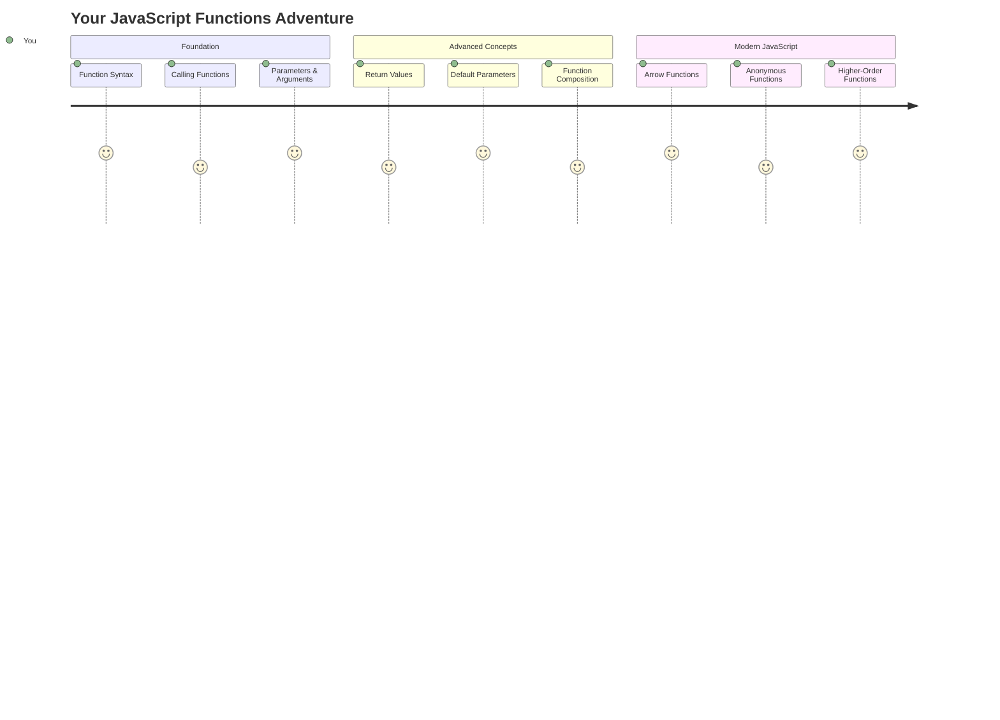
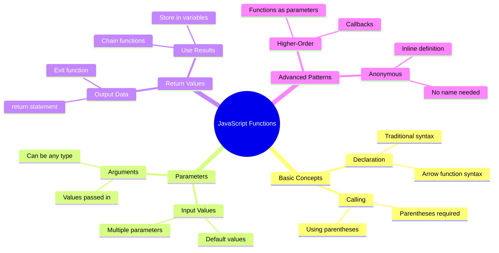
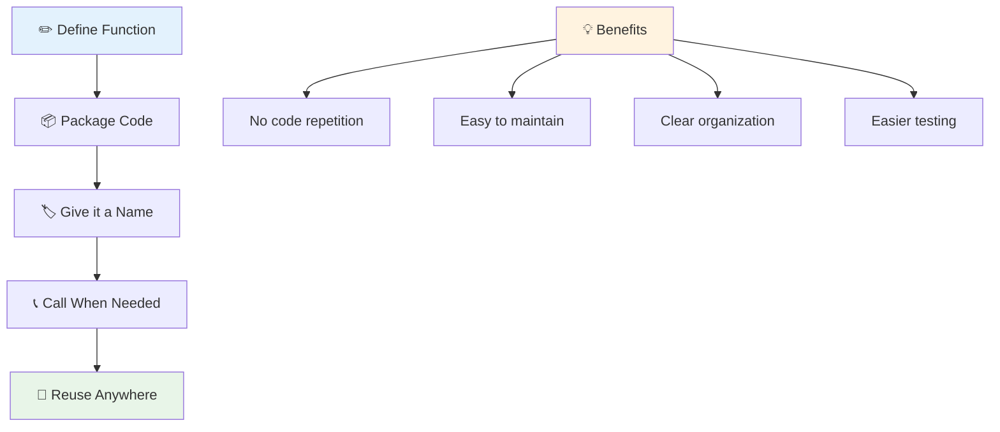
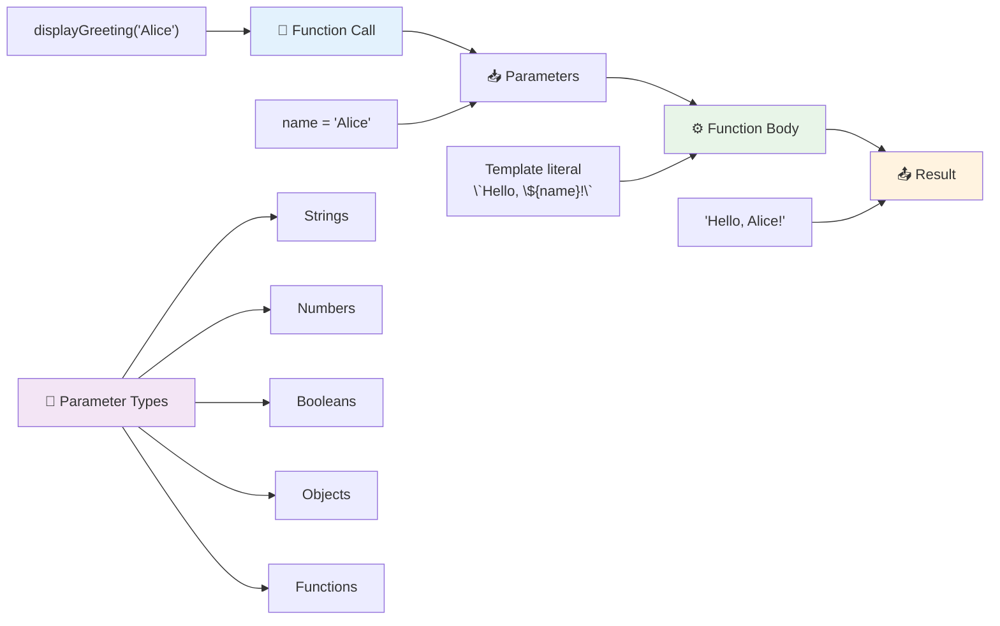
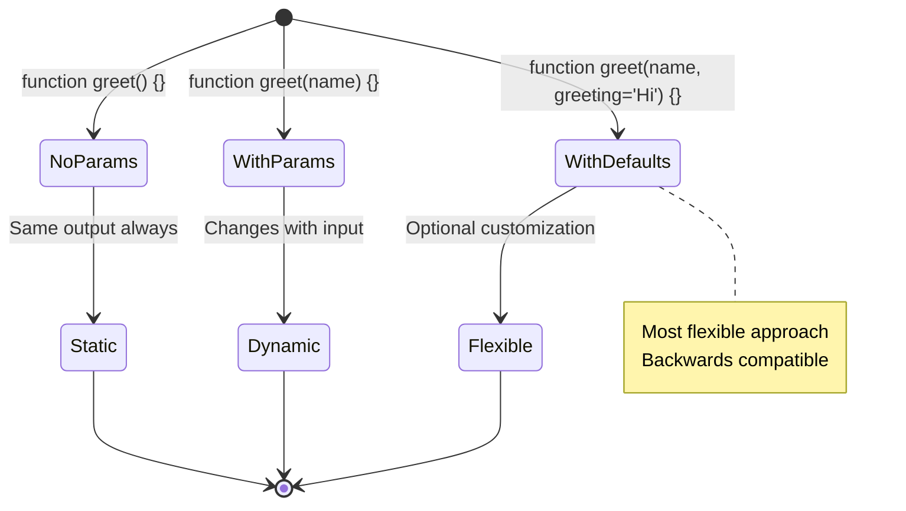
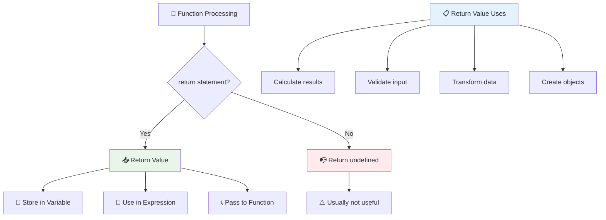
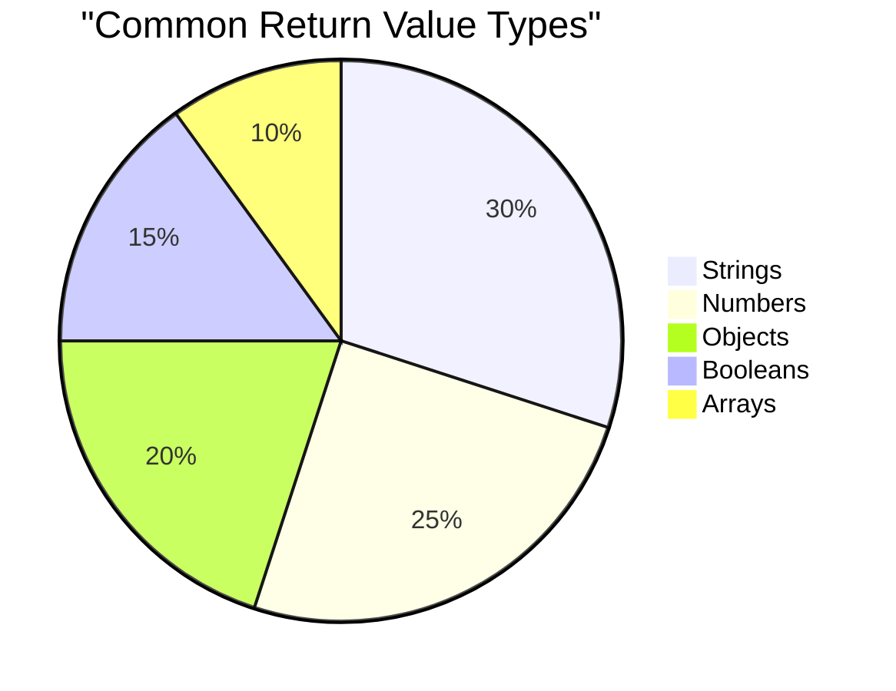
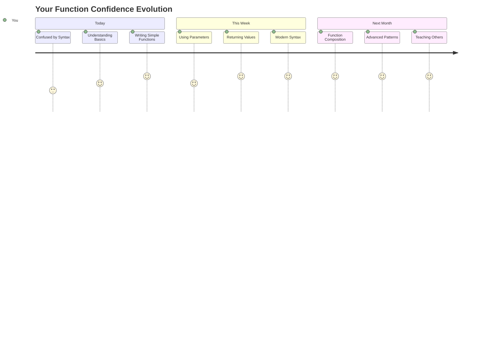

<!--
CO_OP_TRANSLATOR_METADATA:
{
  "original_hash": "71f7d7dafa1c7194d79ddac87f669ff9",
  "translation_date": "2025-11-03T16:05:45+00:00",
  "source_file": "2-js-basics/2-functions-methods/README.md",
  "language_code": "pa"
}
-->
# ਜਾਵਾਸਕ੍ਰਿਪਟ ਬੇਸਿਕਸ: ਮੈਥਡਸ ਅਤੇ ਫੰਕਸ਼ਨ


> ਸਕੈਚਨੋਟ [ਟੋਮੋਮੀ ਇਮੁਰਾ](https://twitter.com/girlie_mac) ਦੁਆਰਾ



## ਲੈਕਚਰ ਤੋਂ ਪਹਿਲਾਂ ਕਵਿਜ਼
[ਲੈਕਚਰ ਤੋਂ ਪਹਿਲਾਂ ਕਵਿਜ਼](https://ff-quizzes.netlify.app)

ਇੱਕ ਹੀ ਕੋਡ ਨੂੰ ਵਾਰ-ਵਾਰ ਲਿਖਣਾ ਪ੍ਰੋਗਰਾਮਿੰਗ ਵਿੱਚ ਸਭ ਤੋਂ ਆਮ ਨਿਰਾਸ਼ਾਵਾਦੀ ਗੱਲਾਂ ਵਿੱਚੋਂ ਇੱਕ ਹੈ। ਫੰਕਸ਼ਨ ਇਸ ਸਮੱਸਿਆ ਦਾ ਹੱਲ ਕਰਦੇ ਹਨ ਕਿਉਂਕਿ ਇਹ ਤੁਹਾਨੂੰ ਕੋਡ ਨੂੰ ਦੁਬਾਰਾ ਵਰਤਣਯੋਗ ਬਲਾਕਾਂ ਵਿੱਚ ਪੈਕ ਕਰਨ ਦੀ ਆਗਿਆ ਦਿੰਦੇ ਹਨ। ਫੰਕਸ਼ਨ ਨੂੰ ਹੈਨਰੀ ਫੋਰਡ ਦੀ ਅਸੈਂਬਲੀ ਲਾਈਨ ਦੇ ਮਿਆਰੀਕ੍ਰਿਤ ਹਿੱਸਿਆਂ ਵਾਂਗ ਸੋਚੋ – ਜਦੋਂ ਤੁਸੀਂ ਇੱਕ ਭਰੋਸੇਮੰਦ ਕੰਪੋਨੈਂਟ ਬਣਾਉਂਦੇ ਹੋ, ਤਾਂ ਤੁਸੀਂ ਇਸਨੂੰ ਜਿੱਥੇ ਵੀ ਲੋੜ ਹੋਵੇ, ਬਿਨਾਂ ਮੁੜ ਤੋਂ ਬਣਾਉਣ ਦੇ ਵਰਤ ਸਕਦੇ ਹੋ।

ਫੰਕਸ਼ਨ ਤੁਹਾਨੂੰ ਕੋਡ ਦੇ ਟੁਕੜਿਆਂ ਨੂੰ ਬੰਨ੍ਹਣ ਦੀ ਆਗਿਆ ਦਿੰਦੇ ਹਨ ਤਾਂ ਜੋ ਤੁਸੀਂ ਉਨ੍ਹਾਂ ਨੂੰ ਆਪਣੇ ਪ੍ਰੋਗਰਾਮ ਵਿੱਚ ਦੁਬਾਰਾ ਵਰਤ ਸਕੋ। ਇੱਕੋ ਹੀ ਲਾਜਿਕ ਨੂੰ ਹਰ ਜਗ੍ਹਾ ਕਾਪੀ ਅਤੇ ਪੇਸਟ ਕਰਨ ਦੀ ਬਜਾਏ, ਤੁਸੀਂ ਇੱਕ ਵਾਰ ਫੰਕਸ਼ਨ ਬਣਾਉਂਦੇ ਹੋ ਅਤੇ ਜਦੋਂ ਵੀ ਲੋੜ ਹੋਵੇ ਇਸਨੂੰ ਕਾਲ ਕਰ ਸਕਦੇ ਹੋ। ਇਹ ਪਹੁੰਚ ਤੁਹਾਡੇ ਕੋਡ ਨੂੰ ਸੰਗਠਿਤ ਰੱਖਦੀ ਹੈ ਅਤੇ ਅੱਪਡੇਟ ਕਰਨਾ ਬਹੁਤ ਆਸਾਨ ਬਣਾਉਂਦੀ ਹੈ।

ਇਸ ਪਾਠ ਵਿੱਚ, ਤੁਸੀਂ ਆਪਣੇ ਫੰਕਸ਼ਨ ਬਣਾਉਣ, ਉਨ੍ਹਾਂ ਨੂੰ ਜਾਣਕਾਰੀ ਪਾਸ ਕਰਨ ਅਤੇ ਉਨ੍ਹਾਂ ਤੋਂ ਲਾਭਦਾਇਕ ਨਤੀਜੇ ਪ੍ਰਾਪਤ ਕਰਨ ਦੇ ਤਰੀਕੇ ਸਿੱਖੋਗੇ। ਤੁਸੀਂ ਫੰਕਸ਼ਨ ਅਤੇ ਮੈਥਡਸ ਦੇ ਵਿਚਕਾਰ ਅੰਤਰ ਦੀ ਖੋਜ ਕਰੋਗੇ, ਆਧੁਨਿਕ ਸਿੰਟੈਕਸ ਪਹੁੰਚਾਂ ਬਾਰੇ ਸਿੱਖੋਗੇ, ਅਤੇ ਦੇਖੋਗੇ ਕਿ ਫੰਕਸ਼ਨ ਹੋਰ ਫੰਕਸ਼ਨ ਨਾਲ ਕਿਵੇਂ ਕੰਮ ਕਰ ਸਕਦੇ ਹਨ। ਅਸੀਂ ਇਹ ਧਾਰਨਾਵਾਂ ਕਦਮ-ਦਰ-ਕਦਮ ਬਣਾਉਂਦੇ ਹਾਂ।

[](https://youtube.com/watch?v=XgKsD6Zwvlc "ਮੈਥਡਸ ਅਤੇ ਫੰਕਸ਼ਨ")

> 🎥 ਉੱਪਰ ਦਿੱਤੀ ਤਸਵੀਰ 'ਤੇ ਕਲਿਕ ਕਰੋ ਮੈਥਡਸ ਅਤੇ ਫੰਕਸ਼ਨ ਬਾਰੇ ਵੀਡੀਓ ਦੇਖਣ ਲਈ।

> ਤੁਸੀਂ ਇਹ ਪਾਠ [ਮਾਈਕਰੋਸਾਫਟ ਲਰਨ](https://docs.microsoft.com/learn/modules/web-development-101-functions/?WT.mc_id=academic-77807-sagibbon) 'ਤੇ ਲੈ ਸਕਦੇ ਹੋ!



## ਫੰਕਸ਼ਨ

ਫੰਕਸ਼ਨ ਇੱਕ ਸਵੈ-ਨਿਰਭਰਤ ਕੋਡ ਦਾ ਬਲਾਕ ਹੈ ਜੋ ਇੱਕ ਵਿਸ਼ੇਸ਼ ਕੰਮ ਕਰਦਾ ਹੈ। ਇਹ ਲਾਜਿਕ ਨੂੰ ਸਮੇਟਦਾ ਹੈ ਜਿਸਨੂੰ ਤੁਸੀਂ ਜਦੋਂ ਵੀ ਲੋੜ ਹੋਵੇ ਚਲਾ ਸਕਦੇ ਹੋ।

ਤੁਹਾਡੇ ਪ੍ਰੋਗਰਾਮ ਵਿੱਚ ਇੱਕੋ ਹੀ ਕੋਡ ਨੂੰ ਕਈ ਵਾਰ ਲਿਖਣ ਦੀ ਬਜਾਏ, ਤੁਸੀਂ ਇਸਨੂੰ ਇੱਕ ਫੰਕਸ਼ਨ ਵਿੱਚ ਪੈਕ ਕਰ ਸਕਦੇ ਹੋ ਅਤੇ ਜਦੋਂ ਵੀ ਲੋੜ ਹੋਵੇ ਇਸਨੂੰ ਕਾਲ ਕਰ ਸਕਦੇ ਹੋ। ਇਹ ਪਹੁੰਚ ਤੁਹਾਡੇ ਕੋਡ ਨੂੰ ਸਾਫ ਰੱਖਦੀ ਹੈ ਅਤੇ ਅੱਪਡੇਟ ਕਰਨਾ ਬਹੁਤ ਆਸਾਨ ਬਣਾਉਂਦੀ ਹੈ। ਸੋਚੋ ਕਿ ਜੇ ਤੁਹਾਨੂੰ ਆਪਣੇ ਕੋਡਬੇਸ ਦੇ 20 ਵੱਖ-ਵੱਖ ਸਥਾਨਾਂ 'ਤੇ ਫੈਲੇ ਲਾਜਿਕ ਨੂੰ ਬਦਲਣਾ ਪਵੇ ਤਾਂ ਰੱਖ-ਰਖਾਵ ਕਿੰਨਾ ਮੁਸ਼ਕਲ ਹੋਵੇਗਾ।

ਆਪਣੇ ਫੰਕਸ਼ਨ ਨੂੰ ਵਿਆਖਿਆਤਮਕ ਨਾਮ ਦੇਣਾ ਬਹੁਤ ਜਰੂਰੀ ਹੈ। ਇੱਕ ਚੰਗਾ-ਨਾਮਿਤ ਫੰਕਸ਼ਨ ਇਸਦੇ ਉਦੇਸ਼ ਨੂੰ ਸਪਸ਼ਟ ਤੌਰ 'ਤੇ ਸੰਚਾਰਿਤ ਕਰਦਾ ਹੈ – ਜਦੋਂ ਤੁਸੀਂ `cancelTimer()` ਨੂੰ ਵੇਖਦੇ ਹੋ, ਤਾਂ ਤੁਹਾਨੂੰ ਤੁਰੰਤ ਸਮਝ ਆ ਜਾਂਦੀ ਹੈ ਕਿ ਇਹ ਕੀ ਕਰਦਾ ਹੈ, ਜਿਵੇਂ ਕਿ ਇੱਕ ਸਪਸ਼ਟ ਲੇਬਲ ਵਾਲਾ ਬਟਨ ਤੁਹਾਨੂੰ ਸਪਸ਼ਟ ਤੌਰ 'ਤੇ ਦੱਸਦਾ ਹੈ ਕਿ ਜਦੋਂ ਤੁਸੀਂ ਇਸਨੂੰ ਕਲਿਕ ਕਰਦੇ ਹੋ ਤਾਂ ਕੀ ਹੋਵੇਗਾ।

## ਫੰਕਸ਼ਨ ਬਣਾਉਣਾ ਅਤੇ ਕਾਲ ਕਰਨਾ

ਆਓ ਵੇਖੀਏ ਕਿ ਫੰਕਸ਼ਨ ਕਿਵੇਂ ਬਣਾਇਆ ਜਾਂਦਾ ਹੈ। ਸਿੰਟੈਕਸ ਇੱਕ ਸਥਿਰ ਪੈਟਰਨ ਦੀ ਪਾਲਣਾ ਕਰਦਾ ਹੈ:

```javascript
function nameOfFunction() { // function definition
 // function definition/body
}
```

ਆਓ ਇਸਨੂੰ ਤੋੜ ਕੇ ਸਮਝੀਏ:
- `function` ਕੀਵਰਡ ਜਾਵਾਸਕ੍ਰਿਪਟ ਨੂੰ ਦੱਸਦਾ ਹੈ "ਹੇ, ਮੈਂ ਇੱਕ ਫੰਕਸ਼ਨ ਬਣਾ ਰਿਹਾ ਹਾਂ!"
- `nameOfFunction` ਜਿੱਥੇ ਤੁਸੀਂ ਆਪਣੇ ਫੰਕਸ਼ਨ ਨੂੰ ਇੱਕ ਵਿਆਖਿਆਤਮਕ ਨਾਮ ਦਿੰਦੇ ਹੋ
- ਪੈਰੈਂਥੀਸਿਸ `()` ਜਿੱਥੇ ਤੁਸੀਂ ਪੈਰਾਮੀਟਰ ਸ਼ਾਮਲ ਕਰ ਸਕਦੇ ਹੋ (ਅਸੀਂ ਇਸ 'ਤੇ ਜਲਦੀ ਪਹੁੰਚਾਂਗੇ)
- ਕਰਲੀ ਬਰੇਸ `{}` ਵਿੱਚ ਅਸਲ ਕੋਡ ਹੁੰਦਾ ਹੈ ਜੋ ਤੁਸੀਂ ਫੰਕਸ਼ਨ ਕਾਲ ਕਰਨ 'ਤੇ ਚਲਾਉਂਦੇ ਹੋ

ਆਓ ਇਸਨੂੰ ਕਾਰਵਾਈ ਵਿੱਚ ਵੇਖਣ ਲਈ ਇੱਕ ਸਧਾਰਨ ਗ੍ਰੀਟਿੰਗ ਫੰਕਸ਼ਨ ਬਣਾਈਏ:

```javascript
function displayGreeting() {
  console.log('Hello, world!');
}
```

ਇਹ ਫੰਕਸ਼ਨ "Hello, world!" ਕਨਸੋਲ ਵਿੱਚ ਪ੍ਰਿੰਟ ਕਰਦਾ ਹੈ। ਜਦੋਂ ਤੁਸੀਂ ਇਸਨੂੰ ਡਿਫਾਈਨ ਕਰ ਲੈਂਦੇ ਹੋ, ਤਾਂ ਤੁਸੀਂ ਇਸਨੂੰ ਜਿੰਨੀ ਵਾਰ ਲੋੜ ਹੋਵੇ ਵਰਤ ਸਕਦੇ ਹੋ।

ਆਪਣੇ ਫੰਕਸ਼ਨ ਨੂੰ ਚਲਾਉਣ (ਜਾਂ "ਕਾਲ" ਕਰਨ) ਲਈ, ਇਸਦਾ ਨਾਮ ਲਿਖੋ ਅਤੇ ਪੈਰੈਂਥੀਸਿਸ ਦੇ ਨਾਲ। ਜਾਵਾਸਕ੍ਰਿਪਟ ਤੁਹਾਨੂੰ ਆਪਣੇ ਫੰਕਸ਼ਨ ਨੂੰ ਕਾਲ ਕਰਨ ਤੋਂ ਪਹਿਲਾਂ ਜਾਂ ਬਾਅਦ ਡਿਫਾਈਨ ਕਰਨ ਦੀ ਆਗਿਆ ਦਿੰਦਾ ਹੈ – ਜਾਵਾਸਕ੍ਰਿਪਟ ਇੰਜਨ ਐਗਜ਼ਿਕਿਊਸ਼ਨ ਆਰਡਰ ਨੂੰ ਸੰਭਾਲੇਗਾ।

```javascript
// calling our function
displayGreeting();
```

ਜਦੋਂ ਤੁਸੀਂ ਇਹ ਲਾਈਨ ਚਲਾਉਂਦੇ ਹੋ, ਤਾਂ ਇਹ ਤੁਹਾਡੇ `displayGreeting` ਫੰਕਸ਼ਨ ਦੇ ਅੰਦਰ ਸਾਰੇ ਕੋਡ ਨੂੰ ਚਲਾਉਂਦਾ ਹੈ, "Hello, world!" ਤੁਹਾਡੇ ਬ੍ਰਾਊਜ਼ਰ ਦੇ ਕਨਸੋਲ ਵਿੱਚ ਦਿਖਾਉਂਦਾ ਹੈ। ਤੁਸੀਂ ਇਸ ਫੰਕਸ਼ਨ ਨੂੰ ਵਾਰ-ਵਾਰ ਕਾਲ ਕਰ ਸਕਦੇ ਹੋ।

### 🧠 **ਫੰਕਸ਼ਨ ਫੰਡਾਮੈਂਟਲਸ ਚੈੱਕ: ਆਪਣੇ ਪਹਿਲੇ ਫੰਕਸ਼ਨ ਬਣਾਉਣਾ**

**ਆਓ ਵੇਖੀਏ ਕਿ ਤੁਸੀਂ ਬੇਸਿਕ ਫੰਕਸ਼ਨ ਬਾਰੇ ਕਿਵੇਂ ਮਹਿਸੂਸ ਕਰ ਰਹੇ ਹੋ:**
- ਕੀ ਤੁਸੀਂ ਸਮਝਾ ਸਕਦੇ ਹੋ ਕਿ ਫੰਕਸ਼ਨ ਡਿਫਿਨੀਸ਼ਨ ਵਿੱਚ ਕਰਲੀ ਬਰੇਸ `{}` ਕਿਉਂ ਵਰਤਦੇ ਹਨ?
- ਕੀ ਹੁੰਦਾ ਹੈ ਜੇ ਤੁਸੀਂ `displayGreeting` ਬਿਨਾਂ ਪੈਰੈਂਥੀਸਿਸ ਲਿਖਦੇ ਹੋ?
- ਤੁਸੀਂ ਇੱਕੋ ਫੰਕਸ਼ਨ ਨੂੰ ਕਈ ਵਾਰ ਕਾਲ ਕਰਨ ਦੀ ਇੱਛਾ ਕਿਉਂ ਕਰ ਸਕਦੇ ਹੋ?



> **ਨੋਟ:** ਤੁਸੀਂ ਇਸ ਪਾਠ ਦੌਰਾਨ **ਮੈਥਡਸ** ਵਰਤ ਰਹੇ ਹੋ। `console.log()` ਇੱਕ ਮੈਥਡ ਹੈ – ਅਸਲ ਵਿੱਚ ਇੱਕ ਫੰਕਸ਼ਨ ਜੋ `console` ਆਬਜੈਕਟ ਨਾਲ ਸੰਬੰਧਿਤ ਹੈ। ਮੁੱਖ ਅੰਤਰ ਇਹ ਹੈ ਕਿ ਮੈਥਡਸ ਆਬਜੈਕਟਸ ਨਾਲ ਜੁੜੇ ਹੁੰਦੇ ਹਨ, ਜਦੋਂ ਕਿ ਫੰਕਸ਼ਨ ਸਵੈ-ਨਿਰਭਰਤ ਹੁੰਦੇ ਹਨ। ਕਈ ਡਿਵੈਲਪਰ ਆਮ ਗੱਲਬਾਤ ਵਿੱਚ ਇਹ ਸ਼ਬਦ ਇੱਕੋ ਜਿਹਾ ਵਰਤਦੇ ਹਨ।

### ਫੰਕਸ਼ਨ ਬੈਸਟ ਪ੍ਰੈਕਟਿਸ

ਇੱਥੇ ਕੁਝ ਟਿੱਪਸ ਹਨ ਜੋ ਤੁਹਾਨੂੰ ਵਧੀਆ ਫੰਕਸ਼ਨ ਲਿਖਣ ਵਿੱਚ ਮਦਦ ਕਰ ਸਕਦੇ ਹਨ:

- ਆਪਣੇ ਫੰਕਸ਼ਨ ਨੂੰ ਸਪਸ਼ਟ, ਵਿਆਖਿਆਤਮਕ ਨਾਮ ਦਿਓ – ਤੁਹਾਡਾ ਭਵਿੱਖ ਦਾ ਆਪ ਤੁਹਾਡਾ ਧੰਨਵਾਦ ਕਰੇਗਾ!
- **camelCasing** ਨੂੰ ਬਹੁ-ਸ਼ਬਦ ਵਾਲੇ ਨਾਮਾਂ ਲਈ ਵਰਤੋ (ਜਿਵੇਂ `calculateTotal` ਬਜਾਏ `calculate_total`)
- ਹਰ ਫੰਕਸ਼ਨ ਨੂੰ ਇੱਕ ਚੰਗੀ ਤਰ੍ਹਾਂ ਇੱਕ ਕੰਮ ਕਰਨ 'ਤੇ ਕੇਂਦਰਿਤ ਰੱਖੋ

## ਫੰਕਸ਼ਨ ਨੂੰ ਜਾਣਕਾਰੀ ਪਾਸ ਕਰਨਾ

ਸਾਡਾ `displayGreeting` ਫੰਕਸ਼ਨ ਸੀਮਿਤ ਹੈ – ਇਹ ਸਿਰਫ "Hello, world!" ਹਰ ਕਿਸੇ ਲਈ ਦਿਖਾ ਸਕਦਾ ਹੈ। ਪੈਰਾਮੀਟਰਸ ਸਾਨੂੰ ਫੰਕਸ਼ਨ ਨੂੰ ਹੋਰ ਲਚਕਦਾਰ ਅਤੇ ਲਾਭਦਾਇਕ ਬਣਾਉਣ ਦੀ ਆਗਿਆ ਦਿੰਦੇ ਹਨ।

**ਪੈਰਾਮੀਟਰਸ** ਪਲੇਸਹੋਲਡਰ ਵਾਂਗ ਕੰਮ ਕਰਦੇ ਹਨ ਜਿੱਥੇ ਤੁਸੀਂ ਹਰ ਵਾਰ ਫੰਕਸ਼ਨ ਵਰਤਣ ਸਮੇਂ ਵੱਖ-ਵੱਖ ਮੁੱਲ ਪਾ ਸਕਦੇ ਹੋ। ਇਸ ਤਰੀਕੇ ਨਾਲ, ਇੱਕੋ ਫੰਕਸ਼ਨ ਹਰ ਕਾਲ 'ਤੇ ਵੱਖ-ਵੱਖ ਜਾਣਕਾਰੀ ਨਾਲ ਕੰਮ ਕਰ ਸਕਦਾ ਹੈ।

ਤੁਸੀਂ ਆਪਣੇ ਫੰਕਸ਼ਨ ਨੂੰ ਡਿਫਾਈਨ ਕਰਨ ਸਮੇਂ ਪੈਰੈਂਥੀਸਿਸ ਦੇ ਅੰਦਰ ਪੈਰਾਮੀਟਰਸ ਦੀ ਸੂਚੀ ਦਿੰਦੇ ਹੋ, ਕਈ ਪੈਰਾਮੀਟਰਸ ਨੂੰ ਕਾਮਾ ਨਾਲ ਵੱਖ ਕਰਦੇ ਹੋ:

```javascript
function name(param, param2, param3) {

}
```

ਹਰ ਪੈਰਾਮੀਟਰ ਪਲੇਸਹੋਲਡਰ ਵਾਂਗ ਕੰਮ ਕਰਦਾ ਹੈ – ਜਦੋਂ ਕੋਈ ਤੁਹਾਡੇ ਫੰਕਸ਼ਨ ਨੂੰ ਕਾਲ ਕਰਦਾ ਹੈ, ਤਾਂ ਉਹ ਅਸਲ ਮੁੱਲ ਪ੍ਰਦਾਨ ਕਰੇਗਾ ਜੋ ਇਨ੍ਹਾਂ ਸਥਾਨਾਂ ਵਿੱਚ ਪਲੱਗ ਹੁੰਦੇ ਹਨ।

ਆਓ ਆਪਣੇ ਗ੍ਰੀਟਿੰਗ ਫੰਕਸ਼ਨ ਨੂੰ ਅਪਡੇਟ ਕਰੀਏ ਤਾਂ ਜੋ ਕਿਸੇ ਦਾ ਨਾਮ ਸਵੀਕਾਰ ਕਰ ਸਕੇ:

```javascript
function displayGreeting(name) {
  const message = `Hello, ${name}!`;
  console.log(message);
}
```

ਧਿਆਨ ਦਿਓ ਕਿ ਅਸੀਂ ਬੈਕਟਿਕਸ (`` ` ``) ਅਤੇ `${}` ਵਰਤ ਰਹੇ ਹਾਂ ਤਾਂ ਜੋ ਨਾਮ ਨੂੰ ਸਿੱਧੇ ਆਪਣੇ ਸੁਨੇਹੇ ਵਿੱਚ ਸ਼ਾਮਲ ਕੀਤਾ ਜਾ ਸਕੇ – ਇਸਨੂੰ ਟੈਂਪਲੇਟ ਲਿਟਰਲ ਕਿਹਾ ਜਾਂਦਾ ਹੈ, ਅਤੇ ਇਹ ਸਟ੍ਰਿੰਗਸ ਨੂੰ ਵੈਰੀਏਬਲਸ ਦੇ ਨਾਲ ਮਿਲਾਉਣ ਦਾ ਇੱਕ ਬਹੁਤ ਹੀ ਸਹੀ ਤਰੀਕਾ ਹੈ।

ਹੁਣ ਜਦੋਂ ਅਸੀਂ ਆਪਣੇ ਫੰਕਸ਼ਨ ਨੂੰ ਕਾਲ ਕਰਦੇ ਹਾਂ, ਅਸੀਂ ਕੋਈ ਵੀ ਨਾਮ ਪਾਸ ਕਰ ਸਕਦੇ ਹਾਂ:

```javascript
displayGreeting('Christopher');
// displays "Hello, Christopher!" when run
```

ਜਾਵਾਸਕ੍ਰਿਪਟ ਸਟ੍ਰਿੰਗ `'Christopher'` ਲੈਂਦਾ ਹੈ, ਇਸਨੂੰ `name` ਪੈਰਾਮੀਟਰ ਨੂੰ ਅਸਾਈਨ ਕਰਦਾ ਹੈ, ਅਤੇ ਨਿੱਜੀ ਸੁਨੇਹਾ "Hello, Christopher!" ਬਣਾਉਂਦਾ ਹੈ।



## ਡਿਫਾਲਟ ਮੁੱਲ

ਜੇਕਰ ਅਸੀਂ ਕੁਝ ਪੈਰਾਮੀਟਰਸ ਨੂੰ ਵਿਕਲਪਿਕ ਬਣਾਉਣਾ ਚਾਹੁੰਦੇ ਹਾਂ ਤਾਂ? ਇੱਥੇ ਡਿਫਾਲਟ ਮੁੱਲ ਬਹੁਤ ਸਹਾਇਕ ਹੁੰਦੇ ਹਨ!

ਆਓ ਕਹੀਏ ਕਿ ਅਸੀਂ ਲੋਕਾਂ ਨੂੰ ਗ੍ਰੀਟਿੰਗ ਸ਼ਬਦ ਨੂੰ ਕਸਟਮਾਈਜ਼ ਕਰਨ ਦੇ ਯੋਗ ਬਣਾਉਣਾ ਚਾਹੁੰਦੇ ਹਾਂ, ਪਰ ਜੇਕਰ ਉਹ ਕੋਈ ਨਿਰਧਾਰਤ ਨਾ ਕਰਨ, ਤਾਂ ਅਸੀਂ "Hello" ਨੂੰ ਬੈਕਅਪ ਵਜੋਂ ਵਰਤਾਂਗੇ। ਤੁਸੀਂ ਡਿਫਾਲਟ ਮੁੱਲ ਸੈਟ ਕਰ ਸਕਦੇ ਹੋ ਜਿਵੇਂ ਕਿ ਵੈਰੀਏਬਲ ਸੈਟ ਕਰਦੇ ਹੋ:

```javascript
function displayGreeting(name, salutation='Hello') {
  console.log(`${salutation}, ${name}`);
}
```

ਇੱਥੇ, `name` ਅਜੇ ਵੀ ਲਾਜ਼ਮੀ ਹੈ, ਪਰ `salutation` ਦਾ ਬੈਕਅਪ ਮੁੱਲ `'Hello'` ਹੈ ਜੇਕਰ ਕੋਈ ਵੱਖ-ਵੱਖ ਗ੍ਰੀਟਿੰਗ ਪ੍ਰਦਾਨ ਨਾ ਕਰੇ।

ਹੁਣ ਅਸੀਂ ਇਸ ਫੰਕਸ਼ਨ ਨੂੰ ਦੋ ਵੱਖ-ਵੱਖ ਤਰੀਕਿਆਂ ਨਾਲ ਕਾਲ ਕਰ ਸਕਦੇ ਹਾਂ:

```javascript
displayGreeting('Christopher');
// displays "Hello, Christopher"

displayGreeting('Christopher', 'Hi');
// displays "Hi, Christopher"
```

ਪਹਿਲੀ ਕਾਲ ਵਿੱਚ, ਜਾਵਾਸਕ੍ਰਿਪਟ ਡਿਫਾਲਟ "Hello" ਵਰਤਦਾ ਹੈ ਕਿਉਂਕਿ ਅਸੀਂ ਗ੍ਰੀਟਿੰਗ ਸਪਸ਼ਟ ਨਹੀਂ ਕੀਤੀ। ਦੂਜੀ ਕਾਲ ਵਿੱਚ, ਇਹ ਸਾਡਾ ਕਸਟਮ "Hi" ਵਰਤਦਾ ਹੈ। ਇਹ ਲਚਕਤਾ ਫੰਕਸ਼ਨ ਨੂੰ ਵੱਖ-ਵੱਖ ਸਥਿਤੀਆਂ ਲਈ ਅਨੁਕੂਲ ਬਣਾਉਂਦੀ ਹੈ।

### 🎛️ **ਪੈਰਾਮੀਟਰਸ ਮਾਸਟਰੀ ਚੈੱਕ: ਫੰਕਸ਼ਨ ਨੂੰ ਲਚਕਦਾਰ ਬਣਾਉਣਾ**

**ਆਪਣੀ ਪੈਰਾਮੀਟਰ ਸਮਝ ਦੀ ਜਾਂਚ ਕਰੋ:**
- ਪੈਰਾਮੀਟਰ ਅਤੇ ਆਰਗੂਮੈਂਟ ਵਿੱਚ ਕੀ ਅੰਤਰ ਹੈ?
- ਅਸਲ ਦੁਨੀਆ ਦੇ ਪ੍ਰੋਗਰਾਮਿੰਗ ਵਿੱਚ ਡਿਫਾਲਟ ਮੁੱਲ ਕਿਉਂ ਲਾਭਦਾਇਕ ਹਨ?
- ਕੀ ਤੁਸੀਂ ਅਨੁਮਾਨ ਲਗਾ ਸਕਦੇ ਹੋ ਕਿ ਜੇਕਰ ਤੁਸੀਂ ਪੈਰਾਮੀਟਰਸ ਤੋਂ ਵੱਧ ਆਰਗੂਮੈਂਟ ਪਾਸ ਕਰੋ ਤਾਂ ਕੀ ਹੁੰਦਾ ਹੈ?



> **ਪ੍ਰੋ ਟਿਪ**: ਡਿਫਾਲਟ ਪੈਰਾਮੀਟਰ ਤੁਹਾਡੇ ਫੰਕਸ਼ਨ ਨੂੰ ਹੋਰ ਯੂਜ਼ਰ-ਫ੍ਰੈਂਡਲੀ ਬਣਾਉਂਦੇ ਹਨ। ਯੂਜ਼ਰਜ਼ ਸੈਂਸਿਬਲ ਡਿਫਾਲਟਸ ਨਾਲ ਤੇਜ਼ੀ ਨਾਲ ਸ਼ੁਰੂ ਕਰ ਸਕਦੇ ਹਨ, ਪਰ ਜਦੋਂ ਲੋੜ ਹੋਵੇ ਤਾਂ ਫਿਰ ਵੀ ਕਸਟਮਾਈਜ਼ ਕਰ ਸਕਦੇ ਹਨ!

## ਰਿਟਰਨ ਮੁੱਲ

ਸਾਡੇ ਫੰਕਸ਼ਨ ਹੁਣ ਤੱਕ ਸਿਰਫ ਸੁਨੇਹੇ ਕਨਸੋਲ ਵਿੱਚ ਪ੍ਰਿੰਟ ਕਰ ਰਹੇ ਹਨ, ਪਰ ਜੇਕਰ ਤੁਸੀਂ ਚਾਹੁੰਦੇ ਹੋ ਕਿ ਇੱਕ ਫੰਕਸ਼ਨ ਕੁਝ ਗਣਨਾ ਕਰੇ ਅਤੇ ਤੁਹਾਨੂੰ ਨਤੀਜਾ ਵਾਪਸ ਦੇਵੇ?

ਇੱਥੇ **ਰਿਟਰਨ ਮੁੱਲ** ਆਉਂਦੇ ਹਨ। ਕੁਝ ਦਿਖਾਉਣ ਦੀ ਬਜਾਏ, ਇੱਕ ਫੰਕਸ਼ਨ ਤੁਹਾਨੂੰ ਇੱਕ ਮੁੱਲ ਵਾਪਸ ਦੇ ਸਕਦਾ ਹੈ ਜਿਸਨੂੰ ਤੁਸੀਂ ਇੱਕ ਵੈਰੀਏਬਲ ਵਿੱਚ ਸਟੋਰ ਕਰ ਸਕਦੇ ਹੋ ਜਾਂ ਆਪਣੇ ਕੋਡ ਦੇ ਹੋਰ ਹਿੱਸਿਆਂ ਵਿੱਚ ਵਰਤ ਸਕਦੇ ਹੋ।

```javascript
return myVariable;
```

ਜਦੋਂ ਇੱਕ ਫੰਕਸ਼ਨ `return` ਸਟੇਟਮੈਂਟ 'ਤੇ ਪਹੁੰਚਦਾ ਹੈ, ਤਾਂ ਇਹ ਤੁਰੰਤ ਚਲਾਉਣਾ ਬੰਦ ਕਰਦਾ ਹੈ ਅਤੇ ਉਹ ਮੁੱਲ ਵਾਪਸ ਭੇਜਦਾ ਹੈ ਜਿਸਨੇ ਇਸਨੂੰ ਕਾਲ ਕੀਤਾ ਸੀ।

ਆਓ ਆਪਣੇ ਗ੍ਰੀਟਿੰਗ ਫੰਕਸ਼ਨ ਨੂੰ ਸੋਧੀਏ ਤਾਂ ਜੋ ਸੁਨੇਹਾ ਪ੍ਰਿੰਟ ਕਰਨ ਦੀ ਬਜਾਏ ਇਸਨੂੰ ਵਾਪਸ ਕਰੇ:

```javascript
function createGreetingMessage(name) {
  const message = `Hello, ${name}`;
  return message;
}
```

ਹੁਣ ਗ੍ਰੀਟਿੰਗ ਪ੍ਰਿੰਟ ਕਰਨ ਦੀ ਬਜਾਏ, ਇਹ ਫੰਕਸ਼ਨ ਸੁਨੇਹਾ ਬਣਾਉਂਦਾ ਹੈ ਅਤੇ ਇਸਨੂੰ ਸਾਨੂੰ ਵਾਪਸ ਦਿੰਦਾ ਹੈ।

```javascript
const greetingMessage = createGreetingMessage('Christopher');
```

ਹੁਣ `greetingMessage` ਵਿੱਚ "Hello, Christopher" ਹੈ ਅਤੇ ਅਸੀਂ ਇਸਨੂੰ ਆਪਣੇ ਕੋਡ ਵਿੱਚ ਕਿਤੇ ਵੀ ਵਰਤ ਸਕਦੇ ਹਾਂ – ਇਸਨੂੰ ਇੱਕ ਵੈਬਪੇਜ 'ਤੇ ਦਿਖਾਉਣ ਲਈ, ਇੱਕ ਈਮੇਲ ਵਿੱਚ ਸ਼ਾਮਲ ਕਰਨ ਲਈ, ਜਾਂ ਇਸਨੂੰ ਕਿਸੇ ਹੋਰ ਫੰਕਸ਼ਨ ਨੂੰ ਪਾਸ ਕਰਨ ਲਈ।



### 🔄 **ਰਿਟਰਨ ਮੁੱਲ ਚੈੱਕ: ਨਤੀਜੇ ਵਾਪਸ ਪ੍ਰਾਪਤ ਕਰਨਾ**

**ਆਪਣੀ ਰਿਟਰਨ ਮੁੱਲ ਸਮਝ ਦੀ ਜਾਂਚ ਕਰੋ:**
- ਫੰਕਸ਼ਨ ਵਿੱਚ `return` ਸਟੇਟਮੈਂਟ ਤੋਂ ਬਾਅਦ ਕੋਡ ਨਾਲ ਕੀ ਹੁੰਦਾ ਹੈ?
- ਸਿਰਫ ਕਨਸੋਲ ਵਿੱਚ ਪ੍ਰਿੰਟ ਕਰਨ ਦੀ ਬਜਾਏ ਮੁੱਲ ਵਾਪਸ ਕਰਨਾ ਕਿਉਂ ਵਧੀਆ ਹੈ?
- ਕੀ ਇੱਕ ਫੰਕਸ਼ਨ ਵੱਖ-ਵੱਖ ਕਿਸਮਾਂ ਦੇ ਮੁੱਲ (string, number, boolean) ਵਾਪਸ ਕਰ ਸਕਦਾ ਹੈ?



> **ਮੁੱਖ ਝਲਕ**: ਮੁੱਲ ਵਾਪਸ ਕਰਨ ਵਾਲੇ ਫੰਕਸ਼ਨ ਹੋਰ ਬਹੁਤ ਲਚਕਦਾਰ ਹੁੰਦੇ ਹਨ ਕਿਉਂਕਿ ਕਾਲ ਕਰਨ ਵਾਲਾ ਨਿਰਧਾਰਤ ਕਰਦਾ ਹੈ ਕਿ ਨਤੀਜੇ ਨਾਲ ਕੀ ਕਰਨਾ ਹੈ। ਇਹ ਤੁਹਾਡੇ ਕੋਡ ਨੂੰ ਹੋਰ ਮ
- [ ] ਪਰੰਪਰਾਗਤ ਫੰਕਸ਼ਨ ਨੂੰ ਐਰੋ ਫੰਕਸ਼ਨ ਸਿੰਟੈਕਸ ਵਿੱਚ ਬਦਲਣ ਦੀ ਕੋਸ਼ਿਸ਼ ਕਰੋ  
- [ ] ਚੁਣੌਤੀ ਦਾ ਅਭਿਆਸ ਕਰੋ: ਫੰਕਸ਼ਨ ਅਤੇ ਮੈਥਡ ਵਿੱਚ ਅੰਤਰ ਦੀ ਵਿਆਖਿਆ ਕਰੋ  

### 🎯 **ਇਸ ਘੰਟੇ ਵਿੱਚ ਤੁਸੀਂ ਕੀ ਹਾਸਲ ਕਰ ਸਕਦੇ ਹੋ**  
- [ ] ਪੋਸਟ-ਪਾਠ ਕਵਿਜ਼ ਪੂਰਾ ਕਰੋ ਅਤੇ ਕੋਈ ਵੀ ਗੁੰਝਲਦਾਰ ਧਾਰਨਾਵਾਂ ਦੀ ਸਮੀਖਿਆ ਕਰੋ  
- [ ] GitHub Copilot ਚੁਣੌਤੀ ਤੋਂ ਗਣਿਤ ਯੂਟਿਲਿਟੀ ਲਾਇਬ੍ਰੇਰੀ ਬਣਾਓ  
- [ ] ਇੱਕ ਫੰਕਸ਼ਨ ਬਣਾਓ ਜੋ ਇੱਕ ਹੋਰ ਫੰਕਸ਼ਨ ਨੂੰ ਪੈਰਾਮੀਟਰ ਵਜੋਂ ਵਰਤਦਾ ਹੈ  
- [ ] ਡਿਫਾਲਟ ਪੈਰਾਮੀਟਰਾਂ ਨਾਲ ਫੰਕਸ਼ਨ ਲਿਖਣ ਦਾ ਅਭਿਆਸ ਕਰੋ  
- [ ] ਫੰਕਸ਼ਨ ਰਿਟਰਨ ਵੈਲਿਊਜ਼ ਵਿੱਚ ਟੈਂਪਲੇਟ ਲਿਟਰਲਸ ਨਾਲ ਪ੍ਰਯੋਗ ਕਰੋ  

### 📅 **ਤੁਹਾਡਾ ਹਫਤਾਵਾਰ ਫੰਕਸ਼ਨ ਮਾਹਰਤਾ ਯੋਜਨਾ**  
- [ ] "Fun with Functions" ਅਸਾਈਨਮੈਂਟ ਨੂੰ ਰਚਨਾਤਮਕਤਾ ਨਾਲ ਪੂਰਾ ਕਰੋ  
- [ ] ਕੁਝ ਦੁਹਰਾਏ ਗਏ ਕੋਡ ਨੂੰ ਦੁਬਾਰਾ ਵਰਤਣਯੋਗ ਫੰਕਸ਼ਨ ਵਿੱਚ ਰਿਫੈਕਟਰ ਕਰੋ  
- [ ] ਸਿਰਫ ਫੰਕਸ਼ਨ ਵਰਤ ਕੇ ਇੱਕ ਛੋਟਾ ਕੈਲਕੂਲੇਟਰ ਬਣਾਓ (ਕੋਈ ਗਲੋਬਲ ਵੈਰੀਏਬਲ ਨਹੀਂ)  
- [ ] `map()` ਅਤੇ `filter()` ਵਰਗੇ ਐਰੇ ਮੈਥਡ ਨਾਲ ਐਰੋ ਫੰਕਸ਼ਨ ਦਾ ਅਭਿਆਸ ਕਰੋ  
- [ ] ਆਮ ਕੰਮਾਂ ਲਈ ਯੂਟਿਲਿਟੀ ਫੰਕਸ਼ਨ ਦਾ ਸੰਗ੍ਰਹਿ ਬਣਾਓ  
- [ ] ਹਾਈਅਰ-ਆਰਡਰ ਫੰਕਸ਼ਨ ਅਤੇ ਫੰਕਸ਼ਨਲ ਪ੍ਰੋਗਰਾਮਿੰਗ ਧਾਰਨਾਵਾਂ ਦਾ ਅਧਿਐਨ ਕਰੋ  

### 🌟 **ਤੁਹਾਡਾ ਮਹੀਨਾਵਾਰ ਬਦਲਾਅ**  
- [ ] ਕਲੋਜ਼ਰ ਅਤੇ ਸਕੋਪ ਵਰਗੇ ਉੱਚ-ਸਤਹ ਦੇ ਫੰਕਸ਼ਨ ਧਾਰਨਾਵਾਂ ਵਿੱਚ ਮਾਹਰ ਬਣੋ  
- [ ] ਇੱਕ ਪ੍ਰੋਜੈਕਟ ਬਣਾਓ ਜੋ ਫੰਕਸ਼ਨ ਕੰਪੋਜ਼ੀਸ਼ਨ ਨੂੰ ਵਧੇਰੇ ਵਰਤਦਾ ਹੋਵੇ  
- [ ] ਫੰਕਸ਼ਨ ਡੌਕੂਮੈਂਟੇਸ਼ਨ ਨੂੰ ਸੁਧਾਰ ਕੇ ਓਪਨ ਸੋਰਸ ਵਿੱਚ ਯੋਗਦਾਨ ਪਾਓ  
- [ ] ਕਿਸੇ ਹੋਰ ਨੂੰ ਫੰਕਸ਼ਨ ਅਤੇ ਵੱਖ-ਵੱਖ ਸਿੰਟੈਕਸ ਸ਼ੈਲੀਆਂ ਬਾਰੇ ਸਿਖਾਓ  
- [ ] ਜਾਵਾਸਕ੍ਰਿਪਟ ਵਿੱਚ ਫੰਕਸ਼ਨਲ ਪ੍ਰੋਗਰਾਮਿੰਗ ਪੈਰਾਡਾਇਮਜ਼ ਦੀ ਖੋਜ ਕਰੋ  
- [ ] ਭਵਿੱਖ ਦੇ ਪ੍ਰੋਜੈਕਟਾਂ ਲਈ ਦੁਬਾਰਾ ਵਰਤਣਯੋਗ ਫੰਕਸ਼ਨ ਦੀ ਆਪਣੀ ਲਾਇਬ੍ਰੇਰੀ ਬਣਾਓ  

### 🏆 **ਅੰਤਮ ਫੰਕਸ਼ਨ ਚੈਂਪੀਅਨ ਚੈੱਕ-ਇਨ**  

**ਆਪਣੀ ਫੰਕਸ਼ਨ ਮਾਹਰਤਾ ਦਾ ਜਸ਼ਨ ਮਨਾਓ:**  
- ਤੁਹਾਡੇ ਦੁਆਰਾ ਬਣਾਇਆ ਗਿਆ ਸਭ ਤੋਂ ਉਪਯੋਗ ਫੰਕਸ਼ਨ ਕਿਹੜਾ ਹੈ?  
- ਫੰਕਸ਼ਨ ਬਾਰੇ ਸਿੱਖਣ ਨਾਲ ਕੋਡ ਦੇ ਆਯੋਜਨ ਬਾਰੇ ਤੁਹਾਡੀ ਸੋਚ ਕਿਵੇਂ ਬਦਲੀ ਹੈ?  
- ਤੁਹਾਨੂੰ ਕਿਹੜਾ ਫੰਕਸ਼ਨ ਸਿੰਟੈਕਸ ਪਸੰਦ ਹੈ ਅਤੇ ਕਿਉਂ?  
- ਤੁਸੀਂ ਕਿਹੜੀ ਅਸਲ-ਦੁਨੀਆ ਦੀ ਸਮੱਸਿਆ ਨੂੰ ਫੰਕਸ਼ਨ ਲਿਖ ਕੇ ਹੱਲ ਕਰਨਾ ਚਾਹੁੰਦੇ ਹੋ?  


  
> 🎉 **ਤੁਸੀਂ ਪ੍ਰੋਗਰਾਮਿੰਗ ਦੇ ਸਭ ਤੋਂ ਸ਼ਕਤੀਸ਼ਾਲੀ ਧਾਰਨਾਵਾਂ ਵਿੱਚ ਮਾਹਰਤਾ ਹਾਸਲ ਕਰ ਲਈ ਹੈ!** ਫੰਕਸ਼ਨ ਵੱਡੇ ਪ੍ਰੋਗਰਾਮਾਂ ਦੇ ਨਿਰਮਾਣ ਬਲਾਕ ਹਨ। ਹਰ ਐਪਲੀਕੇਸ਼ਨ ਜੋ ਤੁਸੀਂ ਕਦੇ ਵੀ ਬਣਾਓਗੇ, ਫੰਕਸ਼ਨ ਨੂੰ ਕੋਡ ਨੂੰ ਆਯੋਜਿਤ, ਦੁਬਾਰਾ ਵਰਤਣਯੋਗ ਅਤੇ ਸੰਰਚਿਤ ਕਰਨ ਲਈ ਵਰਤੇਗਾ। ਹੁਣ ਤੁਸੀਂ ਤਰਕ ਨੂੰ ਦੁਬਾਰਾ ਵਰਤਣਯੋਗ ਕੰਪੋਨੈਂਟਾਂ ਵਿੱਚ ਪੈਕ ਕਰਨ ਦਾ ਤਰੀਕਾ ਸਮਝਦੇ ਹੋ, ਜੋ ਤੁਹਾਨੂੰ ਇੱਕ ਹੋਸ਼ਿਆਰ ਅਤੇ ਪ੍ਰਭਾਵਸ਼ਾਲੀ ਪ੍ਰੋਗਰਾਮਰ ਬਣਾਉਂਦਾ ਹੈ। ਮੋਡਿਊਲਰ ਪ੍ਰੋਗਰਾਮਿੰਗ ਦੀ ਦੁਨੀਆ ਵਿੱਚ ਤੁਹਾਡਾ ਸਵਾਗਤ ਹੈ! 🚀  

---

**ਅਸਵੀਕਰਤਾ**:  
ਇਹ ਦਸਤਾਵੇਜ਼ AI ਅਨੁਵਾਦ ਸੇਵਾ [Co-op Translator](https://github.com/Azure/co-op-translator) ਦੀ ਵਰਤੋਂ ਕਰਕੇ ਅਨੁਵਾਦ ਕੀਤਾ ਗਿਆ ਹੈ। ਜਦੋਂ ਕਿ ਅਸੀਂ ਸਹੀ ਹੋਣ ਦਾ ਯਤਨ ਕਰਦੇ ਹਾਂ, ਕਿਰਪਾ ਕਰਕੇ ਧਿਆਨ ਦਿਓ ਕਿ ਸਵੈਚਾਲਿਤ ਅਨੁਵਾਦਾਂ ਵਿੱਚ ਗਲਤੀਆਂ ਜਾਂ ਅਸੁੱਤੀਆਂ ਹੋ ਸਕਦੀਆਂ ਹਨ। ਮੂਲ ਦਸਤਾਵੇਜ਼ ਨੂੰ ਇਸਦੀ ਮੂਲ ਭਾਸ਼ਾ ਵਿੱਚ ਅਧਿਕਾਰਤ ਸਰੋਤ ਮੰਨਿਆ ਜਾਣਾ ਚਾਹੀਦਾ ਹੈ। ਮਹੱਤਵਪੂਰਨ ਜਾਣਕਾਰੀ ਲਈ, ਪੇਸ਼ੇਵਰ ਮਨੁੱਖੀ ਅਨੁਵਾਦ ਦੀ ਸਿਫਾਰਸ਼ ਕੀਤੀ ਜਾਂਦੀ ਹੈ। ਇਸ ਅਨੁਵਾਦ ਦੀ ਵਰਤੋਂ ਤੋਂ ਪੈਦਾ ਹੋਣ ਵਾਲੇ ਕਿਸੇ ਵੀ ਗਲਤਫਹਿਮੀ ਜਾਂ ਗਲਤ ਵਿਆਖਿਆ ਲਈ ਅਸੀਂ ਜ਼ਿੰਮੇਵਾਰ ਨਹੀਂ ਹਾਂ।