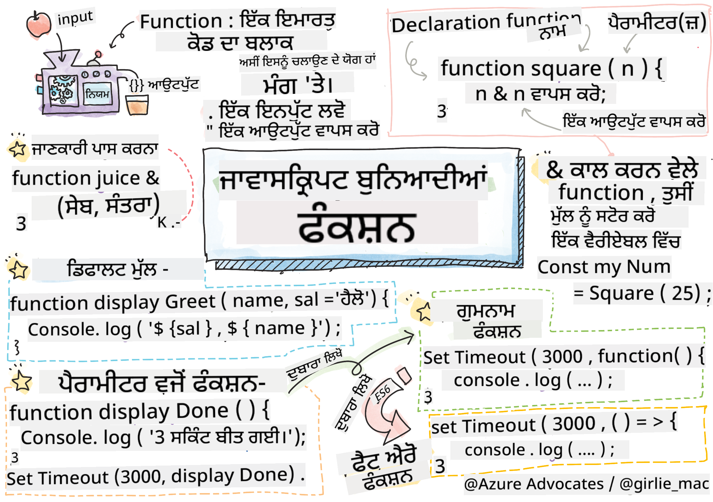

<!--
CO_OP_TRANSLATOR_METADATA:
{
  "original_hash": "b4612bbb9ace984f374fcc80e3e035ad",
  "translation_date": "2025-08-25T21:42:30+00:00",
  "source_file": "2-js-basics/2-functions-methods/README.md",
  "language_code": "pa"
}
-->
# ਜਾਵਾਸਕ੍ਰਿਪਟ ਬੇਸਿਕਸ: ਮੈਥਡਸ ਅਤੇ ਫੰਕਸ਼ਨ


> ਸਕੈਚਨੋਟ [Tomomi Imura](https://twitter.com/girlie_mac) ਵੱਲੋਂ

## ਲੈਕਚਰ ਤੋਂ ਪਹਿਲਾਂ ਕਵਿਜ਼
[ਲੈਕਚਰ ਤੋਂ ਪਹਿਲਾਂ ਕਵਿਜ਼](https://ff-quizzes.netlify.app/web/quiz/9)

ਜਦੋਂ ਅਸੀਂ ਕੋਡ ਲਿਖਣ ਬਾਰੇ ਸੋਚਦੇ ਹਾਂ, ਤਾਂ ਅਸੀਂ ਹਮੇਸ਼ਾ ਇਹ ਯਕੀਨੀ ਬਣਾਉਣਾ ਚਾਹੁੰਦੇ ਹਾਂ ਕਿ ਸਾਡਾ ਕੋਡ ਪੜ੍ਹਨਯੋਗ ਹੋਵੇ। ਇਹ ਸੁਣਨ ਵਿੱਚ ਅਜੀਬ ਲੱਗ ਸਕਦਾ ਹੈ, ਪਰ ਕੋਡ ਨੂੰ ਲਿਖਣ ਨਾਲ ਕਈ ਗੁਣਾ ਵੱਧ ਪੜ੍ਹਿਆ ਜਾਂਦਾ ਹੈ। ਡਿਵੈਲਪਰ ਦੇ ਟੂਲਬਾਕਸ ਵਿੱਚ ਇੱਕ ਮੁੱਖ ਟੂਲ **ਫੰਕਸ਼ਨ** ਹੈ, ਜੋ ਇਹ ਯਕੀਨੀ ਬਣਾਉਂਦਾ ਹੈ ਕਿ ਕੋਡ ਸਧਾਰਣ ਅਤੇ ਸੰਭਾਲਯੋਗ ਹੋਵੇ।

[](https://youtube.com/watch?v=XgKsD6Zwvlc "Methods and Functions")

> 🎥 ਉਪਰੋਕਤ ਚਿੱਤਰ 'ਤੇ ਕਲਿੱਕ ਕਰੋ ਮੈਥਡਸ ਅਤੇ ਫੰਕਸ਼ਨ ਬਾਰੇ ਵੀਡੀਓ ਦੇਖਣ ਲਈ।

> ਤੁਸੀਂ ਇਹ ਪਾਠ [Microsoft Learn](https://docs.microsoft.com/learn/modules/web-development-101-functions/?WT.mc_id=academic-77807-sagibbon) 'ਤੇ ਵੀ ਪੜ੍ਹ ਸਕਦੇ ਹੋ!

## ਫੰਕਸ਼ਨ

ਫੰਕਸ਼ਨ ਮੂਲ ਰੂਪ ਵਿੱਚ ਕੋਡ ਦਾ ਇੱਕ ਬਲਾਕ ਹੁੰਦਾ ਹੈ ਜਿਸਨੂੰ ਅਸੀਂ ਜਦੋਂ ਚਾਹੀਏ ਤਦ ਚਲਾਉਣ ਲਈ ਕਹਿ ਸਕਦੇ ਹਾਂ। ਇਹ ਉਹਨਾਂ ਸਥਿਤੀਆਂ ਲਈ ਬਹੁਤ ਹੀ ਉਚਿਤ ਹੈ ਜਿੱਥੇ ਸਾਨੂੰ ਇੱਕੋ ਕੰਮ ਕਈ ਵਾਰ ਕਰਨਾ ਪੈਂਦਾ ਹੈ। ਬਜਾਏ ਇਸਦੇ ਕਿ ਅਸੀਂ ਲਾਜਿਕ ਨੂੰ ਕਈ ਸਥਾਨਾਂ 'ਤੇ ਦੁਹਰਾਈਏ (ਜਿਸ ਨਾਲ ਅਪਡੇਟ ਕਰਨਾ ਮੁਸ਼ਕਲ ਹੋ ਸਕਦਾ ਹੈ), ਅਸੀਂ ਇਸਨੂੰ ਇੱਕ ਸਥਾਨ 'ਤੇ ਕੇਂਦਰਿਤ ਕਰ ਸਕਦੇ ਹਾਂ ਅਤੇ ਜਦੋਂ ਵੀ ਸਾਨੂੰ ਇਸ ਦੀ ਲੋੜ ਹੋਵੇ, ਇਸਨੂੰ ਕਾਲ ਕਰ ਸਕਦੇ ਹਾਂ। ਤੁਸੀਂ ਫੰਕਸ਼ਨ ਨੂੰ ਹੋਰ ਫੰਕਸ਼ਨ ਤੋਂ ਵੀ ਕਾਲ ਕਰ ਸਕਦੇ ਹੋ!

ਇਸਦੇ ਨਾਲ ਹੀ, ਫੰਕਸ਼ਨ ਨੂੰ ਨਾਮ ਦੇਣ ਦੀ ਸਮਰੱਥਾ ਬਹੁਤ ਮਹੱਤਵਪੂਰਨ ਹੈ। ਜਦੋਂ ਕਿ ਇਹ ਛੋਟਾ ਜਿਹਾ ਲੱਗ ਸਕਦਾ ਹੈ, ਪਰ ਨਾਮ ਇੱਕ ਕੋਡ ਦੇ ਹਿੱਸੇ ਨੂੰ ਦਸਤਾਵੇਜ਼ ਕਰਨ ਦਾ ਤੇਜ਼ ਤਰੀਕਾ ਪ੍ਰਦਾਨ ਕਰਦਾ ਹੈ। ਤੁਸੀਂ ਇਸਨੂੰ ਇੱਕ ਬਟਨ 'ਤੇ ਲੇਬਲ ਵਾਂਗ ਸੋਚ ਸਕਦੇ ਹੋ। ਜੇ ਮੈਂ ਇੱਕ ਬਟਨ 'ਤੇ ਕਲਿੱਕ ਕਰਦਾ ਹਾਂ ਜਿਸ 'ਤੇ "ਟਾਈਮਰ ਰੱਦ ਕਰੋ" ਲਿਖਿਆ ਹੈ, ਤਾਂ ਮੈਨੂੰ ਪਤਾ ਹੈ ਕਿ ਇਹ ਘੜੀ ਨੂੰ ਰੋਕ ਦੇਵੇਗਾ।

## ਫੰਕਸ਼ਨ ਬਣਾਉਣਾ ਅਤੇ ਕਾਲ ਕਰਨਾ

ਫੰਕਸ਼ਨ ਲਈ ਸਿੰਟੈਕਸ ਹੇਠਾਂ ਦਿੱਤੇ ਤਰੀਕੇ ਵਰਗਾ ਲੱਗਦਾ ਹੈ:

```javascript
function nameOfFunction() { // function definition
 // function definition/body
}
```

ਜੇ ਮੈਂ ਇੱਕ ਫੰਕਸ਼ਨ ਬਣਾਉਣਾ ਚਾਹੁੰਦਾ ਹਾਂ ਜੋ ਇੱਕ ਗ੍ਰੀਟਿੰਗ ਦਿਖਾਏ, ਤਾਂ ਇਹ ਇਸ ਤਰ੍ਹਾਂ ਲੱਗ ਸਕਦਾ ਹੈ:

```javascript
function displayGreeting() {
  console.log('Hello, world!');
}
```

ਜਦੋਂ ਵੀ ਅਸੀਂ ਆਪਣੇ ਫੰਕਸ਼ਨ ਨੂੰ ਕਾਲ (ਜਾਂ ਚਲਾਉਣਾ) ਚਾਹੁੰਦੇ ਹਾਂ, ਅਸੀਂ ਫੰਕਸ਼ਨ ਦੇ ਨਾਮ ਦੇ ਨਾਲ `()` ਵਰਤਦੇ ਹਾਂ। ਇਹ ਗੱਲ ਯਾਦ ਰੱਖਣ ਵਾਲੀ ਹੈ ਕਿ ਸਾਡਾ ਫੰਕਸ਼ਨ ਪਹਿਲਾਂ ਜਾਂ ਬਾਅਦ ਵਿੱਚ ਪਰਿਭਾਸ਼ਿਤ ਕੀਤਾ ਜਾ ਸਕਦਾ ਹੈ; ਜਾਵਾਸਕ੍ਰਿਪਟ ਕੰਪਾਇਲਰ ਇਸਨੂੰ ਤੁਹਾਡੇ ਲਈ ਲੱਭ ਲਵੇਗਾ।

```javascript
// calling our function
displayGreeting();
```

> **NOTE:** ਇੱਕ ਖਾਸ ਕਿਸਮ ਦਾ ਫੰਕਸ਼ਨ ਹੁੰਦਾ ਹੈ ਜਿਸਨੂੰ **ਮੈਥਡ** ਕਿਹਾ ਜਾਂਦਾ ਹੈ, ਜਿਸਦਾ ਤੁਸੀਂ ਪਹਿਲਾਂ ਹੀ ਇਸਤੇਮਾਲ ਕਰ ਰਹੇ ਹੋ! ਅਸਲ ਵਿੱਚ, ਅਸੀਂ ਇਹ ਆਪਣੇ ਡੈਮੋ ਵਿੱਚ ਵੇਖਿਆ ਜਦੋਂ ਅਸੀਂ `console.log` ਵਰਤਿਆ। ਮੈਥਡ ਅਤੇ ਫੰਕਸ਼ਨ ਵਿੱਚ ਅੰਤਰ ਇਹ ਹੈ ਕਿ ਮੈਥਡ ਇੱਕ ਆਬਜੈਕਟ ਨਾਲ ਜੁੜਿਆ ਹੁੰਦਾ ਹੈ (`console` ਸਾਡੇ ਉਦਾਹਰਨ ਵਿੱਚ), ਜਦਕਿ ਫੰਕਸ਼ਨ ਮੁਕਤ ਹੁੰਦਾ ਹੈ। ਤੁਸੀਂ ਬਹੁਤ ਸਾਰੇ ਡਿਵੈਲਪਰਾਂ ਨੂੰ ਇਹ ਸ਼ਬਦ ਇੱਕੋ ਜਿਹਾ ਵਰਤਦੇ ਹੋਏ ਸੁਣੋਗੇ।

### ਫੰਕਸ਼ਨ ਲਈ ਸਭ ਤੋਂ ਵਧੀਆ ਅਭਿਆਸ

ਫੰਕਸ਼ਨ ਬਣਾਉਣ ਸਮੇਂ ਕੁਝ ਚੰਗੇ ਅਭਿਆਸ ਯਾਦ ਰੱਖਣੇ ਚਾਹੀਦੇ ਹਨ:

- ਹਮੇਸ਼ਾ ਵਰਣਨਾਤਮਕ ਨਾਮ ਵਰਤੋ ਤਾਂ ਜੋ ਤੁਹਾਨੂੰ ਪਤਾ ਹੋਵੇ ਕਿ ਫੰਕਸ਼ਨ ਕੀ ਕਰੇਗਾ।  
- ਸ਼ਬਦਾਂ ਨੂੰ ਜੋੜਨ ਲਈ **camelCasing** ਵਰਤੋ।  
- ਆਪਣੇ ਫੰਕਸ਼ਨ ਨੂੰ ਇੱਕ ਖਾਸ ਕੰਮ 'ਤੇ ਕੇਂਦਰਿਤ ਰੱਖੋ।  

## ਫੰਕਸ਼ਨ ਨੂੰ ਜਾਣਕਾਰੀ ਪਾਸ ਕਰਨਾ

ਫੰਕਸ਼ਨ ਨੂੰ ਹੋਰ ਵੱਧ ਦੁਹਰਾਉਣਯੋਗ ਬਣਾਉਣ ਲਈ, ਤੁਸੀਂ ਅਕਸਰ ਇਸ ਵਿੱਚ ਜਾਣਕਾਰੀ ਪਾਸ ਕਰਨਾ ਚਾਹੋਗੇ। ਜੇ ਅਸੀਂ ਉਪਰੋਕਤ `displayGreeting` ਉਦਾਹਰਨ ਨੂੰ ਵੇਖੀਏ, ਤਾਂ ਇਹ ਸਿਰਫ **Hello, world!** ਦਿਖਾਏਗਾ। ਇਹ ਸਭ ਤੋਂ ਵਧੀਆ ਫੰਕਸ਼ਨ ਨਹੀਂ ਹੈ ਜੋ ਕੋਈ ਬਣਾ ਸਕਦਾ ਹੈ। ਜੇ ਅਸੀਂ ਇਸਨੂੰ ਥੋੜ੍ਹਾ ਹੋਰ ਲਚਕੀਲਾ ਬਣਾਉਣਾ ਚਾਹੀਏ, ਜਿਵੇਂ ਕਿ ਕਿਸੇ ਨੂੰ ਗ੍ਰੀਟ ਕਰਨ ਵਾਲੇ ਵਿਅਕਤੀ ਦਾ ਨਾਮ ਨਿਰਧਾਰਤ ਕਰਨ ਦੀ ਆਗਿਆ ਦੇਣਾ, ਤਾਂ ਅਸੀਂ ਇੱਕ **ਪੈਰਾਮੀਟਰ** ਸ਼ਾਮਲ ਕਰ ਸਕਦੇ ਹਾਂ। ਪੈਰਾਮੀਟਰ (ਜਿਸਨੂੰ ਕਈ ਵਾਰ **ਆਰਗੂਮੈਂਟ** ਵੀ ਕਿਹਾ ਜਾਂਦਾ ਹੈ) ਫੰਕਸ਼ਨ ਨੂੰ ਭੇਜੀ ਗਈ ਵਾਧੂ ਜਾਣਕਾਰੀ ਹੁੰਦੀ ਹੈ।

ਪੈਰਾਮੀਟਰ ਪਰਿਭਾਸ਼ਾ ਦੇ ਹਿੱਸੇ ਵਿੱਚ ਕੋਮਾਂ ਨਾਲ ਵੱਖਰੇ ਕੀਤੇ ਜਾਂਦੇ ਹਨ:

```javascript
function name(param, param2, param3) {

}
```

ਅਸੀਂ ਆਪਣੇ `displayGreeting` ਨੂੰ ਇੱਕ ਨਾਮ ਸਵੀਕਾਰ ਕਰਨ ਲਈ ਅਪਡੇਟ ਕਰ ਸਕਦੇ ਹਾਂ ਅਤੇ ਇਸਨੂੰ ਦਿਖਾ ਸਕਦੇ ਹਾਂ।

```javascript
function displayGreeting(name) {
  const message = `Hello, ${name}!`;
  console.log(message);
}
```

ਜਦੋਂ ਅਸੀਂ ਆਪਣੇ ਫੰਕਸ਼ਨ ਨੂੰ ਕਾਲ ਕਰਨਾ ਚਾਹੁੰਦੇ ਹਾਂ ਅਤੇ ਪੈਰਾਮੀਟਰ ਪਾਸ ਕਰਨਾ ਚਾਹੁੰਦੇ ਹਾਂ, ਤਾਂ ਅਸੀਂ ਇਸਨੂੰ ਕੋਠਿਆਂ ਵਿੱਚ ਨਿਰਧਾਰਤ ਕਰਦੇ ਹਾਂ।

```javascript
displayGreeting('Christopher');
// displays "Hello, Christopher!" when run
```

## ਡਿਫਾਲਟ ਮੁੱਲ

ਅਸੀਂ ਆਪਣੇ ਫੰਕਸ਼ਨ ਨੂੰ ਹੋਰ ਵੱਧ ਲਚਕੀਲਾ ਬਣਾਉਣ ਲਈ ਹੋਰ ਪੈਰਾਮੀਟਰ ਸ਼ਾਮਲ ਕਰ ਸਕਦੇ ਹਾਂ। ਪਰ ਜੇ ਅਸੀਂ ਨਹੀਂ ਚਾਹੁੰਦੇ ਕਿ ਹਰ ਮੁੱਲ ਨਿਰਧਾਰਤ ਕੀਤਾ ਜਾਵੇ? ਗ੍ਰੀਟਿੰਗ ਉਦਾਹਰਨ ਦੇ ਨਾਲ ਜਾਰੀ ਰੱਖਦੇ ਹੋਏ, ਅਸੀਂ ਨਾਮ ਨੂੰ ਲਾਜ਼ਮੀ ਛੱਡ ਸਕਦੇ ਹਾਂ (ਸਾਨੂੰ ਪਤਾ ਹੋਣਾ ਚਾਹੀਦਾ ਹੈ ਕਿ ਅਸੀਂ ਕਿਸਨੂੰ ਗ੍ਰੀਟ ਕਰ ਰਹੇ ਹਾਂ), ਪਰ ਅਸੀਂ ਚਾਹੁੰਦੇ ਹਾਂ ਕਿ ਗ੍ਰੀਟਿੰਗ ਨੂੰ ਜ਼ਰੂਰਤ ਅਨੁਸਾਰ ਕਸਟਮਾਈਜ਼ ਕੀਤਾ ਜਾ ਸਕੇ। ਜੇ ਕੋਈ ਇਸਨੂੰ ਕਸਟਮਾਈਜ਼ ਨਹੀਂ ਕਰਨਾ ਚਾਹੁੰਦਾ, ਤਾਂ ਅਸੀਂ ਇਸਦੇ ਬਦਲੇ ਇੱਕ ਡਿਫਾਲਟ ਮੁੱਲ ਪ੍ਰਦਾਨ ਕਰਦੇ ਹਾਂ। ਪੈਰਾਮੀਟਰ ਨੂੰ ਡਿਫਾਲਟ ਮੁੱਲ ਪ੍ਰਦਾਨ ਕਰਨ ਲਈ, ਅਸੀਂ ਇਸਨੂੰ ਬਿਲਕੁਲ ਇਸੇ ਤਰੀਕੇ ਨਾਲ ਸੈਟ ਕਰਦੇ ਹਾਂ ਜਿਵੇਂ ਅਸੀਂ ਇੱਕ ਵੈਰੀਏਬਲ ਲਈ ਮੁੱਲ ਸੈਟ ਕਰਦੇ ਹਾਂ - `parameterName = 'defaultValue'`। ਪੂਰੇ ਉਦਾਹਰਨ ਨੂੰ ਵੇਖਣ ਲਈ:

```javascript
function displayGreeting(name, salutation='Hello') {
  console.log(`${salutation}, ${name}`);
}
```

ਜਦੋਂ ਅਸੀਂ ਫੰਕਸ਼ਨ ਨੂੰ ਕਾਲ ਕਰਦੇ ਹਾਂ, ਤਾਂ ਅਸੀਂ ਫੈਸਲਾ ਕਰ ਸਕਦੇ ਹਾਂ ਕਿ ਅਸੀਂ `salutation` ਲਈ ਮੁੱਲ ਸੈਟ ਕਰਨਾ ਚਾਹੁੰਦੇ ਹਾਂ ਜਾਂ ਨਹੀਂ।

```javascript
displayGreeting('Christopher');
// displays "Hello, Christopher"

displayGreeting('Christopher', 'Hi');
// displays "Hi, Christopher"
```

## ਵਾਪਸੀ ਮੁੱਲ

ਹੁਣ ਤੱਕ, ਸਾਡੇ ਦੁਆਰਾ ਬਣਾਇਆ ਗਿਆ ਫੰਕਸ਼ਨ ਹਮੇਸ਼ਾ [console](https://developer.mozilla.org/docs/Web/API/console) 'ਤੇ ਆਉਟਪੁਟ ਕਰੇਗਾ। ਕਈ ਵਾਰ ਇਹ ਬਿਲਕੁਲ ਉਹੀ ਹੋ ਸਕਦਾ ਹੈ ਜੋ ਅਸੀਂ ਚਾਹੁੰਦੇ ਹਾਂ, ਖਾਸ ਕਰਕੇ ਜਦੋਂ ਅਸੀਂ ਉਹ ਫੰਕਸ਼ਨ ਬਣਾਉਂਦੇ ਹਾਂ ਜੋ ਹੋਰ ਸੇਵਾਵਾਂ ਨੂੰ ਕਾਲ ਕਰਨ ਵਾਲੇ ਹਨ। ਪਰ ਜੇ ਮੈਂ ਇੱਕ ਮਦਦਗਾਰ ਫੰਕਸ਼ਨ ਬਣਾਉਣਾ ਚਾਹੁੰਦਾ ਹਾਂ ਜੋ ਇੱਕ ਗਣਨਾ ਕਰੇ ਅਤੇ ਮੁੱਲ ਵਾਪਸ ਪ੍ਰਦਾਨ ਕਰੇ ਤਾਂ ਕਿ ਮੈਂ ਇਸਨੂੰ ਕਿਤੇ ਹੋਰ ਵਰਤ ਸਕਾਂ?

ਅਸੀਂ ਇਹ **ਵਾਪਸੀ ਮੁੱਲ** ਦੀ ਵਰਤੋਂ ਕਰਕੇ ਕਰ ਸਕਦੇ ਹਾਂ। ਇੱਕ ਵਾਪਸੀ ਮੁੱਲ ਫੰਕਸ਼ਨ ਦੁਆਰਾ ਵਾਪਸ ਕੀਤਾ ਜਾਂਦਾ ਹੈ ਅਤੇ ਇਸਨੂੰ ਇੱਕ ਵੈਰੀਏਬਲ ਵਿੱਚ ਸਟੋਰ ਕੀਤਾ ਜਾ ਸਕਦਾ ਹੈ, ਬਿਲਕੁਲ ਇਸੇ ਤਰੀਕੇ ਨਾਲ ਜਿਵੇਂ ਅਸੀਂ ਇੱਕ ਸਟ੍ਰਿੰਗ ਜਾਂ ਨੰਬਰ ਵਰਗੇ ਸਥਿਰ ਮੁੱਲ ਨੂੰ ਸਟੋਰ ਕਰ ਸਕਦੇ ਹਾਂ।

ਜੇਕਰ ਇੱਕ ਫੰਕਸ਼ਨ ਕੁਝ ਵਾਪਸ ਕਰਦਾ ਹੈ, ਤਾਂ `return` ਕੀਵਰਡ ਵਰਤਿਆ ਜਾਂਦਾ ਹੈ। `return` ਕੀਵਰਡ ਇੱਕ ਮੁੱਲ ਜਾਂ ਰਿਫਰੈਂਸ ਦੀ ਉਮੀਦ ਕਰਦਾ ਹੈ ਜੋ ਵਾਪਸ ਕੀਤਾ ਜਾ ਰਿਹਾ ਹੈ, ਜਿਵੇਂ:

```javascript
return myVariable;
```  

ਅਸੀਂ ਇੱਕ ਫੰਕਸ਼ਨ ਬਣਾਉ ਸਕਦੇ ਹਾਂ ਜੋ ਇੱਕ ਗ੍ਰੀਟਿੰਗ ਸੁਨੇਹਾ ਬਣਾਏ ਅਤੇ ਮੁੱਲ ਕਾਲ ਕਰਨ ਵਾਲੇ ਨੂੰ ਵਾਪਸ ਕਰੇ।

```javascript
function createGreetingMessage(name) {
  const message = `Hello, ${name}`;
  return message;
}
```

ਜਦੋਂ ਅਸੀਂ ਇਸ ਫੰਕਸ਼ਨ ਨੂੰ ਕਾਲ ਕਰਦੇ ਹਾਂ, ਤਾਂ ਅਸੀਂ ਮੁੱਲ ਨੂੰ ਇੱਕ ਵੈਰੀਏਬਲ ਵਿੱਚ ਸਟੋਰ ਕਰਾਂਗੇ। ਇਹ ਬਿਲਕੁਲ ਇਸੇ ਤਰੀਕੇ ਨਾਲ ਹੈ ਜਿਵੇਂ ਅਸੀਂ ਇੱਕ ਸਟੈਟਿਕ ਮੁੱਲ ਸੈਟ ਕਰਦੇ ਹਾਂ (ਜਿਵੇਂ `const name = 'Christopher'`)।

```javascript
const greetingMessage = createGreetingMessage('Christopher');
```

## ਫੰਕਸ਼ਨ ਨੂੰ ਫੰਕਸ਼ਨ ਲਈ ਪੈਰਾਮੀਟਰ ਵਜੋਂ ਵਰਤਣਾ

ਜਦੋਂ ਤੁਸੀਂ ਆਪਣੇ ਪ੍ਰੋਗ੍ਰਾਮਿੰਗ ਕਰੀਅਰ ਵਿੱਚ ਅੱਗੇ ਵਧਦੇ ਹੋ, ਤਾਂ ਤੁਸੀਂ ਉਹ ਫੰਕਸ਼ਨ ਦੇਖੋਗੇ ਜੋ ਫੰਕਸ਼ਨ ਨੂੰ ਪੈਰਾਮੀਟਰ ਵਜੋਂ ਸਵੀਕਾਰ ਕਰਦੇ ਹਨ। ਇਹ ਚੰਗੀ ਤਰਕੀਬ ਅਕਸਰ ਉਸ ਸਮੇਂ ਵਰਤੀ ਜਾਂਦੀ ਹੈ ਜਦੋਂ ਸਾਨੂੰ ਨਹੀਂ ਪਤਾ ਹੁੰਦਾ ਕਿ ਕੁਝ ਕਦੋਂ ਹੋਵੇਗਾ ਜਾਂ ਪੂਰਾ ਹੋਵੇਗਾ, ਪਰ ਸਾਨੂੰ ਪਤਾ ਹੁੰਦਾ ਹੈ ਕਿ ਸਾਡੇ ਨੂੰ ਇਸਦੇ ਜਵਾਬ ਵਿੱਚ ਇੱਕ ਕਾਰਵਾਈ ਕਰਨੀ ਹੈ।

ਉਦਾਹਰਨ ਵਜੋਂ, [setTimeout](https://developer.mozilla.org/docs/Web/API/WindowOrWorkerGlobalScope/setTimeout) ਨੂੰ ਵੇਖੋ, ਜੋ ਇੱਕ ਟਾਈਮਰ ਸ਼ੁਰੂ ਕਰਦਾ ਹੈ ਅਤੇ ਇਸਦੇ ਪੂਰਾ ਹੋਣ 'ਤੇ ਕੋਡ ਚਲਾਉਂਦਾ ਹੈ। ਸਾਨੂੰ ਇਸਨੂੰ ਦੱਸਣਾ ਪਵੇਗਾ ਕਿ ਅਸੀਂ ਕਿਹੜਾ ਕੋਡ ਚਲਾਉਣਾ ਚਾਹੁੰਦੇ ਹਾਂ। ਇਹ ਕੰਮ ਫੰਕਸ਼ਨ ਲਈ ਬਿਲਕੁਲ ਉਚਿਤ ਲੱਗਦਾ ਹੈ!

ਜੇ ਤੁਸੀਂ ਹੇਠਾਂ ਦਿੱਤਾ ਕੋਡ ਚਲਾਉਂਦੇ ਹੋ, ਤਾਂ 3 ਸਕਿੰਟ ਬਾਅਦ ਤੁਹਾਨੂੰ ਸੁਨੇਹਾ **3 ਸਕਿੰਟ ਹੋ ਗਏ ਹਨ** ਦਿਖਾਈ ਦੇਵੇਗਾ।

```javascript
function displayDone() {
  console.log('3 seconds has elapsed');
}
// timer value is in milliseconds
setTimeout(displayDone, 3000);
```

### ਗੁਮਨਾਮ ਫੰਕਸ਼ਨ

ਆਓ ਜੋ ਅਸੀਂ ਬਣਾਇਆ ਹੈ ਉਸਨੂੰ ਦੁਬਾਰਾ ਵੇਖੀਏ। ਅਸੀਂ ਇੱਕ ਫੰਕਸ਼ਨ ਬਣਾਉਂਦੇ ਹਾਂ ਜਿਸਦਾ ਨਾਮ ਹੈ ਜੋ ਸਿਰਫ ਇੱਕ ਵਾਰ ਵਰਤਿਆ ਜਾਵੇਗਾ। ਜਿਵੇਂ ਜਿਵੇਂ ਸਾਡਾ ਐਪਲੀਕੇਸ਼ਨ ਹੋਰ ਜਟਿਲ ਹੁੰਦਾ ਹੈ, ਅਸੀਂ ਦੇਖ ਸਕਦੇ ਹਾਂ ਕਿ ਅਸੀਂ ਬਹੁਤ ਸਾਰੇ ਫੰਕਸ਼ਨ ਬਣਾਉਂਦੇ ਹਾਂ ਜੋ ਸਿਰਫ ਇੱਕ ਵਾਰ ਕਾਲ ਕੀਤੇ ਜਾਣਗੇ। ਇਹ ਆਦਰਸ਼ ਨਹੀਂ ਹੈ। ਜਿਵੇਂ ਪਤਾ ਲੱਗਦਾ ਹੈ, ਸਾਨੂੰ ਹਮੇਸ਼ਾ ਇੱਕ ਨਾਮ ਪ੍ਰਦਾਨ ਕਰਨ ਦੀ ਲੋੜ ਨਹੀਂ ਹੁੰਦੀ!

ਜਦੋਂ ਅਸੀਂ ਇੱਕ ਫੰਕਸ਼ਨ ਨੂੰ ਪੈਰਾਮੀਟਰ ਵਜੋਂ ਪਾਸ ਕਰ ਰਹੇ ਹੁੰਦੇ ਹਾਂ, ਤਾਂ ਅਸੀਂ ਪਹਿਲਾਂ ਤੋਂ ਇੱਕ ਬਣਾਉਣ ਨੂੰ ਛੱਡ ਸਕਦੇ ਹਾਂ ਅਤੇ ਇਸਦੀ ਬਜਾਏ ਇਸਨੂੰ ਪੈਰਾਮੀਟਰ ਦੇ ਹਿੱਸੇ ਵਜੋਂ ਬਣਾਉਂਦੇ ਹਾਂ। ਅਸੀਂ ਉਹੀ `function` ਕੀਵਰਡ ਵਰਤਦੇ ਹਾਂ, ਪਰ ਇਸਨੂੰ ਪੈਰਾਮੀਟਰ ਵਜੋਂ ਬਣਾਉਂਦੇ ਹਾਂ।

ਆਓ ਉਪਰੋਕਤ ਕੋਡ ਨੂੰ ਗੁਮਨਾਮ ਫੰਕਸ਼ਨ ਵਰਤ ਕੇ ਦੁਬਾਰਾ ਲਿਖੀਏ:

```javascript
setTimeout(function() {
  console.log('3 seconds has elapsed');
}, 3000);
```

ਜੇ ਤੁਸੀਂ ਸਾਡਾ ਨਵਾਂ ਕੋਡ ਚਲਾਉਂਦੇ ਹੋ, ਤਾਂ ਤੁਸੀਂ ਨਤੀਜੇ ਦੇਖੋਗੇ ਕਿ ਇਹ ਸੇਮ ਹਨ। ਅਸੀਂ ਇੱਕ ਫੰਕਸ਼ਨ ਬਣਾਇਆ ਹੈ, ਪਰ ਇਸਨੂੰ ਨਾਮ ਦੇਣ ਦੀ ਲੋੜ ਨਹੀਂ ਪਈ!

### ਫੈਟ ਐਰੋ ਫੰਕਸ਼ਨ

ਬਹੁਤ ਸਾਰੀਆਂ ਪ੍ਰੋਗ੍ਰਾਮਿੰਗ ਭਾਸ਼ਾਵਾਂ (ਜਾਵਾਸਕ੍ਰਿਪਟ ਸਮੇਤ) ਵਿੱਚ ਇੱਕ ਆਮ ਸ਼ਾਰਟਕਟ **ਐਰੋ** ਜਾਂ **ਫੈਟ ਐਰੋ** ਫੰਕਸ਼ਨ ਵਰਤਣ ਦੀ ਸਮਰੱਥਾ ਹੈ। ਇਹ `=>` ਦੇ ਇੱਕ ਖਾਸ ਸੰਕੇਤਕ ਦੀ ਵਰਤੋਂ ਕਰਦਾ ਹੈ, ਜੋ ਇੱਕ ਤੀਰ ਵਾਂਗ ਲੱਗਦਾ ਹੈ - ਇਸੇ ਲਈ ਇਸਦਾ ਨਾਮ! `=>` ਦੀ ਵਰਤੋਂ ਕਰਕੇ, ਅਸੀਂ `function` ਕੀਵਰਡ ਨੂੰ ਛੱਡ ਸਕਦੇ ਹਾਂ।

ਆਓ ਆਪਣੇ ਕੋਡ ਨੂੰ ਇੱਕ ਵਾਰ ਫਿਰ ਫੈਟ ਐਰੋ ਫੰਕਸ਼ਨ ਵਰਤ ਕੇ ਦੁਬਾਰਾ ਲਿਖੀਏ:

```javascript
setTimeout(() => {
  console.log('3 seconds has elapsed');
}, 3000);
```

### ਹਰ ਰਣਨੀਤੀ ਕਦੋਂ ਵਰਤਣੀ ਹੈ

ਤੁਸੀਂ ਹੁਣ ਦੇਖਿਆ ਹੈ ਕਿ ਅਸੀਂ ਇੱਕ ਫੰਕਸ਼ਨ ਨੂੰ ਪੈਰਾਮੀਟਰ ਵਜੋਂ ਪਾਸ ਕਰਨ ਦੇ ਤਿੰਨ ਤਰੀਕੇ ਹਨ ਅਤੇ ਤੁਸੀਂ ਸੋਚ ਰਹੇ ਹੋ ਸਕਦੇ ਹੋ ਕਿ ਹਰ ਇੱਕ ਨੂੰ ਕਦੋਂ ਵਰਤਣਾ ਹੈ। ਜੇ ਤੁਹਾਨੂੰ ਪਤਾ ਹੈ ਕਿ ਤੁਸੀਂ ਫੰਕਸ਼ਨ ਨੂੰ ਇੱਕ ਤੋਂ ਵੱਧ ਵਾਰ ਵਰਤੋਗੇ, ਤਾਂ ਇਸਨੂੰ ਆਮ ਤਰੀਕੇ ਨਾਲ ਬਣਾਓ। ਜੇ ਤੁਸੀਂ ਇਸਨੂੰ ਸਿਰਫ ਇੱਕ ਸਥਾਨ ਲਈ ਵਰਤ ਰਹੇ ਹੋ, ਤਾਂ ਆਮ ਤੌਰ 'ਤੇ ਗੁਮਨਾਮ ਫੰਕਸ਼ਨ ਵਰਤਣਾ ਸਭ ਤੋਂ ਵਧੀਆ ਹੈ। ਤੁਸੀਂ ਫੈਟ ਐਰੋ ਫੰਕਸ਼ਨ ਜਾਂ ਰਵਾਇਤੀ `function` ਸਿੰਟੈਕਸ ਵਰਤਦੇ ਹੋ ਜਾਂ ਨਹੀਂ, ਇਹ ਤੁਹਾਡੇ ਉੱਤੇ ਹੈ, ਪਰ ਤੁਸੀਂ ਦੇਖੋਗੇ ਕਿ ਜ਼ਿਆਦਾਤਰ ਆਧੁਨਿਕ ਡਿਵੈਲਪਰ `=>` ਨੂੰ ਤਰਜੀਹ ਦਿੰਦੇ ਹਨ।

---

## 🚀 ਚੁਣੌਤੀ

ਕੀ ਤੁਸੀਂ ਇੱਕ ਵਾਕ ਵਿੱਚ ਫੰਕਸ਼ਨ ਅਤੇ ਮੈਥਡ ਵਿੱਚ ਅੰਤਰ ਨੂੰ ਵਿਆਖਿਆ ਕਰ ਸਕਦੇ ਹੋ? ਇੱਕ ਕੋਸ਼ਿਸ਼ ਕਰੋ!

## ਲੈਕਚਰ ਤੋਂ ਬਾਅਦ ਕਵਿਜ਼
[ਲੈਕਚਰ ਤੋਂ ਬਾਅਦ ਕਵਿਜ਼](https://ff-quizzes.netlify.app/web/quiz/10)

## ਸਮੀਖਿਆ ਅਤੇ ਸਵੈ ਅਧਿਐਨ

ਇਹ [ਐਰੋ ਫੰਕਸ਼ਨ ਬਾਰੇ ਹੋਰ ਪੜ੍ਹਨ](https://developer.mozilla.org/docs/Web/JavaScript/Reference/Functions/Arrow_functions) ਯੋਗ ਹੈ, ਕਿਉਂਕਿ ਇਹ ਕੋਡ ਬੇਸ ਵਿੱਚ ਵੱਧ ਰਹੇ ਹਨ। ਇੱਕ ਫੰਕਸ਼ਨ ਲਿਖਣ ਦਾ ਅਭਿਆਸ ਕਰੋ, ਅਤੇ ਫਿਰ ਇਸਨੂੰ ਇਸ ਸਿੰਟੈਕਸ ਨਾਲ ਦੁਬਾਰਾ ਲਿਖੋ।

## ਅਸਾਈਨਮੈਂਟ

[ਫੰਕਸ਼ਨ ਨਾਲ ਮਜ਼ੇ](assignment.md)

**ਅਸਵੀਕਾਰਨਾ**:  
ਇਹ ਦਸਤਾਵੇਜ਼ AI ਅਨੁਵਾਦ ਸੇਵਾ [Co-op Translator](https://github.com/Azure/co-op-translator) ਦੀ ਵਰਤੋਂ ਕਰਕੇ ਅਨੁਵਾਦ ਕੀਤਾ ਗਿਆ ਹੈ। ਜਦੋਂ ਕਿ ਅਸੀਂ ਸਹੀ ਹੋਣ ਦੀ ਕੋਸ਼ਿਸ਼ ਕਰਦੇ ਹਾਂ, ਕਿਰਪਾ ਕਰਕੇ ਧਿਆਨ ਦਿਓ ਕਿ ਆਟੋਮੈਟਿਕ ਅਨੁਵਾਦਾਂ ਵਿੱਚ ਗਲਤੀਆਂ ਜਾਂ ਅਸੁਚੱਜੇਪਣ ਹੋ ਸਕਦੇ ਹਨ। ਇਸ ਦੀ ਮੂਲ ਭਾਸ਼ਾ ਵਿੱਚ ਮੌਜੂਦ ਮੂਲ ਦਸਤਾਵੇਜ਼ ਨੂੰ ਅਧਿਕਾਰਕ ਸਰੋਤ ਮੰਨਿਆ ਜਾਣਾ ਚਾਹੀਦਾ ਹੈ। ਮਹੱਤਵਪੂਰਨ ਜਾਣਕਾਰੀ ਲਈ, ਪੇਸ਼ੇਵਰ ਮਨੁੱਖੀ ਅਨੁਵਾਦ ਦੀ ਸਿਫਾਰਸ਼ ਕੀਤੀ ਜਾਂਦੀ ਹੈ। ਇਸ ਅਨੁਵਾਦ ਦੇ ਉਪਯੋਗ ਤੋਂ ਪੈਦਾ ਹੋਣ ਵਾਲੇ ਕਿਸੇ ਵੀ ਗਲਤਫਹਿਮੀ ਜਾਂ ਗਲਤ ਵਿਆਖਿਆ ਲਈ ਅਸੀਂ ਜ਼ਿੰਮੇਵਾਰ ਨਹੀਂ ਹਾਂ।