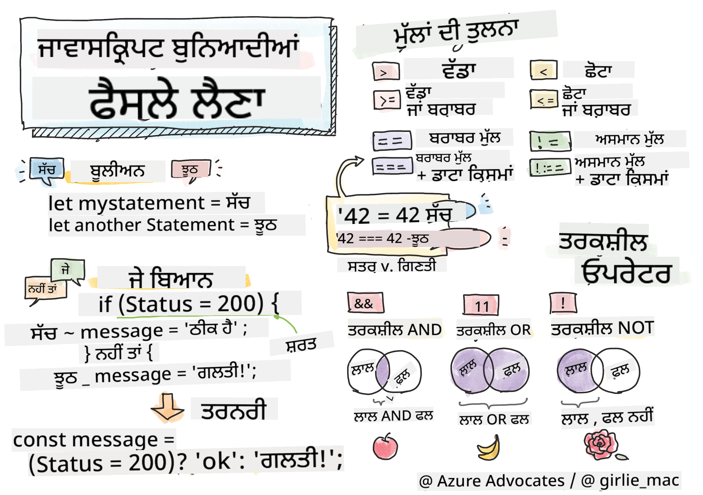

<!--
CO_OP_TRANSLATOR_METADATA:
{
  "original_hash": "888609c48329c280ca2477d2df40f2e5",
  "translation_date": "2025-08-25T21:35:50+00:00",
  "source_file": "2-js-basics/3-making-decisions/README.md",
  "language_code": "pa"
}
-->
# ਜਾਵਾਸਕ੍ਰਿਪਟ ਬੁਨਿਆਦੀਆਂ: ਫੈਸਲੇ ਲੈਣਾ



> ਸਕੈਚਨੋਟ [Tomomi Imura](https://twitter.com/girlie_mac) ਦੁਆਰਾ

## ਲੈਕਚਰ ਤੋਂ ਪਹਿਲਾਂ ਕਵਿਜ਼

[ਲੈਕਚਰ ਤੋਂ ਪਹਿਲਾਂ ਕਵਿਜ਼](https://ff-quizzes.netlify.app/web/quiz/11)

ਫੈਸਲੇ ਲੈਣ ਅਤੇ ਆਪਣੇ ਕੋਡ ਦੇ ਚਲਣ ਦੇ ਕ੍ਰਮ ਨੂੰ ਨਿਯੰਤਰਿਤ ਕਰਨ ਨਾਲ ਤੁਹਾਡਾ ਕੋਡ ਦੁਬਾਰਾ ਵਰਤਣਯੋਗ ਅਤੇ ਮਜ਼ਬੂਤ ਬਣਦਾ ਹੈ। ਇਸ ਭਾਗ ਵਿੱਚ ਜਾਵਾਸਕ੍ਰਿਪਟ ਵਿੱਚ ਡਾਟਾ ਫਲੋ ਨੂੰ ਨਿਯੰਤਰਿਤ ਕਰਨ ਲਈ ਸਿੰਟੈਕਸ ਅਤੇ ਬੂਲੀਅਨ ਡਾਟਾ ਟਾਈਪਸ ਨਾਲ ਇਸਦੇ ਮਹੱਤਵ ਬਾਰੇ ਚਰਚਾ ਕੀਤੀ ਗਈ ਹੈ।

[](https://youtube.com/watch?v=SxTp8j-fMMY "ਫੈਸਲੇ ਲੈਣਾ")

> 🎥 ਉਪਰੋਕਤ ਚਿੱਤਰ 'ਤੇ ਕਲਿਕ ਕਰੋ ਫੈਸਲੇ ਲੈਣ ਬਾਰੇ ਵੀਡੀਓ ਦੇਖਣ ਲਈ।

> ਤੁਸੀਂ ਇਹ ਪਾਠ [Microsoft Learn](https://docs.microsoft.com/learn/modules/web-development-101-if-else/?WT.mc_id=academic-77807-sagibbon) 'ਤੇ ਲੈ ਸਕਦੇ ਹੋ!

## ਬੂਲੀਅਨ ਬਾਰੇ ਇੱਕ ਛੋਟਾ ਸੰਗ੍ਰਹਿ

ਬੂਲੀਅਨ ਵਿੱਚ ਸਿਰਫ ਦੋ ਮੁੱਲ ਹੋ ਸਕਦੇ ਹਨ: `true` ਜਾਂ `false`। ਬੂਲੀਅਨ ਇਹ ਫੈਸਲਾ ਕਰਨ ਵਿੱਚ ਮਦਦ ਕਰਦੇ ਹਨ ਕਿ ਜਦੋਂ ਕੁਝ ਸ਼ਰਤਾਂ ਪੂਰੀਆਂ ਹੁੰਦੀਆਂ ਹਨ ਤਾਂ ਕਿਹੜੀਆਂ ਕੋਡ ਲਾਈਨਾਂ ਚਲਣੀਆਂ ਚਾਹੀਦੀਆਂ ਹਨ।

ਆਪਣੇ ਬੂਲੀਅਨ ਨੂੰ ਇਸ ਤਰ੍ਹਾਂ `true` ਜਾਂ `false` ਸੈਟ ਕਰੋ:

`let myTrueBool = true`  
`let myFalseBool = false`

✅ ਬੂਲੀਅਨ ਦਾ ਨਾਮ ਅੰਗਰੇਜ਼ ਗਣਿਤਜ, ਦਰਸ਼ਨਸ਼ਾਸਤਰੀ ਅਤੇ ਤਰਕਸ਼ਾਸਤਰੀ George Boole (1815–1864) ਦੇ ਨਾਮ 'ਤੇ ਰੱਖਿਆ ਗਿਆ ਹੈ।

## ਤੁਲਨਾ ਆਪਰੇਟਰ ਅਤੇ ਬੂਲੀਅਨ

ਆਪਰੇਟਰ ਸ਼ਰਤਾਂ ਦਾ ਮੁਲਾਂਕਣ ਕਰਨ ਲਈ ਵਰਤੇ ਜਾਂਦੇ ਹਨ ਜੋ ਤੁਲਨਾਵਾਂ ਕਰਕੇ ਬੂਲੀਅਨ ਮੁੱਲ ਬਣਾਉਂਦੇ ਹਨ। ਹੇਠਾਂ ਉਹ ਆਪਰੇਟਰ ਦਿੱਤੇ ਗਏ ਹਨ ਜੋ ਅਕਸਰ ਵਰਤੇ ਜਾਂਦੇ ਹਨ।

| ਚਿੰਨ੍ਹ | ਵੇਰਵਾ                                                                                                                                                   | ਉਦਾਹਰਨ            |
| ------ | ------------------------------------------------------------------------------------------------------------------------------------------------------- | ------------------ |
| `<`    | **ਘੱਟ**: ਦੋ ਮੁੱਲਾਂ ਦੀ ਤੁਲਨਾ ਕਰਦਾ ਹੈ ਅਤੇ `true` ਬੂਲੀਅਨ ਡਾਟਾ ਟਾਈਪ ਵਾਪਸ ਕਰਦਾ ਹੈ ਜੇ ਖੱਬੇ ਪਾਸੇ ਵਾਲਾ ਮੁੱਲ ਸੱਜੇ ਪਾਸੇ ਵਾਲੇ ਮੁੱਲ ਤੋਂ ਘੱਟ ਹੈ।                | `5 < 6 // true`    |
| `<=`   | **ਘੱਟ ਜਾਂ ਬਰਾਬਰ**: ਦੋ ਮੁੱਲਾਂ ਦੀ ਤੁਲਨਾ ਕਰਦਾ ਹੈ ਅਤੇ `true` ਬੂਲੀਅਨ ਡਾਟਾ ਟਾਈਪ ਵਾਪਸ ਕਰਦਾ ਹੈ ਜੇ ਖੱਬੇ ਪਾਸੇ ਵਾਲਾ ਮੁੱਲ ਸੱਜੇ ਪਾਸੇ ਵਾਲੇ ਮੁੱਲ ਤੋਂ ਘੱਟ ਜਾਂ ਬਰਾਬਰ ਹੈ। | `5 <= 6 // true`   |
| `>`    | **ਵੱਧ**: ਦੋ ਮੁੱਲਾਂ ਦੀ ਤੁਲਨਾ ਕਰਦਾ ਹੈ ਅਤੇ `true` ਬੂਲੀਅਨ ਡਾਟਾ ਟਾਈਪ ਵਾਪਸ ਕਰਦਾ ਹੈ ਜੇ ਖੱਬੇ ਪਾਸੇ ਵਾਲਾ ਮੁੱਲ ਸੱਜੇ ਪਾਸੇ ਵਾਲੇ ਮੁੱਲ ਤੋਂ ਵੱਧ ਹੈ।               | `5 > 6 // false`   |
| `>=`   | **ਵੱਧ ਜਾਂ ਬਰਾਬਰ**: ਦੋ ਮੁੱਲਾਂ ਦੀ ਤੁਲਨਾ ਕਰਦਾ ਹੈ ਅਤੇ `true` ਬੂਲੀਅਨ ਡਾਟਾ ਟਾਈਪ ਵਾਪਸ ਕਰਦਾ ਹੈ ਜੇ ਖੱਬੇ ਪਾਸੇ ਵਾਲਾ ਮੁੱਲ ਸੱਜੇ ਪਾਸੇ ਵਾਲੇ ਮੁੱਲ ਤੋਂ ਵੱਧ ਜਾਂ ਬਰਾਬਰ ਹੈ। | `5 >= 6 // false`  |
| `===`  | **ਸਖ਼ਤ ਸਮਾਨਤਾ**: ਦੋ ਮੁੱਲਾਂ ਦੀ ਤੁਲਨਾ ਕਰਦਾ ਹੈ ਅਤੇ `true` ਬੂਲੀਅਨ ਡਾਟਾ ਟਾਈਪ ਵਾਪਸ ਕਰਦਾ ਹੈ ਜੇ ਖੱਬੇ ਅਤੇ ਸੱਜੇ ਪਾਸੇ ਵਾਲੇ ਮੁੱਲ ਸਮਾਨ ਹਨ ਅਤੇ ਇੱਕੋ ਡਾਟਾ ਟਾਈਪ ਦੇ ਹਨ। | `5 === 6 // false` |
| `!==`  | **ਅਸਮਾਨਤਾ**: ਦੋ ਮੁੱਲਾਂ ਦੀ ਤੁਲਨਾ ਕਰਦਾ ਹੈ ਅਤੇ ਉਹ ਬੂਲੀਅਨ ਮੁੱਲ ਵਾਪਸ ਕਰਦਾ ਹੈ ਜੋ ਸਖ਼ਤ ਸਮਾਨਤਾ ਆਪਰੇਟਰ ਵਾਪਸ ਨਹੀਂ ਕਰਦਾ।                                    | `5 !== 6 // true`  |

✅ ਆਪਣੇ ਬ੍ਰਾਊਜ਼ਰ ਦੇ ਕਨਸੋਲ ਵਿੱਚ ਕੁਝ ਤੁਲਨਾਵਾਂ ਲਿਖ ਕੇ ਆਪਣਾ ਗਿਆਨ ਜਾਂਚੋ। ਕੀ ਕੋਈ ਵਾਪਸ ਆਏ ਡਾਟਾ ਨੇ ਤੁਹਾਨੂੰ ਹੈਰਾਨ ਕੀਤਾ?

## If ਸਟੇਟਮੈਂਟ

If ਸਟੇਟਮੈਂਟ ਆਪਣੇ ਬਲਾਕਾਂ ਵਿੱਚ ਕੋਡ ਨੂੰ ਚਲਾਏਗਾ ਜੇ ਸ਼ਰਤ `true` ਹੈ।

```javascript
if (condition) {
  //Condition is true. Code in this block will run.
}
```

ਲੌਜਿਕਲ ਆਪਰੇਟਰ ਅਕਸਰ ਸ਼ਰਤ ਬਣਾਉਣ ਲਈ ਵਰਤੇ ਜਾਂਦੇ ਹਨ।

```javascript
let currentMoney;
let laptopPrice;

if (currentMoney >= laptopPrice) {
  //Condition is true. Code in this block will run.
  console.log("Getting a new laptop!");
}
```

## If..Else ਸਟੇਟਮੈਂਟ

`else` ਸਟੇਟਮੈਂਟ ਆਪਣੇ ਬਲਾਕਾਂ ਵਿੱਚ ਕੋਡ ਨੂੰ ਚਲਾਏਗਾ ਜਦੋਂ ਸ਼ਰਤ `false` ਹੋਵੇਗੀ। ਇਹ `if` ਸਟੇਟਮੈਂਟ ਨਾਲ ਵਿਕਲਪਿਕ ਹੈ।

```javascript
let currentMoney;
let laptopPrice;

if (currentMoney >= laptopPrice) {
  //Condition is true. Code in this block will run.
  console.log("Getting a new laptop!");
} else {
  //Condition is false. Code in this block will run.
  console.log("Can't afford a new laptop, yet!");
}
```

✅ ਇਸ ਕੋਡ ਅਤੇ ਹੇਠਾਂ ਦਿੱਤੇ ਕੋਡ ਨੂੰ ਬ੍ਰਾਊਜ਼ਰ ਕਨਸੋਲ ਵਿੱਚ ਚਲਾ ਕੇ ਆਪਣੀ ਸਮਝ ਦੀ ਜਾਂਚ ਕਰੋ। `currentMoney` ਅਤੇ `laptopPrice` ਵੈਰੀਏਬਲ ਦੇ ਮੁੱਲਾਂ ਨੂੰ ਬਦਲੋ ਤਾਂ ਜੋ ਵਾਪਸ ਆਏ `console.log()` ਨੂੰ ਬਦਲਿਆ ਜਾ ਸਕੇ।

## Switch ਸਟੇਟਮੈਂਟ

`switch` ਸਟੇਟਮੈਂਟ ਵੱਖ-ਵੱਖ ਸ਼ਰਤਾਂ ਦੇ ਅਧਾਰ 'ਤੇ ਵੱਖ-ਵੱਖ ਕਾਰਵਾਈਆਂ ਕਰਨ ਲਈ ਵਰਤੀ ਜਾਂਦੀ ਹੈ। `switch` ਸਟੇਟਮੈਂਟ ਨੂੰ ਵਰਤ ਕੇ ਚਲਾਉਣ ਲਈ ਬਹੁਤ ਸਾਰੇ ਕੋਡ ਬਲਾਕਾਂ ਵਿੱਚੋਂ ਇੱਕ ਚੁਣੋ।

```javascript
switch (expression) {
  case x:
    // code block
    break;
  case y:
    // code block
    break;
  default:
  // code block
}
```

```javascript
// program using switch statement
let a = 2;

switch (a) {
  case 1:
    a = "one";
    break;
  case 2:
    a = "two";
    break;
  default:
    a = "not found";
    break;
}
console.log(`The value is ${a}`);
```

✅ ਇਸ ਕੋਡ ਅਤੇ ਹੇਠਾਂ ਦਿੱਤੇ ਕੋਡ ਨੂੰ ਬ੍ਰਾਊਜ਼ਰ ਕਨਸੋਲ ਵਿੱਚ ਚਲਾ ਕੇ ਆਪਣੀ ਸਮਝ ਦੀ ਜਾਂਚ ਕਰੋ। ਵੈਰੀਏਬਲ `a` ਦੇ ਮੁੱਲਾਂ ਨੂੰ ਬਦਲੋ ਤਾਂ ਜੋ ਵਾਪਸ ਆਏ `console.log()` ਨੂੰ ਬਦਲਿਆ ਜਾ ਸਕੇ।

## ਲੌਜਿਕਲ ਆਪਰੇਟਰ ਅਤੇ ਬੂਲੀਅਨ

ਫੈਸਲੇ ਲਈ ਕਈ ਤੁਲਨਾਵਾਂ ਦੀ ਲੋੜ ਹੋ ਸਕਦੀ ਹੈ, ਅਤੇ ਇਹਨਾਂ ਨੂੰ ਲੌਜਿਕਲ ਆਪਰੇਟਰਾਂ ਨਾਲ ਜੋੜ ਕੇ ਬੂਲੀਅਨ ਮੁੱਲ ਬਣਾਇਆ ਜਾ ਸਕਦਾ ਹੈ।

| ਚਿੰਨ੍ਹ | ਵੇਰਵਾ                                                                                     | ਉਦਾਹਰਨ                                                                 |
| ------ | ----------------------------------------------------------------------------------------- | ----------------------------------------------------------------------- |
| `&&`   | **ਲੌਜਿਕਲ AND**: ਦੋ ਬੂਲੀਅਨ ਅਭਿਵਿਅੰਜਨਾਂ ਦੀ ਤੁਲਨਾ ਕਰਦਾ ਹੈ। ਸਿਰਫ ਦੋਵੇਂ ਪਾਸੇ `true` ਹੋਣ 'ਤੇ `true` ਵਾਪਸ ਕਰਦਾ ਹੈ। | `(5 > 6) && (5 < 6 ) //ਇੱਕ ਪਾਸਾ false ਹੈ, ਦੂਜਾ true ਹੈ। false ਵਾਪਸ ਕਰਦਾ ਹੈ।` |
| `\|\|` | **ਲੌਜਿਕਲ OR**: ਦੋ ਬੂਲੀਅਨ ਅਭਿਵਿਅੰਜਨਾਂ ਦੀ ਤੁਲਨਾ ਕਰਦਾ ਹੈ। ਘੱਟੋ-ਘੱਟ ਇੱਕ ਪਾਸਾ `true` ਹੋਣ 'ਤੇ `true` ਵਾਪਸ ਕਰਦਾ ਹੈ। | `(5 > 6) \|\| (5 < 6) //ਇੱਕ ਪਾਸਾ false ਹੈ, ਦੂਜਾ true ਹੈ। true ਵਾਪਸ ਕਰਦਾ ਹੈ।` |
| `!`    | **ਲੌਜਿਕਲ NOT**: ਬੂਲੀਅਨ ਅਭਿਵਿਅੰਜਨ ਦਾ ਵਿਰੋਧੀ ਮੁੱਲ ਵਾਪਸ ਕਰਦਾ ਹੈ।                             | `!(5 > 6) // 5 6 ਤੋਂ ਵੱਧ ਨਹੀਂ ਹੈ, ਪਰ "!" true ਵਾਪਸ ਕਰੇਗਾ।`               |

## ਲੌਜਿਕਲ ਆਪਰੇਟਰਾਂ ਨਾਲ ਸ਼ਰਤਾਂ ਅਤੇ ਫੈਸਲੇ

ਲੌਜਿਕਲ ਆਪਰੇਟਰਾਂ ਨੂੰ if..else ਸਟੇਟਮੈਂਟ ਵਿੱਚ ਸ਼ਰਤਾਂ ਬਣਾਉਣ ਲਈ ਵਰਤਿਆ ਜਾ ਸਕਦਾ ਹੈ।

```javascript
let currentMoney;
let laptopPrice;
let laptopDiscountPrice = laptopPrice - laptopPrice * 0.2; //Laptop price at 20 percent off

if (currentMoney >= laptopPrice || currentMoney >= laptopDiscountPrice) {
  //Condition is true. Code in this block will run.
  console.log("Getting a new laptop!");
} else {
  //Condition is true. Code in this block will run.
  console.log("Can't afford a new laptop, yet!");
}
```

### ਨਿਗੇਸ਼ਨ ਆਪਰੇਟਰ

ਤੁਸੀਂ ਹੁਣ ਤੱਕ ਦੇਖਿਆ ਹੈ ਕਿ ਤੁਸੀਂ `if...else` ਸਟੇਟਮੈਂਟ ਦੀ ਵਰਤੋਂ ਕਰਕੇ ਸ਼ਰਤਮੁਲਕ ਤਰਕ ਬਣਾਉਣ ਲਈ ਕਿਵੇਂ ਵਰਤ ਸਕਦੇ ਹੋ। ਜੋ ਕੁਝ ਵੀ `if` ਵਿੱਚ ਜਾਂਦਾ ਹੈ ਉਸਨੂੰ `true/false` ਵਿੱਚ ਮੁਲਾਂਕਣ ਕੀਤਾ ਜਾਣਾ ਚਾਹੀਦਾ ਹੈ। `!` ਆਪਰੇਟਰ ਦੀ ਵਰਤੋਂ ਕਰਕੇ ਤੁਸੀਂ ਅਭਿਵਿਅੰਜਨ ਨੂੰ _ਨਿਗੇਟ_ ਕਰ ਸਕਦੇ ਹੋ। ਇਹ ਇਸ ਤਰ੍ਹਾਂ ਲੱਗੇਗਾ:

```javascript
if (!condition) {
  // runs if condition is false
} else {
  // runs if condition is true
}
```

### ਟਰਨਰੀ ਅਭਿਵਿਅੰਜਨ

`if...else` ਫੈਸਲੇ ਦੇ ਤਰਕ ਨੂੰ ਪ੍ਰਗਟ ਕਰਨ ਦਾ ਇੱਕੋ ਇਕ ਤਰੀਕਾ ਨਹੀਂ ਹੈ। ਤੁਸੀਂ ਕੁਝ ਐਸਾ ਵਰਤ ਸਕਦੇ ਹੋ ਜਿਸਨੂੰ ਟਰਨਰੀ ਆਪਰੇਟਰ ਕਿਹਾ ਜਾਂਦਾ ਹੈ। ਇਸਦਾ ਸਿੰਟੈਕਸ ਇਸ ਤਰ੍ਹਾਂ ਲੱਗਦਾ ਹੈ:

```javascript
let variable = condition ? <return this if true> : <return this if false>
```

ਹੇਠਾਂ ਇੱਕ ਹੋਰ ਵਧੇਰੇ ਠੋਸ ਉਦਾਹਰਨ ਹੈ:

```javascript
let firstNumber = 20;
let secondNumber = 10;
let biggestNumber = firstNumber > secondNumber ? firstNumber : secondNumber;
```

✅ ਇਸ ਕੋਡ ਨੂੰ ਕੁਝ ਵਾਰ ਪੜ੍ਹਨ ਲਈ ਇੱਕ ਮਿੰਟ ਲਓ। ਕੀ ਤੁਸੀਂ ਸਮਝਦੇ ਹੋ ਕਿ ਇਹ ਆਪਰੇਟਰ ਕਿਵੇਂ ਕੰਮ ਕਰ ਰਹੇ ਹਨ?

ਉਪਰੋਕਤ ਇਹ ਦੱਸਦਾ ਹੈ ਕਿ

- ਜੇ `firstNumber` `secondNumber` ਤੋਂ ਵੱਡਾ ਹੈ
- ਤਾਂ `firstNumber` ਨੂੰ `biggestNumber` ਵਿੱਚ ਅਸਾਈਨ ਕਰੋ
- ਨਹੀਂ ਤਾਂ `secondNumber` ਨੂੰ ਅਸਾਈਨ ਕਰੋ।

ਟਰਨਰੀ ਅਭਿਵਿਅੰਜਨ ਸਿਰਫ ਹੇਠਾਂ ਦਿੱਤੇ ਕੋਡ ਨੂੰ ਲਿਖਣ ਦਾ ਇੱਕ ਸੰਕੁਚਿਤ ਤਰੀਕਾ ਹੈ:

```javascript
let biggestNumber;
if (firstNumber > secondNumber) {
  biggestNumber = firstNumber;
} else {
  biggestNumber = secondNumber;
}
```

---

## 🚀 ਚੁਣੌਤੀ

ਇੱਕ ਪ੍ਰੋਗਰਾਮ ਬਣਾਓ ਜੋ ਪਹਿਲਾਂ ਲੌਜਿਕਲ ਆਪਰੇਟਰਾਂ ਨਾਲ ਲਿਖਿਆ ਗਿਆ ਹੋਵੇ, ਅਤੇ ਫਿਰ ਇਸਨੂੰ ਟਰਨਰੀ ਅਭਿਵਿਅੰਜਨ ਦੀ ਵਰਤੋਂ ਕਰਕੇ ਦੁਬਾਰਾ ਲਿਖੋ। ਤੁਹਾਡਾ ਪਸੰਦੀਦਾ ਸਿੰਟੈਕਸ ਕਿਹੜਾ ਹੈ?

---

## ਲੈਕਚਰ ਤੋਂ ਬਾਅਦ ਕਵਿਜ਼

[ਲੈਕਚਰ ਤੋਂ ਬਾਅਦ ਕਵਿਜ਼](https://ff-quizzes.netlify.app/web/quiz/12)

## ਸਮੀਖਿਆ ਅਤੇ ਸਵੈ-ਅਧਿਐਨ

ਉਪਭੋਗਤਾ ਲਈ ਉਪਲਬਧ ਕਈ ਆਪਰੇਟਰਾਂ ਬਾਰੇ ਹੋਰ ਪੜ੍ਹੋ [MDN 'ਤੇ](https://developer.mozilla.org/docs/Web/JavaScript/Reference/Operators)।

Josh Comeau ਦੀ ਸ਼ਾਨਦਾਰ [ਆਪਰੇਟਰ ਲੁਕਅੱਪ](https://joshwcomeau.com/operator-lookup/) ਨੂੰ ਜਾਓ!

## ਅਸਾਈਨਮੈਂਟ

[ਆਪਰੇਟਰ](assignment.md)

**ਅਸਵੀਕਾਰਨਾ**:  
ਇਹ ਦਸਤਾਵੇਜ਼ AI ਅਨੁਵਾਦ ਸੇਵਾ [Co-op Translator](https://github.com/Azure/co-op-translator) ਦੀ ਵਰਤੋਂ ਕਰਕੇ ਅਨੁਵਾਦ ਕੀਤਾ ਗਿਆ ਹੈ। ਜਦੋਂ ਕਿ ਅਸੀਂ ਸਹੀ ਹੋਣ ਦੀ ਕੋਸ਼ਿਸ਼ ਕਰਦੇ ਹਾਂ, ਕਿਰਪਾ ਕਰਕੇ ਧਿਆਨ ਦਿਓ ਕਿ ਸਵੈਚਾਲਿਤ ਅਨੁਵਾਦਾਂ ਵਿੱਚ ਗਲਤੀਆਂ ਜਾਂ ਅਸੁੱਤੀਆਂ ਹੋ ਸਕਦੀਆਂ ਹਨ। ਇਸ ਦੀ ਮੂਲ ਭਾਸ਼ਾ ਵਿੱਚ ਮੌਜੂਦ ਮੂਲ ਦਸਤਾਵੇਜ਼ ਨੂੰ ਅਧਿਕਾਰਕ ਸਰੋਤ ਮੰਨਿਆ ਜਾਣਾ ਚਾਹੀਦਾ ਹੈ। ਮਹੱਤਵਪੂਰਨ ਜਾਣਕਾਰੀ ਲਈ, ਪੇਸ਼ੇਵਰ ਮਨੁੱਖੀ ਅਨੁਵਾਦ ਦੀ ਸਿਫਾਰਸ਼ ਕੀਤੀ ਜਾਂਦੀ ਹੈ। ਇਸ ਅਨੁਵਾਦ ਦੇ ਪ੍ਰਯੋਗ ਤੋਂ ਪੈਦਾ ਹੋਣ ਵਾਲੀਆਂ ਕਿਸੇ ਵੀ ਗਲਤਫਹਮੀਆਂ ਜਾਂ ਗਲਤ ਵਿਆਖਿਆਵਾਂ ਲਈ ਅਸੀਂ ਜ਼ਿੰਮੇਵਾਰ ਨਹੀਂ ਹਾਂ।