# ਜਾਵਾਸਕ੍ਰਿਪਟ ਬੇਸਿਕਸ: ਫੈਸਲੇ ਲੈਣਾ

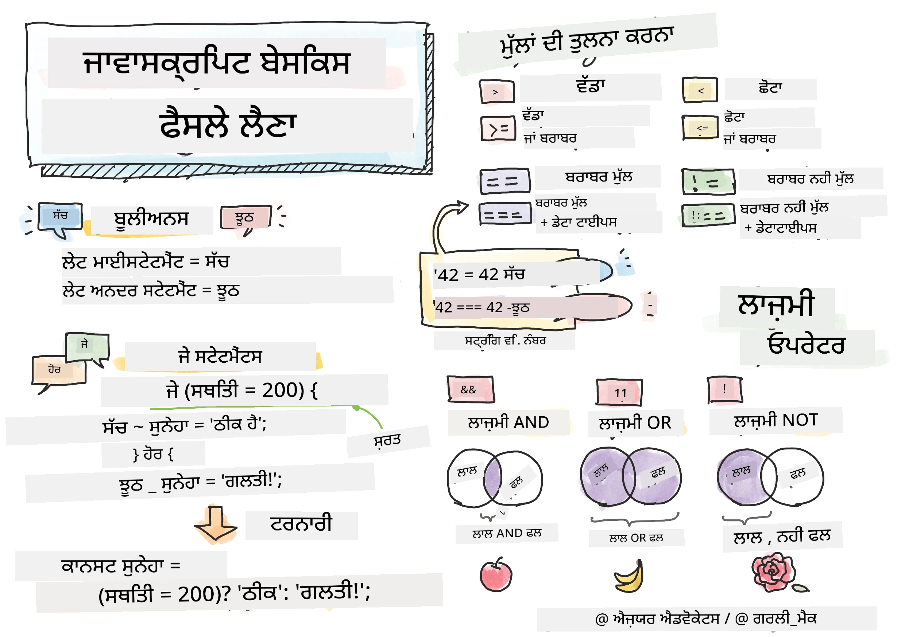

> ਸਕੈਚਨੋਟ [ਟੋਮੋਮੀ ਇਮੁਰਾ](https://twitter.com/girlie_mac) ਦੁਆਰਾ

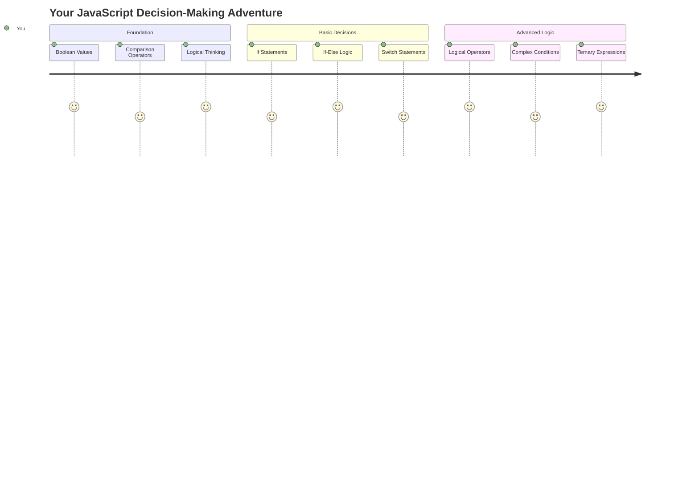

ਕੀ ਤੁਸੀਂ ਕਦੇ ਸੋਚਿਆ ਹੈ ਕਿ ਐਪਲੀਕੇਸ਼ਨ ਸਮਾਰਟ ਫੈਸਲੇ ਕਿਵੇਂ ਲੈਂਦੀਆਂ ਹਨ? ਜਿਵੇਂ ਕਿ ਇੱਕ ਨੈਵੀਗੇਸ਼ਨ ਸਿਸਟਮ ਤੇਜ਼ ਰਸਤਾ ਕਿਵੇਂ ਚੁਣਦਾ ਹੈ, ਜਾਂ ਇੱਕ ਥਰਮੋਸਟੈਟ ਗਰਮੀ ਚਾਲੂ ਕਰਨ ਦਾ ਫੈਸਲਾ ਕਿਵੇਂ ਕਰਦਾ ਹੈ? ਇਹ ਪ੍ਰੋਗਰਾਮਿੰਗ ਵਿੱਚ ਫੈਸਲੇ ਲੈਣ ਦਾ ਮੂਲ ਸਿਧਾਂਤ ਹੈ।

ਜਿਵੇਂ ਚਾਰਲਸ ਬੈਬੇਜ ਦੇ ਐਨਾਲਿਟਿਕਲ ਇੰਜਨ ਨੂੰ ਹਾਲਾਤਾਂ ਦੇ ਅਧਾਰ 'ਤੇ ਵੱਖ-ਵੱਖ ਕਾਰਵਾਈਆਂ ਦੇ ਕ੍ਰਮਾਂ ਦੀ ਪਾਲਣਾ ਕਰਨ ਲਈ ਡਿਜ਼ਾਈਨ ਕੀਤਾ ਗਿਆ ਸੀ, ਆਧੁਨਿਕ ਜਾਵਾਸਕ੍ਰਿਪਟ ਪ੍ਰੋਗਰਾਮ ਵੱਖ-ਵੱਖ ਹਾਲਾਤਾਂ ਦੇ ਅਧਾਰ 'ਤੇ ਚੋਣਾਂ ਕਰਨ ਦੀ ਲੋੜ ਹੁੰਦੀ ਹੈ। ਇਹ ਸ਼ਾਖਾ ਬਣਾਉਣ ਅਤੇ ਫੈਸਲੇ ਲੈਣ ਦੀ ਯੋਗਤਾ ਹੈ ਜੋ ਸਥਿਰ ਕੋਡ ਨੂੰ ਪ੍ਰਤੀਕ੍ਰਿਆਸ਼ੀਲ, ਸਮਰੱਥ ਐਪਲੀਕੇਸ਼ਨ ਵਿੱਚ ਬਦਲਦੀ ਹੈ।

ਇਸ ਪਾਠ ਵਿੱਚ, ਤੁਸੀਂ ਆਪਣੇ ਪ੍ਰੋਗਰਾਮਾਂ ਵਿੱਚ ਸ਼ਰਤੀ ਤਰਕ ਨੂੰ ਲਾਗੂ ਕਰਨ ਦਾ ਤਰੀਕਾ ਸਿੱਖੋਗੇ। ਅਸੀਂ ਸ਼ਰਤੀ ਬਿਆਨ, ਤੁਲਨਾ ਆਪਰੇਟਰ ਅਤੇ ਤਰਕਸ਼ੀਲ ਅਭਿਵਿਅਕਤੀਆਂ ਦੀ ਖੋਜ ਕਰਾਂਗੇ ਜੋ ਤੁਹਾਡੇ ਕੋਡ ਨੂੰ ਹਾਲਾਤਾਂ ਦਾ ਮੁਲਾਂਕਣ ਕਰਨ ਅਤੇ ਉਚਿਤ ਤਰੀਕੇ ਨਾਲ ਪ੍ਰਤੀਕ੍ਰਿਆ ਕਰਨ ਦੀ ਆਗਿਆ ਦਿੰਦੇ ਹਨ।

## ਪਾਠ ਤੋਂ ਪਹਿਲਾਂ ਕਵਿਜ਼

[ਪਾਠ ਤੋਂ ਪਹਿਲਾਂ ਕਵਿਜ਼](https://ff-quizzes.netlify.app/web/quiz/11)

ਫੈਸਲੇ ਲੈਣ ਅਤੇ ਪ੍ਰੋਗਰਾਮ ਦੇ ਪ੍ਰਵਾਹ ਨੂੰ ਨਿਯੰਤਰਿਤ ਕਰਨ ਦੀ ਯੋਗਤਾ ਪ੍ਰੋਗਰਾਮਿੰਗ ਦਾ ਇੱਕ ਮੂਲ ਪੱਖ ਹੈ। ਇਹ ਭਾਗ ਕਵਰ ਕਰਦਾ ਹੈ ਕਿ ਜਾਵਾਸਕ੍ਰਿਪਟ ਪ੍ਰੋਗਰਾਮਾਂ ਦੇ ਕਾਰਜ ਪਾਠ ਨੂੰ ਬੂਲੀਅਨ ਮੁੱਲਾਂ ਅਤੇ ਸ਼ਰਤੀ ਤਰਕ ਦੀ ਵਰਤੋਂ ਕਰਕੇ ਕਿਵੇਂ ਨਿਯੰਤਰਿਤ ਕੀਤਾ ਜਾ ਸਕਦਾ ਹੈ।

[](https://youtube.com/watch?v=SxTp8j-fMMY "ਫੈਸਲੇ ਲੈਣਾ")

> 🎥 ਉੱਪਰ ਦਿੱਤੀ ਤਸਵੀਰ 'ਤੇ ਕਲਿਕ ਕਰੋ ਫੈਸਲੇ ਲੈਣ ਬਾਰੇ ਵੀਡੀਓ ਲਈ।

> ਤੁਸੀਂ ਇਹ ਪਾਠ [ਮਾਈਕਰੋਸਾਫਟ ਲਰਨ](https://docs.microsoft.com/learn/modules/web-development-101-if-else/?WT.mc_id=academic-77807-sagibbon) 'ਤੇ ਲੈ ਸਕਦੇ ਹੋ!

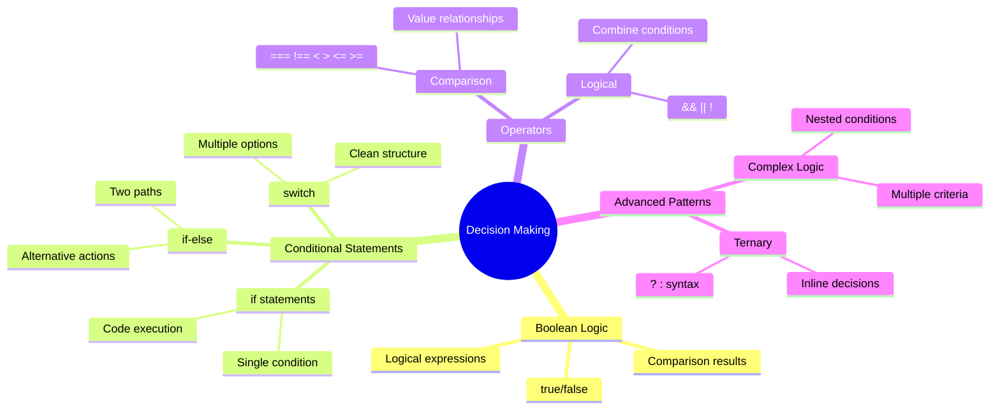

## ਬੂਲੀਅਨਸ 'ਤੇ ਇੱਕ ਛੋਟਾ ਸਾਰ

ਫੈਸਲੇ ਲੈਣ ਦੀ ਖੋਜ ਕਰਨ ਤੋਂ ਪਹਿਲਾਂ, ਆਓ ਪਿਛਲੇ ਪਾਠ ਤੋਂ ਬੂਲੀਅਨ ਮੁੱਲਾਂ ਨੂੰ ਦੁਬਾਰਾ ਵੇਖੀਏ। ਗਣਿਤਜੀ ਜਾਰਜ ਬੂਲ ਦੇ ਨਾਮ 'ਤੇ ਰੱਖੇ ਗਏ, ਇਹ ਮੁੱਲ ਦੋਹਰੇ ਰਾਜਾਂ ਦਾ ਪ੍ਰਤੀਨਿਧਿਤਾ ਕਰਦੇ ਹਨ - ਜਾਂ `true` ਜਾਂ `false`। ਕੋਈ ਗੁੰਝਲ ਨਹੀਂ, ਕੋਈ ਮੱਧ ਦਾ ਰਾਹ ਨਹੀਂ।

ਇਹ ਦੋਹਰੇ ਮੁੱਲ ਸਾਰੇ ਗਣਨਾਤਮਕ ਤਰਕ ਦੀ ਨੀਂਹ ਬਣਾਉਂਦੇ ਹਨ। ਤੁਹਾਡਾ ਪ੍ਰੋਗਰਾਮ ਜੋ ਵੀ ਫੈਸਲਾ ਲੈਂਦਾ ਹੈ, ਆਖਿਰਕਾਰ ਇੱਕ ਬੂਲੀਅਨ ਮੁਲਾਂਕਣ 'ਤੇ ਘਟਦਾ ਹੈ।

ਬੂਲੀਅਨ ਵੈਰੀਏਬਲ ਬਣਾਉਣਾ ਸਿੱਧਾ ਹੈ:

```javascript
let myTrueBool = true;
let myFalseBool = false;
```

ਇਹ ਦੋ ਵੈਰੀਏਬਲਾਂ ਨੂੰ ਸਪਸ਼ਟ ਬੂਲੀਅਨ ਮੁੱਲਾਂ ਨਾਲ ਬਣਾਉਂਦਾ ਹੈ।

✅ ਬੂਲੀਅਨਸ ਦਾ ਨਾਮ ਅੰਗਰੇਜ਼ੀ ਗਣਿਤਜੀ, ਦਰਸ਼ਨਸ਼ਾਸਤਰੀ ਅਤੇ ਤਰਕਸ਼ਾਸਤਰੀ ਜਾਰਜ ਬੂਲ (1815–1864) ਦੇ ਨਾਮ 'ਤੇ ਰੱਖਿਆ ਗਿਆ ਹੈ।

## ਤੁਲਨਾ ਆਪਰੇਟਰ ਅਤੇ ਬੂਲੀਅਨਸ

ਅਮਲ ਵਿੱਚ, ਤੁਸੀਂ ਬੂਲੀਅਨ ਮੁੱਲਾਂ ਨੂੰ ਹੱਥੋਂ ਸੈਟ ਨਹੀਂ ਕਰਦੇ। ਇਸਦੀ ਬਜਾਏ, ਤੁਸੀਂ ਹਾਲਾਤਾਂ ਦਾ ਮੁਲਾਂਕਣ ਕਰਕੇ ਉਹਨਾਂ ਨੂੰ ਜਨਰੇਟ ਕਰਦੇ ਹੋ: "ਕੀ ਇਹ ਨੰਬਰ ਉਸ ਤੋਂ ਵੱਡਾ ਹੈ?" ਜਾਂ "ਕੀ ਇਹ ਮੁੱਲ ਬਰਾਬਰ ਹਨ?"

ਤੁਲਨਾ ਆਪਰੇਟਰ ਇਹ ਮੁਲਾਂਕਣ ਕਰਨ ਦੀ ਆਗਿਆ ਦਿੰਦੇ ਹਨ। ਉਹ ਮੁੱਲਾਂ ਦੀ ਤੁਲਨਾ ਕਰਦੇ ਹਨ ਅਤੇ ਓਪਰੇਂਡਾਂ ਦੇ ਰਿਸ਼ਤੇ ਦੇ ਅਧਾਰ 'ਤੇ ਬੂਲੀਅਨ ਨਤੀਜੇ ਵਾਪਸ ਕਰਦੇ ਹਨ।

| ਚਿੰਨ੍ਹ | ਵੇਰਵਾ                                                                                                                                                   | ਉਦਾਹਰਨ            |
| ------ | ------------------------------------------------------------------------------------------------------------------------------------------------------------- | ------------------ |
| `<`    | **ਘੱਟ ਹੈ**: ਦੋ ਮੁੱਲਾਂ ਦੀ ਤੁਲਨਾ ਕਰਦਾ ਹੈ ਅਤੇ `true` ਬੂਲੀਅਨ ਡੇਟਾ ਟਾਈਪ ਵਾਪਸ ਕਰਦਾ ਹੈ ਜੇ ਖੱਬੇ ਪਾਸੇ ਦਾ ਮੁੱਲ ਸੱਜੇ ਪਾਸੇ ਤੋਂ ਘੱਟ ਹੈ                              | `5 < 6 // true`    |
| `<=`   | **ਘੱਟ ਜਾਂ ਬਰਾਬਰ**: ਦੋ ਮੁੱਲਾਂ ਦੀ ਤੁਲਨਾ ਕਰਦਾ ਹੈ ਅਤੇ `true` ਬੂਲੀਅਨ ਡੇਟਾ ਟਾਈਪ ਵਾਪਸ ਕਰਦਾ ਹੈ ਜੇ ਖੱਬੇ ਪਾਸੇ ਦਾ ਮੁੱਲ ਸੱਜੇ ਪਾਸੇ ਤੋਂ ਘੱਟ ਜਾਂ ਬਰਾਬਰ ਹੈ      | `5 <= 6 // true`   |
| `>`    | **ਵੱਡਾ ਹੈ**: ਦੋ ਮੁੱਲਾਂ ਦੀ ਤੁਲਨਾ ਕਰਦਾ ਹੈ ਅਤੇ `true` ਬੂਲੀਅਨ ਡੇਟਾ ਟਾਈਪ ਵਾਪਸ ਕਰਦਾ ਹੈ ਜੇ ਖੱਬੇ ਪਾਸੇ ਦਾ ਮੁੱਲ ਸੱਜੇ ਪਾਸੇ ਤੋਂ ਵੱਡਾ ਹੈ                         | `5 > 6 // false`   |
| `>=`   | **ਵੱਡਾ ਜਾਂ ਬਰਾਬਰ**: ਦੋ ਮੁੱਲਾਂ ਦੀ ਤੁਲਨਾ ਕਰਦਾ ਹੈ ਅਤੇ `true` ਬੂਲੀਅਨ ਡੇਟਾ ਟਾਈਪ ਵਾਪਸ ਕਰਦਾ ਹੈ ਜੇ ਖੱਬੇ ਪਾਸੇ ਦਾ ਮੁੱਲ ਸੱਜੇ ਪਾਸੇ ਤੋਂ ਵੱਡਾ ਜਾਂ ਬਰਾਬਰ ਹੈ | `5 >= 6 // false`  |
| `===`  | **ਸਖ਼ਤ ਬਰਾਬਰੀ**: ਦੋ ਮੁੱਲਾਂ ਦੀ ਤੁਲਨਾ ਕਰਦਾ ਹੈ ਅਤੇ `true` ਬੂਲੀਅਨ ਡੇਟਾ ਟਾਈਪ ਵਾਪਸ ਕਰਦਾ ਹੈ ਜੇ ਖੱਬੇ ਅਤੇ ਸੱਜੇ ਪਾਸੇ ਦੇ ਮੁੱਲ ਬਰਾਬਰ ਹਨ ਅਤੇ ਇੱਕੋ ਡੇਟਾ ਟਾਈਪ ਹਨ।       | `5 === 6 // false` |
| `!==`  | **ਅਸਮਾਨਤਾ**: ਦੋ ਮੁੱਲਾਂ ਦੀ ਤੁਲਨਾ ਕਰਦਾ ਹੈ ਅਤੇ ਜੋ ਸਖ਼ਤ ਬਰਾਬਰੀ ਆਪਰੇਟਰ ਵਾਪਸ ਕਰੇਗਾ ਉਸਦਾ ਵਿਰੋਧੀ ਬੂਲੀਅਨ ਮੁੱਲ ਵਾਪਸ ਕਰਦਾ ਹੈ                                    | `5 !== 6 // true`  |

✅ ਆਪਣੇ ਬ੍ਰਾਊਜ਼ਰ ਦੇ ਕਨਸੋਲ ਵਿੱਚ ਕੁਝ ਤੁਲਨਾਵਾਂ ਲਿਖ ਕੇ ਆਪਣੀ ਜਾਣਕਾਰੀ ਦੀ ਜਾਂਚ ਕਰੋ। ਕੀ ਕੋਈ ਵਾਪਸ ਕੀਤਾ ਡੇਟਾ ਤੁਹਾਨੂੰ ਹੈਰਾਨ ਕਰਦਾ ਹੈ?

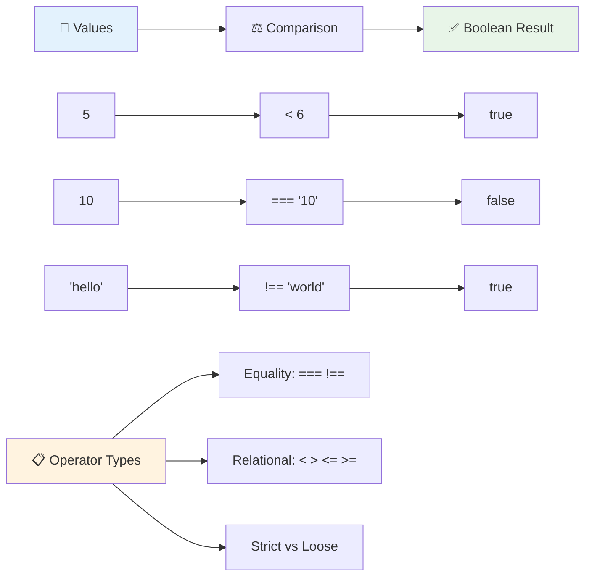

### 🧠 **ਤੁਲਨਾ ਦੀ ਮਾਹਰਤਾ ਦੀ ਜਾਂਚ: ਬੂਲੀਅਨ ਤਰਕ ਨੂੰ ਸਮਝਣਾ**

**ਆਪਣੀ ਤੁਲਨਾ ਦੀ ਸਮਝ ਦੀ ਜਾਂਚ ਕਰੋ:**
- ਤੁਹਾਨੂੰ ਕਿਉਂ ਲੱਗਦਾ ਹੈ ਕਿ `===` (ਸਖ਼ਤ ਬਰਾਬਰੀ) ਨੂੰ ਆਮ ਤੌਰ 'ਤੇ `==` (ਢਿੱਲੀ ਬਰਾਬਰੀ) ਤੋਂ ਵਧੇਰੇ ਤਰਜੀਹ ਦਿੱਤੀ ਜਾਂਦੀ ਹੈ?
- ਕੀ ਤੁਸੀਂ ਅਨੁਮਾਨ ਲਗਾ ਸਕਦੇ ਹੋ ਕਿ `5 === '5'` ਕੀ ਵਾਪਸ ਕਰਦਾ ਹੈ? `5 == '5'` ਬਾਰੇ ਕੀ?
- `!==` ਅਤੇ `!=` ਵਿੱਚ ਕੀ ਅੰਤਰ ਹੈ?

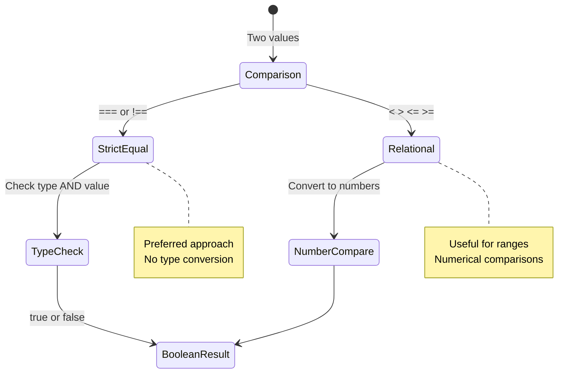

> **ਪ੍ਰੋ ਟਿਪ**: ਬਰਾਬਰੀ ਦੀ ਜਾਂਚ ਲਈ ਹਮੇਸ਼ਾ `===` ਅਤੇ `!==` ਦੀ ਵਰਤੋਂ ਕਰੋ ਜਦੋਂ ਤੱਕ ਤੁਹਾਨੂੰ ਖਾਸ ਤੌਰ 'ਤੇ ਟਾਈਪ ਕਨਵਰਜ਼ਨ ਦੀ ਲੋੜ ਨਾ ਹੋਵੇ। ਇਹ ਅਣਪ੍ਰਤੀਕਸ਼ਿਤ ਵਿਵਹਾਰ ਨੂੰ ਰੋਕਦਾ ਹੈ!

## If ਬਿਆਨ

`if` ਬਿਆਨ ਤੁਹਾਡੇ ਕੋਡ ਵਿੱਚ ਇੱਕ ਸਵਾਲ ਪੁੱਛਣ ਵਾਂਗ ਹੈ। "ਜੇ ਇਹ ਹਾਲਾਤ ਸਹੀ ਹੈ, ਤਾਂ ਇਹ ਕੰਮ ਕਰੋ।" ਇਹ ਸ਼ਾਇਦ ਸਭ ਤੋਂ ਮਹੱਤਵਪੂਰਨ ਸੰਦ ਹੈ ਜੋ ਤੁਸੀਂ ਜਾਵਾਸਕ੍ਰਿਪਟ ਵਿੱਚ ਫੈਸਲੇ ਲੈਣ ਲਈ ਵਰਤੋਂਗੇ।

ਇਹ ਇਸ ਤਰ੍ਹਾਂ ਕੰਮ ਕਰਦਾ ਹੈ:

```javascript
if (condition) {
  // Condition is true. Code in this block will run.
}
```

ਹਾਲਾਤ ਨੂੰ ਕੋਠੇ ਵਿੱਚ ਰੱਖਿਆ ਜਾਂਦਾ ਹੈ, ਅਤੇ ਜੇ ਇਹ `true` ਹੈ, ਜਾਵਾਸਕ੍ਰਿਪਟ ਘੁੰਮਾਏ ਬ੍ਰੇਸਾਂ ਦੇ ਅੰਦਰ ਕੋਡ ਚਲਾਉਂਦਾ ਹੈ। ਜੇ ਇਹ `false` ਹੈ, ਜਾਵਾਸਕ੍ਰਿਪਟ ਉਸ ਸਾਰੇ ਬਲਾਕ ਨੂੰ ਛੱਡ ਦਿੰਦਾ ਹੈ।

ਤੁਸੀਂ ਅਕਸਰ ਇਹ ਹਾਲਾਤ ਬਣਾਉਣ ਲਈ ਤੁਲਨਾ ਆਪਰੇਟਰ ਦੀ ਵਰਤੋਂ ਕਰੋਗੇ। ਆਓ ਇੱਕ ਵਿਹੰਗਮ ਉਦਾਹਰਨ ਵੇਖੀਏ:

```javascript
let currentMoney = 1000;
let laptopPrice = 800;

if (currentMoney >= laptopPrice) {
  // Condition is true. Code in this block will run.
  console.log("Getting a new laptop!");
}
```

ਕਿਉਂਕਿ `1000 >= 800` ਦਾ ਮੁਲਾਂਕਣ `true` ਹੈ, ਬਲਾਕ ਦੇ ਅੰਦਰ ਕੋਡ ਚਲਦਾ ਹੈ, "Getting a new laptop!" ਕਨਸੋਲ ਵਿੱਚ ਦਿਖਾਉਂਦਾ ਹੈ।

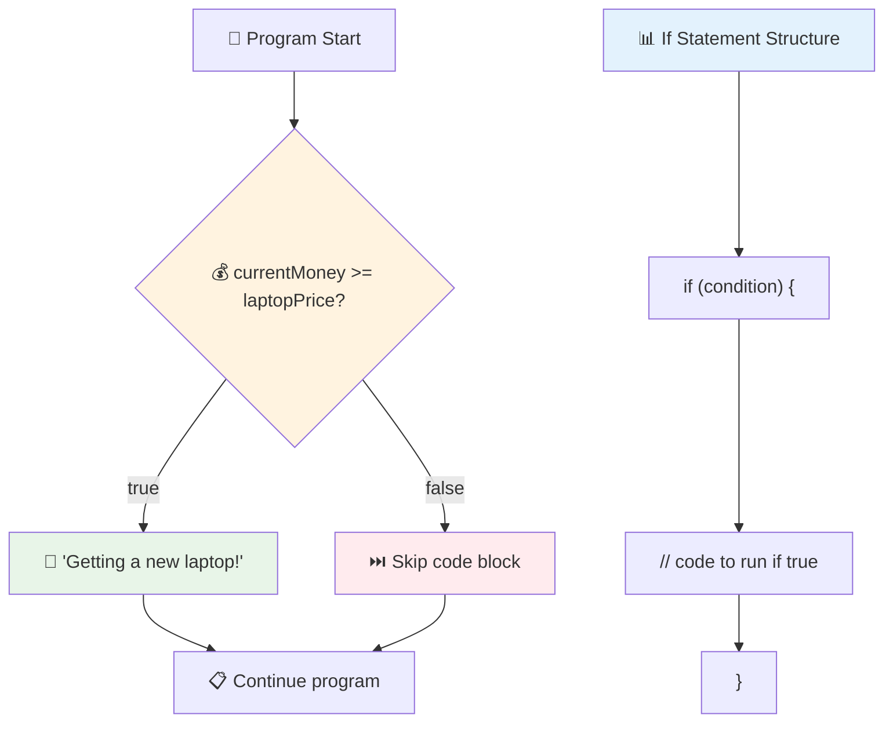

## If..Else ਬਿਆਨ

ਪਰ ਜੇ ਤੁਸੀਂ ਚਾਹੁੰਦੇ ਹੋ ਕਿ ਜਦੋਂ ਹਾਲਾਤ ਗਲਤ ਹੋਵੇ ਤਾਂ ਤੁਹਾਡਾ ਪ੍ਰੋਗਰਾਮ ਕੁਝ ਵੱਖਰਾ ਕਰੇ? ਇਹਥੇ `else` ਆਉਂਦਾ ਹੈ - ਇਹ ਜਿਵੇਂ ਕਿ ਇੱਕ ਬੈਕਅਪ ਯੋਜਨਾ ਹੈ।

`else` ਬਿਆਨ ਤੁਹਾਨੂੰ ਇਹ ਕਹਿਣ ਦਾ ਤਰੀਕਾ ਦਿੰਦਾ ਹੈ "ਜੇ ਇਹ ਹਾਲਾਤ ਸਹੀ ਨਹੀਂ ਹੈ, ਤਾਂ ਇਸ ਦੇ ਬਦਲੇ ਵਿੱਚ ਇਹ ਹੋਰ ਕੰਮ ਕਰੋ।"

```javascript
let currentMoney = 500;
let laptopPrice = 800;

if (currentMoney >= laptopPrice) {
  // Condition is true. Code in this block will run.
  console.log("Getting a new laptop!");
} else {
  // Condition is false. Code in this block will run.
  console.log("Can't afford a new laptop, yet!");
}
```

ਹੁਣ ਕਿਉਂਕਿ `500 >= 800` `false` ਹੈ, ਜਾਵਾਸਕ੍ਰਿਪਟ ਪਹਿਲੇ ਬਲਾਕ ਨੂੰ ਛੱਡ ਦਿੰਦਾ ਹੈ ਅਤੇ `else` ਬਲਾਕ ਨੂੰ ਚਲਾਉਂਦਾ ਹੈ। ਤੁਸੀਂ "Can't afford a new laptop, yet!" ਕਨਸੋਲ ਵਿੱਚ ਦੇਖੋਗੇ।

✅ ਇਸ ਕੋਡ ਅਤੇ ਹੇਠਾਂ ਦਿੱਤੇ ਕੋਡ ਨੂੰ ਬ੍ਰਾਊਜ਼ਰ ਕਨਸੋਲ ਵਿੱਚ ਚਲਾਕੇ ਆਪਣੀ ਸਮਝ ਦੀ ਜਾਂਚ ਕਰੋ। `currentMoney` ਅਤੇ `laptopPrice` ਵੈਰੀਏਬਲਾਂ ਦੇ ਮੁੱਲਾਂ ਨੂੰ ਬਦਲੋ ਤਾਂ ਜੋ ਵਾਪਸ ਕੀਤਾ `console.log()` ਬਦਲ ਜਾਵੇ।

### 🎯 **If-Else ਤਰਕ ਦੀ ਜਾਂਚ: ਸ਼ਾਖਾ ਪਾਠ**

**ਆਪਣੀ ਸ਼ਰਤੀ ਤਰਕ ਦੀ ਸਮਝ ਦਾ ਮੁਲਾਂਕਣ ਕਰੋ:**
- ਕੀ ਹੁੰਦਾ ਹੈ ਜੇ `currentMoney` `laptopPrice` ਦੇ ਬਰਾਬਰ ਹੈ?
- ਕੀ ਤੁਸੀਂ ਇੱਕ ਅਸਲ-ਜਗਤ ਦੀ ਸਥਿਤੀ ਬਾਰੇ ਸੋਚ ਸਕਦੇ ਹੋ ਜਿੱਥੇ if-else ਤਰਕ ਲਾਭਦਾਇਕ ਹੋਵੇਗਾ?
- ਤੁਸੀਂ ਇਸਨੂੰ ਕਈ ਕੀਮਤ ਦੀ ਸ਼੍ਰੇਣੀਆਂ ਨੂੰ ਸੰਭਾਲਣ ਲਈ ਕਿਵੇਂ ਵਧਾ ਸਕਦੇ ਹੋ?

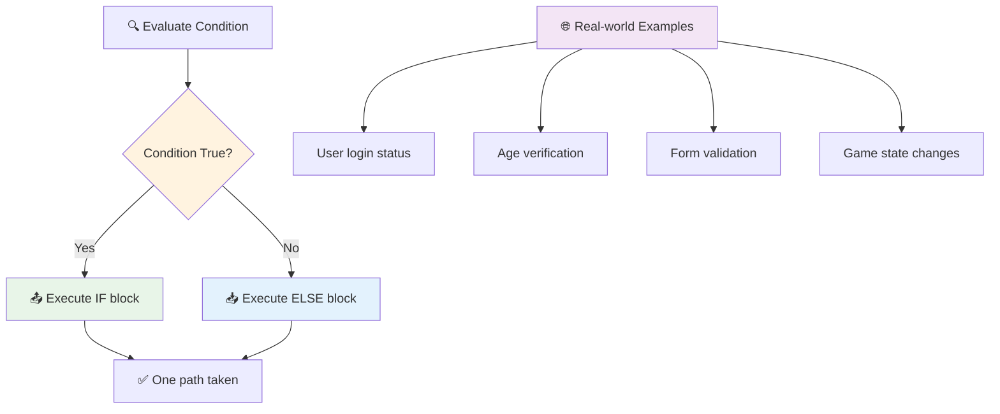

> **ਮੁੱਖ ਝਲਕ**: If-else ਇਹ ਯਕੀਨੀ ਬਣਾਉਂਦਾ ਹੈ ਕਿ ਸਿਰਫ ਇੱਕ ਪਾਠ ਲਿਆ ਜਾਂਦਾ ਹੈ। ਇਹ ਤੁਹਾਡੇ ਪ੍ਰੋਗਰਾਮ ਨੂੰ ਹਮੇਸ਼ਾ ਕਿਸੇ ਵੀ ਹਾਲਾਤ ਲਈ ਜਵਾਬ ਦੇਣ ਦੀ ਗਰੰਟੀ ਦਿੰਦਾ ਹੈ!

## Switch ਬਿਆਨ

ਕਈ ਵਾਰ ਤੁਹਾਨੂੰ ਇੱਕ ਮੁੱਲ ਦੀ ਕਈ ਵਿਕਲਪਾਂ ਨਾਲ ਤੁਲਨਾ ਕਰਨ ਦੀ ਲੋੜ ਹੁੰਦੀ ਹੈ। ਜਦੋਂ ਕਿ ਤੁਸੀਂ ਕਈ `if..else` ਬਿਆਨਾਂ ਨੂੰ ਜੁੜ ਸਕਦੇ ਹੋ, ਇਹ ਪਹੁੰਚ ਅਸੁਵਿਧਾਜਨਕ ਬਣ ਜਾਂਦੀ ਹੈ। `switch` ਬਿਆਨ ਕਈ ਵੱਖਰੇ ਮੁੱਲਾਂ ਨੂੰ ਸੰਭਾਲਣ ਲਈ ਇੱਕ ਸਾਫ਼ ਸਟ੍ਰਕਚਰ ਪ੍ਰਦਾਨ ਕਰਦਾ ਹੈ।

ਇਸ ਦਾ ਸਿਧਾਂਤ ਸ਼ੁਰੂਆਤੀ ਟੈਲੀਫੋਨ ਐਕਸਚੇਂਜਾਂ ਵਿੱਚ ਵਰਤੇ ਗਏ ਮਕੈਨਿਕਲ ਸਵਿੱਚਿੰਗ ਸਿਸਟਮਾਂ ਦੇ ਸਮਾਨ ਹੈ - ਇੱਕ ਇਨਪੁਟ ਮੁੱਲ ਇਹ ਨਿਰਧਾਰਤ ਕਰਦਾ ਹੈ ਕਿ ਕਾਰਜਕਾਰੀ ਕਿਹੜੇ ਖਾਸ ਪਾਠ ਦੀ ਪਾਲਣਾ ਕਰਦਾ ਹੈ।

```javascript
switch (expression) {
  case x:
    // code block
    break;
  case y:
    // code block
    break;
  default:
    // code block
}
```

ਇਹ ਇਸ ਤਰ੍ਹਾਂ ਬਣਾਇਆ ਗਿਆ ਹੈ:
- ਜਾਵਾਸਕ੍ਰਿਪਟ ਇੱਕ ਵਾਰ ਅਭਿਵਿਅਕਤੀ ਦਾ ਮੁਲਾਂਕਣ ਕਰਦਾ ਹੈ
- ਇਹ ਹਰ `case` ਨੂੰ ਵੇਖਦਾ ਹੈ ਤਾਂ ਜੋ ਇੱਕ ਮੇਲ ਮਿਲੇ
- ਜਦੋਂ ਇਹ ਇੱਕ ਮੇਲ ਮਿਲਦਾ ਹੈ, ਇਹ ਉਸ ਕੋਡ ਬਲਾਕ ਨੂੰ ਚਲਾਉਂਦਾ ਹੈ
- `break` ਜਾਵਾਸਕ੍ਰਿਪਟ ਨੂੰ ਰੋਕਣ ਅਤੇ switch ਤੋਂ ਬਾਹਰ ਨਿਕਲਣ ਲਈ ਕਹਿੰਦਾ ਹੈ
- ਜੇ ਕੋਈ ਕੇਸ ਮੇਲ ਨਹੀਂ ਖਾਂਦਾ, ਤਾਂ ਇਹ `default` ਬਲਾਕ ਚਲਾਉਂਦਾ ਹੈ (ਜੇ ਤੁਹਾਡੇ ਕੋਲ ਹੈ)

```javascript
// Program using switch statement for day of week
let dayNumber = 2;
let dayName;

switch (dayNumber) {
  case 1:
    dayName = "Monday";
    break;
  case 2:
    dayName = "Tuesday";
    break;
  case 3:
    dayName = "Wednesday";
    break;
  default:
    dayName = "Unknown day";
    break;
}
console.log(`Today is ${dayName}`);
```

ਇਸ ਉਦਾਹਰਨ ਵਿੱਚ, ਜਾਵਾਸਕ੍ਰਿਪਟ ਵੇਖਦਾ ਹੈ ਕਿ `dayNumber` `2` ਹੈ, ਮੇਲ ਖਾਂਦਾ `case 2`, `dayName` ਨੂੰ "Tuesday" ਸੈਟ ਕਰਦਾ ਹੈ, ਅਤੇ ਫਿਰ switch ਤੋਂ ਬਾਹਰ ਨਿਕਲ ਜਾਂਦਾ ਹੈ। ਨਤੀਜਾ? "Today is Tuesday" ਕਨਸੋਲ ਵਿੱਚ ਲੌਗ ਕੀਤਾ ਜਾਂਦਾ ਹੈ।

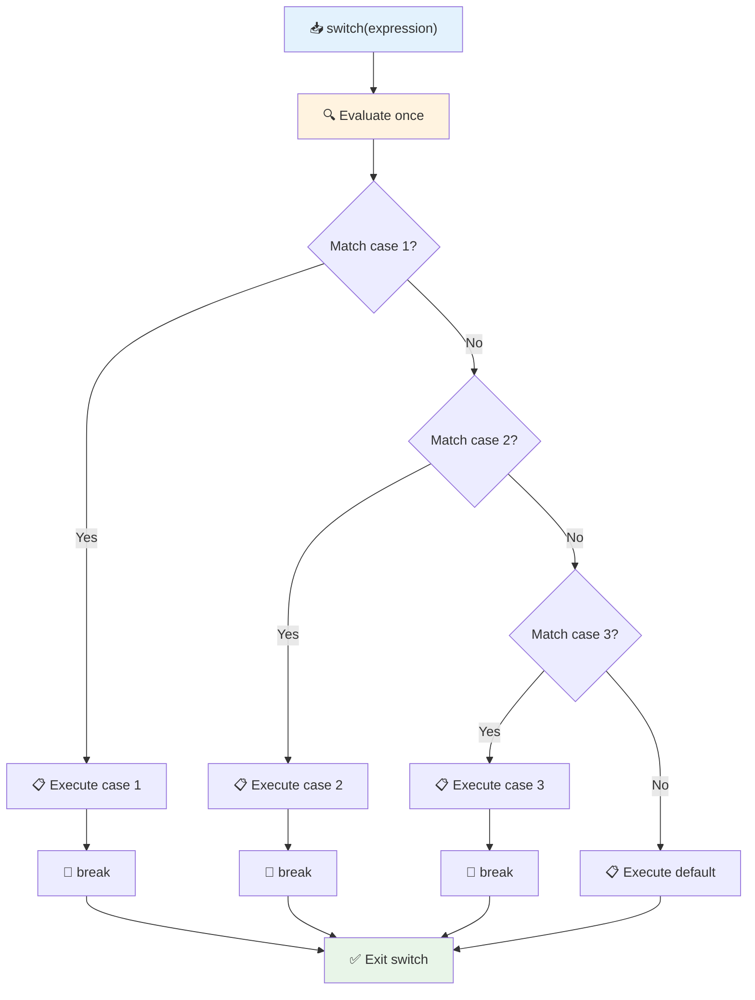

✅ ਇਸ ਕੋਡ ਅਤੇ ਹੇਠਾਂ ਦਿੱਤੇ ਕੋਡ ਨੂੰ ਬ੍ਰਾਊਜ਼ਰ ਕਨਸੋਲ ਵਿੱਚ ਚਲਾਕੇ ਆਪਣੀ ਸਮਝ ਦੀ ਜਾਂਚ ਕਰੋ। ਵੈਰੀਏਬਲ a ਦੇ ਮੁੱਲਾਂ ਨੂੰ ਬਦਲੋ ਤਾਂ ਜੋ ਵਾਪਸ ਕੀਤਾ `console.log()` ਬਦਲ ਜਾਵੇ।

### 🔄 **Switch ਬਿਆਨ ਦੀ ਮਾਹਰਤਾ: ਕਈ ਵਿਕਲਪ**

**ਆਪਣੀ switch ਦੀ ਸਮਝ ਦੀ ਜਾਂਚ ਕਰੋ:**
- ਕੀ ਹੁੰਦਾ ਹੈ ਜੇ ਤੁਸੀਂ `break` ਬਿਆਨ ਭੁੱਲ ਜਾਂਦੇ ਹੋ?
- ਤੁਸੀਂ ਕਈ `if-else` ਬਿਆਨਾਂ ਦੀ ਬਜਾਏ `switch` ਦੀ ਵਰਤੋਂ ਕਦੋਂ ਕਰਦੇ ਹੋ?
- ਜੇ ਤੁਸੀਂ ਸੋਚਦੇ ਹੋ ਕਿ ਤੁਸੀਂ ਸਾਰੇ ਸੰਭਾਵਨਾਵਾਂ ਨੂੰ ਕਵਰ ਕਰ ਲਿਆ ਹੈ ਤਾਂ `default` ਕੇਸ ਕਿਉਂ ਲਾਭਦਾਇਕ ਹੈ?

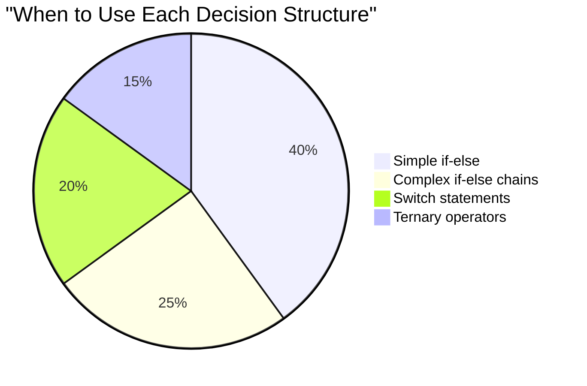

> **ਸਰਵੋਤਮ ਅਭਿਆਸ**: ਇੱਕ ਵੈਰੀਏਬਲ ਦੀ ਕਈ ਖਾਸ ਮੁੱਲਾਂ ਨਾਲ ਤੁਲਨਾ ਕਰਨ ਲਈ `switch` ਦੀ ਵਰਤੋਂ ਕਰੋ। ਰੇਂਜ ਚੈੱਕ ਜਾਂ ਜਟਿਲ ਹਾਲਾਤਾਂ ਲਈ `if-else` ਦੀ ਵਰਤੋਂ ਕਰੋ!

## ਤਰਕਸ਼ੀਲ ਆਪਰੇਟਰ ਅਤੇ ਬੂਲੀਅਨਸ

ਜਟਿਲ ਫੈਸਲੇ ਅਕਸਰ ਇੱਕੋ ਸਮੇਂ ਕਈ ਹਾਲਾਤਾਂ ਦਾ ਮੁਲਾਂਕਣ ਕਰਨ ਦੀ ਲੋੜ ਹੁੰਦੇ ਹਨ। ਜਿਵੇਂ ਕਿ ਬੂਲੀਅਨ ਬੀਜਗਣਿਤ ਗਣਿਤਜੀਆਂ ਨੂੰ ਤਰਕਸ਼ੀਲ ਅਭਿਵਿਅਕਤੀਆਂ ਨੂੰ ਜੋੜਨ ਦੀ ਆਗਿਆ ਦਿੰਦਾ ਹੈ, ਪ੍ਰੋਗਰਾਮਿੰਗ ਕਈ ਬੂਲੀਅਨ ਹਾਲਾਤਾਂ ਨੂੰ ਜੋੜਨ ਲਈ ਤਰਕਸ਼ੀਲ ਆਪਰੇਟਰ ਪ੍ਰਦਾਨ ਕਰਦੀ ਹੈ।

ਇਹ ਆਪਰੇਟਰ ਸਧਾਰਨ true/false ਮੁਲਾਂਕਣਾਂ ਨੂੰ ਜੋੜ ਕੇ ਜਟਿਲ ਸ਼ਰਤੀ ਤਰਕ ਦੀ ਆਗਿਆ ਦਿੰਦੇ ਹਨ।

| ਚਿੰਨ੍ਹ | ਵੇਰਵਾ                                                                                     | ਉਦਾਹਰਨ                                                                 |
| ------ | ----------------------------------------------------------------------------------------------- | ----------------------------------------------------------------------- |
| `&&`   | **ਤਰਕਸ਼ੀਲ AND**: ਦੋ ਬੂਲੀਅਨ ਅਭਿਵਿਅਕਤੀਆਂ ਦੀ ਤੁਲਨਾ ਕਰਦਾ ਹੈ। true **ਸਿਰਫ** ਵਾਪਸ ਕਰਦਾ ਹੈ ਜੇ ਦੋਵੇਂ ਪਾਸੇ ਸਹੀ ਹਨ | `(5 > 3) && (5 < 10) // ਦੋਵੇਂ ਪਾਸੇ ਸਹੀ ਹਨ। true ਵਾਪਸ ਕਰਦਾ ਹੈ` |
| `\|\|` | **ਤਰਕਸ਼ੀਲ OR**: ਦੋ ਬੂਲੀਅਨ ਅਭਿਵਿਅਕਤੀਆਂ ਦੀ ਤੁਲਨਾ ਕਰਦਾ ਹੈ। true ਵਾਪਸ ਕਰਦਾ ਹੈ ਜੇ ਘੱਟੋ-ਘੱਟ ਇੱਕ ਪਾਸਾ ਸਹੀ ਹੈ     | `(5 > 10) \|\| (5 < 10) // ਇੱਕ ਪਾਸਾ
2. ਲਾਜ਼ਮੀ ਔਪਰੇਟਰਾਂ ਦੀ ਵਰਤੋਂ ਕਰਕੇ ਜਾਂਚ ਕਰੋ ਕਿ ਵਿਦਿਆਰਥੀ ਪਾਸ ਕਰਦਾ ਹੈ (ਗਰੇਡ >= 60) ਅਤੇ ਆਨਰਸ ਪ੍ਰਾਪਤ ਕਰਦਾ ਹੈ (ਗਰੇਡ >= 90)  
3. ਹਰ ਲੇਟਰ ਗਰੇਡ ਲਈ ਵਿਸ਼ੇਸ਼ ਫੀਡਬੈਕ ਦੇਣ ਲਈ ਇੱਕ ਸਵਿੱਚ ਸਟੇਟਮ ਦੀ ਵਰਤੋਂ ਕਰੋ  
4. ਟਰਨਰੀ ਔਪਰੇਟਰ ਦੀ ਵਰਤੋਂ ਕਰਕੇ ਇਹ ਨਿਰਧਾਰਤ ਕਰੋ ਕਿ ਵਿਦਿਆਰਥੀ ਅਗਲੇ ਕੋਰਸ ਲਈ ਯੋਗ ਹੈ (ਗਰੇਡ >= 70)  
5. ਇਹ ਯਕੀਨੀ ਬਣਾਉਣ ਲਈ ਇਨਪੁਟ ਵੈਧਤਾ ਸ਼ਾਮਲ ਕਰੋ ਕਿ ਸਕੋਰ 0 ਤੋਂ 100 ਦੇ ਵਿਚਕਾਰ ਹੈ  

ਆਪਣੇ ਪ੍ਰੋਗਰਾਮ ਨੂੰ ਵੱਖ-ਵੱਖ ਸਕੋਰਾਂ ਨਾਲ ਟੈਸਟ ਕਰੋ, ਜਿਵੇਂ ਕਿ 59, 60, 89, 90, ਅਤੇ ਗਲਤ ਇਨਪੁਟ।

[agent mode](https://code.visualstudio.com/blogs/2025/02/24/introducing-copilot-agent-mode) ਬਾਰੇ ਹੋਰ ਜਾਣੋ।  

## ਪੋਸਟ-ਲੈਕਚਰ ਕਵਿਜ਼  

[ਪੋਸਟ-ਲੈਕਚਰ ਕਵਿਜ਼](https://ff-quizzes.netlify.app/web/quiz/12)  

## ਸਮੀਖਿਆ ਅਤੇ ਸਵੈ ਅਧਿਐਨ  

ਉਪਭੋਗਤਾ ਲਈ ਉਪਲਬਧ ਕਈ ਔਪਰੇਟਰਾਂ ਬਾਰੇ ਹੋਰ ਪੜ੍ਹੋ [MDN 'ਤੇ](https://developer.mozilla.org/docs/Web/JavaScript/Reference/Operators)।  

Josh Comeau ਦੇ ਸ਼ਾਨਦਾਰ [operator lookup](https://joshwcomeau.com/operator-lookup/) ਨੂੰ ਜ਼ਰੂਰ ਦੇਖੋ!  

## ਅਸਾਈਨਮੈਂਟ  

[Operators](assignment.md)  

---

## 🧠 **ਤੁਹਾਡਾ ਫੈਸਲਾ-ਲੈਣ ਵਾਲਾ ਟੂਲਕਿਟ ਸਾਰ**  

```mermaid
graph TD
    A["🎯 JavaScript Decisions"] --> B["🔍 Boolean Logic"]
    A --> C["📊 Conditional Statements"]
    A --> D["🔗 Logical Operators"]
    A --> E["⚡ Advanced Patterns"]
    
    B --> B1["true/false values"]
    B --> B2["Comparison operators"]
    B --> B3["Truthiness concepts"]
    
    C --> C1["if statements"]
    C --> C2["if-else chains"]
    C --> C3["switch statements"]
    
    D --> D1["&& (AND)"]
    D --> D2["|| (OR)"]
    D --> D3["! (NOT)"]
    
    E --> E1["Ternary operator"]
    E --> E2["Short-circuit evaluation"]
    E --> E3["Complex conditions"]
    
    F["💡 Key Principles"] --> F1["Clear readable conditions"]
    F --> F2["Consistent comparison style"]
    F --> F3["Proper operator precedence"]
    F --> F4["Efficient evaluation order"]
    
    style A fill:#e3f2fd
    style B fill:#e8f5e8
    style C fill:#fff3e0
    style D fill:#f3e5f5
    style E fill:#e0f2f1
    style F fill:#fce4ec
```
  
---

## 🚀 ਤੁਹਾਡਾ ਜਾਵਾਸਕ੍ਰਿਪਟ ਫੈਸਲਾ-ਲੈਣ ਦਾ ਮਾਹਰ ਬਣਨ ਦਾ ਸਮਾਂ-ਰੇਖਾ  

### ⚡ **ਅਗਲੇ 5 ਮਿੰਟਾਂ ਵਿੱਚ ਤੁਸੀਂ ਕੀ ਕਰ ਸਕਦੇ ਹੋ**  
- [ ] ਆਪਣੇ ਬ੍ਰਾਊਜ਼ਰ ਕਨਸੋਲ ਵਿੱਚ ਤੁਲਨਾਤਮਕ ਔਪਰੇਟਰਾਂ ਦਾ ਅਭਿਆਸ ਕਰੋ  
- [ ] ਇੱਕ ਸਧਾਰਨ if-else ਸਟੇਟਮ ਲਿਖੋ ਜੋ ਤੁਹਾਡੀ ਉਮਰ ਦੀ ਜਾਂਚ ਕਰਦਾ ਹੈ  
- [ ] ਚੁਣੌਤੀ ਅਜਮਾਓ: ਇੱਕ if-else ਨੂੰ ਟਰਨਰੀ ਔਪਰੇਟਰ ਦੀ ਵਰਤੋਂ ਕਰਕੇ ਦੁਬਾਰਾ ਲਿਖੋ  
- [ ] ਵੱਖ-ਵੱਖ "truthy" ਅਤੇ "falsy" ਮੁੱਲਾਂ ਨਾਲ ਕੀ ਹੁੰਦਾ ਹੈ, ਟੈਸਟ ਕਰੋ  

### 🎯 **ਇਸ ਘੰਟੇ ਵਿੱਚ ਤੁਸੀਂ ਕੀ ਹਾਸਲ ਕਰ ਸਕਦੇ ਹੋ**  
- [ ] ਪੋਸਟ-ਲੈਸਨ ਕਵਿਜ਼ ਪੂਰਾ ਕਰੋ ਅਤੇ ਕੋਈ ਵੀ ਗੁੰਝਲਦਾਰ ਧਾਰਨਾਵਾਂ ਦੀ ਸਮੀਖਿਆ ਕਰੋ  
- [ ] GitHub Copilot ਚੁਣੌਤੀ ਤੋਂ ਵਿਸਤ੍ਰਿਤ ਗਰੇਡ ਕੈਲਕੁਲੇਟਰ ਬਣਾਓ  
- [ ] ਇੱਕ ਅਸਲ-ਜੀਵਨ ਸਥਿਤੀ ਲਈ ਇੱਕ ਸਧਾਰਨ ਫੈਸਲਾ-ਲੈਣ ਵਾਲਾ ਦਰੱਖਤ ਬਣਾਓ (ਜਿਵੇਂ ਕਿ ਕੀ ਪਹਿਨਣਾ ਚੁਣਨਾ)  
- [ ] ਲਾਜ਼ਮੀ ਔਪਰੇਟਰਾਂ ਨਾਲ ਕਈ ਸ਼ਰਤਾਂ ਨੂੰ ਜੋੜਨ ਦਾ ਅਭਿਆਸ ਕਰੋ  
- [ ] ਵੱਖ-ਵੱਖ ਵਰਤੋਂ ਦੇ ਕੇਸਾਂ ਲਈ ਸਵਿੱਚ ਸਟੇਟਮਾਂ ਦਾ ਅਭਿਆਸ ਕਰੋ  

### 📅 **ਤੁਹਾਡਾ ਹਫ਼ਤੇ-ਲੰਬਾ ਲਾਜ਼ਮੀ ਮਾਹਰ ਬਣਨ ਦਾ ਯੋਜਨਾ**  
- [ ] ਰਚਨਾਤਮਕ ਉਦਾਹਰਣਾਂ ਨਾਲ ਔਪਰੇਟਰਾਂ ਅਸਾਈਨਮੈਂਟ ਪੂਰਾ ਕਰੋ  
- [ ] ਵੱਖ-ਵੱਖ ਸ਼ਰਤਾਂ ਵਾਲੇ ਢਾਂਚਿਆਂ ਦੀ ਵਰਤੋਂ ਕਰਕੇ ਇੱਕ ਛੋਟਾ ਕਵਿਜ਼ ਐਪਲੀਕੇਸ਼ਨ ਬਣਾਓ  
- [ ] ਇੱਕ ਫਾਰਮ ਵੈਲੀਡੇਟਰ ਬਣਾਓ ਜੋ ਕਈ ਇਨਪੁਟ ਸ਼ਰਤਾਂ ਦੀ ਜਾਂਚ ਕਰਦਾ ਹੈ  
- [ ] Josh Comeau ਦੇ [operator lookup](https://joshwcomeau.com/operator-lookup/) ਅਭਿਆਸਾਂ ਦਾ ਅਭਿਆਸ ਕਰੋ  
- [ ] ਮੌਜੂਦਾ ਕੋਡ ਨੂੰ ਵਧੇਰੇ ਉਚਿਤ ਸ਼ਰਤਾਂ ਵਾਲੇ ਢਾਂਚਿਆਂ ਦੀ ਵਰਤੋਂ ਕਰਕੇ ਦੁਬਾਰਾ ਲਿਖੋ  
- [ ] ਛੋਟੇ-ਸਰਕਟ ਮੁਲਾਂਕਨ ਅਤੇ ਪ੍ਰਦਰਸ਼ਨ ਦੇ ਪ੍ਰਭਾਵਾਂ ਦਾ ਅਧਿਐਨ ਕਰੋ  

### 🌟 **ਤੁਹਾਡਾ ਮਹੀਨੇ-ਲੰਬਾ ਬਦਲਾਅ**  
- [ ] ਜਟਿਲ nested ਸ਼ਰਤਾਂ ਵਿੱਚ ਮਾਹਰ ਬਣੋ ਅਤੇ ਕੋਡ ਪੜ੍ਹਨਯੋਗਤਾ ਨੂੰ ਬਰਕਰਾਰ ਰੱਖੋ  
- [ ] ਸੁਧਾਰਤ ਫੈਸਲਾ-ਲੈਣ ਵਾਲੇ ਤਰਕ ਨਾਲ ਇੱਕ ਐਪਲੀਕੇਸ਼ਨ ਬਣਾਓ  
- [ ] ਮੌਜੂਦਾ ਪ੍ਰੋਜੈਕਟਾਂ ਵਿੱਚ ਮੌਜੂਦਾ ਲਾਜ਼ਮੀ ਤਰਕ ਨੂੰ ਸੁਧਾਰ ਕੇ ਖੁੱਲੇ ਸਰੋਤ ਵਿੱਚ ਯੋਗਦਾਨ ਪਾਉ  
- [ ] ਵੱਖ-ਵੱਖ ਸ਼ਰਤਾਂ ਵਾਲੇ ਢਾਂਚਿਆਂ ਬਾਰੇ ਕਿਸੇ ਹੋਰ ਨੂੰ ਸਿਖਾਓ ਅਤੇ ਕਦੋਂ ਕਿਸੇ ਨੂੰ ਵਰਤਣਾ ਹੈ  
- [ ] ਲਾਜ਼ਮੀ ਤਰਕ ਲਈ ਫੰਕਸ਼ਨਲ ਪ੍ਰੋਗਰਾਮਿੰਗ ਪਹੁੰਚਾਂ ਦੀ ਖੋਜ ਕਰੋ  
- [ ] ਲਾਜ਼ਮੀ ਸ੍ਰੇਸ਼ਠ ਅਭਿਆਸਾਂ ਲਈ ਇੱਕ ਨਿੱਜੀ ਸੰਦਰਭ ਗਾਈਡ ਬਣਾਓ  

### 🏆 **ਅੰਤਮ ਫੈਸਲਾ-ਲੈਣ ਵਾਲੇ ਚੈਂਪੀਅਨ ਚੈੱਕ-ਇਨ**  

**ਤੁਹਾਡੇ ਲਾਜ਼ਮੀ ਸੋਚਣ ਦੇ ਮਾਹਰ ਬਣਨ ਦਾ ਜਸ਼ਨ ਮਨਾਓ:**  
- ਸਭ ਤੋਂ ਜਟਿਲ ਫੈਸਲਾ-ਲੈਣ ਵਾਲਾ ਤਰਕ ਜੋ ਤੁਸੀਂ ਸਫਲਤਾਪੂਰਵਕ ਲਾਗੂ ਕੀਤਾ ਹੈ, ਕੀ ਹੈ?  
- ਤੁਹਾਨੂੰ ਸਭ ਤੋਂ ਕੁਦਰਤੀ ਲੱਗਣ ਵਾਲਾ ਲਾਜ਼ਮੀ ਢਾਂਚਾ ਕਿਹੜਾ ਹੈ ਅਤੇ ਕਿਉਂ?  
- ਲਾਜ਼ਮੀ ਔਪਰੇਟਰਾਂ ਬਾਰੇ ਸਿੱਖਣ ਨਾਲ ਤੁਹਾਡੇ ਸਮੱਸਿਆ-ਸੁਲਝਾਉਣ ਦੇ ਤਰੀਕੇ ਵਿੱਚ ਕਿਵੇਂ ਬਦਲਾਅ ਆਇਆ ਹੈ?  
- ਕਿਹੜੀ ਅਸਲ-ਜੀਵਨ ਐਪਲੀਕੇਸ਼ਨ ਸੁਧਾਰਤ ਫੈਸਲਾ-ਲੈਣ ਵਾਲੇ ਤਰਕ ਤੋਂ ਲਾਭ ਉਠਾ ਸਕਦੀ ਹੈ?  

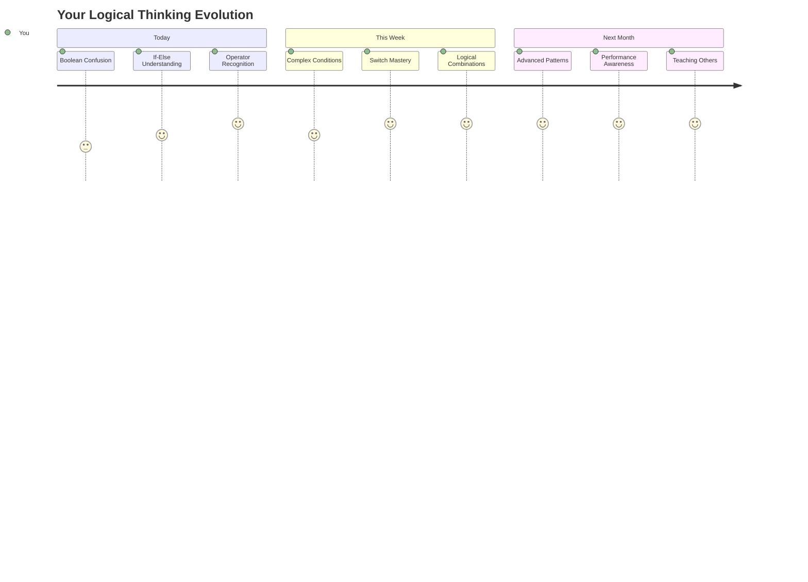
  
> 🧠 **ਤੁਸੀਂ ਡਿਜੀਟਲ ਫੈਸਲਾ-ਲੈਣ ਦੀ ਕਲਾ ਵਿੱਚ ਮਾਹਰ ਹੋ ਗਏ ਹੋ!** ਹਰ ਇੰਟਰੈਕਟਿਵ ਐਪਲੀਕੇਸ਼ਨ ਉਪਭੋਗਤਾ ਦੀਆਂ ਕਾਰਵਾਈਆਂ ਅਤੇ ਬਦਲਦੇ ਹਾਲਾਤਾਂ ਦਾ ਸਮਝਦਾਰ ਤਰੀਕੇ ਨਾਲ ਜਵਾਬ ਦੇਣ ਲਈ ਲਾਜ਼ਮੀ ਤਰਕ 'ਤੇ ਨਿਰਭਰ ਕਰਦੀ ਹੈ। ਹੁਣ ਤੁਸੀਂ ਸਮਝਦੇ ਹੋ ਕਿ ਆਪਣੇ ਪ੍ਰੋਗਰਾਮਾਂ ਨੂੰ ਸੋਚਣ, ਮੁਲਾਂਕਨ ਕਰਨ ਅਤੇ ਉਚਿਤ ਜਵਾਬ ਚੁਣਨ ਲਈ ਕਿਵੇਂ ਬਣਾਇਆ ਜਾਵੇ। ਇਹ ਲਾਜ਼ਮੀ ਅਧਾਰ ਹਰ ਗਤੀਸ਼ੀਲ ਐਪਲੀਕੇਸ਼ਨ ਨੂੰ ਸ਼ਕਤੀ ਦੇਵੇਗਾ ਜੋ ਤੁਸੀਂ ਬਣਾਉਂਦੇ ਹੋ! 🎉  

---

**ਅਸਵੀਕਰਤਾ**:  
ਇਹ ਦਸਤਾਵੇਜ਼ AI ਅਨੁਵਾਦ ਸੇਵਾ [Co-op Translator](https://github.com/Azure/co-op-translator) ਦੀ ਵਰਤੋਂ ਕਰਕੇ ਅਨੁਵਾਦ ਕੀਤਾ ਗਿਆ ਹੈ। ਜਦੋਂ ਕਿ ਅਸੀਂ ਸਹੀ ਹੋਣ ਦਾ ਯਤਨ ਕਰਦੇ ਹਾਂ, ਕਿਰਪਾ ਕਰਕੇ ਧਿਆਨ ਦਿਓ ਕਿ ਸਵੈਚਾਲਿਤ ਅਨੁਵਾਦਾਂ ਵਿੱਚ ਗਲਤੀਆਂ ਜਾਂ ਅਸੁੱਤੀਆਂ ਹੋ ਸਕਦੀਆਂ ਹਨ। ਮੂਲ ਦਸਤਾਵੇਜ਼ ਨੂੰ ਇਸਦੀ ਮੂਲ ਭਾਸ਼ਾ ਵਿੱਚ ਅਧਿਕਾਰਤ ਸਰੋਤ ਮੰਨਿਆ ਜਾਣਾ ਚਾਹੀਦਾ ਹੈ। ਮਹੱਤਵਪੂਰਨ ਜਾਣਕਾਰੀ ਲਈ, ਪੇਸ਼ੇਵਰ ਮਨੁੱਖੀ ਅਨੁਵਾਦ ਦੀ ਸਿਫਾਰਸ਼ ਕੀਤੀ ਜਾਂਦੀ ਹੈ। ਇਸ ਅਨੁਵਾਦ ਦੀ ਵਰਤੋਂ ਤੋਂ ਪੈਦਾ ਹੋਣ ਵਾਲੇ ਕਿਸੇ ਵੀ ਗਲਤਫਹਿਮੀ ਜਾਂ ਗਲਤ ਵਿਆਖਿਆ ਲਈ ਅਸੀਂ ਜ਼ਿੰਮੇਵਾਰ ਨਹੀਂ ਹਾਂ।