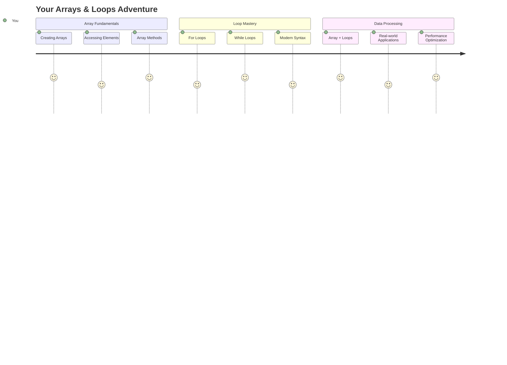
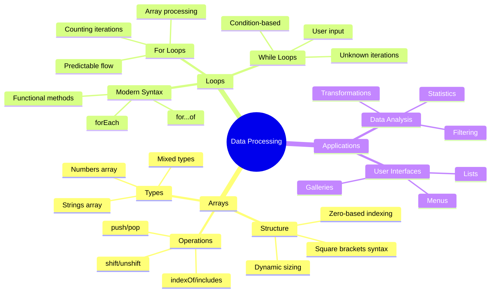
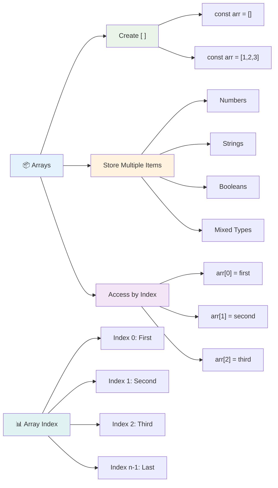
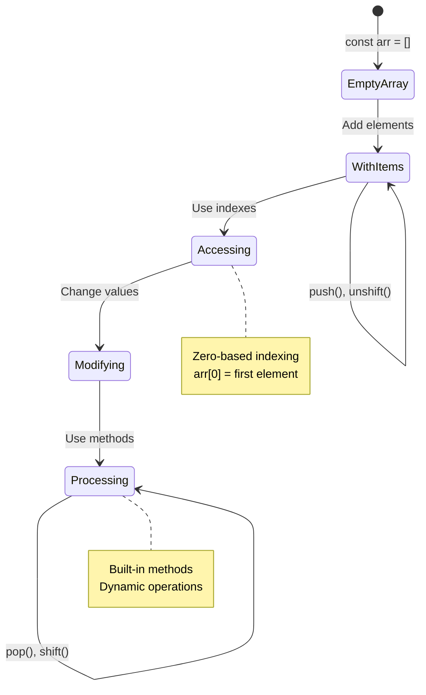
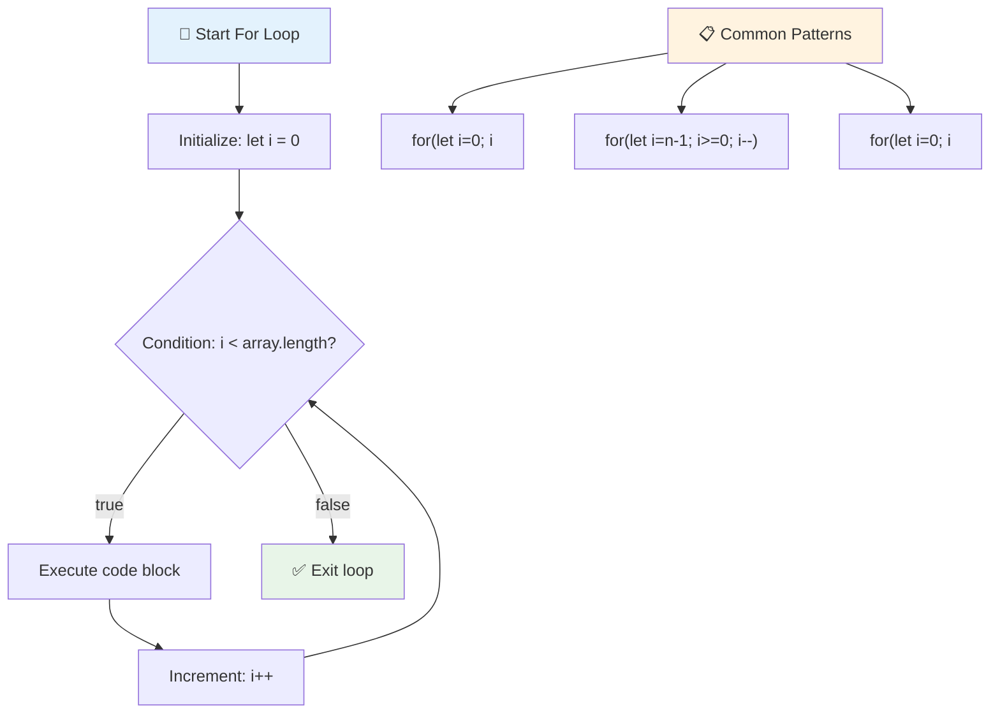
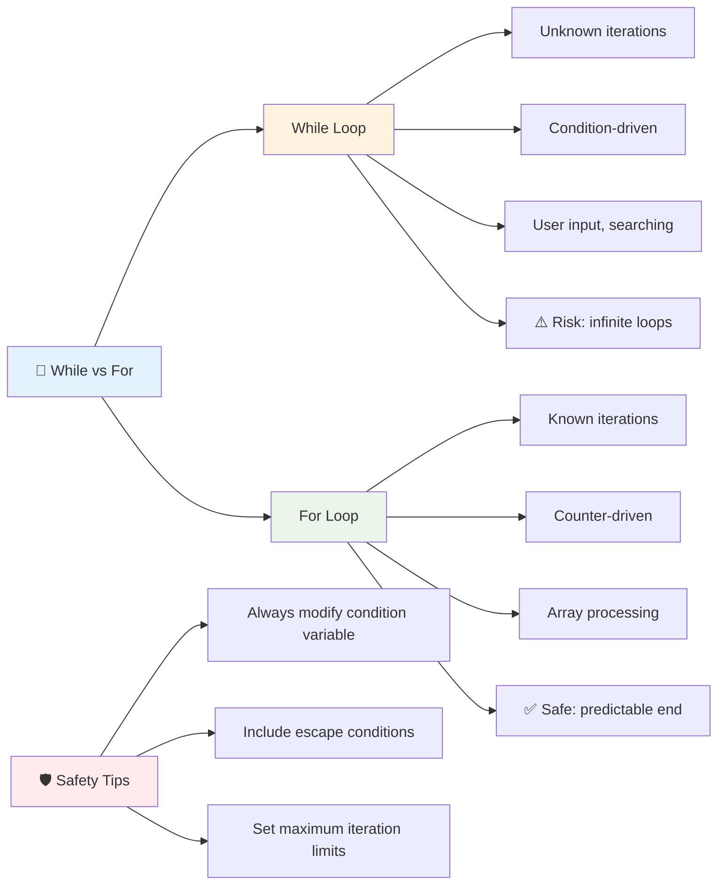
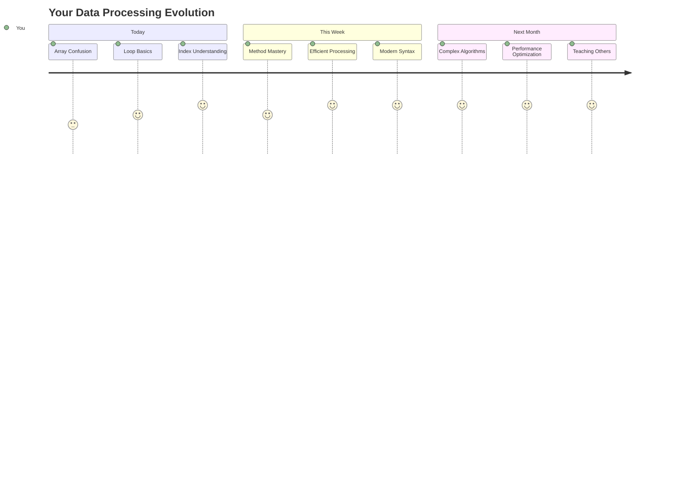

<!--
CO_OP_TRANSLATOR_METADATA:
{
  "original_hash": "1710a50a519a6e4a1b40a5638783018d",
  "translation_date": "2025-11-03T16:07:18+00:00",
  "source_file": "2-js-basics/4-arrays-loops/README.md",
  "language_code": "pa"
}
-->
# ਜਾਵਾਸਕ੍ਰਿਪਟ ਬੁਨਿਆਦੀਆਂ: ਐਰੇ ਅਤੇ ਲੂਪ


> ਸਕੈਚਨੋਟ [Tomomi Imura](https://twitter.com/girlie_mac) ਵੱਲੋਂ



## ਪੜ੍ਹਾਈ ਤੋਂ ਪਹਿਲਾਂ ਕਵਿਜ਼
[ਪ੍ਰੀ-ਲੈਕਚਰ ਕਵਿਜ਼](https://ff-quizzes.netlify.app/web/quiz/13)

ਕੀ ਤੁਸੀਂ ਕਦੇ ਸੋਚਿਆ ਹੈ ਕਿ ਵੈਬਸਾਈਟਾਂ ਸ਼ਾਪਿੰਗ ਕਾਰਟ ਆਈਟਮਾਂ ਨੂੰ ਕਿਵੇਂ ਟਰੈਕ ਕਰਦੀਆਂ ਹਨ ਜਾਂ ਤੁਹਾਡੀ ਦੋਸਤਾਂ ਦੀ ਸੂਚੀ ਕਿਵੇਂ ਦਿਖਾਉਂਦੀਆਂ ਹਨ? ਇਹ ਸਾਰਾ ਕੰਮ ਐਰੇ ਅਤੇ ਲੂਪ ਦੀ ਮਦਦ ਨਾਲ ਹੁੰਦਾ ਹੈ। ਐਰੇ ਡਿਜੀਟਲ ਕੰਟੇਨਰਾਂ ਵਾਂਗ ਹਨ ਜੋ ਕਈ ਜਾਣਕਾਰੀ ਦੇ ਟੁਕੜਿਆਂ ਨੂੰ ਰੱਖਦੇ ਹਨ, ਜਦਕਿ ਲੂਪ ਤੁਹਾਨੂੰ ਸਾਰਾ ਡਾਟਾ ਬਿਨਾਂ ਦੁਹਰਾਏ ਹੋਏ ਕੋਡ ਦੇ ਕੁਸ਼ਲਤਾਪੂਰਵਕ ਕੰਮ ਕਰਨ ਦਿੰਦੇ ਹਨ।

ਇਹ ਦੋਨੋ ਸੰਕਲਪ ਮਿਲ ਕੇ ਤੁਹਾਡੇ ਪ੍ਰੋਗਰਾਮਾਂ ਵਿੱਚ ਜਾਣਕਾਰੀ ਨੂੰ ਸੰਭਾਲਣ ਲਈ ਮਜ਼ਬੂਤ ਬੁਨਿਆਦ ਬਣਾਉਂਦੇ ਹਨ। ਤੁਸੀਂ ਹੱਥੋਂ ਹੱਥ ਹਰ ਕਦਮ ਲਿਖਣ ਤੋਂ ਲੈ ਕੇ ਸੌਖੇ, ਸਮਰਥ ਕੋਡ ਬਣਾਉਣ ਤੱਕ ਸਿੱਖੋਗੇ ਜੋ ਸੈਂਕੜੇ ਜਾਂ ਹਜ਼ਾਰਾਂ ਆਈਟਮਾਂ ਨੂੰ ਤੇਜ਼ੀ ਨਾਲ ਪ੍ਰੋਸੈਸ ਕਰ ਸਕਦਾ ਹੈ।

ਇਸ ਪਾਠ ਦੇ ਅੰਤ ਤੱਕ, ਤੁਸੀਂ ਸਿਰਫ ਕੁਝ ਲਾਈਨਾਂ ਦੇ ਕੋਡ ਨਾਲ ਜਟਿਲ ਡਾਟਾ ਕੰਮ ਪੂਰੇ ਕਰਨ ਦੀ ਸਮਝ ਪ੍ਰਾਪਤ ਕਰ ਲੋਗੇ। ਆਓ, ਇਹ ਜ਼ਰੂਰੀ ਪ੍ਰੋਗਰਾਮਿੰਗ ਸੰਕਲਪਾਂ ਦੀ ਖੋਜ ਕਰੀਏ।

[](https://youtube.com/watch?v=1U4qTyq02Xw "Arrays")

[](https://www.youtube.com/watch?v=Eeh7pxtTZ3k "Loops")

> 🎥 ਉੱਪਰ ਦਿੱਤੀਆਂ ਤਸਵੀਰਾਂ 'ਤੇ ਕਲਿਕ ਕਰੋ ਤਾਂ ਜੋ ਐਰੇ ਅਤੇ ਲੂਪ ਬਾਰੇ ਵੀਡੀਓ ਦੇਖ ਸਕੋ।

> ਤੁਸੀਂ ਇਹ ਪਾਠ [Microsoft Learn](https://docs.microsoft.com/learn/modules/web-development-101-arrays/?WT.mc_id=academic-77807-sagibbon) 'ਤੇ ਲੈ ਸਕਦੇ ਹੋ!



## ਐਰੇ

ਐਰੇ ਨੂੰ ਡਿਜੀਟਲ ਫਾਈਲਿੰਗ ਕੈਬਿਨੇਟ ਵਾਂਗ ਸੋਚੋ - ਇੱਕ ਦਰਾਜ਼ ਵਿੱਚ ਇੱਕ ਦਸਤਾਵੇਜ਼ ਰੱਖਣ ਦੀ ਬਜਾਏ, ਤੁਸੀਂ ਕਈ ਸੰਬੰਧਿਤ ਆਈਟਮਾਂ ਨੂੰ ਇੱਕ ਸੰਗਠਿਤ ਕੰਟੇਨਰ ਵਿੱਚ ਰੱਖ ਸਕਦੇ ਹੋ। ਪ੍ਰੋਗਰਾਮਿੰਗ ਦੇ ਤੌਰ 'ਤੇ, ਐਰੇ ਤੁਹਾਨੂੰ ਕਈ ਜਾਣਕਾਰੀ ਦੇ ਟੁਕੜਿਆਂ ਨੂੰ ਇੱਕ ਸੰਗਠਿਤ ਪੈਕੇਜ ਵਿੱਚ ਸਟੋਰ ਕਰਨ ਦਿੰਦੇ ਹਨ।

ਚਾਹੇ ਤੁਸੀਂ ਫੋਟੋ ਗੈਲਰੀ ਬਣਾਉਣ, ਟੂ-ਡੂ ਲਿਸਟ ਦਾ ਪ੍ਰਬੰਧਨ ਕਰਨ ਜਾਂ ਖੇਡ ਵਿੱਚ ਉੱਚ ਸਕੋਰ ਟਰੈਕ ਕਰਨ ਦੀ ਕੋਸ਼ਿਸ਼ ਕਰ ਰਹੇ ਹੋਵੋ, ਐਰੇ ਡਾਟਾ ਸੰਗਠਨ ਲਈ ਬੁਨਿਆਦ ਮੁਹੱਈਆ ਕਰਦੇ ਹਨ। ਆਓ ਵੇਖੀਏ ਕਿ ਇਹ ਕਿਵੇਂ ਕੰਮ ਕਰਦੇ ਹਨ।

✅ ਐਰੇ ਹਰ ਜਗ੍ਹਾ ਹਨ! ਕੀ ਤੁਸੀਂ ਐਰੇ ਦਾ ਕੋਈ ਹਕੀਕਤੀ ਉਦਾਹਰਨ ਦੇ ਬਾਰੇ ਸੋਚ ਸਕਦੇ ਹੋ, ਜਿਵੇਂ ਕਿ ਸੂਰਜੀ ਪੈਨਲ ਐਰੇ?

### ਐਰੇ ਬਣਾਉਣਾ

ਐਰੇ ਬਣਾਉਣਾ ਬਹੁਤ ਹੀ ਆਸਾਨ ਹੈ - ਸਿਰਫ਼ ਚੌਰਸ ਬ੍ਰੈਕਟ ਵਰਤੋ!

```javascript
// Empty array - like an empty shopping cart waiting for items
const myArray = [];
```

**ਇੱਥੇ ਕੀ ਹੋ ਰਿਹਾ ਹੈ?**
ਤੁਸੀਂ ਉਹ ਚੌਰਸ ਬ੍ਰੈਕਟ `[]` ਵਰਤ ਕੇ ਇੱਕ ਖਾਲੀ ਕੰਟੇਨਰ ਬਣਾਇਆ ਹੈ। ਇਸ ਨੂੰ ਇੱਕ ਖਾਲੀ ਲਾਇਬ੍ਰੇਰੀ ਸ਼ੈਲਫ ਵਾਂਗ ਸੋਚੋ - ਇਹ ਤਿਆਰ ਹੈ ਜੋ ਵੀ ਕਿਤਾਬਾਂ ਤੁਸੀਂ ਉੱਥੇ ਰੱਖਣਾ ਚਾਹੁੰਦੇ ਹੋ।

ਤੁਸੀਂ ਆਪਣੇ ਐਰੇ ਨੂੰ ਸ਼ੁਰੂ ਤੋਂ ਹੀ ਮੁਲਿਆਂ ਨਾਲ ਭਰ ਸਕਦੇ ਹੋ:

```javascript
// Your ice cream shop's flavor menu
const iceCreamFlavors = ["Chocolate", "Strawberry", "Vanilla", "Pistachio", "Rocky Road"];

// A user's profile info (mixing different types of data)
const userData = ["John", 25, true, "developer"];

// Test scores for your favorite class
const scores = [95, 87, 92, 78, 85];
```

**ਕੁਝ ਮਜ਼ੇਦਾਰ ਗੱਲਾਂ:**
- ਤੁਸੀਂ ਇੱਕ ਹੀ ਐਰੇ ਵਿੱਚ ਟੈਕਸਟ, ਨੰਬਰ, ਜਾਂ ਸੱਚ/ਝੂਠ ਮੁੱਲ ਸਟੋਰ ਕਰ ਸਕਦੇ ਹੋ
- ਸਿਰਫ਼ ਹਰ ਆਈਟਮ ਨੂੰ ਇੱਕ ਕਾਮਾ ਨਾਲ ਵੱਖ ਕਰੋ - ਆਸਾਨ!
- ਐਰੇ ਸੰਬੰਧਿਤ ਜਾਣਕਾਰੀ ਨੂੰ ਇਕੱਠੇ ਰੱਖਣ ਲਈ ਬਹੁਤ ਹੀ ਵਧੀਆ ਹਨ



### ਐਰੇ ਇੰਡੈਕਸਿੰਗ

ਇੱਥੇ ਕੁਝ ਅਜਿਹਾ ਹੈ ਜੋ ਸ਼ੁਰੂ ਵਿੱਚ ਅਜੀਬ ਲੱਗ ਸਕਦਾ ਹੈ: ਐਰੇ ਆਪਣੇ ਆਈਟਮਾਂ ਨੂੰ 0 ਤੋਂ ਗਿਣਦੇ ਹਨ, 1 ਤੋਂ ਨਹੀਂ। ਇਹ ਜ਼ੀਰੋ-ਬੇਸਡ ਇੰਡੈਕਸਿੰਗ ਦਾ ਸਬੰਧ ਕੰਪਿਊਟਰ ਮੈਮੋਰੀ ਦੇ ਕੰਮ ਕਰਨ ਦੇ ਤਰੀਕੇ ਨਾਲ ਹੈ - ਇਹ ਪ੍ਰੋਗਰਾਮਿੰਗ ਦੀ ਰਵਾਇਤ ਹੈ ਜੋ C ਵਰਗੀਆਂ ਭਾਸ਼ਾਵਾਂ ਦੇ ਸ਼ੁਰੂਆਤੀ ਦਿਨਾਂ ਤੋਂ ਹੈ। ਐਰੇ ਵਿੱਚ ਹਰ ਸਥਾਨ ਨੂੰ ਆਪਣਾ ਪਤਾ ਨੰਬਰ ਮਿਲਦਾ ਹੈ ਜਿਸਨੂੰ **ਇੰਡੈਕਸ** ਕਿਹਾ ਜਾਂਦਾ ਹੈ।

| ਇੰਡੈਕਸ | ਮੁੱਲ | ਵੇਰਵਾ |
|--------|------|-------|
| 0 | "ਚਾਕਲੇਟ" | ਪਹਿਲਾ ਤੱਤ |
| 1 | "ਸਟ੍ਰਾਬੇਰੀ" | ਦੂਜਾ ਤੱਤ |
| 2 | "ਵੈਨਿਲਾ" | ਤੀਜਾ ਤੱਤ |
| 3 | "ਪਿਸਟਾਚਿਓ" | ਚੌਥਾ ਤੱਤ |
| 4 | "ਰਾਕੀ ਰੋਡ" | ਪੰਜਵਾਂ ਤੱਤ |

✅ ਕੀ ਇਹ ਤੁਹਾਨੂੰ ਹੈਰਾਨ ਕਰਦਾ ਹੈ ਕਿ ਐਰੇ ਜ਼ੀਰੋ ਇੰਡੈਕਸ ਤੋਂ ਸ਼ੁਰੂ ਹੁੰਦੇ ਹਨ? ਕੁਝ ਪ੍ਰੋਗਰਾਮਿੰਗ ਭਾਸ਼ਾਵਾਂ ਵਿੱਚ ਇੰਡੈਕਸ 1 ਤੋਂ ਸ਼ੁਰੂ ਹੁੰਦੇ ਹਨ। ਇਸ ਬਾਰੇ ਦਿਲਚਸਪ ਇਤਿਹਾਸ [ਵਿਕੀਪੀਡੀਆ](https://en.wikipedia.org/wiki/Zero-based_numbering) 'ਤੇ ਪੜ੍ਹ ਸਕਦੇ ਹੋ।

**ਐਰੇ ਤੱਤਾਂ ਨੂੰ ਐਕਸੈਸ ਕਰਨਾ:**

```javascript
const iceCreamFlavors = ["Chocolate", "Strawberry", "Vanilla", "Pistachio", "Rocky Road"];

// Access individual elements using bracket notation
console.log(iceCreamFlavors[0]); // "Chocolate" - first element
console.log(iceCreamFlavors[2]); // "Vanilla" - third element
console.log(iceCreamFlavors[4]); // "Rocky Road" - last element
```

**ਇੱਥੇ ਕੀ ਹੋ ਰਿਹਾ ਹੈ:**
- **ਵਰਤਦਾ ਹੈ** ਇੰਡੈਕਸ ਨੰਬਰ ਨਾਲ ਚੌਰਸ ਬ੍ਰੈਕਟ ਨੋਟੇਸ਼ਨ
- **ਮੁੱਲ ਵਾਪਸ ਕਰਦਾ ਹੈ** ਜੋ ਉਸ ਖਾਸ ਸਥਾਨ 'ਤੇ ਸਟੋਰ ਕੀਤਾ ਗਿਆ ਹੈ
- **ਗਿਣਤੀ ਸ਼ੁਰੂ ਕਰਦਾ ਹੈ** 0 ਤੋਂ, ਪਹਿਲਾ ਤੱਤ ਇੰਡੈਕਸ 0 ਬਣਦਾ ਹੈ

**ਐਰੇ ਤੱਤਾਂ ਨੂੰ ਸੋਧਣਾ:**

```javascript
// Change an existing value
iceCreamFlavors[4] = "Butter Pecan";
console.log(iceCreamFlavors[4]); // "Butter Pecan"

// Add a new element at the end
iceCreamFlavors[5] = "Cookie Dough";
console.log(iceCreamFlavors[5]); // "Cookie Dough"
```

**ਉਪਰ ਦਿੱਤੇ ਵਿੱਚ, ਅਸੀਂ:**
- **ਸੋਧਿਆ** ਇੰਡੈਕਸ 4 'ਤੇ ਤੱਤ "ਰਾਕੀ ਰੋਡ" ਨੂੰ "ਬਟਰ ਪੀਕਨ" ਵਿੱਚ
- **ਨਵਾਂ ਤੱਤ ਸ਼ਾਮਲ ਕੀਤਾ** "ਕੁਕੀ ਡੌ" ਇੰਡੈਕਸ 5 'ਤੇ
- **ਆਪਣੇ ਆਪ ਐਰੇ ਦੀ ਲੰਬਾਈ ਵਧਾਈ** ਜਦੋਂ ਮੌਜੂਦਾ ਸੀਮਾਵਾਂ ਤੋਂ ਬਾਹਰ ਸ਼ਾਮਲ ਕੀਤਾ

### ਐਰੇ ਦੀ ਲੰਬਾਈ ਅਤੇ ਆਮ ਤਰੀਕੇ

ਐਰੇ ਵਿੱਚ ਬਿਲਟ-ਇਨ ਪ੍ਰਾਪਰਟੀ ਅਤੇ ਤਰੀਕੇ ਹੁੰਦੇ ਹਨ ਜੋ ਡਾਟਾ ਨਾਲ ਕੰਮ ਕਰਨਾ ਬਹੁਤ ਹੀ ਆਸਾਨ ਬਣਾਉਂਦੇ ਹਨ।

**ਐਰੇ ਦੀ ਲੰਬਾਈ ਪਤਾ ਕਰਨਾ:**

```javascript
const iceCreamFlavors = ["Chocolate", "Strawberry", "Vanilla", "Pistachio", "Rocky Road"];
console.log(iceCreamFlavors.length); // 5

// Length updates automatically as array changes
iceCreamFlavors.push("Mint Chip");
console.log(iceCreamFlavors.length); // 6
```

**ਯਾਦ ਰੱਖਣ ਵਾਲੇ ਮੁੱਖ ਬਿੰਦੂ:**
- **ਵਾਪਸ ਕਰਦਾ ਹੈ** ਐਰੇ ਵਿੱਚ ਕੁੱਲ ਤੱਤਾਂ ਦੀ ਗਿਣਤੀ
- **ਆਪਣੇ ਆਪ ਅਪਡੇਟ ਹੁੰਦਾ ਹੈ** ਜਦੋਂ ਤੱਤ ਸ਼ਾਮਲ ਜਾਂ ਹਟਾਏ ਜਾਂਦੇ ਹਨ
- **ਡਾਇਨਾਮਿਕ ਗਿਣਤੀ ਪ੍ਰਦਾਨ ਕਰਦਾ ਹੈ** ਜੋ ਲੂਪ ਅਤੇ ਵੈਲੀਡੇਸ਼ਨ ਲਈ ਲਾਭਦਾਇਕ ਹੈ

**ਮਹੱਤਵਪੂਰਨ ਐਰੇ ਤਰੀਕੇ:**

```javascript
const fruits = ["apple", "banana", "orange"];

// Add elements
fruits.push("grape");           // Adds to end: ["apple", "banana", "orange", "grape"]
fruits.unshift("strawberry");   // Adds to beginning: ["strawberry", "apple", "banana", "orange", "grape"]

// Remove elements
const lastFruit = fruits.pop();        // Removes and returns "grape"
const firstFruit = fruits.shift();     // Removes and returns "strawberry"

// Find elements
const index = fruits.indexOf("banana"); // Returns 1 (position of "banana")
const hasApple = fruits.includes("apple"); // Returns true
```

**ਇਨ੍ਹਾਂ ਤਰੀਕਿਆਂ ਨੂੰ ਸਮਝਣਾ:**
- **ਸ਼ਾਮਲ ਕਰਦਾ ਹੈ** `push()` (ਅੰਤ) ਅਤੇ `unshift()` (ਸ਼ੁਰੂ) ਨਾਲ ਤੱਤ
- **ਹਟਾਉਂਦਾ ਹੈ** `pop()` (ਅੰਤ) ਅਤੇ `shift()` (ਸ਼ੁਰੂ) ਨਾਲ ਤੱਤ
- **ਲੋਕੇਟ ਕਰਦਾ ਹੈ** `indexOf()` ਨਾਲ ਤੱਤ ਅਤੇ `includes()` ਨਾਲ ਮੌਜੂਦਗੀ ਦੀ ਜਾਂਚ ਕਰਦਾ ਹੈ
- **ਵਾਪਸ ਕਰਦਾ ਹੈ** ਲਾਭਦਾਇਕ ਮੁੱਲ ਜਿਵੇਂ ਹਟਾਏ ਗਏ ਤੱਤ ਜਾਂ ਸਥਾਨ ਇੰਡੈਕਸ

✅ ਖੁਦ ਅਜ਼ਮਾਓ! ਆਪਣੇ ਬ੍ਰਾਊਜ਼ਰ ਦੇ ਕਨਸੋਲ ਵਿੱਚ ਇੱਕ ਐਰੇ ਬਣਾਓ ਅਤੇ ਮੈਨਿਪੁਲੇਟ ਕਰੋ।

### 🧠 **ਐਰੇ ਬੁਨਿਆਦੀਆਂ ਦੀ ਜਾਂਚ: ਆਪਣਾ ਡਾਟਾ ਸੰਗਠਿਤ ਕਰਨਾ**

**ਆਪਣੀ ਐਰੇ ਸਮਝ ਦੀ ਜਾਂਚ ਕਰੋ:**
- ਤੁਹਾਨੂੰ ਕਿਉਂ ਲੱਗਦਾ ਹੈ ਕਿ ਐਰੇ 0 ਤੋਂ ਗਿਣਤੀ ਸ਼ੁਰੂ ਕਰਦੇ ਹਨ, 1 ਤੋਂ ਨਹੀਂ?
- ਕੀ ਹੁੰਦਾ ਹੈ ਜੇ ਤੁਸੀਂ ਇੱਕ ਅਜਿਹੇ ਇੰਡੈਕਸ ਨੂੰ ਐਕਸੈਸ ਕਰਨ ਦੀ ਕੋਸ਼ਿਸ਼ ਕਰੋ ਜੋ ਮੌਜੂਦ ਨਹੀਂ ਹੈ (ਜਿਵੇਂ `arr[100]` ਇੱਕ 5-ਤੱਤਾਂ ਵਾਲੇ ਐਰੇ ਵਿੱਚ)?
- ਕੀ ਤੁਸੀਂ ਤਿੰਨ ਹਕੀਕਤੀ ਸਥਿਤੀਆਂ ਬਾਰੇ ਸੋਚ ਸਕਦੇ ਹੋ ਜਿੱਥੇ ਐਰੇ ਲਾਭਦਾਇਕ ਹੋ ਸਕਦੇ ਹਨ?



> **ਹਕੀਕਤੀ ਅੰਦਰੂਨੀ ਜਾਣਕਾਰੀ**: ਐਰੇ ਪ੍ਰੋਗਰਾਮਿੰਗ ਵਿੱਚ ਹਰ ਜਗ੍ਹਾ ਹਨ! ਸੋਸ਼ਲ ਮੀਡੀਆ ਫੀਡ, ਸ਼ਾਪਿੰਗ ਕਾਰਟ, ਫੋਟੋ ਗੈਲਰੀ, ਪਲੇਲਿਸਟ ਗੀਤ - ਇਹ ਸਾਰੇ ਪਿੱਛੇ ਐਰੇ ਹਨ!

## ਲੂਪ

ਚਾਰਲਸ ਡਿਕਨਜ਼ ਦੇ ਨਾਵਲਾਂ ਵਿੱਚ ਮਸ਼ਹੂਰ ਸਜ਼ਾ ਬਾਰੇ ਸੋਚੋ ਜਿੱਥੇ ਵਿਦਿਆਰਥੀਆਂ ਨੂੰ ਇੱਕ ਵਾਕ ਨੂੰ ਬਾਰ-ਬਾਰ ਸਲੇਟ 'ਤੇ ਲਿਖਣਾ ਪੈਂਦਾ ਸੀ। ਕਲਪਨਾ ਕਰੋ ਕਿ ਜੇ ਤੁਸੀਂ ਕਿਸੇ ਨੂੰ ਸਿਰਫ਼ "ਇਹ ਵਾਕ 100 ਵਾਰ ਲਿਖੋ" ਕਹਿ ਸਕਦੇ ਹੋ ਅਤੇ ਇਹ ਆਪਣੇ ਆਪ ਹੋ ਜਾਵੇ। ਇਹੀ ਕੰਮ ਤੁਹਾਡੇ ਕੋਡ ਲਈ ਲੂਪ ਕਰਦੇ ਹਨ।

ਲੂਪ ਇੱਕ ਅਜਿਹੇ ਸਹਾਇਕ ਦੀ ਤਰ੍ਹਾਂ ਹੁੰਦੇ ਹਨ ਜੋ ਕੰਮਾਂ ਨੂੰ ਬਿਨਾਂ ਗਲਤੀ ਦੇ ਦੁਹਰਾਉਂਦੇ ਹਨ। ਚਾਹੇ ਤੁਹਾਨੂੰ ਸ਼ਾਪਿੰਗ ਕਾਰਟ ਵਿੱਚ ਹਰ ਆਈਟਮ ਦੀ ਜਾਂਚ ਕਰਨ ਦੀ ਜ਼ਰੂਰਤ ਹੋਵੇ ਜਾਂ ਐਲਬਮ ਵਿੱਚ ਸਾਰੇ ਫੋਟੋ ਦਿਖਾਉਣ ਦੀ, ਲੂਪ ਦੁਹਰਾਅ ਨੂੰ ਕੁਸ਼ਲਤਾਪੂਰਵਕ ਸੰਭਾਲਦੇ ਹਨ।

ਜਾਵਾਸਕ੍ਰਿਪਟ ਕਈ ਕਿਸਮ ਦੇ ਲੂਪ ਪ੍ਰਦਾਨ ਕਰਦਾ ਹੈ। ਆਓ ਹਰ ਇੱਕ ਨੂੰ ਵੇਖੀਏ ਅਤੇ ਸਮਝੀਏ ਕਿ ਕਦੋਂ ਇਸਨੂੰ ਵਰਤਣਾ ਹੈ।

```mermaid
flowchart TD
    A["🔄 Loop Types"] --> B["For Loop"]
    A --> C["While Loop"]
    A --> D["For...of Loop"]
    A --> E["forEach Method"]
    
    B --> B1["Known iterations"]
    B --> B2["Counter-based"]
    B --> B3["for(init; condition; increment)"]
    
    C --> C1["Unknown iterations"]
    C --> C2["Condition-based"]
    C --> C3["while(condition)"]
    
    D --> D1["Modern ES6+"]
    D --> D2["Array iteration"]
    D --> D3["for(item of array)"]
    
    E --> E1["Functional style"]
    E --> E2["Array method"]
    E --> E3["array.forEach(callback)"]
    
    F["⏰ When to Use"] --> F1["For: Counting, indexes"]
    F --> F2["While: User input, searching"]
    F --> F3["For...of: Simple iteration"]
    F --> F4["forEach: Functional programming"]
    
    style A fill:#e3f2fd
    style B fill:#e8f5e8
    style C fill:#fff3e0
    style D fill:#f3e5f5
    style E fill:#e0f2f1
    style F fill:#fce4ec
```



### ਫੋਰ ਲੂਪ

`for` ਲੂਪ ਇੱਕ ਟਾਈਮਰ ਸੈਟ ਕਰਨ ਵਾਂਗ ਹੈ - ਤੁਹਾਨੂੰ ਪਤਾ ਹੁੰਦਾ ਹੈ ਕਿ ਤੁਹਾਨੂੰ ਕੁਝ ਕਿੰਨੀ ਵਾਰ ਕਰਨਾ ਹੈ। ਇਹ ਬਹੁਤ ਹੀ ਸੰਗਠਿਤ ਅਤੇ ਪੇਸ਼ਕਸ਼ੀ ਹੈ, ਜੋ ਇਸਨੂੰ ਐਰੇ ਨਾਲ ਕੰਮ ਕਰਨ ਜਾਂ ਚੀਜ਼ਾਂ ਦੀ ਗਿਣਤੀ ਕਰਨ ਲਈ ਬਹੁਤ ਹੀ ਵਧੀਆ ਬਣਾਉਂਦਾ ਹੈ।

**ਫੋਰ ਲੂਪ ਦੀ ਬਣਤਰ:**

| ਹਿੱਸਾ | ਉਦੇਸ਼ | ਉਦਾਹਰਨ |
|-------|-------|---------|
| **ਸ਼ੁਰੂਆਤ** | ਸ਼ੁਰੂਆਤੀ ਬਿੰਦੂ ਸੈਟ ਕਰਦਾ ਹੈ | `let i = 0` |
| **ਸ਼ਰਤ** | ਕਦੋਂ ਜਾਰੀ ਰੱਖਣਾ ਹੈ | `i < 10` |
| **ਵਾਧਾ** | ਕਿਵੇਂ ਅਪਡੇਟ ਕਰਨਾ ਹੈ | `i++` |

```javascript
// Counting from 0 to 9
for (let i = 0; i < 10; i++) {
  console.log(`Count: ${i}`);
}

// More practical example: processing scores
const testScores = [85, 92, 78, 96, 88];
for (let i = 0; i < testScores.length; i++) {
  console.log(`Student ${i + 1}: ${testScores[i]}%`);
}
```

**ਕਦਮ-ਦਰ-ਕਦਮ, ਇੱਥੇ ਕੀ ਹੋ ਰਿਹਾ ਹੈ:**
- **ਸ਼ੁਰੂ ਕਰਦਾ ਹੈ** ਕਾਊਂਟਰ ਵੈਰੀਏਬਲ `i` ਨੂੰ 0 'ਤੇ
- **ਸ਼ਰਤ ਦੀ ਜਾਂਚ ਕਰਦਾ ਹੈ** `i < 10` ਹਰ ਚੱਕਰ ਤੋਂ ਪਹਿਲਾਂ
- **ਕੋਡ ਬਲਾਕ ਚਲਾਉਂਦਾ ਹੈ** ਜਦੋਂ ਸ਼ਰਤ ਸੱਚ ਹੈ
- **ਵਾਧਾ ਕਰਦਾ ਹੈ** `i` ਨੂੰ 1 ਨਾਲ ਹਰ ਚੱਕਰ ਤੋਂ ਬਾਅਦ
- **ਰੁਕਦਾ ਹੈ** ਜਦੋਂ ਸ਼ਰਤ ਝੂਠ ਬਣ ਜਾਂਦੀ ਹੈ (ਜਦੋਂ `i` 10 'ਤੇ ਪਹੁੰਚਦਾ ਹੈ)

✅ ਇਹ ਕੋਡ ਬ੍ਰਾਊਜ਼ਰ ਕਨਸੋਲ ਵਿੱਚ ਚਲਾਓ। ਕੀ ਹੁੰਦਾ ਹੈ ਜਦੋਂ ਤੁਸੀਂ ਕਾਊਂਟਰ, ਸ਼ਰਤ ਜਾਂ ਇੰਕਰੀਮੈਂਟ ਐਕਸਪ੍ਰੈਸ਼ਨ ਵਿੱਚ ਛੋਟੇ ਬਦਲਾਅ ਕਰਦੇ ਹੋ? ਕੀ ਤੁਸੀਂ ਇਸਨੂੰ ਪਿੱਛੇ ਚਲਾਉਣ ਲਈ ਬਦਲ ਸਕਦੇ ਹੋ, ਇੱਕ ਕਾਊਂਟਡਾਊਨ ਬਣਾਉਣ ਲਈ?

### 🗓️ **ਫੋਰ ਲੂਪ ਮਾਹਰਤਾ ਦੀ ਜਾਂਚ: ਨਿਯੰਤਰਿਤ ਦੁਹਰਾਅ**

**ਆਪਣੀ ਫੋਰ ਲੂਪ ਸਮਝ ਦੀ ਜਾਂਚ ਕਰੋ:**
- ਫੋਰ ਲੂਪ ਦੇ ਤਿੰਨ ਹਿੱਸੇ ਕੀ ਹਨ, ਅਤੇ ਹਰ ਇੱਕ ਕੀ ਕਰਦਾ ਹੈ?
- ਤੁਸੀਂ ਇੱਕ ਐਰੇ ਨੂੰ ਪਿੱਛੇ ਵੱਲ ਕਿਵੇਂ ਲੂਪ ਕਰ ਸਕਦੇ ਹੋ?
- ਕੀ ਹੁੰਦਾ ਹੈ ਜੇ ਤੁਸੀਂ ਵਾਧਾ ਹਿੱਸਾ (`i++`) ਭੁੱਲ ਜਾਂਦੇ ਹੋ?



> **ਲੂਪ ਦੀ ਸਿਆਣਪ**: ਜਦੋਂ ਤੁਹਾਨੂੰ ਪਤਾ ਹੁੰਦਾ ਹੈ ਕਿ ਤੁਹਾਨੂੰ ਕੁਝ ਕਿੰਨੀ ਵਾਰ ਦੁਹਰਾਉਣਾ ਹੈ, ਫੋਰ ਲੂਪ ਬਹੁਤ ਹੀ ਵਧੀਆ ਹੁੰਦੇ ਹਨ। ਇਹ ਐਰੇ ਪ੍ਰੋਸੈਸਿੰਗ ਲਈ ਸਭ ਤੋਂ ਆਮ ਚੋਣ ਹਨ!

### ਵਾਇਲ ਲੂਪ

`while` ਲੂਪ "ਇਹ ਕਰਦੇ ਰਹੋ ਜਦ ਤੱਕ..." ਵਾਂਗ ਹੁੰਦਾ ਹੈ - ਤੁਹਾਨੂੰ ਪਤਾ ਨਹੀਂ ਹੁੰਦਾ ਕਿ ਇਹ ਕਿੰਨੀ ਵਾਰ ਚੱਲੇਗਾ, ਪਰ ਤੁਹਾਨੂੰ ਪਤਾ ਹੁੰਦਾ ਹੈ ਕਿ ਕਦੋਂ ਰੁਕਣਾ ਹੈ। ਇਹ ਉਨ੍ਹਾਂ ਚੀਜ਼ਾਂ ਲਈ ਬਹੁਤ ਹੀ ਵਧੀਆ ਹੈ ਜਿਵੇਂ ਕਿ ਯੂਜ਼ਰ ਤੋਂ ਇਨਪੁਟ ਮੰਗਣਾ ਜਦ ਤੱਕ ਉਹ ਤੁਹਾਨੂੰ ਜੋ ਚਾਹੀਦਾ ਹੈ ਦੇਣ, ਜਾਂ ਡਾਟਾ ਵਿੱਚ ਖੋਜ ਕਰਨਾ ਜਦ ਤੱਕ ਤੁਹਾਨੂੰ ਜੋ ਲੱਭਣਾ ਹੈ ਉਹ ਮਿਲੇ।

**ਵਾਇਲ ਲੂਪ ਦੀਆਂ ਵਿਸ਼ੇਸ਼ਤਾਵਾਂ:**
- **ਜਾਰੀ ਰੱਖਦਾ ਹੈ** ਜਦ ਤੱਕ ਸ਼ਰਤ ਸੱਚ ਹੈ
- **ਮੈਨੂਅਲ ਪ੍ਰਬੰਧਨ ਦੀ ਜ਼ਰੂਰਤ ਹੈ** ਕਿਸੇ ਵੀ ਕਾਊਂਟਰ ਵੈਰੀਏਬਲ ਦੀ
- **ਸ਼ਰਤ ਦੀ ਜਾਂਚ ਕਰਦਾ ਹੈ** ਹਰ ਚੱਕਰ ਤੋਂ ਪਹਿਲਾਂ
- **ਅਨੰਤ ਲੂਪ ਦਾ ਖਤਰਾ** ਜੇ ਸ਼ਰਤ ਕਦੇ ਝੂਠ ਨਹੀਂ ਬਣਦੀ

```javascript
// Basic counting example
let i = 0;
while (i < 10) {
  console.log(`While count: ${i}`);
  i++; // Don't forget to increment!
}

// More practical example: processing user input
let userInput = "";
let attempts = 0;
const maxAttempts = 3;

while (userInput !== "quit" && attempts < maxAttempts) {
  userInput = prompt(`Enter 'quit' to exit (attempt ${attempts + 1}):`);
  attempts++;
}

if (attempts >= maxAttempts) {
  console.log("Maximum attempts reached!");
}
```

**ਇਨ੍ਹਾਂ ਉਦਾਹਰਨਾਂ ਨੂੰ ਸਮਝਣਾ:**
- **ਕਾਊਂਟਰ ਵੈਰੀਏਬਲ `i` ਨੂੰ ਮੈਨੂਅਲੀ ਤੌਰ 'ਤੇ ਪ੍ਰਬੰਧਿਤ ਕਰਦਾ ਹੈ** ਲੂਪ ਬਾਡੀ ਦੇ ਅੰਦਰ
- **ਕਾਊਂਟਰ ਨੂੰ ਵਧਾਉਂਦਾ ਹੈ** ਅਨੰਤ ਲੂਪਾਂ ਨੂੰ ਰੋਕਣ ਲਈ
- **ਪ੍ਰਯੋਗਿਕ ਵਰਤੋਂ ਦਾ ਕੇਸ ਦਿਖਾਉਂਦਾ ਹੈ** ਯੂਜ਼ਰ ਇਨਪੁਟ ਅਤੇ ਕੋਸ਼ਿਸ਼ਾਂ ਦੀ ਸੀਮਾ ਨਾਲ
- **ਅਨੰਤ ਚਾਲੂ ਹੋਣ ਤੋਂ ਬਚਾਉਣ ਲਈ ਸੁਰੱਖਿਆ ਮਕੈਨਿਜ਼ਮ ਸ਼ਾਮਲ ਕਰਦਾ ਹੈ**

### ♾️ **ਵਾਇਲ ਲੂਪ ਦੀ ਸਿਆਣਪ ਦੀ ਜਾਂਚ: ਸ਼ਰਤ-ਅਧਾਰਿਤ ਦੁਹਰਾਅ**

**ਆਪਣੀ ਵਾਇਲ ਲੂਪ ਸਮਝ ਦੀ ਜਾਂਚ ਕਰੋ:**
- ਵਾਇਲ ਲੂਪ ਵਰਤਣ ਦਾ ਮੁੱਖ ਖਤਰਾ ਕੀ ਹੈ?
- ਤੁਸੀਂ ਫੋਰ ਲੂਪ ਦੇ ਬਦਲੇ ਵਾਇਲ ਲੂਪ ਕਦੋਂ ਚੁਣੋਗੇ?
- ਤੁਸੀਂ ਅਨੰਤ ਲੂਪਾਂ ਨੂੰ ਕਿਵੇਂ ਰੋਕ ਸਕਦੇ ਹੋ?



> **ਸੁਰੱਖਿਆ ਪਹਿਲਾਂ**: ਵਾਇਲ ਲੂਪ ਸ਼ਕਤੀਸ਼ਾਲੀ ਹਨ
ਜਾਵਾਸਕ੍ਰਿਪਟ ਕਈ ਆਧੁਨਿਕ ਐਰੇ ਮੈਥਡਸ ਪੇਸ਼ ਕਰਦਾ ਹੈ ਜੋ ਖਾਸ ਕੰਮਾਂ ਲਈ ਰਵਾਇਤੀ ਲੂਪਾਂ ਦੀ ਜਗ੍ਹਾ ਲੈ ਸਕਦੇ ਹਨ। [forEach](https://developer.mozilla.org/docs/Web/JavaScript/Reference/Global_Objects/Array/forEach), [for-of](https://developer.mozilla.org/docs/Web/JavaScript/Reference/Statements/for...of), [map](https://developer.mozilla.org/docs/Web/JavaScript/Reference/Global_Objects/Array/map), [filter](https://developer.mozilla.org/docs/Web/JavaScript/Reference/Global_Objects/Array/filter), ਅਤੇ [reduce](https://developer.mozilla.org/docs/Web/JavaScript/Reference/Global_Objects/Array/reduce) ਦੀ ਜਾਂਚ ਕਰੋ।

**ਤੁਹਾਡਾ ਚੈਲੈਂਜ:** ਵਿਦਿਆਰਥੀ ਗਰੇਡਸ ਦੇ ਉਦਾਹਰਨ ਨੂੰ ਘੱਟੋ-ਘੱਟ ਤਿੰਨ ਵੱਖ-ਵੱਖ ਐਰੇ ਮੈਥਡਸ ਦੀ ਵਰਤੋਂ ਕਰਕੇ ਦੁਬਾਰਾ ਲਿਖੋ। ਧਿਆਨ ਦਿਓ ਕਿ ਆਧੁਨਿਕ ਜਾਵਾਸਕ੍ਰਿਪਟ ਸਿੰਟੈਕਸ ਨਾਲ ਕੋਡ ਕਿੰਨਾ ਸਾਫ ਅਤੇ ਪੜ੍ਹਨਯੋਗ ਬਣ ਜਾਂਦਾ ਹੈ।

## ਪੋਸਟ-ਲੈਕਚਰ ਕਵਿਜ
[ਪੋਸਟ-ਲੈਕਚਰ ਕਵਿਜ](https://ff-quizzes.netlify.app/web/quiz/14)

## ਸਮੀਖਿਆ ਅਤੇ ਸਵੈ-ਅਧਿਐਨ

ਜਾਵਾਸਕ੍ਰਿਪਟ ਵਿੱਚ ਐਰੇਜ਼ ਨਾਲ ਕਈ ਮੈਥਡਸ ਜੁੜੇ ਹੋਏ ਹਨ, ਜੋ ਡਾਟਾ ਮੈਨਿਪੂਲੇਸ਼ਨ ਲਈ ਬਹੁਤ ਹੀ ਲਾਭਦਾਇਕ ਹਨ। [ਇਨ੍ਹਾਂ ਮੈਥਡਸ ਬਾਰੇ ਪੜ੍ਹੋ](https://developer.mozilla.org/docs/Web/JavaScript/Reference/Global_Objects/Array) ਅਤੇ ਆਪਣੇ ਬਣਾਏ ਐਰੇ 'ਤੇ ਕੁਝ ਮੈਥਡਸ (ਜਿਵੇਂ ਕਿ push, pop, slice ਅਤੇ splice) ਦੀ ਕੋਸ਼ਿਸ਼ ਕਰੋ।

## ਅਸਾਈਨਮੈਂਟ

[ਐਰੇ ਨੂੰ ਲੂਪ ਕਰੋ](assignment.md)

---

## 📊 **ਤੁਹਾਡਾ ਐਰੇਜ਼ ਅਤੇ ਲੂਪਸ ਟੂਲਕਿਟ ਸਾਰ**

```mermaid
graph TD
    A["🎯 Arrays & Loops Mastery"] --> B["📦 Array Fundamentals"]
    A --> C["🔄 Loop Types"]
    A --> D["🔗 Data Processing"]
    A --> E["🎨 Modern Techniques"]
    
    B --> B1["Creation: [ ]"]
    B --> B2["Indexing: arr[0]"]
    B --> B3["Methods: push, pop"]
    B --> B4["Properties: length"]
    
    C --> C1["For: Known iterations"]
    C --> C2["While: Condition-based"]
    C --> C3["For...of: Direct access"]
    C --> C4["forEach: Functional"]
    
    D --> D1["Statistics calculation"]
    D --> D2["Data transformation"]
    D --> D3["Filtering & searching"]
    D --> D4["Real-time processing"]
    
    E --> E1["Arrow functions"]
    E --> E2["Method chaining"]
    E --> E3["Destructuring"]
    E --> E4["Template literals"]
    
    F["💡 Key Benefits"] --> F1["Efficient data handling"]
    F --> F2["Reduced code repetition"]
    F --> F3["Scalable solutions"]
    F --> F4["Cleaner syntax"]
    
    style A fill:#e3f2fd
    style B fill:#e8f5e8
    style C fill:#fff3e0
    style D fill:#f3e5f5
    style E fill:#e0f2f1
    style F fill:#fce4ec
```



---

## 🚀 ਤੁਹਾਡਾ ਐਰੇਜ਼ ਅਤੇ ਲੂਪਸ ਮਾਹਰ ਬਣਨ ਦਾ ਟਾਈਮਲਾਈਨ

### ⚡ **ਅਗਲੇ 5 ਮਿੰਟਾਂ ਵਿੱਚ ਤੁਸੀਂ ਕੀ ਕਰ ਸਕਦੇ ਹੋ**
- [ ] ਆਪਣੇ ਮਨਪਸੰਦ ਫਿਲਮਾਂ ਦਾ ਇੱਕ ਐਰੇ ਬਣਾਓ ਅਤੇ ਖਾਸ ਐਲਿਮੈਂਟਸ ਨੂੰ ਐਕਸੈਸ ਕਰੋ
- [ ] 1 ਤੋਂ 10 ਤੱਕ ਗਿਣਤੀ ਕਰਨ ਵਾਲਾ ਇੱਕ ਫੋਰ ਲੂਪ ਲਿਖੋ
- [ ] ਲੈਸਨ ਤੋਂ ਆਧੁਨਿਕ ਐਰੇ ਮੈਥਡਸ ਚੈਲੈਂਜ ਦੀ ਕੋਸ਼ਿਸ਼ ਕਰੋ
- [ ] ਆਪਣੇ ਬ੍ਰਾਊਜ਼ਰ ਕਨਸੋਲ ਵਿੱਚ ਐਰੇ ਇੰਡੈਕਸਿੰਗ ਦੀ ਪ੍ਰੈਕਟਿਸ ਕਰੋ

### 🎯 **ਇਸ ਘੰਟੇ ਵਿੱਚ ਤੁਸੀਂ ਕੀ ਹਾਸਲ ਕਰ ਸਕਦੇ ਹੋ**
- [ ] ਪੋਸਟ-ਲੈਸਨ ਕਵਿਜ ਪੂਰਾ ਕਰੋ ਅਤੇ ਕਿਸੇ ਵੀ ਚੁਣੌਤੀਪੂਰਨ ਧਾਰਨਾਵਾਂ ਦੀ ਸਮੀਖਿਆ ਕਰੋ
- [ ] GitHub Copilot ਚੈਲੈਂਜ ਤੋਂ ਵਿਸਤ੍ਰਿਤ ਗਰੇਡ ਵਿਸ਼ਲੇਸ਼ਕ ਬਣਾਓ
- [ ] ਇੱਕ ਸਧਾਰਨ ਸ਼ਾਪਿੰਗ ਕਾਰਟ ਬਣਾਓ ਜੋ ਆਈਟਮਸ ਨੂੰ ਸ਼ਾਮਲ ਅਤੇ ਹਟਾਉਂਦਾ ਹੈ
- [ ] ਵੱਖ-ਵੱਖ ਲੂਪ ਕਿਸਮਾਂ ਵਿੱਚ ਬਦਲਣ ਦੀ ਪ੍ਰੈਕਟਿਸ ਕਰੋ
- [ ] `push`, `pop`, `slice`, ਅਤੇ `splice` ਵਰਗੇ ਐਰੇ ਮੈਥਡਸ ਨਾਲ ਅਨੁਭਵ ਕਰੋ

### 📅 **ਤੁਹਾਡਾ ਹਫ਼ਤੇ-ਲੰਬਾ ਡਾਟਾ ਪ੍ਰੋਸੈਸਿੰਗ ਯਾਤਰਾ**
- [ ] "ਐਰੇ ਨੂੰ ਲੂਪ ਕਰੋ" ਅਸਾਈਨਮੈਂਟ ਨੂੰ ਰਚਨਾਤਮਕ ਸੁਧਾਰਾਂ ਨਾਲ ਪੂਰਾ ਕਰੋ
- [ ] ਐਰੇਜ਼ ਅਤੇ ਲੂਪਸ ਦੀ ਵਰਤੋਂ ਕਰਕੇ ਇੱਕ ਟੂ-ਡੂ ਲਿਸਟ ਐਪਲੀਕੇਸ਼ਨ ਬਣਾਓ
- [ ] ਅੰਕੜਿਆਂ ਦੇ ਡਾਟਾ ਲਈ ਇੱਕ ਸਧਾਰਨ ਸਟੈਟਿਸਟਿਕਸ ਕੈਲਕੁਲੇਟਰ ਬਣਾਓ
- [ ] [MDN ਐਰੇ ਮੈਥਡਸ](https://developer.mozilla.org/docs/Web/JavaScript/Reference/Global_Objects/Array) ਨਾਲ ਪ੍ਰੈਕਟਿਸ ਕਰੋ
- [ ] ਇੱਕ ਫੋਟੋ ਗੈਲਰੀ ਜਾਂ ਮਿਊਜ਼ਿਕ ਪਲੇਲਿਸਟ ਇੰਟਰਫੇਸ ਬਣਾਓ
- [ ] `map`, `filter`, ਅਤੇ `reduce` ਨਾਲ ਫੰਕਸ਼ਨਲ ਪ੍ਰੋਗਰਾਮਿੰਗ ਦੀ ਜਾਂਚ ਕਰੋ

### 🌟 **ਤੁਹਾਡਾ ਮਹੀਨੇ-ਲੰਬਾ ਬਦਲਾਅ**
- [ ] ਉੱਚ-ਸਤਹ ਦੇ ਐਰੇ ਓਪਰੇਸ਼ਨ ਅਤੇ ਪ੍ਰਦਰਸ਼ਨ ਅਪਟਿਮਾਈਜ਼ੇਸ਼ਨ ਵਿੱਚ ਮਾਹਰ ਬਣੋ
- [ ] ਇੱਕ ਪੂਰਾ ਡਾਟਾ ਵਿਜ਼ੁਅਲਾਈਜ਼ੇਸ਼ਨ ਡੈਸ਼ਬੋਰਡ ਬਣਾਓ
- [ ] ਡਾਟਾ ਪ੍ਰੋਸੈਸਿੰਗ ਨਾਲ ਸੰਬੰਧਿਤ ਓਪਨ ਸੋਰਸ ਪ੍ਰੋਜੈਕਟਸ ਵਿੱਚ ਯੋਗਦਾਨ ਪਾਓ
- [ ] ਪ੍ਰੈਕਟਿਕਲ ਉਦਾਹਰਨਾਂ ਨਾਲ ਕਿਸੇ ਹੋਰ ਨੂੰ ਐਰੇਜ਼ ਅਤੇ ਲੂਪਸ ਬਾਰੇ ਸਿਖਾਓ
- [ ] ਦੁਬਾਰਾ ਵਰਤਣਯੋਗ ਡਾਟਾ ਪ੍ਰੋਸੈਸਿੰਗ ਫੰਕਸ਼ਨਸ ਦੀ ਆਪਣੀ ਨਿੱਜੀ ਲਾਇਬ੍ਰੇਰੀ ਬਣਾਓ
- [ ] ਐਰੇਜ਼ 'ਤੇ ਬਣੇ ਅਲਗੋਰਿਥਮਸ ਅਤੇ ਡਾਟਾ ਸਟ੍ਰਕਚਰਸ ਦੀ ਜਾਂਚ ਕਰੋ

### 🏆 **ਅੰਤਮ ਡਾਟਾ ਪ੍ਰੋਸੈਸਿੰਗ ਚੈਂਪੀਅਨ ਚੈੱਕ-ਇਨ**

**ਤੁਹਾਡੀ ਐਰੇ ਅਤੇ ਲੂਪਸ ਮਾਹਰਤਾ ਦਾ ਜਸ਼ਨ ਮਨਾਓ:**
- ਤੁਹਾਡੇ ਲਈ ਅਸਲ ਦੁਨੀਆ ਦੇ ਐਪਲੀਕੇਸ਼ਨਸ ਲਈ ਸਭ ਤੋਂ ਲਾਭਦਾਇਕ ਐਰੇ ਓਪਰੇਸ਼ਨ ਕਿਹੜਾ ਹੈ?
- ਤੁਹਾਨੂੰ ਕਿਹੜੀ ਲੂਪ ਕਿਸਮ ਸਭ ਤੋਂ ਕੁਦਰਤੀ ਲੱਗਦੀ ਹੈ ਅਤੇ ਕਿਉਂ?
- ਐਰੇਜ਼ ਅਤੇ ਲੂਪਸ ਨੂੰ ਸਮਝਣ ਨਾਲ ਤੁਹਾਡੇ ਡਾਟਾ ਨੂੰ ਸੰਗਠਿਤ ਕਰਨ ਦੇ ਤਰੀਕੇ ਵਿੱਚ ਕਿਵੇਂ ਬਦਲਾਅ ਆਇਆ ਹੈ?
- ਤੁਸੀਂ ਅਗਲਾ ਕਿਹੜਾ ਜਟਿਲ ਡਾਟਾ ਪ੍ਰੋਸੈਸਿੰਗ ਕੰਮ ਹੱਲ ਕਰਨਾ ਚਾਹੁੰਦੇ ਹੋ?



> 📦 **ਤੁਸੀਂ ਡਾਟਾ ਸੰਗਠਨ ਅਤੇ ਪ੍ਰੋਸੈਸਿੰਗ ਦੀ ਸ਼ਕਤੀ ਨੂੰ ਅਨਲੌਕ ਕਰ ਲਿਆ ਹੈ!** ਐਰੇਜ਼ ਅਤੇ ਲੂਪਸ ਲਗਭਗ ਹਰ ਐਪਲੀਕੇਸ਼ਨ ਦੀ ਬੁਨਿਆਦ ਹਨ ਜੋ ਤੁਸੀਂ ਕਦੇ ਵੀ ਬਣਾਓਗੇ। ਸਧਾਰਨ ਸੂਚੀਆਂ ਤੋਂ ਲੈ ਕੇ ਜਟਿਲ ਡਾਟਾ ਵਿਸ਼ਲੇਸ਼ਣ ਤੱਕ, ਹੁਣ ਤੁਹਾਡੇ ਕੋਲ ਜਾਣਕਾਰੀ ਨੂੰ ਕੁਸ਼ਲਤਾ ਅਤੇ ਸੁੰਦਰਤਾ ਨਾਲ ਸੰਭਾਲਣ ਦੇ ਸਾਧਨ ਹਨ। ਹਰ ਗਤੀਸ਼ੀਲ ਵੈਬਸਾਈਟ, ਮੋਬਾਈਲ ਐਪ, ਅਤੇ ਡਾਟਾ-ਚਲਿਤ ਐਪਲੀਕੇਸ਼ਨ ਇਨ੍ਹਾਂ ਮੂਲ ਧਾਰਨਾਵਾਂ 'ਤੇ ਨਿਰਭਰ ਕਰਦੇ ਹਨ। ਸਕੇਲਬਲ ਡਾਟਾ ਪ੍ਰੋਸੈਸਿੰਗ ਦੀ ਦੁਨੀਆ ਵਿੱਚ ਤੁਹਾਡਾ ਸਵਾਗਤ ਹੈ! 🎉

---

**ਅਸਵੀਕਰਤੀ**:  
ਇਹ ਦਸਤਾਵੇਜ਼ AI ਅਨੁਵਾਦ ਸੇਵਾ [Co-op Translator](https://github.com/Azure/co-op-translator) ਦੀ ਵਰਤੋਂ ਕਰਕੇ ਅਨੁਵਾਦ ਕੀਤਾ ਗਿਆ ਹੈ। ਜਦੋਂ ਕਿ ਅਸੀਂ ਸਹੀ ਹੋਣ ਦਾ ਯਤਨ ਕਰਦੇ ਹਾਂ, ਕਿਰਪਾ ਕਰਕੇ ਧਿਆਨ ਦਿਓ ਕਿ ਸਵੈਚਾਲਿਤ ਅਨੁਵਾਦਾਂ ਵਿੱਚ ਗਲਤੀਆਂ ਜਾਂ ਅਸੁਚੀਤਤਾਵਾਂ ਹੋ ਸਕਦੀਆਂ ਹਨ। ਇਸ ਦੀ ਮੂਲ ਭਾਸ਼ਾ ਵਿੱਚ ਮੂਲ ਦਸਤਾਵੇਜ਼ ਨੂੰ ਅਧਿਕਾਰਤ ਸਰੋਤ ਮੰਨਿਆ ਜਾਣਾ ਚਾਹੀਦਾ ਹੈ। ਮਹੱਤਵਪੂਰਨ ਜਾਣਕਾਰੀ ਲਈ, ਪੇਸ਼ੇਵਰ ਮਨੁੱਖੀ ਅਨੁਵਾਦ ਦੀ ਸਿਫਾਰਸ਼ ਕੀਤੀ ਜਾਂਦੀ ਹੈ। ਇਸ ਅਨੁਵਾਦ ਦੀ ਵਰਤੋਂ ਤੋਂ ਪੈਦਾ ਹੋਣ ਵਾਲੇ ਕਿਸੇ ਵੀ ਗਲਤਫਹਿਮੀ ਜਾਂ ਗਲਤ ਵਿਆਖਿਆ ਲਈ ਅਸੀਂ ਜ਼ਿੰਮੇਵਾਰ ਨਹੀਂ ਹਾਂ।