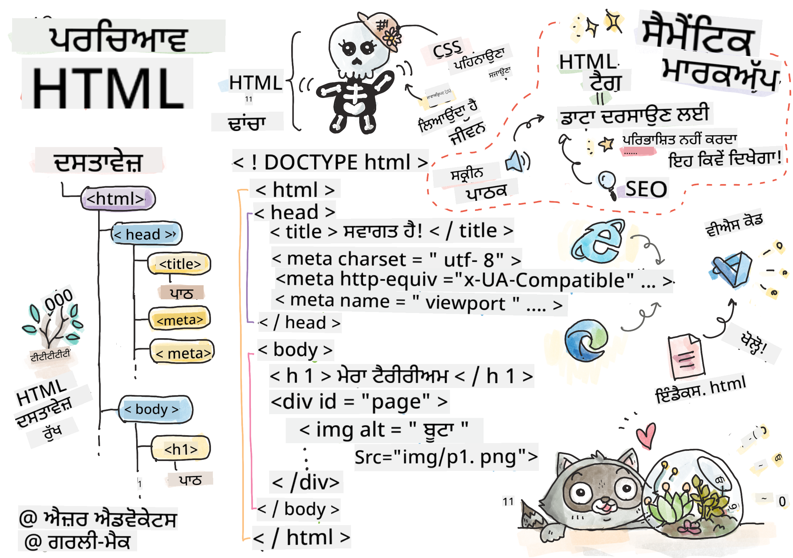
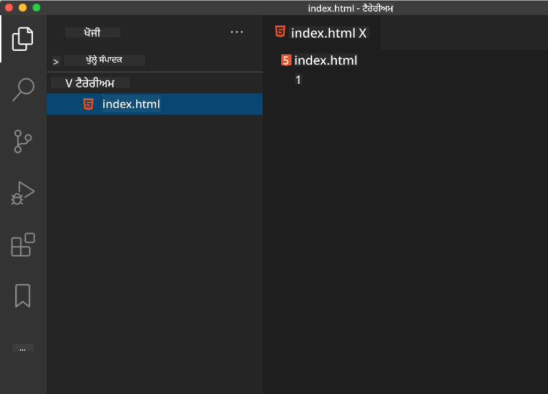

<!--
CO_OP_TRANSLATOR_METADATA:
{
  "original_hash": "46a0639e719b9cf1dfd062aa24cad639",
  "translation_date": "2025-08-25T21:09:20+00:00",
  "source_file": "3-terrarium/1-intro-to-html/README.md",
  "language_code": "pa"
}
-->
# ਟੈਰੇਰੀਅਮ ਪ੍ਰੋਜੈਕਟ ਭਾਗ 1: HTML ਦਾ ਪਰਿਚਯ


> ਸਕੈਚਨੋਟ [Tomomi Imura](https://twitter.com/girlie_mac) ਦੁਆਰਾ

## ਲੈਕਚਰ ਤੋਂ ਪਹਿਲਾਂ ਕਵਿਜ਼

[ਲੈਕਚਰ ਤੋਂ ਪਹਿਲਾਂ ਕਵਿਜ਼](https://ff-quizzes.netlify.app/web/quiz/15)


> ਵੀਡੀਓ ਦੇਖੋ

> 
> [](https://www.youtube.com/watch?v=1TvxJKBzhyQ)

### ਪਰਿਚਯ

HTML, ਜਾਂ HyperText Markup Language, ਵੈੱਬ ਦਾ 'ਡھانਚਾ' ਹੈ। ਜੇ CSS ਤੁਹਾਡੇ HTML ਨੂੰ 'ਸਜਾਉਂਦਾ' ਹੈ ਅਤੇ JavaScript ਇਸਨੂੰ ਜ਼ਿੰਦਗੀ ਦਿੰਦਾ ਹੈ, ਤਾਂ HTML ਤੁਹਾਡੇ ਵੈੱਬ ਐਪਲੀਕੇਸ਼ਨ ਦਾ ਸਰੀਰ ਹੈ। HTML ਦਾ syntax ਇਸ ਵਿਚਾਰ ਨੂੰ ਦਰਸਾਉਂਦਾ ਹੈ, ਕਿਉਂਕਿ ਇਸ ਵਿੱਚ "head", "body", ਅਤੇ "footer" ਟੈਗ ਸ਼ਾਮਲ ਹਨ।

ਇਸ ਪਾਠ ਵਿੱਚ, ਅਸੀਂ HTML ਦੀ ਵਰਤੋਂ ਕਰਕੇ ਆਪਣੇ ਵਰਚੁਅਲ ਟੈਰੇਰੀਅਮ ਦੇ ਇੰਟਰਫੇਸ ਦਾ 'ਡھانਚਾ' ਬਣਾਉਣ ਜਾ ਰਹੇ ਹਾਂ। ਇਸ ਵਿੱਚ ਇੱਕ ਸਿਰਲੇਖ ਅਤੇ ਤਿੰਨ ਕਾਲਮ ਹੋਣਗੇ: ਇੱਕ ਸੱਜੇ ਅਤੇ ਇੱਕ ਖੱਬੇ ਕਾਲਮ ਜਿੱਥੇ ਖਿੱਚਣਯੋਗ ਪੌਦੇ ਹੋਣਗੇ, ਅਤੇ ਇੱਕ ਕੇਂਦਰੀ ਖੇਤਰ ਜੋ ਅਸਲ ਵਿੱਚ ਕੱਚ-ਵਾਲਾ ਟੈਰੇਰੀਅਮ ਹੋਵੇਗਾ। ਇਸ ਪਾਠ ਦੇ ਅੰਤ ਤੱਕ, ਤੁਸੀਂ ਕਾਲਮਾਂ ਵਿੱਚ ਪੌਦੇ ਦੇਖ ਸਕੋਗੇ, ਪਰ ਇੰਟਰਫੇਸ ਕੁਝ ਅਜੀਬ ਲੱਗੇਗਾ; ਚਿੰਤਾ ਨਾ ਕਰੋ, ਅਗਲੇ ਭਾਗ ਵਿੱਚ ਤੁਸੀਂ CSS ਸ਼ੈਲੀਆਂ ਨੂੰ ਇੰਟਰਫੇਸ ਵਿੱਚ ਸ਼ਾਮਲ ਕਰਕੇ ਇਸਨੂੰ ਬਿਹਤਰ ਬਣਾਉਣਗੇ।

### ਕੰਮ

ਆਪਣੇ ਕੰਪਿਊਟਰ 'ਤੇ, 'terrarium' ਨਾਮਕ ਫੋਲਡਰ ਬਣਾਓ ਅਤੇ ਇਸਦੇ ਅੰਦਰ 'index.html' ਨਾਮਕ ਫਾਈਲ ਬਣਾਓ। ਤੁਸੀਂ ਇਹ Visual Studio Code ਵਿੱਚ ਕਰ ਸਕਦੇ ਹੋ ਜਦੋਂ ਤੁਸੀਂ ਆਪਣਾ terrarium ਫੋਲਡਰ ਬਣਾਉਂਦੇ ਹੋ। ਨਵਾਂ VS Code ਵਿੰਡੋ ਖੋਲ੍ਹੋ, 'open folder' 'ਤੇ ਕਲਿੱਕ ਕਰੋ, ਅਤੇ ਆਪਣੇ ਨਵੇਂ ਫੋਲਡਰ ਵਿੱਚ ਜਾਓ। Explorer ਪੈਨ ਵਿੱਚ ਛੋਟੇ 'file' ਬਟਨ 'ਤੇ ਕਲਿੱਕ ਕਰੋ ਅਤੇ ਨਵੀਂ ਫਾਈਲ ਬਣਾਓ:



ਜਾਂ

ਆਪਣੇ git bash 'ਤੇ ਇਹ ਕਮਾਂਡਾਂ ਵਰਤੋ:
* `mkdir terrarium`
* `cd terrarium`
* `touch index.html`
* `code index.html` ਜਾਂ `nano index.html`

> index.html ਫਾਈਲਾਂ ਬ੍ਰਾਊਜ਼ਰ ਨੂੰ ਦਰਸਾਉਂਦੀਆਂ ਹਨ ਕਿ ਇਹ ਫੋਲਡਰ ਵਿੱਚ ਡਿਫਾਲਟ ਫਾਈਲ ਹੈ; URLs ਜਿਵੇਂ `https://anysite.com/test` ਇੱਕ ਫੋਲਡਰ ਸਟ੍ਰਕਚਰ ਦੀ ਵਰਤੋਂ ਕਰਕੇ ਬਣਾਇਆ ਜਾ ਸਕਦਾ ਹੈ ਜਿਸ ਵਿੱਚ `test` ਨਾਮਕ ਫੋਲਡਰ ਅਤੇ `index.html` ਸ਼ਾਮਲ ਹੈ; `index.html` URL ਵਿੱਚ ਦਿਖਾਈ ਦੇਣ ਦੀ ਲੋੜ ਨਹੀਂ ਹੈ।

---

## DocType ਅਤੇ html ਟੈਗ

HTML ਫਾਈਲ ਦੀ ਪਹਿਲੀ ਲਾਈਨ ਇਸਦਾ doctype ਹੁੰਦੀ ਹੈ। ਇਹ ਕੁਝ ਹੈਰਾਨੀਜਨਕ ਹੈ ਕਿ ਤੁਹਾਨੂੰ ਇਹ ਲਾਈਨ ਫਾਈਲ ਦੇ ਬਿਲਕੁਲ ਉੱਪਰ ਹੋਣੀ ਚਾਹੀਦੀ ਹੈ, ਪਰ ਇਹ ਪੁਰਾਣੇ ਬ੍ਰਾਊਜ਼ਰਾਂ ਨੂੰ ਦੱਸਦੀ ਹੈ ਕਿ ਬ੍ਰਾਊਜ਼ਰ ਨੂੰ ਮੌਜੂਦਾ html ਵਿਸ਼ੇਸ਼ਤਾ ਦੇ ਅਨੁਸਾਰ ਪੇਜ ਨੂੰ ਸਟੈਂਡਰਡ ਮੋਡ ਵਿੱਚ ਰੈਂਡਰ ਕਰਨ ਦੀ ਲੋੜ ਹੈ।

> ਸੁਝਾਅ: VS Code ਵਿੱਚ, ਤੁਸੀਂ ਕਿਸੇ ਟੈਗ 'ਤੇ ਹਵਰ ਕਰ ਸਕਦੇ ਹੋ ਅਤੇ ਇਸਦੇ ਉਪਯੋਗ ਬਾਰੇ ਜਾਣਕਾਰੀ MDN Reference ਗਾਈਡ ਤੋਂ ਪ੍ਰਾਪਤ ਕਰ ਸਕਦੇ ਹੋ।

ਦੂਜੀ ਲਾਈਨ `<html>` ਟੈਗ ਦੀ ਖੁੱਲ੍ਹਣ ਵਾਲੀ ਲਾਈਨ ਹੋਣੀ ਚਾਹੀਦੀ ਹੈ, ਜਿਸਦੇ ਤੁਰੰਤ ਬਾਅਦ ਇਸਦੀ ਬੰਦ ਕਰਨ ਵਾਲੀ ਲਾਈਨ `</html>` ਹੋਵੇਗੀ। ਇਹ ਟੈਗ ਤੁਹਾਡੇ ਇੰਟਰਫੇਸ ਦੇ ਰੂਟ ਐਲਿਮੈਂਟ ਹਨ।

### ਕੰਮ

ਆਪਣੀ `index.html` ਫਾਈਲ ਦੇ ਉੱਪਰ ਇਹ ਲਾਈਨਾਂ ਸ਼ਾਮਲ ਕਰੋ:

```HTML
<!DOCTYPE html>
<html></html>
```

✅ ਕੁਝ ਵੱਖ-ਵੱਖ ਮੋਡ ਹਨ ਜੋ DocType ਨੂੰ ਇੱਕ ਕਵੈਰੀ ਸਟ੍ਰਿੰਗ ਨਾਲ ਸੈਟ ਕਰਕੇ ਨਿਰਧਾਰਤ ਕੀਤੇ ਜਾ ਸਕਦੇ ਹਨ: [Quirks Mode ਅਤੇ Standards Mode](https://developer.mozilla.org/docs/Web/HTML/Quirks_Mode_and_Standards_Mode)। ਇਹ ਮੋਡ ਪੁਰਾਣੇ ਬ੍ਰਾਊਜ਼ਰਾਂ (Netscape Navigator 4 ਅਤੇ Internet Explorer 5) ਨੂੰ ਸਹਾਇਤਾ ਦੇਣ ਲਈ ਵਰਤੇ ਜਾਂਦੇ ਸਨ ਜੋ ਆਮ ਤੌਰ 'ਤੇ ਹੁਣ ਵਰਤੇ ਨਹੀਂ ਜਾਂਦੇ। ਤੁਸੀਂ ਸਟੈਂਡਰਡ doctype ਡਿਕਲੇਰੇਸ਼ਨ ਨਾਲ ਚਿਪਕ ਸਕਦੇ ਹੋ।

---

## ਦਸਤਾਵੇਜ਼ ਦਾ 'head'

HTML ਦਸਤਾਵੇਜ਼ ਦਾ 'head' ਖੇਤਰ ਤੁਹਾਡੇ ਵੈੱਬ ਪੇਜ ਬਾਰੇ ਮਹੱਤਵਪੂਰਨ ਜਾਣਕਾਰੀ ਸ਼ਾਮਲ ਕਰਦਾ ਹੈ, ਜਿਸਨੂੰ [metadata](https://developer.mozilla.org/docs/Web/HTML/Element/meta) ਵੀ ਕਿਹਾ ਜਾਂਦਾ ਹੈ। ਸਾਡੇ ਮਾਮਲੇ ਵਿੱਚ, ਅਸੀਂ ਵੈੱਬ ਸਰਵਰ ਨੂੰ ਦੱਸਦੇ ਹਾਂ ਜਿਸ 'ਤੇ ਇਹ ਪੇਜ ਰੈਂਡਰ ਕਰਨ ਲਈ ਭੇਜਿਆ ਜਾਵੇਗਾ, ਇਹ ਚਾਰ ਚੀਜ਼ਾਂ:

-   ਪੇਜ ਦਾ ਸਿਰਲੇਖ
-   ਪੇਜ metadata ਜਿਸ ਵਿੱਚ ਸ਼ਾਮਲ ਹੈ:
    -   'character set', ਜੋ ਦੱਸਦਾ ਹੈ ਕਿ ਪੇਜ ਵਿੱਚ ਕਿਹੜਾ character encoding ਵਰਤਿਆ ਗਿਆ ਹੈ
    -   ਬ੍ਰਾਊਜ਼ਰ ਜਾਣਕਾਰੀ, ਜਿਸ ਵਿੱਚ `x-ua-compatible` ਸ਼ਾਮਲ ਹੈ ਜੋ ਦਰਸਾਉਂਦਾ ਹੈ ਕਿ IE=edge ਬ੍ਰਾਊਜ਼ਰ ਸਹਾਇਤਿਤ ਹੈ
    -   ਜਾਣਕਾਰੀ ਕਿ ਜਦੋਂ ਪੇਜ ਲੋਡ ਕੀਤਾ ਜਾਂਦਾ ਹੈ ਤਾਂ viewport ਕਿਵੇਂ ਵਿਵਹਾਰ ਕਰਨਾ ਚਾਹੀਦਾ ਹੈ। viewport ਨੂੰ 1 ਦੀ ਸ਼ੁਰੂਆਤੀ ਸਕੇਲ ਦੇ ਨਾਲ ਸੈਟ ਕਰਨਾ ਪੇਜ ਲੋਡ ਹੋਣ 'ਤੇ ਜ਼ੂਮ ਲੈਵਲ ਨੂੰ ਨਿਯੰਤਰਿਤ ਕਰਦਾ ਹੈ।

### ਕੰਮ

ਖੁੱਲ੍ਹਣ ਅਤੇ ਬੰਦ ਕਰਨ ਵਾਲੇ `<html>` ਟੈਗਾਂ ਦੇ ਵਿਚਕਾਰ ਆਪਣੇ ਦਸਤਾਵੇਜ਼ ਵਿੱਚ ਇੱਕ 'head' ਬਲਾਕ ਸ਼ਾਮਲ ਕਰੋ।

```html
<head>
	<title>Welcome to my Virtual Terrarium</title>
	<meta charset="utf-8" />
	<meta http-equiv="X-UA-Compatible" content="IE=edge" />
	<meta name="viewport" content="width=device-width, initial-scale=1" />
</head>
```

✅ ਜੇ ਤੁਸੀਂ viewport meta ਟੈਗ ਨੂੰ ਇਸ ਤਰ੍ਹਾਂ ਸੈਟ ਕਰੋ: `<meta name="viewport" content="width=600">`, ਤਾਂ ਕੀ ਹੋਵੇਗਾ? [viewport](https://developer.mozilla.org/docs/Web/HTML/Viewport_meta_tag) ਬਾਰੇ ਹੋਰ ਪੜ੍ਹੋ।

---

## ਦਸਤਾਵੇਜ਼ ਦਾ `body`

### HTML ਟੈਗ

HTML ਵਿੱਚ, ਤੁਸੀਂ ਆਪਣੇ .html ਫਾਈਲ ਵਿੱਚ ਟੈਗ ਸ਼ਾਮਲ ਕਰਦੇ ਹੋ ਤਾਂ ਜੋ ਵੈੱਬ ਪੇਜ ਦੇ ਐਲਿਮੈਂਟ ਬਣ ਸਕਣ। ਹਰ ਟੈਗ ਆਮ ਤੌਰ 'ਤੇ ਇੱਕ ਖੁੱਲ੍ਹਣ ਅਤੇ ਬੰਦ ਕਰਨ ਵਾਲਾ ਟੈਗ ਹੁੰਦਾ ਹੈ, ਜਿਵੇਂ: `<p>hello</p>` ਪੈਰਾ ਦਰਸਾਉਣ ਲਈ। ਆਪਣੇ ਇੰਟਰਫੇਸ ਦਾ body ਬਣਾਉਣ ਲਈ `<html>` ਟੈਗ ਜੋੜੇ ਦੇ ਅੰਦਰ `<body>` ਟੈਗਾਂ ਦਾ ਇੱਕ ਸੈੱਟ ਸ਼ਾਮਲ ਕਰੋ; ਹੁਣ ਤੁਹਾਡਾ markup ਇਸ ਤਰ੍ਹਾਂ ਲੱਗਦਾ ਹੈ:

### ਕੰਮ

```html
<!DOCTYPE html>
<html>
	<head>
		<title>Welcome to my Virtual Terrarium</title>
		<meta charset="utf-8" />
		<meta http-equiv="X-UA-Compatible" content="IE=edge" />
		<meta name="viewport" content="width=device-width, initial-scale=1" />
	</head>
	<body></body>
</html>
```

ਹੁਣ, ਤੁਸੀਂ ਆਪਣਾ ਪੇਜ ਬਣਾਉਣਾ ਸ਼ੁਰੂ ਕਰ ਸਕਦੇ ਹੋ। ਆਮ ਤੌਰ 'ਤੇ, ਤੁਸੀਂ `<div>` ਟੈਗਾਂ ਦੀ ਵਰਤੋਂ ਕਰਦੇ ਹੋ ਤਾਂ ਜੋ ਪੇਜ ਵਿੱਚ ਵੱਖ-ਵੱਖ ਐਲਿਮੈਂਟ ਬਣ ਸਕਣ। ਅਸੀਂ `<div>` ਐਲਿਮੈਂਟਾਂ ਦੀ ਇੱਕ ਲੜੀ ਬਣਾਉਣ ਜਾ ਰਹੇ ਹਾਂ ਜੋ ਚਿੱਤਰਾਂ ਨੂੰ ਸ਼ਾਮਲ ਕਰੇਗੀ।

### ਚਿੱਤਰ

ਇੱਕ html ਟੈਗ ਜਿਸਨੂੰ ਬੰਦ ਕਰਨ ਵਾਲੇ ਟੈਗ ਦੀ ਲੋੜ ਨਹੀਂ ਹੁੰਦੀ, `` ਟੈਗ ਹੈ, ਕਿਉਂਕਿ ਇਸ ਵਿੱਚ ਇੱਕ `src` ਐਲਿਮੈਂਟ ਹੁੰਦਾ ਹੈ ਜੋ ਪੇਜ ਨੂੰ ਆਈਟਮ ਨੂੰ ਰੈਂਡਰ ਕਰਨ ਲਈ ਸਾਰੀ ਜਾਣਕਾਰੀ ਦਿੰਦਾ ਹੈ।

ਆਪਣੇ ਐਪ ਵਿੱਚ `images` ਨਾਮਕ ਫੋਲਡਰ ਬਣਾਓ ਅਤੇ ਇਸ ਵਿੱਚ [source code folder](../../../../3-terrarium/solution/images) ਵਿੱਚ ਸਾਰੇ ਚਿੱਤਰ ਸ਼ਾਮਲ ਕਰੋ; (ਪੌਦਿਆਂ ਦੇ 14 ਚਿੱਤਰ ਹਨ)।

### ਕੰਮ

ਇਹ ਪੌਦੇ ਦੇ ਚਿੱਤਰ `<body></body>` ਟੈਗਾਂ ਦੇ ਵਿਚਕਾਰ ਦੋ ਕਾਲਮਾਂ ਵਿੱਚ ਸ਼ਾਮਲ ਕਰੋ:

```html
<div id="page">
	<div id="left-container" class="container">
		<div class="plant-holder">
			
		</div>
		<div class="plant-holder">
			
		</div>
		<div class="plant-holder">
			
		</div>
		<div class="plant-holder">
			
		</div>
		<div class="plant-holder">
			
		</div>
		<div class="plant-holder">
			
		</div>
		<div class="plant-holder">
			
		</div>
	</div>
	<div id="right-container" class="container">
		<div class="plant-holder">
			
		</div>
		<div class="plant-holder">
			
		</div>
		<div class="plant-holder">
			
		</div>
		<div class="plant-holder">
			
		</div>
		<div class="plant-holder">
			
		</div>
		<div class="plant-holder">
			
		</div>
		<div class="plant-holder">
			
		</div>
	</div>
</div>
```

> ਨੋਟ: Spans vs. Divs. Divs ਨੂੰ 'block' ਐਲਿਮੈਂਟ ਮੰਨਿਆ ਜਾਂਦਾ ਹੈ, ਅਤੇ Spans ਨੂੰ 'inline'। ਜੇ ਤੁਸੀਂ ਇਹ divs ਨੂੰ spans ਵਿੱਚ ਬਦਲ ਦਿੰਦੇ ਹੋ ਤਾਂ ਕੀ ਹੋਵੇਗਾ?

ਇਸ markup ਨਾਲ, ਪੌਦੇ ਹੁਣ ਸਕ੍ਰੀਨ 'ਤੇ ਦਿਖਾਈ ਦਿੰਦੇ ਹਨ। ਇਹ ਬਹੁਤ ਖਰਾਬ ਲੱਗਦਾ ਹੈ, ਕਿਉਂਕਿ ਇਹਨਾਂ ਨੂੰ CSS ਦੀ ਵਰਤੋਂ ਕਰਕੇ ਅਜੇ ਤੱਕ styled ਨਹੀਂ ਕੀਤਾ ਗਿਆ ਹੈ, ਅਤੇ ਅਸੀਂ ਇਹ ਅਗਲੇ ਪਾਠ ਵਿੱਚ ਕਰਾਂਗੇ।

ਹਰ ਚਿੱਤਰ ਵਿੱਚ alt ਟੈਕਸਟ ਹੁੰਦਾ ਹੈ ਜੋ ਉਸ ਸਮੇਂ ਦਿਖਾਈ ਦੇਵੇਗਾ ਜਦੋਂ ਤੁਸੀਂ ਚਿੱਤਰ ਨੂੰ ਨਹੀਂ ਦੇਖ ਸਕਦੇ ਜਾਂ ਰੈਂਡਰ ਨਹੀਂ ਕਰ ਸਕਦੇ। ਇਹ ਇੱਕ ਮਹੱਤਵਪੂਰਨ attribute ਹੈ ਜੋ accessibility ਲਈ ਸ਼ਾਮਲ ਕੀਤਾ ਜਾਂਦਾ ਹੈ। ਭਵਿੱਖ ਦੇ ਪਾਠਾਂ ਵਿੱਚ accessibility ਬਾਰੇ ਹੋਰ ਸਿੱਖੋ; ਇਸ ਸਮੇਂ ਲਈ, ਯਾਦ ਰੱਖੋ ਕਿ alt attribute ਚਿੱਤਰ ਲਈ ਵਿਕਲਪਕ ਜਾਣਕਾਰੀ ਪ੍ਰਦਾਨ ਕਰਦਾ ਹੈ ਜੇਕਰ ਕਿਸੇ ਕਾਰਨ ਕਰਕੇ ਯੂਜ਼ਰ ਇਸਨੂੰ ਨਹੀਂ ਦੇਖ ਸਕਦਾ (ਧੀਮੀ ਕਨੈਕਸ਼ਨ, src attribute ਵਿੱਚ ਗਲਤੀ, ਜਾਂ ਜੇ ਯੂਜ਼ਰ ਸਕ੍ਰੀਨ ਰੀਡਰ ਦੀ ਵਰਤੋਂ ਕਰਦਾ ਹੈ)।

✅ ਕੀ ਤੁਸੀਂ ਧਿਆਨ ਦਿੱਤਾ ਕਿ ਹਰ ਚਿੱਤਰ ਵਿੱਚ ਇੱਕੋ ਜਿਹਾ alt ਟੈਗ ਹੈ? ਕੀ ਇਹ ਚੰਗੀ ਪ੍ਰਕਿਰਿਆ ਹੈ? ਕਿਉਂ ਜਾਂ ਕਿਉਂ ਨਹੀਂ? ਕੀ ਤੁਸੀਂ ਇਸ ਕੋਡ ਨੂੰ ਬਿਹਤਰ ਬਣਾ ਸਕਦੇ ਹੋ?

---

## ਸੈਮਾਂਟਿਕ markup

ਆਮ ਤੌਰ 'ਤੇ, HTML ਲਿਖਣ ਸਮੇਂ ਅਰਥਪੂਰਨ 'semantics' ਦੀ ਵਰਤੋਂ ਕਰਨਾ ਪਸੰਦ ਕੀਤਾ ਜਾਂਦਾ ਹੈ। ਇਸਦਾ ਕੀ ਅਰਥ ਹੈ? ਇਸਦਾ ਅਰਥ ਹੈ ਕਿ ਤੁਸੀਂ HTML ਟੈਗਾਂ ਦੀ ਵਰਤੋਂ ਉਸ ਡੇਟਾ ਜਾਂ ਇੰਟਰੈਕਸ਼ਨ ਦੀ ਕਿਸਮ ਨੂੰ ਦਰਸਾਉਣ ਲਈ ਕਰਦੇ ਹੋ ਜਿਸ ਲਈ ਉਹ ਡਿਜ਼ਾਈਨ ਕੀਤੇ ਗਏ ਸਨ। ਉਦਾਹਰਨ ਲਈ, ਪੇਜ 'ਤੇ ਮੁੱਖ ਸਿਰਲੇਖ ਟੈਕਸਟ ਨੂੰ `<h1>` ਟੈਗ ਦੀ ਵਰਤੋਂ ਕਰਨੀ ਚਾਹੀਦੀ ਹੈ।

ਆਪਣੇ ਖੁੱਲ੍ਹਣ ਵਾਲੇ `<body>` ਟੈਗ ਦੇ ਬਿਲਕੁਲ ਹੇਠਾਂ ਇਹ ਲਾਈਨ ਸ਼ਾਮਲ ਕਰੋ:

```html
<h1>My Terrarium</h1>
```

ਸੈਮਾਂਟਿਕ markup ਦੀ ਵਰਤੋਂ ਕਰਨਾ ਜਿਵੇਂ ਕਿ headers ਨੂੰ `<h1>` ਅਤੇ unordered lists ਨੂੰ `<ul>` ਵਜੋਂ ਰੈਂਡਰ ਕਰਨਾ ਸਕ੍ਰੀਨ ਰੀਡਰਾਂ ਨੂੰ ਪੇਜ ਵਿੱਚ ਨੈਵੀਗੇਟ ਕਰਨ ਵਿੱਚ ਮਦਦ ਕਰਦਾ ਹੈ। ਆਮ ਤੌਰ 'ਤੇ, buttons ਨੂੰ `<button>` ਵਜੋਂ ਲਿਖਿਆ ਜਾਣਾ ਚਾਹੀਦਾ ਹੈ ਅਤੇ lists ਨੂੰ `<li>`। ਜਦੋਂ ਕਿ ਇਹ ਸੰਭਵ ਹੈ ਕਿ specially styled `<span>` ਐਲਿਮੈਂਟਾਂ ਦੀ ਵਰਤੋਂ ਕਰਕੇ buttons ਨੂੰ mock ਕੀਤਾ ਜਾਵੇ, ਇਹ disabled ਯੂਜ਼ਰਾਂ ਲਈ ਬਿਹਤਰ ਹੈ ਕਿ ਉਹ technologies ਦੀ ਵਰਤੋਂ ਕਰਕੇ ਪੇਜ 'ਤੇ buttons ਦੀ ਸਥਿਤੀ ਦਾ ਨਿਰਧਾਰਨ ਕਰਨ ਅਤੇ ਇਸ ਨਾਲ ਇੰਟਰੈਕਟ ਕਰਨ, ਜੇਕਰ ਐਲਿਮੈਂਟ button ਵਜੋਂ ਦਿਖਾਈ ਦਿੰਦਾ ਹੈ। ਇਸ ਕਾਰਨ ਕਰਕੇ, ਜਿੰਨਾ ਹੋ ਸਕੇ semantic markup ਦੀ ਵਰਤੋਂ ਕਰਨ ਦੀ ਕੋਸ਼ਿਸ਼ ਕਰੋ।

✅ ਇੱਕ ਸਕ੍ਰੀਨ ਰੀਡਰ ਦੇਖੋ ਅਤੇ [ਇਹ ਕਿਵੇਂ ਵੈੱਬ ਪੇਜ ਨਾਲ ਇੰਟਰੈਕਟ ਕਰਦਾ ਹੈ](https://www.youtube.com/watch?v=OUDV1gqs9GA)। ਕੀ ਤੁਸੀਂ ਦੇਖ ਸਕਦੇ ਹੋ ਕਿ non semantic markup ਯੂਜ਼ਰ ਨੂੰ ਕਿਉਂ ਨਿਰਾਸ਼ ਕਰ ਸਕਦਾ ਹੈ?

## ਟੈਰੇਰੀਅਮ

ਇੰਟਰਫੇਸ ਦਾ ਆਖਰੀ ਭਾਗ markup ਬਣਾਉਣ ਵਿੱਚ ਸ਼ਾਮਲ ਹੈ ਜੋ styled ਹੋਵੇਗਾ ਤਾਂ ਜੋ ਟੈਰੇਰੀਅਮ ਬਣਾਇਆ ਜਾ ਸਕੇ।

### ਕੰਮ:

ਆਖਰੀ `</div>` ਟੈਗ ਦੇ ਉੱਪਰ ਇਹ markup ਸ਼ਾਮਲ ਕਰੋ:

```html
<div id="terrarium">
	<div class="jar-top"></div>
	<div class="jar-walls">
		<div class="jar-glossy-long"></div>
		<div class="jar-glossy-short"></div>
	</div>
	<div class="dirt"></div>
	<div class="jar-bottom"></div>
</div>
```

✅ ਜਦੋਂ ਕਿ ਤੁਸੀਂ ਇਹ markup ਸਕ੍ਰੀਨ 'ਤੇ ਸ਼ਾਮਲ ਕੀਤਾ, ਤੁਸੀਂ ਬਿਲਕੁਲ ਕੁਝ ਵੀ render ਨਹੀਂ ਹੁੰਦਾ। ਕਿਉਂ?

---

## 🚀ਚੁਣੌਤੀ

HTML ਵਿੱਚ ਕੁਝ ਪੁਰਾਣੇ 'older' ਟੈਗ ਹਨ ਜੋ ਅਜੇ ਵੀ ਖੇਡਣ ਲਈ ਮਜ਼ੇਦਾਰ ਹਨ, ਹਾਲਾਂਕਿ ਤੁਹਾਨੂੰ ਆਪਣੇ markup ਵਿੱਚ [ਇਹ ਟੈਗ](https://developer.mozilla.org/docs/Web/HTML/Element#Obsolete_and_deprecated_elements) ਵਰਤਣ ਨਹੀਂ ਚਾਹੀਦੇ। ਫਿਰ ਵੀ, ਕੀ ਤੁਸੀਂ ਪੁਰਾਣੇ `<marquee>` ਟੈਗ ਦੀ ਵਰਤੋਂ ਕਰਕੇ h1 ਸਿਰਲੇਖ ਨੂੰ ਹੋਰਿਜ਼ਾਂਟਲ ਸਕ੍ਰੋਲ ਕਰ ਸਕਦੇ ਹੋ? (ਜੇ ਤੁਸੀਂ ਕਰਦੇ ਹੋ, ਤਾਂ ਇਸਨੂੰ ਬਾਅਦ ਵਿੱਚ ਹਟਾਉਣਾ ਨਾ ਭੁੱਲੋ)

## ਲੈਕਚਰ ਤੋਂ ਬਾਅਦ ਕਵਿਜ਼

[ਲੈਕਚਰ ਤੋਂ ਬਾਅਦ ਕਵਿਜ਼](https://ff-quizzes.netlify.app/web/quiz/16)

## ਸਮੀਖਿਆ ਅਤੇ ਸਵੈ ਅਧਿਐਨ

HTML 'tried and true' ਬਿਲਡਿੰਗ ਬਲਾਕ ਸਿਸਟਮ ਹੈ ਜਿਸਨੇ ਵੈੱਬ ਨੂੰ ਅੱਜ ਦੇ ਰੂਪ ਵਿੱਚ ਬਣਾਉਣ ਵਿੱਚ ਮਦਦ ਕੀਤੀ ਹੈ। ਇਸਦੇ ਇਤਿਹਾਸ ਬਾਰੇ ਕੁਝ ਸਿੱਖੋ ਜੇਕਰ ਤੁਸੀਂ ਕੁਝ ਪੁਰਾਣੇ ਅਤੇ ਨਵੇਂ ਟੈਗਾਂ ਦਾ ਅਧਿਐਨ ਕਰੋ। ਕੀ ਤੁਸੀਂ ਪਤਾ ਲਗਾ ਸਕਦੇ ਹੋ ਕਿ ਕੁਝ ਟੈਗ ਕਿਉਂ deprecated ਕੀਤੇ ਗਏ ਅਤੇ ਕੁਝ ਸ਼ਾਮਲ ਕੀਤੇ ਗਏ? ਭਵਿੱਖ ਵਿੱਚ ਕਿਹੜੇ ਟੈਗ ਸ਼ਾਮਲ ਕੀਤੇ ਜਾ ਸਕਦੇ ਹਨ?

ਵੈੱਬ ਅਤੇ ਮੋਬਾਈਲ ਡਿਵਾਈਸਾਂ ਲਈ ਸਾਈਟਾਂ ਬਣਾਉਣ ਬਾਰੇ ਹੋਰ ਸਿੱਖੋ [Microsoft Learn](https://docs.microsoft.com/learn/modules/build-simple-website/?WT.mc_id=academic-77807-sagibbon) 'ਤੇ।

## ਅਸਾਈਨਮੈਂਟ

[ਆਪਣੀ HTML ਦਾ ਅਭਿਆਸ ਕਰੋ: ਇੱਕ ਬਲੌਗ ਮੌਕਅੱਪ ਬਣਾਓ](assignment.md)

**ਅਸਵੀਕਾਰਨਾ**:  
ਇਹ ਦਸਤਾਵੇਜ਼ AI ਅਨੁਵਾਦ ਸੇਵਾ [Co-op Translator](https://github.com/Azure/co-op-translator) ਦੀ ਵਰਤੋਂ ਕਰਕੇ ਅਨੁਵਾਦ ਕੀਤਾ ਗਿਆ ਹੈ। ਜਦੋਂ ਕਿ ਅਸੀਂ ਸਹੀਤਾ ਲਈ ਯਤਨਸ਼ੀਲ ਹਾਂ, ਕਿਰਪਾ ਕਰਕੇ ਧਿਆਨ ਦਿਓ ਕਿ ਸਵੈਚਾਲਿਤ ਅਨੁਵਾਦਾਂ ਵਿੱਚ ਗਲਤੀਆਂ ਜਾਂ ਅਸੁਚੀਤਤਾਵਾਂ ਹੋ ਸਕਦੀਆਂ ਹਨ। ਮੂਲ ਦਸਤਾਵੇਜ਼ ਨੂੰ ਇਸਦੀ ਮੂਲ ਭਾਸ਼ਾ ਵਿੱਚ ਅਧਿਕਾਰਤ ਸਰੋਤ ਮੰਨਿਆ ਜਾਣਾ ਚਾਹੀਦਾ ਹੈ। ਮਹੱਤਵਪੂਰਨ ਜਾਣਕਾਰੀ ਲਈ, ਪੇਸ਼ੇਵਰ ਮਨੁੱਖੀ ਅਨੁਵਾਦ ਦੀ ਸਿਫਾਰਸ਼ ਕੀਤੀ ਜਾਂਦੀ ਹੈ। ਇਸ ਅਨੁਵਾਦ ਦੀ ਵਰਤੋਂ ਤੋਂ ਪੈਦਾ ਹੋਣ ਵਾਲੇ ਕਿਸੇ ਵੀ ਗਲਤਫਹਿਮੀ ਜਾਂ ਗਲਤ ਵਿਆਖਿਆ ਲਈ ਅਸੀਂ ਜ਼ਿੰਮੇਵਾਰ ਨਹੀਂ ਹਾਂ।