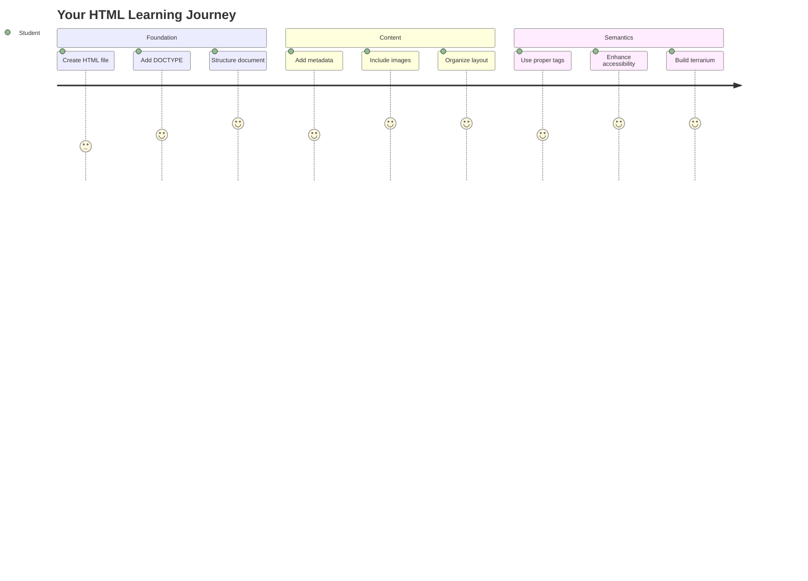
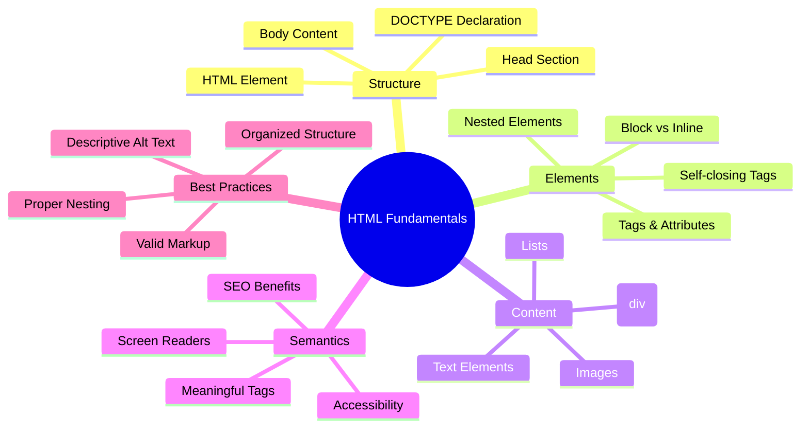
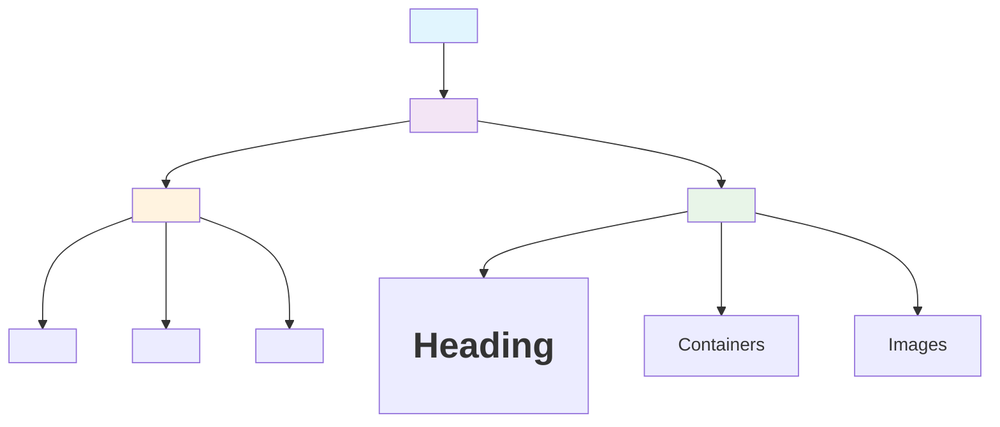
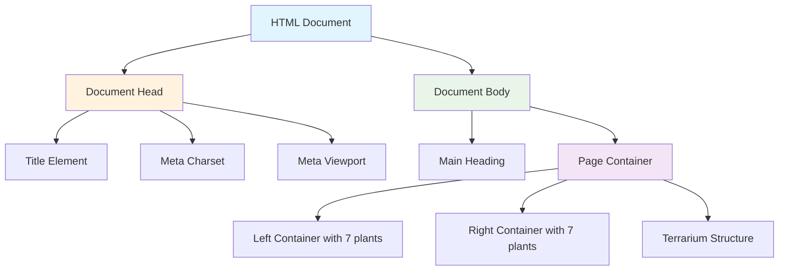
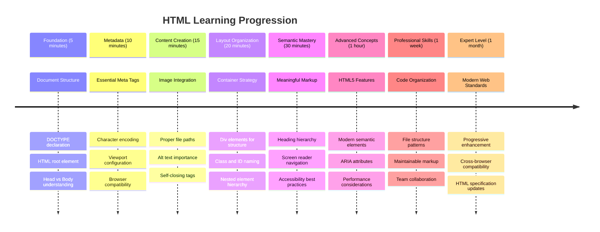

<!--
CO_OP_TRANSLATOR_METADATA:
{
  "original_hash": "3fcfa99c4897e051b558b5eaf1e8cc74",
  "translation_date": "2025-11-03T16:35:03+00:00",
  "source_file": "3-terrarium/1-intro-to-html/README.md",
  "language_code": "pa"
}
-->
# ਟੈਰੀਰੀਅਮ ਪ੍ਰੋਜੈਕਟ ਭਾਗ 1: HTML ਦਾ ਪਰਿਚਯ




> ਸਕੈਚਨੋਟ [Tomomi Imura](https://twitter.com/girlie_mac) ਦੁਆਰਾ

HTML, ਜਾਂ HyperText Markup Language, ਹਰ ਵੈਬਸਾਈਟ ਦੀ ਬੁਨਿਆਦ ਹੈ ਜਿਸ ਨੂੰ ਤੁਸੀਂ ਕਦੇ ਵੀ ਵੇਖਿਆ ਹੈ। HTML ਨੂੰ ਵੈਬ ਪੇਜਾਂ ਦੇ ਢਾਂਚੇ ਦੇ ਤੌਰ 'ਤੇ ਸੋਚੋ - ਇਹ ਨਿਰਧਾਰਤ ਕਰਦਾ ਹੈ ਕਿ ਸਮੱਗਰੀ ਕਿੱਥੇ ਜਾਂਦੀ ਹੈ, ਇਹ ਕਿਵੇਂ ਸੰਗਠਿਤ ਹੈ, ਅਤੇ ਹਰ ਹਿੱਸਾ ਕੀ ਦਰਸਾਉਂਦਾ ਹੈ। ਜਦ CSS ਤੁਹਾਡੇ HTML ਨੂੰ ਰੰਗਾਂ ਅਤੇ ਲੇਆਉਟ ਨਾਲ "ਸਜਾਉਣ" ਲਈ ਆਵੇਗਾ, ਅਤੇ JavaScript ਇਸਨੂੰ ਇੰਟਰਐਕਟਿਵਿਟੀ ਨਾਲ ਜ਼ਿੰਦਾ ਕਰੇਗਾ, HTML ਉਹ ਅਹਿਮ ਢਾਂਚਾ ਪ੍ਰਦਾਨ ਕਰਦਾ ਹੈ ਜੋ ਬਾਕੀ ਸਭ ਕੁਝ ਸੰਭਵ ਬਣਾਉਂਦਾ ਹੈ।

ਇਸ ਪਾਠ ਵਿੱਚ, ਤੁਸੀਂ ਇੱਕ ਵਰਚੁਅਲ ਟੈਰੀਰੀਅਮ ਇੰਟਰਫੇਸ ਲਈ HTML ਢਾਂਚਾ ਬਣਾਉਣ ਜਾ ਰਹੇ ਹੋ। ਇਹ ਹੱਥ-ਅਨੁਭਵ ਪ੍ਰੋਜੈਕਟ ਤੁਹਾਨੂੰ ਮੁੱਢਲੇ HTML ਸੰਕਲਪ ਸਿਖਾਏਗਾ ਜਦੋਂ ਤੁਸੀਂ ਕੁਝ ਦ੍ਰਿਸ਼ਮਾਨ ਤੌਰ 'ਤੇ ਆਕਰਸ਼ਕ ਬਣਾਉਂਦੇ ਹੋ। ਤੁਸੀਂ ਸੈਮਾਂਟਿਕ ਐਲਿਮੈਂਟਸ ਦੀ ਵਰਤੋਂ ਕਰਕੇ ਸਮੱਗਰੀ ਨੂੰ ਸੰਗਠਿਤ ਕਰਨ, ਚਿੱਤਰਾਂ ਨਾਲ ਕੰਮ ਕਰਨ, ਅਤੇ ਇੱਕ ਇੰਟਰਐਕਟਿਵ ਵੈਬ ਐਪਲੀਕੇਸ਼ਨ ਲਈ ਬੁਨਿਆਦ ਬਣਾਉਣ ਦੇ ਬਾਰੇ ਸਿੱਖੋਗੇ।

ਇਸ ਪਾਠ ਦੇ ਅੰਤ ਤੱਕ, ਤੁਹਾਡੇ ਕੋਲ ਇੱਕ ਕੰਮ ਕਰਨ ਵਾਲਾ HTML ਪੇਜ ਹੋਵੇਗਾ ਜੋ ਪੌਦਿਆਂ ਦੇ ਚਿੱਤਰਾਂ ਨੂੰ ਸੰਗਠਿਤ ਕਾਲਮਾਂ ਵਿੱਚ ਦਰਸਾਉਂਦਾ ਹੈ, ਅਗਲੇ ਪਾਠ ਵਿੱਚ ਸਟਾਈਲਿੰਗ ਲਈ ਤਿਆਰ। ਚਿੰਤਾ ਨਾ ਕਰੋ ਜੇ ਇਹ ਸ਼ੁਰੂ ਵਿੱਚ ਬੁਨਿਆਦੀ ਲੱਗਦਾ ਹੈ - ਇਹੀ HTML ਦਾ ਕੰਮ ਹੈ CSS ਦੇ ਵਿਜ਼ੁਅਲ ਪੋਲਿਸ਼ ਸ਼ਾਮਲ ਕਰਨ ਤੋਂ ਪਹਿਲਾਂ।



## ਪਾਠ-ਪਹਿਲਾਂ ਕਵਿਜ਼

[ਪਾਠ-ਪਹਿਲਾਂ ਕਵਿਜ਼](https://ff-quizzes.netlify.app/web/quiz/15)

> 📺 **ਦੇਖੋ ਅਤੇ ਸਿੱਖੋ**: ਇਸ ਮਦਦਗਾਰ ਵੀਡੀਓ ਝਲਕ ਨੂੰ ਦੇਖੋ
> 
> [](https://www.youtube.com/watch?v=1TvxJKBzhyQ)

## ਆਪਣੇ ਪ੍ਰੋਜੈਕਟ ਨੂੰ ਸੈਟ ਅੱਪ ਕਰਨਾ

HTML ਕੋਡ ਵਿੱਚ ਡੁੱਬਣ ਤੋਂ ਪਹਿਲਾਂ, ਆਓ ਆਪਣੇ ਟੈਰੀਰੀਅਮ ਪ੍ਰੋਜੈਕਟ ਲਈ ਇੱਕ ਢੰਗ ਵਾਲਾ ਵਰਕਸਪੇਸ ਸੈਟ ਅੱਪ ਕਰੀਏ। ਸ਼ੁਰੂ ਤੋਂ ਹੀ ਇੱਕ ਸੰਗਠਿਤ ਫਾਈਲ ਢਾਂਚਾ ਬਣਾਉਣਾ ਇੱਕ ਮਹੱਤਵਪੂਰਨ ਆਦਤ ਹੈ ਜੋ ਤੁਹਾਨੂੰ ਤੁਹਾਡੇ ਵੈਬ ਵਿਕਾਸ ਯਾਤਰਾ ਦੌਰਾਨ ਚੰਗੀ ਤਰ੍ਹਾਂ ਸੇਵਾ ਦੇਵੇਗੀ।

### ਕੰਮ: ਆਪਣੇ ਪ੍ਰੋਜੈਕਟ ਢਾਂਚੇ ਨੂੰ ਬਣਾਓ

ਤੁਸੀਂ ਆਪਣੇ ਟੈਰੀਰੀਅਮ ਪ੍ਰੋਜੈਕਟ ਲਈ ਇੱਕ ਸਮਰਪਿਤ ਫੋਲਡਰ ਬਣਾਓਗੇ ਅਤੇ ਆਪਣੀ ਪਹਿਲੀ HTML ਫਾਈਲ ਸ਼ਾਮਲ ਕਰੋਗੇ। ਇੱਥੇ ਦੋ ਪਹੁੰਚਾਂ ਹਨ ਜੋ ਤੁਸੀਂ ਵਰਤ ਸਕਦੇ ਹੋ:

**ਵਿਕਲਪ 1: Visual Studio Code ਦੀ ਵਰਤੋਂ ਕਰਨਾ**
1. Visual Studio Code ਖੋਲ੍ਹੋ
2. "File" → "Open Folder" 'ਤੇ ਕਲਿਕ ਕਰੋ ਜਾਂ `Ctrl+K, Ctrl+O` (Windows/Linux) ਜਾਂ `Cmd+K, Cmd+O` (Mac) ਦੀ ਵਰਤੋਂ ਕਰੋ
3. `terrarium` ਨਾਮਕ ਇੱਕ ਨਵਾਂ ਫੋਲਡਰ ਬਣਾਓ ਅਤੇ ਇਸਨੂੰ ਚੁਣੋ
4. Explorer ਪੈਨ ਵਿੱਚ, "New File" ਆਈਕਨ 'ਤੇ ਕਲਿਕ ਕਰੋ
5. ਆਪਣੀ ਫਾਈਲ ਨੂੰ `index.html` ਨਾਮ ਦਿਓ


**ਵਿਕਲਪ 2: ਟਰਮੀਨਲ ਕਮਾਂਡ ਦੀ ਵਰਤੋਂ ਕਰਨਾ**
```bash
mkdir terrarium
cd terrarium
touch index.html
code index.html
```

**ਇਹ ਕਮਾਂਡ ਕੀ ਕਰਦੀਆਂ ਹਨ:**
- **ਨਵਾਂ ਡਾਇਰੈਕਟਰੀ** `terrarium` ਬਣਾਉਂਦਾ ਹੈ
- **ਡਾਇਰੈਕਟਰੀ ਵਿੱਚ ਜਾਂਦਾ ਹੈ** 
- **ਖਾਲੀ `index.html` ਫਾਈਲ** ਬਣਾਉਂਦਾ ਹੈ
- **Visual Studio Code ਵਿੱਚ ਫਾਈਲ ਖੋਲ੍ਹਦਾ ਹੈ** ਸੰਪਾਦਨ ਲਈ

> 💡 **ਪ੍ਰੋ ਟਿਪ**: ਫਾਈਲ ਦਾ ਨਾਮ `index.html` ਵੈਬ ਵਿਕਾਸ ਵਿੱਚ ਵਿਸ਼ੇਸ਼ ਹੈ। ਜਦੋਂ ਕੋਈ ਵੈਬਸਾਈਟ 'ਤੇ ਜਾਂਦਾ ਹੈ, ਬ੍ਰਾਊਜ਼ਰ ਆਟੋਮੈਟਿਕ ਤੌਰ 'ਤੇ `index.html` ਨੂੰ ਡਿਫਾਲਟ ਪੇਜ ਦੇ ਤੌਰ 'ਤੇ ਵੇਖਣ ਲਈ ਲੱਭਦੇ ਹਨ। ਇਸਦਾ ਮਤਲਬ ਹੈ ਕਿ `https://mysite.com/projects/` ਵਰਗਾ URL ਆਟੋਮੈਟਿਕ ਤੌਰ 'ਤੇ `projects` ਫੋਲਡਰ ਤੋਂ `index.html` ਫਾਈਲ ਨੂੰ ਸਰਵ ਕਰੇਗਾ ਬਿਨਾਂ URL ਵਿੱਚ ਫਾਈਲ ਨਾਮ ਨੂੰ ਨਿਰਧਾਰਤ ਕਰਨ ਦੀ ਲੋੜ ਹੋਵੇ।

## HTML ਦਸਤਾਵੇਜ਼ ਢਾਂਚੇ ਨੂੰ ਸਮਝਣਾ

ਹਰ HTML ਦਸਤਾਵੇਜ਼ ਇੱਕ ਵਿਸ਼ੇਸ਼ ਢਾਂਚੇ ਦੀ ਪਾਲਣਾ ਕਰਦਾ ਹੈ ਜਿਸਨੂੰ ਬ੍ਰਾਊਜ਼ਰ ਸਹੀ ਤਰੀਕੇ ਨਾਲ ਸਮਝਣ ਅਤੇ ਦਰਸਾਉਣ ਦੀ ਲੋੜ ਹੁੰਦੀ ਹੈ। ਇਸ ਢਾਂਚੇ ਨੂੰ ਇੱਕ ਅਧਿਕਾਰਤ ਚਿੱਠੀ ਵਾਂਗ ਸੋਚੋ - ਇਸ ਵਿੱਚ ਇੱਕ ਵਿਸ਼ੇਸ਼ ਕ੍ਰਮ ਵਿੱਚ ਲੋੜੀਂਦੇ ਤੱਤ ਹੁੰਦੇ ਹਨ ਜੋ ਪ੍ਰਾਪਤਕਰਤਾ (ਇਸ ਮਾਮਲੇ ਵਿੱਚ, ਬ੍ਰਾਊਜ਼ਰ) ਨੂੰ ਸਮੱਗਰੀ ਨੂੰ ਸਹੀ ਤਰੀਕੇ ਨਾਲ ਪ੍ਰਕਿਰਿਆ ਕਰਨ ਵਿੱਚ ਮਦਦ ਕਰਦੇ ਹਨ।



ਆਓ ਅਹਿਮ ਬੁਨਿਆਦ ਸ਼ਾਮਲ ਕਰਕੇ ਸ਼ੁਰੂ ਕਰੀਏ ਜੋ ਹਰ HTML ਦਸਤਾਵੇਜ਼ ਨੂੰ ਲੋੜੀਂਦੀ ਹੈ।

### DOCTYPE ਡਿਕਲੇਰੇਸ਼ਨ ਅਤੇ ਰੂਟ ਐਲਿਮੈਂਟ

ਕਿਸੇ ਵੀ HTML ਫਾਈਲ ਦੀ ਪਹਿਲੀ ਦੋ ਲਾਈਨਾਂ ਦਸਤਾਵੇਜ਼ ਦਾ "ਪ੍ਰਸਤਾਵ" ਬ੍ਰਾਊਜ਼ਰ ਨੂੰ ਦਿੰਦੇ ਹਨ:

```html
<!DOCTYPE html>
<html></html>
```

**ਇਹ ਕੋਡ ਕੀ ਕਰਦਾ ਹੈ:**
- **ਦਸਤਾਵੇਜ਼ ਦੀ ਕਿਸਮ** HTML5 ਦੇ ਤੌਰ 'ਤੇ `<!DOCTYPE html>` ਨਾਲ ਘੋਸ਼ਿਤ ਕਰਦਾ ਹੈ
- **ਰੂਟ `<html>` ਐਲਿਮੈਂਟ ਬਣਾਉਂਦਾ ਹੈ** ਜੋ ਸਾਰੀ ਪੇਜ ਸਮੱਗਰੀ ਨੂੰ ਸ਼ਾਮਲ ਕਰੇਗਾ
- **ਆਧੁਨਿਕ ਵੈਬ ਮਿਆਰਾਂ** ਸਥਾਪਿਤ ਕਰਦਾ ਹੈ ਸਹੀ ਬ੍ਰਾਊਜ਼ਰ ਰੈਂਡਰਿੰਗ ਲਈ
- **ਵੱਖ-ਵੱਖ ਬ੍ਰਾਊਜ਼ਰਾਂ ਅਤੇ ਡਿਵਾਈਸਾਂ ਵਿੱਚ** ਸਥਿਰ ਪ੍ਰਦਰਸ਼ਨ ਨੂੰ ਯਕੀਨੀ ਬਣਾਉਂਦਾ ਹੈ

> 💡 **VS Code ਟਿਪ**: VS Code ਵਿੱਚ ਕਿਸੇ ਵੀ HTML ਟੈਗ 'ਤੇ ਹਵਰ ਕਰੋ ਤਾਂ ਜੋ MDN Web Docs ਤੋਂ ਮਦਦਗਾਰ ਜਾਣਕਾਰੀ ਦੇਖ ਸਕੋ, ਜਿਸ ਵਿੱਚ ਵਰਤੋਂ ਦੇ ਉਦਾਹਰਨ ਅਤੇ ਬ੍ਰਾਊਜ਼ਰ ਅਨੁਕੂਲਤਾ ਵੇਰਵੇ ਸ਼ਾਮਲ ਹਨ।

> 📚 **ਹੋਰ ਸਿੱਖੋ**: DOCTYPE ਡਿਕਲੇਰੇਸ਼ਨ ਬ੍ਰਾਊਜ਼ਰਾਂ ਨੂੰ "quirks mode" ਵਿੱਚ ਜਾਣ ਤੋਂ ਰੋਕਦਾ ਹੈ, ਜੋ ਬਹੁਤ ਪੁਰਾਣੀਆਂ ਵੈਬਸਾਈਟਾਂ ਨੂੰ ਸਹਾਇਤਾ ਕਰਨ ਲਈ ਵਰਤਿਆ ਜਾਂਦਾ ਸੀ। ਆਧੁਨਿਕ ਵੈਬ ਵਿਕਾਸ ਸਧਾਰਨ `<!DOCTYPE html>` ਡਿਕਲੇਰੇਸ਼ਨ ਦੀ ਵਰਤੋਂ ਕਰਦਾ ਹੈ [ਮਿਆਰ-ਅਨੁਕੂਲ ਰੈਂਡਰਿੰਗ](https://developer.mozilla.org/docs/Web/HTML/Quirks_Mode_and_Standards_Mode) ਨੂੰ ਯਕੀਨੀ ਬਣਾਉਣ ਲਈ।

### 🔄 **ਪੈਡਾਗੌਜੀਕਲ ਚੈੱਕ-ਇਨ**
**ਵਿਰਾਮ ਲਓ ਅਤੇ ਵਿਚਾਰ ਕਰੋ**: ਅੱਗੇ ਵਧਣ ਤੋਂ ਪਹਿਲਾਂ, ਯਕੀਨੀ ਬਣਾਓ ਕਿ ਤੁਸੀਂ ਸਮਝਦੇ ਹੋ:
- ✅ ਕਿਉਂ ਹਰ HTML ਦਸਤਾਵੇਜ਼ ਨੂੰ DOCTYPE ਡਿਕਲੇਰੇਸ਼ਨ ਦੀ ਲੋੜ ਹੁੰਦੀ ਹੈ
- ✅ `<html>` ਰੂਟ ਐਲਿਮੈਂਟ ਵਿੱਚ ਕੀ ਸ਼ਾਮਲ ਹੁੰਦਾ ਹੈ
- ✅ ਇਹ ਢਾਂਚਾ ਬ੍ਰਾਊਜ਼ਰਾਂ ਨੂੰ ਪੇਜਾਂ ਨੂੰ ਸਹੀ ਤਰੀਕੇ ਨਾਲ ਰੈਂਡਰ ਕਰਨ ਵਿੱਚ ਕਿਵੇਂ ਮਦਦ ਕਰਦਾ ਹੈ

**ਤੁਰੰਤ ਸਵੈ-ਪਰੀਖਣ**: ਕੀ ਤੁਸੀਂ ਆਪਣੇ ਸ਼ਬਦਾਂ ਵਿੱਚ "ਮਿਆਰ-ਅਨੁਕੂਲ ਰੈਂਡਰਿੰਗ" ਦਾ ਮਤਲਬ ਸਮਝਾ ਸਕਦੇ ਹੋ?

## ਅਹਿਮ ਦਸਤਾਵੇਜ਼ ਮੈਟਾਡੇਟਾ ਸ਼ਾਮਲ ਕਰਨਾ

HTML ਦਸਤਾਵੇਜ਼ ਦਾ `<head>` ਭਾਗ ਮਹੱਤਵਪੂਰਨ ਜਾਣਕਾਰੀ ਸ਼ਾਮਲ ਕਰਦਾ ਹੈ ਜਿਸਦੀ ਬ੍ਰਾਊਜ਼ਰਾਂ ਅਤੇ ਖੋਜ ਇੰਜਣਾਂ ਨੂੰ ਲੋੜ ਹੁੰਦੀ ਹੈ, ਪਰ ਜੋ ਸਿੱਧੇ ਤੌਰ 'ਤੇ ਪੇਜ 'ਤੇ ਦਿਖਾਈ ਨਹੀਂ ਦਿੰਦੀ। ਇਸਨੂੰ "ਪਿੱਛੇ-ਦ੍ਰਿਸ਼" ਜਾਣਕਾਰੀ ਵਾਂਗ ਸੋਚੋ ਜੋ ਤੁਹਾਡੇ ਵੈਬਪੇਜ ਨੂੰ ਸਹੀ ਤਰੀਕੇ ਨਾਲ ਕੰਮ ਕਰਨ ਅਤੇ ਵੱਖ-ਵੱਖ ਡਿਵਾਈਸਾਂ ਅਤੇ ਪਲੇਟਫਾਰਮਾਂ 'ਤੇ ਸਹੀ ਤਰੀਕੇ ਨਾਲ ਪ੍ਰਗਟ ਹੋਣ ਵਿੱਚ ਮਦਦ ਕਰਦੀ ਹੈ।

ਇਹ ਮੈਟਾਡੇਟਾ ਬ੍ਰਾਊਜ਼ਰਾਂ ਨੂੰ ਦੱਸਦਾ ਹੈ ਕਿ ਤੁਹਾਡੇ ਪੇਜ ਨੂੰ ਕਿਵੇਂ ਦਰਸਾਉਣਾ ਹੈ, ਕਿਹੜੀ ਕਿਰਦਾਰ ਕੋਡਿੰਗ ਵਰਤਣੀ ਹੈ, ਅਤੇ ਵੱਖ-ਵੱਖ ਸਕਰੀਨ ਆਕਾਰਾਂ ਨੂੰ ਕਿਵੇਂ ਸੰਭਾਲਣਾ ਹੈ - ਪੇਸ਼ੇਵਰ, ਪਹੁੰਚਯੋਗ ਵੈਬ ਪੇਜ ਬਣਾਉਣ ਲਈ ਸਾਰਾ ਕੁਝ ਜ਼ਰੂਰੀ।

### ਕੰਮ: ਦਸਤਾਵੇਜ਼ ਹੈਡ ਸ਼ਾਮਲ ਕਰੋ

ਆਪਣੇ `<html>` ਟੈਗਾਂ ਦੇ ਖੁਲ੍ਹਣ ਅਤੇ ਬੰਦ ਕਰਨ ਦੇ ਵਿਚਕਾਰ ਇਹ `<head>` ਭਾਗ ਸ਼ਾਮਲ ਕਰੋ:

```html
<head>
	<title>Welcome to my Virtual Terrarium</title>
	<meta charset="utf-8" />
	<meta http-equiv="X-UA-Compatible" content="IE=edge" />
	<meta name="viewport" content="width=device-width, initial-scale=1" />
</head>
```

**ਹਰ ਤੱਤ ਕੀ ਪ੍ਰਦਾਨ ਕਰਦਾ ਹੈ:**
- **ਪੇਜ ਦਾ ਸਿਰਲੇਖ ਸੈਟ ਕਰਦਾ ਹੈ** ਜੋ ਬ੍ਰਾਊਜ਼ਰ ਟੈਬਾਂ ਅਤੇ ਖੋਜ ਨਤੀਜਿਆਂ ਵਿੱਚ ਦਿਖਾਈ ਦਿੰਦਾ ਹੈ
- **UTF-8 ਕਿਰਦਾਰ ਕੋਡਿੰਗ ਨਿਰਧਾਰਤ ਕਰਦਾ ਹੈ** ਵਿਸ਼ਵਵਿਆਪੀ ਟੈਕਸਟ ਪ੍ਰਦਰਸ਼ਨ ਲਈ
- **Internet Explorer ਦੇ ਆਧੁਨਿਕ ਵਰਜਨਾਂ ਨਾਲ ਅਨੁਕੂਲਤਾ ਯਕੀਨੀ ਬਣਾਉਂਦਾ ਹੈ**
- **ਵਿਊਪੋਰਟ ਨੂੰ ਡਿਵਾਈਸ ਚੌੜਾਈ ਨਾਲ ਮੇਲ ਕਰਨ ਲਈ ਸੰਰਚਿਤ ਕਰਦਾ ਹੈ**
- **ਸ਼ੁਰੂਆਤੀ ਜ਼ੂਮ ਪੱਧਰ ਨੂੰ ਕੰਟ੍ਰੋਲ ਕਰਦਾ ਹੈ** ਸਮੱਗਰੀ ਨੂੰ ਕੁਦਰਤੀ ਆਕਾਰ 'ਤੇ ਦਰਸਾਉਣ ਲਈ

> 🤔 **ਇਸ ਬਾਰੇ ਸੋਚੋ**: ਜੇ ਤੁਸੀਂ ਵਿਊਪੋਰਟ ਮੈਟਾ ਟੈਗ ਨੂੰ ਇਸ ਤਰ੍ਹਾਂ ਸੈਟ ਕਰੋ: `<meta name="viewport" content="width=600">`, ਤਾਂ ਕੀ ਹੋਵੇਗਾ? ਇਹ ਪੇਜ ਨੂੰ ਹਮੇਸ਼ਾ 600 ਪਿਕਸਲ ਚੌੜਾ ਬਣਾਉਣ ਲਈ ਮਜਬੂਰ ਕਰੇਗਾ, ਜਿਹੜਾ ਰਿਸਪਾਂਸਿਵ ਡਿਜ਼ਾਈਨ ਨੂੰ ਤੋੜ ਦੇਵੇਗਾ! [ਸਹੀ ਵਿਊਪੋਰਟ ਸੰਰਚਨਾ](https://developer.mozilla.org/docs/Web/HTML/Viewport_meta_tag) ਬਾਰੇ ਹੋਰ ਸਿੱਖੋ।

## ਦਸਤਾਵੇਜ਼ ਬਾਡੀ ਬਣਾਉਣਾ

HTML ਦੇ ਬਾਕੀ ਹਿੱਸੇ ਅਤੇ ਟੈਰੀਰੀਅਮ ਸੰਬੰਧੀ ਸਮੱਗਰੀ ਲਈ ਅਗਲੇ ਹਿੱਸੇ ਵਿੱਚ ਜਾਰੀ ਰੱਖੋ।
- **ਵੱਖ ਵੱਖ ਹਿੱਸਿਆਂ** ਨੂੰ ਹਰ ਵਿਜੁਅਲ ਕੰਪੋਨੈਂਟ ਲਈ ਪਰਿਭਾਸ਼ਿਤ ਕਰਦਾ ਹੈ (ਉਪਰਲਾ ਹਿੱਸਾ, ਕੰਧਾਂ, ਮਿੱਟੀ, ਹੇਠਲਾ ਹਿੱਸਾ)
- **ਸ਼ਾਮਲ ਕਰਦਾ ਹੈ** ਗਲਾਸ ਰਿਫਲੈਕਸ਼ਨ ਪ੍ਰਭਾਵਾਂ ਲਈ ਨੇਸਟਡ ਐਲਿਮੈਂਟਸ (ਚਮਕਦਾਰ ਹਿੱਸੇ)
- **ਵਰਤਦਾ ਹੈ** ਵਰਣਨਾਤਮਕ ਕਲਾਸ ਨਾਮ ਜੋ ਹਰ ਹਿੱਸੇ ਦੇ ਉਦੇਸ਼ ਨੂੰ ਸਪਸ਼ਟ ਕਰਦੇ ਹਨ
- **ਤਿਆਰ ਕਰਦਾ ਹੈ** ਢਾਂਚਾ CSS ਸਟਾਈਲਿੰਗ ਲਈ ਜੋ ਗਲਾਸ ਟੈਰੀਰੀਅਮ ਦੀ ਦਿੱਖ ਬਣਾਏਗਾ

> 🤔 **ਕੁਝ ਧਿਆਨ ਦਿੱਤਾ?**: ਹਾਲਾਂਕਿ ਤੁਸੀਂ ਇਹ ਮਾਰਕਅੱਪ ਜੋੜਿਆ ਹੈ, ਤੁਹਾਨੂੰ ਪੇਜ 'ਤੇ ਕੁਝ ਨਵਾਂ ਨਹੀਂ ਦਿਖਦਾ! ਇਹ ਬਹੁਤ ਹੀ ਵਧੀਆ ਤਰੀਕੇ ਨਾਲ ਦਰਸਾਉਂਦਾ ਹੈ ਕਿ HTML ਢਾਂਚਾ ਪ੍ਰਦਾਨ ਕਰਦਾ ਹੈ ਜਦਕਿ CSS ਦਿੱਖ ਪ੍ਰਦਾਨ ਕਰਦਾ ਹੈ। ਇਹ `<div>` ਐਲਿਮੈਂਟਸ ਮੌਜੂਦ ਹਨ ਪਰ ਅਜੇ ਤੱਕ ਕੋਈ ਵਿਜੁਅਲ ਸਟਾਈਲਿੰਗ ਨਹੀਂ ਹੈ – ਇਹ ਅਗਲੇ ਪਾਠ ਵਿੱਚ ਆਵੇਗੀ!



### 🔄 **ਪੈਡਾਗੌਜੀਕਲ ਚੈੱਕ-ਇਨ**
**HTML ਢਾਂਚਾ ਮਾਹਰਤਾ**: ਅੱਗੇ ਵਧਣ ਤੋਂ ਪਹਿਲਾਂ, ਇਹ ਯਕੀਨੀ ਬਣਾਓ ਕਿ ਤੁਸੀਂ ਕਰ ਸਕਦੇ ਹੋ:
- ✅ HTML ਢਾਂਚੇ ਅਤੇ ਵਿਜੁਅਲ ਦਿੱਖ ਦੇ ਵਿਚਕਾਰ ਅੰਤਰ ਦੀ ਵਿਆਖਿਆ ਕਰੋ
- ✅ ਸੈਮੈਂਟਿਕ ਅਤੇ ਗੈਰ-ਸੈਮੈਂਟਿਕ HTML ਐਲਿਮੈਂਟਸ ਦੀ ਪਛਾਣ ਕਰੋ
- ✅ ਵਿਆਖਿਆ ਕਰੋ ਕਿ ਸਹੀ ਮਾਰਕਅੱਪ ਕਿਵੇਂ ਪਹੁੰਚਯੋਗਤਾ ਨੂੰ ਲਾਭ ਪਹੁੰਚਾਉਂਦਾ ਹੈ
- ✅ ਪੂਰੇ ਦਸਤਾਵੇਜ਼ ਟ੍ਰੀ ਢਾਂਚੇ ਦੀ ਪਛਾਣ ਕਰੋ

**ਆਪਣੀ ਸਮਝ ਦੀ ਜਾਂਚ**: ਆਪਣੀ HTML ਫਾਈਲ ਨੂੰ ਬ੍ਰਾਊਜ਼ਰ ਵਿੱਚ JavaScript ਬਿਨਾਂ ਅਤੇ CSS ਹਟਾ ਕੇ ਖੋਲ੍ਹਣ ਦੀ ਕੋਸ਼ਿਸ਼ ਕਰੋ। ਇਹ ਤੁਹਾਡੇ ਦੁਆਰਾ ਬਣਾਈ ਗਈ ਖਾਲੀ ਸੈਮੈਂਟਿਕ ਢਾਂਚਾ ਦਿਖਾਉਂਦਾ ਹੈ!

---

## GitHub Copilot Agent ਚੈਲੈਂਜ

Agent ਮੋਡ ਵਰਤ ਕੇ ਹੇਠਾਂ ਦਿੱਤੇ ਚੈਲੈਂਜ ਨੂੰ ਪੂਰਾ ਕਰੋ:

**ਵੇਰਵਾ:** ਟੈਰੀਰੀਅਮ ਪ੍ਰੋਜੈਕਟ ਵਿੱਚ ਸ਼ਾਮਲ ਕੀਤੇ ਜਾਣ ਵਾਲੇ ਪੌਦੇ ਦੀ ਦੇਖਭਾਲ ਗਾਈਡ ਸੈਕਸ਼ਨ ਲਈ ਸੈਮੈਂਟਿਕ HTML ਢਾਂਚਾ ਬਣਾਓ।

**ਪ੍ਰੋੰਪਟ:** ਇੱਕ ਸੈਮੈਂਟਿਕ HTML ਸੈਕਸ਼ਨ ਬਣਾਓ ਜਿਸ ਵਿੱਚ ਮੁੱਖ ਸਿਰਲੇਖ "ਪੌਦੇ ਦੀ ਦੇਖਭਾਲ ਗਾਈਡ", ਤਿੰਨ ਉਪ-ਸੈਕਸ਼ਨ "ਪਾਣੀ ਦੇਣ", "ਰੋਸ਼ਨੀ ਦੀਆਂ ਲੋੜਾਂ", ਅਤੇ "ਮਿੱਟੀ ਦੀ ਦੇਖਭਾਲ" ਦੇ ਸਿਰਲੇਖਾਂ ਨਾਲ ਹੋਵੇ, ਹਰ ਇੱਕ ਵਿੱਚ ਪੌਦੇ ਦੀ ਦੇਖਭਾਲ ਜਾਣਕਾਰੀ ਵਾਲਾ ਪੈਰਾ ਸ਼ਾਮਲ ਹੋਵੇ। ਸਮਰਥ HTML ਟੈਗ ਜਿਵੇਂ `<section>`, `<h2>`, `<h3>`, ਅਤੇ `<p>` ਵਰਤ ਕੇ ਸਮੱਗਰੀ ਨੂੰ ਢੰਗ ਨਾਲ ਢਾਂਚੇਬੱਧ ਕਰੋ।

Agent ਮੋਡ ਬਾਰੇ ਹੋਰ ਜਾਣੋ [ਇਥੇ](https://code.visualstudio.com/blogs/2025/02/24/introducing-copilot-agent-mode)।

## HTML ਇਤਿਹਾਸ ਚੈਲੈਂਜ

**ਵੈੱਬ ਵਿਕਾਸ ਬਾਰੇ ਸਿੱਖਣਾ**

HTML ਨੇ 1990 ਵਿੱਚ CERN ਵਿੱਚ Tim Berners-Lee ਦੁਆਰਾ ਪਹਿਲਾ ਵੈੱਬ ਬ੍ਰਾਊਜ਼ਰ ਬਣਾਉਣ ਤੋਂ ਬਾਅਦ ਕਾਫ਼ੀ ਤਰੱਕੀ ਕੀਤੀ ਹੈ। ਕੁਝ ਪੁਰਾਣੇ ਟੈਗ ਜਿਵੇਂ `<marquee>` ਹੁਣ ਡਿਪ੍ਰੀਕੇਟ ਕੀਤੇ ਗਏ ਹਨ ਕਿਉਂਕਿ ਇਹ ਆਧੁਨਿਕ ਪਹੁੰਚਯੋਗਤਾ ਮਿਆਰਾਂ ਅਤੇ ਰਿਸਪਾਂਸਿਵ ਡਿਜ਼ਾਈਨ ਸਿਧਾਂਤਾਂ ਨਾਲ ਚੰਗੀ ਤਰ੍ਹਾਂ ਕੰਮ ਨਹੀਂ ਕਰਦੇ।

**ਇਹ ਤਜਰਬਾ ਕਰੋ:**
1. ਅਸਥਾਈ ਤੌਰ 'ਤੇ ਆਪਣੇ `<h1>` ਸਿਰਲੇਖ ਨੂੰ `<marquee>` ਟੈਗ ਵਿੱਚ ਲਪੇਟੋ: `<marquee><h1>My Terrarium</h1></marquee>`
2. ਆਪਣਾ ਪੇਜ ਬ੍ਰਾਊਜ਼ਰ ਵਿੱਚ ਖੋਲ੍ਹੋ ਅਤੇ ਸਕ੍ਰੋਲਿੰਗ ਪ੍ਰਭਾਵ ਨੂੰ ਦੇਖੋ
3. ਸੋਚੋ ਕਿ ਇਹ ਟੈਗ ਕਿਉਂ ਡਿਪ੍ਰੀਕੇਟ ਕੀਤਾ ਗਿਆ (ਸੁਝਾਅ: ਯੂਜ਼ਰ ਅਨੁਭਵ ਅਤੇ ਪਹੁੰਚਯੋਗਤਾ ਬਾਰੇ ਸੋਚੋ)
4. `<marquee>` ਟੈਗ ਨੂੰ ਹਟਾਓ ਅਤੇ ਸੈਮੈਂਟਿਕ ਮਾਰਕਅੱਪ 'ਤੇ ਵਾਪਸ ਜਾਓ

**ਚਿੰਤਨ ਪ੍ਰਸ਼ਨ:**
- ਸਕ੍ਰੋਲਿੰਗ ਸਿਰਲੇਖ ਵਿਜੁਅਲ ਅਪੰਗਤਾ ਜਾਂ ਮੋਸ਼ਨ ਸੰਵੇਦਨਸ਼ੀਲਤਾ ਵਾਲੇ ਯੂਜ਼ਰਾਂ ਨੂੰ ਕਿਵੇਂ ਪ੍ਰਭਾਵਿਤ ਕਰ ਸਕਦਾ ਹੈ?
- ਕਿਹੜੀਆਂ ਆਧੁਨਿਕ CSS ਤਕਨੀਕਾਂ ਇਸੇ ਤਰ੍ਹਾਂ ਦੇ ਵਿਜੁਅਲ ਪ੍ਰਭਾਵਾਂ ਨੂੰ ਜ਼ਿਆਦਾ ਪਹੁੰਚਯੋਗ ਤਰੀਕੇ ਨਾਲ ਹਾਸਲ ਕਰ ਸਕਦੀਆਂ ਹਨ?
- ਪੁਰਾਣੇ ਤੱਤਾਂ ਦੀ ਬਜਾਏ ਮੌਜੂਦਾ ਵੈੱਬ ਮਿਆਰਾਂ ਨੂੰ ਵਰਤਣਾ ਕਿਉਂ ਮਹੱਤਵਪੂਰਨ ਹੈ?

[ਪੁਰਾਣੇ ਅਤੇ ਡਿਪ੍ਰੀਕੇਟ HTML ਐਲਿਮੈਂਟਸ](https://developer.mozilla.org/docs/Web/HTML/Element#Obsolete_and_deprecated_elements) ਬਾਰੇ ਹੋਰ ਪੜ੍ਹੋ ਤਾਂ ਜੋ ਸਮਝ ਸਕੋ ਕਿ ਪਹੁੰਚਯੋਗਤਾ ਅਤੇ ਯੂਜ਼ਰ ਅਨੁਭਵ ਨੂੰ ਸੁਧਾਰਨ ਲਈ ਵੈੱਬ ਮਿਆਰ ਕਿਵੇਂ ਤਰੱਕੀ ਕਰਦੇ ਹਨ।

## ਪਾਠ-ਪ੍ਰਵਚਨ ਕਵਿਜ਼

[ਪਾਠ-ਪ੍ਰਵਚਨ ਕਵਿਜ਼](https://ff-quizzes.netlify.app/web/quiz/16)

## ਸਮੀਖਿਆ ਅਤੇ ਸਵੈ ਅਧਿਐਨ

**HTML ਬਾਰੇ ਆਪਣਾ ਗਿਆਨ ਵਧਾਓ**

HTML ਪਿਛਲੇ 30 ਸਾਲਾਂ ਤੋਂ ਵੈੱਬ ਦਾ ਅਧਾਰ ਰਿਹਾ ਹੈ, ਜੋ ਇੱਕ ਸਧਾਰਨ ਦਸਤਾਵੇਜ਼ ਮਾਰਕਅੱਪ ਭਾਸ਼ਾ ਤੋਂ ਇੰਟਰਐਕਟਿਵ ਐਪਲੀਕੇਸ਼ਨ ਬਣਾਉਣ ਲਈ ਇੱਕ ਸੁਧਾਰਤ ਪਲੇਟਫਾਰਮ ਵਿੱਚ ਤਰੱਕੀ ਕਰ ਰਿਹਾ ਹੈ। ਇਸ ਤਰੱਕੀ ਨੂੰ ਸਮਝਣ ਨਾਲ ਤੁਹਾਨੂੰ ਆਧੁਨਿਕ ਵੈੱਬ ਮਿਆਰਾਂ ਦੀ ਕਦਰ ਕਰਨ ਵਿੱਚ ਮਦਦ ਮਿਲਦੀ ਹੈ ਅਤੇ ਵਧੀਆ ਵਿਕਾਸ ਫੈਸਲੇ ਲੈਣ ਵਿੱਚ ਸਹਾਇਤਾ ਮਿਲਦੀ ਹੈ।

**ਸਿਫਾਰਸ਼ੀ ਸਿੱਖਣ ਦੇ ਰਾਹ:**

1. **HTML ਇਤਿਹਾਸ ਅਤੇ ਤਰੱਕੀ**
   - HTML 1.0 ਤੋਂ HTML5 ਤੱਕ ਟਾਈਮਲਾਈਨ ਦੀ ਖੋਜ ਕਰੋ
   - ਪਤਾ ਕਰੋ ਕਿ ਕੁਝ ਟੈਗ ਕਿਉਂ ਡਿਪ੍ਰੀਕੇਟ ਕੀਤੇ ਗਏ (ਪਹੁੰਚਯੋਗਤਾ, ਮੋਬਾਈਲ-ਫ੍ਰੈਂਡਲੀਨੈਸ, ਰੱਖ-ਰਖਾਅ)
   - ਉਭਰ ਰਹੀਆਂ HTML ਵਿਸ਼ੇਸ਼ਤਾਵਾਂ ਅਤੇ ਪ੍ਰਸਤਾਵਾਂ ਦੀ ਜਾਂਚ ਕਰੋ

2. **ਸੈਮੈਂਟਿਕ HTML ਡੀਪ ਡਾਈਵ**
   - [HTML5 ਸੈਮੈਂਟਿਕ ਐਲਿਮੈਂਟਸ](https://developer.mozilla.org/docs/Web/HTML/Element) ਦੀ ਪੂਰੀ ਸੂਚੀ ਦਾ ਅਧਿਐਨ ਕਰੋ
   - ਪਛਾਣ ਕਰਨ ਦੀ ਅਭਿਆਸ ਕਰੋ ਕਿ `<article>`, `<section>`, `<aside>`, ਅਤੇ `<main>` ਕਦੋਂ ਵਰਤਣਾ ਹੈ
   - ਵਧੇਰੇ ਪਹੁੰਚਯੋਗਤਾ ਲਈ ARIA ਗੁਣਾਂ ਬਾਰੇ ਸਿੱਖੋ

3. **ਆਧੁਨਿਕ ਵੈੱਬ ਵਿਕਾਸ**
   - [ਰਿਸਪਾਂਸਿਵ ਵੈੱਬਸਾਈਟ ਬਣਾਉਣ](https://docs.microsoft.com/learn/modules/build-simple-website/?WT.mc_id=academic-77807-sagibbon) ਬਾਰੇ Microsoft Learn 'ਤੇ ਖੋਜ ਕਰੋ
   - ਸਮਝੋ ਕਿ HTML CSS ਅਤੇ JavaScript ਨਾਲ ਕਿਵੇਂ ਇੰਟਿਗ੍ਰੇਟ ਹੁੰਦਾ ਹੈ
   - ਵੈੱਬ ਪ੍ਰਦਰਸ਼ਨ ਅਤੇ SEO ਬਿਹਤਰ ਤਰੀਕਿਆਂ ਬਾਰੇ ਸਿੱਖੋ

**ਚਿੰਤਨ ਪ੍ਰਸ਼ਨ:**
- ਤੁਸੀਂ ਕਿਹੜੇ ਡਿਪ੍ਰੀਕੇਟ HTML ਟੈਗ ਪਤਾ ਲਗਾਏ, ਅਤੇ ਉਹ ਕਿਉਂ ਹਟਾਏ ਗਏ?
- HTML ਦੇ ਭਵਿੱਖ ਦੇ ਵਰਜਨਾਂ ਲਈ ਕਿਹੜੀਆਂ ਨਵੀਆਂ ਵਿਸ਼ੇਸ਼ਤਾਵਾਂ ਪ੍ਰਸਤਾਵਿਤ ਕੀਤੀਆਂ ਜਾ ਰਹੀਆਂ ਹਨ?
- ਸੈਮੈਂਟਿਕ HTML ਵੈੱਬ ਪਹੁੰਚਯੋਗਤਾ ਅਤੇ SEO ਵਿੱਚ ਕਿਵੇਂ ਯੋਗਦਾਨ ਪਾਉਂਦਾ ਹੈ?

### ⚡ **ਅਗਲੇ 5 ਮਿੰਟਾਂ ਵਿੱਚ ਤੁਸੀਂ ਕੀ ਕਰ ਸਕਦੇ ਹੋ**
- [ ] DevTools (F12) ਖੋਲ੍ਹੋ ਅਤੇ ਆਪਣੇ ਮਨਪਸੰਦ ਵੈੱਬਸਾਈਟ ਦੇ HTML ਢਾਂਚੇ ਦੀ ਜਾਂਚ ਕਰੋ
- [ ] ਬੁਨਿਆਦੀ ਟੈਗਾਂ ਨਾਲ ਇੱਕ ਸਧਾਰਨ HTML ਫਾਈਲ ਬਣਾਓ: `<h1>`, `<p>`, ਅਤੇ ``
- [ ] W3C HTML Validator ਆਨਲਾਈਨ ਦੀ ਵਰਤੋਂ ਕਰਕੇ ਆਪਣੀ HTML ਦੀ ਵੈਧਤਾ ਦੀ ਜਾਂਚ ਕਰੋ
- [ ] `<!-- comment -->` ਵਰਤ ਕੇ ਆਪਣੀ HTML ਵਿੱਚ ਇੱਕ ਟਿੱਪਣੀ ਸ਼ਾਮਲ ਕਰਨ ਦੀ ਕੋਸ਼ਿਸ਼ ਕਰੋ

### 🎯 **ਇਸ ਘੰਟੇ ਵਿੱਚ ਤੁਸੀਂ ਕੀ ਹਾਸਲ ਕਰ ਸਕਦੇ ਹੋ**
- [ ] ਪਾਠ-ਪ੍ਰਵਚਨ ਕਵਿਜ਼ ਪੂਰਾ ਕਰੋ ਅਤੇ ਸੈਮੈਂਟਿਕ HTML ਸੰਕਲਪਾਂ ਦੀ ਸਮੀਖਿਆ ਕਰੋ
- [ ] ਸਹੀ HTML ਢਾਂਚੇ ਨਾਲ ਆਪਣੇ ਬਾਰੇ ਇੱਕ ਸਧਾਰਨ ਵੈੱਬਪੇਜ ਬਣਾਓ
- [ ] ਵੱਖ-ਵੱਖ ਸਿਰਲੇਖ ਪੱਧਰ ਅਤੇ ਟੈਕਸਟ ਫਾਰਮੈਟਿੰਗ ਟੈਗਾਂ ਨਾਲ ਪ੍ਰਯੋਗ ਕਰੋ
- [ ] ਮਲਟੀਮੀਡੀਆ ਇੰਟੀਗ੍ਰੇਸ਼ਨ ਦਾ ਅਭਿਆਸ ਕਰਨ ਲਈ ਚਿੱਤਰ ਅਤੇ ਲਿੰਕ ਸ਼ਾਮਲ ਕਰੋ
- [ ] HTML5 ਵਿਸ਼ੇਸ਼ਤਾਵਾਂ ਬਾਰੇ ਖੋਜ ਕਰੋ ਜੋ ਤੁਸੀਂ ਅਜੇ ਤੱਕ ਨਹੀਂ ਅਜ਼ਮਾਈਆਂ ਹਨ

### 📅 **ਤੁਹਾਡਾ ਹਫਤਾਵਾਰ HTML ਯਾਤਰਾ**
- [ ] ਸੈਮੈਂਟਿਕ ਮਾਰਕਅੱਪ ਨਾਲ ਟੈਰੀਰੀਅਮ ਪ੍ਰੋਜੈਕਟ ਅਸਾਈਨਮੈਂਟ ਪੂਰਾ ਕਰੋ
- [ ] ARIA ਲੇਬਲ ਅਤੇ ਰੋਲ ਵਰਤ ਕੇ ਇੱਕ ਪਹੁੰਚਯੋਗ ਵੈੱਬਪੇਜ ਬਣਾਓ
- [ ] ਵੱਖ-ਵੱਖ ਇਨਪੁਟ ਕਿਸਮਾਂ ਨਾਲ ਫਾਰਮ ਬਣਾਉਣ ਦਾ ਅਭਿਆਸ ਕਰੋ
- [ ] HTML5 APIs ਜਿਵੇਂ localStorage ਜਾਂ geolocation ਦੀ ਖੋਜ ਕਰੋ
- [ ] ਰਿਸਪਾਂਸਿਵ HTML ਪੈਟਰਨ ਅਤੇ ਮੋਬਾਈਲ-ਪਹਿਲੇ ਡਿਜ਼ਾਈਨ ਦੀ ਖੋਜ ਕਰੋ
- [ ] ਹੋਰ ਡਿਵੈਲਪਰਾਂ ਦੇ HTML ਕੋਡ ਦੀ ਸਮੀਖਿਆ ਕਰੋ ਅਤੇ ਵਧੀਆ ਤਰੀਕਿਆਂ ਦੀ ਪਛਾਣ ਕਰੋ

### 🌟 **ਤੁਹਾਡਾ ਮਹੀਨਾਵਾਰ ਵੈੱਬ ਫਾਊਂਡੇਸ਼ਨ**
- [ ] ਆਪਣੀ HTML ਮਾਹਰਤਾ ਦਿਖਾਉਣ ਵਾਲੀ ਪੋਰਟਫੋਲਿਓ ਵੈੱਬਸਾਈਟ ਬਣਾਓ
- [ ] Handlebars ਵਰਗੇ ਫਰੇਮਵਰਕ ਨਾਲ HTML ਟੈਂਪਲੇਟਿੰਗ ਸਿੱਖੋ
- [ ] HTML ਦਸਤਾਵੇਜ਼ੀकरण ਨੂੰ ਸੁਧਾਰ ਕੇ ਖੁੱਲ੍ਹੇ ਸਰੋਤ ਪ੍ਰੋਜੈਕਟਾਂ ਵਿੱਚ ਯੋਗਦਾਨ ਪਾਓ
- [ ] ਕਸਟਮ ਐਲਿਮੈਂਟਸ ਵਰਗੇ ਉੱਚ HTML ਸੰਕਲਪਾਂ ਵਿੱਚ ਮਾਹਰ ਬਣੋ
- [ ] CSS ਫਰੇਮਵਰਕ ਅਤੇ JavaScript ਲਾਇਬ੍ਰੇਰੀਜ਼ ਨਾਲ HTML ਨੂੰ ਇੰਟਿਗ੍ਰੇਟ ਕਰੋ
- [ ] HTML ਬੁਨਿਆਦੀਆਂ ਸਿੱਖਣ ਵਾਲਿਆਂ ਨੂੰ ਮਦਦ ਦਿਓ

## 🎯 ਤੁਹਾਡਾ HTML ਮਾਹਰਤਾ ਟਾਈਮਲਾਈਨ



### 🛠️ ਤੁਹਾਡਾ HTML ਟੂਲਕਿਟ ਸਾਰ

ਇਹ ਪਾਠ ਪੂਰਾ ਕਰਨ ਤੋਂ ਬਾਅਦ, ਹੁਣ ਤੁਹਾਡੇ ਕੋਲ ਹੈ:
- **ਦਸਤਾਵੇਜ਼ ਢਾਂਚਾ**: ਸਹੀ DOCTYPE ਨਾਲ ਪੂਰੀ HTML5 ਬੁਨਿਆਦ
- **ਸੈਮੈਂਟਿਕ ਮਾਰਕਅੱਪ**: ਅਰਥਪੂਰਨ ਟੈਗ ਜੋ ਪਹੁੰਚਯੋਗਤਾ ਅਤੇ SEO ਨੂੰ ਵਧਾਉਂਦੇ ਹਨ
- **ਚਿੱਤਰ ਇੰਟੀਗ੍ਰੇਸ਼ਨ**: ਸਹੀ ਫਾਈਲ ਸੰਗਠਨ ਅਤੇ alt ਟੈਕਸਟ ਅਭਿਆਸ
- **ਲੇਆਉਟ ਕੰਟੇਨਰ**: ਵਰਣਨਾਤਮਕ ਕਲਾਸ ਨਾਮਾਂ ਨਾਲ divs ਦੀ ਰਣਨੀਤਿਕ ਵਰਤੋਂ
- **ਪਹੁੰਚਯੋਗਤਾ ਜਾਗਰੂਕਤਾ**: ਸਕ੍ਰੀਨ ਰੀਡਰ ਨੈਵੀਗੇਸ਼ਨ ਦੀ ਸਮਝ
- **ਆਧੁਨਿਕ ਮਿਆਰ**: ਮੌਜੂਦਾ HTML5 ਅਭਿਆਸ ਅਤੇ ਡਿਪ੍ਰੀਕੇਟ ਟੈਗਾਂ ਦਾ ਗਿਆਨ
- **ਪ੍ਰੋਜੈਕਟ ਬੁਨਿਆਦ**: CSS ਸਟਾਈਲਿੰਗ ਅਤੇ JavaScript ਇੰਟਰਐਕਟਿਵਿਟੀ ਲਈ ਮਜ਼ਬੂਤ ਅਧਾਰ

**ਅਗਲੇ ਕਦਮ**: ਤੁਹਾਡਾ HTML ਢਾਂਚਾ CSS ਸਟਾਈਲਿੰਗ ਲਈ ਤਿਆਰ ਹੈ! ਤੁਹਾਡੇ ਦੁਆਰਾ ਬਣਾਈ ਗਈ ਸੈਮੈਂਟਿਕ ਬੁਨਿਆਦ ਅਗਲੇ ਪਾਠ ਨੂੰ ਸਮਝਣ ਲਈ ਬਹੁਤ ਆਸਾਨ ਬਣਾਏਗੀ।

## ਅਸਾਈਨਮੈਂਟ

[ਆਪਣੀ HTML ਦਾ ਅਭਿਆਸ ਕਰੋ: ਇੱਕ ਬਲੌਗ ਮੌਕਅੱਪ ਬਣਾਓ](assignment.md)

---

**ਅਸਵੀਕਰਤੀ**:  
ਇਹ ਦਸਤਾਵੇਜ਼ AI ਅਨੁਵਾਦ ਸੇਵਾ [Co-op Translator](https://github.com/Azure/co-op-translator) ਦੀ ਵਰਤੋਂ ਕਰਕੇ ਅਨੁਵਾਦ ਕੀਤਾ ਗਿਆ ਹੈ। ਜਦੋਂ ਕਿ ਅਸੀਂ ਸਹੀ ਹੋਣ ਦਾ ਯਤਨ ਕਰਦੇ ਹਾਂ, ਕਿਰਪਾ ਕਰਕੇ ਧਿਆਨ ਦਿਓ ਕਿ ਸਵੈਚਾਲਿਤ ਅਨੁਵਾਦਾਂ ਵਿੱਚ ਗਲਤੀਆਂ ਜਾਂ ਅਸੁਚਤਤਾਵਾਂ ਹੋ ਸਕਦੀਆਂ ਹਨ। ਮੂਲ ਦਸਤਾਵੇਜ਼ ਨੂੰ ਇਸਦੀ ਮੂਲ ਭਾਸ਼ਾ ਵਿੱਚ ਅਧਿਕਾਰਤ ਸਰੋਤ ਮੰਨਿਆ ਜਾਣਾ ਚਾਹੀਦਾ ਹੈ। ਮਹੱਤਵਪੂਰਨ ਜਾਣਕਾਰੀ ਲਈ, ਪੇਸ਼ੇਵਰ ਮਨੁੱਖੀ ਅਨੁਵਾਦ ਦੀ ਸਿਫਾਰਸ਼ ਕੀਤੀ ਜਾਂਦੀ ਹੈ। ਅਸੀਂ ਇਸ ਅਨੁਵਾਦ ਦੀ ਵਰਤੋਂ ਤੋਂ ਪੈਦਾ ਹੋਣ ਵਾਲੇ ਕਿਸੇ ਵੀ ਗਲਤਫਹਿਮੀ ਜਾਂ ਗਲਤ ਵਿਆਖਿਆ ਲਈ ਜ਼ਿੰਮੇਵਾਰ ਨਹੀਂ ਹਾਂ।