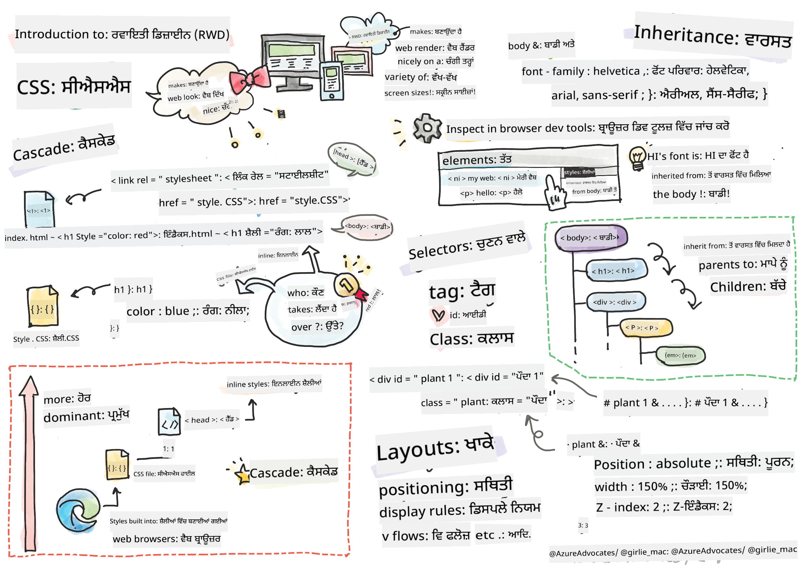
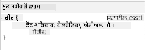

<!--
CO_OP_TRANSLATOR_METADATA:
{
  "original_hash": "32af0ae2f7963127a93e7a8f59fdd84b",
  "translation_date": "2025-10-20T22:00:24+00:00",
  "source_file": "3-terrarium/2-intro-to-css/README.md",
  "language_code": "pa"
}
-->
# ਟੈਰੀਰੀਅਮ ਪ੍ਰੋਜੈਕਟ ਭਾਗ 2: CSS ਦਾ ਪਰਚੇ


> ਸਕੈਚਨੋਟ [ਟੋਮੋਮੀ ਇਮੁਰਾ](https://twitter.com/girlie_mac) ਵੱਲੋਂ

## ਲੈਕਚਰ ਤੋਂ ਪਹਿਲਾਂ ਕਵਿਜ਼

[ਲੈਕਚਰ ਤੋਂ ਪਹਿਲਾਂ ਕਵਿਜ਼](https://ff-quizzes.netlify.app/web/quiz/17)

### ਪਰਚੇ

CSS, ਜਾਂ Cascading Style Sheets, ਵੈੱਬ ਡਿਵੈਲਪਮੈਂਟ ਦੀ ਇੱਕ ਮਹੱਤਵਪੂਰਨ ਸਮੱਸਿਆ ਦਾ ਹੱਲ ਕਰਦਾ ਹੈ: ਆਪਣੀ ਵੈੱਬਸਾਈਟ ਨੂੰ ਸੁੰਦਰ ਬਣਾਉਣਾ। ਆਪਣੇ ਐਪਸ ਨੂੰ ਸਜਾਉਣਾ ਉਨ੍ਹਾਂ ਨੂੰ ਜ਼ਿਆਦਾ ਵਰਤਣਯੋਗ ਅਤੇ ਸੁੰਦਰ ਬਣਾਉਂਦਾ ਹੈ; ਤੁਸੀਂ CSS ਦੀ ਵਰਤੋਂ ਕਰਕੇ Responsive Web Design (RWD) ਵੀ ਬਣਾ ਸਕਦੇ ਹੋ - ਜਿਸ ਨਾਲ ਤੁਹਾਡੇ ਐਪਸ ਕਿਸੇ ਵੀ ਸਕ੍ਰੀਨ ਸਾਈਜ਼ 'ਤੇ ਚੰਗੇ ਲੱਗਦੇ ਹਨ। CSS ਸਿਰਫ਼ ਤੁਹਾਡੇ ਐਪ ਨੂੰ ਸੁੰਦਰ ਬਣਾਉਣ ਬਾਰੇ ਨਹੀਂ ਹੈ; ਇਸ ਵਿੱਚ ਐਨੀਮੇਸ਼ਨ ਅਤੇ ਟ੍ਰਾਂਸਫਾਰਮ ਸ਼ਾਮਲ ਹਨ ਜੋ ਤੁਹਾਡੇ ਐਪਸ ਲਈ ਸੁਧਾਰਤ ਇੰਟਰਐਕਸ਼ਨ ਨੂੰ ਯੋਗ ਕਰ ਸਕਦੇ ਹਨ। CSS ਵਰਕਿੰਗ ਗਰੁੱਪ ਮੌਜੂਦਾ CSS ਵਿਸ਼ੇਸ਼ਤਾਵਾਂ ਨੂੰ ਬਣਾਈ ਰੱਖਣ ਵਿੱਚ ਮਦਦ ਕਰਦਾ ਹੈ; ਤੁਸੀਂ ਉਨ੍ਹਾਂ ਦੇ ਕੰਮ ਨੂੰ [ਵਰਲਡ ਵਾਈਡ ਵੈੱਬ ਕਨਸੋਰਸ਼ੀਅਮ ਦੀ ਸਾਈਟ](https://www.w3.org/Style/CSS/members) 'ਤੇ ਫਾਲੋ ਕਰ ਸਕਦੇ ਹੋ।

> ਨੋਟ ਕਰੋ, CSS ਇੱਕ ਭਾਸ਼ਾ ਹੈ ਜੋ ਵਿਕਸਿਤ ਹੁੰਦੀ ਹੈ, ਜਿਵੇਂ ਕਿ ਵੈੱਬ 'ਤੇ ਹਰ ਚੀਜ਼, ਅਤੇ ਸਾਰੇ ਬ੍ਰਾਊਜ਼ਰ ਨਵੀਆਂ ਵਿਸ਼ੇਸ਼ਤਾਵਾਂ ਦਾ ਸਮਰਥਨ ਨਹੀਂ ਕਰਦੇ। ਹਮੇਸ਼ਾ [CanIUse.com](https://caniuse.com) 'ਤੇ ਆਪਣੀਆਂ ਇੰਪਲੀਮੈਂਟੇਸ਼ਨਜ਼ ਦੀ ਜਾਂਚ ਕਰੋ।

ਇਸ ਪਾਠ ਵਿੱਚ, ਅਸੀਂ ਆਪਣੇ ਆਨਲਾਈਨ ਟੈਰੀਰੀਅਮ ਵਿੱਚ ਸਟਾਈਲਜ਼ ਸ਼ਾਮਲ ਕਰਨ ਜਾ ਰਹੇ ਹਾਂ ਅਤੇ CSS ਦੇ ਕਈ ਸੰਕਲਪਾਂ ਬਾਰੇ ਹੋਰ ਜਾਣਕਾਰੀ ਪ੍ਰਾਪਤ ਕਰਨ ਜਾ ਰਹੇ ਹਾਂ: ਕੈਸਕੇਡ, ਵਿਰਾਸਤ, ਅਤੇ ਸਿਲੈਕਟਰਜ਼ ਦੀ ਵਰਤੋਂ, ਪੋਜ਼ੀਸ਼ਨਿੰਗ, ਅਤੇ CSS ਦੀ ਵਰਤੋਂ ਕਰਕੇ ਲੇਆਉਟ ਬਣਾਉਣਾ। ਇਸ ਪ੍ਰਕਿਰਿਆ ਵਿੱਚ ਅਸੀਂ ਟੈਰੀਰੀਅਮ ਦਾ ਲੇਆਉਟ ਬਣਾਵਾਂਗੇ ਅਤੇ ਅਸਲ ਟੈਰੀਰੀਅਮ ਬਣਾਵਾਂਗੇ।

### ਪੂਰਵ ਸ਼ਰਤ

ਤੁਹਾਡੇ ਕੋਲ ਆਪਣੇ ਟੈਰੀਰੀਅਮ ਲਈ HTML ਬਣਾਈ ਹੋਈ ਹੋਣੀ ਚਾਹੀਦੀ ਹੈ ਅਤੇ ਸਟਾਈਲ ਕਰਨ ਲਈ ਤਿਆਰ ਹੋਣੀ ਚਾਹੀਦੀ ਹੈ।

> ਵੀਡੀਓ ਦੇਖੋ

> 
> [](https://www.youtube.com/watch?v=6yIdOIV9p1I)

### ਕੰਮ

ਆਪਣੇ ਟੈਰੀਰੀਅਮ ਫੋਲਡਰ ਵਿੱਚ, ਇੱਕ ਨਵਾਂ ਫਾਈਲ ਬਣਾਓ ਜਿਸਦਾ ਨਾਮ `style.css` ਹੋਵੇ। ਉਸ ਫਾਈਲ ਨੂੰ `<head>` ਸੈਕਸ਼ਨ ਵਿੱਚ ਇੰਪੋਰਟ ਕਰੋ:

```html
<link rel="stylesheet" href="./style.css" />
```

---

## ਕੈਸਕੇਡ

Cascading Style Sheets ਵਿੱਚ ਇਹ ਵਿਚਾਰ ਸ਼ਾਮਲ ਹੁੰਦਾ ਹੈ ਕਿ ਸਟਾਈਲ 'ਕੈਸਕੇਡ' ਕਰਦੇ ਹਨ ਜਿਸ ਤਰ੍ਹਾਂ ਸਟਾਈਲ ਦੇ ਲਾਗੂ ਕਰਨ ਦੀ ਪ੍ਰਾਥਮਿਕਤਾ ਦੁਆਰਾ ਮਾਰਗਦਰਸ਼ਨ ਕੀਤਾ ਜਾਂਦਾ ਹੈ। ਵੈੱਬਸਾਈਟ ਲੇਖਕ ਦੁਆਰਾ ਸੈੱਟ ਕੀਤੇ ਸਟਾਈਲਜ਼ ਬ੍ਰਾਊਜ਼ਰ ਦੁਆਰਾ ਸੈੱਟ ਕੀਤੇ ਸਟਾਈਲਜ਼ ਤੋਂ ਪਹਿਲਾਂ ਆਉਂਦੇ ਹਨ। 'ਇਨਲਾਈਨ' ਸੈੱਟ ਕੀਤੇ ਸਟਾਈਲਜ਼ ਬਾਹਰੀ ਸਟਾਈਲ ਸ਼ੀਟ ਵਿੱਚ ਸੈੱਟ ਕੀਤੇ ਸਟਾਈਲਜ਼ ਤੋਂ ਪਹਿਲਾਂ ਆਉਂਦੇ ਹਨ।

### ਕੰਮ

ਆਪਣੇ `<h1>` ਟੈਗ ਵਿੱਚ "color: red" ਇਨਲਾਈਨ ਸਟਾਈਲ ਸ਼ਾਮਲ ਕਰੋ:

```HTML
<h1 style="color: red">My Terrarium</h1>
```

ਫਿਰ, ਆਪਣੀ `style.css` ਫਾਈਲ ਵਿੱਚ ਹੇਠਾਂ ਦਿੱਤਾ ਕੋਡ ਸ਼ਾਮਲ ਕਰੋ:

```CSS
h1 {
 color: blue;
}
```

✅ ਤੁਹਾਡੇ ਵੈੱਬ ਐਪ ਵਿੱਚ ਕਿਹੜਾ ਰੰਗ ਦਿਖਾਈ ਦਿੰਦਾ ਹੈ? ਕਿਉਂ? ਕੀ ਤੁਸੀਂ ਸਟਾਈਲਜ਼ ਨੂੰ ਓਵਰਰਾਈਡ ਕਰਨ ਦਾ ਕੋਈ ਤਰੀਕਾ ਲੱਭ ਸਕਦੇ ਹੋ? ਤੁਸੀਂ ਇਹ ਕਦੋਂ ਕਰਨਾ ਚਾਹੋਗੇ, ਜਾਂ ਕਿਉਂ ਨਹੀਂ?

---

## ਵਿਰਾਸਤ

ਸਟਾਈਲਜ਼ ਇੱਕ ਪੂਰਵਜ ਸਟਾਈਲ ਤੋਂ ਇੱਕ ਵੰਸ਼ਜ ਤੱਕ ਵਿਰਾਸਤ ਵਿੱਚ ਮਿਲਦੇ ਹਨ, ਜਿਸ ਤਰ੍ਹਾਂ ਨੇਸਟ ਕੀਤੇ ਤੱਤ ਆਪਣੇ ਮਾਤਾ-ਪਿਤਾ ਦੇ ਸਟਾਈਲਜ਼ ਨੂੰ ਵਿਰਾਸਤ ਵਿੱਚ ਪ੍ਰਾਪਤ ਕਰਦੇ ਹਨ।

### ਕੰਮ

ਬਾਡੀ ਦਾ ਫੋਂਟ ਇੱਕ ਦਿੱਤੇ ਗਏ ਫੋਂਟ ਵਿੱਚ ਸੈੱਟ ਕਰੋ, ਅਤੇ ਜਾਂਚ ਕਰੋ ਕਿ ਇੱਕ ਨੇਸਟ ਕੀਤੇ ਤੱਤ ਦਾ ਫੋਂਟ ਕੀ ਹੈ:

```CSS
body {
	font-family: helvetica, arial, sans-serif;
}
```

ਆਪਣੇ ਬ੍ਰਾਊਜ਼ਰ ਦੇ ਕਨਸੋਲ ਨੂੰ 'Elements' ਟੈਬ ਵਿੱਚ ਖੋਲ੍ਹੋ ਅਤੇ H1 ਦੇ ਫੋਂਟ ਨੂੰ ਦੇਖੋ। ਇਹ ਬਾਡੀ ਤੋਂ ਆਪਣਾ ਫੋਂਟ ਵਿਰਾਸਤ ਵਿੱਚ ਲੈਂਦਾ ਹੈ, ਜਿਵੇਂ ਕਿ ਬ੍ਰਾਊਜ਼ਰ ਵਿੱਚ ਦਰਸਾਇਆ ਗਿਆ ਹੈ:



✅ ਕੀ ਤੁਸੀਂ ਇੱਕ ਨੇਸਟ ਸਟਾਈਲ ਨੂੰ ਇੱਕ ਵੱਖਰਾ ਗੁਣ ਵਿਰਾਸਤ ਵਿੱਚ ਦੇ ਸਕਦੇ ਹੋ?

---

## CSS ਸਿਲੈਕਟਰਜ਼

### ਟੈਗਜ਼

ਹੁਣ ਤੱਕ, ਤੁਹਾਡੀ `style.css` ਫਾਈਲ ਵਿੱਚ ਸਿਰਫ ਕੁਝ ਟੈਗ ਸਟਾਈਲ ਕੀਤੇ ਗਏ ਹਨ, ਅਤੇ ਐਪ ਕਾਫ਼ੀ ਅਜੀਬ ਲੱਗਦਾ ਹੈ:

```CSS
body {
	font-family: helvetica, arial, sans-serif;
}

h1 {
	color: #3a241d;
	text-align: center;
}
```

ਇਹ ਟੈਗ ਨੂੰ ਸਟਾਈਲ ਕਰਨ ਦਾ ਤਰੀਕਾ ਤੁਹਾਨੂੰ ਵਿਲੱਖਣ ਤੱਤਾਂ 'ਤੇ ਕੰਟਰੋਲ ਦਿੰਦਾ ਹੈ, ਪਰ ਤੁਹਾਨੂੰ ਆਪਣੇ ਟੈਰੀਰੀਅਮ ਵਿੱਚ ਕਈ ਪੌਦਿਆਂ ਦੇ ਸਟਾਈਲਜ਼ ਨੂੰ ਕੰਟਰੋਲ ਕਰਨ ਦੀ ਲੋੜ ਹੈ। ਇਹ ਕਰਨ ਲਈ, ਤੁਹਾਨੂੰ CSS ਸਿਲੈਕਟਰਜ਼ ਦੀ ਵਰਤੋਂ ਕਰਨ ਦੀ ਲੋੜ ਹੈ।

### ਆਈਡੀਜ਼

ਖੱਬੇ ਅਤੇ ਸੱਜੇ ਕੰਟੇਨਰਜ਼ ਦੇ ਲੇਆਉਟ ਵਿੱਚ ਕੁਝ ਸਟਾਈਲ ਸ਼ਾਮਲ ਕਰੋ। ਕਿਉਂਕਿ ਮਾਰਕਅੱਪ ਵਿੱਚ ਸਿਰਫ ਇੱਕ ਖੱਬਾ ਕੰਟੇਨਰ ਅਤੇ ਸਿਰਫ ਇੱਕ ਸੱਜਾ ਕੰਟੇਨਰ ਹੈ, ਉਨ੍ਹਾਂ ਨੂੰ ਆਈਡੀਜ਼ ਦਿੱਤੇ ਗਏ ਹਨ। ਉਨ੍ਹਾਂ ਨੂੰ ਸਟਾਈਲ ਕਰਨ ਲਈ, `#` ਦੀ ਵਰਤੋਂ ਕਰੋ:

```CSS
#left-container {
	background-color: #eee;
	width: 15%;
	left: 0px;
	top: 0px;
	position: absolute;
	height: 100%;
	padding: 10px;
}

#right-container {
	background-color: #eee;
	width: 15%;
	right: 0px;
	top: 0px;
	position: absolute;
	height: 100%;
	padding: 10px;
}
```

ਇੱਥੇ, ਤੁਸੀਂ ਇਹ ਕੰਟੇਨਰਜ਼ ਨੂੰ ਸਕ੍ਰੀਨ ਦੇ ਬਿਲਕੁਲ ਖੱਬੇ ਅਤੇ ਸੱਜੇ ਪਾਸੇ ਰੱਖਣ ਲਈ ਐਬਸੋਲਿਊਟ ਪੋਜ਼ੀਸ਼ਨਿੰਗ ਨਾਲ ਰੱਖਿਆ ਹੈ, ਅਤੇ ਉਨ੍ਹਾਂ ਦੀ ਚੌੜਾਈ ਲਈ ਪ੍ਰਤੀਸ਼ਤ ਦੀ ਵਰਤੋਂ ਕੀਤੀ ਹੈ ਤਾਂ ਕਿ ਉਹ ਛੋਟੇ ਮੋਬਾਈਲ ਸਕ੍ਰੀਨ ਲਈ ਸਕੇਲ ਕਰ ਸਕਣ।

✅ ਇਹ ਕੋਡ ਕਾਫ਼ੀ ਵਾਰ-ਵਾਰ ਹੈ, ਇਸ ਲਈ "DRY" (Don't Repeat Yourself) ਨਹੀਂ ਹੈ; ਕੀ ਤੁਸੀਂ ਇਹ ਆਈਡੀਜ਼ ਨੂੰ ਸਟਾਈਲ ਕਰਨ ਲਈ ਕੋਈ ਵਧੀਆ ਤਰੀਕਾ ਲੱਭ ਸਕਦੇ ਹੋ, ਸ਼ਾਇਦ ਇੱਕ ਆਈਡੀ ਅਤੇ ਇੱਕ ਕਲਾਸ ਨਾਲ? ਤੁਹਾਨੂੰ ਮਾਰਕਅੱਪ ਨੂੰ ਬਦਲਣ ਅਤੇ CSS ਨੂੰ ਰੀਫੈਕਟਰ ਕਰਨ ਦੀ ਲੋੜ ਹੋਵੇਗੀ:

```html
<div id="left-container" class="container"></div>
```

### ਕਲਾਸਜ਼

ਉਪਰੋਕਤ ਉਦਾਹਰਣ ਵਿੱਚ, ਤੁਸੀਂ ਸਕ੍ਰੀਨ 'ਤੇ ਦੋ ਵਿਲੱਖਣ ਤੱਤਾਂ ਨੂੰ ਸਟਾਈਲ ਕੀਤਾ। ਜੇ ਤੁਸੀਂ ਚਾਹੁੰਦੇ ਹੋ ਕਿ ਸਕ੍ਰੀਨ 'ਤੇ ਕਈ ਤੱਤਾਂ 'ਤੇ ਸਟਾਈਲਜ਼ ਲਾਗੂ ਕੀਤੇ ਜਾਣ, ਤਾਂ ਤੁਸੀਂ CSS ਕਲਾਸਜ਼ ਦੀ ਵਰਤੋਂ ਕਰ ਸਕਦੇ ਹੋ। ਖੱਬੇ ਅਤੇ ਸੱਜੇ ਕੰਟੇਨਰਜ਼ ਵਿੱਚ ਪੌਦਿਆਂ ਦੇ ਲੇਆਉਟ ਲਈ ਇਹ ਕਰੋ।

ਧਿਆਨ ਦਿਓ ਕਿ HTML ਮਾਰਕਅੱਪ ਵਿੱਚ ਹਰ ਪੌਦੇ ਵਿੱਚ ਆਈਡੀਜ਼ ਅਤੇ ਕਲਾਸਜ਼ ਦਾ ਸੰਯੋਗ ਹੈ। ਇੱਥੇ ਆਈਡੀਜ਼ ਦੀ ਵਰਤੋਂ ਜਾਵਾਸਕ੍ਰਿਪਟ ਦੁਆਰਾ ਕੀਤੀ ਜਾਂਦੀ ਹੈ ਜੋ ਤੁਸੀਂ ਬਾਅਦ ਵਿੱਚ ਟੈਰੀਰੀਅਮ ਪੌਦੇ ਦੇ ਪਲੇਸਮੈਂਟ ਨੂੰ ਮੈਨੇਜ ਕਰਨ ਲਈ ਸ਼ਾਮਲ ਕਰੋਗੇ। ਹਾਲਾਂਕਿ, ਕਲਾਸਜ਼ ਸਾਰੇ ਪੌਦਿਆਂ ਨੂੰ ਦਿੱਤਾ ਸਟਾਈਲ ਦਿੰਦੇ ਹਨ।

```html
<div class="plant-holder">
	
</div>
```

ਆਪਣੀ `style.css` ਫਾਈਲ ਵਿੱਚ ਹੇਠਾਂ ਦਿੱਤਾ ਕੋਡ ਸ਼ਾਮਲ ਕਰੋ:

```CSS
.plant-holder {
	position: relative;
	height: 13%;
	left: -10px;
}

.plant {
	position: absolute;
	max-width: 150%;
	max-height: 150%;
	z-index: 2;
}
```

ਇਸ ਸਨਿੱਪਟ ਵਿੱਚ ਗੌਰ ਕਰਨ ਵਾਲੀ ਗੱਲ ਇਹ ਹੈ ਕਿ ਰਿਸ਼ਤੇਦਾਰ ਅਤੇ ਐਬਸੋਲਿਊਟ ਪੋਜ਼ੀਸ਼ਨਿੰਗ ਦੀ ਮਿਲਾਵਟ ਹੈ, ਜਿਸਨੂੰ ਅਸੀਂ ਅਗਲੇ ਸੈਕਸ਼ਨ ਵਿੱਚ ਕਵਰ ਕਰਾਂਗੇ। ਉਚਾਈਆਂ ਨੂੰ ਪ੍ਰਤੀਸ਼ਤ ਦੁਆਰਾ ਸੰਭਾਲਣ ਦੇ ਤਰੀਕੇ 'ਤੇ ਧਿਆਨ ਦਿਓ:

ਤੁਸੀਂ ਪੌਦੇ ਦੇ ਹੋਲਡਰ ਦੀ ਉਚਾਈ 13% 'ਤੇ ਸੈੱਟ ਕੀਤੀ ਹੈ, ਇਹ ਇੱਕ ਵਧੀਆ ਸੰਖਿਆ ਹੈ ਇਹ ਯਕੀਨੀ ਬਣਾਉਣ ਲਈ ਕਿ ਸਾਰੇ ਪੌਦੇ ਹਰ ਵਰਟਿਕਲ ਕੰਟੇਨਰ ਵਿੱਚ ਦਿਖਾਈ ਦੇਣਗੇ ਬਿਨਾਂ ਸਕ੍ਰੋਲਿੰਗ ਦੀ ਲੋੜ।

ਤੁਸੀਂ ਪੌਦੇ ਦੇ ਹੋਲਡਰ ਨੂੰ ਖੱਬੇ ਵੱਲ ਖਿਸਕਣ ਲਈ ਸੈੱਟ ਕੀਤਾ ਹੈ ਤਾਂ ਕਿ ਪੌਦੇ ਆਪਣੇ ਕੰਟੇਨਰ ਵਿੱਚ ਜ਼ਿਆਦਾ ਕੇਂਦਰਿਤ ਹੋ ਸਕਣ। ਚਿੱਤਰਾਂ ਵਿੱਚ ਇੱਕ ਵੱਡੀ ਮਾਤਰਾ ਵਿੱਚ ਪਾਰਦਰਸ਼ੀ ਪਿਛੋਕੜ ਹੈ ਤਾਂ ਕਿ ਉਹ ਜ਼ਿਆਦਾ ਡ੍ਰੈਗ ਕਰਨ ਯੋਗ ਹੋਣ, ਇਸ ਲਈ ਸਕ੍ਰੀਨ 'ਤੇ ਚੰਗੀ ਤਰ੍ਹਾਂ ਫਿੱਟ ਕਰਨ ਲਈ ਉਨ੍ਹਾਂ ਨੂੰ ਖੱਬੇ ਵੱਲ ਧੱਕਣ ਦੀ ਲੋੜ ਹੈ।

ਫਿਰ, ਪੌਦੇ ਨੂੰ 150% ਦੀ ਮੈਕਸ-ਵਿਡਥ ਦਿੱਤੀ ਗਈ ਹੈ। ਇਹ ਯਕੀਨੀ ਬਣਾਉਂਦਾ ਹੈ ਕਿ ਜਿਵੇਂ ਬ੍ਰਾਊਜ਼ਰ ਛੋਟਾ ਹੁੰਦਾ ਹੈ, ਇਹ ਵੀ ਛੋਟਾ ਹੁੰਦਾ ਹੈ। ਆਪਣਾ ਬ੍ਰਾਊਜ਼ਰ ਰੀਸਾਈਜ਼ ਕਰਨ ਦੀ ਕੋਸ਼ਿਸ਼ ਕਰੋ; ਪੌਦੇ ਆਪਣੇ ਕੰਟੇਨਰਜ਼ ਵਿੱਚ ਰਹਿੰਦੇ ਹਨ ਪਰ ਛੋਟੇ ਹੋ ਜਾਂਦੇ ਹਨ।

ਇਸ ਤੋਂ ਇਲਾਵਾ, z-index ਦੀ ਵਰਤੋਂ ਗੌਰ ਕਰਨ ਯੋਗ ਹੈ, ਜੋ ਕਿ ਇੱਕ ਤੱਤ ਦੀ ਸਪੱਸ਼ਟ ਉਚਾਈ ਨੂੰ ਕੰਟਰੋਲ ਕਰਦਾ ਹੈ (ਤਾਂ ਜੋ ਪੌਦੇ ਕੰਟੇਨਰ ਦੇ ਉੱਤੇ ਬੈਠਦੇ ਹਨ ਅਤੇ ਟੈਰੀਰੀਅਮ ਦੇ ਅੰਦਰ ਬੈਠਦੇ ਹੋਏ ਦਿਖਾਈ ਦਿੰਦੇ ਹਨ)।

✅ ਤੁਹਾਨੂੰ ਪੌਦੇ ਦੇ ਹੋਲਡਰ ਅਤੇ ਪੌਦੇ CSS ਸਿਲੈਕਟਰ ਦੀ ਦੋਵੇਂ ਦੀ ਲੋੜ ਕਿਉਂ ਹੈ?

## CSS ਪੋਜ਼ੀਸ਼ਨਿੰਗ

ਪੋਜ਼ੀਸ਼ਨ ਪ੍ਰਾਪਰਟੀਜ਼ (ਜਿਵੇਂ ਕਿ ਸਟੈਟਿਕ, ਰਿਲੇਟਿਵ, ਫਿਕਸਡ, ਐਬਸੋਲਿਊਟ, ਅਤੇ ਸਟਿੱਕੀ ਪੋਜ਼ੀਸ਼ਨ) ਨੂੰ ਮਿਲਾਉਣਾ ਥੋੜਾ ਮੁਸ਼ਕਲ ਹੋ ਸਕਦਾ ਹੈ, ਪਰ ਜਦੋਂ ਇਹ ਸਹੀ ਤਰੀਕੇ ਨਾਲ ਕੀਤਾ ਜਾਂਦਾ ਹੈ ਤਾਂ ਇਹ ਤੁਹਾਡੇ ਪੇਜਾਂ 'ਤੇ ਤੱਤਾਂ 'ਤੇ ਚੰਗਾ ਕੰਟਰੋਲ ਦਿੰਦਾ ਹੈ।

ਐਬਸੋਲਿਊਟ ਪੋਜ਼ੀਸ਼ਨ ਵਾਲੇ ਤੱਤਾਂ ਨੂੰ ਉਨ੍ਹਾਂ ਦੇ ਸਭ ਤੋਂ ਨੇੜਲੇ ਪੋਜ਼ੀਸ਼ਨ ਵਾਲੇ ਪੂਰਵਜਾਂ ਦੇ ਅਨੁਸਾਰ ਪੋਜ਼ੀਸ਼ਨ ਕੀਤਾ ਜਾਂਦਾ ਹੈ, ਅਤੇ ਜੇਕਰ ਕੋਈ ਨਹੀਂ ਹੈ, ਤਾਂ ਇਸਨੂੰ ਦਸਤਾਵੇਜ਼ ਬਾਡੀ ਦੇ ਅਨੁਸਾਰ ਪੋਜ਼ੀਸ਼ਨ ਕੀਤਾ ਜਾਂਦਾ ਹੈ।

ਰਿਲੇਟਿਵ ਪੋਜ਼ੀਸ਼ਨ ਵਾਲੇ ਤੱਤਾਂ ਨੂੰ CSS ਦੇ ਦਿਸ਼ਾ-ਨਿਰਦੇਸ਼ਾਂ ਦੇ ਅਧਾਰ 'ਤੇ ਉਸਦੇ ਸ਼ੁਰੂਆਤੀ ਸਥਾਨ ਤੋਂ ਦੂਰ ਸਥਿਤ ਕੀਤਾ ਜਾਂਦਾ ਹੈ।

ਸਾਡੇ ਨਮੂਨੇ ਵਿੱਚ, `plant-holder` ਇੱਕ ਰਿਲੇਟਿਵ-ਪੋਜ਼ੀਸ਼ਨ ਵਾਲਾ ਤੱਤ ਹੈ ਜੋ ਇੱਕ ਐਬਸੋਲਿਊਟ-ਪੋਜ਼ੀਸ਼ਨ ਵਾਲੇ ਕੰਟੇਨਰ ਵਿੱਚ ਸਥਿਤ ਹੈ। ਨਤੀਜਾ ਇਹ ਹੈ ਕਿ ਸਾਈਡ ਬਾਰ ਕੰਟੇਨਰਜ਼ ਖੱਬੇ ਅਤੇ ਸੱਜੇ ਪਾਸੇ ਪਿੰਨ ਕੀਤੇ ਗਏ ਹਨ, ਅਤੇ ਪੌਦੇ ਦਾ ਹੋਲਡਰ ਨੇਸਟ ਕੀਤਾ ਗਿਆ ਹੈ, ਆਪਣੇ ਆਪ ਨੂੰ ਸਾਈਡ ਬਾਰਜ਼ ਵਿੱਚ ਸਥਿਤ ਕਰਦਾ ਹੈ, ਪੌਦਿਆਂ ਨੂੰ ਵਰਟਿਕਲ ਕਤਾਰ ਵਿੱਚ ਰੱਖਣ ਲਈ ਜਗ੍ਹਾ ਦਿੰਦਾ ਹੈ।

> `plant` ਨੂੰ ਖੁਦ ਵੀ ਐਬਸੋਲਿਊਟ ਪੋਜ਼ੀਸ਼ਨਿੰਗ ਦਿੱਤੀ ਗਈ ਹੈ, ਜੋ ਇਸਨੂੰ ਡ੍ਰੈਗ ਕਰਨ ਯੋਗ ਬਣਾਉਣ ਲਈ ਜ਼ਰੂਰੀ ਹੈ, ਜਿਵੇਂ ਕਿ ਤੁਸੀਂ ਅਗਲੇ ਪਾਠ ਵਿੱਚ ਪਤਾ ਲਗਾਓਗੇ।

✅ ਸਾਈਡ ਕੰਟੇਨਰਜ਼ ਅਤੇ ਪੌਦੇ ਦੇ ਹੋਲਡਰ ਦੇ ਪੋਜ਼ੀਸ਼ਨਿੰਗ ਦੇ ਕਿਸਮਾਂ ਨੂੰ ਬਦਲਣ ਦੀ ਕੋਸ਼ਿਸ਼ ਕਰੋ। ਕੀ ਹੁੰਦਾ ਹੈ?

## CSS ਲੇਆਉਟਸ

ਹੁਣ ਤੁਸੀਂ ਜੋ ਸਿੱਖਿਆ ਹੈ ਉਸਦੀ ਵਰਤੋਂ ਕਰਕੇ ਸਿਰਫ CSS ਦੀ ਵਰਤੋਂ ਕਰਕੇ ਟੈਰੀਰੀਅਮ ਨੂੰ ਖੁਦ ਬਣਾਉਣ ਜਾ ਰਹੇ ਹੋ!

ਸਭ ਤੋਂ ਪਹਿਲਾਂ, `.terrarium` ਡਿਵ ਦੇ ਬੱਚਿਆਂ ਨੂੰ CSS ਦੀ ਵਰਤੋਂ ਕਰਕੇ ਇੱਕ ਗੋਲ ਆਕਾਰ ਦੇ ਆਯਤ ਬਣਾਉ:

```CSS
.jar-walls {
	height: 80%;
	width: 60%;
	background: #d1e1df;
	border-radius: 1rem;
	position: absolute;
	bottom: 0.5%;
	left: 20%;
	opacity: 0.5;
	z-index: 1;
}

.jar-top {
	width: 50%;
	height: 5%;
	background: #d1e1df;
	position: absolute;
	bottom: 80.5%;
	left: 25%;
	opacity: 0.7;
	z-index: 1;
}

.jar-bottom {
	width: 50%;
	height: 1%;
	background: #d1e1df;
	position: absolute;
	bottom: 0%;
	left: 25%;
	opacity: 0.7;
}

.dirt {
	width: 60%;
	height: 5%;
	background: #3a241d;
	position: absolute;
	border-radius: 0 0 1rem 1rem;
	bottom: 1%;
	left: 20%;
	opacity: 0.7;
	z-index: -1;
}
```

ਇੱਥੇ ਪ੍ਰਤੀਸ਼ਤ ਦੀ ਵਰਤੋਂ 'ਤੇ ਧਿਆਨ ਦਿਓ। ਜੇ ਤੁਸੀਂ ਆਪਣਾ ਬ੍ਰਾਊਜ਼ਰ ਛੋਟਾ ਕਰਦੇ ਹੋ, ਤਾਂ ਤੁਸੀਂ ਦੇਖ ਸਕਦੇ ਹੋ ਕਿ ਜਾਰ ਵੀ ਕਿਵੇਂ ਸਕੇਲ ਕਰਦਾ ਹੈ। ਚੌੜਾਈਆਂ ਅਤੇ ਉਚਾਈਆਂ ਦੇ ਪ੍ਰਤੀਸ਼ਤਾਂ 'ਤੇ ਵੀ ਧਿਆਨ ਦਿਓ ਜੋ ਜਾਰ ਤੱਤਾਂ ਲਈ ਹਨ ਅਤੇ ਇਹ ਕਿ ਹਰ ਤੱਤ ਨੂੰ ਬਿਲਕੁਲ ਕੇਂਦਰ ਵਿੱਚ, ਵਿਊਪੋਰਟ ਦੇ ਤਲ 'ਤੇ ਪਿੰਨ ਕੀਤਾ ਗਿਆ ਹੈ।

ਅਸੀਂ `rem` ਦੀ ਵੀ ਵਰਤੋਂ ਕਰ ਰਹੇ ਹਾਂ ਬਾਰਡਰ-ਰੇਡੀਅਸ ਲਈ, ਇੱਕ ਫੋਂਟ-ਸੰਬੰਧੀ ਲੰਬਾਈ। ਇਸ ਕਿਸਮ ਦੇ ਸੰਬੰਧਿਤ ਮਾਪ ਬਾਰੇ ਹੋਰ ਪੜ੍ਹੋ [CSS ਵਿਸ਼ੇਸ਼ਤਾ](https://www.w3.org/TR/css-values-3/#font-relative-lengths) ਵਿੱਚ।

✅ ਜਾਰ ਦੇ ਰੰਗ ਅਤੇ ਅਪਾਰਦਰਸ਼ਤਾ ਨੂੰ ਮਿੱਟੀ ਦੇ ਰੰਗਾਂ ਨਾਲ ਬਦਲਣ ਦੀ ਕੋਸ਼ਿਸ਼ ਕਰੋ। ਕੀ ਹੁੰਦਾ ਹੈ? ਕਿਉਂ?

---

## GitHub Copilot Agent ਚੈਲੈਂਜ 🚀

Agent ਮੋਡ ਦੀ ਵਰਤੋਂ ਕਰਕੇ ਹੇਠਾਂ ਦਿੱਤੇ ਚੈਲੈਂਜ ਨੂੰ ਪੂਰਾ ਕਰੋ:

**ਵੇਰਵਾ:** CSS ਐਨੀਮੇਸ਼ਨ ਬਣਾਓ ਜੋ ਟੈਰੀਰੀਅਮ ਪੌਦਿਆਂ ਨੂੰ ਹੌਲੀ-ਹੌਲੀ ਹਵਾ ਦੇ ਪ੍ਰਭਾਵ ਨੂੰ ਨਕਲ ਕਰਦੇ ਹੋਏ ਦੋਵਾਂ ਪਾਸੇ ਝੁਕਣ ਲਈ ਯੋਗ ਬਣਾਏ। ਇਹ ਤੁਹਾਨੂੰ CSS ਐਨੀਮੇਸ਼ਨਜ਼, ਟ੍ਰਾਂਸਫਾਰਮਜ਼, ਅਤੇ ਕੀਫਰੇਮਜ਼ ਦਾ ਅਭਿਆਸ ਕਰਨ ਵਿੱਚ ਮਦਦ ਕਰੇਗਾ ਜਦੋਂ ਕਿ ਤੁਹਾਡੇ ਟੈਰੀਰੀਅਮ ਦੀ ਵਿਜ਼ੂਅਲ ਅਪੀਲ ਨੂੰ ਵਧਾਏਗਾ।

**ਪ੍ਰੋੰਪਟ:** CSS ਕੀਫਰੇਮ ਐਨੀਮੇਸ਼ਨਜ਼ ਸ਼ਾਮਲ ਕਰੋ ਤਾਂ ਕਿ ਟੈਰੀਰੀਅਮ ਵਿੱਚ ਪੌਦੇ ਹੌਲੀ-ਹੌਲੀ ਦੋਵਾਂ ਪਾਸੇ ਝੁਕਣ। ਇੱਕ ਝੁਕਣ ਵਾਲੀ ਐਨੀਮੇਸ਼ਨ ਬਣਾਓ ਜੋ ਹਰ ਪੌਦੇ ਨੂੰ ਹੌਲੀ-ਹੌਲੀ (2-3 ਡਿਗਰੀ) ਖੱਬੇ ਅਤੇ ਸੱਜੇ ਵੱਲ ਘੁਮਾਉਂਦਾ ਹੈ 3-4 ਸਕਿੰਟ ਦੀ ਮਿਆਦ ਨਾਲ, ਅਤੇ ਇਸਨੂੰ `.plant` ਕਲਾਸ 'ਤੇ ਲਾਗੂ ਕਰੋ। ਯਕੀਨੀ ਬਣਾਓ ਕਿ ਐਨੀਮੇਸ਼ਨ ਅਨੰਤ ਚਲਦਾ ਹੈ ਅਤੇ ਕੁਦਰਤੀ ਹਿਲਚਲ ਲਈ ਇੱਕ ਈਜ਼ਿੰਗ ਫੰਕਸ਼ਨ ਹੈ।

---


## 🚀ਚੈਲੈਂਜ

ਜਾਰ ਦੇ ਖੱਬੇ ਹੇਠਲੇ ਖੇਤਰ ਵਿੱਚ 'ਬੁਬਲ' ਚਮਕ ਸ਼ਾਮਲ ਕਰੋ ਤਾਂ ਕਿ ਇਹ ਹੋਰ ਗਲਾਸ ਜਿਹਾ ਲੱਗੇ। ਤੁਸੀਂ `.

---

**ਅਸਵੀਕਰਤਾ**:  
ਇਹ ਦਸਤਾਵੇਜ਼ AI ਅਨੁਵਾਦ ਸੇਵਾ [Co-op Translator](https://github.com/Azure/co-op-translator) ਦੀ ਵਰਤੋਂ ਕਰਕੇ ਅਨੁਵਾਦ ਕੀਤਾ ਗਿਆ ਹੈ। ਜਦੋਂ ਕਿ ਅਸੀਂ ਸਹੀ ਹੋਣ ਦੀ ਕੋਸ਼ਿਸ਼ ਕਰਦੇ ਹਾਂ, ਕਿਰਪਾ ਕਰਕੇ ਧਿਆਨ ਦਿਓ ਕਿ ਸਵੈਚਾਲਿਤ ਅਨੁਵਾਦਾਂ ਵਿੱਚ ਗਲਤੀਆਂ ਜਾਂ ਅਸੁੱਤੀਆਂ ਹੋ ਸਕਦੀਆਂ ਹਨ। ਇਸ ਦੀ ਮੂਲ ਭਾਸ਼ਾ ਵਿੱਚ ਮੂਲ ਦਸਤਾਵੇਜ਼ ਨੂੰ ਅਧਿਕਾਰਤ ਸਰੋਤ ਮੰਨਿਆ ਜਾਣਾ ਚਾਹੀਦਾ ਹੈ। ਮਹੱਤਵਪੂਰਨ ਜਾਣਕਾਰੀ ਲਈ, ਪੇਸ਼ੇਵਰ ਮਨੁੱਖੀ ਅਨੁਵਾਦ ਦੀ ਸਿਫਾਰਸ਼ ਕੀਤੀ ਜਾਂਦੀ ਹੈ। ਇਸ ਅਨੁਵਾਦ ਦੀ ਵਰਤੋਂ ਤੋਂ ਪੈਦਾ ਹੋਣ ਵਾਲੇ ਕਿਸੇ ਵੀ ਗਲਤਫਹਿਮੀ ਜਾਂ ਗਲਤ ਵਿਆਖਿਆ ਲਈ ਅਸੀਂ ਜ਼ਿੰਮੇਵਾਰ ਨਹੀਂ ਹਾਂ।