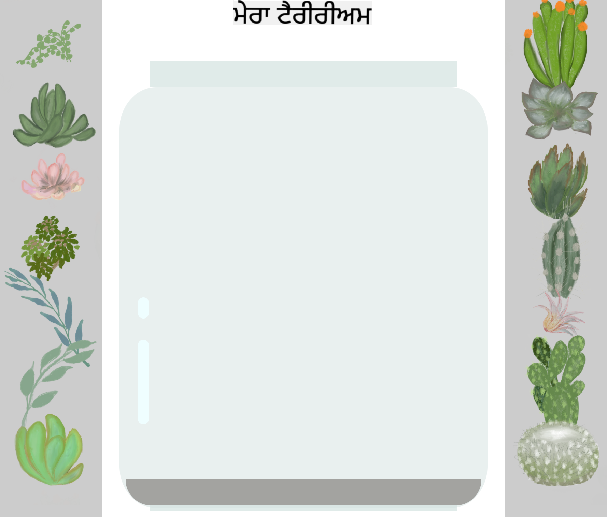

<!--
CO_OP_TRANSLATOR_METADATA:
{
  "original_hash": "92c4431eac70670b0450b02c1d11279a",
  "translation_date": "2025-10-22T17:49:03+00:00",
  "source_file": "3-terrarium/2-intro-to-css/README.md",
  "language_code": "pa"
}
-->
# ਟੈਰੀਰੀਅਮ ਪ੍ਰੋਜੈਕਟ ਭਾਗ 2: CSS ਦਾ ਪਰਿਚਯ


> ਸਕੈਚਨੋਟ [ਟੋਮੋਮੀ ਇਮੁਰਾ](https://twitter.com/girlie_mac) ਵੱਲੋਂ

ਯਾਦ ਹੈ ਕਿ ਤੁਹਾਡਾ HTML ਟੈਰੀਰੀਅਮ ਕਿੰਨਾ ਸਧਾਰਨ ਲੱਗਦਾ ਸੀ? CSS ਉਹ ਹੈ ਜਿੱਥੇ ਅਸੀਂ ਉਸ ਸਧਾਰਨ ਬਣਤਰ ਨੂੰ ਕੁਝ ਦ੍ਰਿਸ਼ਟੀਗਤ ਤੌਰ 'ਤੇ ਆਕਰਸ਼ਕ ਵਿੱਚ ਬਦਲਦੇ ਹਾਂ।

ਜੇ HTML ਨੂੰ ਇੱਕ ਘਰ ਦੇ ਫਰੇਮ ਦੀ ਤਰ੍ਹਾਂ ਸਮਝਿਆ ਜਾਵੇ, ਤਾਂ CSS ਉਹ ਸਭ ਕੁਝ ਹੈ ਜੋ ਇਸਨੂੰ ਘਰ ਵਾਂਗ ਮਹਿਸੂਸ ਕਰਦਾ ਹੈ - ਪੇਂਟ ਦੇ ਰੰਗ, ਫਰਨੀਚਰ ਦੀ ਸਜਾਵਟ, ਰੌਸ਼ਨੀ, ਅਤੇ ਕਿਵੇਂ ਕਮਰੇ ਇਕੱਠੇ ਵਗਦੇ ਹਨ। ਸੋਚੋ ਕਿ ਕਿਵੇਂ ਵਰਸਾਈਲਜ਼ ਦਾ ਪੈਲੇਸ ਇੱਕ ਸਧਾਰਨ ਸ਼ਿਕਾਰ ਲੌਜ ਵਜੋਂ ਸ਼ੁਰੂ ਹੋਇਆ, ਪਰ ਸਜਾਵਟ ਅਤੇ ਲੇਆਉਟ 'ਤੇ ਧਿਆਨ ਦੇ ਨਾਲ ਇਸਨੂੰ ਦੁਨੀਆ ਦੀਆਂ ਸਭ ਤੋਂ ਸ਼ਾਨਦਾਰ ਇਮਾਰਤਾਂ ਵਿੱਚੋਂ ਇੱਕ ਵਿੱਚ ਬਦਲ ਦਿੱਤਾ ਗਿਆ।

ਅੱਜ, ਅਸੀਂ ਤੁਹਾਡੇ ਟੈਰੀਰੀਅਮ ਨੂੰ ਕਾਰਗਰ ਤੋਂ ਪਾਲਿਸ਼ਡ ਵਿੱਚ ਬਦਲਾਂਗੇ। ਤੁਸੀਂ ਸਿੱਖੋਗੇ ਕਿ ਤੱਤਾਂ ਨੂੰ ਸਹੀ ਤਰੀਕੇ ਨਾਲ ਕਿਵੇਂ ਸਥਿਤ ਕਰਨਾ ਹੈ, ਲੇਆਉਟਸ ਨੂੰ ਵੱਖ-ਵੱਖ ਸਕ੍ਰੀਨ ਸਾਈਜ਼ਾਂ ਲਈ ਕਿਵੇਂ ਜਵਾਬ ਦੇਣ ਲਈ ਬਣਾਉਣਾ ਹੈ, ਅਤੇ ਦ੍ਰਿਸ਼ਟੀਗਤ ਆਕਰਸ਼ਣ ਬਣਾਉਣਾ ਹੈ ਜੋ ਵੈਬਸਾਈਟਾਂ ਨੂੰ ਦਿਲਚਸਪ ਬਣਾਉਂਦਾ ਹੈ।

ਇਸ ਪਾਠ ਦੇ ਅੰਤ ਤੱਕ, ਤੁਸੀਂ ਦੇਖੋਗੇ ਕਿ ਕਿਵੇਂ ਰਣਨੀਤਿਕ CSS ਸਟਾਈਲਿੰਗ ਤੁਹਾਡੇ ਪ੍ਰੋਜੈਕਟ ਨੂੰ ਨਾਟਕੀ ਤੌਰ 'ਤੇ ਸੁਧਾਰ ਸਕਦੀ ਹੈ। ਆਓ ਤੁਹਾਡੇ ਟੈਰੀਰੀਅਮ ਵਿੱਚ ਕੁਝ ਸਟਾਈਲ ਸ਼ਾਮਲ ਕਰੀਏ।

## ਪਾਠ ਤੋਂ ਪਹਿਲਾਂ ਕਵਿਜ਼

[ਪਾਠ ਤੋਂ ਪਹਿਲਾਂ ਕਵਿਜ਼](https://ff-quizzes.netlify.app/web/quiz/17)

## CSS ਨਾਲ ਸ਼ੁਰੂਆਤ ਕਰਨਾ

CSS ਨੂੰ ਅਕਸਰ ਸਿਰਫ "ਚੀਜ਼ਾਂ ਨੂੰ ਸੁੰਦਰ ਬਣਾਉਣਾ" ਸਮਝਿਆ ਜਾਂਦਾ ਹੈ, ਪਰ ਇਹ ਇਸ ਤੋਂ ਕਾਫ਼ੀ ਵੱਡੇ ਉਦੇਸ਼ ਦੀ ਸੇਵਾ ਕਰਦਾ ਹੈ। CSS ਇੱਕ ਫਿਲਮ ਦੇ ਡਾਇਰੈਕਟਰ ਵਾਂਗ ਹੈ - ਤੁਸੀਂ ਸਿਰਫ ਇਹ ਨਹੀਂ ਨਿਰਧਾਰਤ ਕਰਦੇ ਕਿ ਸਭ ਕੁਝ ਕਿਵੇਂ ਦਿਖਾਈ ਦੇਵੇਗਾ, ਪਰ ਇਹ ਵੀ ਕਿ ਇਹ ਕਿਵੇਂ ਹਿਲਦਾ ਹੈ, ਪਰਸਪਰ ਕਿਵੇਂ ਪ੍ਰਤੀਕ੍ਰਿਆ ਕਰਦਾ ਹੈ, ਅਤੇ ਵੱਖ-ਵੱਖ ਸਥਿਤੀਆਂ ਵਿੱਚ ਕਿਵੇਂ ਅਨੁਕੂਲ ਹੁੰਦਾ ਹੈ।

ਆਧੁਨਿਕ CSS ਬਹੁਤ ਹੀ ਸਮਰੱਥ ਹੈ। ਤੁਸੀਂ ਐਸਾ ਕੋਡ ਲਿਖ ਸਕਦੇ ਹੋ ਜੋ ਫੋਨ, ਟੈਬਲੇਟ, ਅਤੇ ਡੈਸਕਟਾਪ ਕੰਪਿਊਟਰਾਂ ਲਈ ਲੇਆਉਟਸ ਨੂੰ ਆਪਣੇ ਆਪ ਅਨੁਕੂਲ ਕਰਦਾ ਹੈ। ਤੁਸੀਂ ਸਮਰਥਨ ਯੋਗ ਐਨੀਮੇਸ਼ਨ ਬਣਾਉਣ ਲਈ ਕੋਡ ਲਿਖ ਸਕਦੇ ਹੋ ਜੋ ਵਰਤੋਂਕਾਰਾਂ ਦਾ ਧਿਆਨ ਜਿੱਥੇ ਜ਼ਰੂਰੀ ਹੋਵੇ ਉੱਥੇ ਖਿੱਚਦਾ ਹੈ। ਜਦੋਂ ਸਭ ਕੁਝ ਇਕੱਠੇ ਕੰਮ ਕਰਦਾ ਹੈ, ਨਤੀਜੇ ਕਾਫ਼ੀ ਪ੍ਰਭਾਵਸ਼ਾਲੀ ਹੋ ਸਕਦੇ ਹਨ।

> 💡 **ਪ੍ਰੋ ਟਿਪ**: CSS ਨਵੇਂ ਫੀਚਰਾਂ ਅਤੇ ਸਮਰੱਥਾਵਾਂ ਨਾਲ ਲਗਾਤਾਰ ਵਿਕਸਤ ਹੋ ਰਿਹਾ ਹੈ। ਹਮੇਸ਼ਾ [CanIUse.com](https://caniuse.com) 'ਤੇ ਜਾਂਕੇ ਨਵੇਂ CSS ਫੀਚਰਾਂ ਲਈ ਬ੍ਰਾਊਜ਼ਰ ਸਹਾਇਤਾ ਦੀ ਪੁਸ਼ਟੀ ਕਰੋ।

**ਇਸ ਪਾਠ ਵਿੱਚ ਅਸੀਂ ਇਹ ਹਾਸਲ ਕਰਾਂਗੇ:**
- **ਬਣਾਉਣਾ**: ਆਧੁਨਿਕ CSS ਤਕਨੀਕਾਂ ਦੀ ਵਰਤੋਂ ਕਰਕੇ ਤੁਹਾਡੇ ਟੈਰੀਰੀਅਮ ਲਈ ਪੂਰੀ ਦ੍ਰਿਸ਼ਟੀਗਤ ਡਿਜ਼ਾਈਨ
- **ਖੋਜ ਕਰਨਾ**: ਮੁੱਢਲੀ ਧਾਰਨਾਵਾਂ ਜਿਵੇਂ ਕਿ ਕੈਸਕੇਡ, ਵਿਰਾਸਤ, ਅਤੇ CSS ਚੁਣਨ ਵਾਲੇ
- **ਲਾਗੂ ਕਰਨਾ**: ਜਵਾਬਦੇਹ ਸਥਿਤੀ ਅਤੇ ਲੇਆਉਟ ਰਣਨੀਤੀਆਂ
- **ਨਿਰਮਾਣ ਕਰਨਾ**: CSS ਸ਼ੇਪ ਅਤੇ ਸਟਾਈਲਿੰਗ ਦੀ ਵਰਤੋਂ ਕਰਕੇ ਟੈਰੀਰੀਅਮ ਕੰਟੇਨਰ

### ਪੂਰਵ-ਸ਼ਰਤ

ਤੁਹਾਨੂੰ ਪਿਛਲੇ ਪਾਠ ਤੋਂ ਆਪਣੇ ਟੈਰੀਰੀਅਮ ਲਈ HTML ਬਣਤਰ ਪੂਰੀ ਕਰਨੀ ਚਾਹੀਦੀ ਹੈ ਅਤੇ ਇਸਨੂੰ ਸਟਾਈਲ ਕਰਨ ਲਈ ਤਿਆਰ ਹੋਣਾ ਚਾਹੀਦਾ ਹੈ।

> 📺 **ਵੀਡੀਓ ਸਰੋਤ**: ਇਸ ਮਦਦਗਾਰ ਵੀਡੀਓ ਵਾਕਥਰੂ ਨੂੰ ਦੇਖੋ
>
> [](https://www.youtube.com/watch?v=6yIdOIV9p1I)

### ਆਪਣੀ CSS ਫਾਈਲ ਸੈਟ ਕਰਨਾ

ਸਟਾਈਲਿੰਗ ਸ਼ੁਰੂ ਕਰਨ ਤੋਂ ਪਹਿਲਾਂ, ਸਾਨੂੰ CSS ਨੂੰ ਆਪਣੇ HTML ਨਾਲ ਜੁੜਨਾ ਪਵੇਗਾ। ਇਹ ਕਨੈਕਸ਼ਨ ਬ੍ਰਾਊਜ਼ਰ ਨੂੰ ਦੱਸਦਾ ਹੈ ਕਿ ਸਾਡੇ ਟੈਰੀਰੀਅਮ ਲਈ ਸਟਾਈਲਿੰਗ ਨਿਰਦੇਸ਼ ਕਿੱਥੇ ਮਿਲਣਗੇ।

ਆਪਣੇ ਟੈਰੀਰੀਅਮ ਫੋਲਡਰ ਵਿੱਚ, ਇੱਕ ਨਵੀਂ ਫਾਈਲ ਬਣਾਓ ਜਿਸਨੂੰ `style.css` ਕਿਹਾ ਜਾਂਦਾ ਹੈ, ਫਿਰ ਇਸਨੂੰ ਆਪਣੇ HTML ਦਸਤਾਵੇਜ਼ ਦੇ `<head>` ਸੈਕਸ਼ਨ ਵਿੱਚ ਲਿੰਕ ਕਰੋ:

```html
<link rel="stylesheet" href="./style.css" />
```

**ਇਹ ਕੋਡ ਕੀ ਕਰਦਾ ਹੈ:**
- **ਬਣਾਉਣਾ**: ਤੁਹਾਡੇ HTML ਅਤੇ CSS ਫਾਈਲਾਂ ਦੇ ਵਿਚਕਾਰ ਇੱਕ ਕਨੈਕਸ਼ਨ
- **ਦੱਸਣਾ**: ਬ੍ਰਾਊਜ਼ਰ ਨੂੰ `style.css` ਤੋਂ ਸਟਾਈਲ ਲੋਡ ਅਤੇ ਲਾਗੂ ਕਰਨ ਲਈ
- **ਵਰਤਣਾ**: `rel="stylesheet"` ਗੁਣ ਨੂੰ ਨਿਰਧਾਰਤ ਕਰਨ ਲਈ ਕਿ ਇਹ CSS ਫਾਈਲ ਹੈ
- **ਹਵਾਲਾ ਦੇਣਾ**: `href="./style.css"` ਨਾਲ ਫਾਈਲ ਪਾਥ

## CSS ਕੈਸਕੇਡ ਦੀ ਸਮਝ

ਤੁਹਾਨੂੰ ਕਦੇ ਸੋਚਿਆ ਕਿ CSS ਨੂੰ "Cascading" Style Sheets ਕਿਉਂ ਕਿਹਾ ਜਾਂਦਾ ਹੈ? ਸਟਾਈਲ ਪਾਣੀ ਦੇ ਝਰਨੇ ਵਾਂਗ ਹੇਠਾਂ ਵਗਦੇ ਹਨ, ਅਤੇ ਕਈ ਵਾਰ ਉਹ ਇੱਕ-ਦੂਜੇ ਨਾਲ ਟਕਰਾਉਂਦੇ ਹਨ।

ਸੋਚੋ ਕਿ ਫੌਜੀ ਕਮਾਂਡ ਸਟ੍ਰਕਚਰ ਕਿਵੇਂ ਕੰਮ ਕਰਦੇ ਹਨ - ਇੱਕ ਜਨਰਲ ਆਰਡਰ ਕਹਿ ਸਕਦਾ ਹੈ "ਸਾਰੇ ਸਿਪਾਹੀ ਹਰੇ ਕੱਪੜੇ ਪਹਿਨੋ," ਪਰ ਤੁਹਾਡੇ ਯੂਨਿਟ ਲਈ ਇੱਕ ਵਿਸ਼ੇਸ਼ ਆਰਡਰ ਕਹਿ ਸਕਦਾ ਹੈ "ਸਮਾਰੋਹ ਲਈ ਡ੍ਰੈਸ ਬਲੂਜ਼ ਪਹਿਨੋ।" ਜ਼ਿਆਦਾ ਵਿਸ਼ੇਸ਼ ਨਿਰਦੇਸ਼ ਪ੍ਰਾਥਮਿਕਤਾ ਲੈਂਦਾ ਹੈ। CSS ਇਸੇ ਤਰ੍ਹਾਂ ਦੇ ਤਰਕ ਦੀ ਪਾਲਣਾ ਕਰਦਾ ਹੈ, ਅਤੇ ਇਸ ਹਾਇਰਾਰਕੀ ਨੂੰ ਸਮਝਣਾ ਡੀਬੱਗਿੰਗ ਨੂੰ ਕਾਫ਼ੀ ਆਸਾਨ ਬਣਾਉਂਦਾ ਹੈ।

### ਕੈਸਕੇਡ ਪ੍ਰਾਥਮਿਕਤਾ ਨਾਲ ਪ੍ਰਯੋਗ ਕਰਨਾ

ਆਓ ਇੱਕ ਸਟਾਈਲ ਟਕਰਾਅ ਬਣਾਕੇ ਕੈਸਕੇਡ ਨੂੰ ਕਾਰਵਾਈ ਵਿੱਚ ਦੇਖੀਏ। ਪਹਿਲਾਂ, ਆਪਣੇ `<h1>` ਟੈਗ ਵਿੱਚ ਇੱਕ ਇਨਲਾਈਨ ਸਟਾਈਲ ਸ਼ਾਮਲ ਕਰੋ:

```html
<h1 style="color: red">My Terrarium</h1>
```

**ਇਹ ਕੋਡ ਕੀ ਕਰਦਾ ਹੈ:**
- **ਲਾਗੂ ਕਰਨਾ**: `<h1>` ਤੱਤ ਨੂੰ ਸਿੱਧੇ ਤੌਰ 'ਤੇ ਇਨਲਾਈਨ ਸਟਾਈਲਿੰਗ ਦੀ ਵਰਤੋਂ ਕਰਕੇ ਲਾਲ ਰੰਗ
- **ਵਰਤਣਾ**: `style` ਗੁਣ ਨੂੰ CSS ਨੂੰ ਸਿੱਧੇ HTML ਵਿੱਚ ਸ਼ਾਮਲ ਕਰਨ ਲਈ
- **ਬਣਾਉਣਾ**: ਇਸ ਵਿਸ਼ੇਸ਼ ਤੱਤ ਲਈ ਸਭ ਤੋਂ ਉੱਚੀ ਪ੍ਰਾਥਮਿਕਤਾ ਵਾਲਾ ਸਟਾਈਲ ਨਿਯਮ

ਅਗਲੇ, ਆਪਣੇ `style.css` ਫਾਈਲ ਵਿੱਚ ਇਹ ਨਿਯਮ ਸ਼ਾਮਲ ਕਰੋ:

```css
h1 {
  color: blue;
}
```

**ਉਪਰੋਕਤ ਵਿੱਚ, ਅਸੀਂ:**
- **ਪ੍ਰਭਾਵਿਤ ਕੀਤਾ**: ਇੱਕ CSS ਨਿਯਮ ਜੋ ਸਾਰੇ `<h1>` ਤੱਤਾਂ ਨੂੰ ਨਿਸ਼ਾਨਾ ਬਣਾਉਂਦਾ ਹੈ
- **ਸੈਟ ਕੀਤਾ**: ਟੈਕਸਟ ਰੰਗ ਨੂੰ ਬਲੂ ਵਿੱਚ ਬਾਹਰੀ ਸਟਾਈਲਸ਼ੀਟ ਦੀ ਵਰਤੋਂ ਕਰਕੇ
- **ਬਣਾਇਆ**: ਇਨਲਾਈਨ ਸਟਾਈਲਜ਼ ਦੇ ਮੁਕਾਬਲੇ ਘੱਟ ਪ੍ਰਾਥਮਿਕਤਾ ਵਾਲਾ ਨਿਯਮ

✅ **ਗਿਆਨ ਜਾਂਚ**: ਤੁਹਾਡੇ ਵੈਬ ਐਪ ਵਿੱਚ ਕਿਹੜਾ ਰੰਗ ਦਿਖਾਈ ਦਿੰਦਾ ਹੈ? ਕਿਹੜਾ ਰੰਗ ਜਿੱਤਦਾ ਹੈ? ਕੀ ਤੁਸੀਂ ਉਹ ਸਥਿਤੀਆਂ ਸੋਚ ਸਕਦੇ ਹੋ ਜਿੱਥੇ ਤੁਸੀਂ ਸਟਾਈਲਜ਼ ਨੂੰ ਓਵਰਰਾਈਡ ਕਰਨਾ ਚਾਹੁੰਦੇ ਹੋ?

> 💡 **CSS ਪ੍ਰਾਥਮਿਕਤਾ ਕ੍ਰਮ (ਸਭ ਤੋਂ ਉੱਚਾ ਤੋਂ ਸਭ ਤੋਂ ਘੱਟ):**
> 1. **ਇਨਲਾਈਨ ਸਟਾਈਲਜ਼** (style attribute)
> 2. **IDs** (#myId)
> 3. **ਕਲਾਸਾਂ** (.myClass) ਅਤੇ ਗੁਣ
> 4. **ਤੱਤ ਚੁਣਨ ਵਾਲੇ** (h1, div, p)
> 5. **ਬ੍ਰਾਊਜ਼ਰ ਡਿਫਾਲਟਸ**

## CSS ਵਿਰਾਸਤ ਕਾਰਵਾਈ ਵਿੱਚ

CSS ਵਿਰਾਸਤ ਜੈਨੇਟਿਕਸ ਵਾਂਗ ਕੰਮ ਕਰਦੀ ਹੈ - ਤੱਤ ਆਪਣੇ ਮਾਤਾ-ਪਿਤਾ ਦੇ ਤੱਤਾਂ ਤੋਂ ਕੁਝ ਗੁਣ ਵਿਰਾਸਤ ਵਿੱਚ ਲੈਂਦੇ ਹਨ। ਜੇ ਤੁਸੀਂ ਬਾਡੀ ਤੱਤ 'ਤੇ ਫੋਂਟ ਫੈਮਿਲੀ ਸੈਟ ਕਰਦੇ ਹੋ, ਤਾਂ ਸਾਰੇ ਟੈਕਸਟ ਆਪਣੇ ਆਪ ਉਹੀ ਫੋਂਟ ਵਰਤਦਾ ਹੈ। ਇਹ ਉਸ ਤਰ੍ਹਾਂ ਹੈ ਜਿਵੇਂ ਕਿ ਹੈਬਸਬਰਗ ਪਰਿਵਾਰ ਦੀ ਵਿਸ਼ੇਸ਼ ਜੌਲਾਈਨ ਕਈ ਪੀੜ੍ਹੀਆਂ ਵਿੱਚ ਪ੍ਰਗਟ ਹੋਈ ਬਿਨਾਂ ਇਸਨੂੰ ਹਰ ਵਿਅਕਤੀ ਲਈ ਨਿਰਧਾਰਤ ਕੀਤਾ ਗਿਆ।

ਹਾਲਾਂਕਿ, ਹਰ ਚੀਜ਼ ਵਿਰਾਸਤ ਵਿੱਚ ਨਹੀਂ ਮਿਲਦੀ। ਫੋਂਟ ਅਤੇ ਰੰਗ ਵਰਗੇ ਟੈਕਸਟ ਸਟਾਈਲ ਵਿਰਾਸਤ ਵਿੱਚ ਮਿਲਦੇ ਹਨ, ਪਰ ਮਾਰਜਿਨ ਅਤੇ ਬਾਰਡਰ ਵਰਗੇ ਲੇਆਉਟ ਗੁਣ ਨਹੀਂ ਮਿਲਦੇ। ਜਿਵੇਂ ਕਿ ਬੱਚੇ ਸ਼ਾਰੀਰੀਕ ਗੁਣ ਵਿਰਾਸਤ ਵਿੱਚ ਲੈ ਸਕਦੇ ਹਨ ਪਰ ਆਪਣੇ ਮਾਤਾ-ਪਿਤਾ ਦੀਆਂ ਫੈਸ਼ਨ ਚੋਣਾਂ ਨਹੀਂ।

### ਫੋਂਟ ਵਿਰਾਸਤ ਦਾ ਅਵਲੋਕਨ

ਆਓ ਵਿਰਾਸਤ ਨੂੰ ਕਾਰਵਾਈ ਵਿੱਚ ਦੇਖੀਏ ਜਦੋਂ ਤੁਸੀਂ `<body>` ਤੱਤ 'ਤੇ ਫੋਂਟ ਫੈਮਿਲੀ ਸੈਟ ਕਰਦੇ ਹੋ:

```css
body {
  font-family: 'Segoe UI', Tahoma, Geneva, Verdana, sans-serif;
}
```

**ਇੱਥੇ ਕੀ ਹੁੰਦਾ ਹੈ ਇਸਦਾ ਵਿਸ਼ਲੇਸ਼ਣ:**
- **ਸੈਟ ਕਰਨਾ**: ਪੂਰੇ ਪੇਜ ਲਈ ਫੋਂਟ ਫੈਮਿਲੀ ਨੂੰ ਟਾਰਗਟ ਕਰਕੇ `<body>` ਤੱਤ
- **ਵਰਤਣਾ**: ਫੋਂਟ ਸਟੈਕ ਨਾਲ ਫਾਲਬੈਕ ਵਿਕਲਪਾਂ ਲਈ ਵਧੀਆ ਬ੍ਰਾਊਜ਼ਰ ਅਨੁਕੂਲਤਾ
- **ਲਾਗੂ ਕਰਨਾ**: ਆਧੁਨਿਕ ਸਿਸਟਮ ਫੋਂਟ ਜੋ ਵੱਖ-ਵੱਖ ਓਪਰੇਟਿੰਗ ਸਿਸਟਮਾਂ 'ਤੇ ਸ਼ਾਨਦਾਰ ਦਿਖਾਈ ਦਿੰਦੇ ਹਨ
- **ਸੁਨਿਸ਼ਚਿਤ ਕਰਨਾ**: ਸਾਰੇ ਚਾਈਲਡ ਤੱਤ ਇਸ ਫੋਂਟ ਨੂੰ ਵਿਰਾਸਤ ਵਿੱਚ ਲੈਂਦੇ ਹਨ ਜਦੋਂ ਤੱਕ ਇਸਨੂੰ ਖਾਸ ਤੌਰ 'ਤੇ ਓਵਰਰਾਈਡ ਨਹੀਂ ਕੀਤਾ ਜਾਂਦਾ

ਆਪਣੇ ਬ੍ਰਾਊਜ਼ਰ ਦੇ ਡਿਵੈਲਪਰ ਟੂਲ (F12) ਖੋਲ੍ਹੋ, ਐਲਿਮੈਂਟਸ ਟੈਬ 'ਤੇ ਜਾਓ, ਅਤੇ ਆਪਣੇ `<h1>` ਤੱਤ ਦੀ ਜਾਂਚ ਕਰੋ। ਤੁਸੀਂ ਦੇਖੋਗੇ ਕਿ ਇਹ ਬਾਡੀ ਤੋਂ ਫੋਂਟ ਫੈਮਿਲੀ ਨੂੰ ਵਿਰਾਸਤ ਵਿੱਚ ਲੈਂਦਾ ਹੈ:


✅ **ਪ੍ਰਯੋਗ ਸਮਾਂ**: `<body>` 'ਤੇ `color`, `line-height`, ਜਾਂ `text-align` ਵਰਗੇ ਹੋਰ ਵਿਰਾਸਤ ਗੁਣ ਸੈਟ ਕਰਨ ਦੀ ਕੋਸ਼ਿਸ਼ ਕਰੋ। ਤੁਹਾਡੇ ਹੈਡਿੰਗ ਅਤੇ ਹੋਰ ਤੱਤਾਂ 'ਤੇ ਕੀ ਹੁੰਦਾ ਹੈ?

> 📝 **ਵਿਰਾਸਤ ਗੁਣ ਸ਼ਾਮਲ ਹਨ**: `color`, `font-family`, `font-size`, `line-height`, `text-align`, `visibility`
>
> **ਗੈਰ-ਵਿਰਾਸਤ ਗੁਣ ਸ਼ਾਮਲ ਹਨ**: `margin`, `padding`, `border`, `width`, `height`, `position`

## CSS ਚੁਣਨ ਵਾਲਿਆਂ ਨੂੰ ਸਮਝਣਾ

CSS ਚੁਣਨ ਵਾਲੇ ਤੁਹਾਡੇ ਤੱਤਾਂ ਨੂੰ ਸਟਾਈਲ ਕਰਨ ਲਈ ਨਿਸ਼ਾਨਾ ਬਣਾਉਣ ਦਾ ਤਰੀਕਾ ਹਨ। ਇਹ ਸਹੀ ਦਿਸ਼ਾ ਦੇਣ ਵਾਂਗ ਕੰਮ ਕਰਦੇ ਹਨ - "ਘਰ" ਕਹਿਣ ਦੀ ਬਜਾਏ, ਤੁਸੀਂ ਕਹਿ ਸਕਦੇ ਹੋ "ਲਾਲ ਦਰਵਾਜ਼ੇ ਵਾਲਾ ਨੀਲਾ ਘਰ ਜੋ ਮੇਪਲ ਸਟ੍ਰੀਟ 'ਤੇ ਹੈ।"

CSS ਵੱਖ-ਵੱਖ ਤਰੀਕਿਆਂ ਨਾਲ ਵਿਸ਼ੇਸ਼ ਹੋਣ ਦੀ ਪੇਸ਼ਕਸ਼ ਕਰਦਾ ਹੈ, ਅਤੇ ਸਹੀ ਚੁਣਨ ਵਾਲੇ ਦੀ ਚੋਣ ਕਰਨਾ ਕੰਮ ਲਈ ਉਚਿਤ ਸੰਦ ਦੀ ਚੋਣ ਕਰਨ ਵਾਂਗ ਹੈ। ਕਈ ਵਾਰ ਤੁਹਾਨੂੰ ਪੜੋਸ ਵਿੱਚ ਹਰ ਦਰਵਾਜ਼ੇ ਨੂੰ ਸਟਾਈਲ ਕਰਨ ਦੀ ਜ਼ਰੂਰਤ ਹੁੰਦੀ ਹੈ, ਅਤੇ ਕਈ ਵਾਰ ਸਿਰਫ਼ ਇੱਕ ਵਿਸ਼ੇਸ਼ ਦਰਵਾਜ਼ੇ ਨੂੰ।

### ਤੱਤ ਚੁਣਨ ਵਾਲੇ (ਟੈਗ)

ਤੱਤ ਚੁਣਨ ਵਾਲੇ HTML ਤੱਤਾਂ ਨੂੰ ਉਨ੍ਹਾਂ ਦੇ ਟੈਗ ਨਾਮ ਦੁਆਰਾ ਨਿਸ਼ਾਨਾ ਬਣਾਉਂਦੇ ਹਨ। ਇਹ ਬੇਸ ਸਟਾਈਲ ਸੈਟ ਕਰਨ ਲਈ ਬਹੁਤ ਵਧੀਆ ਹਨ ਜੋ ਤੁਹਾਡੇ ਪੇਜ 'ਤੇ ਵਿਆਪਕ ਤੌਰ 'ਤੇ ਲਾਗੂ ਹੁੰਦੇ ਹਨ:

```css
body {
  font-family: 'Segoe UI', Tahoma, Geneva, Verdana, sans-serif;
  margin: 0;
  padding: 0;
}

h1 {
  color: #3a241d;
  text-align: center;
  font-size: 2.5rem;
  margin-bottom: 1rem;
}
```

**ਇਹ ਸਟਾਈਲ ਸਮਝਣਾ:**
- **ਸੈਟ ਕਰਨਾ**: ਪੂਰੇ ਪੇਜ ਵਿੱਚ ਸਥਿਰ ਟਾਈਪੋਗ੍ਰਾਫੀ `body` ਚੁਣਨ ਵਾਲੇ ਨਾਲ
- **ਹਟਾਉਣਾ**: ਡਿਫਾਲਟ ਬ੍ਰਾਊਜ਼ਰ ਮਾਰਜਿਨ ਅਤੇ ਪੈਡਿੰਗ ਲਈ ਵਧੀਆ ਕੰਟਰੋਲ
- **ਸਟਾਈਲ ਕਰਨਾ**: ਸਾਰੇ ਹੈਡਿੰਗ ਤੱਤ ਰੰਗ, ਸੰਰੂਪਤਾ, ਅਤੇ ਸਪੇਸਿੰਗ ਨਾਲ
- **ਵਰਤਣਾ**: `rem` ਯੂਨਿਟਸ ਲਈ ਸਕੇਲਬਲ, ਐਕਸੈਸਿਬਲ ਫੋਂਟ ਸਾਈਜ਼

ਤੱਤ ਚੁਣਨ ਵਾਲੇ ਆਮ ਸਟਾਈਲਿੰਗ ਲਈ ਚੰਗੇ ਕੰਮ ਕਰਦੇ ਹਨ, ਪਰ ਤੁਹਾਨੂੰ ਵਿਅਕਤੀਗਤ ਕੰਪੋਨੈਂਟਾਂ ਨੂੰ ਸਟਾਈਲ ਕਰਨ ਲਈ ਹੋਰ ਵਿਸ਼ੇਸ਼ ਚੁਣਨ ਵਾਲਿਆਂ ਦੀ ਜ਼ਰੂਰਤ ਹੋਵੇਗੀ ਜਿਵੇਂ ਕਿ ਤੁਹਾਡੇ ਟੈਰੀਰੀਅਮ ਵਿੱਚ ਪੌਦੇ।

### ਵਿਲੱਖਣ ਤੱਤਾਂ ਲਈ ID ਚੁਣਨ ਵਾਲੇ

ID ਚੁਣਨ ਵਾਲੇ `#` ਚਿੰਨ੍ਹ ਦੀ ਵਰਤੋਂ ਕਰਦੇ ਹਨ ਅਤੇ ਵਿਸ਼ੇਸ਼ `id` ਗੁਣਾਂ ਵਾਲੇ ਤੱਤਾਂ ਨੂੰ ਨਿਸ਼ਾਨਾ ਬਣਾਉਂਦੇ ਹਨ। ਕਿਉਂਕਿ IDs ਪੇਜ 'ਤੇ ਵਿਲੱਖਣ ਹੋਣੇ ਚਾਹੀਦੇ ਹਨ, ਇਹ ਵਿਅਕਤੀਗਤ, ਵਿਸ਼ੇਸ਼ ਤੱਤਾਂ ਨੂੰ ਸਟਾਈਲ ਕਰਨ ਲਈ ਬਹੁਤ ਵਧੀਆ ਹਨ ਜਿਵੇਂ ਕਿ ਸਾਡੇ ਖੱਬੇ ਅਤੇ ਸੱਜੇ ਪੌਦੇ ਦੇ ਕੰਟੇਨਰ।

ਆਓ ਆਪਣੇ ਟੈਰੀਰੀਅਮ ਦੇ ਸਾਈਡ ਕੰਟੇਨਰਾਂ ਲਈ ਸਟਾਈਲਿੰਗ ਬਣਾਈਏ ਜਿੱਥੇ ਪੌਦੇ ਰਹਿਣਗੇ:

```css
#left-container {
  background-color: #f5f5f5;
  width: 15%;
  left: 0;
  top: 0;
  position: absolute;
  height: 100vh;
  padding: 1rem;
  box-sizing: border-box;
}

#right-container {
  background-color: #f5f5f5;
  width: 15%;
  right: 0;
  top: 0;
  position: absolute;
  height: 100vh;
  padding: 1rem;
  box-sizing: border-box;
}
```

**ਇਹ ਕੋਡ ਕੀ ਹਾਸਲ ਕਰਦਾ ਹੈ:**
- **ਸਥਿਤ ਕਰਨਾ**: ਕੰਟੇਨਰਾਂ ਨੂੰ ਖੱਬੇ ਅਤੇ ਸੱਜੇ ਕਿਨਾਰੇ 'ਤੇ `absolute` ਸਥਿਤੀ ਦੀ ਵਰਤ
ਆਓ ਟੈਰੀਰੀਅਮ ਜਾਰ ਨੂੰ ਹਿਸਾ-ਹਿਸਾ ਕਰਕੇ ਬਣਾਈਏ। ਹਰ ਹਿੱਸਾ ਰਿਸਪਾਂਸਿਵ ਡਿਜ਼ਾਈਨ ਲਈ ਐਬਸੋਲਿਊਟ ਪੋਜ਼ੀਸ਼ਨਿੰਗ ਅਤੇ ਪ੍ਰਤੀਸ਼ਤ-ਅਧਾਰਿਤ ਸਾਈਜ਼ਿੰਗ ਵਰਤਦਾ ਹੈ:

```css
.jar-walls {
  height: 80%;
  width: 60%;
  background: #d1e1df;
  border-radius: 1rem;
  position: absolute;
  bottom: 0.5%;
  left: 20%;
  opacity: 0.5;
  z-index: 1;
  box-shadow: inset 0 0 2rem rgba(0, 0, 0, 0.1);
}

.jar-top {
  width: 50%;
  height: 5%;
  background: #d1e1df;
  position: absolute;
  bottom: 80.5%;
  left: 25%;
  opacity: 0.7;
  z-index: 1;
  border-radius: 0.5rem 0.5rem 0 0;
}

.jar-bottom {
  width: 50%;
  height: 1%;
  background: #d1e1df;
  position: absolute;
  bottom: 0;
  left: 25%;
  opacity: 0.7;
  border-radius: 0 0 0.5rem 0.5rem;
}

.dirt {
  width: 60%;
  height: 5%;
  background: #3a241d;
  position: absolute;
  border-radius: 0 0 1rem 1rem;
  bottom: 1%;
  left: 20%;
  opacity: 0.7;
  z-index: -1;
}
```

**ਟੈਰੀਰੀਅਮ ਦੀ ਬਣਤਰ ਨੂੰ ਸਮਝਣਾ:**
- **ਵਰਤਦਾ ਹੈ** ਪ੍ਰਤੀਸ਼ਤ-ਅਧਾਰਿਤ ਮਾਪ ਜਿਹੜੇ ਹਰ ਸਕਰੀਨ ਸਾਈਜ਼ 'ਤੇ ਰਿਸਪਾਂਸਿਵ ਸਕੇਲਿੰਗ ਲਈ ਸਹਾਇਕ ਹਨ
- **ਪੋਜ਼ੀਸ਼ਨ ਕਰਦਾ ਹੈ** ਤੱਤਾਂ ਨੂੰ ਐਬਸੋਲਿਊਟ ਤਰੀਕੇ ਨਾਲ ਤਾਂ ਜੋ ਉਹ ਸਹੀ ਤਰੀਕੇ ਨਾਲ ਸਟੈਕ ਅਤੇ ਐਲਾਈਨ ਹੋ ਸਕਣ
- **ਲਾਗੂ ਕਰਦਾ ਹੈ** ਵੱਖ-ਵੱਖ ਓਪੈਸਿਟੀ ਮੁੱਲਾਂ ਨੂੰ ਗਲਾਸ ਟ੍ਰਾਂਸਪੇਰੈਂਸੀ ਪ੍ਰਭਾਵ ਬਣਾਉਣ ਲਈ
- **ਇਸਤਮਾਲ ਕਰਦਾ ਹੈ** `z-index` ਲੇਅਰਿੰਗ ਤਾਂ ਜੋ ਪੌਦੇ ਜਾਰ ਦੇ ਅੰਦਰ ਦਿਖਾਈ ਦੇਣ
- **ਸ਼ਾਮਲ ਕਰਦਾ ਹੈ** ਹੌਲੀ ਬਾਕਸ-ਸ਼ੈਡੋ ਅਤੇ ਸੁਧਰੇ ਹੋਏ ਬਾਰਡਰ-ਰੇਡੀਅਸ ਨੂੰ ਜ਼ਿਆਦਾ ਹਕੀਕਤੀ ਦਿਖਾਵਟ ਲਈ

### ਪ੍ਰਤੀਸ਼ਤਾਂ ਨਾਲ ਰਿਸਪਾਂਸਿਵ ਡਿਜ਼ਾਈਨ

ਧਿਆਨ ਦਿਓ ਕਿ ਸਾਰੇ ਮਾਪ ਫਿਕਸਡ ਪਿਕਸਲ ਮੁੱਲਾਂ ਦੀ ਬਜਾਏ ਪ੍ਰਤੀਸ਼ਤਾਂ ਵਰਤਦੇ ਹਨ:

**ਇਸਦਾ ਮਹੱਤਵ ਕਿਉਂ ਹੈ:**
- **ਸੁਨਿਸ਼ਚਿਤ ਕਰਦਾ ਹੈ** ਕਿ ਟੈਰੀਰੀਅਮ ਕਿਸੇ ਵੀ ਸਕਰੀਨ ਸਾਈਜ਼ 'ਤੇ ਅਨੁਪਾਤਿਕ ਤਰੀਕੇ ਨਾਲ ਸਕੇਲ ਕਰਦਾ ਹੈ
- **ਰੱਖਦਾ ਹੈ** ਜਾਰ ਦੇ ਹਿੱਸਿਆਂ ਦੇ ਵਿਚਕਾਰ ਵਿਜ਼ੁਅਲ ਸੰਬੰਧ
- **ਪੇਸ਼ ਕਰਦਾ ਹੈ** ਇੱਕ ਸਥਿਰ ਅਨੁਭਵ ਮੋਬਾਈਲ ਫੋਨ ਤੋਂ ਵੱਡੇ ਡੈਸਕਟਾਪ ਮਾਨੀਟਰ ਤੱਕ
- **ਡਿਜ਼ਾਈਨ ਨੂੰ ਅਨੁਕੂਲ ਬਣਾਉਂਦਾ ਹੈ** ਬਿਨਾਂ ਵਿਜ਼ੁਅਲ ਲੇਆਉਟ ਨੂੰ ਤੋੜੇ

### CSS ਯੂਨਿਟਾਂ ਦੀ ਵਰਤੋਂ

ਅਸੀਂ ਬਾਰਡਰ-ਰੇਡੀਅਸ ਲਈ `rem` ਯੂਨਿਟਾਂ ਵਰਤ ਰਹੇ ਹਾਂ, ਜੋ ਰੂਟ ਫੋਂਟ ਸਾਈਜ਼ ਦੇ ਅਨੁਸਾਰ ਸਕੇਲ ਕਰਦੇ ਹਨ। ਇਹ ਜ਼ਿਆਦਾ ਪਹੁੰਚਯੋਗ ਡਿਜ਼ਾਈਨ ਬਣਾਉਂਦੇ ਹਨ ਜੋ ਯੂਜ਼ਰ ਫੋਂਟ ਪਸੰਦਾਂ ਦਾ ਆਦਰ ਕਰਦੇ ਹਨ। [CSS ਰਿਲੇਟਿਵ ਯੂਨਿਟਾਂ](https://www.w3.org/TR/css-values-3/#font-relative-lengths) ਬਾਰੇ ਅਧਿਕਾਰਤ ਵਿਸ਼ੇਸ਼ਤਾ ਵਿੱਚ ਹੋਰ ਜਾਣੋ।

✅ **ਦ੍ਰਿਸ਼ਟੀ ਅਨੁਭਵ**: ਇਨ੍ਹਾਂ ਮੁੱਲਾਂ ਨੂੰ ਬਦਲੋ ਅਤੇ ਪ੍ਰਭਾਵਾਂ ਨੂੰ ਦੇਖੋ:
- ਜਾਰ ਦੀ ਓਪੈਸਿਟੀ ਨੂੰ 0.5 ਤੋਂ 0.8 ਵਿੱਚ ਬਦਲੋ – ਇਹ ਗਲਾਸ ਦੀ ਦਿਖਾਵਟ ਨੂੰ ਕਿਵੇਂ ਪ੍ਰਭਾਵਿਤ ਕਰਦਾ ਹੈ?
- ਮਿੱਟੀ ਦੇ ਰੰਗ ਨੂੰ `#3a241d` ਤੋਂ `#8B4513` ਵਿੱਚ ਬਦਲੋ – ਇਸਦਾ ਦ੍ਰਿਸ਼ਟੀ ਪ੍ਰਭਾਵ ਕੀ ਹੈ?
- ਮਿੱਟੀ ਦੇ `z-index` ਨੂੰ 2 ਵਿੱਚ ਬਦਲੋ – ਲੇਅਰਿੰਗ 'ਤੇ ਕੀ ਹੁੰਦਾ ਹੈ?

---

## GitHub Copilot Agent ਚੈਲੈਂਜ 🚀

Agent ਮੋਡ ਦੀ ਵਰਤੋਂ ਕਰਕੇ ਹੇਠਾਂ ਦਿੱਤੇ ਚੈਲੈਂਜ ਨੂੰ ਪੂਰਾ ਕਰੋ:

**ਵੇਰਵਾ:** CSS ਐਨੀਮੇਸ਼ਨ ਬਣਾਓ ਜੋ ਟੈਰੀਰੀਅਮ ਪੌਦਿਆਂ ਨੂੰ ਹੌਲੀ-ਹੌਲੀ ਹਵਾ ਦੇ ਪ੍ਰਭਾਵ ਨਾਲ ਹਿਲਾਉਂਦਾ ਹੈ। ਇਹ CSS ਐਨੀਮੇਸ਼ਨ, ਟ੍ਰਾਂਸਫਾਰਮਸ ਅਤੇ ਕੀਫਰੇਮਸ ਦੀ ਪ੍ਰੈਕਟਿਸ ਕਰਨ ਵਿੱਚ ਮਦਦ ਕਰੇਗਾ ਅਤੇ ਤੁਹਾਡੇ ਟੈਰੀਰੀਅਮ ਦੀ ਦ੍ਰਿਸ਼ਟੀ ਅਪੀਲ ਨੂੰ ਵਧਾਏਗਾ।

**ਪ੍ਰੋੰਪਟ:** CSS ਕੀਫਰੇਮ ਐਨੀਮੇਸ਼ਨ ਸ਼ਾਮਲ ਕਰੋ ਤਾਂ ਜੋ ਟੈਰੀਰੀਅਮ ਦੇ ਪੌਦੇ ਹੌਲੀ-ਹੌਲੀ ਪਾਸੇ ਤੋਂ ਪਾਸੇ ਹਿਲਣ। ਇੱਕ ਹਿਲਣ ਵਾਲੀ ਐਨੀਮੇਸ਼ਨ ਬਣਾਓ ਜੋ ਹਰ ਪੌਦੇ ਨੂੰ ਹੌਲੀ-ਹੌਲੀ (2-3 ਡਿਗਰੀ) ਖੱਬੇ ਅਤੇ ਸੱਜੇ ਵੱਲ ਘੁਮਾਉਂਦਾ ਹੈ, 3-4 ਸਕਿੰਟ ਦੀ ਮਿਆਦ ਨਾਲ। ਇਹ ਐਨੀਮੇਸ਼ਨ ਅਨੰਤ ਚਲਦੀ ਰਹੇ ਅਤੇ ਕੁਦਰਤੀ ਹਿਲਣ ਲਈ ਇੱਕ ਈਜ਼ਿੰਗ ਫੰਕਸ਼ਨ ਹੋਵੇ।

[Agent ਮੋਡ](https://code.visualstudio.com/blogs/2025/02/24/introducing-copilot-agent-mode) ਬਾਰੇ ਹੋਰ ਜਾਣੋ।

## 🚀 ਚੈਲੈਂਜ: ਗਲਾਸ ਰਿਫਲੈਕਸ਼ਨ ਸ਼ਾਮਲ ਕਰਨਾ

ਕੀ ਤੁਸੀਂ ਆਪਣੇ ਟੈਰੀਰੀਅਮ ਨੂੰ ਹਕੀਕਤੀ ਗਲਾਸ ਰਿਫਲੈਕਸ਼ਨ ਨਾਲ ਵਧਾਉਣ ਲਈ ਤਿਆਰ ਹੋ? ਇਹ ਤਕਨੀਕ ਡਿਜ਼ਾਈਨ ਵਿੱਚ ਡੈਪਥ ਅਤੇ ਹਕੀਕਤ ਸ਼ਾਮਲ ਕਰੇਗੀ।

ਤੁਹਾਨੂੰ ਹੌਲੀ ਹਾਈਲਾਈਟਸ ਬਣਾਉਣੇ ਹਨ ਜੋ ਦਿਖਾਉਂਦੇ ਹਨ ਕਿ ਕਿਵੇਂ ਰੋਸ਼ਨੀ ਗਲਾਸ ਦੀ ਸਤਹ 'ਤੇ ਰਿਫਲੈਕਟ ਕਰਦੀ ਹੈ। ਇਹ ਤਰੀਕਾ ਉਸ ਤਰੀਕੇ ਦੇ ਸਮਾਨ ਹੈ ਜਿਸ ਤਰ੍ਹਾਂ ਰੇਨੇਸਾਂਸ ਪੇਂਟਰ ਜਾਨ ਵੈਨ ਆਇਕ ਨੇ ਰੋਸ਼ਨੀ ਅਤੇ ਰਿਫਲੈਕਸ਼ਨ ਦੀ ਵਰਤੋਂ ਕਰਕੇ ਪੇਂਟ ਕੀਤੇ ਗਲਾਸ ਨੂੰ ਤਿੰਨ-ਪੱਖੀ ਦਿਖਾਇਆ। ਇਹ ਹੈ ਜੋ ਤੁਸੀਂ ਹਾਸਲ ਕਰਨ ਦੀ ਕੋਸ਼ਿਸ਼ ਕਰ ਰਹੇ ਹੋ:



**ਤੁਹਾਡਾ ਚੈਲੈਂਜ:**
- **ਬਣਾਓ** ਹੌਲੀ ਚਿੱਟੇ ਜਾਂ ਹਲਕੇ ਰੰਗ ਦੇ ਓਵਲ ਆਕਾਰ ਗਲਾਸ ਰਿਫਲੈਕਸ਼ਨ ਲਈ
- **ਉਨ੍ਹਾਂ ਨੂੰ ਸਟ੍ਰੈਟਜਿਕ ਤਰੀਕੇ ਨਾਲ** ਜਾਰ ਦੇ ਖੱਬੇ ਪਾਸੇ ਪੋਜ਼ੀਸ਼ਨ ਕਰੋ
- **ਲਾਗੂ ਕਰੋ** ਉਚਿਤ ਓਪੈਸਿਟੀ ਅਤੇ ਬਲਰ ਪ੍ਰਭਾਵ ਹਕੀਕਤੀ ਰੋਸ਼ਨੀ ਰਿਫਲੈਕਸ਼ਨ ਲਈ
- **ਵਰਤੋ** `border-radius` ਜਿਵੇਂ ਕਿ ਕੁਦਰਤੀ, ਬੁਬਲ-ਜਿਵੇਂ ਆਕਾਰ ਬਣਾਉਣ ਲਈ
- **ਗ੍ਰੇਡੀਐਂਟ ਜਾਂ ਬਾਕਸ-ਸ਼ੈਡੋ ਨਾਲ ਅਨੁਭਵ ਕਰੋ** ਵਧੇਰੇ ਹਕੀਕਤ ਲਈ

## ਪੋਸਟ-ਲੈਕਚਰ ਕਵਿਜ਼

[ਪੋਸਟ-ਲੈਕਚਰ ਕਵਿਜ਼](https://ff-quizzes.netlify.app/web/quiz/18)

## CSS ਗਿਆਨ ਨੂੰ ਵਧਾਓ

CSS ਸ਼ੁਰੂ ਵਿੱਚ ਥੋੜਾ ਜਟਿਲ ਲੱਗ ਸਕਦਾ ਹੈ, ਪਰ ਇਹ ਮੁੱਖ ਧਾਰਨਾਵਾਂ ਨੂੰ ਸਮਝਣਾ ਤੁਹਾਨੂੰ ਹੋਰ ਉੱਚ-ਸਤਹ ਦੀਆਂ ਤਕਨੀਕਾਂ ਲਈ ਮਜ਼ਬੂਤ ਬੁਨਿਆਦ ਪ੍ਰਦਾਨ ਕਰਦਾ ਹੈ।

**ਤੁਹਾਡੇ CSS ਸਿੱਖਣ ਦੇ ਅਗਲੇ ਖੇਤਰ:**
- **Flexbox** - ਤੱਤਾਂ ਦੇ ਸੰਰੂਪ ਅਤੇ ਵੰਡ ਨੂੰ ਸਧਾਰਨ ਬਣਾਉਂਦਾ ਹੈ
- **CSS Grid** - ਜਟਿਲ ਲੇਆਉਟ ਬਣਾਉਣ ਲਈ ਸ਼ਕਤੀਸ਼ਾਲੀ ਟੂਲ ਪ੍ਰਦਾਨ ਕਰਦਾ ਹੈ
- **CSS Variables** - ਦੁਹਰਾਅ ਨੂੰ ਘਟਾਉਂਦਾ ਹੈ ਅਤੇ ਰੱਖ-ਰਖਾਅ ਨੂੰ ਸੁਧਾਰਦਾ ਹੈ
- **Responsive design** - ਸੁਨਿਸ਼ਚਿਤ ਕਰਦਾ ਹੈ ਕਿ ਵੈਬਸਾਈਟ ਵੱਖ-ਵੱਖ ਸਕਰੀਨ ਸਾਈਜ਼ਾਂ 'ਤੇ ਚੰਗੀ ਤਰ੍ਹਾਂ ਕੰਮ ਕਰੇ

### ਇੰਟਰਐਕਟਿਵ ਸਿੱਖਣ ਦੇ ਸਰੋਤ

ਇਨ੍ਹਾਂ ਰੋਮਾਂਚਕ, ਹੱਥ-ਵਰਤੋਂ ਵਾਲੇ ਖੇਡਾਂ ਨਾਲ ਇਨ੍ਹਾਂ ਧਾਰਨਾਵਾਂ ਦੀ ਪ੍ਰੈਕਟਿਸ ਕਰੋ:
- 🐸 [Flexbox Froggy](https://flexboxfroggy.com/) - ਮਜ਼ੇਦਾਰ ਚੈਲੈਂਜਾਂ ਰਾਹੀਂ Flexbox ਵਿੱਚ ਮਾਹਰ ਬਣੋ
- 🌱 [Grid Garden](https://codepip.com/games/grid-garden/) - CSS Grid ਸਿੱਖੋ ਵਰਚੁਅਲ ਗਾਜਰਾਂ ਨੂੰ ਉਗਾ ਕੇ
- 🎯 [CSS Battle](https://cssbattle.dev/) - CSS ਚੈਲੈਂਜਾਂ ਨਾਲ ਆਪਣੇ CSS ਹੁਨਰ ਦੀ ਜਾਂਚ ਕਰੋ

### ਵਾਧੂ ਸਿੱਖਣ

CSS ਮੂਲ ਧਾਰਨਾਵਾਂ ਲਈ ਵਿਸਤ੍ਰਿਤ ਸਿੱਖਣ ਲਈ, ਇਹ Microsoft Learn ਮੋਡਿਊਲ ਪੂਰਾ ਕਰੋ: [Style your HTML app with CSS](https://docs.microsoft.com/learn/modules/build-simple-website/4-css-basics/?WT.mc_id=academic-77807-sagibbon)

## ਅਸਾਈਨਮੈਂਟ

[CSS Refactoring](assignment.md)

---

**ਅਸਵੀਕਰਤੀ**:  
ਇਹ ਦਸਤਾਵੇਜ਼ AI ਅਨੁਵਾਦ ਸੇਵਾ [Co-op Translator](https://github.com/Azure/co-op-translator) ਦੀ ਵਰਤੋਂ ਕਰਕੇ ਅਨੁਵਾਦ ਕੀਤਾ ਗਿਆ ਹੈ। ਜਦੋਂ ਕਿ ਅਸੀਂ ਸਹੀ ਹੋਣ ਦੀ ਕੋਸ਼ਿਸ਼ ਕਰਦੇ ਹਾਂ, ਕਿਰਪਾ ਕਰਕੇ ਧਿਆਨ ਦਿਓ ਕਿ ਸਵੈਚਾਲਿਤ ਅਨੁਵਾਦਾਂ ਵਿੱਚ ਗਲਤੀਆਂ ਜਾਂ ਅਸੁੱਤੀਆਂ ਹੋ ਸਕਦੀਆਂ ਹਨ। ਮੂਲ ਦਸਤਾਵੇਜ਼ ਨੂੰ ਇਸਦੀ ਮੂਲ ਭਾਸ਼ਾ ਵਿੱਚ ਅਧਿਕਾਰਤ ਸਰੋਤ ਮੰਨਿਆ ਜਾਣਾ ਚਾਹੀਦਾ ਹੈ। ਮਹੱਤਵਪੂਰਨ ਜਾਣਕਾਰੀ ਲਈ, ਪੇਸ਼ੇਵਰ ਮਨੁੱਖੀ ਅਨੁਵਾਦ ਦੀ ਸਿਫਾਰਸ਼ ਕੀਤੀ ਜਾਂਦੀ ਹੈ। ਇਸ ਅਨੁਵਾਦ ਦੀ ਵਰਤੋਂ ਤੋਂ ਪੈਦਾ ਹੋਣ ਵਾਲੇ ਕਿਸੇ ਵੀ ਗਲਤਫਹਿਮੀ ਜਾਂ ਗਲਤ ਵਿਆਖਿਆ ਲਈ ਅਸੀਂ ਜ਼ਿੰਮੇਵਾਰ ਨਹੀਂ ਹਾਂ।