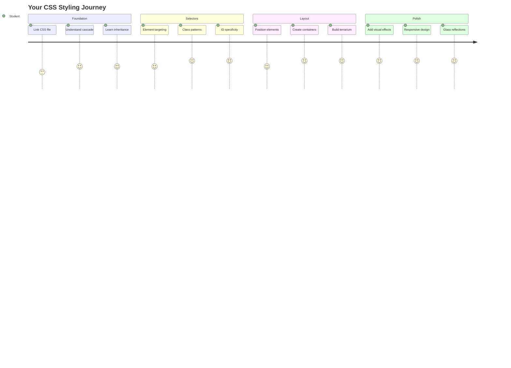
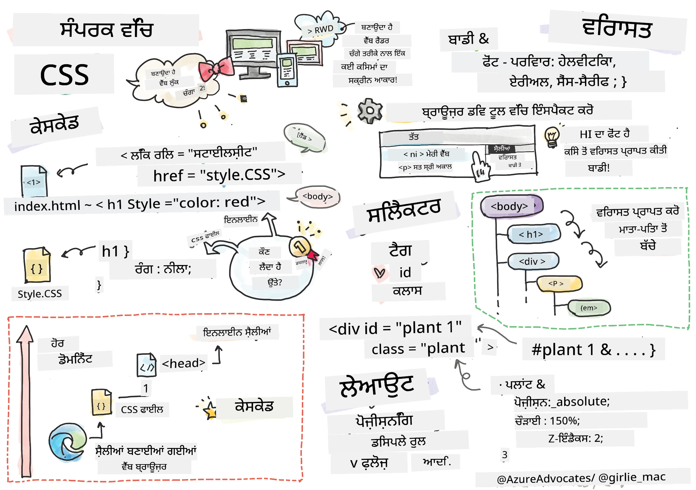
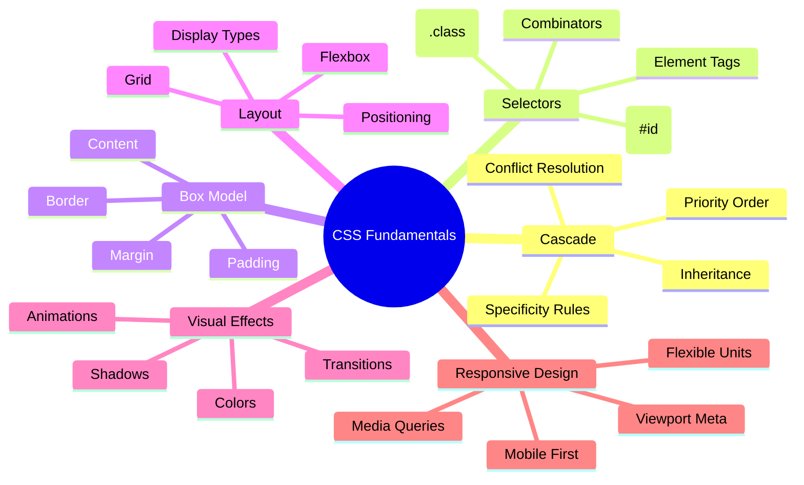
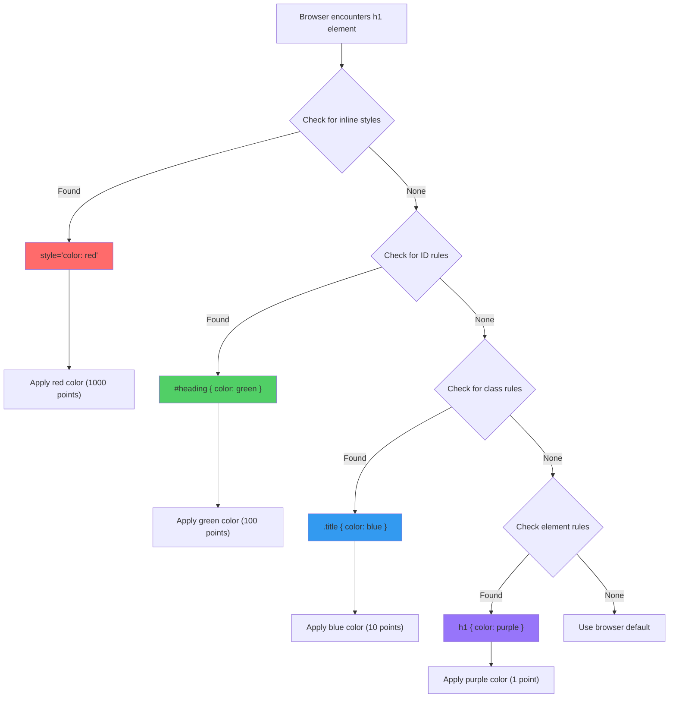
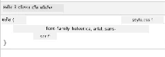
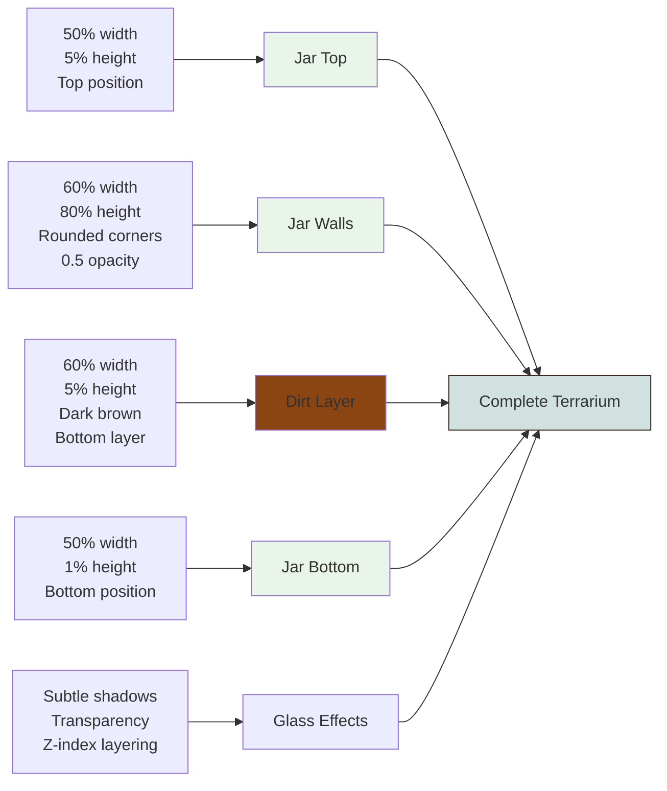
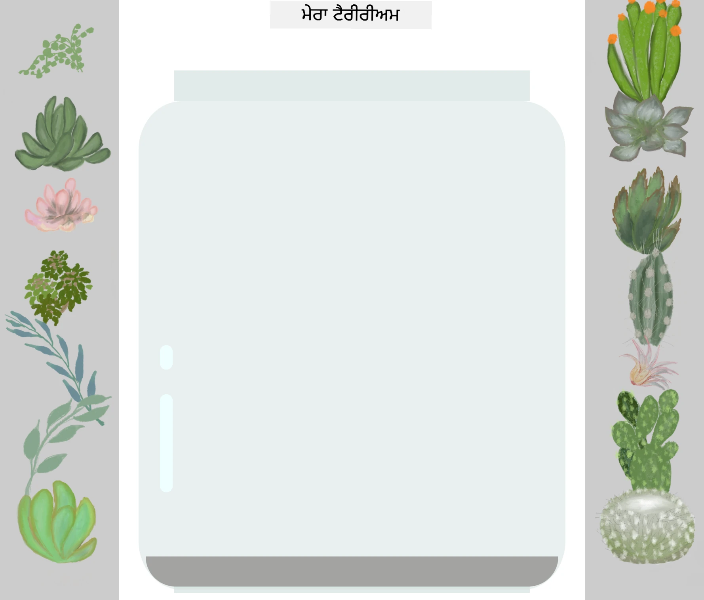
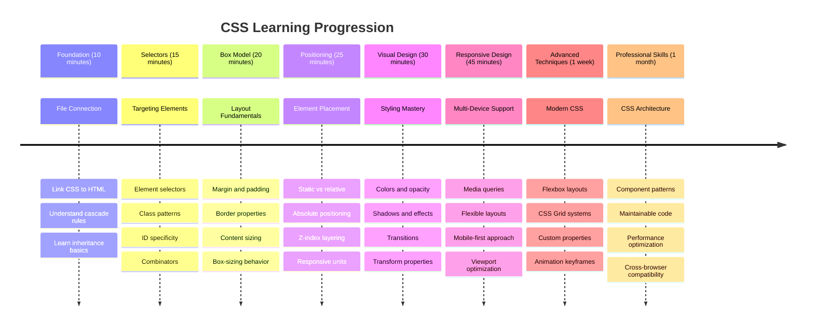

<!--
CO_OP_TRANSLATOR_METADATA:
{
  "original_hash": "e39f3a4e3bcccf94639e3af1248f8a4d",
  "translation_date": "2025-11-03T16:32:59+00:00",
  "source_file": "3-terrarium/2-intro-to-css/README.md",
  "language_code": "pa"
}
-->
# ਟੈਰੀਰੀਅਮ ਪ੍ਰੋਜੈਕਟ ਭਾਗ 2: CSS ਦਾ ਪਰਚੇਅ




> ਸਕੈਚਨੋਟ [Tomomi Imura](https://twitter.com/girlie_mac) ਵੱਲੋਂ

ਤੁਹਾਨੂੰ ਯਾਦ ਹੈ ਕਿ ਤੁਹਾਡਾ HTML ਟੈਰੀਰੀਅਮ ਕਿੰਨਾ ਸਧਾਰਨ ਲੱਗ ਰਿਹਾ ਸੀ? CSS ਦੇ ਨਾਲ ਅਸੀਂ ਉਸ ਸਧਾਰਨ ਬਣਤਰ ਨੂੰ ਕੁਝ ਵਿਜੁਅਲ ਅਪੀਲ ਦੇਣ ਵਾਲੇ ਵਿੱਚ ਬਦਲ ਸਕਦੇ ਹਾਂ।

ਜੇ HTML ਨੂੰ ਇੱਕ ਘਰ ਦੀ ਫਰੇਮ ਬਣਾਉਣ ਵਾਂਗ ਸਮਝਿਆ ਜਾਵੇ, ਤਾਂ CSS ਉਹ ਸਭ ਕੁਝ ਹੈ ਜੋ ਉਸਨੂੰ ਘਰ ਵਾਂਗ ਮਹਿਸੂਸ ਕਰਾਉਂਦਾ ਹੈ - ਰੰਗ, ਫਰਨੀਚਰ ਦੀ ਸਜਾਵਟ, ਰੌਸ਼ਨੀ, ਅਤੇ ਕਮਰੇ ਕਿਵੇਂ ਇੱਕ ਦੂਜੇ ਨਾਲ ਜੁੜਦੇ ਹਨ। ਸੋਚੋ ਕਿ ਵਰਸਾਈਲਸ ਦਾ ਪੈਲੇਸ ਇੱਕ ਸਧਾਰਨ ਸ਼ਿਕਾਰ ਲੌਜ ਵਜੋਂ ਸ਼ੁਰੂ ਹੋਇਆ ਸੀ, ਪਰ ਸਜਾਵਟ ਅਤੇ ਲੇਆਉਟ 'ਤੇ ਧਿਆਨ ਦੇਣ ਨਾਲ ਇਹ ਦੁਨੀਆ ਦੇ ਸਭ ਤੋਂ ਸ਼ਾਨਦਾਰ ਇਮਾਰਤਾਂ ਵਿੱਚੋਂ ਇੱਕ ਬਣ ਗਿਆ।

ਅੱਜ, ਅਸੀਂ ਤੁਹਾਡੇ ਟੈਰੀਰੀਅਮ ਨੂੰ ਕਾਰਗਰ ਤੋਂ ਪਾਲਿਸ਼ਡ ਵਿੱਚ ਬਦਲਾਂਗੇ। ਤੁਸੀਂ ਸਿੱਖੋਗੇ ਕਿ ਤੱਤਾਂ ਨੂੰ ਸਹੀ ਢੰਗ ਨਾਲ ਕਿਵੇਂ ਪੋਜ਼ੀਸ਼ਨ ਕਰਨਾ ਹੈ, ਲੇਆਉਟਸ ਨੂੰ ਵੱਖ-ਵੱਖ ਸਕ੍ਰੀਨ ਸਾਈਜ਼ਾਂ ਲਈ ਕਿਵੇਂ ਪ੍ਰਤੀਕ੍ਰਿਆਸ਼ੀਲ ਬਣਾਉਣਾ ਹੈ, ਅਤੇ ਉਹ ਵਿਜੁਅਲ ਅਪੀਲ ਬਣਾਉਣਾ ਹੈ ਜੋ ਵੈਬਸਾਈਟਾਂ ਨੂੰ ਦਿਲਚਸਪ ਬਣਾਉਂਦਾ ਹੈ।

ਇਸ ਪਾਠ ਦੇ ਅੰਤ ਤੱਕ, ਤੁਸੀਂ ਦੇਖੋਗੇ ਕਿ ਰਣਨੀਤਿਕ CSS ਸਟਾਈਲਿੰਗ ਤੁਹਾਡੇ ਪ੍ਰੋਜੈਕਟ ਨੂੰ ਕਿੰਨਾ ਬਹੁਤਰੀਨ ਬਣਾ ਸਕਦੀ ਹੈ। ਚਲੋ, ਤੁਹਾਡੇ ਟੈਰੀਰੀਅਮ ਵਿੱਚ ਕੁਝ ਸਟਾਈਲ ਸ਼ਾਮਲ ਕਰੀਏ।



## ਪਾਠ ਤੋਂ ਪਹਿਲਾਂ ਕਵੀਜ਼

[ਪਾਠ ਤੋਂ ਪਹਿਲਾਂ ਕਵੀਜ਼](https://ff-quizzes.netlify.app/web/quiz/17)

## CSS ਨਾਲ ਸ਼ੁਰੂਆਤ

CSS ਨੂੰ ਅਕਸਰ "ਚੀਜ਼ਾਂ ਨੂੰ ਸੁੰਦਰ ਬਣਾਉਣਾ" ਸਮਝਿਆ ਜਾਂਦਾ ਹੈ, ਪਰ ਇਹ ਇਸ ਤੋਂ ਕਾਫ਼ੀ ਵੱਡਾ ਮਕਸਦ ਪੂਰਾ ਕਰਦਾ ਹੈ। CSS ਇੱਕ ਫਿਲਮ ਦੇ ਡਾਇਰੈਕਟਰ ਵਾਂਗ ਹੈ - ਤੁਸੀਂ ਸਿਰਫ ਇਹ ਨਹੀਂ ਨਿਰਧਾਰਤ ਕਰਦੇ ਕਿ ਸਭ ਕੁਝ ਕਿਵੇਂ ਦਿਖਾਈ ਦੇਵੇਗਾ, ਪਰ ਇਹ ਵੀ ਕਿ ਇਹ ਕਿਵੇਂ ਹਿਲੇਗਾ, ਇੰਟਰੈਕਸ਼ਨ 'ਤੇ ਕਿਵੇਂ ਪ੍ਰਤੀਕ੍ਰਿਆ ਕਰੇਗਾ, ਅਤੇ ਵੱਖ-ਵੱਖ ਸਥਿਤੀਆਂ ਵਿੱਚ ਕਿਵੇਂ ਅਨੁਕੂਲ ਹੋਵੇਗਾ।

ਆਧੁਨਿਕ CSS ਬਹੁਤ ਹੀ ਸਮਰੱਥ ਹੈ। ਤੁਸੀਂ ਐਸਾ ਕੋਡ ਲਿਖ ਸਕਦੇ ਹੋ ਜੋ ਫੋਨ, ਟੈਬਲੇਟ ਅਤੇ ਡੈਸਕਟਾਪ ਕੰਪਿਊਟਰਾਂ ਲਈ ਲੇਆਉਟਸ ਨੂੰ ਆਪਣੇ ਆਪ ਅਨੁਕੂਲ ਕਰਦਾ ਹੈ। ਤੁਸੀਂ ਸਮਰਥ ਐਨੀਮੇਸ਼ਨ ਬਣਾਉਣ ਲਈ ਕੋਡ ਲਿਖ ਸਕਦੇ ਹੋ ਜੋ ਜਰੂਰਤ ਪੜਨ 'ਤੇ ਯੂਜ਼ਰ ਦਾ ਧਿਆਨ ਖਿੱਚਦਾ ਹੈ। ਜਦੋਂ ਸਭ ਕੁਝ ਇੱਕਠੇ ਕੰਮ ਕਰਦਾ ਹੈ, ਨਤੀਜੇ ਕਾਫ਼ੀ ਪ੍ਰਭਾਵਸ਼ਾਲੀ ਹੋ ਸਕਦੇ ਹਨ।

> 💡 **ਪ੍ਰੋ ਟਿਪ**: CSS ਨਿਰੰਤਰ ਨਵੇਂ ਫੀਚਰਾਂ ਅਤੇ ਸਮਰੱਥਾਵਾਂ ਨਾਲ ਵਿਕਸਤ ਹੋ ਰਿਹਾ ਹੈ। ਉਨ੍ਹਾਂ ਨੂੰ ਪ੍ਰੋਡਕਸ਼ਨ ਪ੍ਰੋਜੈਕਟਾਂ ਵਿੱਚ ਵਰਤਣ ਤੋਂ ਪਹਿਲਾਂ ਨਵੇਂ CSS ਫੀਚਰਾਂ ਲਈ ਬ੍ਰਾਊਜ਼ਰ ਸਹਾਇਤਾ ਦੀ ਪੁਸ਼ਟੀ ਕਰਨ ਲਈ ਹਮੇਸ਼ਾ [CanIUse.com](https://caniuse.com) ਦੀ ਜਾਂਚ ਕਰੋ।

**ਇਸ ਪਾਠ ਵਿੱਚ ਅਸੀਂ ਇਹ ਹਾਸਲ ਕਰਾਂਗੇ:**
- **ਤਿਆਰ ਕਰਨਾ**: ਆਧੁਨਿਕ CSS ਤਕਨੀਕਾਂ ਦੀ ਵਰਤੋਂ ਕਰਕੇ ਤੁਹਾਡੇ ਟੈਰੀਰੀਅਮ ਲਈ ਪੂਰੀ ਵਿਜੁਅਲ ਡਿਜ਼ਾਈਨ
- **ਖੋਜ ਕਰਨਾ**: ਮੁੱਢਲੇ ਸੰਕਲਪ ਜਿਵੇਂ ਕਿ ਕੈਸਕੇਡ, ਵਿਰਾਸਤ, ਅਤੇ CSS ਚੁਣਨ ਵਾਲੇ
- **ਲਾਗੂ ਕਰਨਾ**: ਪ੍ਰਤੀਕ੍ਰਿਆਸ਼ੀਲ ਪੋਜ਼ੀਸ਼ਨਿੰਗ ਅਤੇ ਲੇਆਉਟ ਰਣਨੀਤੀਆਂ
- **ਨਿਰਮਾਣ ਕਰਨਾ**: CSS ਸ਼ੇਪਸ ਅਤੇ ਸਟਾਈਲਿੰਗ ਦੀ ਵਰਤੋਂ ਕਰਕੇ ਟੈਰੀਰੀਅਮ ਕੰਟੇਨਰ

### ਪੂਰਵ ਸ਼ਰਤ

ਤੁਹਾਨੂੰ ਪਿਛਲੇ ਪਾਠ ਤੋਂ ਆਪਣੇ ਟੈਰੀਰੀਅਮ ਲਈ HTML ਬਣਤਰ ਪੂਰੀ ਕਰ ਲੈਣੀ ਚਾਹੀਦੀ ਹੈ ਅਤੇ ਇਸਨੂੰ ਸਟਾਈਲ ਕਰਨ ਲਈ ਤਿਆਰ ਹੋਣਾ ਚਾਹੀਦਾ ਹੈ।

> 📺 **ਵੀਡੀਓ ਸਰੋਤ**: ਇਸ ਮਦਦਗਾਰ ਵੀਡੀਓ ਵਾਕਥਰੂ ਨੂੰ ਦੇਖੋ
>
> [](https://www.youtube.com/watch?v=6yIdOIV9p1I)

### ਆਪਣੀ CSS ਫਾਈਲ ਸੈਟ ਕਰਨਾ

ਸਟਾਈਲਿੰਗ ਸ਼ੁਰੂ ਕਰਨ ਤੋਂ ਪਹਿਲਾਂ, ਸਾਨੂੰ CSS ਨੂੰ ਆਪਣੇ HTML ਨਾਲ ਜੁੜਨਾ ਪਵੇਗਾ। ਇਹ ਕਨੈਕਸ਼ਨ ਬ੍ਰਾਊਜ਼ਰ ਨੂੰ ਦੱਸਦਾ ਹੈ ਕਿ ਸਾਡੇ ਟੈਰੀਰੀਅਮ ਲਈ ਸਟਾਈਲਿੰਗ ਨਿਰਦੇਸ਼ ਕਿੱਥੇ ਮਿਲਣਗੇ।

ਆਪਣੇ ਟੈਰੀਰੀਅਮ ਫੋਲਡਰ ਵਿੱਚ, ਇੱਕ ਨਵੀਂ ਫਾਈਲ ਬਣਾਓ ਜਿਸਨੂੰ `style.css` ਕਿਹਾ ਜਾਂਦਾ ਹੈ, ਫਿਰ ਇਸਨੂੰ ਆਪਣੇ HTML ਦਸਤਾਵੇਜ਼ ਦੇ `<head>` ਸੈਕਸ਼ਨ ਵਿੱਚ ਲਿੰਕ ਕਰੋ:

```html
<link rel="stylesheet" href="./style.css" />
```

**ਇਹ ਕੋਡ ਕੀ ਕਰਦਾ ਹੈ:**
- **ਕਨੈਕਸ਼ਨ ਬਣਾਉਣਾ**: ਤੁਹਾਡੇ HTML ਅਤੇ CSS ਫਾਈਲਾਂ ਦੇ ਵਿਚਕਾਰ
- **ਬ੍ਰਾਊਜ਼ਰ ਨੂੰ ਦੱਸਣਾ**: `style.css` ਤੋਂ ਸਟਾਈਲ ਲੋਡ ਅਤੇ ਲਾਗੂ ਕਰਨ ਲਈ
- **ਵਰਤਣਾ**: `rel="stylesheet"` ਐਟ੍ਰਿਬਿਊਟ ਇਹ ਦਰਸਾਉਣ ਲਈ ਕਿ ਇਹ CSS ਫਾਈਲ ਹੈ
- **ਸੰਬੰਧਿਤ ਕਰਨਾ**: ਫਾਈਲ ਪਾਥ `href="./style.css"` ਨਾਲ

## CSS ਕੈਸਕੇਡ ਨੂੰ ਸਮਝਣਾ

ਤੁਹਾਨੂੰ ਕਦੇ ਸੋਚਿਆ ਕਿ CSS ਨੂੰ "Cascading" Style Sheets ਕਿਉਂ ਕਿਹਾ ਜਾਂਦਾ ਹੈ? ਸਟਾਈਲ ਪਾਣੀ ਦੇ ਝਰਨੇ ਵਾਂਗ ਹੇਠਾਂ ਵਗਦੇ ਹਨ, ਅਤੇ ਕਈ ਵਾਰ ਇਹ ਇੱਕ ਦੂਜੇ ਨਾਲ ਟਕਰਾਉਂਦੇ ਹਨ।

ਸੋਚੋ ਕਿ ਫੌਜੀ ਕਮਾਂਡ ਬਣਤਰ ਕਿਵੇਂ ਕੰਮ ਕਰਦੇ ਹਨ - ਇੱਕ ਜਨਰਲ ਆਰਡਰ ਕਹਿ ਸਕਦਾ ਹੈ "ਸਾਰੇ ਸਿਪਾਹੀ ਹਰਾ ਪਹਿਨੋ," ਪਰ ਤੁਹਾਡੇ ਯੂਨਿਟ ਲਈ ਇੱਕ ਵਿਸ਼ੇਸ਼ ਆਰਡਰ ਕਹਿ ਸਕਦਾ ਹੈ "ਸਮਾਰੋਹ ਲਈ ਡ੍ਰੈਸ ਬਲੂਜ਼ ਪਹਿਨੋ।" ਜ਼ਿਆਦਾ ਵਿਸ਼ੇਸ਼ ਨਿਰਦੇਸ਼ ਪ੍ਰਾਥਮਿਕਤਾ ਪ੍ਰਾਪਤ ਕਰਦਾ ਹੈ। CSS ਇਸੇ ਤਰ੍ਹਾਂ ਦੀ ਤਰਕ ਦਾ ਪਾਲਣ ਕਰਦਾ ਹੈ, ਅਤੇ ਇਸ ਹਾਇਰਾਰਕੀ ਨੂੰ ਸਮਝਣਾ ਡੀਬੱਗਿੰਗ ਨੂੰ ਕਾਫ਼ੀ ਆਸਾਨ ਬਣਾਉਂਦਾ ਹੈ।

### ਕੈਸਕੇਡ ਪ੍ਰਾਥਮਿਕਤਾ ਨਾਲ ਪ੍ਰਯੋਗ ਕਰਨਾ

ਚਲੋ ਕੈਸਕੇਡ ਨੂੰ ਕਾਰਵਾਈ ਵਿੱਚ ਦੇਖਦੇ ਹਾਂ ਜਦੋਂ ਸਟਾਈਲ ਟਕਰਾਅ ਬਣਦਾ ਹੈ। ਪਹਿਲਾਂ, ਆਪਣੇ `<h1>` ਟੈਗ ਵਿੱਚ ਇੱਕ ਇਨਲਾਈਨ ਸਟਾਈਲ ਸ਼ਾਮਲ ਕਰੋ:

```html
<h1 style="color: red">My Terrarium</h1>
```

**ਇਹ ਕੋਡ ਕੀ ਕਰਦਾ ਹੈ:**
- **ਲਾਗੂ ਕਰਨਾ**: `<h1>` ਤੱਤ ਨੂੰ ਇਨਲਾਈਨ ਸਟਾਈਲਿੰਗ ਦੀ ਵਰਤੋਂ ਕਰਕੇ ਸਿੱਧੇ ਲਾਲ ਰੰਗ
- **ਵਰਤਣਾ**: `style` ਐਟ੍ਰਿਬਿਊਟ CSS ਨੂੰ ਸਿੱਧੇ HTML ਵਿੱਚ ਸ਼ਾਮਲ ਕਰਨ ਲਈ
- **ਬਣਾਉਣਾ**: ਇਸ ਵਿਸ਼ੇਸ਼ ਤੱਤ ਲਈ ਸਭ ਤੋਂ ਉੱਚੀ ਪ੍ਰਾਥਮਿਕਤਾ ਵਾਲਾ ਸਟਾਈਲ ਨਿਯਮ

ਅਗਲੇ, ਆਪਣੇ `style.css` ਫਾਈਲ ਵਿੱਚ ਇਹ ਨਿਯਮ ਸ਼ਾਮਲ ਕਰੋ:

```css
h1 {
  color: blue;
}
```

**ਉਪਰੋਕਤ ਵਿੱਚ, ਅਸੀਂ:**
- **ਨਿਰਧਾਰਤ ਕੀਤਾ**: ਇੱਕ CSS ਨਿਯਮ ਜੋ ਸਾਰੇ `<h1>` ਤੱਤਾਂ ਨੂੰ ਟਾਰਗਟ ਕਰਦਾ ਹੈ
- **ਸੈਟ ਕੀਤਾ**: ਟੈਕਸਟ ਰੰਗ ਨੂੰ ਬਲੂ ਬਾਹਰੀ ਸਟਾਈਲਸ਼ੀਟ ਦੀ ਵਰਤੋਂ ਕਰਕੇ
- **ਬਣਾਇਆ**: ਇਨਲਾਈਨ ਸਟਾਈਲਜ਼ ਦੇ ਮੁਕਾਬਲੇ ਘੱਟ ਪ੍ਰਾਥਮਿਕਤਾ ਵਾਲਾ ਨਿਯਮ

✅ **ਗਿਆਨ ਦੀ ਜਾਂਚ**: ਤੁਹਾਡੇ ਵੈਬ ਐਪ ਵਿੱਚ ਕਿਹੜਾ ਰੰਗ ਦਿਖਾਈ ਦਿੰਦਾ ਹੈ? ਉਹ ਰੰਗ ਕਿਉਂ ਜਿੱਤਦਾ ਹੈ? ਕੀ ਤੁਸੀਂ ਐਸੇ ਦ੍ਰਿਸ਼ਾਂ ਬਾਰੇ ਸੋਚ ਸਕਦੇ ਹੋ ਜਿੱਥੇ ਤੁਸੀਂ ਸਟਾਈਲਜ਼ ਨੂੰ ਓਵਰਰਾਈਡ ਕਰਨਾ ਚਾਹੁੰਦੇ ਹੋ?



> 💡 **CSS ਪ੍ਰਾਥਮਿਕਤਾ ਕ੍ਰਮ (ਸਭ ਤੋਂ ਉੱਚਾ ਤੋਂ ਸਭ ਤੋਂ ਘੱਟ):**
> 1. **ਇਨਲਾਈਨ ਸਟਾਈਲਜ਼** (style attribute)
> 2. **IDs** (#myId)
> 3. **ਕਲਾਸਾਂ** (.myClass) ਅਤੇ ਐਟ੍ਰਿਬਿਊਟਸ
> 4. **ਤੱਤ ਚੁਣਨ ਵਾਲੇ** (h1, div, p)
> 5. **ਬ੍ਰਾਊਜ਼ਰ ਡਿਫਾਲਟਸ**

## CSS ਵਿਰਾਸਤ ਕਾਰਵਾਈ ਵਿੱਚ

CSS ਵਿਰਾਸਤ ਜੈਨੇਟਿਕਸ ਵਾਂਗ ਕੰਮ ਕਰਦੀ ਹੈ - ਤੱਤ ਆਪਣੇ ਮਾਤਾ-ਪਿਤਾ ਤੱਤਾਂ ਤੋਂ ਕੁਝ ਗੁਣ ਵਿਰਾਸਤ ਵਿੱਚ ਪ੍ਰਾਪਤ ਕਰਦੇ ਹਨ। ਜੇ ਤੁਸੀਂ ਬਾਡੀ ਤੱਤ 'ਤੇ ਫੋਂਟ ਫੈਮਿਲੀ ਸੈਟ ਕਰਦੇ ਹੋ, ਤਾਂ ਸਾਰੇ ਟੈਕਸਟ ਆਪਣੇ ਆਪ ਉਹੀ ਫੋਂਟ ਵਰਤਦਾ ਹੈ। ਇਹ ਉਸੇ ਤਰ੍ਹਾਂ ਹੈ ਜਿਵੇਂ ਹੈਬਸਬਰਗ ਪਰਿਵਾਰ ਦੀ ਵਿਸ਼ੇਸ਼ ਜੌਲਾਈਨ ਕਈ ਪੀੜ੍ਹੀਆਂ ਵਿੱਚ ਪ੍ਰਗਟ ਹੋਈ ਬਿਨਾਂ ਹਰ ਵਿਅਕਤੀ ਲਈ ਵਿਸ਼ੇਸ਼ ਤੌਰ 'ਤੇ ਨਿਰਧਾਰਤ ਕੀਤੇ।

ਹਾਲਾਂਕਿ, ਹਰ ਚੀਜ਼ ਵਿਰਾਸਤ ਵਿੱਚ ਨਹੀਂ ਮਿਲਦੀ। ਫੋਂਟ ਅਤੇ ਰੰਗ ਵਰਗੇ ਟੈਕਸਟ ਸਟਾਈਲ ਵਿਰਾਸਤ ਵਿੱਚ ਮਿਲਦੇ ਹਨ, ਪਰ ਮਾਰਜਿਨ ਅਤੇ ਬਾਰਡਰ ਵਰਗੇ ਲੇਆਉਟ ਗੁਣ ਨਹੀਂ ਮਿਲਦੇ। ਜਿਵੇਂ ਬੱਚੇ ਸ਼ਾਰੀਰੀਕ ਗੁਣ ਵਿਰਾਸਤ ਵਿੱਚ ਪ੍ਰਾਪਤ ਕਰ ਸਕਦੇ ਹਨ ਪਰ ਆਪਣੇ ਮਾਤਾ-ਪਿਤਾ ਦੀ ਫੈਸ਼ਨ ਚੋਣ ਨਹੀਂ।

### ਫੋਂਟ ਵਿਰਾਸਤ ਦਾ ਅਵਲੋਕਨ

ਚਲੋ ਵਿਰਾਸਤ ਨੂੰ ਕਾਰਵਾਈ ਵਿੱਚ ਦੇਖਦੇ ਹਾਂ ਜਦੋਂ `<body>` ਤੱਤ 'ਤੇ ਫੋਂਟ ਫੈਮਿਲੀ ਸੈਟ ਕਰਦੇ ਹੋ:

```css
body {
  font-family: 'Segoe UI', Tahoma, Geneva, Verdana, sans-serif;
}
```

**ਇੱਥੇ ਕੀ ਹੁੰਦਾ ਹੈ:**
- **ਸੈਟ ਕਰਨਾ**: ਪੂਰੇ ਪੇਜ ਲਈ ਫੋਂਟ ਫੈਮਿਲੀ ਨੂੰ ਟਾਰਗਟ ਕਰਕੇ `<body>` ਤੱਤ
- **ਵਰਤਣਾ**: ਫੋਂਟ ਸਟੈਕFallback ਵਿਕਲਪਾਂ ਨਾਲ ਬਿਹਤਰ ਬ੍ਰਾਊਜ਼ਰ ਅਨੁਕੂਲਤਾ ਲਈ
- **ਲਾਗੂ ਕਰਨਾ**: ਆਧੁਨਿਕ ਸਿਸਟਮ ਫੋਂਟ ਜੋ ਵੱਖ-ਵੱਖ ਓਪਰੇਟਿੰਗ ਸਿਸਟਮਾਂ 'ਤੇ ਸ਼ਾਨਦਾਰ ਦਿਖਾਈ ਦਿੰਦੇ ਹਨ
- **ਸੁਨਿਸ਼ਚਿਤ ਕਰਨਾ**: ਸਾਰੇ ਚਾਈਲਡ ਤੱਤ ਇਹ ਫੋਂਟ ਵਰਤਦੇ ਹਨ ਜਦੋਂ ਤੱਕ ਵਿਸ਼ੇਸ਼ ਤੌਰ 'ਤੇ ਓਵਰਰਾਈਡ ਨਾ ਕੀਤਾ ਜਾਵੇ

ਆਪਣੇ ਬ੍ਰਾਊਜ਼ਰ ਦੇ ਡਿਵੈਲਪਰ ਟੂਲ (F12) ਖੋਲ੍ਹੋ, ਐਲਿਮੈਂਟਸ ਟੈਬ 'ਤੇ ਜਾਓ, ਅਤੇ ਆਪਣੇ `<h1>` ਤੱਤ ਦੀ ਜਾਂਚ ਕਰੋ। ਤੁਸੀਂ ਦੇਖੋਗੇ ਕਿ ਇਹ ਬਾਡੀ ਤੋਂ ਫੋਂਟ ਫੈਮਿਲੀ ਵਿਰਾਸਤ ਵਿੱਚ ਪ੍ਰਾਪਤ ਕਰਦਾ ਹੈ:



✅ **ਪ੍ਰਯੋਗ ਸਮਾਂ**: `<body>` 'ਤੇ ਹੋਰ ਵਿਰਾਸਤ ਗੁਣ ਜਿਵੇਂ `color`, `line-height`, ਜਾਂ `text-align` ਸੈਟ ਕਰਨ ਦੀ ਕੋਸ਼ਿਸ਼ ਕਰੋ। ਤੁਹਾਡੇ ਹੈਡਿੰਗ ਅਤੇ ਹੋਰ ਤੱਤਾਂ 'ਤੇ ਕੀ ਹੁੰਦਾ ਹੈ?

> 📝 **ਵਿਰਾਸਤ ਗੁਣ ਸ਼ਾਮਲ ਹਨ**: `color`, `font-family`, `font-size`, `line-height`, `text-align`, `visibility`
>
> **ਗੈਰ-ਵਿਰਾਸਤ ਗੁਣ ਸ਼ਾਮਲ ਹਨ**: `margin`, `padding`, `border`, `width`, `height`, `position`

### 🔄 **ਪੈਡਾਗੌਜੀਕਲ ਚੈੱਕ-ਇਨ**
**CSS ਫਾਊਂਡੇਸ਼ਨ ਸਮਝ**: ਚੁਣਨ ਵਾਲਿਆਂ 'ਤੇ ਜਾਣ ਤੋਂ ਪਹਿਲਾਂ, ਇਹ ਯਕੀਨੀ ਬਣਾਓ ਕਿ ਤੁਸੀਂ:
- ✅ ਕੈਸਕੇਡ ਅਤੇ ਵਿਰਾਸਤ ਦੇ ਵਿਚਕਾਰ ਅੰਤਰ ਦੀ ਵਿਆਖਿਆ ਕਰ ਸਕਦੇ ਹੋ
- ✅ ਪੇਸ਼ਗੂਈ ਕਰ ਸਕਦੇ ਹੋ ਕਿ ਵਿਸ਼ੇਸ਼ਤਾ ਟਕਰਾਅ ਵਿੱਚ ਕਿਹੜਾ ਸਟਾਈਲ ਜਿੱਤੇਗਾ
- ✅ ਪਛਾਣ ਸਕਦੇ ਹੋ ਕਿ ਕਿਹੜੇ ਗੁਣ ਮਾਤਾ-ਪਿਤਾ ਤੱਤਾਂ ਤੋਂ ਵਿਰਾਸਤ ਵਿੱਚ ਮਿਲਦੇ ਹਨ
- ✅ CSS ਫਾਈਲਾਂ ਨੂੰ HTML ਨਾਲ ਸਹੀ ਤੌਰ 'ਤੇ ਜੁੜ ਸਕਦੇ ਹੋ

**ਤੁਰੰਤ ਟੈਸਟ**: ਜੇ ਤੁਹਾਡੇ ਕੋਲ ਇਹ ਸਟਾਈਲ ਹਨ, `<div class="special">` ਦੇ ਅੰਦਰ ਇੱਕ `<h1>` ਦਾ ਰੰਗ ਕੀ ਹੋਵੇਗਾ?
```css
div { color: blue; }
.special { color: green; }
h1 { color: red; }
```
*ਜਵਾਬ: ਲਾਲ (ਤੱਤ ਚੁਣਨ ਵਾਲਾ ਸਿੱਧੇ h1 ਨੂੰ ਟਾਰਗਟ ਕਰਦਾ ਹੈ)*

## CSS ਚੁਣਨ ਵਾਲਿਆਂ ਵਿੱਚ ਮਾਹਰ ਬਣਨਾ

CSS ਚੁਣਨ ਵਾਲੇ ਤੁਹਾਡੇ ਤੱਤਾਂ ਨੂੰ ਸਟਾਈਲ ਕਰਨ ਲਈ ਟਾਰਗਟ ਕਰਨ ਦਾ ਤਰੀਕਾ ਹਨ। ਇਹ ਸਹੀ ਦਿਸ਼ਾ ਦੇਣ ਵਾਂਗ ਕੰਮ ਕਰਦੇ ਹਨ - "ਘਰ" ਕਹਿਣ ਦੀ ਬਜਾਏ, ਤੁਸੀਂ ਕਹਿ ਸਕਦੇ ਹੋ "ਮੈਪਲ ਸਟ੍ਰੀਟ 'ਤੇ ਲਾਲ ਦਰਵਾਜ਼ੇ ਵਾਲਾ ਨੀਲਾ ਘਰ।"

CSS ਵੱਖ-ਵੱਖ ਤਰੀਕਿਆਂ ਨਾਲ ਵਿਸ਼ੇਸ਼ ਹੋਣ ਦੀ ਪੇਸ਼ਕਸ਼ ਕਰਦਾ ਹੈ, ਅਤੇ ਸਹੀ ਚੁਣਨ ਵਾਲੇ ਦੀ ਚੋਣ ਕਰਨਾ ਕੰਮ ਲਈ ਸਹੀ ਸੰਦ ਦੀ ਚੋਣ ਕਰਨ ਵਾਂਗ ਹੈ। ਕਈ ਵਾਰ ਤੁਹਾਨੂੰ ਪੜੋਸ ਵਿੱਚ ਹਰ ਦਰਵਾਜ਼ੇ ਨੂੰ ਸਟਾਈਲ ਕਰਨ ਦੀ ਜ਼ਰੂਰਤ ਹੁੰਦੀ ਹੈ, ਅਤੇ ਕਈ ਵਾਰ ਸਿਰਫ਼ ਇੱਕ ਵਿਸ਼ੇਸ਼ ਦਰਵਾਜ਼ੇ ਨੂੰ।

### ਤੱਤ ਚੁਣਨ ਵਾਲੇ (ਟੈਗ)

ਤੱਤ ਚੁਣਨ ਵਾਲੇ HTML ਤੱਤਾਂ ਨੂੰ ਉਨ੍ਹਾਂ ਦੇ ਟੈਗ ਨਾਮ ਦੁਆਰਾ ਟਾਰਗਟ ਕਰਦੇ ਹਨ। ਇਹ ਪੂਰੇ ਪੇਜ ਵਿੱਚ ਵਿਆਪਕ ਤੌਰ 'ਤੇ ਲਾਗੂ ਹੋਣ ਵਾਲੇ ਬੇਸ ਸਟਾਈਲ ਸੈਟ ਕਰਨ ਲਈ ਬਹੁਤ ਹੀ ਵਧੀਆ ਹਨ:

```css
body {
  font-family: 'Segoe UI', Tahoma, Geneva, Verdana, sans-serif;
  margin: 0;
  padding: 0;
}

h1 {
  color: #3a241d;
  text-align: center;
  font-size: 2.5rem;
  margin-bottom: 1rem;
}
```

**ਇਹ ਸਟਾਈਲ ਸਮਝਣਾ:**
- **ਸੈਟ ਕਰਨਾ**: ਪੂਰੇ ਪੇਜ ਵਿੱਚ ਸਥਿਰ ਟਾਈਪੋਗ੍ਰਾਫੀ `body` ਚੁਣਨ ਵਾਲੇ ਨਾਲ
- **ਹਟਾਉਣਾ**: ਬ੍ਰਾਊਜ਼ਰ ਦੇ ਡਿਫਾਲਟ ਮਾਰਜਿਨ ਅਤੇ ਪੈਡਿੰਗ ਬਿਹਤਰ ਕੰਟਰੋਲ ਲਈ
- **ਸਟਾਈਲ ਕਰਨਾ**: ਸਾਰੇ ਹੈਡਿੰਗ ਤੱਤ ਰੰਗ, ਸੰਰੇਖਣ, ਅਤੇ ਸਪੇਸਿੰਗ ਨਾਲ
- **ਵਰਤਣਾ**: `rem` ਯੂਨਿਟਸ ਸਕੇਲਬਲ, ਪਹੁੰਚਯੋਗ ਫੋਂਟ ਸਾਈਜ਼ਿੰਗ ਲਈ

ਜਦੋਂ ਕਿ ਤੱਤ ਚੁਣਨ ਵਾਲੇ ਆਮ ਸਟਾਈਲਿੰਗ ਲਈ ਚੰਗੇ ਕੰਮ ਕਰਦੇ ਹਨ, ਤੁਹਾਨੂੰ ਵਿਅਕਤੀਗਤ ਕੰਪੋਨੈਂਟਾਂ ਨੂੰ ਸਟਾਈਲ ਕਰਨ ਲਈ ਹੋਰ ਵਿਸ਼ੇਸ਼ ਚੁਣਨ ਵਾਲਿਆਂ ਦੀ ਜ਼ਰੂਰਤ ਹੋਵੇਗੀ ਜਿਵੇਂ ਕਿ ਤੁਹਾਡੇ
- ਜਦੋਂ `.plant-holder` ਨੂੰ `relative` ਦੀ ਬਜਾਏ `absolute` ਵਰਤਿਆ ਜਾਂਦਾ ਹੈ, ਤਾਂ ਲੇਆਉਟ ਵਿੱਚ ਕੀ ਤਬਦੀਲੀ ਆਉਂਦੀ ਹੈ?
- ਜਦੋਂ `.plant` ਨੂੰ `relative` ਪੋਜ਼ੀਸ਼ਨਿੰਗ ਵਿੱਚ ਬਦਲਿਆ ਜਾਂਦਾ ਹੈ, ਤਾਂ ਕੀ ਹੁੰਦਾ ਹੈ?

### 🔄 **ਪੈਡਾਗੌਜੀਕਲ ਚੈੱਕ-ਇਨ**
**CSS ਪੋਜ਼ੀਸ਼ਨਿੰਗ ਵਿੱਚ ਮਾਹਰਤਾ**: ਆਪਣੇ ਗਿਆਨ ਦੀ ਪੁਸ਼ਟੀ ਕਰਨ ਲਈ ਰੁਕੋ:
- ✅ ਕੀ ਤੁਸੀਂ ਸਮਝਾ ਸਕਦੇ ਹੋ ਕਿ ਡ੍ਰੈਗ-ਐਂਡ-ਡ੍ਰੌਪ ਲਈ ਪੌਦਿਆਂ ਨੂੰ `absolute` ਪੋਜ਼ੀਸ਼ਨਿੰਗ ਦੀ ਲੋੜ ਕਿਉਂ ਹੈ?
- ✅ ਕੀ ਤੁਸੀਂ ਸਮਝਦੇ ਹੋ ਕਿ `relative` ਕੰਟੇਨਰ ਪੋਜ਼ੀਸ਼ਨਿੰਗ ਸੰਦਰਭ ਕਿਵੇਂ ਬਣਾਉਂਦੇ ਹਨ?
- ✅ ਸਾਈਡ ਕੰਟੇਨਰ `absolute` ਪੋਜ਼ੀਸ਼ਨਿੰਗ ਕਿਉਂ ਵਰਤਦੇ ਹਨ?
- ✅ ਜੇ ਤੁਸੀਂ ਪੋਜ਼ੀਸ਼ਨ ਡਿਕਲੇਰੇਸ਼ਨ ਨੂੰ ਪੂਰੀ ਤਰ੍ਹਾਂ ਹਟਾ ਦਿੰਦੇ ਹੋ ਤਾਂ ਕੀ ਹੋਵੇਗਾ?

**ਅਸਲ ਜਗਤ ਨਾਲ ਸੰਬੰਧ**: ਸੋਚੋ ਕਿ CSS ਪੋਜ਼ੀਸ਼ਨਿੰਗ ਅਸਲ ਜਗਤ ਦੇ ਲੇਆਉਟ ਨੂੰ ਕਿਵੇਂ ਦਰਸਾਉਂਦੀ ਹੈ:
- **Static**: ਸ਼ੈਲਫ 'ਤੇ ਕਿਤਾਬਾਂ (ਕੁਦਰਤੀ ਕ੍ਰਮ)
- **Relative**: ਇੱਕ ਕਿਤਾਬ ਨੂੰ ਥੋੜ੍ਹਾ ਜਿਹਾ ਹਿਲਾਉਣਾ ਪਰ ਉਸ ਦੀ ਜਗ੍ਹਾ ਬਰਕਰਾਰ ਰੱਖਣਾ
- **Absolute**: ਇੱਕ ਕਿਤਾਬ ਦੇ ਪੰਨੇ 'ਤੇ ਸਹੀ ਸਥਾਨ 'ਤੇ ਬੁੱਕਮਾਰਕ ਰੱਖਣਾ
- **Fixed**: ਇੱਕ ਸਟਿੱਕੀ ਨੋਟ ਜੋ ਪੰਨੇ ਪਲਟਣ 'ਤੇ ਵੀ ਦਿਖਾਈ ਦਿੰਦਾ ਹੈ

## CSS ਨਾਲ ਟੈਰੀਰੀਅਮ ਬਣਾਉਣਾ

ਹੁਣ ਅਸੀਂ ਸਿਰਫ CSS ਦੀ ਵਰਤੋਂ ਕਰਕੇ ਇੱਕ ਕੱਚ ਦਾ ਜਾਰ ਬਣਾਉਣ ਜਾ ਰਹੇ ਹਾਂ - ਕੋਈ ਚਿੱਤਰ ਜਾਂ ਗ੍ਰਾਫਿਕਸ ਸਾਫਟਵੇਅਰ ਦੀ ਲੋੜ ਨਹੀਂ।

CSS ਦੀ ਪੋਜ਼ੀਸ਼ਨਿੰਗ ਅਤੇ ਟ੍ਰਾਂਸਪੇਰੈਂਸੀ ਦੀ ਵਰਤੋਂ ਕਰਕੇ ਹਕੀਕਤੀ ਕੱਚ, ਛਾਂ ਅਤੇ ਡੈਪਥ ਇਫੈਕਟ ਬਣਾਉਣਾ CSS ਦੀ ਵਿਜ਼ੂਅਲ ਸਮਰੱਥਾ ਨੂੰ ਦਰਸਾਉਂਦਾ ਹੈ। ਇਹ ਤਕਨੀਕ ਉਸ ਤਰੀਕੇ ਨੂੰ ਦਰਸਾਉਂਦੀ ਹੈ ਜਿਸ ਤਰ੍ਹਾਂ Bauhaus ਮੂਵਮੈਂਟ ਦੇ ਆਰਕੀਟੈਕਟ ਸਧਾਰਨ ਜਿਓਮੈਟ੍ਰਿਕ ਰੂਪਾਂ ਦੀ ਵਰਤੋਂ ਕਰਕੇ ਸੁੰਦਰ ਅਤੇ ਜਟਿਲ ਬਣਾਵਟਾਂ ਬਣਾਉਂਦੇ ਸਨ। ਜਦੋਂ ਤੁਸੀਂ ਇਹ ਸਿਧਾਂਤ ਸਮਝ ਲੈਂਦੇ ਹੋ, ਤਾਂ ਤੁਸੀਂ ਕਈ ਵੈੱਬ ਡਿਜ਼ਾਈਨਾਂ ਦੇ CSS ਤਕਨੀਕਾਂ ਨੂੰ ਪਛਾਣ ਸਕਦੇ ਹੋ।



### ਕੱਚ ਦੇ ਜਾਰ ਦੇ ਹਿੱਸੇ ਬਣਾਉਣਾ

ਆਓ ਟੈਰੀਰੀਅਮ ਜਾਰ ਨੂੰ ਹਿੱਸਾ-ਹਿੱਸਾ ਕਰਕੇ ਬਣਾਈਏ। ਹਰ ਹਿੱਸਾ `absolute` ਪੋਜ਼ੀਸ਼ਨਿੰਗ ਅਤੇ ਪ੍ਰਤੀਸ਼ਤ-ਅਧਾਰਿਤ ਸਾਈਜ਼ਿੰਗ ਦੀ ਵਰਤੋਂ ਕਰਦਾ ਹੈ ਤਾਂ ਜੋ ਰਿਸਪਾਂਸਿਵ ਡਿਜ਼ਾਈਨ ਬਣਾਇਆ ਜਾ ਸਕੇ:

```css
.jar-walls {
  height: 80%;
  width: 60%;
  background: #d1e1df;
  border-radius: 1rem;
  position: absolute;
  bottom: 0.5%;
  left: 20%;
  opacity: 0.5;
  z-index: 1;
  box-shadow: inset 0 0 2rem rgba(0, 0, 0, 0.1);
}

.jar-top {
  width: 50%;
  height: 5%;
  background: #d1e1df;
  position: absolute;
  bottom: 80.5%;
  left: 25%;
  opacity: 0.7;
  z-index: 1;
  border-radius: 0.5rem 0.5rem 0 0;
}

.jar-bottom {
  width: 50%;
  height: 1%;
  background: #d1e1df;
  position: absolute;
  bottom: 0;
  left: 25%;
  opacity: 0.7;
  border-radius: 0 0 0.5rem 0.5rem;
}

.dirt {
  width: 60%;
  height: 5%;
  background: #3a241d;
  position: absolute;
  border-radius: 0 0 1rem 1rem;
  bottom: 1%;
  left: 20%;
  opacity: 0.7;
  z-index: -1;
}
```

**ਟੈਰੀਰੀਅਮ ਬਣਾਉਣ ਦੀ ਸਮਝ:**
- **ਵਰਤਦਾ ਹੈ** ਪ੍ਰਤੀਸ਼ਤ-ਅਧਾਰਿਤ ਮਾਪ ਰਿਸਪਾਂਸਿਵ ਸਕੇਲਿੰਗ ਲਈ ਜੋ ਸਾਰੇ ਸਕ੍ਰੀਨ ਸਾਈਜ਼ਾਂ 'ਤੇ ਕੰਮ ਕਰਦਾ ਹੈ
- **ਪੋਜ਼ੀਸ਼ਨ ਕਰਦਾ ਹੈ** ਤੱਤਾਂ ਨੂੰ `absolute` ਤਰੀਕੇ ਨਾਲ ਤਾਂ ਜੋ ਉਹ ਸਹੀ ਤਰੀਕੇ ਨਾਲ ਸੈਟ ਹੋਣ
- **ਲਾਗੂ ਕਰਦਾ ਹੈ** ਵੱਖ-ਵੱਖ ਓਪੈਸਿਟੀ ਮੁੱਲਾਂ ਨੂੰ ਕੱਚ ਦੀ ਪਾਰਦਰਸ਼ੀਤਾ ਦਾ ਪ੍ਰਭਾਵ ਬਣਾਉਣ ਲਈ
- **ਇੰਪਲੀਮੈਂਟ ਕਰਦਾ ਹੈ** `z-index` ਲੇਅਰਿੰਗ ਤਾਂ ਜੋ ਪੌਦੇ ਜਾਰ ਦੇ ਅੰਦਰ ਦਿਖਾਈ ਦੇਣ
- **ਜੋੜਦਾ ਹੈ** ਹੌਲੀ ਬਾਕਸ-ਸ਼ੈਡੋ ਅਤੇ ਸੁਧਰੇ ਹੋਏ ਬਾਰਡਰ-ਰੇਡੀਅਸ ਨੂੰ ਹਕੀਕਤੀ ਦਿੱਖ ਲਈ

### ਪ੍ਰਤੀਸ਼ਤਾਂ ਨਾਲ ਰਿਸਪਾਂਸਿਵ ਡਿਜ਼ਾਈਨ

ਨੋਟ ਕਰੋ ਕਿ ਸਾਰੇ ਮਾਪ ਫਿਕਸਡ ਪਿਕਸਲ ਮੁੱਲਾਂ ਦੀ ਬਜਾਏ ਪ੍ਰਤੀਸ਼ਤਾਂ ਦੀ ਵਰਤੋਂ ਕਰਦੇ ਹਨ:

**ਇਸਦਾ ਮਹੱਤਵ ਕਿਉਂ ਹੈ:**
- **ਯਕੀਨੀ ਬਣਾਉਂਦਾ ਹੈ** ਕਿ ਟੈਰੀਰੀਅਮ ਕਿਸੇ ਵੀ ਸਕ੍ਰੀਨ ਸਾਈਜ਼ 'ਤੇ ਅਨੁਪਾਤਿਕ ਤਰੀਕੇ ਨਾਲ ਸਕੇਲ ਕਰਦਾ ਹੈ
- **ਵਿਸ਼ੁਆਲ ਸੰਬੰਧਾਂ ਨੂੰ ਬਰਕਰਾਰ ਰੱਖਦਾ ਹੈ** ਜਾਰ ਦੇ ਹਿੱਸਿਆਂ ਦੇ ਵਿਚਕਾਰ
- **ਇੱਕ ਸਥਿਰ ਅਨੁਭਵ ਪ੍ਰਦਾਨ ਕਰਦਾ ਹੈ** ਮੋਬਾਈਲ ਫੋਨ ਤੋਂ ਵੱਡੇ ਡੈਸਕਟਾਪ ਮਾਨੀਟਰ ਤੱਕ
- **ਡਿਜ਼ਾਈਨ ਨੂੰ ਅਨੁਕੂਲ ਬਣਾਉਂਦਾ ਹੈ** ਬਿਨਾਂ ਵਿਜ਼ੂਅਲ ਲੇਆਉਟ ਨੂੰ ਤੋੜੇ

### CSS ਯੂਨਿਟਸ ਦੀ ਵਰਤੋਂ

ਅਸੀਂ `rem` ਯੂਨਿਟਸ ਦੀ ਵਰਤੋਂ ਕਰ ਰਹੇ ਹਾਂ ਬਾਰਡਰ-ਰੇਡੀਅਸ ਲਈ, ਜੋ ਰੂਟ ਫੋਂਟ ਸਾਈਜ਼ ਦੇ ਅਨੁਸਾਰ ਸਕੇਲ ਕਰਦੇ ਹਨ। ਇਹ ਜ਼ਿਆਦਾ ਪਹੁੰਚਯੋਗ ਡਿਜ਼ਾਈਨ ਬਣਾਉਂਦੇ ਹਨ ਜੋ ਯੂਜ਼ਰ ਫੋਂਟ ਪਸੰਦਾਂ ਦਾ ਆਦਰ ਕਰਦੇ ਹਨ। [CSS relative units](https://www.w3.org/TR/css-values-3/#font-relative-lengths) ਬਾਰੇ ਵਧੇਰੇ ਜਾਣਕਾਰੀ ਲਈ ਅਧਿਕਾਰਤ ਵਿਵਰਣ ਵਿੱਚ ਪੜ੍ਹੋ।

✅ **ਵਿਜ਼ੂਅਲ ਪ੍ਰਯੋਗ**: ਇਹ ਮੁੱਲਾਂ ਨੂੰ ਬਦਲਣ ਦੀ ਕੋਸ਼ਿਸ਼ ਕਰੋ ਅਤੇ ਪ੍ਰਭਾਵਾਂ ਨੂੰ ਦੇਖੋ:
- ਜਾਰ ਦੀ ਓਪੈਸਿਟੀ ਨੂੰ 0.5 ਤੋਂ 0.8 ਵਿੱਚ ਬਦਲੋ - ਇਹ ਕੱਚ ਦੀ ਦਿੱਖ ਨੂੰ ਕਿਵੇਂ ਪ੍ਰਭਾਵਿਤ ਕਰਦਾ ਹੈ?
- ਮਿੱਟੀ ਦੇ ਰੰਗ ਨੂੰ `#3a241d` ਤੋਂ `#8B4513` ਵਿੱਚ ਬਦਲੋ - ਇਸਦਾ ਵਿਜ਼ੂਅਲ ਪ੍ਰਭਾਵ ਕੀ ਹੈ?
- ਮਿੱਟੀ ਦੇ `z-index` ਨੂੰ 2 ਵਿੱਚ ਬਦਲੋ - ਲੇਅਰਿੰਗ 'ਤੇ ਕੀ ਹੁੰਦਾ ਹੈ?

### 🔄 **ਪੈਡਾਗੌਜੀਕਲ ਚੈੱਕ-ਇਨ**
**CSS ਵਿਜ਼ੂਅਲ ਡਿਜ਼ਾਈਨ ਦੀ ਸਮਝ**: ਆਪਣੇ ਵਿਜ਼ੂਅਲ CSS ਦੀ ਸਮਝ ਦੀ ਪੁਸ਼ਟੀ ਕਰੋ:
- ✅ ਪ੍ਰਤੀਸ਼ਤ-ਅਧਾਰਿਤ ਮਾਪ ਰਿਸਪਾਂਸਿਵ ਡਿਜ਼ਾਈਨ ਕਿਵੇਂ ਬਣਾਉਂਦੇ ਹਨ?
- ✅ ਓਪੈਸਿਟੀ ਕੱਚ ਦੀ ਪਾਰਦਰਸ਼ੀਤਾ ਦਾ ਪ੍ਰਭਾਵ ਕਿਵੇਂ ਬਣਾਉਂਦੀ ਹੈ?
- ✅ ਲੇਅਰਿੰਗ ਤੱਤਾਂ ਵਿੱਚ `z-index` ਦਾ ਕੀ ਭੂਮਿਕਾ ਹੈ?
- ✅ ਬਾਰਡਰ-ਰੇਡੀਅਸ ਮੁੱਲ ਜਾਰ ਦਾ ਆਕਾਰ ਕਿਵੇਂ ਬਣਾਉਂਦੇ ਹਨ?

**ਡਿਜ਼ਾਈਨ ਸਿਧਾਂਤ**: ਨੋਟ ਕਰੋ ਕਿ ਅਸੀਂ ਸਧਾਰਨ ਰੂਪਾਂ ਤੋਂ ਜਟਿਲ ਵਿਜ਼ੂਅਲ ਬਣਾਉਣ ਲਈ ਕਿਵੇਂ ਕੰਮ ਕਰ ਰਹੇ ਹਾਂ:
1. **ਚੌਕੋਰ** → **ਗੋਲ ਚੌਕੋਰ** → **ਜਾਰ ਦੇ ਹਿੱਸੇ**
2. **ਸਧਾਰਨ ਰੰਗ** → **ਓਪੈਸਿਟੀ** → **ਕੱਚ ਦਾ ਪ੍ਰਭਾਵ**
3. **ਵੱਖ-ਵੱਖ ਤੱਤ** → **ਲੇਅਰਡ ਰਚਨਾ** → **3D ਦਿੱਖ**

---

## GitHub Copilot Agent ਚੈਲੈਂਜ 🚀

Agent ਮੋਡ ਦੀ ਵਰਤੋਂ ਕਰਕੇ ਹੇਠਾਂ ਦਿੱਤੇ ਚੈਲੈਂਜ ਨੂੰ ਪੂਰਾ ਕਰੋ:

**ਵੇਰਵਾ:** CSS ਐਨੀਮੇਸ਼ਨ ਬਣਾਓ ਜੋ ਟੈਰੀਰੀਅਮ ਪੌਦਿਆਂ ਨੂੰ ਹੌਲੀ-ਹੌਲੀ ਹਵਾ ਦੇ ਪ੍ਰਭਾਵ ਨੂੰ ਦਰਸਾਉਂਦੇ ਹੋਏ ਹਿਲਾਉਂਦਾ ਹੈ। CSS ਐਨੀਮੇਸ਼ਨ, ਟ੍ਰਾਂਸਫਾਰਮਸ ਅਤੇ ਕੀਫਰੇਮਸ ਦੀ ਅਭਿਆਸ ਕਰਨ ਦੇ ਨਾਲ ਟੈਰੀਰੀਅਮ ਦੀ ਵਿਜ਼ੂਅਲ ਦਿੱਖ ਨੂੰ ਵਧਾਉਣ ਵਿੱਚ ਮਦਦ ਕਰੇਗਾ।

**ਪ੍ਰੋੰਪਟ:** CSS ਕੀਫਰੇਮ ਐਨੀਮੇਸ਼ਨ ਜੋੜੋ ਤਾਂ ਜੋ ਟੈਰੀਰੀਅਮ ਵਿੱਚ ਪੌਦੇ ਹੌਲੀ-ਹੌਲੀ ਸਾਈਡ ਤੋਂ ਸਾਈਡ ਹਿਲਣ। ਇੱਕ ਐਨੀਮੇਸ਼ਨ ਬਣਾਓ ਜੋ ਹਰ ਪੌਦੇ ਨੂੰ ਥੋੜ੍ਹਾ ਜਿਹਾ (2-3 ਡਿਗਰੀ) ਖੱਬੇ ਅਤੇ ਸੱਜੇ ਵੱਲ ਘੁਮਾਉਂਦਾ ਹੈ 3-4 ਸਕਿੰਟ ਦੇ ਸਮੇਂ ਨਾਲ, ਅਤੇ ਇਸਨੂੰ `.plant` ਕਲਾਸ 'ਤੇ ਲਾਗੂ ਕਰੋ। ਯਕੀਨੀ ਬਣਾਓ ਕਿ ਐਨੀਮੇਸ਼ਨ ਅਨੰਤ ਚੱਲੇ ਅਤੇ ਕੁਦਰਤੀ ਹਿਲਾਵਟ ਲਈ ਇੱਕ easing function ਹੋਵੇ।

[agent mode](https://code.visualstudio.com/blogs/2025/02/24/introducing-copilot-agent-mode) ਬਾਰੇ ਹੋਰ ਜਾਣੋ।

## 🚀 ਚੈਲੈਂਜ: ਕੱਚ ਦੇ ਰਿਫਲੈਕਸ਼ਨ ਜੋੜਨਾ

ਕੀ ਤੁਸੀਂ ਆਪਣੇ ਟੈਰੀਰੀਅਮ ਨੂੰ ਹਕੀਕਤੀ ਕੱਚ ਦੇ ਰਿਫਲੈਕਸ਼ਨ ਨਾਲ ਵਧਾਉਣ ਲਈ ਤਿਆਰ ਹੋ? ਇਹ ਤਕਨੀਕ ਡਿਜ਼ਾਈਨ ਵਿੱਚ ਡੈਪਥ ਅਤੇ ਹਕੀਕਤ ਜੋੜੇਗੀ।

ਤੁਹਾਨੂੰ ਹੌਲੀ ਹੌਲੀ ਹਾਈਲਾਈਟਸ ਬਣਾਉਣੇ ਹਨ ਜੋ ਦਰਸਾਉਂਦੇ ਹਨ ਕਿ ਕਿਵੇਂ ਰੋਸ਼ਨੀ ਕੱਚ ਦੀ ਸਤਹ 'ਤੇ ਰਿਫਲੈਕਟ ਕਰਦੀ ਹੈ। ਇਹ ਤਰੀਕਾ ਉਸ ਤਰੀਕੇ ਦੇ ਸਮਾਨ ਹੈ ਜਿਸ ਤਰ੍ਹਾਂ ਰੈਨੈਸਾਂਸ ਪੇਂਟਰ ਜਾਨ ਵੈਨ ਆਇਕ ਨੇ ਰੋਸ਼ਨੀ ਅਤੇ ਰਿਫਲੈਕਸ਼ਨ ਦੀ ਵਰਤੋਂ ਕਰਕੇ ਪੇਂਟ ਕੀਤੇ ਕੱਚ ਨੂੰ ਤਿੰਨ-ਡਾਈਮੈਂਸ਼ਨਲ ਦਿੱਖ ਦਿੱਤੀ। ਇਹ ਹੈ ਜੋ ਤੁਸੀਂ ਹਾਸਲ ਕਰਨ ਦੀ ਕੋਸ਼ਿਸ਼ ਕਰ ਰਹੇ ਹੋ:



**ਤੁਹਾਡਾ ਚੈਲੈਂਜ:**
- **ਬਣਾਓ** ਹੌਲੀ ਹੌਲੀ ਚਿੱਟੇ ਜਾਂ ਹਲਕੇ ਰੰਗ ਦੇ ਓਵਲ ਆਕਾਰ ਕੱਚ ਦੇ ਰਿਫਲੈਕਸ਼ਨ ਲਈ
- **ਇਨ੍ਹੇ ਸਥਿਤ ਕਰੋ** ਜਾਰ ਦੇ ਖੱਬੇ ਪਾਸੇ ਸਟ੍ਰੈਟਜਿਕ ਤਰੀਕੇ ਨਾਲ
- **ਲਾਗੂ ਕਰੋ** ਉਚਿਤ ਓਪੈਸਿਟੀ ਅਤੇ ਬਲਰ ਪ੍ਰਭਾਵ ਹਕੀਕਤੀ ਰੋਸ਼ਨੀ ਰਿਫਲੈਕਸ਼ਨ ਲਈ
- **ਵਰਤੋਂ** `border-radius` ਜਿਵੇਂ ਜੈਵਿਕ, ਬੁਬਲ-ਜਿਵੇਂ ਆਕਾਰ ਬਣਾਉਣ ਲਈ
- **ਪ੍ਰਯੋਗ ਕਰੋ** ਗ੍ਰੇਡੀਐਂਟ ਜਾਂ ਬਾਕਸ-ਸ਼ੈਡੋਜ਼ ਨਾਲ ਵਧੇਰੇ ਹਕੀਕਤ ਲਈ

## ਪੋਸਟ-ਲੈਕਚਰ ਕਵਿਜ਼

[ਪੋਸਟ-ਲੈਕਚਰ ਕਵਿਜ਼](https://ff-quizzes.netlify.app/web/quiz/18)

## CSS ਗਿਆਨ ਨੂੰ ਵਧਾਓ

CSS ਸ਼ੁਰੂ ਵਿੱਚ ਥੋੜ੍ਹਾ ਜਿਹਾ ਜਟਿਲ ਲੱਗ ਸਕਦਾ ਹੈ, ਪਰ ਇਹਨਾਂ ਮੁੱਖ ਸਿਧਾਂਤਾਂ ਨੂੰ ਸਮਝਣਾ ਤੁਹਾਨੂੰ ਹੋਰ ਉੱਚੇ ਤਕਨੀਕਾਂ ਲਈ ਮਜ਼ਬੂਤ ਬੁਨਿਆਦ ਪ੍ਰਦਾਨ ਕਰਦਾ ਹੈ।

**ਤੁਹਾਡੇ CSS ਸਿੱਖਣ ਦੇ ਅਗਲੇ ਖੇਤਰ:**
- **Flexbox** - ਤੱਤਾਂ ਦੇ ਸੰਰੋਪਣ ਅਤੇ ਵੰਡ ਨੂੰ ਸਧਾਰਨ ਬਣਾਉਂਦਾ ਹੈ
- **CSS Grid** - ਜਟਿਲ ਲੇਆਉਟ ਬਣਾਉਣ ਲਈ ਸ਼ਕਤੀਸ਼ਾਲੀ ਟੂਲ ਪ੍ਰਦਾਨ ਕਰਦਾ ਹੈ
- **CSS Variables** - ਦੁਹਰਾਈ ਨੂੰ ਘਟਾਉਂਦਾ ਹੈ ਅਤੇ ਰੱਖ-ਰਖਾਅ ਨੂੰ ਸੁਧਾਰਦਾ ਹੈ
- **Responsive design** - ਯਕੀਨੀ ਬਣਾਉਂਦਾ ਹੈ ਕਿ ਵੈੱਬਸਾਈਟ ਵੱਖ-ਵੱਖ ਸਕ੍ਰੀਨ ਸਾਈਜ਼ਾਂ 'ਤੇ ਚੰਗੀ ਤਰ੍ਹਾਂ ਕੰਮ ਕਰਦੀ ਹੈ

### ਇੰਟਰਐਕਟਿਵ ਸਿੱਖਣ ਦੇ ਸਰੋਤ

ਇਹ ਦਿਲਚਸਪ, ਹੈਂਡਸ-ਆਨ ਗੇਮਾਂ ਨਾਲ ਇਹ ਸਿਧਾਂਤਾਂ ਦਾ ਅਭਿਆਸ ਕਰੋ:
- 🐸 [Flexbox Froggy](https://flexboxfroggy.com/) - ਮਜ਼ੇਦਾਰ ਚੈਲੈਂਜਾਂ ਰਾਹੀਂ Flexbox ਵਿੱਚ ਮਾਹਰ ਬਣੋ
- 🌱 [Grid Garden](https://codepip.com/games/grid-garden/) - CSS Grid ਸਿੱਖੋ ਵਰਚੁਅਲ ਗਾਜਰਾਂ ਨੂੰ ਉਗਾ ਕੇ
- 🎯 [CSS Battle](https://cssbattle.dev/) - CSS ਚੈਲੈਂਜਾਂ ਨਾਲ ਆਪਣੇ CSS ਹੁਨਰ ਦੀ ਜਾਂਚ ਕਰੋ

### ਵਧੇਰੇ ਸਿੱਖਣ

CSS ਦੇ ਮੁੱਲ ਸਿਧਾਂਤਾਂ ਲਈ, ਇਹ Microsoft Learn ਮੋਡਿਊਲ ਪੂਰਾ ਕਰੋ: [Style your HTML app with CSS](https://docs.microsoft.com/learn/modules/build-simple-website/4-css-basics/?WT.mc_id=academic-77807-sagibbon)

### ⚡ **ਤੁਹਾਡੇ ਅਗਲੇ 5 ਮਿੰਟਾਂ ਵਿੱਚ ਕੀ ਕਰ ਸਕਦੇ ਹੋ**
- [ ] DevTools ਖੋਲ੍ਹੋ ਅਤੇ ਕਿਸੇ ਵੀ ਵੈੱਬਸਾਈਟ 'ਤੇ CSS ਸ਼ੈਲੀ ਦੀ ਜਾਂਚ ਕਰੋ
- [ ] ਇੱਕ ਸਧਾਰਨ CSS ਫਾਈਲ ਬਣਾਓ ਅਤੇ ਇਸਨੂੰ HTML ਪੇਜ ਨਾਲ ਜੋੜੋ
- [ ] ਵੱਖ-ਵੱਖ ਤਰੀਕਿਆਂ ਨਾਲ ਰੰਗ ਬਦਲਣ ਦੀ ਕੋਸ਼ਿਸ਼ ਕਰੋ: hex, RGB, ਅਤੇ ਨਾਮਿਤ ਰੰਗ
- [ ] ਬਾਕਸ ਮਾਡਲ ਦਾ ਅਭਿਆਸ ਕਰੋ ਇੱਕ div ਵਿੱਚ ਪੈਡਿੰਗ ਅਤੇ ਮਾਰਜਿਨ ਜੋੜ ਕੇ

### 🎯 **ਤੁਹਾਡੇ ਇਸ ਘੰਟੇ ਵਿੱਚ ਕੀ ਹਾਸਲ ਕਰ ਸਕਦੇ ਹੋ**
- [ ] ਪੋਸਟ-ਲੈਸਨ ਕਵਿਜ਼ ਪੂਰਾ ਕਰੋ ਅਤੇ CSS ਦੇ ਮੁੱਲ ਸਿਧਾਂਤਾਂ ਦੀ ਸਮੀਖਾ ਕਰੋ
- [ ] ਆਪਣੇ HTML ਪੇਜ ਨੂੰ ਫੋਂਟ, ਰੰਗ ਅਤੇ ਸਪੇਸਿੰਗ ਨਾਲ ਸਜਾਓ
- [ ] Flexbox ਜਾਂ Grid ਦੀ ਵਰਤੋਂ ਕਰਕੇ ਇੱਕ ਸਧਾਰਨ ਲੇਆਉਟ ਬਣਾਓ
- [ ] CSS ਟ੍ਰਾਂਜ਼ੀਸ਼ਨ ਨਾਲ ਹੌਲੀ ਪ੍ਰਭਾਵਾਂ ਦਾ ਅਭਿਆਸ ਕਰੋ
- [ ] ਮੀਡੀਆ ਕਵੇਰੀਜ਼ ਨਾਲ ਰਿਸਪਾਂਸਿਵ ਡਿਜ਼ਾਈਨ ਦਾ ਅਭਿਆਸ ਕਰੋ

### 📅 **ਤੁਹਾਡਾ ਹਫ਼ਤੇ-ਲੰਬਾ CSS ਅਡਵੈਂਚਰ**
- [ ] ਕ੍ਰੀਏਟਿਵ ਫਲੇਅਰ ਨਾਲ ਟੈਰੀਰੀਅਮ ਸਟਾਈਲਿੰਗ ਅਸਾਈਨਮੈਂਟ ਪੂਰਾ ਕਰੋ
- [ ] CSS Grid ਵਿੱਚ ਮਾਹਰ ਬਣੋ ਇੱਕ ਫੋਟੋ ਗੈਲਰੀ ਲੇਆਉਟ ਬਣਾਉਣ ਦੁਆਰਾ
- [ ] CSS ਐਨੀਮੇਸ਼ਨ ਸਿੱਖੋ ਆਪਣੇ ਡਿਜ਼ਾਈਨਾਂ ਨੂੰ ਜ਼ਿੰਦਾ ਕਰਨ ਲਈ
- [ ] CSS ਪ੍ਰੀ-ਪ੍ਰੋਸੈਸਰ ਜਿਵੇਂ Sass ਜਾਂ Less ਦੀ ਖੋਜ ਕਰੋ
- [ ] ਡਿਜ਼ਾਈਨ ਸਿਧਾਂਤਾਂ ਦਾ ਅਧਿਐਨ ਕਰੋ ਅਤੇ CSS 'ਤੇ ਲਾਗੂ ਕਰੋ
- [ ] ਆਨਲਾਈਨ ਮਿਲਣ ਵਾਲੇ ਦਿਲਚਸਪ ਡਿਜ਼ਾਈਨਾਂ ਦਾ ਵਿਸ਼ਲੇਸ਼ਣ ਕਰੋ ਅਤੇ ਦੁਬਾਰਾ ਬਣਾਓ

### 🌟 **ਤੁਹਾਡੀ ਮਹੀਨੇ-ਲੰਬੀ ਡਿਜ਼ਾਈਨ ਮਾਹਰਤਾ**
- [ ] ਇੱਕ ਪੂਰੀ ਰਿਸਪਾਂਸਿਵ ਵੈੱਬਸਾਈਟ ਡਿਜ਼ਾਈਨ ਸਿਸਟਮ ਬਣਾਓ
- [ ] CSS-in-JS ਜਾਂ utility-first frameworks ਜਿਵੇਂ Tailwind ਸਿੱਖੋ
- [ ] CSS ਸੁਧਾਰਾਂ ਨਾਲ ਖੁੱਲ੍ਹੇ ਸਰੋਤ ਪ੍ਰੋਜੈਕਟਾਂ ਵਿੱਚ ਯੋਗਦਾਨ ਪਾਓ
- [ ] CSS ਦੇ ਉੱਚੇ ਸਿਧਾਂਤਾਂ ਜਿਵੇਂ CSS custom properties ਅਤੇ containment ਵਿੱਚ ਮਾਹਰ ਬਣੋ
- [ ] ਮੋਡਿਊਲ CSS ਨਾਲ ਦੁਬਾਰਾ ਵਰਤਣਯੋਗ ਕੰਪੋਨੈਂਟ ਲਾਇਬ੍ਰੇਰੀਆਂ ਬਣਾਓ
- [ ] CSS ਸਿੱਖਣ ਵਾਲਿਆਂ ਨੂੰ ਮਦਦ ਦਿਓ ਅਤੇ ਡਿਜ਼ਾਈਨ ਗਿਆਨ ਸਾਂਝਾ ਕਰੋ

## 🎯 ਤੁਹਾਡਾ CSS ਮਾਹਰਤਾ ਟਾਈਮਲਾਈਨ



### 🛠️ ਤੁਹਾਡਾ CSS ਟੂਲਕਿਟ ਸੰਖੇਪ

ਇਹ ਪਾਠ ਪੂਰਾ ਕਰਨ ਤੋਂ ਬਾਅਦ, ਹੁਣ ਤੁਹਾਡੇ ਕੋਲ ਹੈ:
- **Cascade Understanding**: ਕਿਵੇਂ ਸ਼ੈਲੀਆਂ ਵਾਰਸ ਅਤੇ ਓਵਰਰਾਈਡ ਹੁੰਦ

---

**ਅਸਵੀਕਰਤੀ**:  
ਇਹ ਦਸਤਾਵੇਜ਼ AI ਅਨੁਵਾਦ ਸੇਵਾ [Co-op Translator](https://github.com/Azure/co-op-translator) ਦੀ ਵਰਤੋਂ ਕਰਕੇ ਅਨੁਵਾਦ ਕੀਤਾ ਗਿਆ ਹੈ। ਜਦੋਂ ਕਿ ਅਸੀਂ ਸਹੀ ਹੋਣ ਦੀ ਕੋਸ਼ਿਸ਼ ਕਰਦੇ ਹਾਂ, ਕਿਰਪਾ ਕਰਕੇ ਧਿਆਨ ਦਿਓ ਕਿ ਸਵੈਚਾਲਿਤ ਅਨੁਵਾਦਾਂ ਵਿੱਚ ਗਲਤੀਆਂ ਜਾਂ ਅਸੁੱਤੀਆਂ ਹੋ ਸਕਦੀਆਂ ਹਨ। ਮੂਲ ਦਸਤਾਵੇਜ਼ ਨੂੰ ਇਸਦੀ ਮੂਲ ਭਾਸ਼ਾ ਵਿੱਚ ਅਧਿਕਾਰਤ ਸਰੋਤ ਮੰਨਿਆ ਜਾਣਾ ਚਾਹੀਦਾ ਹੈ। ਮਹੱਤਵਪੂਰਨ ਜਾਣਕਾਰੀ ਲਈ, ਪੇਸ਼ੇਵਰ ਮਨੁੱਖੀ ਅਨੁਵਾਦ ਦੀ ਸਿਫਾਰਸ਼ ਕੀਤੀ ਜਾਂਦੀ ਹੈ। ਇਸ ਅਨੁਵਾਦ ਦੀ ਵਰਤੋਂ ਤੋਂ ਪੈਦਾ ਹੋਣ ਵਾਲੇ ਕਿਸੇ ਵੀ ਗਲਤਫਹਿਮੀ ਜਾਂ ਗਲਤ ਵਿਆਖਿਆ ਲਈ ਅਸੀਂ ਜ਼ਿੰਮੇਵਾਰ ਨਹੀਂ ਹਾਂ।