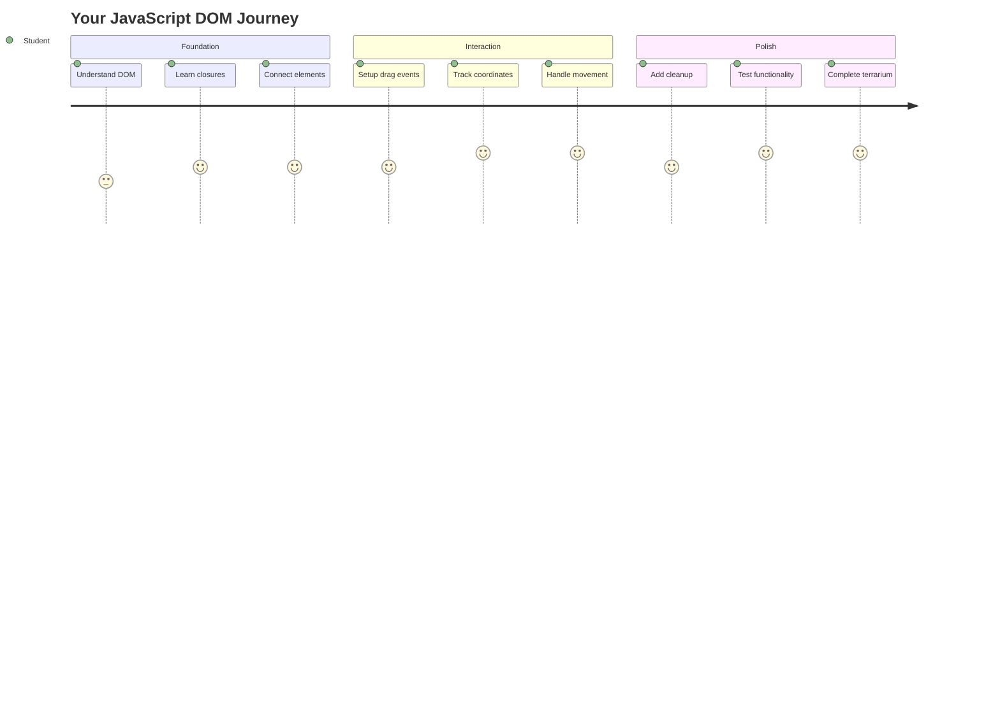
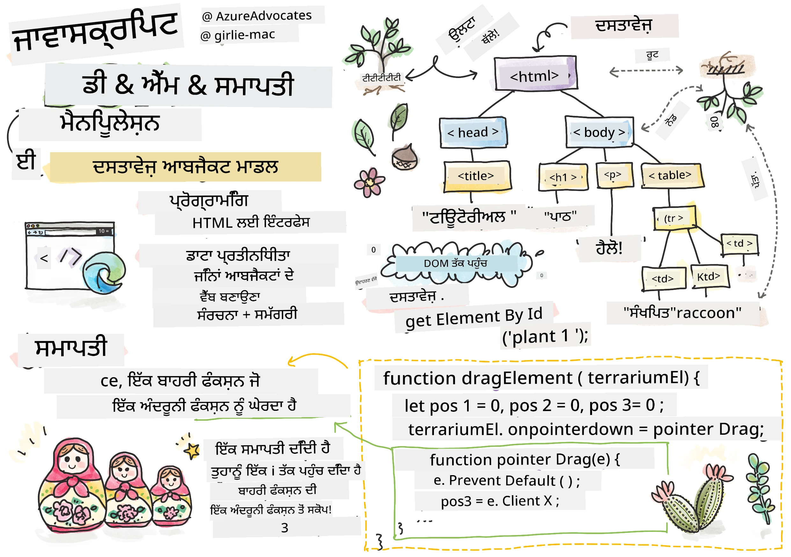
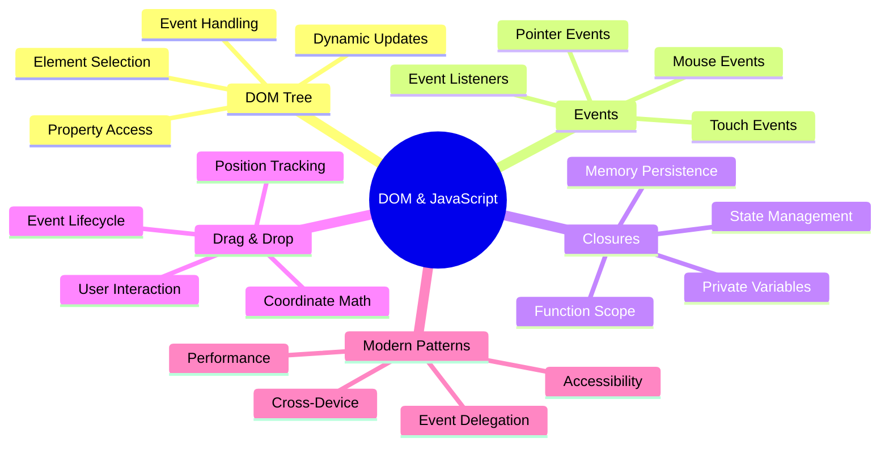
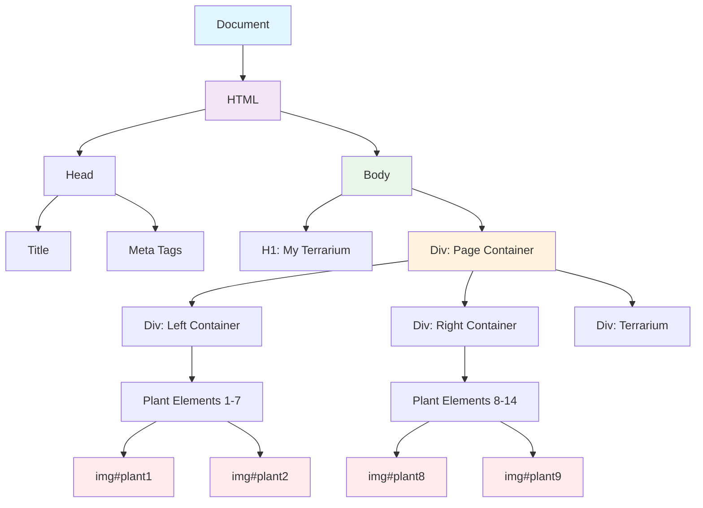
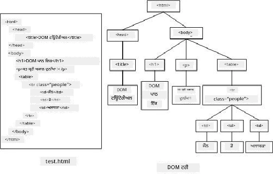
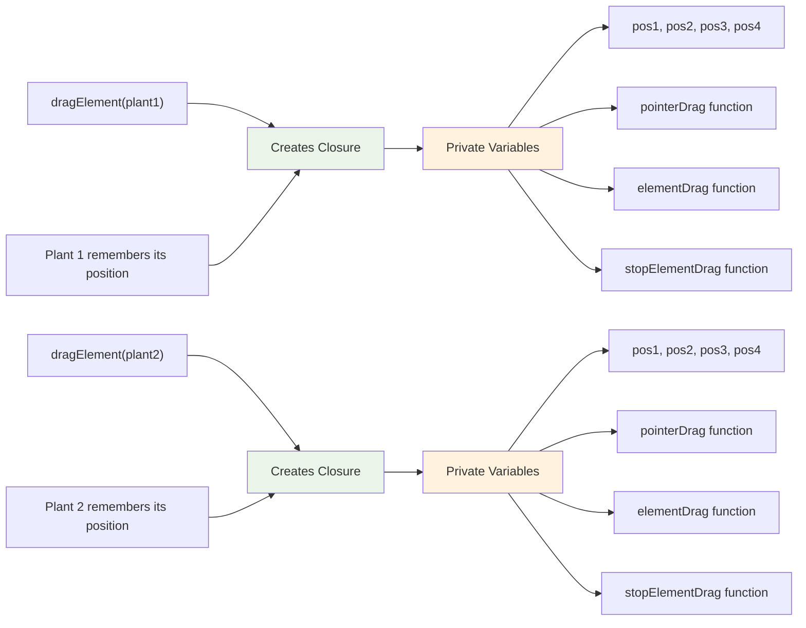
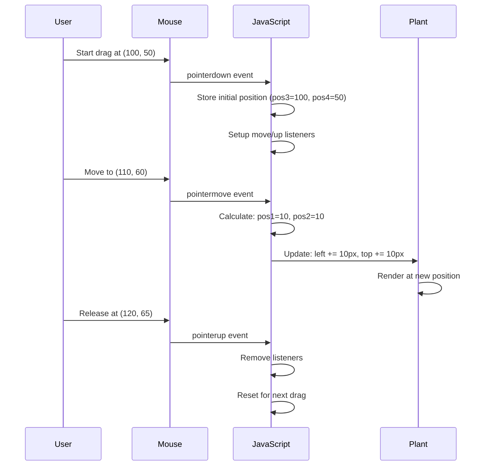
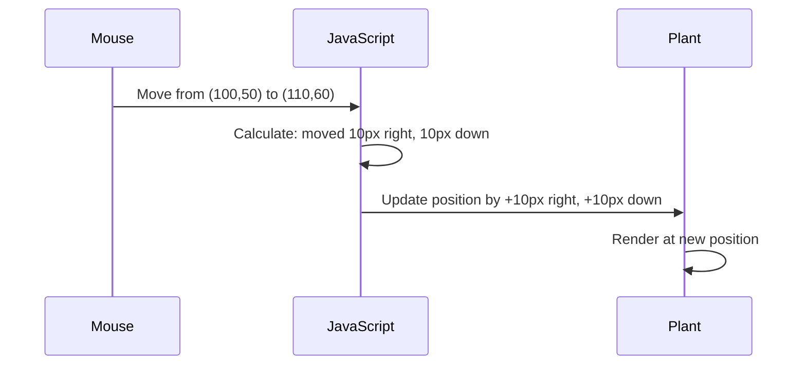
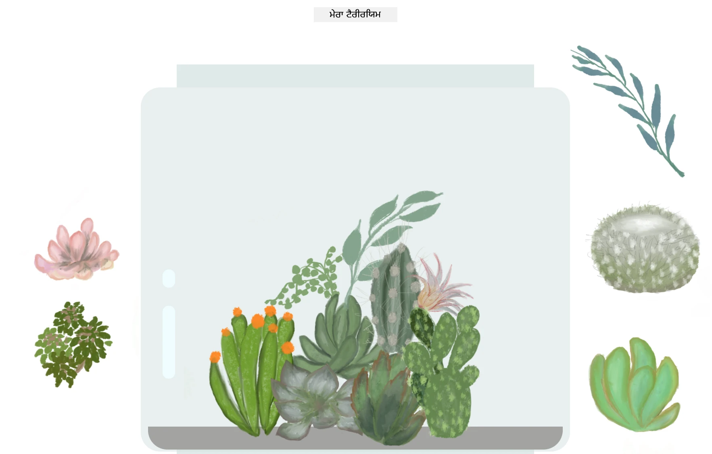

<!--
CO_OP_TRANSLATOR_METADATA:
{
  "original_hash": "973e48ad87d67bf5bb819746c9f8e302",
  "translation_date": "2025-11-03T16:30:51+00:00",
  "source_file": "3-terrarium/3-intro-to-DOM-and-closures/README.md",
  "language_code": "pa"
}
-->
# ਟੈਰੀਅਰੀਅਮ ਪ੍ਰੋਜੈਕਟ ਭਾਗ 3: DOM ਮੈਨਿਪੂਲੇਸ਼ਨ ਅਤੇ ਜਾਵਾਸਕ੍ਰਿਪਟ ਕਲੋਜ਼ਰਜ਼




> ਸਕੈਚਨੋਟ [ਟੋਮੋਮੀ ਇਮੁਰਾ](https://twitter.com/girlie_mac) ਦੁਆਰਾ

ਵੈੱਬ ਡਿਵੈਲਪਮੈਂਟ ਦੇ ਸਭ ਤੋਂ ਰੁਚਿਕਰ ਪਹਲੂਆਂ ਵਿੱਚ ਤੁਹਾਡਾ ਸਵਾਗਤ ਹੈ - ਚੀਜ਼ਾਂ ਨੂੰ ਇੰਟਰਐਕਟਿਵ ਬਣਾਉਣਾ! ਡੌਕਯੂਮੈਂਟ ਓਬਜੈਕਟ ਮਾਡਲ (DOM) ਤੁਹਾਡੇ HTML ਅਤੇ ਜਾਵਾਸਕ੍ਰਿਪਟ ਦੇ ਵਿਚਕਾਰ ਇੱਕ ਪੁਲ ਵਾਂਗ ਹੈ, ਅਤੇ ਅੱਜ ਅਸੀਂ ਇਸਨੂੰ ਤੁਹਾਡੇ ਟੈਰੀਅਰੀਅਮ ਨੂੰ ਜ਼ਿੰਦਾ ਕਰਨ ਲਈ ਵਰਤਾਂਗੇ। ਜਦੋਂ ਟਿਮ ਬਰਨਰਜ਼-ਲੀ ਨੇ ਪਹਿਲਾ ਵੈੱਬ ਬ੍ਰਾਊਜ਼ਰ ਬਣਾਇਆ, ਉਸਨੇ ਇੱਕ ਵੈੱਬ ਦੀ ਕਲਪਨਾ ਕੀਤੀ ਸੀ ਜਿੱਥੇ ਡੌਕਯੂਮੈਂਟ ਡਾਇਨਾਮਿਕ ਅਤੇ ਇੰਟਰਐਕਟਿਵ ਹੋ ਸਕਦੇ ਹਨ - DOM ਉਸ ਦ੍ਰਿਸ਼ਟੀਕੋਣ ਨੂੰ ਸੰਭਵ ਬਣਾਉਂਦਾ ਹੈ।

ਅਸੀਂ ਜਾਵਾਸਕ੍ਰਿਪਟ ਕਲੋਜ਼ਰਜ਼ ਦੀ ਵੀ ਖੋਜ ਕਰਾਂਗੇ, ਜੋ ਸ਼ੁਰੂ ਵਿੱਚ ਡਰਾਉਣੇ ਲੱਗ ਸਕਦੇ ਹਨ। ਕਲੋਜ਼ਰਜ਼ ਨੂੰ "ਯਾਦاشت ਦੀਆਂ ਜੇਬਾਂ" ਬਣਾਉਣ ਵਾਂਗ ਸੋਚੋ ਜਿੱਥੇ ਤੁਹਾਡੇ ਫੰਕਸ਼ਨ ਮਹੱਤਵਪੂਰਨ ਜਾਣਕਾਰੀ ਨੂੰ ਯਾਦ ਰੱਖ ਸਕਦੇ ਹਨ। ਇਹ ਇਸ ਵਾਂਗ ਹੈ ਕਿ ਤੁਹਾਡੇ ਟੈਰੀਅਰੀਅਮ ਵਿੱਚ ਹਰ ਪੌਦੇ ਦਾ ਆਪਣਾ ਡਾਟਾ ਰਿਕਾਰਡ ਹੈ ਜੋ ਇਸਦੀ ਸਥਿਤੀ ਨੂੰ ਟ੍ਰੈਕ ਕਰਦਾ ਹੈ। ਇਸ ਪਾਠ ਦੇ ਅੰਤ ਤੱਕ, ਤੁਸੀਂ ਸਮਝ ਜਾਵੋਗੇ ਕਿ ਇਹ ਕਿੰਨੇ ਕੁਦਰਤੀ ਅਤੇ ਲਾਭਦਾਇਕ ਹਨ।

ਇਹ ਹੈ ਜੋ ਅਸੀਂ ਬਣਾਉਣ ਜਾ ਰਹੇ ਹਾਂ: ਇੱਕ ਟੈਰੀਅਰੀਅਮ ਜਿੱਥੇ ਯੂਜ਼ਰ ਪੌਦਿਆਂ ਨੂੰ ਕਿਤੇ ਵੀ ਖਿੱਚ ਕੇ ਰੱਖ ਸਕਦੇ ਹਨ। ਤੁਸੀਂ DOM ਮੈਨਿਪੂਲੇਸ਼ਨ ਤਕਨੀਕਾਂ ਨੂੰ ਸਿੱਖੋਗੇ ਜੋ ਡ੍ਰੈਗ-ਐਂਡ-ਡ੍ਰੌਪ ਫਾਈਲ ਅੱਪਲੋਡ ਤੋਂ ਲੈ ਕੇ ਇੰਟਰਐਕਟਿਵ ਗੇਮਾਂ ਤੱਕ ਸਭ ਕੁਝ ਸੰਭਾਲਦੇ ਹਨ। ਆਓ ਤੁਹਾਡੇ ਟੈਰੀਅਰੀਅਮ ਨੂੰ ਜ਼ਿੰਦਾ ਕਰੀਏ।



## ਪੂਰਵ-ਵਿਦਿਆ ਪੜਾਅ ਕਵਿਜ਼

[ਪੂਰਵ-ਵਿਦਿਆ ਕਵਿਜ਼](https://ff-quizzes.netlify.app/web/quiz/19)

## DOM ਨੂੰ ਸਮਝਣਾ: ਇੰਟਰਐਕਟਿਵ ਵੈੱਬ ਪੇਜਾਂ ਲਈ ਤੁਹਾਡਾ ਗੇਟਵੇ

ਡੌਕਯੂਮੈਂਟ ਓਬਜੈਕਟ ਮਾਡਲ (DOM) ਇਹ ਹੈ ਕਿ ਜਾਵਾਸਕ੍ਰਿਪਟ ਤੁਹਾਡੇ HTML ਐਲੀਮੈਂਟਾਂ ਨਾਲ ਕਿਵੇਂ ਸੰਚਾਰ ਕਰਦਾ ਹੈ। ਜਦੋਂ ਤੁਹਾਡਾ ਬ੍ਰਾਊਜ਼ਰ ਇੱਕ HTML ਪੇਜ ਨੂੰ ਲੋਡ ਕਰਦਾ ਹੈ, ਇਹ ਉਸ ਪੇਜ ਦੀ ਇੱਕ ਸੰਰਚਿਤ ਪ੍ਰਤੀਨਿਧੀ ਯਾਦاشت ਵਿੱਚ ਬਣਾਉਂਦਾ ਹੈ - ਇਹ DOM ਹੈ। ਇਸਨੂੰ ਇੱਕ ਪਰਿਵਾਰਕ ਦਰਖਤ ਵਾਂਗ ਸੋਚੋ ਜਿੱਥੇ ਹਰ HTML ਐਲੀਮੈਂਟ ਇੱਕ ਪਰਿਵਾਰਕ ਮੈਂਬਰ ਹੈ ਜਿਸਨੂੰ ਜਾਵਾਸਕ੍ਰਿਪਟ ਪਹੁੰਚ, ਸੋਧ, ਜਾਂ ਦੁਬਾਰਾ ਵਿਵਸਥਿਤ ਕਰ ਸਕਦਾ ਹੈ।

DOM ਮੈਨਿਪੂਲੇਸ਼ਨ ਸਥਿਰ ਪੇਜਾਂ ਨੂੰ ਇੰਟਰਐਕਟਿਵ ਵੈੱਬਸਾਈਟਾਂ ਵਿੱਚ ਬਦਲ ਦਿੰਦਾ ਹੈ। ਹਰ ਵਾਰ ਜਦੋਂ ਤੁਸੀਂ ਇੱਕ ਬਟਨ ਨੂੰ ਹਵਰ ਕਰਨ 'ਤੇ ਰੰਗ ਬਦਲਦੇ ਹੋ, ਸਮੱਗਰੀ ਨੂੰ ਪੇਜ ਰੀਫ੍ਰੈਸ਼ ਤੋਂ ਬਿਨਾਂ ਅਪਡੇਟ ਕਰਦੇ ਹੋ, ਜਾਂ ਐਲੀਮੈਂਟਾਂ ਨੂੰ ਖਿੱਚਦੇ ਹੋ, ਇਹ DOM ਮੈਨਿਪੂਲੇਸ਼ਨ ਦਾ ਕੰਮ ਹੈ।





> DOM ਅਤੇ HTML ਮਾਰਕਅੱਪ ਦੀ ਪ੍ਰਤੀਨਿਧੀ ਜੋ ਇਸਨੂੰ ਦਰਸਾਉਂਦੀ ਹੈ। [ਓਲਫਾ ਨਸਰਾਊਈ](https://www.researchgate.net/publication/221417012_Profile-Based_Focused_Crawler_for_Social_Media-Sharing_Websites) ਤੋਂ

**ਇਹ ਹੈ ਜੋ DOM ਨੂੰ ਸ਼ਕਤੀਸ਼ਾਲੀ ਬਣਾਉਂਦਾ ਹੈ:**
- **ਪ੍ਰਦਾਨ ਕਰਦਾ ਹੈ** ਤੁਹਾਡੇ ਪੇਜ ਦੇ ਕਿਸੇ ਵੀ ਐਲੀਮੈਂਟ ਨੂੰ ਪਹੁੰਚ ਕਰਨ ਦਾ ਇੱਕ ਸੰਰਚਿਤ ਤਰੀਕਾ
- **ਸਮਰਥਨ ਕਰਦਾ ਹੈ** ਡਾਇਨਾਮਿਕ ਸਮੱਗਰੀ ਅਪਡੇਟ ਬਿਨਾਂ ਪੇਜ ਰੀਫ੍ਰੈਸ਼
- **ਸਮਰਥਨ ਕਰਦਾ ਹੈ** ਯੂਜ਼ਰ ਇੰਟਰਐਕਸ਼ਨ ਜਿਵੇਂ ਕਿ ਕਲਿਕ ਅਤੇ ਡ੍ਰੈਗ ਲਈ ਤੁਰੰਤ ਪ੍ਰਤੀਕ੍ਰਿਆ
- **ਨਿਰਮਾਣ ਕਰਦਾ ਹੈ** ਆਧੁਨਿਕ ਇੰਟਰਐਕਟਿਵ ਵੈੱਬ ਐਪਲੀਕੇਸ਼ਨਾਂ ਲਈ ਆਧਾਰ

## ਜਾਵਾਸਕ੍ਰਿਪਟ ਕਲੋਜ਼ਰਜ਼: ਸੰਗਠਿਤ, ਸ਼ਕਤੀਸ਼ਾਲੀ ਕੋਡ ਬਣਾਉਣਾ

ਇੱਕ [ਜਾਵਾਸਕ੍ਰਿਪਟ ਕਲੋਜ਼ਰ](https://developer.mozilla.org/docs/Web/JavaScript/Closures) ਇਹ ਹੈ ਕਿ ਇੱਕ ਫੰਕਸ਼ਨ ਨੂੰ ਆਪਣਾ ਨਿੱਜੀ ਵਰਕਸਪੇਸ ਦੇਣਾ ਜਿਸ ਵਿੱਚ ਸਥਾਈ ਯਾਦاشت ਹੁੰਦੀ ਹੈ। ਸੋਚੋ ਕਿ ਗਾਲਾਪਾਗੋਸ ਆਈਲੈਂਡਸ ਦੇ ਡਾਰਵਿਨ ਦੇ ਫਿੰਚਾਂ ਨੇ ਆਪਣੇ ਖਾਸ ਵਾਤਾਵਰਣ ਦੇ ਅਧਾਰ 'ਤੇ ਵਿਸ਼ੇਸ਼ ਬੀਕਾਂ ਵਿਕਸਿਤ ਕੀਤੀਆਂ - ਕਲੋਜ਼ਰਜ਼ ਇਸੇ ਤਰ੍ਹਾਂ ਕੰਮ ਕਰਦੇ ਹਨ, ਵਿਸ਼ੇਸ਼ ਫੰਕਸ਼ਨ ਬਣਾਉਂਦੇ ਹਨ ਜੋ ਆਪਣੇ ਖਾਸ ਸੰਦਰਭ ਨੂੰ "ਯਾਦ" ਰੱਖਦੇ ਹਨ ਭਾਵੇਂ ਉਹਨਾਂ ਦੇ ਪੇਰੈਂਟ ਫੰਕਸ਼ਨ ਨੇ ਆਪਣਾ ਕੰਮ ਮੁਕੰਮਲ ਕਰ ਲਿਆ ਹੋਵੇ।

ਸਾਡੇ ਟੈਰੀਅਰੀਅਮ ਵਿੱਚ, ਕਲੋਜ਼ਰਜ਼ ਹਰ ਪੌਦੇ ਨੂੰ ਆਪਣੀ ਸਥਿਤੀ ਨੂੰ ਅਜ਼ਾਦੀ ਨਾਲ ਯਾਦ ਰੱਖਣ ਵਿੱਚ ਮਦਦ ਕਰਦੇ ਹਨ। ਇਹ ਪੈਟਰਨ ਪੇਸ਼ੇਵਰ ਜਾਵਾਸਕ੍ਰਿਪਟ ਵਿਕਾਸ ਵਿੱਚ ਹਰ ਜਗ੍ਹਾ ਦਿਖਾਈ ਦਿੰਦਾ ਹੈ, ਜਿਸਨੂੰ ਸਮਝਣਾ ਇੱਕ ਮਹੱਤਵਪੂਰਨ ਧਾਰਨਾ ਹੈ।



> 💡 **ਕਲੋਜ਼ਰਜ਼ ਨੂੰ ਸਮਝਣਾ**: ਕਲੋਜ਼ਰਜ਼ ਜਾਵਾਸਕ੍ਰਿਪਟ ਵਿੱਚ ਇੱਕ ਮਹੱਤਵਪੂਰਨ ਵਿਸ਼ਾ ਹਨ, ਅਤੇ ਕਈ ਡਿਵੈਲਪਰ ਇਸਨੂੰ ਸਾਲਾਂ ਤੱਕ ਵਰਤਦੇ ਹਨ ਬਿਨਾਂ ਇਸਦੇ ਸਾਰੇ ਸਿਧਾਂਤਕ ਪਹਲੂਆਂ ਨੂੰ ਪੂਰੀ ਤਰ੍ਹਾਂ ਸਮਝਣ ਦੇ। ਅੱਜ, ਅਸੀਂ ਵਿਵਹਾਰਕ ਅਰਜ਼ੀ 'ਤੇ ਧਿਆਨ ਦੇ ਰਹੇ ਹਾਂ - ਤੁਸੀਂ ਦੇਖੋਗੇ ਕਿ ਕਲੋਜ਼ਰਜ਼ ਕੁਦਰਤੀ ਤੌਰ 'ਤੇ ਉਭਰਦੇ ਹਨ ਜਦੋਂ ਅਸੀਂ ਆਪਣੀਆਂ ਇੰਟਰਐਕਟਿਵ ਵਿਸ਼ੇਸ਼ਤਾਵਾਂ ਬਣਾਉਂਦੇ ਹਾਂ। ਸਮਝਣਾ ਵਿਕਸਿਤ ਹੋਵੇਗਾ ਜਦੋਂ ਤੁਸੀਂ ਦੇਖੋਗੇ ਕਿ ਇਹ ਅਸਲ ਸਮੱਸਿਆਵਾਂ ਨੂੰ ਕਿਵੇਂ ਹੱਲ ਕਰਦੇ ਹਨ।


> DOM ਅਤੇ HTML ਮਾਰਕਅੱਪ ਦੀ ਪ੍ਰਤੀਨਿਧੀ ਜੋ ਇਸਨੂੰ ਦਰਸਾਉਂਦੀ ਹੈ। [ਓਲਫਾ ਨਸਰਾਊਈ](https://www.researchgate.net/publication/221417012_Profile-Based_Focused_Crawler_for_Social_Media-Sharing_Websites) ਤੋਂ

ਇਸ ਪਾਠ ਵਿੱਚ, ਅਸੀਂ ਆਪਣਾ ਇੰਟਰਐਕਟਿਵ ਟੈਰੀਅਰੀਅਮ ਪ੍ਰੋਜੈਕਟ ਪੂਰਾ ਕਰਾਂਗੇ ਜਾਵਾਸਕ੍ਰਿਪਟ ਬਣਾਕੇ ਜੋ ਯੂਜ਼ਰ ਨੂੰ ਪੇਜ 'ਤੇ ਪੌਦਿਆਂ ਨੂੰ ਮੈਨਿਪੂਲੇਟ ਕਰਨ ਦੀ ਆਗਿਆ ਦੇਵੇਗਾ।

## ਸ਼ੁਰੂ ਕਰਨ ਤੋਂ ਪਹਿਲਾਂ: ਸਫਲਤਾ ਲਈ ਸੈਟਅਪ

ਤੁਹਾਨੂੰ ਪਿਛਲੇ ਟੈਰੀਅਰੀਅਮ ਪਾਠਾਂ ਤੋਂ ਆਪਣੇ HTML ਅਤੇ CSS ਫਾਈਲਾਂ ਦੀ ਲੋੜ ਹੋਵੇਗੀ - ਅਸੀਂ ਉਸ ਸਥਿਰ ਡਿਜ਼ਾਈਨ ਨੂੰ ਇੰਟਰਐਕਟਿਵ ਬਣਾਉਣ ਜਾ ਰਹੇ ਹਾਂ। ਜੇ ਤੁਸੀਂ ਪਹਿਲੀ ਵਾਰ ਸ਼ਾਮਲ ਹੋ ਰਹੇ ਹੋ, ਉਹ ਪਾਠ ਪੂਰੇ ਕਰਨਾ ਮਹੱਤਵਪੂਰਨ ਸੰਦਰਭ ਪ੍ਰਦਾਨ ਕਰੇਗਾ।

ਇਹ ਹੈ ਜੋ ਅਸੀਂ ਬਣਾਉਣ ਜਾ ਰਹੇ ਹਾਂ:
- **ਸਮਰਥ ਡ੍ਰੈਗ-ਐਂਡ-ਡ੍ਰੌਪ** ਸਾਰੇ ਟੈਰੀਅਰੀਅਮ ਪੌਦਿਆਂ ਲਈ
- **ਕੋਆਰਡੀਨੇਟ ਟ੍ਰੈਕਿੰਗ** ਤਾਂ ਜੋ ਪੌਦੇ ਆਪਣੀਆਂ ਸਥਿਤੀਆਂ ਨੂੰ ਯਾਦ ਰੱਖਣ
- **ਪੂਰੀ ਇੰਟਰਐਕਟਿਵ ਇੰਟਰਫੇਸ** ਵੈਨਿਲਾ ਜਾਵਾਸਕ੍ਰਿਪਟ ਦੀ ਵਰਤੋਂ ਕਰਕੇ
- **ਸਾਫ਼, ਸੰਗਠਿਤ ਕੋਡ** ਕਲੋਜ਼ਰ ਪੈਟਰਨ ਦੀ ਵਰਤੋਂ ਕਰਕੇ

## ਆਪਣੀ ਜਾਵਾਸਕ੍ਰਿਪਟ ਫਾਈਲ ਸੈਟਅਪ ਕਰਨਾ

ਆਓ ਜਾਵਾਸਕ੍ਰਿਪਟ ਫਾਈਲ ਬਣਾਈਏ ਜੋ ਤੁਹਾਡੇ ਟੈਰੀਅਰੀਅਮ ਨੂੰ ਇੰਟਰਐਕਟਿਵ ਬਣਾਏਗੀ।

**ਕਦਮ 1: ਆਪਣੀ ਸਕ੍ਰਿਪਟ ਫਾਈਲ ਬਣਾਓ**

ਆਪਣੇ ਟੈਰੀਅਰੀਅਮ ਫੋਲਡਰ ਵਿੱਚ, `script.js` ਨਾਮ ਦੀ ਇੱਕ ਨਵੀਂ ਫਾਈਲ ਬਣਾਓ।

**ਕਦਮ 2: ਜਾਵਾਸਕ੍ਰਿਪਟ ਨੂੰ ਆਪਣੇ HTML ਨਾਲ ਜੋੜੋ**

ਇਹ ਸਕ੍ਰਿਪਟ ਟੈਗ ਨੂੰ ਆਪਣੇ `index.html` ਫਾਈਲ ਦੇ `<head>` ਸੈਕਸ਼ਨ ਵਿੱਚ ਸ਼ਾਮਲ ਕਰੋ:

```html
<script src="./script.js" defer></script>
```

**ਕਿਉਂ `defer` ਐਟ੍ਰਿਬਿਊਟ ਮਹੱਤਵਪੂਰਨ ਹੈ:**
- **ਸੁਨਿਸ਼ਚਿਤ ਕਰਦਾ ਹੈ** ਤੁਹਾਡਾ ਜਾਵਾਸਕ੍ਰਿਪਟ ਸਾਰੇ HTML ਲੋਡ ਹੋਣ ਤੱਕ ਉਡੀਕ ਕਰਦਾ ਹੈ
- **ਰੋਕਦਾ ਹੈ** ਉਹ ਗਲਤੀਆਂ ਜਿੱਥੇ ਜਾਵਾਸਕ੍ਰਿਪਟ ਉਹ ਐਲੀਮੈਂਟਾਂ ਦੀ ਖੋਜ ਕਰਦਾ ਹੈ ਜੋ ਅਜੇ ਤਿਆਰ ਨਹੀਂ ਹਨ
- **ਗਰੰਟੀ ਕਰਦਾ ਹੈ** ਸਾਰੇ ਪੌਦੇ ਦੇ ਐਲੀਮੈਂਟ ਇੰਟਰਐਕਸ਼ਨ ਲਈ ਉਪਲਬਧ ਹਨ
- **ਪ੍ਰਦਾਨ ਕਰਦਾ ਹੈ** ਪੇਜ ਦੇ ਤਲ 'ਤੇ ਸਕ੍ਰਿਪਟਾਂ ਰੱਖਣ ਨਾਲੋਂ ਬਿਹਤਰ ਪ੍ਰਦਰਸ਼ਨ

> ⚠️ **ਮਹੱਤਵਪੂਰਨ ਨੋਟ**: `defer` ਐਟ੍ਰਿਬਿਊਟ ਆਮ ਸਮੇਂ ਦੇ ਮਸਲਿਆਂ ਨੂੰ ਰੋਕਦਾ ਹੈ। ਇਸਦੇ ਬਿਨਾਂ, ਜਾਵਾਸਕ੍ਰਿਪਟ HTML ਐਲੀਮੈਂਟਾਂ ਨੂੰ ਪਹੁੰਚਣ ਦੀ ਕੋਸ਼ਿਸ਼ ਕਰ ਸਕਦਾ ਹੈ ਜਦੋਂ ਉਹ ਲੋਡ ਨਹੀਂ ਹੋਏ ਹੁੰਦੇ, ਜਿਸ ਨਾਲ ਗਲਤੀਆਂ ਹੁੰਦੀਆਂ ਹਨ।

---

## ਜਾਵਾਸਕ੍ਰਿਪਟ ਨੂੰ ਤੁਹਾਡੇ HTML ਐਲੀਮੈਂਟਾਂ ਨਾਲ ਜੋੜਨਾ

ਇਹ ਯਕੀਨੀ ਬਣਾਉਣ ਤੋਂ ਪਹਿਲਾਂ ਕਿ ਐਲੀਮੈਂਟ ਡ੍ਰੈਗ ਕਰਨ ਯੋਗ ਹਨ, ਜਾਵਾਸਕ੍ਰਿਪਟ ਨੂੰ DOM ਵਿੱਚ ਉਹਨਾਂ ਨੂੰ ਲੱਭਣ ਦੀ ਲੋੜ ਹੈ। ਇਸਨੂੰ ਇੱਕ ਲਾਇਬ੍ਰੇਰੀ ਕੈਟਾਲੌਗਿੰਗ ਸਿਸਟਮ ਵਾਂਗ ਸੋਚੋ - ਜਦੋਂ ਤੁਹਾਡੇ ਕੋਲ ਕੈਟਾਲੌਗ ਨੰਬਰ ਹੁੰਦਾ ਹੈ, ਤੁਸੀਂ ਸਹੀ ਕਿਤਾਬ ਲੱਭ ਸਕਦੇ ਹੋ ਅਤੇ ਇਸਦੀ ਸਾਰੀ ਸਮੱਗਰੀ ਨੂੰ ਪਹੁੰਚ ਸਕਦੇ ਹੋ।

ਅਸੀਂ `document.getElementById()` ਵਿਧੀ ਦੀ ਵਰਤੋਂ ਕਰਾਂਗੇ ਇਹ ਕਨੈਕਸ਼ਨ ਬਣਾਉਣ ਲਈ। ਇਹ ਇੱਕ ਸਹੀ ਫਾਈਲਿੰਗ ਸਿਸਟਮ ਵਾਂਗ ਹੈ - ਤੁਸੀਂ ਇੱਕ ID ਪ੍ਰਦਾਨ ਕਰਦੇ ਹੋ, ਅਤੇ ਇਹ ਸਹੀ ਐਲੀਮੈਂਟ ਨੂੰ ਤੁਹਾਡੇ HTML ਵਿੱਚ ਲੱਭਦਾ ਹੈ।

### ਸਾਰੇ ਪੌਦਿਆਂ ਲਈ ਡ੍ਰੈਗ ਫੰਕਸ਼ਨਾਲਿਟੀ ਨੂੰ ਸਮਰਥ ਬਣਾਉਣਾ

ਇਹ ਕੋਡ ਆਪਣੇ `script.js` ਫਾਈਲ ਵਿੱਚ ਸ਼ਾਮਲ ਕਰੋ:

```javascript
// Enable drag functionality for all 14 plants
dragElement(document.getElementById('plant1'));
dragElement(document.getElementById('plant2'));
dragElement(document.getElementById('plant3'));
dragElement(document.getElementById('plant4'));
dragElement(document.getElementById('plant5'));
dragElement(document.getElementById('plant6'));
dragElement(document.getElementById('plant7'));
dragElement(document.getElementById('plant8'));
dragElement(document.getElementById('plant9'));
dragElement(document.getElementById('plant10'));
dragElement(document.getElementById('plant11'));
dragElement(document.getElementById('plant12'));
dragElement(document.getElementById('plant13'));
dragElement(document.getElementById('plant14'));
```

**ਇਹ ਕੋਡ ਕੀ ਪ੍ਰਾਪਤ ਕਰਦਾ ਹੈ:**
- **DOM ਵਿੱਚ** ਹਰ ਪੌਦੇ ਦੇ ਐਲੀਮੈਂਟ ਨੂੰ ਇਸਦੇ ਵਿਸ਼ੇਸ਼ ID ਦੀ ਵਰਤੋਂ ਕਰਕੇ ਲੱਭਦਾ ਹੈ
- **JavaScript ਰਿਫਰੈਂਸ** ਨੂੰ ਹਰ HTML ਐਲੀਮੈਂਟ ਲਈ ਪ੍ਰਾਪਤ ਕਰਦਾ ਹੈ
- **ਹਰ ਐਲੀਮੈਂਟ ਨੂੰ** `dragElement` ਫੰਕਸ਼ਨ (ਜਿਸਨੂੰ ਅਸੀਂ ਅਗਲੇ ਕਦਮ ਵਿੱਚ ਬਣਾਉਣ ਜਾ ਰਹੇ ਹਾਂ) ਵਿੱਚ ਪਾਸ ਕਰਦਾ ਹੈ
- **ਹਰ ਪੌਦੇ ਨੂੰ** ਡ੍ਰੈਗ-ਐਂਡ-ਡ੍ਰੌਪ ਇੰਟਰਐਕਸ਼ਨ ਲਈ ਤਿਆਰ ਕਰਦਾ ਹੈ
- **ਤੁਹਾਡੇ HTML ਸੰਰਚਨਾ ਨੂੰ** ਜਾਵਾਸਕ੍ਰਿਪਟ ਫੰਕਸ਼ਨਾਲਿਟੀ ਨਾਲ ਜੋੜਦਾ ਹੈ

> 🎯 **ਕਿਉਂ ID ਦੀ ਵਰਤੋਂ ਕਰਦੇ ਹਾਂ ਕਲਾਸਾਂ ਦੀ ਬਜਾਏ?** ID ਵਿਸ਼ੇਸ਼ ਐਲੀਮੈਂਟਾਂ ਲਈ ਵਿਸ਼ੇਸ਼ ਪਛਾਣਕਰਤਾ ਪ੍ਰਦਾਨ ਕਰਦੇ ਹਨ, ਜਦੋਂ ਕਿ CSS ਕਲਾਸਾਂ ਸਮੂਹਾਂ ਦੇ ਐਲੀਮੈਂਟਾਂ ਨੂੰ ਸਟਾਈਲ ਕਰਨ ਲਈ ਬਣਾਈਆਂ ਗਈਆਂ ਹਨ। ਜਦੋਂ ਜਾਵਾਸਕ੍ਰਿਪਟ ਨੂੰ ਵਿਸ਼ੇਸ਼ ਐਲੀਮੈਂਟਾਂ ਨੂੰ ਮੈਨਿਪੂਲੇਟ ਕਰਨ ਦੀ ਲੋੜ ਹੁੰਦੀ ਹੈ, ID ਸਾਨੂੰ ਜ਼ਰੂਰੀ ਸਹੀਤਾ ਅਤੇ ਪ੍ਰਦਰਸ਼ਨ ਪ੍ਰਦਾਨ ਕਰਦੇ ਹਨ।

> 💡 **ਪ੍ਰੋ ਟਿਪ**: ਧਿਆਨ ਦਿਓ ਕਿ ਅਸੀਂ ਹਰ ਪੌਦੇ ਲਈ ਵਿਅਕਤੀਗਤ ਤੌਰ 'ਤੇ `dragElement()` ਨੂੰ ਕਾਲ ਕਰ ਰਹੇ ਹਾਂ। ਇਹ ਪਹੁੰਚ ਇਹ ਯਕੀਨੀ ਬਣਾਉਂਦੀ ਹੈ ਕਿ ਹਰ ਪੌਦੇ ਨੂੰ ਆਪਣਾ ਅਜ਼ਾਦ ਡ੍ਰੈਗਿੰਗ ਵਿਵਹਾਰ ਮਿਲਦਾ ਹੈ, ਜੋ ਸਹੀ ਯੂਜ਼ਰ ਇੰਟਰਐਕਸ਼ਨ ਲਈ ਮਹੱਤਵਪੂਰਨ ਹੈ।

### 🔄 **ਪੈਡਾਗੌਜੀਕਲ ਚੈੱਕ-ਇਨ**
**DOM ਕਨੈਕਸ਼ਨ ਸਮਝਣਾ**: ਡ੍ਰੈਗ ਫੰਕਸ਼ਨਾਲਿਟੀ ਵੱਲ ਜਾਣ ਤੋਂ ਪਹਿਲਾਂ, ਯਕੀਨੀ ਬਣਾਓ ਕਿ ਤੁਸੀਂ ਸਮਝ ਸਕਦੇ ਹੋ:
- ✅ `document.getElementById()` HTML ਐਲੀਮੈਂਟਾਂ ਨੂੰ ਕਿਵੇਂ ਲੱਭਦਾ ਹੈ
- ✅ ਅਸੀਂ ਹਰ ਪੌਦੇ ਲਈ ਵਿਸ਼ੇਸ਼ ID ਕਿਉਂ ਵਰਤਦੇ ਹਾਂ
- ✅ `defer` ਐਟ੍ਰਿਬਿਊਟ ਦਾ ਸਕ੍ਰਿਪਟ ਟੈਗ ਵਿੱਚ ਉਦੇਸ਼ ਕੀ ਹੈ
- ✅ ਜਾਵਾਸਕ੍ਰਿਪਟ ਅਤੇ HTML DOM ਰਾਹੀਂ ਕਿਵੇਂ ਜੁੜਦੇ ਹਨ

**ਤੁਰੰਤ ਸਵੈ-ਟੈਸਟ**: ਕੀ ਹੋਵੇਗਾ ਜੇ ਦੋ ਐਲੀਮੈਂਟਾਂ ਦੇ ਇੱਕੋ ਜਿਹੇ ID ਹੋਣ? ਕਿਉਂ `getElementById()` ਸਿਰਫ ਇੱਕ ਐਲੀਮੈਂਟ ਨੂੰ ਵਾਪਸ ਕਰਦਾ ਹੈ?
*ਜਵਾਬ: ID ਵਿਸ਼ੇਸ਼ ਹੋਣੇ ਚਾਹੀਦੇ ਹਨ; ਜੇ ਦੁਹਰਾਏ ਗਏ, ਸਿਰਫ ਪਹਿਲਾ ਐਲੀਮੈਂਟ ਵਾਪਸ ਕੀਤਾ ਜਾਂਦਾ ਹੈ*

---

## ਡ੍ਰੈਗ ਐਲੀਮੈਂਟ ਕਲੋਜ਼ਰ ਬਣਾਉਣਾ

ਹੁਣ ਅਸੀਂ ਆਪਣੀ ਡ੍ਰੈਗਿੰਗ ਵਿਵਹਾਰ ਦੀ ਮੂਲ ਭਾਗ ਬਣਾਉਣ ਜਾ ਰਹੇ ਹਾਂ: ਇੱਕ ਕਲੋਜ਼ਰ ਜੋ ਹਰ ਪੌਦੇ ਲਈ ਡ੍ਰੈਗਿੰਗ ਵਿਵਹਾਰ ਨੂੰ ਸੰਭਾਲਦਾ ਹੈ। ਇਹ ਕਲੋਜ਼ਰ ਕਈ ਅੰਦਰੂਨੀ ਫੰਕਸ਼ਨਾਂ ਨੂੰ ਸ਼ਾਮਲ ਕਰੇਗਾ ਜੋ ਮਾਊਸ ਦੀ ਚਲਹ-ਚਲਹ ਨੂੰ ਟ੍ਰੈਕ ਕਰਨ ਅਤੇ ਐਲੀਮੈਂਟ ਸਥਿਤੀਆਂ ਨੂੰ ਅਪਡੇਟ ਕਰਨ ਲਈ ਇਕੱਠੇ ਕੰਮ ਕਰਦੇ ਹਨ।

ਕਲੋਜ਼ਰਜ਼ ਇਸ ਕੰਮ ਲਈ ਬਹੁਤ ਹੀ ਵਧੀਆ ਹਨ ਕਿਉਂਕਿ ਇਹ ਸਾਨੂੰ "ਨਿੱਜੀ" ਵੈਰੀਏਬਲ ਬਣਾਉਣ ਦੀ ਆਗਿਆ ਦਿੰਦੇ ਹਨ ਜੋ ਫੰਕਸ਼ਨ ਕਾਲਾਂ ਦੇ ਵਿਚਕਾਰ ਸਥਾਈ ਰਹਿੰਦੇ ਹਨ, ਹਰ ਪੌਦੇ ਲਈ ਆਪਣਾ ਅਜ਼ਾਦ ਕੋਆਰਡੀਨੇਟ ਟ੍ਰੈਕਿੰਗ ਸਿਸਟਮ ਬਣਾਉਂਦੇ ਹਨ।

### ਇੱਕ ਸਧਾਰਨ ਉਦਾਹਰਨ ਨਾਲ ਕਲੋਜ਼ਰਜ਼ ਨੂੰ ਸਮ
**ਇਹ ਕੋਆਰਡੀਨੇਟਸ ਨੂੰ ਸਮਝਣਾ:**
- **ਪੇਸ਼ ਕਰਦਾ ਹੈ** ਪਿਕਸਲ-ਪਰਫੈਕਟ ਪੋਜ਼ੀਸ਼ਨ ਜਾਣਕਾਰੀ
- **ਤੁਰੰਤ ਅਪਡੇਟ ਹੁੰਦਾ ਹੈ** ਜਦੋਂ ਯੂਜ਼ਰ ਆਪਣਾ ਪੌਇੰਟਰ ਹਿਲਾਉਂਦਾ ਹੈ
- **ਸਥਿਰ ਰਹਿੰਦਾ ਹੈ** ਵੱਖ-ਵੱਖ ਸਕ੍ਰੀਨ ਸਾਈਜ਼ ਅਤੇ ਜ਼ੂਮ ਲੈਵਲ 'ਤੇ
- **ਸਮਰਥਨ ਕਰਦਾ ਹੈ** ਹੌਲੀ, ਪ੍ਰਤੀਕ੍ਰਿਆਸ਼ੀਲ ਡਰੈਗ ਇੰਟਰੈਕਸ਼ਨ

### ਡੌਕੂਮੈਂਟ-ਲੈਵਲ ਇਵੈਂਟ ਲਿਸਨਰ ਸੈਟਅਪ ਕਰਨਾ

ਨੋਟ ਕਰੋ ਕਿ ਅਸੀਂ ਮੂਵ ਅਤੇ ਸਟਾਪ ਇਵੈਂਟਸ ਨੂੰ ਸਿਰਫ਼ ਪੌਦੇ ਦੇ ਐਲੀਮੈਂਟ ਨਹੀਂ, ਸਗੋਂ ਪੂਰੇ `document` ਨਾਲ ਜੁੜਦੇ ਹਾਂ:

```javascript
document.onpointermove = elementDrag;
document.onpointerup = stopElementDrag;
```

**ਡੌਕੂਮੈਂਟ ਨਾਲ ਜੁੜਨ ਦਾ ਕਾਰਨ:**
- **ਟ੍ਰੈਕ ਕਰਦਾ ਹੈ** ਜਦੋਂ ਮਾਊਸ ਪੌਦੇ ਦੇ ਐਲੀਮੈਂਟ ਤੋਂ ਬਾਹਰ ਚਲਾ ਜਾਂਦਾ ਹੈ
- **ਰੋਕਦਾ ਹੈ** ਡਰੈਗ ਵਿੱਚ ਰੁਕਾਵਟ ਜੇ ਯੂਜ਼ਰ ਤੇਜ਼ੀ ਨਾਲ ਹਿਲਦਾ ਹੈ
- **ਪੇਸ਼ ਕਰਦਾ ਹੈ** ਪੂਰੀ ਸਕ੍ਰੀਨ 'ਤੇ ਹੌਲੀ ਡਰੈਗਿੰਗ
- **ਹੈਂਡਲ ਕਰਦਾ ਹੈ** ਐਜ ਕੇਸ ਜਿੱਥੇ ਕਰਸਰ ਬ੍ਰਾਊਜ਼ਰ ਵਿੰਡੋ ਤੋਂ ਬਾਹਰ ਚਲਾ ਜਾਂਦਾ ਹੈ

> ⚡ **ਪਰਫਾਰਮੈਂਸ ਨੋਟ**: ਅਸੀਂ ਡਰੈਗਿੰਗ ਰੁਕਣ 'ਤੇ ਇਨ੍ਹਾਂ ਡੌਕੂਮੈਂਟ-ਲੈਵਲ ਲਿਸਨਰਾਂ ਨੂੰ ਸਾਫ਼ ਕਰਾਂਗੇ ਤਾਂ ਜੋ ਮੈਮੋਰੀ ਲੀਕ ਅਤੇ ਪਰਫਾਰਮੈਂਸ ਸਮੱਸਿਆਵਾਂ ਤੋਂ ਬਚਿਆ ਜਾ ਸਕੇ।

## ਡਰੈਗ ਸਿਸਟਮ ਪੂਰਾ ਕਰਨਾ: ਮੂਵਮੈਂਟ ਅਤੇ ਕਲੀਨਅਪ

ਹੁਣ ਅਸੀਂ ਦੋ ਬਾਕੀ ਫੰਕਸ਼ਨ ਜੋੜਾਂਗੇ ਜੋ ਅਸਲ ਡਰੈਗਿੰਗ ਮੂਵਮੈਂਟ ਅਤੇ ਡਰੈਗਿੰਗ ਰੁਕਣ 'ਤੇ ਕਲੀਨਅਪ ਨੂੰ ਸੰਭਾਲਦੇ ਹਨ। ਇਹ ਫੰਕਸ਼ਨ ਇਕੱਠੇ ਕੰਮ ਕਰਦੇ ਹਨ ਤਾਂ ਜੋ ਤੁਹਾਡੇ ਟੈਰੀਰੀਅਮ ਵਿੱਚ ਪੌਦੇ ਦੀ ਹੌਲੀ, ਪ੍ਰਤੀਕ੍ਰਿਆਸ਼ੀਲ ਮੂਵਮੈਂਟ ਬਣਾਈ ਜਾ ਸਕੇ।

### `elementDrag` ਫੰਕਸ਼ਨ: ਮੂਵਮੈਂਟ ਟ੍ਰੈਕ ਕਰਨਾ

`pointerDrag` ਦੇ ਬੰਦ ਕਰਲੀ ਬ੍ਰੈਕਟ ਤੋਂ ਬਾਅਦ `elementDrag` ਫੰਕਸ਼ਨ ਸ਼ਾਮਲ ਕਰੋ:

```javascript
function elementDrag(e) {
    // Calculate the distance moved since the last event
    pos1 = pos3 - e.clientX;  // Horizontal distance moved
    pos2 = pos4 - e.clientY;  // Vertical distance moved
    
    // Update the current position tracking
    pos3 = e.clientX;  // New current X position
    pos4 = e.clientY;  // New current Y position
    
    // Apply the movement to the element's position
    terrariumElement.style.top = (terrariumElement.offsetTop - pos2) + 'px';
    terrariumElement.style.left = (terrariumElement.offsetLeft - pos1) + 'px';
}
```

**ਕੋਆਰਡੀਨੇਟ ਗਣਿਤ ਨੂੰ ਸਮਝਣਾ:**
- **`pos1` ਅਤੇ `pos2`**: ਗਣਨਾ ਕਰਦਾ ਹੈ ਕਿ ਪਿਛਲੇ ਅਪਡੇਟ ਤੋਂ ਬਾਅਦ ਮਾਊਸ ਕਿੰਨਾ ਹਿਲਿਆ ਹੈ
- **`pos3` ਅਤੇ `pos4`**: ਅਗਲੀ ਗਣਨਾ ਲਈ ਮੌਜੂਦਾ ਮਾਊਸ ਪੋਜ਼ੀਸ਼ਨ ਸਟੋਰ ਕਰਦਾ ਹੈ
- **`offsetTop` ਅਤੇ `offsetLeft`**: ਪੇਜ 'ਤੇ ਐਲੀਮੈਂਟ ਦੀ ਮੌਜੂਦਾ ਪੋਜ਼ੀਸ਼ਨ ਪ੍ਰਾਪਤ ਕਰਦਾ ਹੈ
- **ਘਟਾਓ ਲਾਜਿਕ**: ਐਲੀਮੈਂਟ ਨੂੰ ਉਨ੍ਹਾਂ ਹੀ ਮਾਤਰਾ ਨਾਲ ਹਿਲਾਉਂਦਾ ਹੈ ਜਿੰਨਾ ਮਾਊਸ ਹਿਲਿਆ



**ਇਹ ਹੈ ਮੂਵਮੈਂਟ ਗਣਨਾ ਦਾ ਵਿਸਥਾਰ:**
1. **ਮਾਪਦਾ ਹੈ** ਪੁਰਾਣੇ ਅਤੇ ਨਵੇਂ ਮਾਊਸ ਪੋਜ਼ੀਸ਼ਨ ਦੇ ਵਿਚਕਾਰ ਅੰਤਰ
2. **ਗਣਨਾ ਕਰਦਾ ਹੈ** ਕਿ ਮਾਊਸ ਮੂਵਮੈਂਟ ਦੇ ਅਧਾਰ 'ਤੇ ਐਲੀਮੈਂਟ ਨੂੰ ਕਿੰਨਾ ਹਿਲਾਉਣਾ ਹੈ
3. **ਅਪਡੇਟ ਕਰਦਾ ਹੈ** ਐਲੀਮੈਂਟ ਦੇ CSS ਪੋਜ਼ੀਸ਼ਨ ਪ੍ਰਾਪਰਟੀਜ਼ ਨੂੰ ਤੁਰੰਤ
4. **ਨਵਾਂ ਪੋਜ਼ੀਸ਼ਨ ਸਟੋਰ ਕਰਦਾ ਹੈ** ਅਗਲੀ ਮੂਵਮੈਂਟ ਗਣਨਾ ਲਈ ਬੇਸਲਾਈਨ ਵਜੋਂ

### ਗਣਿਤ ਦੀ ਵਿਜ਼ੁਅਲ ਪ੍ਰਸਤੁਤੀ



### `stopElementDrag` ਫੰਕਸ਼ਨ: ਕਲੀਨਅਪ

`elementDrag` ਦੇ ਬੰਦ ਕਰਲੀ ਬ੍ਰੈਕਟ ਤੋਂ ਬਾਅਦ ਕਲੀਨਅਪ ਫੰਕਸ਼ਨ ਸ਼ਾਮਲ ਕਰੋ:

```javascript
function stopElementDrag() {
    // Remove the document-level event listeners
    document.onpointerup = null;
    document.onpointermove = null;
}
```

**ਕਲੀਨਅਪ ਕਿਉਂ ਜ਼ਰੂਰੀ ਹੈ:**
- **ਰੋਕਦਾ ਹੈ** ਮੈਮੋਰੀ ਲੀਕਸ ਜੋ ਲੰਬੇ ਸਮੇਂ ਤੱਕ ਚੱਲਦੇ ਇਵੈਂਟ ਲਿਸਨਰਾਂ ਤੋਂ ਹੁੰਦੇ ਹਨ
- **ਡਰੈਗਿੰਗ ਬਿਹੇਵਿਅਰ ਨੂੰ ਰੋਕਦਾ ਹੈ** ਜਦੋਂ ਯੂਜ਼ਰ ਪੌਦੇ ਨੂੰ ਛੱਡਦਾ ਹੈ
- **ਦੂਜੇ ਐਲੀਮੈਂਟਸ ਨੂੰ ਅਜ਼ਾਦੀ ਦਿੰਦਾ ਹੈ** ਡਰੈਗ ਕਰਨ ਲਈ
- **ਅਗਲੇ ਡਰੈਗ ਓਪਰੇਸ਼ਨ ਲਈ ਸਿਸਟਮ ਨੂੰ ਰੀਸੈਟ ਕਰਦਾ ਹੈ**

**ਕਲੀਨਅਪ ਨਾ ਕਰਨ 'ਤੇ ਕੀ ਹੁੰਦਾ ਹੈ:**
- ਇਵੈਂਟ ਲਿਸਨਰ ਡਰੈਗਿੰਗ ਰੁਕਣ ਤੋਂ ਬਾਅਦ ਵੀ ਚੱਲਦੇ ਰਹਿੰਦੇ ਹਨ
- ਪਰਫਾਰਮੈਂਸ ਘਟਦਾ ਹੈ ਜਦੋਂ ਬੇਕਾਰ ਲਿਸਨਰ ਜਮ੍ਹਾਂ ਹੁੰਦੇ ਹਨ
- ਦੂਜੇ ਐਲੀਮੈਂਟਸ ਨਾਲ ਇੰਟਰੈਕਟ ਕਰਨ 'ਤੇ ਅਣਪ੍ਰਤੀਕਰਮਾਤਮਕ ਵਿਹਾਰ ਹੁੰਦਾ ਹੈ
- ਬ੍ਰਾਊਜ਼ਰ ਸਰੋਤਾਂ ਬੇਕਾਰ ਇਵੈਂਟ ਹੈਂਡਲਿੰਗ 'ਤੇ ਖਰਚ ਹੁੰਦੇ ਹਨ

### CSS ਪੋਜ਼ੀਸ਼ਨ ਪ੍ਰਾਪਰਟੀਜ਼ ਨੂੰ ਸਮਝਣਾ

ਸਾਡਾ ਡਰੈਗਿੰਗ ਸਿਸਟਮ ਦੋ ਮੁੱਖ CSS ਪ੍ਰਾਪਰਟੀਜ਼ ਨੂੰ ਮੈਨਿਪੁਲੇਟ ਕਰਦਾ ਹੈ:

| ਪ੍ਰਾਪਰਟੀ | ਇਹ ਕੀ ਕੰਟਰੋਲ ਕਰਦਾ ਹੈ | ਅਸੀਂ ਇਸਨੂੰ ਕਿਵੇਂ ਵਰਤਦੇ ਹਾਂ |
|----------|------------------|---------------|
| `top` | ਉੱਪਰਲੇ ਕਿਨਾਰੇ ਤੋਂ ਦੂਰੀ | ਡਰੈਗ ਦੌਰਾਨ ਵਰਟੀਕਲ ਪੋਜ਼ੀਸ਼ਨ |
| `left` | ਖੱਬੇ ਕਿਨਾਰੇ ਤੋਂ ਦੂਰੀ | ਡਰੈਗ ਦੌਰਾਨ ਹੋਰਿਜ਼ੋਂਟਲ ਪੋਜ਼ੀਸ਼ਨ |

**ਆਫਸੈਟ ਪ੍ਰਾਪਰਟੀਜ਼ ਬਾਰੇ ਮੁੱਖ ਜਾਣਕਾਰੀ:**
- **`offsetTop`**: ਪੋਜ਼ੀਸ਼ਨਡ ਪੇਰੈਂਟ ਐਲੀਮੈਂਟ ਤੋਂ ਮੌਜੂਦਾ ਦੂਰੀ
- **`offsetLeft`**: ਪੋਜ਼ੀਸ਼ਨਡ ਪੇਰੈਂਟ ਐਲੀਮੈਂਟ ਤੋਂ ਮੌਜੂਦਾ ਦੂਰੀ
- **ਪੋਜ਼ੀਸ਼ਨਿੰਗ ਸੰਦਰਭ**: ਇਹ ਮੁੱਲ ਸਭ ਤੋਂ ਨੇੜਲੇ ਪੋਜ਼ੀਸ਼ਨਡ ਐਨਸੈਸਟਰ ਦੇ ਸਬੰਧ ਵਿੱਚ ਹੁੰਦੇ ਹਨ
- **ਤੁਰੰਤ ਅਪਡੇਟਸ**: CSS ਪ੍ਰਾਪਰਟੀਜ਼ ਨੂੰ ਮੋਡੀਫਾਈ ਕਰਨ 'ਤੇ ਤੁਰੰਤ ਬਦਲ ਜਾਂਦੇ ਹਨ

> 🎯 **ਡਿਜ਼ਾਈਨ ਫਿਲਾਸਫੀ**: ਇਹ ਡਰੈਗ ਸਿਸਟਮ ਜ਼ਿਆਦਾਤਰ ਲਚਕਦਾਰ ਹੈ – ਕੋਈ "ਡ੍ਰਾਪ ਜ਼ੋਨ" ਜਾਂ ਪਾਬੰਦੀਆਂ ਨਹੀਂ ਹਨ। ਯੂਜ਼ਰ ਪੌਦੇ ਨੂੰ ਕਿਤੇ ਵੀ ਰੱਖ ਸਕਦੇ ਹਨ, ਉਹਨਾਂ ਨੂੰ ਆਪਣੇ ਟੈਰੀਰੀਅਮ ਡਿਜ਼ਾਈਨ 'ਤੇ ਪੂਰਾ ਰਚਨਾਤਮਕ ਕੰਟਰੋਲ ਦਿੰਦੇ ਹਨ।

## ਸਾਰਾ ਸਿਸਟਮ ਇਕੱਠਾ ਕਰਨਾ: ਤੁਹਾਡਾ ਪੂਰਾ ਡਰੈਗ ਸਿਸਟਮ

ਵਧਾਈ! ਤੁਸੀਂ ਵੈਨਿਲਾ ਜਾਵਾਸਕ੍ਰਿਪਟ ਦੀ ਵਰਤੋਂ ਕਰਕੇ ਇੱਕ ਸੁਧਾਰਤ ਡਰੈਗ-ਐਂਡ-ਡਰੌਪ ਸਿਸਟਮ ਬਣਾਇਆ ਹੈ। ਤੁਹਾਡਾ ਪੂਰਾ `dragElement` ਫੰਕਸ਼ਨ ਹੁਣ ਇੱਕ ਸ਼ਕਤੀਸ਼ਾਲੀ ਕਲੋਜ਼ਰ ਸ਼ਾਮਲ ਕਰਦਾ ਹੈ ਜੋ ਸੰਭਾਲਦਾ ਹੈ:

**ਤੁਹਾਡਾ ਕਲੋਜ਼ਰ ਕੀ ਪ੍ਰਾਪਤ ਕਰਦਾ ਹੈ:**
- **ਪ੍ਰਾਈਵੇਟ ਪੋਜ਼ੀਸ਼ਨ ਵੈਰੀਏਬਲਸ ਨੂੰ ਰੱਖਦਾ ਹੈ** ਹਰ ਪੌਦੇ ਲਈ ਅਜ਼ਾਦੀ ਨਾਲ
- **ਪੂਰਾ ਡਰੈਗ ਲਾਈਫਸਾਈਕਲ ਸੰਭਾਲਦਾ ਹੈ** ਸ਼ੁਰੂ ਤੋਂ ਅੰਤ ਤੱਕ
- **ਪੂਰੀ ਸਕ੍ਰੀਨ 'ਤੇ ਹੌਲੀ, ਪ੍ਰਤੀਕ੍ਰਿਆਸ਼ੀਲ ਮੂਵਮੈਂਟ ਪ੍ਰਦਾਨ ਕਰਦਾ ਹੈ**
- **ਸਰੋਤਾਂ ਨੂੰ ਸਹੀ ਤਰੀਕੇ ਨਾਲ ਸਾਫ਼ ਕਰਦਾ ਹੈ** ਮੈਮੋਰੀ ਲੀਕਸ ਤੋਂ ਬਚਣ ਲਈ
- **ਟੈਰੀਰੀਅਮ ਡਿਜ਼ਾਈਨ ਲਈ ਇੱਕ ਬੁੱਧੀਮਾਨ, ਰਚਨਾਤਮਕ ਇੰਟਰਫੇਸ ਬਣਾਉਂਦਾ ਹੈ**

### ਤੁਹਾਡੇ ਇੰਟਰਐਕਟਿਵ ਟੈਰੀਰੀਅਮ ਦੀ ਜਾਂਚ ਕਰਨਾ

ਹੁਣ ਆਪਣੇ ਇੰਟਰਐਕਟਿਵ ਟੈਰੀਰੀਅਮ ਦੀ ਜਾਂਚ ਕਰੋ! ਆਪਣੀ `index.html` ਫਾਈਲ ਨੂੰ ਵੈਬ ਬ੍ਰਾਊਜ਼ਰ ਵਿੱਚ ਖੋਲ੍ਹੋ ਅਤੇ ਫੰਕਸ਼ਨਲਿਟੀ ਦੀ ਕੋਸ਼ਿਸ਼ ਕਰੋ:

1. **ਕਲਿੱਕ ਕਰੋ ਅਤੇ ਰੱਖੋ** ਕਿਸੇ ਵੀ ਪੌਦੇ ਨੂੰ ਡਰੈਗਿੰਗ ਸ਼ੁਰੂ ਕਰਨ ਲਈ
2. **ਆਪਣਾ ਮਾਊਸ ਜਾਂ ਉਂਗਲ ਹਿਲਾਓ** ਅਤੇ ਪੌਦੇ ਨੂੰ ਹੌਲੀ ਹੌਲੀ ਪਿਛੇ ਲਗਦੇ ਦੇਖੋ
3. **ਛੱਡੋ** ਪੌਦੇ ਨੂੰ ਉਸਦੇ ਨਵੇਂ ਸਥਾਨ 'ਤੇ ਡਰੌਪ ਕਰਨ ਲਈ
4. **ਵੱਖ-ਵੱਖ ਵਿਵਸਥਾਵਾਂ ਨਾਲ ਅਨੁਭਵ ਕਰੋ** ਇੰਟਰਫੇਸ ਦੀ ਪੜਚੋਲ ਕਰਨ ਲਈ

🥇 **ਸਫਲਤਾ**: ਤੁਸੀਂ ਕੋਰ ਸੰਕਲਪਾਂ ਦੀ ਵਰਤੋਂ ਕਰਕੇ ਇੱਕ ਪੂਰੀ ਤਰ੍ਹਾਂ ਇੰਟਰਐਕਟਿਵ ਵੈਬ ਐਪਲੀਕੇਸ਼ਨ ਬਣਾਈ ਹੈ ਜੋ ਪੇਸ਼ੇਵਰ ਡਿਵੈਲਪਰ ਰੋਜ਼ਾਨਾ ਵਰਤਦੇ ਹਨ। ਉਹ ਡਰੈਗ-ਐਂਡ-ਡਰੌਪ ਫੰਕਸ਼ਨਲਿਟੀ ਉਹੀ ਸਿਧਾਂਤਾਂ ਦੀ ਵਰਤੋਂ ਕਰਦੀ ਹੈ ਜੋ ਫਾਈਲ ਅਪਲੋਡ, ਕੈਨਬਨ ਬੋਰਡ, ਅਤੇ ਕਈ ਹੋਰ ਇੰਟਰਐਕਟਿਵ ਇੰਟਰਫੇਸ ਦੇ ਪਿੱਛੇ ਹਨ।

### 🔄 **ਪੈਡਾਗੌਜੀਕਲ ਚੈੱਕ-ਇਨ**
**ਪੂਰੇ ਸਿਸਟਮ ਦੀ ਸਮਝ**: ਆਪਣੇ ਪੂਰੇ ਡਰੈਗ ਸਿਸਟਮ ਦੀ ਮਾਹਰਤਾ ਦੀ ਪੁਸ਼ਟੀ ਕਰੋ:
- ✅ ਕਲੋਜ਼ਰ ਹਰ ਪੌਦੇ ਲਈ ਅਜ਼ਾਦ ਸਥਿਤੀ ਕਿਵੇਂ ਰੱਖਦੇ ਹਨ?
- ✅ ਹੌਲੀ ਮੂਵਮੈਂਟ ਲਈ ਕੋਆਰਡੀਨੇਟ ਗਣਿਤ ਕਿਉਂ ਜ਼ਰੂਰੀ ਹੈ?
- ✅ ਜੇ ਅਸੀਂ ਇਵੈਂਟ ਲਿਸਨਰਾਂ ਨੂੰ ਸਾਫ਼ ਕਰਨਾ ਭੁੱਲ ਜਾਵਾਂ ਤਾਂ ਕੀ ਹੋਵੇਗਾ?
- ✅ ਇਹ ਪੈਟਰਨ ਵਧੇਰੇ ਜਟਿਲ ਇੰਟਰੈਕਸ਼ਨ ਲਈ ਕਿਵੇਂ ਸਕੇਲ ਕਰਦਾ ਹੈ?

**ਕੋਡ ਗੁਣਵੱਤਾ ਦਾ ਮੁਲਾਂਕਣ**: ਆਪਣੇ ਪੂਰੇ ਹੱਲ ਦੀ ਸਮੀਖਿਆ ਕਰੋ:
- **ਮੋਡਿਊਲਰ ਡਿਜ਼ਾਈਨ**: ਹਰ ਪੌਦੇ ਲਈ ਆਪਣਾ ਕਲੋਜ਼ਰ ਇੰਸਟੈਂਸ
- **ਇਵੈਂਟ ਕੁਸ਼ਲਤਾ**: ਲਿਸਨਰਾਂ ਦੀ ਸਹੀ ਸੈਟਅਪ ਅਤੇ ਕਲੀਨਅਪ
- **ਕਰਾਸ-ਡਿਵਾਈਸ ਸਪੋਰਟ**: ਡੈਸਕਟਾਪ ਅਤੇ ਮੋਬਾਈਲ 'ਤੇ ਕੰਮ ਕਰਦਾ ਹੈ
- **ਪਰਫਾਰਮੈਂਸ ਸਚੇਤਤਾ**: ਕੋਈ ਮੈਮੋਰੀ ਲੀਕ ਜਾਂ ਬੇਕਾਰ ਗਣਨਾਵਾਂ ਨਹੀਂ



---

## GitHub Copilot Agent ਚੈਲੈਂਜ 🚀

Agent ਮੋਡ ਦੀ ਵਰਤੋਂ ਕਰਕੇ ਹੇਠਾਂ ਦਿੱਤੇ ਚੈਲੈਂਜ ਨੂੰ ਪੂਰਾ ਕਰੋ:

**ਵੇਰਵਾ:** ਟੈਰੀਰੀਅਮ ਪ੍ਰੋਜੈਕਟ ਵਿੱਚ ਇੱਕ ਰੀਸੈਟ ਫੰਕਸ਼ਨਲਿਟੀ ਸ਼ਾਮਲ ਕਰੋ ਜੋ ਸਾਰੇ ਪੌਦਿਆਂ ਨੂੰ ਹੌਲੀ ਐਨੀਮੇਸ਼ਨ ਦੇ ਨਾਲ ਉਹਨਾਂ ਦੇ ਅਸਲ ਸਥਾਨਾਂ 'ਤੇ ਵਾਪਸ ਲੈ ਜਾਂਦਾ ਹੈ।

**ਪ੍ਰੋੰਪਟ:** ਇੱਕ ਰੀਸੈਟ ਬਟਨ ਬਣਾਓ ਜੋ ਕਲਿੱਕ ਕਰਨ 'ਤੇ ਸਾਰੇ ਪੌਦਿਆਂ ਨੂੰ CSS ਟ੍ਰਾਂਜ਼ੀਸ਼ਨ ਦੀ ਵਰਤੋਂ ਕਰਕੇ ਉਹਨਾਂ ਦੇ ਅਸਲ ਸਾਈਡਬਾਰ ਸਥਾਨਾਂ 'ਤੇ ਵਾਪਸ ਲੈ ਜਾਂਦਾ ਹੈ। ਫੰਕਸ਼ਨ ਨੂੰ ਪੇਜ ਲੋਡ ਹੋਣ 'ਤੇ ਅਸਲ ਸਥਾਨਾਂ ਨੂੰ ਸਟੋਰ ਕਰਨਾ ਚਾਹੀਦਾ ਹੈ ਅਤੇ ਰੀਸੈਟ ਬਟਨ ਦਬਾਉਣ 'ਤੇ 1 ਸਕਿੰਟ ਦੇ ਅੰਦਰ ਪੌਦਿਆਂ ਨੂੰ ਉਹਨਾਂ ਸਥਾਨਾਂ 'ਤੇ ਹੌਲੀ ਹੌਲੀ ਵਾਪਸ ਲੈ ਜਾਣਾ ਚਾਹੀਦਾ ਹੈ।

[Agent ਮੋਡ ਬਾਰੇ ਹੋਰ ਜਾਣੋ](https://code.visualstudio.com/blogs/2025/02/24/introducing-copilot-agent-mode) ਇੱਥੇ।

## 🚀 ਵਾਧੂ ਚੈਲੈਂਜ: ਆਪਣੀਆਂ ਯੋਗਤਾਵਾਂ ਦਾ ਵਿਸਥਾਰ ਕਰੋ

ਤਿਆਰ ਹੋ ਕਿ ਆਪਣੇ ਟੈਰੀਰੀਅਮ ਨੂੰ ਅਗਲੇ ਪੱਧਰ 'ਤੇ ਲੈ ਜਾਓ? ਇਹ ਸੁਧਾਰ ਲਾਗੂ ਕਰਨ ਦੀ ਕੋਸ਼ਿਸ਼ ਕਰੋ:

**ਰਚਨਾਤਮਕ ਵਿਸਥਾਰ:**
- **ਡਬਲ-ਕਲਿੱਕ** ਕਰਕੇ ਪੌਦੇ ਨੂੰ ਅੱਗੇ ਲਿਆਓ (z-index ਮੈਨਿਪੁਲੇਸ਼ਨ)
- **ਦ੍ਰਿਸ਼ਟੀਗਤ ਫੀਡਬੈਕ ਸ਼ਾਮਲ ਕਰੋ** ਜਿਵੇਂ ਕਿ ਪੌਦਿਆਂ 'ਤੇ ਹਵਰ ਕਰਨ 'ਤੇ ਹੌਲੀ ਚਮਕ
- **ਸਰਹੱਦਾਂ ਲਾਗੂ ਕਰੋ** ਤਾਂ ਜੋ ਪੌਦੇ ਟੈਰੀਰੀਅਮ ਤੋਂ ਬਾਹਰ ਨਾ ਡਰੈਗ ਕੀਤੇ ਜਾ ਸਕਣ
- **ਸੇਵ ਫੰਕਸ਼ਨ ਬਣਾਓ** ਜੋ ਪੌਦੇ ਦੇ ਸਥਾਨਾਂ ਨੂੰ localStorage ਦੀ ਵਰਤੋਂ ਕਰਕੇ ਯਾਦ ਰੱਖਦਾ ਹੈ
- **ਆਵਾਜ਼ ਦੇ ਪ੍ਰਭਾਵ ਸ਼ਾਮਲ ਕਰੋ** ਪੌਦੇ ਨੂੰ ਚੁੱਕਣ ਅਤੇ ਰੱਖਣ ਲਈ

> 💡 **ਸਿੱਖਣ ਦਾ ਮੌਕਾ**: ਇਹਨਾਂ ਚੈਲੈਂਜਾਂ ਵਿੱਚੋਂ ਹਰ ਇੱਕ ਤੁਹਾਨੂੰ DOM ਮੈਨਿਪੁਲੇਸ਼ਨ, ਇਵੈਂਟ ਹੈਂਡਲਿੰਗ, ਅਤੇ ਯੂਜ਼ਰ ਅਨੁਭਵ ਡਿਜ਼ਾਈਨ ਦੇ ਨਵੇਂ ਪਹਲੂ ਸਿਖਾਏਗਾ।

## ਪੋਸਟ-ਲੈਕਚਰ ਕਵਿਜ਼

[ਪੋਸਟ-ਲੈਕਚਰ ਕਵਿਜ਼](https://ff-quizzes.netlify.app/web/quiz/20)

## ਸਮੀਖਿਆ ਅਤੇ ਸਵੈ-ਅਧਿਐਨ: ਆਪਣੀ ਸਮਝ ਨੂੰ ਗਹਿਰਾ ਕਰਨਾ

ਤੁਸੀਂ DOM ਮੈਨਿਪੁਲੇਸ਼ਨ ਅਤੇ ਕਲੋਜ਼ਰ ਦੇ ਮੁਢਲੇ ਪਹਲੂਆਂ ਨੂੰ ਮਾਹਰ ਕੀਤਾ ਹੈ, ਪਰ ਹਮੇਸ਼ਾ ਹੋਰ ਖੋਜ ਕਰਨ ਲਈ ਕੁਝ ਹੁੰਦਾ ਹੈ! ਇੱਥੇ ਕੁਝ ਰਾਹ ਹਨ ਜੋ ਤੁਹਾਡੇ ਗਿਆਨ ਅਤੇ ਯੋਗਤਾਵਾਂ ਨੂੰ ਵਧਾਉਣ ਵਿੱਚ ਮਦਦ ਕਰ ਸਕਦੇ ਹਨ।

### ਵੱਖਰੇ ਡਰੈਗ ਅਤੇ ਡਰੌਪ ਪਹੁੰਚ

ਅਸੀਂ ਵੱਧ ਤੋਂ ਵੱਧ ਲਚਕਦਾਰਤਾ ਲਈ ਪੌਇੰਟਰ ਇਵੈਂਟਸ ਦੀ ਵਰਤੋਂ ਕੀਤੀ, ਪਰ ਵੈਬ ਡਿਵੈਲਪਮੈਂਟ ਕਈ ਪਹੁੰਚਾਂ ਦੀ ਪੇਸ਼ਕਸ਼ ਕਰਦਾ ਹੈ:

| ਪਹੁੰਚ | ਸਭ ਤੋਂ ਵਧੀਆ | ਸਿੱਖਣ ਦਾ ਮੁੱਲ |
|----------|----------|----------------|
| [HTML Drag and Drop API](https://developer.mozilla.org/docs/Web/API/HTML_Drag_and_Drop_API) | ਫਾਈਲ ਅਪਲੋਡ, ਫਾਰਮਲ ਡਰੈਗ ਜ਼ੋਨ | ਨੈਟਿਵ ਬ੍ਰਾਊਜ਼ਰ ਸਮਰੱਥਾਵਾਂ ਨੂੰ ਸਮਝਣਾ |
| [Touch Events](https://developer.mozilla.org/docs/Web/API/Touch_events) | ਮੋਬਾਈਲ-ਵਿਸ਼ੇਸ਼ ਇੰਟਰੈਕਸ਼ਨ | ਮੋਬਾਈਲ-ਪਹਿਲਾਂ ਵਿਕਾਸ ਪੈਟਰਨ |
| CSS `transform` ਪ੍ਰਾਪਰਟੀਜ਼ | ਹੌਲੀ ਐਨੀਮੇਸ਼ਨ | ਪਰਫਾਰਮੈਂਸ ਓਪਟੀਮਾਈਜ਼ੇਸ਼ਨ ਤਕਨੀਕਾਂ |

### ਉੱਚ-ਸਤਹ DOM ਮੈਨਿਪੁਲੇਸ਼ਨ ਵਿਸ਼ੇ

**ਤੁਹਾਡੇ ਸਿੱਖਣ ਯਾਤਰਾ ਵਿੱਚ ਅਗਲੇ ਕਦਮ:**
- **ਇਵੈਂਟ

---

**ਅਸਵੀਕਰਤਾ**:  
ਇਹ ਦਸਤਾਵੇਜ਼ AI ਅਨੁਵਾਦ ਸੇਵਾ [Co-op Translator](https://github.com/Azure/co-op-translator) ਦੀ ਵਰਤੋਂ ਕਰਕੇ ਅਨੁਵਾਦ ਕੀਤਾ ਗਿਆ ਹੈ। ਜਦੋਂ ਕਿ ਅਸੀਂ ਸਹੀ ਹੋਣ ਦੀ ਕੋਸ਼ਿਸ਼ ਕਰਦੇ ਹਾਂ, ਕਿਰਪਾ ਕਰਕੇ ਧਿਆਨ ਦਿਓ ਕਿ ਸਵੈਚਾਲਿਤ ਅਨੁਵਾਦਾਂ ਵਿੱਚ ਗਲਤੀਆਂ ਜਾਂ ਅਸੁਚੀਤਤਾਵਾਂ ਹੋ ਸਕਦੀਆਂ ਹਨ। ਮੂਲ ਦਸਤਾਵੇਜ਼ ਨੂੰ ਇਸਦੀ ਮੂਲ ਭਾਸ਼ਾ ਵਿੱਚ ਅਧਿਕਾਰਤ ਸਰੋਤ ਮੰਨਿਆ ਜਾਣਾ ਚਾਹੀਦਾ ਹੈ। ਮਹੱਤਵਪੂਰਨ ਜਾਣਕਾਰੀ ਲਈ, ਪੇਸ਼ੇਵਰ ਮਨੁੱਖੀ ਅਨੁਵਾਦ ਦੀ ਸਿਫਾਰਸ਼ ਕੀਤੀ ਜਾਂਦੀ ਹੈ। ਇਸ ਅਨੁਵਾਦ ਦੀ ਵਰਤੋਂ ਤੋਂ ਪੈਦਾ ਹੋਣ ਵਾਲੇ ਕਿਸੇ ਵੀ ਗਲਤਫਹਿਮੀ ਜਾਂ ਗਲਤ ਵਿਆਖਿਆ ਲਈ ਅਸੀਂ ਜ਼ਿੰਮੇਵਾਰ ਨਹੀਂ ਹਾਂ।