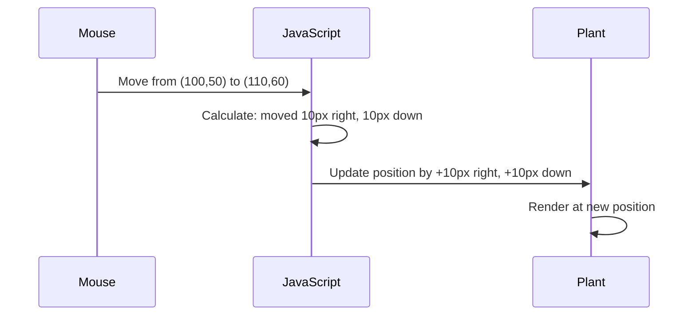

<!--
CO_OP_TRANSLATOR_METADATA:
{
  "original_hash": "bc93f6285423033ebf5b8abeb5282888",
  "translation_date": "2025-10-22T17:46:56+00:00",
  "source_file": "3-terrarium/3-intro-to-DOM-and-closures/README.md",
  "language_code": "pa"
}
-->
# ਟੈਰੀਅਰਿਅਮ ਪ੍ਰੋਜੈਕਟ ਭਾਗ 3: DOM ਮੈਨਿਪੂਲੇਸ਼ਨ ਅਤੇ ਜਾਵਾਸਕ੍ਰਿਪਟ ਕਲੋਜ਼ਰਜ਼


> ਸਕੈਚਨੋਟ [Tomomi Imura](https://twitter.com/girlie_mac) ਦੁਆਰਾ

ਵੈੱਬ ਡਿਵੈਲਪਮੈਂਟ ਦੇ ਸਭ ਤੋਂ ਰੁਚਿਕਰ ਪਹਲੂਆਂ ਵਿੱਚ ਤੁਹਾਡਾ ਸਵਾਗਤ ਹੈ - ਚੀਜ਼ਾਂ ਨੂੰ ਇੰਟਰਐਕਟਿਵ ਬਣਾਉਣਾ! ਡੌਕਯੂਮੈਂਟ ਓਬਜੈਕਟ ਮਾਡਲ (DOM) ਤੁਹਾਡੇ HTML ਅਤੇ ਜਾਵਾਸਕ੍ਰਿਪਟ ਦੇ ਵਿਚਕਾਰ ਇੱਕ ਪੁਲ ਵਾਂਗ ਹੈ, ਅਤੇ ਅੱਜ ਅਸੀਂ ਇਸਨੂੰ ਤੁਹਾਡੇ ਟੈਰੀਅਰਿਅਮ ਨੂੰ ਜ਼ਿੰਦਾ ਕਰਨ ਲਈ ਵਰਤਾਂਗੇ। ਜਦੋਂ ਟਿਮ ਬਰਨਰਜ਼-ਲੀ ਨੇ ਪਹਿਲਾ ਵੈੱਬ ਬ੍ਰਾਊਜ਼ਰ ਬਣਾਇਆ, ਉਸਨੇ ਇੱਕ ਵੈੱਬ ਦੀ ਕਲਪਨਾ ਕੀਤੀ ਸੀ ਜਿੱਥੇ ਡੌਕਯੂਮੈਂਟ ਡਾਇਨਾਮਿਕ ਅਤੇ ਇੰਟਰਐਕਟਿਵ ਹੋ ਸਕਦੇ ਹਨ - DOM ਉਸ ਦ੍ਰਿਸ਼ਟੀਕੋਣ ਨੂੰ ਸੰਭਵ ਬਣਾਉਂਦਾ ਹੈ।

ਅਸੀਂ ਜਾਵਾਸਕ੍ਰਿਪਟ ਕਲੋਜ਼ਰਜ਼ ਦੀ ਵੀ ਖੋਜ ਕਰਾਂਗੇ, ਜੋ ਸ਼ੁਰੂ ਵਿੱਚ ਡਰਾਉਣੇ ਲੱਗ ਸਕਦੇ ਹਨ। ਕਲੋਜ਼ਰਜ਼ ਨੂੰ "ਯਾਦاشت ਦੀਆਂ ਜੇਬਾਂ" ਬਣਾਉਣ ਵਾਂਗ ਸੋਚੋ ਜਿੱਥੇ ਤੁਹਾਡੇ ਫੰਕਸ਼ਨ ਮਹੱਤਵਪੂਰਨ ਜਾਣਕਾਰੀ ਨੂੰ ਯਾਦ ਰੱਖ ਸਕਦੇ ਹਨ। ਇਹ ਕੁਝ ਇਸ ਤਰ੍ਹਾਂ ਹੈ ਕਿ ਤੁਹਾਡੇ ਟੈਰੀਅਰਿਅਮ ਵਿੱਚ ਹਰ ਪੌਦੇ ਦਾ ਆਪਣਾ ਡਾਟਾ ਰਿਕਾਰਡ ਹੋਵੇਗਾ ਜੋ ਇਸਦੀ ਸਥਿਤੀ ਨੂੰ ਟ੍ਰੈਕ ਕਰੇਗਾ। ਇਸ ਪਾਠ ਦੇ ਅੰਤ ਤੱਕ, ਤੁਸੀਂ ਸਮਝ ਜਾਵੋਗੇ ਕਿ ਇਹ ਕਿੰਨੇ ਕੁਦਰਤੀ ਅਤੇ ਲਾਭਦਾਇਕ ਹਨ।

ਇਹ ਹੈ ਜੋ ਅਸੀਂ ਬਣਾਉਣ ਜਾ ਰਹੇ ਹਾਂ: ਇੱਕ ਟੈਰੀਅਰਿਅਮ ਜਿੱਥੇ ਯੂਜ਼ਰ ਪੌਦਿਆਂ ਨੂੰ ਕਿਤੇ ਵੀ ਖਿੱਚ ਕੇ ਰੱਖ ਸਕਦੇ ਹਨ। ਤੁਸੀਂ DOM ਮੈਨਿਪੂਲੇਸ਼ਨ ਤਕਨੀਕਾਂ ਨੂੰ ਸਿੱਖੋਗੇ ਜੋ ਡ੍ਰੈਗ-ਐਂਡ-ਡ੍ਰੌਪ ਫਾਈਲ ਅੱਪਲੋਡ ਤੋਂ ਲੈ ਕੇ ਇੰਟਰਐਕਟਿਵ ਗੇਮਾਂ ਤੱਕ ਸਭ ਕੁਝ ਸੰਭਾਲਦੇ ਹਨ। ਆਓ ਤੁਹਾਡੇ ਟੈਰੀਅਰਿਅਮ ਨੂੰ ਜ਼ਿੰਦਾ ਕਰੀਏ।

## ਪਾਠ ਤੋਂ ਪਹਿਲਾਂ ਕਵਿਜ਼

[ਪਾਠ ਤੋਂ ਪਹਿਲਾਂ ਕਵਿਜ਼](https://ff-quizzes.netlify.app/web/quiz/19)

## DOM ਨੂੰ ਸਮਝਣਾ: ਇੰਟਰਐਕਟਿਵ ਵੈੱਬ ਪੇਜਾਂ ਲਈ ਤੁਹਾਡਾ ਗੇਟਵੇ

ਡੌਕਯੂਮੈਂਟ ਓਬਜੈਕਟ ਮਾਡਲ (DOM) ਉਹ ਹੈ ਜਿਵੇਂ ਜਾਵਾਸਕ੍ਰਿਪਟ ਤੁਹਾਡੇ HTML ਐਲੀਮੈਂਟਸ ਨਾਲ ਸੰਚਾਰ ਕਰਦਾ ਹੈ। ਜਦੋਂ ਤੁਹਾਡਾ ਬ੍ਰਾਊਜ਼ਰ ਇੱਕ HTML ਪੇਜ ਨੂੰ ਲੋਡ ਕਰਦਾ ਹੈ, ਇਹ ਉਸ ਪੇਜ ਦੀ ਇੱਕ ਸੰਰਚਿਤ ਪ੍ਰਤੀਨਿਧਤਾ ਨੂੰ ਯਾਦاشت ਵਿੱਚ ਬਣਾਉਂਦਾ ਹੈ - ਇਹ DOM ਹੈ। ਇਸਨੂੰ ਇੱਕ ਪਰਿਵਾਰਕ ਦਰੱਖਤ ਵਾਂਗ ਸੋਚੋ ਜਿੱਥੇ ਹਰ HTML ਐਲੀਮੈਂਟ ਇੱਕ ਪਰਿਵਾਰਕ ਮੈਂਬਰ ਹੈ ਜਿਸਨੂੰ ਜਾਵਾਸਕ੍ਰਿਪਟ ਪਹੁੰਚ, ਸੋਧ, ਜਾਂ ਦੁਬਾਰਾ ਵਿਵਸਥਿਤ ਕਰ ਸਕਦਾ ਹੈ।

DOM ਮੈਨਿਪੂਲੇਸ਼ਨ ਸਥਿਰ ਪੇਜਾਂ ਨੂੰ ਇੰਟਰਐਕਟਿਵ ਵੈੱਬਸਾਈਟਾਂ ਵਿੱਚ ਬਦਲ ਦਿੰਦਾ ਹੈ। ਹਰ ਵਾਰ ਜਦੋਂ ਤੁਸੀਂ ਇੱਕ ਬਟਨ ਨੂੰ ਹਵਰ ਕਰਨ 'ਤੇ ਰੰਗ ਬਦਲਦੇ ਵੇਖਦੇ ਹੋ, ਪੇਜ ਰੀਫ੍ਰੈਸ਼ ਤੋਂ ਬਿਨਾਂ ਸਮੱਗਰੀ ਅੱਪਡੇਟ ਹੁੰਦੀ ਹੈ, ਜਾਂ ਐਲੀਮੈਂਟਸ ਨੂੰ ਤੁਸੀਂ ਖਿੱਚ ਸਕਦੇ ਹੋ, ਇਹ DOM ਮੈਨਿਪੂਲੇਸ਼ਨ ਦਾ ਕੰਮ ਹੈ।


> DOM ਅਤੇ HTML ਮਾਰਕਅੱਪ ਦੀ ਇੱਕ ਪ੍ਰਤੀਨਿਧਤਾ ਜੋ ਇਸਨੂੰ ਦਰਸਾਉਂਦੀ ਹੈ। [Olfa Nasraoui](https://www.researchgate.net/publication/221417012_Profile-Based_Focused_Crawler_for_Social_Media-Sharing_Websites) ਤੋਂ

**ਇਹ ਹੈ ਜੋ DOM ਨੂੰ ਸ਼ਕਤੀਸ਼ਾਲੀ ਬਣਾਉਂਦਾ ਹੈ:**
- **ਪ੍ਰਦਾਨ ਕਰਦਾ ਹੈ** ਤੁਹਾਡੇ ਪੇਜ ਦੇ ਕਿਸੇ ਵੀ ਐਲੀਮੈਂਟ ਨੂੰ ਪਹੁੰਚ ਕਰਨ ਦਾ ਇੱਕ ਸੰਰਚਿਤ ਤਰੀਕਾ
- **ਸਮਰੱਥ ਬਣਾਉਂਦਾ ਹੈ** ਪੇਜ ਰੀਫ੍ਰੈਸ਼ ਤੋਂ ਬਿਨਾਂ ਡਾਇਨਾਮਿਕ ਸਮੱਗਰੀ ਅੱਪਡੇਟ
- **ਅਨੁਮਤੀ ਦਿੰਦਾ ਹੈ** ਯੂਜ਼ਰ ਇੰਟਰਐਕਸ਼ਨ ਜਿਵੇਂ ਕਿ ਕਲਿਕ ਅਤੇ ਡ੍ਰੈਗਸ ਲਈ ਰੀਅਲ-ਟਾਈਮ ਪ੍ਰਤੀਕ੍ਰਿਆ
- **ਨਿਰਮਾਣ ਕਰਦਾ ਹੈ** ਆਧੁਨਿਕ ਇੰਟਰਐਕਟਿਵ ਵੈੱਬ ਐਪਲੀਕੇਸ਼ਨਜ਼ ਲਈ ਅਧਾਰ

## ਜਾਵਾਸਕ੍ਰਿਪਟ ਕਲੋਜ਼ਰਜ਼: ਸੰਗਠਿਤ, ਸ਼ਕਤੀਸ਼ਾਲੀ ਕੋਡ ਬਣਾਉਣਾ

ਇੱਕ [ਜਾਵਾਸਕ੍ਰਿਪਟ ਕਲੋਜ਼ਰ](https://developer.mozilla.org/docs/Web/JavaScript/Closures) ਇਸ ਤਰ੍ਹਾਂ ਹੈ ਜਿਵੇਂ ਕਿ ਇੱਕ ਫੰਕਸ਼ਨ ਨੂੰ ਆਪਣਾ ਨਿੱਜੀ ਵਰਕਸਪੇਸ ਮਿਲਦਾ ਹੈ ਜਿਸ ਵਿੱਚ ਯਾਦاشت ਸਥਿਰ ਰਹਿੰਦੀ ਹੈ। ਸੋਚੋ ਕਿ ਕਿਵੇਂ ਗੈਲਾਪਾਗੋਸ ਟਾਪੂਆਂ 'ਤੇ ਡਾਰਵਿਨ ਦੇ ਫਿੰਚਜ਼ ਨੇ ਆਪਣੇ ਖਾਸ ਵਾਤਾਵਰਣ ਦੇ ਅਧਾਰ 'ਤੇ ਵਿਸ਼ੇਸ਼ ਚੋਚਾਂ ਵਿਕਸਿਤ ਕੀਤੀਆਂ - ਕਲੋਜ਼ਰਜ਼ ਇਸੇ ਤਰ੍ਹਾਂ ਕੰਮ ਕਰਦੇ ਹਨ, ਵਿਸ਼ੇਸ਼ ਫੰਕਸ਼ਨ ਬਣਾਉਂਦੇ ਹਨ ਜੋ ਆਪਣੇ ਖਾਸ ਸੰਦਰਭ ਨੂੰ "ਯਾਦ" ਰੱਖਦੇ ਹਨ।

ਸਾਡੇ ਟੈਰੀਅਰਿਅਮ ਵਿੱਚ, ਕਲੋਜ਼ਰਜ਼ ਹਰ ਪੌਦੇ ਨੂੰ ਆਪਣੀ ਸਥਿਤੀ ਨੂੰ ਅਜ਼ਾਦੀ ਨਾਲ ਯਾਦ ਰੱਖਣ ਵਿੱਚ ਮਦਦ ਕਰਦੇ ਹਨ। ਇਹ ਪੈਟਰਨ ਪੇਸ਼ੇਵਰ ਜਾਵਾਸਕ੍ਰਿਪਟ ਵਿਕਾਸ ਵਿੱਚ ਹਰ ਜਗ੍ਹਾ ਦਿਖਾਈ ਦਿੰਦਾ ਹੈ, ਜਿਸ ਨਾਲ ਇਹ ਸਮਝਣ ਲਈ ਇੱਕ ਕੀਮਤੀ ਧਾਰਨਾ ਬਣ ਜਾਂਦੀ ਹੈ।

> 💡 **ਕਲੋਜ਼ਰਜ਼ ਨੂੰ ਸਮਝਣਾ**: ਜਾਵਾਸਕ੍ਰਿਪਟ ਵਿੱਚ ਕਲੋਜ਼ਰਜ਼ ਇੱਕ ਮਹੱਤਵਪੂਰਨ ਵਿਸ਼ਾ ਹਨ, ਅਤੇ ਕਈ ਡਿਵੈਲਪਰ ਇਸਨੂੰ ਸਾਲਾਂ ਤੱਕ ਵਰਤਦੇ ਹਨ ਬਿਨਾਂ ਇਸਦੇ ਸਾਰੇ ਸਿਧਾਂਤਕ ਪਹਲੂਆਂ ਨੂੰ ਪੂਰੀ ਤਰ੍ਹਾਂ ਸਮਝਣ ਦੇ। ਅੱਜ, ਅਸੀਂ ਵਿਵਹਾਰਕ ਅਰਜ਼ੀ 'ਤੇ ਧਿਆਨ ਦੇ ਰਹੇ ਹਾਂ - ਤੁਸੀਂ ਦੇਖੋਗੇ ਕਿ ਕਲੋਜ਼ਰਜ਼ ਕੁਦਰਤੀ ਤੌਰ 'ਤੇ ਉਭਰਦੇ ਹਨ ਜਦੋਂ ਅਸੀਂ ਆਪਣੇ ਇੰਟਰਐਕਟਿਵ ਫੀਚਰ ਬਣਾਉਂਦੇ ਹਾਂ। ਸਮਝਦਾਰੀ ਵਿਕਸਿਤ ਹੋਵੇਗੀ ਜਦੋਂ ਤੁਸੀਂ ਦੇਖੋਗੇ ਕਿ ਇਹ ਅਸਲ ਸਮੱਸਿਆਵਾਂ ਨੂੰ ਕਿਵੇਂ ਹੱਲ ਕਰਦੇ ਹਨ।


> DOM ਅਤੇ HTML ਮਾਰਕਅੱਪ ਦੀ ਇੱਕ ਪ੍ਰਤੀਨਿਧਤਾ ਜੋ ਇਸਨੂੰ ਦਰਸਾਉਂਦੀ ਹੈ। [Olfa Nasraoui](https://www.researchgate.net/publication/221417012_Profile-Based_Focused_Crawler_for_Social_Media-Sharing_Websites) ਤੋਂ

ਇਸ ਪਾਠ ਵਿੱਚ, ਅਸੀਂ ਆਪਣੇ ਇੰਟਰਐਕਟਿਵ ਟੈਰੀਅਰਿਅਮ ਪ੍ਰੋਜੈਕਟ ਨੂੰ ਪੂਰਾ ਕਰਾਂਗੇ ਜਾਵਾਸਕ੍ਰਿਪਟ ਬਣਾਉਣ ਦੁਆਰਾ ਜੋ ਯੂਜ਼ਰ ਨੂੰ ਪੇਜ 'ਤੇ ਪੌਦਿਆਂ ਨੂੰ ਮੈਨਿਪੂਲੇਟ ਕਰਨ ਦੀ ਅਨੁਮਤੀ ਦੇਵੇਗਾ।

## ਸ਼ੁਰੂ ਕਰਨ ਤੋਂ ਪਹਿਲਾਂ: ਸਫਲਤਾ ਲਈ ਸੈਟਅੱਪ

ਤੁਹਾਨੂੰ ਪਿਛਲੇ ਟੈਰੀਅਰਿਅਮ ਪਾਠਾਂ ਤੋਂ ਆਪਣੇ HTML ਅਤੇ CSS ਫਾਈਲਾਂ ਦੀ ਜ਼ਰੂਰਤ ਹੋਵੇਗੀ - ਅਸੀਂ ਉਸ ਸਥਿਰ ਡਿਜ਼ਾਈਨ ਨੂੰ ਇੰਟਰਐਕਟਿਵ ਬਣਾਉਣ ਜਾ ਰਹੇ ਹਾਂ। ਜੇ ਤੁਸੀਂ ਪਹਿਲੀ ਵਾਰ ਸ਼ਾਮਲ ਹੋ ਰਹੇ ਹੋ, ਉਹ ਪਾਠ ਪਹਿਲਾਂ ਪੂਰੇ ਕਰਨ ਨਾਲ ਮਹੱਤਵਪੂਰਨ ਸੰਦਰਭ ਪ੍ਰਦਾਨ ਹੋਵੇਗਾ।

ਇਹ ਹੈ ਜੋ ਅਸੀਂ ਬਣਾਉਣ ਜਾ ਰਹੇ ਹਾਂ:
- **ਸਮਰੂਥ ਡ੍ਰੈਗ-ਐਂਡ-ਡ੍ਰੌਪ** ਸਾਰੇ ਟੈਰੀਅਰਿਅਮ ਪੌਦਿਆਂ ਲਈ
- **ਕੋਆਰਡੀਨੇਟ ਟ੍ਰੈਕਿੰਗ** ਤਾਂ ਜੋ ਪੌਦੇ ਆਪਣੀਆਂ ਸਥਿਤੀਆਂ ਨੂੰ ਯਾਦ ਰੱਖਣ
- **ਪੂਰੀ ਇੰਟਰਐਕਟਿਵ ਇੰਟਰਫੇਸ** ਵੈਨਿਲਾ ਜਾਵਾਸਕ੍ਰਿਪਟ ਦੀ ਵਰਤੋਂ ਕਰਕੇ
- **ਸਾਫ਼, ਸੰਗਠਿਤ ਕੋਡ** ਕਲੋਜ਼ਰ ਪੈਟਰਨ ਦੀ ਵਰਤੋਂ ਕਰਕੇ

## ਆਪਣੀ ਜਾਵਾਸਕ੍ਰਿਪਟ ਫਾਈਲ ਸੈਟਅੱਪ ਕਰਨਾ

ਆਓ ਜਾਵਾਸਕ੍ਰਿਪਟ ਫਾਈਲ ਬਣਾਈਏ ਜੋ ਤੁਹਾਡੇ ਟੈਰੀਅਰਿਅਮ ਨੂੰ ਇੰਟਰਐਕਟਿਵ ਬਣਾਏਗੀ।

**ਪਦਮ 1: ਆਪਣੀ ਸਕ੍ਰਿਪਟ ਫਾਈਲ ਬਣਾਓ**

ਆਪਣੇ ਟੈਰੀਅਰਿਅਮ ਫੋਲਡਰ ਵਿੱਚ, `script.js` ਨਾਮ ਦੀ ਇੱਕ ਨਵੀਂ ਫਾਈਲ ਬਣਾਓ।

**ਪਦਮ 2: ਜਾਵਾਸਕ੍ਰਿਪਟ ਨੂੰ ਆਪਣੇ HTML ਨਾਲ ਜੋੜੋ**

ਇਹ ਸਕ੍ਰਿਪਟ ਟੈਗ ਨੂੰ ਆਪਣੇ `index.html` ਫਾਈਲ ਦੇ `<head>` ਸੈਕਸ਼ਨ ਵਿੱਚ ਸ਼ਾਮਲ ਕਰੋ:

```html
<script src="./script.js" defer></script>
```

**ਕਿਉਂ `defer` ਐਟ੍ਰਿਬਿਊਟ ਮਹੱਤਵਪੂਰਨ ਹੈ:**
- **ਸੁਨਿਸ਼ਚਿਤ ਕਰਦਾ ਹੈ** ਕਿ ਤੁਹਾਡਾ ਜਾਵਾਸਕ੍ਰਿਪਟ ਸਾਰੇ HTML ਲੋਡ ਹੋਣ ਤੱਕ ਉਡੀਕ ਕਰਦਾ ਹੈ
- **ਰੋਕਦਾ ਹੈ** ਉਹ ਗਲਤੀਆਂ ਜਿੱਥੇ ਜਾਵਾਸਕ੍ਰਿਪਟ ਐਲੀਮੈਂਟਸ ਦੀ ਖੋਜ ਕਰਨ ਦੀ ਕੋਸ਼ਿਸ਼ ਕਰਦਾ ਹੈ ਜੋ ਅਜੇ ਤਿਆਰ ਨਹੀਂ ਹਨ
- **ਗਰੰਟੀ ਦਿੰਦਾ ਹੈ** ਕਿ ਤੁਹਾਡੇ ਸਾਰੇ ਪੌਦੇ ਦੇ ਐਲੀਮੈਂਟਸ ਇੰਟਰਐਕਸ਼ਨ ਲਈ ਉਪਲਬਧ ਹਨ
- **ਬਿਹਤਰ ਪ੍ਰਦਰਸ਼ਨ ਪ੍ਰਦਾਨ ਕਰਦਾ ਹੈ** ਪੇਜ ਦੇ ਤਲ 'ਤੇ ਸਕ੍ਰਿਪਟਸ ਰੱਖਣ ਦੇ ਮੁਕਾਬਲੇ

> ⚠️ **ਮਹੱਤਵਪੂਰਨ ਨੋਟ**: `defer` ਐਟ੍ਰਿਬਿਊਟ ਆਮ ਸਮੇਂ ਦੇ ਮੁੱਦਿਆਂ ਨੂੰ ਰੋਕਦਾ ਹੈ। ਇਸਦੇ ਬਿਨਾਂ, ਜਾਵਾਸਕ੍ਰਿਪਟ HTML ਐਲੀਮੈਂਟਸ ਨੂੰ ਪਹੁੰਚ ਕਰਨ ਦੀ ਕੋਸ਼ਿਸ਼ ਕਰ ਸਕਦਾ ਹੈ ਜਦੋਂ ਉਹ ਲੋਡ ਨਹੀਂ ਹੋਏ ਹੁੰਦੇ, ਜਿਸ ਨਾਲ ਗਲਤੀਆਂ ਹੁੰਦੀਆਂ ਹਨ।

---

## ਜਾਵਾਸਕ੍ਰਿਪਟ ਨੂੰ ਤੁਹਾਡੇ HTML ਐਲੀਮੈਂਟਸ ਨਾਲ ਜੋੜਨਾ

ਜਦੋਂ ਤੱਕ ਅਸੀਂ ਐਲੀਮੈਂਟਸ ਨੂੰ ਡ੍ਰੈਗ ਕਰਨ ਯੋਗ ਨਹੀਂ ਬਣਾਉਂਦੇ, ਜਾਵਾਸਕ੍ਰਿਪਟ ਨੂੰ DOM ਵਿੱਚ ਉਨ੍ਹਾਂ ਨੂੰ ਲੱਭਣ ਦੀ ਜ਼ਰੂਰਤ ਹੈ। ਇਸਨੂੰ ਇੱਕ ਲਾਇਬ੍ਰੇਰੀ ਕੈਟਾਲਾਗਿੰਗ ਸਿਸਟਮ ਵਾਂਗ ਸੋਚੋ - ਜਦੋਂ ਤੁਹਾਡੇ ਕੋਲ ਕੈਟਾਲਾਗ ਨੰਬਰ ਹੁੰਦਾ ਹੈ, ਤੁਸੀਂ ਸਹੀ ਤੌਰ 'ਤੇ ਉਹ ਕਿਤਾਬ ਲੱਭ ਸਕਦੇ ਹੋ ਜਿਸਦੀ ਤੁਹਾਨੂੰ ਲੋੜ ਹੈ ਅਤੇ ਇਸਦੇ ਸਾਰੇ ਸਮੱਗਰੀ ਨੂੰ ਪਹੁੰਚ ਸਕਦੇ ਹੋ।

ਅਸੀਂ `document.getElementById()` ਵਿਧੀ ਦੀ ਵਰਤੋਂ ਕਰਾਂਗੇ ਇਹ ਕਨੈਕਸ਼ਨ ਬਣਾਉਣ ਲਈ। ਇਹ ਇੱਕ ਸਹੀ ਫਾਈਲਿੰਗ ਸਿਸਟਮ ਹੋਣ ਵਾਂਗ ਹੈ - ਤੁਸੀਂ ਇੱਕ ID ਪ੍ਰਦਾਨ ਕਰਦੇ ਹੋ, ਅਤੇ ਇਹ ਸਹੀ ਤੌਰ 'ਤੇ ਉਹ ਐਲੀਮੈਂਟ ਲੱਭਦਾ ਹੈ ਜਿਸਦੀ ਤੁਹਾਨੂੰ ਤੁਹਾਡੇ HTML ਵਿੱਚ ਲੋੜ ਹੈ।

### ਸਾਰੇ ਪੌਦਿਆਂ ਲਈ ਡ੍ਰੈਗ ਫੰਕਸ਼ਨਾਲਿਟੀ ਨੂੰ ਯੋਗ ਬਣਾਉਣਾ

ਇਹ ਕੋਡ ਆਪਣੇ `script.js` ਫਾਈਲ ਵਿੱਚ ਸ਼ਾਮਲ ਕਰੋ:

```javascript
// Enable drag functionality for all 14 plants
dragElement(document.getElementById('plant1'));
dragElement(document.getElementById('plant2'));
dragElement(document.getElementById('plant3'));
dragElement(document.getElementById('plant4'));
dragElement(document.getElementById('plant5'));
dragElement(document.getElementById('plant6'));
dragElement(document.getElementById('plant7'));
dragElement(document.getElementById('plant8'));
dragElement(document.getElementById('plant9'));
dragElement(document.getElementById('plant10'));
dragElement(document.getElementById('plant11'));
dragElement(document.getElementById('plant12'));
dragElement(document.getElementById('plant13'));
dragElement(document.getElementById('plant14'));
```

**ਇਹ ਕੋਡ ਕੀ ਹਾਸਲ ਕਰਦਾ ਹੈ:**
- **DOM ਵਿੱਚ** ਹਰ ਪੌਦੇ ਦੇ ਐਲੀਮੈਂਟ ਨੂੰ ਇਸਦੇ ਵਿਸ਼ੇਸ਼ ID ਦੀ ਵਰਤੋਂ ਕਰਕੇ ਲੱਭਦਾ ਹੈ
- **ਹਰ HTML ਐਲੀਮੈਂਟ ਲਈ** ਇੱਕ ਜਾਵਾਸਕ੍ਰਿਪਟ ਰਿਫਰੈਂਸ ਪ੍ਰਾਪਤ ਕਰਦਾ ਹੈ
- **ਹਰ ਐਲੀਮੈਂਟ ਨੂੰ** `dragElement` ਫੰਕਸ਼ਨ (ਜਿਸਨੂੰ ਅਸੀਂ ਅਗਲੇ ਪਦਮ ਵਿੱਚ ਬਣਾਉਣ ਜਾ ਰਹੇ ਹਾਂ) ਵਿੱਚ ਭੇਜਦਾ ਹੈ
- **ਹਰ ਪੌਦੇ ਨੂੰ** ਡ੍ਰੈਗ-ਐਂਡ-ਡ੍ਰੌਪ ਇੰਟਰਐਕਸ਼ਨ ਲਈ ਤਿਆਰ ਕਰਦਾ ਹੈ
- **ਤੁਹਾਡੇ HTML ਸਟ੍ਰਕਚਰ ਨੂੰ** ਜਾਵਾਸਕ੍ਰਿਪਟ ਫੰਕਸ਼ਨਾਲਿਟੀ ਨਾਲ ਜੋੜਦਾ ਹੈ

> 🎯 **ਕਿਉਂ ID ਦੀ ਵਰਤੋਂ ਕਰਦੇ ਹੋ ਕਲਾਸਾਂ ਦੀ ਬਜਾਏ?** ID ਵਿਸ਼ੇਸ਼ ਐਲੀਮੈਂਟਸ ਲਈ ਵਿਸ਼ੇਸ਼ ਪਛਾਣਕਰਤਾ ਪ੍ਰਦਾਨ ਕਰਦੇ ਹਨ, ਜਦਕਿ CSS ਕਲਾਸਾਂ ਗਰੁੱਪਾਂ ਦੇ ਐਲੀਮੈਂਟਸ ਨੂੰ ਸਜਾਉਣ ਲਈ ਬਣਾਈਆਂ ਗਈਆਂ ਹਨ। ਜਦੋਂ ਜਾਵਾਸਕ੍ਰਿਪਟ ਨੂੰ ਵਿਅਕਤੀਗਤ ਐਲੀਮੈਂਟਸ ਨੂੰ ਮੈਨਿਪੂਲੇਟ ਕਰਨ ਦੀ ਲੋੜ ਹੁੰਦੀ ਹੈ, ID ਸਾਨੂੰ ਲੋੜੀਂਦੀ ਸਹੀਤਾ ਅਤੇ ਪ੍ਰਦਰਸ਼ਨ ਪ੍ਰਦਾਨ ਕਰਦੇ ਹਨ।

> 💡 **ਪ੍ਰੋ ਟਿਪ**: ਧਿਆਨ ਦਿਓ ਕਿ ਅਸੀਂ ਹਰ ਪੌਦੇ ਲਈ ਅਲੱਗ-ਅਲੱਗ `dragElement()` ਨੂੰ ਕਾਲ ਕਰ ਰਹੇ ਹਾਂ। ਇਹ ਪਹੁੰਚ ਇਹ ਯਕੀਨੀ ਬਣਾਉਂਦੀ ਹੈ ਕਿ ਹਰ ਪੌਦੇ ਨੂੰ ਆਪਣਾ ਅਜ਼ਾਦ ਡ੍ਰੈਗਿੰਗ ਵਿਵਹਾਰ ਮਿਲਦਾ ਹੈ, ਜੋ ਸਹੀ ਯੂਜ਼ਰ ਇੰਟਰਐਕਸ਼ਨ ਲਈ ਮਹੱਤਵਪੂਰਨ ਹੈ।

---

## ਡ੍ਰੈਗ ਐਲੀਮੈਂਟ ਕਲੋਜ਼ਰ ਬਣਾਉਣਾ

ਹੁਣ ਅਸੀਂ ਆਪਣੀ ਡ੍ਰੈਗਿੰਗ ਫੰਕਸ਼ਨਾਲਿਟੀ ਦੇ ਕੇਂਦਰ ਨੂੰ ਬਣਾਉਣ ਜਾ ਰਹੇ ਹਾਂ: ਇੱਕ ਕਲੋਜ਼ਰ ਜੋ ਹਰ ਪੌਦੇ ਲਈ ਡ੍ਰੈਗਿੰਗ ਵਿਵਹਾਰ ਨੂੰ ਸੰਭਾਲਦਾ ਹੈ।
- **`pos3` ਅਤੇ `pos4`**: ਅਗਲੇ ਗਣਨਾ ਲਈ ਮੌਜੂਦਾ ਮਾਊਸ ਦੀ ਸਥਿਤੀ ਸਟੋਰ ਕਰੋ  
- **`offsetTop` ਅਤੇ `offsetLeft`**: ਪੇਜ 'ਤੇ ਤੱਤ ਦੀ ਮੌਜੂਦਾ ਸਥਿਤੀ ਪ੍ਰਾਪਤ ਕਰੋ  
- **ਘਟਾਉਣ ਦੀ ਤਰਕ**: ਤੱਤ ਨੂੰ ਉਨ੍ਹਾਂ ਹੀ ਮਾਤਰਾ ਨਾਲ ਹਿਲਾਓ ਜਿੰਨੀ ਮਾਊਸ ਹਿਲਿਆ  

**ਇੱਥੇ ਮੂਵਮੈਂਟ ਗਣਨਾ ਦਾ ਵਿਸਥਾਰ ਹੈ:**  
1. ਪੁਰਾਣੀ ਅਤੇ ਨਵੀਂ ਮਾਊਸ ਸਥਿਤੀਆਂ ਦੇ ਵਿਚਕਾਰ ਅੰਤਰ **ਮਾਪੋ**  
2. ਮਾਊਸ ਦੀ ਹਿਲਾਵਟ ਦੇ ਅਧਾਰ 'ਤੇ ਤੱਤ ਨੂੰ ਕਿੰਨਾ ਹਿਲਾਉਣਾ ਹੈ **ਗਣਨਾ ਕਰੋ**  
3. ਤੱਤ ਦੇ CSS ਸਥਿਤੀ ਦੇ ਗੁਣਾਂ ਨੂੰ ਰੀਅਲ-ਟਾਈਮ ਵਿੱਚ **ਅੱਪਡੇਟ ਕਰੋ**  
4. ਅਗਲੇ ਮੂਵਮੈਂਟ ਗਣਨਾ ਲਈ ਨਵੀਂ ਸਥਿਤੀ ਨੂੰ **ਸਟੋਰ ਕਰੋ**  

### ਗਣਿਤ ਦੀ ਦ੍ਰਿਸ਼ਟੀਕੋਣ ਦੀ ਦ੍ਰਿਸ਼ਟੀਕੋਣ


  
### stopElementDrag ਫੰਕਸ਼ਨ: ਸਾਫ਼-ਸੁਥਰਾ ਕਰਨਾ  

`elementDrag` ਦੇ ਬੰਦ ਕਰਨ ਵਾਲੇ ਕਰਲੀ ਬ੍ਰੈਕਟ ਤੋਂ ਬਾਅਦ ਸਾਫ਼-ਸੁਥਰਾ ਕਰਨ ਵਾਲਾ ਫੰਕਸ਼ਨ ਸ਼ਾਮਲ ਕਰੋ:  

```javascript
function stopElementDrag() {
    // Remove the document-level event listeners
    document.onpointerup = null;
    document.onpointermove = null;
}
```
  
**ਸਾਫ਼-ਸੁਥਰਾ ਕਰਨਾ ਕਿਉਂ ਜ਼ਰੂਰੀ ਹੈ:**  
- **ਰੋਕਦਾ ਹੈ** ਯਾਦاشت ਲੀਕ ਨੂੰ ਜੋ ਲੰਬੇ ਸਮੇਂ ਤੱਕ ਇਵੈਂਟ ਲਿਸਨਰਾਂ ਦੇ ਕਾਰਨ ਹੁੰਦੀ ਹੈ  
- **ਰੋਕਦਾ ਹੈ** ਡ੍ਰੈਗਿੰਗ ਵਿਹਾਰ ਨੂੰ ਜਦੋਂ ਯੂਜ਼ਰ ਪੌਦੇ ਨੂੰ ਛੱਡਦਾ ਹੈ  
- **ਇਜਾਜ਼ਤ ਦਿੰਦਾ ਹੈ** ਹੋਰ ਤੱਤਾਂ ਨੂੰ ਅਜ਼ਾਦੀ ਨਾਲ ਡ੍ਰੈਗ ਕਰਨ ਲਈ  
- **ਸਿਸਟਮ ਨੂੰ ਰੀਸੈਟ ਕਰਦਾ ਹੈ** ਅਗਲੇ ਡ੍ਰੈਗ ਓਪਰੇਸ਼ਨ ਲਈ  

**ਸਾਫ਼-ਸੁਥਰਾ ਕਰਨ ਤੋਂ ਬਿਨਾਂ ਕੀ ਹੁੰਦਾ ਹੈ:**  
- ਇਵੈਂਟ ਲਿਸਨਰ ਡ੍ਰੈਗਿੰਗ ਰੁਕਣ ਤੋਂ ਬਾਅਦ ਵੀ ਚੱਲਦੇ ਰਹਿੰਦੇ ਹਨ  
- ਜਦੋਂ ਬੇਕਾਰ ਲਿਸਨਰਾਂ ਇਕੱਠੇ ਹੁੰਦੇ ਹਨ ਤਾਂ ਪ੍ਰਦਰਸ਼ਨ ਖਰਾਬ ਹੁੰਦਾ ਹੈ  
- ਹੋਰ ਤੱਤਾਂ ਨਾਲ ਸੰਚਾਰ ਕਰਨ 'ਤੇ ਅਣਪ੍ਰਤੀਕਰਮਾਤਮਕ ਵਿਹਾਰ  
- ਬ੍ਰਾਊਜ਼ਰ ਦੇ ਸਰੋਤਾਂ ਨੂੰ ਬੇਵਜ੍ਹਾ ਇਵੈਂਟ ਹੈਂਡਲਿੰਗ 'ਤੇ ਖਰਚਿਆ ਜਾਂਦਾ ਹੈ  

### CSS ਸਥਿਤੀ ਦੇ ਗੁਣਾਂ ਨੂੰ ਸਮਝਣਾ  

ਸਾਡੇ ਡ੍ਰੈਗਿੰਗ ਸਿਸਟਮ ਦੋ ਮੁੱਖ CSS ਗੁਣਾਂ ਨੂੰ ਮੈਨਿਪੁਲੇਟ ਕਰਦਾ ਹੈ:  

| ਗੁਣ | ਇਹ ਕੀ ਕੰਟਰੋਲ ਕਰਦਾ ਹੈ | ਅਸੀਂ ਇਸਨੂੰ ਕਿਵੇਂ ਵਰਤਦੇ ਹਾਂ |  
|----------|------------------|---------------|  
| `top` | ਉੱਪਰਲੇ ਕਿਨਾਰੇ ਤੋਂ ਦੂਰੀ | ਡ੍ਰੈਗ ਦੌਰਾਨ ਲੰਬਕਾਰੀ ਸਥਿਤੀ |  
| `left` | ਖੱਬੇ ਕਿਨਾਰੇ ਤੋਂ ਦੂਰੀ | ਡ੍ਰੈਗ ਦੌਰਾਨ ਆੜ੍ਹਤੀ ਸਥਿਤੀ |  

**offset ਗੁਣਾਂ ਬਾਰੇ ਮੁੱਖ ਜਾਣਕਾਰੀ:**  
- **`offsetTop`**: ਸਥਿਤੀ ਵਾਲੇ ਪੇਰੈਂਟ ਤੱਤ ਦੇ ਉੱਪਰ ਤੋਂ ਮੌਜੂਦਾ ਦੂਰੀ  
- **`offsetLeft`**: ਸਥਿਤੀ ਵਾਲੇ ਪੇਰੈਂਟ ਤੱਤ ਦੇ ਖੱਬੇ ਤੋਂ ਮੌਜੂਦਾ ਦੂਰੀ  
- **ਸਥਿਤੀ ਸੰਦਰਭ**: ਇਹ ਮੁੱਲ ਸਭ ਤੋਂ ਨੇੜਲੇ ਸਥਿਤੀ ਵਾਲੇ ਪੂਰਵਜ ਦੇ ਸਬੰਧ ਵਿੱਚ ਹੁੰਦੇ ਹਨ  
- **ਰੀਅਲ-ਟਾਈਮ ਅੱਪਡੇਟ**: ਜਦੋਂ ਅਸੀਂ CSS ਗੁਣਾਂ ਨੂੰ ਬਦਲਦੇ ਹਾਂ ਤਾਂ ਤੁਰੰਤ ਬਦਲ ਜਾਂਦੇ ਹਨ  

> 🎯 **ਡਿਜ਼ਾਈਨ ਫਿਲਾਸਫੀ**: ਇਹ ਡ੍ਰੈਗ ਸਿਸਟਮ ਜਾਣ ਬੁੱਝ ਕੇ ਲਚਕਦਾਰ ਹੈ – ਕੋਈ "ਡ੍ਰਾਪ ਜ਼ੋਨ" ਜਾਂ ਪਾਬੰਦੀਆਂ ਨਹੀਂ ਹਨ। ਯੂਜ਼ਰ ਪੌਦਿਆਂ ਨੂੰ ਕਿਤੇ ਵੀ ਰੱਖ ਸਕਦੇ ਹਨ, ਜੋ ਉਨ੍ਹਾਂ ਨੂੰ ਆਪਣੇ ਟੈਰੀਰੀਅਮ ਡਿਜ਼ਾਈਨ 'ਤੇ ਪੂਰੀ ਰਚਨਾਤਮਕ ਨਿਯੰਤਰਣ ਦਿੰਦਾ ਹੈ।  

## ਸਾਰਾ ਕੁਝ ਇਕੱਠਾ ਕਰਨਾ: ਤੁਹਾਡਾ ਪੂਰਾ ਡ੍ਰੈਗ ਸਿਸਟਮ  

ਵਧਾਈ ਹੋਵੇ! ਤੁਸੀਂ ਵੈਨਿਲਾ ਜਾਵਾਸਕ੍ਰਿਪਟ ਦੀ ਵਰਤੋਂ ਕਰਕੇ ਇੱਕ ਸੁਧਾਰਸ਼ੀਲ ਡ੍ਰੈਗ-ਐਂਡ-ਡ੍ਰਾਪ ਸਿਸਟਮ ਬਣਾਇਆ ਹੈ। ਤੁਹਾਡਾ ਪੂਰਾ `dragElement` ਫੰਕਸ਼ਨ ਹੁਣ ਇੱਕ ਸ਼ਕਤੀਸ਼ਾਲੀ ਕਲੋਜ਼ਰ ਸ਼ਾਮਲ ਕਰਦਾ ਹੈ ਜੋ ਪ੍ਰਬੰਧਿਤ ਕਰਦਾ ਹੈ:  

**ਤੁਹਾਡਾ ਕਲੋਜ਼ਰ ਕੀ ਕਰਦਾ ਹੈ:**  
- **ਪ੍ਰਾਈਵੇਟ ਸਥਿਤੀ ਦੇ ਵੈਰੀਏਬਲਾਂ ਨੂੰ** ਹਰ ਪੌਦੇ ਲਈ ਅਜ਼ਾਦੀ ਨਾਲ ਰੱਖਦਾ ਹੈ  
- **ਪੂਰੇ ਡ੍ਰੈਗ ਲਾਈਫਸਾਈਕਲ ਨੂੰ** ਸ਼ੁਰੂ ਤੋਂ ਅੰਤ ਤੱਕ ਸੰਭਾਲਦਾ ਹੈ  
- **ਸਮੂਹ, ਪ੍ਰਤੀਕਰਮਾਤਮਕ ਹਿਲਾਵਟ** ਪੂਰੇ ਸਕ੍ਰੀਨ ਵਿੱਚ ਪ੍ਰਦਾਨ ਕਰਦਾ ਹੈ  
- **ਸਰੋਤਾਂ ਨੂੰ ਠੀਕ ਤਰੀਕੇ ਨਾਲ ਸਾਫ਼ ਕਰਦਾ ਹੈ** ਤਾਂ ਜੋ ਯਾਦਾਸ਼ਤ ਲੀਕ ਨਾ ਹੋਵੇ  
- **ਇਕ ਬੁੱਧੀਮਾਨ, ਰਚਨਾਤਮਕ ਇੰਟਰਫੇਸ ਬਣਾਉਂਦਾ ਹੈ** ਟੈਰੀਰੀਅਮ ਡਿਜ਼ਾਈਨ ਲਈ  

### ਤੁਹਾਡੇ ਇੰਟਰਐਕਟਿਵ ਟੈਰੀਰੀਅਮ ਦੀ ਜਾਂਚ  

ਹੁਣ ਆਪਣੇ ਇੰਟਰਐਕਟਿਵ ਟੈਰੀਰੀਅਮ ਦੀ ਜਾਂਚ ਕਰੋ! ਆਪਣੇ `index.html` ਫਾਈਲ ਨੂੰ ਵੈਬ ਬ੍ਰਾਊਜ਼ਰ ਵਿੱਚ ਖੋਲ੍ਹੋ ਅਤੇ ਫੰਕਸ਼ਨਲਿਟੀ ਦੀ ਕੋਸ਼ਿਸ਼ ਕਰੋ:  

1. **ਕਲਿੱਕ ਅਤੇ ਰੱਖੋ** ਕਿਸੇ ਵੀ ਪੌਦੇ ਨੂੰ ਡ੍ਰੈਗਿੰਗ ਸ਼ੁਰੂ ਕਰਨ ਲਈ  
2. **ਆਪਣੇ ਮਾਊਸ ਜਾਂ ਉਂਗਲ ਨੂੰ ਹਿਲਾਓ** ਅਤੇ ਦੇਖੋ ਕਿ ਪੌਦਾ ਹੌਲੀ-ਹੌਲੀ ਪਿੱਛੇ ਆ ਰਿਹਾ ਹੈ  
3. **ਛੱਡੋ** ਪੌਦੇ ਨੂੰ ਇਸ ਦੀ ਨਵੀਂ ਸਥਿਤੀ ਵਿੱਚ ਡ੍ਰਾਪ ਕਰਨ ਲਈ  
4. **ਵੱਖ-ਵੱਖ ਵਿਵਸਥਾਵਾਂ ਨਾਲ ਅਨੁਭਵ ਕਰੋ** ਇੰਟਰਫੇਸ ਦੀ ਪੜਚੋਲ ਕਰਨ ਲਈ  

🥇 **ਸਫਲਤਾ**: ਤੁਸੀਂ ਇੱਕ ਪੂਰੀ ਤਰ੍ਹਾਂ ਇੰਟਰਐਕਟਿਵ ਵੈਬ ਐਪਲੀਕੇਸ਼ਨ ਬਣਾਈ ਹੈ ਜੋ ਉਹੀ ਮੁੱਖ ਧਾਰਨਾਵਾਂ ਵਰਤਦੀ ਹੈ ਜੋ ਪੇਸ਼ੇਵਰ ਡਿਵੈਲਪਰ ਹਰ ਰੋਜ਼ ਵਰਤਦੇ ਹਨ। ਇਹ ਡ੍ਰੈਗ-ਐਂਡ-ਡ੍ਰਾਪ ਫੰਕਸ਼ਨਲਿਟੀ ਉਹੀ ਤਰਕਾਂ ਨੂੰ ਵਰਤਦੀ ਹੈ ਜੋ ਫਾਈਲ ਅੱਪਲੋਡ, ਕੰਬਨ ਬੋਰਡ ਅਤੇ ਹੋਰ ਬਹੁਤ ਸਾਰੇ ਇੰਟਰਐਕਟਿਵ ਇੰਟਰਫੇਸ ਦੇ ਪਿੱਛੇ ਹਨ।  

  

---

## GitHub Copilot Agent Challenge 🚀  

Agent ਮੋਡ ਦੀ ਵਰਤੋਂ ਕਰਕੇ ਹੇਠਾਂ ਦਿੱਤੇ ਚੈਲੈਂਜ ਨੂੰ ਪੂਰਾ ਕਰੋ:  

**ਵੇਰਵਾ:** ਟੈਰੀਰੀਅਮ ਪ੍ਰੋਜੈਕਟ ਵਿੱਚ ਇੱਕ ਰੀਸੈਟ ਫੰਕਸ਼ਨਲਿਟੀ ਸ਼ਾਮਲ ਕਰੋ ਜੋ ਸਾਰੇ ਪੌਦਿਆਂ ਨੂੰ ਮੁਲਾਇਮ ਐਨੀਮੇਸ਼ਨ ਨਾਲ ਉਨ੍ਹਾਂ ਦੀ ਮੂਲ ਸਥਿਤੀ 'ਤੇ ਵਾਪਸ ਲੈ ਜਾਂਦਾ ਹੈ।  

**ਪ੍ਰੋੰਪਟ:** ਇੱਕ ਰੀਸੈਟ ਬਟਨ ਬਣਾਓ ਜੋ, ਕਲਿੱਕ ਕਰਨ 'ਤੇ, ਸਾਰੇ ਪੌਦਿਆਂ ਨੂੰ CSS ਟ੍ਰਾਂਜ਼ੀਸ਼ਨ ਦੀ ਵਰਤੋਂ ਕਰਕੇ 1 ਸਕਿੰਟ ਦੇ ਅੰਦਰ ਉਨ੍ਹਾਂ ਦੀ ਮੂਲ ਸਾਈਡਬਾਰ ਸਥਿਤੀ 'ਤੇ ਵਾਪਸ ਲੈ ਜਾਂਦਾ ਹੈ। ਫੰਕਸ਼ਨ ਨੂੰ ਪੇਜ ਲੋਡ ਹੋਣ 'ਤੇ ਮੂਲ ਸਥਿਤੀਆਂ ਸਟੋਰ ਕਰਨੀ ਚਾਹੀਦੀ ਹੈ ਅਤੇ ਜਦੋਂ ਰੀਸੈਟ ਬਟਨ ਦਬਾਇਆ ਜਾਂਦਾ ਹੈ ਤਾਂ ਪੌਦਿਆਂ ਨੂੰ ਮੁਲਾਇਮ ਤਰੀਕੇ ਨਾਲ ਉਨ੍ਹਾਂ ਸਥਿਤੀਆਂ 'ਤੇ ਵਾਪਸ ਲੈ ਜਾਣਾ ਚਾਹੀਦਾ ਹੈ।  

[agent mode](https://code.visualstudio.com/blogs/2025/02/24/introducing-copilot-agent-mode) ਬਾਰੇ ਹੋਰ ਜਾਣੋ।  

## 🚀 ਵਾਧੂ ਚੈਲੈਂਜ: ਆਪਣੇ ਹੁਨਰ ਨੂੰ ਵਧਾਓ  

ਤਿਆਰ ਹੋ ਆਪਣੇ ਟੈਰੀਰੀਅਮ ਨੂੰ ਅਗਲੇ ਪੱਧਰ 'ਤੇ ਲਿਜਾਣ ਲਈ? ਇਹ ਸੁਧਾਰ ਲਾਗੂ ਕਰਨ ਦੀ ਕੋਸ਼ਿਸ਼ ਕਰੋ:  

**ਰਚਨਾਤਮਕ ਵਾਧੇ:**  
- **ਡਬਲ-ਕਲਿੱਕ** ਕਰਕੇ ਪੌਦੇ ਨੂੰ ਅੱਗੇ ਲਿਆਉਣ ਲਈ (z-index ਮੈਨਿਪੁਲੇਸ਼ਨ)  
- **ਦ੍ਰਿਸ਼ਟੀਗਤ ਫੀਡਬੈਕ ਸ਼ਾਮਲ ਕਰੋ** ਜਿਵੇਂ ਕਿ ਪੌਦਿਆਂ 'ਤੇ ਹਵਰ ਕਰਨ 'ਤੇ ਹੌਲੀ ਰੌਸ਼ਨੀ  
- **ਸਰਹੱਦਾਂ ਲਾਗੂ ਕਰੋ** ਤਾਂ ਜੋ ਪੌਦੇ ਟੈਰੀਰੀਅਮ ਤੋਂ ਬਾਹਰ ਨਾ ਡ੍ਰੈਗ ਕੀਤੇ ਜਾ ਸਕਣ  
- **ਸੇਵ ਫੰਕਸ਼ਨ ਬਣਾਓ** ਜੋ ਪੌਦਿਆਂ ਦੀ ਸਥਿਤੀ ਨੂੰ localStorage ਦੀ ਵਰਤੋਂ ਕਰਕੇ ਯਾਦ ਰੱਖਦਾ ਹੈ  
- **ਧੁਨੀ ਪ੍ਰਭਾਵ ਸ਼ਾਮਲ ਕਰੋ** ਪੌਦਿਆਂ ਨੂੰ ਚੁੱਕਣ ਅਤੇ ਰੱਖਣ ਲਈ  

> 💡 **ਸਿੱਖਣ ਦਾ ਮੌਕਾ**: ਇਹਨਾਂ ਚੈਲੈਂਜਾਂ ਵਿੱਚੋਂ ਹਰ ਇੱਕ ਤੁਹਾਨੂੰ DOM ਮੈਨਿਪੁਲੇਸ਼ਨ, ਇਵੈਂਟ ਹੈਂਡਲਿੰਗ, ਅਤੇ ਯੂਜ਼ਰ ਅਨੁਭਵ ਡਿਜ਼ਾਈਨ ਦੇ ਨਵੇਂ ਪਹਲੂ ਸਿਖਾਏਗਾ।  

## ਪੋਸਟ-ਲੈਕਚਰ ਕਵਿਜ਼  

[Post-lecture quiz](https://ff-quizzes.netlify.app/web/quiz/20)  

## ਸਮੀਖਿਆ ਅਤੇ ਸਵੈ ਅਧਿਐਨ: ਆਪਣੀ ਸਮਝ ਨੂੰ ਗਹਿਰਾ ਕਰੋ  

ਤੁਸੀਂ DOM ਮੈਨਿਪੁਲੇਸ਼ਨ ਅਤੇ ਕਲੋਜ਼ਰਾਂ ਦੇ ਮੁੱਢਲੇ ਸਿਧਾਂਤਾਂ ਨੂੰ ਮਾਸਟਰ ਕਰ ਲਿਆ ਹੈ, ਪਰ ਹਮੇਸ਼ਾ ਹੋਰ ਖੋਜ ਕਰਨ ਲਈ ਕੁਝ ਹੁੰਦਾ ਹੈ! ਇੱਥੇ ਕੁਝ ਰਾਹ ਹਨ ਜੋ ਤੁਹਾਡੇ ਗਿਆਨ ਅਤੇ ਹੁਨਰ ਨੂੰ ਵਧਾਉਣ ਵਿੱਚ ਮਦਦ ਕਰ ਸਕਦੇ ਹਨ।  

### ਵੱਖਰੇ ਡ੍ਰੈਗ ਅਤੇ ਡ੍ਰਾਪ ਪਹੁੰਚਾਂ  

ਅਸੀਂ ਵੱਧ ਤੋਂ ਵੱਧ ਲਚਕਤਾ ਲਈ ਪੌਇੰਟਰ ਇਵੈਂਟ ਦੀ ਵਰਤੋਂ ਕੀਤੀ, ਪਰ ਵੈਬ ਡਿਵੈਲਪਮੈਂਟ ਕਈ ਪਹੁੰਚਾਂ ਦੀ ਪੇਸ਼ਕਸ਼ ਕਰਦਾ ਹੈ:  

| ਪਹੁੰਚ | ਕਿਸ ਲਈ ਸਭ ਤੋਂ ਵਧੀਆ | ਸਿੱਖਣ ਦੀ ਕੀਮਤ |  
|----------|----------|----------------|  
| [HTML Drag and Drop API](https://developer.mozilla.org/docs/Web/API/HTML_Drag_and_Drop_API) | ਫਾਈਲ ਅੱਪਲੋਡ, ਅਧਿਕਾਰਤ ਡ੍ਰੈਗ ਜ਼ੋਨ | ਬ੍ਰਾਊਜ਼ਰ ਦੀ ਮੂਲ ਸਮਰੱਥਾ ਨੂੰ ਸਮਝਣਾ |  
| [Touch Events](https://developer.mozilla.org/docs/Web/API/Touch_events) | ਮੋਬਾਈਲ-ਵਿਸ਼ੇਸ਼ ਸੰਚਾਰ | ਮੋਬਾਈਲ-ਪਹਿਲਾਂ ਵਿਕਾਸ ਪੈਟਰਨ |  
| CSS `transform` ਗੁਣ | ਮੁਲਾਇਮ ਐਨੀਮੇਸ਼ਨ | ਪ੍ਰਦਰਸ਼ਨ ਅਨੁਕੂਲਤਾ ਤਕਨੀਕਾਂ |  

### ਉੱਚ-ਸਤਹ DOM ਮੈਨਿਪੁਲੇਸ਼ਨ ਵਿਸ਼ੇ  

**ਤੁਹਾਡੇ ਸਿੱਖਣ ਯਾਤਰਾ ਵਿੱਚ ਅਗਲੇ ਕਦਮ:**  
- **ਇਵੈਂਟ ਡੈਲੀਗੇਸ਼ਨ**: ਕਈ ਤੱਤਾਂ ਲਈ ਇਵੈਂਟ ਨੂੰ ਕੁਸ਼ਲਤਾਪੂਰਵਕ ਸੰਭਾਲਣਾ  
- **Intersection Observer**: ਜਦੋਂ ਤੱਤ ਵਿਊਪੋਰਟ ਵਿੱਚ ਦਾਖਲ/ਬਾਹਰ ਹੁੰਦੇ ਹਨ ਤਾਂ ਪਤਾ ਲਗਾਉਣਾ  
- **Mutation Observer**: DOM ਸਟ੍ਰਕਚਰ ਵਿੱਚ ਬਦਲਾਅ ਦੇਖਣਾ  
- **Web Components**: ਦੁਬਾਰਾ ਵਰਤਣਯੋਗ, ਇਨਕੈਪਸੂਲੇਟ UI ਤੱਤ ਬਣਾਉਣਾ  
- **Virtual DOM concepts**: ਸਮਝਣਾ ਕਿ ਫਰੇਮਵਰਕ DOM ਅੱਪਡੇਟਾਂ ਨੂੰ ਕਿਵੇਂ ਅਨੁਕੂਲ ਕਰਦੇ ਹਨ  

### ਜਾਰੀ ਸਿੱਖਣ ਲਈ ਜ਼ਰੂਰੀ ਸਰੋਤ  

**ਤਕਨੀਕੀ ਦਸਤਾਵੇਜ਼:**  
- [MDN Pointer Events Guide](https://developer.mozilla.org/docs/Web/API/Pointer_events) - ਪੌਇੰਟਰ ਇਵੈਂਟ ਦਾ ਵਿਸਥਾਰਪੂਰਵਕ ਸੰਦਰਭ  
- [W3C Pointer Events Specification](https://www.w3.org/TR/pointerevents1/) - ਅਧਿਕਾਰਤ ਮਿਆਰ ਦਸਤਾਵੇਜ਼  
- [JavaScript Closures Deep Dive](https://developer.mozilla.org/docs/Web/JavaScript/Closures) - ਉੱਚ-ਸਤਹ ਕਲੋਜ਼ਰ ਪੈਟਰਨ  

**ਬ੍ਰਾਊਜ਼ਰ ਅਨੁਕੂਲਤਾ:**  
- [CanIUse.com](https://caniuse.com/) - ਫੀਚਰ ਸਹਾਇਤਾ ਨੂੰ ਬ੍ਰਾਊਜ਼ਰਾਂ ਵਿੱਚ ਚੈੱਕ ਕਰੋ  
- [MDN Browser Compatibility Data](https://github.com/mdn/browser-compat-data) - ਵਿਸਥਾਰਪੂਰਵਕ ਅਨੁਕੂਲਤਾ ਜਾਣਕਾਰੀ  

**ਅਭਿਆਸ ਦੇ ਮੌਕੇ:**  
- **ਬਣਾਓ** ਇੱਕ ਪਜ਼ਲ ਗੇਮ ਜੋ ਇਸੇ ਡ੍ਰੈਗ ਮਕੈਨਿਕਸ ਦੀ ਵਰਤੋਂ ਕਰਦਾ ਹੈ  
- **ਬਣਾਓ** ਇੱਕ ਕੰਬਨ ਬੋਰਡ ਡ੍ਰੈਗ-ਐਂਡ-ਡ੍ਰਾਪ ਟਾਸਕ ਮੈਨੇਜਮੈਂਟ ਨਾਲ  
- **ਡਿਜ਼ਾਈਨ ਕਰੋ** ਇੱਕ ਇਮੇਜ ਗੈਲਰੀ ਡ੍ਰੈਗ ਕਰਨ ਵਾਲੇ ਫੋਟੋ ਵਿਵਸਥਾ ਨਾਲ  
- **ਅਨੁਭਵ ਕਰੋ** ਮੋਬਾਈਲ ਇੰਟਰਫੇਸ ਲਈ ਟਚ ਜੈਸਚਰਾਂ ਨਾਲ  

> 🎯 **ਸਿੱਖਣ ਦੀ ਰਣਨੀਤੀ**: ਇਹ ਧਾਰਨਾਵਾਂ ਨੂੰ ਮਜ਼ਬੂਤ ਕਰਨ ਦਾ ਸਭ ਤੋਂ ਵਧੀਆ ਤਰੀਕਾ ਅਭਿਆਸ ਹੈ। ਡ੍ਰੈਗ ਕਰਨ ਵਾਲੇ ਇੰਟਰਫੇਸਾਂ ਦੇ ਵੈਰੀਏਸ਼ਨ ਬਣਾਉਣ ਦੀ ਕੋਸ਼ਿਸ਼ ਕਰੋ – ਹਰ ਪ੍ਰੋਜੈਕਟ ਤੁਹਾਨੂੰ ਯੂਜ਼ਰ ਸੰਚਾਰ ਅਤੇ DOM ਮੈਨਿਪੁਲੇਸ਼ਨ ਬਾਰੇ ਕੁਝ ਨਵਾਂ ਸਿਖਾਏਗਾ।  

## ਅਸਾਈਨਮੈਂਟ  

[Work a bit more with the DOM](assignment.md)  

---

**ਅਸਵੀਕਰਤੀ**:  
ਇਹ ਦਸਤਾਵੇਜ਼ AI ਅਨੁਵਾਦ ਸੇਵਾ [Co-op Translator](https://github.com/Azure/co-op-translator) ਦੀ ਵਰਤੋਂ ਕਰਕੇ ਅਨੁਵਾਦ ਕੀਤਾ ਗਿਆ ਹੈ। ਜਦੋਂ ਕਿ ਅਸੀਂ ਸਹੀ ਹੋਣ ਦਾ ਯਤਨ ਕਰਦੇ ਹਾਂ, ਕਿਰਪਾ ਕਰਕੇ ਧਿਆਨ ਦਿਓ ਕਿ ਸਵੈਚਾਲਿਤ ਅਨੁਵਾਦਾਂ ਵਿੱਚ ਗਲਤੀਆਂ ਜਾਂ ਅਸੁਣੀਖਤਤਾਵਾਂ ਹੋ ਸਕਦੀਆਂ ਹਨ। ਮੂਲ ਦਸਤਾਵੇਜ਼ ਨੂੰ ਇਸਦੀ ਮੂਲ ਭਾਸ਼ਾ ਵਿੱਚ ਅਧਿਕਾਰਤ ਸਰੋਤ ਮੰਨਿਆ ਜਾਣਾ ਚਾਹੀਦਾ ਹੈ। ਮਹੱਤਵਪੂਰਨ ਜਾਣਕਾਰੀ ਲਈ, ਪੇਸ਼ੇਵਰ ਮਨੁੱਖੀ ਅਨੁਵਾਦ ਦੀ ਸਿਫਾਰਸ਼ ਕੀਤੀ ਜਾਂਦੀ ਹੈ। ਇਸ ਅਨੁਵਾਦ ਦੀ ਵਰਤੋਂ ਤੋਂ ਪੈਦਾ ਹੋਣ ਵਾਲੇ ਕਿਸੇ ਵੀ ਗਲਤਫਹਿਮੀ ਜਾਂ ਗਲਤ ਵਿਆਖਿਆ ਲਈ ਅਸੀਂ ਜ਼ਿੰਮੇਵਾਰ ਨਹੀਂ ਹਾਂ।